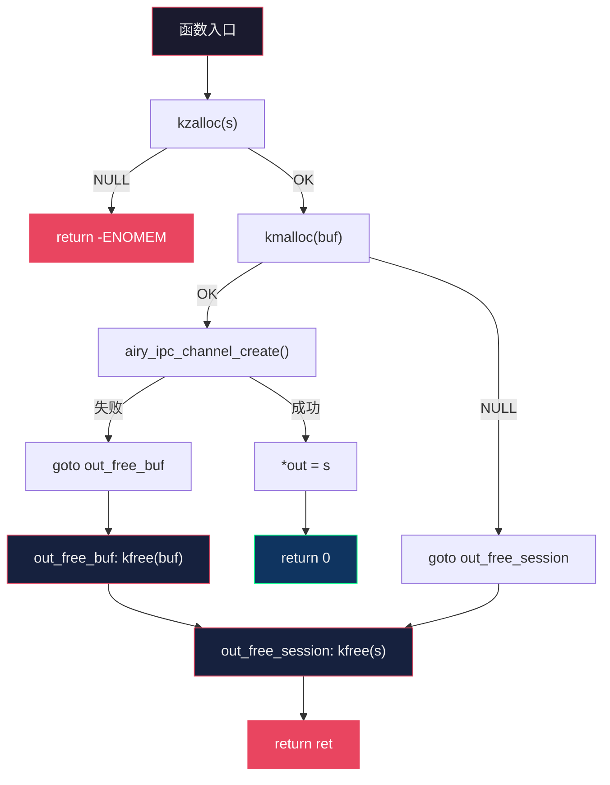
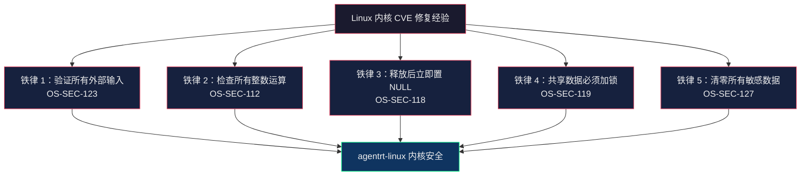

Copyright (c) 2025-2026 SPHARX Ltd. All Rights Reserved.

# C/C++ 编码风格规范
> **文档定位**：C 与 C++ 语言编码风格及安全编码规范合集（含 C 内核态风格、C 强化补充、C++ 风格、C/C++ 安全编码）\
> **文档版本**：0.1.1\
> **最后更新**： 2026-07-21\
> **上级文档**：[agentrt-linux（AirymaxOS）工程标准规范](README.md)

---

## Part I: agentrt-linux（AirymaxOS）C 语言编码风格规范

### 0. SSoT 对齐声明与编号映射

> **本节为 SSoT 对齐声明**。本文件 §2（格式规则）的历史编号与 SSoT 文件 `01-coding-standards.md Part II` 存在冲突。为消除编号歧义，下表给出权威映射；§2 正文中的历史编号仅作导航参考，**规则效力以 01-coding-standards.md Part II 为准**。

#### 0.1 格式规则映射（SSoT = 01-coding-standards.md Part II）

> **迁移说明（2026-07-12）**：原 02-code-format.md 已完成全量迁移，历史编号 OS-KER-003~021 / OS-STD-047 / OS-STD-202~211 统一为 OS-STD-FMT-NNN 子域编号。下表"SSoT 编号"列已更新为迁移后的目标编号。

| 本文件历史编号 | 规则内容 | SSoT 编号（01-coding-standards.md Part II OS-STD-FMT-NNN） |
|----------------|----------|----------------------------------------------|
| OS-KER-011 | Tab 8 字符缩进 | OS-STD-FMT-001 |
| OS-KER-012 | 80 列行宽 | OS-STD-FMT-002 |
| OS-KER-013 | K&R 大括号 | OS-STD-FMT-003（非函数开括号）+ OS-STD-FMT-009（函数开括号） |
| OS-KER-014 | 空格规则 | OS-STD-FMT-005（合并 5 条）+ OS-STD-FMT-006（指针声明） |

#### 0.2 语义规则映射（SSoT = 01-coding-standards.md）

§3-§6 已正确使用"复用"标注（如 `OS-STD-CODE-005（复用）`、`OS-STD-CODE-007 复用`），引用关系已建立。以下编号在 01 中已定义，本文件引用时不再重新定义：

| 本文件引用编号 | 规则内容 | 01 SSoT 位置 |
|----------------|----------|-------------|
| OS-STD-CODE-005 | airy_/airy_ 前缀 | §1.6（一致，无冲突） |
| OS-STD-CODE-030 | 函数返回值约定 | §1.5 |
| OS-STD-CODE-006 | 函数长度 | §2.1 |
| OS-STD-CODE-007 | 函数原型元素顺序 | §2.2 |
| OS-STD-CODE-008 | 参数命名 | §2.3 |
| OS-STD-CODE-010~013 | 注释规范 | §3.1-§3.4 |
| OS-STD-CODE-015~017 | 头文件规范 | §4.1-§4.3 |

#### 0.3 本文件保留的权威内容（无 SSoT 对应）

以下章节为 agentrt-linux 内核态 C 代码专属规范，01/02/03 不涉及，**本文件为唯一权威来源**：

| 章节 | 规则编号 | 内容 | 唯一性理由 |
|------|----------|------|-----------|
| §7 | OS-KER-001/004/224/225, OS-BAN-002 | 校验优先于修改、goto 集中出口、分级标签逆序释放、DEFINE_FREE 自动释放、禁 BUG() | 内核态错误处理范式，01 覆盖用户态 |
| §8 | OS-KER-016/017/018/222/223/227/228 | GFP 标志选型（含 NOWARN/ACCOUNT）、释放后置 NULL、krealloc 规范、内存毒化保护、kmemleak 标注、kmem_cache 选型、长循环抢占点 | 内核内存分配与安全专属 |
| §9 | OS-KER-019/020/046/053/226 | 锁选择、RCU、锁前置设计、共享数据同步、kref 释放回调 | 内核并发专属 |
| §10 | OS-KER-021/070 | [SC] 共享契约层 + [SS] 语义同源层编写规则 | IRON-9 v3 代码归属专属 |

---

### 1. 基础约定

#### 1.1 基于 Linux 内核编码风格

agentrt-linux（AirymaxOS）的 C 语言编码风格以 Linux 6.6 内核 `Documentation/process/coding-style.rst` 为基线。这不是简单的照搬，而是在 Linux 30 余年内核工程思想的基础上，针对 agentrt-linux（AirymaxOS）的智能体操作系统场景进行的定制化落地。

与 Linux 内核编码风格的关系：**基线对齐，扩展独立**。agentrt-linux（AirymaxOS）在基线基础上增加了以下专属规则：
- `airy_` / `airy_` 前缀隔离（OS-STD-CODE-005）
- IRON-9 v3 四层模型代码归属标注
- 五维正交 24 原则映射注释
- 内核模块 Rust 互操作 FFI 边界规范

#### 1.2 文档范围

本规范定义 agentrt-linux（AirymaxOS）**内核态 C 代码**的编码风格，涵盖：
- 缩进、空格、行宽（§2）
- 命名约定（§3）
- 函数定义规范（§4）
- 注释规范（§5）
- 头文件组织（§6）
- 错误处理规范（§7）
- 内存管理规范（§8）
- 锁与并发规范（§9）
- IRON-9 v3 [SC] 层代码编写规范（§10）

> **五维正交映射**：K-2 接口契约化、E-5 命名语义化、E-7 文档即代码、A-1 极简主义。

---

### 2. 缩进、空格与行宽

#### 2.1 缩进：Tab 8 字符（OS-STD-FMT-001）

> **OS-STD-FMT-001**（原 OS-KER-011，2026-07-12 对齐 SSoT）：缩进使用 Tab 字符，宽度为 8 个字符。这是 Linux 内核的传统选择，因为 8 字符缩进是"代码复杂度的自然惩罚"——如果你的代码嵌套超过 3 层，它本身就过于复杂，应该重构，而不是用窄缩进来藏匿。

```c
/* 正确：Tab 8 字符缩进 */
static int airy_sched_pick_next(struct airy_sched *sched)
{
        struct airy_task *task;

        spin_lock(&sched->lock);
        task = list_first_entry_or_null(&sched->ready_queue,
                                         struct airy_task, link);
        if (task)
                list_del_init(&task->link);
        spin_unlock(&sched->lock);

        return task ? task->id : -ENOENT;
}
```

#### 2.2 行宽限制：80 列（OS-STD-FMT-002）

> **OS-STD-FMT-002**（原 OS-KER-012，2026-07-12 对齐 SSoT）：代码行不得超过 80 列，注释行不得超过 72 列。80 列限制源于终端显示传统，但更重要的工程理由是：窄行宽强制函数拆分，且允许在分屏编辑器（如 3 列并排 diff）中完整阅读代码。

```c
/* 注释：最多 72 列，因为 80 列代码中注释通常缩进 8 列 */
/*
 * 当行宽超过 80 列时，将参数拆分到下一行，对齐到上一行参数的起始位置。
 * 这被称为"对齐到开括号"风格。
 */
static int airy_ipc_send_batch(struct airy_ipc_channel *chan,
                                  const struct airy_ipc_msg *msgs,
                                  size_t count, u32 flags);
```

#### 2.3 大括号风格：K&R（OS-STD-FMT-003 + OS-STD-FMT-009）

> **OS-STD-FMT-003 + OS-STD-FMT-009**（原 OS-KER-013，2026-07-12 对齐 SSoT）：函数左大括号另起一行（OS-STD-FMT-009）；`if`/`while`/`for`/`switch` 左大括号在同行末尾（OS-STD-FMT-003）。这是 Linux 内核统一的 K&R 风格。

```c
/* 函数：左大括号另起一行 */
static int airy_task_submit(struct airy_task *task)
{
        /* if：左大括号不另起一行 */
        if (task->state != AIRY_TASK_PENDING) {
                pr_warn("task %u already submitted\n", task->id);
                return -EBUSY;
        }

        /* do-while：左大括号在同行 */
        do {
                ret = airy_task_enqueue(task);
        } while (ret == -EAGAIN);
}
```

#### 2.4 空格规则（OS-STD-FMT-005 + OS-STD-FMT-006）

> **OS-STD-FMT-005 + OS-STD-FMT-006**（原 OS-KER-014，2026-07-12 对齐 SSoT）：关键字后加空格（`if (`、`while (`、`for (`、`switch (`）；函数名后不加空格（`airy_task_submit(task)`）；二元运算符两端加空格（`a + b`）；一元运算符不加空格（`!cond`、`*ptr`）；指针声明 `*` 贴名字不贴类型（OS-STD-FMT-006）。

```c
/* 正确 */
if (ret < 0)
        return ret;
ptr = kmalloc(sizeof(*ptr), GFP_KERNEL);
for (i = 0; i < count; i++)
        task[i].id = i;
```

---

### 3. 命名约定

#### 3.1 airy_ 前缀（OS-STD-CODE-005）

> **OS-STD-CODE-005**（复用）：`airy_*` 前缀保留给 agentrt 同源 API（[SS] 语义同源层）；`airy_*` 前缀用于 agentrt-linux（AirymaxOS）内核/发行版专属 API（[IND] 完全独立层）。两者共享 Airymax 同源语义，但前缀隔离确保无适配层互操作时不冲突。

```c
/* [SS] 语义同源层：与 agentrt 同源 API */
int airy_ipc_send(u32 chan, const void *msg, size_t len);
int airy_task_submit(struct airy_task *task);

/* [IND] 完全独立层：agentrt-linux（AirymaxOS）专属 API */
int airy_lsm_hook_register(const struct security_hook_list *hooks);
int airy_sched_class_register(struct sched_class *sc);
```

#### 3.2 snake_case 命名（OS-STD-CODE-031）

> **OS-STD-CODE-031**：函数名、变量名使用 `snake_case`（小写字母 + 下划线）。常量宏使用 `UPPER_SNAKE_CASE`（全大写 + 下划线）。结构体名使用 `snake_case`，但声明时使用 `struct` 关键字（不 typedef）。

```c
/* 函数名：snake_case */
int airy_ipc_channel_create(const char *name, struct airy_ipc_channel **out);

/* 常量宏：UPPER_SNAKE_CASE */
#define AIRY_MAX_TASKS         1024
#define AIRY_IPC_HDR_SIZE  128

/* 结构体：用 struct 关键字，不 typedef */
struct airy_task {
        u32    id;
        u32    parent_id;
        u8     priority;
        u8     state;
        u16    flags;
        u64    deadline_ns;
};

/* 枚举值：模块前缀 + UPPER_SNAKE_CASE */
enum airy_task_state {
        AIRY_TASK_PENDING   = 0,
        AIRY_TASK_RUNNING   = 1,
        AIRY_TASK_COMPLETED = 2,
        AIRY_TASK_FAILED    = 3,
};
```

#### 3.2.1 typedef 5 种例外条件（对齐 Linux 6.6 内核基线）

> **OS-STD-CODE-031a（补充）**：OS-STD-CODE-031 禁止结构体指针 typedef，但 Linux 6.6 内核基线允许下列 5 种例外。agentrt-linux 直接对齐此例外清单，其他情况一律禁止 typedef。

| 例外 | 示例 | 理由 |
|------|------|------|
| (1) 完全不透明类型（仅通过 accessor 函数访问） | `pid_t`、`atomic_t`、`spinlock_t` | 隐藏实现细节，便于未来重构 |
| (2) 固定位宽整数类型（明确表达位宽语义） | `u32`、`s64`、`__be32` | 替代 `unsigned int` 等模糊类型 |
| (3) `_t` 后缀的标准类型（C 标准 / Linux UAPI 已 typedef） | `size_t`、`ssize_t`、`uintptr_t` | 与 C 标准 / Linux UAPI 对齐 |
| (4) 类型别名提升可读性（极少，需子系统维护者审批） | `gfp_t`（GFP 标志位） | 表达"这是标志位而非普通整数"的语义 |
| (5) SPINLOCK 等伪类型（含锁对齐等隐藏属性） | `spinlock_t`、`seqlock_t` | 内核内部需要特殊对齐或属性 |

**永不 typedef**：

- 结构体指针：`struct airy_task *t`（好）vs `airy_task_t t`（坏）
- 普通结构体：`struct airy_ipc_msg msg`（好）vs `airy_ipc_msg_t msg`（坏）

参考 Linux 6.6 内核基线 `Documentation/process/coding-style.rst` §5（"structures should be referenced via pointers, not via typedefs"）。

#### 3.3 命名语义化（OS-STD-CODE-001 复用 + OS-STD-CODE-028 复用）

> **OS-STD-CODE-001（复用）** + **OS-STD-CODE-028（复用）**：全局符号必须描述性命名，禁止无意义缩写。局部变量短小精悍（循环计数器 `i`、临时指针 `tmp`、缓冲区 `buf`）。命名应让代码自解释，减少对注释的依赖。详见 01 §1.1 与 §1.2。

```c
/* 好：自解释 */
int count_active_tasks(void);
struct list_head *airy_sched_ready_queue(void);

/* 坏：无意义缩写 */
int cnt_act_tsk(void);
struct list_head *q(void);
```

#### 3.4 敏感术语禁用（OS-BAN-001 复用）

> **OS-BAN-001**：新增代码禁用 `master/slave`、`blacklist/whitelist`，替换为 `primary/secondary`、`denylist/allowlist`。仅当维护既有 UAPI 或对齐既有硬件/协议规范时例外。

---

### 4. 函数定义规范

#### 4.1 函数长度（OS-KER-015）

> **OS-KER-015**：函数一屏可读（≤80 列 × 24 行），局部变量 ≤ 5-10 个。超过此限制应拆分为 helper 函数。例外：长但简单的 `switch` 调度器（如大 `switch-case` 表驱动）可保留，因为分解的判据是复杂度而非行数。

```c
/* 好：简洁，一屏可读 */
static int airy_ipc_validate_msg(const struct airy_ipc_msg *msg)
{
        if (msg->len > AIRY_IPC_MSG_BODY_MAX)
                return -EMSGSIZE;
        if (!msg->body)
                return -EINVAL;
        return 0;
}

/* 坏：函数过长，应拆分 */
static int airy_ipc_handle_message(struct airy_ipc_channel *chan,
                                       struct airy_ipc_msg *msg)
{
        /* 200 行胶水逻辑，应拆分为多个 helper */
}
```

#### 4.2 函数原型元素顺序（OS-STD-CODE-007 复用）

函数原型元素固定顺序：`storage class → storage class attributes → return type → return type attributes → name → parameters → parameter attributes → behavior attributes`。

```c
__init void * __must_check
airy_ipc_channel_create(enum airy_ipc_type type, size_t cap,
                           u32 flags) __printf(2, 3) __malloc;
```

#### 4.3 参数命名（OS-STD-CODE-008 复用）

函数原型必须包含参数名——它是面向读者的廉价文档。

#### 4.4 函数返回值约定（OS-STD-CODE-030 复用）

动作式函数返回错误码（0 = 成功，-Exxx = 失败）；谓词式函数返回 `bool`。

```c
int  airy_task_submit(struct airy_task *task);   /* 动作式：0 / -EBUSY */
bool airy_task_is_pending(const struct airy_task *task); /* 谓词式 */
```

---

### 5. 注释规范

#### 5.1 注释原则（OS-STD-CODE-010 复用）

注释说明 WHAT 与 WHY，不说明 HOW。好代码自解释 HOW。函数头说明做什么、为什么这样做。

#### 5.2 kernel-doc 格式（OS-STD-CODE-012 复用）

所有公共 API（`EXPORT_SYMBOL*` 函数、公共结构体、公共宏）必须用 kernel-doc 注释。

```c
/**
 * airy_ipc_send() - 在指定通道上发送消息
 * @channel: 通道 ID，由 airy_ipc_channel_create() 返回
 * @msg:    消息体指针，长度不超过 AIRY_IPC_MSG_BODY_MAX
 * @len:    消息体字节数
 *
 * 阻塞发送，直到对端读取或超时。消息头由 AgentsIPC 128B 协议自动填充。
 * 此函数属于 [SS] 语义同源层——与 agentrt 用户态 airy_ipc_send() 签名一致（SDK 层，同一份源码两端编译）。
 *
 * Return: 0 成功；-EAGAIN 通道满；-EMSGSIZE 超长；-ETIMEDOUT 超时。
 *
 * @since: 0.1.1
 */
int airy_ipc_send(u32 channel, const void *msg, size_t len);
```

#### 5.3 数据结构注释（OS-STD-CODE-013 复用）

数据声明每行一个，留出注释空间。IRON-9 v3 层级归属必须标注。

```c
struct airy_task {
        u32    id;            /* 全局唯一任务 ID */
        u32    parent_id;     /* 父任务 ID，根任务为 0 */
        u8     priority;      /* 0=最低，255=最高 */
        u8     state;         /* enum airy_task_state */
        u16    flags;         /* AIRY_TASK_FLAG_* 位掩码 */
        u64    deadline_ns;   /* 绝对截止时间（纳秒） */
        /* [SS] 语义同源层：此结构体与 agentrt task_desc_t 语义等价 */
};
```

#### 5.4 多行注释风格（OS-STD-CODE-011 复用）

通用代码用通用风格（左列星号，首尾近空白行）；`net/` 与 `drivers/net/` 用 net 风格（与上游一致便于回填）。

---

### 6. 头文件组织

#### 6.1 include 顺序（OS-STD-CODE-016 复用）

include 顺序固定：系统头 → 架构头 → 本地头 → `#define CREATE_TRACE_POINTS` → trace events 头。

```c
#include <linux/module.h>
#include <linux/slab.h>
#include <linux/spinlock.h>
#include <asm/barrier.h>
#include "airy_internal.h"
#define CREATE_TRACE_POINTS
#include <trace/events/agentrt.h>
```

#### 6.2 显式声明原则（OS-STD-CODE-015 复用）

每个 `.c` 必须显式 `#include` 其直接依赖的头文件，不得依赖间接传递包含。

#### 6.3 include guard 规范（OS-STD-CODE-017 复用）

```c
#ifndef _AIRY_IPC_H
#define _AIRY_IPC_H
/* ... */
#endif /* _AIRY_IPC_H */
```

**守卫策略对齐 Linux 内核**（OS-IRON-010）：agentrt-linux 头文件守卫使用 `#ifndef _AIRY_*_H` 形式，与 Linux 6.6 内核基线保持一致，**不使用** seL4 的 `#pragma once` 方案。这不是技术选型讨论，而是工程取向对齐——`#ifndef` 具有更好的可移植性（GCC/Clang/ICC 全支持），且能避免 `#pragma once` 在 NFS/符号链接场景下的潜在歧义。

#### 6.4 IRON-9 v3 层级归属标注

头文件应在文件头部注释中标明其 IRON-9 v3 层级归属：

```c
/* IRON-9 v3: [SC] 共享契约层 — 此头文件与 agentrt 完全共享 */
#ifndef _AIRY_IPC_MSG_H
#define _AIRY_IPC_MSG_H
```

#### 6.5 编译期断言与函数属性（OS-KER-229）

> **OS-KER-229**：agentrt-linux 内核态代码必须充分利用编译期断言（`BUILD_BUG_ON()` / `static_assert` / `_Static_assert`）将不变式检测前移到编译阶段；对不会返回的函数（`halt`、`panic` 等致命路径）必须标注 `__noreturn` 属性，使编译器能进行更激进的优化与控制流分析。此规则源于 agentrt-linux 内核工程对"编译期可检测的缺陷不应延迟到运行期"原则的落实。

**编译期断言使用场景**：

```c
/* 结构体大小不变式——ABI 保护 */
BUILD_BUG_ON(AIRY_IPC_HDR_SIZE != 128);

/* 枚举值与位宽约束 */
static_assert(AIRY_MAX_AGENT_ID < 65536, "agent_id fits in u16");

/* 编译期常量关系约束 */
_Static_assert(sizeof(struct airy_task) <= PAGE_SIZE,
               "airy_task must fit in one page");
```

**`__noreturn` 属性使用规范**：

```c
/* 致命错误处理函数必须标注 __noreturn */
__noreturn void airy_panic(const char *fmt, ...);
__noreturn void airy_halt(void);

/* 调用 __noreturn 函数后不应有可达代码 */
if (unlikely(fatal_error)) {
        airy_panic("unrecoverable: %d\n", fatal_error);
        /* 编译器知晓此路径不可达，无需 return */
}
```

**强制规则**：

1. **结构体布局不变式**：依赖结构体大小、偏移、对齐的代码，必须在头文件或初始化函数中使用 `BUILD_BUG_ON()` 或 `static_assert` 编译期校验。
2. **枚举与位宽约束**：枚举值用于位域或固定位宽字段时，必须编译期校验上界。
3. **`__noreturn` 标注**：`airy_panic`、`airy_halt`、`do_exit` 等不会返回的函数必须声明为 `__noreturn`；调用这些函数后的代码路径编译器将正确消除"缺少 return"警告。
4. **头文件依赖最小化**：内核内部头文件不得依赖用户态接口头文件；`include/uapi/linux/airymax/` 下的 [SC] 共享契约层头文件必须保持最小依赖集，仅包含自身类型定义所需的头文件。
5. **UAPI 头文件编译器无关原则**（OS-IRON-016）：`include/uapi/linux/airymax/` 下的用户态接口头文件必须坚持 C11 标准，禁止使用 `__attribute__`、`__builtin_*`、`__asm__`、`__sync_*`、`__atomic_*`、`typeof` 等编译器扩展，以保证可被任意 C11 标准编译器（GCC/Clang/MSVC/ICC）消费。内核内部头文件（`include/uapi/linux/airymax/`）不受此约束（D-8 OLK 6.6 UAPI 路径对齐：UAPI 头文件物理宿主 `include/uapi/linux/airymax/`，内核内部头文件 `include/uapi/linux/airymax/`）。详见 [04-engineering-philosophy.md §2.4](../04-engineering-philosophy.md)。
6. **`unreachable()` 标注不可达路径**：调用 `__noreturn` 函数后的代码路径，或逻辑上不可达的 `default`/`case` 分支，必须使用 Linux 内核 `unreachable()` 宏（等价于 `__builtin_unreachable()`，定义于 `include/linux/compiler.h`）标注。`airy_panic()` 之后的代码若 `airy_panic()` 已声明为 `__noreturn`，编译器自动消除警告，无需额外 `unreachable()`；仅在未声明 `__noreturn` 的场景或 `switch` 默认分支需显式标注。
7. **位操作函数**：优先使用 Linux 内核位操作 API（`__builtin_clzl()` / `__builtin_ctzl()` / `__builtin_popcountl()` / `bitmap_*` 系列，定义于 `include/linux/bitops.h` / `include/asm-generic/bitops/`），不引入 seL4 `clzl()` / `ctzl()` / `popcountl()` 函数封装（违反 IRON-1 禁止新特性）。
8. **缓存行对齐 padding**：使用 Linux 内核 `____cacheline_aligned` / `__cacheline_aligned` / `CACHELINE_ALIGN` 等已有宏（定义于 `include/linux/cache.h`），不引入 seL4 `PAD_TO_NEXT_CACHE_LN()` 宏。
9. **分支预测提示**：热路径分支预测提示使用 Linux 内核 `likely()` / `unlikely()` 宏（定义于 `include/linux/compiler.h`），错误处理路径（`if (ret < 0)`、`if (IS_ERR(p))`）应使用 `unlikely()` 标注。不引入 seL4 风格的独立封装（seL4 `likely` / `unlikely` 与 Linux 同源，直接复用 Linux 宏避免命名空间冲突）。
10. **`offsetof()` 使用**：使用 Linux 内核 `offsetof()` 宏（定义于 `include/linux/stddef.h`，等价于 `__builtin_offsetof`），不引入 seL4 `OFFSETOF()` 封装。

**反向声明**（不引入的 seL4 模式）：

- **不引入 `unverified_compile_assert` 宏**：seL4 的 `unverified_compile_assert(name, expr)` 是为 C parser 形式化验证工具兼容性而存在的工程妥协——C parser 不支持 `_Static_assert()`，因此在验证构建时将此宏定义为空操作。agentrt-linux 的形式化验证路径（Isabelle/HOL + Rust Kani）不经过 C parser，因此**不引入此宏**，避免无谓复杂度（违反 IRON-1 禁止新特性）。所有编译期断言统一使用 `BUILD_BUG_ON()` / `static_assert` / `_Static_assert`。
- **不引入 seL4 `UL_CONST()` / `ULL_CONST()` 宏**：seL4 的 `UL_CONST(x)` / `ULL_CONST(x)` 是为微内核汇编启动路径设计的汇编/C 共享常量宏。agentrt-linux 作为 Linux 6.6 内核衍生工程，**直接复用** Linux 内核既有的 `_AC()` 宏（`include/uapi/linux/const.h`），不重新设计 seL4 模式。示例：`#define AIRY_PAGE_SIZE _AC(4096, UL)`。
- **不引入 seL4 `config_set()` / `config_ternary()` / `wrap_config_set()` 编译期配置检测宏**：seL4 的 `config_set(macro)` / `config_ternary(macro, true, false)` 是为微内核编译期配置检测设计的宏技巧，`wrap_config_set()` 是为 C parser 形式化验证兼容性而存在的防常量折叠包装。agentrt-linux **直接复用** Linux 内核既有的 `IS_ENABLED()` / `IS_BUILTIN()` / `IS_MODULE()` 宏（定义于 `include/linux/kconfig.h`），不引入 seL4 模式。理由：(1) Linux 宏已覆盖全部使用场景；(2) `wrap_config_set()` 是 C parser 妥协，agentrt-linux 不使用 C parser（违反 IRON-1 禁止新特性）。
- **不引入 seL4 属性宏命名空间**（`PACKED`/`NORETURN`/`CONST`/`PURE`/`ALIGN`/`FASTCALL`/`NO_INLINE`/`FORCE_INLINE`/`SECTION`/`UNUSED`/`USED`/`MAY_ALIAS`/`UNREACHABLE`/`OFFSETOF`）：seL4 在 `include/util.h` 定义了完整的属性宏体系，但 agentrt-linux **直接复用** Linux 内核 `include/linux/compiler_attributes.h` 的属性宏（`__packed` / `__noreturn` / `__pure` / `__aligned` / `__noinline` / `__always_inline` / `__section` 等），不引入 seL4 风格的属性宏命名空间。理由：避免双轨制命名空间冲突（违反 IRON-1 禁止新特性）。详见下方 §6.5.1 GCC 属性使用规范。

#### 6.5.1 GCC 属性使用规范（对齐 Linux 6.6 内核基线）

agentrt-linux 内核态代码直接复用 Linux 6.6 内核基线的 GCC 属性宏体系，定义于 `include/linux/compiler_attributes.h`（共 60+ 个属性宏）。本节列出常用属性的使用规范。

| 属性 | Linux 宏 | 用途 | 使用场景 |
|------|---------|------|---------|
| 不返回 | `__noreturn` | 函数不返回 | `airy_panic()`、`airy_halt()`、`do_exit()` |
| 紧凑结构体 | `__packed` | 取消结构体填充 | 协议头、寄存器映射 |
| 对齐 | `__aligned(n)` | 强制对齐 | 共享内存结构、缓存行对齐 |
| 初始化段 | `__init` | 仅初始化阶段使用 | `module_init()`、`airy_boot_init()` |
| 只读数据段 | `__read_mostly` | 频繁读取的变量 | 全局统计、配置开关 |
| 强制内联 | `__always_inline` | 强制内联 | 热路径 helper |
| 禁止内联 | `__noinline` | 禁止内联 | 调试函数、栈跟踪锚点 |
| 纯函数 | `__pure` | 无副作用，可 CSE | 查找函数、哈希函数 |
| const 函数 | `__attribute__((const))` | 完全无内存访问 | 纯计算函数 |
| 段放置 | `__section("name")` | 自定义段 | `__initdata`、`__percpu` |
| 冷路径 | `__cold` | 标记冷代码路径 | 错误处理、panic 路径 |
| 不可达 | `unreachable()` | 不可达声明 | `airy_panic()` 之后、`switch` 默认分支 |
| 偏移量 | `offsetof()` | 结构体成员偏移 | 容器模式、ABI 校验 |
| 位操作 | `__builtin_clzl()` 等 | 编译器内置位操作 | 优先级计算、bitmap 扫描 |

**禁止使用**：
- seL4 风格的属性宏命名空间（`PACKED`/`NORETURN`/`CONST`/`PURE`/`ALIGN`/`FASTCALL`/`NO_INLINE`/`FORCE_INLINE`/`SECTION`/`UNUSED`/`USED`/`MAY_ALIAS`）
- 自创属性宏命名空间（如 `AIRY_PACKED`、`AIRY_NORETURN`）

**理由**：直接复用 Linux 内核属性宏可避免双轨制命名空间冲突，且与 Linux 6.6 内核基线的 `sparse`/`checkpatch`/`clang-format` 工具链原生兼容。

#### 6.5.2 形式化验证注释规范（agentrt-linux 专属）

**不引入 seL4 形式化验证注释**：seL4 在源码中使用 `/** MODIFIES: */`、`/** DONT_TRANSLATE */`、`/** FNSPEC ... */` 等形式化验证辅助注释，服务于 Isabelle/HOL 的 l4v 工具链（C parser → Simpl → Isar）。agentrt-linux 的形式化验证路径与 seL4 不同——内核态使用 Isabelle/HOL 的 AutoCorres（不经过 C parser），Rust 子模块使用 Kani，因此**不引入 seL4 风格的形式化验证注释**。

**agentrt-linux 形式化验证注释规范**（1.0.1+ 阶段启用）：

| 验证工具 | 注释风格 | 适用范围 | 启用时机 |
|---------|---------|---------|---------|
| Isabelle/HOL (AutoCorres) | `/* @verified: autocorres <spec_file> */` | kernel 子仓 C 代码 | 1.0.1 M3 阶段 |
| Rust Kani | `#[kani::requires(...)]` / `#[kani::ensures(...)]` | cognition/cloudnative Rust 模块 | 1.0.1 M3 阶段 |
| 不验证 | （无注释） | 默认 | — |

**0.1.1 阶段约束**：0.1.1 阶段不引入形式化验证注释（IRON-1 禁止新特性），仅在 [09-known-caveats.md](../../10-architecture/09-known-caveats.md) §1.2 登记验证配置敏感性，待 1.0.1 M3 阶段启用。

**反向声明**（不引入的 seL4 模式）：

- **不引入 seL4 `MODIFIES` / `FNSPEC` / `DONT_TRANSLATE` 注释**：seL4 的形式化验证注释是 C parser 兼容性妥协——C parser 不支持完整 C 语法，需要手动标注"哪些函数可解析、哪些函数公理化"。agentrt-linux 使用 AutoCorres（支持完整 C 语法），不需要此类注释。
- **不引入 seL4 `compile_assert` 双层设计**：seL4 的 `compile_assert(name, expr)` 在 `CONFIG_VERIFICATION_BUILD` 时使用 typedef 技巧（因 C parser 不支持 `_Static_assert()`），否则使用 `_Static_assert`。agentrt-linux 统一使用 `BUILD_BUG_ON()` / `static_assert` / `_Static_assert`，不引入双层设计。

---

### 7. 错误处理规范

#### 7.0 校验优先于修改原则（OS-KER-225）

> **OS-KER-225**：任何可能产生副作用的函数（分配内存、修改全局状态、写寄存器），必须将所有输入校验、权限检查、边界检查置于所有副作用之前。违反此原则意味着校验失败时需要回滚已执行的副作用或泄漏已分配的资源。正确的做法是：先判断"能不能做"，再"去做"。此原则源于 seL4 微内核 `decodeUntypedInvocation()` 的工程实践——该函数在执行任何内存 Retype 操作之前，完成了全部 11 项校验（操作类型、cap 类型、FreeIndex 范围、大小边界、对齐、内核窗口边界、设备内存等），确保校验失败时零副作用、零资源泄漏。

**seL4 参考实现**（`src/object/untyped.c:26-231`，`decodeUntypedInvocation()`）：

```c
/* seL4 模式：所有校验在前，无任何副作用（ES-SEL4-05 工程思想，研究范围参考） */
static exception_t decodeUntypedInvocation(word_t invLabel, ...)
{
    /* 阶段 1：校验——纯读取，零副作用 */
    if (invLabel != UntypedRetype)                 // 校验 1: 操作类型
        return EXCEPTION_SYSCALL_ERROR;
    if (cap_get_capType(cap) != cap_untyped_cap)    // 校验 2: cap 类型
        return EXCEPTION_SYSCALL_ERROR;
    if (freeIndex >= MAX_FREE_INDEX(sizeBits))      // 校验 3: FreeIndex 范围
        return EXCEPTION_SYSCALL_ERROR;
    if (type > seL4_SchedContextObject)              // 校验 4: 对象类型
        return EXCEPTION_SYSCALL_ERROR;
    if (size_bits > seL4_MaxUntypedBits || ...)     // 校验 5-6: 大小边界
        return EXCEPTION_SYSCALL_ERROR;
    if (!IS_ALIGNED(pptr, size_bits))               // 校验 7: 对齐
        return EXCEPTION_SYSCALL_ERROR;
    /* ... 校验 8-11: 内核窗口、设备内存、子能力、总量 ... */

    /* 阶段 2：全部校验通过后，才执行修改 */
    invokeUntyped_Retype(...);  // 真正的副作用在这里
}
```

**agentrt-linux 落地规范**：

1. **两个阶段结构**：每个函数应明确分为"校验阶段"（无副作用）和"执行阶段"（有副作用）：

```c
/* 好：校验优先（OS-KER-225） */
int airy_cap_retype(struct airy_cap *src, u32 type, u32 size_bits)
{
        /* === 阶段 1：校验——纯读取，零副作用 === */
        if (cap_get_type(src) != CAP_UNTYPED)
                return -EINVAL;
        if (size_bits > MAX_SIZE_BITS || size_bits < MIN_SIZE_BITS)
                return -EINVAL;     /* 直接返回，无需清理 */
        if (!IS_ALIGNED(src->base, size_bits))
                return -EINVAL;
        if (src->free_index >= MAX_FREE_INDEX(size_bits))
                return -ENOSPC;     /* 资源不足，但仍无需清理 */

        /* === 阶段 2：全部校验通过，执行修改 === */
        return cap_do_retype(src, type, size_bits);
}

/* 坏：校验和修改交织，中间校验失败时前面的修改无法回滚 */
int bad_cap_retype(struct airy_cap *src, u32 type, u32 size_bits)
{
        cap_do_partial_write(src);  /* 副作用！ */
        if (size_bits > MAX_SIZE_BITS)
                return -EINVAL;     /* 前面已经写了，如何回滚？ */
        /* ... */
}
```

2. **校验阶段禁止的操作**：校验阶段不得执行以下任何副作用——
   - `kmalloc` / `kzalloc` / 任何内存分配（应在全部校验通过后分配）
   - 写全局变量、写设备寄存器
   - 获取锁（校验阶段不需要锁，因为不操作共享数据）
   - 注册到全局表、链表、IDR 等数据结构
   - 文件 I/O、网络 I/O

3. **校验失败直接返回错误码**：校验阶段的错误路径应直接 `return -EINVAL` / `-ENOSPC` / `-EPERM`，不需要 `goto` 清理标签（因为零副作用）：

```c
/* 校验阶段：直接返回，无需 goto（OS-KER-225 联合 OS-KER-001） */
if (ret < 0)
        return ret;           /* 校验失败：零副作用，无需清理 */
/* 执行阶段：需要 goto 清理 */
s = kzalloc(sizeof(*s), GFP_KERNEL);
if (!s)
        return -ENOMEM;
/* ... */
```

4. **与 goto 集中出口的分工**：校验优先于修改 + goto 集中出口 = 完整的错误处理策略：

```
函数入口
    │
    ▼
┌───────────────────┐
│   阶段 1：校验     │  ← OS-KER-225 校验优先
│   纯读取，零副作用  │     校验失败 → return -EINVAL / -ENOSPC
└───────┬───────────┘
        │ 全部校验通过
        ▼
┌───────────────────┐
│   阶段 2：执行     │  ← OS-KER-001 goto 集中出口
│   分配/修改/注册   │     OS-KER-004 分级标签逆序释放
└───────┬───────────┘
        │
        ▼
    return 0
```

**完整代码示例：seL4 风格内核对象分配与释放**

以下示例将 OS-KER-225（校验优先于修改）与 OS-KER-001（goto 集中出口）联合应用到 agentrt-linux 内核 Capability Retype 场景，展示"十一项校验在前、零副作用，一次分配在末、goto 逆序清理"的完整模式：

```c
/*
 * airy_untyped_retype - seL4 风格内核对象分配（OS-KER-225 + OS-KER-001 联合示例）
 * @ut_slot:     Untyped capability slot
 * @new_type:    创建的对象类型 (AIRY_OBJ_TCB / AIRY_OBJ_CNODE / AIRY_OBJ_FRAME / ...)
 * @size_bits:   对象大小（以 2 的幂表示）
 * @dest_root:   目标 CNode 根 slot
 * @dest_index:  目标 CNode 内起始索引
 * @dest_depth:  目标 CNode 查找深度 (0 = dest_root 本身)
 * @num_objects: 创建对象数量
 * @ret_slots:   输出：分配的 slot 指针数组
 *
 * | 阶段 | 规则                    | 副作用    | 失败处理              |
 * |------|------------------------|----------|---------------------|
 * | 1    | OS-KER-225 校验优先      | 无        | 直接 return -Exxx     |
 * | 2    | OS-KER-001 goto 集中出口 | 分配/写入  | goto out_* 逆序释放    |
 * | 3    | OS-KER-224 __free()     | 无        | 编译器自动 kfree(bufs) |
 *
 * Return: 0 成功；-Exxx 失败（校验阶段或分配阶段）
 */
int airy_untyped_retype(cte_t *ut_slot, u32 new_type, u32 size_bits,
                        cte_t *dest_root, u32 dest_index,
                        u32 dest_depth, u32 num_objects,
                        cte_t **ret_slots)
{
        cap_t ut_cap;
        u32 free_index;
        bool reset;
        size_t total_size;
        int ret = 0;

        /*
         * ============================================================
         * 阶段 1：校验——纯读取，零副作用（OS-KER-225）
         * 全部 11 项校验中任何一项失败，直接 return -Exxx
         * 此时尚未分配任何内存，零资源泄漏
         * ============================================================
         */

        /* 校验 1：操作合法性——cap 必须是 Untyped 类型 */
        ut_cap = ut_slot->cap;
        if (cap_get_type(ut_cap) != AIRY_CAP_UNTYPED) {
                log_write(LOG_ERROR, "airy_untyped_retype: not an untyped cap");
                return -EINVAL;
        }

        /* 校验 2：对象类型必须在合法范围内 */
        if (new_type >= AIRY_OBJ_TYPE_COUNT || new_type == AIRY_OBJ_NULL) {
                log_write(LOG_ERROR, "airy_untyped_retype: invalid type %u", new_type);
                return -EINVAL;
        }

        /* 校验 3：对象大小边界检查（溢出 + 上限） */
        if (size_bits >= BITS_PER_LONG ||
            size_bits > cap_untyped_get_max_bits(ut_cap)) {
                log_write(LOG_ERROR, "airy_untyped_retype: size_bits %u out of range",
                          size_bits);
                return -ERANGE;
        }

        /* 校验 4：CNode 最小大小（必须 >= 1 slot） */
        if (new_type == AIRY_OBJ_CNODE && size_bits < AIRY_MIN_CNODE_BITS) {
                log_write(LOG_ERROR, "airy_untyped_retype: CNode too small");
                return -EINVAL;
        }

        /* 校验 5：Untyped 对象最小大小（必须 >= 4 bits = 16 字节） */
        if (new_type == AIRY_OBJ_UNTYPED && size_bits < AIRY_MIN_UNTYPED_BITS) {
                log_write(LOG_ERROR, "airy_untyped_retype: Untyped too small");
                return -EINVAL;
        }

        /* 校验 6：目标 CNode 深度合法性 */
        if (dest_depth > AIRY_MAX_CNODE_DEPTH) {
                log_write(LOG_ERROR, "airy_untyped_retype: depth %u too large", dest_depth);
                return -EINVAL;
        }

        /* 校验 7：目标 CNode 查找（纯读取，不修改 CNode） */
        if (dest_depth > 0) {
                ret = cnode_lookup_slot(dest_root, dest_index, dest_depth, &dest_root);
                if (ret) {
                        log_write(LOG_ERROR, "airy_untyped_retype: destination lookup failed");
                        return ret; /* 校验失败直接返回，无副作用 */
                }
        }

        /* 校验 8：目标确实是 CNode */
        if (cap_get_type(dest_root->cap) != AIRY_CAP_CNODE) {
                log_write(LOG_ERROR, "airy_untyped_retype: destination is not a CNode");
                return -ENOTDIR;
        }

        /* 校验 9：窗口大小在合法范围且不越界 */
        if (num_objects == 0 || num_objects > AIRY_MAX_RETYPE_FANOUT) {
                log_write(LOG_ERROR, "airy_untyped_retype: num_objects %u out of range [1, %u]",
                          num_objects, AIRY_MAX_RETYPE_FANOUT);
                return -ERANGE;
        }

        /* 校验 10：目标 CNode 剩余 slot 是否足够 */
        {
                u32 node_size = cap_cnode_get_radix(dest_root->cap);
                if (dest_index + num_objects > node_size) {
                        log_write(LOG_ERROR, "airy_untyped_retype: destination window overflow");
                        return -ENOSPC;
                }
        }

        /* 校验 11：Untyped 是否有足够空间 */
        if (cap_untyped_get_free(ut_cap) + (num_objects * BIT(size_bits)) >
            cap_untyped_get_total(ut_cap)) {
                log_write(LOG_ERROR, "airy_untyped_retype: insufficient memory");
                return -ENOMEM;
        }

        /*
         * ============================================================
         * 阶段 2：执行——全部校验通过，开始分配和修改（OS-KER-001）
         * 此阶段从这一行起才产生副作用
         * ============================================================
         */

        /* 分配 slot 指针数组 */
        ret_slots[0] = NULL; /* 安全初始化 */

        /* __free() 自动释放临时缓冲区（OS-KER-224）——无需 goto 标签 */
        __free(kfree) void *zero_buf = kzalloc(num_objects * BIT(size_bits), GFP_KERNEL);
        if (!zero_buf)
                return -ENOMEM;

        /*
         * 重置或继承 FreeIndex
         * 如果 Untyped 没有子能力，可以重置 FreeIndex = 0（子能力全部删除后整块回收）
         * 否则从记录的 FreeIndex 继续分配（子能力还在使用中）
         */
        if (cap_untyped_has_children(ut_slot)) {
                free_index = cap_untyped_get_free_index(ut_cap);
                reset = false;
        } else {
                free_index = 0;
                reset = true;
        }

        /* 分配 CNode slot 并创建对象 */
        ret = cnode_alloc_slots(dest_root, dest_index, num_objects,
                                ut_slot, free_index, new_type, size_bits,
                                zero_buf, ret_slots);
        if (ret)
                return ret; /* 失败时 cnode_alloc_slots 已内部分批清理 */

        /* 更新 Untyped free index */
        cap_untyped_set_free_index(&ut_slot->cap, free_index + num_objects);

        return 0;
        /*
         * 说明：zero_buf 通过 __free(kfree) 在函数返回时自动释放 —— OS-KER-224
         * 本例中没有 goto 标签，因为：
         *   - 校验失败在阶段 1 直接 return（OS-KER-225：零副作用）
         *   - cnode_alloc_slots 内部负责清理部分分配（委托清理模式）
         *   - zero_buf 由编译器自动释放（OS-KER-224）
         */
}
```

#### 7.1 goto 集中出口模式

> **规则编号**：OS-KER-001（权威定义见 [01-coding-standards.md §7.1](../01-coding-standards.md)；编号注册见 [09-ssot-registry.md §3.1](../09-ssot-registry.md)）
>
> 函数多出口且需公共清理时，必须用 `goto` 跳转到集中出口标签。标签名应描述其行为（如 `out_free_buffer:`），禁止 `err1:` / `err2:` 编号式命名。本节为内核态落地示例，规则效力以 01-coding-standards.md 为准。

```c
int airy_session_create(struct airy_session **out, const char *name)
{
        struct airy_session *s;
        void *buf;
        int ret;

        s = kzalloc(sizeof(*s), GFP_KERNEL);
        if (!s)
                return -ENOMEM;

        buf = kmalloc(PAGE_SIZE, GFP_KERNEL);
        if (!buf) {
                ret = -ENOMEM;
                goto out_free_session;
        }

        ret = airy_ipc_channel_create(name, &s->chan);
        if (ret)
                goto out_free_buf;

        *out = s;
        return 0;

out_free_buf:
        kfree(buf);
out_free_session:
        kfree(s);
        return ret;
}
```

#### 7.2 分级标签按分配逆序释放（OS-KER-004 复用）

多个出口标签必须按资源分配的逆序释放，每个标签只释放其对应资源。

#### 7.3 禁止 BUG()/BUG_ON()（OS-BAN-002 复用）

禁止新增 `BUG()` / `BUG_ON()` / `VM_BUG_ON()`，改用 `WARN_ON_ONCE()` + 恢复代码。

#### 7.4 DEFINE_FREE 自动资源释放（OS-KER-224）

> **OS-KER-224**：优先使用 `DEFINE_FREE` / `__free()` 模式实现自动资源释放，替代手写 goto 清理标签。编译器保证作用域退出时自动执行释放函数，彻底消除"遗忘 goto 标签"类 bug。不得将自动释放与手动 goto 清理标签混用于同一资源。

Linux 6.6 内核提供了 `DEFINE_FREE(kfree, ...)` 宏，基于 `__cleanup` 编译器属性：

```c
/* 推荐：__free() 自动释放，无需 goto 标签（OS-KER-224） */
ssize_t airy_agent_work_log_read(struct airy_agent_ctx *ctx,
                                  char __user *ubuf, size_t count)
{
        __free(kfree) void *kbuf = NULL;
        size_t copy_len = min(count, AGENT_WORK_LOG_MAX);

        kbuf = kzalloc(copy_len, GFP_KERNEL);
        if (!kbuf)
                return -ENOMEM;
        /* ... 填充 kbuf ... */
        if (copy_to_user(ubuf, kbuf, copy_len))
                return -EFAULT;
        return copy_len;
        /* kbuf 在函数返回时自动 kfree，所有路径统一释放 */
}
```

**使用约束**：
- `__free(kfree)` 仅释放单一资源；多资源场景仍用 goto 标签
- `__free()` 声明的变量必须在分配前初始化（NULL / ERR_PTR），否则分配失败时释放未定义值
- 禁止在同一个函数中混用 `__free(kfree) ptr` 和手写 `kfree(ptr)` 释放同一资源——编译器生成的释放与手动释放会出现 double-free

**与 goto 集中出口的互补关系**：
| 场景 | 推荐模式 | 理由 |
|------|---------|------|
| 单资源 | `__free(kfree)` | 编译器强制，零遗漏风险 |
| 多资源，alloc 间无依赖 | 多个 `__free()` | 作用域退出时统一释放 |
| 多资源，alloc 间有依赖 | goto 分级标签 | 标签精确控制释放顺序 |
| 需在函数中途释放 | 手动 `kfree` + `ptr = NULL` | 自动释放仅作用于作用域结束 |

#### 7.5 错误码规范

agentrt-linux（AirymaxOS）内核态错误码对齐 agentrt 错误码体系（[SS] 语义同源层），使用 `AIRY_E*` 前缀。

> **SSoT 声明**：错误码单一数据源（SSoT）为方案 A（POSIX errno 负值），权威定义见 `120-cross-project-code-sharing.md`。本文件内核态使用 `(-EAGAIN)`、`(-EINVAL)` 等 Linux 内核宏负值形式，与方案 A 的 `AIRY_EAGAIN=(-11)`、`AIRY_EINVAL=(-22)` 等数值完全一致（`-EAGAIN == -11 == AIRY_EAGAIN`）。

```c
/* [SS] 语义同源层：错误码体系（方案 A POSIX errno 负值，error.h SSoT 与内核态映射一致） */
#define AIRY_EOK              0
#define AIRY_EAGAIN          (-EAGAIN)   /* == AIRY_EAGAIN (-11) */
#define AIRY_ENOMEM          (-ENOMEM)   /* == AIRY_ENOMEM  (-12) */
#define AIRY_EINVAL          (-EINVAL)   /* == AIRY_EINVAL  (-22) */
#define AIRY_EMSGSIZE        (-EMSGSIZE) /* == AIRY_EMSGSIZE (-90) */
#define AIRY_ETIMEDOUT       (-ETIMEDOUT) /* == AIRY_ETIMEDOUT (-110) */
#define AIRY_EBUSY           (-EBUSY)    /* == AIRY_EBUSY   (-16) */
#define AIRY_ENOENT          (-ENOENT)   /* == AIRY_ENOENT  (-2)  */
```

#### 7.6 错误处理流程总览



> **要点**：goto 集中出口 + 分级标签按分配逆序释放。每个标签只释放一个资源，标签按分配顺序逆序排列。这是 agentrt-linux（AirymaxOS）内核态错误处理的核心范式。

---

### 8. 内存管理规范

#### 8.1 内存分配惯用法（OS-BAN-003 复用）

传递结构体大小用 `sizeof(*p)`；数组分配用 `kmalloc_array` / `kcalloc`（带溢出检查）；带尾数组用 `struct_size` / `flex_array_size`。禁止在分配器参数中手写乘法。

```c
/* 好 */
struct airy_task *task = kmalloc(sizeof(*task), GFP_KERNEL);
struct airy_task *arr  = kcalloc(n, sizeof(*arr), GFP_KERNEL);
struct airy_batch *b   = kzalloc(struct_size(b, items, n), GFP_KERNEL);

/* 坏：手写乘法，可能溢出 */
arr = kmalloc(n * sizeof(*arr), GFP_KERNEL);
```

#### 8.2 分配标志选择（OS-KER-016）

> **OS-KER-016**：进程上下文（可睡眠）用 `GFP_KERNEL`；中断上下文（不可睡眠）用 `GFP_ATOMIC`；初始化用 `GFP_NOWAIT`。禁止在持有自旋锁时使用 `GFP_KERNEL`。

```c
/* 进程上下文 */
s = kzalloc(sizeof(*s), GFP_KERNEL);

/* 中断上下文（如 tasklet / IRQ handler） */
entry = kmalloc(sizeof(*entry), GFP_ATOMIC);

/* 不睡眠的快速路径 */
tmp = kmalloc(sizeof(*tmp), GFP_NOWAIT);
```

#### 8.3 释放后指针置 NULL（OS-KER-017）

> **OS-KER-017**：释放内存后，将指针置为 NULL，防止悬挂指针（dangling pointer）引发的 UAF（Use-After-Free）漏洞。这是防御性编程的基本实践。

```c
kfree(ptr);
ptr = NULL;  /* 防止悬挂指针 */
```

#### 8.4 krealloc 使用规范（OS-KER-018）

> **OS-KER-018**：`krealloc` 可能返回新指针，必须使用临时变量接收，检查成功后再赋值给原指针。否则 realloc 失败时原指针丢失，导致内存泄漏。

```c
/* 好 */
void *tmp = krealloc(buf, new_size, GFP_KERNEL);
if (!tmp)
        return -ENOMEM;
buf = tmp;

/* 坏：realloc 失败时 buf 丢失 */
buf = krealloc(buf, new_size, GFP_KERNEL);
```

##### 8.4.1 快速路径 NOWARN 修饰符（OS-KER-016 扩展）

> **OS-KER-016a**：有明确回退路径的快速分配必须使用 `GFP_NOWAIT | __GFP_NOWARN` 组合，避免分配失败时内核日志被 `page allocation failure` 警告刷屏。`__GFP_NOWARN` 禁止在无回退路径的分配中使用——静默失败会掩盖真正的内存不足问题。

```c
/* 好：有回退路径的快速分配 + NOWARN（OS-KER-016a） */
entry = kmalloc(sizeof(*entry), GFP_NOWAIT | __GFP_NOWARN);
if (!entry) {
        /* 有慢速回退路径：降级到预分配池 */
        entry = mempool_alloc(fallback_pool, GFP_KERNEL);
}

/* 坏：无回退路径却禁用告警——OOM 将无法诊断 */
entry = kmalloc(sizeof(*entry), GFP_KERNEL | __GFP_NOWARN);
```

##### 8.4.2 用户空间触发分配的核算修饰符（OS-KER-016 扩展）

> **OS-KER-016b**：所有由用户空间触发的不可信内存分配（syscall、ioctl、write 等系统调用路径），必须使用 `GFP_KERNEL_ACCOUNT`（等价于 `GFP_KERNEL | __GFP_ACCOUNT`），将分配计入调用进程的 kmem cgroup 核算。此举防止恶意用户通过大量分配耗尽内核内存（CVE-2018-5333 同类问题）。

```c
/* 好：用户空间触发的分配使用 GFP_KERNEL_ACCOUNT（OS-KER-016b） */
SYSCALL_DEFINE3(airy_agent_register, u32, agent_id,
                const char __user *, name, u32, flags)
{
        struct airy_agent *agent;

        /* 用户空间 syscall 路径 —— 必须 GFP_KERNEL_ACCOUNT */
        agent = kzalloc(sizeof(*agent), GFP_KERNEL_ACCOUNT);
        if (!agent)
                return -ENOMEM;
        /* ... */
        return 0;
}

/* syscall 路径的专用 kmem_cache 同样需要核算 */
agent = kmem_cache_zalloc(agent_cache, GFP_KERNEL_ACCOUNT);
```

**GFP 标志完整选型表**（Linux 6.6 内核基线）：

| 上下文 | 推荐标志 | 可睡眠 | 可回收 | 核算 |
|--------|---------|--------|--------|------|
| 标准内核分配 | `GFP_KERNEL` | 是 | 是 | 否 |
| 用户空间 syscall | `GFP_KERNEL_ACCOUNT` | 是 | 是 | 是 |
| 中断/原子上下文 | `GFP_ATOMIC` | 否 | 仅 kswapd | 否 |
| 回退路径快速分配 | `GFP_NOWAIT \| __GFP_NOWARN` | 否 | 仅 kswapd | 否 |
| 初始化（不可阻塞） | `GFP_NOWAIT` | 否 | 仅 kswapd | 否 |
| 不可恢复的关键分配 | `GFP_KERNEL \| __GFP_NOFAIL` | 是 | 是 | 否 |

#### 8.5 内存毒化保护（OS-KER-222）

> **OS-KER-222**：对所有动态分配的内核内存启用毒化保护——分配时写入 `POISON_INUSE`（0x5a）检测 use-before-init，释放时写入 `POISON_FREE`（0x6b）检测 use-after-free，RedZone 写入 0xbb/0xcc 检测越界写。这是 agentrt-linux 内核内存安全的三层防御体系，源于 Linux 6.6 内核基线工程品味。

**毒化值定义**（`include/linux/poison.h`，Linux 6.6 内核基线）：

| 宏 | 值 | 语义 | 检测目标 |
|----|----|------|---------|
| `POISON_FREE` | 0x6b | 已释放内存填充值 | Use-After-Free (UAF) |
| `POISON_INUSE` | 0x5a | 已分配但未初始化填充值 | Use-Before-Init (UAI) |
| `POISON_END` | 0xa5 | 毒化区域结束字节 | 缓冲区溢出（结尾标记） |
| `PAGE_POISON` | 0xaa | 页面毒化值 | 页面级 UAF/UAI |
| `SLUB_RED_ACTIVE` | 0xcc | SLUB RedZone 活跃标记 | 越界写检测 |
| `SLUB_RED_INACTIVE` | 0xbb | SLUB RedZone 非活跃标记 | 越界写检测 |

**强制规则**：

1. **SLUB debug 必须开启**：所有 agentrt-linux 内核调试构建（`CONFIG_DEBUG_KMEM=y`）必须启用以下 SLUB debug flags——`SLAB_POISON`（毒化）、`SLAB_RED_ZONE`（RedZone）、`SLAB_STORE_USER`（调用栈追踪）

2. **敏感内存结构体必须使用专用 kmem_cache**：包含密钥、token、capability 等敏感数据的结构体，必须在 `kmem_cache_create` 中开启 `SLAB_POISON | SLAB_RED_ZONE`，不使用通用 `kmalloc`：

```c
/* 好：敏感数据使用专用 kmem_cache + 毒化（OS-KER-222） */
static struct kmem_cache *cap_cache;

int __init airy_cap_cache_init(void)
{
        cap_cache = kmem_cache_create("airy_cap",
                sizeof(struct airy_cap), 0,
                SLAB_POISON | SLAB_RED_ZONE | SLAB_STORE_USER,
                NULL);
        if (!cap_cache)
                return -ENOMEM;
        return 0;
}

void *airy_cap_alloc(gfp_t flags)
{
        return kmem_cache_zalloc(cap_cache, flags); /* 零化 + 毒化 */
}

void airy_cap_free(void *cap)
{
        kmem_cache_free(cap_cache, cap); /* 自动 POISON_FREE */
}
```

3. **页面分配必须开启页面毒化**：默认启用 `CONFIG_PAGE_POISONING=y` 和 `CONFIG_PAGE_POISONING_NO_SANITY=n`（不跳过写时验证）。页面毒化值 `PAGE_POISON`（0xaa）在页面分配和释放时写入，读取时验证。

4. **禁止绕过毒化**：不得通过 `memset(ptr, 0, size)` 或任何直接的清零操作覆盖毒化标记，除非在分配后且使用前的初始化阶段。分配时若需清零应使用 `kzalloc`（内部处理毒化），释放时仅使用 `kfree` / `kmem_cache_free`（内部写入 `POISON_FREE`）。

#### 8.6 kmemleak 泄漏检测标注（OS-KER-223）

> **OS-KER-223**：对所有非标准分配器（自定义 mempool、静态预留区、ring buffer）分配的内存，必须显式调用 `kmemleak_alloc`/`kmemleak_free` 注册分配/释放追踪。对刻意保留的全局对象或已知良性泄漏，必须通过 `kmemleak_not_leak` 标注。kmemleak 在未开启 `CONFIG_DEBUG_KMEMLEAK` 时通过内联空函数实现零开销消除，生产环境无性能影响。

**核心 API**（`include/linux/kmemleak.h`，Linux 6.6 内核基线）：

| API | 语义 | 使用场景 |
|-----|------|---------|
| `kmemleak_alloc(ptr, size, min_count, gfp)` | 注册分配 | 自定义分配器分配的内存 |
| `kmemleak_free(ptr)` | 注册释放 | 自定义分配器释放的内存 |
| `kmemleak_not_leak(ptr)` | 非泄漏标记 | 静态分配、单例、刻意保留的全局对象 |
| `kmemleak_ignore(ptr)` | 忽略此指针 | 固件数据、BIOS 表等已知泄漏但无法修复 |
| `kmemleak_no_scan(ptr)` | 不扫描此区域 | 包含虚假指针或敏感数据的 opaque 内存 |
| `kmemleak_scan_area(ptr, size, gfp)` | 标注扫描区域 | 指针保存在非标准位置的区域 |

**强制规则**：

1. **自建内存池必须注册 kmemleak**：任何非 `kmalloc`/`vmalloc`/`kmem_cache` 的自定义分配器，其 `alloc` 和 `free` 路径必须分别调用 `kmemleak_alloc()` 和 `kmemleak_free()`：

```c
/* 好：自建 ring buffer 注册 kmemleak（OS-KER-223） */
struct airy_ring *airy_ring_alloc(size_t n_slots, gfp_t flags)
{
        struct airy_ring *ring;
        ring = kmalloc(struct_size(ring, slots, n_slots), flags);
        if (!ring)
                return NULL;
        /* 注册到 kmemleak，min_count = 0 表示只要无指针引用即视为泄漏 */
        kmemleak_alloc(ring, struct_size(ring, slots, n_slots), 0, flags);
        ring->n_slots = n_slots;
        return ring;
}

void airy_ring_free(struct airy_ring *ring)
{
        kmemleak_free(ring);  /* 先注销再释放 */
        kfree(ring);
}
```

2. **静态单例必须标注 `kmemleak_not_leak`**：启动阶段分配的全局对象（如 IDR、radix_tree 根节点、全局 hash 表），必须在分配并赋值给全局变量后调用 `kmemleak_not_leak`：

```c
/* 好：静态单例标注非泄漏（OS-KER-223） */
static struct airy_agent_registry *global_registry;

int __init airy_agent_registry_init(void)
{
        global_registry = kzalloc(sizeof(*global_registry), GFP_KERNEL);
        if (!global_registry)
                return -ENOMEM;
        spin_lock_init(&global_registry->lock);
        kmemleak_not_leak(global_registry); /* 全局单例，非泄漏 */
        return 0;
}
```

3. **禁用 `SLAB_NOLEAKTRACE` 的滥用**：不得将 `SLAB_NOLEAKTRACE` 用作"不想看到泄漏报告"的快捷方式。仅当 kmem_cache 创建的对象由 kmemleak 内部自身使用时（如 kmemleak 自己的 object 缓存），方可使用此标志。

#### 8.7 kmem_cache 选型标准（OS-KER-227）

> **OS-KER-227**：对满足以下所有条件的对象类型，必须使用专用 `kmem_cache_create` 而非通用 `kmalloc`：(1) 对象大小固定；(2) 整个生命周期内分配/释放次数超过 100 次；(3) 对调试支持有要求（caller tracking、RedZone、poisoning）。通用 `kmalloc` 仅适用于临时缓冲区、一次性分配、大小不固定的分配。此标准源于 Linux 6.6 内核基线工程实践——inode/dentry/task_struct 等高频固定大小对象均使用专用 slab cache。

**选型决策表**：

| 条件 | kmem_cache | kmalloc |
|------|-----------|---------|
| 对象大小固定 | ✓ 强烈推荐 | △ 可用 |
| 分配次数 > 100/生命周期 | ✓ 必须 | ✗ 不推荐 |
| 需 SLAB_STORE_USER 调用栈追踪 | ✓ 必须 | ✗ 不支持 |
| 需 SLAB_POISON 毒化保护 | ✓ 必须 | △ 通过 slub_debug 全局开启 |
| 需 SLAB_RED_ZONE 越界检测 | ✓ 必须 | △ 通过 slub_debug 全局开启 |
| 临时缓冲区（生命周期 < 函数返回） | ✗ 过度设计 | ✓ 推荐 |
| 大小不固定（变长数组等） | ✗ 不适用 | ✓ 必须用 kvmalloc/krealloc |

```c
/* 好：高频固定大小对象使用专用 kmem_cache（OS-KER-227） */
static struct kmem_cache *task_cache;       /* Agent task 对象 —— 高频分配 */
static struct kmem_cache *invoke_ctx_cache;  /* Invocation 上下文 —— 每次 syscall 分配 */

int __init airy_kernel_caches_init(void)
{
        /* Agent task: 生命周期内分配/释放 > 10,000 次 */
        task_cache = kmem_cache_create("airy_task",
                sizeof(struct airy_task), 0,
                SLAB_POISON | SLAB_RED_ZONE | SLAB_STORE_USER,
                NULL);
        if (!task_cache)
                return -ENOMEM;

        /* Invoke ctx: 每次 capability invocation 分配一次 */
        invoke_ctx_cache = kmem_cache_create("airy_invoke_ctx",
                sizeof(struct airy_invoke_ctx), 0,
                SLAB_STORE_USER,       /* 频繁分配，仅需调用栈追踪 */
                NULL);
        if (!invoke_ctx_cache)
                goto err_destroy_task;
        return 0;

err_destroy_task:
        kmem_cache_destroy(task_cache);
        return -ENOMEM;
}

/* 好：临时缓冲区使用 kmalloc —— 无需专用 cache（OS-KER-227） */
void airy_process_agent_cfg(void)
{
        __free(kfree) char *tmp = kzalloc(PAGE_SIZE, GFP_KERNEL);
        if (!tmp)
                return;
        /* ... 处理配置后自动释放 ... */
}

/* 坏：低频单次分配滥用 kmem_cache —— 过度设计 */
static struct kmem_cache *boot_params_cache; /* ❌ 启动时仅分配 1 次 */
```

#### 8.8 长循环抢占点规则（OS-KER-228）

> **OS-KER-228**：任何预计单次调用耗时超过 1ms 或循环迭代超过 1000 次的循环体，必须周期性调用 `cond_resched()` 将 CPU 让出给调度器。此规则源于 seL4 `resetUntypedCap()` 的 `preemptionPoint()` 模式（研究范围参考）和 Linux 内核 `might_sleep()` / `need_resched()` 约定。禁止在持有自旋锁的循环中调用 `cond_resched()`（spinlock 持有者不可睡眠）。

**抢占点插入规则**：

| 循环特征 | 抢占策略 | 示例场景 |
|---------|---------|---------|
| 迭代 < 100 次 | 无需抢占点 | 遍历 8 子仓维护者列表 |
| 迭代 100~1000 次 | 每 256 次迭代 `cond_resched()` | 遍历 CNode slot |
| 迭代 > 1000 次 | 每 256 次迭代 `cond_resched()` | 大批量 capability 清理 |
| 已知耗时操作（memzero/memcpy 大块） | 循环外单次 `cond_resched()` | 大范围内存清零 |

**重构示例：`resetUntypedCap` 中的长循环抢占点**

以下将原有批量释放 untoped cap 子对象的循环按 OS-KER-228 重构，每 256 次迭代调用 `cond_resched()`，避免在释放大量子能力时长时间占用 CPU：

```c
/*
 * airy_untyped_reset_children - 批量释放 Untyped 的所有子能力
 * @ut_slot: Untyped capability slot
 * @region_base: Untyped 区域基地址
 * @block_size: Untyped 总大小（字节）
 * @chunk: 每次清除的粒度（CONFIG_AIRY_RESET_CHUNK_BITS 决定）
 *
 * 本函数展示 OS-KER-228 长循环抢占点规则在 agentrt-linux 的落地模式。
 * 继承 seL4 resetUntypedCap() 的 preemptionPoint() 工程思想——
 * 在长时间操作中周期性让出 CPU，保持系统调度响应性。
 *
 * 适用规则：
 *   OS-KER-228  长循环必须插入 cond_resched() 抢占点
 *   OS-KER-225  校验优先于修改——参数校验在前，清除操作在后
 *   OS-KER-222  毒化保护——region_base 清零后写入 PAGE_POISON(0xaa)
 *
 * Return: 0 成功；-EINTR 被信号中断（调用者可重试）
 */
static int airy_untyped_reset_children(cte_t *ut_slot,
                                        void *region_base,
                                        size_t block_size, u32 chunk)
{
        ssize_t offset;
        int ret = 0;
        u32 iteration = 0;

        /* === 阶段 1：校验（OS-KER-225）——零副作用 === */
        if (!ut_slot || !region_base)
                return -EINVAL;
        if (chunk == 0 || chunk > block_size)
                return -EINVAL;
        if (!IS_ALIGNED((unsigned long)region_base, chunk))
                return -EINVAL;

        /*
         * === 阶段 2：执行——长循环清除 + 周期性抢占（OS-KER-228）===
         *
         * 从区域末尾向起始方向按 chunk 粒度逐步清除。
         * offset 从 ROUND_DOWN(block_size - 1, chunk) 开始，
         * 每次递减 chunk，直至 0。
         * 每 256 次迭代调用 cond_resched() 让出 CPU。
         */
        for (offset = ROUND_DOWN(block_size - 1, chunk);
             offset >= 0;
             offset -= chunk, iteration++) {

                /*
                 * 抢占点（OS-KER-228）：
                 * 每 256 次迭代（每清除 256 * chunk 字节）让出 CPU。
                 * 若 chunk = 16B（最小），256 * 16 = 4KB 即让出一次。
                 * 若 chunk = 4KB（页面），256 * 4KB = 1MB 即让出一次。
                 *
                 * cond_resched() 仅在 need_resched 标志置位时才实际调度，
                 * 无标志时是轻量 no-op（~10 条指令）。
                 */
                if ((iteration & 0xff) == 0 && iteration > 0) {
                        cond_resched();
                        /* 检查是否有挂起的信号需中止清理 */
                        if (signal_pending(current)) {
                                ret = -EINTR;
                                /* 记录断点以便调用者恢复 */
                                ut_slot->reset_offset = offset;
                                log_write(LOG_INFO,
                                          "airy_untyped_reset: preempted at "
                                          "offset %zd (%u iterations)",
                                          offset, iteration);
                                return ret;
                        }
                }

                /* 清除当前 chunk：先清零，再写入毒化标记（OS-KER-222） */
                void *chunk_ptr = region_base + offset;
                memset(chunk_ptr, 0, chunk);
                memset(chunk_ptr, PAGE_POISON, chunk); /* 0xaa 页面毒化 */
        }

        /* 全部子能力已清除，重置 FreeIndex */
        cap_untyped_set_free_index(&ut_slot->cap, 0);

        return 0;
}
```

> **设计说明**：
> - `cond_resched()` 在 `need_resched` 标志未设置时开销极小（~10 CPU 指令），可安全用于热路径
> - `iteration & 0xff` 位运算比 `% 256` 快，适合热点循环
> - `signal_pending()` 检查允许用户通过 SIGKILL 中断长时间清理操作
> - 记录 `reset_offset` 支持调用者在被中断后从断点继续（幂等操作）

#### 8.9 内存安全综合示例

以下示例展示 agentrt-linux 内核态遵循 Linux 6.6 内核基线工程品味的内存分配与释放最佳实践，集成了毒化保护、泄漏检测、自动释放、goto 集中出口与错误处理规范：

```c
/*
 * airy_agent_session_create - 创建 Agent 会话（完整内存安全示例）
 * @agent_id: Agent 标识符
 * @session_out: 输出会话对象指针
 *
 * 本示例集中展示 agentrt-linux 遵循 Linux 6.6 内核基线工程品味的内存管理工程规范：
 *   - OS-KER-016: GFP 标志按上下文正确选型
 *   - OS-KER-222: 敏感对象使用专用 kmem_cache + SLAB_POISON | SLAB_RED_ZONE
 *   - OS-KER-223: kmemleak 显式标注非泄漏对象
 *   - OS-KER-224: 自动资源释放（__free）用于无依赖的简单资源
 *   - OS-KER-001: goto 分级标签逆序释放用于多资源场景
 *   - OS-KER-017: 释放后指针置 NULL
 *   - OS-KER-018: krealloc 使用临时变量
 *   - OS-KER-135: check_mul_overflow 溢出检查
 *
 * Return: 0 成功；-ENOMEM 内存不足；-EINVAL 参数非法
 */
int airy_agent_session_create(u32 agent_id,
                               struct airy_agent_session **session_out)
{
        struct airy_agent_session *sess;
        struct airy_agent_batch *batch;
        size_t total_bytes;
        int ret = -ENOMEM;

        /* 步骤 1：敏感对象使用专用 kmem_cache（OS-KER-222 SLAB_POISON + RedZone） */
        sess = kmem_cache_zalloc(agent_session_cache, GFP_KERNEL);
        if (!sess)
                return -ENOMEM;

        /* 步骤 2：简单资源使用 __free() 自动释放，无 goto 标签（OS-KER-224） */
        __free(kfree) char *name_buf = kzalloc(AGENT_NAME_MAX, GFP_KERNEL);
        if (!name_buf)
                goto out_free_session;

        /* 步骤 3：require:check_mul_overflow 溢出检查（OS-KER-135） */
        if (check_mul_overflow(AGENT_BATCH_ENTRIES,
                               sizeof(struct airy_agent_batch), &total_bytes)) {
                ret = -EINVAL;
                goto out_free_session;
        }

        /* 步骤 4：数组分配必须使用 kcalloc（OS-BAN-003） */
        batch = kcalloc(AGENT_BATCH_ENTRIES,
                        sizeof(struct airy_agent_batch), GFP_KERNEL);
        if (!batch)
                goto out_free_session;

        /* 步骤 5：填充会话字段 */
        sess->agent_id    = agent_id;
        sess->batch       = batch;
        sess->batch_count = AGENT_BATCH_ENTRIES;
        kref_init(&sess->refcount);  /* 引用计数管理生命周期 */

        /* 步骤 6：全局单例标注非泄漏（OS-KER-223） */
        kmemleak_not_leak(sess); /* 此会话注册到全局表后由 kref 管理，非泄漏 */

        *session_out = sess;
        return 0;

out_free_session:
        kmem_cache_free(agent_session_cache, sess);
        sess = NULL; /* OS-KER-017：释放后置 NULL，防悬挂指针 */
        return ret;
}

/*
 * airy_agent_session_release - kref 回调：释放会话所有资源
 *
 * 遵循 OS-KER-222 释放时 kmem_cache_free 自动写入 POISON_FREE（0x6b），
 * 检测 use-after-free。注意 kref_put 的 release 回调不能直接传 kfree，
 * 必须通过 container_of 获取外层结构体。
 */
static void airy_agent_session_release(struct kref *ref)
{
        struct airy_agent_session *sess;

        sess = container_of(ref, struct airy_agent_session, refcount);

        /* 逆序释放子资源 */
        kfree(sess->batch);      /* batch 先释放 */
        sess->batch = NULL;      /* OS-KER-017 */
        kmem_cache_free(agent_session_cache, sess); /* 毒化 + 释放 */
}
```

---

### 9. 锁与并发规范

#### 9.0 kref 释放回调规范（OS-KER-226）

> **OS-KER-226**：`kref_put(release)` 的 `release` 回调必须通过 `container_of` 获取外层结构体指针，禁止直接将 `kfree` 作为 release 回调传入。此规则源于 Linux 6.6 内核基线 `include/linux/kref.h` 第 49-55 行注释的明确声明——"it is not acceptable to pass kfree in as this function"。违反此规则将导致释放不正确（仅释放 kref 成员的地址而非外层结构体）。

**为什么不能直接传 kfree**：

```c
struct airy_task {
        struct kref refcount;    /* 内嵌在 task 中的 kref */
        u32 task_id;
        /* ... 更多字段 ... */
};

/* 坏：错误！release 收到的是 &task->refcount 的地址，不是 &task 的地址 */
kref_put(&task->refcount, kfree);  /* ❌ 只释放了 kref 字段，泄漏 task 其余内存 */

/* 好：container_of 获取外层结构体（OS-KER-226） */
kref_put(&task->refcount, airy_task_release);
```

**正确模式**：

```c
/*
 * airy_task_release - kref release 回调（OS-KER-226 容器模板）
 * @ref: kref 指针（实际指向 task->refcount）
 *
 * 通过 container_of 从 refcount 成员地址反推 task 结构体地址，
 * 释放整个 task 对象。此模式确保每次 kref_put 正确释放外层结构体。
 */
static void airy_task_release(struct kref *ref)
{
        struct airy_task *task;

        /* container_of 是访问外层结构体的唯一正确方式 */
        task = container_of(ref, struct airy_task, refcount);

        /* 逆序释放 task 内部资源 */
        if (task->name)
                kfree(task->name);
        kfree(task->sched_attr);
        kmem_cache_free(task_cache, task);  /* 使用专用 kmem_cache */
}

/* 使用示例 */
void airy_task_put(struct airy_task *task)
{
        kref_put(&task->refcount, airy_task_release);
}
```

**强制要求**：
1. `release` 回调必须命名为 `<type>_release`（如 `airy_task_release`），禁止匿名或临时的 lambda/闭包
2. `release` 回调内第一行必须是 `container_of(ref, struct <type>, refcount)`
3. 禁止通过 `offsetof` / 强制类型转换 / `(void *)ref - offsetof(...)` 等方式绕过 `container_of`

#### 9.1 共享数据必须用同步原语保护（OS-KER-053 复用）

共享数据必须通过 spinlock / mutex / memory barrier / RCU 保护。锁保持数据一致性，引用计数管理生命周期，两者不可互替。

```c
struct airy_task_table {
        spinlock_t      lock;
        struct list_head tasks;
};

void airy_task_table_add(struct airy_task_table *t,
                             struct airy_task *task)
{
        spin_lock(&t->lock);
        list_add_tail(&task->link, &t->tasks);
        spin_unlock(&t->lock);
}
```

#### 9.2 锁选择指南（OS-KER-019）

> **OS-KER-019**：进程上下文持锁可睡眠用 `mutex`；不可睡眠（中断上下文、软中断、自旋锁内）用 `spinlock_t`；读多写少用 `rwlock_t` 或 RCU；跨 CPU 保证可见性用 `smp_mb()` / `smp_wmb()` / `smp_rmb()`。

| 锁类型 | 可睡眠 | 使用场景 | 持有时间限制 |
|--------|--------|----------|-------------|
| `mutex` | 是 | 进程上下文，持锁时间长 | 无硬限制，但应尽量短 |
| `spinlock_t` | 否 | 中断上下文，持锁时间极短 | 微秒级 |
| `rwlock_t` | 否 | 读多写少 | 同 spinlock |
| `RCU` | 是（读端） | 读极端频繁，写极少 | 读端无限制，写端需同步 |

#### 9.3 RCU 使用规范（OS-KER-020）

> **OS-KER-020**：RCU 读端使用 `rcu_read_lock()` / `rcu_read_unlock()` 保护；写端使用 `synchronize_rcu()` 或 `call_rcu()` 等待宽限期。读端禁止睡眠，写端禁止在 RCU 读临界区中调用。

```c
/* 读端：RCU 保护下的无锁读 */
rcu_read_lock();
task = rcu_dereference(tbl->current_task);
if (task)
        task_id = task->id;
rcu_read_unlock();

/* 写端：先替换指针，再等待宽限期 */
old = rcu_replace_pointer(tbl->current_task, new_task,
                           lockdep_is_held(&tbl->lock));
synchronize_rcu();
kfree(old);
```

#### 9.4 锁设计必须前置（OS-KER-046 复用）

锁设计必须在数据结构设计阶段就完成——不是"代码写完再加锁"。每条共享数据必须明确：哪个锁保护？锁的范围？锁内是否可睡眠？是否需引用计数配合？

---

### 10. IRON-9 v3 [SC] 共享契约层代码编写规范

#### 10.1 [SC] 层定义

[SC] 共享契约层是 IRON-9 v3 四层模型中**代码完全共享**的层级。agentrt-linux（AirymaxOS）与 agentrt 共享 `include/uapi/linux/airymax/` 下的 10 个头文件：
- `syscalls.h`：v1.1 4 核心 syscall 编号（AIRY_SYS_CALL/ROVOL_CTL/SCHED_CTL/CLT_NOTIFY）+ 20 预留槽位
- `memory_types.h`：MemoryRovol L1-L4 数据结构 + GFP 掩码语义 + PMEM 持久化接口
- `security_types.h`：Cupolas capability 令牌结构、POSIX capability 41 ID 枚举、LSM 钩子 250 ID 枚举、capability 派生模型、Vault backend 抽象、策略裁决 4 值枚举
- `cognition_types.h`：CoreLoopThree 阶段枚举、Thinkdual 模式枚举、LLM 推理阶段枚举、Token 能效指标、GPU/NPU 能力描述符
- `sched.h`：sched_tac 调度类约束（使用 SCHED_DEADLINE/SCHED_FIFO/EEVDF 原生调度类，禁止定义 SCHED_AGENT 宏）、任务描述符（magic 0x41475453 'AGTS'）、vtime 衰减公式、优先级 0-139、AIRY_SLICE_DFL（20ms）
- `ipc.h`：IPC magic（0x41524531 'ARE1'）、128B 消息头结构（struct airy_ipc_msg_hdr）、SQE/CQE 操作码与标志位

#### 10.2 [SC] 层代码编写规则（OS-KER-021）

> **OS-KER-021**：[SC] 共享契约层代码必须满足以下约束：
> 1. **零内核依赖**：不能 `#include` 任何 Linux 内核头文件（`<linux/*>`、`<asm/*>`）
> 2. **纯 C99 标准**：仅使用 C99 标准类型和语法，确保跨平台可编译
> 3. **零副作用**：仅含类型定义、常量、宏、static inline 函数，不含任何有副作用的代码
> 4. **双向兼容**：变更必须同步通过 agentrt 和 agentrt-linux 两端的 CI 检查
> 5. **版本锁定**：头文件变更必须伴随语义版本号变更（MAJOR.MINOR.PATCH）

```c
/* [SC] 共享契约层示例：include/uapi/linux/airymax/ipc.h */
#ifndef _AIRY_IPC_H
#define _AIRY_IPC_H

/* IRON-9 v3: [SC] 共享契约层 — 此头文件与 agentrt 完全共享 */
/* 版本: 0.1.1 */

#include <stdint.h>  /* C99 标准头文件，非内核头文件 */

#define AIRY_IPC_HDR_SIZE  128
#define AIRY_IPC_MSG_BODY_MAX  4096

enum airy_ipc_msg_type {
        AIRY_IPC_MSG_REQ   = 0,
        AIRY_IPC_MSG_RESP  = 1,
        AIRY_IPC_MSG_EVENT = 2,
};

/* IPC 128B 消息头定义见 [SC] 共享契约层（SSoT），不就地重定义 */
#include <airymax/ipc.h>
/* 结构体名称：struct airy_ipc_msg_hdr（Layout C，物理宿主见
 * 50-engineering-standards/120-cross-project-code-sharing.md §Layout C） */

#endif /* _AIRY_IPC_MSG_H */
```

#### 10.3 [SS] 语义同源层代码编写规则（OS-KER-070）

> **OS-KER-070**：[SS] 语义同源层：SDK 层 API 签名应与 agentrt 同源 API 一致（同一份源码两端编译）；系统调用层签名因抽象层级不同而独立演进（agentrt JSON-RPC ↔ agentrt-linux 编号 syscall），仅要求概念操作语义同源。agentrt-linux（AirymaxOS）可使用内核原语（`kmalloc`、`spinlock`、`kthread`）实现，agentrt 使用用户态原语（`malloc`、`pthread_mutex`、`pthread_create`）实现。

```c
/* [SS] 语义同源层：SDK 层签名与 agentrt 一致（同一份源码两端编译），实现使用内核原语 */
int airy_ipc_send(u32 channel, const void *msg, size_t len)
{
        struct airy_ipc_channel *chan;
        int ret;

        /* 实现使用内核原语：RCU 查找、自旋锁保护、io_uring 提交 */
        rcu_read_lock();
        chan = idr_find(&ipc_channels, channel);
        if (!chan) {
                rcu_read_unlock();
                return -AIRY_ENOENT;
        }
        /* ... 内核态实现细节 ... */
        rcu_read_unlock();
        return ret;
}
```

---

### 11. 代码示例：完整的 agentrt 内核模块

以下是一个完整的 agentrt-linux（AirymaxOS）内核模块示例，展示上述所有规范的集成应用：

```c
// SPDX-License-Identifier: GPL-2.0-only WITH Linux-syscall-note
/*
 * agentrt-linux（AirymaxOS）简单 IPC 通道模块
 *
 * 此模块演示 agentrt-linux C 编码风格规范的综合应用。
 * [SS] 语义同源层：API 签名与 agentrt 用户态 airy_ipc_channel 一致（SDK 层，同一份源码两端编译）。
 *
 * Copyright (c) 2025-2026 SPHARX Ltd. All Rights Reserved.
 */

#include <linux/module.h>
#include <linux/slab.h>
#include <linux/spinlock.h>
#include <linux/idr.h>
#include <linux/rculist.h>

#include "airy_internal.h"

#define AIRY_IPC_CHANNEL_MAGIC  0x41495043  /* 'AIPC' */
#define AIRY_MAX_CHANNELS       1024

struct airy_ipc_channel {
        u32                     magic;
        u32                     id;
        char                    name[64];
        spinlock_t              lock;
        struct list_head        pending_msgs;
        struct kref             refcount;
        struct rcu_head         rcu;
};

static DEFINE_IDR(ipc_channels);
static DEFINE_SPINLOCK(ipc_channels_lock);

/**
 * airy_ipc_channel_create() - 创建 IPC 通道
 * @name: 通道名称，最大 63 字符
 * @out:  输出参数，指向新创建的通道指针
 *
 * [SS] 语义同源层：此函数签名与 agentrt 用户态 airy_ipc_channel_create()
 * 一致。实现使用内核原语（kmalloc、spinlock、IDR）。
 *
 * Return: 0 成功；-ENOMEM 内存不足；-EEXIST 通道名已存在。
 *
 * @since: 0.1.1
 */
int airy_ipc_channel_create(const char *name,
                                struct airy_ipc_channel **out)
{
        struct airy_ipc_channel *chan;
        int id, ret;

        if (!name || !out)
                return -EINVAL;

        chan = kzalloc(sizeof(*chan), GFP_KERNEL);
        if (!chan)
                return -ENOMEM;

        chan->magic = AIRY_IPC_CHANNEL_MAGIC;
        strscpy(chan->name, name, sizeof(chan->name));
        spin_lock_init(&chan->lock);
        INIT_LIST_HEAD(&chan->pending_msgs);
        kref_init(&chan->refcount);

        id = idr_alloc(&ipc_channels, chan, 0, AIRY_MAX_CHANNELS,
                       GFP_KERNEL);
        if (id < 0) {
                ret = id;
                goto out_free_chan;
        }
        chan->id = id;

        *out = chan;
        return 0;

out_free_chan:
        kfree(chan);
        return ret;
}
EXPORT_SYMBOL_GPL(airy_ipc_channel_create);

static void airy_ipc_channel_release(struct kref *ref)
{
        struct airy_ipc_channel *chan =
                container_of(ref, struct airy_ipc_channel, refcount);
        struct airy_ipc_msg *msg, *tmp;

        list_for_each_entry_safe(msg, tmp, &chan->pending_msgs, link) {
                list_del(&msg->link);
                kfree(msg);
        }
        kfree(chan);
}

void airy_ipc_channel_put(struct airy_ipc_channel *chan)
{
        if (chan)
                kref_put(&chan->refcount, airy_ipc_channel_release);
}
EXPORT_SYMBOL_GPL(airy_ipc_channel_put);

MODULE_LICENSE("GPL");
MODULE_AUTHOR("SPHARX Ltd.");
MODULE_DESCRIPTION("agentrt-linux（AirymaxOS）IPC Channel Module");
```

---

### 12. 五维正交原则映射

| 章节 | 核心原则 | 映射 |
|------|---------|------|
| §2 缩进与空格 | A-1 极简主义、A-2 细节关注 | 8 字符 Tab 强制浅嵌套 |
| §3 命名约定 | K-2 接口契约化、E-5 命名语义化 | `airy_` 前缀隔离 |
| §4 函数定义 | A-1 极简主义、K-2 接口契约化 | 一屏可读、原型固定顺序 |
| §5 注释规范 | E-7 文档即代码、K-2 接口契约化 | kernel-doc 强制 |
| §6 头文件组织 | K-2 接口契约化、E-1 安全内生 | 显式依赖 |
| §7 错误处理 | E-3 资源确定性、E-6 错误可追溯 | goto 集中出口 |
| §8 内存管理 | E-3 资源确定性、E-1 安全内生 | 安全分配惯用法 |
| §9 锁与并发 | E-1 安全内生、E-3 资源确定性 | 锁与引用计数分离 |
| §10 IRON-9 v3 | K-2 接口契约化、S-3 总体设计部 | [SC]/[SS]/[IND]/[DSL] 四层模型 |

---

### 13. 相关文档

- [编码规范总览](README.md)：规范体系总索引
- [C 安全编码规范](C_Cpp_coding_style.md)：内核态安全编码
- [Rust 编码风格规范](Rust_coding_style.md)：内核模块 Rust 风格
- [工程标准规范 01-代码规范](../../50-engineering-standards/01-coding-standards.md)：语义层代码规则
- [工程标准规范 02-代码格式](../../50-engineering-standards/01-coding-standards.md)：机械格式规则
- [工程标准规范 03-代码风格](../../50-engineering-standards/01-coding-standards.md)：工程风格决策
- [五维正交 24 原则](../../10-architecture/02-five-dimensional-principles.md)
- Linux 6.6 内核基线 `Documentation/process/coding-style.rst`

---

### 14. 版本历史

| 版本 | 日期 | 变更 |
|------|------|------|
| 0.1.1 | 2026-07-07 | 初始版本：基于 Linux 6.6 coding-style.rst 基线，融合 agentrt-linux 专属规范 |
| 1.0.1 | TBD | 首个开发版本：与代码实现同步验证 |
| v1.0.1 | 2026-07-21 | 版本号统一：按 IRON-8 铁律，所有文档版本号统一为 v1.0.1（禁止 v1.0/v1.1/v1.1.1/v1.2/v2.0 中间过渡版本） |

---

## Part II: agentrt-linux（AirymaxOS）C 语言编码规范强化补充

### 0. 文档定位与适用范围

#### 0.1 与基线文档的关系

本规范是 `10-coding-style/C_Cpp_coding_style.md`（基线）的强化补充，**不重复**基线中已涵盖的命名约定、函数长度、注释格式等通用规则，仅就以下 12 条"高违规率 / 高风险"强化规则给出可执行的强制约束。基线文档已完成 SSoT 对齐（见基线 §0 映射表），本文件中引用的规则编号请以基线 §0 映射表为准：

1. Tab-8 缩进强制（OS-STD-FMT-001，原 OS-KER-011）
2. `goto` 集中错误处理（OS-KER-001，01 §7.1 承载；原 OS-STD-CODE-002/OS-KER-009，2026-07-12 对齐 SSoT）
3. `bool` 仅用于返回值与栈变量（OS-STD-011，2026-07-12 对齐 SSoT；原 OS-KER-008）
4. 内核态禁 `float`，强制 `airy_q16_t` Q16.16 定点数（OS-STD-010，2026-07-12 对齐 SSoT；原 OS-KER-007）
5. 行宽 80 列硬上限（OS-STD-FMT-002，原 OS-KER-012）
6. 指定初始化器（designated initializers）强制（OS-STD-CODE-014）
7. `fallthrough;` 显式穿透注释（OS-STD-CODE-015）
8. 禁止结构体 `typedef`（OS-STD-CODE-020，01 §6.1；原 OS-KER-013）
9. 零警告门禁（OS-STD-CODE-004；原 OS-KER-014）
10. `strscpy` 强制替代 `strcpy`/`strncpy`/`strlcpy`（OS-STD-CODE-010）
11. 禁止 `BUG()`/`BUG_ON()`，改用 `WARN()`（OS-BAN-002，01 §7.3 承载；原 OS-KER-015，2026-07-12 对齐 SSoT）
12. `sizeof(*p)` 替代 `sizeof(struct xxx)`（OS-BAN-003，01 §7.4 承载；2026-07-12 对齐 SSoT）

> **术语约束**：agentrt（用户态）= 微核心（micro-core）；agentrt-linux（OS 发行版）= 微内核（micro-kernel）。本规范描述 agentrt-linux 时使用"微内核"上下文，描述 agentrt 共享原语时使用"微核心原语"。

#### 0.2 Linux 6.6 内核基线 源码路径标注规范

本规范每条规则均以 `文件名:行号` 格式标注 Linux 6.6 内核基线 源码出处（基准路径 Linux 6.6 内核源码），便于审查者复核与对齐。

---

### 1. 规则 OS-STD-FMT-001：Tab-8 缩进强制（原 OS-KER-011，2026-07-12 对齐 SSoT）

#### 1.1 规则文本

agentrt-linux 内核态 C 代码**必须**使用 Tab 字符缩进，Tab 宽度固定为 8 个字符。禁止使用空格缩进（Kconfig 例外）。8 字符缩进是"代码复杂度的自然惩罚"：嵌套超过 3 层即提示应重构。

#### 1.2 Linux 6.6 内核基线 源码路径

- `Documentation/process/coding-style.rst:21` —— "Tabs are 8 characters, and thus indentations are also 8 characters."
- `Documentation/process/coding-style.rst:31-39` —— "if you need more than 3 levels of indentation, you're screwed anyway"
- `.clang-format:645` —— `IndentWidth: 8`
- `.clang-format:687` —— `TabWidth: 8`
- `.clang-format:688` —— `UseTab: Always`

#### 1.3 正确示例

```c
static int airy_sched_pick_next(struct airy_sched *sched)
{
	struct airy_task *task;		/* Tab 缩进 */

	spin_lock(&sched->lock);
	task = list_first_entry_or_null(&sched->ready_queue,
				       struct airy_task, link);
	if (task)
		list_del_init(&task->link);
	spin_unlock(&sched->lock);

	return task ? task->id : -ENOENT;
}
```

#### 1.4 错误示例

```c
static int airy_sched_pick_next(struct airy_sched *sched)
{
    struct airy_task *task;		/* WRONG: 4 空格缩进 */

    spin_lock(&sched->lock);
    task = list_first_entry_or_null(&sched->ready_queue,
                                    struct airy_task, link);	/* WRONG: 续行空格对齐 */
    return task ? task->id : -ENOENT;
}
```

---

### 2. 规则 OS-KER-001：goto 集中错误处理（01 §7.1 承载；原 OS-STD-CODE-002/OS-KER-009，2026-07-12 对齐 SSoT）

#### 2.1 规则文本

函数存在多个出口且需要公共清理工作时，**必须**使用 `goto` 跳转到集中错误处理标签。标签名必须描述其行为（如 `out_free_buffer`），禁止 `err1:`/`err2:` 编号式命名。错误标签必须按资源申请的逆序排列，避免 "one err bugs"（释放未分配资源）。

#### 2.2 Linux 6.6 内核基线 源码路径

- `Documentation/process/coding-style.rst:526-572` —— §7 "Centralized exiting of functions"
- `Documentation/process/coding-style.rst:574-595` —— "one err bugs" 反模式与拆分标签
- `Documentation/process/coding-style.rst:537` —— "Choose label names which say what the goto does"

#### 2.3 正确示例

```c
static int airy_ipc_setup_channel(struct airy_ipc_ctx *ctx)
{
	int ret;
	void *rx_buf;
	void *tx_buf;

	rx_buf = kmalloc(AIRY_IPC_BUF_SZ, GFP_KERNEL);
	if (!rx_buf)
		return -ENOMEM;

	tx_buf = kmalloc(AIRY_IPC_BUF_SZ, GFP_KERNEL);
	if (!tx_buf) {
		ret = -ENOMEM;
		goto out_free_rx;
	}

	ctx->rx_buf = rx_buf;
	ctx->tx_buf = tx_buf;
	return 0;

out_free_rx:					/* 标签按逆序命名 */
	kfree(rx_buf);
	return ret;
}
```

#### 2.4 错误示例

```c
static int airy_ipc_setup_channel(struct airy_ipc_ctx *ctx)
{
	void *rx_buf = kmalloc(AIRY_IPC_BUF_SZ, GFP_KERNEL);
	void *tx_buf;

	if (!rx_buf)
		return -ENOMEM;
	tx_buf = kmalloc(AIRY_IPC_BUF_SZ, GFP_KERNEL);
	if (!tx_buf)
		return -ENOMEM;		/* WRONG: 未释放 rx_buf，泄漏 */

	ctx->rx_buf = rx_buf;
	ctx->tx_buf = tx_buf;
	return 0;
}
```

---

### 3. 规则 OS-STD-011：bool 仅用于返回值与栈变量

#### 3.1 规则文本

`bool` 类型**仅允许**用于：函数返回值、栈局部变量。禁止将 `bool` 用于结构体成员、函数参数（应使用 `flags` 位域）。当缓存行布局或大小敏感时禁止 `bool`（其大小与对齐随架构变化）。多真/假值应合并为位域或 `u8`。

#### 3.2 Linux 6.6 内核基线 源码路径

- `Documentation/process/coding-style.rst:1021-1049` —— §17 "Using bool"
- `Documentation/process/coding-style.rst:1032-1034` —— "bool function return types and stack variables are always fine"
- `Documentation/process/coding-style.rst:1036-1038` —— "Do not use bool if cache line layout or size of the value matters"

#### 3.3 正确示例

```c
static bool airy_task_is_runnable(const struct airy_task *task)
{
	return task->state == TASK_RUNNABLE;	/* 栈变量 / 返回值 OK */
}

static int airy_ipc_send(struct airy_ipc_chan *chan, u32 flags)
{
	/* flags 参数承载多个布尔开关，而非多个 bool 参数 */
	if (flags & AIRY_IPC_F_NOWAIT)
		...
}
```

#### 3.4 错误示例

```c
struct airy_task {
	bool is_runnable;		/* WRONG: 结构体成员用 bool，缓存行敏感 */
	bool is_pinned;
	bool has_gpu;
};

static int airy_ipc_send(struct airy_ipc_chan *chan,
			    bool nowait, bool signal);	/* WRONG: 多 bool 参数 */
```

---

### 4. 规则 OS-STD-010：内核态禁 float，强制 airy_q16_t

#### 4.1 规则文本

agentrt-linux 内核态代码**禁止**使用 `float`/`double` 浮点类型。x86 编译强制 `-mno-80387` 禁止 x87 指令生成。所有需要小数运算的场景**必须**使用 `airy_q16_t`（`int32_t`）Q16.16 定点数：高 16 位为整数部分，低 16 位为小数部分。定点运算辅助宏定义于 `include/uapi/linux/airymax/cognition_types.h`。

#### 4.2 Linux 6.6 内核基线 源码路径

- `arch/x86/Makefile:137` —— `KBUILD_CFLAGS += -mno-80387`
- `arch/x86/Makefile:138` —— `KBUILD_CFLAGS += $(call cc-option,-mno-fp-ret-in-387)`

#### 4.3 正确示例

```c
#include <airymax/cognition_types.h>

/* 计算 token 吞吐率：tokens / elapsed_ms（Q16.16 定点） */
static airy_q16_t airy_token_throughput(u64 tokens, u64 elapsed_ms)
{
	if (elapsed_ms == 0)
		return 0;

	/* AIRY_Q16_ONE = 1 << 16，先乘后除保精度 */
	return (airy_q16_t)div_u64(tokens << 16, elapsed_ms);
}
```

#### 4.4 错误示例

```c
/* WRONG: 内核态使用 double */
static double airy_token_throughput(u64 tokens, u64 elapsed_ms)
{
	if (elapsed_ms == 0)
		return 0.0;
	return (double)tokens / (double)elapsed_ms;
}
```

---

### 5. 规则 OS-STD-FMT-002：行宽 80 列硬上限（原 OS-KER-012，2026-07-12 对齐 SSoT）

#### 5.1 规则文本

源代码单行**不得超过 80 列**。注释单行**不得超过 72 列**（注释缩进占 8 列，留 8 列右边界）。超出时必须按"对齐到开括号"风格折行。**禁止**折断用户可见字符串（如 `printk` 消息），以保证可 grep。续行必须显著短于父行并向右偏移。

#### 5.2 Linux 6.6 内核基线 源码路径

- `Documentation/process/coding-style.rst:104` —— "The preferred limit on the length of a single line is 80 columns."
- `Documentation/process/coding-style.rst:106-108` —— "Statements longer than 80 columns should be broken into sensible chunks"
- `Documentation/process/coding-style.rst:116-117` —— "never break user-visible strings such as printk messages"
- `.clang-format:55` —— `ColumnLimit: 80`

#### 5.3 正确示例

```c
static int airy_ipc_send_batch(struct airy_ipc_channel *chan,
				  const struct airy_ipc_msg *msgs,
				  size_t count, u32 flags)
{
	pr_warn("agentrt-ipc: channel %d send batch failed (count=%zu)\n",
		chan->id, count);			/* 字符串不折断 */
	return 0;
}
```

#### 5.4 错误示例

```c
static int airy_ipc_send_batch(struct airy_ipc_channel *chan, const struct airy_ipc_msg *msgs, size_t count, u32 flags)	/* WRONG: >80 列 */
{
	pr_warn("agentrt-ipc: channel %d send batch "
		"failed (count=%zu)\n", chan->id, count);	/* WRONG: 折断用户可见字符串 */
	return 0;
}
```

---

### 6. 规则 OS-STD-CODE-014：指定初始化器强制

#### 6.1 规则文本

结构体初始化**必须**使用 C99 指定初始化器（`= { .field = value }`），禁止位置初始化器（`= { value1, value2, ... }`）。指定初始化器对字段顺序变化、新增字段具有天然免疫力，且可读性远高于位置式。

#### 6.2 Linux 6.6 内核基线 源码路径

- `Documentation/process/coding-style.rst`（贯穿示例，如 §3 switch 示例、§5 初始化示例）
- `scripts/checkpatch.pl:4662` —— `GLOBAL_INITIALISERS` 规则检查
- `scripts/checkpatch.pl:4670` —— `INITIALISED_STATIC` 规则检查

#### 6.3 正确示例

```c
static const struct airy_ipc_ops airy_ipc_default_ops = {
	.send		= airy_ipc_default_send,
	.recv		= airy_ipc_default_recv,
	.poll		= airy_ipc_default_poll,
	.release	= airy_ipc_default_release,
};

static struct airy_sched airy_sched = {
	.name		= "airymax",
	.priority	= AIRY_SCHED_PRIO,
	.flags		= 0,
};
```

#### 6.4 错误示例

```c
/* WRONG: 位置初始化器，字段顺序依赖且不可读 */
static const struct airy_ipc_ops airy_ipc_default_ops = {
	airy_ipc_default_send,
	airy_ipc_default_recv,
	airy_ipc_default_poll,
	airy_ipc_default_release,
};
```

---

### 7. 规则 OS-STD-CODE-015：fallthrough; 显式穿透注释

#### 7.1 规则文本

`switch` 语句中所有 `case` 分支**必须**以下列之一结尾：`break;`、`fallthrough;`、`continue;`、`goto <label>;`、`return [expr];`。禁止隐式 fall-through。`fallthrough` 是伪关键字宏（展开为 `__attribute__((__fallthrough__))`），用于显式标记有意穿透。

#### 7.2 Linux 6.6 内核基线 源码路径

- `Documentation/process/deprecated.rst:200-227` —— "Implicit switch case fall-through"
- `Documentation/process/deprecated.rst:229-235` —— "All switch/case blocks must end in one of: break; fallthrough; continue; goto; return"
- `Documentation/process/coding-style.rst:59` —— `fallthrough;` 示例
- `scripts/checkpatch.pl:7344` —— `DEFAULT_NO_BREAK` 规则检查

#### 7.3 正确示例

```c
switch (task->cog_state) {
case AIRY_COG_PERCEPT:
	airy_percept_run(task);
	fallthrough;			/* 显式标记有意穿透 */
case AIRY_COG_THINK:
	airy_think_run(task);
	break;
case AIRY_COG_ACT:
	airy_act_run(task);
	return 0;
default:
	pr_warn("unknown cog state %d\n", task->cog_state);
	break;
}
```

#### 7.4 错误示例

```c
switch (task->cog_state) {
case AIRY_COG_PERCEPT:
	airy_percept_run(task);
case AIRY_COG_THINK:			/* WRONG: 隐式穿透，无 fallthrough; */
	airy_think_run(task);
	break;
}
```

---

### 8. 规则 OS-STD-CODE-020：禁止结构体 typedef（01 §6.1；原 OS-KER-013，2026-07-12 对齐 SSoT）

#### 8.1 规则文本

**禁止**为结构体和指针定义新 `typedef`（如 `typedef struct { ... } foo_t;`）。结构体必须以 `struct foo` 形式声明与使用。`typedef` 仅允许用于：(a) 完全不透明对象（如 `pte_t`）；(b) 明确整数类型（如 `u8`/`u16`/`u32`/`u64`）；(c) sparse 类型检查；(d) 与 C99 标准类型相同的特殊情况；(e) 用户空间安全类型。`airy_q16_t`（= `int32_t`）属 (b) 类，允许。

#### 8.2 Linux 6.6 内核基线 源码路径

- `Documentation/process/coding-style.rst:359-440` —— §5 "Typedefs"
- `Documentation/process/coding-style.rst:362-378` —— "It's a mistake to use typedef for structures and pointers"
- `Documentation/process/coding-style.rst:436-440` —— "the rule should basically be to NEVER EVER use a typedef"
- `scripts/checkpatch.pl:4783-4790` —— `NEW_TYPEDEFS` 规则检查（"do not add new typedefs"）

#### 8.3 正确示例

```c
struct airy_task {
	u64			id;
	struct list_head	link;
	enum airy_task_state	state;
	airy_q16_t		token_budget;	/* (b) 类 typedef，允许 */
};

static int airy_task_enqueue(struct airy_task *task);	/* struct foo 直接使用 */
```

#### 8.4 错误示例

```c
typedef struct {				/* WRONG: 结构体 typedef */
	u64			id;
	struct list_head	link;
	enum airy_task_state	state;
} airy_task_t;

typedef struct airy_task *airy_task_ptr_t;	/* WRONG: 指针 typedef */

static int airy_task_enqueue(airy_task_t *task);	/* WRONG: 用 typedef 名 */
```

---

### 9. 规则 OS-STD-CODE-004：零警告门禁（原 OS-KER-014，2026-07-12 对齐 SSoT）

#### 9.1 规则文本

agentrt-linux 内核构建**必须**零警告通过。`Makefile` 必须启用 `-Wall -Werror`，`scripts/checkpatch.pl` 必须以 0 ERROR / 0 WARNING 通过。CI 门禁中任何警告即视为构建失败，禁止以注释抑制（`// NOLINT` 等）掩盖警告。`__deprecated` 属性不再产生构建警告，因此废弃接口必须从代码中彻底移除或登记到 `09-ssot-registry.md §8.2`。

#### 9.2 Linux 6.6 内核基线 源码路径

- `Documentation/process/deprecated.rst:20-30` —— "__deprecated ... does not produce warnings during builds any more ... the standing goals of the kernel is to build without warnings"
- `scripts/checkpatch.pl:2444-2447` —— `ERROR` 与 `WARNING` 计数逻辑（非零即失败）
- `scripts/checkpatch.pl:2469-2482` —— `ERROR()` / `WARN()` 报告函数
- `Makefile`（顶层）—— `-Wall -Wundef` 等警告开关基线

#### 9.3 正确示例

```c
/* 修复未使用变量：要么使用，要么删除，不要用 // NOLINT 掩盖 */
static int airy_sched_idle(struct airy_sched *sched)
{
	(void)sched;				/* WRONG 思路：应删除该参数 */
	return 0;
}

/* 正确做法：移除未使用参数，或用 __maybe_unused 标注条件编译场景 */
static int __maybe_unused airy_sched_debug_dump(struct airy_sched *sched)
{
	pr_info("sched: %s tasks=%u\n", sched->name, sched->nr_tasks);
	return 0;
}
```

#### 9.4 错误示例

```c
static int airy_sched_idle(struct airy_sched *sched)
{
	// NOLINT: 未使用参数 sched		/* WRONG: 用注释抑制警告 */
	return 0;
}
```

---

### 10. 规则 OS-STD-CODE-010：strscpy 强制替代 strcpy/strncpy/strlcpy

#### 10.1 规则文本

agentrt-linux 内核态**禁止**新增 `strcpy`、`strncpy`、`strlcpy` 调用。所有以 NUL 结尾的字符串复制**必须**使用 `strscpy`；需要 NUL 填充的使用 `strscpy_pad`；非 NUL 结尾的使用 `strtomem`/`strtomem_pad`。`strscpy` 返回已复制的非 NUL 字节数（截断时返回负 errno），调用方必须据此处理截断。

#### 10.2 Linux 6.6 内核基线 源码路径

- `Documentation/process/deprecated.rst:122-132` —— "strcpy() ... The safe replacement is strscpy()"
- `Documentation/process/deprecated.rst:134-154` —— "strncpy() on NUL-terminated strings ... the replacement is strscpy()"
- `Documentation/process/deprecated.rst:156-163` —— "strlcpy() ... The safe replacement is strscpy()"
- `scripts/checkpatch.pl:7029-7031` —— `WARN("STRCPY")` 规则
- `scripts/checkpatch.pl:7035-7037` —— `WARN("STRLCPY")` 规则
- `scripts/checkpatch.pl:7041-7043` —— `WARN("STRNCPY")` 规则

#### 10.3 正确示例

```c
static int airy_chan_set_name(struct airy_ipc_chan *chan,
				 const char *user_name)
{
	ssize_t copied;

	copied = strscpy(chan->name, user_name, sizeof(chan->name));
	if (copied < 0) {
		pr_warn("agentrt-ipc: name truncated for channel %d\n",
			chan->id);
		return -E2BIG;
	}
	return 0;
}
```

#### 10.4 错误示例

```c
static int airy_chan_set_name(struct airy_ipc_chan *chan,
				 const char *user_name)
{
	strcpy(chan->name, user_name);		/* WRONG: 无边界检查 */
	return 0;
}

static int airy_chan_set_name2(struct airy_ipc_chan *chan,
				 const char *user_name)
{
	strncpy(chan->name, user_name, sizeof(chan->name));	/* WRONG: 不保证 NUL 终止 */
	strlcpy(chan->name, user_name, sizeof(chan->name));	/* WRONG: 多余读源 */
	return 0;
}
```

---

### 11. 规则 OS-BAN-002：禁止 BUG()/BUG_ON()，改用 WARN()（01 §7.3 承载；原 OS-KER-015，2026-07-12 对齐 SSoT）

#### 11.1 规则文本

agentrt-linux 内核态**禁止**新增 `BUG()`、`BUG_ON()`、`VM_BUG_ON()`。必须改用 `WARN_ON_ONCE()`（首选）或 `WARN()`，并尽可能提供恢复代码。"我懒得做错误处理"不是使用 `BUG()` 的借口。`WARN*()` 仅用于"预期不可达"场景；"可达但 undesirable"场景使用 `pr_warn()`。`BUILD_BUG_ON()` 是编译期断言，无运行时影响，允许且鼓励使用。

#### 11.2 Linux 6.6 内核基线 源码路径

- `Documentation/process/coding-style.rst:1189-1249` —— §22 "Do not crash the kernel"
- `Documentation/process/coding-style.rst:1202-1212` —— "Use WARN() rather than BUG() ... Do not add new code that uses any of the BUG() variants"
- `Documentation/process/coding-style.rst:1214-1221` —— "Use WARN_ON_ONCE() rather than WARN() or WARN_ON()"
- `Documentation/process/coding-style.rst:1245-1249` —— "BUILD_BUG_ON() is acceptable and encouraged"
- `Documentation/process/deprecated.rst:32-52` —— "BUG() and BUG_ON() ... Use WARN() and WARN_ON() instead"

#### 11.3 正确示例

```c
static int airy_ipc_validate_hdr(const struct airy_ipc_msg_hdr *hdr)
{
	if (hdr->magic != AIRY_IPC_MAGIC) {
		WARN_ON_ONCE(1);		/* 预期不可达：日志 + 继续 */
		return -EINVAL;
	}
	if (hdr->payload_len > AIRY_IPC_PAYLOAD_MAX) {
		pr_warn("agentrt-ipc: payload %u exceeds max %u\n",
			hdr->payload_len, AIRY_IPC_PAYLOAD_MAX);
		return -E2BIG;
	}
	return 0;
}

/* 编译期断言：允许且鼓励 */
BUILD_BUG_ON(AIRY_IPC_HDR_SIZE != 128);
```

#### 11.4 错误示例

```c
static int airy_ipc_validate_hdr(const struct airy_ipc_msg_hdr *hdr)
{
	BUG_ON(hdr->magic != AIRY_IPC_MAGIC);	/* WRONG: 内核崩溃 */
	BUG_ON(hdr->payload_len > AIRY_IPC_PAYLOAD_MAX);	/* WRONG */
	return 0;
}
```

---

### 12. 规则 OS-BAN-003：sizeof(*p) 替代 sizeof(struct xxx)

#### 12.1 规则文本

向内存分配器传递结构体大小时**必须**使用 `sizeof(*p)` 形式（p 为目标指针变量），禁止 `sizeof(struct xxx)`。理由：(1) 当指针变量类型变更时，`sizeof(*p)` 自动跟随，避免"改了类型忘改 sizeof"的隐蔽 bug；(2) 可读性更佳。数组分配使用 `kmalloc_array(n, sizeof(*p), ...)` 或 `kcalloc(n, sizeof(*p), ...)`，禁止 `kmalloc(n * sizeof(...), ...)` 形式（无溢出检查）。`void *` 返回值**禁止**强制转换（C 语言自动转换）。

#### 12.2 Linux 6.6 内核基线 源码路径

- `Documentation/process/coding-style.rst:925-933` —— "The preferred form for passing a size of a struct is: p = kmalloc(sizeof(*p), ...);"
- `Documentation/process/coding-style.rst:935-937` —— "Casting the return value which is a void pointer is redundant"
- `Documentation/process/coding-style.rst:939-952` —— "The preferred form for allocating an array is: kmalloc_array(n, sizeof(...), ...); kcalloc(n, sizeof(...), ...);"
- `scripts/checkpatch.pl:7229` —— `ALLOC_SIZEOF_STRUCT` 规则检查
- `scripts/checkpatch.pl:7255` —— `ALLOC_WITH_MULTIPLY` 规则检查（`kmalloc(n * sizeof(...))` 反模式）
- `Documentation/process/deprecated.rst:54-110` —— "open-coded arithmetic in allocator arguments"

#### 12.3 正确示例

```c
struct airy_task *task;

task = kzalloc(sizeof(*task), GFP_KERNEL);		/* sizeof(*p) 形式 */
if (!task)
		return -ENOMEM;

task->cmds = kcalloc(cmd_count, sizeof(*task->cmds), GFP_KERNEL);	/* 数组 + 溢出检查 */
if (!task->cmds) {
	kfree(task);
	return -ENOMEM;
}
```

#### 12.4 错误示例

```c
struct airy_task *task;

task = (struct airy_task *)kmalloc(sizeof(struct airy_task), GFP_KERNEL);	/* WRONG: sizeof(struct) + 多余 cast */
if (!task)
	return -ENOMEM;

task->cmds = kmalloc(cmd_count * sizeof(struct airy_cmd), GFP_KERNEL);	/* WRONG: 无溢出检查 */
```

---

### 13. 强化规则速查表

> **迁移说明（2026-07-12）**：下表"编号"列已更新为 SSoT 对齐后的编号。格式规则对齐 01-coding-standards.md Part II OS-STD-FMT-NNN，语义规则对齐 01-coding-standards.md OS-STD-CODE-NNN / OS-BAN-NNN。历史编号在"原编号"列保留作导航参考。

| SSoT 编号 | 原编号 | 规则 | Linux 6.6 内核基线 主源码路径 | 严重度 |
|----------|--------|------|-------------------|--------|
| OS-STD-FMT-001 | OS-KER-011 | Tab-8 缩进强制 | `coding-style.rst:21` / `.clang-format:645,687,688` | ERROR |
| OS-KER-001 | OS-STD-CODE-002 / OS-KER-009 | goto 集中错误处理 | `coding-style.rst:526-595` | ERROR |
| OS-STD-011 | OS-KER-008 | bool 仅用于返回值与栈变量 | `coding-style.rst:1021-1049` | WARN |
| OS-STD-010 | OS-KER-007 | 内核态禁 float，强制 airy_q16_t | `arch/x86/Makefile:137-138` | ERROR |
| OS-STD-FMT-002 | OS-KER-012 | 行宽 80 列硬上限 | `coding-style.rst:104` / `.clang-format:55` | WARN |
| OS-STD-CODE-014 | — | 指定初始化器强制 | `coding-style.rst`（贯穿） / `checkpatch.pl:4662` | ERROR |
| OS-STD-CODE-015 | — | fallthrough; 显式穿透 | `deprecated.rst:200-235` / `coding-style.rst:59` | WARN |
| OS-STD-CODE-020 | OS-KER-013 | 禁止结构体 typedef | `coding-style.rst:359-440` / `checkpatch.pl:4788` | WARN |
| OS-STD-CODE-004 | OS-KER-014 | 零警告门禁 | `deprecated.rst:20-30` / `checkpatch.pl:2444-2482` | ERROR |
| OS-STD-CODE-010 | — | strscpy 强制替代 | `deprecated.rst:122-163` / `checkpatch.pl:7029-7043` | WARN |
| OS-BAN-002 | OS-KER-015 | 禁止 BUG()/BUG_ON() | `coding-style.rst:1189-1249` / `deprecated.rst:32-52` | ERROR |
| OS-BAN-003 | — | sizeof(*p) 替代 sizeof(struct) | `coding-style.rst:925-952` / `checkpatch.pl:7229,7255` | WARN |

---

### 14. 与基线文档及工具链的衔接

#### 14.1 与 `C_Cpp_coding_style.md` 的关系

本文件是基线的"强化补充"，两者关系如下：

| 维度 | 基线文档 | 本补充文档 |
|------|---------|-----------|
| 覆盖范围 | 通用编码风格（命名、函数、注释、头文件等） | 12 条高违规率强化规则 |
| 规则密度 | 章节式叙述 | 单规则深度（正确 / 错误成对示例） |
| 源码引用 | 章节级 | 行号级（`文件:行号`） |
| 工具链 | 提及 checkpatch | 与 checkpatch 规则编号交叉引用 |

#### 14.2 与 checkpatch 规则映射的关系

本文件中每条规则在 `01-coding-standards.md Part IV` 中均有对应的 checkpatch 规则编号映射（如 OS-STD-CODE-010 对应 `STRCPY`/`STRLCPY`/`STRNCPY`），审查者可双向查阅。

#### 14.3 与 .clang-format 强制的关系

规则 OS-STD-FMT-001（Tab-8，原 OS-KER-011）、OS-STD-FMT-002（行宽 80，原 OS-KER-012）由 `.clang-format` 自动强制（详见 [01-coding-standards.md](../01-coding-standards.md) Part II §9 clang-format 关键配置项表；原 `01-coding-standards.md Part VI` 已合并入 Part VI）。`make format-check` 在 CI 中验证所有 C 文件符合 `.clang-format`，违反即构建失败。

---

### 15. 历史与变更记录

| 日期 | 版本 | 变更摘要 | 责任人 |
|------|------|---------|--------|
| 2026-07-09 | 0.1.1 | 初始创建，覆盖 12 条强化规则 | SPHARX 工程标准组 |
| 2026-07-12 | 0.1.1 | §0/§1/§2/§5/§8/§9/§11/§13/§14.3 规则编号对齐 SSoT（格式规则→OS-STD-FMT-NNN，语义规则→OS-STD-CODE-NNN/OS-BAN-NNN）；§3/§4 保留 OS-KER-007/008（与 01/07 SSoT 一致） | SPHARX 工程标准组 |
| 2026-07-12 | 0.1.1 | OS-KER-001~008 全量消解：§2 goto→OS-KER-001（原 OS-STD-CODE-002）、§3 bool→OS-STD-011（原 OS-KER-008）、§4 float→OS-STD-010（原 OS-KER-007）、§11 BUG→OS-BAN-002（修正交叉引用，原错误指向 OS-KER-004）、§12 sizeof→OS-BAN-003（原错误使用 OS-STD-CODE-012）；§0 SSoT 声明与§13 速查表同步更新 | SPHARX 工程标准组 |

---

## Part III: Airymax C++ 编码规范

### 一、概述

#### 1.1 编制目的

本规范为 Airymax 项目中的 C++ 代码提供统一的编码标准。基于项目架构设计原则的五维正交系统，本规范聚焦于工程观维度，为开发者提供可操作的代码实现指南。

#### 1.2 理论基础

本规范基于 Airymax 架构设计原则的五维正交系统，聚焦于**工程观**维度：

- **《工程控制论》**（原则 S-1, E-2）：通过错误码、日志、健康检查和指标构建反馈闭环，使系统能自我观测并对异常自动响应
- **《论系统工程》**（原则 S-2, K-2）：模块化、接口驱动，边界清晰、实现可替换
- **Thinkdual 双思考系统**（原则 C-1）：提供 t1 快思考（快速、低延迟）与 t2 慢思考（安全、全面）两条路径，并允许运行时策略切换
- **MicroCoreRT 微核心设计**（原则 K-1, K-4）：接口精炼、命名优雅、注释说明"为什么"，而非"做什么"

**关联原则**:
- E-1 安全内生原则
- E-2 可观测性原则
- E-3 资源确定性原则
- E-5 命名语义化原则
- E-6 错误可追溯原则
- E-7 文档即代码原则
- E-8 可测试性原则

#### 1.3 适用范围

| 模块 | 语言标准 | 编译器要求 |
|------|----------|-----------|
| agentrt/atoms/corekern | C++17 | GCC 11+ / Clang 14+ |
| agentrt/daemon/ | C++17 | GCC 11+ / Clang 14+ |
| openlab/ | C++17 | GCC 11+ / Clang 14+ |

#### 1.4 与 Airymax 架构的关系

本规范适用于 Airymax 的以下层次：

| 层次 | 组件 | C++ 代码位置 | 关联原则 |
|------|------|-------------|---------|
| 原子核心 | corekern/ | agentrt/atoms/corekern/ | K-1, K-2 |
| 认知层 | coreloopthree/ | agentrt/atoms/cognition/ | C-1, C-2 |
| 记忆层 | memoryrovol/ | agentrt/atoms/memory/ | C-3, C-4 |
| 安全层 | agentrt/cupolas/ | agentrt/atoms/agentrt/cupolas/ | E-1, S-2 |
| 系统调用 | syscall/ | agentrt/atoms/syscall/ | K-2, K-3 |
| 用户态服务层 | agentrt/daemon/ | agentrt/daemon/*_d/ | S-3, K-4 |

**层次纪律**（原则 S-2）:
- `agentrt/atoms/` 内部模块只能通过 `corekern/` 的 IPC 机制通信
- `agentrt/daemon/` 用户态服务层只能通过 `syscalls.h` 与内核交互
- 禁止跨层访问，禁止循环依赖

---

### 二、文件组织

#### 2.1 文件命名

- **头文件**：使用 `.h` 扩展名，采用 `snake_case` 风格
- **源文件**：使用 `.cpp` 扩展名，采用 `snake_case` 风格
- **命名空间目录**：与命名空间层次对应

```
agentrt/atoms/corekern/
├── include/
│   ├── airy_types.h
│   ├── memory_manager.h
│   └── ipc_binder.h
└── src/
    ├── memory_manager.cpp
    └── ipc_binder.cpp
```

#### 2.2 头文件结构

```cpp
// Copyright (c) 2025-2026 SPHARX Ltd. All Rights Reserved.

#ifndef AIRY_MODULE_NAME_H
#define AIRY_MODULE_NAME_H

#include "airy_base.h"
#include "airy_types.h"

namespace agentrt {

// 外部 C 链接声明
#ifdef __cplusplus
extern "C" {
#endif

// 常量定义
constexpr uint32_t AIRY_MAX_NAME_LEN = 256;

// 类型声明
class ModuleClass;
struct ModuleConfig;

// 函数声明
int module_init(const ModuleConfig* manager);
void module_shutdown();

#ifdef __cplusplus
}
#endif

// 命名空间内容
namespace module_internal {
    // 内部实现细节
} // namespace module_internal

} // namespace agentrt

#endif // AIRY_MODULE_NAME_H
```

#### 2.3 包含顺序

```cpp
// 1. 对应头文件（如果是在 .cpp 中）
#include "module.h"

// 2. C 系统头文件
#include <cstdint>
#include <cstring>
#include <cerrno>

// 3. C++ 标准库头文件
#include <memory>
#include <vector>
#include <string>
#include <optional>

// 4. 其他库头文件
#include <openssl/aes.h>
#include <uv.h>

// 5. 项目内部头文件
#include "airy_types.h"
#include "module_base.h"
```

---

### 三、命名规范

#### 3.1 命名风格

| 类型 | 风格 | 示例 |
|------|------|------|
| 命名空间 | snake_case | `agentrt::corekern`, `agentrt::memory_rovol` |
| 类名 | UpperCamelCase | `class MemoryManager`, `struct TaskContext` |
| 函数名 | snake_case | `memory_alloc()`, `task_submit()` |
| 变量名 | snake_case | `uint32_t task_id`, `std::string config_path` |
| 常量名 | kConstant | `kMaxRetryCount`, `kDefaultTimeout` |
| 枚举值 | kEnumValue 或 UPPER_CASE | `kStatusIdle`, `AIRY_STATUS_IDLE` |
| 模板参数 | UpperCamelCase | `typename Allocator`, `class NodeType` |
| 宏定义 | UPPER_CASE | `#define AIRY_MAX_PATH_LEN 4096` |

#### 3.2 命名前缀规则

- **模块前缀**：公共 API 使用模块前缀
  - `atoms_`: 原子核心
  - `cog_`: 认知层
  - `mem_`: 记忆层
  - `exec_`: 执行层
  - `cupolas_`: 安全穹顶层

#### 3.3 命名示例

```cpp
// 正确的命名
namespace agentrt {
    constexpr uint32_t kMaxTaskNameLength = 256;
    
    class TaskScheduler {
    public:
        enum class Status {
            kIdle,
            kRunning,
            kCompleted
        };
        
        int submit(const TaskPlan& plan);
        int wait(const std::string& task_id, uint32_t timeout_ms);
        
    private:
        std::vector<Task> tasks_;
        uint32_t max_workers_;
    };
}

// 错误的命名
class task_scheduler {  // 类名应该 UpperCamelCase
public:
    int SubmitTask();    // 函数名应该 snake_case
    int m_nMaxWorkers;  // 成员变量应该 snake_case，不使用 m_ 前缀
};
```

---

### 四、类型设计

#### 4.1 类型别名

```cpp
// 使用 using 声明类型别名
using ErrorCode = int32_t;
using TaskId = std::string;
using ByteBuffer = std::vector<uint8_t>;

// 智能指针类型别名（放在头文件中）
using SharedConfig = std::shared_ptr<const ModuleConfig>;
using UniqueHandle = std::unique_ptr<Handle, HandleDeleter>;
```

#### 4.2 枚举类

```cpp
// 使用枚举类替代枚举
enum class TaskStatus : uint32_t {
    kIdle = 0,
    kPending = 1,
    kRunning = 2,
    kCompleted = 4,
    kFailed = 5,
    kCancelled = 6
};

// 枚举类位域操作
enum class MemFlags : uint32_t {
    kNone = 0,
    kRead = 1 << 0,
    kWrite = 1 << 1,
    kExecute = 1 << 2,
    kShared = 1 << 3
};

inline MemFlags operator|(MemFlags a, MemFlags b) {
    return static_cast<MemFlags>(
        static_cast<uint32_t>(a) | static_cast<uint32_t>(b)
    );
}
```

#### 4.3 结构体设计

```cpp
// 公开结构体用于跨模块数据传递
struct TaskResult {
    TaskId task_id;
    ErrorCode error_code;
    ByteBuffer output_data;
    uint64_t execution_time_us;
};

// 不透明句柄类型
class SchedulerImpl;
using SchedulerHandle = SchedulerImpl*;  // 不透明指针
```

---

### 五、函数设计

#### 5.1 函数签名规范

```cpp
// 公共 API 必须使用 Doxygen 注释
/**
 * @brief 提交任务计划并返回任务 ID
 * 
 * 将任务计划加入调度队列，返回任务 ID 用于后续查询。
 * 调度器会根据优先级和依赖关系决定执行顺序。
 * 
 * @param engine 引擎句柄，非 NULL
 * @param plan 待调度计划，只读
 * @param priority 任务优先级，1-10
 * @param out_id 输出任务 ID，调用者负责释放
 * @return AIRY_EOK (0) 成功；其他值为错误码
 * 
 * @note 调用者负责释放 out_id（调用 airy_task_id_free）
 * @thread safe
 * @see cognition_wait()
 */
int cognition_submit(
    CognitionEngine* engine,
    const TaskPlan* plan,
    uint32_t priority,
    char** out_id
);
```

#### 5.2 参数验证

```cpp
int cognition_submit(
    CognitionEngine* engine,
    const TaskPlan* plan,
    uint32_t priority,
    char** out_id
) {
    // 参数验证遵循 AIRY_CHECK 系列宏
    AIRY_CHECK_PTR(engine);
    AIRY_CHECK_PTR(plan);
    AIRY_CHECK_PTR(out_id);
    
    // 范围验证
    if (priority < 1 || priority > 10) {
        log_error("Invalid priority: %u, must be in [1, 10]", priority);
        return AIRY_EINVALID_ARG;
    }

    // ...
}
```

#### 5.3 返回值约定

| 返回类型 | 成功条件 | 失败处理 |
|----------|----------|----------|
| `int` (错误码) | 返回 0 (`AIRY_EOK`) | 返回负值错误码 |
| 指针类型 | 返回非空指针 | 返回 `nullptr` |
| `std::optional<T>` | 返回包含值 | 返回 `std::nullopt` |
| `std::expected<T, E>` | 返回包含值 | 返回包含错误 |

```cpp
// 示例：使用 std::expected（C++23）
std::expected<TaskResult, ErrorCode> task_execute(TaskId id);

// 示例：使用 std::optional
std::optional<TaskMetrics> get_metrics(const std::string& task_id);
```

---

### 六、类设计

#### 6.1 类结构模板

```cpp
/**
 * @brief 调度器类
 * 
 * 负责管理任务的生命周期和执行。调度器采用双思考系统架构，
 * t1 快思考 处理简单任务，t2 慢思考 处理复杂任务。
 * 
 * @note 此类是线程安全的
 */
class Scheduler : public std::enable_shared_from_this<Scheduler> {
public:
    /**
     * @brief 调度器配置
     */
    struct manager {
        std::string name;
        uint32_t max_workers;
        uint32_t default_timeout_ms;
        bool enable_retry;
    };
    
    /**
     * @brief 构造调度器
     * @param manager 调度器配置
     * @throws std::invalid_argument 当配置无效时
     */
    explicit Scheduler(const manager& manager);
    
    /**
     * @brief 析构函数
     * 
     * 确保所有待处理任务已完成或取消。
     */
    ~Scheduler();
    
    // 禁止拷贝
    Scheduler(const Scheduler&) = delete;
    Scheduler& operator=(const Scheduler&) = delete;
    
    // 允许移动
    Scheduler(Scheduler&&) noexcept;
    Scheduler& operator=(Scheduler&&) noexcept;
    
    /**
     * @brief 提交任务
     */
    int submit(const TaskPlan& plan, TaskId& out_id);
    
    /**
     * @brief 等待任务完成
     */
    int wait(const TaskId& id, uint32_t timeout_ms, TaskResult& result);
    
private:
    class Impl;  // 不透明实现
    std::unique_ptr<Impl> impl_;
};
```

#### 6.2 成员变量布局

```cpp
class MemoryPool {
public:
    // 公开接口
    
private:
    // 1. 简单类型成员变量
    size_t block_size_;
    uint32_t pool_id_;
    
    // 2. 智能指针成员变量
    std::unique_ptr<Allocator> allocator_;
    
    // 3. STL 容器成员变量
    std::vector<void*> free_list_;
    std::unordered_map<void*, BlockMeta> allocated_;
    
    // 4. 句柄/指针成员变量（放在最后）
    void* backing_memory_;
};
```

#### 6.3 资源管理

```cpp
class ResourceHandle {
public:
    ResourceHandle() = default;
    
    // 移动语义
    ResourceHandle(ResourceHandle&& other) noexcept
        : resource_(other.resource_) {
        other.resource_ = nullptr;
    }
    
    ResourceHandle& operator=(ResourceHandle&& other) noexcept {
        if (this != &other) {
            release();
            resource_ = other.resource_;
            other.resource_ = nullptr;
        }
        return *this;
    }
    
    // 禁止拷贝
    ResourceHandle(const ResourceHandle&) = delete;
    ResourceHandle& operator=(const ResourceHandle&) = delete;
    
    /**
     * @brief 资源释放
     * 
     * 释放关联的系统资源。此函数保证线程安全。
     */
    ~ResourceHandle() { release(); }
    
    /**
     * @brief 获取底层资源
     */
    handle_type get() const { return resource_; }
    
    /**
     * @brief 检查资源是否有效
     */
    explicit operator bool() const { return resource_ != nullptr; }
    
private:
    void release() {
        if (resource_ != nullptr) {
            release_impl(resource_);
            resource_ = nullptr;
        }
    }
    
    handle_type resource_ = nullptr;
};
```

---

### 七、内存管理

#### 7.1 智能指针使用

```cpp
// 独占所有权：使用 unique_ptr
std::unique_ptr<manager> manager = std::make_unique<manager>();
std::unique_ptr<Task[]> tasks = std::make_unique<Task[]>(count);

// 共享所有权：使用 shared_ptr
std::shared_ptr<Scheduler> scheduler = std::make_shared<Scheduler>(manager);

// 禁止直接使用 new/delete
// 错误：
Task* task = new Task();
// 正确：
auto task = std::make_unique<Task>();

// 循环引用检测：使用 weak_ptr 打破循环
class Parent;
class Child;

class Parent {
public:
    void set_child(std::shared_ptr<Child> child) {
        child_ = child;
    }
private:
    std::weak_ptr<Child> child_;  // 使用 weak_ptr 避免循环引用
};
```

#### 7.2 内存分配

```cpp
// 使用allocator进行内存分配
#include <memory_resource>

void* operator new(size_t size) {
    void* ptr = std::pmr::get_default_resource()->allocate(size, alignof(std::max_align_t));
    if (!ptr) {
        throw std::bad_alloc();
    }
    return ptr;
}

void operator delete(void* ptr) noexcept {
    if (ptr) {
        std::pmr::get_default_resource()->deallocate(ptr, 0, alignof(std::max_align_t));
    }
}

// 局部内存池分配
class SmallObjectPool {
public:
    void* allocate(size_t size) {
        if (size <= kMaxSmallSize) {
            return allocate_from_pool(size);
        }
        return ::operator new(size);
    }
    
    void deallocate(void* ptr, size_t size) {
        if (size <= kMaxSmallSize) {
            deallocate_to_pool(ptr, size);
        } else {
            ::operator delete(ptr);
        }
    }
};
```

#### 7.3 内存安全检查

```cpp
// 使用地址Sanitizer检测内存问题
// 编译时启用：-fsanitize=address -fsanitize=leak -fsanitize=undefined

// 敏感数据内存安全擦除
class SecureBuffer {
public:
    ~SecureBuffer() {
        // 安全擦除敏感数据
        if (data_ && size_ > 0) {
            secure_memset(data_, 0, size_);
        }
    }
    
private:
    uint8_t* data_;
    size_t size_;
};

// 安全内存操作
// 注意：volatile 指针方式不可靠（编译器仍可能优化），应使用 AIRY_SECURE_ZERO 宏
// 定义在 memory_compat.h，跨平台替代 explicit_bzero
inline void secure_memset(void* ptr, uint8_t value, size_t size) {
    // 生产代码应直接使用 AIRY_SECURE_ZERO(ptr, size)
    // 此处仅展示等价逻辑：
    AIRY_SECURE_ZERO(ptr, size);
}
```

---

### 八、错误处理

#### 8.1 错误码定义

> **SSoT 说明**：以下为模块级错误码枚举示例（-1000~-999 段），**非 C 内核错误码 SSoT**。C 内核首要错误码体系使用方案 A（POSIX errno 负值，如 `AIRY_EINVAL=-22`、`AIRY_ETIMEDOUT=-110`），权威定义见 `agentrt/commons/include/airy_types.h` + `agentrt/commons/utils/error/include/error.h`（详见 `120-cross-project-code-sharing.md` §2.5）。以下枚举仅用于演示模块级错误码命名规范。

```cpp
// 错误码命名：模块名_E描述（模块级错误码示例，非 C 内核 SSoT）
enum : int {
    AIRY_EOK = 0,

    // 通用错误 (1xxx)
    AIRY_EGENERAL = -1000,
    AIRY_EINVALID_ARG = -1001,
    AIRY_ENOMEM = -1002,
    AIRY_ETIMEDOUT = -1003,
    AIRY_ENOENT = -1004,
    AIRY_EEXIST = -1005,
    AIRY_EPERM = -1006,
    
    // 调度器错误 (2xxx)
    COG_ERR_SCHEDULER_CLOSED = -2001,
    COG_ERR_QUEUE_FULL = -2002,
    COG_ERR_TASK_CANCELLED = -2003,
    
    // 记忆层错误 (3xxx)
    MEM_ERR_ALLOCATION_FAILED = -3001,
    MEM_ERR_OUT_OF_QUOTA = -3002,
    MEM_ERR_VECTOR_INDEX_CORRUPTED = -3003
};

// 错误码转字符串
constexpr const char* airy_strerror(int err) {
    switch (err) {
        case AIRY_EOK: return "Success";
        case AIRY_EINVALID_ARG: return "Invalid argument";
        case AIRY_ENOMEM: return "Out of memory";
        // ...
        default: return "Unknown error";
    }
}
```

#### 8.2 错误日志

```cpp
// 错误日志宏，包含上下文信息
#define AIRY_LOG_ERROR(fmt, ...) \
    log_error("[%s:%d] " fmt, __FILE__, __LINE__, ##__VA_ARGS__)

#define AIRY_LOG_ERROR_WITH_TRACE(fmt, ...) \
    log_error("[%s:%d] [trace_id=%s] " fmt, \
        __FILE__, __LINE__, get_current_trace_id(), ##__VA_ARGS__)

// 错误路径必须记录
int memory_alloc(size_t size, void** out_ptr) {
    void* ptr = allocate_from_pool(size);
    if (!ptr) {
        AIRY_LOG_ERROR_WITH_TRACE(
            "Memory allocation failed: size=%zu", size);
        return AIRY_ENOMEM;
    }
    *out_ptr = ptr;
    return AIRY_EOK;
}
```

#### 8.3 异常使用规范

```cpp
// Airymax C++ 代码中，公共 API 禁止抛出异常
// ⚠️ 澄清：公共 C API 边界（extern "C" 函数）禁止异常逃逸；C++ 内部 API 可使用异常但必须捕获并转换为错误码。
// 具体规则：
//   1. extern "C" 函数：异常不得跨越 C 链接边界，必须 try-catch 全包并返回 airy_err_t
//   2. C++ 内部 API（命名空间内）：可使用异常，但调用链最终到达 C 边界时必须转换
//   3. @throws 文档标注仅适用于 C++ 内部 API，不适用于 extern "C" 函数

class InternalParser {
public:
    // 内部方法可以使用异常
    ParseResult parse(const std::string& input) {
        try {
            return do_parse(input);
        } catch (const ParseError& e) {
            return ParseResult::error(e.what());
        }
    }
    
private:
    ParseResult do_parse(const std::string& input);
};

// RAII 用于异常安全
class AutoCleanup {
public:
    explicit AutoCleanup(std::function<void()> cleanup)
        : cleanup_(std::move(cleanup)) {}
    
    ~AutoCleanup() {
        if (cleanup_) {
            cleanup_();
        }
    }
    
    // 禁止拷贝和移动
    AutoCleanup(const AutoCleanup&) = delete;
    AutoCleanup& operator=(const AutoCleanup&) = delete;
    
private:
    std::function<void()> cleanup_;
};
```

---

### 八-B、C/C++ 互操作规范（extern "C" 包装规则）

#### 8-B.1 extern "C" 函数包装模板

所有 C++ 模块对外暴露 C API 时，必须遵循以下包装规则：

```cpp
// module/include/module_api.h
#ifdef __cplusplus
extern "C" {
#endif

/**
 * @brief 创建调度器实例
 * @param config 配置参数
 * @return 调度器句柄，失败返回 NULL
 */
airy_err_t module_scheduler_create(const SchedulerConfig* config,
                                         SchedulerHandle* out_handle);

/**
 * @brief 销毁调度器实例
 * @param handle 调度器句柄
 */
void module_scheduler_destroy(SchedulerHandle handle);

#ifdef __cplusplus
}
#endif
```

#### 8-B.2 C++ 实现侧包装模式

```cpp
// module/src/module_api.cpp
#include "module_api.h"
#include "scheduler.hpp"  // C++ 内部实现

extern "C" {

airy_err_t module_scheduler_create(const SchedulerConfig* config,
                                         SchedulerHandle* out_handle) {
    // 规则1：入口参数验证
    if (!config || !out_handle) {
        return AIRY_EINVAL;
    }
    
    try {
        // 规则2：C 结构体 → C++ 对象转换
        auto cpp_config = Scheduler::Config::from_c(config);
        
        // 规则3：C++ 异常必须在 C 边界捕获
        auto scheduler = std::make_unique<Scheduler>(cpp_config);
        
        // 规则4：C++ 对象 → 不透明 C 句柄
        *out_handle = scheduler.release();
        return AIRY_EOK;
        
    } catch (const std::bad_alloc&) {
        return AIRY_ENOMEM;
    } catch (const std::invalid_argument& e) {
        return AIRY_EINVAL;
    } catch (const std::exception& e) {
        AIRY_LOG_ERROR("Unexpected exception in module_scheduler_create: %s", e.what());
        return AIRY_EGENERAL;
    } catch (...) {
        AIRY_LOG_ERROR("Unknown exception in module_scheduler_create");
        return AIRY_EGENERAL;
    }
}

void module_scheduler_destroy(SchedulerHandle handle) {
    // 规则5：所有权转移回 C++ 并释放
    if (handle) {
        std::unique_ptr<Scheduler> scheduler(static_cast<Scheduler*>(handle));
        // unique_ptr 析构自动释放
    }
}

} // extern "C"
```

#### 8-B.3 互操作关键规则

| 规则 | 说明 |
|------|------|
| 异常不得跨越 C 边界 | 所有 `extern "C"` 函数必须 `try-catch` 全包，将异常转换为 `airy_err_t` |
| 内存所有权明确 | C 侧分配的内存由 C 侧释放，C++ 侧分配的内存由 C++ 侧释放；跨边界传递使用不透明句柄 |
| 禁止跨边界传递 STL | 不得在 `extern "C"` 函数签名中使用 `std::string`、`std::vector` 等 STL 类型 |
| 禁止跨边界传递异常类 | 不得将 C++ 异常对象传递给 C 调用者 |
| POD 类型安全传递 | 跨边界仅传递 POD 类型或 `airy_err_t`、不透明指针 |

---

### 九、并发编程

#### 9.1 线程同步原语

```cpp
// 使用 RAII 包装的锁
class ThreadSafeQueue {
public:
    void push(Task task) {
        std::lock_guard<std::mutex> lock(mutex_);
        queue_.push(std::move(task));
        cv_.notify_one();
    }
    
    std::optional<Task> pop(uint32_t timeout_ms) {
        std::unique_lock<std::mutex> lock(mutex_);
        if (queue_.empty()) {
            cv_.wait_for(lock, std::chrono::milliseconds(timeout_ms),
                [this] { return !queue_.empty(); });
        }
        if (queue_.empty()) {
            return std::nullopt;
        }
        Task task = std::move(queue_.front());
        queue_.pop();
        return task;
    }
    
private:
    std::queue<Task> queue_;
    mutable std::mutex mutex_;
    std::condition_variable cv_;
};
```

#### 9.2 原子操作

```cpp
// 使用 std::atomic 进行无锁编程
class Statistics {
public:
    void record_success() {
        success_count_.fetch_add(1, std::memory_order_relaxed);
    }
    
    void record_failure() {
        failure_count_.fetch_add(1, std::memory_order_relaxed);
    }
    
    double success_rate() const {
        uint64_t success = success_count_.load(std::memory_order_acquire);
        uint64_t total = success + failure_count_.load(std::memory_order_acquire);
        return total > 0 ? static_cast<double>(success) / total : 0.0;
    }
    
private:
    std::atomic<uint64_t> success_count_{0};
    std::atomic<uint64_t> failure_count_{0};
};
```

#### 9.3 双思考系统并发模型

```cpp
// t1 快思考: 快速路径，使用轻量级锁
class FastPathProcessor {
public:
    int process_simple_task(const Task& task) {
        std::lock_guard<std::mutex> lock(FAST_LOCK);
        // 快速处理逻辑
        return do_process(task);
    }
    
private:
    // ⚠️ 注意：static std::mutex 仅作示例。生产代码应使用 airy_mtx_t
    // （定义在 platform.h），以确保跨平台兼容性（参见 CROSS-01）。
    // 示例：static airy_mtx_t FAST_LOCK;
    static std::mutex FAST_LOCK;
};

// t2 慢思考: 慢速路径，使用读写锁
class SlowPathProcessor {
public:
    int process_complex_task(const Task& task) {
        std::unique_lock<std::shared_mutex> lock(rw_lock_);
        // 复杂处理逻辑，可能涉及 LLM 调用
        return do_process_with_llm(task);
    }
    
    StrategyConfig get_strategy() {
        std::shared_lock<std::shared_mutex> lock(rw_lock_);
        return strategy_config_;
    }
    
private:
    mutable std::shared_mutex rw_lock_;
    StrategyConfig strategy_config_;
};
```

---

### 十、代码注释

#### 10.1 Doxygen 注释风格

```cpp
/**
 * @file memory_pool.h
 * @brief 内存池接口
 * 
 * 提供固定大小内存块的分配器。适用于高频分配/释放场景，
 * 如任务调度、事件处理等。
 * 
 * @author SPHARX Ltd. - Airymax Team
 * @date 2026-03-25
 * @version 1.6
 * 
 * @note 线程安全：所有公共接口均为线程安全
 * @see agentrt/atoms/corekern/memory/
 */

/**
 * @brief 分配内存块
 * 
 * 从内存池中分配一块固定大小的内存。分配速度优于标准
 * malloc，但只能分配预定大小的内存块。
 * 
 * @param pool 内存池句柄，非 NULL
 * @param block_id 输出参数，接收分配的块 ID
 * @return 成功返回内存指针，失败返回 NULL
 * 
 * @warning 分配的内存必须使用 memory_pool_free 释放
 * @note 块 ID 用于内存释放，必须妥善保存
 * 
 * @example
 * @code
 * void* ptr = nullptr;
 * uint32_t block_id = 0;
 * int err = memory_pool_alloc(pool, &block_id, &ptr);
 * if (err != AIRY_EOK) {
 *     log_error("Allocation failed: %s", airy_strerror(err));
 *     return err;
 * }
 * // 使用 ptr...
 * memory_pool_free(pool, block_id);
 * @endcode
 * 
 * @see memory_pool_free()
 */
void* memory_pool_alloc(MemoryPool* pool, uint32_t* block_id, void** out_ptr);
```

#### 10.2 TODO/FIXME 注释

```cpp
// TODO(author): 添加缓存淘汰策略 [P1] [#1234]
// TODO(zhangsan): 支持 NUMA-aware 分配 [P2]

// FIXME(author): 存在竞态条件 [Critical]
// FIXME(lisi): 高并发下性能下降，需要优化锁粒度 [P1]
```

---

### 十一、现代 C++ 特性

#### 11.1 auto 关键字

```cpp
// 推导出复杂类型时使用 auto
auto metrics = scheduler->collect_metrics();
auto processor = std::make_unique<FastProcessor>();

// 迭代器使用 auto
for (auto it = tasks.begin(); it != tasks.end(); ++it) {
    // ...
}

// 范围 for 循环
for (const auto& task : tasks) {
    // ...
}

// 明确类型更清晰时不使用 auto
int count = tasks.size();  // 明确是整数
double ratio = success / total;  // 明确是浮点数
```

#### 11.2 std::optional

```cpp
// 表示值可能不存在
std::optional<std::string> find_config(const std::string& key) {
    auto it = configs_.find(key);
    if (it != configs_.end()) {
        return it->second;
    }
    return std::nullopt;
}

// 使用
auto manager = find_config("log_level");
if (manager.has_value()) {
    log_info("Log level: %s", manager->c_str());
} else {
    log_warn("Log level not configured, using default");
}

// 配合默认值
std::string level = find_config("log_level").value_or("INFO");
```

#### 11.3 std::variant 和 std::visit

```cpp
// 类型安全的联合
using TaskResult = std::variant<TaskSuccess, TaskFailure, TaskPending>;

void handle_result(const TaskResult& result) {
    std::visit(
        [](const auto& r) {
            using T = std::decay_t<decltype(r)>;
            if constexpr (std::is_same_v<T, TaskSuccess>) {
                log_info("Task completed: output_size=%zu", r.output.size());
            } else if constexpr (std::is_same_v<T, TaskFailure>) {
                log_error("Task failed: error=%s", r.message.c_str());
            } else if constexpr (std::is_same_v<T, TaskPending>) {
                log_debug("Task still pending");
            }
        },
        result
    );
}
```

---

### 十二、性能优化

#### 12.1 零拷贝原则

```cpp
// 避免不必要的拷贝
void process_data(const ByteBuffer& data) {
    // data 是 const 引用，避免拷贝
    // 如果需要修改，传入指针
}

// 使用移动语义
ByteBuffer create_buffer() {
    ByteBuffer buffer;
    // ... 填充 buffer
    return buffer;  // 移动而非拷贝
}

// 预分配容量
std::vector<Task> tasks;
tasks.reserve(1000);  // 预分配，避免多次重新分配
```

#### 12.2 缓存友好

```cpp
// 结构体布局优化：按访问频率排列
struct TaskInfo {
    uint64_t task_id;      // 最常访问
    uint32_t status;       // 次常访问
    uint64_t create_time;  // 较少访问
    std::string metadata;   // 大数据放最后，避免 cache line 污染
};

// 数据对齐
struct alignas(64) CacheLineData {
    uint64_t counters[8];  // 填满一个 cache line
};
```

---

### 十三、测试集成

#### 13.1 单元测试框架

```cpp
// 使用 Google Test
#include <gtest/gtest.h>

class MemoryPoolTest : public ::testing::Test {
protected:
    void SetUp() override {
        config_.block_size = 128;
        config_.num_blocks = 100;
        pool_ = std::make_unique<MemoryPool>(config_);
    }
    
    void TearDown() override {
        pool_.reset();
    }
    
    MemoryPool::manager config_;
    std::unique_ptr<MemoryPool> pool_;
};

TEST_F(MemoryPoolTest, AllocateAndFree) {
    void* ptr = nullptr;
    uint32_t block_id = 0;
    
    int err = pool_->allocate(&block_id, &ptr);
    ASSERT_EQ(AIRY_EOK, err);
    ASSERT_NE(nullptr, ptr);
    
    err = pool_->free(block_id);
    ASSERT_EQ(AIRY_EOK, err);
}

TEST_F(MemoryPoolTest, ExhaustPool) {
    std::vector<std::pair<uint32_t, void*>> allocations;
    
    for (size_t i = 0; i < 100; ++i) {
        void* ptr = nullptr;
        uint32_t block_id = 0;
        int err = pool_->allocate(&block_id, &ptr);
        if (err == AIRY_ENOMEM) {
            break;
        }
        allocations.emplace_back(block_id, ptr);
    }
    
    // 清理
    for (auto& [id, ptr] : allocations) {
        pool_->free(id);
    }
}
```

---
### 十四、Airymax 模块 C++ 编码示例

#### 14.1 Atoms（原子层）C++ 编码
Atoms模块实现 MicroCoreRT 微核心核心功能，要求最高级别的性能和可靠性：

##### 14.1.1 内存管理器（映射原则：M-3 拓扑优化）
```cpp
/**
 * @brief NUMA感知内存分配器 - 体现工程观（E-3）和系统观（S-1）原则
 * 
 * 基于五维正交系统设计：
 * - 系统观（S-1）：垂直分层，作为内核基础设施
 * - 内核观（K-1）：最小特权，仅提供基本分配原语
 * - 工程观（E-3）：资源确定性，保证分配时间上限
 * - 设计美学（A-1）：接口简洁，命名优雅
 * 
 * @see memoryrovol.md 中的记忆进化算法
 */
class NumaAwareAllocator {
public:
    /**
     * @brief 分配NUMA优化内存（映射原则：M-3）
     * 
     * 根据CPU拓扑选择最优内存节点，减少跨节点访问延迟。
     * 集成持久同调分析，动态优化分配策略。
     * 
     * @param size 请求大小，自动对齐到HUGEPAGE边界
     * @param numa_node 目标NUMA节点，-1表示自动选择
     * @param flags 分配标志，见AllocFlags枚举
     * @return 分配的内存指针，失败返回nullptr
     * 
     * @note 此函数被coreloopthree调度循环频繁调用，必须极致优化
     * @thread_safe 线程安全，内部使用细粒度锁
     */
    void* allocate_numa(size_t size, int numa_node = -1, 
                        AllocFlags flags = AllocFlags::kDefault) {
        // 规则3-1：内存申请校验
        if (size == 0 || size > kMaxNumaAllocSize) {
            AIRY_LOG_ERROR("Invalid NUMA allocation size: %zu", size);
            return nullptr;
        }
        
        // 规则2-3：防止整数溢出（对齐计算）
        size_t aligned_size = align_up(size, kHugepageSize);
        if (aligned_size < size) {
            AIRY_LOG_ERROR("Alignment overflow: size=%zu", size);
            return nullptr;
        }
        
        // NUMA节点信任边界验证
        if (numa_node < -1 || numa_node >= numa::num_configured_nodes()) {
            AIRY_LOG_ERROR("Invalid NUMA node: %d", numa_node);
            return nullptr;
        }
        
        // 实际分配逻辑...
    }
    
private:
    // 遵循类设计规范：简单类型在前，复杂类型在后
    std::atomic<uint64_t> total_allocated_{0};
    std::atomic<uint64_t> allocation_count_{0};
    std::unique_ptr<NumaPool> pools_[kMaxNumaNodes];
    mutable std::shared_mutex pool_mutex_;  // 读写锁保护池访问
};
```

##### 14.1.2 任务调度器（映射原则：C-2 认知优化）
```cpp
/**
 * @brief 双思考系统任务调度器 - 体现认知观（C-1, C-2）和工程观（E-2）原则
 * 
 * 实现t1 快思考（快速路径）和t2 慢思考（慢速路径）双思考系统架构：
 * - t1 快思考：简单任务，直接执行
 * - t2 慢思考：复杂任务，深度分析后执行
 * 
 * @see coreloopthree.md 中的三循环架构
 * @see microcorert.md 中的任务管理原语
 */
class DualSystemScheduler : public SchedulerBase {
public:
    // 使用现代C++特性：enum class 类型安全
    enum class SystemSelection {
        kAuto,      // 自动选择
        kSystem1,   // 强制使用t1 快思考
        kSystem2    // 强制使用t2 慢思考
    };
    
    /**
     * @brief 提交任务到双思考系统调度器
     * 
     * 根据任务复杂度自动选择执行系统，支持运行时策略切换。
     * 
     * @param task 任务对象，使用移动语义避免拷贝
     * @param selection 系统选择策略
     * @return 任务ID，失败返回std::nullopt
     * 
     * @performance 关键路径，必须高效
     */
    std::optional<TaskId> submit(Task&& task, 
                                 SystemSelection selection = SystemSelection::kAuto) {
        // 参数验证（规则2-1）
        if (!task.valid()) {
            AIRY_LOG_ERROR("Invalid task submission");
            return std::nullopt;
        }
        
        // 双思考系统选择逻辑
        SystemSelection target = selection;
        if (target == SystemSelection::kAuto) {
            target = select_system_based_on_complexity(task);
        }
        
        // 根据系统选择提交
        if (target == SystemSelection::kSystem1) {
            return submit_to_system1(std::move(task));
        } else {
            return submit_to_system2(std::move(task));
        }
    }
};
```

#### 14.2 用户态服务层（daemon）C++ 编码
用户态服务层模块作为系统服务，强调可靠性和可观测性：

##### 14.2.1 IPC服务用户态服务（映射原则：E-3 通信基础设施）
```cpp
/**
 * @brief IPC服务用户态服务 - 体现系统观（S-3）和工程观（E-2, E-4）原则
 * 
 * 实现高性能进程间通信，集成OpenTelemetry可观测性。
 * 遵循用户态服务层设计模式，支持优雅启停。
 * 
 * @see ipc.md 中的通信协议规范
 */
class IpcDaemon : public DaemonBase {
public:
    /**
     * @brief 处理IPC消息 - 体现防御深度（D-3）原则
     * 
     * 多层安全验证：
     * 1. 消息格式验证
     * 2. 发送者身份验证
     * 3. 权限检查
     * 4. 资源配额检查
     * 
     * @param message IPC消息，使用const引用避免拷贝
     * @return 处理结果，使用std::expected表达成功/失败
     */
    std::expected<ProcessResult, ErrorCode> 
    process_message(const IpcMessage& message) {
        // 层次1：消息格式验证
        if (!validate_message_format(message)) {
            AIRY_LOG_ERROR("Invalid IPC message format");
            return std::unexpected(ErrorCode::kInvalidFormat);
        }
        
        // 层次2：身份验证
        if (!authenticate_sender(message.sender())) {
            log_audit("Unauthorized IPC access attempt: sender=%s", 
                      message.sender().c_str());
            return std::unexpected(ErrorCode::kUnauthorized);
        }
        
        // 层次3：权限检查
        if (!check_permission(message.sender(), message.operation())) {
            return std::unexpected(ErrorCode::kPermissionDenied);
        }
        
        // 层次4：资源检查
        if (!check_resource_quota(message.sender())) {
            return std::unexpected(ErrorCode::kResourceExhausted);
        }
        
        // 实际处理
        return do_process_message(message);
    }
    
private:
    // 使用智能指针管理资源
    std::unique_ptr<IpcChannel> channel_;
    std::shared_ptr<MetricsCollector> metrics_;
    std::vector<std::thread> worker_threads_;
};
```

#### 14.3 cupolas（安全穹顶）C++ 编码
cupolas模块实现零信任安全模型，要求形式化验证支持：

##### 14.3.1 安全能力管理器（映射原则：D-1 最小权限）
```cpp
/**
 * @brief 能力（Capability）管理器 - 体现安全工程（D-1至D-4）原则
 * 
 * 基于能力的访问控制模型，每个操作必须显式授权。
 * 支持能力传递、撤销和审计追踪。
 * 
 * @formal 关键安全属性已通过形式化验证
 * @see Security_design_standard.md 中的零信任架构
 */
class CapabilityManager {
public:
    /**
     * @brief 创建能力 - 体现最小权限（D-1）原则
     * 
     * 创建仅包含必要权限的能力对象。
     * 能力创建过程被审计日志记录。
     * 
     * @param subject 主体标识
     * @param resource 资源标识
     * @param permissions 权限位图
     * @return 能力句柄，失败返回std::nullopt
     */
    std::optional<CapabilityHandle> create_capability(
        const SubjectId& subject,
        const ResourceId& resource,
        PermissionSet permissions) {
        
        // 权限最小化：移除不必要的权限
        permissions = minimize_permissions(subject, resource, permissions);
        
        // 创建能力
        auto capability = Capability::create(subject, resource, permissions);
        if (!capability) {
            return std::nullopt;
        }
        
        // 审计日志（D-4原则）
        log_audit("Capability created: subject=%s, resource=%s, permissions=%x",
                  subject.c_str(), resource.c_str(), permissions.bits());
        
        return capability->handle();
    }
    
private:
    // 使用不可变数据结构保证线程安全
    const CapabilityStore store_;
    std::shared_mutex store_mutex_;
};
```

#### 14.4 commons（公共库层）C++ 编码
Common模块提供跨层基础设施，强调通用性和性能：

##### 14.4.1 向量数据库客户端（映射原则：E-1 基础设施）
```cpp
/**
 * @brief 向量数据库客户端 - 体现工程观（E-1, E-3）和认知观（C-3）原则
 * 
 * 封装FAISS和HNSW向量索引，支持持久化存储和拓扑分析。
 * 集成HDBSCAN聚类算法，自动发现数据中的拓扑结构。
 * 
 * @see memoryrovol.md 中的记忆进化算法
 */
class VectorDbClient {
public:
    /**
     * @brief 相似性搜索 - 体现性能优化和资源确定性
     * 
     * 支持近似最近邻搜索，平衡精度和性能。
     * 实现缓存友好数据布局，优化CPU缓存利用率。
     * 
     * @param query 查询向量
     * @param k 返回结果数量
     * @param options 搜索选项
     * @return 搜索结果，使用移动语义返回
     */
    std::vector<SearchResult> search(
        const Vector& query, 
        size_t k, 
        SearchOptions options = {}) {
        
        // 预分配结果向量，避免多次分配
        std::vector<SearchResult> results;
        results.reserve(k);
        
        // 缓存友好访问模式
        auto indices = index_->search(query, k, options);
        
        // 批量获取元数据，减少随机访问
        auto metadata = batch_get_metadata(indices);
        
        // 构造结果
        for (size_t i = 0; i < indices.size(); ++i) {
            results.emplace_back(
                indices[i],
                metadata[i],
                compute_similarity(query, metadata[i].vector)
            );
        }
        
        return results;  // 移动语义返回，避免拷贝
    }
    
private:
    // 使用PImpl模式隐藏实现细节
    class Impl;
    std::unique_ptr<Impl> impl_;
};
```

---
### 附录：跨文档规范引用

本规范与以下 Airymax 工程规范一致，所有 C++ 代码须同时遵循：

| 规范集 | 说明 | 来源文档 |
|--------|------|---------|
| **BAN-01~13** | 13 项禁止模式（桩函数/假数据/空返回等） | [C编码规范 §18](./C_Cpp_coding_style.md) |
| **CROSS-01~06** | 6 项跨平台编译规则 | [C编码规范 §17](./C_Cpp_coding_style.md) |
| **SDK-01~05** | 4 SDK 编译验证规范 | 工程规范化标准手册 v10.5 |
| **标准术语** | 8 个架构组件标准名称 | [90-terminology.md](../90-terminology.md) |

**关键术语映射**（需在 C++ 代码和文档中使用标准名称）：
- `daemon` → **用户态服务层**（禁止使用"守护进程"）
- `coreloopthree` → **认知循环运行时**
- `memoryrovol` → **记忆卷载**
- `triple_coordinator` → **认知层双思考功能**

---

### 十五、参考文献

1. **Airymax 架构设计原则**: [00-architectural-principles.md](../../10-architecture/00-architectural-principles.md)
2. **C++ Core Guidelines**: https://isocpp.github.io/CppCoreGuidelines/
3. **Google C++ Style Guide**: https://google.github.io/styleguide/cppguide.html
4. **ISO C++ Standard**: https://eel.is/c++draft/
5. **Airymax 核心架构文档**:
   - [coreloopthree.md](../../10-architecture/02-coreloopthree.md)
   - [memoryrovol.md](../../10-architecture/03-memoryrovol.md)  
   - [microcorert.md](../../10-architecture/04-microcorert.md)
   - [ipc.md](../../10-architecture/30-kernel/01-ipc.md)
   - [syscall.md](../../10-architecture/05-syscall.md)
   - [logging_system.md](../../10-architecture/50-services/02-logging.md)

---

## Part IV: agentrt-linux（AirymaxOS）C 安全编码规范

### 1. 缓冲区溢出防护

#### 1.1 边界检查原则（OS-SEC-110）

> **OS-SEC-110**：所有涉及用户可控长度参数的缓冲区操作必须进行边界检查。内核态代码处理来自用户态的数据时，不能信任任何长度参数——用户态程序可以传递任意值（包括恶意构造的值）。

```c
/* 好：边界检查在缓冲区操作之前 */
if (user_len > AIRY_IPC_MSG_BODY_MAX)
        return -EMSGSIZE;
if (copy_from_user(kernel_buf, user_buf, user_len))
        return -EFAULT;

/* 坏：无边界检查，缓冲区溢出风险 */
copy_from_user(kernel_buf, user_buf, user_len);  /* user_len 可能 > sizeof(kernel_buf) */
```

#### 1.2 安全字符串函数（OS-BAN-004 复用）

> **OS-BAN-004**：禁止 `strcpy` / `strncpy` / `strlcpy`。强制 `strscpy`（需 NUL 终止）或 `strscpy_pad`（需 NUL 填充）。`strcpy` 无边界检查；`strncpy` 不保证终止；`strlcpy` 读全源串可能越界。

```c
/* 好 */
strscpy(dst->name, src->name, sizeof(dst->name));

/* 坏 */
strcpy(dst->name, src->name);       /* 无边界检查 */
strncpy(dst->name, src->name, 32);  /* 不保证 NUL 终止 */
```

#### 1.3 安全内存复制函数（OS-SEC-111）

> **OS-SEC-111**：内核态与用户态之间的数据复制必须使用 `copy_from_user()` / `copy_to_user()`，并检查返回值。禁止直接解引用用户态指针。内核态内部复制使用 `memcpy`，但必须确保目标缓冲区足够大。

```c
/* 用户态 → 内核态 */
if (copy_from_user(kernel_buf, user_ptr, user_len))
        return -EFAULT;

/* 内核态 → 用户态 */
if (copy_to_user(user_ptr, kernel_buf, len))
        return -EFAULT;

/* 内核态内部：确保目标缓冲区大小 */
if (len > sizeof(dst))
        return -EINVAL;
memcpy(dst, src, len);
```

#### 1.4 柔性数组成员（OS-KER-129 复用）

变长尾随数据使用 C99 灵活数组成员（`[]`），禁止"长度 1 数组"（`field[1]`）的旧 hack。配合 `struct_size()` 自动做溢出检查。

---

### 2. 整数安全

#### 2.1 整数溢出检测（OS-SEC-112）

> **OS-SEC-112**：所有涉及用户可控整数的算术运算（特别是乘法）必须使用内核提供的溢出安全函数：`check_add_overflow()`、`check_sub_overflow()`、`check_mul_overflow()`、`struct_size()`、`array_size()`。

```c
size_t total_bytes;

/* 好：使用溢出检查 */
if (check_mul_overflow(n, sizeof(*p), &total_bytes))
        return -EOVERFLOW;
p = kmalloc(total_bytes, GFP_KERNEL);

/* 好：struct_size 自动检查溢出 */
p = kmalloc(struct_size(p, items, n), GFP_KERNEL);

/* 坏：无溢出检查 */
p = kmalloc(n * sizeof(*p), GFP_KERNEL);  /* n 为 0x40000000 时溢出为 0 */
```

#### 2.2 类型转换安全（OS-SEC-113）

> **OS-SEC-113**：避免隐式类型转换导致的数据截断。从大类型向小类型转换时，必须显式检查范围。`size_t` 向 `int` 转换时需要检查 `INT_MAX` 边界。

```c
/* 好：显式范围检查 */
if (len > INT_MAX)
        return -EOVERFLOW;
int ret = (int)len;

/* 坏：隐式截断，可能产生负值 */
int ret = len;  /* 如果 len > INT_MAX，ret 变为未定义行为 */
```

#### 2.3 符号问题（OS-SEC-114）

> **OS-SEC-114**：避免有符号/无符号混用。长度、大小、索引使用 `size_t` 或 `u32`；错误码使用 `int`（可负值）。禁止将有符号数与无符号数直接比较。

```c
/* 好 */
size_t len = user_len;
if (len > AIRY_IPC_MSG_BODY_MAX)
        return -EMSGSIZE;

/* 坏：有符号/无符号比较 */
int len = user_len;  /* user_len 为 size_t 时可能溢出为负 */
if (len < 0)         /* 永远不会为真，因为比较时 len 被提升为无符号 */
        return -EINVAL;
```

---

### 3. 格式化字符串安全

#### 3.1 禁止用户可控格式化字符串（OS-SEC-115）

> **OS-SEC-115**：禁止将用户可控的字符串作为格式化字符串传递给 `printk` / `pr_info` / `sprintf` 等函数。格式化字符串必须总是编译时常量字符串字面量。

```c
/* 好：格式化字符串是字面量常量 */
pr_info("agentrt: task %u state %s\n", task->id, state_name);

/* 坏：用户可控的格式化字符串 */
pr_info(user_msg);  /* 用户可注入 %n 或 %s 导致信息泄露/崩溃 */
```

#### 3.2 格式化字符串的 __printf 注解（OS-SEC-116）

> **OS-SEC-116**：自定义的格式化函数必须使用 `__printf(fmt_idx, arg_idx)` 属性注解，让编译器检查格式化字符串与参数类型是否匹配。

```c
__printf(2, 3)
void airy_log(struct airy_log_ctx *ctx, const char *fmt, ...);

/* 调用时编译器会检查 fmt 和参数是否匹配 */
airy_log(ctx, "task %u created\n", task->id);
```

---

### 4. 指针安全

#### 4.1 NULL 检查（OS-SEC-117）

> **OS-SEC-117**：所有来自外部（函数参数、返回值、全局变量）的指针在解引用前必须进行 NULL 检查。内核内部函数可假设参数非 NULL（通过 `__must_check` 和调用者契约保证），但边界 API 必须防御。

```c
/* 边界 API：必须检查 NULL */
int airy_task_submit(struct airy_task *task)
{
        if (!task)
                return -EINVAL;
        /* ... */
}

/* 内部 helper：可假设参数非 NULL（调用者已检查） */
static void __airy_task_enqueue(struct airy_task *task)
{
        /* 直接使用 task，无需检查 NULL */
        list_add_tail(&task->link, &ready_queue);
}
```

#### 4.2 悬挂指针防护（OS-SEC-118）

> **OS-SEC-118**：释放内存后立即将指针置为 NULL。使用 `kfree_sensitive()` 清除敏感数据后再释放。禁止在释放后继续使用指针（UAF）。

```c
/* 好 */
kfree(ptr);
ptr = NULL;

/* 敏感数据：先清零再释放 */
kfree_sensitive(secret_key);
secret_key = NULL;

/* 坏：UAF 风险 */
kfree(task);
task->id = 0;  /* 释放后使用！ */
```

#### 4.3 禁止 %p 默认输出（OS-BAN-005 复用）

禁止新增 `%p` 默认输出——所有 `%p` 自动哈希化。需要真实指针须在注释与 commit log 充分论证后用 `%px` 并确保权限控制。

---

### 5. 并发安全

#### 5.1 数据竞争防护（OS-SEC-119）

> **OS-SEC-119**：所有被多个线程访问的共享数据必须通过同步原语保护。数据竞争（data race）是未定义行为，可能导致内核崩溃或安全漏洞。KCSAN 在 CI 中检测数据竞争。

```c
struct airy_task_table {
        spinlock_t lock;
        struct list_head tasks;  /* 被 lock 保护 */
};

/* 好：加锁后访问 */
void airy_task_table_add(struct airy_task_table *t,
                             struct airy_task *task)
{
        spin_lock(&t->lock);
        list_add_tail(&task->link, &t->tasks);
        spin_unlock(&t->lock);
}

/* 坏：无锁访问，数据竞争 */
void airy_task_table_add_bad(struct airy_task_table *t,
                                 struct airy_task *task)
{
        list_add_tail(&task->link, &t->tasks);  /* 数据竞争！ */
}
```

#### 5.2 死锁预防（OS-SEC-120）

> **OS-SEC-120**：多锁获取必须遵循固定的锁顺序。锁顺序必须在代码注释中明确记录。禁止在持有自旋锁时调用可能睡眠的函数（如 `kmalloc(GFP_KERNEL)`、`mutex_lock()`、`schedule()`）。

```c
/*
 * 锁顺序：agentrt 子系统的锁获取顺序
 * 1. task_table->lock
 * 2. channel->lock
 * 3. session->lock
 *
 * 任何代码在获取多个锁时必须遵循此顺序，违反将触发 lockdep 警告。
 */

/* 正确：遵循锁顺序 */
spin_lock(&task_table->lock);
spin_lock(&channel->lock);
/* ... */
spin_unlock(&channel->lock);
spin_unlock(&task_table->lock);
```

#### 5.3 引用计数与锁分离（OS-KER-128 复用）

锁保证数据结构一致性，引用计数保证数据结构生命周期。两者职责不同，不可混淆。

---

### 6. 权限与能力检查（Cupolas Capability）

#### 6.1 capability 检查（OS-SEC-121）

> **OS-SEC-121**：所有安全敏感操作（资源访问、权限变更、配置修改）必须通过 Cupolas capability 系统检查。capability 是不可伪造的令牌，无 capability 即无访问权限。Cupolas capability 结构体定义位于 [SC] 共享契约层（`include/uapi/linux/airymax/capability.h`），遵循 IRON-9 v3 同源且部分代码共享原则。

```c
/* 好：操作前检查 capability */
int airy_resource_access(struct airy_session *s, u32 resource_id)
{
        if (!airy_capability_check(s->caps, resource_id, AIRY_CAP_ACCESS))
                return -EACCES;
        /* ... 执行访问 ... */
}

/* 坏：无 capability 检查 */
int airy_resource_access_bad(struct airy_session *s, u32 resource_id)
{
        /* 直接访问资源，无权限检查 */
        return do_access(resource_id);
}
```

#### 6.2 capability 令牌管理（OS-SEC-122）

> **OS-SEC-122**：capability 令牌必须通过安全通道传递，禁止在日志中打印 capability 的原始值。capability 令牌的创建和销毁必须记录审计日志。

```c
/* 好：capability 通过安全通道传递，不打印原始值 */
int airy_capability_grant(struct airy_session *from,
                              struct airy_session *to,
                              u32 cap_id)
{
        /* cap_id 是 capability 索引，非原始值 */
        airy_audit_record(AUDIT_CAP_GRANT, from->id, to->id, cap_id);
        return __airy_capability_transfer(from, to, cap_id);
}
```

---

### 7. 输入验证（从用户态接收的数据）

#### 7.1 所有用户态输入必须验证（OS-SEC-123）

> **OS-SEC-123**：从用户态接收的任何数据（系统调用参数、ioctl 参数、procfs/sysfs 写入、netlink 消息）必须经过完整验证后才能使用。验证包括：长度检查、范围检查、类型检查、格式检查。

```c
/* 完整的输入验证流程 */
int airy_syscall_task_create(struct airy_task_create_args __user *uargs)
{
        struct airy_task_create_args args;
        struct airy_task *task;

        /* 步骤 1：复制用户态数据 */
        if (copy_from_user(&args, uargs, sizeof(args)))
                return -EFAULT;

        /* 步骤 2：长度检查 */
        if (args.name_len > AIRY_TASK_NAME_MAX)
                return -EINVAL;
        if (args.name_len == 0)
                return -EINVAL;

        /* 步骤 3：范围检查 */
        if (args.priority > AIRY_MAX_PRIORITY)
                return -EINVAL;

        /* 步骤 4：类型检查 */
        if (args.flags & ~AIRY_TASK_FLAG_MASK)
                return -EINVAL;

        /* 步骤 5：使用验证后的数据 */
        task = airy_task_alloc(&args);
        return airy_task_submit(task);
}
```

#### 7.2 系统调用参数验证模板（OS-SEC-124）

> **OS-SEC-124**：所有系统调用必须遵循以下验证模板——UAPI 结构体字段的验证不能遗漏任何一个。

```c
/*
 * 系统调用参数验证检查清单（每个 syscall 必须通过）：
 * 1. [ ] 所有指针参数 -> copy_from_user() + 返回值检查
 * 2. [ ] 所有长度参数 -> 上限检查 + 下限检查
 * 3. [ ] 所有枚举参数 -> 范围检查（不超过已知最大值）
 * 4. [ ] 所有 flags 参数 -> 位掩码检查（无未知位被设置）
 * 5. [ ] 所有 size 参数 -> 溢出检查（乘法前）
 * 6. [ ] 所有字符串参数 -> 长度检查 + NUL 终止检查
 * 7. [ ] 所有 fd 参数 -> fget() + 类型检查（S_ISREG / S_ISDIR 等）
 */
```

---

### 8. 信息泄露防护

#### 8.1 copy_to_user 敏感数据（OS-SEC-125）

> **OS-SEC-125**：向用户态复制数据前，必须确保复制的数据不包含内核地址、未初始化内存、或其他敏感信息。结构体在复制前必须清零或填充到安全值。

```c
/* 好：清零结构体后再填充 */
struct airy_task_info info = {0};  /* 全部清零 */
info.id = task->id;
info.priority = task->priority;
info.deadline_ns = task->deadline_ns;
/* 未显式赋值的字段保持为 0，不会泄露内核数据 */
if (copy_to_user(uinfo, &info, sizeof(info)))
        return -EFAULT;

/* 坏：未初始化字段可能泄露内核栈数据 */
struct airy_task_info info;
info.id = task->id;
/* info.reserved 字段未初始化，可能包含内核栈数据 */
copy_to_user(uinfo, &info, sizeof(info));
```

#### 8.2 内核地址保护（OS-SEC-126）

> **OS-SEC-126**：禁止向用户态泄露内核地址。`%p` 默认输出已哈希化，但任何尝试输出真实内核地址的代码必须经过安全审查。导出到用户态的日志中不得包含内核指针值。

```c
/* 好：日志中不输出内核地址 */
pr_info("task %u created\n", task->id);

/* 坏：日志中输出内核地址 */
pr_info("task %u at %px\n", task->id, task);  /* %px 泄露内核地址 */
```

#### 8.3 敏感数据清零（OS-SEC-127）

> **OS-SEC-127**：密钥、密码、token 等敏感数据在使用完毕后必须使用 `memzero_explicit()` 清零，防止被后续的堆栈检查或内存转储泄露。使用 `kfree_sensitive()` 释放包含敏感数据的内存。

```c
/* 好：敏感数据使用后清零 */
char key[AIRY_KEY_MAX];
airy_key_derive(key, sizeof(key), seed);
/* ... 使用 key ... */
memzero_explicit(key, sizeof(key));  /* 清零，编译器不会优化掉 */
```

---

### 9. CVE 案例分析

#### 9.1 案例 1：CVE-2019-8912（af_key.c UAF）

**漏洞类型**：释放后使用（Use-After-Free）

**根因**：`af_key.c` 中 `pfkey_broadcast()` 函数在释放 `sk` 后仍通过 `sock_net(sk)` 访问 `sk`，导致 UAF。

**agentrt-linux 教训**：
- 释放结构体后立即将指针置 NULL（OS-SEC-118）
- 使用引用计数管理生命周期（OS-KER-127）
- KASAN 在 CI 中检测 UAF（每次 PR）

#### 9.2 案例 2：CVE-2016-0758（ASN.1 解码器整数溢出）

**漏洞类型**：整数溢出导致堆缓冲区溢出

**根因**：ASN.1 解码器在计算 `len = 1 << len` 时未检查溢出，攻击者可通过构造极端 `len` 值触发堆溢出。

**agentrt-linux 教训**：
- 所有移位操作必须检查溢出（OS-SEC-112）
- 使用 `check_shl_overflow()` 替代裸移位
- 乘法/移位前使用 `struct_size()` / `array_size()`

#### 9.3 案例 3：CVE-2017-1000112（UDP 校验和计算漏洞）

**漏洞类型**：缓冲区溢出

**根因**：UDP `ufo_append_data()` 函数在计算片段大小时未检查 `length` 是否溢出，导致 `skb` 数据区被越界覆盖。

**agentrt-linux 教训**：
- 网络数据包处理是缓冲区溢出高发区（OS-SEC-110）
- 所有来自网络的数据长度必须经过多重验证
- 使用 `check_add_overflow()` 进行累积长度计算

#### 9.4 CVE 教训总结：agentrt-linux 安全编码五大铁律



---

### 10. 静态分析工具

#### 10.1 Coverity Scan

Coverity 是 agentrt-linux（AirymaxOS）内核代码的深度静态分析工具，检测以下缺陷类别：
- 缓冲区溢出（BUFFER_SIZE）
- 资源泄漏（RESOURCE_LEAK）
- 空指针解引用（FORWARD_NULL）
- 释放后使用（USE_AFTER_FREE）
- 整数溢出（INTEGER_OVERFLOW）
- 并发缺陷（LOCK_INVERSION）

**频率**：每周扫描，HIGH 及以上级别缺陷阻断发布。

#### 10.2 Sparse

Sparse 是 Linux 内核的语义分析工具，检测：
- `__user` / `__kernel` / `__iomem` address space 注解违反
- 字节序（endianness）错误
- 锁注解不一致
- 上下文（context）跟踪错误

**频率**：每次 PR（`make C=1`），ERROR 阻断。

#### 10.3 Coccinelle

Coccinelle 是语义模式匹配引擎，可以检测：
- API 误用模式（如 `kmalloc` 后未检查返回值）
- 常见内存泄漏模式
- 推荐 API 替换（如 `strcpy` → `strscpy`）

**频率**：每日自动扫描，WARNING 阻断。

#### 10.4 静态分析工具链概览

| 工具 | 检测层级 | 频率 | 阻断级别 |
|------|---------|------|----------|
| checkpatch.pl | 风格/格式 | 每次 PR | ERROR/WARNING |
| Sparse | 语义注解 | 每次 PR | ERROR |
| Coccinelle | 语义模式 | 每日 | WARNING |
| Clang-Tidy | 代码质量 | 每日 | WARNING |
| Coverity | 深度分析 | 每周 | HIGH |
| KASAN | 运行时内存 | 每次 PR (CI) | 运行时错误 |
| KCSAN | 运行时并发 | 每次 PR (CI) | 运行时错误 |
| lockdep | 运行时锁 | 每次 PR (CI) | 运行时错误 |

---

### 11. 五维正交原则映射

| 章节 | 核心原则 | 映射 |
|------|---------|------|
| §1 缓冲区溢出 | E-1 安全内生、A-2 细节关注 | 边界检查、安全函数 |
| §2 整数安全 | E-1 安全内生、A-2 细节关注 | 溢出检测、类型安全 |
| §3 格式化字符串 | E-1 安全内生 | 编译时常量格式 |
| §4 指针安全 | E-3 资源确定性、E-1 安全内生 | NULL 检查、悬挂指针防护 |
| §5 并发安全 | E-1 安全内生、E-3 资源确定性 | 数据竞争、死锁预防 |
| §6 权限检查 | E-1 安全内生、K-2 接口契约化 | Cupolas capability |
| §7 输入验证 | E-1 安全内生、K-2 接口契约化 | 用户态输入信任边界 |
| §8 信息泄露 | E-1 安全内生 | 内核地址保护、敏感数据清零 |
| §9 CVE 案例 | A-4 完美主义 | 从错误中学习 |
| §10 静态分析 | E-8 可测试性、A-4 完美主义 | 自动化工具链 |

---

### 12. 相关文档

- [编码规范总览](README.md)：规范体系总索引
- [C 编码风格规范](C_Cpp_coding_style.md)：内核态 C 编程风格
- [Rust 安全编码规范](Rust_coding_style.md)：内核模块安全编码
- [工程标准规范 01-代码规范](../../50-engineering-standards/01-coding-standards.md)：语义层代码规则
- [安全模块（110-security）](../../110-security/README.md)：agentrt-linux（AirymaxOS）安全体系
- [五维正交 24 原则](../../10-architecture/02-five-dimensional-principles.md)
- CERT C Coding Standard
- Linux 内核 CVE 数据库

---

### 13. 版本历史

| 版本 | 日期 | 变更 |
|------|------|------|
| 0.1.1 | 2026-07-07 | 初始版本：覆盖 10 个安全维度，包含 3 个 CVE 案例分析 |
| 1.0.1 | TBD | 首个开发版本：与代码实现同步验证，CVE 案例扩展至 10+ |
| v1.0.1 | 2026-07-21 | 版本号统一：按 IRON-8 铁律，所有文档版本号统一为 v1.0.1（禁止 v1.0/v1.1/v1.1.1/v1.2/v2.0 中间过渡版本） |

---

© 2025-2026 SPHARX Ltd. All Rights Reserved.
