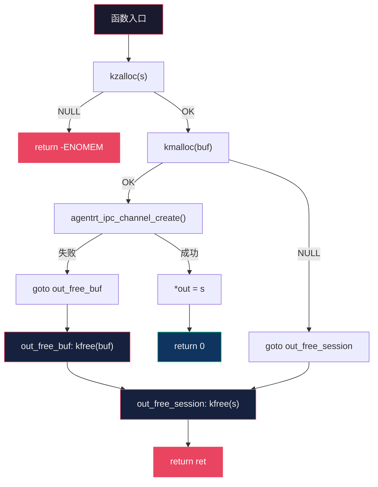

Copyright (c) 2025-2026 SPHARX Ltd. All Rights Reserved.

# agentrt-linux（AirymaxOS）C 语言编码风格规范

> **文档定位**： agentrt-linux（AirymaxOS）内核态 C 语言编码风格规范\
> **版本**： 0.1.1（文档体系完成）/ 1.0.1（开发）\
> **最后更新**： 2026-07-07\
> **父文档**： [编码规范总览](README.md)\
> **同源参考**： Linux 6.6 内核基线 `Documentation/process/coding-style.rst`\
> **理论根基**： Linux 内核工程思想 + Airymax 五维正交 24 原则\
> **SSoT 声明（C-2.6 D-03，2026-07-09）**： 本文件为 C 内核开发者导航参考。**格式规则**（§2）的唯一权威来源为 [02-code-format.md](../02-code-format.md)；**语义规则**（§3-§6）的唯一权威来源为 [01-coding-standards.md](../01-coding-standards.md)。本文件 §2 中的历史编号（OS-KER-011~014）与 02 冲突，已由 §0 映射表对齐；§7-§10（goto/GFP/锁/RCU/[SC][SS]）为内核态专属权威内容，保留独立规则效力。本文件与 SSoT 的任何冲突，以 SSoT 为准。

---

## 0. SSoT 对齐声明与编号映射

> **本节由 C-2.6 合并决策 D-03 执行新增（2026-07-09）**。本文件 §2（格式规则）的历史编号与 SSoT 文件 `02-code-format.md` 存在冲突。为消除编号歧义，下表给出权威映射；§2 正文中的历史编号仅作导航参考，**规则效力以 02-code-format.md 为准**。

### 0.1 格式规则映射（SSoT = 02-code-format.md）

| 本文件历史编号 | 规则内容 | SSoT 编号（02-code-format.md） |
|----------------|----------|-------------------------------|
| OS-KER-011 | Tab 8 字符缩进 | OS-KER-005 |
| OS-KER-012 | 80 列行宽 | OS-KER-004 |
| OS-KER-013 | K&R 大括号 | OS-KER-008 + OS-STD-047 |
| OS-KER-014 | 空格规则 | OS-KER-010 / 011 / 012 / 013 / 014 |

### 0.2 语义规则映射（SSoT = 01-coding-standards.md）

§3-§6 已正确使用"复用"标注（如 `OS-STD-005（复用）`、`OS-STD-007 复用`），引用关系已建立。以下编号在 01 中已定义，本文件引用时不再重新定义：

| 本文件引用编号 | 规则内容 | 01 SSoT 位置 |
|----------------|----------|-------------|
| OS-STD-005 | agentrt_/airymaxos_ 前缀 | §1.6（一致，无冲突） |
| OS-STD-028 | snake_case 命名 | 01 §1 + 闭源总纲补充 |
| OS-STD-029 | 命名语义化 | 01 §1.1 + 闭源总纲补充 |
| OS-STD-004 | 函数返回值约定 | §1.5 |
| OS-STD-006 | 函数长度 | §2.1 |
| OS-STD-007 | 函数原型元素顺序 | §2.2 |
| OS-STD-008 | 参数命名 | §2.3 |
| OS-STD-010~013 | 注释规范 | §3.1-§3.4 |
| OS-STD-015~017 | 头文件规范 | §4.1-§4.3 |

### 0.3 本文件保留的权威内容（无 SSoT 对应）

以下章节为 agentrt-linux 内核态 C 代码专属规范，01/02/03 不涉及，**本文件为唯一权威来源**：

| 章节 | 规则编号 | 内容 | 唯一性理由 |
|------|----------|------|-----------|
| §7 | OS-KER-003/004, OS-BAN-005 | goto 集中出口、分级标签逆序释放、禁 BUG() | 内核态错误处理范式，01 覆盖用户态 |
| §8 | OS-KER-016/017/018 | GFP 标志选择、释放后置 NULL、krealloc 规范 | 内核内存分配专属 |
| §9 | OS-KER-019/020/046/053 | 锁选择、RCU、锁前置设计、共享数据同步 | 内核并发专属 |
| §10 | OS-KER-021/022 | [SC] 共享契约层 + [SS] 语义同源层编写规则 | IRON-9 v2 代码归属专属 |

---

## 1. 基础约定

### 1.1 基于 Linux 内核编码风格

agentrt-linux（AirymaxOS）的 C 语言编码风格以 Linux 6.6 内核 `Documentation/process/coding-style.rst` 为基线。这不是简单的照搬，而是在 Linux 30 余年内核工程思想的基础上，针对 agentrt-linux（AirymaxOS）的智能体操作系统场景进行的定制化落地。

与 Linux 内核编码风格的关系：**基线对齐，扩展独立**。agentrt-linux（AirymaxOS）在基线基础上增加了以下专属规则：
- `agentrt_` / `airymaxos_` 前缀隔离（OS-STD-005）
- IRON-9 v2 三层模型代码归属标注
- 五维正交 24 原则映射注释
- 内核模块 Rust 互操作 FFI 边界规范

### 1.2 文档范围

本规范定义 agentrt-linux（AirymaxOS）**内核态 C 代码**的编码风格，涵盖：
- 缩进、空格、行宽（§2）
- 命名约定（§3）
- 函数定义规范（§4）
- 注释规范（§5）
- 头文件组织（§6）
- 错误处理规范（§7）
- 内存管理规范（§8）
- 锁与并发规范（§9）
- IRON-9 v2 [SC] 层代码编写规范（§10）

> **五维正交映射**：K-2 接口契约化、E-5 命名语义化、E-7 文档即代码、A-1 极简主义。

---

## 2. 缩进、空格与行宽

### 2.1 缩进：Tab 8 字符（OS-KER-011）

> **OS-KER-011**：缩进使用 Tab 字符，宽度为 8 个字符。这是 Linux 内核的传统选择，因为 8 字符缩进是"代码复杂度的自然惩罚"——如果你的代码嵌套超过 3 层，它本身就过于复杂，应该重构，而不是用窄缩进来藏匿。

```c
/* 正确：Tab 8 字符缩进 */
static int agentrt_sched_pick_next(struct agentrt_sched *sched)
{
        struct agentrt_task *task;

        spin_lock(&sched->lock);
        task = list_first_entry_or_null(&sched->ready_queue,
                                         struct agentrt_task, link);
        if (task)
                list_del_init(&task->link);
        spin_unlock(&sched->lock);

        return task ? task->id : -ENOENT;
}
```

### 2.2 行宽限制：80 列（OS-KER-012）

> **OS-KER-012**：代码行不得超过 80 列，注释行不得超过 72 列。80 列限制源于终端显示传统，但更重要的工程理由是：窄行宽强制函数拆分，且允许在分屏编辑器（如 3 列并排 diff）中完整阅读代码。

```c
/* 注释：最多 72 列，因为 80 列代码中注释通常缩进 8 列 */
/*
 * 当行宽超过 80 列时，将参数拆分到下一行，对齐到上一行参数的起始位置。
 * 这被称为"对齐到开括号"风格。
 */
static int agentrt_ipc_send_batch(struct agentrt_ipc_channel *chan,
                                  const struct agentrt_ipc_msg *msgs,
                                  size_t count, u32 flags);
```

### 2.3 大括号风格：K&R（OS-KER-013）

> **OS-KER-013**：函数左大括号另起一行；`if`/`while`/`for`/`switch` 左大括号在同行末尾。这是 Linux 内核统一的 K&R 风格。

```c
/* 函数：左大括号另起一行 */
static int agentrt_task_submit(struct agentrt_task *task)
{
        /* if：左大括号不另起一行 */
        if (task->state != AGENTRT_TASK_PENDING) {
                pr_warn("task %u already submitted\n", task->id);
                return -EBUSY;
        }

        /* do-while：左大括号在同行 */
        do {
                ret = agentrt_task_enqueue(task);
        } while (ret == -EAGAIN);
}
```

### 2.4 空格规则（OS-KER-014）

> **OS-KER-014**：关键字后加空格（`if (`、`while (`、`for (`、`switch (`）；函数名后不加空格（`agentrt_task_submit(task)`）；二元运算符两端加空格（`a + b`）；一元运算符不加空格（`!cond`、`*ptr`）。

```c
/* 正确 */
if (ret < 0)
        return ret;
ptr = kmalloc(sizeof(*ptr), GFP_KERNEL);
for (i = 0; i < count; i++)
        task[i].id = i;
```

---

## 3. 命名约定

### 3.1 agentrt_ 前缀（OS-STD-005）

> **OS-STD-005**（复用）：`agentrt_*` 前缀保留给 agentrt 同源 API（[SS] 语义同源层）；`airymaxos_*` 前缀用于 agentrt-linux（AirymaxOS）内核/发行版专属 API（[IND] 完全独立层）。两者共享 Airymax 同源语义，但前缀隔离确保无适配层互操作时不冲突。

```c
/* [SS] 语义同源层：与 agentrt 同源 API */
int agentrt_ipc_send(u32 chan, const void *msg, size_t len);
int agentrt_task_submit(struct agentrt_task *task);

/* [IND] 完全独立层：agentrt-linux（AirymaxOS）专属 API */
int airymaxos_lsm_hook_register(const struct security_hook_list *hooks);
int airymaxos_sched_class_register(struct sched_class *sc);
```

### 3.2 snake_case 命名（OS-STD-028）

> **OS-STD-028**：函数名、变量名使用 `snake_case`（小写字母 + 下划线）。常量宏使用 `UPPER_SNAKE_CASE`（全大写 + 下划线）。结构体名使用 `snake_case`，但声明时使用 `struct` 关键字（不 typedef）。

```c
/* 函数名：snake_case */
int agentrt_ipc_channel_create(const char *name, struct agentrt_ipc_channel **out);

/* 常量宏：UPPER_SNAKE_CASE */
#define AGENTRT_MAX_TASKS         1024
#define AGENTRT_IPC_MSG_HDR_SIZE  128

/* 结构体：用 struct 关键字，不 typedef */
struct agentrt_task {
        u32    id;
        u32    parent_id;
        u8     priority;
        u8     state;
        u16    flags;
        u64    deadline_ns;
};

/* 枚举值：模块前缀 + UPPER_SNAKE_CASE */
enum agentrt_task_state {
        AGENTRT_TASK_PENDING   = 0,
        AGENTRT_TASK_RUNNING   = 1,
        AGENTRT_TASK_COMPLETED = 2,
        AGENTRT_TASK_FAILED    = 3,
};
```

### 3.3 命名语义化（OS-STD-029）

> **OS-STD-029**：全局符号必须描述性命名，禁止无意义缩写。局部变量短小精悍（循环计数器 `i`、临时指针 `tmp`、缓冲区 `buf`）。命名应让代码自解释，减少对注释的依赖。

```c
/* 好：自解释 */
int count_active_tasks(void);
struct list_head *agentrt_sched_ready_queue(void);

/* 坏：无意义缩写 */
int cnt_act_tsk(void);
struct list_head *q(void);
```

### 3.4 敏感术语禁用（OS-BAN-001 复用）

> **OS-BAN-001**：新增代码禁用 `master/slave`、`blacklist/whitelist`，替换为 `primary/secondary`、`denylist/allowlist`。仅当维护既有 UAPI 或对齐既有硬件/协议规范时例外。

---

## 4. 函数定义规范

### 4.1 函数长度（OS-KER-015）

> **OS-KER-015**：函数一屏可读（≤80 列 × 24 行），局部变量 ≤ 5-10 个。超过此限制应拆分为 helper 函数。例外：长但简单的 `switch` 调度器（如大 `switch-case` 表驱动）可保留，因为分解的判据是复杂度而非行数。

```c
/* 好：简洁，一屏可读 */
static int agentrt_ipc_validate_msg(const struct agentrt_ipc_msg *msg)
{
        if (msg->len > AGENTRT_IPC_MSG_BODY_MAX)
                return -EMSGSIZE;
        if (!msg->body)
                return -EINVAL;
        return 0;
}

/* 坏：函数过长，应拆分 */
static int agentrt_ipc_handle_message(struct agentrt_ipc_channel *chan,
                                       struct agentrt_ipc_msg *msg)
{
        /* 200 行胶水逻辑，应拆分为多个 helper */
}
```

### 4.2 函数原型元素顺序（OS-STD-007 复用）

函数原型元素固定顺序：`storage class → storage class attributes → return type → return type attributes → name → parameters → parameter attributes → behavior attributes`。

```c
__init void * __must_check
agentrt_ipc_channel_create(enum agentrt_ipc_type type, size_t cap,
                           u32 flags) __printf(2, 3) __malloc;
```

### 4.3 参数命名（OS-STD-008 复用）

函数原型必须包含参数名——它是面向读者的廉价文档。

### 4.4 函数返回值约定（OS-STD-004 复用）

动作式函数返回错误码（0 = 成功，-Exxx = 失败）；谓词式函数返回 `bool`。

```c
int  agentrt_task_submit(struct agentrt_task *task);   /* 动作式：0 / -EBUSY */
bool agentrt_task_is_pending(const struct agentrt_task *task); /* 谓词式 */
```

---

## 5. 注释规范

### 5.1 注释原则（OS-STD-010 复用）

注释说明 WHAT 与 WHY，不说明 HOW。好代码自解释 HOW。函数头说明做什么、为什么这样做。

### 5.2 kernel-doc 格式（OS-STD-012 复用）

所有公共 API（`EXPORT_SYMBOL*` 函数、公共结构体、公共宏）必须用 kernel-doc 注释。

```c
/**
 * agentrt_ipc_send() - 在指定通道上发送消息
 * @channel: 通道 ID，由 agentrt_ipc_channel_create() 返回
 * @msg:    消息体指针，长度不超过 AGENTRT_IPC_MSG_BODY_MAX
 * @len:    消息体字节数
 *
 * 阻塞发送，直到对端读取或超时。消息头由 AgentsIPC 128B 协议自动填充。
 * 此函数属于 [SS] 语义同源层——与 agentrt 用户态 agentrt_ipc_send() 签名一致（SDK 层，同一份源码两端编译）。
 *
 * Return: 0 成功；-EAGAIN 通道满；-EMSGSIZE 超长；-ETIMEDOUT 超时。
 *
 * @since: 0.1.1
 */
int agentrt_ipc_send(u32 channel, const void *msg, size_t len);
```

### 5.3 数据结构注释（OS-STD-013 复用）

数据声明每行一个，留出注释空间。IRON-9 v2 层级归属必须标注。

```c
struct agentrt_task {
        u32    id;            /* 全局唯一任务 ID */
        u32    parent_id;     /* 父任务 ID，根任务为 0 */
        u8     priority;      /* 0=最低，255=最高 */
        u8     state;         /* enum agentrt_task_state */
        u16    flags;         /* AGENTRT_TASK_FLAG_* 位掩码 */
        u64    deadline_ns;   /* 绝对截止时间（纳秒） */
        /* [SS] 语义同源层：此结构体与 agentrt task_desc_t 语义等价 */
};
```

### 5.4 多行注释风格（OS-STD-011 复用）

通用代码用通用风格（左列星号，首尾近空白行）；`net/` 与 `drivers/net/` 用 net 风格（与上游一致便于回填）。

---

## 6. 头文件组织

### 6.1 include 顺序（OS-STD-016 复用）

include 顺序固定：系统头 → 架构头 → 本地头 → `#define CREATE_TRACE_POINTS` → trace events 头。

```c
#include <linux/module.h>
#include <linux/slab.h>
#include <linux/spinlock.h>
#include <asm/barrier.h>
#include "agentrt_internal.h"
#define CREATE_TRACE_POINTS
#include <trace/events/agentrt.h>
```

### 6.2 显式声明原则（OS-STD-015 复用）

每个 `.c` 必须显式 `#include` 其直接依赖的头文件，不得依赖间接传递包含。

### 6.3 include guard 规范（OS-STD-017 复用）

```c
#ifndef _AGENTRT_IPC_H
#define _AGENTRT_IPC_H
/* ... */
#endif /* _AGENTRT_IPC_H */
```

### 6.4 IRON-9 v2 层级归属标注

头文件应在文件头部注释中标明其 IRON-9 v2 层级归属：

```c
/* IRON-9 v2: [SC] 共享契约层 — 此头文件与 agentrt 完全共享 */
#ifndef _AGENTRT_IPC_MSG_H
#define _AGENTRT_IPC_MSG_H
```

---

## 7. 错误处理规范

### 7.1 goto 集中出口模式（OS-KER-003 复用）

> **OS-KER-003**：函数多出口且需公共清理时，必须用 `goto` 跳转到集中出口标签。标签名应描述其行为（如 `out_free_buffer:`），禁止 `err1:` / `err2:` 编号式命名。

```c
int agentrt_session_create(struct agentrt_session **out, const char *name)
{
        struct agentrt_session *s;
        void *buf;
        int ret;

        s = kzalloc(sizeof(*s), GFP_KERNEL);
        if (!s)
                return -ENOMEM;

        buf = kmalloc(PAGE_SIZE, GFP_KERNEL);
        if (!buf) {
                ret = -ENOMEM;
                goto out_free_session;
        }

        ret = agentrt_ipc_channel_create(name, &s->chan);
        if (ret)
                goto out_free_buf;

        *out = s;
        return 0;

out_free_buf:
        kfree(buf);
out_free_session:
        kfree(s);
        return ret;
}
```

### 7.2 分级标签按分配逆序释放（OS-KER-004 复用）

多个出口标签必须按资源分配的逆序释放，每个标签只释放其对应资源。

### 7.3 禁止 BUG()/BUG_ON()（OS-BAN-005 复用）

禁止新增 `BUG()` / `BUG_ON()` / `VM_BUG_ON()`，改用 `WARN_ON_ONCE()` + 恢复代码。

### 7.4 错误码规范

agentrt-linux（AirymaxOS）内核态错误码对齐 agentrt 错误码体系（[SS] 语义同源层），使用 `AGENTRT_E*` 前缀：

```c
/* [SS] 语义同源层：错误码体系（agentrt_errno.h 与内核态映射一致） */
#define AGENTRT_OK              0
#define AGENTRT_EAGAIN          (-EAGAIN)
#define AGENTRT_ENOMEM          (-ENOMEM)
#define AGENTRT_EINVAL          (-EINVAL)
#define AGENTRT_EMSGSIZE        (-EMSGSIZE)
#define AGENTRT_ETIMEDOUT       (-ETIMEDOUT)
#define AGENTRT_EBUSY           (-EBUSY)
#define AGENTRT_ENOENT          (-ENOENT)
```

### 7.5 错误处理流程总览



> **要点**：goto 集中出口 + 分级标签按分配逆序释放。每个标签只释放一个资源，标签按分配顺序逆序排列。这是 agentrt-linux（AirymaxOS）内核态错误处理的核心范式。

---

## 8. 内存管理规范

### 8.1 内存分配惯用法（OS-KER-005 复用）

传递结构体大小用 `sizeof(*p)`；数组分配用 `kmalloc_array` / `kcalloc`（带溢出检查）；带尾数组用 `struct_size` / `flex_array_size`。禁止在分配器参数中手写乘法。

```c
/* 好 */
struct agentrt_task *task = kmalloc(sizeof(*task), GFP_KERNEL);
struct agentrt_task *arr  = kcalloc(n, sizeof(*arr), GFP_KERNEL);
struct agentrt_batch *b   = kzalloc(struct_size(b, items, n), GFP_KERNEL);

/* 坏：手写乘法，可能溢出 */
arr = kmalloc(n * sizeof(*arr), GFP_KERNEL);
```

### 8.2 分配标志选择（OS-KER-016）

> **OS-KER-016**：进程上下文（可睡眠）用 `GFP_KERNEL`；中断上下文（不可睡眠）用 `GFP_ATOMIC`；初始化用 `GFP_NOWAIT`。禁止在持有自旋锁时使用 `GFP_KERNEL`。

```c
/* 进程上下文 */
s = kzalloc(sizeof(*s), GFP_KERNEL);

/* 中断上下文（如 tasklet / IRQ handler） */
entry = kmalloc(sizeof(*entry), GFP_ATOMIC);

/* 不睡眠的快速路径 */
tmp = kmalloc(sizeof(*tmp), GFP_NOWAIT);
```

### 8.3 释放后指针置 NULL（OS-KER-017）

> **OS-KER-017**：释放内存后，将指针置为 NULL，防止悬挂指针（dangling pointer）引发的 UAF（Use-After-Free）漏洞。这是防御性编程的基本实践。

```c
kfree(ptr);
ptr = NULL;  /* 防止悬挂指针 */
```

### 8.4 krealloc 使用规范（OS-KER-018）

> **OS-KER-018**：`krealloc` 可能返回新指针，必须使用临时变量接收，检查成功后再赋值给原指针。否则 realloc 失败时原指针丢失，导致内存泄漏。

```c
/* 好 */
void *tmp = krealloc(buf, new_size, GFP_KERNEL);
if (!tmp)
        return -ENOMEM;
buf = tmp;

/* 坏：realloc 失败时 buf 丢失 */
buf = krealloc(buf, new_size, GFP_KERNEL);
```

---

## 9. 锁与并发规范

### 9.1 共享数据必须用同步原语保护（OS-KER-053 复用）

共享数据必须通过 spinlock / mutex / memory barrier / RCU 保护。锁保持数据一致性，引用计数管理生命周期，两者不可互替。

```c
struct agentrt_task_table {
        spinlock_t      lock;
        struct list_head tasks;
};

void agentrt_task_table_add(struct agentrt_task_table *t,
                             struct agentrt_task *task)
{
        spin_lock(&t->lock);
        list_add_tail(&task->link, &t->tasks);
        spin_unlock(&t->lock);
}
```

### 9.2 锁选择指南（OS-KER-019）

> **OS-KER-019**：进程上下文持锁可睡眠用 `mutex`；不可睡眠（中断上下文、软中断、自旋锁内）用 `spinlock_t`；读多写少用 `rwlock_t` 或 RCU；跨 CPU 保证可见性用 `smp_mb()` / `smp_wmb()` / `smp_rmb()`。

| 锁类型 | 可睡眠 | 使用场景 | 持有时间限制 |
|--------|--------|----------|-------------|
| `mutex` | 是 | 进程上下文，持锁时间长 | 无硬限制，但应尽量短 |
| `spinlock_t` | 否 | 中断上下文，持锁时间极短 | 微秒级 |
| `rwlock_t` | 否 | 读多写少 | 同 spinlock |
| `RCU` | 是（读端） | 读极端频繁，写极少 | 读端无限制，写端需同步 |

### 9.3 RCU 使用规范（OS-KER-020）

> **OS-KER-020**：RCU 读端使用 `rcu_read_lock()` / `rcu_read_unlock()` 保护；写端使用 `synchronize_rcu()` 或 `call_rcu()` 等待宽限期。读端禁止睡眠，写端禁止在 RCU 读临界区中调用。

```c
/* 读端：RCU 保护下的无锁读 */
rcu_read_lock();
task = rcu_dereference(tbl->current_task);
if (task)
        task_id = task->id;
rcu_read_unlock();

/* 写端：先替换指针，再等待宽限期 */
old = rcu_replace_pointer(tbl->current_task, new_task,
                           lockdep_is_held(&tbl->lock));
synchronize_rcu();
kfree(old);
```

### 9.4 锁设计必须前置（OS-KER-046 复用）

锁设计必须在数据结构设计阶段就完成——不是"代码写完再加锁"。每条共享数据必须明确：哪个锁保护？锁的范围？锁内是否可睡眠？是否需引用计数配合？

---

## 10. IRON-9 v2 [SC] 共享契约层代码编写规范

### 10.1 [SC] 层定义

[SC] 共享契约层是 IRON-9 v2 三层模型中**代码完全共享**的层级。agentrt-linux（AirymaxOS）与 agentrt 共享 `include/airymax/` 下的 6 个头文件：
- `bpf_struct_ops.h`：sched_ext BPF 调度器 struct_ops 状态机 + common_value
- `memory_types.h`：MemoryRovol L1-L4 数据结构 + GFP 掩码语义 + PMEM 持久化接口
- `security_types.h`：Cupolas capability 令牌结构、POSIX capability 38 ID 枚举、LSM 钩子 254 ID 枚举、capability 派生模型、Vault backend 抽象、策略裁决 4 值枚举
- `cognition_types.h`：CoreLoopThree 阶段枚举、Thinkdual 模式枚举、LLM 推理阶段枚举、Token 能效指标、GPU/NPU 能力描述符
- `sched.h`：SCHED_EXT 调度类编号约束（复用内核 SCHED_EXT=7，禁止 SCHED_AGENT 宏）、任务描述符（magic 0x41475453 'AGTS'）、vtime 衰减公式、优先级 0-139、AIRYMAX_SLICE_DFL（20ms）
- `ipc.h`：IPC magic（0x41524531 'ARE1'）、128B 消息头结构（agentrt_ipc_msg_hdr_t）、SQE/CQE 操作码与标志位

### 10.2 [SC] 层代码编写规则（OS-KER-021）

> **OS-KER-021**：[SC] 共享契约层代码必须满足以下约束：
> 1. **零内核依赖**：不能 `#include` 任何 Linux 内核头文件（`<linux/*>`、`<asm/*>`）
> 2. **纯 C99 标准**：仅使用 C99 标准类型和语法，确保跨平台可编译
> 3. **零副作用**：仅含类型定义、常量、宏、static inline 函数，不含任何有副作用的代码
> 4. **双向兼容**：变更必须同步通过 agentrt 和 agentrt-linux 两端的 CI 检查
> 5. **版本锁定**：头文件变更必须伴随语义版本号变更（MAJOR.MINOR.PATCH）

```c
/* [SC] 共享契约层示例：include/airymax/ipc.h */
#ifndef _AIRYMAX_IPC_H
#define _AIRYMAX_IPC_H

/* IRON-9 v2: [SC] 共享契约层 — 此头文件与 agentrt 完全共享 */
/* 版本: 0.1.1 */

#include <stdint.h>  /* C99 标准头文件，非内核头文件 */

#define AGENTRT_IPC_MSG_HDR_SIZE  128
#define AGENTRT_IPC_MSG_BODY_MAX  4096

enum agentrt_ipc_msg_type {
        AGENTRT_IPC_MSG_REQ   = 0,
        AGENTRT_IPC_MSG_RESP  = 1,
        AGENTRT_IPC_MSG_EVENT = 2,
};

struct agentrt_ipc_msg_hdr {
        uint32_t magic;
        uint32_t type;
        uint32_t channel;
        uint32_t seq;
        uint64_t timestamp;
        uint32_t body_len;
        uint32_t flags;
        uint8_t  reserved[96];
} __attribute__((packed));

#endif /* _AGENTRT_IPC_MSG_H */
```

### 10.3 [SS] 语义同源层代码编写规则（OS-KER-022）

> **OS-KER-022**：[SS] 语义同源层：SDK 层 API 签名应与 agentrt 同源 API 一致（同一份源码两端编译）；系统调用层签名因抽象层级不同而独立演进（agentrt JSON-RPC ↔ agentrt-linux 编号 syscall），仅要求概念操作语义同源。agentrt-linux（AirymaxOS）可使用内核原语（`kmalloc`、`spinlock`、`kthread`）实现，agentrt 使用用户态原语（`malloc`、`pthread_mutex`、`pthread_create`）实现。

```c
/* [SS] 语义同源层：SDK 层签名与 agentrt 一致（同一份源码两端编译），实现使用内核原语 */
int agentrt_ipc_send(u32 channel, const void *msg, size_t len)
{
        struct agentrt_ipc_channel *chan;
        int ret;

        /* 实现使用内核原语：RCU 查找、自旋锁保护、io_uring 提交 */
        rcu_read_lock();
        chan = idr_find(&ipc_channels, channel);
        if (!chan) {
                rcu_read_unlock();
                return -AGENTRT_ENOENT;
        }
        /* ... 内核态实现细节 ... */
        rcu_read_unlock();
        return ret;
}
```

---

## 11. 代码示例：完整的 agentrt 内核模块

以下是一个完整的 agentrt-linux（AirymaxOS）内核模块示例，展示上述所有规范的集成应用：

```c
// SPDX-License-Identifier: GPL-2.0-only WITH Linux-syscall-note
/*
 * agentrt-linux（AirymaxOS）简单 IPC 通道模块
 *
 * 此模块演示 agentrt-linux C 编码风格规范的综合应用。
 * [SS] 语义同源层：API 签名与 agentrt 用户态 agentrt_ipc_channel 一致（SDK 层，同一份源码两端编译）。
 *
 * Copyright (c) 2025-2026 SPHARX Ltd. All Rights Reserved.
 */

#include <linux/module.h>
#include <linux/slab.h>
#include <linux/spinlock.h>
#include <linux/idr.h>
#include <linux/rculist.h>

#include "agentrt_internal.h"

#define AGENTRT_IPC_CHANNEL_MAGIC  0x41495043  /* 'AIPC' */
#define AGENTRT_MAX_CHANNELS       1024

struct agentrt_ipc_channel {
        u32                     magic;
        u32                     id;
        char                    name[64];
        spinlock_t              lock;
        struct list_head        pending_msgs;
        struct kref             refcount;
        struct rcu_head         rcu;
};

static DEFINE_IDR(ipc_channels);
static DEFINE_SPINLOCK(ipc_channels_lock);

/**
 * agentrt_ipc_channel_create() - 创建 IPC 通道
 * @name: 通道名称，最大 63 字符
 * @out:  输出参数，指向新创建的通道指针
 *
 * [SS] 语义同源层：此函数签名与 agentrt 用户态 agentrt_ipc_channel_create()
 * 一致。实现使用内核原语（kmalloc、spinlock、IDR）。
 *
 * Return: 0 成功；-ENOMEM 内存不足；-EEXIST 通道名已存在。
 *
 * @since: 0.1.1
 */
int agentrt_ipc_channel_create(const char *name,
                                struct agentrt_ipc_channel **out)
{
        struct agentrt_ipc_channel *chan;
        int id, ret;

        if (!name || !out)
                return -EINVAL;

        chan = kzalloc(sizeof(*chan), GFP_KERNEL);
        if (!chan)
                return -ENOMEM;

        chan->magic = AGENTRT_IPC_CHANNEL_MAGIC;
        strscpy(chan->name, name, sizeof(chan->name));
        spin_lock_init(&chan->lock);
        INIT_LIST_HEAD(&chan->pending_msgs);
        kref_init(&chan->refcount);

        id = idr_alloc(&ipc_channels, chan, 0, AGENTRT_MAX_CHANNELS,
                       GFP_KERNEL);
        if (id < 0) {
                ret = id;
                goto out_free_chan;
        }
        chan->id = id;

        *out = chan;
        return 0;

out_free_chan:
        kfree(chan);
        return ret;
}
EXPORT_SYMBOL_GPL(agentrt_ipc_channel_create);

static void agentrt_ipc_channel_release(struct kref *ref)
{
        struct agentrt_ipc_channel *chan =
                container_of(ref, struct agentrt_ipc_channel, refcount);
        struct agentrt_ipc_msg *msg, *tmp;

        list_for_each_entry_safe(msg, tmp, &chan->pending_msgs, link) {
                list_del(&msg->link);
                kfree(msg);
        }
        kfree(chan);
}

void agentrt_ipc_channel_put(struct agentrt_ipc_channel *chan)
{
        if (chan)
                kref_put(&chan->refcount, agentrt_ipc_channel_release);
}
EXPORT_SYMBOL_GPL(agentrt_ipc_channel_put);

MODULE_LICENSE("GPL");
MODULE_AUTHOR("SPHARX Ltd.");
MODULE_DESCRIPTION("agentrt-linux（AirymaxOS）IPC Channel Module");
```

---

## 12. 五维正交原则映射

| 章节 | 核心原则 | 映射 |
|------|---------|------|
| §2 缩进与空格 | A-1 极简主义、A-2 细节关注 | 8 字符 Tab 强制浅嵌套 |
| §3 命名约定 | K-2 接口契约化、E-5 命名语义化 | `agentrt_` 前缀隔离 |
| §4 函数定义 | A-1 极简主义、K-2 接口契约化 | 一屏可读、原型固定顺序 |
| §5 注释规范 | E-7 文档即代码、K-2 接口契约化 | kernel-doc 强制 |
| §6 头文件组织 | K-2 接口契约化、E-1 安全内生 | 显式依赖 |
| §7 错误处理 | E-3 资源确定性、E-6 错误可追溯 | goto 集中出口 |
| §8 内存管理 | E-3 资源确定性、E-1 安全内生 | 安全分配惯用法 |
| §9 锁与并发 | E-1 安全内生、E-3 资源确定性 | 锁与引用计数分离 |
| §10 IRON-9 v2 | K-2 接口契约化、S-3 总体设计部 | [SC]/[SS]/[IND] 三层模型 |

---

## 13. 相关文档

- [编码规范总览](README.md)：规范体系总索引
- [C 安全编码规范](C_Cpp_secure_coding_standard.md)：内核态安全编码
- [Rust 编码风格规范](Rust_coding_style_standard.md)：内核模块 Rust 风格
- [工程标准规范 01-代码规范](../../50-engineering-standards/01-coding-standards.md)：语义层代码规则
- [工程标准规范 02-代码格式](../../50-engineering-standards/02-code-format.md)：机械格式规则
- [工程标准规范 03-代码风格](../../50-engineering-standards/03-code-style.md)：工程风格决策
- [五维正交 24 原则](../../10-architecture/02-five-dimensional-principles.md)
- Linux 6.6 内核基线 `Documentation/process/coding-style.rst`

---

## 14. 版本历史

| 版本 | 日期 | 变更 |
|------|------|------|
| 0.1.1 | 2026-07-07 | 初始版本：基于 Linux 6.6 coding-style.rst 基线，融合 agentrt-linux 专属规范 |
| 1.0.1 | TBD | 首个开发版本：与代码实现同步验证 |

---

© 2025-2026 SPHARX Ltd. All Rights Reserved.