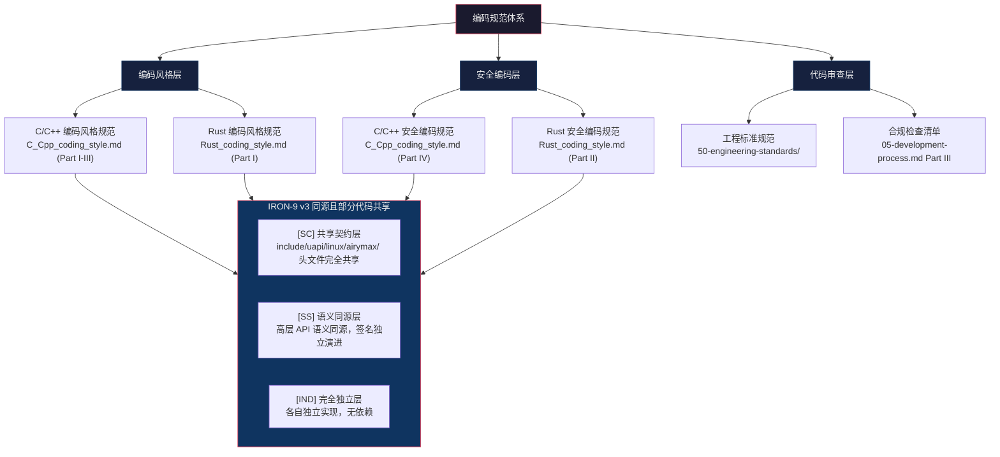
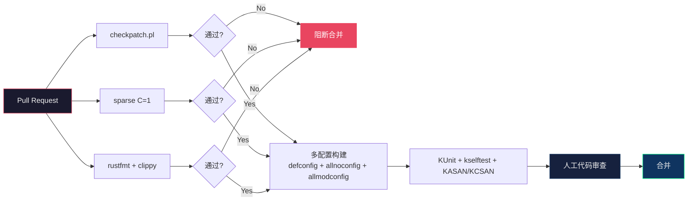

Copyright (c) 2025-2026 SPHARX Ltd. All Rights Reserved.

# agentrt-linux（AirymaxOS）编码规范总览
> **文档定位**：agentrt-linux（AirymaxOS）编码规范体系的总索引与导航\
> **文档版本**：0.1.1\
> **最后更新**：2026-07-13\
> **上级文档**：[工程标准规范手册](../00-engineering-standards-handbook.md)\
> **同源映射**：agentrt 编码规范体系（IRON-9 v3 同源且部分代码共享）\
> **理论根基**：Linux 6.6 内核基线工程思想 + Airymax 体系并行论（Multibody Cybernetic Intelligent System）五维正交 24 原则\
> **编号权威**：[09-ssot-registry.md §3](../09-ssot-registry.md)\
> **SSoT 依赖声明**：本子目录的规则编号登记于 [09-ssot-registry.md §3](../09-ssot-registry.md)。命名前缀权威为 [coding_conventions.md Part IV §4.4](./coding_conventions.md)。（族索引已废除，2026-07-12 SSoT 重新设计；2026-07-13 16 份源文件合并为 5 份合并文档）

---

## 1. 编码规范在 OS 内核开发中的重要性

操作系统内核是计算机系统中最底层的软件基础设施。内核代码的质量直接影响整个系统的稳定性、安全性和性能。agentrt-linux（AirymaxOS）作为面向智能体工作负载的操作系统发行版，其内核代码承载着以下关键职责：

- **稳定性**：内核崩溃意味着整个系统崩溃。一行不规范的代码可能导致死锁、内存泄漏或数据损坏，最终引发级联故障。
- **安全性**：内核运行在最高特权级（Ring 0）。任何缓冲区溢出、整数溢出或释放后使用（UAF）漏洞都可能被利用为提权入口。
- **可维护性**：内核代码的生命周期以十年计。Linux 内核已有 30 余年的演进历史，今天的代码将在未来十年被无数开发者阅读和修改。命名混乱、注释缺失、风格不一致的代码会指数级增加维护成本。
- **协同性**：agentrt-linux（AirymaxOS）内核与 agentrt 用户态运行时共享同源语义（IRON-9 v3），编码规范的一致性确保两端代码的无适配层互操作。

> **五维正交映射**：E-1 安全内生、E-3 资源确定性、E-7 文档即代码、A-2 细节关注、A-4 完美主义。

编码规范不是官僚主义的条条框框，而是工程师群体在数十年的内核开发实践中沉淀的集体智慧。它让代码说话，让规则透明，让审查高效。

---

## 2. 语言覆盖范围

agentrt-linux（AirymaxOS）的编码规范覆盖以下语言与场景：

| 语言 | 运行域 | 规范文档 | 核心场景 |
|------|--------|----------|----------|
| **C / C++** | 内核态 + 用户态 | [C_Cpp_coding_style.md](C_Cpp_coding_style.md) | Part I：C 内核态风格；Part II：C 强化补充；Part III：C++ 风格；Part IV：C/C++ 安全编码 |
| **Rust** | 内核模块 + 用户态 | [Rust_coding_style.md](Rust_coding_style.md) | Part I：Rust 风格（LSM/FS/配置/加密）；Part II：Rust 安全编码（unsafe 审计、FFI 安全、形式化验证） |
| **Go** | 用户态 | [Go_coding_style.md](Go_coding_style.md) | Part I：Go 风格；Part II：Go 安全编码 |
| **Python** | 用户态认知层 | [scripting_coding_style.md](scripting_coding_style.md) | Part I：Python 风格（cognition 认知引擎） |
| **JavaScript / TypeScript** | 用户态云原生层 | [scripting_coding_style.md](scripting_coding_style.md) | Part II：JavaScript/TypeScript 风格（cloudnative 云原生适配） |
| **Java** | 用户态 | [scripting_coding_style.md](scripting_coding_style.md) | Part III：Java 安全编码 |
| **跨语言** | 全场景 | [coding_conventions.md](coding_conventions.md) | Part I：代码注释模板；Part II：配置审计日志；Part III：日志打印；Part IV：命名规范；Part V：安全设计 |

> **说明**：用户态组件（Python、TypeScript、Rust 用户态）的编码规范由 agentrt 同源规范体系定义，遵循 IRON-9 v3 [SS] 语义同源层原则。内核态 C 与内核模块 Rust 是 agentrt-linux（AirymaxOS）作为 OS 发行版的专属责任域；Go / Python / JavaScript / Java 编码规范为 Airymax 全栈体系的一部分，已合并入本子目录的 5 份合并文档。

---

## 3. 规范层次结构

agentrt-linux（AirymaxOS）编码规范体系按三个维度组织：

### 3.1 编码风格层

定义代码"长什么样"——缩进、命名、注释、函数组织、文件结构。编码风格规范确保团队成员能快速理解彼此的代码，降低认知切换成本。

- **C 编码风格规范**：基于 Linux 6.6 内核 `Documentation/process/coding-style.rst`，针对 agentrt-linux（AirymaxOS）的内核态场景进行定制化扩展。
- **Rust 编码风格规范**：基于 Rust for Linux 社区约定，融合 `rustfmt` 与 `clippy` 的自动化检查。

### 3.2 安全编码层

定义代码"如何避免漏洞"——缓冲区安全、整数安全、并发安全、指针安全、权限检查。安全编码规范是 agentrt-linux（AirymaxOS）E-1 安全内生原则的工程落地。

- **C 安全编码规范**：覆盖内核态 C 代码的所有常见安全漏洞类别，包含 CVE 案例分析。
- **Rust 安全编码规范**：聚焦 unsafe 代码审计、FFI 安全边界、供应链安全，以及形式化验证方法。

### 3.3 代码审查层

定义代码"如何被审查"——审查清单、合规检查工具、自动化 CI 流水线。代码审查是编码规范的最后一道防线。详见 `50-engineering-standards/` 工程标准规范体系。

---

## 4. 与 agentrt 编码规范的关系

agentrt-linux（AirymaxOS）编码规范与 agentrt 编码规范遵循 **IRON-9 v3 同源且部分代码共享** 原则：

| IRON-9 v3 层级 | 定义 | 编码规范关系 | 示例 |
|---------------|------|-------------|------|
| **[SC] 共享契约层** | 代码完全共享 | 共享 `include/uapi/linux/airymax/` 10 个头文件（`syscalls.h`/`memory_types.h`/`security_types.h`/`cognition_types.h`/`sched.h`/`ipc.h`）中的类型定义、常量、宏 | `AIRY_IPC_MAGIC`、`syscalls.h` |
| **[SS] 语义同源层** | 高层 API 语义同源，签名独立演进 | 共享命名约定（`airy_` 前缀）、错误码体系、注释风格；但 C 内核态用 kernel-doc，Rust 用户态用 rustdoc | SDK 层 `airy_ipc_send()` 签名同源（同一份源码两端编译），其他层语义同源 |
| **[IND] 完全独立层** | 完全独立 | 各自独立的编码规范——agentrt-linux（AirymaxOS）覆盖内核态 C 和内核模块 Rust，agentrt 覆盖用户态 Python/TS/Rust | agentrt-linux 专属：goto 集中出口模式、kmalloc/kfree 惯用法、内核锁规范 |

**关系本质**：同源——共享 Airymax 五维正交 24 原则作为顶层设计哲学；独立——agentrt-linux（AirymaxOS）必须独立处理 agentrt 不涉及的内核态专属工程约束（物理内存管理、中断上下文、内核抢占、DMA 一致性等）。

---

## 5. 规范清单

| 序号 | 文档 | 路径 | 语言 | 定位 | 行数目标 |
|------|------|------|------|------|----------|
| 1 | 编码规范总览（本文） | `README.md` | 中文 | 总索引 | 400-700 |
| 2 | C/C++ 编码风格规范 | `C_Cpp_coding_style.md` | C / C++ | Part I：C 内核态风格；Part II：C 强化补充；Part III：C++ 风格；Part IV：C/C++ 安全编码 | 3000+ |
| 3 | Rust 编码风格规范 | `Rust_coding_style.md` | Rust | Part I：Rust 风格；Part II：Rust 安全编码 | 1000+ |
| 4 | Go 编码风格规范 | `Go_coding_style.md` | Go | Part I：Go 风格；Part II：Go 安全编码 | 3800+ |
| 5 | 脚本语言编码规范 | `scripting_coding_style.md` | Python / JS / Java | Part I：Python；Part II：JavaScript/TS；Part III：Java 安全编码 | 4000+ |
| 6 | 编码约定合集 | `coding_conventions.md` | 跨语言 | Part I：代码注释；Part II：配置审计；Part III：日志；Part IV：命名；Part V：安全设计 | 4400+ |

### 5.1 规范编号体系

本规范体系中的规则沿用 agentrt-linux（AirymaxOS）工程标准编号体系：

| 编号前缀 | 含义 | 适用范围 |
|----------|------|----------|
| `OS-KER-xxx` | 内核工程规则（强制） | 内核态 C 代码 |
| `OS-STD-xxx` | 标准规则 | 所有语言 |
| `OS-BAN-xxx` | 禁止规则 | 所有语言 |
| `OS-ACC-xxx` | 验收标准 | CI/CD 自动化检查 |
| `OS-SEC-xxx` | 安全规则（强制） | 安全编码规范 |

### 5.2 五维正交 24 原则映射

本规范体系的每一条规则均映射到 Airymax 五维正交 24 原则中的至少一个维度：

| 维度 | 原则数量 | 在编码规范中的体现 |
|------|----------|-------------------|
| **系统观 (S)** | 4 项 | S-2 层次分解：编码规范按内核态 / 用户态分层；S-4 涌现性管理：规范一致性防止 bug 涌现 |
| **内核观 (K)** | 4 项 | K-1 内核极简：规范限制内核态代码复杂度；K-2 接口契约化：API 注释与错误码规范；K-4 可插拔策略：策略代码与机制代码分离 |
| **认知观 (C)** | 4 项 | C-1 双系统协同：C 热路径 / Rust 慢路径分层编码 |
| **工程观 (E)** | 8 项 | E-1 安全内生：安全编码规范；E-3 资源确定性：内存管理规范；E-5 命名语义化：命名约定；E-6 错误可追溯：错误处理规范；E-7 文档即代码：注释规范；E-8 可测试性：测试友好编码 |
| **设计美学 (A)** | 4 项 | A-1 极简主义：函数 ≤ 80×24、局部变量 ≤ 10；A-2 细节关注：类型安全、溢出检查；A-4 完美主义：零警告编译 |

---

## 6. 合规检查工具链

agentrt-linux（AirymaxOS）编码规范的合规性通过以下工具链强制执行：

### 6.1 静态分析工具

| 工具 | 检查内容 | 语言 | 频率 | 阻断级别 |
|------|---------|------|------|----------|
| `checkpatch.pl --strict` | 编码风格（缩进、行宽、命名、注释） | C | 每次 PR | ERROR/WARNING 阻断 |
| `sparse` (`make C=1`) | 类型注解（`__user`/`__kernel`/`__iomem`）、endianness | C | 每次 PR | ERROR 阻断 |
| `coccinelle` | 语义模式匹配（API 误用、内存泄漏模式） | C | 每日 | WARNING 阻断 |
| `clang-tidy` | 现代 C 最佳实践、潜在 bug 模式 | C | 每日 | WARNING 阻断 |
| `Coverity Scan` | 深度静态分析（缓冲区溢出、资源泄漏、并发缺陷） | C | 每周 | HIGH 阻断 |
| `rustfmt` | Rust 代码格式化 | Rust | 每次 PR | 格式化不一致阻断 |
| `clippy` | Rust 最佳实践与潜在 bug 模式 | Rust | 每次 PR | WARNING 阻断 |
| `cargo audit` | Rust 依赖供应链安全漏洞 | Rust | 每次 PR | CRITICAL 阻断 |

### 6.2 动态检查工具

| 工具 | 检查内容 | 语言 | 频率 |
|------|---------|------|------|
| `KASAN` (Kernel Address Sanitizer) | 堆栈缓冲区溢出、UAF、UAR | C | 每次 PR (CI) |
| `KMSAN` (Kernel Memory Sanitizer) | 未初始化内存使用 | C | 不启用（开销过大） |
| `KCSAN` (Kernel Concurrency Sanitizer) | 数据竞争 | C | 每次 PR (CI) |
| `lockdep` | 锁依赖图、死锁检测 | C | 每次 PR (CI) |
| `kmemleak` | 内核内存泄漏检测 | C | 每日 |
| `Miri` | Rust unsafe 代码 UB 检测 | Rust | 每次 PR (CI) |

### 6.3 自动化 CI 流水线

### 6.4 合规检查强制规则

- **OS-ACC-001**：所有 PR 必须通过 `checkpatch.pl --strict`，无 ERROR/WARNING。
- **OS-ACC-002**：所有 PR 必须通过 `sparse C=1`，无 ERROR。
- **OS-ACC-003**：所有 PR 必须通过至少 3 种配置构建（`defconfig`、`allnoconfig`、`allmodconfig`）。
- **OS-ACC-004**：所有涉及 unsafe Rust 的 PR 必须通过 Miri 检查。
- **OS-ACC-005**：所有涉及内核内存分配的 PR 必须通过 KASAN 检查。
- **OS-ACC-006**：[SC] 共享契约层代码变更必须同步通过 agentrt 侧的对应 CI 检查。

---

## 7. IRON-9 v3 四层模型在编码规范中的详细落地

### 7.1 [SC] 共享契约层编码规范

[SC] 共享契约层是 agentrt-linux（AirymaxOS）与 agentrt 之间**代码完全共享**的层级。该层包含 `include/uapi/linux/airymax/` 下的以下头文件：

| 头文件 | 内容 | 共享方式 | 变更流程 |
|--------|------|----------|----------|
| `syscalls.h` | v1.1: 4 核心 syscall 编号 + 20 预留槽位| 完全共享，双向同步 | 任一端变更需同步另一端 |
| `memory_types.h` | MemoryRovol L1-L4 数据结构 + GFP 掩码 | 完全共享，双向同步 | 类型变更需兼容性评估 |
| `security_types.h` | Cupolas capability 令牌 + POSIX cap 41 ID + LSM 252 ID | 完全共享，双向同步 | 安全审查强制 |
| `cognition_types.h` | CoreLoopThree 阶段枚举 + Thinkdual 模式 | 完全共享，双向同步 | 阶段变更需兼容性评估 |
| `sched.h` | sched_tac 调度类约束 + 任务描述符 + vtime 衰减 | 完全共享，双向同步 | 调度语义变更需评审 |
| `ipc.h` | IPC magic + 128B 消息头结构 + SQE/CQE 操作码 | 完全共享，双向同步 | ABI 变更需评审 |

[SC] 层编码规范核心约束：
- **零内核依赖**：不能 `#include` 任何 Linux 内核头文件
- **纯 C99 标准**：仅使用 C99 标准类型和语法
- **零副作用**：仅含类型定义、常量、宏、static inline 函数
- **双向兼容**：变更同步通过 agentrt 和 agentrt-linux 两端的 CI
- **版本锁定**：语义版本号（MAJOR.MINOR.PATCH）跟踪变更

### 7.2 [SS] 语义同源层编码规范

[SS] 语义同源层要求高层 API 语义同源（概念操作一致），签名因抽象层级不同而独立演进。SDK 层（AirymaxClient 4 语言客户端，同一份源码两端编译）签名同源；其他层仅语义同源。agentrt-linux（AirymaxOS）内核态使用内核原语实现，agentrt 用户态使用用户态原语实现。

| API 类别 | agentrt-linux 实现 | agentrt 实现 | 同源保证 |
|----------|-------------------|-------------|---------|
| `airy_ipc_send()` | io_uring + 内核固定 OP | 用户态消息队列 | 签名一致（SDK 层），协议兼容 |
| `airy_task_submit()` | kthread + sched_tac | pthread + 用户态调度器 | 语义等价，调度模型同源 |
| `airy_capability_check()` | LSM hook + kernel capability | 用户态 ACL | 语义等价，判定逻辑同源 |

[SS] 层编码规范核心约束：
- SDK 层函数签名与 agentrt 同源 API 一致（同一份源码两端编译）；其他层仅要求概念操作语义同源
- 错误码必须对齐 `include/uapi/linux/airymax/error.h`（[SC] SSoT）
- 注释必须标注 `[SS] 语义同源层`
- 实现可使用内核原语，但语义必须等价

### 7.3 [IND] 完全独立层编码规范

[IND] 完全独立层是 agentrt-linux（AirymaxOS）的专属代码，与 agentrt 无共享关系。该层包括所有内核特有的实现细节。

| 类别 | 示例 | 规范约束 |
|------|------|---------|
| 内核驱动框架 | `airy_drv_*` 系列函数 | 使用 `airy_` 前缀 |
| 内核调度器 | `airy_sched_class_register()` | 不暴露 agentrt 同源 API |
| Kbuild 系统 | Kconfig / Makefile | 遵循 Linux 6.6 内核基线约定 |
| systemd 集成 | 守护进程单元文件 | 与服务隔离原则对齐 |

[IND] 层编码规范核心约束：
- 使用 `airy_` 前缀（非 `airy_` 前缀）
- 不直接引用 agentrt 用户态头文件
- 内核内部 API 不保证稳定（"you broke it, you fix it"）
- 可自由使用 Linux 内核原语和接口

### 7.4 三层模型合规检查清单

| 检查项 | [SC] | [SS] | [IND] |
|--------|------|------|-------|
| 前缀使用 | `AIRY_` 宏/常量 | `airy_` 函数 | `airy_` 函数 |
| 头文件依赖 | 零内核依赖 | 可依赖内核头文件 | 可依赖内核头文件 |
| 代码共享 | 完全共享 | 不共享实现 | 不共享 |
| 变更同步 | 双向同步 | 单向（语义一致性检查） | 无需同步 |
| CI 检查 | 两端 CI 必须通过 | 语义一致性 check | 仅 agentrt-linux CI |

---

## 8. 规范体系的演进路线

### 8.1 版本演进策略

agentrt-linux（AirymaxOS）编码规范体系的版本演进遵循以下策略：

| 阶段 | 文档版本 | 代码版本 | 目标 |
|------|---------|---------|------|
| **Phase 1：文档体系完成** | 0.1.1 | 不适用 | 5 个规范文档全部完成，规范体系可引用 |
| **Phase 2：首轮开发验证** | 1.0.1 | 1.0.1 | 规范在 10+ PR 中实际应用，CI 工具链完全就绪 |
| **Phase 3：社区反馈迭代** | 1.1.x | 1.1.x | 基于社区贡献者反馈修订规范 |
| **Phase 4：LTS 稳定版** | 2.0.0 | 3.0 LTS | 规范冻结，仅允许安全相关的修订 |

### 8.2 规范变更流程

1. **提案**：通过 Issue 或 RFC 提出规范变更
2. **讨论**：在编码规范工作组中讨论（至少 2 周）
3. **投票**：工程规范委员会投票决定（需 2/3 多数）
4. **实施**：更新规范文档 + 更新 CI 检查规则
5. **公告**：向社区公告变更，提供迁移指南
6. **宽限期**：重大变更提供 2 个发布周期的宽限期

### 8.3 参考发行版对齐

agentrt-linux（AirymaxOS）编码规范在以下方面对齐 主流 Linux 发行版标准：
- 内核编码风格基线（Linux 6.6 `Documentation/process/coding-style.rst`）
- 安全编码实践（CERT C Coding Standard）
- 内核模块构建系统（Kbuild）

在以下方面独立演进：
- `airy_` / `airy_` 前缀隔离体系
- IRON-9 v3 四层模型代码归属标注
- Rust 内核模块编码规范
- Cupolas capability 安全编码模式

### 8.4 编码规范与工程铁律的关系

agentrt-linux（AirymaxOS）编码规范是工程铁律体系（IRON-1~IRON-10）在代码层面的具体落地。编码规范中的每一条禁止规则（OS-BAN-*）和安全规则（OS-SEC-*）都可以追溯到一条或多条工程铁律：

| 编码规范类别 | 对应工程铁律 | 关系 |
|-------------|------------|------|
| 缓冲区溢出防护 | IRON-1（安全内生） | 编码规范是铁律的代码级执行规则 |
| 整数溢出检测 | IRON-1（安全内生） | 每一条 OS-SEC 规则对应一个安全维度 |
| 内存管理规范 | IRON-3（资源确定性） | 内核态内存分配模式是铁律的强制实现 |
| 错误处理规范 | IRON-6（错误可追溯） | goto 集中出口模式是铁律的工程范式 |
| 注释规范 | IRON-7（文档即代码） | kernel-doc 强制是铁律的自动化保证 |
| unsafe 审计规范 | IRON-1 + IRON-8 | 五步审计法同时满足安全内生和可测试性 |

### 8.5 编码规范的例外处理

极少情况下，严格遵守编码规范可能导致代码可读性下降或性能损失。此时可通过以下流程申请例外：

1. **提出例外**：在 PR 中标注 `// CODING_STANDARD_EXCEPTION: <reason>`
2. **论证必要性**：说明为什么遵守规范会导致更差的结果
3. **工程规范委员会审批**：至少 2 名工程规范委员会成员签字同意
4. **记录在案**：例外记录在 `30-coding-standard/exceptions.md` 中
5. **定期复审**：每个发布周期复审所有例外，确认是否仍然必要

> **注意**：安全规则（OS-SEC-*）和禁止规则（OS-BAN-*）不接受例外申请。风格规则（OS-STD-*）和内核规则（OS-KER-*）可申请例外，但需充分论证。

---

## 9. 快速导航

### 9.1 按角色导航

| 角色 | 必读文档 | 推荐阅读 |
|------|---------|---------|
| **内核 C 开发者** | C_Cpp_coding_style.md (Part I, IV) | 50-engineering-standards/01-coding-standards.md |
| **内核 Rust 开发者** | Rust_coding_style.md (Part I, II) | 50-engineering-standards/01-coding-standards.md Part III |
| **Go 开发者** | Go_coding_style.md (Part I, II) | 50-engineering-standards/01-coding-standards.md Part III |
| **脚本语言开发者** | scripting_coding_style.md (Part I-III) | coding_conventions.md (Part I 注释, Part III 日志) |
| **代码审查者** | 本文（总览）, 50-engineering-standards/05-development-process.md Part III | 全部 5 个合并规范 |
| **工程规范委员会** | 本文（总览）, 10-architecture/02-five-dimensional-principles.md | 全部规范 |

### 9.2 按场景导航

| 场景 | 参考文档 |
|------|---------|
| 提交第一个内核补丁 | C_Cpp_coding_style.md Part I §1-§4 |
| 编写内核内存分配代码 | C_Cpp_coding_style.md Part I §8, Part IV §1 |
| 编写 Rust 内核模块 | Rust_coding_style.md Part I §1-§6 |
| 审计 unsafe 代码 | Rust_coding_style.md Part II §1-§3 |
| 处理用户态输入 | C_Cpp_coding_style.md Part IV §7 |
| 编写内核锁代码 | C_Cpp_coding_style.md Part I §9 |
| 编写 Go 用户态服务 | Go_coding_style.md Part I |
| 编写 Python 认知引擎 | scripting_coding_style.md Part I |
| 编写 JavaScript/TS 云原生 | scripting_coding_style.md Part II |
| 查询命名前缀权威 | coding_conventions.md Part IV §4.4 |
| 查询日志格式规范 | coding_conventions.md Part III |
| 查询代码注释模板 | coding_conventions.md Part I |
| 查询安全设计四层防护 | coding_conventions.md Part V |

---

## 10. 相关文档

- [工程标准规范总索引](../../50-engineering-standards/README.md)：agentrt-linux（AirymaxOS）工程标准规范体系
- [代码规范（01-coding-standards.md）](../../50-engineering-standards/01-coding-standards.md)：语义层代码规则
- [代码格式](../../50-engineering-standards/01-coding-standards.md) Part II：机械格式规则
- [代码风格](../../50-engineering-standards/01-coding-standards.md) Part III：工程风格决策
- [工程思想（04-engineering-philosophy.md）](../../50-engineering-standards/04-engineering-philosophy.md)：双层稳定性哲学
- [合规检查清单](../../50-engineering-standards/05-development-process.md) Part III：IRON-9 v3 合规检查清单
- [五维正交 24 原则](../../10-architecture/02-five-dimensional-principles.md)：Airymax 架构设计原则
- [工程基线](../../10-architecture/04-engineering-baseline.md)：IRON-9 v3 工程基线定义
- agentrt 编码规范体系（同源，IRON-9 v3 [SS] 语义同源层）

---

## 11. 版本历史

| 版本 | 日期 | 变更 |
|------|------|------|
| 0.1.1 | 2026-07-07 | 初始版本：编码规范体系总览，含 5 个子规范、IRON-9 v3 四层映射、合规检查工具链 |
| 0.1.1 | 2026-07-13 | 16 份源文件合并为 5 份合并文档（C_Cpp_coding_style.md / Rust_coding_style.md / Go_coding_style.md / scripting_coding_style.md / coding_conventions.md），文件数 17→6，文档索引全量更新 |
| 0.1.1 | 2026-07-13 | OLK-6.6 六大编码规范支柱源码级验证 + ES-OLK-1~13 + 8 项新发现识别；C-D05/C-D06/C-D07/C-D08 4 项差距移交 1.0.1 M1+ |
| 1.0.1 | 开源极境工程与规范委员会 | 内核和 OS 实现：与代码实现同步验证，CI 流水线完全就绪 |

---

© 2025-2026 SPHARX Ltd. All Rights Reserved.