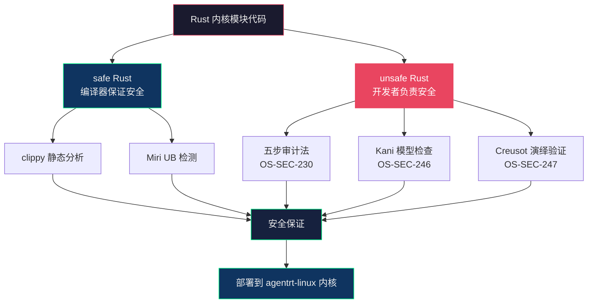

Copyright (c) 2025-2026 SPHARX Ltd. All Rights Reserved.

# Rust 编码风格规范
> **文档定位**：Rust 语言编码风格及安全编码规范合集（含 Rust 风格、Rust 安全编码）\
> **文档版本**：0.1.1\
> **最后更新**： 2026-07-21\
> **上级文档**：[agentrt-linux（AirymaxOS）工程标准规范](README.md)

---

## Part I: agentrt-linux（AirymaxOS）Rust 语言编码风格规范

### 1. Rust for Linux 编码约定

#### 1.1 定位与适用范围

agentrt-linux（AirymaxOS）的 Rust 代码仅用于**内核模块**（安全敏感且非热路径的子系统），典型场景包括：
- 安全策略裁决（LSM hook 实现）
- 文件系统解析（路径遍历的字符串处理）
- 配置解析器（Kconfig 派生配置验证）
- 加密算法实现（SM2/SM3/SM4 国密算法）

> **五维正交映射**：C-1 双系统协同——C 用于热路径（调度/内存/IPC），Rust 用于慢路径（安全/配置/解析）；E-1 安全内生——Rust 的内存安全保证消除整类 CVE。

#### 1.2 与 Rust for Linux 社区的关系

agentrt-linux（AirymaxOS）的 Rust 编码风格以 Rust for Linux 社区约定为基线，在此基础上增加：
- `airy_` / `airy_` 前缀隔离
- IRON-9 v3 四层模型代码归属标注
- 内核模块专属的 unsafe 审计规范
- 与 C 代码互操作的 FFI 边界规范

#### 1.3 工具链要求

- `rustfmt`：格式化，配置对齐 `rust/kernel/.rustfmt.toml`
- `clippy`：lint 检查，禁止 `#[allow(clippy::all)]`
- `rustdoc`：文档生成，所有公共 API 强制 rustdoc
- `Miri`：unsafe 代码 UB 检测，CI 阻断

---

### 2. 所有权与借用规范

#### 2.1 所有权模型是 Rust 的核心优势（OS-STD-030）

> **OS-STD-030**：在内核模块 Rust 代码中，必须充分利用 Rust 的所有权模型来保证资源确定性。每个资源（内存、文件句柄、锁）必须有唯一的所有者；所有权的转移通过 `move` 语义表达；共享访问通过不可变引用（`&T`）或智能指针（`Arc<T>`、`Rc<T>`）表达。

```rust
// 好：所有权清晰——Channel 拥有其 msg_queue
pub struct AgentrtChannel {
    name: CString,
    msg_queue: VecDeque<AgentrtIpcMsg>,
    lock: Mutex<()>,
}

// 好：move 语义——创建函数转移所有权给调用者
pub fn airy_channel_create(name: &str) -> Result<Arc<AgentrtChannel>> {
    let chan = Arc::new(AgentrtChannel {
        name: CString::new(name)?,
        msg_queue: VecDeque::new(),
        lock: Mutex::new(()),
    });
    // chan 的所有权被 Arc 包装后返回给调用者
    Ok(chan)
}
```

#### 2.2 借用而非克隆（OS-STD-031）

> **OS-STD-031**：优先使用借用（`&T`、`&mut T`）而非克隆（`.clone()`）。内核模块对性能和内存敏感，不必要的克隆会增加内存分配和释放开销。仅在需要独立所有权时克隆。

```rust
// 好：借用——零拷贝
fn validate_msg(msg: &AgentrtIpcMsg) -> bool {
    msg.len <= AIRY_IPC_MSG_BODY_MAX && !msg.body.is_null()
}

// 坏：不必要的克隆
fn validate_msg(msg: AgentrtIpcMsg) -> bool {
    msg.len <= AIRY_IPC_MSG_BODY_MAX
}
```

#### 2.3 生命周期标注（OS-STD-032）

> **OS-STD-032**：生命周期参数必须显式标注，除非编译器能正确推断。长生命周期函数应使用有意义的名字（如 `'msg`、`'chan`）而非 `'a`、`'b`，以提升可读性。

```rust
// 好：有意义的生命周期名
fn airy_msg_validate<'msg>(
    msg: &'msg AgentrtIpcMsg,
    chan: &AgentrtChannel,
) -> Result<&'msg [u8]> {
    // ...
}

// 可接受：简单场景可用 'a
fn first<'a>(x: &'a [u8], y: &[u8]) -> &'a [u8] {
    x
}
```

---

### 3. 命名约定

#### 3.1 snake_case 命名（OS-STD-033）

> **OS-STD-033**：Rust 代码遵循 Rust 社区标准命名约定：
> - 函数名、变量名、方法名：`snake_case`
> - 类型名（struct、enum、trait）、枚举变体：`PascalCase`
> - 常量、静态变量：`SCREAMING_SNAKE_CASE`
> - 宏名：`snake_case!`（声明宏）或 `PascalCase!`（过程宏）

```rust
// 函数名：snake_case
pub fn airy_ipc_send(channel: u32, msg: &[u8]) -> Result<()> { ... }

// 类型名：PascalCase
pub struct AgentrtIpcChannel { ... }
pub enum AgentrtTaskState { ... }

// 常量：SCREAMING_SNAKE_CASE
const AIRY_MAX_TASKS: usize = 1024;
const AIRY_IPC_HDR_SIZE: usize = 128;
```

#### 3.2 airy_ / airy_ 前缀隔离（OS-STD-034）

> **OS-STD-034**：Rust 代码同样遵循 `airy_` / `airy_` 前缀隔离规范：
> - `airy_*` 前缀：同源 API（[SS] 语义同源层），SDK 层与 agentrt 用户态 API 签名一致（同一份源码两端编译），其他层语义同源
> - `airy_*` 前缀：agentrt-linux（AirymaxOS）专属 API（[IND] 完全独立层）

```rust
/// [SS] 语义同源层：与 agentrt 用户态 airy_ipc_send() 签名一致（SDK 层，同一份源码两端编译）
pub fn airy_ipc_send(channel: u32, msg: &[u8]) -> Result<()> { ... }

/// [IND] 完全独立层：agentrt-linux（AirymaxOS）内核专属
pub fn airy_lsm_hook_register(hooks: &SecurityHookList) -> Result<()> { ... }
```

#### 3.3 模块命名（OS-STD-035）

> **OS-STD-035**：模块名使用 `snake_case`，文件名与模块名一致。模块树结构应与 C 代码的子系统结构对应。

```
rust/kernel/
├── agentrt/
│   ├── ipc.rs           // pub mod ipc;
│   ├── task.rs          // pub mod task;
│   └── capability.rs    // pub mod capability;
├── airymaxos/
│   ├── security.rs      // pub mod security;
│   ├── sched.rs         // pub mod sched;
│   └── memory.rs        // pub mod memory;
└── lib.rs
```

---

### 4. unsafe 代码块规范

#### 4.1 最小化原则（OS-SEC-201）

> **OS-SEC-201**：unsafe 代码块必须最小化——仅包裹真正需要 unsafe 的操作，不包裹任何 safe 代码。每个 unsafe 块必须在其上方用注释说明"为什么此处 safe 代码无法完成任务"。

```rust
// 好：unsafe 块最小化，有注释说明
fn read_mmio_register(base: *const u8, offset: usize) -> u32 {
    // SAFETY: base 是 ioremap 返回的合法 MMIO 地址，offset 已验证在范围内
    unsafe {
        readl(base.add(offset) as *const u32)
    }
}

// 坏：unsafe 块过大，包裹了 safe 代码
unsafe {
    let base = ioremap(phys_addr, PAGE_SIZE)?;
    let val = readl(base.add(AIRY_REG_CTRL));
    if val & AIRY_CTRL_ENABLE != 0 {
        pr_info!("Device enabled\n");
    }
    writel(val | AIRY_CTRL_RESET, base.add(AIRY_REG_CTRL));
}
```

#### 4.2 文档化原则（OS-SEC-202）

> **OS-SEC-202**：每个 unsafe 块必须包含 `// SAFETY:` 注释，解释：
> 1. 为什么此处需要 unsafe（具体的安全条件是什么）
> 2. 调用者如何保证这些安全条件被满足
> 3. 如果不能保证，会发生什么后果

```rust
/// 从共享内存缓冲区读取任务描述符。
///
/// # Safety
///
/// 调用者必须确保：
/// - `ptr` 指向有效的 `AirymaxTaskDesc` 结构体
/// - `ptr` 在读取期间不会被并发修改
/// - `ptr` 的生命周期覆盖此函数的执行
pub unsafe fn airy_task_desc_read(ptr: *const AirymaxTaskDesc) -> AirymaxTaskDesc {
    // SAFETY: 调用者已保证 ptr 有效且不会被并发修改
    unsafe { ptr::read_volatile(ptr) }
}
```

#### 4.3 审查原则（OS-SEC-203）

> **OS-SEC-203**：所有 unsafe 代码必须经过至少两名资深维护者审查，审查记录必须保存在 PR 中。任何新增 unsafe 代码必须附带对应的测试用例，证明安全条件被满足。

---

### 5. 错误处理

#### 5.1 Result<T, E> 优于 panic（OS-STD-036）

> **OS-STD-036**：内核模块 Rust 代码禁止使用 `panic!()` / `unwrap()` / `expect()`，必须使用 `Result<T, E>` 返回错误。内核 panic 等同于系统崩溃，这在 agentrt-linux（AirymaxOS）中不可接受。

```rust
// 好：返回 Result
fn airy_channel_lookup(id: u32) -> Result<Arc<AgentrtChannel>> {
    CHANNELS.read()
        .get(&id)
        .cloned()
        .ok_or(ErrCode::NoEnt)
}

// 坏：unwrap 可能导致内核 panic
fn airy_channel_lookup(id: u32) -> Arc<AgentrtChannel> {
    CHANNELS.read().get(&id).unwrap().clone()  // 通道不存在时 panic
}
```

#### 5.2 ? 运算符（OS-STD-037）

> **OS-STD-037**：使用 `?` 运算符传播错误，但需确保 `?` 返回的错误类型与函数签名兼容。这是 Rust 版本的内核 goto 集中出口模式——资源通过 RAII 自动释放，错误通过 `?` 向上传播。

```rust
fn airy_session_create(name: &str) -> Result<Arc<AgentrtSession>> {
    let session = Arc::new(AgentrtSession::new()?);  // 失败自动 return Err
    let buf = Box::<[u8; 4096]>::new_uninit()?;      // 失败自动释放 session
    let chan = airy_channel_create(name)?;          // 失败自动释放 session + buf
    // RAII 保证：无需手动 goto 清理
    Ok(session)
}
```

#### 5.3 Option<T> 的使用（OS-STD-038）

> **OS-STD-038**：存在性检查使用 `Option<T>`，不要使用 `-1` 或 `null` 等哨兵值。`Option` 的类型系统保证调用者必须处理 `None` 情况。

```rust
// 好：Option 表达"可能不存在"
fn airy_task_find(id: u32) -> Option<Arc<AgentrtTask>> {
    TASKS.read().get(&id).cloned()
}

// 使用时：强制处理 None 情况
if let Some(task) = airy_task_find(task_id) {
    task.submit()?;
}
```

---

### 6. 内核抽象使用规范

#### 6.1 kernel crate（OS-STD-039）

> **OS-STD-039**：agentrt-linux（AirymaxOS）内核模块 Rust 代码使用 `kernel` crate 提供的安全抽象访问内核 API。禁止直接使用 `bindings::*` 中的裸函数（除非有对应的安全封装）。

```rust
use kernel::prelude::*;
use kernel::sync::{Mutex, Arc};
use kernel::alloc::{KBox, KVec};
use kernel::str::CString;

// 好：使用 kernel crate 的安全抽象
let buf = KBox::new_uninit_slice(4096)?;
let mut guard = self.lock.lock();

// 坏：直接使用 bindings 裸函数
unsafe { bindings::kmalloc(4096, bindings::GFP_KERNEL) };
```

#### 6.2 内存分配（OS-STD-040）

> **OS-STD-040**：内核模块 Rust 代码使用 `kernel::alloc` 模块提供的分配器：`KBox`（内联分配）、`KVec`（动态数组）、`KBox::new_uninit_slice`（未初始化缓冲区）。禁止使用 `std` 的 `Box`/`Vec`——内核不链接标准库。

```rust
use kernel::alloc::{KBox, KVec};

// 内联分配
let task = KBox::new(AgentrtTask::new())?;

// 动态数组
let mut tasks: KVec<AgentrtTask> = KVec::new();
tasks.push(task, GFP_KERNEL)?;

// 未初始化缓冲区（零初始化由调用者负责）
let buf = KBox::new_uninit_slice(4096)?;
```

#### 6.3 同步原语（OS-STD-041）

> **OS-STD-041**：内核模块 Rust 代码使用 `kernel::sync` 的同步原语：`Mutex<T>`、`SpinLock<T>`、`Arc<T>`、`CondVar`。这些是对 Linux 内核 `struct mutex`、`spinlock_t`、`kref` 的安全封装。

```rust
use kernel::sync::{Mutex, SpinLock, Arc};

pub struct AgentrtChannel {
    // 进程上下文锁（可睡眠）
    lock: Mutex<ChannelInner>,
    // 中断上下文锁（不可睡眠）
    irq_lock: SpinLock<IrqData>,
}

// Arc 提供了内核引用计数
pub type ChannelRef = Arc<AgentrtChannel>;
```

---

### 7. Pin-Init 模式

#### 7.1 Pin 的必要性（OS-STD-042）

> **OS-STD-042**：内核中许多数据结构一旦创建就不能移动（例如，被链表嵌入、被 RCU 保护、包含自引用）。对于这些类型，必须使用 `Pin<T>` 确保其内存地址不变。

```rust
use kernel::pin_init;
use kernel::sync::Mutex;

#[pin_data]
pub struct AgentrtTaskTable {
    #[pin]
    lock: Mutex<TaskTableInner>,
    tasks: KVec<AgentrtTask>,
}

impl kernel::InPlaceInit for AgentrtTaskTable {
    fn init(ptr: *mut Self) -> impl PinInit<Self, kernel::error::Error> {
        pin_init!(AgentrtTaskTable {
            lock <- Mutex::new(TaskTableInner::new()),
            tasks: KVec::new(),
        })
    }
}
```

#### 7.2 Pin-Init 宏（OS-STD-043）

> **OS-STD-043**：使用 `pin_init!` 宏进行 pinned 初始化，而非手动构造。`pin_init!` 确保所有字段在 pin 约束下正确初始化，避免 UB。

```rust
// 使用 pin_init! 宏安全初始化
let table = KBox::pin_init(
    pin_init!(AgentrtTaskTable {
        lock <- Mutex::new(TaskTableInner::new()),
        tasks: KVec::new(),
    }),
    GFP_KERNEL,
)?;
```

---

### 8. 与 C 代码的互操作规范（FFI 边界）

#### 8.1 extern "C" 声明（OS-STD-044）

> **OS-STD-044**：所有跨 C/Rust 边界的函数必须使用 `extern "C"` 声明，确保 ABI 兼容。Rust 侧的函数签名必须与 C 侧完全一致（类型、顺序、调用约定）。

```rust
// Rust 侧：导出给 C 调用的函数
#[no_mangle]
pub extern "C" fn airy_ipc_channel_create_rs(
    name: *const kernel::ffi::c_char,
    out: *mut *mut AgentrtIpcChannel,
) -> i32 {
    // 将 C 参数转换为 Rust 类型
    let name_str = unsafe { CStr::from_ptr(name) };
    let name = name_str.to_str().unwrap_or("unknown");

    match airy_ipc_channel_create(name) {
        Ok(chan) => {
            unsafe { *out = Arc::into_raw(chan) as *mut _ };
            0
        }
        Err(e) => e.to_errno(),
    }
}
```

#### 8.2 类型映射（OS-STD-045）

> **OS-STD-045**：FFI 边界的类型必须使用 `core::ffi` 或 `kernel::ffi` 中的 C 兼容类型。禁止在 FFI 边界上使用 Rust 特有类型（`&str`、`Vec<T>`、`Option<T>` 等）。

| C 类型 | Rust FFI 类型 | 说明 |
|--------|--------------|------|
| `int` | `core::ffi::c_int` | 32 位有符号整数 |
| `u32` | `u32` | 直接映射，大小对齐 |
| `const char *` | `*const core::ffi::c_char` | 以 NUL 结尾的字符串 |
| `void *` | `*mut core::ffi::c_void` | 不透明指针 |
| `size_t` | `usize` | 大小类型 |
| `struct airy_task *` | `*mut AgentrtTask` | 结构体指针 |

#### 8.3 所有权语义（OS-STD-046）

> **OS-STD-046**：FFI 边界必须明确所有权的转移方向。Rust 侧的注释应使用 `#[ownership]` 标注来表示所有权语义。

```rust
/// 创建 IPC 通道。
///
/// # Ownership
/// - `name`: 借用，调用者拥有，仅读取
/// - `out`: 转移所有权，被调用者写入，调用者负责释放
///
/// # Safety
/// - `name` 必须是以 NUL 结尾的有效 C 字符串
/// - `out` 必须指向有效的内存区域
#[no_mangle]
pub unsafe extern "C" fn airy_ipc_channel_create(
    name: *const c_char,
    out: *mut *mut AgentrtIpcChannel,
) -> c_int {
    // ...
}
```

---

### 9. 代码示例

#### 9.1 完整的 Rust 内核模块示例

```rust
// SPDX-License-Identifier: GPL-2.0
//! agentrt-linux（AirymaxOS）IPC 通道内核模块（Rust 实现）
//!
//! [SS] 语义同源层：API 签名与 agentrt 用户态 AgentrtIpcChannel 一致（SDK 层，同一份源码两端编译）。
//!
//! Copyright (c) 2025-2026 SPHARX Ltd. All Rights Reserved.

use kernel::prelude::*;
use kernel::sync::{Arc, Mutex};
use kernel::alloc::KVec;
use kernel::str::CString;
use kernel::error::code::*;

module! {
    type: AgentrtIpcModule,
    name: "airy_ipc",
    author: "SPHARX Ltd.",
    description: "agentrt-linux（AirymaxOS）IPC Channel Module (Rust)",
    license: "GPL",
}

/// IPC 通道内部状态。
struct ChannelInner {
    name: CString,
    pending_msgs: KVec<AgentrtIpcMsg>,
    max_msgs: usize,
}

/// [SS] 语义同源层：IPC 通道，与 agentrt 用户态语义等价。
pub struct AgentrtIpcChannel {
    inner: Mutex<ChannelInner>,
}

impl AgentrtIpcChannel {
    /// 创建新的 IPC 通道。
    pub fn create(name: &str, max_msgs: usize) -> Result<Arc<Self>> {
        let inner = ChannelInner {
            name: CString::try_from(name)?,
            pending_msgs: KVec::new(),
            max_msgs,
        };
        Ok(Arc::new(Self {
            inner: Mutex::new(inner),
        }))
    }

    /// 发送消息到通道。
    pub fn send(&self, msg: AgentrtIpcMsg) -> Result<()> {
        let mut guard = self.inner.lock();
        if guard.pending_msgs.len() >= guard.max_msgs {
            return Err(EAGAIN);
        }
        guard.pending_msgs.push(msg)?;
        Ok(())
    }

    /// 接收消息（非阻塞）。
    pub fn recv(&self) -> Option<AgentrtIpcMsg> {
        let mut guard = self.inner.lock();
        guard.pending_msgs.pop_front()
    }
}
```

---

### 10. Mermaid 架构图：Rust 内核模块与 C 内核的交互

```mermaid
graph TD
    subgraph "用户态"
        AGENT["agentrt 用户态运行时<br/>Rust / Python / TS"]
    end

    subgraph "内核态"
        subgraph "Rust 内核模块 [IND]"
            R_SEC["security<br/>安全策略裁决"]
            R_FS["airymaxos-fs<br/>文件系统解析"]
            R_CFG["airymaxos-config<br/>配置解析"]
        end

        subgraph "C 内核核心 [IND]"
            C_SCHED["调度器"]
            C_MM["内存管理"]
            C_IPC["io_uring IPC"]
        end

        subgraph "[SC] 共享契约层"
            SC_HDR["include/uapi/linux/airymax/<br/>syscalls.h / memory_types.h<br/>security_types.h / cognition_types.h<br/>sched.h / ipc.h"]
        end
    end

    AGENT -->|"syscall"| C_IPC
    AGENT -.->|"[SS] 语义同源"| R_SEC
    R_SEC -->|"extern \"C\" FFI"| C_IPC
    R_FS -->|"extern \"C\" FFI"| C_MM
    R_CFG -->|"extern \"C\" FFI"| C_SCHED
    SC_HDR --> R_SEC
    SC_HDR --> C_IPC
    SC_HDR --> AGENT

    style AGENT fill:#16213e,stroke:#0f3460,color:#eee
    style R_SEC fill:#0f3460,stroke:#e94560,color:#eee
    style C_SCHED fill:#1a1a2e,stroke:#e94560,color:#eee
    style SC_HDR fill:#e94560,stroke:#e94560,color:#fff
```

---

### 11. 五维正交原则映射

| 章节 | 核心原则 | 映射 |
|------|---------|------|
| §2 所有权与借用 | E-3 资源确定性、K-2 接口契约化 | 所有权模型保证资源生命周期 |
| §3 命名约定 | E-5 命名语义化、K-2 接口契约化 | `airy_` 前缀隔离 |
| §4 unsafe 规范 | E-1 安全内生、A-2 细节关注 | 最小化 + 文档化 + 审查 |
| §5 错误处理 | E-6 错误可追溯、E-3 资源确定性 | `?` + RAII 替代 goto |
| §6 内核抽象 | E-1 安全内生、K-2 接口契约化 | kernel crate 安全封装 |
| §7 Pin-Init | E-3 资源确定性、A-2 细节关注 | 不可移动保证 |
| §8 FFI 互操作 | E-1 安全内生、K-2 接口契约化 | 显式 ABI 边界 |

---

### 12. 相关文档

- [编码规范总览](README.md)：规范体系总索引
- [Rust 安全编码规范](Rust_coding_style.md)：内核模块安全编码
- [C 编码风格规范](C_Cpp_coding_style.md)：内核态 C 风格
- [C 安全编码规范](C_Cpp_coding_style.md)：内核态安全编码
- [工程标准规范 03-代码风格](../../50-engineering-standards/01-coding-standards.md)：工程风格决策
- [五维正交 24 原则](../../10-architecture/02-five-dimensional-principles.md)
- Rust for Linux 社区：`rust/kernel/` 目录代码风格

---

### 13. 版本历史

| 版本 | 日期 | 变更 |
|------|------|------|
| 0.1.1 | 2026-07-07 | 初始版本：基于 Rust for Linux 社区约定，融合 agentrt-linux 专属规范 |
| 1.0.1 | TBD | 首个开发版本：与代码实现同步验证 |
| v1.0.1 | 2026-07-21 | 版本号统一：按 IRON-8 铁律，所有文档版本号统一为 v1.0.1（禁止 v1.0/v1.1/v1.1.1/v1.2/v2.0 中间过渡版本） |

---

## Part II: agentrt-linux（AirymaxOS）Rust 安全编码规范

### 1. unsafe 代码审计规范

#### 1.1 unsafe 是 Rust 安全模型的"信任边界"

Rust 的安全保证（无数据竞争、无 UAF、无悬垂指针）在 safe Rust 中由编译器强制执行，但在 unsafe Rust 中由开发者负责。每个 unsafe 块都是 Rust 安全模型的"信任边界"——边界内的代码必须手动维护所有安全不变量，否则整个系统的安全保证就会崩溃。

agentrt-linux（AirymaxOS）内核模块中的 unsafe 代码主要用于以下场景，每个场景都需要专门的审计标准：

| unsafe 场景 | 典型用途 | 审计重点 |
|-------------|---------|---------|
| 裸指针解引用 | DMA 缓冲区、MMIO 寄存器 | 指针有效性、对齐、生命周期 |
| FFI 调用 | 调用 C 内核函数 | 参数类型匹配、所有权语义、ABI 兼容 |
| 内联汇编 | 架构特定操作 | 寄存器保护、内存屏障、调用约定 |
| 全局可变状态 | 内核全局变量 | 并发访问、初始化顺序 |
| unsafe trait 实现 | Send/Sync 手动实现 | 线程安全性证明 |

#### 1.2 unsafe 审计五步法（OS-SEC-230）

> **OS-SEC-230**：每个 unsafe 块必须通过以下五步审计：

```
1. 识别：标注所有 unsafe 操作及其依赖的安全条件
2. 证明：对每个安全条件，给出"为什么被满足"的证明
3. 封装：将 unsafe 代码封装在最小的 safe API 后面
4. 测试：提供测试用例证明安全条件在所有条件下被满足
5. 审查：至少两名资深维护者签字确认
```

```rust
/// 从 MMIO 寄存器读取 32 位值。
///
/// # Safety 条件
/// 1. `base` 必须是 ioremap 返回的合法 MMIO 地址
/// 2. `offset` 必须在设备寄存器映射范围内
/// 3. 读取操作必须是 32 位对齐的
///
/// # 证明
/// 1. `base` 在 `Device::probe()` 中通过 `ioremap()` 获取，probe 失败时 Device 不会被创建
/// 2. `offset` 通过 `Device::read_reg()` 调用，该函数已验证 offset < MMIO_SIZE
/// 3. `offset` 始终是 4 的倍数（由枚举 `RegOffset` 保证）
pub fn read_mmio32(&self, offset: RegOffset) -> u32 {
    // SAFETY: 安全条件由调用链保证：
    // - base 来自 ioremap（probe 时已验证）
    // - offset 是 RegOffset 枚举值，保证在范围内且 4 字节对齐
    unsafe {
        readl(self.base.add(offset as usize) as *const u32)
    }
}
```

#### 1.3 unsafe 代码审查清单（OS-SEC-231）

> **OS-SEC-231**：审查 unsafe 代码时，审查者必须逐项确认以下清单：

```markdown
## Unsafe 代码审查清单

### 裸指针操作
- [ ] 指针是否在解引用前已验证非 NULL？
- [ ] 指针指向的内存是否在解引用时有效（未被释放、未被移动）？
- [ ] 指针是否满足对齐要求？
- [ ] 是否存在并发修改（需要 volatile 或原子操作）？

### FFI 调用
- [ ] C 函数签名与 Rust 声明是否完全一致？
- [ ] 参数类型是否 FFI 兼容（core::ffi / kernel::ffi）？
- [ ] 所有权语义是否明确（谁分配、谁释放）？
- [ ] C 函数的文档是否包含了所有安全前置条件？

### 内联汇编
- [ ] 是否保存和恢复了所有被修改的寄存器？
- [ ] 是否使用了正确的内存屏障？
- [ ] 是否遵循了目标架构的调用约定？

### unsafe trait 实现
- [ ] Send/Sync 实现是否有书面论证？
- [ ] 是否考虑了所有可能的并发访问路径？
- [ ] 是否通过了 Miri 检查？
```

---

### 2. 内存安全保证

#### 2.1 所有权系统是 Rust 的核心安全机制

Rust 的所有权系统在编译时消除了以下内存安全漏洞类别：
- 释放后使用（UAF）：所有权在生命周期结束时自动释放，无悬垂指针
- 双重释放（Double Free）：所有权唯一，不会重复释放
- 缓冲区溢出：切片（`&[T]`、`Vec<T>`）有边界检查
- 空指针解引用：`Option<T>` 强制处理 `None` 情况
- 未初始化内存：必须初始化后方可使用

agentrt-linux（AirymaxOS）内核模块 Rust 代码应充分利用这些安全保证，将 unsafe 代码限制在最小范围内。

#### 2.2 借用检查器的利用（OS-SEC-232）

> **OS-SEC-232**：利用 Rust 的借用检查器来静态验证并发安全性。共享数据通过 `&T`（不可变引用）访问，修改数据通过 `&mut T`（可变引用）访问。编译器保证同一时间只能有一个可变引用或多个不可变引用，这是数据竞争的最强静态防护。

```rust
// 借用检查器在编译时防止数据竞争
fn update_task(table: &mut TaskTable, id: u32, new_prio: u8) -> Result<()> {
    let task = table.lookup_mut(id)?;  // &mut Task
    task.priority = new_prio;
    // task 的可变引用在此处结束
    // 此时可以安全地获取另一个可变引用
    let task2 = table.lookup_mut(id + 1)?;
    Ok(())
}
```

#### 2.3 智能指针与 RAII（OS-SEC-233）

> **OS-SEC-233**：使用智能指针（`Box<T>`、`Arc<T>`、`KBox<T>`）和 RAII 模式管理资源生命周期。资源在创建时分配，在离开作用域时自动释放。这消除了 goto 集中出口模式中的人为错误（忘记释放、释放顺序错误）。

```rust
// RAII：资源自动释放，无需手动 goto
fn airy_session_create(name: &str) -> Result<Arc<Session>> {
    // 如果以下任何一步失败，之前分配的资源自动释放
    let session = Arc::new(Session::new()?);     // 失败 → Arc 自动释放
    let buf = KBox::new_uninit_slice(4096)?;      // 失败 → Arc + buf 自动释放
    let chan = airy_channel_create(name)?;      // 失败 → 全部自动释放
    // 成功：所有资源的所有权转移给调用者
    Ok(session)
}
```

---

### 3. 并发安全

#### 3.1 Send 与 Sync trait（OS-SEC-234）

> **OS-SEC-234**：跨线程传递的类型必须实现 `Send`；跨线程共享的类型必须实现 `Sync`。禁止 `unsafe impl Send` 或 `unsafe impl Sync`，除非有书面论证并通过 unsafe 审计。编译器自动推导的 Send/Sync 是安全的，手动实现的必须经过审查。

```rust
// 好：编译器自动推导 Send/Sync
pub struct AgentrtChannel {
    inner: Mutex<ChannelInner>,  // Mutex<T> 提供 Sync
    id: u32,                     // u32 是 Send + Sync
}
// AgentrtChannel 自动实现 Send + Sync

// 坏：手动 unsafe impl Send——需要书面论证
unsafe impl Send for RawPointerWrapper {}  // 必须经过审计
```

#### 3.2 Mutex 与 RwLock（OS-SEC-235）

> **OS-SEC-235**：使用 `kernel::sync::Mutex<T>` 和 `kernel::sync::SpinLock<T>` 保护共享数据。通过 `lock()` 方法获取守卫（guard），守卫离开作用域时自动释放锁。这比 C 的 `spin_lock()`/`spin_unlock()` 配对更安全——编译器保证锁一定被释放。

```rust
// 好：Mutex guard 离开作用域自动释放锁
fn airy_channel_send(&self, msg: AgentrtIpcMsg) -> Result<()> {
    let mut guard = self.inner.lock();  // 获取锁
    if guard.pending.len() >= guard.max_msgs {
        return Err(EAGAIN);  // 提前返回，guard 自动释放锁
    }
    guard.pending.push_back(msg);
    Ok(())
    // guard 离开作用域，自动释放锁
}

// 对比 C 代码：必须手动 spin_unlock，容易遗漏
// spin_lock(&chan->lock);
// if (chan->pending_count >= chan->max_msgs) {
//     spin_unlock(&chan->lock);  // 容易忘记
//     return -EAGAIN;
// }
// spin_unlock(&chan->lock);
```

#### 3.3 原子操作（OS-SEC-236）

> **OS-SEC-236**：对于简单的共享计数器或标志，使用 `AtomicU32`、`AtomicBool` 等原子类型，而非锁。原子操作比锁开销低，但仅适用于单个变量的操作。

```rust
use core::sync::atomic::{AtomicU32, Ordering};

pub struct AgentrtStats {
    tx_packets: AtomicU32,
    rx_packets: AtomicU32,
    dropped: AtomicU32,
}

impl AgentrtStats {
    pub fn inc_tx(&self) {
        self.tx_packets.fetch_add(1, Ordering::Relaxed);
    }

    pub fn snapshot(&self) -> StatsSnapshot {
        StatsSnapshot {
            tx: self.tx_packets.load(Ordering::Relaxed),
            rx: self.rx_packets.load(Ordering::Relaxed),
            dropped: self.dropped.load(Ordering::Relaxed),
        }
    }
}
```

---

### 4. 内核 unsafe 场景分析

#### 4.1 DMA 缓冲区（OS-SEC-237）

> **OS-SEC-237**：DMA 缓冲区是内核中最常见的 unsafe 场景之一。DMA 缓冲区由硬件设备直接访问，不受 MMU 保护。Rust 代码必须：
> 1. 使用 `kernel::dma::DmaAlloc` 分配 DMA 安全的内存
> 2. 在 DMA 进行期间，禁止 CPU 修改缓冲区（或使用正确的同步原语）
> 3. DMA 结束后，使用 `dma_sync_single_for_cpu()` 等函数同步

```rust
// DMA 缓冲区操作的安全封装
pub struct DmaBuffer {
    dma_handle: DmaHandle,
    buf: KBox<[u8]>,
    direction: DmaDirection,
}

impl DmaBuffer {
    /// 在 DMA 传输期间获取缓冲区的可变引用。
    ///
    /// # Safety
    /// 调用者必须确保 DMA 传输已完成且缓冲区已同步。
    pub unsafe fn as_mut_slice(&mut self) -> &mut [u8] {
        &mut self.buf[..]
    }
}
```

#### 4.2 MMIO 寄存器访问（OS-SEC-238）

> **OS-SEC-238**：MMIO 寄存器访问必须通过内核的 accessor 函数（`readl`/`writel`/`ioread32`/`iowrite32`），禁止裸指针解引用。accessor 封装了平台差异、编译器屏障和 volatile 语义。

```rust
/// MMIO 寄存器访问的安全封装。
pub struct MmioRegs {
    base: *mut u8,  // ioremap 返回的 MMIO 基地址
    size: usize,
}

impl MmioRegs {
    /// 读取 32 位寄存器。
    ///
    /// # Safety
    /// 调用者必须确保 `offset` 在映射范围内且 4 字节对齐。
    pub unsafe fn read32(&self, offset: usize) -> u32 {
        // SAFETY: 调用者已验证 offset 边界和对齐
        unsafe { readl(self.base.add(offset) as *const u32) }
    }

    /// 写入 32 位寄存器。
    ///
    /// # Safety
    /// 调用者必须确保 `offset` 在映射范围内且 4 字节对齐。
    pub unsafe fn write32(&self, offset: usize, value: u32) {
        // SAFETY: 调用者已验证 offset 边界和对齐
        unsafe { writel(value, self.base.add(offset) as *mut u32) }
    }
}
```

#### 4.3 裸指针与内核链表（OS-SEC-239）

> **OS-SEC-239**：当 Rust 代码需要与 C 内核链表（`struct list_head`）交互时，使用 `kernel::list` 模块提供的安全封装。禁止直接操作 `list_head` 的 `next`/`prev` 指针。

```rust
use kernel::list::{List, ListArc, ListArcSafe};

// 使用 kernel::list 的安全封装
pub struct AgentrtTask {
    list_link: ListArc<Self>,  // 链表链接
    id: u32,
    priority: u8,
}

impl ListArcSafe for AgentrtTask {
    // Safe: 通过 ListArc 管理生命周期
}
```

---

### 5. FFI 安全

#### 5.1 C 调用约定与 ABI 稳定性（OS-SEC-240）

> **OS-SEC-240**：所有跨 C/Rust 边界的函数必须使用 `extern "C"` 声明。C ABI 是稳定的，Rust ABI 不稳定——使用 `extern "Rust"` 的跨语言调用在编译器版本变更时可能崩溃。

```rust
// 好：显式 extern "C"
#[no_mangle]
pub extern "C" fn airy_ipc_send_rs(
    channel: u32,
    msg: *const u8,
    len: usize,
) -> i32 {
    // ...
}

// 坏：Rust ABI 不稳定，跨语言调用危险
pub fn airy_ipc_send_rs(channel: u32, msg: &[u8]) -> i32 {
    // 签名不兼容 C 调用约定
}
```

#### 5.2 类型布局兼容性（OS-SEC-241）

> **OS-SEC-241**：FFI 边界上的结构体必须使用 `#[repr(C, align(64))]` 确保与 C 的布局兼容。Rust 默认布局（`repr(Rust)`）不保证字段顺序和填充，不能用于 FFI。IRON-9 v3 [SC] 共享契约层的结构体（如 `AirymaxIpcMsgHdr`）在 agentrt 和 agentrt-linux（AirymaxOS）两端必须位级兼容，`#[repr(C, align(64))]` 是保证这一兼容性的前提（对齐 Layout C SSoT 的 `__attribute__((aligned(64)))`，D-9 修复后禁用 `__attribute__((packed))`）。

```rust
/// [SC] 共享契约层：IPC 消息头，与 C 结构体 struct airy_ipc_msg_hdr 完全一致。
/// 物理宿主见 50-engineering-standards/120-cross-project-code-sharing.md §Layout C。
#[repr(C, align(64))]
pub struct AirymaxIpcMsgHdr {
    pub magic: u32,           // offset  0, 'ARE1' (0x41524531)
    pub opcode: u16,          // offset  4, SQE/CQE 操作码
    pub flags: u16,           // offset  6, 标志位（NOWAIT/SIGNAL 等）
    pub trace_id: u64,        // offset  8, 链路追踪 ID（OpenTelemetry）
    pub timestamp_ns: u64,    // offset 16, 纳秒时间戳（CLOCK_MONOTONIC）
    pub src_task: u64,        // offset 24, 源任务 ID（0 表示内核发起）
    pub dst_task: u64,        // offset 32, 目标任务 ID（0 表示广播）
    pub payload_len: u32,     // offset 40, payload 字节数
    pub reserved: [u8; 84],   // offset 44, 保留字段，填充 0
}
```

#### 5.3 所有权穿越 FFI 边界（OS-SEC-242）

> **OS-SEC-242**：FFI 边界上的所有权转移必须明确约定。常见的模式：
> - **Rust 分配，C 释放**：C 侧调用 `kfree()`，Rust 侧使用 `KBox::into_raw()` 传递
> - **C 分配，Rust 释放**：Rust 侧使用 `KBox::from_raw()` 接管，或提供 C 释放回调
> - **借用**：Rust 侧提供 `&T` 或 `&mut T`，C 侧不获取所有权

```rust
/// Rust 分配，C 释放——通过 into_raw 传递所有权。
#[no_mangle]
pub extern "C" fn airy_task_create_rs(
    id: u32,
    priority: u8,
) -> *mut AgentrtTask {
    let task = KBox::new(AgentrtTask::new(id, priority));
    // 将 KBox 的所有权转移给 C 调用者
    KBox::into_raw(task)
}

/// C 侧释放——通过 kfree 回调。
#[no_mangle]
pub unsafe extern "C" fn airy_task_free_rs(task: *mut AgentrtTask) {
    if !task.is_null() {
        // SAFETY: 调用者保证 task 是 airy_task_create_rs 返回的指针
        // 且仅被释放一次
        unsafe { KBox::from_raw(task) };
        // KBox 离开作用域，自动调用 Drop
    }
}
```

---

### 6. 供应链安全

#### 6.1 cargo audit（OS-SEC-243）

> **OS-SEC-243**：每次 PR 必须通过 `cargo audit` 检查，CRITICAL 级别漏洞阻断合并。依赖的 crate 必须来自可信源（crates.io 或内部镜像），禁止使用未发布的 git 依赖。

```bash
# CI 中运行的 cargo audit 检查
cargo audit --deny warnings
```

#### 6.2 依赖审查（OS-SEC-244）

> **OS-SEC-244**：新增依赖必须经过审查。审查内容包括：
> 1. 依赖是否必要（能否用标准库或 kernel crate 替代）
> 2. 依赖的维护状态（最近更新时间、issue 响应速度）
> 3. 依赖的 unsafe 代码量（高 unsafe 比例的 crate 需额外审查）
> 4. 依赖的依赖树（传递依赖的审查义务）

```toml
# Cargo.toml 示例
[dependencies]
# kernel crate：由 Rust for Linux 维护，可信
kernel = { path = "../../../rust/kernel" }

# 外部依赖：需要审查
sha2 = { version = "0.10", default-features = false }
# 审查记录：SHA2 是广泛使用的哈希库，无 unsafe 代码，
# 仅用于审计哈希链的非安全关键路径。
```

#### 6.3 最小依赖原则（OS-SEC-245）

> **OS-SEC-245**：遵守最小依赖原则——能用标准库（`core`/`alloc`）实现的功能，不引入外部 crate。内核模块运行在受限环境中，依赖越多，攻击面越大。

---

### 7. 形式化验证

#### 7.1 Kani 验证器（OS-SEC-246）

> **OS-SEC-246**：对于安全关键模块（如 capability 验证、LSM hook 决策），推荐使用 Kani 进行形式化验证。Kani 是 Rust 的模型检查器，可以证明 unsafe 代码满足指定的安全属性。

```rust
#[kani::proof]
fn verify_capability_check() {
    // 证明：任意输入下，capability_check 返回 false 时不会执行操作
    let cap: u32 = kani::any();
    let requested: u32 = kani::any();

    let result = airy_capability_check(cap, requested);

    if !result {
        // 验证：capability 检查失败时，操作不可执行
        assert!(!airy_can_perform_operation(cap, requested));
    }
}
```

#### 7.2 Creusot 验证器（OS-SEC-247）

> **OS-SEC-247**：对于需要证明更复杂属性（如不变量、终止性）的模块，可使用 Creusot 进行演绎验证。Creusot 将 Rust 代码翻译为 Why3 中间语言，然后用 SMT 求解器证明。

#### 7.3 与 seL4 形式化验证的关系

seL4 微内核是形式化验证的标杆——它的 C 代码被完全形式化验证，证明其满足功能正确性、完整性和安全性属性。agentrt-linux（AirymaxOS）的内核形式化验证策略借鉴了 seL4 的方法论，但采取了更务实的路径：

| 维度 | seL4 | agentrt-linux（AirymaxOS） |
|------|------|---------------------------|
| 验证对象 | 整个微内核（~10K LOC C） | 安全关键模块（capability、LSM hook、IPC 协议） |
| 验证方法 | Isabelle/HOL 演绎证明 | Kani 模型检查 + Creusot 演绎验证 |
| 验证语言 | C（经翻译为 Isabelle） | Rust（原生支持形式化验证工具） |
| 验证范围 | 功能正确性（精化证明） | 安全属性（无 UB、无 panic、无死锁） |
| 验证覆盖 | 100% 内核代码 | 安全关键模块 ≥ 95% |

> **五维正交映射**：E-8 可测试性——形式化验证是测试的最高形式；A-4 完美主义——追求数学证明的极致确定性。

#### 7.4 形式化验证与代码审查的关系



---

### 8. 五维正交原则映射

| 章节 | 核心原则 | 映射 |
|------|---------|------|
| §1 unsafe 审计 | E-1 安全内生、A-2 细节关注 | 五步审计法，安全边界信任 |
| §2 内存安全 | E-1 安全内生、E-3 资源确定性 | 所有权系统、RAII |
| §3 并发安全 | E-1 安全内生、E-3 资源确定性 | Send/Sync、Mutex、原子操作 |
| §4 内核 unsafe 场景 | E-1 安全内生、K-2 接口契约化 | DMA、MMIO、裸指针 |
| §5 FFI 安全 | E-1 安全内生、K-2 接口契约化 | ABI 兼容、类型布局、所有权 |
| §6 供应链安全 | E-1 安全内生 | cargo audit、依赖审查 |
| §7 形式化验证 | E-8 可测试性、A-4 完美主义 | Kani、Creusot、seL4 方法论 |

---

### 9. 相关文档

- [编码规范总览](README.md)：规范体系总索引
- [Rust 编码风格规范](Rust_coding_style.md)：内核模块编程风格
- [C 安全编码规范](C_Cpp_coding_style.md)：内核态安全编码
- [C 编码风格规范](C_Cpp_coding_style.md)：内核态 C 编程风格
- [安全模块（110-security）](../../110-security/README.md)：agentrt-linux（AirymaxOS）安全体系
- [五维正交 24 原则](../../10-architecture/02-five-dimensional-principles.md)
- Rust Secure Code Guidelines
- seL4 形式化验证方法论
- Kani Rust Verifier 文档
- Creusot 演绎验证器文档

---

### 10. 版本历史

| 版本 | 日期 | 变更 |
|------|------|------|
| 0.1.1 | 2026-07-07 | 初始版本：覆盖 unsafe 审计、内存安全、并发安全、FFI、供应链、形式化验证 |
| 0.1.1 | 2026-07-14 | 新增 Part III：Rust 驱动开发规范（API 约定 / 安全边界 / 构建集成 / 测试框架） |
| 1.0.1 | TBD | 首个开发版本：与代码实现同步验证，形式化验证覆盖全部安全关键模块 |
| v1.0.1 | 2026-07-21 | 版本号统一：按 IRON-8 铁律，所有文档版本号统一为 v1.0.1（禁止 v1.0/v1.1/v1.1.1/v1.2/v2.0 中间过渡版本） |

---

## Part III: agentrt-linux（AirymaxOS）Rust 驱动开发规范

### 1. 驱动框架 API 约定

#### 1.1 驱动注册模型（OS-STD-050）

> **OS-STD-050**：Rust 驱动通过 `kernel::module!` 宏声明模块元数据，通过实现 `kernel::Module` trait 提供初始化/清理函数。禁止直接使用 C 宏 `module_init`/`module_exit`——必须通过 Rust 安全抽象层。

```rust
// drivers/airy_security_module.rs
use kernel::prelude::*;
use kernel::{Module, module_misc_device};

module! {
    type: AirySecurityModule,
    name: "airy_security",
    author: "SPHARX Ltd",
    description: "AirymaxOS security policy driver (Rust)",
    license: "GPL-2.0",
}

struct AirySecurityModule {
    _dev: Pin<Box< MiscDeviceRegistration>>,
}

impl Module for AirySecurityModule {
    fn init(_name: &CStr, _module: &'static ThisModule) -> Result<Self> {
        pr_info!("airy_security: initializing Rust LSM driver\n");
        let dev = MiscDeviceRegistration::new()?;
        Ok(AirySecurityModule { _dev: dev })
    }
}
```

#### 1.2 驱动 Trait 约定（OS-STD-051）

> **OS-STD-051**：所有 Rust 驱动必须实现以下 trait 之一，对应不同驱动类型：

| Trait | 驱动类型 | C 等价物 | 适用场景 |
|-------|---------|---------|---------|
| `kernel::Module` | 基础模块 | `module_init/exit` | LSM hook、配置解析 |
| `kernel::net::DriverOps` | 网络驱动 | `struct net_device_ops` | 网络命名空间隔离 |
| `kernel::fs::FileOperations` | 文件系统驱动 | `struct file_operations` | MemoryRovol 虚拟文件系统 |
| `kernel::miscdev::FileOpener` | 杂项设备 | `struct miscdevice` | Agent 控制接口 |

#### 1.3 设备模型集成

Rust 驱动与 Linux 设备模型集成遵循以下约定：

```rust
// 通过 kernel::device::Device 安全引用设备
fn probe(dev: &mut Device, _id: *const c_void) -> Result {
    let resource = dev.take_resource()?;
    let regs = resource.start() as *mut u8;
    
    // 安全封装 MMIO 寄存器访问
    let mmio = MmioRegion::new(regs, SZ_4K)?;
    let val = mmio.readl(0x00)?;
    if val != AIRY_MAGIC_REG {
        return Err(ENODEV);
    }
    Ok(())
}
```

---

### 2. 安全边界规范

#### 2.1 驱动 unsafe 审计标准（OS-STD-052）

> **OS-STD-052**：Rust 驱动中的每个 `unsafe` 块必须附带安全注释（`// SAFETY:` 前缀），说明为何该操作在当前上下文中是安全的。未附带安全注释的 `unsafe` 块在 CI 中阻断合并（checkpatch.pl 规则 `UNSAFE_COMMENT_REQUIRED`）。

```rust
// 正确：unsafe 块附带 SAFETY 注释
let cap_token = unsafe {
    // SAFETY: cap_ptr 来自内核可信分配器（kmalloc），非空且对齐，
    // capability_slot 已通过 capability_check() 验证归属权。
    (*cap_ptr).token
};

// 错误：无 SAFETY 注释，CI 阻断
let raw = unsafe { *ptr }; // ❌ 缺少安全注释
```

#### 2.2 硬件寄存器访问安全（OS-STD-053）

> **OS-STD-053**：硬件 MMIO 寄存器访问必须通过 `kernel::Io` 安全抽象层。禁止直接使用 `readl`/`writel` 裸函数——必须通过 `Io::readl`/`Io::writel` 方法，确保地址范围在初始化时已校验。

```rust
use kernel::io::Io;

struct AiryCryptoRegs<'a> {
    io: &'a Io<32>, // 32-bit MMIO region
}

impl AiryCryptoRegs<'_> {
    fn set_key(&self, key: &[u8; 32]) -> Result {
        // 安全：Io 在初始化时已校验地址范围
        self.io.writel(0x00, AIRY_CRYPTO_CMD_SETKEY);
        for (i, &byte) in key.iter().enumerate() {
            self.io.writeb(0x10 + i as u32, byte);
        }
        Ok(())
    }
}
```

#### 2.3 DMA 内存安全（OS-STD-054）

> **OS-STD-054**：DMA 缓冲区必须通过 `kernel::dma::DmaObject` 分配，禁止使用 `kmalloc` 后手动设置 DMA 掩码。`DmaObject` 在 Drop 时自动解除 DMA 映射，确保无泄漏。

```rust
use kernel::dma::DmaObject;

fn setup_dma_buf(dev: &Device, size: usize) -> Result<DmaObject> {
    let mut dma = DmaObject::alloc(dev, size, GFP_KERNEL)?;
    let phys = dma.dma_address()?;
    // 寄存器写入物理地址
    dev.writel(DMA_BASE_REG, phys as u32);
    Ok(dma) // Drop 时自动解除映射
}
```

---

### 3. 构建集成规范

#### 3.1 Kbuild Rust 集成（OS-STD-055）

> **OS-STD-055**：Rust 驱动通过 `Makefile` 中的 `rust-objs` 变量集成到 Kbuild 系统。每个 Rust 驱动源文件（`.rs`）编译为 `.o` 目标文件后链接进内核镜像。构建系统自动调用 `rustc` 并传递内核 crate 路径。

```makefile
# drivers/airy_security/Makefile

# Rust 驱动构建规则
rust-objs += airy_security.o

# rustc 编译标志（对齐 OLK-6.6 rust/kernel/.rustfmt.toml）
rustc-flags += --edition 2021
rustc-flags += -C panic=abort
rustc-flags += -C overflow-checks=on
rustc-flags += --extern kernel
rustc-flags += --crate-type rlib

# 依赖内核 crate
rust-deps += kernel
```

#### 3.2 Kconfig 配置（OS-STD-056）

> **OS-STD-056**：每个 Rust 驱动必须有独立的 `CONFIG_AIRY_*` Kconfig 选项，默认 `n`（不启用）。Kconfig 选项依赖 `CONFIG_RUST=y`。

```kconfig
# drivers/airy_security/Kconfig

config AIRY_SECURITY_RUST
    tristate "AirymaxOS Security Policy Driver (Rust)"
    depends on RUST
    depends on SECURITY
    default n
    help
      This option enables the Rust-based security policy driver
      for AirymaxOS. It implements LSM hooks using Rust's memory
      safety guarantees.
      
      If unsure, say N.
```

#### 3.3 交叉编译支持

Rust 驱动交叉编译遵循 Linux 内核构建系统约定：

```bash
# 交叉编译 aarch64 Rust 驱动
make ARCH=arm64 CROSS_COMPILE=aarch64-linux-gnu- \
     CONFIG_RUST=y CONFIG_AIRY_SECURITY_RUST=m \
     -j$(nproc)

# 输出：drivers/airy_security/airy_security.ko
```

---

### 4. 测试框架规范

#### 4.1 KUnit Rust 驱动测试（OS-STD-057）

> **OS-STD-057**：Rust 驱动测试通过 `kernel::test` 模块集成到 KUnit 框架。每个 Rust 驱动源文件配套 `*_test.rs` 测试文件，编译为内核模块后在 QEMU 或真实硬件上运行。

```rust
// drivers/airy_security/airy_security_test.rs
use kernel::test::*;

#[test_case]
fn test_capability_check_pass() {
    let cap = create_test_capability(AIRY_CAP_READ);
    assert_eq!(cap.check(AIRY_CAP_READ), Ok(()));
}

#[test_case]
fn test_capability_check_fail() {
    let cap = create_test_capability(AIRY_CAP_READ);
    assert_eq!(cap.check(AIRY_CAP_WRITE), Err(EPERM));
}
```

#### 4.2 硬件模拟测试

对于需要硬件寄存器的驱动，使用 QEMU 设备模型或 mock 框架：

```rust
#[test_case]
fn test_crypto_set_key_mock() {
    let mock_mmio = MockMmio::new(SZ_4K);
    mock_mmio.set_expected(0x00, AIRY_CRYPTO_CMD_SETKEY);
    
    let regs = AiryCryptoRegs::from_mock(mock_mmio);
    assert!(regs.set_key(&[0u8; 32]).is_ok());
    
    mock_mmio.verify(); // 验证所有预期写入已完成
}
```

#### 4.3 CI 集成

Rust 驱动 CI 流水线（对齐 `50-engineering-standards/05-development-process.md` §OS-CHK-CODE-08）：

| 阶段 | 工具 | 阻断条件 | 覆盖目标 |
|------|------|---------|---------|
| 格式化 | `rustfmt` | 格式不一致 | 100% |
| Lint | `clippy` | WARNING | 100% |
| unsafe 检测 | `Miri` | UB 检测 | 所有 unsafe 块 |
| 供应链 | `cargo audit` | CRITICAL | 所有依赖 |
| 单元测试 | `KUnit` | 断言失败 | ≥80% 语句覆盖 |
| 形式化验证 | `Kani` | 断言失败 | 安全关键路径 |

---

### 5. 五维正交原则映射

| 原则 | Rust 驱动规范体现 |
|------|-----------------|
| **性能 (P)** | C 热路径 / Rust 慢路径分层（OS-STD-030），Rust 驱动不用于调度/IPC 热路径 |
| **安全 (S)** | 内存安全保证消除整类 CVE（OS-STD-052/053/054），unsafe 审计强制 |
| **隔离 (I)** | Rust 驱动通过内核模块隔离，panic 等同系统崩溃（OS-STD-036），禁止 unwrap |
| **可观测 (O)** | `pr_info!`/`pr_err!` 对齐内核日志，KUnit 测试可追溯 |
| **简洁 (Si)** | RAII 自动资源管理，`?` 运算符错误传播（OS-STD-037），减少手动清理 |

---

### 6. 相关文档

- [编码规范总览](README.md)：规范体系总索引
- [Rust 编码风格规范 Part I](#part-i-agentrt-linuxairymaxos-rust-语言编码风格规范)：Rust 风格
- [Rust 安全编码规范 Part II](#part-ii-agentrt-linuxairymaxos-rust-安全编码规范)：unsafe 审计、FFI 安全
- [内核设计](../../20-modules/01-kernel.md)：[SC] 共享契约层
- [安全模块](../../110-security/README.md)：LSM hook 设计
- [构建系统](../../70-build-system/01-kbuild-system.md)：Kbuild 集成
- [测试框架](../../80-testing/01-kunit-framework.md)：KUnit 框架

---

### 7. 版本历史

| 版本 | 日期 | 变更 |
|------|------|------|
| 0.1.1 | 2026-07-14 | 新增 Part III：Rust 驱动开发规范（OS-STD-050~057，API 约定 / 安全边界 / 构建集成 / 测试框架） |
| v1.0.1 | 2026-07-21 | 版本号统一：按 IRON-8 铁律，所有文档版本号统一为 v1.0.1（禁止 v1.0/v1.1/v1.1.1/v1.2/v2.0 中间过渡版本） |

---

© 2025-2026 SPHARX Ltd. All Rights Reserved.
