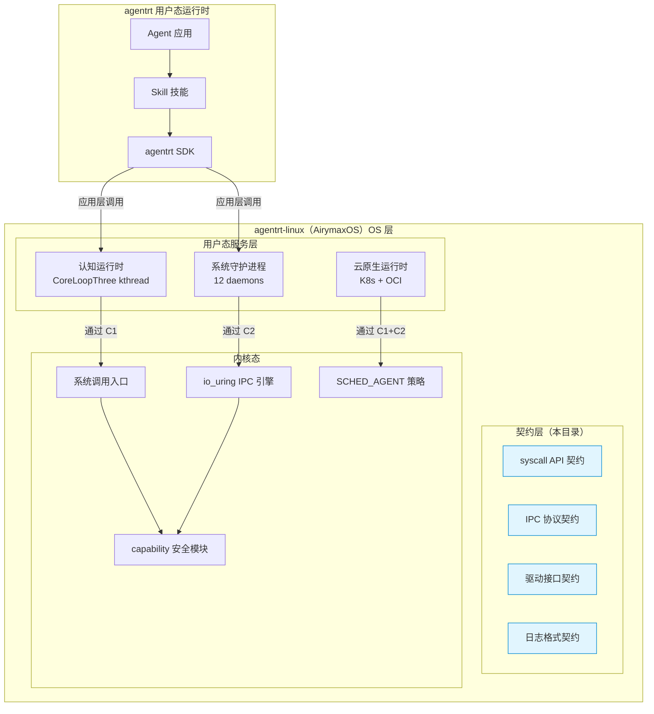
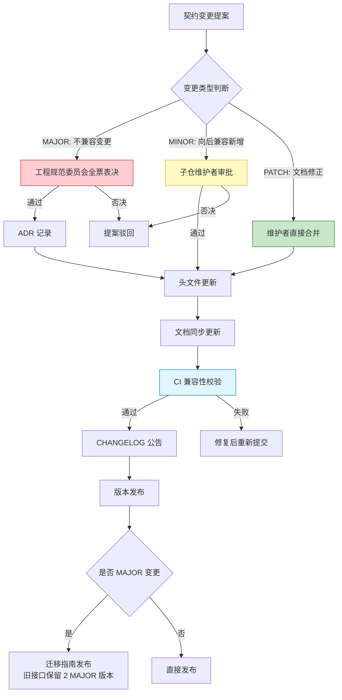

Copyright (c) 2025-2026 SPHARX Ltd. All Rights Reserved.

# agentrt-linux OS 层契约规范总览
> **文档定位**：agentrt-linux（AirymaxOS）OS 层契约规范体系的入口与索引\
> **文档版本**：0.1.1\
> **最后更新**：2026-07-13\
> **上级文档**：[工程标准规范手册](../00-engineering-standards-handbook.md)\
> **编号权威**：[09-ssot-registry.md §3](../09-ssot-registry.md)\
> **SSoT 依赖声明**：本子目录的规则编号登记于 [09-ssot-registry.md §3](../09-ssot-registry.md)。其中 `contracts.md`（Part III 日志格式契约）为日志格式与传输管道的唯一 SSoT。

---

## 1. 契约规范在 OS 层的定位

### 1.1 什么是 OS 层契约

agentrt-linux（AirymaxOS）的 OS 层契约规范定义各组件间的交互协议，是 agentrt-linux 内核态与用户态、进程与进程之间通信的"法律文书"。契约规范位于 agentrt-linux 文档体系的 `50-engineering-standards/20-contracts/` 目录下，与 agentrt 用户态契约规范形成互补——前者定义 OS 层（内核级）契约，后者定义应用层（用户态运行时）契约。

### 1.2 与 agentrt 用户态契约的关系

agentrt-linux 与 agentrt 遵循"同源且部分代码共享"原则（IRON-9 v2）。在契约层面，这一关系表现为三层结构：

| 契约层 | IRON-9 v2 分层 | 共享方式 | 涵盖内容 |
|--------|---------------|---------|---------|
| [SC] 共享契约层 | Shared Contract | 头文件完全共享，代码字面一致 | `syscalls.h` / `memory_types.h` / `security_types.h` / `cognition_types.h` |
| [SS] 语义同源层 | Semantic Symbiosis | 语义一致，实现各自独立 | syscall API 语义 / IPC 128B 消息头 / 日志格式 |
| [IND] 完全独立层 | Independent | 完全独立，无共享约束 | 驱动接口 / 内核态具体实现 |

**关键区分**：

- agentrt 用户态契约：定义应用层组件间的交互协议（HTTP/WS/Stdio 网关、JSON-RPC 2.0、Agent 契约、Skill 契约），位于 `docs/AirymaxRT/30-interfaces/07-rpc-api/`。
- agentrt-linux OS 层契约：定义 OS 级组件间的交互协议（系统调用 API、IPC 协议、驱动接口、日志格式），位于本目录。

### 1.3 契约在 OS 架构中的位置



**图 1**：agentrt-linux OS 层契约在整体架构中的位置。契约层位于用户态服务层与内核态之间，定义两者的交互边界。

---

## 2. IRON-9 v2 下的契约分层

### 2.1 [SC] 共享契约层：10 个共享头文件

[SC] 层是 agentrt 与 agentrt-linux 代码字面一致的头文件库，位于 `include/airymax/` 目录。这 10 个头文件是 agentrt-linux OS 层契约的"共享基础"：

| 头文件 | 全路径 | 定义内容 | 对应契约 |
|--------|--------|---------|---------|
| `syscalls.h` | `include/airymax/syscalls.h` | 12 核心 syscall 编号（AIRY_SYS_CALL/SEND/RECV/NBSEND/NBRECV/REPLY_RECV/YIELD/ROVOL_CTL/SCHED_CTL/CLT_NOTIFY/REPLY/NOTIFY）+ 12 预留槽位 | syscall API 契约 |
| `memory_types.h` | `include/airymax/memory_types.h` | MemoryRovol L1-L4 数据结构 + GFP 掩码语义 + PMEM 持久化接口 | syscall API 契约 |
| `security_types.h` | `include/airymax/security_types.h` | POSIX capability 41 ID 枚举 + LSM 钩子 252 ID 枚举 + Cupolas blob 布局 + capability 派生模型 + Vault backend 抽象 + 策略裁决 4 值枚举 | IPC 协议契约 |
| `cognition_types.h` | `include/airymax/cognition_types.h` | CoreLoopThree 阶段枚举 + Thinkdual 模式枚举 + LLM 推理阶段枚举 + Token 能效指标 + GPU/NPU 能力描述符 | syscall API 契约 |
| `sched.h` | `include/airymax/sched.h` | SCHED_EXT 调度类编号约束（复用内核 SCHED_EXT=7，禁止 SCHED_AGENT 宏）+ 任务描述符（magic 0x41475453 'AGTS'）+ vtime 衰减公式 + 优先级 0-139 + AIRY_SLICE_DFL（20ms） | syscall API 契约 |
| `ipc.h` | `include/airymax/ipc.h` | IPC magic（0x41524531 'ARE1'）+ 128B 消息头结构（struct airy_ipc_msg_hdr）+ SQE/CQE 操作码与标志位 | IPC 协议契约 |

**共享规则**：

1. [SC] 层头文件由 agentrt 和 agentrt-linux 的维护者共同维护，变更需双方工程规范委员会批准。
2. 头文件遵循语义化版本，MAJOR 版本变更需重新评审全部依赖方。
3. 头文件不得包含平台特定代码（如 `#ifdef __linux__`），跨平台兼容性由 agentrt 承担。
4. 每个头文件必须包含 `@since` 与 `@deprecated` 版本标记。

### 2.2 [SS] 语义同源层

[SS] 层涵盖语义一致但实现独立的契约维度。agentrt-linux 在 OS 层对这些契约进行内核级实现，agentrt 在用户态实现：

| 契约维度 | agentrt 用户态 | agentrt-linux OS 层 | 同源语义 |
|---------|---------------|-------------------|---------|
| syscall API | 无（用户态运行时） | `AIRY_SYS_*` 系统调用 | 任务管理、调度、记忆卷载语义一致 |
| IPC 128B 消息头 | AgentsIPC 用户态消息队列 | io_uring 零拷贝内核通道 | 消息头字段布局完全兼容 |
| 日志格式 | 结构化 JSON 日志 | 结构化 JSON 日志 + 内核 log_write() | 日志级别、TraceID、ANSI 颜色编码一致 |
| 错误码 | `include/airymax/error.h` | `include/airymax/error.h`（[SC] SSoT 同源共享） | 错误码值、语义、`strerror()` 描述一致 |

### 2.3 [IND] 完全独立层

[IND] 层涵盖 agentrt-linux 独有的 OS 级契约，agentrt 不涉及：

| 契约维度 | 说明 | 对应文档 |
|---------|------|---------|
| 驱动接口 | 设备模型、平台驱动、用户态驱动框架（VFIO/libvfio） | `60-driver-model/` |
| 内核态 eBPF kfunc | SCHED_AGENT 调度器注册的 kfunc 接口 | syscall API 契约 |
| io_uring 固定 OP 扩展 | `IORING_OP_IPC_SEND` 等内核级 IPC 操作码 | IPC 协议契约 |
| capability 内核级实现 | seL4 风格 capability 令牌的生成、派生、撤销 | IPC 协议契约 |

---

## 3. 契约规范清单

### 3.1 本目录文档索引

| # | 文档 | 核心内容 | 契约类别 | 目标行数 |
|---|------|---------|---------|---------|
| 1 | [README.md](README.md) | 总览（本文件） | 元契约（索引与治理） | 400-700 |
| 2 | [contracts.md](contracts.md) | 统一契约（IPC + Syscall + 日志） | 全部 | 1200-1500 |

### 3.2 契约分类矩阵

| 契约类别 | 覆盖子仓 | 通信方向 | 契约载体 | 关键约束 |
|---------|---------|---------|---------|---------|
| syscall API | kernel / cognition / memory / security | 用户态 → 内核态 | `airy_syscalls.h` + Doxygen | 编号不可变更、ABI 稳定、参数指针验证 |
| IPC 协议 | kernel / services / security | 进程 ↔ 进程 | 128B 消息头 + 5 种 payload | 消息头布局兼容 agentrt、io_uring 零拷贝 |
| 驱动接口 | kernel / services | 驱动 → 内核 | 设备模型 + platform_driver | 遵循 Linux 设备模型规范 |
| 日志格式 | 全部子仓 | 内核/用户态 → journald | 结构化 JSON + ANSI 颜色 | TRACE/DEBUG/INFO/WARN/ERROR/FATAL 六级 |

### 3.3 契约覆盖子仓矩阵

| 子仓 | syscall API | IPC 协议 | 驱动接口 | 日志格式 |
|------|------------|---------|---------|---------|
| kernel | `AIRY_SYS_TASK_*` / `IPC_*` / `SCHED_*` | io_uring 内核侧 | 平台驱动 | log_write() |
| services | 通过 syscall 调用 | 128B 消息头用户态 | 用户态驱动框架 | 结构化日志 |
| security | `AIRY_SYS_CAP_*` / `LSM_*` | capability 携带 | 不适用 | 审计日志 |
| memory | `AIRY_SYS_ROVOL_*` / `CXL_*` | MemoryRovol 迁移 | 不适用 | 结构化日志 |
| cognition | `AIRY_SYS_CLT_*` / `WASM_*` | CoreLoopThree 通知 | 不适用 | 结构化日志 |
| cloudnative | 不直接暴露 | gRPC + CRD | 不适用 | 结构化日志 |
| system | sysctl / procfs | 不直接暴露 | 不适用 | 结构化日志 |
| tests-linux | 不直接暴露 | 测试协议 | 不适用 | 结构化日志 |

---

## 4. 契约版本管理策略

### 4.1 语义化版本

agentrt-linux OS 层契约采用语义化版本（Semantic Versioning），版本号格式为 `MAJOR.MINOR.PATCH`：

| 版本号 | 变更类型 | 示例 | 评审要求 |
|--------|---------|------|---------|
| MAJOR | 不兼容的契约变更 | 系统调用编号重分配、消息头布局变更 | 工程规范委员会全票通过 |
| MINOR | 向后兼容的契约新增 | 新增系统调用编号、新增 IPC payload 类型 | 工程规范委员会多数通过 |
| PATCH | 契约文档修正与缺陷修复 | 注释修正、错误码描述纠正 | 对应子仓维护者审批 |

### 4.2 版本生命周期

```
契约版本 0.1.1
    │
    ├── 系统调用编号 512-631 预留（6 类 × 20 个）
    ├── 128B 消息头 v0x0100 锁定
    ├── 日志格式 Schema v1.0 锁定
    │
    ▼
契约版本 1.0.1（首个开发版本）
    │
    ├── 系统调用编号分配完成，开始实现
    ├── IPC 版本协商机制启用
    ├── 日志格式向后兼容演进
    │
    ▼
后续版本（MAJOR 升级）
    │
    ├── 废弃接口保留 2 个 MAJOR 版本
    └── 迁移指南随 MAJOR 版本发布
```

### 4.3 契约变更流程

所有契约变更必须通过以下流程：

1. **提案**：在 `agentrt-linux` 仓库提交 Issue，描述变更内容与理由。
2. **评审**：对应子仓维护者 + 工程规范委员会成员评审，评估影响范围。
3. **ADR 记录**：重大变更需创建架构决策记录（ADR），详见 [10-architecture/05-adrs.md](../../10-architecture/05-adrs.md)。
4. **实施**：更新头文件、文档、测试用例。
5. **公告**：通过 CHANGELOG.md 公告契约变更。
6. **验证**：CI 流水线运行契约兼容性检查（schema 校验、消息头布局校验）。

---

## 5. 契约兼容性保证

### 5.1 ABI 兼容性承诺

agentrt-linux OS 层契约在 MAJOR 版本内提供以下 ABI 兼容性保证：

| 契约维度 | 兼容性承诺 | 保障机制 |
|---------|-----------|---------|
| 系统调用编号 | MAJOR 版本内不可变更 | 编号分配表锁定，CI 自动校验 |
| 系统调用签名 | 参数不可删除、不可改变类型 | 头文件 schema 校验 |
| IPC 消息头布局 | 字段偏移不可变更 | `static_assert` 编译期校验 + CI 布局校验 |
| IPC 消息头 magic | 永不变更 | 常量锁定 `0x41524531`（'ARE1'） |
| 日志格式 Schema | MAJOR 版本内向后兼容 | JSON Schema 版本化 + 解析器兼容性测试 |
| 错误码值 | MAJOR 版本内不可变更 | 错误码值锁定，CI 自动校验 |

### 5.2 跨版本兼容策略

- **向前兼容**：新版本 agentrt-linux 内核必须能处理旧版本用户态服务发出的契约请求（通过 IPC 版本协商降级）。
- **向后兼容**：旧版本用户态服务可在新版本 agentrt-linux 内核上运行（通过系统调用编号不变性保证）。
- **同源兼容**：agentrt 用户态运行时在 agentrt-linux 上运行，IPC 消息头无需协议转换（[SS] 语义同源层保证）。

### 5.3 兼容性测试

| 测试类型 | 覆盖范围 | 工具 | 频率 |
|---------|---------|------|------|
| 系统调用编号校验 | 全部 512-631 编号 | `scripts/check_syscall_numbers.sh` | 每次 PR |
| IPC 消息头布局校验 | 128B 布局 | `static_assert` + `scripts/check_ipc_layout.sh` | 每次 PR |
| 日志格式 Schema 校验 | JSON Schema | `scripts/validate_log_schema.py` | 每次 PR |
| 跨版本兼容性测试 | MAJOR 版本间 | `tests-linux/compat/` | 每次发布 |
| 同源兼容性测试 | agentrt ↔ agentrt-linux | `tests-linux/homology/` | 每次发布 |

---

## 6. 设计原则遵循

### 6.1 五维正交 24 原则映射

本契约规范体系严格遵循五维正交 24 原则（详见 [10-architecture/02-five-dimensional-principles.md](../../10-architecture/02-five-dimensional-principles.md)）：

| 原则 | 编号 | 在契约规范中的体现 | 对应章节 |
|------|------|-------------------|---------|
| 接口契约化 | K-2 | 所有跨模块交互通过明确定义的契约进行，包含签名、语义、所有权、线程安全性 | 全文 |
| 文档即代码 | E-7 | 契约文档与头文件同步，Doxygen 注释即契约声明 | 第 4 章 |
| 安全内生 | E-1 | capability 令牌传递、参数指针验证、审计日志 | syscall / IPC 契约 |
| 可观测性 | E-2 | TraceID 贯穿、日志格式标准化、结构化输出 | 日志格式契约 |
| 资源确定性 | E-3 | 资源生命周期通过契约显式定义（创建/销毁/所有权） | syscall 契约 |
| 命名语义化 | E-5 | `AIRY_SYS_*` / `airy_ipc_*` / `log_write()` 命名规范 | 全文 |
| 错误可追溯 | E-6 | 错误码体系 `AIRY_E*` 与 `airy_strerror()` | syscall 契约 |
| 简约至上 | A-1 | 契约接口最小化，128B 定长消息头，6 类系统调用 | 全文 |

### 6.2 IRON-9 v2 同源且部分代码共享

本契约规范体系是 IRON-9 v2"同源且部分代码共享"原则在 OS 层契约的落地：[SC] 层 10 个头文件完全共享，[SS] 层语义一致但实现独立，[IND] 层完全独立。详见第 2 章 IRON-9 v2 契约分层。

---

## 7. 相关文档

- [agentrt-linux 设计文档](../../README.md)
- [架构设计](../../10-architecture/01-system-architecture.md)
- [五维正交 24 原则](../../10-architecture/02-five-dimensional-principles.md)
- [接口设计](../../30-interfaces/README.md)
- [系统调用接口](../../30-interfaces/01-syscalls.md)
- [IPC 协议](../../30-interfaces/02-ipc-protocol.md)
- [编码规范](../../30-interfaces/04-coding-standard.md)
- [agentrt 用户态契约](../../../AirymaxRT/30-interfaces/07-rpc-api/README.md)

---

## 8. 契约治理与维护

### 8.1 契约治理模型

agentrt-linux OS 层契约的治理遵循"分层负责、架构仲裁"模型：

| 治理层级 | 角色 | 职责 | 对应契约 |
|---------|------|------|---------|
| 工程规范委员会 | 最终仲裁 | 跨契约冲突裁决、MAJOR 版本变更审批 | 全部契约 |
| 子仓维护者 | 领域负责 | 对应契约的 MINOR/PATCH 变更审批 | 按子仓分配 |
| 契约文档维护者 | 文档质量 | 契约文档一致性检查、格式规范、CI 校验 | 全部契约 |
| 社区贡献者 | 提案与反馈 | 提交契约变更提案、报告契约缺陷 | 全部契约 |

### 8.2 契约文档质量门禁

每个契约文档发布前必须通过以下质量门禁：

| 门禁 | 检查项 | 工具 | 阈值 |
|------|--------|------|------|
| 格式校验 | Markdown 格式、Mermaid 图表语法 | `markdownlint` + `mermaid-cli` | 0 错误 |
| 术语一致性 | 禁止词扫描、术语表对照 | `scripts/check_terminology.sh` | 0 违禁词 |
| 链接有效性 | 内部链接、外部引用 | `markdown-link-check` | 0 死链 |
| 版本标记 | `@since` / `@deprecated` 完整性 | `scripts/check_version_tags.sh` | 100% 覆盖 |
| 头文件对齐 | 契约文档与 C 头文件一致性 | `scripts/check_header_contract_align.sh` | 100% 对齐 |

### 8.3 契约冲突解决

当 agentrt 用户态契约与 agentrt-linux OS 层契约出现语义冲突时，按以下优先级解决：

1. **[SC] 共享契约层优先**：共享头文件定义为准，双方必须一致。
2. **[SS] 语义同源层协商**：语义冲突通过工程规范委员会协商，以 agentrt-linux OS 层实现可行性为底线。
3. **[IND] 完全独立层自主**：各自独立演进，不存在冲突。
4. **工程规范委员会最终仲裁**：无法协商解决的冲突，由工程规范委员会投票裁决。

---

## 9. 契约演进路线图

### 9.1 短期（0.1.1 文档体系完成）

- [x] 本目录 4 份契约文档完成初稿
- [x] IRON-9 v2 三层契约分层定义完成
- [x] [SC] 层 10 个共享头文件清单确认
- [x] 系统调用编号 512-631 预留段分配
- [x] 128B 消息头 v0x0100 布局锁定
- [x] 日志格式 JSON Schema v1.0 锁定

### 9.2 中期（1.0.1 首个开发版本）

- [ ] 系统调用编号分配完成，开始内核实现
- [ ] IPC 版本协商机制编码实现
- [ ] io_uring 固定 OP 扩展（`IORING_OP_IPC_SEND` 等）注册
- [ ] capability 内核级令牌生成与派生实现
- [ ] 日志格式向后兼容演进，新增字段
- [ ] 契约兼容性 CI 流水线建立

### 9.3 长期（后续 MAJOR 版本）

- [ ] 契约版本 2.0 规划（可能包括消息头扩展、新系统调用分类）
- [ ] 废弃接口清理与迁移指南发布
- [ ] 契约形式化验证（seL4 风格数学证明）
- [ ] 跨发行版契约兼容性认证（参考发行版或 主流 Linux 发行版标准）

---

## 10. 术语对照表

本目录契约文档使用的核心术语与 agentrt 用户态契约保持同源语义：

| 术语 | agentrt-linux OS 层含义 | 同源 agentrt 含义 | IRON-9 v2 分层 |
|------|------------------------|-------------------|---------------|
| 契约 (Contract) | 组件间交互协议的法律定义 | 同源 | [SC] / [SS] |
| 系统调用 (Syscall) | 用户态进入内核态的唯一入口 | 不适用（agentrt 无内核态） | [IND] |
| AgentsIPC | 128B 定长消息头协议 | 同源（语义一致） | [SS] |
| Cupolas | capability 安全模型 | 同源（语义一致） | [SS] |
| MemoryRovol | 记忆卷载四层模型 | 同源（语义一致） | [SS] |
| CoreLoopThree | 认知循环三阶段状态机 | 同源（语义一致） | [SS] |
| SCHED_AGENT | sched_ext eBPF 调度类 | 同源 MicroCoreRT 调度 | [SS] |
| io_uring | Linux 内核异步 I/O 框架 | 不适用（agentrt 无内核态） | [IND] |
| bpf_struct_ops | BPF 结构体操作共享头文件 | 同源（代码字面一致） | [SC] |
| TraceID | 分布式链路追踪标识 | 同源（OpenTelemetry） | [SS] |

---

## 11. Mermaid 图表：契约演进与版本管理流程



**图 2**：agentrt-linux OS 层契约变更与版本管理流程。MAJOR 变更需工程规范委员会全票通过并记录 ADR，MINOR 变更由子仓维护者审批，PATCH 变更直接合并。

---

## 12. 版本历史

| 版本 | 日期 | 变更 |
|------|------|------|
| 0.1.1 | 2026-07-07 | 初始版本（agentrt-linux OS 层契约规范总览，含 IRON-9 v2 三层契约分层、4 大契约规范索引、版本管理策略、兼容性保证） |
| 0.1.1 | 2026-07-13 | seL4 SEL4-01~08 + 6 项新发现设计模式对齐 + [SC] 物理宿主 Tab 8 缩进验证 |
| 1.0.1 | 2027-XX-XX | 首个开发版本（契约实现与代码同步验证） |

---

Copyright (c) 2025-2026 SPHARX Ltd. All Rights Reserved.