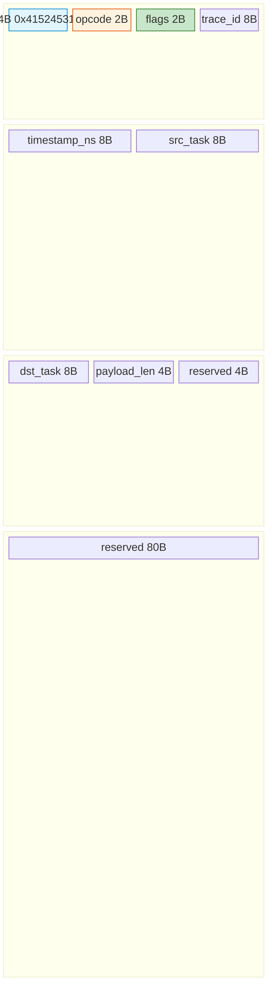
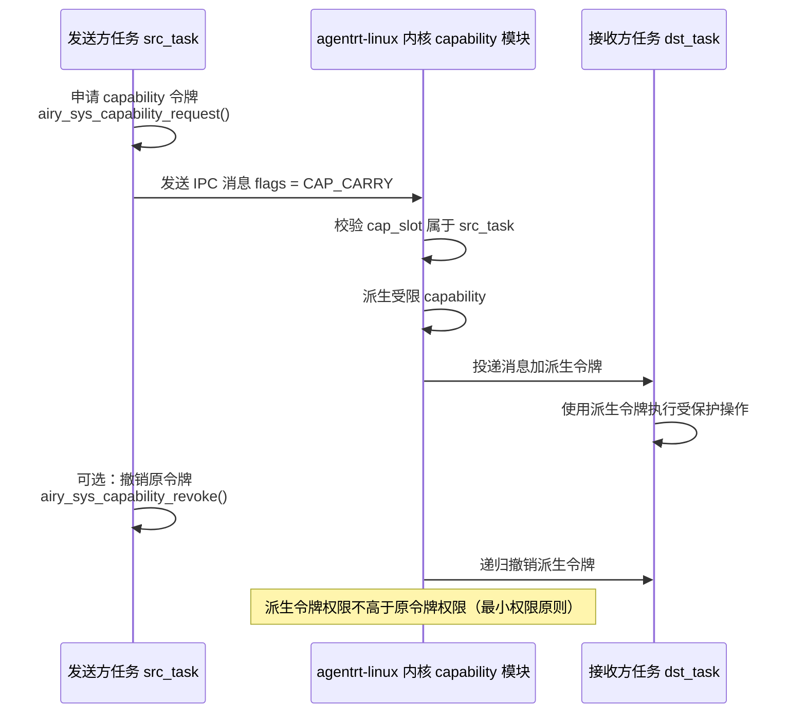
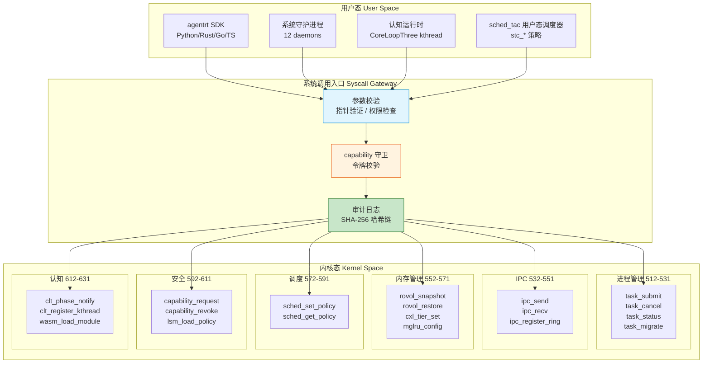
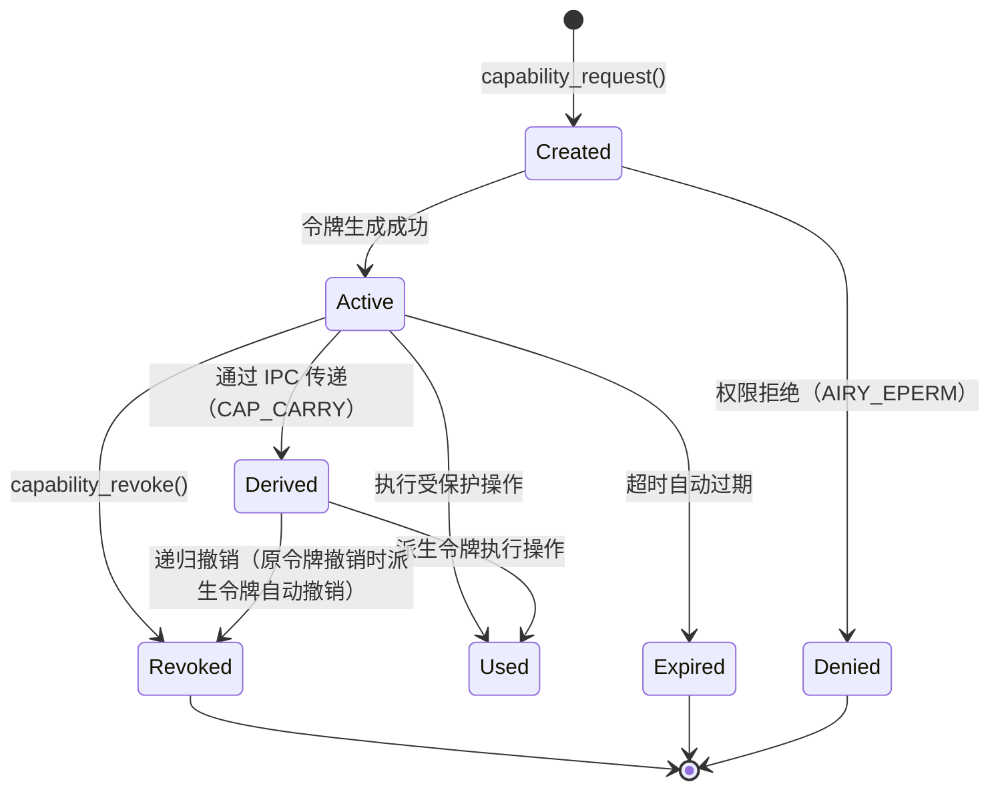
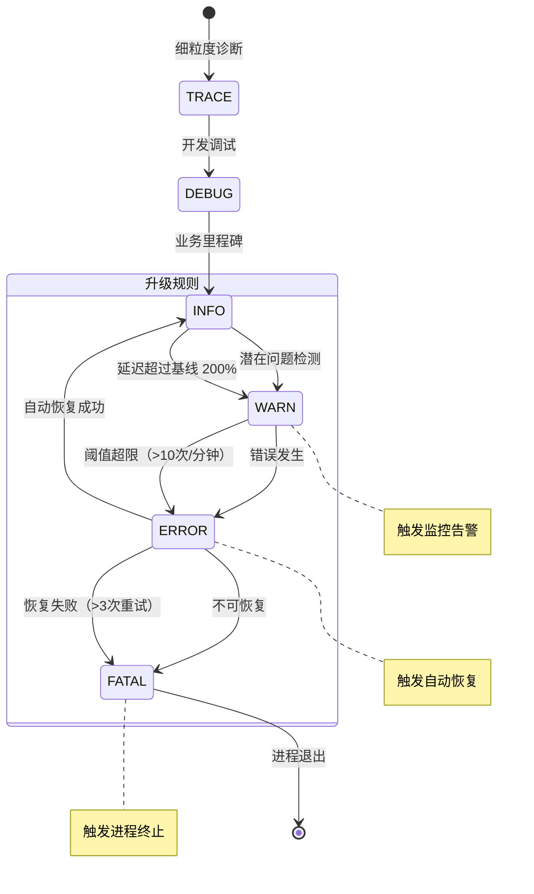

Copyright (c) 2025-2026 SPHARX Ltd. All Rights Reserved.

# agentrt-linux OS 层契约规范
> **文档定位**：agentrt-linux（AirymaxOS）OS 层三大契约的统一文档，涵盖 IPC 协议、系统调用 API、日志格式\
> **文档版本**：0.1.1\
> **最后更新**： 2026-07-21\
> **上级文档**：[agentrt-linux（AirymaxOS）工程标准规范](README.md)

---

## Part I: IPC 协议契约

### 1. IPC 协议设计原则

agentrt-linux（AirymaxOS）IPC 协议与 agentrt AgentsIPC 同源，保留 128 字节定长消息头设计，并在底层升级为基于 io_uring 的零拷贝实现。协议设计遵循以下原则，与五维正交 24 原则对齐：

| 原则 | 编号 | 在 IPC 协议中的体现 |
|------|------|-------------------|
| 接口契约化 | K-2 | 128B 消息头布局锁定，字段偏移不可变更，版本协商机制 |
| 机制与策略分离 | K-1 | 协议提供消息传递机制（send/recv），消息语义（RPC/事件/流）由 payload 类型决定 |
| 安全内生 | E-1 | capability 令牌携带与校验、消息认证、防重放保护 |
| 可观测性 | E-2 | 消息头携带 trace_id（OpenTelemetry）与 timestamp_ns，全链路可追踪 |
| 资源确定性 | E-3 | io_uring ring 注册/注销显式生命周期，registered buffers 预分配 |
| 简约至上 | A-1 | 128B 定长消息头等于 2 个 cache line，单次预取加载完整消息头 |

---

### 2. AgentsIPC 128B 消息头布局

#### 2.1 消息头结构定义

消息头定义位于头文件 `services/ipc/io-uring-ipc/airy_ipc_msg.h`，与 agentrt AgentsIPC 128B 消息头布局兼容（[SS] 语义同源层）。

```c
/* IPC 128B 消息头定义见 [SC] 共享契约层（SSoT），不就地重定义 */
#include <airymax/ipc.h>
/* 结构体名称：struct airy_ipc_msg_hdr（Layout C，物理宿主见
 * 50-engineering-standards/120-cross-project-code-sharing.md §Layout C） */
```

> **SSoT 声明**：本契约不再就地重定义 IPC 128B 消息头，以 `include/uapi/linux/airymax/ipc.h`（物理宿主见 `50-engineering-standards/120-cross-project-code-sharing.md` §Layout C）为单一数据源。结构体名称为 `struct airy_ipc_msg_hdr`，D-9 修复后使用 `__attribute__((aligned(64)))` 对齐（移除 `__attribute__((packed))`，参考 OLK 6.6 `struct ethhdr`/`struct iphdr` 手动安排字段自然对齐）与 `__u32`/`__u16`/`__u64`/`__u8` UAPI 类型；字段顺序为 magic/opcode/flags/trace_id/timestamp_ns/src_task/dst_task/capability_badge/payload_len/crc32/reserved[72]（capability_badge 前移至 offset 40 恢复 8 字节自然对齐）。下方字段语义表以 SSoT Layout C v4 为准。

#### 2.2 字段语义表

| 字段 | 偏移 | 长度 | 类型 | 语义 | 契约约束 |
|------|------|------|------|------|---------|
| magic | 0 | 4 | __u32 | 魔数 0x41524531（'ARE1'），协议识别 | 永不变更，与 agentrt 逐字节一致（[SC] 共享） |
| opcode | 4 | 2 | __u16 | 操作码，见 [SC] `ipc.h` AIRY_IPC_OP_* 宏（SEND=0x0001/RECV=0x0002/SEND_BATCH=0x0003/CANCEL=0x0004/FREEZE=0x0005/CAP_REQUEST=0x0010/CAP_RESPONSE=0x0011） | 新增操作码只能追加，不覆写已有值 |
| flags | 6 | 2 | __u16 | 标志位（NOWAIT/SIGNAL [SC] 基本标志 + 扩展标志） | 位定义见 Part I §2.3，低 2 位由 [SC] SSoT 锁定 |
| trace_id | 8 | 8 | __u64 | OpenTelemetry 链路追踪 ID | 生成时使用单调递增加随机后缀 |
| timestamp_ns | 16 | 8 | __u64 | CLOCK_REALTIME 纳秒时间戳 | 对齐北京时间（UTC+8） |
| src_task | 24 | 8 | __u64 | 源任务 ID（agentrt task token / 内核 task ID） | 内核校验真实性，用户态不可伪造 |
| dst_task | 32 | 8 | __u64 | 目标任务 ID，0 表示广播 | 内核校验目标可达性 |
| capability_badge | 40 | 8 | __u64 | [SS] Capability Folding Badge（agentrt-linux 内核由 sec_d 编译，agentrt 用户态始终为 0） | D-9 修复后 8 字节对齐至 offset 40 |
| payload_len | 48 | 4 | __u32 | payload 字节数，0 表示无 payload | 最大 64 MiB |
| crc32 | 52 | 4 | __u32 | CRC32 覆盖 header[0:52) + payload | 发送方计算填入 |
| reserved | 56 | 72 | __u8[72] | 保留字段（[56:64) CL1 尾部 + [64:128) CL2） | 填充为 0，未来扩展 |

#### 2.3 标志位定义

| 标志位 | 值 | 层级 | 语义 | 安全约束 |
|--------|-----|------|------|---------|
| AIRY_IPC_F_NOWAIT | 0x0001 | [SC] SSoT | 非阻塞操作（对应 io_uring IOSQE_ASYNC） | 调用方须处理 EAGAIN |
| AIRY_IPC_F_SIGNAL | 0x0002 | [SC] SSoT | 完成后投递信号（对应 io_uring IORING_CQE_F_NOTIF） | 信号目标须持有 sig_perm |
| AIRY_IPC_F_ZEROCOPY | 0x0004 | [IND] 扩展 | 使用 io_uring 零拷贝路径（IORING_OP_URING_CMD + registered buffer） | 发送方必须注册 buffer |
| AIRY_IPC_F_CAP_CARRY | 0x0008 | [IND] 扩展 | 消息携带 capability 令牌 | 内核校验令牌有效性 |
| AIRY_IPC_F_COMPRESS | 0x0010 | [IND] 扩展 | payload 已压缩（LZ4） | 接收方自动解压 |
| AIRY_IPC_F_ENCRYPT | 0x0020 | [IND] 扩展 | payload 已加密（SM4） | 密钥由 capability 携带 |
| AIRY_IPC_F_URGENT | 0x0040 | [IND] 扩展 | 紧急消息，优先投递 | 仅 SCHED_FIFO 实时类可用 |
| AIRY_IPC_F_NOREPLY | 0x0080 | [IND] 扩展 | 无需响应（单向通知） | 仅 EVENT payload 类型可用 |

> **bit 冲突消解说明**：SSoT [SC] 锁定 bit 0-1 为 NOWAIT/SIGNAL（`include/uapi/linux/airymax/ipc.h`）。扩展标志（ZEROCOPY/CAP_CARRY/COMPRESS/ENCRYPT/URGENT/NOREPLY）重新编号从 bit 2 开始，消除旧 `AIRY_IPC_FLAG_*` 前缀中 ZEROCOPY(bit 0)/CAP_CARRY(bit 1) 与 SSoT NOWAIT(bit 0)/SIGNAL(bit 1) 的 bit 位冲突。标志位类型为 `__u16`（对应消息头 `flags` 字段），前缀统一为 `AIRY_IPC_F_*`（对齐 SSoT 命名）。

#### 2.4 消息头布局可视化



**图 1**：AgentsIPC 128B 消息头布局（SSoT Layout C，`struct airy_ipc_msg_hdr`）。magic 用于协议识别（蓝色），opcode+flags 控制传输行为与标志位（橙色/绿色），trace_id+timestamp_ns 提供可观测性，src_task/dst_task 标识通信双方任务，payload_len 标识 payload 长度，reserved 84B 预留未来扩展。布局与 agentrt AgentsIPC 128B 消息头逐字节相同（[SC] 共享契约层）。

---

### 3. 消息类型枚举

> **SSoT 对齐说明**：SSoT Layout C（`struct airy_ipc_msg_hdr`）不含 `type` 字段——头部仅承载传输层语义（opcode/flags）。下列五种 payload 协议类型是 **payload 层**概念，由 payload 首部 `payload_type` 字段（`__u16`，payload 前 2 字节）标识，而非消息头字段。此设计与 K-1（机制与策略分离）对齐：头部管传输（send/recv），payload 管语义（RPC/事件/流）。

#### 3.1 五种 payload 协议

| payload_type 值 | 协议名称 | 通信模式 | 典型用途 | 可靠性要求 |
|---------|---------|---------|---------|-----------|
| 0x0001 | REQUEST | 同步 RPC（请求-响应） | RPC 调用、系统服务查询 | 可靠投递，超时重试 |
| 0x0002 | RESPONSE | 同步 RPC（请求-响应） | RPC 响应 | 可靠投递 |
| 0x0003 | EVENT | 发布-订阅 | 状态变更通知、日志事件 | 尽力投递，允许丢失 |
| 0x0004 | STREAM | 双向流 | 流式数据传输、LLM token 流 | 可靠投递，有序 |
| 0x0005 | NOTIFICATION | 单向通知 | 系统广播、心跳 | 尽力投递，无需响应 |

#### 3.2 REQUEST / RESPONSE payload

REQUEST payload 用于发起 RPC 调用，RESPONSE 用于返回结果。两者通过 request_id 配对：

```c
typedef struct airy_ipc_request {
    uint64_t request_id;      /* 请求 ID（与 RESPONSE.request_id 对应） */
    uint32_t method_id;       /* 方法 ID（RPC 方法编号） */
    uint32_t timeout_ms;      /* 超时（毫秒），0 表示无超时 */
    uint8_t  params[];        /* 方法参数（柔性数组，最大 1 MiB） */
} airy_ipc_request_t;

typedef struct airy_ipc_response {
    uint64_t request_id;      /* 请求 ID（与 REQUEST.request_id 对应） */
    int32_t  status;          /* 状态码（0 成功，<0 AIRY_E* 错误码） */
    uint32_t reserved;        /* 保留字段 */
    uint8_t  result[];        /* 结果数据（柔性数组） */
} airy_ipc_response_t;
```

#### 3.3 EVENT payload

EVENT payload 用于发布-订阅模式的事件通知：

```c
typedef struct airy_ipc_event {
    uint64_t event_id;        /* 事件 ID（全局唯一） */
    uint32_t topic_id;        /* 主题 ID（订阅时分配） */
    uint32_t priority;        /* 事件优先级（0-139，对齐 sched_tac 调度策略） */
    uint8_t  payload[];       /* 事件数据（柔性数组） */
} airy_ipc_event_t;
```

#### 3.4 STREAM payload

STREAM payload 用于双向流式数据传输，支持 FIN/RST/MORE 流控标志：

```c
typedef struct airy_ipc_stream {
    uint64_t stream_id;       /* 流 ID */
    uint32_t seq;             /* 序列号（递增，用于重排序） */
    uint32_t flags;           /* 流标志（FIN/RST/MORE） */
    uint8_t  chunk[];         /* 流数据块（柔性数组） */
} airy_ipc_stream_t;

#define AIRY_IPC_STREAM_FLAG_FIN  0x00000001u  /* 流结束 */
#define AIRY_IPC_STREAM_FLAG_RST  0x00000002u  /* 流重置 */
#define AIRY_IPC_STREAM_FLAG_MORE 0x00000004u  /* 更多数据 */
```

#### 3.5 NOTIFICATION payload

NOTIFICATION payload 用于单向通知，无需响应确认：

```c
typedef struct airy_ipc_notification {
    uint64_t notif_id;        /* 通知 ID */
    uint32_t category;        /* 通知类别（0=系统/1=安全/2=认知/3=运维） */
    uint32_t severity;        /* 严重级别（0=INFO/1=WARN/2=ERROR/3=FATAL） */
    uint8_t  message[];       /* 通知消息（柔性数组） */
} airy_ipc_notification_t;
```

---

### 4. 优先级与 QoS 规范

#### 4.1 消息优先级

IPC 消息优先级与 sched_tac 调度策略优先级对齐（0-139），按任务类别映射：

| 优先级范围 | 类别 | 延迟预算 | 调度策略 | 典型场景 |
|-----------|------|---------|---------|---------|
| 0-49 | 实时控制 | < 1 ms | stc_realtime | 具身智能运动控制指令 |
| 50-99 | 交互响应 | < 10 ms | stc_interactive | 用户对话请求/响应 |
| 100-119 | Agent 认知 | < 100 ms | stc_agent | CoreLoopThree 阶段通知 |
| 120-139 | 批处理 | < 1 s | stc_batch | 日志传输、记忆迁移 |

#### 4.2 QoS 保证

| QoS 维度 | 保证内容 | 实现机制 |
|---------|---------|---------|
| 可靠投递 | REQUEST/RESPONSE/STREAM 类型保证投递 | 发送方确认加超时重传（最多 3 次） |
| 有序投递 | STREAM 类型保证顺序 | 内核 seq 递增加接收方重排序缓冲 |
| 优先级调度 | 高优先级消息优先投递 | io_uring SQ 优先级队列加内核优先级调度 |
| 反压控制 | 接收方缓冲区满时暂停发送 | 控制消息 FLOW_OFF / FLOW_ON |
| 超时处理 | 超过延迟预算的消息返回 AIRY_ETIMEDOUT | 发送方设置 timeout_ms，内核超时返回 |

---

### 5. Capability 传递机制（基于 Cupolas）

#### 5.1 传递流程

当消息头 flags 中置位 AIRY_IPC_F_CAP_CARRY 时，消息可携带 capability 令牌跨进程传递。传递基于 Cupolas 安全模型，遵循 seL4 风格的不可伪造语义：



**图 2**：capability 令牌跨进程传递时序图。发送方令牌被内核验证后派生受限令牌至接收方，原令牌撤销时派生令牌递归撤销。

#### 5.2 传递规则

| 规则 | 说明 | 违反后果 |
|------|------|---------|
| 不可伪造 | 令牌由内核生成，进程无法伪造 | 伪造令牌被内核拒绝，返回 AIRY_EPERM |
| 最小权限 | 派生令牌权限不高于原令牌权限 | 超权限操作被内核拒绝 |
| 递归撤销 | 撤销原令牌时，所有派生令牌自动撤销 | 内核遍历派生链，级联撤销 |
| 超时过期 | 令牌可设置有效期，超时自动过期 | 过期令牌返回 AIRY_ETIMEDOUT |
| 单次使用 | 令牌可标记为一次性，使用后自动撤销 | 重复使用返回 AIRY_EBUSY |

#### 5.3 限制

- 单次 IPC 消息最多携带 1 个 capability 令牌。
- 令牌传递链最大深度 16 层（防止无限派生）。
- 令牌传递必须在同一 agentrt-linux 节点内（跨节点传递需通过安全网关）。

---

### 6. io_uring 作为传输层

#### 6.1 传输层架构

agentrt-linux IPC 基于 Linux 6.6 内核基线的 io_uring 子系统，在标准 io_uring 之上注册以下 IPC 专用 OP（固定操作码扩展）：

| OP | 用途 | 零拷贝 | 批量 |
|----|------|--------|------|
| IORING_OP_IPC_SEND | 发送 IPC 消息（128B 头加 payload） | 是（IORING_OP_URING_CMD + registered buffer） | 是（SQE 批量提交） |
| IORING_OP_IPC_RECV | 接收 IPC 消息 | 是（IORING_OP_URING_CMD） | 是 |
| IORING_OP_IPC_REGISTER_RING | 注册跨进程 ring | 不适用 | 否 |
| IORING_OP_IPC_DEREGISTER_RING | 注销跨进程 ring | 不适用 | 否 |

#### 6.2 零拷贝机制

io_uring 零拷贝路径通过以下三步实现，消除 CPU 数据复制：

1. Registered Buffers：发送方通过 io_uring_register_buffers() 预注册内存页，内核持有 page 引用。
2. Page Flipping：接收方通过 IORING_OP_IPC_RECV 接收时，内核仅翻转 page table entry，不拷贝数据。发送方页面被映射到接收方地址空间。
3. Buffer Return：接收方处理完毕后，通过 IORING_OP_IPC_RECV_DONE 归还页面，内核翻转回发送方。

零拷贝性能：单核 128B 消息可达 100K+ msg/s（P99 延迟 < 10 μs），1MB 大消息吞吐 > 10 Gbps。

#### 6.3 跨进程 ring 共享

```c
/**
 * @brief 注册 io_uring ring 给目标任务（跨任务 ring 共享）
 *
 * 通过 io_uring_register 将 ring fd 注册给 dst_task，
 * 实现零拷贝跨任务通道。ring 注册后，发送方和接收方共享
 * 同一个 SQ/CQ 对，通过内核 IORING_OP_URING_CMD 传递数据。
 *
 * @param ring_fd   io_uring ring 文件描述符
 * @param dst_task  目标任务 ID（对应消息头 dst_task 字段，__u64）
 * @return 0 成功，<0 AIRY_E* 错误码
 *
 * @since 1.0.1
 */
AIRY_API int airy_sys_ipc_register_ring(int ring_fd, uint64_t dst_task);
```

安全约束：ring 注册前必须通过 capability 校验。src_task 须持有 ipc.ring.share 权限，dst_task 须持有 ipc.ring.accept 权限。

---

### 7. 与 agentrt 的 IPC 契约共享（[SC] 层）

#### 7.1 共享范围

agentrt-linux IPC 与 agentrt AgentsIPC 通过 IRON-9 v3 四层契约共享：

| IRON-9 v3 分层 | 共享内容 | 共享方式 | 对应 agentrt 模块 |
|---------------|---------|---------|------------------|
| [SC] 共享契约层 | security_types.h（Cupolas capability 令牌结构） | 代码字面一致 | cupolas |
| [SS] 语义同源层 | 128B 消息头布局、magic 'ARE1'、trace_id、timestamp_ns | 语义一致，实现独立 | atoms/ipc (AgentsIPC) |
| [IND] 完全独立层 | io_uring 固定 OP、跨进程 ring 共享、内核 capability 校验 | 完全独立 | 不适用 |

#### 7.2 同源兼容性

agentrt 在 agentrt-linux 上运行时，IPC 消息头布局完全兼容，无需协议转换层：

- agentrt 发出的 128B 消息头可直接被 agentrt-linux io_uring 通道接收。
- agentrt-linux 发出的消息头可被 agentrt 用户态消息队列接收。
- 消息头 magic 字段 0x41524531（'ARE1'）两端一致，用于协议识别。
- trace_id 和 timestamp_ns 字段语义一致，跨端追踪无缝衔接。

---

### 8. 安全考量

#### 8.1 消息认证

| 认证机制 | 说明 | 实现位置 |
|---------|------|---------|
| 任务身份验证 | src_task 由内核填充，用户态不可伪造 | 内核 current->task_token |
| 消息完整性 | 可选 HMAC-SHA256（通过 AIRY_IPC_F_ENCRYPT 标志） | 发送方签名，接收方校验 |
| 重放保护 | timestamp_ns 加单调递增 seq（STREAM 类型） | 接收方窗口校验 |

#### 8.2 能力传递安全

- capability 令牌由内核生成，用户态无法伪造。
- 令牌传递时内核校验 src_task 是否持有该令牌。
- 派生令牌权限受限于原令牌权限（最小权限原则）。
- 原令牌撤销时，派生令牌递归撤销。

#### 8.3 防重放保护

| 消息类型 | 防重放机制 | 窗口大小 |
|---------|-----------|---------|
| REQUEST | request_id 去重加 timestamp_ns 窗口校验 | 60 秒窗口 |
| RESPONSE | 与 REQUEST 配对，REQUEST 去重即可 | 复用 REQUEST 窗口 |
| STREAM | stream_id 加 seq 递增序列号 | 1024 序列号窗口 |
| EVENT / NOTIFICATION | 尽力投递，不保证去重 | 不适用 |

#### 8.4 资源耗尽防护

| 防护措施 | 说明 | 阈值 |
|---------|------|------|
| 消息速率限制 | 每进程每秒最大消息数 | 100K msg/s |
| payload 大小限制 | 单条消息最大 payload | 64 MiB |
| ring 注册数量限制 | 每进程最大 ring 注册数 | 16 |
| 令牌传递深度限制 | 最大派生链深度 | 16 |
| 超时强制 | 超过 timeout_ms 的消息自动丢弃 | 默认 30 s |

---

### 9. IPC 性能约束

#### 9.1 性能指标

| 指标 | 目标值 | 测量方法 | 约束 ID |
|------|--------|---------|---------|
| 128B 消息吞吐 | > 100K msg/s（单核） | io_uring-bench --zerocopy --msg-size 128 | NFR-P-002 |
| 128B 消息延迟 | < 10 μs（P99） | airy_sys_ipc_send + airy_sys_ipc_recv 往返 | NFR-P-002a |
| 1MB 大消息吞吐 | > 10 Gbps | 零拷贝 IORING_OP_URING_CMD + registered buffer 吞吐测试 | NFR-P-002b |
| 跨节点 IPC | > 1M msg/s（4 节点） | 超节点 OS 跨节点 IPC 基准 | NFR-P-002c |
| 消息丢失率 | < 0.001%（可靠投递类型） | Soak Test 72 小时持续负载 | NFR-P-002d |

#### 9.2 性能回归保护

- 每次 PR 运行 tests-linux/benchmark/ipc-latency 与 ipc-throughput 微基准。
- 与基线对比，吞吐退化 > 5% 或延迟退化 > 10% 自动打回。
- Soak Test 72 小时持续 IPC 负载，验证无内存泄漏、无性能衰减。

---

### 10. 相关文档

- [20-contracts README](README.md)
- [接口设计 - IPC 协议](../../30-interfaces/02-ipc-protocol.md)
- [接口设计 - 系统调用](../../30-interfaces/01-syscalls.md)
- [五维正交 24 原则](../../10-architecture/02-five-dimensional-principles.md)
- [安全设计](../../20-modules/03-security.md)
- [服务设计](../../20-modules/02-services.md)
- [非功能性需求](../../00-requirements/03-non-functional-requirements.md)（NFR-P-002）

---

### 11. 版本历史

| 版本 | 日期 | 变更 |
|------|------|------|
| 0.1.1 | 2026-07-07 | 初始版本（128B 消息头布局锁定、5 种 payload 协议定义、io_uring 零拷贝传输层、capability 传递机制、安全考量、IRON-9 v3 [SC]/[SS]/[IND] 三层契约共享） |
| 1.0.1 | 2027-XX-XX | 首个开发版本（IPC 版本协商机制实现、io_uring 固定 OP 注册、跨进程 ring 共享实现） |
| v1.0.1 | 2026-07-21 | 版本号统一：按 IRON-8 铁律，所有文档版本号统一为 v1.0.1（禁止 v1.0/v1.1/v1.1.1/v1.2/v2.0 中间过渡版本） |

---

## Part II: 系统调用 API 契约

### 1. 系统调用分类

agentrt-linux（AirymaxOS）在 Linux 6.6 内核基线的标准系统调用之上，新增 Agent 感知专用系统调用，统一使用 `airy_` 前缀。系统调用分为 6 大类，覆盖 8 子仓的内核入口：

| # | 分类 | 前缀 | 编号段 | 核心职责 | 覆盖子仓 | 同源 agentrt |
|---|------|------|--------|---------|---------|--------------|
| 1 | 进程管理 | `AIRY_SYS_TASK_*` | 512-531 | Agent 任务的创建、提交、取消、状态查询、迁移 | kernel / cognition | MicroCoreRT 调度 |
| 2 | IPC | `AIRY_SYS_IPC_*` | 532-551 | 进程间消息传递、io_uring ring 注册、零拷贝通道 | kernel / services | AgentsIPC |
| 3 | 内存管理 | `AIRY_SYS_ROVOL_*` | 552-571 | 记忆卷载快照/恢复、CXL 内存分层、MGLRU 配置 | kernel / memory | MemoryRovol |
| 4 | 调度 | `AIRY_SYS_SCHED_*` | 572-591 | sched_tac 策略设置、stc_* 策略管理 | kernel | MicroCoreRT sub-scheduler |
| 5 | 安全 | `AIRY_SYS_CAP_*` | 592-611 | capability 令牌申请/撤销、LSM 策略加载、审计 | kernel / security | Cupolas 权限 |
| 6 | 认知 | `AIRY_SYS_CLT_*` | 612-631 | CoreLoopThree 阶段通知、kthread 注册、Wasm 模块加载 | kernel / cognition | CoreLoopThree |

#### 1.1 分类设计原则

agentrt-linux 系统调用分类遵循以下原则，与五维正交 24 原则中的 K-1（内核极简）和 K-4（可插拔策略）对齐：

| 原则 | 编号 | 在系统调用分类中的体现 |
|------|------|----------------------|
| 机制在内核，策略在用户态 | K-1 | 系统调用仅提供原子机制（提交、发送、快照、授权），策略由用户态 eBPF 程序或守护进程定义 |
| 可插拔策略 | K-4 | 调度策略（stc_*）、遗忘策略（艾宾浩斯/线性/基于访问）、净化策略（正则/类型/语义）均可运行时替换 |
| 接口契约化 | K-2 | 每类系统调用通过 C 头文件 + Doxygen 注释给出显式契约，包括参数语义、返回值、错误码、并发约束 |
| 安全内生 | E-1 | 所有安全敏感系统调用必须先通过 capability 守卫（`airy_sys_capability_request`） |

#### 1.2 系统调用层级架构



**图 1**：agentrt-linux 系统调用层级架构。所有用户态调用统一经过参数校验、capability 守卫、审计日志三关，再分发到 6 类内核子系统。

---

### 2. 系统调用编号规范

#### 2.1 编号段分配

agentrt-linux 专用系统调用编号从 `512` 起始分配，避开 Linux 6.6 标准 0-511 编号空间。按 6 类分类分段，每类预留 20 个编号：

| 编号段 | 分类 | 数量 | 起始编号 | 终止编号 | 已分配 | 预留 |
|--------|------|------|---------|---------|--------|------|
| 512-531 | 进程管理（TASK） | 20 | 512 | 531 | 4 | 16 |
| 532-551 | IPC | 20 | 532 | 551 | 3 | 17 |
| 552-571 | 内存管理（ROVOL） | 20 | 552 | 571 | 5 | 15 |
| 572-591 | 调度（SCHED） | 20 | 572 | 591 | 2 | 18 |
| 592-611 | 安全（CAP） | 20 | 592 | 611 | 3 | 17 |
| 612-631 | 认知（CLT） | 20 | 612 | 631 | 3 | 17 |

#### 2.2 编号不变性规则

系统调用编号是 agentrt-linux OS 层契约中最严格的 ABI 承诺：

1. **编号在 MAJOR 版本内不可变更**：编号一旦分配，永不复用。即使系统调用被废弃，编号保留，返回 `-AIRY_ENOSYS`。
2. **新增编号只能追加**：新系统调用追加到对应分类段末尾，不可插入已分配编号之间。
3. **废弃编号标记**：废弃调用在 Doxygen 注释中标注 `@deprecated since <version>`，并提供迁移指引。
4. **编号段扩展**：若某分类 20 个编号耗尽，需在下一 MAJOR 版本中扩展编号段，并创建 ADR 记录。

#### 2.3 命名前缀规范

所有 agentrt-linux 系统调用统一使用以下命名前缀：

| 前缀 | C 符号形式 | 用途 | 示例 |
|------|-----------|------|------|
| `AIRY_SYS_TASK_*` | `airy_sys_task_*` | Agent 任务管理 | `airy_sys_task_submit` |
| `AIRY_SYS_IPC_*` | `airy_sys_ipc_*` | IPC 消息传递 | `airy_sys_ipc_send` |
| `AIRY_SYS_ROVOL_*` | `airy_sys_rovol_*` | MemoryRovol 记忆卷载 | `airy_sys_rovol_snapshot` |
| `AIRY_SYS_SCHED_*` | `airy_sys_sched_*` | sched_tac 调度策略 | `airy_sys_sched_set_policy` |
| `AIRY_SYS_CAP_*` | `airy_sys_capability_*` | Cupolas 安全 | `airy_sys_capability_request` |
| `AIRY_SYS_CLT_*` | `airy_sys_clt_*` | CoreLoopThree 认知 | `airy_sys_clt_phase_notify` |

命名遵循五维正交 24 原则中的 E-5（命名语义化）：`<namespace>_sys_<category>_<action>`。

---

### 3. 参数传递规范

#### 3.1 寄存器传递约定

agentrt-linux 系统调用遵循 Linux x86_64 标准调用约定（System V AMD64 ABI）：

| 参数位置 | 寄存器 | 类型约束 | 说明 |
|---------|--------|---------|------|
| 第 1 参数 | `%rdi` | 整数/指针 | 系统调用编号（`%rax`）+ 参数 1 |
| 第 2 参数 | `%rsi` | 整数/指针 | 参数 2 |
| 第 3 参数 | `%rdx` | 整数/指针 | 参数 3 |
| 第 4 参数 | `%r10` | 整数/指针 | 参数 4（替代 `%rcx`，因 `syscall` 指令破坏 `%rcx`） |
| 第 5 参数 | `%r8` | 整数 | 参数 5 |
| 第 6 参数 | `%r9` | 整数 | 参数 6 |
| 返回值 | `%rax` | 整数 | 0 成功，<0 错误码（`AIRY_E*`） |

**参数数量限制**：单个系统调用最多 6 个参数。超过 4 个参数时，优先使用结构体指针封装（遵循 A-1 简约至上原则）。

#### 3.2 指针参数验证

所有用户态传入的指针参数必须经过内核验证，遵循以下安全规则：

| 验证步骤 | 检查项 | 失败返回 | 实现位置 |
|---------|--------|---------|---------|
| 1. NULL 检查 | 指针是否为 NULL | `-AIRY_EINVAL` | `copy_from_user()` 前 |
| 2. 地址范围检查 | 指针是否在用户态地址空间 | `-AIRY_EFAULT` | `access_ok()` |
| 3. 内存可读性 | 指针指向的内存是否可读 | `-AIRY_EFAULT` | `copy_from_user()` |
| 4. 大小限制 | 结构体大小是否在合理范围 | `-AIRY_EMSGSIZE` | 自定义校验 |
| 5. 对齐检查 | 指针是否满足对齐要求 | `-AIRY_EINVAL` | 自定义校验 |

**指针验证示例**：

```c
/**
 * @brief 指针验证宏（内核侧）
 *
 * @param uptr  用户态指针
 * @param size  期望读取大小
 * @return 0 验证通过，<0 AIRY_E* 错误码
 */
static inline int airy_validate_user_ptr(const void __user *uptr, size_t size)
{
    if (!uptr)
        return -AIRY_EINVAL;
    if (!access_ok(uptr, size))
        return -AIRY_EFAULT;
    return AIRY_EOK;
}
```

#### 3.3 结构体参数传递

超过 3 个参数的调用，必须使用结构体封装。结构体定义遵循以下契约：

- 结构体必须 `__attribute__((aligned(8)))` 对齐。
- 结构体首个字段必须为 `uint32_t size`，表示结构体大小（用于版本协商）。
- 结构体必须包含 `uint32_t version` 字段（当前 0x0100）。
- 保留字段必须填充为 0，未来可用于扩展。

---

### 4. 返回值与错误码规范

#### 4.1 返回值约定

| 返回值 | 含义 | 调用方处理 |
|--------|------|-----------|
| 0 | 成功 | 继续执行 |
| >0 | 成功（带结果，如任务 ID、快照 ID） | 使用返回值 |
| <0 | 失败（`AIRY_E*` 错误码） | 检查错误码，按重试策略处理 |

#### 4.2 错误码定义

agentrt-linux 系统调用错误码对齐 `include/uapi/linux/airymax/error.h`（[SC] SSoT，权威定义见 `180-i18n/03-error-message-i18n.md` §2.2），与 agentrt 同源且部分代码共享（IRON-9 v3 [SC] 层）。错误码统一使用 `AIRY_E*` 前缀，负值返回：

| 错误码 | 值 | 含义 | 典型触发场景 | 可重试 |
|--------|-----|------|-------------|--------|
| `AIRY_EOK` | 0 | 成功 | 调用成功 | - |
| `AIRY_EINVAL` | -1 | 无效参数 | 参数为 NULL、结构体大小不匹配、对齐错误 | 否 |
| `AIRY_ENOMEM` | -2 | 内存不足 | 内核分配失败、CXL 池耗尽 | 是（等待后） |
| `AIRY_ENOSYS` | -3 | 未实现 | 编号未实现或已废弃 | 否 |
| `AIRY_EPERM` | -4 | 权限不足 | capability 令牌缺失或无效 | 否 |
| `AIRY_ENOENT` | -5 | 资源不存在 | 任务 ID、快照 ID、capability 句柄不存在 | 否 |
| `AIRY_EAGAIN` | -6 | 暂时不可用 | io_uring 队列满、CXL 带宽不足 | 是（立即） |
| `AIRY_EMSGSIZE` | -7 | 消息过大 | payload 超过最大长度 | 否 |
| `AIRY_EBADF` | -8 | 描述符错误 | ring fd、capability 句柄无效 | 否 |
| `AIRY_EBUSY` | -9 | 资源繁忙 | 任务正在迁移无法快照、capability 正在传递 | 是（延迟） |
| `AIRY_ENOTSUP` | -10 | 不支持 | 硬件不支持（如无 CXL 设备）、内核配置未启用 | 否 |
| `AIRY_ETIMEDOUT` | -11 | 超时 | 调度等待超时、IPC 接收超时 | 是（限制次数） |
| `AIRY_ECONFLICT` | -12 | 状态冲突 | 任务状态不允许当前操作 | 否 |
| `AIRY_EFAULT` | -13 | 地址错误 | 用户态指针非法、内存不可访问 | 否 |
| `AIRY_EOVERFLOW` | -14 | 溢出 | 计数器溢出、编号段耗尽 | 否 |

#### 4.3 错误码使用规范

所有系统调用实现必须遵循以下错误处理规范：

1. **错误码原样传递**：内核子系统的错误码必须原样传递到用户态，不得吞没或转换。
2. **错误日志记录**：每个错误返回前必须调用 `log_write(LOG_ERROR, ...)` 记录上下文。
3. **错误码字符串化**：使用 `airy_strerror(ret)` 获取人类可读描述。
4. **审计日志**：安全敏感操作（capability 拒绝、权限不足）必须记录审计日志。

---

### 5. sched_tac 调度相关系统调用

#### 5.1 调度类概述

sched_tac 调度策略是 agentrt-linux 通过 sched_tac（SCHED_DEADLINE/SCHED_FIFO/EEVDF + seL4 MCS 映射）实现的 Agent 专用用户态调度策略，与 agentrt MicroCoreRT 调度语义同源（[SS] 语义同源层）。核心系统调用：

| 编号 | 调用名 | 功能 | 关键参数 |
|------|--------|------|---------|
| 572 | `airy_sys_sched_set_policy` | 设置 sched_tac 调度策略 | `cgroup_path`（目标 cgroup）、`policy`（策略名称） |
| 573 | `airy_sys_sched_get_policy` | 查询当前调度策略 | `cgroup_path`、`policy_out`（输出） |
| 574 | `airy_sys_sched_register_ops` | 注册 sched_tac 用户态调度策略 | `ops_fd`（struct airy_sched_ops 描述符 fd）、`ops`（struct airy_sched_ops 指针） |
| 575 | `airy_sys_sched_get_latency` | 查询调度延迟统计 | `cgroup_path`、`stats_out`（延迟统计输出） |

#### 5.2 调度策略枚举

| 策略名称 | 值 | 优先级范围 | 延迟预算 | 典型场景 |
|---------|-----|-----------|---------|---------|
| `stc_realtime` | 0 | 0-49 | < 1 ms | 具身智能运动控制 |
| `stc_interactive` | 1 | 50-99 | < 10 ms | 用户对话补全 |
| `stc_agent` | 2 | 100-119 | < 100 ms | CoreLoopThree 思考 |
| `stc_batch` | 3 | 120-139 | < 1 s | LLM 批量推理 |

#### 5.3 与 agentrt MicroCoreRT 的同源映射

| 维度 | agentrt MicroCoreRT | agentrt-linux sched_tac 调度策略 | IRON-9 v3 分层 |
|------|--------------------|--------------------------|---------------|
| 调度策略 | 用户态优先级队列 | sched_tac 用户态调度器 | [SS] 语义同源 |
| 优先级范围 | 0-139 | 0-139 | [SS] 语义一致 |
| 延迟预算 | 用户态估算 | 内核态精确控制 | [IND] agentrt-linux 升级 |
| 调度 ops 表 | 不适用 | `struct airy_sched_ops`（用户态函数表，非 BPF struct_ops） | [IND] agentrt-linux 独立实现 |

---

### 6. Cupolas 安全相关系统调用

#### 6.1 安全系统调用概述

Cupolas 安全模型是 agentrt-linux 的安全核心，基于 seL4 风格的 capability 系统。核心系统调用：

| 编号 | 调用名 | 功能 | 关键参数 |
|------|--------|------|---------|
| 592 | `airy_sys_capability_request` | 申请 capability 令牌 | `capability`（权限名称）、`resource`（资源路径） |
| 593 | `airy_sys_capability_revoke` | 撤销 capability | `cap_slot`（capability 句柄） |
| 594 | `airy_sys_lsm_load_policy` | 加载 airy_lsm 策略 | `policy_buf`（策略数据）、`policy_len` |

#### 6.2 capability 令牌生命周期



**图 2**：capability 令牌生命周期状态机。令牌从创建到撤销/过期，派生令牌随原令牌递归撤销，体现最小权限原则。

---

### 7. MemoryRovol 记忆相关系统调用

#### 7.1 记忆系统调用概述

MemoryRovol 是 agentrt-linux 的记忆管理子系统，实现 L1-L4 四层记忆卷载。核心系统调用：

| 编号 | 调用名 | 功能 | 对应 MemoryRovol 层级 |
|------|--------|------|---------------------|
| 552 | `airy_sys_rovol_snapshot` | 创建进程记忆快照 | L1 原始卷 |
| 553 | `airy_sys_rovol_restore` | 从快照恢复记忆 | L1 原始卷 |
| 554 | `airy_sys_rovol_migrate` | 跨节点记忆迁移 | L1-L4 全部 |
| 555 | `airy_sys_cxl_tier_set` | CXL 内存分层策略 | L2-L4 索引层 |
| 556 | `airy_sys_mglru_config` | MGLRU（多代 LRU）配置 | L2-L4 索引层 |

#### 7.2 与 agentrt MemoryRovol 的同源映射

| 维度 | agentrt MemoryRovol | agentrt-linux MemoryRovol | IRON-9 v3 分层 |
|------|--------------------|--------------------------|---------------|
| 记忆卷载模型 | L1-L4 四层 | L1-L4 四层 | [SS] 语义同源 |
| 数据结构 | `memory_types.h`（[SC] 共享） | `memory_types.h`（[SC] 共享） | [SC] 代码字面一致 |
| 存用分离 | 用户态实现 | 内核态 CXL + MGLRU | [IND] agentrt-linux 升级 |
| 遗忘策略 | 用户态可配置 | 内核态 eBPF 可插拔 | [SS] 语义同源 |

---

### 8. CoreLoopThree 认知相关系统调用

#### 8.1 认知系统调用概述

CoreLoopThree 是 agentrt-linux 的认知运行时，实现"感知-思考-行动"三阶段认知循环。核心系统调用：

| 编号 | 调用名 | 功能 | 对应认知阶段 |
|------|--------|------|-------------|
| 612 | `airy_sys_clt_phase_notify` | CoreLoopThree 阶段通知 | 全部三阶段 |
| 613 | `airy_sys_clt_register_kthread` | 注册 CoreLoopThree kthread | 内核线程注册 |
| 614 | `airy_sys_wasm_load_module` | 加载 Wasm 3.0 安全模块 | 行动阶段沙箱 |

#### 8.2 认知阶段枚举

| 阶段 | 枚举值 | 描述 | 调度优先级影响 |
|------|--------|------|--------------|
| `CLT_PHASE_PERCEPTION` | 0 | 感知阶段：收集输入、环境感知 | 正常优先级 |
| `CLT_PHASE_THINKING` | 1 | 思考阶段：主模型推理、规划 | 提升优先级（减少抢占） |
| `CLT_PHASE_ACTION` | 2 | 行动阶段：执行任务、Wasm 沙箱 | 恢复正常优先级 |

---

### 9. 与 agentrt 用户态系统调用的契约共享关系

#### 9.1 [SC] 层共享

agentrt-linux 与 agentrt 在以下 10 个头文件中实现代码字面共享：

| 头文件 | 共享内容 | 对应系统调用分类 |
|--------|---------|----------------|
| `syscalls.h` | v1.1: 4 核心 syscall 编号 + 20 预留槽位| 系统调用（SYS） |
| `memory_types.h` | MemoryRovol L1-L4 数据结构 + GFP 掩码语义 + PMEM 持久化接口 | 内存管理（ROVOL） |
| `security_types.h` | POSIX capability 41 ID 枚举 + LSM 钩子 250 ID 枚举 + Cupolas blob 布局 + capability 派生模型 + Vault backend 抽象 + 策略裁决 4 值枚举 | 安全（CAP） |
| `cognition_types.h` | CoreLoopThree 阶段枚举 + Thinkdual 模式枚举 + LLM 推理阶段枚举 + Token 能效指标 + GPU/NPU 能力描述符 | 认知（CLT） |
| `sched.h` | sched_tac 调度类约束（使用 SCHED_DEADLINE/SCHED_FIFO/EEVDF 原生调度类，禁止 SCHED_AGENT 内核调度类宏）+ 任务描述符（magic 0x41475453 'AGTS'）+ vtime 衰减公式 + 优先级 0-139 + AIRY_SLICE_DFL（20ms） | 调度（SCHED） |
| `ipc.h` | IPC magic（0x41524531 'ARE1'）+ 128B 消息头结构 + SQE/CQE 操作码与标志位 | IPC |

#### 9.2 [SS] 层语义同源

| 系统调用分类 | agentrt 用户态 | agentrt-linux OS 层 | 同源语义 |
|-------------|---------------|-------------------|---------|
| 进程管理（TASK） | MicroCoreRT 用户态调度 | `AIRY_SYS_TASK_*` 内核调度 | 任务提交、优先级、状态查询语义一致 |
| IPC | AgentsIPC 用户态消息队列 | `AIRY_SYS_IPC_*` io_uring 零拷贝 | 128B 消息头布局兼容 |
| 内存管理（ROVOL） | MemoryRovol 用户态 API | `AIRY_SYS_ROVOL_*` 内核态 | 四层卷载、存用分离语义一致 |
| 安全（CAP） | Cupolas 应用权限模型 | `AIRY_SYS_CAP_*` seL4 风格 | 不可伪造令牌、最小权限语义一致 |
| 认知（CLT） | CoreLoopThree 用户态 | `AIRY_SYS_CLT_*` kthread | 三阶段循环语义一致 |

#### 9.3 [IND] 层完全独立

agentrt-linux 独有的系统调用维度（如 io_uring 固定 OP 扩展、CXL 内存分层、MGLRU 配置、内核态 eBPF kfunc 注册）属于 [IND] 层，agentrt 不涉及。

---

### 10. 系统调用性能约束

#### 10.1 延迟预算

| 系统调用类别 | 典型延迟（P99） | 最大延迟（P99.9） | 测量方法 |
|-------------|---------------|------------------|---------|
| 进程管理（TASK） | < 1 μs | < 5 μs | `perf trace -e airy_sys_task_*` |
| IPC（控制面） | < 1 μs | < 5 μs | `perf trace -e airy_sys_ipc_*` |
| 内存管理（ROVOL） | < 5 μs（快照）/ < 100 ms（迁移） | < 10 μs / < 500 ms | 按操作类型分别测量 |
| 调度（SCHED） | < 1 μs | < 5 μs | `perf trace -e airy_sys_sched_*` |
| 安全（CAP） | < 1 μs | < 5 μs | `perf trace -e airy_sys_capability_*` |
| 认知（CLT） | < 1 μs | < 5 μs | `perf trace -e airy_sys_clt_*` |

#### 10.2 性能回归保护

- 每次 PR 运行 `tests-linux/benchmark/syscall-latency` 微基准。
- 与基线对比，延迟退化 > 5% 自动打回。
- 新增系统调用必须附带性能基准测试。

---

### 11. 相关文档

- [20-contracts README](README.md)
- [接口设计 - 系统调用](../../30-interfaces/01-syscalls.md)
- [五维正交 24 原则](../../10-architecture/02-five-dimensional-principles.md)
- [内核设计](../../20-modules/01-kernel.md)
- [安全设计](../../20-modules/03-security.md)
- [记忆设计](../../20-modules/04-memory.md)
- [认知设计](../../20-modules/05-cognition.md)

---

### 12. 版本历史

| 版本 | 日期 | 变更 |
|------|------|------|
| 0.1.1 | 2026-07-07 | 初始版本（6 类系统调用分类、编号段分配、参数传递规范、错误码体系、sched_tac/Cupolas/MemoryRovol/CoreLoopThree 契约、IRON-9 v3 四层契约共享关系） |
| 1.0.1 | 2027-XX-XX | 首个开发版本（系统调用编号分配完成、内核实现开始） |
| v1.0.1 | 2026-07-21 | 版本号统一：按 IRON-8 铁律，所有文档版本号统一为 v1.0.1（禁止 v1.0/v1.1/v1.1.1/v1.2/v2.0 中间过渡版本） |

---

## Part III: 日志格式契约

### 1. 概述

#### 1.1 目的与范围

本文档定义了 agentrt-linux（AirymaxOS）的日志格式契约。日志是所有可观测性能力的基石，也是 agentrt-linux（AirymaxOS）五维正交可观测性架构中"可观测性维度"的核心载体。本契约覆盖内核态日志、用户态日志、审计日志三个层面，规定了日志的格式、字段、传输管道、安全策略与保留策略，确保 agentrt-linux 的日志体系在分布式部署、多租户隔离、安全审计等场景下保持一致性。

agentrt-linux 的日志系统遵循以下五维正交原则：

- **维度一（格式正交）**：日志格式与日志内容解耦，JSON 结构化格式对外统一，内部二进制格式对内高效。
- **维度二（通道正交）**：日志产生路径与传输路径分离，内核态通过 printk → journald，用户态通过 airy_log_write() → ring buffer → collector。
- **维度三（等级正交）**：日志等级与日志路由解耦，同一等级可路由到不同 sink，等级之间不互相依赖。
- **维度四（生命周期正交）**：日志的生成、缓冲、持久化、归档、销毁各阶段独立演进，互不阻塞。
- **维度五（安全正交）**：日志内容与安全策略分离，敏感数据掩码规则独立于日志写入逻辑。

#### 1.2 术语约定

| 术语 | 含义 |
|------|------|
| agentrt-linux | agentrt-linux（AirymaxOS）的操作系统内核与运行时环境 |
| 五维正交 | 本日志系统的核心架构哲学，见上文五个维度 |
| IRON-9 v3 | 第九代智能路由与可观测性节点规范 v2 版本 |
| airy_log_write() | 用户态日志写入 API |
| log_write() / log_write_va() | 内核态日志写入函数 |
| CLOCK_REALTIME | 系统实时时钟，对齐至北京时间（UTC+8） |

---

### 2. 日志等级体系

#### 2.1 等级定义

agentrt-linux（AirymaxOS）定义了六个标准日志等级，与 syslog 标准兼容，同时扩展了 OpenTelemetry 的 SeverityNumber 映射：

| 等级 | 数值 | syslog 等级 | OTel SeverityNumber | 描述 |
|------|------|-------------|----------------------|------|
| FATAL | 0 | LOG_EMERG | 21 | 系统不可恢复的致命错误，进程即将退出 |
| ERROR | 1 | LOG_ERR | 17 | 运行时错误，但进程可能继续运行 |
| WARN | 2 | LOG_WARNING | 13 | 潜在问题，需要关注但非立即故障 |
| INFO | 3 | LOG_INFO | 9 | 关键业务流程的里程碑事件 |
| DEBUG | 4 | LOG_DEBUG | 5 | 开发调试信息，生产环境默认关闭 |
| TRACE | 5 | LOG_DEBUG | 1 | 细粒度跟踪信息，用于深度诊断 |

#### 2.2 ANSI 彩色编码

日志在终端（tty）输出时使用 ANSI 转义序列进行彩色编码，便于运维人员快速识别：

| 等级 | ANSI 颜色 | 转义码 | 示例 |
|------|-----------|--------|------|
| FATAL | 品红 (Magenta) | `\033[35m` | 高亮警示，不可忽略 |
| ERROR | 红色 (Red) | `\033[31m` | 醒目错误标识 |
| WARN | 黄色 (Yellow) | `\033[33m` | 温和警示 |
| INFO | 蓝色 (Blue) | `\033[34m` | 信息性消息 |
| DEBUG | 灰色 (Gray) | `\033[90m` | 低对比度，不干扰主流程 |
| TRACE | 青色 (Cyan) | `\033[36m` | 微弱可见，极低干扰 |

当输出目标为非 tty（如 journald、文件、Socket）时，ANSI 转义码自动剥离，确保结构化日志的纯净性。可通过环境变量 `AIRY_LOG_COLOR=always|never|auto` 控制。

---

### 3. 结构化日志格式

#### 3.1 JSON 格式规范

所有 agentrt-linux 日志均以 JSON 格式输出，确保与 OpenTelemetry 收集器（otelcol）原生兼容。每条日志为一行 JSON（NDJSON），不含换行符嵌套。

##### 3.1.1 基础示例

```json
{
  "timestamp": "2026-07-07T14:35:22.123456789+08:00",
  "level": "INFO",
  "trace_id": "a1b2c3d4e5f6789012345678abcdef01",
  "module": "agent_scheduler",
  "message": "Task dispatched to agent node",
  "agent_id": "agent-042",
  "task_id": "task-7f3a",
  "channel_id": "ch-irq-12",
  "duration_ms": 3.2,
  "error_code": null
}
```

##### 3.1.2 必填字段

| 字段 | 类型 | 描述 |
|------|------|------|
| `timestamp` | string (RFC 3339 Nano) | 日志产生时间，CLOCK_REALTIME，北京时间（UTC+8） |
| `level` | string | 日志等级，取值：FATAL / ERROR / WARN / INFO / DEBUG / TRACE |
| `trace_id` | string (32 hex) | 分布式追踪 ID，与 OpenTelemetry 的 trace_id 一致 |
| `module` | string | 产生日志的模块名称，如 `agent_scheduler`、`irq_router`、`mem_alloc` |
| `message` | string | 人类可读的日志消息，UTF-8 编码，不含换行 |

##### 3.1.3 可选字段

| 字段 | 类型 | 描述 |
|------|------|------|
| `agent_id` | string | 产生日志的 agent 实例标识 |
| `task_id` | string | 关联的任务 ID |
| `channel_id` | string | 关联的 IRON-9 v3 通道 ID |
| `duration_ms` | number (float) | 操作耗时，单位毫秒 |
| `error_code` | string | 错误码，如 `EAGAIN`、`ENOMEM`、`EINVAL` |
| `span_id` | string (16 hex) | OpenTelemetry span ID |
| `parent_span_id` | string (16 hex) | 父 span ID |
| `resource` | object | OpenTelemetry 资源属性（service.name, host.name 等） |
| `attributes` | object | 自定义键值对，用于附加业务上下文 |

#### 3.2 时间戳格式

时间戳严格遵循 RFC 3339 纳米精度格式，并使用 CLOCK_REALTIME 时钟源，始终对齐北京时间（UTC+8）：

```
格式: YYYY-MM-DDTHH:MM:SS.NNNNNNNNN+08:00
示例: 2026-07-07T14:35:22.123456789+08:00
```

所有时间戳均通过 `clock_gettime(CLOCK_REALTIME, &ts)` 获取，确保跨节点的事件时序一致性。在 agentrt-linux 内核中，日志时间戳在内核日志环形缓冲区写入时一次性生成，后续传输不再修改，避免时间戳失真。

---

### 4. 内核态日志

#### 4.1 printk 集成

agentrt-linux 内核日志通过 `log_write()` 和 `log_write_va()` 两个核心函数输出。这两个函数是 agentrt-linux 对 Linux printk 子系统的扩展封装，实现了以下增强：

1. **结构化字段注入**：自动将 trace_id、module 等字段注入到日志消息中。
2. **等级路由**：根据日志等级决定输出目标（console / journald / ring buffer）。
3. **时间戳预生成**：在调用 `log_write()` 时立即通过 CLOCK_REALTIME 生成时间戳，避免后续延迟。

```c
// 内核态日志写入 API 契约
void log_write(int level, const char *module, const char *trace_id,
               const char *fmt, ...);
void log_write_va(int level, const char *module, const char *trace_id,
                  const char *fmt, va_list args);
```

两个函数的行为差异：
- `log_write()`：接受可变参数，内部调用 `log_write_va()`。
- `log_write_va()`：接受 `va_list`，是所有日志写入的最终统一入口，负责格式化、结构化封装和分发。

#### 4.2 journald 转发

内核日志通过 `/dev/kmsg` 或 `printk` 环形缓冲区转发至 systemd-journald。agentrt-linux 在 journald 侧配置了专门的转发规则：

- **过滤规则**：仅转发 `_TRANSPORT=kernel` 且 `SYSLOG_IDENTIFIER=agentrt` 的日志。
- **结构化字段映射**：journald 的 `MESSAGE=` 字段保留原始 JSON，`PRIORITY=` 字段映射日志等级，`_PID=`、`_UID=` 保留进程上下文。
- **速率限制**：内核日志速率限制为每秒 1000 条，超出部分聚合为 `rate_limited` 事件并记录丢弃计数。

---

### 5. 用户态日志

#### 5.1 airy_log_write() API 契约

用户态日志通过 `airy_log_write()` 函数写入，该函数签名如下：

```c
int airy_log_write(int level, const char *module,
                      const char *agent_id, const char *task_id,
                      const char *channel_id, double duration_ms,
                      const char *error_code, const char *fmt, ...);
```

参数说明：
- `level`：日志等级（0-5），对应 FATAL 到 TRACE。
- `module`：模块名，长度不超过 64 字符。
- `agent_id`：agent 实例 ID，可为 NULL。
- `task_id`：任务 ID，可为 NULL。
- `channel_id`：IRON-9 v3 通道 ID，可为 NULL。
- `duration_ms`：操作耗时，无耗时信息时传 -1.0。
- `error_code`：错误码，可为 NULL。
- `fmt, ...`：printf 风格格式化字符串和参数。

返回值：成功返回写入的字节数，失败返回负值 errno。

#### 5.2 使用约束

1. **禁止直接使用 fprintf**：所有日志必须通过 `airy_log_write()` 或内核态的 `log_write()` / `log_write_va()` 输出，严禁使用 `fprintf(stderr, ...)` 或 `printf(...)` 进行日志输出。违反此约束的代码将无法通过 CI 静态检查。
2. **trace_id 必须传递**：每个调用链路的 trace_id 必须从上游继承，不得在中间节点重新生成。
3. **敏感数据掩码**：日志消息中不得包含明文密码、Token、密钥、内核地址等信息，详见 Part III §8。

---

### 6. 审计日志

#### 6.1 审计日志格式

审计日志是 agentrt-linux 安全体系的核心组成部分，用于记录所有安全相关操作（认证、授权、配置变更、数据访问）。审计日志与普通日志隔离，具有以下特征：

- **不可变性**：审计日志一旦写入，不可修改、不可删除。
- **追加写入**：仅支持 append-only 模式。
- **SHA-256 哈希链**：每条审计日志包含前一条日志的 SHA-256 哈希值，形成防篡改链条。

```json
{
  "timestamp": "2026-07-07T14:35:22.123456789+08:00",
  "level": "INFO",
  "trace_id": "a1b2c3d4e5f6789012345678abcdef01",
  "audit_id": "audit-0000000001",
  "prev_hash": "e3b0c44298fc1c149afbf4c8996fb92427ae41e4649b934ca495991b7852b855",
  "curr_hash": "5e884898da28047151d0e56f8dc6292773603d0d6aabbdd62a11ef721d1542d8",
  "module": "auth_service",
  "action": "USER_LOGIN",
  "subject": "uid=1001",
  "object": "ssh_session",
  "result": "SUCCESS",
  "source_ip": "192.168.1.100",
  "message": "User login via SSH"
}
```

审计日志必填字段：

| 字段 | 描述 |
|------|------|
| `audit_id` | 审计日志唯一标识，单调递增 |
| `prev_hash` | 前一条审计日志的 SHA-256 哈希 |
| `curr_hash` | 当前审计日志的 SHA-256 哈希（含 prev_hash） |
| `action` | 操作类型（USER_LOGIN, CONFIG_CHANGE, DATA_ACCESS 等） |
| `subject` | 操作主体标识 |
| `object` | 操作目标标识 |
| `result` | 操作结果（SUCCESS / FAILURE / DENIED） |

#### 6.2 审计日志存储

审计日志写入专用的审计分区（`/var/log/agentrt/audit/`），该分区挂载为只追加（append-only）文件系统，目录权限为 750，仅 root 和 airy_audit 组可读写。保留策略为至少 365 天，超过保留期的日志自动归档至加密的冷存储。

---

### 7. 日志管道架构

#### 7.1 管道总览

以下 Mermaid 图展示了 agentrt-linux 日志从产生到最终存储的完整数据流：

```mermaid
graph TD
    subgraph 内核态
        K[内核模块] -->|log_write / log_write_va| RB[内核日志环形缓冲区]
        RB -->|printk| KMSG[/dev/kmsg]
    end

    subgraph 系统层
        KMSG -->|转发| JD[systemd-journald]
        JD -->|速率限制| RC[日志速率控制器]
    end

    subgraph 用户态
        U[用户态进程] -->|airy_log_write| URB[用户态 Ring Buffer]
        URB -->|Unix Domain Socket| LC[agentrt-log-collector]
    end

    subgraph 收集层
        RC -->|Socket| LC
        LC -->|OTLP/gRPC| OTC[OpenTelemetry Collector]
        OTC -->|路由| SA[存储适配器]
    end

    subgraph 存储层
        SA -->|普通日志| LF[本地文件 /var/log/agentrt/]
        SA -->|审计日志| AF[审计分区 /var/log/agentrt/audit/]
        SA -->|远程| REMOTE[远程日志中心]
    end

    subgraph 审计链
        AF -->|SHA-256 哈希链| CHAIN[防篡改验证]
        AF -->|冷归档| COLD[加密冷存储 / 365天]
    end
```

#### 7.2 日志等级升级流程

以下 Mermaid 图展示了 agentrt-linux 的日志等级动态升级（escalation）流程：



---

### 8. 安全策略

#### 8.1 敏感数据掩码

agentrt-linux 日志系统在写入路径上集成了敏感数据掩码引擎，在 `log_write_va()` 内部完成格式化之后、写入环形缓冲区之前执行掩码。掩码规则如下：

| 数据类型 | 检测模式 | 掩码方式 |
|----------|----------|----------|
| 密码 | `password=`, `passwd=`, `pwd=` | 替换为 `***` |
| Token | `Bearer `, `token=`, `Authorization:` | 截断至前 8 字符 + `...` |
| 私钥 | `-----BEGIN` 块 | 整体替换为 `[REDACTED]` |
| 内核地址 | `0xffff[0-9a-f]{12}` | 替换为 `[KADDR]` |
| 用户敏感数据 | 身份证号、手机号正则 | 掩码中间 6 位 |

掩码引擎在编译时通过 `CONFIG_AIRY_LOG_MASK=y` 启用，生产环境必须开启。

#### 8.2 内核地址保护

严格禁止在日志中输出内核虚拟地址。所有内核地址在日志输出前必须通过 `%pK` 格式说明符处理。`log_write()` 内部对 `%p` 格式说明符进行强制替换，默认行为为 `%pK`（kptr_restrict 控制），确保在 `kptr_restrict=1` 下非特权用户看到的是 `0000000000000000`。

#### 8.3 日志访问控制

- 日志文件权限：`/var/log/agentrt/*.log` 为 640，owner 为 root:agentrt。
- 审计日志权限：`/var/log/agentrt/audit/*.log` 为 640，owner 为 root:airy_audit。
- 日志读取必须通过 `agentrt-log-reader` 工具，该工具基于 capability（ADR-004 capability-based 安全模型）进行访问控制，记录所有读取操作。

---

### 9. 日志轮转与保留策略

#### 9.1 轮转规则

agentrt-linux 日志轮转由 `agentrt-log-rotator` 守护进程管理，基于 `logrotate` 扩展：

| 日志类别 | 轮转触发条件 | 保留份数 | 压缩 |
|----------|-------------|----------|------|
| 系统日志 | 100MB 或 每天 | 30 | gzip |
| 应用日志 | 50MB 或 每小时 | 48 | zstd |
| 审计日志 | 500MB 或 每天 | 365 | zstd + 加密 |
| 调试日志 | 200MB 或 每 6 小时 | 24 | 不压缩 |

#### 9.2 保留策略

| 日志类别 | 本地保留 | 远程保留 | 说明 |
|----------|----------|----------|------|
| 系统日志 | 30 天 | 90 天 | 本地快速查询，远程长期归档 |
| 应用日志 | 7 天 | 30 天 | 应用日志增长快，本地短保留 |
| 审计日志 | 365 天 | 7 年 | 合规要求，不可删除 |
| 调试日志 | 3 天 | 不归档 | 仅本地临时存储 |

---

### 10. 性能考量

#### 10.1 异步日志架构

agentrt-linux 日志系统采用全异步架构，确保日志 I/O 不会阻塞业务逻辑：

1. **内核态环形缓冲区**：`log_write()` 和 `log_write_va()` 将日志写入内核的 per-CPU 环形缓冲区（默认 256KB/CPU），写入操作无锁（lock-free），仅通过内存屏障保证一致性。
2. **用户态 Ring Buffer**：`airy_log_write()` 使用共享内存环形缓冲区（默认 4MB），通过原子操作写入，消费者线程异步读取并序列化。
3. **批量刷新**：日志收集器（agentrt-log-collector）以批量模式（batch size 256，flush interval 100ms）向 OpenTelemetry Collector 发送日志。

#### 10.2 性能指标

| 指标 | 目标值 | 说明 |
|------|--------|------|
| 单条日志写入延迟 | < 1μs（内核态）/ < 3μs（用户态） | 写入环形缓冲区的时间 |
| 日志丢失率 | 0（正常负载）/ < 0.01%（过载） | 环形缓冲区溢出时丢弃旧日志 |
| 内存占用 | < 16MB（内核态）/ < 32MB（用户态） | 环形缓冲区 + 元数据 |
| CPU 开销 | < 1% 单核 | 在 10,000 条/秒 速率下 |

#### 10.3 反压机制

当环形缓冲区使用率超过 80% 时，触发反压信号：
- 内核态：降低 printk 速率限制至 100 条/秒。
- 用户态：`airy_log_write()` 返回 `EAGAIN`，调用方可选择重试或丢弃。
- 收集器：增加批量刷新频率至 50ms，加速消费。

---

### 11. OpenTelemetry 集成

#### 11.1 收集器配置

agentrt-linux 的日志系统通过 OTLP 协议（gRPC）与 OpenTelemetry Collector 集成。日志在 agentrt-log-collector 中转换为 OpenTelemetry LogRecord 格式后发送。

关键映射关系：

| agentrt 字段 | OTel LogRecord 字段 |
|-------------|---------------------|
| `timestamp` | `time_unix_nano` |
| `level` | `severity_number` / `severity_text` |
| `trace_id` | `trace_id` |
| `span_id` | `span_id` |
| `message` | `body.string_value` |
| `module` | `attributes["agentrt.module"]` |
| `agent_id` | `attributes["agentrt.agent_id"]` |
| `task_id` | `attributes["agentrt.task_id"]` |
| `channel_id` | `attributes["agentrt.channel_id"]` |
| `duration_ms` | `attributes["agentrt.duration_ms"]` |
| `error_code` | `attributes["agentrt.error_code"]` |

#### 11.2 导出器配置

```yaml
receivers:
  otlp:
    protocols:
      grpc:
        endpoint: 0.0.0.0:4317
      http:
        endpoint: 0.0.0.0:4318

processors:
  batch:
    timeout: 100ms
    send_batch_size: 256
  memory_limiter:
    limit_mib: 512
    spike_limit_mib: 128

exporters:
  file:
    path: /var/log/agentrt/otel/exported/%Y/%m/%d/%H.jsonl
  loki:
    endpoint: http://loki:3100/loki/api/v1/push

service:
  pipelines:
    logs:
      receivers: [otlp]
      processors: [memory_limiter, batch]
      exporters: [file, loki]
```

---

### 12. 日志格式验证

#### 12.1 格式校验规则

所有日志输出必须通过以下格式校验：

1. **JSON 合法性**：每条日志必须是合法的 JSON 对象。
2. **必填字段完整**：timestamp、level、trace_id、module、message 五个字段必须存在。
3. **时间戳格式**：必须匹配 RFC 3339 Nano 格式且时区为 `+08:00`。
4. **等级合法**：level 必须是 FATAL、ERROR、WARN、INFO、DEBUG、TRACE 之一。
5. **trace_id 格式**：必须是 32 位十六进制小写字符串。
6. **无 ANSI 码**：非 tty 输出的日志不得包含 ANSI 转义序列。
7. **无敏感数据**：不得包含明文密码、Token、内核地址。
8. **审计日志哈希链**：每条审计日志的 `prev_hash` 必须等于前一条的 `curr_hash`。

#### 12.2 验证工具

使用 `agentrt-log-validator` 工具进行格式验证：

```bash
# 验证普通日志
agentrt-log-validator --type=general /var/log/agentrt/system.log

# 验证审计日志哈希链
agentrt-log-validator --type=audit --verify-chain /var/log/agentrt/audit/

# 验证敏感数据掩码
agentrt-log-validator --check-mask /var/log/agentrt/system.log
```

---

### 13. 故障处理与降级

#### 13.1 日志写入失败

当日志写入失败时（磁盘满、权限不足、管道断裂），日志系统按以下优先级降级：

1. **内存缓冲**：未写入的日志暂存于内存后备缓冲区（fallback buffer，默认 8MB）。
2. **控制台输出**：当所有持久化路径均失败时，日志降级为控制台输出（仅 FATAL/ERROR/WARN）。
3. **丢弃并计数**：当后备缓冲区也满时，丢弃日志并递增 `airy_log_dropped_total` 计数器。

#### 13.2 审计日志不可用

审计日志不可用时（审计分区满、加密密钥不可用），系统行为：
- 拒绝所有安全敏感操作（认证、授权、配置变更），返回 `EAUDITUNAVAIL`。
- 非安全敏感操作继续运行，但会在系统日志中记录 `audit_unavailable` 告警。
- 审计日志不可用是最高优先级告警，通过 IRON-9 v3 通道立即上报。

---

### 14. 附录

#### 14.1 日志等级快速参考

```
FATAL  → 品红 (Magenta)  → 系统即将崩溃
ERROR  → 红色 (Red)      → 操作失败，需关注
WARN   → 黄色 (Yellow)   → 潜在风险，需检查
INFO   → 蓝色 (Blue)     → 正常业务流程
DEBUG  → 灰色 (Gray)     → 开发调试信息
TRACE  → 青色 (Cyan)     → 极细粒度跟踪
```

#### 14.2 环境变量

| 变量名 | 默认值 | 描述 |
|--------|--------|------|
| `AIRY_LOG_LEVEL` | `INFO` | 最低输出日志等级 |
| `AIRY_LOG_COLOR` | `auto` | ANSI 彩色输出：always / never / auto |
| `AIRY_LOG_BUFFER_SIZE` | `4194304` | 用户态环形缓冲区大小（字节） |
| `AIRY_LOG_FLUSH_INTERVAL` | `100` | 批量刷新间隔（毫秒） |
| `AIRY_LOG_MASK_ENABLE` | `1` | 敏感数据掩码开关 |

#### 14.3 相关文档

- [20-contracts README](README.md)
- [安全模块设计（security capability 系统）](../../20-modules/03-security.md)
- [OpenTelemetry Logging Specification](https://opentelemetry.io/docs/specs/otel/logs/)

---

> **文档维护**： SPHARX Ltd. — agentrt 核心团队
> **合规声明**： 本文档符合 IRON-9 v3 可观测性节点规范要求，所有日志格式遵循五维正交设计原则。

---

Copyright (c) 2025-2026 SPHARX Ltd. All Rights Reserved.
