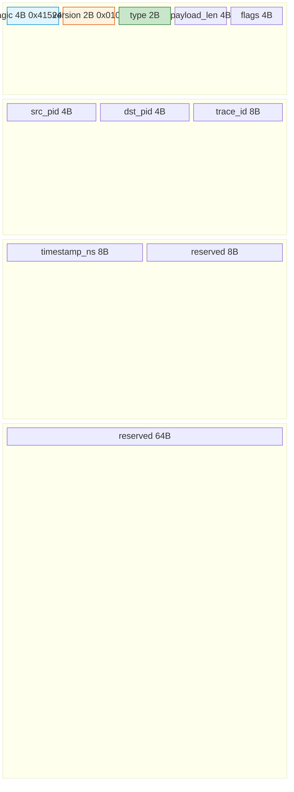
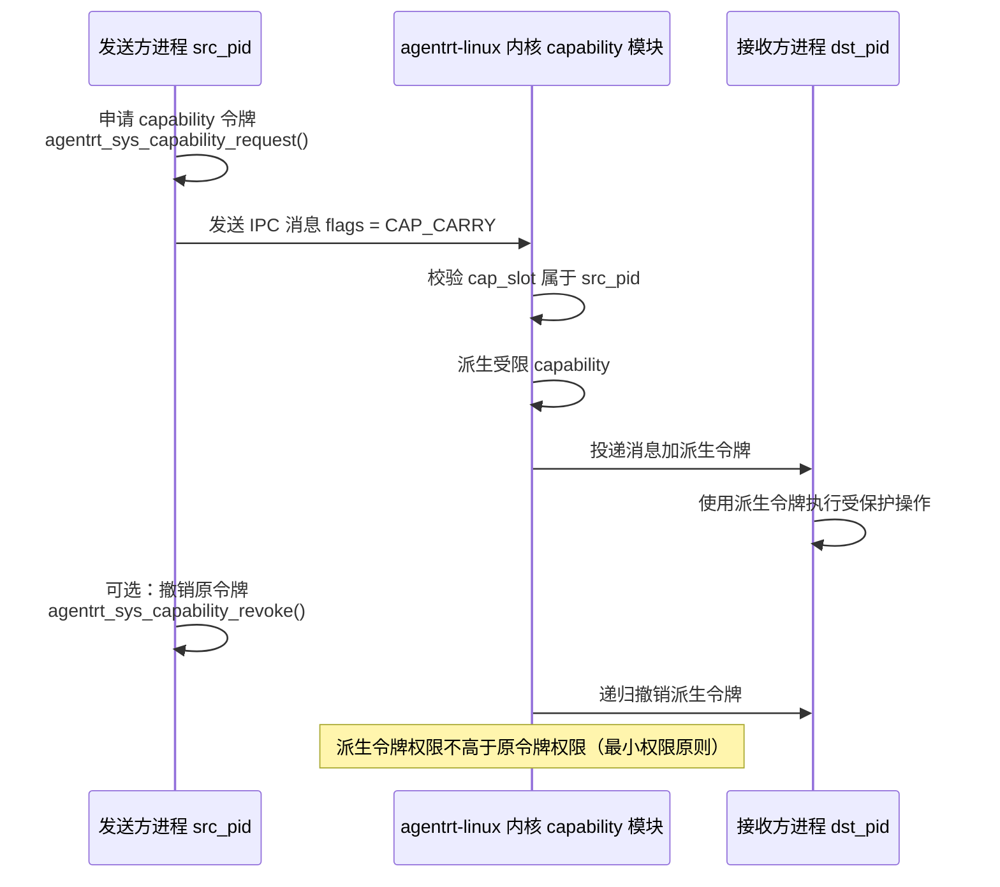

Copyright (c) 2025-2026 SPHARX Ltd. All Rights Reserved.

# agentrt-linux IPC 协议契约

> **文档定位**： agentrt-linux（AirymaxOS）进程间通信协议的契约定义，涵盖 128B 消息头、payload 协议、io_uring 传输层、capability 传递\
> **版本**： 0.1.1（文档体系完成）/ 1.0.1（开发）\
> **最后更新**： 2026-07-07\
> **父文档**： [20-contracts README](README.md)

---

## 1. IPC 协议设计原则

agentrt-linux（AirymaxOS）IPC 协议与 agentrt AgentsIPC 同源，保留 128 字节定长消息头设计，并在底层升级为基于 io_uring 的零拷贝实现。协议设计遵循以下原则，与五维正交 24 原则对齐：

| 原则 | 编号 | 在 IPC 协议中的体现 |
|------|------|-------------------|
| 接口契约化 | K-2 | 128B 消息头布局锁定，字段偏移不可变更，版本协商机制 |
| 机制与策略分离 | K-1 | 协议提供消息传递机制（send/recv），消息语义（RPC/事件/流）由 payload 类型决定 |
| 安全内生 | E-1 | capability 令牌携带与校验、消息认证、防重放保护 |
| 可观测性 | E-2 | 消息头携带 trace_id（OpenTelemetry）与 timestamp_ns，全链路可追踪 |
| 资源确定性 | E-3 | io_uring ring 注册/注销显式生命周期，registered buffers 预分配 |
| 简约至上 | A-1 | 128B 定长消息头等于 2 个 cache line，单次预取加载完整消息头 |

---

## 2. AgentsIPC 128B 消息头布局

### 2.1 消息头结构定义

消息头定义位于头文件 `airymaxos-services/ipc/io-uring-ipc/agentrt_ipc_msg.h`，与 agentrt AgentsIPC 128B 消息头布局兼容（[SS] 语义同源层）。

```c
#define AGENTRT_IPC_MSG_HDR_SIZE 128
#define AGENTRT_IPC_MAGIC 0x41524531u  /* 'A''R''E''1' 同源 agentrt AgentsIPC */

typedef struct __attribute__((aligned(64))) agentrt_ipc_msg_hdr {
    uint32_t magic;          /* 0x41524531 'ARE1' magic（同源 agentrt） */
    uint16_t version;        /* 协议版本，当前 0x0100 */
    uint16_t type;           /* 消息类型（5 种 payload 协议） */
    uint32_t payload_len;    /* payload 长度（字节） */
    uint32_t flags;          /* 标志位 */
    uint32_t src_pid;        /* 源进程 ID */
    uint32_t dst_pid;        /* 目标进程 ID */
    uint64_t trace_id;       /* 链路追踪 ID（OpenTelemetry） */
    uint64_t timestamp_ns;   /* 纳秒时间戳（CLOCK_REALTIME） */
    uint8_t  reserved[72];   /* 保留字段（对齐到 128B） */
} agentrt_ipc_msg_hdr_t;

static_assert(sizeof(agentrt_ipc_msg_hdr_t) == AGENTRT_IPC_MSG_HDR_SIZE,
              "agentrt_ipc_msg_hdr_t must be 128 bytes");
```

### 2.2 字段语义表

| 字段 | 偏移 | 长度 | 类型 | 语义 | 契约约束 |
|------|------|------|------|------|---------|
| magic | 0 | 4 | uint32_t | 魔数 0x41524531（'ARE1'），协议识别 | 永不变更，与 agentrt 一致 |
| version | 4 | 2 | uint16_t | 协议版本，当前 0x0100（v1.0） | MAJOR 版本内不可变更 |
| type | 6 | 2 | uint16_t | payload 协议类型（5 种） | 新增类型只能追加到枚举末尾 |
| payload_len | 8 | 4 | uint32_t | payload 字节数，0 表示无 payload | 最大 64 MiB |
| flags | 12 | 4 | uint32_t | 标志位（零拷贝/capability/压缩/加密） | 位定义见第 2.3 节 |
| src_pid | 16 | 4 | uint32_t | 源进程 ID | 内核校验真实性 |
| dst_pid | 20 | 4 | uint32_t | 目标进程 ID | 0 表示广播 |
| trace_id | 24 | 8 | uint64_t | OpenTelemetry 链路追踪 ID | 生成时使用单调递增加随机后缀 |
| timestamp_ns | 32 | 8 | uint64_t | CLOCK_REALTIME 纳秒时间戳 | 对齐北京时间（UTC+8） |
| reserved | 40 | 72 | uint8_t[72] | 保留字段 | 填充为 0，未来扩展 |

### 2.3 标志位定义

| 标志位 | 值 | 语义 | 安全约束 |
|--------|-----|------|---------|
| AGENTRT_IPC_FLAG_ZEROCOPY | 0x00000001 | 使用 io_uring 零拷贝路径 | 发送方必须注册 buffer |
| AGENTRT_IPC_FLAG_CAP_CARRY | 0x00000002 | 消息携带 capability 令牌 | 内核校验令牌有效性 |
| AGENTRT_IPC_FLAG_COMPRESS | 0x00000004 | payload 已压缩（LZ4） | 接收方自动解压 |
| AGENTRT_IPC_FLAG_ENCRYPT | 0x00000008 | payload 已加密（SM4） | 密钥由 capability 携带 |
| AGENTRT_IPC_FLAG_URGENT | 0x00000010 | 紧急消息，优先投递 | 仅 SCHED_AGENT 实时类可用 |
| AGENTRT_IPC_FLAG_NOREPLY | 0x00000020 | 无需响应（单向通知） | 仅 EVENT 类型可用 |

### 2.4 消息头布局可视化



**图 1**：AgentsIPC 128B 消息头布局。magic 用于协议识别（蓝色），version+type 用于版本协商与类型路由（橙色/绿色），payload_len+flags 控制传输行为，src/dst_pid 标识通信双方，trace_id+timestamp_ns 提供可观测性，reserved 72B 预留未来扩展。

---

## 3. 消息类型枚举

### 3.1 五种 payload 协议

| type 值 | 协议名称 | 通信模式 | 典型用途 | 可靠性要求 |
|---------|---------|---------|---------|-----------|
| 0x0001 | REQUEST | 同步 RPC（请求-响应） | RPC 调用、系统服务查询 | 可靠投递，超时重试 |
| 0x0002 | RESPONSE | 同步 RPC（请求-响应） | RPC 响应 | 可靠投递 |
| 0x0003 | EVENT | 发布-订阅 | 状态变更通知、日志事件 | 尽力投递，允许丢失 |
| 0x0004 | STREAM | 双向流 | 流式数据传输、LLM token 流 | 可靠投递，有序 |
| 0x0005 | NOTIFICATION | 单向通知 | 系统广播、心跳 | 尽力投递，无需响应 |

### 3.2 REQUEST / RESPONSE payload

REQUEST payload 用于发起 RPC 调用，RESPONSE 用于返回结果。两者通过 request_id 配对：

```c
typedef struct agentrt_ipc_request {
    uint64_t request_id;      /* 请求 ID（与 RESPONSE.request_id 对应） */
    uint32_t method_id;       /* 方法 ID（RPC 方法编号） */
    uint32_t timeout_ms;      /* 超时（毫秒），0 表示无超时 */
    uint8_t  params[];        /* 方法参数（柔性数组，最大 1 MiB） */
} agentrt_ipc_request_t;

typedef struct agentrt_ipc_response {
    uint64_t request_id;      /* 请求 ID（与 REQUEST.request_id 对应） */
    int32_t  status;          /* 状态码（0 成功，<0 AGENTRT_E* 错误码） */
    uint32_t reserved;        /* 保留字段 */
    uint8_t  result[];        /* 结果数据（柔性数组） */
} agentrt_ipc_response_t;
```

### 3.3 EVENT payload

EVENT payload 用于发布-订阅模式的事件通知：

```c
typedef struct agentrt_ipc_event {
    uint64_t event_id;        /* 事件 ID（全局唯一） */
    uint32_t topic_id;        /* 主题 ID（订阅时分配） */
    uint32_t priority;        /* 事件优先级（0-139，对齐 SCHED_AGENT） */
    uint8_t  payload[];       /* 事件数据（柔性数组） */
} agentrt_ipc_event_t;
```

### 3.4 STREAM payload

STREAM payload 用于双向流式数据传输，支持 FIN/RST/MORE 流控标志：

```c
typedef struct agentrt_ipc_stream {
    uint64_t stream_id;       /* 流 ID */
    uint32_t seq;             /* 序列号（递增，用于重排序） */
    uint32_t flags;           /* 流标志（FIN/RST/MORE） */
    uint8_t  chunk[];         /* 流数据块（柔性数组） */
} agentrt_ipc_stream_t;

#define AGENTRT_IPC_STREAM_FLAG_FIN  0x00000001u  /* 流结束 */
#define AGENTRT_IPC_STREAM_FLAG_RST  0x00000002u  /* 流重置 */
#define AGENTRT_IPC_STREAM_FLAG_MORE 0x00000004u  /* 更多数据 */
```

### 3.5 NOTIFICATION payload

NOTIFICATION payload 用于单向通知，无需响应确认：

```c
typedef struct agentrt_ipc_notification {
    uint64_t notif_id;        /* 通知 ID */
    uint32_t category;        /* 通知类别（0=系统/1=安全/2=认知/3=运维） */
    uint32_t severity;        /* 严重级别（0=INFO/1=WARN/2=ERROR/3=FATAL） */
    uint8_t  message[];       /* 通知消息（柔性数组） */
} agentrt_ipc_notification_t;
```

---

## 4. 优先级与 QoS 规范

### 4.1 消息优先级

IPC 消息优先级与 SCHED_AGENT 策略优先级对齐（0-139），按任务类别映射：

| 优先级范围 | 类别 | 延迟预算 | 调度策略 | 典型场景 |
|-----------|------|---------|---------|---------|
| 0-49 | 实时控制 | < 1 ms | scx_realtime | 具身智能运动控制指令 |
| 50-99 | 交互响应 | < 10 ms | scx_interactive | 用户对话请求/响应 |
| 100-119 | Agent 认知 | < 100 ms | scx_agent | CoreLoopThree 阶段通知 |
| 120-139 | 批处理 | < 1 s | scx_batch | 日志传输、记忆迁移 |

### 4.2 QoS 保证

| QoS 维度 | 保证内容 | 实现机制 |
|---------|---------|---------|
| 可靠投递 | REQUEST/RESPONSE/STREAM 类型保证投递 | 发送方确认加超时重传（最多 3 次） |
| 有序投递 | STREAM 类型保证顺序 | 内核 seq 递增加接收方重排序缓冲 |
| 优先级调度 | 高优先级消息优先投递 | io_uring SQ 优先级队列加内核优先级调度 |
| 反压控制 | 接收方缓冲区满时暂停发送 | 控制消息 FLOW_OFF / FLOW_ON |
| 超时处理 | 超过延迟预算的消息返回 AGENTRT_ETIMEOUT | 发送方设置 timeout_ms，内核超时返回 |

---

## 5. Capability 传递机制（基于 Cupolas）

### 5.1 传递流程

当消息头 flags 中置位 AGENTRT_IPC_FLAG_CAP_CARRY 时，消息可携带 capability 令牌跨进程传递。传递基于 Cupolas 安全模型，遵循 seL4 风格的不可伪造语义：



**图 2**：capability 令牌跨进程传递时序图。发送方令牌被内核验证后派生受限令牌至接收方，原令牌撤销时派生令牌递归撤销。

### 5.2 传递规则

| 规则 | 说明 | 违反后果 |
|------|------|---------|
| 不可伪造 | 令牌由内核生成，进程无法伪造 | 伪造令牌被内核拒绝，返回 AGENTRT_EPERM |
| 最小权限 | 派生令牌权限不高于原令牌权限 | 超权限操作被内核拒绝 |
| 递归撤销 | 撤销原令牌时，所有派生令牌自动撤销 | 内核遍历派生链，级联撤销 |
| 超时过期 | 令牌可设置有效期，超时自动过期 | 过期令牌返回 AGENTRT_ETIMEOUT |
| 单次使用 | 令牌可标记为一次性，使用后自动撤销 | 重复使用返回 AGENTRT_EBUSY |

### 5.3 限制

- 单次 IPC 消息最多携带 1 个 capability 令牌。
- 令牌传递链最大深度 16 层（防止无限派生）。
- 令牌传递必须在同一 agentrt-linux 节点内（跨节点传递需通过安全网关）。

---

## 6. io_uring 作为传输层

### 6.1 传输层架构

agentrt-linux IPC 基于 Linux 6.6 内核基线的 io_uring 子系统，在标准 io_uring 之上注册以下 IPC 专用 OP（固定操作码扩展）：

| OP | 用途 | 零拷贝 | 批量 |
|----|------|--------|------|
| IORING_OP_IPC_SEND | 发送 IPC 消息（128B 头加 payload） | 是（registered buffers + page flipping） | 是（SQE 批量提交） |
| IORING_OP_IPC_RECV | 接收 IPC 消息 | 是（page flipping） | 是 |
| IORING_OP_IPC_REGISTER_RING | 注册跨进程 ring | 不适用 | 否 |
| IORING_OP_IPC_DEREGISTER_RING | 注销跨进程 ring | 不适用 | 否 |

### 6.2 零拷贝机制

io_uring 零拷贝路径通过以下三步实现，消除 CPU 数据复制：

1. Registered Buffers：发送方通过 io_uring_register_buffers() 预注册内存页，内核持有 page 引用。
2. Page Flipping：接收方通过 IORING_OP_IPC_RECV 接收时，内核仅翻转 page table entry，不拷贝数据。发送方页面被映射到接收方地址空间。
3. Buffer Return：接收方处理完毕后，通过 IORING_OP_IPC_RECV_DONE 归还页面，内核翻转回发送方。

零拷贝性能：单核 128B 消息可达 100K+ msg/s（P99 延迟 < 10 μs），1MB 大消息吞吐 > 10 Gbps。

### 6.3 跨进程 ring 共享

```c
/**
 * @brief 注册 io_uring ring 给目标进程（跨进程 ring 共享）
 *
 * 通过 io_uring_register 将 ring fd 注册给 dst_pid，
 * 实现零拷贝跨进程通道。ring 注册后，发送方和接收方共享
 * 同一个 SQ/CQ 对，通过内核 page flipping 传递数据。
 *
 * @param ring_fd   io_uring ring 文件描述符
 * @param dst_pid   目标进程 ID
 * @return 0 成功，<0 AGENTRT_E* 错误码
 *
 * @since 1.0.1
 */
AGENTRT_API int agentrt_sys_ipc_register_ring(int ring_fd, uint32_t dst_pid);
```

安全约束：ring 注册前必须通过 capability 校验。src_pid 须持有 ipc.ring.share 权限，dst_pid 须持有 ipc.ring.accept 权限。

---

## 7. 与 agentrt 的 IPC 契约共享（[SC] 层）

### 7.1 共享范围

agentrt-linux IPC 与 agentrt AgentsIPC 通过 IRON-9 v2 三层契约共享：

| IRON-9 v2 分层 | 共享内容 | 共享方式 | 对应 agentrt 模块 |
|---------------|---------|---------|------------------|
| [SC] 共享契约层 | security_types.h（Cupolas capability 令牌结构） | 代码字面一致 | cupolas |
| [SS] 语义同源层 | 128B 消息头布局、magic 'ARE1'、trace_id、timestamp_ns | 语义一致，实现独立 | atoms/ipc (AgentsIPC) |
| [IND] 完全独立层 | io_uring 固定 OP、跨进程 ring 共享、内核 capability 校验 | 完全独立 | 不适用 |

### 7.2 同源兼容性

agentrt 在 agentrt-linux 上运行时，IPC 消息头布局完全兼容，无需协议转换层：

- agentrt 发出的 128B 消息头可直接被 agentrt-linux io_uring 通道接收。
- agentrt-linux 发出的消息头可被 agentrt 用户态消息队列接收。
- 消息头 magic 字段 0x41524531（'ARE1'）两端一致，用于协议识别。
- trace_id 和 timestamp_ns 字段语义一致，跨端追踪无缝衔接。

---

## 8. 安全考量

### 8.1 消息认证

| 认证机制 | 说明 | 实现位置 |
|---------|------|---------|
| 进程身份验证 | src_pid 由内核填充，用户态不可伪造 | 内核 current->pid |
| 消息完整性 | 可选 HMAC-SHA256（通过 AGENTRT_IPC_FLAG_ENCRYPT 标志） | 发送方签名，接收方校验 |
| 重放保护 | timestamp_ns 加单调递增 seq（STREAM 类型） | 接收方窗口校验 |

### 8.2 能力传递安全

- capability 令牌由内核生成，用户态无法伪造。
- 令牌传递时内核校验 src_pid 是否持有该令牌。
- 派生令牌权限受限于原令牌权限（最小权限原则）。
- 原令牌撤销时，派生令牌递归撤销。

### 8.3 防重放保护

| 消息类型 | 防重放机制 | 窗口大小 |
|---------|-----------|---------|
| REQUEST | request_id 去重加 timestamp_ns 窗口校验 | 60 秒窗口 |
| RESPONSE | 与 REQUEST 配对，REQUEST 去重即可 | 复用 REQUEST 窗口 |
| STREAM | stream_id 加 seq 递增序列号 | 1024 序列号窗口 |
| EVENT / NOTIFICATION | 尽力投递，不保证去重 | 不适用 |

### 8.4 资源耗尽防护

| 防护措施 | 说明 | 阈值 |
|---------|------|------|
| 消息速率限制 | 每进程每秒最大消息数 | 100K msg/s |
| payload 大小限制 | 单条消息最大 payload | 64 MiB |
| ring 注册数量限制 | 每进程最大 ring 注册数 | 16 |
| 令牌传递深度限制 | 最大派生链深度 | 16 |
| 超时强制 | 超过 timeout_ms 的消息自动丢弃 | 默认 30 s |

---

## 9. IPC 性能约束

### 9.1 性能指标

| 指标 | 目标值 | 测量方法 | 约束 ID |
|------|--------|---------|---------|
| 128B 消息吞吐 | > 100K msg/s（单核） | io_uring-bench --zerocopy --msg-size 128 | NFR-P-002 |
| 128B 消息延迟 | < 10 μs（P99） | agentrt_sys_ipc_send + agentrt_sys_ipc_recv 往返 | NFR-P-002a |
| 1MB 大消息吞吐 | > 10 Gbps | 零拷贝 page flipping 吞吐测试 | NFR-P-002b |
| 跨节点 IPC | > 1M msg/s（4 节点） | 超节点 OS 跨节点 IPC 基准 | NFR-P-002c |
| 消息丢失率 | < 0.001%（可靠投递类型） | Soak Test 72 小时持续负载 | NFR-P-002d |

### 9.2 性能回归保护

- 每次 PR 运行 tests-linux/benchmark/ipc-latency 与 ipc-throughput 微基准。
- 与基线对比，吞吐退化 > 5% 或延迟退化 > 10% 自动打回。
- Soak Test 72 小时持续 IPC 负载，验证无内存泄漏、无性能衰减。

---

## 10. 相关文档

- [20-contracts README](README.md)
- [系统调用 API 契约](syscall_api_contract.md)
- [日志格式契约](logging_contract.md)
- [接口设计 - IPC 协议](../../30-interfaces/02-ipc-protocol.md)
- [接口设计 - 系统调用](../../30-interfaces/01-syscalls.md)
- [五维正交 24 原则](../../10-architecture/02-five-dimensional-principles.md)
- [安全设计](../../20-modules/03-security.md)
- [服务设计](../../20-modules/02-services.md)
- [非功能性需求](../../00-requirements/03-non-functional-requirements.md)（NFR-P-002）

---

## 11. 版本历史

| 版本 | 日期 | 变更 |
|------|------|------|
| 0.1.1 | 2026-07-07 | 初始版本（128B 消息头布局锁定、5 种 payload 协议定义、io_uring 零拷贝传输层、capability 传递机制、安全考量、IRON-9 v2 [SC]/[SS]/[IND] 三层契约共享） |
| 1.0.1 | 2027-XX-XX | 首个开发版本（IPC 版本协商机制实现、io_uring 固定 OP 注册、跨进程 ring 共享实现） |

---

Copyright (c) 2025-2026 SPHARX Ltd. All Rights Reserved.