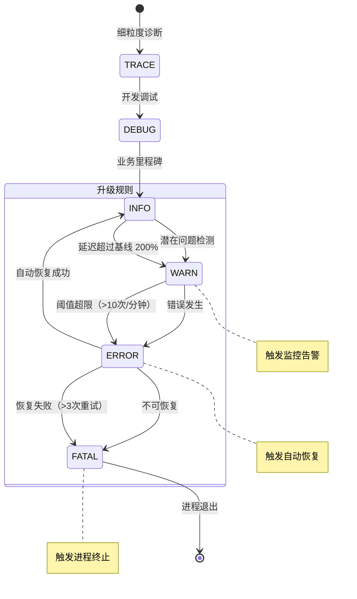

Copyright (c) 2025-2026 SPHARX Ltd. All Rights Reserved.

# agentrt-linux（AirymaxOS）日志格式契约

> **版本**： 0.1.1（文档体系完成）/ 1.0.1（开发）\
> **最后更新**： 2026-07-07\
> **父文档**： [OS 层契约规范总览](README.md)

---

## 1. 概述

### 1.1 目的与范围

本文档定义了 agentrt-linux（AirymaxOS）的日志格式契约。日志是所有可观测性能力的基石，也是 agentrt-linux（AirymaxOS）五维正交可观测性架构中"可观测性维度"的核心载体。本契约覆盖内核态日志、用户态日志、审计日志三个层面，规定了日志的格式、字段、传输管道、安全策略与保留策略，确保 agentrt-linux 的日志体系在分布式部署、多租户隔离、安全审计等场景下保持一致性。

agentrt-linux 的日志系统遵循以下五维正交原则：

- **维度一（格式正交）**：日志格式与日志内容解耦，JSON 结构化格式对外统一，内部二进制格式对内高效。
- **维度二（通道正交）**：日志产生路径与传输路径分离，内核态通过 printk → journald，用户态通过 agentrt_log_write() → ring buffer → collector。
- **维度三（等级正交）**：日志等级与日志路由解耦，同一等级可路由到不同 sink，等级之间不互相依赖。
- **维度四（生命周期正交）**：日志的生成、缓冲、持久化、归档、销毁各阶段独立演进，互不阻塞。
- **维度五（安全正交）**：日志内容与安全策略分离，敏感数据掩码规则独立于日志写入逻辑。

### 1.2 术语约定

| 术语 | 含义 |
|------|------|
| agentrt-linux | agentrt-linux（AirymaxOS）的操作系统内核与运行时环境 |
| 五维正交 | 本日志系统的核心架构哲学，见上文五个维度 |
| IRON-9 v2 | 第九代智能路由与可观测性节点规范 v2 版本 |
| agentrt_log_write() | 用户态日志写入 API |
| log_write() / log_write_va() | 内核态日志写入函数 |
| CLOCK_REALTIME | 系统实时时钟，对齐至北京时间（UTC+8） |

---

## 2. 日志等级体系

### 2.1 等级定义

agentrt-linux（AirymaxOS）定义了六个标准日志等级，与 syslog 标准兼容，同时扩展了 OpenTelemetry 的 SeverityNumber 映射：

| 等级 | 数值 | syslog 等级 | OTel SeverityNumber | 描述 |
|------|------|-------------|----------------------|------|
| FATAL | 0 | LOG_EMERG | 21 | 系统不可恢复的致命错误，进程即将退出 |
| ERROR | 1 | LOG_ERR | 17 | 运行时错误，但进程可能继续运行 |
| WARN | 2 | LOG_WARNING | 13 | 潜在问题，需要关注但非立即故障 |
| INFO | 3 | LOG_INFO | 9 | 关键业务流程的里程碑事件 |
| DEBUG | 4 | LOG_DEBUG | 5 | 开发调试信息，生产环境默认关闭 |
| TRACE | 5 | LOG_DEBUG | 1 | 细粒度跟踪信息，用于深度诊断 |

### 2.2 ANSI 彩色编码

日志在终端（tty）输出时使用 ANSI 转义序列进行彩色编码，便于运维人员快速识别：

| 等级 | ANSI 颜色 | 转义码 | 示例 |
|------|-----------|--------|------|
| FATAL | 品红 (Magenta) | `\033[35m` | 高亮警示，不可忽略 |
| ERROR | 红色 (Red) | `\033[31m` | 醒目错误标识 |
| WARN | 黄色 (Yellow) | `\033[33m` | 温和警示 |
| INFO | 蓝色 (Blue) | `\033[34m` | 信息性消息 |
| DEBUG | 灰色 (Gray) | `\033[90m` | 低对比度，不干扰主流程 |
| TRACE | 青色 (Cyan) | `\033[36m` | 微弱可见，极低干扰 |

当输出目标为非 tty（如 journald、文件、Socket）时，ANSI 转义码自动剥离，确保结构化日志的纯净性。可通过环境变量 `AGENTRT_LOG_COLOR=always|never|auto` 控制。

---

## 3. 结构化日志格式

### 3.1 JSON 格式规范

所有 agentrt-linux 日志均以 JSON 格式输出，确保与 OpenTelemetry 收集器（otelcol）原生兼容。每条日志为一行 JSON（NDJSON），不含换行符嵌套。

#### 3.1.1 基础示例

```json
{
  "timestamp": "2026-07-07T14:35:22.123456789+08:00",
  "level": "INFO",
  "trace_id": "a1b2c3d4e5f6789012345678abcdef01",
  "module": "agent_scheduler",
  "message": "Task dispatched to agent node",
  "agent_id": "agent-042",
  "task_id": "task-7f3a",
  "channel_id": "ch-irq-12",
  "duration_ms": 3.2,
  "error_code": null
}
```

#### 3.1.2 必填字段

| 字段 | 类型 | 描述 |
|------|------|------|
| `timestamp` | string (RFC 3339 Nano) | 日志产生时间，CLOCK_REALTIME，北京时间（UTC+8） |
| `level` | string | 日志等级，取值：FATAL / ERROR / WARN / INFO / DEBUG / TRACE |
| `trace_id` | string (32 hex) | 分布式追踪 ID，与 OpenTelemetry 的 trace_id 一致 |
| `module` | string | 产生日志的模块名称，如 `agent_scheduler`、`irq_router`、`mem_alloc` |
| `message` | string | 人类可读的日志消息，UTF-8 编码，不含换行 |

#### 3.1.3 可选字段

| 字段 | 类型 | 描述 |
|------|------|------|
| `agent_id` | string | 产生日志的 agent 实例标识 |
| `task_id` | string | 关联的任务 ID |
| `channel_id` | string | 关联的 IRON-9 v2 通道 ID |
| `duration_ms` | number (float) | 操作耗时，单位毫秒 |
| `error_code` | string | 错误码，如 `EAGAIN`、`ENOMEM`、`EINVAL` |
| `span_id` | string (16 hex) | OpenTelemetry span ID |
| `parent_span_id` | string (16 hex) | 父 span ID |
| `resource` | object | OpenTelemetry 资源属性（service.name, host.name 等） |
| `attributes` | object | 自定义键值对，用于附加业务上下文 |

### 3.2 时间戳格式

时间戳严格遵循 RFC 3339 纳米精度格式，并使用 CLOCK_REALTIME 时钟源，始终对齐北京时间（UTC+8）：

```
格式: YYYY-MM-DDTHH:MM:SS.NNNNNNNNN+08:00
示例: 2026-07-07T14:35:22.123456789+08:00
```

所有时间戳均通过 `clock_gettime(CLOCK_REALTIME, &ts)` 获取，确保跨节点的事件时序一致性。在 agentrt-linux 内核中，日志时间戳在内核日志环形缓冲区写入时一次性生成，后续传输不再修改，避免时间戳失真。

---

## 4. 内核态日志

### 4.1 printk 集成

agentrt-linux 内核日志通过 `log_write()` 和 `log_write_va()` 两个核心函数输出。这两个函数是 agentrt-linux 对 Linux printk 子系统的扩展封装，实现了以下增强：

1. **结构化字段注入**：自动将 trace_id、module 等字段注入到日志消息中。
2. **等级路由**：根据日志等级决定输出目标（console / journald / ring buffer）。
3. **时间戳预生成**：在调用 `log_write()` 时立即通过 CLOCK_REALTIME 生成时间戳，避免后续延迟。

```c
// 内核态日志写入 API 契约
void log_write(int level, const char *module, const char *trace_id,
               const char *fmt, ...);
void log_write_va(int level, const char *module, const char *trace_id,
                  const char *fmt, va_list args);
```

两个函数的行为差异：
- `log_write()`：接受可变参数，内部调用 `log_write_va()`。
- `log_write_va()`：接受 `va_list`，是所有日志写入的最终统一入口，负责格式化、结构化封装和分发。

### 4.2 journald 转发

内核日志通过 `/dev/kmsg` 或 `printk` 环形缓冲区转发至 systemd-journald。agentrt-linux 在 journald 侧配置了专门的转发规则：

- **过滤规则**：仅转发 `_TRANSPORT=kernel` 且 `SYSLOG_IDENTIFIER=agentrt` 的日志。
- **结构化字段映射**：journald 的 `MESSAGE=` 字段保留原始 JSON，`PRIORITY=` 字段映射日志等级，`_PID=`、`_UID=` 保留进程上下文。
- **速率限制**：内核日志速率限制为每秒 1000 条，超出部分聚合为 `rate_limited` 事件并记录丢弃计数。

---

## 5. 用户态日志

### 5.1 agentrt_log_write() API 契约

用户态日志通过 `agentrt_log_write()` 函数写入，该函数签名如下：

```c
int agentrt_log_write(int level, const char *module,
                      const char *agent_id, const char *task_id,
                      const char *channel_id, double duration_ms,
                      const char *error_code, const char *fmt, ...);
```

参数说明：
- `level`：日志等级（0-5），对应 FATAL 到 TRACE。
- `module`：模块名，长度不超过 64 字符。
- `agent_id`：agent 实例 ID，可为 NULL。
- `task_id`：任务 ID，可为 NULL。
- `channel_id`：IRON-9 v2 通道 ID，可为 NULL。
- `duration_ms`：操作耗时，无耗时信息时传 -1.0。
- `error_code`：错误码，可为 NULL。
- `fmt, ...`：printf 风格格式化字符串和参数。

返回值：成功返回写入的字节数，失败返回负值 errno。

### 5.2 使用约束

1. **禁止直接使用 fprintf**：所有日志必须通过 `agentrt_log_write()` 或内核态的 `log_write()` / `log_write_va()` 输出，严禁使用 `fprintf(stderr, ...)` 或 `printf(...)` 进行日志输出。违反此约束的代码将无法通过 CI 静态检查。
2. **trace_id 必须传递**：每个调用链路的 trace_id 必须从上游继承，不得在中间节点重新生成。
3. **敏感数据掩码**：日志消息中不得包含明文密码、Token、密钥、内核地址等信息，详见第 8 节。

---

## 6. 审计日志

### 6.1 审计日志格式

审计日志是 agentrt-linux 安全体系的核心组成部分，用于记录所有安全相关操作（认证、授权、配置变更、数据访问）。审计日志与普通日志隔离，具有以下特征：

- **不可变性**：审计日志一旦写入，不可修改、不可删除。
- **追加写入**：仅支持 append-only 模式。
- **SHA-256 哈希链**：每条审计日志包含前一条日志的 SHA-256 哈希值，形成防篡改链条。

```json
{
  "timestamp": "2026-07-07T14:35:22.123456789+08:00",
  "level": "INFO",
  "trace_id": "a1b2c3d4e5f6789012345678abcdef01",
  "audit_id": "audit-0000000001",
  "prev_hash": "e3b0c44298fc1c149afbf4c8996fb92427ae41e4649b934ca495991b7852b855",
  "curr_hash": "5e884898da28047151d0e56f8dc6292773603d0d6aabbdd62a11ef721d1542d8",
  "module": "auth_service",
  "action": "USER_LOGIN",
  "subject": "uid=1001",
  "object": "ssh_session",
  "result": "SUCCESS",
  "source_ip": "192.168.1.100",
  "message": "User login via SSH"
}
```

审计日志必填字段：

| 字段 | 描述 |
|------|------|
| `audit_id` | 审计日志唯一标识，单调递增 |
| `prev_hash` | 前一条审计日志的 SHA-256 哈希 |
| `curr_hash` | 当前审计日志的 SHA-256 哈希（含 prev_hash） |
| `action` | 操作类型（USER_LOGIN, CONFIG_CHANGE, DATA_ACCESS 等） |
| `subject` | 操作主体标识 |
| `object` | 操作目标标识 |
| `result` | 操作结果（SUCCESS / FAILURE / DENIED） |

### 6.2 审计日志存储

审计日志写入专用的审计分区（`/var/log/agentrt/audit/`），该分区挂载为只追加（append-only）文件系统，目录权限为 750，仅 root 和 agentrt_audit 组可读写。保留策略为至少 365 天，超过保留期的日志自动归档至加密的冷存储。

---

## 7. 日志管道架构

### 7.1 管道总览

以下 Mermaid 图展示了 agentrt-linux 日志从产生到最终存储的完整数据流：

```mermaid
graph TD
    subgraph 内核态
        K[内核模块] -->|log_write / log_write_va| RB[内核日志环形缓冲区]
        RB -->|printk| KMSG[/dev/kmsg]
    end

    subgraph 系统层
        KMSG -->|转发| JD[systemd-journald]
        JD -->|速率限制| RC[日志速率控制器]
    end

    subgraph 用户态
        U[用户态进程] -->|agentrt_log_write| URB[用户态 Ring Buffer]
        URB -->|Unix Domain Socket| LC[agentrt-log-collector]
    end

    subgraph 收集层
        RC -->|Socket| LC
        LC -->|OTLP/gRPC| OTC[OpenTelemetry Collector]
        OTC -->|路由| SA[存储适配器]
    end

    subgraph 存储层
        SA -->|普通日志| LF[本地文件 /var/log/agentrt/]
        SA -->|审计日志| AF[审计分区 /var/log/agentrt/audit/]
        SA -->|远程| REMOTE[远程日志中心]
    end

    subgraph 审计链
        AF -->|SHA-256 哈希链| CHAIN[防篡改验证]
        AF -->|冷归档| COLD[加密冷存储 / 365天]
    end
```

### 7.2 日志等级升级流程

以下 Mermaid 图展示了 agentrt-linux 的日志等级动态升级（escalation）流程：



---

## 8. 安全策略

### 8.1 敏感数据掩码

agentrt-linux 日志系统在写入路径上集成了敏感数据掩码引擎，在 `log_write_va()` 内部完成格式化之后、写入环形缓冲区之前执行掩码。掩码规则如下：

| 数据类型 | 检测模式 | 掩码方式 |
|----------|----------|----------|
| 密码 | `password=`, `passwd=`, `pwd=` | 替换为 `***` |
| Token | `Bearer `, `token=`, `Authorization:` | 截断至前 8 字符 + `...` |
| 私钥 | `-----BEGIN` 块 | 整体替换为 `[REDACTED]` |
| 内核地址 | `0xffff[0-9a-f]{12}` | 替换为 `[KADDR]` |
| 用户敏感数据 | 身份证号、手机号正则 | 掩码中间 6 位 |

掩码引擎在编译时通过 `CONFIG_AGENTRT_LOG_MASK=y` 启用，生产环境必须开启。

### 8.2 内核地址保护

严格禁止在日志中输出内核虚拟地址。所有内核地址在日志输出前必须通过 `%pK` 格式说明符处理。`log_write()` 内部对 `%p` 格式说明符进行强制替换，默认行为为 `%pK`（kptr_restrict 控制），确保在 `kptr_restrict=1` 下非特权用户看到的是 `0000000000000000`。

### 8.3 日志访问控制

- 日志文件权限：`/var/log/agentrt/*.log` 为 640，owner 为 root:agentrt。
- 审计日志权限：`/var/log/agentrt/audit/*.log` 为 640，owner 为 root:agentrt_audit。
- 日志读取必须通过 `agentrt-log-reader` 工具，该工具基于 RBAC 进行访问控制，记录所有读取操作。

---

## 9. 日志轮转与保留策略

### 9.1 轮转规则

agentrt-linux 日志轮转由 `agentrt-log-rotator` 守护进程管理，基于 `logrotate` 扩展：

| 日志类别 | 轮转触发条件 | 保留份数 | 压缩 |
|----------|-------------|----------|------|
| 系统日志 | 100MB 或 每天 | 30 | gzip |
| 应用日志 | 50MB 或 每小时 | 48 | zstd |
| 审计日志 | 500MB 或 每天 | 365 | zstd + 加密 |
| 调试日志 | 200MB 或 每 6 小时 | 24 | 不压缩 |

### 9.2 保留策略

| 日志类别 | 本地保留 | 远程保留 | 说明 |
|----------|----------|----------|------|
| 系统日志 | 30 天 | 90 天 | 本地快速查询，远程长期归档 |
| 应用日志 | 7 天 | 30 天 | 应用日志增长快，本地短保留 |
| 审计日志 | 365 天 | 7 年 | 合规要求，不可删除 |
| 调试日志 | 3 天 | 不归档 | 仅本地临时存储 |

---

## 10. 性能考量

### 10.1 异步日志架构

agentrt-linux 日志系统采用全异步架构，确保日志 I/O 不会阻塞业务逻辑：

1. **内核态环形缓冲区**：`log_write()` 和 `log_write_va()` 将日志写入内核的 per-CPU 环形缓冲区（默认 256KB/CPU），写入操作无锁（lock-free），仅通过内存屏障保证一致性。
2. **用户态 Ring Buffer**：`agentrt_log_write()` 使用共享内存环形缓冲区（默认 4MB），通过原子操作写入，消费者线程异步读取并序列化。
3. **批量刷新**：日志收集器（agentrt-log-collector）以批量模式（batch size 256，flush interval 100ms）向 OpenTelemetry Collector 发送日志。

### 10.2 性能指标

| 指标 | 目标值 | 说明 |
|------|--------|------|
| 单条日志写入延迟 | < 1μs（内核态）/ < 3μs（用户态） | 写入环形缓冲区的时间 |
| 日志丢失率 | 0（正常负载）/ < 0.01%（过载） | 环形缓冲区溢出时丢弃旧日志 |
| 内存占用 | < 16MB（内核态）/ < 32MB（用户态） | 环形缓冲区 + 元数据 |
| CPU 开销 | < 1% 单核 | 在 10,000 条/秒 速率下 |

### 10.3 反压机制

当环形缓冲区使用率超过 80% 时，触发反压信号：
- 内核态：降低 printk 速率限制至 100 条/秒。
- 用户态：`agentrt_log_write()` 返回 `EAGAIN`，调用方可选择重试或丢弃。
- 收集器：增加批量刷新频率至 50ms，加速消费。

---

## 11. OpenTelemetry 集成

### 11.1 收集器配置

agentrt-linux 的日志系统通过 OTLP 协议（gRPC）与 OpenTelemetry Collector 集成。日志在 agentrt-log-collector 中转换为 OpenTelemetry LogRecord 格式后发送。

关键映射关系：

| agentrt 字段 | OTel LogRecord 字段 |
|-------------|---------------------|
| `timestamp` | `time_unix_nano` |
| `level` | `severity_number` / `severity_text` |
| `trace_id` | `trace_id` |
| `span_id` | `span_id` |
| `message` | `body.string_value` |
| `module` | `attributes["agentrt.module"]` |
| `agent_id` | `attributes["agentrt.agent_id"]` |
| `task_id` | `attributes["agentrt.task_id"]` |
| `channel_id` | `attributes["agentrt.channel_id"]` |
| `duration_ms` | `attributes["agentrt.duration_ms"]` |
| `error_code` | `attributes["agentrt.error_code"]` |

### 11.2 导出器配置

```yaml
receivers:
  otlp:
    protocols:
      grpc:
        endpoint: 0.0.0.0:4317
      http:
        endpoint: 0.0.0.0:4318

processors:
  batch:
    timeout: 100ms
    send_batch_size: 256
  memory_limiter:
    limit_mib: 512
    spike_limit_mib: 128

exporters:
  file:
    path: /var/log/agentrt/otel/exported/%Y/%m/%d/%H.jsonl
  loki:
    endpoint: http://loki:3100/loki/api/v1/push

service:
  pipelines:
    logs:
      receivers: [otlp]
      processors: [memory_limiter, batch]
      exporters: [file, loki]
```

---

## 12. 日志格式验证

### 12.1 格式校验规则

所有日志输出必须通过以下格式校验：

1. **JSON 合法性**：每条日志必须是合法的 JSON 对象。
2. **必填字段完整**：timestamp、level、trace_id、module、message 五个字段必须存在。
3. **时间戳格式**：必须匹配 RFC 3339 Nano 格式且时区为 `+08:00`。
4. **等级合法**：level 必须是 FATAL、ERROR、WARN、INFO、DEBUG、TRACE 之一。
5. **trace_id 格式**：必须是 32 位十六进制小写字符串。
6. **无 ANSI 码**：非 tty 输出的日志不得包含 ANSI 转义序列。
7. **无敏感数据**：不得包含明文密码、Token、内核地址。
8. **审计日志哈希链**：每条审计日志的 `prev_hash` 必须等于前一条的 `curr_hash`。

### 12.2 验证工具

使用 `agentrt-log-validator` 工具进行格式验证：

```bash
# 验证普通日志
agentrt-log-validator --type=general /var/log/agentrt/system.log

# 验证审计日志哈希链
agentrt-log-validator --type=audit --verify-chain /var/log/agentrt/audit/

# 验证敏感数据掩码
agentrt-log-validator --check-mask /var/log/agentrt/system.log
```

---

## 13. 故障处理与降级

### 13.1 日志写入失败

当日志写入失败时（磁盘满、权限不足、管道断裂），日志系统按以下优先级降级：

1. **内存缓冲**：未写入的日志暂存于内存后备缓冲区（fallback buffer，默认 8MB）。
2. **控制台输出**：当所有持久化路径均失败时，日志降级为控制台输出（仅 FATAL/ERROR/WARN）。
3. **丢弃并计数**：当后备缓冲区也满时，丢弃日志并递增 `agentrt_log_dropped_total` 计数器。

### 13.2 审计日志不可用

审计日志不可用时（审计分区满、加密密钥不可用），系统行为：
- 拒绝所有安全敏感操作（认证、授权、配置变更），返回 `EAUDITUNAVAIL`。
- 非安全敏感操作继续运行，但会在系统日志中记录 `audit_unavailable` 告警。
- 审计日志不可用是最高优先级告警，通过 IRON-9 v2 通道立即上报。

---

## 14. 附录

### 14.1 日志等级快速参考

```
FATAL  → 品红 (Magenta)  → 系统即将崩溃
ERROR  → 红色 (Red)      → 操作失败，需关注
WARN   → 黄色 (Yellow)   → 潜在风险，需检查
INFO   → 蓝色 (Blue)     → 正常业务流程
DEBUG  → 灰色 (Gray)     → 开发调试信息
TRACE  → 青色 (Cyan)     → 极细粒度跟踪
```

### 14.2 环境变量

| 变量名 | 默认值 | 描述 |
|--------|--------|------|
| `AGENTRT_LOG_LEVEL` | `INFO` | 最低输出日志等级 |
| `AGENTRT_LOG_COLOR` | `auto` | ANSI 彩色输出：always / never / auto |
| `AGENTRT_LOG_BUFFER_SIZE` | `4194304` | 用户态环形缓冲区大小（字节） |
| `AGENTRT_LOG_FLUSH_INTERVAL` | `100` | 批量刷新间隔（毫秒） |
| `AGENTRT_LOG_MASK_ENABLE` | `1` | 敏感数据掩码开关 |

### 14.3 相关文档

- [IPC 协议契约（含 IRON-9 v2 通道规范）](ipc_protocol_contract.md)
- [安全模块设计（airymaxos-security capability 系统）](../../20-modules/03-security.md)
- [OpenTelemetry Logging Specification](https://opentelemetry.io/docs/specs/otel/logs/)

---

> **文档维护**： SPHARX Ltd. — agentrt 核心团队
> **合规声明**： 本文档符合 IRON-9 v2 可观测性节点规范要求，所有日志格式遵循五维正交设计原则。