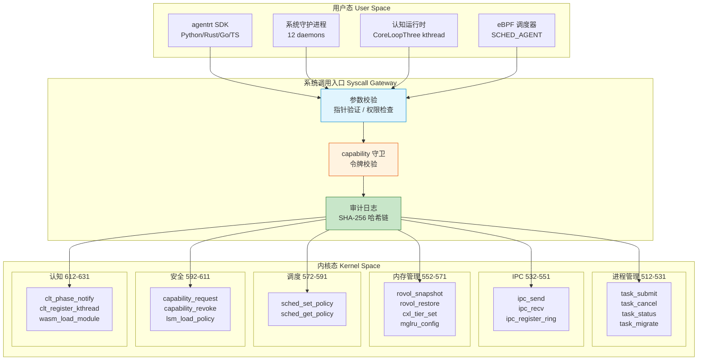
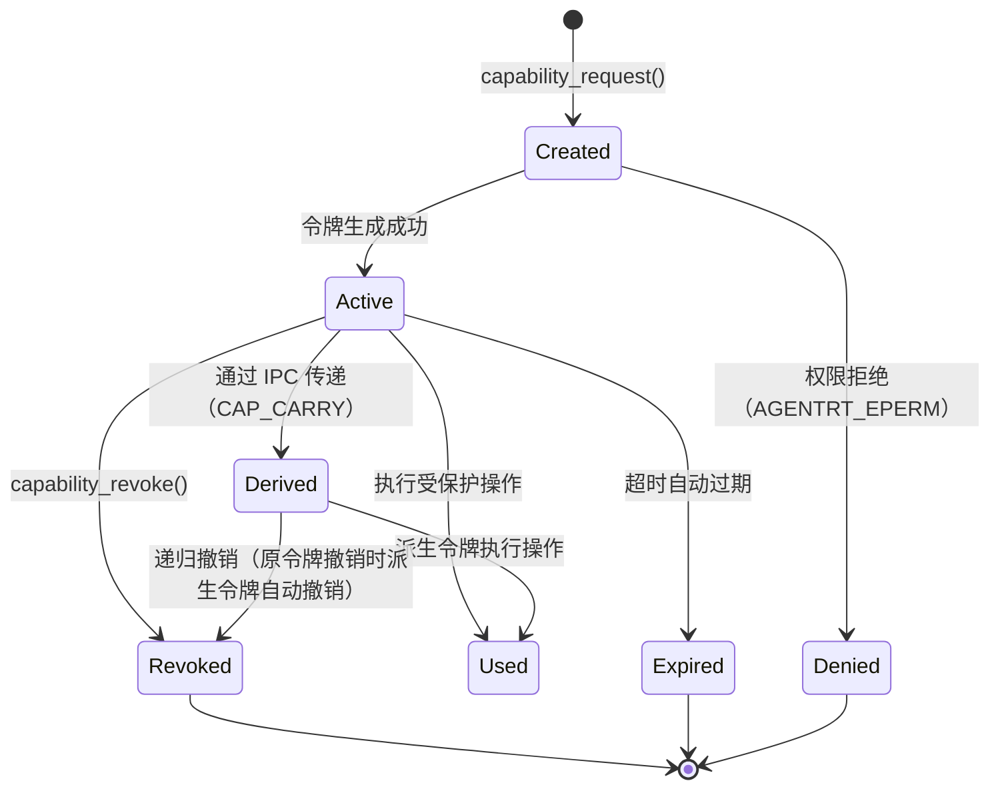

Copyright (c) 2025-2026 SPHARX Ltd. All Rights Reserved.

# agentrt-linux 系统调用 API 契约

> **文档定位**： agentrt-linux（AirymaxOS）系统调用接口的契约定义，涵盖编号、签名、参数传递、返回值、错误码\
> **版本**： 0.1.1（文档体系完成）/ 1.0.1（开发）\
> **最后更新**： 2026-07-07\
> **父文档**： [20-contracts README](README.md)

---

## 1. 系统调用分类

agentrt-linux（AirymaxOS）在 Linux 6.6 内核基线的标准系统调用之上，新增 Agent 感知专用系统调用，统一使用 `agentrt_` 前缀。系统调用分为 6 大类，覆盖 8 子仓的内核入口：

| # | 分类 | 前缀 | 编号段 | 核心职责 | 覆盖子仓 | 同源 agentrt |
|---|------|------|--------|---------|---------|--------------|
| 1 | 进程管理 | `AGENTRT_SYS_TASK_*` | 512-531 | Agent 任务的创建、提交、取消、状态查询、迁移 | kernel / cognition | MicroCoreRT 调度 |
| 2 | IPC | `AGENTRT_SYS_IPC_*` | 532-551 | 进程间消息传递、io_uring ring 注册、零拷贝通道 | kernel / services | AgentsIPC |
| 3 | 内存管理 | `AGENTRT_SYS_ROVOL_*` | 552-571 | 记忆卷载快照/恢复、CXL 内存分层、MGLRU 配置 | kernel / memory | MemoryRovol |
| 4 | 调度 | `AGENTRT_SYS_SCHED_*` | 572-591 | sched_ext 策略设置、SCHED_AGENT 策略管理 | kernel | MicroCoreRT sub-scheduler |
| 5 | 安全 | `AGENTRT_SYS_CAP_*` | 592-611 | capability 令牌申请/撤销、LSM 策略加载、审计 | kernel / security | Cupolas 权限 |
| 6 | 认知 | `AGENTRT_SYS_CLT_*` | 612-631 | CoreLoopThree 阶段通知、kthread 注册、Wasm 模块加载 | kernel / cognition | CoreLoopThree |

### 1.1 分类设计原则

agentrt-linux 系统调用分类遵循以下原则，与五维正交 24 原则中的 K-1（内核极简）和 K-4（可插拔策略）对齐：

| 原则 | 编号 | 在系统调用分类中的体现 |
|------|------|----------------------|
| 机制在内核，策略在用户态 | K-1 | 系统调用仅提供原子机制（提交、发送、快照、授权），策略由用户态 eBPF 程序或守护进程定义 |
| 可插拔策略 | K-4 | 调度策略（SCHED_AGENT）、遗忘策略（艾宾浩斯/线性/基于访问）、净化策略（正则/类型/语义）均可运行时替换 |
| 接口契约化 | K-2 | 每类系统调用通过 C 头文件 + Doxygen 注释给出显式契约，包括参数语义、返回值、错误码、并发约束 |
| 安全内生 | E-1 | 所有安全敏感系统调用必须先通过 capability 守卫（`agentrt_sys_capability_request`） |

### 1.2 系统调用层级架构



**图 1**：agentrt-linux 系统调用层级架构。所有用户态调用统一经过参数校验、capability 守卫、审计日志三关，再分发到 6 类内核子系统。

---

## 2. 系统调用编号规范

### 2.1 编号段分配

agentrt-linux 专用系统调用编号从 `512` 起始分配，避开 Linux 6.6 标准 0-511 编号空间。按 6 类分类分段，每类预留 20 个编号：

| 编号段 | 分类 | 数量 | 起始编号 | 终止编号 | 已分配 | 预留 |
|--------|------|------|---------|---------|--------|------|
| 512-531 | 进程管理（TASK） | 20 | 512 | 531 | 4 | 16 |
| 532-551 | IPC | 20 | 532 | 551 | 3 | 17 |
| 552-571 | 内存管理（ROVOL） | 20 | 552 | 571 | 5 | 15 |
| 572-591 | 调度（SCHED） | 20 | 572 | 591 | 2 | 18 |
| 592-611 | 安全（CAP） | 20 | 592 | 611 | 3 | 17 |
| 612-631 | 认知（CLT） | 20 | 612 | 631 | 3 | 17 |

### 2.2 编号不变性规则

系统调用编号是 agentrt-linux OS 层契约中最严格的 ABI 承诺：

1. **编号在 MAJOR 版本内不可变更**：编号一旦分配，永不复用。即使系统调用被废弃，编号保留，返回 `-AGENTRT_ENOSYS`。
2. **新增编号只能追加**：新系统调用追加到对应分类段末尾，不可插入已分配编号之间。
3. **废弃编号标记**：废弃调用在 Doxygen 注释中标注 `@deprecated since <version>`，并提供迁移指引。
4. **编号段扩展**：若某分类 20 个编号耗尽，需在下一 MAJOR 版本中扩展编号段，并创建 ADR 记录。

### 2.3 命名前缀规范

所有 agentrt-linux 系统调用统一使用以下命名前缀：

| 前缀 | C 符号形式 | 用途 | 示例 |
|------|-----------|------|------|
| `AGENTRT_SYS_TASK_*` | `agentrt_sys_task_*` | Agent 任务管理 | `agentrt_sys_task_submit` |
| `AGENTRT_SYS_IPC_*` | `agentrt_sys_ipc_*` | IPC 消息传递 | `agentrt_sys_ipc_send` |
| `AGENTRT_SYS_ROVOL_*` | `agentrt_sys_rovol_*` | MemoryRovol 记忆卷载 | `agentrt_sys_rovol_snapshot` |
| `AGENTRT_SYS_SCHED_*` | `agentrt_sys_sched_*` | SCHED_AGENT 调度策略 | `agentrt_sys_sched_set_policy` |
| `AGENTRT_SYS_CAP_*` | `agentrt_sys_capability_*` | Cupolas 安全 | `agentrt_sys_capability_request` |
| `AGENTRT_SYS_CLT_*` | `agentrt_sys_clt_*` | CoreLoopThree 认知 | `agentrt_sys_clt_phase_notify` |

命名遵循五维正交 24 原则中的 E-5（命名语义化）：`<namespace>_sys_<category>_<action>`。

---

## 3. 参数传递规范

### 3.1 寄存器传递约定

agentrt-linux 系统调用遵循 Linux x86_64 标准调用约定（System V AMD64 ABI）：

| 参数位置 | 寄存器 | 类型约束 | 说明 |
|---------|--------|---------|------|
| 第 1 参数 | `%rdi` | 整数/指针 | 系统调用编号（`%rax`）+ 参数 1 |
| 第 2 参数 | `%rsi` | 整数/指针 | 参数 2 |
| 第 3 参数 | `%rdx` | 整数/指针 | 参数 3 |
| 第 4 参数 | `%r10` | 整数/指针 | 参数 4（替代 `%rcx`，因 `syscall` 指令破坏 `%rcx`） |
| 第 5 参数 | `%r8` | 整数 | 参数 5 |
| 第 6 参数 | `%r9` | 整数 | 参数 6 |
| 返回值 | `%rax` | 整数 | 0 成功，<0 错误码（`AGENTRT_E*`） |

**参数数量限制**：单个系统调用最多 6 个参数。超过 4 个参数时，优先使用结构体指针封装（遵循 A-1 简约至上原则）。

### 3.2 指针参数验证

所有用户态传入的指针参数必须经过内核验证，遵循以下安全规则：

| 验证步骤 | 检查项 | 失败返回 | 实现位置 |
|---------|--------|---------|---------|
| 1. NULL 检查 | 指针是否为 NULL | `-AGENTRT_EINVAL` | `copy_from_user()` 前 |
| 2. 地址范围检查 | 指针是否在用户态地址空间 | `-AGENTRT_EFAULT` | `access_ok()` |
| 3. 内存可读性 | 指针指向的内存是否可读 | `-AGENTRT_EFAULT` | `copy_from_user()` |
| 4. 大小限制 | 结构体大小是否在合理范围 | `-AGENTRT_EMSGSIZE` | 自定义校验 |
| 5. 对齐检查 | 指针是否满足对齐要求 | `-AGENTRT_EINVAL` | 自定义校验 |

**指针验证示例**：

```c
/**
 * @brief 指针验证宏（内核侧）
 *
 * @param uptr  用户态指针
 * @param size  期望读取大小
 * @return 0 验证通过，<0 AGENTRT_E* 错误码
 */
static inline int agentrt_validate_user_ptr(const void __user *uptr, size_t size)
{
    if (!uptr)
        return -AGENTRT_EINVAL;
    if (!access_ok(uptr, size))
        return -AGENTRT_EFAULT;
    return AGENTRT_EOK;
}
```

### 3.3 结构体参数传递

超过 3 个参数的调用，必须使用结构体封装。结构体定义遵循以下契约：

- 结构体必须 `__attribute__((aligned(8)))` 对齐。
- 结构体首个字段必须为 `uint32_t size`，表示结构体大小（用于版本协商）。
- 结构体必须包含 `uint32_t version` 字段（当前 0x0100）。
- 保留字段必须填充为 0，未来可用于扩展。

---

## 4. 返回值与错误码规范

### 4.1 返回值约定

| 返回值 | 含义 | 调用方处理 |
|--------|------|-----------|
| 0 | 成功 | 继续执行 |
| >0 | 成功（带结果，如任务 ID、快照 ID） | 使用返回值 |
| <0 | 失败（`AGENTRT_E*` 错误码） | 检查错误码，按重试策略处理 |

### 4.2 错误码定义

agentrt-linux 系统调用错误码对齐 `agentrt_errno.h`，与 agentrt 同源且部分代码共享（IRON-9 v2 [SC] 层）。错误码统一使用 `AGENTRT_E*` 前缀，负值返回：

| 错误码 | 值 | 含义 | 典型触发场景 | 可重试 |
|--------|-----|------|-------------|--------|
| `AGENTRT_EOK` | 0 | 成功 | 调用成功 | - |
| `AGENTRT_EINVAL` | -1 | 无效参数 | 参数为 NULL、结构体大小不匹配、对齐错误 | 否 |
| `AGENTRT_ENOMEM` | -2 | 内存不足 | 内核分配失败、CXL 池耗尽 | 是（等待后） |
| `AGENTRT_ENOSYS` | -3 | 未实现 | 编号未实现或已废弃 | 否 |
| `AGENTRT_EPERM` | -4 | 权限不足 | capability 令牌缺失或无效 | 否 |
| `AGENTRT_ENOENT` | -5 | 资源不存在 | 任务 ID、快照 ID、capability 句柄不存在 | 否 |
| `AGENTRT_EAGAIN` | -6 | 暂时不可用 | io_uring 队列满、CXL 带宽不足 | 是（立即） |
| `AGENTRT_EMSGSIZE` | -7 | 消息过大 | payload 超过最大长度 | 否 |
| `AGENTRT_EBADF` | -8 | 描述符错误 | ring fd、capability 句柄无效 | 否 |
| `AGENTRT_EBUSY` | -9 | 资源繁忙 | 任务正在迁移无法快照、capability 正在传递 | 是（延迟） |
| `AGENTRT_ENOTSUP` | -10 | 不支持 | 硬件不支持（如无 CXL 设备）、内核配置未启用 | 否 |
| `AGENTRT_ETIMEOUT` | -11 | 超时 | 调度等待超时、IPC 接收超时 | 是（限制次数） |
| `AGENTRT_ECONFLICT` | -12 | 状态冲突 | 任务状态不允许当前操作 | 否 |
| `AGENTRT_EFAULT` | -13 | 地址错误 | 用户态指针非法、内存不可访问 | 否 |
| `AGENTRT_EOVERFLOW` | -14 | 溢出 | 计数器溢出、编号段耗尽 | 否 |

### 4.3 错误码使用规范

所有系统调用实现必须遵循以下错误处理规范：

1. **错误码原样传递**：内核子系统的错误码必须原样传递到用户态，不得吞没或转换。
2. **错误日志记录**：每个错误返回前必须调用 `log_write(LOG_ERROR, ...)` 记录上下文。
3. **错误码字符串化**：使用 `agentrt_strerror(ret)` 获取人类可读描述。
4. **审计日志**：安全敏感操作（capability 拒绝、权限不足）必须记录审计日志。

---

## 5. SCHED_AGENT 调度相关系统调用

### 5.1 调度类概述

SCHED_AGENT 是 agentrt-linux 通过 sched_ext（eBPF 用户态调度器）实现的 Agent 专用调度类，与 agentrt MicroCoreRT 调度语义同源（[SS] 语义同源层）。核心系统调用：

| 编号 | 调用名 | 功能 | 关键参数 |
|------|--------|------|---------|
| 572 | `agentrt_sys_sched_set_policy` | 设置 sched_ext 调度策略 | `cgroup_path`（目标 cgroup）、`policy`（策略名称） |
| 573 | `agentrt_sys_sched_get_policy` | 查询当前调度策略 | `cgroup_path`、`policy_out`（输出） |
| 574 | `agentrt_sys_sched_register_bpf` | 注册 eBPF 调度器程序 | `bpf_fd`（eBPF 程序 fd）、`ops`（bpf_struct_ops 指针） |
| 575 | `agentrt_sys_sched_get_latency` | 查询调度延迟统计 | `cgroup_path`、`stats_out`（延迟统计输出） |

### 5.2 调度策略枚举

| 策略名称 | 值 | 优先级范围 | 延迟预算 | 典型场景 |
|---------|-----|-----------|---------|---------|
| `scx_realtime` | 0 | 0-49 | < 1 ms | 具身智能运动控制 |
| `scx_interactive` | 1 | 50-99 | < 10 ms | 用户对话补全 |
| `scx_agent` | 2 | 100-119 | < 100 ms | CoreLoopThree 思考 |
| `scx_batch` | 3 | 120-139 | < 1 s | LLM 批量推理 |

### 5.3 与 agentrt MicroCoreRT 的同源映射

| 维度 | agentrt MicroCoreRT | agentrt-linux SCHED_AGENT | IRON-9 v2 分层 |
|------|--------------------|--------------------------|---------------|
| 调度策略 | 用户态优先级队列 | sched_ext eBPF 调度器 | [SS] 语义同源 |
| 优先级范围 | 0-139 | 0-139 | [SS] 语义一致 |
| 延迟预算 | 用户态估算 | 内核态精确控制 | [IND] agentrt-linux 升级 |
| bpf_struct_ops | 不适用 | `bpf_struct_ops.h`（[SC] 共享） | [SC] 代码字面一致 |

---

## 6. Cupolas 安全相关系统调用

### 6.1 安全系统调用概述

Cupolas 安全模型是 agentrt-linux 的安全核心，基于 seL4 风格的 capability 系统。核心系统调用：

| 编号 | 调用名 | 功能 | 关键参数 |
|------|--------|------|---------|
| 592 | `agentrt_sys_capability_request` | 申请 capability 令牌 | `capability`（权限名称）、`resource`（资源路径） |
| 593 | `agentrt_sys_capability_revoke` | 撤销 capability | `cap_slot`（capability 句柄） |
| 594 | `agentrt_sys_lsm_load_policy` | 加载 agent_lsm 策略 | `policy_buf`（策略数据）、`policy_len` |

### 6.2 capability 令牌生命周期



**图 2**：capability 令牌生命周期状态机。令牌从创建到撤销/过期，派生令牌随原令牌递归撤销，体现最小权限原则。

---

## 7. MemoryRovol 记忆相关系统调用

### 7.1 记忆系统调用概述

MemoryRovol 是 agentrt-linux 的记忆管理子系统，实现 L1-L4 四层记忆卷载。核心系统调用：

| 编号 | 调用名 | 功能 | 对应 MemoryRovol 层级 |
|------|--------|------|---------------------|
| 552 | `agentrt_sys_rovol_snapshot` | 创建进程记忆快照 | L1 原始卷 |
| 553 | `agentrt_sys_rovol_restore` | 从快照恢复记忆 | L1 原始卷 |
| 554 | `agentrt_sys_rovol_migrate` | 跨节点记忆迁移 | L1-L4 全部 |
| 555 | `agentrt_sys_cxl_tier_set` | CXL 内存分层策略 | L2-L4 索引层 |
| 556 | `agentrt_sys_mglru_config` | MGLRU（多代 LRU）配置 | L2-L4 索引层 |

### 7.2 与 agentrt MemoryRovol 的同源映射

| 维度 | agentrt MemoryRovol | agentrt-linux MemoryRovol | IRON-9 v2 分层 |
|------|--------------------|--------------------------|---------------|
| 记忆卷载模型 | L1-L4 四层 | L1-L4 四层 | [SS] 语义同源 |
| 数据结构 | `memory_types.h`（[SC] 共享） | `memory_types.h`（[SC] 共享） | [SC] 代码字面一致 |
| 存用分离 | 用户态实现 | 内核态 CXL + MGLRU | [IND] agentrt-linux 升级 |
| 遗忘策略 | 用户态可配置 | 内核态 eBPF 可插拔 | [SS] 语义同源 |

---

## 8. CoreLoopThree 认知相关系统调用

### 8.1 认知系统调用概述

CoreLoopThree 是 agentrt-linux 的认知运行时，实现"感知-思考-行动"三阶段认知循环。核心系统调用：

| 编号 | 调用名 | 功能 | 对应认知阶段 |
|------|--------|------|-------------|
| 612 | `agentrt_sys_clt_phase_notify` | CoreLoopThree 阶段通知 | 全部三阶段 |
| 613 | `agentrt_sys_clt_register_kthread` | 注册 CoreLoopThree kthread | 内核线程注册 |
| 614 | `agentrt_sys_wasm_load_module` | 加载 Wasm 3.0 安全模块 | 行动阶段沙箱 |

### 8.2 认知阶段枚举

| 阶段 | 枚举值 | 描述 | 调度优先级影响 |
|------|--------|------|--------------|
| `CLT_PHASE_PERCEPTION` | 0 | 感知阶段：收集输入、环境感知 | 正常优先级 |
| `CLT_PHASE_THINKING` | 1 | 思考阶段：主模型推理、规划 | 提升优先级（减少抢占） |
| `CLT_PHASE_ACTION` | 2 | 行动阶段：执行任务、Wasm 沙箱 | 恢复正常优先级 |

---

## 9. 与 agentrt 用户态系统调用的契约共享关系

### 9.1 [SC] 层共享

agentrt-linux 与 agentrt 在以下 6 个头文件中实现代码字面共享：

| 头文件 | 共享内容 | 对应系统调用分类 |
|--------|---------|----------------|
| `bpf_struct_ops.h` | sched_ext BPF 调度器 struct_ops 状态机 + common_value | 调度（SCHED） |
| `memory_types.h` | MemoryRovol L1-L4 数据结构 + GFP 掩码语义 + PMEM 持久化接口 | 内存管理（ROVOL） |
| `security_types.h` | POSIX capability 38 ID 枚举 + LSM 钩子 254 ID 枚举 + Cupolas blob 布局 + capability 派生模型 + Vault backend 抽象 + 策略裁决 4 值枚举 | 安全（CAP） |
| `cognition_types.h` | CoreLoopThree 阶段枚举 + Thinkdual 模式枚举 + LLM 推理阶段枚举 + Token 能效指标 + GPU/NPU 能力描述符 | 认知（CLT） |
| `sched.h` | SCHED_EXT 调度类编号约束 + 任务描述符（magic 0x41475453 'AGTS'）+ vtime 衰减公式 + 优先级 0-139 + AIRYMAX_SLICE_DFL（20ms） | 调度（SCHED） |
| `ipc.h` | IPC magic（0x41524531 'ARE1'）+ 128B 消息头结构 + SQE/CQE 操作码与标志位 | IPC |

### 9.2 [SS] 层语义同源

| 系统调用分类 | agentrt 用户态 | agentrt-linux OS 层 | 同源语义 |
|-------------|---------------|-------------------|---------|
| 进程管理（TASK） | MicroCoreRT 用户态调度 | `AGENTRT_SYS_TASK_*` 内核调度 | 任务提交、优先级、状态查询语义一致 |
| IPC | AgentsIPC 用户态消息队列 | `AGENTRT_SYS_IPC_*` io_uring 零拷贝 | 128B 消息头布局兼容 |
| 内存管理（ROVOL） | MemoryRovol 用户态 API | `AGENTRT_SYS_ROVOL_*` 内核态 | 四层卷载、存用分离语义一致 |
| 安全（CAP） | Cupolas 应用权限模型 | `AGENTRT_SYS_CAP_*` seL4 风格 | 不可伪造令牌、最小权限语义一致 |
| 认知（CLT） | CoreLoopThree 用户态 | `AGENTRT_SYS_CLT_*` kthread | 三阶段循环语义一致 |

### 9.3 [IND] 层完全独立

agentrt-linux 独有的系统调用维度（如 io_uring 固定 OP 扩展、CXL 内存分层、MGLRU 配置、内核态 eBPF kfunc 注册）属于 [IND] 层，agentrt 不涉及。

---

## 10. 系统调用性能约束

### 10.1 延迟预算

| 系统调用类别 | 典型延迟（P99） | 最大延迟（P99.9） | 测量方法 |
|-------------|---------------|------------------|---------|
| 进程管理（TASK） | < 1 μs | < 5 μs | `perf trace -e agentrt_sys_task_*` |
| IPC（控制面） | < 1 μs | < 5 μs | `perf trace -e agentrt_sys_ipc_*` |
| 内存管理（ROVOL） | < 5 μs（快照）/ < 100 ms（迁移） | < 10 μs / < 500 ms | 按操作类型分别测量 |
| 调度（SCHED） | < 1 μs | < 5 μs | `perf trace -e agentrt_sys_sched_*` |
| 安全（CAP） | < 1 μs | < 5 μs | `perf trace -e agentrt_sys_capability_*` |
| 认知（CLT） | < 1 μs | < 5 μs | `perf trace -e agentrt_sys_clt_*` |

### 10.2 性能回归保护

- 每次 PR 运行 `tests-linux/benchmark/syscall-latency` 微基准。
- 与基线对比，延迟退化 > 5% 自动打回。
- 新增系统调用必须附带性能基准测试。

---

## 11. 相关文档

- [20-contracts README](README.md)
- [IPC 协议契约](ipc_protocol_contract.md)
- [日志格式契约](logging_contract.md)
- [接口设计 - 系统调用](../../30-interfaces/01-syscalls.md)
- [五维正交 24 原则](../../10-architecture/02-five-dimensional-principles.md)
- [内核设计](../../20-modules/01-kernel.md)
- [安全设计](../../20-modules/03-security.md)
- [记忆设计](../../20-modules/04-memory.md)
- [认知设计](../../20-modules/05-cognition.md)

---

## 12. 版本历史

| 版本 | 日期 | 变更 |
|------|------|------|
| 0.1.1 | 2026-07-07 | 初始版本（6 类系统调用分类、编号段分配、参数传递规范、错误码体系、SCHED_AGENT/Cupolas/MemoryRovol/CoreLoopThree 契约、IRON-9 v2 三层契约共享关系） |
| 1.0.1 | 2027-XX-XX | 首个开发版本（系统调用编号分配完成、内核实现开始） |

---

Copyright (c) 2025-2026 SPHARX Ltd. All Rights Reserved.