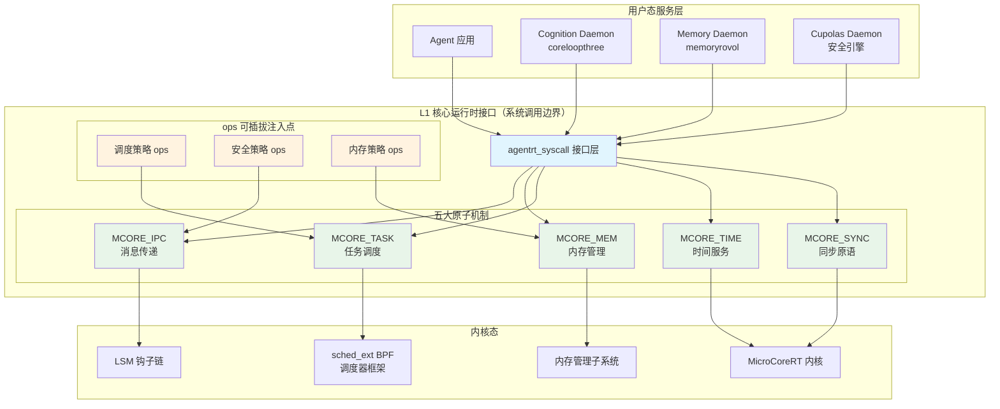
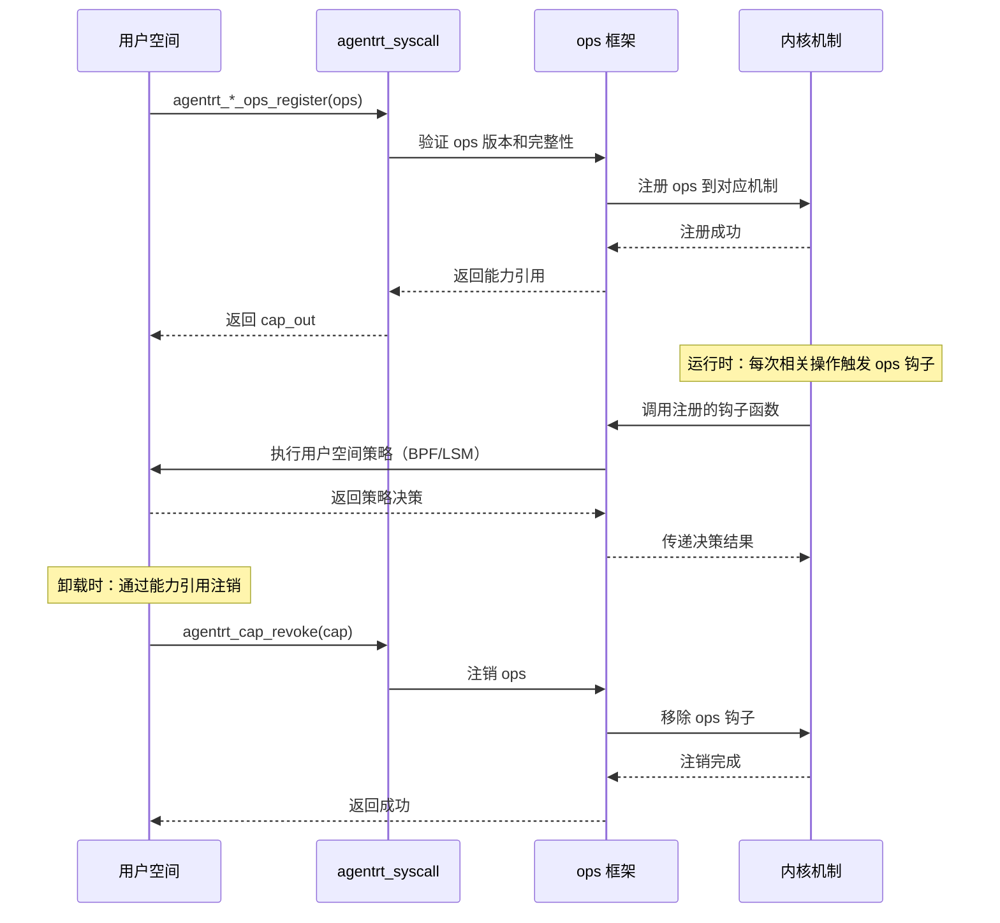

Copyright (c) 2025-2026 SPHARX Ltd. All Rights Reserved.
"From data intelligence emerges."

# agentrt-linux L1 核心运行时接口规范

> **最新**： 2026-07-07\
> **版本**： 0.1.1（文档体系完成）/ 1.0.1（开发）\
> **状态**： 草案\
> **路径**： OpenAirymax/docs/AirymaxOS/50-engineering-standards/30-runtime-interfaces/L1_runtime_interface.md\
> **父文档**： [ARE Standards 总览](./README.md)\
> **理论根基**： 体系并行论、五维正交24原则、MicroCoreRT 微核心极简设计、seL4 形式化验证思想  

---

## 文档信息卡
- **目标读者**: OS 内核开发者、运行时接口实现者、调度器开发者、安全架构师  
- **前置知识**: 理解 agentrt-linux（AirymaxOS）架构概览，熟悉微内核设计思想，了解 IPC 基础  
- **预计阅读时间**: 45 分钟  
- **核心概念**: MicroCoreRT, 系统调用, ops 注入, 一致性测试, 4 原子机制, 可插拔策略  
- **复杂度标识**: 高级  

---

## 1. 引言

L1 核心运行时接口是 agentrt-linux（AirymaxOS）ARE Standards 的最底层规范，定义了 OS 内核态最基础、最核心的运行时原语。L1 的设计哲学根植于 MicroCoreRT 微核心极简设计思想（参考 seL4 的形式化验证方法），严格遵循五维正交24原则中 K-1（内核极简原则）：内核只保留最必要的原子机制，所有策略性决策外移至用户空间或可插拔模块。

L1 接口是 agentrt-linux（AirymaxOS）整个 OS 栈的基石——L2 服务通信协议依赖 L1 的 IPC 原语，L3 安全与治理依赖 L1 的内存管理和进程隔离。L1 的正确性、性能和安全性直接影响整个系统的可靠性。

### 1.1 与 agentrt L1 的共享关系

| IRON-9 v2 分层 | 共享内容 | 共享方式 |
|----------------|----------|----------|
| [SC] 共享契约层 | 核心数据结构（如 `are_task_t`, `are_ipc_msg_t`, `are_cap_t`） | 完全共享头文件 |
| [SS] 语义同源层 | 系统调用接口签名、4 原子机制语义 | 语义一致，实现独立 |
| [IND] 完全独立层 | 内核实现、调度策略、内存管理策略 | 完全独立 |

### 1.2 设计原则

L1 的设计严格遵循以下五维正交24原则映射：

| 原则编号 | 原则名称 | 在 L1 中的体现 |
|----------|----------|----------------|
| K-1 | 内核极简原则 | 仅保留 IPC、内存、任务、时间、同步五大原子机制 |
| K-2 | 接口契约化原则 | 每个系统调用明确定义契约，参数、返回值、副作用清晰 |
| K-4 | 可插拔策略原则 | 调度策略、安全策略、内存策略通过 ops 接口注入 |
| E-1 | 安全内生原则 | 内存守卫、能力令牌、地址空间隔离内建于接口 |
| E-6 | 错误可追溯原则 | 所有系统调用返回统一错误码，可追溯到具体子系统和错误类型 |

---

## 2. MicroCoreRT 微核心运行时接口

MicroCoreRT 是 agentrt-linux（AirymaxOS）的微核心运行时核心，定义了内核态的最小运行时接口集合。它遵循 Liedtke 最小化原则：内核越小的系统越可靠，越容易验证。

### 2.1 五大原子机制

MicroCoreRT 将内核运行时接口划分为五个独立的原子机制，每个机制管理一类资源：

| 原子机制 | 标识符 | 管理的资源 | 核心操作 |
|----------|--------|-----------|----------|
| **IPC** | `MCORE_IPC` | 跨进程消息通道 | 发送、接收、回复、通知 |
| **内存** | `MCORE_MEM` | 物理页和虚拟地址空间 | 分配、映射、释放、防护 |
| **任务** | `MCORE_TASK` | 执行上下文（线程/进程） | 创建、调度、挂起、销毁 |
| **时间** | `MCORE_TIME` | 定时器和时间源 | 获取时间、设置定时器、睡眠 |
| **同步** | `MCORE_SYNC` | 同步原语 | 互斥锁、信号量、条件变量、屏障 |

每个原子机制相互独立，符合五维正交24原则中的正交性要求——修改一个机制的核心实现不影响其他机制的接口契约。

### 2.2 接口架构



**图1: agentrt-linux L1 核心运行时接口架构**

---

## 3. 系统调用接口规范

agentrt-linux（AirymaxOS）的系统调用遵循 `agentrt_syscall` 命名规范，所有系统调用通过统一的入口分发，保证了接口的整齐性和可审计性。

### 3.1 系统调用命名约定

所有系统调用使用 `agentrt_` 前缀，后跟机制名称和操作名称，格式为：

```
agentrt_<mechanism>_<operation>
```

示例：
- `agentrt_ipc_send` - IPC 发送消息
- `agentrt_mem_alloc` - 内存分配
- `agentrt_task_create` - 创建任务
- `agentrt_time_get` - 获取当前时间
- `agentrt_sync_mutex_lock` - 获取互斥锁

### 3.2 系统调用编号体系

系统调用编号分配为每个机制保留 256 个编号空间，支持未来扩展：

| 编号范围 | 机制 | 编号数 | 状态 |
|----------|------|--------|------|
| 0x0000 - 0x00FF | IPC（MCORE_IPC） | 256 | 已分配 |
| 0x0100 - 0x01FF | 内存（MCORE_MEM） | 256 | 已分配 |
| 0x0200 - 0x02FF | 任务（MCORE_TASK） | 256 | 已分配 |
| 0x0300 - 0x03FF | 时间（MCORE_TIME） | 256 | 已分配 |
| 0x0400 - 0x04FF | 同步（MCORE_SYNC） | 256 | 已分配 |
| 0x0500 - 0x05FF | 预留 | 256 | 将来扩展 |
| 0x0600 - 0x06FF | 预留 | 256 | 将来扩展 |
| 0x0700 - 0x0FFF | 预留 | 2304 | 将来扩展 |

系统调用编号一旦分配即永久冻结，不可重新分配。这符合五维正交24原则中 K-2（接口契约化原则）的要求。

### 3.3 IPC 系统调用接口

```c
/**
 * agentrt_ipc_send - 向目标端点发送消息
 * @dest: 目标端点 ID（capability 引用）
 * @msg: 消息缓冲区指针（128B 对齐）
 * @msg_len: 消息长度（字节，最大 4096）
 * @timeout_ms: 发送超时时间（毫秒，0 表示永不超时）
 *
 * 返回值:
 *   0: 成功发送
 *   -EAGENTRT_INVAL: 参数无效（dest 不存在、msg 非 128B 对齐、msg_len 超出范围）
 *   -EAGENTRT_PERM: 权限不足（没有发送能力）
 *   -EAGENTRT_TIMEOUT: 发送超时
 *   -EAGENTRT_NOMEM: 内核内存不足
 *
 * 所有权语义: 消息内容在发送成功后所有权转移给接收方，发送方不应再访问。
 */
int agentrt_ipc_send(are_cap_t dest, const void *msg, size_t msg_len, uint32_t timeout_ms);

/**
 * agentrt_ipc_recv - 从指定端点接收消息
 * @src: 源端点 ID（capability 引用，或 ARE_CAP_ANY 表示任意来源）
 * @msg: 接收缓冲区指针（128B 对齐）
 * @msg_len: 缓冲区大小（字节）
 * @timeout_ms: 接收超时时间（毫秒，0 表示永不超时）
 *
 * 返回值:
 *  >0: 实际接收的字节数
 *  -EAGENTRT_INVAL: 参数无效
 *  -EAGENTRT_PERM: 权限不足
 *  -EAGENTRT_TIMEOUT: 接收超时
 *  -EAGENTRT_NOMEM: 缓冲区空间不足
 */
int agentrt_ipc_recv(are_cap_t src, void *msg, size_t msg_len, uint32_t timeout_ms);

/**
 * agentrt_ipc_notify - 向指定端点发送通知（无数据，纯信号）
 * @dest: 目标端点 ID
 *
 * 通知是 IPC 的轻量级变体，不携带数据，仅用于信号传递。
 * 参考 seL4 的 Notification 机制。
 *
 * 返回值:
 *   0: 成功
 *   -EAGENTRT_INVAL: 参数无效
 *   -EAGENTRT_PERM: 权限不足
 */
int agentrt_ipc_notify(are_cap_t dest);
```

### 3.4 内存管理系统调用接口

```c
/**
 * agentrt_mem_alloc - 分配物理内存页
 * @pages: 页数（1 页 = 4096 字节）
 * @flags: 分配标志（ARE_MEM_READ | ARE_MEM_WRITE | ARE_MEM_EXEC）
 * @cap_out: 输出：所分配内存的能力引用
 *
 * 返回值:
 *   0: 成功分配
 *   -EAGENTRT_INVAL: 参数无效
 *   -EAGENTRT_NOMEM: 内存不足
 *
 * 分配的内存页默认清零，防止信息泄露（安全内生原则 E-1）。
 */
int agentrt_mem_alloc(size_t pages, uint32_t flags, are_cap_t *cap_out);

/**
 * agentrt_mem_map - 将物理内存映射到虚拟地址空间
 * @cap: 内存能力引用
 * @vaddr: 目标虚拟地址（或 ARE_MAP_ANY 表示系统自动选择）
 * @flags: 映射标志
 *
 * 返回值:
 *  >0: 映射后的虚拟地址
 *  -EAGENTRT_INVAL: 参数无效
 *  -EAGENTRT_PERM: 权限不足
 *  -EAGENTRT_NOMEM: 虚拟地址空间不足
 */
void *agentrt_mem_map(are_cap_t cap, void *vaddr, uint32_t flags);

/**
 * agentrt_mem_free - 释放内存能力
 * @cap: 内存能力引用
 *
 * 返回值:
 *   0: 成功释放
 *   -EAGENTRT_INVAL: 参数无效
 *   -EAGENTRT_PERM: 权限不足
 */
int agentrt_mem_free(are_cap_t cap);

/**
 * agentrt_mem_guard - 设置内存防护边界
 * @cap: 内存能力引用
 * @guard_bytes: 防护边界大小（字节，128B 对齐）
 *
 * 在内存区域前后设置防护边界，任何越界访问将触发 SIGSEGV。
 * 这是安全内生原则（E-1）在内存管理中的体现。
 *
 * 返回值:
 *   0: 成功
 *   -EAGENTRT_INVAL: 参数无效
 *   -EAGENTRT_PERM: 权限不足
 */
int agentrt_mem_guard(are_cap_t cap, size_t guard_bytes);
```

### 3.5 任务管理系统调用接口

```c
/**
 * agentrt_task_create - 创建新的执行上下文
 * @entry: 入口函数地址
 * @stack: 栈空间能力引用
 * @priority: 优先级（0-255，0 最高）
 * @sched_class: 调度类（ARE_SCHED_NORMAL | ARE_SCHED_AGENT | ARE_SCHED_RT）
 * @cap_out: 输出：新任务的能力引用
 *
 * 返回值:
 *   0: 成功创建
 *   -EAGENTRT_INVAL: 参数无效
 *   -EAGENTRT_NOMEM: 内存不足
 *   -EAGENTRT_PERM: 权限不足
 */
int agentrt_task_create(void *entry, are_cap_t stack, uint8_t priority,
                        uint32_t sched_class, are_cap_t *cap_out);

/**
 * agentrt_task_schedule - 修改任务调度参数
 * @task: 任务能力引用
 * @priority: 新优先级
 * @sched_class: 新调度类
 *
 * 返回值:
 *   0: 成功
 *   -EAGENTRT_INVAL: 参数无效
 *   -EAGENTRT_PERM: 权限不足
 */
int agentrt_task_schedule(are_cap_t task, uint8_t priority, uint32_t sched_class);

/**
 * agentrt_task_suspend - 挂起任务
 * @task: 任务能力引用
 *
 * 返回值:
 *   0: 成功
 *   -EAGENTRT_INVAL: 参数无效
 *   -EAGENTRT_PERM: 权限不足
 */
int agentrt_task_suspend(are_cap_t task);

/**
 * agentrt_task_resume - 恢复挂起的任务
 * @task: 任务能力引用
 *
 * 返回值:
 *   0: 成功
 *   -EAGENTRT_INVAL: 参数无效
 *   -EAGENTRT_PERM: 权限不足
 */
int agentrt_task_resume(are_cap_t task);

/**
 * agentrt_task_destroy - 销毁任务
 * @task: 任务能力引用
 *
 * 销毁操作会释放任务的所有资源（栈、内存、能力），但不会等待任务完成。
 * 调用者应确保任务已处于可安全销毁的状态。
 *
 * 返回值:
 *   0: 成功
 *   -EAGENTRT_INVAL: 参数无效
 *   -EAGENTRT_PERM: 权限不足
 */
int agentrt_task_destroy(are_cap_t task);
```

### 3.6 时间服务系统调用接口

```c
/**
 * agentrt_time_get - 获取当前时间
 * @clock_id: 时钟 ID（ARE_CLOCK_MONOTONIC / ARE_CLOCK_REALTIME / ARE_CLOCK_CPU）
 * @ts_out: 输出：时间戳
 *
 * 返回值:
 *   0: 成功
 *   -EAGENTRT_INVAL: 参数无效
 */
int agentrt_time_get(uint32_t clock_id, are_timespec_t *ts_out);

/**
 * agentrt_time_sleep - 使当前任务睡眠指定时间
 * @duration_ns: 睡眠时长（纳秒）
 *
 * 返回值:
 *   0: 成功睡眠
 *   -EAGENTRT_INVAL: 参数无效
 *   -EAGENTRT_INTR: 被信号中断
 */
int agentrt_time_sleep(uint64_t duration_ns);

/**
 * agentrt_timer_create - 创建定时器
 * @clock_id: 时钟 ID
 * @callback: 定时器到期时的回调函数（或 ARE_TIMER_SIGNAL 表示发送信号）
 * @cap_out: 输出：定时器能力引用
 *
 * 返回值:
 *   0: 成功
 *   -EAGENTRT_INVAL: 参数无效
 *   -EAGENTRT_NOMEM: 内存不足
 */
int agentrt_timer_create(uint32_t clock_id, void *callback, are_cap_t *cap_out);
```

### 3.7 同步原语系统调用接口

```c
/**
 * agentrt_sync_mutex_lock - 获取互斥锁
 * @mutex: 互斥锁能力引用
 * @timeout_ms: 等待超时时间
 *
 * 返回值:
 *   0: 成功获取
 *   -EAGENTRT_INVAL: 参数无效
 *   -EAGENTRT_TIMEOUT: 超时
 *   -EAGENTRT_DEADLK: 死锁检测
 */
int agentrt_sync_mutex_lock(are_cap_t mutex, uint32_t timeout_ms);

/**
 * agentrt_sync_mutex_unlock - 释放互斥锁
 * @mutex: 互斥锁能力引用
 *
 * 返回值:
 *   0: 成功释放
 *   -EAGENTRT_INVAL: 参数无效
 *   -EAGENTRT_PERM: 不是锁的持有者
 */
int agentrt_sync_mutex_unlock(are_cap_t mutex);

/**
 * agentrt_sync_sem_wait - 等待信号量
 * @sem: 信号量能力引用
 * @timeout_ms: 等待超时时间
 *
 * 返回值:
 *   0: 成功
 *   -EAGENTRT_INVAL: 参数无效
 *   -EAGENTRT_TIMEOUT: 超时
 */
int agentrt_sync_sem_wait(are_cap_t sem, uint32_t timeout_ms);

/**
 * agentrt_sync_sem_post - 释放信号量
 * @sem: 信号量能力引用
 *
 * 返回值:
 *   0: 成功
 *   -EAGENTRT_INVAL: 参数无效
 */
int agentrt_sync_sem_post(are_cap_t sem);
```

---

## 4. ops 注入机制

ops 注入机制是 agentrt-linux（AirymaxOS）L1 接口实现策略与机制分离的核心手段，也是五维正交24原则中 K-4（可插拔策略原则）的典型实现。它允许用户空间通过定义好的 ops 接口向内核注入调度策略、安全策略和内存策略。

### 4.1 调度策略 ops

调度策略 ops 通过 sched_ext BPF 框架实现，允许用户空间定义完整的 CPU 调度策略：

```c
/**
 * are_sched_ops - 调度策略操作集
 *
 * 用户空间通过 BPF 程序实现这些函数，然后注册到内核。
 * 参考 Linux 6.6 sched_ext 框架。
 */
struct are_sched_ops {
    const char *name;                          /* 调度器名称（最大 64 字符） */
    uint32_t version;                          /* ops 版本号 */

    /* 核心调度决策 */
    int (*select_cpu)(are_task_t *task, int prev_cpu);  /* 为任务选择 CPU */
    void (*enqueue)(are_task_t *task);                   /* 任务入队 */
    void (*dequeue)(are_task_t *task);                   /* 任务出队 */
    void (*dispatch)(int cpu);                           /* 分发任务到 CPU */

    /* 可选钩子 */
    void (*tick)(are_task_t *task);                      /* 时钟滴答 */
    void (*yield)(are_task_t *task);                     /* 主动让出 CPU */
    void (*set_weight)(are_task_t *task, uint32_t wt);   /* 设置权重 */
    void (*core_sched)(are_task_t *task);                /* 核心调度 */
};

/**
 * agentrt_sched_ops_register - 注册调度策略
 * @ops: 调度策略操作集（BPF 程序引用）
 * @cap_out: 输出：调度策略能力引用
 *
 * 返回值:
 *   0: 成功注册
 *   -EAGENTRT_INVAL: 参数无效
 *   -EAGENTRT_BUSY: 已有调度策略注册
 *   -EAGENTRT_PERM: 权限不足
 */
int agentrt_sched_ops_register(struct are_sched_ops *ops, are_cap_t *cap_out);
```

### 4.2 安全策略 ops

安全策略 ops 通过 LSM 钩子机制实现，允许运行时加载安全模块：

```c
/**
 * are_security_ops - 安全策略操作集
 *
 * 参考 Linux LSM 框架，定义安全策略钩子集。
 * 每个钩子返回 0 表示允许，负值表示拒绝。
 */
struct are_security_ops {
    const char *name;                          /* 安全模块名称 */
    uint32_t version;                          /* ops 版本号 */
    uint32_t priority;                         /* 优先级（数值越小越优先） */

    /* IPC 安全钩子 */
    int (*ipc_send_permission)(are_cap_t src, are_cap_t dest);
    int (*ipc_recv_permission)(are_cap_t src, are_cap_t dest);

    /* 任务安全钩子 */
    int (*task_create_permission)(are_task_t *parent);
    int (*task_destroy_permission)(are_task_t *target);

    /* 内存安全钩子 */
    int (*mem_alloc_permission)(size_t pages, uint32_t flags);
    int (*mem_map_permission)(are_cap_t cap, void *vaddr, uint32_t flags);
};

/**
 * agentrt_security_ops_register - 注册安全策略
 * @ops: 安全策略操作集
 * @cap_out: 输出：安全策略能力引用
 *
 * 返回值:
 *   0: 成功注册
 *   -EAGENTRT_INVAL: 参数无效
 *   -EAGENTRT_PERM: 权限不足
 */
int agentrt_security_ops_register(struct are_security_ops *ops, are_cap_t *cap_out);
```

### 4.3 内存策略 ops

内存策略 ops 允许注入自定义的内存分配和回收策略：

```c
/**
 * are_mem_ops - 内存策略操作集
 *
 * 允许用户空间定义内存分配策略，例如：
 * - 池化策略（预分配内存池）
 * - 隔离策略（Agent 内存配额）
 * - 压缩策略（内存压缩触发条件）
 */
struct are_mem_ops {
    const char *name;                          /* 内存策略名称 */
    uint32_t version;                          /* ops 版本号 */

    /* 内存分配钩子 */
    int (*alloc_policy)(are_task_t *task, size_t pages, uint32_t flags);
    void (*free_policy)(are_task_t *task, are_cap_t cap);

    /* OOM 处理钩子 */
    int (*oom_handler)(are_task_t *task, size_t requested_pages);

    /* 内存压力通知 */
    void (*pressure_notify)(uint32_t pressure_level);
};

/**
 * agentrt_mem_ops_register - 注册内存策略
 * @ops: 内存策略操作集
 * @cap_out: 输出：内存策略能力引用
 *
 * 返回值:
 *   0: 成功注册
 *   -EAGENTRT_INVAL: 参数无效
 *   -EAGENTRT_PERM: 权限不足
 */
int agentrt_mem_ops_register(struct are_mem_ops *ops, are_cap_t *cap_out);
```

### 4.4 ops 注入生命周期

ops 注入遵循明确的生命周期管理：



**图2: ops 注入生命周期**

---

## 5. 参考 seL4 的 4 原子机制

agentrt-linux（AirymaxOS）L1 接口的设计参考了 seL4 微内核的 4 原子机制。seL4 是经过形式化验证的微内核，其设计理念为 agentrt-linux 提供了坚实的理论基础。

### 5.1 seL4 4 原子机制对照

| seL4 原子机制 | 描述 | agentrt-linux 对应 | 创新点 |
|---------------|------|-------------------|--------|
| **线程抽象** | 执行上下文的最小单元 | `MCORE_TASK` 任务管理 | 增加 SCHED_AGENT 智能体调度类 |
| **地址空间** | 虚拟地址空间隔离 | `MCORE_MEM` 内存管理 | 增加内存守卫、池化策略 |
| **IPC** | 同步消息传递 | `MCORE_IPC` IPC 机制 | 增加 128B 消息头、5 种 payload 协议 |
| **通知** | 无数据信号传递 | `agentrt_ipc_notify` | 与 seL4 Notification 语义一致 |

### 5.2 seL4 形式化验证启示

seL4 的形式化验证（形式化规约 → 形式化实现 → 形式化证明）为 agentrt-linux（AirymaxOS）L1 接口设计提供了以下启示：

1. **接口必须可形式化**：每个系统调用的前置条件、后置条件必须清晰，避免模糊语义
2. **最小化信任计算基（TCB）**：L1 代码量必须控制，仅保留不可约简的核心机制
3. **资源管理确定性**：所有资源分配和释放必须具有确定性行为，不能有内存泄漏
4. **能力令牌模型的严格性**：所有资源访问必须通过能力令牌，禁止直接指针引用

### 5.3 超越 seL4 的 agentrt-linux 创新

agentrt-linux（AirymaxOS）在参考 seL4 的基础上，针对智能体工作负载做了以下创新：

1. **SCHED_AGENT 策略**：专为智能体认知任务优化，支持认知优先级、Token 预算感知调度
2. **ops 可插拔注入**：seL4 的策略内嵌于内核，agentrt-linux 通过 ops 实现策略外置
3. **128B 消息头**：seL4 的 IPC 消息无格式，agentrt-linux 强制 128B 消息头，支持 trace_id 贯穿
4. **多后端服务发现**：seL4 无服务发现机制，agentrt-linux 在 L2 提供多后端服务发现

---

## 6. 一致性测试要求

为保证 agentrt-linux（AirymaxOS）L1 接口的不同实现之间的一致性，ARE Standards 定义了一套一致性测试框架。

### 6.1 测试分类

| 测试类别 | 覆盖范围 | 工具 | 要求 |
|----------|----------|------|------|
| **接口测试** | 每个系统调用的参数验证、返回值正确性 | KUnit（内核态） | 100% 覆盖 |
| **语义测试** | 系统调用的语义正确性（前置/后置条件） | kselftest（用户态） | 100% 覆盖 |
| **压力测试** | 高并发、大负载下的正确性 | 自定义测试框架 | 90% 覆盖 |
| **模糊测试** | 随机参数的鲁棒性 | syzkaller 适配 | 持续运行 |
| **回归测试** | 防止已知 bug 复发 | 回归测试套件 | 每个修复必须附带 |

### 6.2 一致性测试目录结构

```
tests/
├── are/
│   ├── l1/
│   │   ├── ipc/           # IPC 系统调用测试
│   │   ├── mem/           # 内存管理系统调用测试
│   │   ├── task/          # 任务管理系统调用测试
│   │   ├── time/          # 时间服务系统调用测试
│   │   ├── sync/          # 同步原语系统调用测试
│   │   └── ops/           # ops 注入机制测试
│   ├── l2/                # L2 服务通信协议测试
│   └── l3/                # L3 安全与治理测试
```

### 6.3 一致性测试质量标准

每个系统调用的一致性测试必须满足以下标准：

1. **正常路径测试**：验证所有合法参数组合的正确行为
2. **边界条件测试**：验证参数边界值（0、最大值、NULL）
3. **错误路径测试**：验证所有错误码能被正确触发
4. **并发测试**：验证多线程并发调用的正确性
5. **资源泄漏测试**：验证长时间运行无内存泄漏

### 6.4 测试报告格式

一致性测试报告必须包含以下字段：

```
测试名称: agentrt_ipc_send_normal
测试接口: agentrt_ipc_send
测试类型: 正常路径
前置条件: 有效的 dest 能力、128B 对齐的 msg 缓冲区、有效 msg_len
测试步骤: 1. 创建两个端点  2. 发送消息  3. 验证接收方收到的消息
预期结果: 返回 0，接收方收到完整消息
实际结果: PASS
测试环境: agentrt-linux v0.1.1, x86_64, Linux 6.6
测试日期: 2026-07-07
```

---

## 7. 错误码体系

L1 接口使用统一的错误码体系，所有错误码负值返回，便于调用方统一处理。

### 7.1 错误码定义

| 错误码 | 值 | 含义 | 适用场景 |
|--------|-----|------|----------|
| `EAGENTRT_INVAL` | -1001 | 参数无效 | 参数为 NULL、值超出范围、类型不匹配 |
| `EAGENTRT_PERM` | -1002 | 权限不足 | 缺少必要的能力令牌 |
| `EAGENTRT_NOMEM` | -1003 | 内存不足 | 内核或用户态内存不足 |
| `EAGENTRT_TIMEOUT` | -1004 | 操作超时 | 阻塞操作超时 |
| `EAGENTRT_BUSY` | -1005 | 资源忙 | 资源已被占用，无法立即获取 |
| `EAGENTRT_DEADLK` | -1006 | 检测到死锁 | 互斥锁获取可能导致死锁 |
| `EAGENTRT_INTR` | -1007 | 被信号中断 | 阻塞操作被信号中断 |
| `EAGENTRT_NOTSUP` | -1008 | 不支持的操作 | 当前内核版本不支持该操作 |
| `EAGENTRT_OVERFLOW` | -1009 | 数值溢出 | 算术运算溢出 |
| `EAGENTRT_FAULT` | -1010 | 地址错误 | 用户空间指针无效 |

### 7.2 错误码使用规范

1. 所有系统调用必须返回 0 表示成功，负值表示错误
2. 错误码必须使用 `EAGENTRT_` 前缀，不可使用 POSIX errno
3. 错误码语义一旦定义即冻结，不可修改
4. 新错误码只能追加，不可删除或重新编号

这一规范契合五维正交24原则中 E-6（错误可追溯原则），每个错误码都可以追溯到具体的子系统、操作和错误类型。

---

## 8. 性能基准

### 8.1 IPC 性能要求

| 指标 | 要求 | 测试条件 |
|------|------|----------|
| 单次同步 IPC 往返延迟 | < 5 us | 128B 消息，同一 CPU 核心 |
| 跨核 IPC 往返延迟 | < 15 us | 128B 消息，不同 CPU 核心 |
| IPC 吞吐量 | > 1M msg/s | 128B 消息，单线程发送 |

### 8.2 系统调用性能要求

| 系统调用 | 要求 | 测试条件 |
|----------|------|----------|
| `agentrt_task_create` | < 100 us | 创建空任务（无栈分配） |
| `agentrt_mem_alloc` | < 10 us | 分配 1 页（4KB） |
| `agentrt_time_get` | < 100 ns | 单调时钟读取 |
| `agentrt_sync_mutex_lock` | < 500 ns | 无竞争场景 |

### 8.3 上下文切换性能要求

| 指标 | 要求 | 测试条件 |
|------|------|----------|
| 线程切换延迟 | < 2 us | 同进程内线程切换 |
| 进程切换延迟 | < 5 us | 不同进程间切换 |

---

## 9. 版本历史

| 版本 | 日期 | 修改说明 | 作者 |
|------|------|----------|------|
| v0.1.1 | 2026-07-07 | 初始草案，定义 L1 核心运行时接口规范 | Airymax Architecture Team |

---

## 10. 参考文献

1. [ARE Standards 总览](./README.md)
2. [agentrt-linux（AirymaxOS）架构设计](../../10-architecture/01-system-architecture.md)
3. [agentrt-linux（AirymaxOS）工程思想](../../50-engineering-standards/04-engineering-philosophy.md)
4. seL4 项目文档：https://sel4.systems/
5. Linux 6.6 sched_ext 文档：https://docs.kernel.org/scheduler/sched-ext.html
6. Linux LSM 框架文档：https://docs.kernel.org/admin-guide/LSM/index.html

---

**文档结束**  
© 2025-2026 SPHARX Ltd. All Rights Reserved.