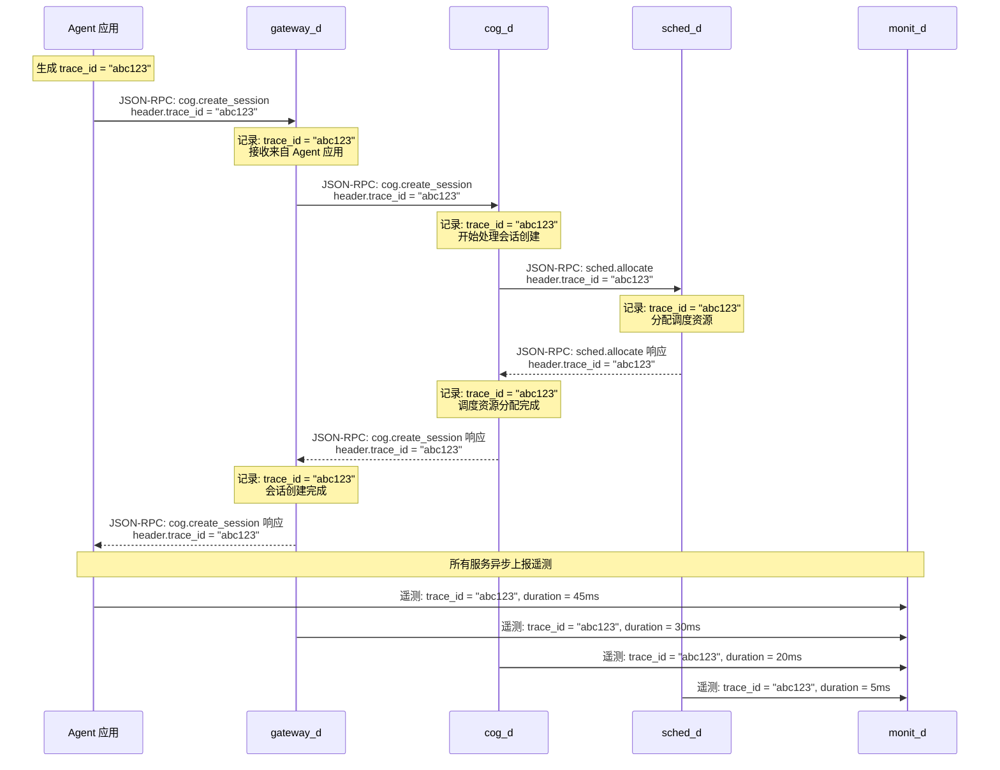
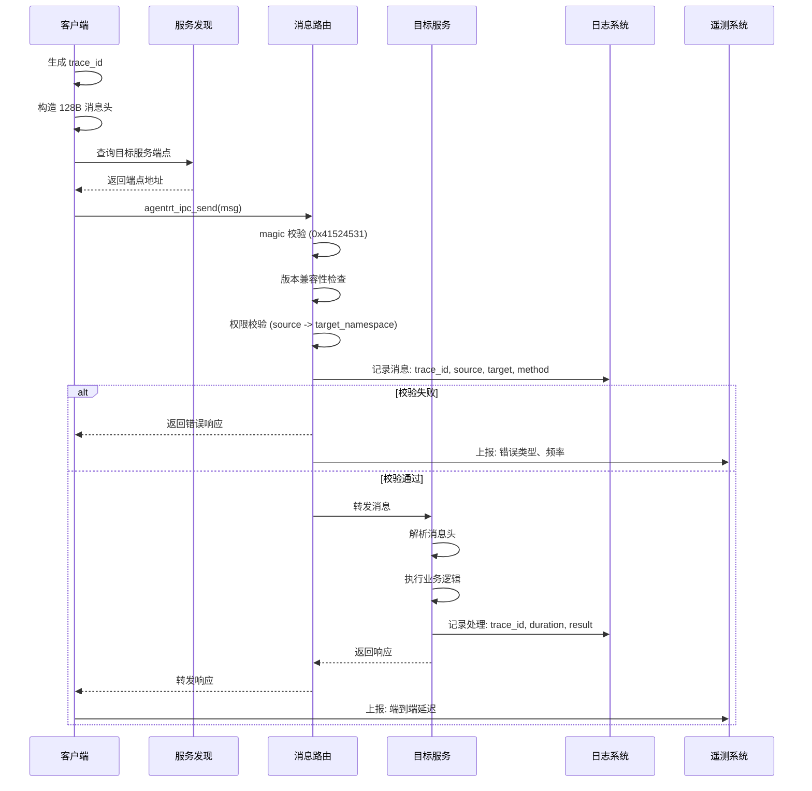

Copyright (c) 2025-2026 SPHARX Ltd. All Rights Reserved.
"From data intelligence emerges."

# agentrt-linux L2 服务通信协议规范

**最新**: 2026-07-07  
**版本**: 0.1.1（文档体系完成）/ 1.0.1（开发）  
**状态**: 草案  
**路径**: OpenAirymax/docs/AirymaxOS/50-engineering-standards/30-runtime-interfaces/L2_service_protocol.md  
**父文档**: [ARE Standards 总览](./README.md)  
**理论根基**: 体系并行论、五维正交24原则、AgentsIPC 协议族、分布式系统通信理论  

---

## 文档信息卡
- **目标读者**: 协议设计者、服务开发者、系统集成工程师、云原生架构师  
- **前置知识**: 理解 agentrt-linux（AirymaxOS）架构概览，熟悉 JSON-RPC 2.0，了解服务发现机制  
- **预计阅读时间**: 45 分钟  
- **核心概念**: AgentsIPC, 128B 消息头, 服务发现, daemon 命名空间, trace_id 贯穿  
- **复杂度标识**: 高级  

---

## 1. 引言

L2 服务通信协议是 agentrt-linux（AirymaxOS）ARE Standards 的中间层规范，定义了 OS 层各服务之间的通信协议。L2 协议建立在 L1 核心运行时接口（IPC 原语）之上，为上层服务提供可发现、可路由、可追踪的通信能力。

agentrt-linux（AirymaxOS）作为智能体操作系统，其服务通信具有以下特点：

1. **多服务协同**：12 个 daemon 守护进程（调度、内存、安全、认知、云原生等）需要高效通信
2. **跨进程协作**：内核态与用户态服务之间需要标准化通信协议
3. **可观测性要求**：所有服务通信必须可追踪、可审计、可度量
4. **云原生适配**：需要支持 K8s、consul、etcd 等云原生基础设施

### 1.1 与 agentrt L2 的共享关系

| IRON-9 v2 分层 | 共享内容 | 共享方式 |
|----------------|----------|----------|
| [SC] 共享契约层 | 128B 消息头布局、magic 编号、协议类型枚举 | 完全共享头文件 |
| [SS] 语义同源层 | JSON-RPC 2.0 方法签名、错误码格式 | 语义一致，实现独立 |
| [IND] 完全独立层 | OS 层 daemon 命名空间、服务发现后端集成 | 完全独立 |

### 1.2 设计原则

L2 的设计遵循以下五维正交24原则映射：

| 原则编号 | 原则名称 | 在 L2 中的体现 |
|----------|----------|----------------|
| K-2 | 接口契约化原则 | 128B 消息头格式固定，JSON-RPC 2.0 方法签名标准化 |
| E-1 | 安全内生原则 | 消息头中嵌入 source/target 端点 ID，实现来源验证 |
| E-6 | 错误可追溯原则 | trace_id 贯穿整个调用链，每条消息可追溯 |
| C-2 | 增量演化原则 | 服务发现支持多后端，从简单到复杂逐步演进 |
| E-2 | 开放协作原则 | JSON-RPC 2.0 开放标准，服务发现支持多种主流后端 |

---

## 2. AgentsIPC 128B 消息头规范

AgentsIPC 是 agentrt-linux（AirymaxOS）的进程间通信协议族，其核心是 128 字节定长消息头。消息头是 agentrt 与 agentrt-linux 在 IRON-9 v2 [SC] 共享契约层的核心共享构件。

### 2.1 消息头布局

```c
/**
 * are_ipc_msg_header_t - AgentsIPC 128 字节定长消息头
 *
 * 字节布局 (128 bytes total):
 *   [0-3]    - magic: 0x41524531 ('ARE1')
 *   [4-5]    - version: 协议版本 (major << 8 | minor)
 *   [6-7]    - flags: 标志位
 *   [8-23]   - trace_id: 分布式追踪 ID (UUID-128)
 *   [24-25]  - correlation_id: 关联 ID (大端序)
 *   [26-27]  - source: 源端点 ID
 *   [28-29]  - target: 目标端点 ID
 *   [30-31]  - payload_type: 载荷协议类型
 *   [32-35]  - payload_length: 载荷长度 (字节)
 *   [36-39]  - reserved: 预留字段
 *   [40-59]  - source_namespace: 源命名空间 (20 字节，null-terminated)
 *   [60-79]  - target_namespace: 目标命名空间 (20 字节，null-terminated)
 *   [80-83]  - timestamp_sec: 消息时间戳 (秒)
 *   [84-87]  - timestamp_nsec: 消息时间戳 (纳秒)
 *   [88-89]  - priority: 消息优先级 (0-255，0 最高)
 *   [90-127] - extension: 扩展字段 (38 字节，按需使用)
 *
 * 对齐要求: 128 字节对齐
 */
typedef struct __attribute__((aligned(128))) {
    uint32_t magic;                    /* [0-3]   0x41524531 */
    uint16_t version;                  /* [4-5]   协议版本 */
    uint16_t flags;                    /* [6-7]   标志位 */
    uint8_t  trace_id[16];            /* [8-23]  分布式追踪 ID */
    uint16_t correlation_id;          /* [24-25] 关联 ID */
    uint16_t source;                  /* [26-27] 源端点 */
    uint16_t target;                  /* [28-29] 目标端点 */
    uint16_t payload_type;            /* [30-31] 载荷类型 */
    uint32_t payload_length;          /* [32-35] 载荷长度 */
    uint32_t reserved;                /* [36-39] 预留 */
    char     source_namespace[20];    /* [40-59] 源命名空间 */
    char     target_namespace[20];    /* [60-79] 目标命名空间 */
    uint32_t timestamp_sec;           /* [80-83] 时间戳秒 */
    uint32_t timestamp_nsec;          /* [84-87] 时间戳纳秒 */
    uint16_t priority;                /* [88-89] 优先级 */
    uint8_t  extension[38];           /* [90-127] 扩展字段 */
} are_ipc_msg_header_t;
```

### 2.2 字段详细说明

#### magic（4 字节）
- 值: `0x41524531`（ASCII 字符 'ARE1' 的大端表示）
- 用途: 消息完整性校验，区分 AgentsIPC 消息与其他数据
- 处理: 接收方必须校验 magic，不匹配则丢弃消息并记录安全事件

#### version（2 字节）
- 高字节: 主版本号
- 低字节: 次版本号
- 当前版本: 0x0101（v1.1）
- 兼容性: 主版本不同 = 不兼容；次版本不同 = 向后兼容

#### flags（2 字节）
标志位按位定义：

| 位 | 名称 | 含义 |
|----|------|------|
| 0 | `ARE_FLAG_REQ` | 请求消息 |
| 1 | `ARE_FLAG_RESP` | 响应消息 |
| 2 | `ARE_FLAG_ERR` | 错误响应 |
| 3 | `ARE_FLAG_NOTIFY` | 通知（无响应） |
| 4 | `ARE_FLAG_COMPRESS` | 载荷已压缩 |
| 5 | `ARE_FLAG_ENCRYPT` | 载荷已加密 |
| 6-15 | 预留 | 必须为 0 |

#### trace_id（16 字节）
- 格式: UUID v4（128 位随机）
- 用途: 分布式追踪，贯穿整个请求链
- 生成: 由发起点生成，所有后续消息沿用同一 trace_id
- 贯穿要求: 所有中间服务不得修改 trace_id，必须在日志中输出

#### correlation_id（2 字节）
- 用途: 关联同一 trace 下的不同请求/响应
- 生成: 由发起点递增分配，每次新请求递增

#### source / target（各 2 字节）
- 用途: 端点标识，唯一标识消息的发送方和接收方
- 分配: 由服务发现系统分配，全局唯一
- 安全: 接收方必须校验 source 端点是否拥有发送权限

#### payload_type（2 字节）
载荷协议类型枚举：

| 类型值 | 协议 | 描述 |
|--------|------|------|
| 0x0001 | JSON-RPC 2.0 | JSON-RPC 2.0 请求/响应 |
| 0x0002 | MCP | Model Context Protocol |
| 0x0003 | A2A | Agent-to-Agent 协议 |
| 0x0004 | OpenAI | OpenAI API 兼容格式 |
| 0x0005 | Custom | 自定义二进制协议 |
| 0x0006 | Protobuf | Protocol Buffers |
| 0x0007 | FlatBuffers | FlatBuffers 零拷贝 |
| 0x0008-0xFFFF | 预留 | 未来扩展 |

#### payload_length（4 字节）
- 载荷长度（字节），最大 4GB
- 0 表示无载荷（纯通知消息）

#### source_namespace / target_namespace（各 20 字节）
- 命名空间标识，用于服务路由
- 格式: 以 null 结尾的字符串
- 详见 §4 OS 层 daemon 命名空间

### 2.3 消息完整性校验

接收方必须执行以下校验流程：

1. **magic 校验**: 检查 magic 是否为 `0x41524531`，不匹配则丢弃
2. **版本兼容性**: 检查主版本号是否匹配，不匹配则返回错误
3. **长度校验**: 检查 payload_length 是否与实际数据长度一致
4. **命名空间校验**: 检查 target_namespace 是否匹配本服务注册的命名空间
5. **权限校验**: 检查 source 端点是否有权限向 target_namespace 发送消息

---

## 3. JSON-RPC 2.0 命名空间规范

JSON-RPC 2.0 是 AgentsIPC 中最主要的载荷协议。agentrt-linux（AirymaxOS）在标准 JSON-RPC 2.0 基础上增加了命名空间规范，用于 OS 层 daemon 之间的方法调用。

### 3.1 方法命名约定

JSON-RPC 2.0 方法名使用命名空间前缀，格式为：

```
<namespace>.<method_name>
```

示例：
```
sched.set_priority
mem.get_usage
cupolas.derive_capability
cog.create_session
kernel.get_stats
```

### 3.2 请求格式

```json
{
  "jsonrpc": "2.0",
  "id": 1,
  "method": "sched.set_priority",
  "params": {
    "task_id": 42,
    "priority": 128,
    "sched_class": "SCHED_AGENT"
  }
}
```

### 3.3 响应格式

成功响应：
```json
{
  "jsonrpc": "2.0",
  "id": 1,
  "result": {
    "status": "ok",
    "previous_priority": 64
  }
}
```

错误响应（与 agentrt 统一错误码体系对齐）：
```json
{
  "jsonrpc": "2.0",
  "id": 1,
  "error": {
    "code": -1002,
    "message": "Permission denied",
    "data": {
      "error_name": "EAGENTRT_PERM",
      "task_id": 42,
      "required_cap": "sched.admin"
    }
  }
}
```

### 3.4 通知（Notification）

通知是无需响应的单向消息，`id` 字段缺失：

```json
{
  "jsonrpc": "2.0",
  "method": "sched.task_completed",
  "params": {
    "task_id": 42,
    "exit_code": 0,
    "duration_us": 15000
  }
}
```

---

## 4. OS 层 daemon 命名空间

agentrt-linux（AirymaxOS）的 OS 层定义了 12 个 daemon 守护进程，每个 daemon 拥有独立的命名空间，用于服务发现和消息路由。这些命名空间是 L2 在 [IND] 完全独立层的 OS 专属定义。

### 4.1 命名空间列表

| 命名空间 | daemon 名称 | 职责 | 监听的 IPC 端点 |
|----------|------------|------|----------------|
| `sched.` | `sched_d` | 调度守护：管理 Agent 调度策略 | `sched.ipc` |
| `mem.` | `mem_d` | 内存守护：管理 Agent 内存配额和池化 | `mem.ipc` |
| `cupolas.` | `cupolas_d` | 安全守护：Cupolas 权限引擎和沙箱管理 | `cupolas.ipc` |
| `cog.` | `cog_d` | 认知守护：CoreLoopThree 认知循环 | `cog.ipc` |
| `kernel.` | `kernel` | 内核：系统调用分发和内核态服务 | `kernel.ipc` |
| `memoryrovol.` | `memoryrovol_d` | 记忆守护：多级记忆存储和模式挖掘 | `memoryrovol.ipc` |
| `gateway.` | `gateway_d` | 网关守护：HTTP/gRPC 入口和路由 | `gateway.ipc` |
| `monit.` | `monit_d` | 监控守护：指标采集和 Prometheus 导出 | `monit.ipc` |
| `logd.` | `logd_d` | 日志守护：结构化日志收集和轮转 | `logd.ipc` |
| `netd.` | `netd_d` | 网络守护：Agent 网络策略和隔离 | `netd.ipc` |
| `storaged.` | `storaged_d` | 存储守护：Agent 持久化存储管理 | `storaged.ipc` |
| `marketd.` | `marketd_d` | 市场守护：插件市场和技能注册 | `marketd.ipc` |

### 4.2 命名空间路由规则

1. **精确匹配优先**：如果消息的 `target_namespace` 精确匹配某个 daemon 的命名空间，直接路由
2. **前缀匹配**：如果 `target_namespace` 以某 daemon 命名空间为前缀，路由到该 daemon
3. **通配符**：`target_namespace` 为 `*` 或 `broadcast.` 时，广播到所有 daemon
4. **未知命名空间**：返回 `EAGENTRT_NOTSUP` 错误

### 4.3 命名空间注册

每个 daemon 启动时通过服务发现后端注册自己的命名空间：

```c
/**
 * agentrt_svc_register - 注册服务到发现后端
 * @namespace: 命名空间（如 "sched."）
 * @endpoint: IPC 端点名称
 * @metadata: 额外的元数据（JSON 格式）
 *
 * 返回值:
 *   0: 成功注册
 *   -EAGENTRT_INVAL: 参数无效
 *   -EAGENTRT_BUSY: 命名空间已被注册
 *   -EAGENTRT_NOMEM: 内存不足
 */
int agentrt_svc_register(const char *namespace, const char *endpoint,
                         const char *metadata);
```

---

## 5. 服务发现多后端

agentrt-linux（AirymaxOS）的服务发现支持多种后端，从简单到复杂场景，符合五维正交24原则中 C-2（增量演化原则）的要求。

### 5.1 后端对比

| 后端 | 类型 | 适用场景 | 复杂度 | 一致性 | 可用性 |
|------|------|----------|--------|--------|--------|
| `shm` | 共享内存 | 单机开发/测试 | 低 | N/A | 极高 |
| `dns-sd` | DNS 服务发现 | 局域网/小集群 | 中 | 最终一致 | 高 |
| `consul` | 分布式 KV | 中规模集群 | 中 | 强一致 | 高 |
| `etcd` | 分布式 KV | 大规模集群 | 高 | 强一致 | 极高 |
| `k8s` | Kubernetes API | 云原生部署 | 高 | 最终一致 | 极高 |

### 5.2 后端选择原则

1. **单机开发/测试**：使用 `shm` 后端，零依赖，启动快
2. **小规模生产（< 10 节点）**：使用 `dns-sd`，简单可靠
3. **中规模生产（10-100 节点）**：使用 `consul`，功能丰富
4. **大规模生产（> 100 节点）**：使用 `etcd`，强一致保证
5. **Kubernetes 部署**：使用 `k8s`，与云原生基础设施无缝集成

### 5.3 统一抽象接口

所有后端实现统一的服务发现接口：

```c
/**
 * are_svc_discovery_ops - 服务发现后端操作集
 *
 * 每个后端实现该接口，通过编译时或运行时选择后端。
 */
struct are_svc_discovery_ops {
    const char *name;                              /* 后端名称 */

    /* 生命周期 */
    int (*init)(const char *config);               /* 初始化后端 */
    void (*shutdown)(void);                        /* 关闭后端 */

    /* 服务注册 */
    int (*register_svc)(const char *ns, const char *endpoint,
                        const char *metadata);
    int (*deregister_svc)(const char *ns);

    /* 服务发现 */
    int (*discover)(const char *ns, char *endpoint, size_t len);
    int (*list_services)(are_svc_info_t *svcs, size_t max_count);

    /* 健康检查 */
    int (*health_check)(const char *ns);
    int (*set_health)(const char *ns, int healthy);
};
```

### 5.4 服务发现配置

```yaml
# agentrt-linux 服务发现配置示例
service_discovery:
  backend: "etcd"                    # shm | dns-sd | consul | etcd | k8s
  config:
    endpoints: ["etcd-0:2379", "etcd-1:2379", "etcd-2:2379"]
    prefix: "/airymaxos/services/"
    ttl: 30                          # 心跳 TTL（秒）
    health_check_interval: 10        # 健康检查间隔（秒）
    dial_timeout: 5                  # 连接超时（秒）
    request_timeout: 3               # 请求超时（秒）
```

---

## 6. trace_id 贯穿机制

trace_id 是 agentrt-linux（AirymaxOS）可观测性体系的核心，贯穿整个服务调用链，确保每个请求从发起到完成都可以被追踪。

### 6.1 trace_id 生成

```c
/**
 * agentrt_trace_id_gen - 生成新的 trace_id
 * @trace_id_out: 输出缓冲区（16 字节）
 *
 * 生成 UUID v4 格式的 trace_id，使用内核随机数源确保唯一性。
 */
void agentrt_trace_id_gen(uint8_t trace_id_out[16]);
```

### 6.2 贯穿规则



**图1: trace_id 贯穿流程示例**

### 6.3 trace_id 不可篡改原则

所有中间服务必须遵守以下规则：

1. **不得修改 trace_id**：中间服务必须保持 trace_id 不变
2. **必须记录日志**：所有服务在日志中必须输出 trace_id
3. **必须上报遥测**：所有服务必须将 trace_id 包含在遥测数据中
4. **响应必须携带 trace_id**：错误响应必须包含 trace_id，便于问题定位

### 6.4 日志格式

每行日志必须包含 trace_id：

```
[2026-07-07T10:30:45.123Z] [trace_id=abc123] [cog_d] INFO: Creating session for agent_id=42
[2026-07-07T10:30:45.128Z] [trace_id=abc123] [cog_d] INFO: Allocating scheduler resources
[2026-07-07T10:30:45.133Z] [trace_id=abc123] [cog_d] INFO: Session created successfully, session_id=789
[2026-07-07T10:30:45.134Z] [trace_id=abc123] [cog_d] INFO: Total duration: 11ms
```

---

## 7. 服务通信流程

### 7.1 完整通信流程



**图2: 完整服务通信流程**

### 7.2 错误处理流程

当服务通信出现错误时，按以下流程处理：

1. **IPC 层错误**（如超时、权限不足）：由 L1 返回错误码，调用方处理
2. **协议层错误**（如 magic 不匹配、版本不兼容）：由路由器丢弃消息，记录安全事件
3. **应用层错误**（如方法不存在、参数无效）：返回 JSON-RPC 2.0 错误响应
4. **超时处理**：调用方设置超时，超时后重新查询服务发现，重试或降级
5. **断路保护**：如果目标服务连续失败超过阈值，触发断路器，暂时停止向该服务发送请求

---

## 8. 性能基准

### 8.1 消息传输性能

| 指标 | 要求 | 测试条件 |
|------|------|----------|
| 128B 消息头解析时间 | < 100 ns | 单线程，无竞争 |
| 空载荷 IPC 往返延迟 | < 10 us | 同一 CPU 核心 |
| 1KB 载荷 IPC 往返延迟 | < 15 us | 同一 CPU 核心 |
| 1MB 载荷 IPC 往返延迟 | < 500 us | 同一 CPU 核心 |
| 消息路由转发延迟 | < 5 us | 静默命名空间精确匹配 |

### 8.2 服务发现性能

| 指标 | 要求 | 后端 |
|------|------|------|
| 服务注册延迟 | < 10 ms | etcd |
| 服务发现查询延迟 | < 5 ms | etcd（缓存命中时 < 1 us） |
| 健康检查间隔 | 10 s | 所有后端 |
| 故障检测延迟 | < 30 s | 所有后端 |

### 8.3 吞吐量要求

| 指标 | 要求 | 测试条件 |
|------|------|----------|
| 单连接消息吞吐量 | > 100K msg/s | 128B 消息，单线程 |
| 多连接并发吞吐量 | > 1M msg/s | 128B 消息，8 线程 |
| 服务发现查询 QPS | > 10K QPS | etcd 后端，缓存命中 |

---

## 9. 与 agentrt L2 的共享关系详解

### 9.1 [SC] 层共享消息头布局

agentrt 和 agentrt-linux 在 [SC] 层完全共享 `are_ipc_msg_header_t` 的定义。这意味着：
- 在 agentrt 用户态运行时构造的消息，可以在 agentrt-linux 内核中直接解析
- 消息头字段顺序、偏移量、大小完全一致
- magic 编号 `0x41524531` 在两端具有相同的语义

### 9.2 [SS] 层语义同源

在 [SS] 层，以下内容语义一致但实现独立：
- JSON-RPC 2.0 方法签名格式（`namespace.method`）
- 错误码格式（`EAGENTRT_*` 前缀，负值）
- trace_id 贯穿语义（UUID v4，不可篡改）
- 服务发现接口抽象（注册、发现、健康检查）

### 9.3 [IND] 层 OS 专属

以下内容属于 [IND] 完全独立层，仅在 agentrt-linux 中存在：
- 12 个 daemon 命名空间定义
- systemd 集成和 systemd socket activation
- LSM 钩子与 IPC 权限检查的集成
- 内核态 IPC 消息路由（直接基于 io_uring）
- 多后端服务发现的内核态配置

---

## 10. 版本兼容性

### 10.1 向前兼容

agentrt-linux L2 协议遵循以下向前兼容规则：
1. 新增字段只能追加到 extension 区域（90-127 字节）
2. 新增 payload_type 枚举值不影响已有实现
3. 新增命名空间不影响已有命名空间
4. 新增 flags 位不影响已有标志位

### 10.2 向后兼容

当主版本号升级时：
1. 旧版本客户端必须能解析新版本消息头的基础字段（0-89 字节）
2. 新版本服务必须能处理旧版本客户端发送的消息
3. 至少提供 2 个版本的兼容性过渡期

---

## 11. 安全考虑

### 11.1 消息头安全

1. **magic 校验**：防止非 AgentsIPC 消息被误解析
2. **source 验证**：接收方必须验证 source 端点是否真实
3. **namespace 授权**：每个端点只能访问被授权的命名空间
4. **payload_length 校验**：防止缓冲区溢出攻击

### 11.2 传输安全

1. **本地 IPC**：通过 Unix Domain Socket / io_uring，由内核保证安全
2. **网络传输**：建议使用 TLS 1.3 加密，由 gateway_d 统一处理
3. **载荷加密**：通过 `ARE_FLAG_ENCRYPT` 标志位支持端到端加密

### 11.3 审计要求

所有服务间通信必须记录到审计日志，包括：
- 消息时间戳
- trace_id
- source 端点
- target 命名空间
- 方法名
- 响应状态（成功/错误）

---

## 12. 版本历史

| 版本 | 日期 | 修改说明 | 作者 |
|------|------|----------|------|
| v0.1.1 | 2026-07-07 | 初始草案，定义 L2 服务通信协议规范 | Airymax Architecture Team |

---

## 13. 参考文献

1. [ARE Standards 总览](./README.md)
2. [L1 核心运行时接口规范](./L1_runtime_interface.md)
3. [agentrt-linux（AirymaxOS）架构设计](../../10-architecture/01-system-architecture.md)
4. JSON-RPC 2.0 规范：https://www.jsonrpc.org/specification
5. AgentsIPC 协议文档：agentrt/protocols/
6. OpenTelemetry 规范：https://opentelemetry.io/docs/specs/

---

**文档结束**  
© 2025-2026 SPHARX Ltd. All Rights Reserved.