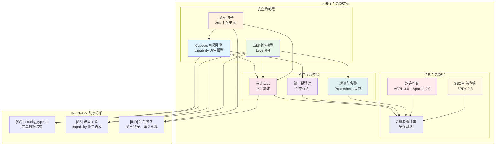
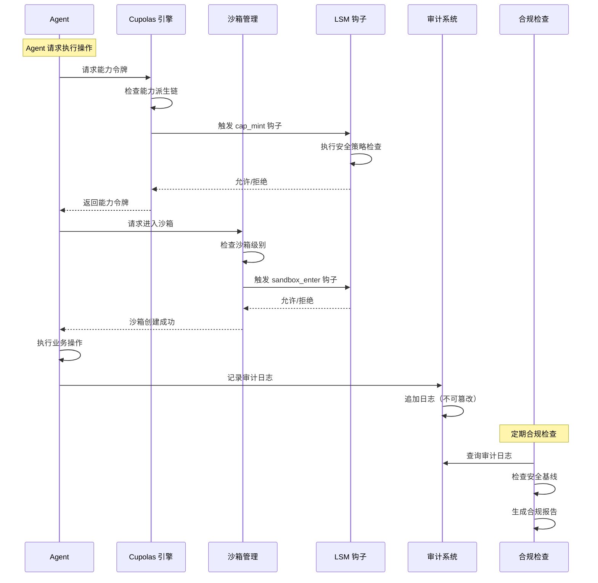

Copyright (c) 2025-2026 SPHARX Ltd. All Rights Reserved.
"From data intelligence emerges."

# agentrt-linux L3 安全与治理规范

**最新**: 2026-07-07  
**版本**: 0.1.1（文档体系完成）/ 1.0.1（开发）  
**状态**: 草案  
**路径**: OpenAirymax/docs/AirymaxOS/50-engineering-standards/30-runtime-interfaces/L3_security_governance.md  
**父文档**: [ARE Standards 总览](./README.md)  
**理论根基**: 体系并行论、五维正交24原则、Cupolas 安全穹顶模型、seL4 capability 安全模型  

---

## 文档信息卡
- **目标读者**: 安全架构师、OS 安全开发者、合规工程师、审计人员、开源合规官  
- **前置知识**: 理解 agentrt-linux（AirymaxOS）架构概览，熟悉 Linux 安全模块（LSM），了解 capability 安全模型  
- **预计阅读时间**: 50 分钟  
- **核心概念**: Cupolas 权限引擎, 五级沙箱, 能力派生, 审计日志, SBOM, 供应链安全, 双许可证  
- **复杂度标识**: 高级  

---

## 1. 引言

L3 安全与治理是 agentrt-linux（AirymaxOS）ARE Standards 的最上层规范，定义了系统的安全模型、权限管理、沙箱隔离、审计追溯和合规治理体系。L3 的设计哲学根植于五维正交24原则中 E-1（安全内生原则）：安全不是事后附加的功能，而是系统设计的内在属性。

agentrt-linux（AirymaxOS）作为面向智能体协作的操作系统，其安全需求不同于传统操作系统：
1. **多智能体共存**：多个 Agent 运行在同一物理机上，需要严格的权限隔离
2. **动态能力管理**：Agent 的能力（访问文件、网络、其他 Agent）需要动态授予和撤销
3. **可审计性**：所有 Agent 操作必须可追溯，满足合规要求
4. **供应链安全**：智能体应用的插件、技能、模型来自多方，需要软件物料清单（SBOM）

### 1.1 与 agentrt L3 的共享关系

| IRON-9 v2 分层 | 共享内容 | 共享方式 |
|----------------|----------|----------|
| [SC] 共享契约层 | `security_types.h`（能力类型定义、沙箱级别、错误码） | 完全共享头文件 |
| [SS] 语义同源层 | Cupolas 能力派生语义、沙箱模型语义 | 语义一致，实现独立 |
| [IND] 完全独立层 | LSM 钩子集成、审计日志实现、许可证合规 | 完全独立 |

### 1.2 设计原则

L3 的设计遵循以下五维正交24原则映射：

| 原则编号 | 原则名称 | 在 L3 中的体现 |
|----------|----------|----------------|
| E-1 | 安全内生原则 | 安全内嵌于系统设计，能力模型、沙箱、审计均为一级公民 |
| K-3 | 服务隔离原则 | 五级沙箱模型实现 Agent 间严格隔离 |
| K-2 | 接口契约化原则 | 统一错误码体系、能力派生接口、审计日志格式契约化 |
| E-6 | 错误可追溯原则 | 审计日志记录所有操作，支持回溯和回放 |
| E-2 | 开放协作原则 | 双许可证体系（AGPL-3.0 + Apache-2.0），SBOM 公开透明 |
| C-2 | 增量演化原则 | 安全策略从宽松到严格逐步收紧，能力从最少的开始逐步授予 |

---

## 2. Cupolas 权限引擎

Cupolas（安全穹顶）是 agentrt-linux（AirymaxOS）的核心权限引擎，实现了基于能力（capability）的安全模型。其设计参考 seL4 的 capability-based security 模型，结合 Linux 现有能力体系，为智能体协作场景提供细粒度的权限控制。

### 2.1 能力派生模型

Cupolas 定义了四种能力派生操作，每一种都有严格的语义约束：

| 操作 | 符号 | 语义 | 约束 |
|------|------|------|------|
| **mint** | `mint(parent) -> child` | 从父能力创建新的子能力，子能力权限 <= 父能力 | 不可扩大权限 |
| **mintcopy** | `mintcopy(src) -> dst` | 复制能力，dst 权限 = src 权限 | 不可扩大权限 |
| **derive** | `derive(parent, subset) -> child` | 从父能力派生子集能力，只保留 subset 指定的权限 | 必须是父能力的子集 |
| **revoke** | `revoke(cap)` | 撤销能力，递归撤销所有派生能力 | 不可逆操作 |

```c
/**
 * are_cap_t - 能力令牌类型
 *
 * 能力令牌是资源的不可伪造引用。所有资源访问必须通过能力令牌。
 * 参考 seL4 capability 模型。
 */
typedef struct {
    uint32_t id;           /* 能力唯一标识符 */
    uint32_t type;         /* 能力类型（文件、IPC、内存、网络等） */
    uint64_t permissions;  /* 权限位掩码 */
    uint32_t owner;        /* 能力所有者（Agent ID） */
    uint32_t parent;       /* 父能力 ID（0 表示根能力） */
    uint64_t issue_time;   /* 发行时间（纳秒时间戳） */
    uint64_t expire_time;  /* 过期时间（0 表示永不过期） */
} are_cap_t;
```

### 2.2 能力派生接口

```c
/**
 * agentrt_cap_mint - 创建新的子能力（权限缩小或相等）
 * @parent: 父能力令牌
 * @permissions: 子能力的权限位掩码（必须是 parent 的子集）
 * @ttl_seconds: 子能力的生存时间（秒，0 表示永不过期）
 * @child_out: 输出：子能力令牌
 *
 * 返回值:
 *   0: 成功创建
 *   -EAGENTRT_INVAL: 参数无效
 *   -EAGENTRT_PERM: 请求的权限超集于父能力
 *   -EAGENTRT_NOMEM: 内存不足
 *
 * 五维正交24原则 K-2（接口契约化原则）体现：
 * 权限超集检查是硬性约束，不可绕过。
 */
int agentrt_cap_mint(are_cap_t parent, uint64_t permissions,
                     uint64_t ttl_seconds, are_cap_t *child_out);

/**
 * agentrt_cap_mintcopy - 复制能力（权限完全相等）
 * @src: 源能力令牌
 * @dst_out: 输出：复制的能力令牌
 *
 * 返回值:
 *   0: 成功复制
 *   -EAGENTRT_INVAL: 参数无效
 *   -EAGENTRT_PERM: 权限不足（没有复制权限）
 */
int agentrt_cap_mintcopy(are_cap_t src, are_cap_t *dst_out);

/**
 * agentrt_cap_derive - 从父能力派生子集能力
 * @parent: 父能力令牌
 * @subset: 需要的权限子集（位掩码）
 * @child_out: 输出：派生能力令牌
 *
 * 常见用途：从文件读写能力派生出只读能力。
 *
 * 返回值:
 *   0: 成功派生
 *   -EAGENTRT_INVAL: 参数无效
 *   -EAGENTRT_PERM: subset 不是 parent 的子集
 */
int agentrt_cap_derive(are_cap_t parent, uint64_t subset,
                       are_cap_t *child_out);

/**
 * agentrt_cap_revoke - 撤销能力
 * @cap: 要撤销的能力令牌
 *
 * 撤销操作会递归撤销所有子能力，是不可逆操作。
 * 所有持有该能力或其子能力的 Agent 将立即失去对应权限。
 *
 * 返回值:
 *   0: 成功撤销
 *   -EAGENTRT_INVAL: 参数无效
 *   -EAGENTRT_PERM: 权限不足（不是能力所有者）
 */
int agentrt_cap_revoke(are_cap_t cap);
```

### 2.3 POSIX capability 38 ID 枚举

agentrt-linux（AirymaxOS）集成 Linux capabilities 并扩展为 38 ID 枚举：

| ID | 名称 | 描述 | 风险等级 |
|----|------|------|----------|
| 0 | `CAP_CHOWN` | 修改文件所有者 | 高 |
| 1 | `CAP_DAC_OVERRIDE` | 绕过文件权限检查 | 高 |
| 2 | `CAP_DAC_READ_SEARCH` | 绕过文件读/搜索权限 | 中 |
| 3 | `CAP_FOWNER` | 绕过文件所有者检查 | 高 |
| 4 | `CAP_FSETID` | 设置文件 SUID/SGID | 高 |
| 5 | `CAP_KILL` | 向任意进程发送信号 | 中 |
| 6 | `CAP_SETGID` | 修改进程 GID | 高 |
| 7 | `CAP_SETUID` | 修改进程 UID | 高 |
| 8 | `CAP_SETPCAP` | 修改进程能力集 | 极高 |
| 9 | `CAP_NET_BIND_SERVICE` | 绑定特权端口 | 中 |
| 10 | `CAP_NET_BROADCAST` | 网络广播 | 低 |
| 11 | `CAP_NET_ADMIN` | 网络管理 | 高 |
| 12 | `CAP_NET_RAW` | 原始套接字 | 高 |
| 13 | `CAP_IPC_LOCK` | 锁定内存 | 中 |
| 14 | `CAP_IPC_OWNER` | 绕过 IPC 所有权检查 | 高 |
| 15 | `CAP_SYS_MODULE` | 加载内核模块 | 极高 |
| 16 | `CAP_SYS_RAWIO` | 原始 I/O 操作 | 极高 |
| 17 | `CAP_SYS_CHROOT` | 使用 chroot | 高 |
| 18 | `CAP_SYS_PTRACE` | 跟踪任意进程 | 极高 |
| 19 | `CAP_SYS_PACCT` | 进程记账 | 中 |
| 20 | `CAP_SYS_ADMIN` | 系统管理（万能） | 极高 |
| 21 | `CAP_SYS_BOOT` | 重启系统 | 高 |
| 22 | `CAP_SYS_NICE` | 修改进程优先级 | 中 |
| 23 | `CAP_SYS_RESOURCE` | 修改资源限制 | 中 |
| 24 | `CAP_SYS_TIME` | 修改系统时间 | 中 |
| 25 | `CAP_SYS_TTY_CONFIG` | TTY 配置 | 中 |
| 26 | `CAP_MKNOD` | 创建设备节点 | 高 |
| 27 | `CAP_LEASE` | 文件租约 | 低 |
| 28 | `CAP_AUDIT_WRITE` | 写入审计日志 | 中 |
| 29 | `CAP_AUDIT_CONTROL` | 审计控制 | 极高 |
| 30 | `CAP_SETFCAP` | 设置文件能力 | 高 |
| 31 | `CAP_MAC_OVERRIDE` | 绕过 MAC 策略 | 极高 |
| 32 | `CAP_MAC_ADMIN` | MAC 配置 | 极高 |
| 33 | `CAP_SYSLOG` | 读取内核日志 | 中 |
| 34 | `CAP_WAKE_ALARM` | 触发系统唤醒 | 低 |
| 35 | `CAP_BLOCK_SUSPEND` | 阻止系统挂起 | 低 |
| 36 | `CAP_AUDIT_READ` | 读取审计日志 | 中 |
| 37 | `CAP_PERFMON` | 性能监控 | 中 |
| 38 | `CAP_AGENT_ADMIN` | **Agent 管理（Airymax 专属）** | 极高 |
| 39 | `CAP_AGENT_SCHED` | **Agent 调度（Airymax 专属）** | 高 |
| 40 | `CAP_AGENT_SANDBOX` | **Agent 沙箱管理（Airymax 专属）** | 高 |

> 注：ID 38-40 为 agentrt-linux（AirymaxOS）在 Linux 标准 38 能力基础上新增的 Agent 专属能力，属于 [IND] 完全独立层。

---

## 3. 五级沙箱模型

agentrt-linux（AirymaxOS）定义了五级沙箱安全隔离模型，从 Level 0（完全不隔离）到 Level 4（硬件级隔离），每一级对应不同的安全需求和性能开销。

### 3.1 沙箱级别定义

| 级别 | 名称 | 隔离方式 | 性能开销 | 适用场景 |
|------|------|----------|----------|----------|
| **Level 0** | 无隔离 | 共享进程空间 | 0% | 完全可信的内部 Agent，开发调试 |
| **Level 1** | 进程隔离 | 独立进程 + Linux namespace | < 5% | 一般可信的内部 Agent |
| **Level 2** | 容器隔离 | 独立容器 + seccomp + capabilities 限制 | 5-10% | 半可信的第三方 Agent |
| **Level 3** | 虚拟机隔离 | 轻量虚拟机（microVM/Firecracker） | 10-20% | 不可信的外部 Agent |
| **Level 4** | 硬件隔离 | 独立物理机/TEE（可信执行环境） | 20-50% | 处理敏感数据的关键 Agent |

### 3.2 沙箱配置

```c
/**
 * are_sandbox_config_t - 沙箱配置
 */
typedef struct {
    uint32_t level;                    /* 沙箱级别 (0-4) */
    uint64_t max_memory_bytes;         /* 最大内存限制 */
    uint32_t max_cpu_percent;          /* 最大 CPU 使用率 */
    uint32_t max_disk_bytes;           /* 最大磁盘空间 */
    uint32_t max_network_kbps;         /* 最大网络带宽 (kbps) */
    uint32_t max_processes;            /* 最大子进程数 */
    uint32_t max_fds;                  /* 最大文件描述符数 */
    uint64_t timeout_seconds;          /* 超时自动终止（0 表示不限制） */
    uint64_t allow_capabilities;       /* 允许的能力位掩码 */
    char     seccomp_profile[256];     /* seccomp 过滤规则文件路径 */
    char     apparmor_profile[256];    /* AppArmor 配置文件名 */
    bool     allow_network;            /* 是否允许网络访问 */
    bool     allow_filesystem;         /* 是否允许文件系统访问 */
    bool     allow_ipc;                /* 是否允许 IPC 通信 */
    bool     readonly_rootfs;          /* 是否只读根文件系统 */
    char     image_ref[256];           /* 沙箱镜像引用（Level 2+） */
} are_sandbox_config_t;
```

### 3.3 沙箱管理接口

```c
/**
 * agentrt_sandbox_create - 创建沙箱
 * @config: 沙箱配置
 * @sandbox_out: 输出：沙箱能力令牌
 *
 * 返回值:
 *   0: 成功创建
 *   -EAGENTRT_INVAL: 参数无效
 *   -EAGENTRT_NOMEM: 资源不足
 *   -EAGENTRT_PERM: 权限不足（需要 CAP_AGENT_SANDBOX）
 */
int agentrt_sandbox_create(const are_sandbox_config_t *config,
                           are_cap_t *sandbox_out);

/**
 * agentrt_sandbox_enter - 将 Agent 放入沙箱
 * @agent: Agent 能力令牌
 * @sandbox: 沙箱能力令牌
 *
 * 返回值:
 *   0: 成功
 *   -EAGENTRT_INVAL: 参数无效
 *   -EAGENTRT_PERM: 权限不足
 *   -EAGENTRT_BUSY: Agent 已在其他沙箱中
 */
int agentrt_sandbox_enter(are_cap_t agent, are_cap_t sandbox);

/**
 * agentrt_sandbox_destroy - 销毁沙箱
 * @sandbox: 沙箱能力令牌
 *
 * 销毁沙箱会终止其中的所有 Agent。
 *
 * 返回值:
 *   0: 成功
 *   -EAGENTRT_INVAL: 参数无效
 *   -EAGENTRT_PERM: 权限不足
 */
int agentrt_sandbox_destroy(are_cap_t sandbox);
```

### 3.4 沙箱升级/降级

沙箱级别可以在运行时升级（收紧）但不可降级（放宽）：

```c
/**
 * agentrt_sandbox_upgrade - 升级沙箱安全级别
 * @sandbox: 沙箱能力令牌
 * @new_level: 新安全级别（必须 >= 当前级别）
 * @new_config: 新配置（可选，NULL 表示保持当前配置）
 *
 * 沙箱升级是单向操作——只能收紧，不能放宽。
 * 这符合五维正交24原则中 E-1（安全内生原则）的要求。
 *
 * 返回值:
 *   0: 成功升级
 *   -EAGENTRT_INVAL: 参数无效（new_level < 当前级别）
 *   -EAGENTRT_PERM: 权限不足
 */
int agentrt_sandbox_upgrade(are_cap_t sandbox, uint32_t new_level,
                            const are_sandbox_config_t *new_config);
```

---

## 4. 统一错误码体系

agentrt-linux（AirymaxOS）使用统一的错误码体系，确保错误信息在 OS 层和用户态层之间一致传递。该体系在 IRON-9 v2 [SC] 共享契约层与 agentrt 完全共享。

### 4.1 错误码分类

| 类别 | 范围 | 描述 | 示例 |
|------|------|------|------|
| 通用错误 | -1000 至 -1099 | 跨子系统的通用错误 | `EAGENTRT_INVAL`(-1001), `EAGENTRT_PERM`(-1002) |
| 内存错误 | -1100 至 -1199 | 内存管理相关错误 | `EAGENTRT_NOMEM`(-1003), `EAGENTRT_OVERFLOW`(-1009) |
| IPC 错误 | -1200 至 -1299 | IPC 通信相关错误 | `EAGENTRT_TIMEOUT`(-1004), `EAGENTRT_BUSY`(-1005) |
| 安全错误 | -1300 至 -1399 | 安全策略相关错误 | `EAGENTRT_PERM`(-1002), `EAGENTRT_DEADLK`(-1006) |
| 沙箱错误 | -1400 至 -1499 | 沙箱管理相关错误 | `EAGENTRT_SANDBOX_FULL`(-1401), `EAGENTRT_SANDBOX_ESC`(-1402) |
| 能力错误 | -1500 至 -1599 | 能力管理相关错误 | `EAGENTRT_CAP_EXPIRED`(-1501), `EAGENTRT_CAP_REVOKED`(-1502) |
| 调度错误 | -1600 至 -1699 | 调度相关错误 | `EAGENTRT_SCHED_EXHAUSTED`(-1601) |
| 认知错误 | -1700 至 -1799 | 认知处理相关错误 | `EAGENTRT_COG_TIMEOUT`(-1701) |
| 审计错误 | -1800 至 -1899 | 审计系统相关错误 | `EAGENTRT_AUDIT_DISK_FULL`(-1801) |

### 4.2 错误码定义规范

```c
/**
 * 错误码定义规范
 *
 * 1. 所有错误码使用 EAGENTRT_ 前缀
 * 2. 错误码负值返回
 * 3. 错误码一旦定义即冻结，不可修改语义
 * 4. 新错误码只能追加，不可删除或重新编号
 * 5. 每个错误码必须在文档中清晰描述触发条件
 */
#define EAGENTRT_INVAL            (-1001)  /* 参数无效 */
#define EAGENTRT_PERM             (-1002)  /* 权限不足 */
#define EAGENTRT_NOMEM            (-1003)  /* 内存不足 */
#define EAGENTRT_TIMEOUT          (-1004)  /* 操作超时 */
#define EAGENTRT_BUSY             (-1005)  /* 资源忙 */
#define EAGENTRT_DEADLK           (-1006)  /* 检测到死锁 */
#define EAGENTRT_INTR             (-1007)  /* 被信号中断 */
#define EAGENTRT_NOTSUP           (-1008)  /* 不支持的操作 */
#define EAGENTRT_OVERFLOW         (-1009)  /* 数值溢出 */
#define EAGENTRT_FAULT            (-1010)  /* 地址错误 */
#define EAGENTRT_SANDBOX_FULL     (-1401)  /* 沙箱容量已满 */
#define EAGENTRT_SANDBOX_ESC      (-1402)  /* 沙箱逃逸尝试 */
#define EAGENTRT_CAP_EXPIRED      (-1501)  /* 能力已过期 */
#define EAGENTRT_CAP_REVOKED      (-1502)  /* 能力已被撤销 */
#define EAGENTRT_SCHED_EXHAUSTED  (-1601)  /* 调度资源耗尽 */
#define EAGENTRT_COG_TIMEOUT      (-1701)  /* 认知处理超时 */
#define EAGENTRT_AUDIT_DISK_FULL  (-1801)  /* 审计磁盘满 */
```

---

## 5. 审计日志规范

审计日志是 agentrt-linux（AirymaxOS）不可妥协的安全底线，对应五维正交24原则中 E-1（安全内生原则）和 E-6（错误可追溯原则）。

### 5.1 审计日志格式

```c
/**
 * are_audit_entry_t - 审计日志条目
 *
 * 每条审计日志记录一个安全相关事件。
 * 审计日志不可修改、不可删除（仅追加）。
 */
typedef struct __attribute__((packed)) {
    uint64_t timestamp_sec;          /* 时间戳（秒） */
    uint64_t timestamp_nsec;         /* 时间戳（纳秒） */
    uint8_t  trace_id[16];          /* 关联的 trace_id */
    uint32_t event_id;              /* 事件唯一 ID */
    uint32_t event_type;            /* 事件类型 */
    uint32_t agent_id;              /* 触发事件的 Agent ID */
    uint32_t subject_cap;           /* 主体能力 ID */
    uint32_t object_cap;            /* 客体能力 ID */
    uint32_t operation;             /* 操作类型 */
    int32_t  result;                /* 操作结果（0 成功，负值错误） */
    uint32_t src_ip;                /* 来源 IP（网络事件） */
    uint16_t src_port;              /* 来源端口（网络事件） */
    uint8_t  severity;              /* 严重级别 (0-7) */
    uint8_t  reserved[5];           /* 对齐填充 */
    char     description[128];      /* 事件描述 */
} are_audit_entry_t;
```

### 5.2 审计事件类型

| 事件类型 | 描述 | 必须记录 |
|----------|------|----------|
| `AUDIT_CAP_MINT` | 能力创建 | 是 |
| `AUDIT_CAP_REVOKE` | 能力撤销 | 是 |
| `AUDIT_CAP_USE` | 能力使用 | 是 |
| `AUDIT_SANDBOX_CREATE` | 沙箱创建 | 是 |
| `AUDIT_SANDBOX_ENTER` | Agent 进入沙箱 | 是 |
| `AUDIT_SANDBOX_ESC` | 沙箱逃逸尝试 | 是 |
| `AUDIT_IPC_SEND` | IPC 消息发送 | 否（采样） |
| `AUDIT_IPC_RECV` | IPC 消息接收 | 否（采样） |
| `AUDIT_MEM_ALLOC` | 内存分配 | 否（采样） |
| `AUDIT_TASK_CREATE` | 任务创建 | 是 |
| `AUDIT_TASK_DESTROY` | 任务销毁 | 是 |
| `AUDIT_AUTH_FAIL` | 认证失败 | 是 |
| `AUDIT_AUTH_SUCCESS` | 认证成功 | 是 |
| `AUDIT_CONFIG_CHANGE` | 配置变更 | 是 |
| `AUDIT_SYSTEM_START` | 系统启动 | 是 |
| `AUDIT_SYSTEM_SHUTDOWN` | 系统关闭 | 是 |

### 5.3 审计日志管理

```c
/**
 * agentrt_audit_write - 写入审计日志
 * @entry: 审计日志条目
 *
 * 审计日志仅追加，不可修改或删除。写入操作是异步的，
 * 保证不阻塞正常业务流程。
 *
 * 返回值:
 *   0: 成功写入
 *   -EAGENTRT_AUDIT_DISK_FULL: 审计磁盘已满（系统告警）
 *   -EAGENTRT_INVAL: 参数无效
 */
int agentrt_audit_write(const are_audit_entry_t *entry);

/**
 * agentrt_audit_query - 查询审计日志
 * @filter: 过滤条件（NULL 表示查询全部）
 * @entries: 输出缓冲区
 * @max_entries: 最大条目数
 * @actual_out: 实际返回条目数
 *
 * 返回值:
 *   0: 成功
 *   -EAGENTRT_INVAL: 参数无效
 *   -EAGENTRT_PERM: 权限不足（需要 CAP_AUDIT_READ）
 */
int agentrt_audit_query(const are_audit_filter_t *filter,
                        are_audit_entry_t *entries,
                        size_t max_entries,
                        size_t *actual_out);
```

### 5.4 审计日志安全要求

1. **不可篡改性**：审计日志一旦写入，不可修改、不可删除
2. **完整性校验**：审计日志需要定期进行完整性校验（哈希链）
3. **磁盘保护**：审计日志磁盘分区必须独立，防止业务日志挤占审计空间
4. **访问控制**：只有具有 `CAP_AUDIT_READ` 能力的进程可以读取审计日志
5. **轮转策略**：审计日志按天轮转，保留至少 90 天
6. **加密存储**：审计日志支持 AES-256 加密存储

---

## 6. LSM 钩子集成

agentrt-linux（AirymaxOS）在 Linux 安全模块（LSM）框架基础上，为 Agent 场景增加了专属安全钩子点。

### 6.1 LSM 钩子分类

| 钩子类别 | 钩子数量 | 描述 |
|----------|----------|------|
| 进程管理 | 42 | 进程创建、销毁、信号发送 |
| 文件系统 | 58 | 文件打开、读写、属性修改 |
| IPC | 35 | IPC 消息发送、接收、端点管理 |
| 网络 | 41 | 网络连接、数据包过滤 |
| 能力管理 | 22 | 能力创建、派生、撤销、使用 |
| 沙箱管理 | 18 | 沙箱创建、进入、退出、升级 |
| 审计管理 | 15 | 审计日志写入、查询、配置 |
| 认知管理 | 12 | 认知任务创建、调度、执行 |
| 内存管理 | 11 | 内存分配、映射、防护 |
| **总计** | **254** | |

### 6.2 Agent 专属 LSM 钩子

agentrt-linux（AirymaxOS）在标准 Linux LSM 254 个钩子之上，增加了以下 Agent 专属钩子：

```c
/**
 * Agent 专属 LSM 钩子（[IND] 完全独立层）
 *
 * 这些钩子仅在 agentrt-linux（AirymaxOS）中存在，
 * 不属于 agentrt 共享范畴。
 */
struct are_agent_security_ops {
    /* 能力管理钩子 */
    int (*cap_mint_permission)(are_cap_t parent, uint64_t requested_perms);
    int (*cap_derive_permission)(are_cap_t parent, uint64_t subset);
    int (*cap_revoke_permission)(are_cap_t target);

    /* 沙箱钩子 */
    int (*sandbox_create_permission)(uint32_t level);
    int (*sandbox_enter_permission)(are_cap_t agent, are_cap_t sandbox);
    int (*sandbox_escape_detected)(are_cap_t sandbox, const char *details);

    /* Agent 通信钩子 */
    int (*agent_ipc_permission)(are_cap_t src, are_cap_t dst,
                                const char *src_ns, const char *dst_ns);
    int (*agent_network_egress)(are_cap_t agent, uint32_t dst_ip,
                                uint16_t dst_port);

    /* 认知安全钩子 */
    int (*cog_model_permission)(are_cap_t agent, const char *model_id);
    int (*cog_prompt_filter)(are_cap_t agent, const char *prompt,
                             size_t len);
    int (*cog_response_filter)(are_cap_t agent, const char *response,
                               size_t len);
};
```

### 6.3 LSM 钩子注册

```c
/**
 * agentrt_lsm_register - 注册 Agent 安全模块
 * @ops: 安全操作集
 * @name: 模块名称（最多 64 字符）
 *
 * 返回值:
 *   0: 成功注册
 *   -EAGENTRT_INVAL: 参数无效
 *   -EAGENTRT_BUSY: 同名模块已注册
 *   -EAGENTRT_PERM: 权限不足（需要 CAP_MAC_ADMIN）
 */
int agentrt_lsm_register(const struct are_agent_security_ops *ops,
                         const char *name);
```

---

## 7. 安全治理架构



**图1: agentrt-linux L3 安全与治理架构**

### 7.1 安全治理流程



**图2: agentrt-linux 安全治理流程**

---

## 8. 双许可证体系

agentrt-linux（AirymaxOS）遵循双许可证体系，平衡开放性与商业可持续性。

### 8.1 许可证分配

| 组件 | 许可证 | 原因 |
|------|--------|------|
| 内核核心（`airymaxos-kernel`） | GPL-2.0 | 遵循 Linux 内核许可证要求 |
| 用户态服务（`airymaxos-services`） | AGPL-3.0 | 保障网络服务场景下的代码开放 |
| SDK 和客户端库（`sdk/`） | Apache-2.0 | 允许商业闭源应用集成 |
| ARE Standards 文档 | Apache-2.0 | 开放标准，鼓励广泛采纳 |
| 测试套件和工具 | Apache-2.0 | 降低社区贡献门槛 |
| 第三方依赖 | 各依赖的原始许可证 | 遵循依赖的许可证要求 |

### 8.2 许可证选择理由

1. **AGPL-3.0 for 用户态服务**：确保 agentrt-linux 作为网络服务运行时，对其修改必须开源，维护社区生态健康
2. **Apache-2.0 for SDK**：允许商业公司基于 agentrt-linux 构建闭源智能体应用，促进生态繁荣
3. **GPL-2.0 for 内核**：遵循 Linux 内核上游许可证，保证合规性
4. **Apache-2.0 for 标准文档**：促进 ARE Standards 的最广泛采纳

### 8.3 许可证合规要求

所有贡献者必须在提交补丁时签署 DCO（Developer Certificate of Origin），声明其代码可以合法地以相应许可证提交。贡献者许可证协议（CLA）对于大型贡献者可能额外要求。

---

## 9. SBOM 与供应链安全

### 9.1 SBOM 标准

agentrt-linux（AirymaxOS）遵循 SPDX 2.3 标准生成软件物料清单（SBOM），确保供应链透明度。

### 9.2 SBOM 内容

SBOM 必须包含以下信息：

| 字段 | 描述 | 示例 |
|------|------|------|
| 组件名称 | 软件包名称 | `airymaxos-kernel` |
| 版本 | 语义版本号 | `1.0.1` |
| 许可证 | SPDX 许可证标识符 | `GPL-2.0-only` |
| 上游来源 | 组件的上游仓库 URL | `https://github.com/...` |
| 依赖关系 | 直接依赖的组件列表 | `libssl, libcurl, eBPF` |
| 哈希值 | 源码包的 SHA-256 哈希 | `a1b2c3...` |
| 已知漏洞 | 关联的 CVE 编号 | `CVE-2024-1234` |
| 维护者 | 负责该组件的维护团队 | `Airymax Kernel SIG` |

### 9.3 SBOM 生成工具

```bash
# 使用 SPDX 生成工具生成 SBOM
airymaxos-sbom generate \
    --format spdx-2.3 \
    --output sbom.spdx.json \
    --include-dependencies \
    --include-vulnerabilities \
    --sign-key /etc/airymaxos/sbom-signing-key.pem
```

### 9.4 供应链安全检查清单

| 检查项 | 要求 | 频率 |
|--------|------|------|
| 依赖版本扫描 | 所有依赖必须是最新的安全版本 | 每次构建 |
| 已知漏洞检查 | 扫描 CVE 数据库，标记已知漏洞 | 每日 |
| 许可证合规检查 | 所有依赖许可证必须兼容 | 每次发布 |
| 签名验证 | 所有外部依赖必须验证 GPG 签名 | 每次构建 |
| 二进制审查 | 第三方二进制组件必须经过安全审查 | 每次引入 |
| 供应链溯源 | 所有组件必须可追溯到上游源码 | 持续 |

---

## 10. 安全合规检查清单

### 10.1 开发阶段检查

| 检查项 | 标准 | 工具 |
|--------|------|------|
| 代码静态分析 | 无高危漏洞 | CodeQL, Coverity |
| 依赖扫描 | 无已知高危 CVE | Dependabot, Snyk |
| 许可证检查 | 无许可证冲突 | FOSSA, license-checker |
| 密钥扫描 | 无硬编码密钥 | git-secrets, truffleHog |
| SAST | 无 SQL 注入、XSS 等 | SonarQube, Semgrep |

### 10.2 构建阶段检查

| 检查项 | 标准 | 工具 |
|--------|------|------|
| 构建签名 | 所有构建产物必须签名 | GPG, cosign |
| SBOM 生成 | 必须生成 SPDX 2.3 SBOM | airymaxos-sbom |
| 容器镜像扫描 | 无高危漏洞 | Trivy, Grype |
| 构建环境隔离 | 隔离构建环境，禁止网络访问 | GitHub Actions, BuildKit |

### 10.3 部署阶段检查

| 检查项 | 标准 | 要求 |
|--------|------|------|
| 沙箱配置 | 所有 Agent 在沙箱中运行 | 除 Level 0 外默认启用 |
| 能力最小化 | 每个 Agent 只拥有最少必要能力 | 设计评审确认 |
| 网络隔离 | 默认禁止网络访问，按需开放 | 显式配置 |
| 审计启用 | 审计日志必须开启 | 不可关闭 |
| 资源限制 | 所有 Agent 有资源配额 | 显式配置 |

### 10.4 运维阶段检查

| 检查项 | 标准 | 频率 |
|--------|------|------|
| 安全更新 | 及时应用安全补丁 | 关键漏洞 24 小时内 |
| 审计日志审查 | 定期审查审计日志 | 每周 |
| 渗透测试 | 定期进行渗透测试 | 每季度 |
| 合规审计 | 第三方安全审计 | 每年 |
| 事件响应演练 | 安全事件响应演练 | 每半年 |

---

## 11. 与 seL4 capability 安全模型参考

agentrt-linux（AirymaxOS）的 Cupolas 权限引擎严格参考了 seL4 的 capability 安全模型：

### 11.1 seL4 核心安全原则

| seL4 原则 | 描述 | agentrt-linux 实现 |
|-----------|------|-------------------|
| **能力是唯一访问方式** | 所有资源访问必须通过能力令牌 | `agentrt_cap_mint` 系列接口 |
| **能力不可伪造** | 能力令牌由内核管理，用户空间无法伪造 | 内核态能力存储 |
| **能力派生保持权限不增** | 子能力的权限 <= 父能力的权限 | `mint`/`derive` 必须检查权限子集约束 |
| **能力可撤销** | 能力撤销递归影响所有派生能力 | `agentrt_cap_revoke` 递归撤销 |
| **最小权限原则** | 每个组件只拥有完成其功能所需的最小能力 | 沙箱创建时默认最小能力集 |

### 11.2 超越 seL4 的创新

agentrt-linux（AirymaxOS）在 seL4 基础上增加了：

1. **能力生存时间（TTL）**：seL4 的能力无过期机制，agentrt-linux 支持 TTL，自动过期
2. **能力审计链**：每次能力派生和撤销都记录到审计日志
3. **五级沙箱模型**：seL4 只有进程隔离，agentrt-linux 提供五级隔离
4. **Agent 专属能力**：`CAP_AGENT_ADMIN`、`CAP_AGENT_SCHED`、`CAP_AGENT_SANDBOX`

---

## 12. 版本历史

| 版本 | 日期 | 修改说明 | 作者 |
|------|------|----------|------|
| v0.1.1 | 2026-07-07 | 初始草案，定义 L3 安全与治理规范 | Airymax Architecture Team |

---

## 13. 参考文献

1. [ARE Standards 总览](./README.md)
2. [L1 核心运行时接口规范](./L1_runtime_interface.md)
3. [L2 服务通信协议规范](./L2_service_protocol.md)
4. [agentrt-linux（AirymaxOS）安全设计](../../110-security/README.md)
5. [agentrt-linux（AirymaxOS）工程思想](../../50-engineering-standards/04-engineering-philosophy.md)
6. seL4 项目文档：https://sel4.systems/
7. Linux capabilities 文档：https://man7.org/linux/man-pages/man7/capabilities.7.html
8. SPDX 2.3 规范：https://spdx.github.io/spdx-spec/v2.3/
9. Linux LSM 框架文档：https://docs.kernel.org/admin-guide/LSM/index.html

---

**文档结束**  
© 2025-2026 SPHARX Ltd. All Rights Reserved.