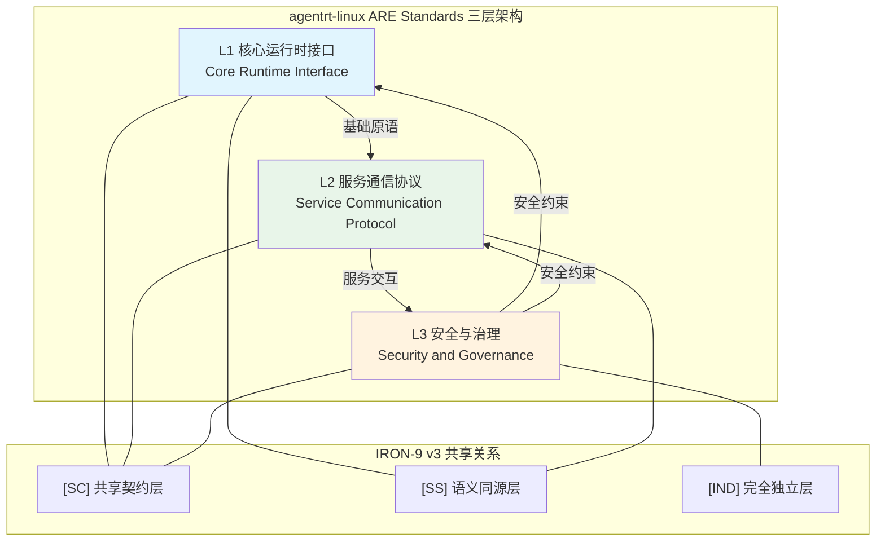
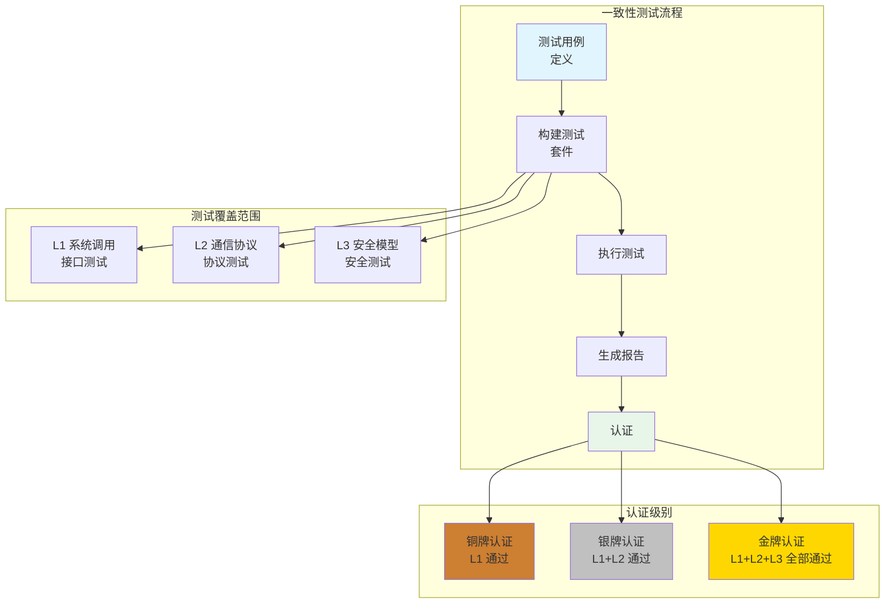

Copyright (c) 2025-2026 SPHARX Ltd. All Rights Reserved.
"From data intelligence emerges."

# agentrt-linux ARE Standards 总览
> **文档定位**：agentrt-linux ARE Standards 总览\
> **文档版本**：0.1.1\
> **最后更新**： 2026-07-21\
> **上级文档**：[工程标准规范手册](../00-engineering-standards-handbook.md)\
> **理论根基**：体系并行论、五维正交24原则、IRON-9 v3 同源且部分代码共享\
> **编号权威**：[09-ssot-registry.md §3](../09-ssot-registry.md)\
> **SSoT 依赖声明**：本子目录的规则编号登记于 [09-ssot-registry.md §3](../09-ssot-registry.md)。ARE（Airymax Runtime Environment）标准接口的命名前缀权威为 [coding_conventions.md Part IV §1.10](../10-coding-style/coding_conventions.md)（`are_*` 前缀）。

---

## 1. 引言

agentrt-linux（AirymaxOS）作为面向智能体协作的操作系统发行版，需要一套开放、分层、可演进的标准体系来定义 OS 层与用户态、OS 层与硬件、OS 组件之间的交互契约。这套标准体系被称为 **ARE Standards（Agent Runtime Environment Standards）**，是 agentrt-linux（AirymaxOS）开放生态的基石。

ARE Standards 在 agentrt-linux（AirymaxOS）体系中的定位可以从两个维度理解：

### 1.1 与 agentrt 用户态 ARE Standards 的关系

agentrt（AirymaxAgentRT）本身定义了一套用户态运行时的 ARE Standards，面向智能体应用开发者和 SDK 使用者。而 agentrt-linux（AirymaxOS）的 ARE Standards 则聚焦于 OS 层，面向内核开发者、驱动开发者和系统集成商。两者通过 IRON-9 v3 四层模型实现有序协作：

| IRON-9 v3 分层 | 与 agentrt 关系 | 内容范围 |
|----------------|----------------|----------|
| [SC] 共享契约层 | 完全共享代码 | 通用数据结构、常量定义、错误码、基础头文件 |
| [SS] 语义同源层 | 语义相同，实现独立 | 核心接口签名、协议格式、安全模型 |
| [IND] 完全独立层 | 完全独立，按需适配 | OS 专属实现、内核机制、驱动模型 |

agentrt-linux（AirymaxOS）ARE Standards 与 agentrt ARE Standards 形成**互补而非重复**的关系：用户态关注应用级契约，OS 层关注内核级契约；用户态关注可移植性，OS 层关注性能和安全；用户态关注多平台兼容，OS 层关注 Linux 内核特性深度整合。

### 1.2 开放标准的意义

开放标准对于 agentrt-linux（AirymaxOS）生态的重要性体现在：

1. **互操作性**：不同厂商、不同社区贡献的组件可以通过标准接口无缝集成
2. **可替换性**：符合标准的组件可以独立演进，不破坏整体一致性
3. **可测试性**：标准接口可以定义一致性测试套件，保证实现质量
4. **可演进性**：分层标准允许底层实现升级而不影响上层应用
5. **可治理性**：开放标准需要开放治理，社区贡献有章可循

这一定位完全契合五维正交24原则中 E-2（开放协作原则）和 S-2（层次分解原则），通过清晰的边界划分实现系统的有序演进。

### 1.3 ARE Standards 在 OS 层的定位

agentrt-linux（AirymaxOS）ARE Standards 在 OS 技术栈中处于关键位置，连接硬件抽象层、内核运行时、用户态服务和智能体应用四个层面：

```
┌─────────────────────────────────────────────────────────────────┐
│                    Agent 应用层                                   │
│         (遵循 agentrt 用户态 ARE Standards)                      │
├─────────────────────────────────────────────────────────────────┤
│  ┌───────────────────────────────────────────────────────────┐  │
│  │              agentrt-linux ARE Standards                   │  │
│  │  ┌──────────────┬──────────────┬──────────────────────┐  │  │
│  │  │ L1 运行时接口 │ L2 通信协议  │ L3 安全与治理        │  │  │
│  │  │ (syscall)    │ (AgentsIPC)  │ (Cupolas/Sandbox)    │  │  │
│  │  └──────────────┴──────────────┴──────────────────────┘  │  │
│  └───────────────────────────────────────────────────────────┘  │
├─────────────────────────────────────────────────────────────────┤
│                    OS 内核层                                      │
│    (Linux 6.6 内核基线 + sched_tac + io_uring)            │
├─────────────────────────────────────────────────────────────────┤
│                    硬件抽象层                                     │
│          (x86 / ARM / RISC-V / 鲲鹏 / 飞腾)                      │
└─────────────────────────────────────────────────────────────────┘
```

ARE Standards 的三个层级在 OS 栈中的位置各不相同：
- **L1** 直接定义内核系统调用接口，是用户态与内核态的分界线
- **L2** 定义用户态服务之间的通信协议，是服务间协作的契约
- **L3** 定义安全与治理规则，贯穿整个 OS 栈

这种分层设计使得每个层级可以独立演进，同时保持整体一致性。例如，L1 的系统调用接口可以升级（如从 `io_uring` 到未来的异步 I/O 框架），而不影响 L2 的服务通信协议和 L3 的安全模型。

### 1.4 与参考发行版的对比

| 特性 | 参考发行版 | agentrt-linux（AirymaxOS） |
|------|-----------|---------------------------|
| 标准体系 | 发行版自有规范 | ARE Standards 开放标准 |
| 运行时接口 | POSIX 兼容 | POSIX + Agent 专属 syscall |
| 服务通信 | D-Bus | AgentsIPC 128B 消息头 |
| 安全模型 | SELinux/AppArmor | Cupolas 能力派生 + LSM |
| 沙箱 | 容器/namespace | 五级沙箱模型 |
| 供应链 | RPM 签名 | SBOM + 签名 |
| 治理 | 社区主导 | 开放治理 + 工程规范委员会 |

agentrt-linux（AirymaxOS）在继承参考发行版工程基线的基础上，针对智能体工作负载进行了深度定制，ARE Standards 正是这一定制化的形式化表达。

---

## 2. 三层标准架构

agentrt-linux（AirymaxOS）ARE Standards 采用三层架构设计，从底层核心到上层安全治理逐层抽象，每层职责清晰，符合五维正交24原则中 K-2（接口契约化原则）。

### 2.1 三层架构概述



**图1: agentrt-linux ARE Standards 三层标准架构**

### 2.2 L1 核心运行时接口

L1 位于最底层，定义微核心原语，包括：
- IPC 基础机制
- 内存管理接口
- 任务调度原语
- 时间服务
- 同步原语
- ops 可插拔注入机制

L1 与 agentrt L1 在 IRON-9 v3 [SC] 层共享核心数据结构定义，在 [SS] 层保持语义一致，实现则根据 OS 环境独立。L1 的设计严格遵循五维正交24原则中 K-1（内核极简原则），只保留最必要的原子机制，所有策略性决策外移。

完整规范参见 [runtime_interfaces.md Part I](./runtime_interfaces.md)。

### 2.3 L2 服务通信协议

L2 位于中间层，定义 OS 层服务间的通信协议，包括：
- AgentsIPC 128B 消息头规范
- JSON-RPC 2.0 命名空间规范
- 服务发现多后端支持
- trace_id 贯穿机制
- OS 层 daemon 命名空间定义

L2 与 agentrt L2 在 IRON-9 v3 [SC] 层共享消息头布局，magic 编号和字段顺序完全一致。L2 增加了 OS 层特有的 daemon 命名空间规范，适配 systemd 集成场景。

完整规范参见 [runtime_interfaces.md Part II](./runtime_interfaces.md)。

### 2.4 L3 安全与治理

L3 位于最上层，定义安全模型和治理规则，包括：
- Cupolas 权限引擎能力派生模型
- 五级沙箱安全隔离模型
- 统一错误码体系
- 审计日志规范
- SBOM 与供应链安全要求
- LSM 钩子集成规范
- 许可证与合规要求

L3 与 agentrt L3 在 IRON-9 v3 [SC] 层共享 `security_types.h` 数据结构，安全模型语义同源，但 OS 层需要额外集成 Linux 安全模块（LSM）框架，这部分属于 [IND] 完全独立层。

完整规范参见 [runtime_interfaces.md Part III](./runtime_interfaces.md)。

---

## 3. 标准化路线图

ARE Standards 遵循渐进式标准化路线图，从草案到正式发布分四个阶段：

| 阶段 | 版本 | 时间范围 | 主要目标 | 验收标准 |
|------|------|----------|----------|----------|
| **草案** | v0.1.1 | 2026 Q2-Q3 | 完成文档体系结构，定义三层架构边界 | 所有核心规范文档完成初稿，架构清晰无逻辑矛盾 |
| **试用** | v1.0.1 | 2026 Q3-Q4 | 参考实现验证，社区反馈收集 | 至少两个独立实现基于该规范开发，主要接口通过一致性测试 |
| **候选** | v1.0.1 | 2027 Q1 | 根据反馈修订，进入稳定期 | 所有已知 issue 解决，测试覆盖率达到 90% 以上 |
| **正式** | v1.0.1 | 2027 Q2 | 最终审定，正式发布 | 经过 6 个月稳定期，无破坏性变更需求 |

当前版本为 **v0.1.1**，定义文档体系结构与三层架构边界，核心接口规范由本目录 L1/L2/L3 文档完整描述。

### 3.1 版本命名规则

ARE Standards 采用语义版本命名：
- **主版本号**: 不兼容的架构变更
- **次版本号**: 向下兼容的功能性新增
- **修订号**: 向下兼容的问题修正

示例：`v0.1.1` → 主版本 0（开发阶段），次版本 1（文档体系完成），修订 1。

---

## 4. 与 agentrt ARE Standards 的共享关系

根据 IRON-9 v3 同源且部分代码共享原则，agentrt-linux ARE Standards 与 agentrt ARE Standards 保持以下共享关系：

### 4.1 [SC] 共享契约层完全共享

[SC] 层包含：
- 常量定义（magic 编号、消息类型、错误码）
- 基础数据结构（消息头、能力描述符、任务描述符）
- 公共头文件（`are_types.h`, `are_constants.h`, `security_types.h`）

共享方式：agentrt-linux 直接从 agentrt 仓库复制头文件到 `include/uapi/linux/airymax/are/` 目录，保持完全一致。任何修改必须首先在 agentrt 仓库提交，然后同步到 agentrt-linux。

### 4.2 [SS] 语义同源层接口对齐

[SS] 层包含：
- 核心接口签名（函数原型、方法定义）
- 协议格式（消息序列化规则、错误响应格式）
- 状态机语义（接口调用序列、状态转换规则）

语义同源要求：相同名称的接口必须具有相同的前置条件、后置条件和副作用，参数类型和返回值语义一致。实现可以不同（用户态 vs 内核态），但对调用者的行为必须一致。

### 4.3 [IND] 完全独立层自主演进

[IND] 层包含：
- OS 专属实现（内核模块、系统调用、驱动）
- 硬件相关代码
- 安全模块集成（LSM、capability）
- 治理流程（补丁提交、审查、发布）

完全独立层不需要与 agentrt 对齐，可以根据 OS 层需求自主演进。

### 4.4 同步流程

当 agentrt ARE Standards 发生变更时，agentrt-linux ARE Standards 需要按以下流程同步：
1. [SC] 层变更必须在一个版本周期内同步
2. [SS] 层语义变更需要评估影响，按需同步
3. [IND] 层变更不受影响，保持自主

这一共享模型充分体现了五维正交24原则中 E-3（同源一致性原则），在保持整体一致性的同时允许各层独立演进。

---

## 5. 独立仓库可行性分析

社区提出将 ARE Standards 独立为单独仓库，便于跨项目引用。本节分析该方案的可行性。

### 5.1 独立仓库的优势

1. **跨项目引用**：agentrt、agentrt-linux、第三方项目都可以引用同一套标准，避免分叉
2. **版本独立**：标准可以独立于实现版本化演进
3. **社区治理**：标准可以成立独立的工程规范委员会进行治理
4. **清晰边界**：标准与实现分离，更符合开放标准的惯例

### 5.2 独立仓库的挑战

1. **同步成本**：标准变更需要两个仓库同步，增加协作成本
2. **文档重复**：部分内容在顶层规范已有描述，独立仓库可能导致重复
3. **治理 overhead**：独立仓库需要独立的维护者、发布流程，增加管理成本
4. **版本依赖**：实现版本需要依赖特定版本的标准，增加兼容性管理复杂度

### 5.3 当前结论

在 v0.1.1 草案阶段，ARE Standards 保留在 agentrt-linux 仓库的 `docs/AirymaxOS/50-engineering-standards/30-runtime-interfaces/` 目录下，不独立仓库。原因：
- 标准尚未稳定，独立会增加变更成本
- 当前共享模型（IRON-9 v3）已经解决大部分一致性问题
- 等标准进入候选阶段（v1.0.1）后，再重新评估独立仓库的必要性

如果未来 ARE Standards 被多个项目广泛采用，再考虑分离为独立仓库。

---

## 6. 治理模型

ARE Standards 遵循 agentrt-linux（AirymaxOS）统一治理模型，核心要点如下：

### 6.1 修改流程

任何对 ARE Standards 的修改必须遵循以下流程：
1. **RFC 阶段**：提交修改提案，描述变更原因、影响范围、替代方案
2. **社区讨论**：在 GitHub Discussions 进行公开讨论，至少持续 2 周
3. **FCP 阶段**：维护者宣布 "Final Comment Period"，再持续 1 周收集最终反馈
4. **合并**：讨论达成共识后，由维护者合并
5. **同步**：如果涉及 [SC] 层变更，同步到 agentrt 仓库

重大变更（新增层级、架构调整）需要至少 2/3 维护者同意才能合并。

### 6.2 维护者团队

ARE Standards 维护者团队分为三级：
- **Editor**：负责日常编辑、合并小修改
- **Technical Steering Committee (TSC)**：负责重大技术决策
- **Project Lead**：负责最终仲裁

当前维护者团队：
- Editor: 核心开发团队
- TSC: Airymax OS SIG
- Project Lead: SPHARX Architecture Team

### 6.3 异议处理

当对变更存在异议时：
1. 首先在讨论阶段尽量达成共识
2. 无法达成共识时，由 TSC 投票表决
3. 投票仍无法达成共识时，由 Project Lead 仲裁
4. 仲裁结果为最终决定，反对者可以提交分叉保留自己的观点

### 6.4 反退化原则

ARE Standards 一旦正式发布，其核心接口不能轻易删除或不兼容修改。任何破坏性变更必须：
- 经过充分论证
- 提供至少 2 个版本的兼容性过渡期
- 提供自动迁移工具
- 通过 TSC 特殊批准

这一原则契合五维正交24原则中 K-2（接口契约化原则），契约一旦确立，必须严肃对待。

---

## 7. OS 层 ARE Standards 的独特定位

agentrt-linux（AirymaxOS）ARE Standards 不同于一般的 OS 接口规范，它具有以下独特定位：

### 7.1 智能体操作系统的标准需求

传统操作系统标准（如 POSIX、LSB）面向通用计算，而 agentrt-linux（AirymaxOS）作为智能体操作系统，需要额外的标准覆盖：

| 标准需求 | 传统 OS 标准 | agentrt-linux ARE Standards |
|----------|-------------|---------------------------|
| 进程间通信 | POSIX IPC / D-Bus | AgentsIPC 128B 消息头 + 服务发现 |
| 调度接口 | nice / sched_setscheduler | sched_tac（SCHED_FIFO/SCHED_DEADLINE） |
| 安全模型 | DAC / MAC | Cupolas 能力派生 + 五级沙箱 |
| 可观测性 | syslog / auditd | trace_id 贯穿 + 结构化遥测 |
| 供应链 | 包签名 | SPDX 2.3 SBOM + 双许可证 |
| 智能体治理 | 无 | Agent 能力管理 + 认知安全 |

### 7.2 与内核上游的关系

agentrt-linux（AirymaxOS）ARE Standards 的设计遵循以下上游优先原则：

1. **优先使用 Linux 内核上游接口**：当 Linux 内核上游已经提供标准接口时（如 io_uring、SCHED_DEADLINE、SCHED_FIFO），ARE Standards 直接引用，不重复定义
2. **扩展而非替代**：ARE Standards 在 Linux 标准接口之上增加 Agent 专属语义，而不是替代它们
3. **向上游贡献**：当 ARE Standards 定义的接口具有通用价值时，会推动向上游 Linux 内核贡献

### 7.3 跨发行版互操作性

ARE Standards 的长期目标是实现跨发行版的智能体应用互操作性：

- 一个遵循 ARE Standards 的智能体应用，应该可以在任何实现 ARE Standards 的 OS 发行版上运行
- 不同发行版的 ARE Standards 实现可以通过一致性测试套件验证兼容性
- ARE Standards 的版本演进需要保持向后兼容，不破坏既有应用

这一目标体现了五维正交24原则中 E-4（跨平台一致性原则），让智能体应用具备真正的可移植性。

---

## 8. 一致性测试与认证

### 8.1 一致性测试框架

ARE Standards 定义了一套一致性测试框架，用于验证 OS 发行版是否正确实现了标准接口：



**图2: ARE Standards 一致性测试与认证流程**

### 8.2 认证级别

| 认证级别 | 要求 | 含义 |
|----------|------|------|
| **铜牌** | L1 核心运行时接口全部通过 | 基本兼容——Agent 应用可以在该发行版上运行 |
| **银牌** | L1 + L2 服务通信协议全部通过 | 高级兼容——多个 Agent 可以协同工作 |
| **金牌** | L1 + L2 + L3 安全与治理全部通过 | 完全兼容——安全模型、审计、治理全面对齐 |

### 8.3 认证流程

1. 发行版维护者提交认证申请
2. 运行一致性测试套件，提交测试报告
3. ARE Standards TSC 审查测试报告
4. 通过审查后颁发认证徽章
5. 认证有效期 12 个月，到期需重新认证

---

## 9. 实现指南

### 9.1 实现优先级

对于首次实现 ARE Standards 的发行版或项目，建议按以下优先级逐步实现：

| 优先级 | 内容 | 原因 |
|--------|------|------|
| P0 | L1 IPC 系统调用 | 最基本的通信能力，所有其他接口依赖它 |
| P0 | L1 内存管理系统调用 | 资源管理的基础 |
| P1 | L1 任务管理系统调用 | 多 Agent 并发执行的基础 |
| P1 | L2 128B 消息头 | 服务间通信的入口 |
| P2 | L1 时间服务和同步原语 | 性能优化和正确性保证 |
| P2 | L2 服务发现 | 动态服务注册和发现 |
| P3 | L3 Cupolas 能力模型 | 安全的细粒度控制 |
| P3 | L3 五级沙箱 | Agent 隔离 |
| P4 | L3 审计日志 | 合规和追溯 |
| P4 | SBOM 和供应链安全 | 发布和部署安全 |

### 9.2 参考实现

agentrt-linux（AirymaxOS）本身是 ARE Standards 的参考实现。参考实现的作用：
- 验证标准接口的可行性和合理性
- 为标准讨论提供可运行的示例
- 作为一致性测试的基准

### 9.3 最小可行实现（MVI）

对于资源受限的场景（如嵌入式设备、边缘计算），ARE Standards 定义了最小可行实现（MVI）：

| 组件 | 最小要求 | 说明 |
|------|----------|------|
| L1 | IPC + 内存管理 | 可以省略时间服务和同步原语 |
| L2 | 128B 消息头 + shm 服务发现 | 可以省略多后端支持 |
| L3 | 基础能力派生 + Level 0-2 沙箱 | 可以省略 Level 3-4 和审计 |

MVI 仍然需要通过铜牌认证，但允许部分高级功能降级。

---

## 10. 五维正交24原则映射

ARE Standards 的设计全程遵循五维正交24原则，关键映射如下：

| 五维维度 | 原则编号 | 原则名称 | 在 ARE Standards 中的体现 |
|----------|----------|----------|---------------------------|
| **系统观 S** | S-1 | 反馈闭环原则 | 通过 RFC → 讨论 → 实现 → 反馈闭环持续改进标准 |
| **系统观 S** | S-2 | 层次分解原则 | 三层标准架构清晰分解关注点，每层职责单一 |
| **系统观 S** | S-3 | 总体设计部原则 | TSC 作为总体设计部协调全局标准演进 |
| **内核观 K** | K-1 | 内核极简原则 | L1 只保留核心原语，策略全部外置 |
| **内核观 K** | K-2 | 接口契约化原则 | 每个层级接口明确定义契约，稳定性承诺分级 |
| **内核观 K** | K-4 | 可插拔策略原则 | L1 ops 注入机制允许策略可插拔 |
| **认知观 C** | C-2 | 增量演化原则 | 渐进式标准化路线图，从草案到正式逐步完善 |
| **工程观 E** | E-2 | 开放协作原则 | 开放治理模型，社区参与讨论和贡献 |
| **工程观 E** | E-3 | 同源一致性原则 | IRON-9 v3 四层共享模型保证同源一致性 |
| **工程观 E** | E-6 | 错误可追溯原则 | 修改流程可追溯，每个变更有讨论记录 |
| **美学观 A** | A-2 | 简洁性原则 | 三层架构简洁清晰，没有多余层级 |
| **美学观 A** | A-4 | 完美主义原则 | 每个接口必须经过充分讨论才能进入标准 |

五维正交24原则为 ARE Standards 提供了完整的设计哲学，确保标准在保持开放的同时不失严谨性，在允许演进的同时保持稳定性。

---

## 11. 参考文献

1. [工程标准规范手册](../00-engineering-standards-handbook.md)
2. [agentrt-linux（AirymaxOS）工程思想](../../50-engineering-standards/04-engineering-philosophy.md)
3. [体系并行论](../../../AirymaxRT/00-requirements/01-mcis-cn.md)
4. [系统设计原则](../../../AirymaxRT/00-requirements/04-design-principles-cn.md)
5. IRON-9 v3 工程铁律
6. seL4 微内核项目文档：https://sel4.systems/

---

## 12. 版本历史

| 版本 | 日期 | 修改说明 | 作者 |
|------|------|----------|------|
| v0.1.1 | 2026-07-07 | 初始草案，完成文档体系结构 | Airymax Architecture Team |
| v0.1.1 | 2026-07-13 | seL4 SEL4-01~08 + 6 项新发现设计模式 + OLK-6.6 ES-OLK-1~13 + IRON-9 v3 四层模型落地验证 | Airymax Architecture Team |
| v1.0.1 | 2026-07-21 | 版本号统一：按 IRON-8 铁律，所有文档版本号统一为 v1.0.1（禁止 v1.0/v1.1/v1.1.1/v1.2/v2.0 中间过渡版本） | — |

---

**文档结束**  
© 2025-2026 SPHARX Ltd. All Rights Reserved.
