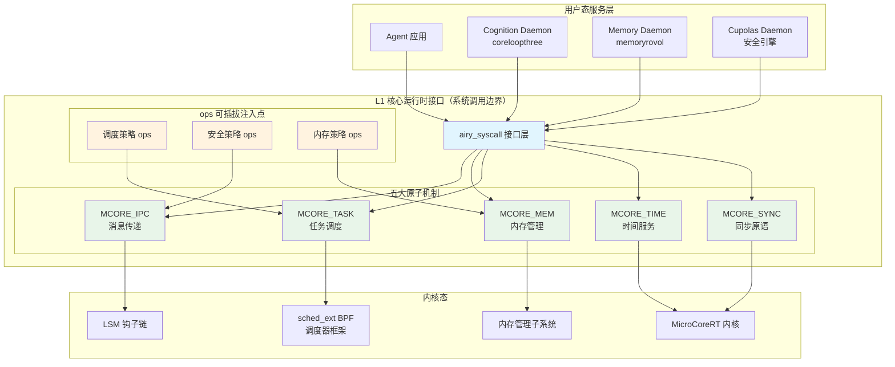
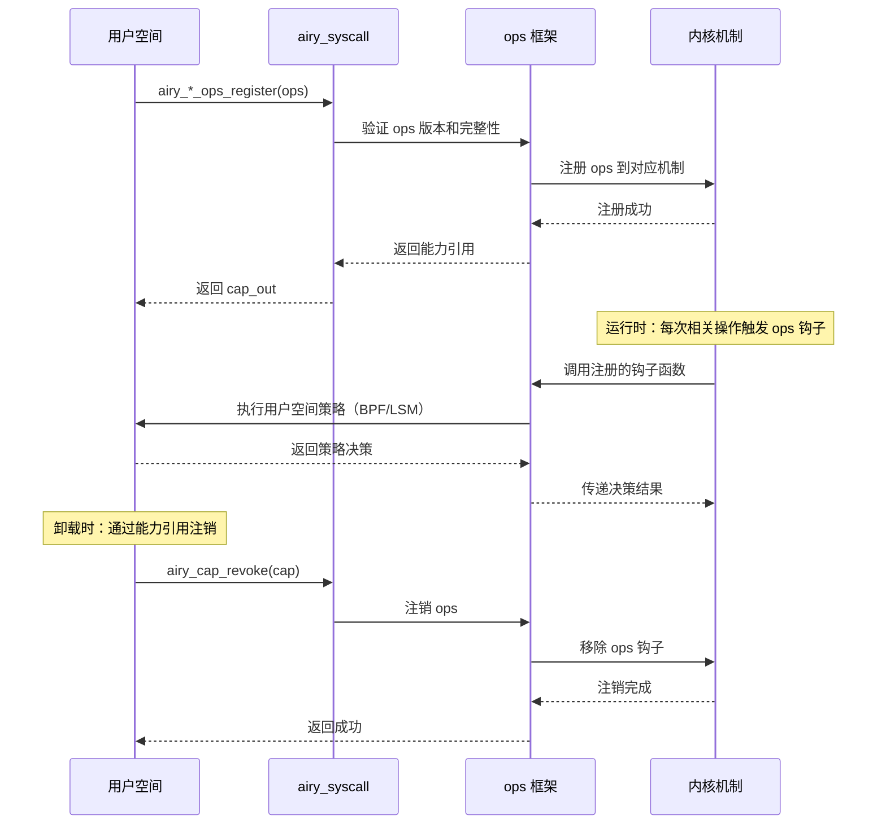
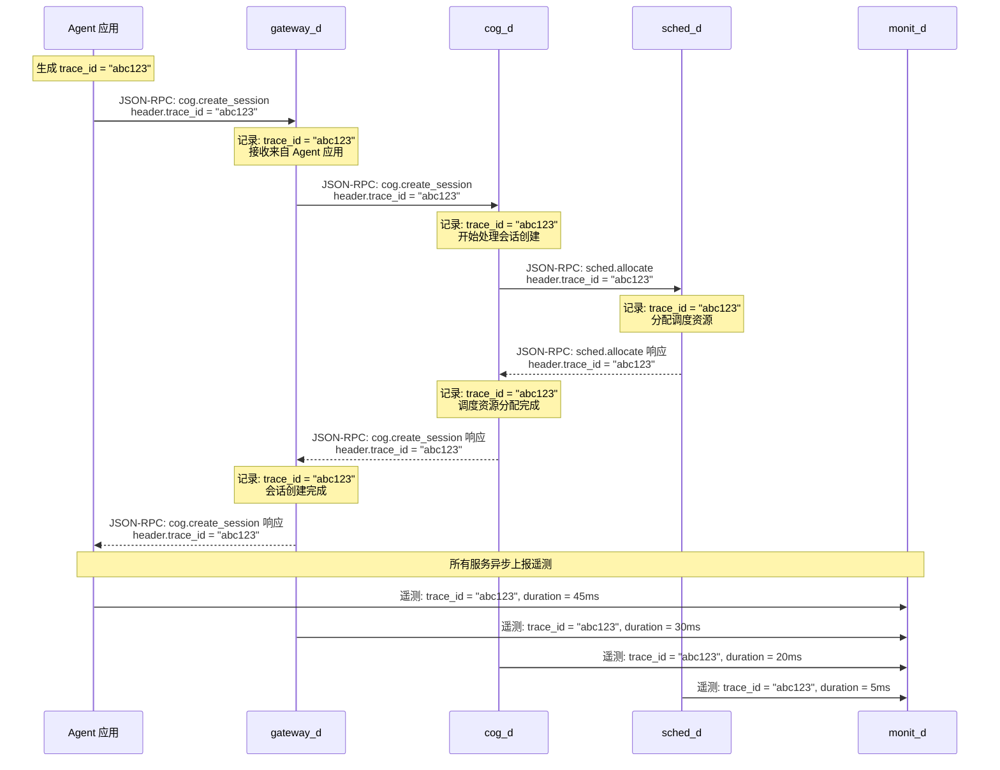
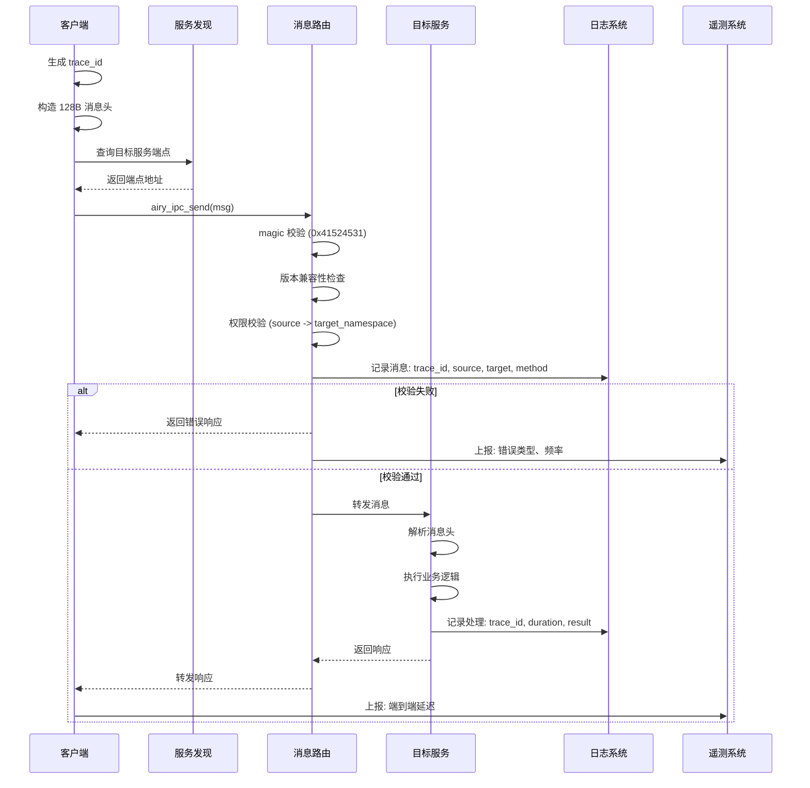
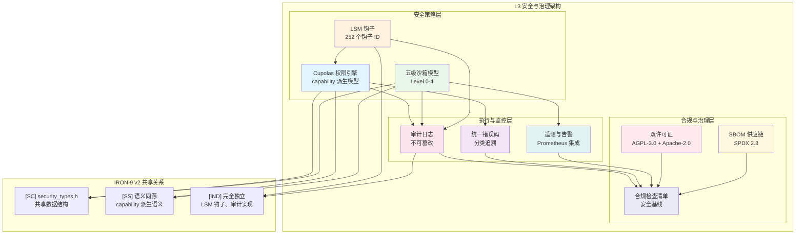
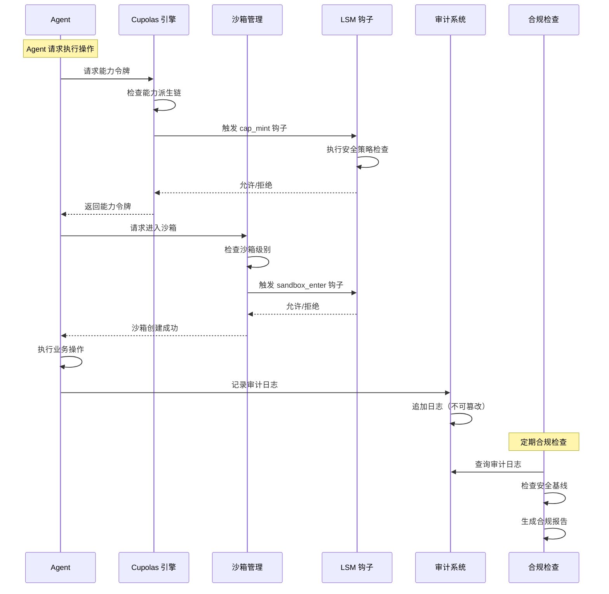

Copyright (c) 2025-2026 SPHARX Ltd. All Rights Reserved.

# agentrt-linux ARE 运行时接口规范合集
> **文档定位**：合并 L1 核心运行时接口、L2 服务通信协议、L3 安全与治理三层 ARE Standards 规范，作为 agentrt-linux（AirymaxOS）运行时接口的完整参考。理论根基：体系并行论、五维正交24原则、MicroCoreRT 微核心极简设计、AgentsIPC 协议族、Cupolas 安全穹顶模型、seL4 capability 安全模型。\
> **文档版本**：0.1.1\
> **最后更新**：2026-07-13\
> **上级文档**：[agentrt-linux（AirymaxOS）工程标准规范](README.md)\
> **SPDX-License-Identifier**：AGPL-3.0-or-later OR Apache-2.0\
> **SSoT 依赖声明**：本文件规则编号权威为 09-ssot-registry.md §3

---

## Part I: agentrt-linux L1 核心运行时接口规范

> **SSoT 声明**： 本文档的 L1 核心运行时接口规范以 AirymaxRT [`30-interfaces/05-runtime-interfaces/01-l1-runtime-interface.md`](../../../AirymaxRT/30-interfaces/05-runtime-interfaces/01-l1-runtime-interface.md) 为单一数据源（SSoT）。本文档仅补充 agentrt-linux（AirymaxOS）特有的差异（如内核态 syscall 实现、ops 注入的 Linux 加速路径、seL4 形式化验证思想落地）。当两者冲突时，以 AirymaxRT SSoT 为准。

### 文档信息卡
- **目标读者**: OS 内核开发者、运行时接口实现者、调度器开发者、安全架构师  
- **前置知识**: 理解 agentrt-linux（AirymaxOS）架构概览，熟悉微内核设计思想，了解 IPC 基础  
- **预计阅读时间**: 45 分钟  
- **核心概念**: MicroCoreRT, 系统调用, ops 注入, 一致性测试, 4 原子机制, 可插拔策略  
- **复杂度标识**: 高级  

---

### 1. 引言

L1 核心运行时接口是 agentrt-linux（AirymaxOS）ARE Standards 的最底层规范，定义了 OS 内核态最基础、最核心的运行时原语。L1 的设计哲学根植于 MicroCoreRT 微核心极简设计思想（参考 seL4 的形式化验证方法），严格遵循五维正交24原则中 K-1（内核极简原则）：内核只保留最必要的原子机制，所有策略性决策外移至用户空间或可插拔模块。

L1 接口是 agentrt-linux（AirymaxOS）整个 OS 栈的基石——L2 服务通信协议依赖 L1 的 IPC 原语，L3 安全与治理依赖 L1 的内存管理和进程隔离。L1 的正确性、性能和安全性直接影响整个系统的可靠性。

#### 1.1 与 agentrt L1 的共享关系

| IRON-9 v2 分层 | 共享内容 | 共享方式 |
|----------------|----------|----------|
| [SC] 共享契约层 | 核心数据结构（如 `are_task_t`, `are_ipc_msg_t`, `are_cap_t`） | 完全共享头文件 |
| [SS] 语义同源层 | 系统调用接口签名、4 原子机制语义 | 语义一致，实现独立 |
| [IND] 完全独立层 | 内核实现、调度策略、内存管理策略 | 完全独立 |

#### 1.2 设计原则

L1 的设计严格遵循以下五维正交24原则映射：

| 原则编号 | 原则名称 | 在 L1 中的体现 |
|----------|----------|----------------|
| K-1 | 内核极简原则 | 仅保留 IPC、内存、任务、时间、同步五大原子机制 |
| K-2 | 接口契约化原则 | 每个系统调用明确定义契约，参数、返回值、副作用清晰 |
| K-4 | 可插拔策略原则 | 调度策略、安全策略、内存策略通过 ops 接口注入 |
| E-1 | 安全内生原则 | 内存守卫、能力令牌、地址空间隔离内建于接口 |
| E-6 | 错误可追溯原则 | 所有系统调用返回统一错误码，可追溯到具体子系统和错误类型 |

---

### 2. MicroCoreRT 微核心运行时接口

MicroCoreRT 是 agentrt-linux（AirymaxOS）的微核心运行时核心，定义了内核态的最小运行时接口集合。它遵循 Liedtke 最小化原则：内核越小的系统越可靠，越容易验证。

#### 2.1 五大原子机制

MicroCoreRT 将内核运行时接口划分为五个独立的原子机制，每个机制管理一类资源：

| 原子机制 | 标识符 | 管理的资源 | 核心操作 |
|----------|--------|-----------|----------|
| **IPC** | `MCORE_IPC` | 跨进程消息通道 | 发送、接收、回复、通知 |
| **内存** | `MCORE_MEM` | 物理页和虚拟地址空间 | 分配、映射、释放、防护 |
| **任务** | `MCORE_TASK` | 执行上下文（线程/进程） | 创建、调度、挂起、销毁 |
| **时间** | `MCORE_TIME` | 定时器和时间源 | 获取时间、设置定时器、睡眠 |
| **同步** | `MCORE_SYNC` | 同步原语 | 互斥锁、信号量、条件变量、屏障 |

每个原子机制相互独立，符合五维正交24原则中的正交性要求——修改一个机制的核心实现不影响其他机制的接口契约。

#### 2.2 接口架构



**图1: agentrt-linux L1 核心运行时接口架构**

---

### 3. 系统调用接口规范

agentrt-linux（AirymaxOS）的系统调用遵循 `airy_syscall` 命名规范，所有系统调用通过统一的入口分发，保证了接口的整齐性和可审计性。

#### 3.1 系统调用命名约定

所有系统调用使用 `airy_` 前缀，后跟机制名称和操作名称，格式为：

```
airy_<mechanism>_<operation>
```

示例：
- `airy_ipc_send` - IPC 发送消息
- `airy_mem_alloc` - 内存分配
- `airy_task_create` - 创建任务
- `airy_time_get` - 获取当前时间
- `airy_sync_mutex_lock` - 获取互斥锁

#### 3.2 系统调用编号体系

系统调用编号分配为每个机制保留 256 个编号空间，支持未来扩展：

| 编号范围 | 机制 | 编号数 | 状态 |
|----------|------|--------|------|
| 0x0000 - 0x00FF | IPC（MCORE_IPC） | 256 | 已分配 |
| 0x0100 - 0x01FF | 内存（MCORE_MEM） | 256 | 已分配 |
| 0x0200 - 0x02FF | 任务（MCORE_TASK） | 256 | 已分配 |
| 0x0300 - 0x03FF | 时间（MCORE_TIME） | 256 | 已分配 |
| 0x0400 - 0x04FF | 同步（MCORE_SYNC） | 256 | 已分配 |
| 0x0500 - 0x05FF | 预留 | 256 | 将来扩展 |
| 0x0600 - 0x06FF | 预留 | 256 | 将来扩展 |
| 0x0700 - 0x0FFF | 预留 | 2304 | 将来扩展 |

系统调用编号一旦分配即永久冻结，不可重新分配。这符合五维正交24原则中 K-2（接口契约化原则）的要求。

#### 3.3 IPC 系统调用接口

```c
/**
 * airy_ipc_send - 向目标端点发送消息
 * @dest: 目标端点 ID（capability 引用）
 * @msg: 消息缓冲区指针（128B 对齐）
 * @msg_len: 消息长度（字节，最大 4096）
 * @timeout_ms: 发送超时时间（毫秒，0 表示永不超时）
 *
 * 返回值:
 *   0: 成功发送
 *   -AIRY_EINVAL: 参数无效（dest 不存在、msg 非 128B 对齐、msg_len 超出范围）
 *   -AIRY_EPERM: 权限不足（没有发送能力）
 *   -AIRY_ETIMEDOUT: 发送超时
 *   -AIRY_ENOMEM: 内核内存不足
 *
 * 所有权语义: 消息内容在发送成功后所有权转移给接收方，发送方不应再访问。
 */
int airy_ipc_send(are_cap_t dest, const void *msg, size_t msg_len, uint32_t timeout_ms);

/**
 * airy_ipc_recv - 从指定端点接收消息
 * @src: 源端点 ID（capability 引用，或 ARE_CAP_ANY 表示任意来源）
 * @msg: 接收缓冲区指针（128B 对齐）
 * @msg_len: 缓冲区大小（字节）
 * @timeout_ms: 接收超时时间（毫秒，0 表示永不超时）
 *
 * 返回值:
 *  >0: 实际接收的字节数
 *  -AIRY_EINVAL: 参数无效
 *  -AIRY_EPERM: 权限不足
 *  -AIRY_ETIMEDOUT: 接收超时
 *  -AIRY_ENOMEM: 缓冲区空间不足
 */
int airy_ipc_recv(are_cap_t src, void *msg, size_t msg_len, uint32_t timeout_ms);

/**
 * airy_ipc_notify - 向指定端点发送通知（无数据，纯信号）
 * @dest: 目标端点 ID
 *
 * 通知是 IPC 的轻量级变体，不携带数据，仅用于信号传递。
 * 参考 seL4 的 Notification 机制。
 *
 * 返回值:
 *   0: 成功
 *   -AIRY_EINVAL: 参数无效
 *   -AIRY_EPERM: 权限不足
 */
int airy_ipc_notify(are_cap_t dest);
```

#### 3.4 内存管理系统调用接口

```c
/**
 * airy_mem_alloc - 分配物理内存页
 * @pages: 页数（1 页 = 4096 字节）
 * @flags: 分配标志（ARE_MEM_READ | ARE_MEM_WRITE | ARE_MEM_EXEC）
 * @cap_out: 输出：所分配内存的能力引用
 *
 * 返回值:
 *   0: 成功分配
 *   -AIRY_EINVAL: 参数无效
 *   -AIRY_ENOMEM: 内存不足
 *
 * 分配的内存页默认清零，防止信息泄露（安全内生原则 E-1）。
 */
int airy_mem_alloc(size_t pages, uint32_t flags, are_cap_t *cap_out);

/**
 * airy_mem_map - 将物理内存映射到虚拟地址空间
 * @cap: 内存能力引用
 * @vaddr: 目标虚拟地址（或 ARE_MAP_ANY 表示系统自动选择）
 * @flags: 映射标志
 *
 * 返回值:
 *  >0: 映射后的虚拟地址
 *  -AIRY_EINVAL: 参数无效
 *  -AIRY_EPERM: 权限不足
 *  -AIRY_ENOMEM: 虚拟地址空间不足
 */
void *airy_mem_map(are_cap_t cap, void *vaddr, uint32_t flags);

/**
 * airy_mem_free - 释放内存能力
 * @cap: 内存能力引用
 *
 * 返回值:
 *   0: 成功释放
 *   -AIRY_EINVAL: 参数无效
 *   -AIRY_EPERM: 权限不足
 */
int airy_mem_free(are_cap_t cap);

/**
 * airy_mem_guard - 设置内存防护边界
 * @cap: 内存能力引用
 * @guard_bytes: 防护边界大小（字节，128B 对齐）
 *
 * 在内存区域前后设置防护边界，任何越界访问将触发 SIGSEGV。
 * 这是安全内生原则（E-1）在内存管理中的体现。
 *
 * 返回值:
 *   0: 成功
 *   -AIRY_EINVAL: 参数无效
 *   -AIRY_EPERM: 权限不足
 */
int airy_mem_guard(are_cap_t cap, size_t guard_bytes);
```

#### 3.5 任务管理系统调用接口

```c
/**
 * airy_task_create - 创建新的执行上下文
 * @entry: 入口函数地址
 * @stack: 栈空间能力引用
 * @priority: 优先级（0-255，0 最高）
 * @sched_class: 调度类（ARE_SCHED_NORMAL | ARE_SCHED_AGENT | ARE_SCHED_RT）
 * @cap_out: 输出：新任务的能力引用
 *
 * 返回值:
 *   0: 成功创建
 *   -AIRY_EINVAL: 参数无效
 *   -AIRY_ENOMEM: 内存不足
 *   -AIRY_EPERM: 权限不足
 */
int airy_task_create(void *entry, are_cap_t stack, uint8_t priority,
                        uint32_t sched_class, are_cap_t *cap_out);

/**
 * airy_task_schedule - 修改任务调度参数
 * @task: 任务能力引用
 * @priority: 新优先级
 * @sched_class: 新调度类
 *
 * 返回值:
 *   0: 成功
 *   -AIRY_EINVAL: 参数无效
 *   -AIRY_EPERM: 权限不足
 */
int airy_task_schedule(are_cap_t task, uint8_t priority, uint32_t sched_class);

/**
 * airy_task_suspend - 挂起任务
 * @task: 任务能力引用
 *
 * 返回值:
 *   0: 成功
 *   -AIRY_EINVAL: 参数无效
 *   -AIRY_EPERM: 权限不足
 */
int airy_task_suspend(are_cap_t task);

/**
 * airy_task_resume - 恢复挂起的任务
 * @task: 任务能力引用
 *
 * 返回值:
 *   0: 成功
 *   -AIRY_EINVAL: 参数无效
 *   -AIRY_EPERM: 权限不足
 */
int airy_task_resume(are_cap_t task);

/**
 * airy_task_destroy - 销毁任务
 * @task: 任务能力引用
 *
 * 销毁操作会释放任务的所有资源（栈、内存、能力），但不会等待任务完成。
 * 调用者应确保任务已处于可安全销毁的状态。
 *
 * 返回值:
 *   0: 成功
 *   -AIRY_EINVAL: 参数无效
 *   -AIRY_EPERM: 权限不足
 */
int airy_task_destroy(are_cap_t task);
```

#### 3.6 时间服务系统调用接口

```c
/**
 * airy_time_get - 获取当前时间
 * @clock_id: 时钟 ID（ARE_CLOCK_MONOTONIC / ARE_CLOCK_REALTIME / ARE_CLOCK_CPU）
 * @ts_out: 输出：时间戳
 *
 * 返回值:
 *   0: 成功
 *   -AIRY_EINVAL: 参数无效
 */
int airy_time_get(uint32_t clock_id, are_timespec_t *ts_out);

/**
 * airy_time_sleep - 使当前任务睡眠指定时间
 * @duration_ns: 睡眠时长（纳秒）
 *
 * 返回值:
 *   0: 成功睡眠
 *   -AIRY_EINVAL: 参数无效
 *   -AIRY_EINTR: 被信号中断
 */
int airy_time_sleep(uint64_t duration_ns);

/**
 * airy_timer_create - 创建定时器
 * @clock_id: 时钟 ID
 * @callback: 定时器到期时的回调函数（或 ARE_TIMER_SIGNAL 表示发送信号）
 * @cap_out: 输出：定时器能力引用
 *
 * 返回值:
 *   0: 成功
 *   -AIRY_EINVAL: 参数无效
 *   -AIRY_ENOMEM: 内存不足
 */
int airy_timer_create(uint32_t clock_id, void *callback, are_cap_t *cap_out);
```

#### 3.7 同步原语系统调用接口

```c
/**
 * airy_sync_mutex_lock - 获取互斥锁
 * @mutex: 互斥锁能力引用
 * @timeout_ms: 等待超时时间
 *
 * 返回值:
 *   0: 成功获取
 *   -AIRY_EINVAL: 参数无效
 *   -AIRY_ETIMEDOUT: 超时
 *   -AIRY_EDEADLK: 死锁检测
 */
int airy_sync_mutex_lock(are_cap_t mutex, uint32_t timeout_ms);

/**
 * airy_sync_mutex_unlock - 释放互斥锁
 * @mutex: 互斥锁能力引用
 *
 * 返回值:
 *   0: 成功释放
 *   -AIRY_EINVAL: 参数无效
 *   -AIRY_EPERM: 不是锁的持有者
 */
int airy_sync_mutex_unlock(are_cap_t mutex);

/**
 * airy_sync_sem_wait - 等待信号量
 * @sem: 信号量能力引用
 * @timeout_ms: 等待超时时间
 *
 * 返回值:
 *   0: 成功
 *   -AIRY_EINVAL: 参数无效
 *   -AIRY_ETIMEDOUT: 超时
 */
int airy_sync_sem_wait(are_cap_t sem, uint32_t timeout_ms);

/**
 * airy_sync_sem_post - 释放信号量
 * @sem: 信号量能力引用
 *
 * 返回值:
 *   0: 成功
 *   -AIRY_EINVAL: 参数无效
 */
int airy_sync_sem_post(are_cap_t sem);
```

---

### 4. ops 注入机制

ops 注入机制是 agentrt-linux（AirymaxOS）L1 接口实现策略与机制分离的核心手段，也是五维正交24原则中 K-4（可插拔策略原则）的典型实现。它允许用户空间通过定义好的 ops 接口向内核注入调度策略、安全策略和内存策略。

#### 4.1 调度策略 ops

调度策略 ops 通过 sched_ext BPF 框架实现，允许用户空间定义完整的 CPU 调度策略：

```c
/**
 * are_sched_ops - 调度策略操作集
 *
 * 用户空间通过 BPF 程序实现这些函数，然后注册到内核。
 * 参考 Linux 6.6 sched_ext 框架。
 */
struct are_sched_ops {
    const char *name;                          /* 调度器名称（最大 64 字符） */
    uint32_t version;                          /* ops 版本号 */

    /* 核心调度决策 */
    int (*select_cpu)(are_task_t *task, int prev_cpu);  /* 为任务选择 CPU */
    void (*enqueue)(are_task_t *task);                   /* 任务入队 */
    void (*dequeue)(are_task_t *task);                   /* 任务出队 */
    void (*dispatch)(int cpu);                           /* 分发任务到 CPU */

    /* 可选钩子 */
    void (*tick)(are_task_t *task);                      /* 时钟滴答 */
    void (*yield)(are_task_t *task);                     /* 主动让出 CPU */
    void (*set_weight)(are_task_t *task, uint32_t wt);   /* 设置权重 */
    void (*core_sched)(are_task_t *task);                /* 核心调度 */
};

/**
 * airy_sched_ops_register - 注册调度策略
 * @ops: 调度策略操作集（BPF 程序引用）
 * @cap_out: 输出：调度策略能力引用
 *
 * 返回值:
 *   0: 成功注册
 *   -AIRY_EINVAL: 参数无效
 *   -AIRY_EBUSY: 已有调度策略注册
 *   -AIRY_EPERM: 权限不足
 */
int airy_sched_ops_register(struct are_sched_ops *ops, are_cap_t *cap_out);
```

#### 4.2 安全策略 ops

安全策略 ops 通过 LSM 钩子机制实现，允许运行时加载安全模块：

```c
/**
 * are_security_ops - 安全策略操作集
 *
 * 参考 Linux LSM 框架，定义安全策略钩子集。
 * 每个钩子返回 0 表示允许，负值表示拒绝。
 */
struct are_security_ops {
    const char *name;                          /* 安全模块名称 */
    uint32_t version;                          /* ops 版本号 */
    uint32_t priority;                         /* 优先级（数值越小越优先） */

    /* IPC 安全钩子 */
    int (*ipc_send_permission)(are_cap_t src, are_cap_t dest);
    int (*ipc_recv_permission)(are_cap_t src, are_cap_t dest);

    /* 任务安全钩子 */
    int (*task_create_permission)(are_task_t *parent);
    int (*task_destroy_permission)(are_task_t *target);

    /* 内存安全钩子 */
    int (*mem_alloc_permission)(size_t pages, uint32_t flags);
    int (*mem_map_permission)(are_cap_t cap, void *vaddr, uint32_t flags);
};

/**
 * airy_security_ops_register - 注册安全策略
 * @ops: 安全策略操作集
 * @cap_out: 输出：安全策略能力引用
 *
 * 返回值:
 *   0: 成功注册
 *   -AIRY_EINVAL: 参数无效
 *   -AIRY_EPERM: 权限不足
 */
int airy_security_ops_register(struct are_security_ops *ops, are_cap_t *cap_out);
```

#### 4.3 内存策略 ops

内存策略 ops 允许注入自定义的内存分配和回收策略：

```c
/**
 * are_mem_ops - 内存策略操作集
 *
 * 允许用户空间定义内存分配策略，例如：
 * - 池化策略（预分配内存池）
 * - 隔离策略（Agent 内存配额）
 * - 压缩策略（内存压缩触发条件）
 */
struct are_mem_ops {
    const char *name;                          /* 内存策略名称 */
    uint32_t version;                          /* ops 版本号 */

    /* 内存分配钩子 */
    int (*alloc_policy)(are_task_t *task, size_t pages, uint32_t flags);
    void (*free_policy)(are_task_t *task, are_cap_t cap);

    /* OOM 处理钩子 */
    int (*oom_handler)(are_task_t *task, size_t requested_pages);

    /* 内存压力通知 */
    void (*pressure_notify)(uint32_t pressure_level);
};

/**
 * airy_mem_ops_register - 注册内存策略
 * @ops: 内存策略操作集
 * @cap_out: 输出：内存策略能力引用
 *
 * 返回值:
 *   0: 成功注册
 *   -AIRY_EINVAL: 参数无效
 *   -AIRY_EPERM: 权限不足
 */
int airy_mem_ops_register(struct are_mem_ops *ops, are_cap_t *cap_out);
```

#### 4.4 ops 注入生命周期

ops 注入遵循明确的生命周期管理：



**图2: ops 注入生命周期**

---

### 5. 参考 seL4 的 4 原子机制

agentrt-linux（AirymaxOS）L1 接口的设计参考了 seL4 微内核的 4 原子机制。seL4 是经过形式化验证的微内核，其设计理念为 agentrt-linux 提供了坚实的理论基础。

#### 5.1 seL4 4 原子机制对照

| seL4 原子机制 | 描述 | agentrt-linux 对应 | 创新点 |
|---------------|------|-------------------|--------|
| **线程抽象** | 执行上下文的最小单元 | `MCORE_TASK` 任务管理 | 增加 SCHED_AGENT 智能体调度类 |
| **地址空间** | 虚拟地址空间隔离 | `MCORE_MEM` 内存管理 | 增加内存守卫、池化策略 |
| **IPC** | 同步消息传递 | `MCORE_IPC` IPC 机制 | 增加 128B 消息头、5 种 payload 协议 |
| **通知** | 无数据信号传递 | `airy_ipc_notify` | 与 seL4 Notification 语义一致 |

#### 5.2 seL4 形式化验证启示

seL4 的形式化验证（形式化规约 → 形式化实现 → 形式化证明）为 agentrt-linux（AirymaxOS）L1 接口设计提供了以下启示：

1. **接口必须可形式化**：每个系统调用的前置条件、后置条件必须清晰，避免模糊语义
2. **最小化信任计算基（TCB）**：L1 代码量必须控制，仅保留不可约简的核心机制
3. **资源管理确定性**：所有资源分配和释放必须具有确定性行为，不能有内存泄漏
4. **能力令牌模型的严格性**：所有资源访问必须通过能力令牌，禁止直接指针引用

#### 5.3 超越 seL4 的 agentrt-linux 创新

agentrt-linux（AirymaxOS）在参考 seL4 的基础上，针对智能体工作负载做了以下创新：

1. **SCHED_AGENT 策略**：专为智能体认知任务优化，支持认知优先级、Token 预算感知调度
2. **ops 可插拔注入**：seL4 的策略内嵌于内核，agentrt-linux 通过 ops 实现策略外置
3. **128B 消息头**：seL4 的 IPC 消息无格式，agentrt-linux 强制 128B 消息头，支持 trace_id 贯穿
4. **多后端服务发现**：seL4 无服务发现机制，agentrt-linux 在 L2 提供多后端服务发现

---

### 6. 一致性测试要求

为保证 agentrt-linux（AirymaxOS）L1 接口的不同实现之间的一致性，ARE Standards 定义了一套一致性测试框架。

#### 6.1 测试分类

| 测试类别 | 覆盖范围 | 工具 | 要求 |
|----------|----------|------|------|
| **接口测试** | 每个系统调用的参数验证、返回值正确性 | KUnit（内核态） | 100% 覆盖 |
| **语义测试** | 系统调用的语义正确性（前置/后置条件） | kselftest（用户态） | 100% 覆盖 |
| **压力测试** | 高并发、大负载下的正确性 | 自定义测试框架 | 90% 覆盖 |
| **模糊测试** | 随机参数的鲁棒性 | syzkaller 适配 | 持续运行 |
| **回归测试** | 防止已知 bug 复发 | 回归测试套件 | 每个修复必须附带 |

#### 6.2 一致性测试目录结构

```
tests/
├── are/
│   ├── l1/
│   │   ├── ipc/           # IPC 系统调用测试
│   │   ├── mem/           # 内存管理系统调用测试
│   │   ├── task/          # 任务管理系统调用测试
│   │   ├── time/          # 时间服务系统调用测试
│   │   ├── sync/          # 同步原语系统调用测试
│   │   └── ops/           # ops 注入机制测试
│   ├── l2/                # L2 服务通信协议测试
│   └── l3/                # L3 安全与治理测试
```

#### 6.3 一致性测试质量标准

每个系统调用的一致性测试必须满足以下标准：

1. **正常路径测试**：验证所有合法参数组合的正确行为
2. **边界条件测试**：验证参数边界值（0、最大值、NULL）
3. **错误路径测试**：验证所有错误码能被正确触发
4. **并发测试**：验证多线程并发调用的正确性
5. **资源泄漏测试**：验证长时间运行无内存泄漏

#### 6.4 测试报告格式

一致性测试报告必须包含以下字段：

```
测试名称: airy_ipc_send_normal
测试接口: airy_ipc_send
测试类型: 正常路径
前置条件: 有效的 dest 能力、128B 对齐的 msg 缓冲区、有效 msg_len
测试步骤: 1. 创建两个端点  2. 发送消息  3. 验证接收方收到的消息
预期结果: 返回 0，接收方收到完整消息
实际结果: PASS
测试环境: agentrt-linux v0.1.1, x86_64, Linux 6.6
测试日期: 2026-07-07
```

---

### 7. 错误码体系

L1 接口使用统一的错误码体系，所有错误码负值返回，便于调用方统一处理。

#### 7.1 错误码定义

| 错误码 | 值 | 含义 | 适用场景 |
|--------|-----|------|----------|
| `AIRY_EINVAL` | -22 | 参数无效 | 参数为 NULL、值超出范围、类型不匹配 |
| `AIRY_EPERM` | -1 | 权限不足 | 缺少必要的能力令牌 |
| `AIRY_ENOMEM` | -12 | 内存不足 | 内核或用户态内存不足 |
| `AIRY_ETIMEDOUT` | -110 | 操作超时 | 阻塞操作超时 |
| `AIRY_EBUSY` | -16 | 资源忙 | 资源已被占用，无法立即获取 |
| `AIRY_EDEADLK` | -35 | 检测到死锁 | 互斥锁获取可能导致死锁 |
| `AIRY_EINTR` | -4 | 被信号中断 | 阻塞操作被信号中断 |
| `AIRY_ENOTSUP` | -95 | 不支持的操作 | 当前内核版本不支持该操作 |
| `AIRY_EOVERFLOW` | -75 | 数值溢出 | 算术运算溢出 |
| `AIRY_EFAULT` | -14 | 地址错误 | 用户空间指针无效 |

#### 7.2 错误码使用规范

1. 所有系统调用必须返回 0 表示成功，负值表示错误
2. 错误码必须使用 `AIRY_E` 前缀，不可使用 POSIX errno
3. 错误码语义一旦定义即冻结，不可修改
4. 新错误码只能追加，不可删除或重新编号

这一规范契合五维正交24原则中 E-6（错误可追溯原则），每个错误码都可以追溯到具体的子系统、操作和错误类型。

---

### 8. 性能基准

#### 8.1 IPC 性能要求

| 指标 | 要求 | 测试条件 |
|------|------|----------|
| 单次同步 IPC 往返延迟 | < 5 us | 128B 消息，同一 CPU 核心 |
| 跨核 IPC 往返延迟 | < 15 us | 128B 消息，不同 CPU 核心 |
| IPC 吞吐量 | > 1M msg/s | 128B 消息，单线程发送 |

#### 8.2 系统调用性能要求

| 系统调用 | 要求 | 测试条件 |
|----------|------|----------|
| `airy_task_create` | < 100 us | 创建空任务（无栈分配） |
| `airy_mem_alloc` | < 10 us | 分配 1 页（4KB） |
| `airy_time_get` | < 100 ns | 单调时钟读取 |
| `airy_sync_mutex_lock` | < 500 ns | 无竞争场景 |

#### 8.3 上下文切换性能要求

| 指标 | 要求 | 测试条件 |
|------|------|----------|
| 线程切换延迟 | < 2 us | 同进程内线程切换 |
| 进程切换延迟 | < 5 us | 不同进程间切换 |

---

### 9. 版本历史

| 版本 | 日期 | 修改说明 | 作者 |
|------|------|----------|------|
| v0.1.1 | 2026-07-07 | 初始草案，定义 L1 核心运行时接口规范 | Airymax Architecture Team |

---

### 10. 参考文献

1. [ARE Standards 总览](./README.md)
2. [agentrt-linux（AirymaxOS）架构设计](../../10-architecture/01-system-architecture.md)
3. [agentrt-linux（AirymaxOS）工程思想](../../50-engineering-standards/04-engineering-philosophy.md)
4. seL4 项目文档：https://sel4.systems/
5. Linux 6.6 sched_ext 文档：https://docs.kernel.org/scheduler/sched-ext.html
6. Linux LSM 框架文档：https://docs.kernel.org/admin-guide/LSM/index.html

---

## Part II: agentrt-linux L2 服务通信协议规范

### 文档信息卡
- **目标读者**: 协议设计者、服务开发者、系统集成工程师、云原生架构师  
- **前置知识**: 理解 agentrt-linux（AirymaxOS）架构概览，熟悉 JSON-RPC 2.0，了解服务发现机制  
- **预计阅读时间**: 45 分钟  
- **核心概念**: AgentsIPC, 128B 消息头, 服务发现, daemon 命名空间, trace_id 贯穿  
- **复杂度标识**: 高级  

---

### 1. 引言

L2 服务通信协议是 agentrt-linux（AirymaxOS）ARE Standards 的中间层规范，定义了 OS 层各服务之间的通信协议。L2 协议建立在 L1 核心运行时接口（IPC 原语）之上，为上层服务提供可发现、可路由、可追踪的通信能力。

agentrt-linux（AirymaxOS）作为智能体操作系统，其服务通信具有以下特点：

1. **多服务协同**：12 个 daemon 守护进程（调度、内存、安全、认知、云原生等）需要高效通信
2. **跨进程协作**：内核态与用户态服务之间需要标准化通信协议
3. **可观测性要求**：所有服务通信必须可追踪、可审计、可度量
4. **云原生适配**：需要支持 K8s、consul、etcd 等云原生基础设施

#### 1.1 与 agentrt L2 的共享关系

| IRON-9 v2 分层 | 共享内容 | 共享方式 |
|----------------|----------|----------|
| [SC] 共享契约层 | 128B 消息头布局、magic 编号、协议类型枚举 | 完全共享头文件 |
| [SS] 语义同源层 | JSON-RPC 2.0 方法签名、错误码格式 | 语义一致，实现独立 |
| [IND] 完全独立层 | OS 层 daemon 命名空间、服务发现后端集成 | 完全独立 |

#### 1.2 设计原则

L2 的设计遵循以下五维正交24原则映射：

| 原则编号 | 原则名称 | 在 L2 中的体现 |
|----------|----------|----------------|
| K-2 | 接口契约化原则 | 128B 消息头格式固定，JSON-RPC 2.0 方法签名标准化 |
| E-1 | 安全内生原则 | 消息头中嵌入 source/target 端点 ID，实现来源验证 |
| E-6 | 错误可追溯原则 | trace_id 贯穿整个调用链，每条消息可追溯 |
| C-2 | 增量演化原则 | 服务发现支持多后端，从简单到复杂逐步演进 |
| E-2 | 开放协作原则 | JSON-RPC 2.0 开放标准，服务发现支持多种主流后端 |

---

### 2. AgentsIPC 128B 消息头规范

AgentsIPC 是 agentrt-linux（AirymaxOS）的进程间通信协议族，其核心是 128 字节定长消息头。消息头是 agentrt 与 agentrt-linux 在 IRON-9 v2 [SC] 共享契约层的核心共享构件。

#### 2.1 消息头布局

```c
/**
 * are_ipc_msg_header_t - AgentsIPC 128 字节定长消息头
 *
 * 字节布局 (128 bytes total):
 *   [0-3]    - magic: 0x41524531 ('ARE1')
 *   [4-5]    - version: 协议版本 (major << 8 | minor)
 *   [6-7]    - flags: 标志位
 *   [8-23]   - trace_id: 分布式追踪 ID (UUID-128)
 *   [24-25]  - correlation_id: 关联 ID (大端序)
 *   [26-27]  - source: 源端点 ID
 *   [28-29]  - target: 目标端点 ID
 *   [30-31]  - payload_type: 载荷协议类型
 *   [32-35]  - payload_length: 载荷长度 (字节)
 *   [36-39]  - reserved: 预留字段
 *   [40-59]  - source_namespace: 源命名空间 (20 字节，null-terminated)
 *   [60-79]  - target_namespace: 目标命名空间 (20 字节，null-terminated)
 *   [80-83]  - timestamp_sec: 消息时间戳 (秒)
 *   [84-87]  - timestamp_nsec: 消息时间戳 (纳秒)
 *   [88-89]  - priority: 消息优先级 (0-255，0 最高)
 *   [90-127] - extension: 扩展字段 (38 字节，按需使用)
 *
 * 对齐要求: 128 字节对齐
 */
typedef struct __attribute__((aligned(128))) {
    uint32_t magic;                    /* [0-3]   0x41524531 */
    uint16_t version;                  /* [4-5]   协议版本 */
    uint16_t flags;                    /* [6-7]   标志位 */
    uint8_t  trace_id[16];            /* [8-23]  分布式追踪 ID */
    uint16_t correlation_id;          /* [24-25] 关联 ID */
    uint16_t source;                  /* [26-27] 源端点 */
    uint16_t target;                  /* [28-29] 目标端点 */
    uint16_t payload_type;            /* [30-31] 载荷类型 */
    uint32_t payload_length;          /* [32-35] 载荷长度 */
    uint32_t reserved;                /* [36-39] 预留 */
    char     source_namespace[20];    /* [40-59] 源命名空间 */
    char     target_namespace[20];    /* [60-79] 目标命名空间 */
    uint32_t timestamp_sec;           /* [80-83] 时间戳秒 */
    uint32_t timestamp_nsec;          /* [84-87] 时间戳纳秒 */
    uint16_t priority;                /* [88-89] 优先级 */
    uint8_t  extension[38];           /* [90-127] 扩展字段 */
} are_ipc_msg_header_t;
```

> **SSoT 声明**：`are_ipc_msg_header_t` 是 L2 服务协议层的**扩展布局**（含 source_namespace/target_namespace/correlation_id 等 L2 语义字段），与 [SC] 共享契约层的基础消息头 `struct airy_ipc_msg_hdr`（Layout C，物理宿主见 `50-engineering-standards/120-cross-project-code-sharing.md` §Layout C）不同。基础 128B 消息头以 `include/airymax/ipc.h` 为单一数据源；本 L2 扩展布局在 magic（`0x41524531` 'ARE1'）与 trace_id 语义上与 Layout C 保持同源，其余字段为 L2 服务协议专属。

#### 2.2 字段详细说明

##### magic（4 字节）
- 值: `0x41524531`（ASCII 字符 'ARE1' 的大端表示）
- 用途: 消息完整性校验，区分 AgentsIPC 消息与其他数据
- 处理: 接收方必须校验 magic，不匹配则丢弃消息并记录安全事件

##### version（2 字节）
- 高字节: 主版本号
- 低字节: 次版本号
- 当前版本: 0x0101（v1.1）
- 兼容性: 主版本不同 = 不兼容；次版本不同 = 向后兼容

##### flags（2 字节）
标志位按位定义：

| 位 | 名称 | 含义 |
|----|------|------|
| 0 | `ARE_FLAG_REQ` | 请求消息 |
| 1 | `ARE_FLAG_RESP` | 响应消息 |
| 2 | `ARE_FLAG_ERR` | 错误响应 |
| 3 | `ARE_FLAG_NOTIFY` | 通知（无响应） |
| 4 | `ARE_FLAG_COMPRESS` | 载荷已压缩 |
| 5 | `ARE_FLAG_ENCRYPT` | 载荷已加密 |
| 6-15 | 预留 | 必须为 0 |

##### trace_id（16 字节）
- 格式: UUID v4（128 位随机）
- 用途: 分布式追踪，贯穿整个请求链
- 生成: 由发起点生成，所有后续消息沿用同一 trace_id
- 贯穿要求: 所有中间服务不得修改 trace_id，必须在日志中输出

##### correlation_id（2 字节）
- 用途: 关联同一 trace 下的不同请求/响应
- 生成: 由发起点递增分配，每次新请求递增

##### source / target（各 2 字节）
- 用途: 端点标识，唯一标识消息的发送方和接收方
- 分配: 由服务发现系统分配，全局唯一
- 安全: 接收方必须校验 source 端点是否拥有发送权限

##### payload_type（2 字节）
载荷协议类型枚举：

| 类型值 | 协议 | 描述 |
|--------|------|------|
| 0x0001 | JSON-RPC 2.0 | JSON-RPC 2.0 请求/响应 |
| 0x0002 | MCP | Model Context Protocol |
| 0x0003 | A2A | Agent-to-Agent 协议 |
| 0x0004 | OpenAI | OpenAI API 兼容格式 |
| 0x0005 | Custom | 自定义二进制协议 |
| 0x0006 | Protobuf | Protocol Buffers |
| 0x0007 | FlatBuffers | FlatBuffers 零拷贝 |
| 0x0008-0xFFFF | 预留 | 未来扩展 |

##### payload_length（4 字节）
- 载荷长度（字节），最大 4GB
- 0 表示无载荷（纯通知消息）

##### source_namespace / target_namespace（各 20 字节）
- 命名空间标识，用于服务路由
- 格式: 以 null 结尾的字符串
- 详见 §4 OS 层 daemon 命名空间

#### 2.3 消息完整性校验

接收方必须执行以下校验流程：

1. **magic 校验**: 检查 magic 是否为 `0x41524531`，不匹配则丢弃
2. **版本兼容性**: 检查主版本号是否匹配，不匹配则返回错误
3. **长度校验**: 检查 payload_length 是否与实际数据长度一致
4. **命名空间校验**: 检查 target_namespace 是否匹配本服务注册的命名空间
5. **权限校验**: 检查 source 端点是否有权限向 target_namespace 发送消息

---

### 3. JSON-RPC 2.0 命名空间规范

JSON-RPC 2.0 是 AgentsIPC 中最主要的载荷协议。agentrt-linux（AirymaxOS）在标准 JSON-RPC 2.0 基础上增加了命名空间规范，用于 OS 层 daemon 之间的方法调用。

#### 3.1 方法命名约定

JSON-RPC 2.0 方法名使用命名空间前缀，格式为：

```
<namespace>.<method_name>
```

示例：
```
sched.set_priority
mem.get_usage
cupolas.derive_capability
cog.create_session
kernel.get_stats
```

#### 3.2 请求格式

```json
{
  "jsonrpc": "2.0",
  "id": 1,
  "method": "sched.set_priority",
  "params": {
    "task_id": 42,
    "priority": 128,
    "sched_class": "SCHED_AGENT"
  }
}
```

#### 3.3 响应格式

成功响应：
```json
{
  "jsonrpc": "2.0",
  "id": 1,
  "result": {
    "status": "ok",
    "previous_priority": 64
  }
}
```

错误响应（与 agentrt 统一错误码体系对齐）：
```json
{
  "jsonrpc": "2.0",
  "id": 1,
  "error": {
    "code": -1002,
    "message": "Permission denied",
    "data": {
      "error_name": "AIRY_EPERM",
      "task_id": 42,
      "required_cap": "sched.admin"
    }
  }
}
```

#### 3.4 通知（Notification）

通知是无需响应的单向消息，`id` 字段缺失：

```json
{
  "jsonrpc": "2.0",
  "method": "sched.task_completed",
  "params": {
    "task_id": 42,
    "exit_code": 0,
    "duration_us": 15000
  }
}
```

---

### 4. OS 层 daemon 命名空间

agentrt-linux（AirymaxOS）的 OS 层定义了 12 个 daemon 守护进程，每个 daemon 拥有独立的命名空间，用于服务发现和消息路由。这些命名空间是 L2 在 [IND] 完全独立层的 OS 专属定义。

#### 4.1 命名空间列表

| 命名空间 | daemon 名称 | 职责 | 监听的 IPC 端点 |
|----------|------------|------|----------------|
| `sched.` | `sched_d` | 调度守护：管理 Agent 调度策略 | `sched.ipc` |
| `mem.` | `mem_d` | 内存守护：管理 Agent 内存配额和池化 | `mem.ipc` |
| `cupolas.` | `cupolas_d` | 安全守护：Cupolas 权限引擎和沙箱管理 | `cupolas.ipc` |
| `cog.` | `cog_d` | 认知守护：CoreLoopThree 认知循环 | `cog.ipc` |
| `kernel.` | `kernel` | 内核：系统调用分发和内核态服务 | `kernel.ipc` |
| `memoryrovol.` | `memoryrovol_d` | 记忆守护：多级记忆存储和模式挖掘 | `memoryrovol.ipc` |
| `gateway.` | `gateway_d` | 网关守护：HTTP/gRPC 入口和路由 | `gateway.ipc` |
| `monit.` | `monit_d` | 监控守护：指标采集和 Prometheus 导出 | `monit.ipc` |
| `logd.` | `logd_d` | 日志守护：结构化日志收集和轮转 | `logd.ipc` |
| `netd.` | `netd_d` | 网络守护：Agent 网络策略和隔离 | `netd.ipc` |
| `storaged.` | `storaged_d` | 存储守护：Agent 持久化存储管理 | `storaged.ipc` |
| `marketd.` | `marketd_d` | 市场守护：插件市场和技能注册 | `marketd.ipc` |

#### 4.2 命名空间路由规则

1. **精确匹配优先**：如果消息的 `target_namespace` 精确匹配某个 daemon 的命名空间，直接路由
2. **前缀匹配**：如果 `target_namespace` 以某 daemon 命名空间为前缀，路由到该 daemon
3. **通配符**：`target_namespace` 为 `*` 或 `broadcast.` 时，广播到所有 daemon
4. **未知命名空间**：返回 `AIRY_ENOTSUP` 错误

#### 4.3 命名空间注册

每个 daemon 启动时通过服务发现后端注册自己的命名空间：

```c
/**
 * airy_svc_register - 注册服务到发现后端
 * @namespace: 命名空间（如 "sched."）
 * @endpoint: IPC 端点名称
 * @metadata: 额外的元数据（JSON 格式）
 *
 * 返回值:
 *   0: 成功注册
 *   -AIRY_EINVAL: 参数无效
 *   -AIRY_EBUSY: 命名空间已被注册
 *   -AIRY_ENOMEM: 内存不足
 */
int airy_svc_register(const char *namespace, const char *endpoint,
                         const char *metadata);
```

---

### 5. 服务发现多后端

agentrt-linux（AirymaxOS）的服务发现支持多种后端，从简单到复杂场景，符合五维正交24原则中 C-2（增量演化原则）的要求。

#### 5.1 后端对比

| 后端 | 类型 | 适用场景 | 复杂度 | 一致性 | 可用性 |
|------|------|----------|--------|--------|--------|
| `shm` | 共享内存 | 单机开发/测试 | 低 | N/A | 极高 |
| `dns-sd` | DNS 服务发现 | 局域网/小集群 | 中 | 最终一致 | 高 |
| `consul` | 分布式 KV | 中规模集群 | 中 | 强一致 | 高 |
| `etcd` | 分布式 KV | 大规模集群 | 高 | 强一致 | 极高 |
| `k8s` | Kubernetes API | 云原生部署 | 高 | 最终一致 | 极高 |

#### 5.2 后端选择原则

1. **单机开发/测试**：使用 `shm` 后端，零依赖，启动快
2. **小规模生产（< 10 节点）**：使用 `dns-sd`，简单可靠
3. **中规模生产（10-100 节点）**：使用 `consul`，功能丰富
4. **大规模生产（> 100 节点）**：使用 `etcd`，强一致保证
5. **Kubernetes 部署**：使用 `k8s`，与云原生基础设施无缝集成

#### 5.3 统一抽象接口

所有后端实现统一的服务发现接口：

```c
/**
 * are_svc_discovery_ops - 服务发现后端操作集
 *
 * 每个后端实现该接口，通过编译时或运行时选择后端。
 */
struct are_svc_discovery_ops {
    const char *name;                              /* 后端名称 */

    /* 生命周期 */
    int (*init)(const char *config);               /* 初始化后端 */
    void (*shutdown)(void);                        /* 关闭后端 */

    /* 服务注册 */
    int (*register_svc)(const char *ns, const char *endpoint,
                        const char *metadata);
    int (*deregister_svc)(const char *ns);

    /* 服务发现 */
    int (*discover)(const char *ns, char *endpoint, size_t len);
    int (*list_services)(are_svc_info_t *svcs, size_t max_count);

    /* 健康检查 */
    int (*health_check)(const char *ns);
    int (*set_health)(const char *ns, int healthy);
};
```

#### 5.4 服务发现配置

```yaml
# agentrt-linux 服务发现配置示例
service_discovery:
  backend: "etcd"                    # shm | dns-sd | consul | etcd | k8s
  config:
    endpoints: ["etcd-0:2379", "etcd-1:2379", "etcd-2:2379"]
    prefix: "/airymaxos/services/"
    ttl: 30                          # 心跳 TTL（秒）
    health_check_interval: 10        # 健康检查间隔（秒）
    dial_timeout: 5                  # 连接超时（秒）
    request_timeout: 3               # 请求超时（秒）
```

---

### 6. trace_id 贯穿机制

trace_id 是 agentrt-linux（AirymaxOS）可观测性体系的核心，贯穿整个服务调用链，确保每个请求从发起到完成都可以被追踪。

#### 6.1 trace_id 生成

```c
/**
 * airy_trace_id_gen - 生成新的 trace_id
 * @trace_id_out: 输出缓冲区（16 字节）
 *
 * 生成 UUID v4 格式的 trace_id，使用内核随机数源确保唯一性。
 */
void airy_trace_id_gen(uint8_t trace_id_out[16]);
```

#### 6.2 贯穿规则



**图1: trace_id 贯穿流程示例**

#### 6.3 trace_id 不可篡改原则

所有中间服务必须遵守以下规则：

1. **不得修改 trace_id**：中间服务必须保持 trace_id 不变
2. **必须记录日志**：所有服务在日志中必须输出 trace_id
3. **必须上报遥测**：所有服务必须将 trace_id 包含在遥测数据中
4. **响应必须携带 trace_id**：错误响应必须包含 trace_id，便于问题定位

#### 6.4 日志格式

每行日志必须包含 trace_id：

```
[2026-07-07T10:30:45.123Z] [trace_id=abc123] [cog_d] INFO: Creating session for agent_id=42
[2026-07-07T10:30:45.128Z] [trace_id=abc123] [cog_d] INFO: Allocating scheduler resources
[2026-07-07T10:30:45.133Z] [trace_id=abc123] [cog_d] INFO: Session created successfully, session_id=789
[2026-07-07T10:30:45.134Z] [trace_id=abc123] [cog_d] INFO: Total duration: 11ms
```

---

### 7. 服务通信流程

#### 7.1 完整通信流程



**图2: 完整服务通信流程**

#### 7.2 错误处理流程

当服务通信出现错误时，按以下流程处理：

1. **IPC 层错误**（如超时、权限不足）：由 L1 返回错误码，调用方处理
2. **协议层错误**（如 magic 不匹配、版本不兼容）：由路由器丢弃消息，记录安全事件
3. **应用层错误**（如方法不存在、参数无效）：返回 JSON-RPC 2.0 错误响应
4. **超时处理**：调用方设置超时，超时后重新查询服务发现，重试或降级
5. **断路保护**：如果目标服务连续失败超过阈值，触发断路器，暂时停止向该服务发送请求

---

### 8. 性能基准

#### 8.1 消息传输性能

| 指标 | 要求 | 测试条件 |
|------|------|----------|
| 128B 消息头解析时间 | < 100 ns | 单线程，无竞争 |
| 空载荷 IPC 往返延迟 | < 10 us | 同一 CPU 核心 |
| 1KB 载荷 IPC 往返延迟 | < 15 us | 同一 CPU 核心 |
| 1MB 载荷 IPC 往返延迟 | < 500 us | 同一 CPU 核心 |
| 消息路由转发延迟 | < 5 us | 静默命名空间精确匹配 |

#### 8.2 服务发现性能

| 指标 | 要求 | 后端 |
|------|------|------|
| 服务注册延迟 | < 10 ms | etcd |
| 服务发现查询延迟 | < 5 ms | etcd（缓存命中时 < 1 us） |
| 健康检查间隔 | 10 s | 所有后端 |
| 故障检测延迟 | < 30 s | 所有后端 |

#### 8.3 吞吐量要求

| 指标 | 要求 | 测试条件 |
|------|------|----------|
| 单连接消息吞吐量 | > 100K msg/s | 128B 消息，单线程 |
| 多连接并发吞吐量 | > 1M msg/s | 128B 消息，8 线程 |
| 服务发现查询 QPS | > 10K QPS | etcd 后端，缓存命中 |

---

### 9. 与 agentrt L2 的共享关系详解

#### 9.1 [SC] 层共享消息头布局

agentrt 和 agentrt-linux 在 [SC] 层完全共享基础 128B 消息头 `struct airy_ipc_msg_hdr`（Layout C，SSoT 物理宿主见 `120-cross-project-code-sharing.md` §Layout C）的定义。这意味着：
- 在 agentrt 用户态运行时构造的消息，可以在 agentrt-linux 内核中直接解析
- 消息头字段顺序、偏移量、大小完全一致
- magic 编号 `0x41524531` 在两端具有相同的语义

> **注意**：本文档 2.1 节的 `are_ipc_msg_header_t` 是 L2 服务协议层的扩展布局，属于 [SS] 语义同源层，非 [SC] 共享契约层的基础消息头。基础消息头以 `struct airy_ipc_msg_hdr`（Layout C）为 SSoT。

#### 9.2 [SS] 层语义同源

在 [SS] 层，以下内容语义一致但实现独立：
- JSON-RPC 2.0 方法签名格式（`namespace.method`）
- 错误码格式（`AIRY_E*` 前缀，负值）
- trace_id 贯穿语义（UUID v4，不可篡改）
- 服务发现接口抽象（注册、发现、健康检查）

#### 9.3 [IND] 层 OS 专属

以下内容属于 [IND] 完全独立层，仅在 agentrt-linux 中存在：
- 12 个 daemon 命名空间定义
- systemd 集成和 systemd socket activation
- LSM 钩子与 IPC 权限检查的集成
- 内核态 IPC 消息路由（直接基于 io_uring）
- 多后端服务发现的内核态配置

---

### 10. 版本兼容性

#### 10.1 向前兼容

agentrt-linux L2 协议遵循以下向前兼容规则：
1. 新增字段只能追加到 extension 区域（90-127 字节）
2. 新增 payload_type 枚举值不影响已有实现
3. 新增命名空间不影响已有命名空间
4. 新增 flags 位不影响已有标志位

#### 10.2 向后兼容

当主版本号升级时：
1. 旧版本客户端必须能解析新版本消息头的基础字段（0-89 字节）
2. 新版本服务必须能处理旧版本客户端发送的消息
3. 至少提供 2 个版本的兼容性过渡期

---

### 11. 安全考虑

#### 11.1 消息头安全

1. **magic 校验**：防止非 AgentsIPC 消息被误解析
2. **source 验证**：接收方必须验证 source 端点是否真实
3. **namespace 授权**：每个端点只能访问被授权的命名空间
4. **payload_length 校验**：防止缓冲区溢出攻击

#### 11.2 传输安全

1. **本地 IPC**：通过 Unix Domain Socket / io_uring，由内核保证安全
2. **网络传输**：建议使用 TLS 1.3 加密，由 gateway_d 统一处理
3. **载荷加密**：通过 `ARE_FLAG_ENCRYPT` 标志位支持端到端加密

#### 11.3 审计要求

所有服务间通信必须记录到审计日志，包括：
- 消息时间戳
- trace_id
- source 端点
- target 命名空间
- 方法名
- 响应状态（成功/错误）

---

### 12. 版本历史

| 版本 | 日期 | 修改说明 | 作者 |
|------|------|----------|------|
| v0.1.1 | 2026-07-07 | 初始草案，定义 L2 服务通信协议规范 | Airymax Architecture Team |

---

### 13. 参考文献

1. [ARE Standards 总览](./README.md)
2. [L1 核心运行时接口规范](./runtime_interfaces.md#part-i-agentrt-linux-l1-核心运行时接口规范)
3. [agentrt-linux（AirymaxOS）架构设计](../../10-architecture/01-system-architecture.md)
4. JSON-RPC 2.0 规范：https://www.jsonrpc.org/specification
5. AgentsIPC 协议文档：agentrt/protocols/
6. OpenTelemetry 规范：https://opentelemetry.io/docs/specs/

---

## Part III: agentrt-linux L3 安全与治理规范

> **SSoT 声明**： 本文档的 L3 安全与治理规范以 AirymaxRT [`30-interfaces/05-runtime-interfaces/03-l3-security-governance.md`](../../../AirymaxRT/30-interfaces/05-runtime-interfaces/03-l3-security-governance.md) 为单一数据源（SSoT）。本文档仅补充 agentrt-linux（AirymaxOS）特有的差异（如 LSM 钩子集成、内核态 capability 派生实现、审计日志内核管道）。当两者冲突时，以 AirymaxRT SSoT 为准。

### 文档信息卡
- **目标读者**: 安全架构师、OS 安全开发者、合规工程师、审计人员、开源合规官  
- **前置知识**: 理解 agentrt-linux（AirymaxOS）架构概览，熟悉 Linux 安全模块（LSM），了解 capability 安全模型  
- **预计阅读时间**: 50 分钟  
- **核心概念**: Cupolas 权限引擎, 五级沙箱, 能力派生, 审计日志, SBOM, 供应链安全, 双许可证  
- **复杂度标识**: 高级  

---

### 1. 引言

L3 安全与治理是 agentrt-linux（AirymaxOS）ARE Standards 的最上层规范，定义了系统的安全模型、权限管理、沙箱隔离、审计追溯和合规治理体系。L3 的设计哲学根植于五维正交24原则中 E-1（安全内生原则）：安全不是事后附加的功能，而是系统设计的内在属性。

agentrt-linux（AirymaxOS）作为面向智能体协作的操作系统，其安全需求不同于传统操作系统：
1. **多智能体共存**：多个 Agent 运行在同一物理机上，需要严格的权限隔离
2. **动态能力管理**：Agent 的能力（访问文件、网络、其他 Agent）需要动态授予和撤销
3. **可审计性**：所有 Agent 操作必须可追溯，满足合规要求
4. **供应链安全**：智能体应用的插件、技能、模型来自多方，需要软件物料清单（SBOM）

#### 1.1 与 agentrt L3 的共享关系

| IRON-9 v2 分层 | 共享内容 | 共享方式 |
|----------------|----------|----------|
| [SC] 共享契约层 | `security_types.h`（能力类型定义、沙箱级别、错误码） | 完全共享头文件 |
| [SS] 语义同源层 | Cupolas 能力派生语义、沙箱模型语义 | 语义一致，实现独立 |
| [IND] 完全独立层 | LSM 钩子集成、审计日志实现、许可证合规 | 完全独立 |

#### 1.2 设计原则

L3 的设计遵循以下五维正交24原则映射：

| 原则编号 | 原则名称 | 在 L3 中的体现 |
|----------|----------|----------------|
| E-1 | 安全内生原则 | 安全内嵌于系统设计，能力模型、沙箱、审计均为一级公民 |
| K-3 | 服务隔离原则 | 五级沙箱模型实现 Agent 间严格隔离 |
| K-2 | 接口契约化原则 | 统一错误码体系、能力派生接口、审计日志格式契约化 |
| E-6 | 错误可追溯原则 | 审计日志记录所有操作，支持回溯和回放 |
| E-2 | 开放协作原则 | 双许可证体系（AGPL-3.0 + Apache-2.0），SBOM 公开透明 |
| C-2 | 增量演化原则 | 安全策略从宽松到严格逐步收紧，能力从最少的开始逐步授予 |

---

### 2. Cupolas 权限引擎

Cupolas（安全穹顶）是 agentrt-linux（AirymaxOS）的核心权限引擎，实现了基于能力（capability）的安全模型。其设计参考 seL4 的 capability-based security 模型，结合 Linux 现有能力体系，为智能体协作场景提供细粒度的权限控制。

#### 2.1 能力派生模型

Cupolas 定义了四种能力派生操作，每一种都有严格的语义约束：

| 操作 | 符号 | 语义 | 约束 |
|------|------|------|------|
| **mint** | `mint(parent) -> child` | 从父能力创建新的子能力，子能力权限 <= 父能力 | 不可扩大权限 |
| **mintcopy** | `mintcopy(src) -> dst` | 复制能力，dst 权限 = src 权限 | 不可扩大权限 |
| **derive** | `derive(parent, subset) -> child` | 从父能力派生子集能力，只保留 subset 指定的权限 | 必须是父能力的子集 |
| **revoke** | `revoke(cap)` | 撤销能力，递归撤销所有派生能力 | 不可逆操作 |

```c
/**
 * are_cap_t - 能力令牌类型
 *
 * 能力令牌是资源的不可伪造引用。所有资源访问必须通过能力令牌。
 * 参考 seL4 capability 模型。
 */
typedef struct {
    uint32_t id;           /* 能力唯一标识符 */
    uint32_t type;         /* 能力类型（文件、IPC、内存、网络等） */
    uint64_t permissions;  /* 权限位掩码 */
    uint32_t owner;        /* 能力所有者（Agent ID） */
    uint32_t parent;       /* 父能力 ID（0 表示根能力） */
    uint64_t issue_time;   /* 发行时间（纳秒时间戳） */
    uint64_t expire_time;  /* 过期时间（0 表示永不过期） */
} are_cap_t;
```

#### 2.2 能力派生接口

```c
/**
 * airy_cap_mint - 创建新的子能力（权限缩小或相等）
 * @parent: 父能力令牌
 * @permissions: 子能力的权限位掩码（必须是 parent 的子集）
 * @ttl_seconds: 子能力的生存时间（秒，0 表示永不过期）
 * @child_out: 输出：子能力令牌
 *
 * 返回值:
 *   0: 成功创建
 *   -AIRY_EINVAL: 参数无效
 *   -AIRY_EPERM: 请求的权限超集于父能力
 *   -AIRY_ENOMEM: 内存不足
 *
 * 五维正交24原则 K-2（接口契约化原则）体现：
 * 权限超集检查是硬性约束，不可绕过。
 */
int airy_cap_mint(are_cap_t parent, uint64_t permissions,
                     uint64_t ttl_seconds, are_cap_t *child_out);

/**
 * airy_cap_mintcopy - 复制能力（权限完全相等）
 * @src: 源能力令牌
 * @dst_out: 输出：复制的能力令牌
 *
 * 返回值:
 *   0: 成功复制
 *   -AIRY_EINVAL: 参数无效
 *   -AIRY_EPERM: 权限不足（没有复制权限）
 */
int airy_cap_mintcopy(are_cap_t src, are_cap_t *dst_out);

/**
 * airy_cap_derive - 从父能力派生子集能力
 * @parent: 父能力令牌
 * @subset: 需要的权限子集（位掩码）
 * @child_out: 输出：派生能力令牌
 *
 * 常见用途：从文件读写能力派生出只读能力。
 *
 * 返回值:
 *   0: 成功派生
 *   -AIRY_EINVAL: 参数无效
 *   -AIRY_EPERM: subset 不是 parent 的子集
 */
int airy_cap_derive(are_cap_t parent, uint64_t subset,
                       are_cap_t *child_out);

/**
 * airy_cap_revoke - 撤销能力
 * @cap: 要撤销的能力令牌
 *
 * 撤销操作会递归撤销所有子能力，是不可逆操作。
 * 所有持有该能力或其子能力的 Agent 将立即失去对应权限。
 *
 * 返回值:
 *   0: 成功撤销
 *   -AIRY_EINVAL: 参数无效
 *   -AIRY_EPERM: 权限不足（不是能力所有者）
 */
int airy_cap_revoke(are_cap_t cap);
```

#### 2.3 POSIX capability 41 ID 枚举

agentrt-linux（AirymaxOS）集成 Linux 6.6 标准 41 个 capabilities（ID 0-40）并扩展为 44 ID 枚举（ID 41-43 为 Airymax 专属）：

| ID | 名称 | 描述 | 风险等级 |
|----|------|------|----------|
| 0 | `CAP_CHOWN` | 修改文件所有者 | 高 |
| 1 | `CAP_DAC_OVERRIDE` | 绕过文件权限检查 | 高 |
| 2 | `CAP_DAC_READ_SEARCH` | 绕过文件读/搜索权限 | 中 |
| 3 | `CAP_FOWNER` | 绕过文件所有者检查 | 高 |
| 4 | `CAP_FSETID` | 设置文件 SUID/SGID | 高 |
| 5 | `CAP_KILL` | 向任意进程发送信号 | 中 |
| 6 | `CAP_SETGID` | 修改进程 GID | 高 |
| 7 | `CAP_SETUID` | 修改进程 UID | 高 |
| 8 | `CAP_SETPCAP` | 修改进程能力集 | 极高 |
| 9 | `CAP_LINUX_IMMUTABLE` | 设置不可变文件 | 高 |
| 10 | `CAP_NET_BIND_SERVICE` | 绑定特权端口 | 中 |
| 11 | `CAP_NET_BROADCAST` | 网络广播 | 低 |
| 12 | `CAP_NET_ADMIN` | 网络管理 | 高 |
| 13 | `CAP_NET_RAW` | 原始套接字 | 高 |
| 14 | `CAP_IPC_LOCK` | 锁定内存 | 中 |
| 15 | `CAP_IPC_OWNER` | 绕过 IPC 所有权检查 | 高 |
| 16 | `CAP_SYS_MODULE` | 加载内核模块 | 极高 |
| 17 | `CAP_SYS_RAWIO` | 原始 I/O 操作 | 极高 |
| 18 | `CAP_SYS_CHROOT` | 使用 chroot | 高 |
| 19 | `CAP_SYS_PTRACE` | 跟踪任意进程 | 极高 |
| 20 | `CAP_SYS_PACCT` | 进程记账 | 中 |
| 21 | `CAP_SYS_ADMIN` | 系统管理（万能） | 极高 |
| 22 | `CAP_SYS_BOOT` | 重启系统 | 高 |
| 23 | `CAP_SYS_NICE` | 修改进程优先级 | 中 |
| 24 | `CAP_SYS_RESOURCE` | 修改资源限制 | 中 |
| 25 | `CAP_SYS_TIME` | 修改系统时间 | 中 |
| 26 | `CAP_SYS_TTY_CONFIG` | TTY 配置 | 中 |
| 27 | `CAP_MKNOD` | 创建设备节点 | 高 |
| 28 | `CAP_LEASE` | 文件租约 | 低 |
| 29 | `CAP_AUDIT_WRITE` | 写入审计日志 | 中 |
| 30 | `CAP_AUDIT_CONTROL` | 审计控制 | 极高 |
| 31 | `CAP_SETFCAP` | 设置文件能力 | 高 |
| 32 | `CAP_MAC_OVERRIDE` | 绕过 MAC 策略 | 极高 |
| 33 | `CAP_MAC_ADMIN` | MAC 配置 | 极高 |
| 34 | `CAP_SYSLOG` | 读取内核日志 | 中 |
| 35 | `CAP_WAKE_ALARM` | 触发系统唤醒 | 低 |
| 36 | `CAP_BLOCK_SUSPEND` | 阻止系统挂起 | 低 |
| 37 | `CAP_AUDIT_READ` | 读取审计日志 | 中 |
| 38 | `CAP_PERFMON` | 性能监控 | 中 |
| 39 | `CAP_BPF` | BPF 操作 | 高 |
| 40 | `CAP_CHECKPOINT_RESTORE` | 检查点/恢复 | 中 |
| 41 | `CAP_AGENT_ADMIN` | **Agent 管理（Airymax 专属）** | 极高 |
| 42 | `CAP_AGENT_SCHED` | **Agent 调度（Airymax 专属）** | 高 |
| 43 | `CAP_AGENT_SANDBOX` | **Agent 沙箱管理（Airymax 专属）** | 高 |

> 注：ID 41-43 为 agentrt-linux（AirymaxOS）在 Linux 6.6 标准 41 个能力（ID 0-40）基础上新增的 Agent 专属能力，属于 [IND] 完全独立层。

---

### 3. 五级沙箱模型

agentrt-linux（AirymaxOS）定义了五级沙箱安全隔离模型，从 Level 0（完全不隔离）到 Level 4（硬件级隔离），每一级对应不同的安全需求和性能开销。

#### 3.1 沙箱级别定义

| 级别 | 名称 | 隔离方式 | 性能开销 | 适用场景 |
|------|------|----------|----------|----------|
| **Level 0** | 无隔离 | 共享进程空间 | 0% | 完全可信的内部 Agent，开发调试 |
| **Level 1** | 进程隔离 | 独立进程 + Linux namespace | < 5% | 一般可信的内部 Agent |
| **Level 2** | 容器隔离 | 独立容器 + seccomp + capabilities 限制 | 5-10% | 半可信的第三方 Agent |
| **Level 3** | 虚拟机隔离 | 轻量虚拟机（microVM/Firecracker） | 10-20% | 不可信的外部 Agent |
| **Level 4** | 硬件隔离 | 独立物理机/TEE（可信执行环境） | 20-50% | 处理敏感数据的关键 Agent |

#### 3.2 沙箱配置

```c
/**
 * are_sandbox_config_t - 沙箱配置
 */
typedef struct {
    uint32_t level;                    /* 沙箱级别 (0-4) */
    uint64_t max_memory_bytes;         /* 最大内存限制 */
    uint32_t max_cpu_percent;          /* 最大 CPU 使用率 */
    uint32_t max_disk_bytes;           /* 最大磁盘空间 */
    uint32_t max_network_kbps;         /* 最大网络带宽 (kbps) */
    uint32_t max_processes;            /* 最大子进程数 */
    uint32_t max_fds;                  /* 最大文件描述符数 */
    uint64_t timeout_seconds;          /* 超时自动终止（0 表示不限制） */
    uint64_t allow_capabilities;       /* 允许的能力位掩码 */
    char     seccomp_profile[256];     /* seccomp 过滤规则文件路径 */
    char     apparmor_profile[256];    /* AppArmor 配置文件名 */
    bool     allow_network;            /* 是否允许网络访问 */
    bool     allow_filesystem;         /* 是否允许文件系统访问 */
    bool     allow_ipc;                /* 是否允许 IPC 通信 */
    bool     readonly_rootfs;          /* 是否只读根文件系统 */
    char     image_ref[256];           /* 沙箱镜像引用（Level 2+） */
} are_sandbox_config_t;
```

#### 3.3 沙箱管理接口

```c
/**
 * airy_sandbox_create - 创建沙箱
 * @config: 沙箱配置
 * @sandbox_out: 输出：沙箱能力令牌
 *
 * 返回值:
 *   0: 成功创建
 *   -AIRY_EINVAL: 参数无效
 *   -AIRY_ENOMEM: 资源不足
 *   -AIRY_EPERM: 权限不足（需要 CAP_AGENT_SANDBOX）
 */
int airy_sandbox_create(const are_sandbox_config_t *config,
                           are_cap_t *sandbox_out);

/**
 * airy_sandbox_enter - 将 Agent 放入沙箱
 * @agent: Agent 能力令牌
 * @sandbox: 沙箱能力令牌
 *
 * 返回值:
 *   0: 成功
 *   -AIRY_EINVAL: 参数无效
 *   -AIRY_EPERM: 权限不足
 *   -AIRY_EBUSY: Agent 已在其他沙箱中
 */
int airy_sandbox_enter(are_cap_t agent, are_cap_t sandbox);

/**
 * airy_sandbox_destroy - 销毁沙箱
 * @sandbox: 沙箱能力令牌
 *
 * 销毁沙箱会终止其中的所有 Agent。
 *
 * 返回值:
 *   0: 成功
 *   -AIRY_EINVAL: 参数无效
 *   -AIRY_EPERM: 权限不足
 */
int airy_sandbox_destroy(are_cap_t sandbox);
```

#### 3.4 沙箱升级/降级

沙箱级别可以在运行时升级（收紧）但不可降级（放宽）：

```c
/**
 * airy_sandbox_upgrade - 升级沙箱安全级别
 * @sandbox: 沙箱能力令牌
 * @new_level: 新安全级别（必须 >= 当前级别）
 * @new_config: 新配置（可选，NULL 表示保持当前配置）
 *
 * 沙箱升级是单向操作——只能收紧，不能放宽。
 * 这符合五维正交24原则中 E-1（安全内生原则）的要求。
 *
 * 返回值:
 *   0: 成功升级
 *   -AIRY_EINVAL: 参数无效（new_level < 当前级别）
 *   -AIRY_EPERM: 权限不足
 */
int airy_sandbox_upgrade(are_cap_t sandbox, uint32_t new_level,
                            const are_sandbox_config_t *new_config);
```

---

### 4. 统一错误码体系

agentrt-linux（AirymaxOS）使用统一的错误码体系，确保错误信息在 OS 层和用户态层之间一致传递。该体系在 IRON-9 v2 [SC] 共享契约层与 agentrt 完全共享。

#### 4.1 错误码分类

| 类别 | 范围 | 描述 | 示例 |
|------|------|------|------|
| 通用基础错误 | -1 至 -99 | 跨子系统的通用基础错误 | `AIRY_EINVAL`(-22), `AIRY_EPERM`(-1), `AIRY_ENOMEM`(-12), `AIRY_ETIMEDOUT`(-110), `AIRY_EBUSY`(-16), `AIRY_EDEADLK`(-35), `AIRY_EINTR`(-4), `AIRY_ENOTSUP`(-95), `AIRY_EOVERFLOW`(-75), `AIRY_EFAULT`(-14) |
| 系统与平台错误 | -100 至 -199 | 系统与平台相关错误 | `AIRY_ECOMM`(-100), `AIRY_EAUDIT_DISK_FULL`(-101) |
| LLM/AI 错误 | -400 至 -499 | 认知处理相关错误 | `AIRY_ECOG_TIMEOUT`(-400) |
| 安全/沙箱错误 | -700 至 -799 | 沙箱与能力管理相关错误 | `AIRY_ESANDBOX_FULL`(-700), `AIRY_ESANDBOX_ESC`(-701), `AIRY_ECAP_EXPIRED`(-702), `AIRY_ECAP_REVOKED`(-703) |
| 协调/规划错误 | -800 至 -899 | 调度相关错误 | `AIRY_ESCHED_EXHAUSTED`(-800) |

#### 4.2 错误码定义规范

> **SSoT 对齐说明**：以下错误码值已对齐方案 A（POSIX errno 负值），与 `120-cross-project-code-sharing.md` §2.5 唯一 SSoT 一致。原方案 B（-1/-2/-11 自定义序列）已废弃。

```c
/**
 * 错误码定义规范（方案 A：POSIX errno 负值）
 *
 * 1. 所有错误码使用 AIRY_E 前缀
 * 2. 错误码负值返回（对齐 POSIX errno 负值）
 * 3. 错误码一旦定义即冻结，不可修改语义
 * 4. 新错误码只能追加，不可删除或重新编号
 * 5. 每个错误码必须在文档中清晰描述触发条件
 */
#define AIRY_EINVAL            (-22)   /* 参数无效（对齐 POSIX EINVAL=22） */
#define AIRY_EPERM             (-1)    /* 权限不足（对齐 POSIX EPERM=1） */
#define AIRY_ENOMEM            (-12)   /* 内存不足（对齐 POSIX ENOMEM=12） */
#define AIRY_ETIMEDOUT          (-110)  /* 操作超时（对齐 POSIX ETIMEDOUT=110） */
#define AIRY_EBUSY             (-16)   /* 资源忙（对齐 POSIX EBUSY=16） */
#define AIRY_EDEADLK           (-35)   /* 检测到死锁（对齐 POSIX EDEADLK=35） */
#define AIRY_EINTR             (-4)   /* 被信号中断（对齐 POSIX EINTR=4） */
#define AIRY_ENOTSUP           (-95)   /* 不支持的操作（对齐 POSIX ENOTSUP=95） */
#define AIRY_EOVERFLOW         (-75)   /* 数值溢出（对齐 POSIX EOVERFLOW=75） */
#define AIRY_EFAULT            (-14)   /* 地址错误（对齐 POSIX EFAULT=14） */
#define AIRY_ECOMM             (-100)  /* 通信失败 */
#define AIRY_EAUDIT_DISK_FULL  (-101)  /* 审计磁盘满 */
#define AIRY_ECOG_TIMEOUT      (-400)  /* 认知处理超时 */
#define AIRY_ESANDBOX_FULL     (-700)  /* 沙箱容量已满 */
#define AIRY_ESANDBOX_ESC      (-701)  /* 沙箱逃逸尝试 */
#define AIRY_ECAP_EXPIRED      (-702)  /* 能力已过期 */
#define AIRY_ECAP_REVOKED      (-703)  /* 能力已被撤销 */
#define AIRY_ESCHED_EXHAUSTED  (-800)  /* 调度资源耗尽 */
```

---

### 5. 审计日志规范

审计日志是 agentrt-linux（AirymaxOS）不可妥协的安全底线，对应五维正交24原则中 E-1（安全内生原则）和 E-6（错误可追溯原则）。

#### 5.1 审计日志格式

```c
/**
 * are_audit_entry_t - 审计日志条目
 *
 * 每条审计日志记录一个安全相关事件。
 * 审计日志不可修改、不可删除（仅追加）。
 */
typedef struct __attribute__((packed)) {
    uint64_t timestamp_sec;          /* 时间戳（秒） */
    uint64_t timestamp_nsec;         /* 时间戳（纳秒） */
    uint8_t  trace_id[16];          /* 关联的 trace_id */
    uint32_t event_id;              /* 事件唯一 ID */
    uint32_t event_type;            /* 事件类型 */
    uint32_t agent_id;              /* 触发事件的 Agent ID */
    uint32_t subject_cap;           /* 主体能力 ID */
    uint32_t object_cap;            /* 客体能力 ID */
    uint32_t operation;             /* 操作类型 */
    int32_t  result;                /* 操作结果（0 成功，负值错误） */
    uint32_t src_ip;                /* 来源 IP（网络事件） */
    uint16_t src_port;              /* 来源端口（网络事件） */
    uint8_t  severity;              /* 严重级别 (0-7) */
    uint8_t  reserved[5];           /* 对齐填充 */
    char     description[128];      /* 事件描述 */
} are_audit_entry_t;
```

#### 5.2 审计事件类型

| 事件类型 | 描述 | 必须记录 |
|----------|------|----------|
| `AUDIT_CAP_MINT` | 能力创建 | 是 |
| `AUDIT_CAP_REVOKE` | 能力撤销 | 是 |
| `AUDIT_CAP_USE` | 能力使用 | 是 |
| `AUDIT_SANDBOX_CREATE` | 沙箱创建 | 是 |
| `AUDIT_SANDBOX_ENTER` | Agent 进入沙箱 | 是 |
| `AUDIT_SANDBOX_ESC` | 沙箱逃逸尝试 | 是 |
| `AUDIT_IPC_SEND` | IPC 消息发送 | 否（采样） |
| `AUDIT_IPC_RECV` | IPC 消息接收 | 否（采样） |
| `AUDIT_MEM_ALLOC` | 内存分配 | 否（采样） |
| `AUDIT_TASK_CREATE` | 任务创建 | 是 |
| `AUDIT_TASK_DESTROY` | 任务销毁 | 是 |
| `AUDIT_AUTH_FAIL` | 认证失败 | 是 |
| `AUDIT_AUTH_SUCCESS` | 认证成功 | 是 |
| `AUDIT_CONFIG_CHANGE` | 配置变更 | 是 |
| `AUDIT_SYSTEM_START` | 系统启动 | 是 |
| `AUDIT_SYSTEM_SHUTDOWN` | 系统关闭 | 是 |

#### 5.3 审计日志管理

```c
/**
 * airy_audit_write - 写入审计日志
 * @entry: 审计日志条目
 *
 * 审计日志仅追加，不可修改或删除。写入操作是异步的，
 * 保证不阻塞正常业务流程。
 *
 * 返回值:
 *   0: 成功写入
 *   -AIRY_EAUDIT_DISK_FULL: 审计磁盘已满（系统告警）
 *   -AIRY_EINVAL: 参数无效
 */
int airy_audit_write(const are_audit_entry_t *entry);

/**
 * airy_audit_query - 查询审计日志
 * @filter: 过滤条件（NULL 表示查询全部）
 * @entries: 输出缓冲区
 * @max_entries: 最大条目数
 * @actual_out: 实际返回条目数
 *
 * 返回值:
 *   0: 成功
 *   -AIRY_EINVAL: 参数无效
 *   -AIRY_EPERM: 权限不足（需要 CAP_AUDIT_READ）
 */
int airy_audit_query(const are_audit_filter_t *filter,
                        are_audit_entry_t *entries,
                        size_t max_entries,
                        size_t *actual_out);
```

#### 5.4 审计日志安全要求

1. **不可篡改性**：审计日志一旦写入，不可修改、不可删除
2. **完整性校验**：审计日志需要定期进行完整性校验（哈希链）
3. **磁盘保护**：审计日志磁盘分区必须独立，防止业务日志挤占审计空间
4. **访问控制**：只有具有 `CAP_AUDIT_READ` 能力的进程可以读取审计日志
5. **轮转策略**：审计日志按天轮转，保留至少 90 天
6. **加密存储**：审计日志支持 AES-256 加密存储

---

### 6. LSM 钩子集成

agentrt-linux（AirymaxOS）在 Linux 安全模块（LSM）框架基础上，为 Agent 场景增加了专属安全钩子点。

#### 6.1 LSM 钩子分类

| 钩子类别 | 钩子数量 | 描述 |
|----------|----------|------|
| 进程管理 | 42 | 进程创建、销毁、信号发送 |
| 文件系统 | 58 | 文件打开、读写、属性修改 |
| IPC | 35 | IPC 消息发送、接收、端点管理 |
| 网络 | 41 | 网络连接、数据包过滤 |
| 能力管理 | 22 | 能力创建、派生、撤销、使用 |
| 沙箱管理 | 18 | 沙箱创建、进入、退出、升级 |
| 审计管理 | 15 | 审计日志写入、查询、配置 |
| 认知管理 | 12 | 认知任务创建、调度、执行 |
| 内存管理 | 11 | 内存分配、映射、防护 |
| **总计** | **252** | |

#### 6.2 Agent 专属 LSM 钩子

agentrt-linux（AirymaxOS）在标准 Linux LSM 252 个钩子之上，增加了以下 Agent 专属钩子：

```c
/**
 * Agent 专属 LSM 钩子（[IND] 完全独立层）
 *
 * 这些钩子仅在 agentrt-linux（AirymaxOS）中存在，
 * 不属于 agentrt 共享范畴。
 */
struct are_agent_security_ops {
    /* 能力管理钩子 */
    int (*cap_mint_permission)(are_cap_t parent, uint64_t requested_perms);
    int (*cap_derive_permission)(are_cap_t parent, uint64_t subset);
    int (*cap_revoke_permission)(are_cap_t target);

    /* 沙箱钩子 */
    int (*sandbox_create_permission)(uint32_t level);
    int (*sandbox_enter_permission)(are_cap_t agent, are_cap_t sandbox);
    int (*sandbox_escape_detected)(are_cap_t sandbox, const char *details);

    /* Agent 通信钩子 */
    int (*agent_ipc_permission)(are_cap_t src, are_cap_t dst,
                                const char *src_ns, const char *dst_ns);
    int (*agent_network_egress)(are_cap_t agent, uint32_t dst_ip,
                                uint16_t dst_port);

    /* 认知安全钩子 */
    int (*cog_model_permission)(are_cap_t agent, const char *model_id);
    int (*cog_prompt_filter)(are_cap_t agent, const char *prompt,
                             size_t len);
    int (*cog_response_filter)(are_cap_t agent, const char *response,
                               size_t len);
};
```

#### 6.3 LSM 钩子注册

```c
/**
 * airy_lsm_register - 注册 Agent 安全模块
 * @ops: 安全操作集
 * @name: 模块名称（最多 64 字符）
 *
 * 返回值:
 *   0: 成功注册
 *   -AIRY_EINVAL: 参数无效
 *   -AIRY_EBUSY: 同名模块已注册
 *   -AIRY_EPERM: 权限不足（需要 CAP_MAC_ADMIN）
 */
int airy_lsm_register(const struct are_agent_security_ops *ops,
                         const char *name);
```

---

### 7. 安全治理架构



**图1: agentrt-linux L3 安全与治理架构**

#### 7.1 安全治理流程



**图2: agentrt-linux 安全治理流程**

---

### 8. 双许可证体系

agentrt-linux（AirymaxOS）遵循双许可证体系，平衡开放性与商业可持续性。

#### 8.1 许可证分配

| 组件 | 许可证 | 原因 |
|------|--------|------|
| 内核核心（`kernel`） | GPL-2.0 | 遵循 Linux 内核许可证要求 |
| 用户态服务（`services`） | AGPL-3.0 | 保障网络服务场景下的代码开放 |
| SDK 和客户端库（`sdk/`） | Apache-2.0 | 允许商业闭源应用集成 |
| ARE Standards 文档 | Apache-2.0 | 开放标准，鼓励广泛采纳 |
| 测试套件和工具 | Apache-2.0 | 降低社区贡献门槛 |
| 第三方依赖 | 各依赖的原始许可证 | 遵循依赖的许可证要求 |

#### 8.2 许可证选择理由

1. **AGPL-3.0 for 用户态服务**：确保 agentrt-linux 作为网络服务运行时，对其修改必须开源，维护社区生态健康
2. **Apache-2.0 for SDK**：允许商业公司基于 agentrt-linux 构建闭源智能体应用，促进生态繁荣
3. **GPL-2.0 for 内核**：遵循 Linux 内核上游许可证，保证合规性
4. **Apache-2.0 for 标准文档**：促进 ARE Standards 的最广泛采纳

#### 8.3 许可证合规要求

所有贡献者必须在提交补丁时签署 DCO（Developer Certificate of Origin），声明其代码可以合法地以相应许可证提交。贡献者许可证协议（CLA）对于大型贡献者可能额外要求。

---

### 9. SBOM 与供应链安全

#### 9.1 SBOM 标准

agentrt-linux（AirymaxOS）遵循 SPDX 2.3 标准生成软件物料清单（SBOM），确保供应链透明度。

#### 9.2 SBOM 内容

SBOM 必须包含以下信息：

| 字段 | 描述 | 示例 |
|------|------|------|
| 组件名称 | 软件包名称 | `airymaxos-kernel` |
| 版本 | 语义版本号 | `1.0.1` |
| 许可证 | SPDX 许可证标识符 | `GPL-2.0-only` |
| 上游来源 | 组件的上游仓库 URL | `https://github.com/...` |
| 依赖关系 | 直接依赖的组件列表 | `libssl, libcurl, eBPF` |
| 哈希值 | 源码包的 SHA-256 哈希 | `a1b2c3...` |
| 已知漏洞 | 关联的 CVE 编号 | `CVE-2024-1234` |
| 维护者 | 负责该组件的维护团队 | `Airymax Kernel SIG` |

#### 9.3 SBOM 生成工具

```bash
# 使用 SPDX 生成工具生成 SBOM
airymaxos-sbom generate \
    --format spdx-2.3 \
    --output sbom.spdx.json \
    --include-dependencies \
    --include-vulnerabilities \
    --sign-key /etc/airymaxos/sbom-signing-key.pem
```

#### 9.4 供应链安全检查清单

| 检查项 | 要求 | 频率 |
|--------|------|------|
| 依赖版本扫描 | 所有依赖必须是最新的安全版本 | 每次构建 |
| 已知漏洞检查 | 扫描 CVE 数据库，标记已知漏洞 | 每日 |
| 许可证合规检查 | 所有依赖许可证必须兼容 | 每次发布 |
| 签名验证 | 所有外部依赖必须验证 GPG 签名 | 每次构建 |
| 二进制审查 | 第三方二进制组件必须经过安全审查 | 每次引入 |
| 供应链溯源 | 所有组件必须可追溯到上游源码 | 持续 |

---

### 10. 安全合规检查清单

#### 10.1 开发阶段检查

| 检查项 | 标准 | 工具 |
|--------|------|------|
| 代码静态分析 | 无高危漏洞 | CodeQL, Coverity |
| 依赖扫描 | 无已知高危 CVE | Dependabot, Snyk |
| 许可证检查 | 无许可证冲突 | FOSSA, license-checker |
| 密钥扫描 | 无硬编码密钥 | git-secrets, truffleHog |
| SAST | 无 SQL 注入、XSS 等 | SonarQube, Semgrep |

#### 10.2 构建阶段检查

| 检查项 | 标准 | 工具 |
|--------|------|------|
| 构建签名 | 所有构建产物必须签名 | GPG, cosign |
| SBOM 生成 | 必须生成 SPDX 2.3 SBOM | airymaxos-sbom |
| 容器镜像扫描 | 无高危漏洞 | Trivy, Grype |
| 构建环境隔离 | 隔离构建环境，禁止网络访问 | GitHub Actions, BuildKit |

#### 10.3 部署阶段检查

| 检查项 | 标准 | 要求 |
|--------|------|------|
| 沙箱配置 | 所有 Agent 在沙箱中运行 | 除 Level 0 外默认启用 |
| 能力最小化 | 每个 Agent 只拥有最少必要能力 | 设计评审确认 |
| 网络隔离 | 默认禁止网络访问，按需开放 | 显式配置 |
| 审计启用 | 审计日志必须开启 | 不可关闭 |
| 资源限制 | 所有 Agent 有资源配额 | 显式配置 |

#### 10.4 运维阶段检查

| 检查项 | 标准 | 频率 |
|--------|------|------|
| 安全更新 | 及时应用安全补丁 | 关键漏洞 24 小时内 |
| 审计日志审查 | 定期审查审计日志 | 每周 |
| 渗透测试 | 定期进行渗透测试 | 每季度 |
| 合规审计 | 第三方安全审计 | 每年 |
| 事件响应演练 | 安全事件响应演练 | 每半年 |

---

### 11. 与 seL4 capability 安全模型参考

agentrt-linux（AirymaxOS）的 Cupolas 权限引擎严格参考了 seL4 的 capability 安全模型：

#### 11.1 seL4 核心安全原则

| seL4 原则 | 描述 | agentrt-linux 实现 |
|-----------|------|-------------------|
| **能力是唯一访问方式** | 所有资源访问必须通过能力令牌 | `airy_cap_mint` 系列接口 |
| **能力不可伪造** | 能力令牌由内核管理，用户空间无法伪造 | 内核态能力存储 |
| **能力派生保持权限不增** | 子能力的权限 <= 父能力的权限 | `mint`/`derive` 必须检查权限子集约束 |
| **能力可撤销** | 能力撤销递归影响所有派生能力 | `airy_cap_revoke` 递归撤销 |
| **最小权限原则** | 每个组件只拥有完成其功能所需的最小能力 | 沙箱创建时默认最小能力集 |

#### 11.2 超越 seL4 的创新

agentrt-linux（AirymaxOS）在 seL4 基础上增加了：

1. **能力生存时间（TTL）**：seL4 的能力无过期机制，agentrt-linux 支持 TTL，自动过期
2. **能力审计链**：每次能力派生和撤销都记录到审计日志
3. **五级沙箱模型**：seL4 只有进程隔离，agentrt-linux 提供五级隔离
4. **Agent 专属能力**：`CAP_AGENT_ADMIN`、`CAP_AGENT_SCHED`、`CAP_AGENT_SANDBOX`

---

### 12. 版本历史

| 版本 | 日期 | 修改说明 | 作者 |
|------|------|----------|------|
| v0.1.1 | 2026-07-07 | 初始草案，定义 L3 安全与治理规范 | Airymax Architecture Team |

---

### 13. 参考文献

1. [ARE Standards 总览](./README.md)
2. [L1 核心运行时接口规范](./runtime_interfaces.md#part-i-agentrt-linux-l1-核心运行时接口规范)
3. [L2 服务通信协议规范](./runtime_interfaces.md#part-ii-agentrt-linux-l2-服务通信协议规范)
4. [agentrt-linux（AirymaxOS）安全设计](../../110-security/README.md)
5. [agentrt-linux（AirymaxOS）工程思想](../../50-engineering-standards/04-engineering-philosophy.md)
6. seL4 项目文档：https://sel4.systems/
7. Linux capabilities 文档：https://man7.org/linux/man-pages/man7/capabilities.7.html
8. SPDX 2.3 规范：https://spdx.github.io/spdx-spec/v2.3/
9. Linux LSM 框架文档：https://docs.kernel.org/admin-guide/LSM/index.html


---

**文档结束**  
© 2025-2026 SPHARX Ltd. All Rights Reserved.
