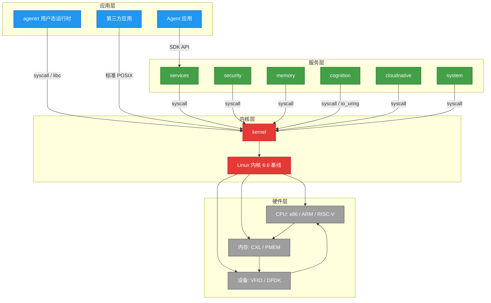
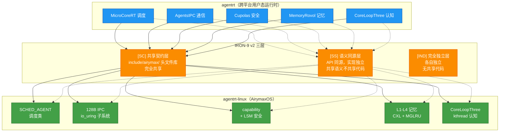
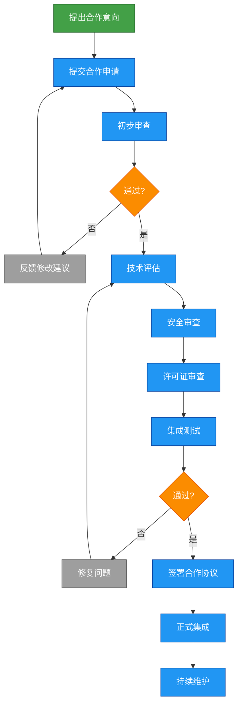

Copyright (c) 2025-2026 SPHARX Ltd. All Rights Reserved.

# agentrt-linux 集成标准总览

> **文档定位**： agentrt-linux（AirymaxOS）集成标准的顶层入口，定义内核层→服务层→应用层的集成层次、与 agentrt 的集成规范、与 主流 Linux 发行版标准的兼容性集成、生态合作规范与第三方模块集成标准\
> **版本**： 0.1.1\
> **最后更新**： 2026-07-13\
> **父文档**： [工程标准规范手册](../00-engineering-standards-handbook.md)\
> **编号权威**： [09-ssot-registry.md §3](../09-ssot-registry.md)\
> **关联规范**： IRON-9 v2 工程铁律（工程标准规范） / [工程基线](../../10-architecture/04-engineering-baseline.md) / [五维正交 24 原则](../../10-architecture/02-five-dimensional-principles.md)

> **SSoT 依赖声明**：本子目录的规则编号登记于 [09-ssot-registry.md §3](../09-ssot-registry.md)。集成标准引用 IRON-9 v2 三层模型（[SC]/[SS]/[IND]）作为同源集成的权威框架。


## 1. 概述

### 1.1 集成标准的目的

agentrt-linux（AirymaxOS）作为一个 OS 发行版，其核心价值不仅在于自身组件的高质量，更在于与外部系统的无缝集成能力。集成标准规范定义了 agentrt-linux 如何与以下系统进行集成：

| 集成对象 | 集成层次 | 核心挑战 |
|----------|----------|----------|
| **agentrt** | 同源深度集成 | 共享 IRON-9 v2 三层架构（[SC]/[SS]/[IND]），确保无适配层天然契合 |
| **主流 Linux 发行版标准** | 生态兼容集成 | 协议层兼容 + 接入层兼容 + 模块化兼容 + 工具链兼容 |
| **第三方模块** | 标准化集成 | 定义统一的模块接入规范，确保安全、稳定和可维护性 |
| **生态合作伙伴** | 生态合作集成 | 建立合作框架，支持硬件、软件、服务等多维合作 |

### 1.2 五维正交 24 原则在集成标准中的映射

| 原则编号 | 原则名称 | 在集成标准中的体现 |
|----------|----------|---------------------|
| S-2 | 层次分解原则 | 集成层次严格按内核层→服务层→应用层，不越级集成 |
| K-2 | 接口契约化原则 | 所有集成点通过明确定义的接口契约进行，契约是模块间的法律 |
| K-4 | 可插拔策略原则 | 第三方模块集成支持可插拔，运行时替换不影响系统稳定性 |
| E-4 | 跨平台一致性原则 | 集成标准确保 agentrt 在跨平台场景下的一致性 |
| E-1 | 安全内生原则 | 集成安全内嵌于集成流程，第三方模块接入前必须通过安全审查 |
| A-1 | 简约至上原则 | 集成接口最小化，不引入不必要的复杂性 |

### 1.3 集成标准文档结构

```
50-engineering-standards/40-integration/
├── README.md                          # 本文件 — 集成标准总览
└── integration.md                     # 集成标准合集（agentrt 集成 / 生态伙伴 / 配置集成 / 标准贡献）
```

---

## 2. 集成层次：内核层 → 服务层 → 应用层

### 2.1 三层集成架构

agentrt-linux（AirymaxOS）的集成遵循严格的三层架构（S-2 层次分解原则）：



### 2.2 各层集成规则

| 层次 | 集成规则 | 禁止行为 |
|------|----------|----------|
| **内核层 ↔ 服务层** | 仅通过系统调用（syscall）交互，服务层不直接访问内核内部数据结构 | 禁止服务层直接调用内核内部函数，禁止越级访问硬件 |
| **服务层 ↔ 应用层** | 通过 SDK API、IPC 协议、REST/gRPC 接口交互 | 禁止应用层直接调用内核系统调用（除非通过标准 libc） |
| **应用层 ↔ 内核层** | 仅通过标准 libc/POSIX 接口，或通过 agentrt SDK 间接调用 | 禁止应用层绕过服务层直接操作内核增强功能 |
| **服务层 ↔ 服务层** | 通过 io_uring IPC 子系统通信，禁止直接进程间通信 | 禁止守护进程之间建立直接通信通道（K-3 服务隔离原则） |

### 2.3 集成接口契约规范

所有集成点必须遵循 K-2 接口契约化原则，契约包含以下七维度：

| 维度 | 说明 | 示例 |
|------|------|------|
| **参数方向** | [in] 输入、[out] 输出、[in,out] 双向 | `int io_uring_submit([in] struct io_uring *ring)` |
| **所有权语义** | 谁分配谁释放，引用计数规则 | 调用者分配，被调用者不持有 |
| **线程安全性** | 是否线程安全，需要外部同步的范围 | 线程安全（内部加锁） |
| **可重入性** | 是否支持重入调用 | 不可重入（信号处理中不可调用） |
| **前置/后置条件** | 参数约束和返回值保证 | 前置：ring 非 NULL；后置：返回 >= 0 |
| **跨引用** | 关联的创建/销毁/查询函数 | `io_uring_setup()` → `io_uring_submit()` → `io_uring_cleanup()` |
| **版本管理** | `@since` 标记引入版本，`@deprecated` 标记弃用版本 | `@since 1.0.1`，`@deprecated 1.0.2` |

---

## 3. 与 agentrt 的集成规范

### 3.1 集成原则

agentrt-linux（AirymaxOS）与 agentrt 的集成是基于 IRON-9 v2 工程铁律的同源深度集成。核心原则：

| 原则 | 说明 |
|------|------|
| **无适配层** | agentrt 在 agentrt-linux 上运行时无需任何适配层，天然契合 |
| **同源优先** | 优先使用同源语义的特性（如 SCHED_AGENT 调度），但可选使用 |
| **契约共享** | [SC] 层代码完全共享，通过 `include/airymax/` 头文件库同步 |
| **独立演进** | 两者独立演进，通过契约层保持兼容 |
| **双向验证** | 契约层变更须经 agentrt + agentrt-linux 两端 CI 双向校验 |

### 3.2 集成架构



### 3.3 集成点清单

详细的集成规范见 [integration.md Part I](./integration.md)，主要包括：

| 集成点 | 所属层级 | 说明 |
|--------|----------|------|
| 6 个共享头文件 | [SC] | `syscalls.h` / `memory_types.h` / `security_types.h` / `cognition_types.h` / `sched.h` / `ipc.h` |
| 调度语义集成 | [SS] | MicroCoreRT ↔ SCHED_AGENT 调度语义 |
| IPC 语义集成 | [SS] | AgentsIPC ↔ io_uring IPC 128B 消息头 |
| 安全语义集成 | [SS] | Cupolas ↔ capability + LSM 安全模型 |
| ABI 兼容性 | [SC] + [SS] | 系统调用 ABI 稳定性保证 |
| 版本对齐 | [SC] + [SS] | 版本号对齐策略 |

---

## 4. 与 主流 Linux 发行版标准的兼容性集成

### 4.1 兼容性策略

agentrt-linux（AirymaxOS）与 主流 Linux 发行版标准保持兼容性集成，确保在企业级 Linux 生态中的互操作性。兼容性集成涵盖四个层面：

| 兼容层面 | 说明 | 兼容方式 |
|----------|------|----------|
| **协议层兼容** | 网络协议、IPC 协议、数据格式兼容 | 采用相同协议标准，确保互操作 |
| **接入层兼容** | 包管理、系统服务、配置管理兼容 | 兼容 RPM 包格式、systemd 服务管理 |
| **模块化兼容** | 内核模块、用户态模块的接口兼容 | 采用相同模块接口规范，支持模块互换 |
| **工具链兼容** | 构建工具、调试工具、测试工具兼容 | 兼容 GCC/Clang 工具链、GDB 调试、KUnit 测试 |

### 4.2 协议层兼容

| 协议类型 | 兼容标准 | 说明 |
|----------|----------|------|
| 网络协议 | TCP/IP、UDP、HTTP/2、gRPC | 标准网络协议栈，完全兼容 |
| IPC 协议 | 128B 消息头 + 5 种 payload | 基于 主流 Linux 发行版标准 IPC 协议扩展 |
| 数据格式 | JSON、Protobuf、YAML | 标准数据序列化格式 |
| 认证协议 | OAuth 2.0、mTLS、SPIFFE | 标准身份认证协议 |
| 可观测性协议 | OpenTelemetry、Prometheus | 标准可观测性协议 |

### 4.3 接入层兼容

| 接入方式 | 兼容标准 | 说明 |
|----------|----------|------|
| 包格式 | RPM | 兼容 主流 Linux 发行版标准 RPM 包格式 |
| 包管理器 | dnf | 兼容 主流 Linux 发行版标准包管理器 |
| 服务管理 | systemd | 兼容 主流 Linux 发行版标准 systemd 单元 |
| 配置管理 | /etc + systemd unit | 兼容 主流 Linux 发行版标准配置路径 |
| 日志系统 | journald + syslog | 兼容 主流 Linux 发行版标准日志系统 |
| 用户管理 | /etc/passwd + PAM | 兼容 主流 Linux 发行版标准用户管理 |

### 4.4 模块化兼容

| 模块类型 | 兼容标准 | 说明 |
|----------|----------|------|
| 内核模块 | .ko 格式，MODULE_LICENSE | 兼容 主流 Linux 发行版标准内核模块 |
| eBPF 程序 | CO-RE（一次编译到处运行） | 兼容 主流 Linux 发行版标准 BPF 程序 |
| 动态库 | .so 格式，ELF 标准 | 兼容 主流 Linux 发行版标准动态链接 |
| 容器镜像 | OCI 格式 | 兼容 主流 Linux 发行版标准容器镜像 |
| Wasm 模块 | Wasm 3.0 标准 | 兼容 主流 Linux 发行版标准 Wasm 运行时 |

### 4.5 工具链兼容

| 工具类型 | 兼容标准 | 说明 |
|----------|----------|------|
| 编译器 | GCC 12+ / Clang 17+ | 兼容 主流 Linux 发行版标准编译器 |
| 构建系统 | Make / CMake / Kbuild | 兼容 主流 Linux 发行版标准构建系统 |
| 调试器 | GDB、LLDB | 兼容 主流 Linux 发行版标准调试器 |
| 性能分析 | perf、eBPF、ftrace | 兼容 主流 Linux 发行版标准性能分析工具 |
| 测试框架 | KUnit、kselftest、pytest | 兼容 主流 Linux 发行版标准测试框架 |

---

## 5. 生态合作规范

### 5.1 生态合作框架

agentrt-linux（AirymaxOS）建立开放的生态合作框架，支持以下合作类型：

| 合作类型 | 说明 | 合作层级 |
|----------|------|----------|
| **硬件生态** | CPU 架构适配、设备驱动、加速器支持 | 内核层 |
| **软件生态** | 中间件、数据库、AI 框架、云原生组件 | 服务层 + 应用层 |
| **服务生态** | 技术支持、培训、认证、咨询 | 生态层 |
| **社区生态** | 开源贡献、SIG 参与、文档翻译 | 社区层 |
| **学术生态** | 前沿研究、论文合作、技术验证 | 研究层 |

### 5.2 合作准入标准

| 标准维度 | 要求 | 说明 |
|----------|------|------|
| **许可证合规** | 必须使用 OSI 批准的许可证 | GPL-2.0、MIT、Apache-2.0、BSD 等 |
| **代码质量** | 通过代码审查和静态分析 | 无 CRITICAL/HIGH 安全漏洞 |
| **文档完整性** | 提供 API 文档、使用指南、变更日志 | 满足 E-7 文档即代码原则 |
| **测试覆盖** | 单元测试覆盖率 ≥ 80% | 满足 E-8 可测试性原则 |
| **安全审查** | 通过安全审查和渗透测试 | 满足 E-1 安全内生原则 |
| **长期维护** | 承诺至少 2 年维护周期 | 与 LTS 版本对齐 |

### 5.3 合作流程



---

## 6. 第三方模块集成标准

### 6.1 集成分类

| 分类 | 说明 | 集成深度 | 示例 |
|------|------|----------|------|
| **内核模块** | 以内核模块（.ko）形式加载 | 内核态 | 设备驱动、文件系统、安全模块 |
| **eBPF 程序** | 以 eBPF 程序形式加载运行 | 内核态（沙箱） | 网络策略、可观测性探针、调度器 |
| **用户态守护进程** | 以 systemd 服务形式运行 | 用户态 | 监控服务、日志采集、代理 |
| **动态库** | 以 .so 形式链接 | 用户态 | 第三方 SDK、算法库、协议库 |
| **容器镜像** | 以 OCI 容器形式运行 | 用户态（沙箱） | 微服务、AI 模型服务、数据库 |
| **Wasm 模块** | 以 Wasm 模块形式运行 | 用户态（沙箱） | Agent 执行单元、插件 |

### 6.2 内核模块集成标准

| 标准项 | 要求 | 说明 |
|--------|------|------|
| 许可证 | GPL-2.0 兼容 | 内核模块必须使用 GPL-2.0 兼容许可证 |
| MODULE_LICENSE | 必须声明 | 正确声明模块许可证 |
| 内核版本 | Linux 6.6 基线 | 必须兼容 Linux 6.6 内核基线 |
| 编码规范 | 遵循内核编码风格 | 通过 checkpatch.pl 检查 |
| 符号导出 | 使用 EXPORT_SYMBOL_GPL | 导出符号必须使用 GPL 变体 |
| 内存安全 | 无缓冲区溢出 | 通过 KASAN 测试 |
| 并发安全 | 正确使用锁 | 通过 KCSAN 测试 |
| 模块签名 | 必须签名 | 内核模块签名验证 |

### 6.3 eBPF 程序集成标准

| 标准项 | 要求 | 说明 |
|--------|------|------|
| 验证器兼容 | 通过内核 BPF 验证器 | 无循环、无越界、类型安全 |
| CO-RE 兼容 | 支持 CO-RE | 一次编译，跨内核版本运行 |
| 资源限制 | 指令数 < 1M、栈 < 512B | 满足内核 BPF 资源限制 |
| 许可证 | GPL-2.0 | BPF 程序许可证声明 |
| 安全审查 | 通过安全审查 | 无恶意行为、无数据泄露风险 |
| 卸载安全 | 支持安全卸载 | 卸载后不影响系统稳定性 |

### 6.4 用户态守护进程集成标准

| 标准项 | 要求 | 说明 |
|--------|------|------|
| 服务管理 | systemd unit | 提供 systemd 服务单元文件 |
| 进程隔离 | 独立地址空间 | 不与其他守护进程共享内存 |
| 通信方式 | io_uring IPC | 通过 io_uring IPC 子系统通信 |
| 日志输出 | journald + 结构化 | 使用 journald 输出结构化日志 |
| 错误处理 | 统一错误码 | 使用 agentrt-linux 统一错误码 |
| 健康检查 | 提供健康检查端点 | 支持 systemd watchdog |
| 优雅关闭 | 支持 SIGTERM | 收到信号后优雅关闭 |
| 资源限制 | Linux cgroup | 通过 cgroup 限制资源使用 |

### 6.5 动态库集成标准

| 标准项 | 要求 | 说明 |
|--------|------|------|
| ABI 稳定性 | 遵循符号版本管理 | 使用 .symver 管理符号版本 |
| 线程安全 | 标注线程安全性 | 文档中明确说明线程安全性 |
| 内存管理 | 明确所有权 | 文档中明确谁分配谁释放 |
| 错误处理 | 统一错误码 | 返回 agentrt-linux 统一错误码 |
| 编译选项 | -fPIC -Wall -Wextra -Werror | 零警告编译 |
| 测试覆盖 | 提供单元测试 | 覆盖率 ≥ 80% |

### 6.6 容器镜像集成标准

| 标准项 | 要求 | 说明 |
|--------|------|------|
| 镜像格式 | OCI | 符合 OCI 镜像规范 |
| 基础镜像 | agentrt-linux 基础镜像 | 基于官方基础镜像构建 |
| 安全扫描 | 通过漏洞扫描 | 无 CRITICAL/HIGH 漏洞 |
| 资源限制 | 声明资源需求 | Dockerfile 中声明 CPU/内存限制 |
| 健康检查 | 提供 HEALTHCHECK | 容器健康检查指令 |
| 镜像签名 | 签名验证 | 镜像签名和验证 |

### 6.7 Wasm 模块集成标准

| 标准项 | 要求 | 说明 |
|--------|------|------|
| Wasm 版本 | Wasm 3.0 | 兼容 Wasm 3.0 标准 |
| 沙箱隔离 | 内存安全 + 类型安全 | Wasm 沙箱保证隔离 |
| 资源限制 | 声明资源需求 | 内存、CPU 时间限制 |
| 接口规范 | 遵循 WASI 标准 | 使用 WASI 系统接口 |
| 签名验证 | 模块签名 | 签名验证模块完整性 |

---

## 7. 集成测试标准

### 7.1 集成测试类型

| 测试类型 | 说明 | 覆盖范围 |
|----------|------|----------|
| **接口契约测试** | 验证集成点的接口契约正确性 | 所有集成接口 |
| **兼容性测试** | 验证与 主流 Linux 发行版标准的兼容性 | 协议层、接入层、模块化、工具链 |
| **互操作性测试** | 验证与 agentrt 的互操作性 | [SC] 层 + [SS] 层集成点 |
| **性能基准测试** | 验证集成不影响性能基准 | 关键路径性能 |
| **安全集成测试** | 验证集成不引入安全漏洞 | 所有集成点 |
| **回归测试** | 验证集成变更不影响现有功能 | 全系统 |

### 7.2 集成测试准入标准

| 标准 | 要求 | 说明 |
|------|------|------|
| 接口覆盖率 | ≥ 80% | 所有集成接口必须被测试 |
| 性能基准 | 不劣于基线 | 集成后性能不劣于集成前 |
| 安全扫描 | 无新增漏洞 | 集成不引入新安全漏洞 |
| 兼容性测试 | 通过 主流 Linux 发行版标准兼容性测试 | 所有兼容性测试通过 |
| 稳定测试 | 72 小时无故障 | 长时间运行无故障 |

---

## 8. 工程纪律

### 8.1 集成铁律

| 铁律 | 内容 | 关联规范 |
|------|------|----------|
| **层次纪律** | 集成必须遵循内核层→服务层→应用层三层架构，禁止越级集成 | S-2 层次分解原则 |
| **契约前置** | 所有集成必须先定义接口契约，后实施集成 | K-2 接口契约化原则 |
| **安全审查** | 所有第三方模块集成前必须通过安全审查 | E-1 安全内生原则 |
| **同源对齐** | 所有与 agentrt 的集成必须遵循 IRON-9 v2 三层架构 | IRON-9 v2 |
| **兼容性保证** | 集成不得破坏与 主流 Linux 发行版标准的兼容性 | 兼容性声明 |
| **测试覆盖** | 所有集成点必须有对应的集成测试 | E-8 可测试性原则 |

### 8.2 集成合规性检查

| 检查项 | 工具 | 频率 |
|--------|------|------|
| 集成层次合规 | 架构审查 | 每次集成 PR |
| 接口契约完整性 | 自动化契约检查 | 每次 PR |
| 安全审查通过 | 安全扫描工具 | 每次集成 |
| 兼容性测试通过 | 兼容性测试套件 | 每次集成 |
| 同源对齐检查 | 跨仓 CI 校验 | 每次 PR |
| 禁词扫描 | ACC-OS04 Grep 扫描 | 每次发布 |

---

## 9. 相关文档

- [集成标准合集](./integration.md)：agentrt 集成 / 生态伙伴 / 配置集成 / 标准贡献
- [项目管理规范总览](../50-project-erp/README.md)：项目管理规范
- [项目管理规范合集](../50-project-erp/project_erp.md)：统一错误码体系（Part II）+ SBOM 规范（Part I）
- [架构设计](../../10-architecture/README.md)：系统架构总览
- [五维正交原则](../../10-architecture/02-five-dimensional-principles.md)：五维正交 24 原则
- [工程基线](../../10-architecture/04-engineering-baseline.md)：工程基线定义
- [接口设计](../../30-interfaces/README.md)：系统调用与 IPC 接口
- IRON-9 v2 工程铁律

---

## 10. 版本历史

| 版本 | 日期 | 变更 |
|------|------|------|
| 0.1.1 | 2026-07-07 | 初始版本（三层集成架构 + agentrt 集成概述 + 主流 Linux 发行版标准四层兼容 + 生态合作规范 + 6 类第三方模块集成标准 + 集成测试标准） |
| 0.1.1 | 2026-07-13 | OLK-6.6 ES-OLK-1~13 + seL4 设计模式 + IRON-9 v2 三层共享模型集成边界验证 |
| 1.0.1 | 2027-XX-XX | 首个开发版本（与代码实现同步验证） |