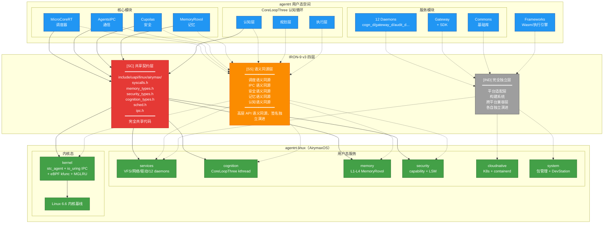
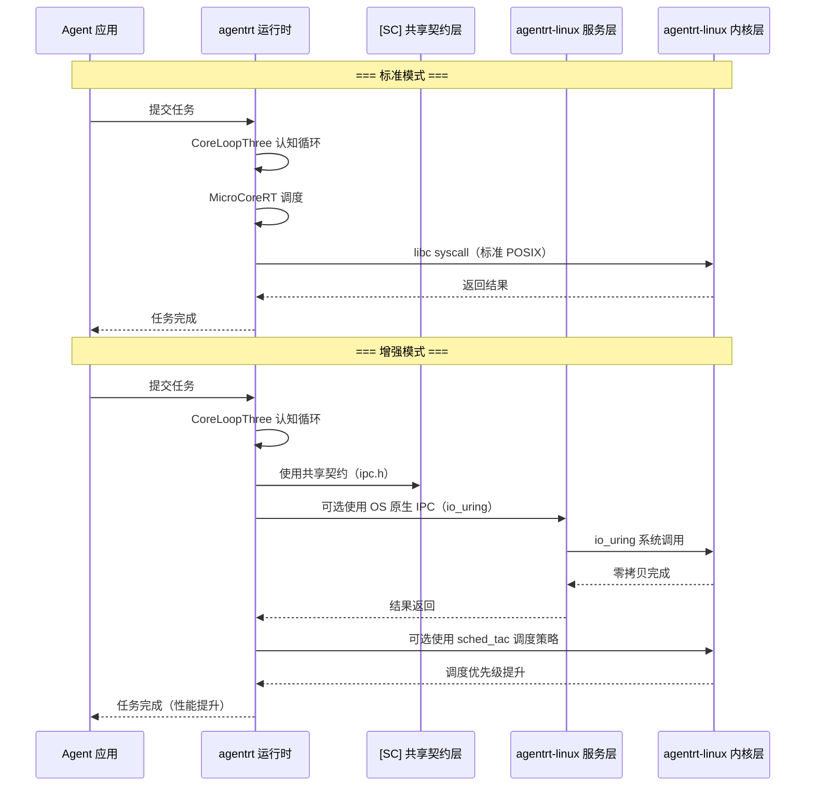
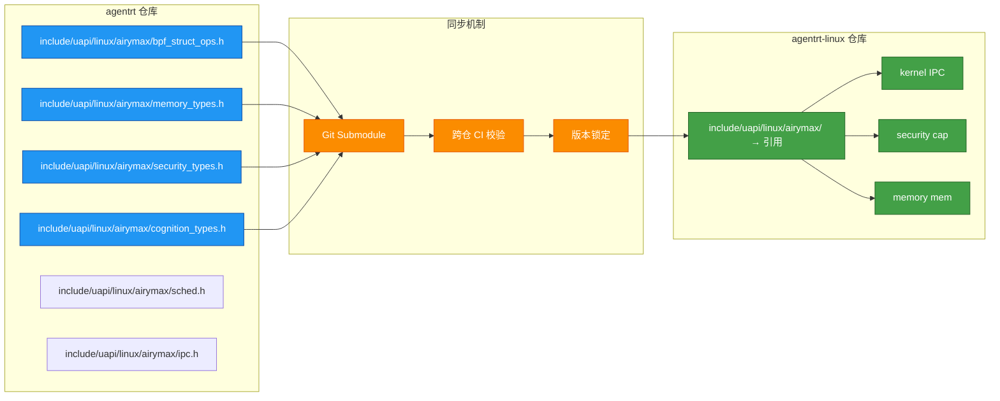

Copyright (c) 2025-2026 SPHARX Ltd. All Rights Reserved.

# agentrt-linux 集成标准合集
> **文档定位**：合并与 agentrt 的集成规范、生态伙伴计划、Manager 模块配置集成标准、标准参与与技术方案贡献四部分内容，作为 agentrt-linux（AirymaxOS）集成标准的完整参考。理论根基：IRON-9 v3 工程铁律、五维正交24原则、体系并行论。\
> **文档版本**：0.1.1\
> **最后更新**：2026-07-13\
> **上级文档**：[agentrt-linux（AirymaxOS）工程标准规范](README.md)\
> **SPDX-License-Identifier**：AGPL-3.0-or-later OR Apache-2.0\
> **SSoT 依赖声明**：本文件规则编号权威为 09-ssot-registry.md §3

---

## Part I: agentrt-linux 与 agentrt 的集成规范

### 1. 集成架构总览

#### 1.1 核心集成原则

agentrt（AirymaxAgentRT）与 agentrt-linux（AirymaxOS）的集成基于 **IRON-9 v3 工程铁律**，核心原则如下：

| 原则 | 说明 |
|------|------|
| **无适配层** | agentrt 在 agentrt-linux 上原生运行，无需任何适配层或转换层 |
| **同源天然契合** | 两者共享 Airymax 设计理念（MicroCoreRT / AgentsIPC / Cupolas / MemoryRovol / CoreLoopThree），设计假设和实现假设一致 |
| **契约共享** | [SC] 共享契约层代码完全共享，通过 `include/uapi/linux/airymax/` 头文件库同步 |
| **语义同源** | [SS] 语义同源层高层 API 语义同源，签名因抽象层级不同而独立演进 |
| **完全独立** | [IND] 完全独立层各自独立演进，不互相依赖 |
| **可选使用** | agentrt 在 agentrt-linux 上运行时，可选使用 OS 原生能力（同源红利），非强制 |

#### 1.2 集成架构总览图



#### 1.3 agentrt 在 agentrt-linux 上的运行模式

agentrt 在 agentrt-linux 上有两种运行模式：

| 模式 | 说明 | 同源红利 |
|------|------|----------|
| **标准模式** | 作为普通用户态应用运行，使用标准 libc/POSIX 接口 | 天然更稳健（设计假设一致） |
| **增强模式** | 可选使用 agentrt-linux 原生能力（SCHED_AGENT、io_uring IPC 等） | 获得 OS 级性能优化 + 同源语义 |

```
agentrt 在 agentrt-linux 上的运行示意：

  标准模式: agentrt → libc → syscall → agentrt-linux 内核
  增强模式: agentrt → agentrt SDK → stc_agent/io_uring → agentrt-linux 内核
```

---

### 2. [SC] 共享契约层集成点

#### 2.1 共享契约层定义

[SC] 共享契约层是 IRON-9 v3 的核心，包含 agentrt 和 agentrt-linux 完全共享的代码。该层代码存放于 `include/uapi/linux/airymax/` 头文件库，由 agentrt 维护，agentrt-linux 引用。

#### 2.2 集成关键共享头文件（节选 6 个：5 个 [SC] 核心 + bpf_struct_ops.h 补充共享；全量 [SC] 核心为 10 个）

##### 2.2.1 bpf_struct_ops.h — sched_tac 用户态调度器结构体操作头文件（补充共享文件，非 [SC] 核心）

| 字段 | 说明 |
|------|------|
| 文件名 | `include/uapi/linux/airymax/bpf_struct_ops.h` |
| 维护方 | agentrt |
| 共享内容 | sched_tac 用户态调度器 struct airy_sched_ops 状态机定义、common_value 共享结构、调度器注册接口 |
| agentrt-linux 使用方式 | 内核态 `#include` 使用，sched_tac 用户态调度器通过 struct airy_sched_ops 注册调度策略 |

```c
/* bpf_struct_ops.h — 共享契约（简化示意） */
#define AIRY_SCHED_BPF_NAME_MAX  16
#define AIRY_STC_POLICY_NAME        "stc_agent"

/* sched_tac 用户态调度器通过 struct airy_sched_ops 注册，禁止定义 SCHED_AGENT 内核调度类宏 */
struct airy_sched_ops {
    struct bpf_struct_ops_common_val common;
    s32 (*select_cpu)(struct task_struct *p, s32 prev_cpu, u64 enq_flags);
    void (*enqueue)(struct task_struct *p, u64 enq_flags);
    void (*dispatch)(s32 cpu, struct task_struct *prev);
    void (*runnable)(struct task_struct *p);
    void (*running)(struct task_struct *p);
    void (*stopping)(struct task_struct *p, bool runnable);
};
```

**agentrt-linux 落地**：

| 落地位置 | 集成方式 | 说明 |
|----------|----------|------|
| kernel sched_tac 调度层 | 用户态支持 struct airy_sched_ops 注册 | sched_tac 调度策略通过 struct airy_sched_ops 注册（非 eBPF struct_ops） |

##### 2.2.2 memory_types.h — MemoryRovol 记忆数据结构头文件

| 字段 | 说明 |
|------|------|
| 文件名 | `include/uapi/linux/airymax/memory_types.h` |
| 维护方 | agentrt |
| 共享内容 | MemoryRovol L1-L4 数据结构、GFP 掩码语义、PMEM 持久化接口 |
| agentrt-linux 使用方式 | 内核态 MemoryRovol 使用相同的数据结构 |

```c
/* memory_types.h — 共享契约（简化示意） */
#define AIRY_MEM_LAYER_L1     1   /* 原始卷（不可变） */
#define AIRY_MEM_LAYER_L2     2   /* 特征层 */
#define AIRY_MEM_LAYER_L3     3   /* 结构层 */
#define AIRY_MEM_LAYER_L4     4   /* 模式层 */

typedef struct {
    uint64_t mem_id;           /* 全局唯一记忆 ID */
    uint64_t timestamp;        /* 创建时间戳 */
    uint32_t layer;            /* 记忆层级 L1-L4 */
    uint32_t data_size;        /* 数据大小 */
    uint8_t  checksum[32];     /* SHA-256 校验和 */
    uint8_t  reserved[32];
} airy_mem_entry_t;

/* GFP 掩码语义（内核态使用） */
#define AIRY_GFP_ROVOL_L1     (__GFP_HIGH | __GFP_MOVABLE)
#define AIRY_GFP_ROVOL_L2     (__GFP_MOVABLE)
#define AIRY_GFP_ROVOL_L3     (__GFP_RECLAIMABLE)
#define AIRY_GFP_ROVOL_L4     (__GFP_RECLAIMABLE)
```

**agentrt-linux 落地**：

| 落地位置 | 集成方式 | 说明 |
|----------|----------|------|
| memory L1-L4 实现 | 内核态使用相同数据结构 | 记忆数据结构同源 |
| cognition CoreLoopThree | 认知循环通过相同结构查询记忆 | 记忆查询接口同源 |

##### 2.2.3 security_types.h — Cupolas 安全类型头文件

| 字段 | 说明 |
|------|------|
| 文件名 | `include/uapi/linux/airymax/security_types.h` |
| 维护方 | agentrt |
| 共享内容 | POSIX capability 41 ID 枚举、LSM 钩子 250 ID 枚举、Cupolas blob 布局（cred/inode/file/task）、capability 派生模型（mint/mintcopy/derive/revoke）、Vault backend 抽象、策略裁决结果 4 值枚举 |
| agentrt-linux 使用方式 | 内核态 capability 系统使用相同的令牌格式与安全类型 |

```c
/* security_types.h — 共享契约（简化示意） */
typedef struct __attribute__((aligned(64))) {
    uint64_t cap_id;           /* 全局唯一 capability ID */
    uint32_t cap_type;        /* capability 类型 */
    uint32_t cap_flags;       /* 标志位 */
    uint64_t owner_id;        /* 所有者 ID */
    uint64_t resource_id;     /* 关联资源 ID */
    uint32_t permissions;     /* 权限位掩码 */
    uint32_t reserved;
    uint8_t  signature[32];  /* 内核签名（HMAC-SHA256） */
} airy_cap_token_t;

typedef enum {
    AIRY_CAP_OP_MINT       = 0x01,
    AIRY_CAP_OP_MINTCOPY   = 0x02,
    AIRY_CAP_OP_DERIVE     = 0x03,
    AIRY_CAP_OP_REVOKE     = 0x04,
} airy_cap_op_t;

typedef enum {
    AIRY_LSM_ALLOW         = 0,
    AIRY_LSM_DENY          = 1,
    AIRY_LSM_AUDIT         = 2,
    AIRY_LSM_ENFORCE       = 3,
} airy_lsm_verdict_t;
```

**agentrt-linux 落地**：

| 落地位置 | 集成方式 | 说明 |
|----------|----------|------|
| security capability 系统 | 内核态使用相同令牌格式 | capability 令牌格式同源 |
| kernel eBPF kfunc | 内核态 capability 检查使用相同结构 | capability 检查逻辑同源 |
| security LSM 钩子 | 内核态 LSM 使用相同钩子编号 | 安全策略裁决同源 |

##### 2.2.4 cognition_types.h — CoreLoopThree 认知循环类型头文件

| 字段 | 说明 |
|------|------|
| 文件名 | `include/uapi/linux/airymax/cognition_types.h` |
| 维护方 | agentrt |
| 共享内容 | CoreLoopThree 阶段枚举（PERCEPTION/THINKING/ACTION）、Thinkdual 模式枚举（SYSTEM1_FAST/SYSTEM2_SLOW）、LLM 推理阶段枚举（PREFILL/DECODE/SPECULATIVE）、CoreLoopThree 上下文结构、Token 能效指标结构、GPU/NPU 能力描述符 |
| agentrt-linux 使用方式 | 内核态 CoreLoopThree kthread 使用相同的阶段枚举与上下文结构 |

```c
/* cognition_types.h — 共享契约（简化示意） */
typedef enum {
    AIRY_CLT_PERCEPTION    = 0,   /* 感知阶段 */
    AIRY_CLT_THINKING      = 1,   /* 思考阶段 */
    AIRY_CLT_ACTION        = 2,   /* 行动阶段 */
} airy_clt_phase_t;

typedef enum {
    AIRY_THINK_SYSTEM1_FAST = 0,  /* System 1 快速直觉 */
    AIRY_THINK_SYSTEM2_SLOW = 1,  /* System 2 慢速深思 */
} airy_thinkdual_mode_t;

typedef enum {
    AIRY_LLM_PREFILL        = 0,  /* 预填充阶段 */
    AIRY_LLM_DECODE         = 1,  /* 解码阶段 */
    AIRY_LLM_SPECULATIVE    = 2,  /* 推测解码 */
} airy_llm_phase_t;
```

**agentrt-linux 落地**：

| 落地位置 | 集成方式 | 说明 |
|----------|----------|------|
| cognition CoreLoopThree kthread | 内核态使用相同阶段枚举 | 认知循环状态机同源 |
| cognition Thinkdual 调度 | 内核态使用相同模式枚举 | 双系统模型同源 |

##### 2.2.5 sched.h — 调度类型头文件

| 字段 | 说明 |
|------|------|
| 文件名 | `include/uapi/linux/airymax/sched.h` |
| 维护方 | agentrt |
| 共享内容 | sched_tac 调度类约束（使用 SCHED_DEADLINE/SCHED_FIFO/EEVDF 原生调度类，禁止 SCHED_AGENT 内核调度类宏）、任务描述符（magic 0x41475453 'AGTS'）、vtime 类型与衰减公式、优先级范围 0-139、AIRY_SLICE_DFL（20ms） |
| agentrt-linux 使用方式 | sched_tac 用户态调度器使用相同的任务描述符与 vtime 语义 |

```c
/* sched.h — 共享契约（简化示意） */
#define AIRY_TASK_MAGIC        0x41475453  /* "AGTS" */
#define AIRY_SCHED_SLICE_DFL   20          /* ms */
#define AIRY_PRIO_MIN          0
#define AIRY_PRIO_MAX          139
#define AIRY_CAP_MAX_AGENTS            1024

/* 禁止定义 SCHED_AGENT 内核调度类宏，使用 SCHED_DEADLINE/SCHED_FIFO/EEVDF 原生调度类 */

/**
 * @brief Agent 任务描述符（上下文扩展视图）
 * @note SSoT: 120-cross-project-code-sharing.md §2.6 sched.h
 *       权威定义仅含 magic/prio/_pad/vtime 4 字段（__u32/__u16/airy_vtime_t）
 *       以下为集成场景扩展视图，含 version/deadline_ns/reserved 等扩展字段
 * @note IRON-9 v3 [SC] 共享契约层：核心字段同源，扩展字段各自独立
 */
struct __attribute__((aligned(64))) airy_task_desc {
    /* [SC] 共享契约层字段（SSoT：120-cross-project-code-sharing.md §2.6） */
    uint32_t      magic;      /* AIRY_TASK_MAGIC (0x41475453) — [SC] 同源 */
    uint16_t      prio;       /* 优先级 0-139 — [SC] 同源 */
    uint16_t      _pad;       /* 填充至 4 字节对齐 — [SC] 同源 */
    airy_vtime_t  vtime;      /* Q16.16 定点虚拟时间 — [SC] 同源 */
    /* [IND] 独立层扩展字段（集成场景） */
    uint16_t      version;    /* [IND] 扩展字段 */
    uint64_t      deadline_ns; /* [IND] 扩展字段 */
    uint8_t       reserved[88]; /* 填充至 128 字节 — [IND] 扩展字段 */
};
```

**agentrt-linux 落地**：

| 落地位置 | 集成方式 | 说明 |
|----------|----------|------|
| kernel sched_tac 调度层 | 用户态使用相同任务描述符 | 调度任务结构同源 |
| kernel EEVDF | 内核态 vtime 使用相同衰减公式 | vtime 语义同源 |

##### 2.2.6 ipc.h — IPC 协议头文件

| 字段 | 说明 |
|------|------|
| 文件名 | `include/uapi/linux/airymax/ipc.h` |
| 维护方 | agentrt |
| 共享内容 | IPC magic（0x41524531 'ARE1'）、128B 消息头结构（struct airy_ipc_msg_hdr）、SQE/CQE 操作码与标志位 |
| agentrt-linux 使用方式 | 内核态 IPC 子系统原生支持 128B 消息头 |

```c
/* ipc.h — 共享契约（简化示意） */
#define AIRY_IPC_MAGIC        0x41524531  /* "ARE1" */
#define AIRY_IPC_HDR_SIZE 128
#define AIRY_IPC_VERSION      0x0100

typedef enum {
    AIRY_IPC_PAYLOAD_JSON_RPC = 0x01,
    AIRY_IPC_PAYLOAD_MCP      = 0x02,
    AIRY_IPC_PAYLOAD_A2A      = 0x03,
    AIRY_IPC_PAYLOAD_OPENAI   = 0x04,
    AIRY_IPC_PAYLOAD_CUSTOM   = 0xFF,
} airy_ipc_payload_type_t;

/* IPC 128B 消息头定义见 [SC] 共享契约层（SSoT），不就地重定义 */
#include <airymax/ipc.h>
/* 结构体名称：struct airy_ipc_msg_hdr（Layout C，物理宿主见
 * 50-engineering-standards/120-cross-project-code-sharing.md §Layout C） */
```

**agentrt-linux 落地**：

| 落地位置 | 集成方式 | 说明 |
|----------|----------|------|
| kernel IPC 子系统 | 内核原生支持 128B 消息头 | io_uring IPC 直接使用该结构体 |
| services 12 daemons | 用户态 `#include` | 用户态守护进程使用相同定义 |
| 30-interfaces/02-ipc-protocol.md | 接口文档 | 接口契约文档使用相同定义 |

#### 2.3 [SC] 层同步机制

| 同步维度 | 机制 | 频率 |
|----------|------|------|
| 头文件变更 | agentrt 维护，agentrt-linux 通过 git submodule 或定期同步 | 按需 |
| 版本对齐 | 头文件版本号与 agentrt 版本号对齐 | 每次 agentrt 发布 |
| 变更通知 | agentrt 发布变更公告，agentrt-linux 评估影响 | 每次变更 |
| 双向校验 | 跨仓 CI 校验头文件兼容性 | 每次 PR |

---

### 3. [SS] 语义同源层集成点

#### 3.1 语义同源层定义

[SS] 语义同源层是 IRON-9 v3 的第二层，包含 agentrt 和 agentrt-linux 语义一致但实现独立的模块。高层 API 语义同源（概念操作一致）；SDK 层签名同源（同一份源码两端编译），其他层签名因抽象层级不同而独立演进。

#### 3.2 调度语义集成

| 维度 | agentrt（MicroCoreRT） | agentrt-linux（stc_agent） | 同源语义 |
|------|------------------------|------------------------------|----------|
| **调度模型** | 用户态优先级调度 | 用户态 sched_tac 调度策略 | 优先级调度语义一致 |
| **任务描述** | `struct airy_task_desc` | 内核态 `task_struct` 扩展 | 任务结构语义一致 |
| **调度策略** | 可插拔策略（FIFO/RR/CFS） | EEVDF + stc_agent（sched_tac） | 策略可插拔语义一致 |
| **优先级范围** | 0-139 | 0-139 | 优先级范围一致 |
| **抢占语义** | 支持抢占 | 支持抢占 | 抢占语义一致 |
| **CPU 亲和性** | 支持设置 | 支持设置 | 亲和性语义一致 |

**集成方式**：

```
agentrt MicroCoreRT 在 agentrt-linux 上运行时：
  标准模式: agentrt 使用 pthread 调度（优先级映射到 Linux nice 值）
  增强模式: agentrt 可选调用 sched_tac 调度策略
            → 因为 stc_agent 的语义和 MicroCoreRT 一致
            → 所以调用是自然的，无需适配层
```

#### 3.3 IPC 语义集成

| 维度 | agentrt（AgentsIPC） | agentrt-linux（io_uring IPC） | 同源语义 |
|------|----------------------|-------------------------------|----------|
| **消息头格式** | 128B 定长 | 128B 定长 | 同源（[SC] 层共享） |
| **通信模型** | 异步消息传递 | io_uring 异步消息传递 | 异步语义一致 |
| **零拷贝** | 支持零拷贝 | io_uring 零拷贝 | 零拷贝语义一致 |
| **优先级** | 支持消息优先级 | 支持消息优先级 | 优先级语义一致 |
| **链路追踪** | trace_id 字段 | trace_id 字段 | 追踪语义一致 |
| **payload 协议** | 5 种协议 | 5 种协议 | 协议类型一致 |

**集成方式**：

```
agentrt AgentsIPC 在 agentrt-linux 上运行时：
  标准模式: agentrt 使用标准 Unix Domain Socket
  增强模式: agentrt 可选使用 io_uring IPC（通过 liburing）
            → 因为 io_uring IPC 的 128B 消息头与 AgentsIPC 同源
            → 所以消息格式无需转换，直接透传
```

#### 3.4 安全语义集成

| 维度 | agentrt（Cupolas） | agentrt-linux（capability + LSM） | 同源语义 |
|------|--------------------|-----------------------------------|----------|
| **安全模型** | capability-based | capability-based + SELinux | capability 模型一致 |
| **令牌格式** | 不可伪造令牌 | 不可伪造令牌（内核签名） | 令牌格式一致（[SC] 层共享） |
| **权限操作** | 委托/复制/限制/撤销 | 委托/复制/限制/撤销 | 操作语义一致 |
| **最小权限** | 默认无权限 | 默认无权限 | 最小权限原则一致 |
| **审计日志** | 审计日志 | 审计哈希链 | 审计语义一致 |

**集成方式**：

```
agentrt Cupolas 在 agentrt-linux 上运行时：
  标准模式: agentrt 使用自身的 Cupolas 安全模型
  增强模式: agentrt 可选将 capability 检查委托给 agentrt-linux 内核
            → 因为 capability 令牌格式和操作语义一致
            → 所以令牌可以在 agentrt 和 agentrt-linux 之间传递
```

#### 3.5 记忆语义集成

| 维度 | agentrt（MemoryRovol） | agentrt-linux（MemoryRovol 内核态） | 同源语义 |
|------|------------------------|-------------------------------------|----------|
| **记忆模型** | L1-L4 四层递进 | L1-L4 四层递进 | 模型一致 |
| **存用分离** | L1 不可变 + L2-L4 索引 | L1 仅追加 + L2-L4 索引 | 存用分离语义一致 |
| **检索策略** | 精确匹配 + 语义检索 | 精确匹配 + 语义检索 | 检索策略一致 |
| **遗忘策略** | 艾宾浩斯/线性/热度 | 艾宾浩斯/线性/热度 | 遗忘策略一致 |
| **数据结构** | 共享（[SC] 层） | 共享（[SC] 层） | 数据结构一致 |

#### 3.6 认知语义集成

| 维度 | agentrt（CoreLoopThree） | agentrt-linux（CoreLoopThree kthread） | 同源语义 |
|------|--------------------------|----------------------------------------|----------|
| **认知循环** | 三层循环（认知→规划→执行） | 三层循环（认知→规划→执行） | 循环模型一致 |
| **双系统** | System 1 + System 2 | System 1 + System 2 | 双系统模型一致 |
| **增量规划** | DAG 增量扩展 + 智能回退 | DAG 增量扩展 + 智能回退 | 规划模型一致 |
| **反馈闭环** | 实时/轮次内/跨轮次反馈 | 实时/轮次内/跨轮次反馈 | 反馈模型一致 |
| **切换阈值** | 置信度/时间/资源/风险 | 置信度/时间/资源/风险 | 阈值模型一致 |

**集成方式**：

```
agentrt CoreLoopThree 在 agentrt-linux 上运行时：
  标准模式: agentrt 使用自身的 CoreLoopThree 用户态认知循环
  增强模式: agentrt 可选将认知循环迁移到 agentrt-linux 的 CoreLoopThree kthread
            → 因为认知循环模型完全一致
            → 所以迁移是语义无损的，获得内核态性能提升
```

---

### 4. ABI 兼容性保证

#### 4.1 ABI 稳定性承诺

agentrt-linux（AirymaxOS）对 agentrt 提供以下 ABI 兼容性保证：

| 保证维度 | 承诺 | 说明 |
|----------|------|------|
| **[SC] 层 ABI** | 永久稳定 | 共享契约层头文件中的结构体布局、枚举值、宏定义永不改变 |
| **系统调用 ABI** | 长期稳定 | Linux 6.6 基线的系统调用 ABI 在 LTS 周期内保持稳定 |
| **libc ABI** | 长期稳定 | glibc 2.38+ 的 ABI 在 LTS 周期内保持稳定 |
| **io_uring ABI** | 长期稳定 | io_uring 的 ABI 在 LTS 周期内保持稳定 |
| **[SS] 层 API** | 语义稳定 | SDK 层 API 签名保持稳定（同一份源码两端编译），其他层语义保持稳定，实现可优化 |

#### 4.2 ABI 破坏性变更处理

| 变更类型 | 处理方式 | 通知周期 |
|----------|----------|----------|
| 新增系统调用 | 向前兼容，不影响现有 ABI | 无需通知 |
| 废弃系统调用 | 标记 @deprecated，保留至少 2 个 LTS 版本 | 提前 2 个版本通知 |
| 结构体扩展 | 仅追加字段，不修改已有字段 | 提前 1 个版本通知 |
| 枚举值新增 | 仅追加，不修改已有值 | 无需通知 |
| [SC] 层结构体变更 | 禁止变更 | 永久禁止 |

#### 4.3 ABI 验证工具

| 工具 | 用途 | 频率 |
|------|------|------|
| abi-compliance-checker | ABI 兼容性检查 | 每次发布 |
| abi-dumper | ABI 导出 | 每次构建 |
| libabigail | ABI 差异分析 | 每次 PR |
| scripts/check_abi.sh | 自动化 ABI 检查 | 每次 PR |

---

### 5. 版本对齐策略

#### 5.1 版本对齐原则

| 原则 | 说明 |
|------|------|
| **独立版本号** | agentrt 和 agentrt-linux 各自独立版本号，不强耦合 |
| **契约版本锁定** | [SC] 层头文件有独立版本号，agentrt 和 agentrt-linux 锁定同一版本 |
| **语义版本号** | 两者遵循语义化版本规范（MAJOR.MINOR.PATCH） |
| **向前兼容** | agentrt 的新版本应能在 agentrt-linux 的旧版本上运行（标准模式） |
| **增强模式兼容** | 增强模式需要 agentrt-linux 版本 >= 增强特性引入版本 |

#### 5.2 版本对齐矩阵

| agentrt 版本 | agentrt-linux 版本 | 标准模式 | 增强模式 | [SC] 层版本 |
|--------------|-------------------|----------|----------|------------|
| 0.1.1 | 0.1.1 | 兼容 | N/A（文档阶段） | 0.1.1 |
| 1.0.1 | 1.0.1 | 兼容 | 全部特性 | 1.0.1 |
| 1.0.2 | 1.0.1 | 兼容 | 部分特性 | 1.0.1 |
| 1.0.1 | 1.0.2 | 兼容 | 全部特性 | 1.0.1 |
| 2.0.0 | 1.0.1 | 兼容 | ❌ 需 agentrt-linux 2.0.0 | 2.0.0 |

#### 5.3 版本对齐流程

```mermaid
graph TD
    A[agentrt 发布新版本] --> B{是否变更 [SC] 层?}
    B -->|是| C[通知 agentrt-linux 团队]
    B -->|否| D[agentrt-linux 无需强制升级]
    C --> E[agentrt-linux 评估影响]
    E --> F{是否需要升级?}
    F -->|是| G[agentrt-linux 升级 [SC] 层版本]
    F -->|否| H[保持当前 [SC] 层版本]
    G --> I[跨仓 CI 双向校验]
    I --> J[同步发布]
    D --> K[记录兼容性状态]
    H --> K

    classDef start fill:#43a047,stroke:#1b5e20,color:#ffffff
    classDef decision fill:#fb8c00,stroke:#e65100,color:#ffffff
    classDef action fill:#2196f3,stroke:#0d47a1,color:#ffffff
    classDef endNode fill:#9e9e9e,stroke:#424242,color:#ffffff

    class A start
    class B,F decision
    class C,E,G,I,J action
    class D,H,K endNode
```

---

### 6. 集成测试规范

#### 6.1 集成测试分层

| 测试层 | 说明 | 覆盖范围 |
|--------|------|----------|
| **L1: [SC] 层契约测试** | 验证共享契约层头文件的一致性 | 10 个头文件的结构体布局、枚举值、宏定义 |
| **L2: [SS] 层语义测试** | 验证语义同源层的语义一致性 | 调度、IPC、安全、记忆、认知 |
| **L3: 端到端集成测试** | 验证 agentrt 在 agentrt-linux 上的完整运行 | 标准模式 + 增强模式 |
| **L4: 性能基准测试** | 验证集成不降低性能 | 关键路径性能 |
| **L5: 兼容性回归测试** | 验证新版本不破坏兼容性 | ABI 兼容性 |

#### 6.2 L1: [SC] 层契约测试

| 测试项 | 测试方法 | 预期结果 |
|--------|----------|----------|
| 头文件结构体布局一致性 | 编译时 `static_assert` 检查 sizeof 和 offsetof | agentrt 和 agentrt-linux 的结构体大小和偏移完全一致 |
| 枚举值一致性 | 编译时预处理器断言 | 枚举值完全一致 |
| 宏定义一致性 | 编译时预处理器断言 | 宏定义值完全一致 |
| 头文件可独立编译 | 单独编译每个头文件 | 0 警告 0 错误 |
| 头文件包含顺序无关 | 不同顺序 `#include` | 编译结果一致 |

**测试示例**：

```c
// [SC] 层契约测试 — 结构体布局一致性
#include <airymax/ipc.h>

static_assert(sizeof(struct airy_ipc_msg_hdr) == 128,
              "IPC message header must be 128 bytes");
static_assert(offsetof(struct airy_ipc_msg_hdr, magic) == 0,
              "magic must be at offset 0");
static_assert(offsetof(struct airy_ipc_msg_hdr, opcode) == 4,
              "opcode must be at offset 4");
static_assert(offsetof(struct airy_ipc_msg_hdr, trace_id) == 8,
              "trace_id must be at offset 8");
```

#### 6.3 L2: [SS] 层语义测试

| 测试项 | 测试方法 | 预期结果 |
|--------|----------|----------|
| 调度语义一致性 | agentrt 任务优先级 → agentrt-linux stc_agent 优先级 | 优先级映射正确，调度行为一致 |
| IPC 语义一致性 | agentrt 发送消息 → agentrt-linux io_uring 接收 | 消息格式无损，5 种 payload 全部正确 |
| 安全语义一致性 | agentrt capability 令牌 → agentrt-linux capability 检查 | 令牌验证通过，权限操作正确 |
| 记忆语义一致性 | agentrt 记忆写入 → agentrt-linux MemoryRovol 查询 | 数据格式正确，L1-L4 检索正确 |
| 认知语义一致性 | agentrt CoreLoopThree 循环 → agentrt-linux kthread 循环 | 循环状态一致，切换阈值一致 |

#### 6.4 L3: 端到端集成测试

| 测试场景 | 测试方法 | 预期结果 |
|----------|----------|----------|
| 标准模式运行 | agentrt 在 agentrt-linux 上以标准模式运行 | 全部功能正常，无错误 |
| 增强模式运行 | agentrt 在 agentrt-linux 上以增强模式运行 | 全部功能正常，性能提升 |
| 模式切换 | agentrt 在标准模式和增强模式之间切换 | 无缝切换，无数据丢失 |
| 降级运行 | agentrt-linux 增强特性不可用时，agentrt 降级到标准模式 | 自动降级，功能正常 |
| 长时间运行 | agentrt 在 agentrt-linux 上持续运行 72 小时 | 无内存泄漏，无性能衰减 |

#### 6.5 集成测试环境

| 环境 | 用途 | 配置 |
|------|------|------|
| CI 环境 | 每次 PR 自动运行 L1-L3 测试 | 标准 agentrt-linux 构建环境 |
| 性能测试环境 | 每次发布运行 L4 测试 | 专用硬件，无其他负载 |
| 兼容性测试环境 | 每次发布运行 L5 测试 | 多版本 agentrt + agentrt-linux 组合 |

---

### 7. 性能基准

#### 7.1 性能基准定义

agentrt 在 agentrt-linux 上运行的性能基准，以 agentrt 在普通 Linux 上运行为基线：

| 基准指标 | 基线（普通 Linux） | agentrt-linux 标准模式 | agentrt-linux 增强模式 | 说明 |
|----------|-------------------|----------------------|----------------------|------|
| IPC 消息吞吐量 | 50K msg/s | 50K msg/s（等同） | > 100K msg/s（2x+） | 增强模式使用 io_uring 零拷贝 |
| IPC 消息延迟（P99） | 100us | 100us（等同） | < 50us（2x） | 增强模式使用 io_uring 零拷贝 |
| 调度延迟（P99） | 100us | 100us（等同） | < 50us（2x） | 增强模式使用 stc_agent |
| 认知循环延迟 | 100ms | 100ms（等同） | < 50ms（2x） | 增强模式使用 kthread |
| 记忆检索延迟（L2） | 10ms | 10ms（等同） | < 5ms（2x） | 增强模式使用 CXL + MGLRU |
| 安全令牌验证延迟 | 1us | 1us（等同） | < 0.5us（2x） | 增强模式使用内核态 capability |
| 内存占用增量 | 0 | 0 | < 5MB | 增强模式额外开销 |
| CPU 使用率增量 | 0 | 0 | < 2% | 增强模式额外开销 |

#### 7.2 性能基准测试方法

| 测试项 | 工具 | 方法 |
|--------|------|------|
| IPC 吞吐量 | 自定义 benchmark | 持续发送 1M 条消息，测量吞吐量 |
| IPC 延迟 | 自定义 benchmark | Ping-pong 测试，测量 P50/P99/P999 |
| 调度延迟 | cyclictest | 测量调度延迟分布 |
| 认知循环延迟 | 自定义 benchmark | 测量完整认知循环的端到端延迟 |
| 记忆检索延迟 | 自定义 benchmark | 测量 L1-L4 各层检索延迟 |
| 安全令牌验证 | 自定义 benchmark | 测量 capability 令牌验证延迟 |

#### 7.3 性能基准报告格式

每次发布必须附带性能基准报告：

```
=== agentrt-linux 集成性能基准报告 ===
版本: agentrt 1.0.1 + agentrt-linux 1.0.1
日期: 2027-XX-XX

| 测试项 | 基线 | 标准模式 | 增强模式 | 达标 |
|--------|------|----------|----------|------|
| IPC 吞吐量 | 50K/s | 50K/s | 105K/s | |
| IPC 延迟 P99 | 100us | 100us | 45us | |
| 调度延迟 P99 | 100us | 100us | 48us | |
| 认知循环延迟 | 100ms | 100ms | 48ms | |
| 记忆检索延迟 | 10ms | 10ms | 4.5ms | |
| 安全令牌验证 | 1us | 1us | 0.4us | |
```

---

### 8. 数据流集成图

#### 8.1 agentrt 在 agentrt-linux 上的完整数据流



#### 8.2 [SC] 层同步数据流



---

### 9. 工程纪律

#### 9.1 集成铁律

| 铁律 | 内容 | 关联规范 |
|------|------|----------|
| **无适配层** | agentrt 在 agentrt-linux 上运行时不得引入任何适配层或转换层 | IRON-9 v3 |
| **[SC] 层不可变** | [SC] 层共享契约一旦发布，不得修改已有结构体布局和枚举值 | IRON-9 v3 |
| **双向校验** | [SC] 层变更须经 agentrt + agentrt-linux 两端 CI 双向校验 | IRON-9 v3 |
| **ABI 稳定** | 系统调用 ABI 和 [SC] 层 ABI 在 LTS 周期内保持稳定 | K-2 接口契约化原则 |
| **性能不退化** | 集成后性能基准不得劣于基线 | E-8 可测试性原则 |
| **版本透明** | 版本对齐状态必须公开透明，记录在版本对齐矩阵中 | E-7 文档即代码原则 |

#### 9.2 集成合规性检查

| 检查项 | 工具 | 频率 |
|--------|------|------|
| [SC] 层头文件一致性 | 跨仓 CI 静态检查 | 每次 PR |
| ABI 兼容性 | abi-compliance-checker | 每次发布 |
| 集成测试通过 | CI 集成测试流水线 | 每次 PR |
| 性能基准达标 | 性能基准测试 | 每次发布 |
| 版本对齐检查 | 版本对齐矩阵审查 | 每次发布 |
| 禁词扫描 | ACC-OS04 Grep 扫描 | 每次发布 |

---

### 10. 相关文档

- [集成标准总览](README.md)：集成标准顶层入口
- [项目管理规范总览](../50-project-erp/README.md)：项目管理规范
- [统一错误码参考](../50-project-erp/project_erp.md)：统一错误码体系（Part II）
- [SBOM 规范](../50-project-erp/project_erp.md)：软件物料清单规范（Part I）
- [架构设计](../../10-architecture/README.md)：系统架构总览
- [系统架构](../../10-architecture/01-system-architecture.md)：系统架构详情
- [五维正交原则](../../10-architecture/02-five-dimensional-principles.md)：五维正交 24 原则
- [工程基线](../../10-architecture/04-engineering-baseline.md)：工程基线定义
- [架构决策记录](../../10-architecture/05-adrs.md)：ADR-010 同源关系
- [接口设计](../../30-interfaces/README.md)：系统调用与 IPC 接口
- IRON-9 v3 工程铁律

---

### 11. 版本历史

| 版本 | 日期 | 变更 |
|------|------|------|
| 0.1.1 | 2026-07-07 | 初始版本（集成架构总览 + 10 个 [SC] 共享头文件 + 5 个 [SS] 语义域 + ABI 兼容性 + 版本对齐 + 5 层集成测试 + 性能基准 + Mermaid 数据流图） |
| 1.0.1 | 2027-XX-XX | 首个开发版本（与代码实现同步验证） |

---

## Part II: Airymax 生态伙伴计划

### 概述

Airymax 生态伙伴计划旨在构建开放、互利、可持续的智能体操作系统生态体系，连接技术提供者、应用开发者和终端用户，共同推动多体控制论智能系统技术的产业化落地。

---

### 一、伙伴分级体系

#### 1.1 伙伴等级

| 等级 | 条件 | 权益 | 年费 |
|------|------|------|------|
| **社区伙伴** | 注册即可 | 社区支持、文档访问、基础培训 | 免费 |
| **技术伙伴** | 技术认证 + 1个集成方案 | 技术支持、联合营销、优先Bug修复 | 免费 |
| **战略伙伴** | 深度合作 + 3个集成方案 | 定制支持、联合研发、路线图参与 | 协商 |
| **创始伙伴** | 首批加入 + 核心贡献 | 最高优先级、品牌联合、投资机会 | 免费（邀请制） |

#### 1.2 伙伴类型

| 类型 | 典型代表 | 合作模式 |
|------|---------|---------|
| **框架伙伴** | LLM提供商、Agent框架 | 协议适配、SDK集成 |
| **工具伙伴** | 工具平台、SaaS服务 | MCP工具注册、能力市场 |
| **平台伙伴** | 云平台、边缘计算 | 部署优化、基础设施 |
| **行业伙伴** | 金融、医疗、教育 | 行业解决方案、合规认证 |
| **学术伙伴** | 高校、研究所 | 联合研究、人才培养 |

---

### 二、技术集成路径

#### 2.1 协议集成

```
伙伴系统 → 协议适配器 → Airymax网关 → 内核服务
    ↓            ↓            ↓           ↓
 MCP/A2A    统一协议栈    协议路由器    IPC Service Bus
 OpenAI     扩展框架      安全穹顶     服务发现
 自定义协议  中间件链      熔断器       配置管理
```

#### 2.2 集成认证流程

```
1. 提交集成申请 → 2. 技术评估 → 3. 适配器开发 → 4. 兼容性测试 → 5. 认证发布
   (1周)            (2周)         (4-8周)          (2周)           (1周)
```

#### 2.3 兼容性认证等级

| 等级 | 标识 | 要求 |
|------|------|------|
| **基础兼容** | Airymax Compatible | 通过协议兼容性测试套件 |
| **深度集成** | Airymax Integrated | 基础兼容 + 性能基准达标 |
| **企业就绪** | Airymax Enterprise Ready | 深度集成 + 安全审计通过 + SLA保障 |

---

### 三、联合解决方案

#### 3.1 解决方案模板

| 行业 | 场景 | Airymax能力 | 伙伴能力 |
|------|------|------------|---------|
| **金融** | 智能风控 | 安全穹顶+审计追踪 | 行业数据+风控模型 |
| **医疗** | 辅助诊断 | 认知进化+知识迁移 | 医学知识库+合规框架 |
| **教育** | 个性化学习 | 记忆卷载+自适应 | 教学内容+评估体系 |
| **制造** | 智能调度 | TaskFlow+多智能体 | 产线数据+调度算法 |
| **客服** | 智能服务 | 多协议网关+熔断 | 知识库+对话引擎 |

#### 3.2 联合营销支持

| 支持类型 | 社区伙伴 | 技术伙伴 | 战略伙伴 |
|---------|---------|---------|---------|
| 技术博客联合发布 | - | | |
| 线上联合Webinar | - | | |
| 行业大会联合演讲 | - | - | |
| 联合白皮书 | - | - | |
| 品牌联合展示 | - | - | |

---

### 四、开发者支持

#### 4.1 SDK与工具

| SDK | 语言 | 状态 | 说明 |
|-----|------|------|------|
| agentrt-sdk-python | Python | 已发布 | 完整Python SDK |
| agentrt-sdk-rust | Rust | 已发布 | 高性能Rust SDK |
| agentrt-sdk-go | Go | 已发布 | 云原生Go SDK |
| agentrt-sdk-typescript | TypeScript | 已发布 | 前端/Node.js SDK |

#### 4.2 开发者资源

| 资源 | 说明 | 获取方式 |
|------|------|---------|
| **沙箱环境** | 在线体验Airymax | sandbox.agentrt.dev |
| **开发者文档** | 完整API参考 | docs.agentrt.dev |
| **示例代码** | 各语言示例 | GitHub Examples |
| **技术论坛** | 问答与讨论 | GitHub Discussions |
| **Office Hour** | 每周技术答疑 | 社区日历预约 |

#### 4.3 开发者激励

- **集成赏金**: 完成协议适配器集成奖励 5,000-50,000元
- **Bug赏金**: 发现安全漏洞奖励 1,000-100,000元
- **文档贡献**: 优质文档贡献奖励社区积分和实物
- **最佳实践**: 年度最佳集成方案评选奖励

---

### 五、治理与运营

#### 5.1 伙伴委员会

| 职位 | 人数 | 职责 | 任期 |
|------|------|------|------|
| 委员会主席 | 1 | 战略方向、重大决策 | 2年 |
| 技术委员 | 3 | 技术标准、集成认证 | 1年 |
| 运营委员 | 2 | 伙伴管理、活动组织 | 1年 |
| 伙伴代表 | 2 | 伙伴权益、需求反馈 | 1年 |

#### 5.2 季度运营节奏

| 季度 | 重点 | 关键活动 |
|------|------|---------|
| Q1 | 伙伴拓展 | 伙伴招募、技术培训 |
| Q2 | 集成深化 | 集成认证、联合方案 |
| Q3 | 生态繁荣 | 开发者大赛、技术大会 |
| Q4 | 总结规划 | 年度报告、下年规划 |

---

### 六、联系与加入

| 事项 | 联系方式 |
|------|---------|
| 伙伴申请 | partnership@agentrt.dev |
| 技术集成 | integration@agentrt.dev |
| 开发者支持 | dev-support@agentrt.dev |
| 商务合作 | business@agentrt.dev |
| 紧急安全 | security@agentrt.dev |

**加入流程**: 提交申请 → 审核评估 → 签署协议 → 技术对接 → 正式上线

---

## Part III: Manager 模块与统一配置库集成标准

### 一、集成概述

#### 1.1 集成目标

建立 manager 模块（配置管理中心）与 `agentrt/commons/utils/config_unified` 统一配置库之间的标准化集成机制，实现：

1. **统一的配置加载**: 所有模块使用相同的 API 加载 manager 配置
2. **标准化的配置路径**: 通过环境变量定义配置根目录
3. **Schema 验证自动化**: 加载时自动验证配置文件格式
4. **热更新支持**: 支持运行时配置变更和通知
5. **向后兼容**: 保持现有代码的兼容性

#### 1.2 架构关系

```
┌─────────────────────────────────────────────────────┐
│                  Airymax 各业务模块                   │
│  ┌──────────┐ ┌──────────┐ ┌──────────┐ ┌────────┐ │
│  │ cupolas  │ │ daemon   │ │ atoms    │ │ 其他   │ │
│  └────┬─────┘ └────┬─────┘ └────┬─────┘ └───┬────┘ │
│       └─────────────┴────────────┴────────────┘      │
│                      │ 统一调用                       │
│  ┌───────────────────┴────────────────────────────┐  │
│  │        config_unified API                       │  │
│  │   (agentrt/commons/utils/config_unified)       │  │
│  └───────────────────┬────────────────────────────┘  │
│                      │                               │
│  ┌───────────────────┴────────────────────────────┐  │
│  │        Manager 配置存储                         │  │
│  │      ($AIRY_CONFIG_DIR)                     │  │
│  └────────────────────────────────────────────────┘  │
└─────────────────────────────────────────────────────┘
```

---

### 二、标准配置路径定义

#### 2.1 环境变量规范

##### AIRY_CONFIG_DIR（必需）

```bash
# 定义 Manager 配置的根目录路径
export AIRY_CONFIG_DIR="/etc/agentrt"          # Linux 生产环境
export AIRY_CONFIG_DIR="./agentrt/manager"     # 开发环境
export AIRY_CONFIG_DIR="C:\\agentrt\\config"   # Windows 环境
```

**用途**: 
- 所有模块查找配置文件的基准路径
- 替代硬编码的配置路径
- 支持多环境部署（开发/预发/生产）

**默认值**: 如果未设置，使用以下回退策略：
1. Linux: `/etc/agentrt`
2. Windows: `%APPDATA%\agentrt`
3. macOS: `~/Library/Application Support/agentrt`
4. 开发环境: `./agentrt/manager`

#### 2.2 配置子目录结构

在 `$AIRY_CONFIG_DIR` 下，遵循 manager 模块的目录结构：

```
$AIRY_CONFIG_DIR/
├── kernel/
│   └── settings.yaml           # 内核配置
├── model/
│   └── model.yaml              # LLM模型配置
├── agent/
│   └── registry.yaml           # Agent注册表
├── skill/
│   └── registry.yaml           # 技能注册表
├── security/
│   ├── policy.yaml             # 安全策略
│   └── permission_rules.yaml   # 权限规则
├── sanitizer/
│   └── sanitizer_rules.json    # 输入净化规则
├── logging/
│   └── manager.yaml            # 日志配置
├── service/
│   └── dev_d/
│       └── dev.yaml           # 设备服务配置
├── monitoring/
│   ├── alerts/
│   │   └── cupolas-alerts.yml  # 告警配置
│   └── dashboards/
│       └── cupolas-dashboard.json  # 监控面板
├── schema/                     # JSON Schema 验证文件
│   ├── kernel-settings.schema.json
│   ├── model.schema.json
│   └── ...                    # 其他Schema文件
├── environment/                # 环境覆盖配置
│   ├── development.yaml
│   ├── staging.yaml
│   └── production.yaml
└── .env                        # 环境变量模板
```

---

### 三、统一加载API使用规范

#### 3.1 基础加载模式

```c
/**
 * @file config_loader_example.c
 * @brief 使用 config_unified 加载 Manager 配置的标准示例
 */

#include "config_unified.h"
#include <stdio.h>
#include <stdlib.h>

/* 获取标准配置路径 */
static const char* get_config_dir(void) {
    const char* config_dir = getenv("AIRY_CONFIG_DIR");
    if (!config_dir) {
#ifdef _WIN32
        config_dir = ".\\Airymax\\manager";
#else
        config_dir = "./agentrt/manager";
#endif
    }
    return config_dir;
}

/* 加载内核配置 */
int load_kernel_config(config_context_t* ctx) {
    const char* config_dir = get_config_dir();
    char file_path[512];
    
    snprintf(file_path, sizeof(file_path), "%s/kernel/settings.yaml", config_dir);
    
    config_file_source_options_t options = {
        .file_path = file_path,
        .format = "yaml",
        .encoding = "utf-8",
        .auto_reload = true,
        .reload_interval_ms = 5000
    };
    
    config_source_t* source = config_source_create_file(&options);
    if (!source) {
        AIRY_LOG_ERROR("无法创建配置源: %s", file_path);
        return -1;
    }
    
    int result = config_source_load(source, ctx);
    if (result != CONFIG_SUCCESS) {
        AIRY_LOG_ERROR("加载配置失败: %s", file_path);
        config_source_destroy(source);
        return -1;
    }
    
    config_source_destroy(source);
    return 0;
}

/* 主函数示例 */
int main(void) {
    /* 创建配置上下文 */
    config_context_t* ctx = config_context_create("agentrt");
    if (!ctx) {
        AIRY_LOG_ERROR("创建配置上下文失败");
        return EXIT_FAILURE;
    }
    
    /* 加载各子系统配置 */
    if (load_kernel_config(ctx) != 0) {
        config_context_destroy(ctx);
        return EXIT_FAILURE;
    }
    
    /* 使用配置值 */
    const char* log_level = config_value_as_string(
        config_context_get(ctx, "logging.level"), "info");
    
    printf("日志级别: %s\n", log_level);
    
    /* 清理资源 */
    config_context_destroy(ctx);
    return EXIT_SUCCESS;
}
```

#### 3.2 批量加载模式

```c
/**
 * @brief 批量加载所有 Manager 子系统配置
 */
#define MAX_SOURCES 16

typedef struct {
    const char* relative_path;  /* 相对于 $AIRY_CONFIG_DIR 的路径 */
    const char* format;         /* 文件格式 ("yaml", "json") */
    bool required;              /* 是否必须存在 */
} config_source_info_t;

static const config_source_info_t MANAGER_SOURCES[] = {
    {"kernel/settings.yaml", "yaml", true},
    {"model/model.yaml", "yaml", true},
    {"agent/registry.yaml", "yaml", true},
    {"skill/registry.yaml", "yaml", false},
    {"security/policy.yaml", "yaml", true},
    {"logging/manager.yaml", "yaml", true},
    {NULL, NULL, false}  /* 结束标记 */
};

int load_all_manager_configs(config_context_t* ctx) {
    const char* config_dir = get_config_dir();
    int success_count = 0;
    int fail_count = 0;
    
    for (int i = 0; MANAGER_SOURCES[i].relative_path != NULL; i++) {
        const config_source_info_t* info = &MANAGER_SOURCES[i];
        char file_path[512];
        
        snprintf(file_path, sizeof(file_path), "%s/%s", config_dir, info->relative_path);
        
        config_file_source_options_t options = {
            .file_path = file_path,
            .format = info->format,
            .encoding = "utf-8",
            .auto_reload = true,
            .reload_interval_ms = 5000
        };
        
        config_source_t* source = config_source_create_file(&options);
        if (!source) {
            if (info->required) {
                AIRY_LOG_ERROR("无法创建配置源: %s", file_path);
                fail_count++;
            } else {
                printf("[WARN] 可选配置源不存在: %s\n", file_path);
            }
            continue;
        }
        
        int result = config_source_load(source, ctx);
        if (result == CONFIG_SUCCESS) {
            success_count++;
            printf("[OK] 加载配置成功: %s\n", info->relative_path);
        } else {
            if (info->required) {
                AIRY_LOG_ERROR("加载配置失败: %s", file_path);
                fail_count++;
            } else {
                printf("[WARN] 可选配置加载失败: %s\n", file_path);
            }
        }
        
        config_source_destroy(source);
    }
    
    printf("\n配置加载统计: 成功=%d, 失败=%d\n", success_count, fail_count);
    return (fail_count > 0) ? -1 : 0;
}
```

#### 3.3 Schema 验证集成

```c
/**
 * @brief 加载配置并进行 Schema 验证
 */
int load_and_validate_config(const char* config_path, const char* schema_path) {
    config_context_t* ctx = config_context_create("validation_test");
    if (!ctx) return -1;
    
    /* 加载配置文件 */
    config_file_source_options_t file_opts = {
        .file_path = config_path,
        .format = "yaml",
        .encoding = "utf-8"
    };
    
    config_source_t* source = config_source_create_file(&file_opts);
    if (!source || config_source_load(source, ctx) != CONFIG_SUCCESS) {
        config_context_destroy(ctx);
        return -1;
    }
    config_source_destroy(source);
    
    /* 创建验证器 */
    validator_options_t validator_opts = {
        .type = VALIDATOR_TYPE_JSON_SCHEMA,
        .schema_path = schema_path
    };
    
    config_validator_t* validator = config_validator_create(&validator_opts);
    if (!validator) {
        config_context_destroy(ctx);
        return -1;
    }
    
    /* 执行验证 */
    validation_report_t report;
    int result = config_validator_validate(validator, ctx, &report);
    
    if (result == CONFIG_SUCCESS) {
        printf("[PASS] 配置验证通过: %s\n", config_path);
    } else {
        printf("[FAIL] 配置验证失败: %s\n", config_path);
        printf("错误信息: %s\n", report.error_message);
        printf("错误位置: line %d, column %d\n", report.error_line, report.error_column);
    }
    
    /* 清理资源 */
    config_validator_destroy(validator);
    config_context_destroy(ctx);
    
    return result;
}
```

---

### 四、环境变量引用标准化

#### 4.1 引用格式规范

Manager 配置文件中的环境变量引用应统一使用 `${VARIABLE}` 格式：

```yaml
# 正确格式：使用 ${VARIABLE}
database:
  host: ${DATABASE_HOST:-localhost}
  port: ${DATABASE_PORT:-5432}
  password_env: ${DATABASE_PASSWORD}

# 错误格式：避免使用 $VARIABLE 或其他格式
# database:
#   host: $DATABASE_HOST  # 不推荐
```

#### 4.2 默认值语法

支持 Bash 风格的默认值语法：

| 语法 | 含义 | 示例 |
|------|------|------|
| `${VAR}` | 必需变量，缺失时报错 | `${API_KEY}` |
| `${VAR:-default}` | 缺失时使用默认值 | `${HOST:-localhost}` |
| `${VAR:+alternative}` | 存在时使用替代值 | `${DEBUG:+verbose}` |

#### 4.3 环境变量展开选项

```c
/* 在配置源创建时启用环境变量展开 */
config_env_source_options_t env_opts = {
    .prefix = "AIRY_",
    .case_sensitive = false,
    .separator = "_",
    .expand_vars = true  /* 启用 ${VAR} 展开 */
};
```

---

### 五、热更新支持

#### 5.1 热更新配置

```c
/**
 * @brief 启用配置热更新监听
 */
void setup_hot_reload(config_context_t* ctx) {
    hot_reload_options_t opts = {
        .callback = on_config_changed,
        .user_data = NULL,
        .debounce_ms = 1000,
        .validate_on_reload = true,
        .schema_path = "$AIRY_CONFIG_DIR/schema/"
    };
    
    config_hot_reload_manager_t* hot_reload = 
        config_hot_reload_manager_create(ctx, &opts);
    
    if (hot_reload) {
        config_hot_reload_start(hot_reload, 5000);
        printf("配置热更新已启动\n");
    }
}

/* 配置变更回调函数 */
void on_config_changed(config_context_t* ctx, const char* changed_key, void* user_data) {
    printf("[HOT RELOAD] 配置已更新: %s\n", changed_key);
    
    if (strstr(changed_key, "logging.") != NULL) {
        apply_logging_config(ctx);
    } else if (strstr(changed_key, "scheduler.") != NULL) {
        update_scheduler_config(ctx);
    }
}
```

---

### 六、测试覆盖要求

#### 6.1 单元测试

每个配置文件的加载和解析都应有对应的单元测试：

```c
/* test_kernel_config.c - 内核配置单元测试 */
void test_load_kernel_settings(void) {
    config_context_t* ctx = config_context_create("test_kernel");
    ASSERT_NOT_NULL(ctx);
    
    int result = load_kernel_config(ctx);
    ASSERT_EQ(result, 0);
    
    const char* scheduler_type = config_value_as_string(
        config_context_get(ctx, "scheduler.type"), NULL);
    ASSERT_STR_EQUAL(scheduler_type, "priority_queue");
    
    int64_t max_tasks = config_value_as_int(
        config_context_get(ctx, "scheduler.max_concurrent_tasks"), 10);
    ASSERT_TRUE(max_tasks > 0 && max_tasks <= 1000);
    
    config_context_destroy(ctx);
}

void test_invalid_config_path(void) {
    config_context_t* ctx = config_context_create("test_invalid");
    ASSERT_NOT_NULL(ctx);
    
    int result = load_config_from_path(ctx, "/nonexistent/path/config.yaml");
    ASSERT_NEQ(result, 0);
    
    config_context_destroy(ctx);
}
```

#### 6.2 集成测试

测试多个配置文件的协同加载和验证：

```c
/* test_integration.c - 配置系统集成测试 */
void test_full_system_config_load(void) {
    config_context_t* ctx = config_context_create("integration_test");
    ASSERT_NOT_NULL(ctx);
    
    int result = load_all_manager_configs(ctx);
    ASSERT_EQ(result, 0);
    
    const char* agent_name = config_value_as_string(
        config_context_get(ctx, "agents.planner.name"), NULL);
    ASSERT_NOT_NULL(agent_name);
    
    result = validate_all_configs(ctx);
    ASSERT_EQ(result, 0);
    
    config_context_destroy(ctx);
}
```

#### 6.3 Schema 验证测试

```c
/* test_schema_validation.c - Schema 验证测试 */
void test_valid_kernel_config_passes_validation(void) {
    int result = load_and_validate_config(
        "../agentrt/agentrt/manager/kernel/settings.yaml",
        "../agentrt/agentrt/manager/schema/kernel-settings.schema.json"
    );
    ASSERT_EQ(result, 0);
}

void test_invalid_config_fails_validation(void) {
    create_temp_invalid_config();
    
    int result = load_and_validate_config(
        "temp_invalid_config.yaml",
        "../agentrt/agentrt/manager/schema/kernel-settings.schema.json"
    );
    ASSERT_NEQ(result, 0);
    
    cleanup_temp_files();
}
```

---

### 七、最佳实践清单

#### 7.1 开发阶段

- [ ] 使用 `AIRY_CONFIG_DIR` 环境变量指向开发目录
- [ ] 所有新配置文件添加对应的 JSON Schema
- [ ] 配置文件使用 UTF-8 编码，无 BOM
- [ ] 环境变量引用使用 `${VARIABLE}` 格式
- [ ] 为每个配置项添加注释说明用途

#### 7.2 部署阶段

- [ ] 设置生产环境的 `AIRY_CONFIG_DIR`
- [ ] 敏感配置字段使用加密或环境变量引用
- [ ] 启用配置热更新（可选）
- [ ] 配置备份到版本控制系统
- [ ] 运行部署前配置验证脚本

#### 7.3 运维阶段

- [ ] 监控配置加载性能指标
- [ ] 记录所有配置变更审计日志
- [ ] 定期验证配置完整性
- [ ] 制定紧急配置回滚流程

---

### 八、故障排除

#### 8.1 常见问题

**问题 1**: 配置文件找不到

```
解决方案:
1. 检查 AIRY_CONFIG_DIR 环境变量是否正确设置
2. 确认配置文件存在于指定路径
3. 检查文件权限是否允许读取
```

**问题 2**: Schema 验证失败

```
解决方案:
1. 查看详细错误信息和位置
2. 对照 Schema 文件检查配置格式
3. 确保必填字段都已填写
4. 检查数据类型是否匹配
```

**问题 3**: 环境变量未展开

```
解决方案:
1. 确认使用 ${VARIABLE} 格式（不是 $VARIABLE）
2. 检查环境变量是否已导出
3. 在配置源选项中启用 expand_vars=true
```

#### 8.2 调试工具

```bash
# 检查配置目录结构
ls -la $AIRY_CONFIG_DIR/

# 验证 YAML 语法
python -c "import yaml; yaml.safe_load(open('settings.yaml'))"

# 验证 JSON Schema
ajv validate -s schema.json -d data.json --spec=draft2020-12

# 测试配置加载
export AIRY_DEBUG=1
./your_application
```

---

### 九、版本历史

| 版本 | 日期 | 变更说明 |
|------|------|---------|
| v0.1.1 | 2026-04-01 | 初始版本，定义集成标准和最佳实践 |
| v1.0.1 | 2026-04-03 | 文档迁移至 agentrt/docs/specifications/integration_standards/ |
| v1.0.2 | 2026-04-09 | 修复编码问题，迁移至 docs/50-specifications/ |

---

### 十、参考文档

- [00-architectural-principles.md](../../00-architectural-principles.md)
- [config_unified README.md](../../../agentrt/agentrt/commons/utils/config_unified/README.md) 
- [CONFIG_CHANGE_PROCESS.md](../../../agentrt/agentrt/manager/CONFIG_CHANGE_PROCESS.md) 
- [error_code_reference.md](../50-project-erp/project_erp.md)
- [error.h (C 内核错误码定义)](../../../agentrt/agentrt/commons/utils/error/include/error.h) 
- [Integration Standards README](./README.md) 

---

#### 环境变量一致性检查

在集成过程中，必须确保 `AIRY_CONFIG_DIR` 环境变量在所有模块中的一致性：

1. **启动时校验**: 各模块在初始化时应通过 `getenv("AIRY_CONFIG_DIR")` 获取配置目录，并与核心循环注册的值进行比对
2. **跨模块传播**: 环境变量应在进程启动前统一设置，禁止运行时动态修改
3. **默认值对齐**: 所有模块的回退策略必须一致（参见 2.1 节默认值定义）
4. **校验工具**: 使用 `agentrt-config-check` 工具验证所有活跃模块的 `AIRY_CONFIG_DIR` 值是否一致

```bash
# 一致性检查示例
agentrt-config-check --verify-env AIRY_CONFIG_DIR
# 输出: [OK] All modules report AIRY_CONFIG_DIR=/etc/agentrt
```

---

### 迁移记录

| 日期 | 操作 | 原位置 | 新位置 |
|------|------|--------|--------|
| 2026-04-03 | 移动文档 | `agentrt/manager/INTEGRATION_STANDARD.md` | `agentrt/docs/specifications/integration_standards/INTEGRATION_STANDARD.md` |
| 2026-04-09 | 编码修复 | `agentrt/docs/specifications/integration_standards/` | `docs/50-specifications/50-integration/` |

---

## Part IV: Airymax 标准参与与技术方案贡献

### 概述

Airymax 致力于积极参与 MCP、A2A 等智能体通信标准的制定，贡献技术方案，建立行业技术影响力。本文档定义了标准参与的战略方向、贡献路径和执行计划。

---

### 一、标准参与战略

#### 1.1 目标标准组织

| 标准组织 | 协议 | Airymax定位 | 参与级别目标 |
|---------|------|------------|------------|
| **Anthropic MCP WG** | MCP v1.0+ | 工具生态兼容性验证者 | 核心贡献者 |
| **Google A2A WG** | A2A v0.3.0+ | 智能体协作方案提供者 | 标准编辑 |
| **OpenAI API Spec** | OpenAI API v1 | 兼容性参考实现 | 社区贡献者 |
| **W3C Agent CG** | 通用Agent标准 | 架构方案贡献者 | 参与者 |
| **LF AI & Data** | 开源AI标准 | 开源生态建设者 | 成员 |

#### 1.2 参与路径

```
观察者 (Observer)
    ↓ 参与会议、提交Issue
贡献者 (Contributor)
    ↓ 提交PR、编写规范草案
审阅者 (Reviewer)
    ↓ 审查标准提案、提供反馈
编辑者 (Editor)
    ↓ 编辑标准文档、推动决议
领导者 (Leader)
    ↓ 主导标准方向、发布规范
```

---

### 二、技术方案贡献清单

#### 2.1 MCP 标准贡献

| 方案 | 状态 | 贡献形式 | 价值 |
|------|------|---------|------|
| **多协议统一适配器模式** | 已实现 | 规范提案 | 解决MCP与其他协议互操作问题 |
| **工具能力声明Schema** | 已实现 | Schema扩展 | 增强工具发现与匹配精度 |
| **流式进度通知机制** | 已实现 | 协议扩展 | 改善长时间工具调用的用户体验 |
| **工具沙箱执行规范** | 设计中 | 安全规范 | 提升MCP工具执行安全性 |

#### 2.2 A2A 标准贡献

| 方案 | 状态 | 贡献形式 | 价值 |
|------|------|---------|------|
| **Agent Card扩展规范** | 已实现 | 规范扩展 | 增强智能体能力描述的丰富度 |
| **任务协商协议** | 已实现 | 协议提案 | 支持智能体间条件协商 |
| **多智能体共识机制** | 已实现 | 算法提案 | 解决多智能体决策一致性问题 |
| **流式任务执行协议** | 已实现 | 协议扩展 | 支持长时间任务的实时进度反馈 |

#### 2.3 通用Agent标准贡献

| 方案 | 状态 | 贡献形式 | 价值 |
|------|------|---------|------|
| **MCIS五维正交架构** | 已验证 | 架构白皮书 | 提供智能体系统设计方法论 |
| **微核心Airymax架构** | 已验证 | 参考实现 | 证明微核心架构在Agent系统的可行性 |
| **安全穹顶防护模型** | 已实现 | 安全规范 | 提供Agent系统纵深防护参考 |
| **统一协议栈设计** | 已实现 | 设计模式 | 解决多协议Agent系统互操作问题 |

---

### 三、标准兼容性验证

#### 3.1 兼容性测试矩阵

| 协议 | 版本 | 兼容性 | 测试用例数 | 验证方法 |
|------|------|--------|----------|---------|
| MCP | v0.5 | 100% | 25 | 自动化测试套件 |
| MCP | v1.0 | 95% | 40 | 自动化测试套件 |
| A2A | v0.2 | 100% | 15 | 自动化测试套件 |
| A2A | v0.3 | 90% | 30 | 自动化测试套件 |
| OpenAI API | v1 | 95% | 20 | 兼容性验证工具 |
| JSON-RPC | 2.0 | 100% | 20 | 标准合规测试 |

#### 3.2 兼容性验证流程

```
协议规范解读 → 测试用例编写 → 适配器实现 → 自动化测试 → 兼容性报告 → 标准组织提交
```

---

### 四、技术影响力建设

#### 4.1 技术博客与论文

| 主题 | 类型 | 目标渠道 | 状态 |
|------|------|---------|------|
| MCIS在Airymax中的实践 | 技术论文 | arXiv + 会议 | 规划中 |
| 多协议智能网关设计模式 | 技术博客 | Airymax Blog | 规划中 |
| 安全穹顶：Agent系统纵深防护 | 技术博客 | 安全社区 | 规划中 |
| 微核心架构在Airymax中的应用 | 技术论文 | 软件工程会议 | 规划中 |

#### 4.2 开源参考实现

| 项目 | 说明 | 状态 |
|------|------|------|
| agentrt-protocols | 统一协议栈参考实现 | 已开源 |
| agentrt-mcp-adapter | MCP v1.0适配器 | 已开源 |
| agentrt-a2a-adapter | A2A v0.3.0适配器 | 已开源 |
| agentrt-safety-guard | 安全守卫框架 | 已开源 |

---

### 五、执行时间线

| 时间 | 里程碑 | 关键行动 |
|------|--------|---------|
| 2026 Q2 | 建立标准参与基础 | 提交首批MCP/A2A Issue和PR |
| 2026 Q3 | 深度参与标准讨论 | 参加标准工作组会议，提交技术方案 |
| 2026 Q4 | 贡献核心技术方案 | 提交MCIS架构白皮书，推动方案采纳 |
| 2027 Q1 | 建立标准影响力 | 成为MCP/A2A核心贡献者/编辑 |
| 2027 Q2+ | 持续领导标准演进 | 主导新特性规范，发布参考实现 |

---

### 联系方式

- **标准参与**: standards@agentrt.dev
- **技术方案**: tech@agentrt.dev
- **生态合作**: ecosystem@agentrt.dev


---

**文档结束**  
© 2025-2026 SPHARX Ltd. All Rights Reserved.
