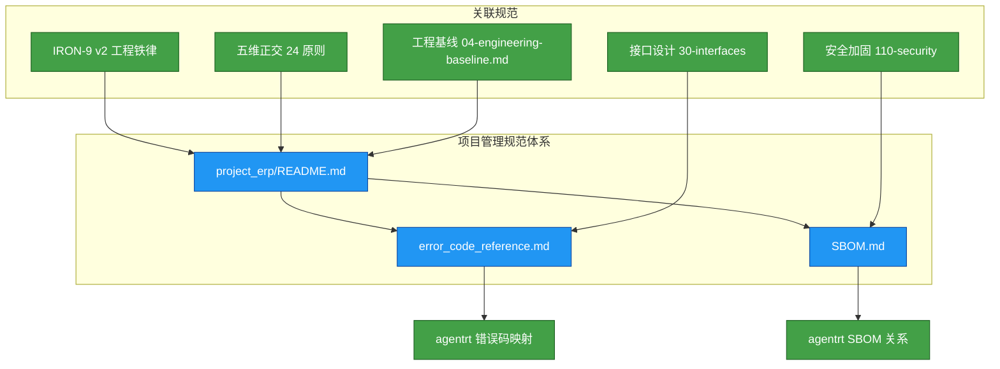

Copyright (c) 2025-2026 SPHARX Ltd. All Rights Reserved.

# agentrt-linux 项目管理规范总览

> **文档定位**： agentrt-linux（AirymaxOS）项目管理规范的顶层入口，定义项目资源、错误码、SBOM 等核心管理域的规范体系\
> **版本**： 0.1.1（文档体系完成）/ 1.0.1（开发）\
> **最后更新**： 2026-07-07\
> **父文档**： [工程标准规范手册](../00-engineering-standards-handbook.md)\
> **关联规范**： IRON-9 v2 工程铁律（内部工程标准规范）

---

## 1. 概述

### 1.1 项目管理在 OS 开发中的重要性

操作系统级项目的管理不同于普通应用软件项目。agentrt-linux（AirymaxOS）作为基于 Linux 内核的 Agentic OS 发行版，其项目管理面临以下独特挑战：

| 挑战维度 | 说明 | 管理应对 |
|----------|------|----------|
| **多子仓协同** | 8 个子仓（kernel / services / security / memory / cognition / cloudnative / system / tests）需同步演进 | 统一版本号 + 统一错误码 + 统一 SBOM |
| **内核态与用户态交织** | 错误码、日志、审计需跨内核态/用户态一致 | 双错误码体系（内核态负整数 + 用户态十六进制） |
| **供应链复杂度** | 从 Linux 内核基线到 eBPF 子系统到 Rust 工具链到第三方库，组件繁多 | SBOM 标准化管理（SPDX 2.3） |
| **同源约束** | 与 agentrt 共享 IRON-9 v2 三层（[SC] 共享契约层 / [SS] 语义同源层 / [IND] 完全独立层） | 项目管理规范与 agentrt 对齐 |
| **长期演进** | LTS 版本 4 年支持周期，创新版本 6 个月发布 | 版本治理 + 资源规划 + 生命周期管理 |

### 1.2 五维正交 24 原则在项目管理中的映射

agentrt-linux（AirymaxOS）的项目管理规范遵循五维正交 24 原则，尤其体现在以下工程观原则：

| 原则编号 | 原则名称 | 在项目管理中的体现 |
|----------|----------|---------------------|
| E-6 | 错误可追溯原则 | 统一错误码体系确保每个错误可追溯到根源 |
| E-7 | 文档即代码原则 | 项目管理规范文档与代码同步版本控制 |
| E-8 | 可测试性原则 | 错误码、SBOM 均为可测试的质量保障手段 |
| K-2 | 接口契约化原则 | 错误码作为模块间契约的一部分 |
| S-3 | 总体设计部原则 | 项目管理规范作为全局协调层，不执行具体任务 |

---

## 2. 文档清单

### 2.1 项目管理规范文档结构

```
50-engineering-standards/50-project-erp/
├── README.md                          # 本文件 — 项目管理规范总览
├── error_code_reference.md            # 统一错误码参考
└── SBOM.md                            # 软件物料清单（SBOM）规范
```

### 2.2 文档关系图



### 2.3 各文档职责

| 文档 | 职责 | 受众 |
|------|------|------|
| **error_code_reference.md** | 定义 agentrt-linux 全系统统一错误码体系，涵盖内核态与用户态双错误码空间、分段规划、与 agentrt 的映射关系、使用规范与维护流程 | 内核开发者、服务开发者、测试工程师 |
| **SBOM.md** | 定义 agentrt-linux 软件物料清单的生成标准、组件追踪规则、许可证合规矩阵、漏洞扫描策略与自动生成流程 | 发布工程师、安全审计员、合规团队 |

---

## 3. 错误码体系概述

### 3.1 为什么需要统一错误码体系

agentrt-linux（AirymaxOS）是一个跨内核态和用户态、跨 8 个子仓的复杂系统。没有统一的错误码体系，将导致以下问题：

1. **错误不可追溯**：同一错误在不同子仓中表现为不同的错误码，无法定位根源（违反 E-6 错误可追溯原则）
2. **跨层调试困难**：内核态错误码与用户态错误码无法关联，调试时无法获得完整错误链
3. **与 agentrt 无法对接**：agentrt 在 agentrt-linux 上运行时，若错误码不一致，同源红利丧失
4. **文档与代码脱节**：错误码定义分散，维护成本高（违反 E-7 文档即代码原则）

### 3.2 双错误码体系总览

agentrt-linux 采用**双错误码体系**：

| 错误码空间 | 表示形式 | 适用范围 | 说明 |
|------------|----------|----------|------|
| **内核态错误码** | 负整数（-1 ~ -899） | airymaxos-kernel | 内核态系统调用返回、内核模块内部错误 |
| **用户态错误码** | 十六进制（0xXXXX0000） | airymaxos-services 及用户态所有子仓 | 用户态守护进程、服务、SDK 返回 |

### 3.3 内核态错误码分段

内核态错误码按子系统分段，每个子仓分配独立区间，避免冲突：

| 分段 | 区间 | 所属子仓 | 说明 |
|------|------|----------|------|
| 通用错误 | -1 ~ -99 | 全部 | 基础错误（如 -EINVAL、-ENOMEM） |
| 系统错误 | -100 ~ -199 | airymaxos-system | 系统级错误 |
| 调度错误 | -200 ~ -299 | airymaxos-kernel | 调度器相关错误 |
| IPC 错误 | -300 ~ -399 | airymaxos-kernel + airymaxos-services | 进程间通信错误 |
| 内存错误 | -400 ~ -499 | airymaxos-memory | 记忆子系统错误 |
| 安全错误 | -500 ~ -599 | airymaxos-security | 安全相关错误 |
| 认知错误 | -600 ~ -699 | airymaxos-cognition | 认知运行时错误 |
| 驱动错误 | -700 ~ -799 | airymaxos-kernel + airymaxos-services | 驱动框架错误 |
| 网络错误 | -800 ~ -899 | airymaxos-cloudnative | 网络与云原生错误 |

### 3.4 与 agentrt 错误码的映射关系

根据 IRON-9 v2 工程铁律，agentrt-linux 与 agentrt 共享契约层代码（[SC] 层）。错误码映射遵循以下规则：

| 层级 | 错误码关系 | 映射方式 |
|------|------------|----------|
| **[SC] 共享契约层** | 完全共享 | agentrt 错误码与 agentrt-linux 内核态错误码直接映射，无需转换 |
| **[SS] 语义同源层** | 语义一致 | 错误码语义一致，但具体数值可能不同（各自独立实现） |
| **[IND] 完全独立层** | 各自独立 | 无映射关系，各自定义错误码 |

详细错误码映射表见 [error_code_reference.md](error_code_reference.md)。

---

## 4. SBOM 管理策略

### 4.1 为什么需要 SBOM

软件物料清单（SBOM）是 agentrt-linux（AirymaxOS）供应链安全的核心组成部分：

| 需求 | 说明 |
|------|------|
| **供应链透明** | 明确记录从 Linux 内核基线到第三方库的全部组件及其版本 |
| **许可证合规** | 确保所有组件的许可证兼容，避免法律风险 |
| **漏洞响应** | 当 CVE 发布时，可快速定位受影响组件并评估影响范围 |
| **安全内生** | 符合 E-1 安全内生原则，安全从供应链源头保障 |
| **行业合规** | 满足 SPDX 2.3 标准，支持自动化工具链集成 |

### 4.2 SBOM 覆盖范围

agentrt-linux SBOM 覆盖以下组件类别：

| 类别 | 组件示例 | 优先级 |
|------|----------|--------|
| **Linux 内核基线** | Linux 内核 6.6 基线（含 agentrt-linux 内核增强） | 最高 |
| **eBPF 子系统** | eBPF kfunc、dynamic pointer、sched_ext（SCHED_AGENT） | 高 |
| **Rust 工具链** | Rust 编译器、cargo、核心 crate | 高 |
| **C/C++ 工具链** | GCC、Clang、binutils、glibc | 高 |
| **系统服务** | systemd、journald、NetworkManager | 高 |
| **安全组件** | SELinux、capability 库、SM2/SM3/SM4 国密库 | 高 |
| **云原生组件** | containerd、K8s 组件、CNI 插件 | 中 |
| **第三方库** | libcurl、OpenSSL、protobuf、grpc | 中 |

### 4.3 SBOM 与 agentrt SBOM 的关系

根据 IRON-9 v2 分层：

- **[SC] 共享契约层**：agentrt-linux 与 agentrt 共享 `include/airymax/` 头文件库，SBOM 中共同标注此部分
- **[SS] 语义同源层**：两者的实现使用各自独立的组件，SBOM 各自维护
- **[IND] 完全独立层**：SBOM 完全独立，无交叉

详细 SBOM 规范见 [SBOM.md](SBOM.md)。

---

## 5. 资源管理规范

### 5.1 资源管理总览

agentrt-linux（AirymaxOS）的资源管理遵循 E-3 资源确定性原则：每块内存的分配者必须明确其释放者，每个文件句柄的打开者必须明确其关闭者，每个线程的创建者必须明确其销毁者。

| 资源类型 | 管理机制 | 确定性保障 |
|----------|----------|------------|
| **物理内存** | MGLRU（多代 LRU）分代回收 | 冷热数据分离，自动分代回收 |
| **异构内存** | CXL 内存池化 + PMEM 持久化 | 跨节点内存池化，生命周期明确 |
| **内核内存** | 分配位置记录（文件:行号）+ 泄漏检测 | 可追溯每次分配，自动检测泄漏 |
| **异步资源** | io_uring 资源与所有者关联 | 所有者销毁时自动释放所有关联资源 |
| **用户态资源** | 预分配内存池、连接池 | 避免动态分配开销，资源池化 |

### 5.2 项目资源跟踪

| 跟踪维度 | 工具/方法 | 说明 |
|----------|-----------|------|
| **代码仓库** | git + atomgit.com | 8 子仓 + 管理仓统一管理 |
| **版本控制** | 语义化版本（0.1.1 / 1.0.1） | 文档版本与代码版本同步 |
| **问题追踪** | Issue 系统 | 按子仓和严重级别分类 |
| **文档版本** | Git 版本控制 | 所有项目管理文档纳入版本控制（E-7） |
| **CI/CD 资源** | 构建流水线 | 自动化构建、测试、SBOM 生成 |

### 5.3 版本管理规范

| 版本类型 | 发布周期 | 支持周期 | 资源管理重点 |
|----------|----------|----------|--------------|
| LTS 版本 | 2 年发布周期 | 4 年支持 | 长期稳定，SBOM 长期维护，安全补丁持续跟踪 |
| 创新版本 | 6 个月发布周期 | 滚动更新 | 快速迭代，SBOM 按需更新 |
| Update 版本 | 每周发布 | 持续 | 增量更新，SBOM 增量变更 |

### 5.4 项目生命周期管理

| 生命周期阶段 | 管理活动 | 输出物 |
|-------------|----------|--------|
| **概念阶段（0.1.1）** | 需求分析、架构设计、文档体系建立 | 设计文档、工程基线、规范文档 |
| **开发阶段（1.0.1）** | 8 子仓并行开发、接口契约实现、集成测试 | 可编译内核、可运行用户态服务、测试套件 |
| **验证阶段（1.0.2+）** | 系统集成测试、性能基准测试、安全审计 | 测试报告、性能报告、安全审计报告 |
| **发布阶段（1.x）** | RPM 打包、ISO 构建、发行版发布 | 发行版 ISO、SBOM、发布公告 |
| **维护阶段（LTS）** | 安全补丁、漏洞修复、社区支持 | 安全更新、Update 版本、技术支持 |
| **退役阶段** | 版本 EOL 公告、迁移指南 | EOL 公告、迁移文档 |

#### 5.4.1 阶段门禁标准

| 门禁 | 从阶段 | 到阶段 | 准入条件 |
|------|--------|--------|----------|
| G1 | 概念 | 开发 | 设计文档完成率 ≥ 90%，架构决策记录（ADR）全部 Accepted |
| G2 | 开发 | 验证 | 代码编译通过，单元测试通过率 ≥ 90%，接口契约完整 |
| G3 | 验证 | 发布 | 集成测试通过率 ≥ 80%，性能基准达标，SBOM 通过验证 |
| G4 | 发布 | 维护 | 发布公告已发布，文档已更新，安全审计无 CRITICAL 漏洞 |

### 5.5 风险管理

agentrt-linux（AirymaxOS）作为 OS 级项目，面临以下关键风险，项目管理规范定义相应的应对策略：

| 风险类别 | 风险描述 | 影响等级 | 应对策略 |
|----------|----------|----------|----------|
| **内核基线漂移** | 引用未来内核特性作为 6.6 原生能力 | 严重 | IRON-10 / BAN-361 / ACC-OS04 三重防护 |
| **同源失配** | agentrt 与 agentrt-linux 的 [SC] 层版本不一致 | 严重 | 跨仓 CI 双向校验 + 版本锁定 |
| **供应链漏洞** | 第三方组件 CVE 未及时修复 | 高 | 每日漏洞扫描 + 响应 SLA |
| **许可证冲突** | 引入不兼容许可证的第三方组件 | 高 | 引入前许可证审查 + SPDX 合规矩阵 |
| **接口契约破坏** | ABI 变更导致 agentrt 无法运行 | 严重 | ABI 兼容性检查 + 锁定 [SC] 层不可变 |
| **性能退化** | 新版本性能劣于基准线 | 中 | 每次发布性能基准测试 |
| **文档过时** | 项目管理文档与代码脱节 | 中 | 文档与代码同 PR 提交 + CI 检查 |
| **社区治理** | 子仓治理组之间协调不畅 | 低 | 工程规范委员会定期会议 + ADR 决策机制 |

### 5.6 项目度量与 KPI

| 度量维度 | KPI 指标 | 目标值 | 测量频率 |
|----------|----------|--------|----------|
| **代码质量** | 静态分析警告数 | 0 | 每次 PR |
| **测试覆盖** | 单元测试行覆盖率 | ≥ 90% | 每次 PR |
| **测试覆盖** | 集成测试接口覆盖率 | ≥ 80% | 每次发布 |
| **错误码** | 未注册错误码使用数 | 0 | 每次 PR |
| **SBOM** | SBOM 组件遗漏率 | 0% | 每次发布 |
| **漏洞** | CRITICAL 漏洞数 | 0 | 每日 |
| **漏洞** | HIGH 漏洞修复率 | 100%（7 天内） | 每周 |
| **文档** | 文档与代码同步率 | 100% | 每次 PR |
| **性能** | 性能基准达标率 | 100% | 每次发布 |
| **ABI** | ABI 兼容性破坏次数 | 0 | 每次发布 |

### 5.7 变更管理流程

agentrt-linux（AirymaxOS）的项目管理变更遵循以下流程：

```mermaid
graph TD
    A[变更提案] --> B[影响评估]
    B --> C[子仓治理组审查]
    C --> D{影响范围?}
    D -->|单子仓| E[子仓治理组批准]
    D -->|跨子仓| F[工程规范委员会批准]
    D -->|涉及 [SC] 层| G[agentrt + agentrt-linux 联合审查]
    E --> H[实施变更]
    F --> H
    G --> H
    H --> I[更新文档]
    I --> J[CI 验证]
    J --> K{验证通过?}
    K -->|否| L[修复问题]
    L --> H
    K -->|是| M[合并变更]
    M --> N[更新版本号]

    classDef start fill:#43a047,stroke:#1b5e20,color:#ffffff
    classDef decision fill:#fb8c00,stroke:#e65100,color:#ffffff
    classDef action fill:#2196f3,stroke:#0d47a1,color:#ffffff
    classDef endNode fill:#9e9e9e,stroke:#424242,color:#ffffff

    class A start
    class D,K decision
    class B,C,E,F,G,H,I,J,M action
    class L,N endNode
```

### 5.8 项目沟通与协作规范

| 沟通渠道 | 用途 | 参与者 | 频率 |
|----------|------|--------|------|
| 工程规范委员会会议 | 跨子仓架构决策、ADR 评审 | 各子仓治理组负责人 | 双周 |
| 子仓治理组会议 | 子仓内技术决策、代码审查 | 子仓治理组成员 | 每周 |
| 社区 SIG 会议 | 社区贡献讨论、技术分享 | 社区成员 + 治理组 | 每月 |
| 安全响应会议 | 安全漏洞评估与响应 | Security 治理组 | 按需（紧急 24h 内） |
| 发布评审会议 | 发布候选版本评审 | 各子仓治理组 + 发布工程师 | 每次发布前 |
| 技术博客 | 技术分享、设计思路 | 全部贡献者 | 按需 |

#### 5.8.1 决策流程

| 决策类型 | 决策者 | 决策方式 | 记录方式 |
|----------|--------|----------|----------|
| 子仓内技术决策 | 子仓治理组 | 子仓治理组多数同意 | 子仓决策记录 |
| 跨子仓技术决策 | 工程规范委员会 | 工程规范委员会投票（2/3 多数） | ADR |
| 项目规范变更 | 工程规范委员会 | 工程规范委员会投票（2/3 多数） | 规范文档更新 + ADR |
| [SC] 层变更 | 工程规范委员会 | 双端联合审查 | 双端 ADR |
| 紧急安全修复 | Security 治理组 | Security 治理组负责人批准 | 安全公告 + 事后 ADR |

### 5.9 项目文档管理规范

agentrt-linux（AirymaxOS）的项目文档遵循 E-7 文档即代码原则，全部文档纳入版本控制：

| 文档类型 | 存放位置 | 版本控制 | 审查要求 |
|----------|----------|----------|----------|
| 设计文档 | `docs/AirymaxOS/` | Git | 子仓治理组审查 |
| 项目管理规范 | `docs/AirymaxOS/50-engineering-standards/` | Git | 工程规范委员会审查 |
| 工程标准规范 | 内部闭源文档 | Git（闭源） | 工程规范委员会审查 |
| 代码注释 | 各子仓代码内 | Git | 代码审查 |
| API 文档 | Doxygen 生成 | Git（源码） | 代码审查 |
| 发布公告 | `docs/AirymaxOS/releases/` | Git | 发布工程师审查 |

### 5.10 项目工具链规范

| 工具类别 | 推荐工具 | 用途 | 说明 |
|----------|----------|------|------|
| 版本控制 | Git + atomgit.com | 代码与文档版本管理 | 8 子仓 + 管理仓统一管理 |
| CI/CD | 自定义流水线 | 构建、测试、SBOM 生成 | 基于 Kbuild + Kconfig |
| 代码审查 | 代码审查系统 | PR 审查 | 每个 PR 必须经过审查 |
| 问题追踪 | Issue 系统 | Bug 跟踪、需求管理 | 按子仓和严重级别分类 |
| 文档生成 | Doxygen + Markdown | API 文档与设计文档 | 自动生成 + 手动维护 |
| 静态分析 | Clang-Tidy + Coverity | 代码质量检查 | 每次 PR |
| 动态分析 | ASan + TSan + UBSan | 运行时错误检测 | CI 流水线 |
| SBOM 工具 | spdx-sbom-generator | SBOM 生成 | 每次发布 |
| 漏洞扫描 | Trivy + Grype | 漏洞检测 | 每日 |

---

## 6. 工程纪律

### 6.1 项目管理铁律

| 铁律 | 内容 | 关联规范 |
|------|------|----------|
| **错误码统一** | 全系统错误码必须在 error_code_reference.md 中注册，未注册的错误码不得使用 | E-6 错误可追溯原则 |
| **SBOM 强制** | 每次发布必须附带 SPDX 2.3 格式的 SBOM，未附带 SBOM 的发布视为无效 | E-1 安全内生原则 |
| **版本同步** | 项目管理文档版本号与代码版本号同步，不允许文档版本滞后 | E-7 文档即代码原则 |
| **同源对齐** | 错误码、SBOM 等项目管理规范必须与 agentrt 对齐（IRON-9 v2 约束） | IRON-9 v2 |
| **审计可追溯** | 所有项目管理决策必须记录审计日志，错误码变更必须有 ADR 记录 | S-1 反馈闭环原则 |

### 6.2 合规性检查

| 检查项 | 工具 | 频率 |
|--------|------|------|
| 错误码注册完整性 | 自动化脚本扫描 | 每次 PR |
| SBOM 有效性 | SPDX 验证工具 | 每次发布 |
| 文档版本一致性 | CI 流水线 | 每次 PR |
| 同源对齐检查 | 跨仓 CI 校验 | 每次 PR |
| 禁词扫描 | ACC-OS04 Grep 扫描 | 每次发布 |

---

## 7. 相关文档

- [统一错误码参考](error_code_reference.md)：agentrt-linux 全系统统一错误码体系
- [SBOM 规范](SBOM.md)：agentrt-linux 软件物料清单规范
- [集成标准总览](../40-integration/README.md)：agentrt-linux 集成标准
- [agentrt 集成规范](../40-integration/agentrt_integration.md)：与 agentrt 的集成规范
- [架构设计](../../10-architecture/README.md)：系统架构总览
- [五维正交原则](../../10-architecture/02-five-dimensional-principles.md)：五维正交 24 原则
- [工程基线](../../10-architecture/04-engineering-baseline.md)：工程基线定义
- IRON-9 v2 工程铁律（闭源内部参考）

---

## 8. 版本历史

| 版本 | 日期 | 变更 |
|------|------|------|
| 0.1.1 | 2026-07-07 | 初始版本（项目管理规范总览，含错误码体系概述 + SBOM 策略 + 资源管理） |
| 1.0.1 | 2027-XX-XX | 首个开发版本（与代码实现同步验证） |