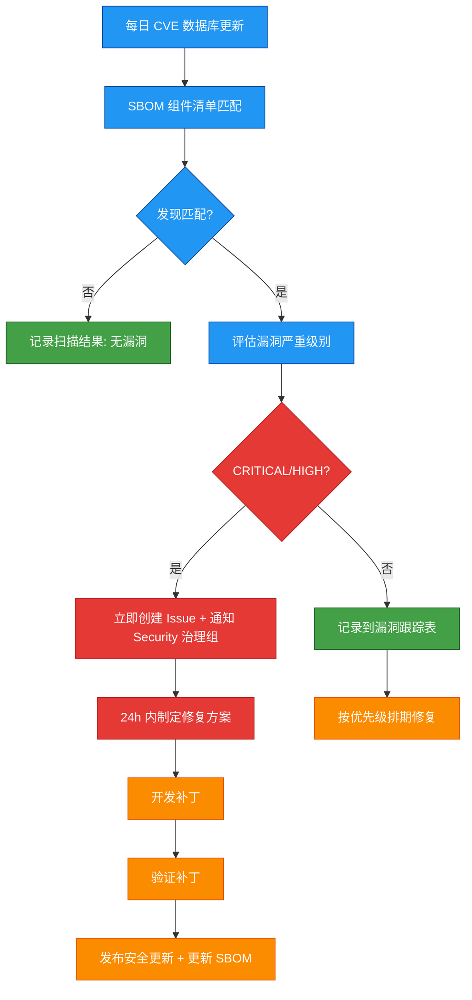
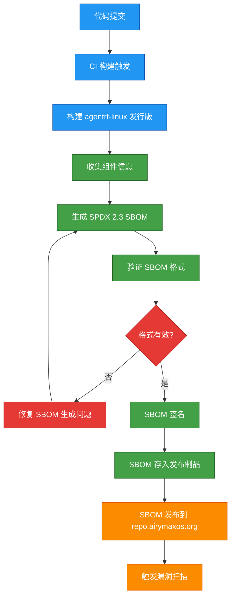
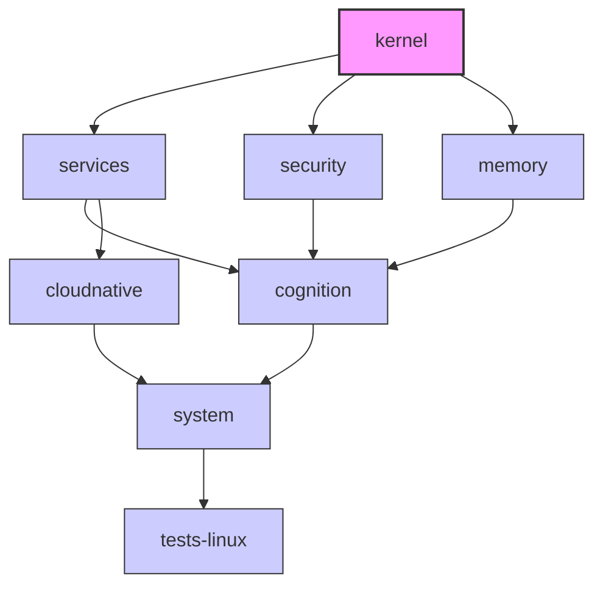
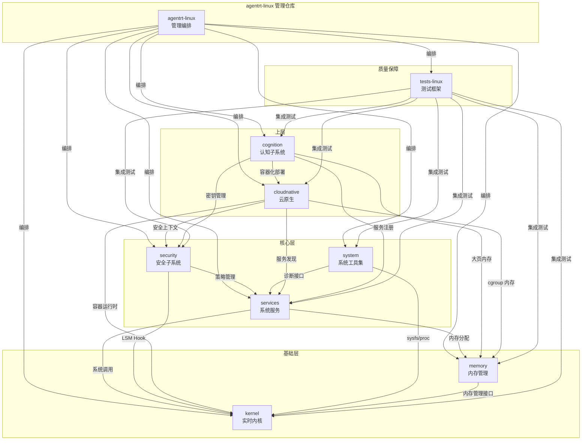
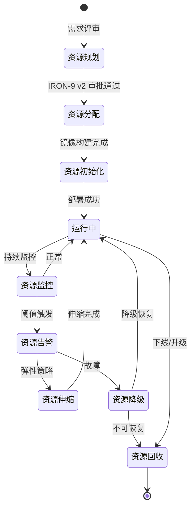

Copyright (c) 2025-2026 SPHARX Ltd. All Rights Reserved.

# agentrt-linux 项目管理规范合集
> **文档定位**：合并软件物料清单（SBOM）规范、统一错误码参考、模块需求手册、资源管理表四部分内容，作为 agentrt-linux（AirymaxOS）项目管理规范的完整参考。理论根基：IRON-9 v3 工程铁律、五维正交24原则、E-6 错误可追溯原则、E-7 文档即代码原则。\
> **文档版本**：0.1.1\
> **最后更新**： 2026-07-21\
> **上级文档**：[agentrt-linux（AirymaxOS）工程标准规范](README.md)\
> **SPDX-License-Identifier**：AGPL-3.0-or-later OR Apache-2.0\
> **SSoT 依赖声明**：本文件规则编号权威为 09-ssot-registry.md §3

---

## Part I: agentrt-linux 软件物料清单（SBOM）规范

### 1. 概述

#### 1.1 SBOM 定义与价值

软件物料清单（Software Bill of Materials，SBOM）是 agentrt-linux（AirymaxOS）供应链安全管理的核心工具。SBOM 以机器可读的格式记录软件产品的所有组件、依赖关系和元数据。

| 价值维度 | 说明 |
|----------|------|
| **供应链透明** | 明确记录从 Linux 内核基线到第三方库的全部组件及其版本、来源 |
| **许可证合规** | 确保所有组件的许可证兼容，避免法律风险 — 符合 E-1 安全内生原则 |
| **漏洞响应** | 当 CVE 发布时，可快速定位受影响组件并评估影响范围 — 符合 S-1 反馈闭环原则 |
| **安全审计** | 为第三方安全审计提供完整的组件清单 |
| **行业合规** | 满足 SPDX 2.3 标准，支持自动化工具链集成 |
| **同源协调** | 与 agentrt SBOM 协调，确保 [SC] 共享契约层组件一致 — 符合 IRON-9 v3 |

#### 1.2 五维正交 24 原则在 SBOM 中的映射

| 原则编号 | 原则名称 | 在 SBOM 中的体现 |
|----------|----------|---------------------|
| E-1 | 安全内生原则 | SBOM 是供应链安全的基石，从源头保障系统安全 |
| E-7 | 文档即代码原则 | SBOM 作为代码的一部分进行版本控制，与构建产物同步 |
| S-1 | 反馈闭环原则 | 漏洞扫描 → SBOM 更新 → 补丁发布形成完整闭环 |
| K-2 | 接口契约化原则 | SBOM 声明组件的接口契约（版本、API、ABI） |
| A-2 | 极致细节原则 | SBOM 记录每个组件的完整元数据，不遗漏任何依赖 |

---

### 2. SBOM 标准选择

#### 2.1 标准对比

| 标准 | 版本 | 支持度 | 优缺点 |
|------|------|--------|--------|
| **SPDX** | 2.3 | 最广泛 | 行业标准，Linux 基金会维护，支持许可证、安全、关系等完整字段 |
| CycloneDX | 1.5 | 广泛 | OWASP 维护，安全导向，但许可证字段不如 SPDX 丰富 |
| SWID | ISO/IEC 19770-2 | 中等 | 国际标准，但过于复杂，不适合开源项目 |

#### 2.2 选择理由

agentrt-linux（AirymaxOS）选择 **SPDX 2.3** 作为 SBOM 标准，理由如下：

1. **行业标准**：SPDX 是 Linux 基金会维护的 ISO/IEC 5962:2021 标准，企业级 Linux 生态广泛采用
2. **许可证覆盖**：SPDX License List 包含 500+ 许可证标识符，覆盖 agentrt-linux 全部组件
3. **工具链成熟**：支持 SPDX 的生成、验证、比较工具丰富（spdx-sbom-generator、SPDX Tools、NTIA Conformance Checker）
4. **关系建模**：SPDX 2.3 支持 DESCRIBES、DEPENDS_ON、CONTAINS 等关系类型，适合描述 agentrt-linux 复杂的组件依赖图
5. **与 agentrt 对齐**：agentrt 同样采用 SPDX 2.3，[SC] 层组件可共享 SBOM 片段
6. **安全字段**：SPDX 2.3 支持 ExternalRef 字段引用 CVE、GHSA 等安全公告

#### 2.3 SPDX 2.3 文档结构

```
SPDX Document
├── Creation Info（创建信息）
│   ├── SPDX Version: SPDX-2.3
│   ├── Data License: CC0-1.0
│   ├── SPDX Identifier: SPDXRef-DOCUMENT
│   ├── Document Name: agentrt-linux-1.0.1-sbom
│   ├── Creator: Organization: SPHARX Ltd.
│   └── Created: 2026-07-07T00:00:00Z
│
├── Package（软件包）
│   ├── Package Name: agentrt-linux
│   ├── Package Version: 1.0.1
│   ├── Package Supplier: SPHARX Ltd.
│   ├── Package Download Location: https://repo.airymaxos.org
│   ├── Package License Concluded: GPL-2.0-only
│   ├── Package Copyright Text: Copyright (c) 2025-2026 SPHARX Ltd.
│   └── External References（外部引用）
│       ├── SECURITY: CVE-XXXX-XXXXX
│       └── PACKAGE_MANAGER: rpm
│
├── Relationships（关系）
│   ├── SPDXRef-DOCUMENT DESCRIBES SPDXRef-agentrt-linux
│   ├── SPDXRef-agentrt-linux CONTAINS SPDXRef-linux-kernel
│   ├── SPDXRef-agentrt-linux CONTAINS SPDXRef-ebpf-subsystem
│   └── ...
│
└── Files（文件，可选）
    ├── File Name: kernel/vmlinuz
    ├── File Checksum: SHA256:...
    └── ...
```

---

### 3. 组件清单

#### 3.1 组件分类总览

agentrt-linux（AirymaxOS）SBOM 覆盖以下组件类别：

| 类别 | 优先级 | SBOM 深度 | 说明 |
|------|--------|-----------|------|
| **Linux 内核基线** | 最高 | 文件级 | 内核镜像、内核模块、内核头文件 |
| **eBPF 子系统** | 高 | 文件级 | eBPF 程序、BPF 映射定义、kfunc 注册 |
| **Rust 工具链** | 高 | 包级 | Rust 编译器、cargo、核心 crate |
| **C/C++ 工具链** | 高 | 包级 | GCC、Clang、binutils、glibc |
| **系统服务** | 高 | 包级 | systemd、journald、NetworkManager |
| **安全组件** | 高 | 包级 + 文件级 | SELinux、capability 库、国密库 |
| **云原生组件** | 中 | 包级 | containerd、K8s 组件、CNI 插件 |
| **第三方库** | 中 | 包级 | libcurl、OpenSSL、protobuf、grpc |
| **测试组件** | 中 | 包级 | CUnit、kselftest、pytest |
| **文档与工具** | 低 | 包级 | 文档生成工具、开发辅助工具 |

#### 3.2 Linux 内核基线组件

| 组件 | 版本 | 来源 | 许可证 | SPDX ID |
|------|------|------|--------|---------|
| Linux Kernel | 6.6 LTS | kernel.org | GPL-2.0-only | SPDXRef-linux-kernel |
| EEVDF 调度器 | 6.6 原生 | 主线 | GPL-2.0-only | SPDXRef-eevdf |
| MGLRU（多代 LRU） | 6.6 原生 | 主线 | GPL-2.0-only | SPDXRef-mglru |
| io_uring | 6.6 原生 | 主线 | GPL-2.0-only | SPDXRef-iouring |
| eBPF kfunc | 6.6 原生 | 主线 | GPL-2.0-only | SPDXRef-ebpf-kfunc |
| sched_tac（SCHED_DEADLINE/SCHED_FIFO/EEVDF） | agentrt-linux（AirymaxOS）增强 | 基于主线 6.6 调度策略 | GPL-2.0-only | SPDXRef-sched-ext |
| Rust 内核支持 | 6.6 实验性 | 主线 | GPL-2.0-only | SPDXRef-rust-kernel |
| XFS 在线 fsck | 6.6 原生 | 主线 | GPL-2.0-only | SPDXRef-xfs-fsck |

#### 3.3 eBPF 子系统组件

| 组件 | 版本 | 来源 | 许可证 | SPDX ID |
|------|------|------|--------|---------|
| eBPF 核心运行时 | 6.6 原生 | 主线 | GPL-2.0-only | SPDXRef-ebpf-core |
| BPF CO-RE | 6.6 原生 | 主线 | GPL-2.0-only | SPDXRef-bpf-core |
| BPF Type Format (BTF) | 6.6 原生 | 主线 | GPL-2.0-only | SPDXRef-btf |
| libbpf | 1.x | kernel.org | LGPL-2.1-only | SPDXRef-libbpf |
| bpftool | 6.6 | kernel.org | GPL-2.0-only | SPDXRef-bpftool |
| sched_tac 用户态调度器 | 1.0.1 | agentrt-linux | GPL-2.0-only | SPDXRef-sched-agent-tac |
| eBPF 安全探针 | 1.0.1 | agentrt-linux | GPL-2.0-only | SPDXRef-ebpf-security |

#### 3.4 Rust 工具链组件

| 组件 | 版本 | 来源 | 许可证 | SPDX ID |
|------|------|------|--------|---------|
| Rust 编译器 (rustc) | 1.75+ | rust-lang.org | MIT OR Apache-2.0 | SPDXRef-rustc |
| Cargo | 1.75+ | rust-lang.org | MIT OR Apache-2.0 | SPDXRef-cargo |
| Rust 标准库 (std) | 1.75+ | rust-lang.org | MIT OR Apache-2.0 | SPDXRef-rust-std |
| Rust 核心库 (core) | 1.75+ | rust-lang.org | MIT OR Apache-2.0 | SPDXRef-rust-core |
| Rust 分配库 (alloc) | 1.75+ | rust-lang.org | MIT OR Apache-2.0 | SPDXRef-rust-alloc |
| bindgen | 0.69+ | crates.io | BSD-3-Clause | SPDXRef-bindgen |
| serde | 1.x | crates.io | MIT OR Apache-2.0 | SPDXRef-serde |
| tokio | 1.x | crates.io | MIT | SPDXRef-tokio |

#### 3.5 C/C++ 工具链组件

| 组件 | 版本 | 来源 | 许可证 | SPDX ID |
|------|------|------|--------|---------|
| GCC | 12+ | gcc.gnu.org | GPL-3.0-or-later | SPDXRef-gcc |
| Clang/LLVM | 17+ | llvm.org | Apache-2.0 WITH LLVM-exception | SPDXRef-clang |
| binutils | 2.40+ | gnu.org | GPL-3.0-or-later | SPDXRef-binutils |
| glibc | 2.38+ | gnu.org | LGPL-2.1-or-later | SPDXRef-glibc |
| GNU Make | 4.4+ | gnu.org | GPL-3.0-or-later | SPDXRef-make |
| CMake | 3.27+ | cmake.org | BSD-3-Clause | SPDXRef-cmake |
| pkg-config | 0.29+ | freedesktop.org | GPL-2.0-or-later | SPDXRef-pkg-config |

#### 3.6 系统服务组件

| 组件 | 版本 | 来源 | 许可证 | SPDX ID |
|------|------|------|--------|---------|
| systemd | 254+ | systemd.io | LGPL-2.1-or-later | SPDXRef-systemd |
| journald | 254+ | systemd | LGPL-2.1-or-later | SPDXRef-journald |
| NetworkManager | 1.44+ | gnome.org | GPL-2.0-or-later | SPDXRef-networkmanager |
| udev | 254+ | systemd | LGPL-2.1-or-later | SPDXRef-udev |
| dbus | 1.14+ | freedesktop.org | AFL-2.1 OR GPL-2.0-or-later | SPDXRef-dbus |
| polkit | 123+ | freedesktop.org | LGPL-2.0-or-later | SPDXRef-polkit |

#### 3.7 安全组件

| 组件 | 版本 | 来源 | 许可证 | SPDX ID |
|------|------|------|--------|---------|
| SELinux | 3.5+ | selinuxproject.org | GPL-2.0-only | SPDXRef-selinux |
| libseccomp | 2.5+ | github.com/seccomp | LGPL-2.1-only | SPDXRef-libseccomp |
| capability 库 | 1.0.1 | agentrt-linux | Apache-2.0 | SPDXRef-capability-lib |
| SM2/SM3/SM4 国密库 | 1.0.1 | agentrt-linux | Apache-2.0 | SPDXRef-gm-crypto |
| auditd | 3.1+ | linux-audit | GPL-2.0-or-later | SPDXRef-auditd |
| TEE/SGX 支持库 | 1.0.1 | agentrt-linux | Apache-2.0 | SPDXRef-tee-lib |

#### 3.8 云原生组件

| 组件 | 版本 | 来源 | 许可证 | SPDX ID |
|------|------|------|--------|---------|
| containerd | 1.7+ | containerd.io | Apache-2.0 | SPDXRef-containerd |
| Kubernetes 组件 | 1.28+ | kubernetes.io | Apache-2.0 | SPDXRef-k8s |
| OCI runtime-spec | 1.1+ | opencontainers.org | Apache-2.0 | SPDXRef-oci-spec |
| CNI 插件 | 1.3+ | github.com/containernetworking | Apache-2.0 | SPDXRef-cni |
| agentctl | 1.0.1 | agentrt-linux | Apache-2.0 | SPDXRef-agentctl |
| 超节点 UMDK | 1.0.1 | agentrt-linux | Apache-2.0 | SPDXRef-umdk |
| runc | 1.1+ | opencontainers.org | Apache-2.0 | SPDXRef-runc |

#### 3.9 第三方核心库

| 组件 | 版本 | 来源 | 许可证 | SPDX ID |
|------|------|------|--------|---------|
| OpenSSL | 3.1+ | openssl.org | Apache-2.0 | SPDXRef-openssl |
| libcurl | 8.2+ | curl.se | curl | SPDXRef-libcurl |
| protobuf | 24+ | protobuf.dev | BSD-3-Clause | SPDXRef-protobuf |
| gRPC | 1.58+ | grpc.io | Apache-2.0 | SPDXRef-grpc |
| zlib | 1.2.13+ | zlib.net | Zlib | SPDXRef-zlib |
| libxml2 | 2.11+ | xmlsoft.org | MIT | SPDXRef-libxml2 |
| libjson-c | 0.17+ | github.com/json-c | MIT | SPDXRef-json-c |
| OpenTelemetry | 1.20+ | opentelemetry.io | Apache-2.0 | SPDXRef-opentelemetry |

---

### 4. 许可证合规矩阵

#### 4.1 许可证分类

| 许可证类别 | 许可证 | 限制级别 | agentrt-linux 使用 |
|------------|--------|----------|---------------------|
| **强 Copyleft** | GPL-2.0-only, GPL-3.0-or-later | 高 | 内核、GCC、binutils |
| **弱 Copyleft** | LGPL-2.1-only, LGPL-2.1-or-later, LGPL-2.0-or-later | 中 | glibc、systemd、libseccomp |
| **宽松许可** | Apache-2.0, MIT, BSD-3-Clause | 低 | 自研组件、LLVM、gRPC |
| **特殊许可** | curl, Zlib, AFL-2.1 | 低 | 特定第三方库 |

#### 4.2 许可证兼容性矩阵

| 组件许可证 | 可与 GPL-2.0 链接 | 可与 Apache-2.0 链接 | 可与 MIT 链接 |
|------------|-------------------|----------------------|---------------|
| GPL-2.0-only | | ❌ | ❌ |
| GPL-3.0-or-later | (GPL-3.0 兼容) | ❌ | ❌ |
| LGPL-2.1-only | | | |
| Apache-2.0 | ❌ | | |
| MIT | | | |
| BSD-3-Clause | | | |
| curl | | | |
| Zlib | | | |

#### 4.3 合规要求

| 要求 | 说明 | 验证方式 |
|------|------|----------|
| **内核模块许可证** | 所有内核模块必须使用 GPL-2.0 兼容许可证 | 内核构建时自动检查 MODULE_LICENSE |
| **发行版整体许可证** | agentrt-linux 发行版整体许可证为 GPL-2.0-only（与内核一致） | SPDX 文档声明 |
| **自研组件许可证** | agentrt-linux（AirymaxOS）自研组件使用 Apache-2.0 | 代码仓库 LICENSE 文件 |
| **第三方组件审核** | 新增第三方组件必须在引入前完成许可证审核 | 许可证合规审查流程 |
| **许可证冲突检测** | 自动化工具检测许可证冲突 | CI 流水线集成 |
| **禁止 GPL-3.0 仅内核代码** | 内核代码不能使用 GPL-3.0-only（与 GPL-2.0 不兼容） | 代码审查 |

---

### 5. 漏洞扫描策略

#### 5.1 扫描策略总览

| 策略维度 | 说明 |
|----------|------|
| **扫描频率** | 每日自动扫描（CVE 数据库更新后）+ 每次发布前强制扫描 |
| **扫描范围** | SBOM 中列出的全部组件（从内核到第三方库） |
| **扫描工具** | Trivy + Grype + OSS-Fuzz（内核） |
| **严重级别** | CRITICAL / HIGH / MEDIUM / LOW / NONE |
| **响应时间** | CRITICAL: 24h / HIGH: 7d / MEDIUM: 30d / LOW: 90d |
| **通知机制** | agentrt-linux-SA 安全公告 + Issue 自动创建 |

#### 5.2 漏洞扫描流程



#### 5.3 漏洞评级标准

| 严重级别 | CVSS 评分 | 响应时间 | 处理方式 |
|----------|-----------|----------|----------|
| CRITICAL | 9.0 - 10.0 | 24 小时 | 紧急安全更新，阻塞发布 |
| HIGH | 7.0 - 8.9 | 7 天 | 安全更新，纳入下一个 Update 版本 |
| MEDIUM | 4.0 - 6.9 | 30 天 | 纳入定期更新计划 |
| LOW | 0.1 - 3.9 | 90 天 | 按需修复，纳入下一个 LTS 版本 |
| NONE | 0.0 | 不适用 | 记录但无需处理 |

#### 5.4 漏洞豁免流程

当漏洞无法修复或修复成本过高时，可申请漏洞豁免：

1. **提交豁免申请**：说明漏洞编号、影响范围、无法修复的原因
2. **风险评估**：Security 治理组评估风险
3. **工程规范委员会审批**：CRITICAL/HIGH 漏洞豁免需工程规范委员会投票
4. **记录豁免**：在 SBOM 中记录豁免，注明原因和有效期
5. **定期复审**：每季度复审豁免列表，确认豁免是否仍然有效

---

### 6. SBOM 自动生成流程

#### 6.1 生成流水线

SBOM 的生成完全自动化，集成在 CI/CD 流水线中：



#### 6.2 生成工具链

| 工具 | 用途 | 说明 |
|------|------|------|
| spdx-sbom-generator | 主要生成工具 | 支持多种包管理器，生成 SPDX 2.3 格式 |
| RPM SBOM 插件 | RPM 包信息提取 | 从 RPM 元数据提取组件信息 |
| Kernel SBOM 脚本 | 内核组件信息提取 | 解析内核 config + 模块列表 |
| Cargo SBOM 插件 | Rust 依赖提取 | 从 Cargo.lock 生成 SPDX |
| SBOM 签名工具 | 数字签名 | 使用 SM2 签名保护 SBOM 完整性 |
| SPDX Tools | 格式验证 | 验证 SPDX 文档格式合规性 |

#### 6.3 生成配置

```yaml
# .github/workflows/sbom-generation.yml
sbom:
  standard: SPDX-2.3
  document_name: "agentrt-linux-{version}-sbom"
  namespace: "https://repo.airymaxos.org/sbom/"
  creator: "Organization: SPHARX Ltd."
  
  packages:
    - type: rpm
      path: /build/rpms/
    - type: kernel
      config: /build/kernel/.config
      modules: /build/kernel/modules/
    - type: cargo
      lockfile: /build/Cargo.lock
    - type: manual
      components: /sbom/manual_components.yaml
  
  signing:
    algorithm: SM2
    key: /keys/sbom_signing.key
  
  output:
    format: [json, tag-value, yaml]
    path: /release/sbom/
```

#### 6.4 SBOM 版本管理

| 场景 | SBOM 版本策略 | 说明 |
|------|--------------|------|
| 新版本发布 | 生成新的完整 SBOM | 替换旧版本 SBOM |
| Update 版本 | 生成增量 SBOM | 仅包含变更的组件 |
| 安全补丁 | 更新 SBOM 中受影响的组件版本 | 标记修复的 CVE |
| 组件回滚 | 生成新的 SBOM | 反映回滚后的组件版本 |

---

### 7. 与 agentrt SBOM 的关系

#### 7.1 IRON-9 v3 四层 SBOM 关系

根据 IRON-9 v3 工程铁律，agentrt-linux 与 agentrt 的 SBOM 关系遵循三层架构：

| 层级 | SBOM 关系 | 说明 |
|------|-----------|------|
| **[SC] 共享契约层** | 共享 SBOM 片段 | `include/uapi/linux/airymax/` 头文件库的 SBOM 片段由 agentrt 维护，agentrt-linux 引用 |
| **[SS] 语义同源层** | 各自独立 SBOM | 各自的实现使用独立组件，SBOM 各自维护 |
| **[IND] 完全独立层** | 完全独立 SBOM | 无交叉引用，SBOM 完全独立 |

#### 7.2 [SC] 层共享 SBOM 片段

共享契约层的组件（`include/uapi/linux/airymax/` 头文件库）在 agentrt 和 agentrt-linux 的 SBOM 中共同标注：

```yaml
# agentrt-linux SBOM 中引用 agentrt 共享 SBOM 片段
relationships:
  - spdxElementId: SPDXRef-agentrt-linux
    relationshipType: DEPENDS_ON
    relatedSpdxElement: SPDXRef-airymax-contracts
    comment: "IRON-9 v3 [SC] 层 — 共享契约层代码，SBOM 片段由 agentrt 维护"
```

#### 7.3 跨仓 SBOM 一致性检查

| 检查项 | 工具 | 频率 |
|--------|------|------|
| [SC] 层组件版本一致性 | 跨仓 CI 校验 | 每次 PR |
| [SC] 层许可证一致性 | SPDX diff 工具 | 每次 PR |
| [SC] 层 CVE 同步 | 跨仓安全扫描 | 每日 |
| SBOM 格式一致性 | SPDX 验证工具 | 每次发布 |

---

### 8. 工程纪律

#### 8.1 SBOM 铁律

| 铁律 | 内容 | 关联规范 |
|------|------|----------|
| **SBOM 强制** | 每次发布必须附带 SPDX 2.3 格式的 SBOM，未附带 SBOM 的发布视为无效 | E-1 安全内生原则 |
| **SBOM 完整性** | SBOM 必须覆盖所有组件（包括传递依赖），不允许遗漏 | E-6 错误可追溯原则 |
| **SBOM 签名** | SBOM 必须经过 SM2 数字签名，确保完整性和不可否认性 | E-1 安全内生原则 |
| **SBOM 可验证** | SBOM 必须通过 SPDX 验证工具验证，格式不合规的 SBOM 不得发布 | E-8 可测试性原则 |
| **SBOM 版本同步** | SBOM 的版本号必须与 agentrt-linux 发行版版本号一致 | E-7 文档即代码原则 |
| **许可证合规** | 新增组件必须在引入前通过许可证合规审查 | E-1 安全内生原则 |

#### 8.2 SBOM 合规性检查清单

| 检查项 | 频率 | 责任人 |
|--------|------|--------|
| [ ] SBOM 格式通过 SPDX 验证 | 每次发布 | 发布工程师 |
| [ ] SBOM 包含所有组件清单 | 每次发布 | 构建系统 |
| [ ] 所有组件许可证已验证 | 每次引入新组件 | 合规团队 |
| [ ] 漏洞扫描已执行且无 CRITICAL | 每次发布 | Security 治理组 |
| [ ] SBOM 已 SM2 签名 | 每次发布 | 发布工程师 |
| [ ] [SC] 层组件与 agentrt 一致 | 每次 PR | 跨仓 CI |
| [ ] SBOM 已存入发布制品 | 每次发布 | 构建系统 |
| [ ] SBOM 已发布到 repo.airymaxos.org | 每次发布 | 发布工程师 |

---

### 9. 相关文档

- [项目管理规范总览](README.md)：项目管理规范顶层入口
- [统一错误码参考](./project_erp.md)：统一错误码体系（Part II）
- [集成标准总览](../40-integration/README.md)：集成标准
- [安全加固规范](../../110-security/README.md)：安全加固体系
- [工程基线](../../10-architecture/04-engineering-baseline.md)：工程基线定义
- [五维正交原则](../../10-architecture/02-five-dimensional-principles.md)：五维正交 24 原则
- IRON-9 v3 工程铁律

---

### 10. 版本历史

| 版本 | 日期 | 变更 |
|------|------|------|
| 0.1.1 | 2026-07-07 | 初始版本（SPDX 2.3 标准 + 9 类组件清单 + 许可证合规矩阵 + 漏洞扫描策略 + 自动生成流程 + agentrt SBOM 关系） |
| 1.0.1 | 2027-XX-XX | 首个开发版本（与代码实现同步验证） |
| v1.0.1 | 2026-07-21 | 版本号统一：按 IRON-8 铁律，所有文档版本号统一为 v1.0.1（禁止 v1.0/v1.1/v1.1.1/v1.2/v2.0 中间过渡版本） |

---

## Part II: agentrt-linux 统一错误码参考

> **SSoT 声明**： 本文档的错误码规范以方案 A（POSIX errno 负值）为唯一权威方案。权威源文件：`agentrt/commons/utils/error/include/error.h`（定义 `AIRY_ERR_*` 扩展码 + 错误链/i18n 接口）+ `agentrt/commons/include/airy_types.h:41`（定义 `airy_err_t` 类型 + `AIRY_E*` POSIX 码）。`airymax/error.h` 为规划中的 [SC] 共享头文件路径，当前尚未创建；在创建前，以 `agentrt/commons/utils/error/include/error.h` 为实际权威源。C 内核首要体系使用 `AIRY_E*` 前缀（唯一主名称），SDK 次要体系使用 `AIRY_ERROR_*` 前缀。旧版 `AIRY_ERR_*` 前缀已废弃，新代码禁止使用。详见 [跨项目代码共享](../120-cross-project-code-sharing.md) §2.5。

---

### 1. 概述

#### 1.1 设计目标

agentrt-linux（AirymaxOS）统一错误码体系的设计目标：

| 目标 | 说明 | 对应原则 |
|------|------|----------|
| **全系统一致** | 内核态与用户态错误码可关联追溯，调试时获得完整错误链 | E-6 错误可追溯原则 |
| **分段无冲突** | 各子仓错误码区间独立，避免数值冲突 | K-2 接口契约化原则 |
| **与 agentrt 对齐** | [SC] 层错误码完全共享，[SS] 层语义一致 | IRON-9 v3 |
| **可扩展** | 预留扩展空间，支持未来新子仓和新错误类型 | A-1 简约至上原则 |
| **可审计** | 错误码定义、使用、变更全程可追溯 | S-1 反馈闭环原则 |

#### 1.2 适用范围

本错误码体系适用于 agentrt-linux（AirymaxOS）的以下全部子仓和组件：

| 子仓 / 组件 | 错误码空间 | 说明 |
|-------------|------------|------|
| kernel | 内核态负整数 (-1 ~ -899) | 内核模块、系统调用返回值 |
| services | 用户态十六进制 (0x0XXX0000) | 用户态守护进程、服务接口返回值 |
| security | 用户态十六进制 (0x3XXX0000) | 安全模块返回值 |
| memory | 用户态十六进制 (0x4XXX0000) | 记忆子系统返回值 |
| cognition | 用户态十六进制 (0x5XXX0000) | 认知运行时返回值 |
| cloudnative | 用户态十六进制 (0x6XXX0000) | 云原生组件返回值 |
| system | 用户态十六进制 (0x7XXX0000) | 系统工具返回值 |
| tests-linux | 用户态十六进制 (0x8XXX0000) | 测试框架返回值 |

---

### 2. 双错误码体系

#### 2.1 设计原理

agentrt-linux（AirymaxOS）采用双错误码体系的核心原因在于内核态与用户态的错误表示本质不同：

| 特性 | 内核态 | 用户态 |
|------|--------|--------|
| **表示方式** | 负整数（C 语言惯用法，返回 -EXXX） | 十六进制（便于位操作和分类） |
| **传输方式** | 系统调用返回值（errno） | 函数返回值、IPC 消息字段 |
| **编码空间** | 紧凑（-1 ~ -899，共 899 个有效值） | 宽松（0x00010000 ~ 0xFFFF0000，共 65535 个有效值） |
| **扩展性** | 有限（每个分段 100 个值） | 充裕（每个分段 4096 个值） |
| **与 C 标准兼容** | 负数 errno 直接兼容 POSIX | 需转换为负数 errno 或自定义枚举 |

#### 2.2 内核态错误码：负整数体系

内核态错误码采用负整数表示，与 Linux 内核 errno 风格一致。所有内核态错误码定义为负整数的宏。

##### 2.2.1 通用错误码（-1 ~ -99）

通用错误码复用 Linux 内核标准 errno，agentrt-linux 不重新定义，直接使用内核已有定义：

| 错误码 | 宏名称 | 含义 | 典型场景 |
|--------|--------|------|----------|
| -1 | -EPERM | 操作不允许 | 权限不足 |
| -2 | -ENOENT | 文件或目录不存在 | 路径查找失败 |
| -3 | -ESRCH | 进程不存在 | PID 查找失败 |
| -4 | -EINTR | 系统调用被中断 | 信号中断 |
| -5 | -EIO | I/O 错误 | 磁盘读写失败 |
| -6 | -ENXIO | 设备或地址不存在 | 设备节点未找到 |
| -7 | -E2BIG | 参数列表过长 | execve 参数过多 |
| -8 | -ENOEXEC | 执行格式错误 | 可执行文件格式无效 |
| -9 | -EBADF | 文件描述符无效 | fd 已关闭或无效 |
| -10 | -ECHILD | 无子进程 | waitpid 无子进程 |
| -11 | -EAGAIN | 资源暂时不可用 | 非阻塞操作需重试 |
| -12 | -ENOMEM | 内存不足 | 分配失败 |
| -13 | -EACCES | 权限不足 | 访问拒绝 |
| -14 | -EFAULT | 地址错误 | 无效指针 |
| -15 | -ENOTBLK | 需要块设备 | 非块设备操作 |
| -16 | -EBUSY | 设备或资源忙 | 资源被占用 |
| -17 | -EEXIST | 文件已存在 | 创建已存在的文件 |
| -18 | -EXDEV | 跨设备链接 | 不同文件系统间操作 |
| -19 | -ENODEV | 无此设备 | 设备不存在 |
| -20 | -ENOTDIR | 不是目录 | 路径组件非目录 |
| -21 | -EISDIR | 是目录 | 对目录执行非法操作 |
| -22 | -EINVAL | 参数无效 | 无效的系统调用参数 |
| -23 | -ENFILE | 文件表溢出 | 系统级文件表满 |
| -24 | -EMFILE | 打开文件过多 | 进程级 fd 表满 |
| -25 | -ENOTTY | 不适当的 ioctl | 对非终端设备执行 ioctl |
| -26 | -ETXTBSY | 文本文件忙 | 正在写入的可执行文件 |
| -27 | -EFBIG | 文件过大 | 超出文件大小限制 |
| -28 | -ENOSPC | 设备无空间 | 磁盘满 |
| -29 | -ESPIPE | 非法寻址 | 对管道进行 lseek |
| -30 | -EROFS | 只读文件系统 | 对只读 fs 写操作 |
| -31 | -EMLINK | 链接过多 | 超出最大链接数 |
| -32 | -EPIPE | 管道破裂 | 向无读端的管道写入 |
| -33 | -EDOM | 数学参数超出域 | 数学函数参数无效 |
| -34 | -ERANGE | 数学结果超出范围 | 数学函数结果溢出 |
| -35 | -EDEADLK | 资源死锁 | 检测到死锁 |
| -36 | -ENAMETOOLONG | 文件名过长 | 超出路径名长度限制 |
| -37 | -ENOLCK | 无可用锁 | 记录锁不可用 |
| -38 | -ENOSYS | 系统调用未实现 | 功能未实现 |
| -39 | -ENOTEMPTY | 目录非空 | 删除非空目录 |
| -40 | -ELOOP | 符号链接循环过多 | 符号链接嵌套过深 |
| -42 | -ENOMSG | 无所需类型消息 | 消息队列为空 |
| -43 | -EIDRM | 标识符已删除 | IPC 对象已删除 |
| -45 | -ERESTART | 需重启系统调用 | 内核内部状态 |
| -50 | -ENODATA | 无可用数据 | 流中无数据 |
| -51 | -ETIME | 定时器超时 | 定时器过期 |
| -52 | -ENOSR | 流出资源 | STREAMS 资源不足 |
| -55 | -ENOTSUP | 操作不支持 | 功能不支持 |
| -60 | -EOVERFLOW | 值过大 | 超出数据类型范围 |
| -61 | -ENOTCONN | 套接字未连接 | 对未连接套接字操作 |
| -62 | -ETIMEDOUT | 连接超时 | 网络操作超时 |
| -63 | -ECONNREFUSED | 连接被拒绝 | 远程拒绝连接 |
| -64 | -EHOSTDOWN | 主机已关机 | 目标主机不可达 |
| -65 | -EHOSTUNREACH | 主机不可达 | 路由不可达 |
| -66 | -EALREADY | 操作已在进行中 | 重复操作 |
| -67 | -EINPROGRESS | 操作正在进行中 | 非阻塞操作 |
| -68 | -ESTALE | 文件句柄过期 | NFS 文件句柄过期 |
| -69 | -ECANCELED | 操作已取消 | 异步操作取消 |

##### 2.2.2 系统错误码（-100 ~ -199）

系统错误码由 system 子仓定义，涵盖系统级错误场景：

| 错误码 | 宏名称 | 含义 | 典型场景 |
|--------|--------|------|----------|
| -100 | -E_SYS_PKG_NOT_FOUND | 软件包未找到 | dnf 未找到指定包 |
| -101 | -E_SYS_PKG_CONFLICT | 软件包冲突 | 依赖冲突 |
| -102 | -E_SYS_PKG_INSTALL_FAIL | 软件包安装失败 | RPM 安装错误 |
| -103 | -E_SYS_CONFIG_INVALID | 配置无效 | 配置文件语法错误 |
| -104 | -E_SYS_CONFIG_APPLY_FAIL | 配置应用失败 | systemd 配置重新加载失败 |
| -105 | -E_SYS_SERVICE_FAILED | 系统服务失败 | 服务启动或运行失败 |
| -106 | -E_SYS_SERVICE_NOT_FOUND | 系统服务未找到 | systemd 未找到指定单元 |
| -107 | -E_SYS_DEPENDENCY_MISSING | 依赖缺失 | 缺少必要依赖项 |
| -108 | -E_SYS_VERSION_MISMATCH | 版本不匹配 | 库或内核版本不兼容 |
| -109 | -E_SYS_RESOURCE_EXHAUSTED | 系统资源耗尽 | 系统级资源（如 PID）耗尽 |
| -110 | -E_SYS_BOOT_FAILED | 引导失败 | 系统启动失败 |
| -111 | -E_SYS_UPDATE_FAILED | 系统更新失败 | 系统更新过程错误 |
| -112 | -E_SYS_ROLLBACK_FAILED | 回滚失败 | 系统回滚过程错误 |
| -113 | -E_SYS_BUILD_FAILED | 构建失败 | 包构建过程错误 |
| -114 | -E_SYS_SIGNATURE_INVALID | 签名无效 | RPM 签名验证失败 |
| -115 | -E_SYS_REPO_UNAVAILABLE | 软件源不可用 | 软件仓库不可达 |
| -116 | -E_SYS_SHELL_EXEC_FAIL | Shell 执行失败 | Shell 命令执行错误 |
| -117 | -E_SYS_ENV_INVALID | 环境变量无效 | 环境变量设置错误 |
| -118 | -E_SYS_DEVSTATION_FAILED | DevStation 失败 | 开发环境初始化失败 |
| -119 | -E_SYS_LICENSE_INVALID | 许可证无效 | 软件许可证不兼容 |

##### 2.2.3 调度错误码（-200 ~ -299）

调度错误码由 kernel 子仓定义，涵盖调度器相关错误：

| 错误码 | 宏名称 | 含义 | 典型场景 |
|--------|--------|------|----------|
| -200 | -E_SCHED_CLASS_INVALID | 调度类无效 | 指定的调度类不存在 |
| -201 | -E_SCHED_POLICY_INVALID | 调度策略无效 | 策略参数不合法 |
| -202 | -E_SCHED_PRIORITY_INVALID | 优先级无效 | 优先级超出范围 |
| -203 | -E_AIRY_STC_LOAD_FAIL | sched_tac 加载失败 | 用户态调度器加载失败 |
| -204 | -E_AIRY_STC_UNLOAD_FAIL | sched_tac 卸载失败 | 用户态调度器卸载失败 |
| -205 | -E_AIRY_STC_ATTACH_FAIL | sched_tac 附加失败 | 调度器附加到 CPU 失败 |
| -206 | -E_AIRY_STC_DETACH_FAIL | sched_tac 分离失败 | 调度器从 CPU 分离失败 |
| -207 | -E_AIRY_STC_VERIFY_FAIL | sched_tac 验证失败 | 调度器验证失败 |
| -208 | -E_SCHED_CPU_OFFLINE | CPU 离线 | 目标 CPU 不可用 |
| -209 | -E_SCHED_CPU_HOTPLUG_FAIL | CPU 热插拔失败 | CPU 热插拔操作失败 |
| -210 | -E_SCHED_AFFINITY_INVALID | CPU 亲和性无效 | 亲和性掩码无效 |
| -211 | -E_SCHED_CGROUP_INVALID | cgroup 无效 | cgroup 配置无效 |
| -212 | -E_SCHED_DEADLINE_MISSED | 截止时间错过 | 实时任务错过截止时间 |
| -213 | -E_SCHED_BANDWIDTH_EXCEEDED | 带宽超限 | 调度带宽超过限制 |
| -214 | -E_SCHED_THROTTLE | 调度限流 | 任务被调度器限流 |
| -215 | -E_SCHED_EEVDF_ERROR | EEVDF 调度器错误 | EEVDF 内部错误 |
| -216 | -E_SCHED_PREEMPT_FAIL | 抢占失败 | 抢占操作失败 |
| -217 | -E_SCHED_MIGRATE_FAIL | 迁移失败 | 任务迁移到其他 CPU 失败 |
| -218 | -E_SCHED_STATS_CORRUPT | 调度统计损坏 | 调度统计数据异常 |
| -219 | -E_SCHED_IDLE_INJECT_FAIL | 空闲时间注入失败 | idle injection 失败 |

##### 2.2.4 IPC 错误码（-300 ~ -399）

IPC 错误码由 kernel 和 services 联合定义：

| 错误码 | 宏名称 | 含义 | 典型场景 |
|--------|--------|------|----------|
| -300 | -E_IPC_MSG_TOO_LARGE | 消息过大 | 消息超出最大长度 |
| -301 | -E_IPC_MSG_TOO_SMALL | 消息过小 | 消息小于最小长度 |
| -302 | -E_IPC_MSG_HDR_INVALID | 消息头无效 | 128B 消息头格式错误 |
| -303 | -E_IPC_MSG_HDR_MAGIC_INVALID | 魔数无效 | magic 不是 0x41524531 |
| -304 | -E_IPC_MSG_HDR_VERSION_INVALID | 版本无效 | 协议版本不兼容 |
| -305 | -E_IPC_MSG_PAYLOAD_INVALID | payload 无效 | payload 协议类型无效 |
| -306 | -E_IPC_MSG_TRUNCATED | 消息截断 | 消息传输不完整 |
| -307 | -E_IPC_MSG_CORRUPT | 消息损坏 | 消息校验和错误 |
| -308 | -E_IPC_CHANNEL_NOT_FOUND | 通道未找到 | 目标 IPC 通道不存在 |
| -309 | -E_IPC_CHANNEL_FULL | 通道已满 | IPC 通道缓冲区满 |
| -310 | -E_IPC_CHANNEL_CLOSED | 通道已关闭 | 远端已关闭通道 |
| -311 | -E_IPC_CHANNEL_TIMEOUT | 通道超时 | 通道操作超时 |
| -312 | -E_IPC_CHANNEL_PERMISSION | 通道权限不足 | 无权限访问目标通道 |
| -313 | -E_IPC_RING_BUFFER_FULL | 环形缓冲区满 | io_uring 提交队列满 |
| -314 | -E_IPC_RING_SETUP_FAIL | 环形缓冲区创建失败 | io_uring 初始化失败 |
| -315 | -E_IPC_RING_CQ_OVERFLOW | 完成队列溢出 | io_uring 完成队列溢出 |
| -316 | -E_IPC_REGISTER_FAIL | 注册失败 | io_uring 注册操作失败 |
| -317 | -E_IPC_ZEROCOPY_FAIL | 零拷贝失败 | 零拷贝操作失败 |
| -318 | -E_IPC_FIXED_BUF_INVALID | 固定缓冲区无效 | 固定缓冲区索引无效 |
| -319 | -E_IPC_MULTISHOT_FAIL | 多重触发失败 | multishot 操作失败 |

##### 2.2.5 内存错误码（-400 ~ -499）

内存错误码由 memory 子仓定义：

| 错误码 | 宏名称 | 含义 | 典型场景 |
|--------|--------|------|----------|
| -400 | -E_MEM_L1_WRITE_FAIL | L1 原始卷写入失败 | 原始记忆写入错误 |
| -401 | -E_MEM_L1_READ_FAIL | L1 原始卷读取失败 | 原始记忆读取错误 |
| -402 | -E_MEM_L1_CORRUPT | L1 原始卷损坏 | 原始数据完整性校验失败 |
| -403 | -E_MEM_L2_INDEX_FAIL | L2 特征层索引失败 | 语义向量索引创建失败 |
| -404 | -E_MEM_L2_QUERY_FAIL | L2 特征层查询失败 | 语义向量检索失败 |
| -405 | -E_MEM_L3_GRAPH_FAIL | L3 结构层图操作失败 | 关系图构建/查询失败 |
| -406 | -E_MEM_L3_BIND_FAIL | L3 绑定算子失败 | 绑定算子执行失败 |
| -407 | -E_MEM_L4_HOMOLOGY_FAIL | L4 持久同调失败 | 同调计算失败 |
| -408 | -E_MEM_L4_RULE_EXTRACT_FAIL | L4 规则提取失败 | 可复用规则提取失败 |
| -409 | -E_MEM_CXL_POOL_FAIL | CXL 内存池化失败 | CXL 跨节点分配失败 |
| -410 | -E_MEM_CXL_NODE_OFFLINE | CXL 节点离线 | CXL 内存节点不可用 |
| -411 | -E_MEM_PMEM_PERSIST_FAIL | PMEM 持久化失败 | 持久化内存写入失败 |
| -412 | -E_MEM_PMEM_RECOVER_FAIL | PMEM 恢复失败 | 持久化内存恢复失败 |
| -413 | -E_MEM_MGLRU_PROMOTE_FAIL | MGLRU 晋升失败 | 冷热数据晋升操作失败 |
| -414 | -E_MEM_MGLRU_DEMOTE_FAIL | MGLRU 降级失败 | 冷热数据降级操作失败 |
| -415 | -E_MEM_FORGET_FAIL | 遗忘操作失败 | 记忆遗忘策略执行失败 |
| -416 | -E_MEM_RECALL_FAIL | 回忆操作失败 | 记忆检索操作失败 |
| -417 | -E_MEM_ARCHIVE_FULL | 归档存储满 | 记忆归档空间不足 |
| -418 | -E_MEM_SEGMENT_LIMIT | 分段限制 | 超出记忆分段限制 |
| -419 | -E_MEM_MIGRATION_FAIL | 迁移失败 | 跨节点记忆迁移失败 |

##### 2.2.6 安全错误码（-500 ~ -599）

安全错误码由 security 子仓定义：

| 错误码 | 宏名称 | 含义 | 典型场景 |
|--------|--------|------|----------|
| -500 | -E_SEC_CAPABILITY_DENIED | capability 拒绝 | 无所需 capability |
| -501 | -E_SEC_CAPABILITY_INVALID | capability 无效 | 令牌格式或内容无效 |
| -502 | -E_SEC_CAPABILITY_EXPIRED | capability 过期 | 令牌已过期 |
| -503 | -E_SEC_CAPABILITY_REVOKED | capability 已撤销 | 令牌已被撤销 |
| -504 | -E_SEC_CAPABILITY_DELEGATE_FAIL | capability 委托失败 | 权限委托操作失败 |
| -505 | -E_SEC_CAPABILITY_RESTRICT_FAIL | capability 限制失败 | 权限限制操作失败 |
| -506 | -E_SEC_LSM_DENIED | LSM 拒绝 | SELinux 或其他 LSM 拒绝 |
| -507 | -E_SEC_LSM_POLICY_INVALID | LSM 策略无效 | SELinux 策略加载失败 |
| -508 | -E_SEC_LSM_CONTEXT_INVALID | LSM 上下文无效 | 安全上下文无效 |
| -509 | -E_SEC_AUDIT_LOG_FAIL | 审计日志失败 | 审计日志写入失败 |
| -510 | -E_SEC_AUDIT_CHAIN_BROKEN | 审计哈希链断裂 | 哈希链完整性验证失败 |
| -511 | -E_SEC_SM2_SIGN_FAIL | SM2 签名失败 | SM2 签名操作失败 |
| -512 | -E_SEC_SM2_VERIFY_FAIL | SM2 验证失败 | SM2 签名验证失败 |
| -513 | -E_SEC_SM3_HASH_FAIL | SM3 哈希失败 | SM3 哈希计算失败 |
| -514 | -E_SEC_SM4_ENCRYPT_FAIL | SM4 加密失败 | SM4 加密操作失败 |
| -515 | -E_SEC_SM4_DECRYPT_FAIL | SM4 解密失败 | SM4 解密操作失败 |
| -516 | -E_SEC_TEE_INIT_FAIL | TEE 初始化失败 | 可信执行环境初始化失败 |
| -517 | -E_SEC_TEE_ATTEST_FAIL | TEE 远程证明失败 | 远程证明验证失败 |
| -518 | -E_SEC_SECCOMP_DENIED | Seccomp 拒绝 | 系统调用被 Seccomp 过滤 |
| -519 | -E_SEC_CFI_VIOLATION | CFI 违规 | 控制流完整性检查失败 |

##### 2.2.7 认知错误码（-600 ~ -699）

认知错误码由 cognition 子仓定义：

| 错误码 | 宏名称 | 含义 | 典型场景 |
|--------|--------|------|----------|
| -600 | -E_COG_CORELOOP_INIT_FAIL | CoreLoop 初始化失败 | kthread 创建失败 |
| -601 | -E_COG_CORELOOP_TIMEOUT | CoreLoop 超时 | 认知循环超时 |
| -602 | -E_COG_SYSTEM1_FAIL | System 1 处理失败 | 辅模型快速分类失败 |
| -603 | -E_COG_SYSTEM2_FAIL | System 2 处理失败 | 主模型深度规划失败 |
| -604 | -E_COG_SWITCH_THRESHOLD | 切换阈值触发 | 双系统切换阈值触发 |
| -605 | -E_COG_PLAN_DAG_FAIL | 规划 DAG 生成失败 | 任务 DAG 构建失败 |
| -606 | -E_COG_PLAN_EXPAND_FAIL | 规划增量扩展失败 | DAG 增量扩展失败 |
| -607 | -E_COG_PLAN_BACKTRACK_FAIL | 规划回退失败 | 智能回退操作失败 |
| -608 | -E_COG_PLAN_DEPTH_EXCEEDED | 规划深度超限 | 超出最大规划深度 |
| -609 | -E_COG_PLAN_BACKTRACK_LIMIT | 回退次数超限 | 回退次数超过 3 次 |
| -610 | -E_COG_LLM_INVOKE_FAIL | LLM 调用失败 | 大语言模型调用失败 |
| -611 | -E_COG_LLM_TOKEN_EXCEEDED | Token 超限 | Token 预算超出限制 |
| -612 | -E_COG_LLM_TIMEOUT | LLM 超时 | LLM 调用超时 |
| -613 | -E_COG_LLM_RESPONSE_INVALID | LLM 响应无效 | LLM 返回格式错误 |
| -614 | -E_COG_WASM_INIT_FAIL | Wasm 初始化失败 | Wasm 运行时初始化失败 |
| -615 | -E_COG_WASM_COMPILE_FAIL | Wasm 编译失败 | Wasm 模块编译失败 |
| -616 | -E_COG_WASM_EXEC_FAIL | Wasm 执行失败 | Wasm 模块执行错误 |
| -617 | -E_COG_WASM_SANDBOX_BREACH | Wasm 沙箱越界 | 沙箱安全边界违规 |
| -618 | -E_COG_FEEDBACK_LOOP_FAIL | 反馈闭环失败 | 反馈机制执行失败 |
| -619 | -E_COG_AGENT_HANG | Agent 挂起 | Agent 执行超时或死锁 |

##### 2.2.8 驱动错误码（-700 ~ -799）

驱动错误码由 kernel 和 services 联合定义：

| 错误码 | 宏名称 | 含义 | 典型场景 |
|--------|--------|------|----------|
| -700 | -E_DRV_PROBE_FAIL | 驱动探测失败 | 设备探测失败 |
| -701 | -E_DRV_INIT_FAIL | 驱动初始化失败 | 驱动程序初始化失败 |
| -702 | -E_DRV_ATTACH_FAIL | 驱动附加失败 | 驱动绑定到设备失败 |
| -703 | -E_DRV_DETACH_FAIL | 驱动分离失败 | 驱动从设备解绑失败 |
| -704 | -E_DRV_DEVICE_NOT_FOUND | 设备未找到 | 目标设备不存在 |
| -705 | -E_DRV_DEVICE_BUSY | 设备忙 | 设备已被其他驱动占用 |
| -706 | -E_DRV_DEVICE_OFFLINE | 设备离线 | 设备热移除或故障 |
| -707 | -E_DRV_IO_FAIL | 设备 I/O 失败 | 设备读写错误 |
| -708 | -E_DRV_DMA_FAIL | DMA 操作失败 | DMA 传输失败 |
| -709 | -E_DRV_IRQ_FAIL | 中断处理失败 | 中断注册或处理失败 |
| -710 | -E_DRV_MMIO_FAIL | MMIO 失败 | 内存映射 I/O 失败 |
| -711 | -E_DRV_VFIO_FAIL | VFIO 失败 | 用户态驱动 VFIO 操作失败 |
| -712 | -E_DRV_VFIO_GROUP_FAIL | VFIO 组失败 | VFIO 组操作失败 |
| -713 | -E_DRV_VFIO_IOMMU_FAIL | VFIO IOMMU 失败 | IOMMU 映射失败 |
| -714 | -E_DRV_DPDK_FAIL | DPDK 失败 | 用户态网络 DPDK 操作失败 |
| -715 | -E_DRV_AF_XDP_FAIL | AF_XDP 失败 | AF_XDP 套接字操作失败 |
| -716 | -E_DRV_FIRMWARE_LOAD_FAIL | 固件加载失败 | 固件文件加载失败 |
| -717 | -E_DRV_FIRMWARE_VERIFY_FAIL | 固件验证失败 | 固件签名验证失败 |
| -718 | -E_DRV_POWER_STATE_FAIL | 电源状态切换失败 | 设备电源管理失败 |
| -719 | -E_DRV_RESET_FAIL | 设备重置失败 | 设备重置操作失败 |

##### 2.2.9 网络错误码（-800 ~ -899）

网络错误码由 cloudnative 子仓定义：

| 错误码 | 宏名称 | 含义 | 典型场景 |
|--------|--------|------|----------|
| -800 | -E_NET_CNI_PLUGIN_FAIL | CNI 插件失败 | 容器网络插件错误 |
| -801 | -E_NET_CNI_IPAM_FAIL | CNI IPAM 失败 | IP 地址管理失败 |
| -802 | -E_NET_CNI_INTERFACE_FAIL | CNI 接口失败 | 网络接口创建失败 |
| -803 | -E_NET_K8S_CRD_APPLY_FAIL | K8s CRD 应用失败 | 自定义资源创建失败 |
| -804 | -E_NET_K8S_CRD_DELETE_FAIL | K8s CRD 删除失败 | 自定义资源删除失败 |
| -805 | -E_NET_K8S_CRD_INVALID | K8s CRD 无效 | CRD 格式或内容无效 |
| -806 | -E_NET_CONTAINERD_SHIM_FAIL | containerd shim 失败 | 容器运行时 shim 失败 |
| -807 | -E_NET_CONTAINERD_IMAGE_FAIL | containerd 镜像失败 | 镜像拉取或推送失败 |
| -808 | -E_NET_OCI_SPEC_INVALID | OCI 规格无效 | 容器规格定义无效 |
| -809 | -E_NET_AGENTCTL_FAIL | agentctl 失败 | agentctl 命令执行失败 |
| -810 | -E_NET_AGENTCTL_INVALID_CMD | agentctl 命令无效 | 不支持的 agentctl 命令 |
| -811 | -E_NET_SUPERNODE_FAIL | 超节点 OS 失败 | 超节点操作失败 |
| -812 | -E_NET_SUPERNODE_UMDK_FAIL | UMDK 失败 | 异构互联底座失败 |
| -813 | -E_NET_SUPERNODE_LATENCY | 超节点延迟超限 | RPC 延迟超出阈值 |
| -814 | -E_NET_EBPF_PROG_LOAD_FAIL | eBPF 程序加载失败 | 网络 eBPF 程序加载失败 |
| -815 | -E_NET_EBPF_MAP_FULL | eBPF 映射表满 | BPF 映射表空间不足 |
| -816 | -E_NET_EBPF_VERIFY_FAIL | eBPF 验证失败 | 网络 eBPF 程序验证失败 |
| -817 | -E_NET_SERVICE_MESH_FAIL | 服务网格失败 | 微服务通信失败 |
| -818 | -E_NET_INGRESS_FAIL | 入口失败 | 流量入口处理失败 |
| -819 | -E_NET_EGRESS_FAIL | 出口失败 | 流量出口处理失败 |

#### 2.3 用户态错误码：十六进制体系

用户态错误码采用十六进制表示，便于按子仓和错误类别进行位操作分类。格式为 `0xSSCC0000`：

| 位段 | 含义 | 说明 |
|------|------|------|
| SS (bits 31-24) | 子仓标识 | 0x00=通用, 0x01=services, 0x03=security, 0x04=memory, 0x05=cognition, 0x06=cloudnative, 0x07=system, 0x08=tests |
| CC (bits 23-16) | 错误类别 | 0x01=参数错误, 0x02=资源错误, 0x03=权限错误, 0x04=超时错误, 0x05=状态错误, 0x06=协议错误, 0x07=内部错误, 0x08=外部错误 |
| XXXX (bits 15-0) | 具体错误码 | 每个类别 65536 个具体错误码 |

##### 2.3.1 通用用户态错误码（0x00XX0000）

| 错误码 | 宏名称 | 含义 |
|--------|--------|------|
| 0x00010000 | AIRY_ERROR_INVALID_PARAM | 参数无效 |
| 0x00020000 | AIRY_ERROR_OUT_OF_MEMORY | 内存不足 |
| 0x00030000 | AIRY_ERROR_PERMISSION_DENIED | 权限不足 |
| 0x00040000 | AIRY_ERROR_TIMEOUT | 操作超时 |
| 0x00050000 | AIRY_ERROR_INVALID_STATE | 状态无效 |
| 0x00060000 | AIRY_ERROR_PROTOCOL_ERROR | 协议错误 |
| 0x00070000 | AIRY_ERROR_INTERNAL_ERROR | 内部错误 |
| 0x00080000 | AIRY_ERROR_EXTERNAL_ERROR | 外部错误 |

##### 2.3.2 子仓用户态错误码段

| 子仓前缀 | 子仓名称 | 错误码段 | 说明 |
|----------|----------|----------|------|
| 0x01 | services | 0x01010000 ~ 0x01FF0000 | 用户态服务错误 |
| 0x03 | security | 0x03010000 ~ 0x03FF0000 | 安全模块错误 |
| 0x04 | memory | 0x04010000 ~ 0x04FF0000 | 记忆子系统错误 |
| 0x05 | cognition | 0x05010000 ~ 0x05FF0000 | 认知运行时错误 |
| 0x06 | cloudnative | 0x06010000 ~ 0x06FF0000 | 云原生组件错误 |
| 0x07 | system | 0x07010000 ~ 0x07FF0000 | 系统工具错误 |
| 0x08 | tests-linux | 0x08010000 ~ 0x08FF0000 | 测试框架错误 |

#### 2.4 命名约定（AIRY_E* 为 C 内核唯一主名称，AIRY_ERROR_* 为 SDK 唯一主名称）

**双前缀规范**：

| 体系 | 唯一主名称前缀 | 适用场景 | 示例 |
|------|--------------|----------|------|
| C 内核首要体系 | `AIRY_E*` | C 内核和 daemon 层 | `AIRY_EINVAL` |
| SDK 次要体系 | `AIRY_ERROR_*` | SDK 和外部接口 | `AIRY_ERROR_INVALID_PARAM` |

旧版使用的 `AIRY_ERR_*` 前缀已废弃，全系统统一使用上述双前缀规范。下表列出旧名与现行主名称的对应关系，旧名仅作历史参考，新代码禁止使用。

| 体系 | 现行主名称 | 废弃旧名 | 描述 |
|------|-----------|---------|------|
| C 内核 | `AIRY_E*` | `AIRY_ERR_*`（C 内核上下文） | POSIX 风格简短名 |
| SDK | `AIRY_ERROR_*` | `AIRY_ERR_*`（SDK 上下文） | 详细前缀名 |

> **变更说明**：`AIRY_ERR_*` 前缀在 v0.1.1 审查中发现与 AirymaxRT 侧命名不一致（P0-04），已统一废弃。C 内核错误码使用 `AIRY_E*`，SDK 错误码使用 `AIRY_ERROR_*`。

---

### 3. 与 agentrt 错误码的映射关系

#### 3.1 IRON-9 v3 四层映射

根据 IRON-9 v3 工程铁律，agentrt-linux 与 agentrt 的错误码映射遵循三层架构：

##### 3.1.1 [SC] 共享契约层 — 错误码内嵌定义

错误码定义内嵌在 `include/uapi/linux/airymax/` 的 10 个 [SC] 共享契约层头文件中，agentrt 和 agentrt-linux 使用相同的错误码数值和语义：

| [SC] 头文件 | 错误码分类 | 说明 |
|------------|-----------|------|
| `ipc.h` | IPC 错误码 | IPC 相关错误码（消息头校验、payload 类型、通道状态） |
| `security_types.h` | capability 错误码 | capability 相关错误码（令牌无效、权限不足、撤销失败） |
| `memory_types.h` | 记忆错误码 | MemoryRovol 相关错误码（快照失败、层级越界、迁移超时） |
| `sched.h` | 调度错误码 | 调度相关错误码（策略无效、优先级越界、vtime 溢出） |
| `syscalls.h` | v1.1: 4 核心 syscall 编号 + 20 预留槽位| 用户态调度器注册相关错误码 |
| `cognition_types.h` | 认知错误码 | CoreLoopThree 相关错误码（阶段无效、kthread 注册失败） |

通用错误码（`AIRY_E*`）属于 [SS] 语义同源层，agentrt 和 agentrt-linux 使用相同的错误码前缀和语义，但具体数值实现各自独立（详见 3.1.2 节）。

##### 3.1.2 [SS] 语义同源层 — 语义一致，数值独立

以下错误码语义与 agentrt 一致，但具体数值可能不同：

| 语义域 | agentrt 实现 | agentrt-linux 实现 | 说明 |
|--------|--------------|---------------------|------|
| 调度错误 | atoms/corekern 调度错误码 | kernel 调度错误码 (-200~-299) | 调度语义一致，数值独立 |
| 安全错误 | cupolas 安全错误码 | security 安全错误码 (-500~-599) | 安全模型一致，数值独立 |
| 认知错误 | coreloopthree 认知错误码 | cognition 认知错误码 (-600~-699) | 认知循环一致，数值独立 |

##### 3.1.3 [IND] 完全独立层 — 无映射

以下错误码完全独立，无映射关系：

| agentrt 独立域 | agentrt-linux 独立域 | 说明 |
|----------------|----------------------|------|
| 平台适配层错误码 | 驱动框架错误码 (-700~-799) | agentrt 无设备驱动概念 |
| 跨平台兼容层错误码 | 网络云原生错误码 (-800~-899) | agentrt 无 K8s/containerd 概念 |
| 构建系统错误码 | 系统级错误码 (-100~-199) | agentrt 无包管理概念 |

#### 3.2 错误码转换规则

当 agentrt 在 agentrt-linux 上运行时，错误码转换遵循以下规则：

```
[SC] 层错误码：直接透传，无需转换
[SS] 层错误码：通过映射表转换（agentrt 错误码 → agentrt-linux 错误码）
[IND] 层错误码：不转换，各自独立处理
```

#### 3.3 错误码双向映射表（[SS] 层）

| agentrt 错误码 | 语义 | agentrt-linux 错误码 | 转换方向 |
|----------------|------|----------------------|----------|
| CORESCHED_ERR_INVALID | 调度参数无效 | -E_SCHED_CLASS_INVALID (-200) | 双向 |
| CORESCHED_ERR_TIMEOUT | 调度超时 | -E_SCHED_DEADLINE_MISSED (-212) | 双向 |
| CUPOLAS_ERR_DENIED | 权限拒绝 | -E_SEC_CAPABILITY_DENIED (-500) | 双向 |
| CUPOLAS_ERR_INVALID_CAP | 无效 capability | -E_SEC_CAPABILITY_INVALID (-501) | 双向 |
| LOOP3_ERR_TIMEOUT | 认知循环超时 | -E_COG_CORELOOP_TIMEOUT (-601) | 双向 |
| LOOP3_ERR_PLAN_FAIL | 规划失败 | -E_COG_PLAN_DAG_FAIL (-605) | 双向 |
| MEMROVOL_ERR_WRITE | 记忆写入失败 | -E_MEM_L1_WRITE_FAIL (-400) | 双向 |
| MEMROVOL_ERR_READ | 记忆读取失败 | -E_MEM_L1_READ_FAIL (-401) | 双向 |

---

### 4. 错误码使用规范

#### 4.1 错误码定义规范

所有错误码定义必须遵循以下规范：

##### 4.1.1 内核态错误码定义模板

```c
/**
 * @brief 错误码宏定义 — 内核态
 * @file include/uapi/linux/airymax/airy_kernel_errno.h
 * @since 1.0.1
 */

/* === 通用错误码（复用 Linux 内核 errno） === */
/* 直接使用 Linux 内核标准 errno，无需重新定义 */

/* === 调度错误码（-200 ~ -299） === */
#define E_SCHED_CLASS_INVALID        (-200)  /**< 调度类无效 */
#define E_SCHED_POLICY_INVALID       (-201)  /**< 调度策略无效 */
#define E_SCHED_PRIORITY_INVALID     (-202)  /**< 优先级无效 */
#define E_AIRY_STC_LOAD_FAIL         (-203)  /**< sched_tac 加载失败 */
#define E_AIRY_STC_UNLOAD_FAIL       (-204)  /**< sched_tac 卸载失败 */

/* === IPC 错误码（-300 ~ -399） === */
#define E_IPC_MSG_TOO_LARGE          (-300)  /**< 消息过大 */
#define E_IPC_MSG_TOO_SMALL          (-301)  /**< 消息过小 */
#define E_IPC_MSG_HDR_INVALID        (-302)  /**< 消息头无效 */
#define E_IPC_MSG_HDR_MAGIC_INVALID  (-303)  /**< 魔数无效 */

/* 更多错误码定义见上文完整列表 */
```

##### 4.1.2 用户态错误码定义模板

> **注意**：以下十六进制值（`0x00010000` 等）属于 **ERP 位掩码分类方案（方案 D）**，用于 SDK/外部接口的十六进制分段错误码体系（次要体系），**非 C 内核错误码方案**。C 内核首要体系使用方案 A（POSIX errno 负值，如 `AIRY_EINVAL=-22`），权威定义见 `agentrt/commons/include/airy_types.h`。方案 D 不可与方案 A 混用。

```c
/**
 * @brief 错误码宏定义 — 用户态（SDK 十六进制次要体系，非 C 内核首要体系）
 * @file include/uapi/linux/airymax/ipc.h（[SC] 共享契约层）
 * @since 1.0.1
 * @note 以下十六进制值为 ERP 位掩码分类（方案 D），非 C 内核错误码（方案 A）。
 *       C 内核错误码使用方案 A（POSIX errno 负值），见 agentrt/commons/include/airy_types.h。
 */

/* === 通用用户态错误码（0x00XX0000，ERP 位掩码分类，非 C 内核错误码） === */
#define AIRY_ERROR_INVALID_PARAM    0x00010000  /**< 参数无效（SDK 十六进制，非 C 内核 -22） */
#define AIRY_ERROR_OUT_OF_MEMORY    0x00020000  /**< 内存不足 */
#define AIRY_ERROR_PERMISSION_DENIED 0x00030000 /**< 权限不足 */
#define AIRY_ERROR_TIMEOUT          0x00040000  /**< 操作超时 */
#define AIRY_ERROR_INVALID_STATE    0x00050000  /**< 状态无效 */
#define AIRY_ERROR_PROTOCOL_ERROR   0x00060000  /**< 协议错误 */
#define AIRY_ERROR_INTERNAL_ERROR   0x00070000  /**< 内部错误 */
#define AIRY_ERROR_EXTERNAL_ERROR   0x00080000  /**< 外部错误 */

/* === 子仓错误码基址 === */
#define AIRY_ERROR_SERVICES_BASE    0x01000000  /**< services 子仓错误码基址 */
#define AIRY_ERROR_SECURITY_BASE    0x03000000  /**< security 子仓错误码基址 */
#define AIRY_ERROR_MEMORY_BASE      0x04000000  /**< memory 子仓错误码基址 */
#define AIRY_ERROR_COGNITION_BASE   0x05000000  /**< cognition 子仓错误码基址 */
#define AIRY_ERROR_CLOUDNATIVE_BASE 0x06000000  /**< cloudnative 子仓错误码基址 */
#define AIRY_ERROR_SYSTEM_BASE      0x07000000  /**< system 子仓错误码基址 */
#define AIRY_ERROR_TESTS_BASE       0x08000000  /**< tests-linux 子仓错误码基址 */
```

#### 4.2 错误码传播规范

错误码在系统中的传播必须遵循以下规则：

##### 4.2.1 传播方向

```
内核态（负整数） ─── syscall 返回 ───> 用户态（十六进制）
     ↑                                      │
     │                                      │
     └── 用户态调用 syscall 时传入错误码 ──────┘
```

##### 4.2.2 传播规则

| 规则 | 说明 | 示例 |
|------|------|------|
| **错误不丢失** | 每一层向上传播时必须保留原始错误码 | 使用 `airy_err_wrap()` 包装 |
| **错误可丰富** | 每一层可以添加本层上下文，但不修改原始错误码 | 添加模块名、函数名、行号 |
| **错误不吞没** | 禁止在中间层吞没错误（返回 OK 掩盖错误） | 禁止 `if (err) return OK;` |
| **错误链可追溯** | 通过 `airy_err_chain` 结构体维护完整错误链 | 类似 `errno` 但更丰富 |

##### 4.2.3 错误包装示例

```c
/**
 * @brief 错误包装函数
 * @param err 原始错误码（内核态负整数）
 * @param module 模块名
 * @param func 函数名
 * @param line 行号
 * @return 带上下文的错误码（用户态十六进制）
 */
uint32_t airy_err_wrap(int err, const char *module,
                            const char *func, int line);

/* 使用示例 */
int ret = io_uring_submit(&ring);
if (ret < 0) {
    return airy_err_wrap(ret, "ipc_svc", __func__, __LINE__);
}
```

#### 4.3 错误码日志规范

错误码日志必须包含以下信息，确保错误可追溯（E-6 原则）：

| 字段 | 说明 | 是否必需 |
|------|------|----------|
| error_code | 错误码数值 | 必需 |
| error_name | 错误码宏名称 | 必需 |
| human_readable | 人类可读的错误描述 | 必需 |
| context | 错误上下文（键值对） | 必需 |
| suggestion | 建议的修复操作 | 推荐 |
| trace_id | 分布式追踪 ID | 推荐 |
| timestamp | 时间戳 | 必需 |
| module | 产生错误的模块 | 必需 |

**日志格式模板**：

```
[ERROR] <error_code> (<error_name>): <human_readable>
  context: module=<module>, func=<func>, line=<line>, trace_id=<trace_id>
  suggestion: <action>
```

---

### 5. 错误码注册与维护流程

#### 5.1 新增错误码流程

新增错误码必须遵循以下流程：

```mermaid
graph TD
    A[确定错误场景] --> B{是否可用现有错误码?}
    B -->|是| C[使用现有错误码]
    B -->|否| D[选择合适的分段区间]
    D --> E[在对应 [SC] 头文件中定义]
    E --> F[更新 project_erp.md Part II]
    F --> G[在相关子仓代码中使用]
    G --> H[添加单元测试]
    H --> I[提交 PR 并通过审查]
    I --> J[合并并更新版本号]

    C --> G

    classDef start fill:#43a047,stroke:#1b5e20,color:#ffffff
    classDef decision fill:#fb8c00,stroke:#e65100,color:#ffffff
    classDef action fill:#2196f3,stroke:#0d47a1,color:#ffffff
    classDef endNode fill:#9e9e9e,stroke:#424242,color:#ffffff

    class A start
    class B decision
    class C,D,E,F,G,H,I action
    class J endNode
```

#### 5.2 错误码变更流程

| 变更类型 | 处理方式 | 审查要求 |
|----------|----------|----------|
| **新增错误码** | 在对应分段内分配未使用的数值 | 子仓治理组审查 |
| **修改错误码语义** | 标记 @deprecated 旧定义，新增新定义 | 工程规范委员会审查 + ADR 记录 |
| **删除错误码** | 标记 @deprecated，保留至少 2 个版本周期 | 工程规范委员会审查 + 公告 |
| **调整分段区间** | 必须通过 ADR 评审 | 工程规范委员会投票 |
| **修改 [SC] 层错误码** | 必须 agentrt + agentrt-linux 双向同步 | 工程规范委员会联合审查 |

#### 5.3 错误码弃用流程

```
1. 在对应 [SC] 头文件中添加 @deprecated 注释，并注明替代错误码
2. 在 project_erp.md Part II 中标记弃用状态
3. 在代码中移除所有使用旧错误码的引用
4. 发布弃用公告（至少提前 2 个版本周期）
5. 在 2 个版本周期后正式删除
```

#### 5.4 错误码维护责任

| 分段 | 维护主体 | 审查主体 |
|------|----------|----------|
| 通用错误码（-1~-99） | 全部子仓 | 工程规范委员会 |
| 系统错误码（-100~-199） | system 治理组 | Base Systems 治理组 |
| 调度错误码（-200~-299） | kernel 治理组 | Kernel 治理组 |
| IPC 错误码（-300~-399） | kernel + services 治理组 | Kernel + Base Systems 治理组 |
| 内存错误码（-400~-499） | memory 治理组 | Memory 治理组 |
| 安全错误码（-500~-599） | security 治理组 | Security 治理组 |
| 认知错误码（-600~-699） | cognition 治理组 | Cognition 治理组 |
| 驱动错误码（-700~-799） | kernel + services 治理组 | Kernel + Base Systems 治理组 |
| 网络错误码（-800~-899） | cloudnative 治理组 | Cloud Native 治理组 |
| 用户态错误码（0x00XX0000~） | 各子仓治理组 | 对应治理组 |

---

### 6. 错误码验证与测试

#### 6.1 错误码验证检查

| 检查项 | 工具 | 频率 |
|--------|------|------|
| 错误码未注册 | 静态分析脚本扫描 | 每次 PR |
| 错误码冲突 | 自动化冲突检测 | 每次 PR |
| [SC] 层错误码一致性 | 跨仓 CI 双向校验 | 每次 PR |
| 错误码使用规范 | 代码审查 + 静态分析 | 每次 PR |
| 错误码弃用残留 | Grep 扫描 | 每次发布 |
| 错误码测试覆盖 | 单元测试覆盖率检查 | 每次 PR |

#### 6.2 错误码测试用例

每个错误码必须有对应的测试用例，验证以下场景：

1. **触发场景**：验证错误码能被正确触发
2. **传播路径**：验证错误码在跨层传播中不丢失
3. **日志输出**：验证错误日志包含完整上下文
4. **恢复路径**：验证错误恢复路径正确处理该错误码
5. **映射正确性**：验证 [SS] 层错误码映射正确

---

### 7. 相关文档

- [项目管理规范总览](README.md)：项目管理规范顶层入口
- [SBOM 规范](./project_erp.md)：软件物料清单规范（Part I）
- [集成标准总览](../40-integration/README.md)：集成标准
- [集成标准合集](../40-integration/integration.md)：与 agentrt 的集成规范
- [接口设计](../../30-interfaces/README.md)：系统调用与 IPC 接口
- [五维正交原则](../../10-architecture/02-five-dimensional-principles.md)：E-6 错误可追溯原则
- IRON-9 v3 工程铁律

---

### 8. 版本历史

| 版本 | 日期 | 变更 |
|------|------|------|
| 0.1.1 | 2026-07-07 | 初始版本（双错误码体系 + 9 段内核态 + 8 子仓用户态 + agentrt 三层映射 + 使用规范 + 维护流程） |
| 1.0.1 | 2027-XX-XX | 首个开发版本（与代码实现同步验证） |
| v1.0.1 | 2026-07-21 | 版本号统一：按 IRON-8 铁律，所有文档版本号统一为 v1.0.1（禁止 v1.0/v1.1/v1.1.1/v1.2/v2.0 中间过渡版本） |

---

## Part III: agentrt-linux（AirymaxOS）模块需求手册

### 1. 引言

本文档定义了 **agentrt-linux（AirymaxOS）** 项目中各个子模块的功能边界、接口约定、性能要求和安全规范。本设计遵循 **五维正交** 架构原则，确保模块间低耦合、高内聚，并满足 IRON-9 v2 硬件平台的适配要求。

agentrt-linux（AirymaxOS）作为面向Agent计算的下一代操作系统，采用了 **五维正交** 分解方法，将系统划分为8个独立开发的子仓库，每个子仓库对应一个核心模块，通过清晰的接口契约保证整体系统的一致性。

---

### 2. 模块总体架构

agentrt-linux（AirymaxOS）采用分层模块化设计，基于 **五维正交** 架构方法论实现功能解耦。以下为高层架构示意图：



IRON-9 v2 硬件平台提供了丰富的扩展接口，agentrt-linux（AirymaxOS）各个模块需要针对该平台进行深度优化，充分发挥其异构计算能力。

---

### 3. 各子模块需求规格

#### 3.1 kernel 模块

**功能边界**
- 基于 Linux 6.6 基线进行定制开发
- 集成sched_tac 用户态调度器，支持Agent任务动态调度
- 强化 eBPF 虚拟化和观测能力，支持全系统可观测性
- 引入 Rust 进行驱动和核心组件开发，提升内存安全性
- 负责基础中断、进程管理、时钟、中断子系统维护

**接口契约**
- 提供标准 Linux syscall 接口，保持对 Linux ABI 的兼容性
- 内部模块通过EXPORT_SYMBOL_GPL导出核心函数
- 提供eBPF程序加载和验证的标准化接口

**性能要求**
- 进程上下文切换延迟 < 10us (on IRON-9 v2)
- 调度器响应延迟 < 50us 对于优先级最高任务
- 内核启动时间 <= 3s (从固件到用户空间init)

**安全要求**
- 开启所有内核加固选项 (CONFIG_GCC_PLUGINS, CONFIG_STACKPROTECTOR)
- 强制启用内核地址空间布局随机化 (KASLR)
- 所有新增Rust代码必须经过内存安全检查
- 拒绝未验证的eBPF程序加载

**模块接口详情**
- 系统调用表位置：通过 `arch/arm64/kernel/syscall_table.S` 注册
- eBPF JIT 编译后端：分别支持 ARM64 和 x86_64 架构
- sched_tac 用户态调度器在 `kernel/sched/airymax_agent_sched.c` 中实现
- Rust 内核组件通过 `kernel/rust/` 目录组织，使用 `bindgen` 生成 C 绑定

**模块初始化流程**
- 第一阶段：早期启动阶段，设置页表和内存映射
- 第二阶段：体系结构初始化，启用 SMP 和中断控制器
- 第三阶段：子系统初始化，加载 eBPF 和用户态调度器模块
- 第四阶段：Rust 运行时初始化，加载 Rust 编写的驱动

---

#### 3.2 services 模块

**功能边界**
- 提供12个核心系统守护进程，负责Agent运行时环境管理
- 基于 io_uring 实现高性能 IPC 通信框架
- 负责系统服务生命周期管理
- 提供设备抽象和访问代理服务
- 实现Agent上下文的快速保存/恢复机制

**接口契约**
- 通过 UNIX domain socket 向用户空间提供服务API
- 采用 JSON-RPC 2.0 作为服务调用协议
- io_uring IPC 通道用于低延迟数据传输
- 通过 systemd 进行服务启动管理

**性能要求**
- 服务调用平均延迟 < 100us (进程内IPC)
- 支持每秒 1M+ 次 IPC 调用
- io_uring 批量传输吞吐量 > 10GB/s

**安全要求**
- 所有服务采用最小权限原则运行
- IPC 通信必须经过身份验证和权限检查
- 禁止使用root权限运行不必要的服务
- 服务间通信必须启用消息完整性校验

**12个守护进程清单**
| 守护进程名 | 功能描述 |
|-----------|----------|
| agentlaunchd | Agent生命周期管理 |
| agentipcd | io_uring IPC 通信仲裁 |
| agentdevd | 设备抽象与访问代理 |
| agentctxd | Agent上下文保存与恢复 |
| agentmonitord | 系统健康监控与告警 |
| agentlogd | Agent日志采集与聚合 |
| agentresourced | 资源分配与配额管理 |
| agentnetd | 网络代理与流量管理 |
| agentstoraged | Agent存储后端抽象 |
| agentconfigd | 配置管理与分发 |
| agentlicensed | 许可证与服务注册 |
| agentupgraded | 在线升级与热补丁 |

---

#### 3.3 security 模块

**功能边界**
- 实现 Cupolas 能力管理系统，替代传统POSIX capabilities
- 集成LSM框架，支持可插拔安全模块
- 借鉴 seL4 式的强制访问控制模型
- 提供可信执行环境支持
- 负责系统完整性测量和验证

**接口契约**
- 通过 netlink 向用户空间安全管理器提供接口
- 集成内核安全模块钩子，支持策略动态加载
- 提供能力查询和验证的syscall扩展

**性能要求**
- 能力检查开销 < 50ns 每次系统调用
- 策略加载时间 < 100ms 对于10k规则
- 内存占用 < 16MB for 策略存储

**安全要求**
- 强制所有进程进行能力检查
- 不允许绕过安全模块钩子
- 策略存储必须加密保护
- 完整性测量必须支持远程验证

**Cupolas 能力模型**
- 采用细粒度能力令牌，替代传统 CAP_SYS_ADMIN 粗粒度权限
- 能力分为三个层级：进程级、命名空间级、系统级
- 能力继承遵循最小权限，子进程默认获得父进程能力的子集
- 能力令牌支持时效性，超时自动失效
- 与 seL4 式能力空间隔离机制结合，防止权限提升

---

#### 3.4 memory 模块

**功能边界**
- 实现 MemoryRovol L1-L4 分级内存管理架构
- 支持 CXL 互联扩展内存池管理
- 集成改进型 MGLRU 页面回收算法
- 提供智能页面预测和预分配机制
- 支持异构内存节点的动态负载均衡

**接口契约**
- 通过 /sys/kernel/memoryrovel 提供配置接口
- 标准内存分配器接口不变，兼容现有应用
- 提供用户空间NDCTL兼容接口管理CXL设备

**性能要求**
- 内存分配延迟降低 20% 对比主线内核
- CXL 内存访问延迟 overhead < 5%
- 页面回收吞吐量提升 30%
- 系统内存利用率提升 >= 15%

**安全要求**
- 跨节点内存访问必须进行地址验证
- 释放内存必须彻底清零防止信息泄露
- CXL 内存池隔离必须防止越权访问
- 支持内存加密引擎硬件加速

**MemoryRovol L1-L4 分级架构**
| 层级 | 名称 | 介质 | 延迟 | 容量 |
|------|------|------|------|------|
| L1 | 本地快速内存 | DDR5 DIMM | < 100ns | 256GB-1TB |
| L2 | CXL 近端内存 | CXL.mem Type-3 | < 300ns | 1TB-4TB |
| L3 | CXL 远端内存 | 跨机架 CXL Fabric | < 1us | 4TB-16TB |
| L4 | 压缩交换空间 | NVMe zoned storage | < 100us | 按需扩展 |

---

#### 3.5 cognition 模块

**功能边界**
- 实现 CoreLoopThree kthread 认知任务调度框架
- 集成 Wasm 3.0 字节码虚拟机，支持Agent逻辑沙箱执行
- 提供 GPU/NPU 异构计算抽象接口
- 负责AI推理模型的内存管理和调度
- 支持大模型模型参数分段加载

**接口契约**
- 通过 char 设备提供 Wasm 程序加载接口
- 标准 ioctl 接口控制推理任务执行
- 通过共享内存传递推理输入输出数据

**性能要求**
- Wasm 冷启动时间 < 10ms
- NPU 推理任务调度 latency < 1ms
- 支持并发 64 路推理任务同时进行
- 在 IRON-9 v2 NPU 上推理性能达到硬件峰值 90%

**安全要求**
- Wasm 沙箱必须严格隔离，不允许逃逸
- 异构设备访问必须进行权限检查
- 模型数据必须支持完整性校验
- 禁止未授权模型在NPU上执行

---

#### 3.6 cloudnative 模块

**功能边界**
- 集成 containerd 容器运行时管理
- 提供 Kubernetes 节点组件支持
- 兼容 OCI 镜像和运行时规范
- 实现 CNI 容器网络接口
- 支持容器资源限制和QoS保障

**接口契约**
- 标准 CRI 接口兼容 Kubernetes
- 提供 runc 兼容的容器运行时接口
- 网络配置通过标准CNI插件机制

**性能要求**
- 容器启动时间 < 500ms
- 容器网络带宽接近原生性能
- 容器创建销毁 overhead < 10%
- 支持 100+ 容器并发运行

**安全要求**
- 强制用户命名空间隔离
- 启用 seccomp-bpf 系统调用过滤
- 容器能力默认只保留最小集合
- 不允许特权容器默认运行

---

#### 3.7 system 模块

**功能边界**
- 集成 systemd 系统和服务管理器
- journald 日志管理持久化
- udev 设备管理器热插拔支持
- initramfs 早期用户空间实现
- 系统状态快照和恢复机制

**接口契约**
- 标准 systemd D-Bus 接口
- journal 日志通过 syslog 接口兼容
- udev 通过 netlink 内核通信

**性能要求**
- 从固件到登录界面 <= 5s on NVMe SSD
- 服务并行启动，启动时间减少 40%
- 日志轮转不阻塞服务运行

**安全要求**
- systemd 服务配置必须严格权限检查
- journal 日志文件必须合适权限保护
- 不允许未签名单元文件运行
- initramfs 必须加密保护

---

#### 3.8 tests-linux 模块

**功能边界**
- 集成 KUnit 单元测试框架
- kselftest 用户空间测试集合维护
- 支持形式化验证关键安全代码
- 提供长时间 soak 测试框架
- 混沌工程测试基础设施支持

**接口契约**
- 标准 KTAP 输出格式兼容
- 提供 pytest 封装用户空间测试
- CI/CD 流水线可调用自动化接口

**性能要求**
- 所有单元测试必须在 30 分钟内完成
- 混沌测试不影响生产系统稳定性
- 形式化验证在合理时间内完成模型检查

**安全要求**
- 测试用例不得污染生产环境
- 混沌测试必须在隔离环境进行
- 测试数据必须清理干净
- 不允许测试代码留在生产内核

---

### 4. 模块依赖矩阵

以下为各模块间依赖关系示意图：

```mermaid
matrix
    |模块|kernel|services|security|memory|cognition|cloudnative|system|tests|
    |----|:----:|:----:|:----:|:----:|:----:|:----:|:----:|:----:|
    |kernel| - | D | D | D | I | I | I | T |
    |services| D | - | I | I | I | D | D | T |
    |security| D | I | - | I | I | I | I | T |
    |memory| D | I | I | - | I | I | I | T |
    |cognition| D | D | D | D | - | I | I | T |
    |cloudnative| D | I | I | I | I | - | D | T |
    |system| D | D | D | D | I | I | - | T |
    |tests| T | T | T | T | T | T | T | - |
    
    D: 直接依赖, I: 间接依赖, T: 测试依赖, -: 无依赖
```

**依赖说明**：
1. 所有模块都依赖于 kernel 提供的基础运行环境
2. system 模块依赖 services 提供系统服务能力
3. cognition 模块依赖 memory、security、services 多个模块
4. tests-linux 模块对所有其他模块都是测试依赖关系，不参与运行时依赖

---

### 5. 模块接口规范

#### 5.1 Syscall 接口规范

- agentrt-linux（AirymaxOS）保持对 Linux ABI 的向后兼容
- 新增系统调用必须遵守 `airy_*` 命名前缀
- 每个 syscall 必须包含权限检查，集成 security 模块钩子
- 系统调用编号必须在 upstream 预留范围分配

#### 5.2 IPC 接口规范

- 进程间通信优先使用 io_uring IPC 框架（services 模块提供）
- 传统 SysV IPC 保持兼容但不推荐新代码使用
- 服务间通信必须进行身份和权限验证
- 大型数据传输必须使用共享内存减少拷贝

#### 5.3 共享内存规范

- 必须使用 memory 模块提供的统一分配接口
- 共享内存区域必须进行权限标记
- 支持基于 CUPolas 能力的访问控制
- 大型共享内存区域支持透明巨页

#### 5.4 接口版本管理

- 每个模块的接口必须遵循语义化版本号 (SemVer)
- 不兼容的接口变更必须增加主版本号
- 新功能的添加必须增加次版本号
- 向后兼容的修复必须增加修订版本号
- 接口废弃必须有至少两个版本的过渡期
- agentrt-linux（AirymaxOS）各模块接口版本号在 `VERSION` 文件中维护

#### 5.5 接口文档要求

- 每个公开接口必须有与之对应的文档注释
- 使用 kernel-doc 格式描述内核接口
- 用户空间接口使用 Doxygen 格式
- 接口变更必须同步更新文档
- 接口示例代码必须可编译运行

---

### 6. 模块质量门禁

#### 6.1 代码检查门禁

| 检查项 | 要求 |
|--------|------|
| 代码格式 | 必须符合 Linux 内核编码风格 |
| 代码评论 | 所有改动必须至少2个Reviewer批准 |
| 拼写检查 | 必须通过 codespell 检查 |
| 静态分析 | 必须通过 sparse 和 smatch 检查 |
| Rust 检查 | Rust 代码必须通过 clippy 检查 |

#### 6.2 测试门禁

- 单元测试覆盖率：新增代码 >= 80%
- 所有现有测试必须通过
- 没有内存泄漏（由 KASAN 检查）
- 没有未定义行为（由 UBSAN 检查）
- 形式化验证必须通过对于安全关键组件

#### 6.3 性能门禁

- 性能基准测试不能有超过 5% 的倒退
- 内存开销不能超过设计上限
- 启动时间不能劣化

#### 6.4 安全门禁

- 必须通过安全模块静态分析（包括 Rust 代码的 unsafe 块审计）
- 新增系统调用必须通过安全审查
- 不允许引入新的高危漏洞模式
- 所有用户可控的输入必须有边界检查
- 加密操作必须使用经过审计的加密库，禁止自行实现加密算法

#### 6.5 文档门禁

- 新增用户可见的功能必须有对应的文档
- 接口变更必须更新相应的接口文档
- 配置项变更必须更新默认配置说明
- 没有文档的功能视为未完成，禁止合入

---

### 7. 模块生命周期

#### 7.1 开发阶段

- 在特性分支开发，遵循 Git Flow 工作流
- 每个提交必须编译通过
- 开发者本地运行基本测试
- 遵循 **五维正交** 模块设计原则，不越界功能

#### 7.2 测试阶段

- 合入开发分支后，由 CI 运行全套测试
- tests-linux 模块执行对应的测试用例
- 性能基准测试运行，生成性能报告
- 安全扫描运行，发现潜在漏洞

#### 7.3 预发布阶段

- 合入 main 分支
- 在 staging 环境进行集成测试
- 进行 soak 测试至少24小时
- 混沌工程验证系统韧性

#### 7.4 生产阶段

- 打标签发布版本
- 更新对应文档
- 维护LTS分支，只接受修复
- 定期安全更新

---

### 8. 模块集成要求

1. **编译集成**
   - 每个子模块必须支持独立编译
   - 提供统一 Kconfig 配置选项
   - 不允许符号名冲突
   - 使用 C 语言必须检查函数原型

2. **运行时集成**
   - 模块初始化必须遵循正确顺序
   - 支持热插拔和模块移除
   - 错误处理必须逐级传递，不允许吃掉错误
   - 清理逻辑必须完整，防止内存泄漏

3. **五维正交 集成原则**
   - 功能分解保持正交，一个模块只解决一类问题
   - 接口保持稳定，不频繁变更
   - 依赖方向明确，不允许循环依赖
   - 变更影响分析必须覆盖依赖模块

4. **IRON-9 v2 平台集成**
   - 所有模块必须适配 IRON-9 v2 内存布局
   - 充分利用硬件加速特性
   - 适配异构计算单元寻址
   - 电源管理符合平台要求

---

### 9. 合规性要求

1. **主流 Linux 发行版标准 兼容性**
   - 必须符合 主流 Linux 发行版标准 对操作系统内核的要求
   - 用户空间工具兼容 主流 Linux 发行版标准 包管理格式
   - 符合 主流 Linux 发行版标准 安全配置基线
   - 定期同步 主流 Linux 发行版标准 社区更新

2. **Linux ABI 稳定性**
   - 保持对现有 Linux ABI 的向后兼容
   - 不破坏用户空间应用二进制兼容性
   - syscall 接口不能随意删除或改变语义
   - 第三方驱动模块接口保持兼容

3. **许可证合规**
   - 内核模块代码必须 GPL v2 兼容
   - 用户空间代码可以选用 Apache 2.0 或 MIT
   - 不允许引入未授权代码
   - 所有贡献者必须签署 DCO

4. **安全合规**
   - 定期进行安全扫描
   - 高危漏洞必须 90 天内修复
   - 安全公告发布流程必须合规
   - 符合国家相关信息安全法规要求

5. **主流 Linux 发行版标准 兼容性矩阵**
   - 内核版本：与 主流 Linux 发行版标准 LTS 内核版本同步更新
   - 系统工具：兼容 主流 Linux 发行版标准 核心工具链
   - 安全基线：满足 主流 Linux 发行版标准 安全配置规范
   - 认证要求：通过 主流 Linux 发行版标准 兼容性认证测试套件

6. **IRON-9 v2 平台合规**
   - 固件接口：遵循 IRON-9 v3 平台固件规范
   - 设备树：所有外设必须有对应的设备树节点
   - ACPI：支持 ACPI 6.5+ 规范
   - 电源管理：符合 IRON-9 v3 功耗管理要求

---

### 10. 总结

本文档定义了 agentrt-linux（AirymaxOS）8个子模块的详细需求。各模块开发必须严格遵守本文档定义的功能边界、接口约定和质量要求。遵循 **五维正交** 设计原则，保证模块化开发能够并行进行，同时保证最终系统集成的一致性。针对 IRON-9 v2 平台的优化需求必须在各个模块中充分考虑，发挥硬件最大性能。

所有模块必须满足 主流 Linux 发行版标准 兼容性和 Linux ABI 稳定性要求，确保生态兼容性。通过严格的质量门禁和生命周期管理，保证 agentrt-linux（AirymaxOS）整体质量可控。

---

## Part IV: agentrt-linux（AirymaxOS）资源管理表

### 目录

1. [概述](#1-概述)
2. [八子仓库资源清单](#2-八子仓库资源清单)
3. [上游依赖表](#3-上游依赖表)
4. [下游依赖表](#4-下游依赖表)
5. [许可证合规矩阵](#5-许可证合规矩阵)
6. [资源分配策略](#6-资源分配策略)
7. [八子仓库依赖关系图](#7-八子仓库依赖关系图)
8. [资源生命周期管理](#8-资源生命周期管理)
9. [版本兼容性矩阵](#9-版本兼容性矩阵)
10. [第三方依赖审计清单](#10-第三方依赖审计清单)
11. [附录](#11-附录)

---

### 1. 概述

agentrt-linux（AirymaxOS）是一个面向实时智能体的轻量级操作系统发行版，其项目管理遵循 **五维正交** 原则进行资源切分与治理。所谓五维正交，是指从以下五个独立维度对项目资源进行结构化建模：

| 维度 | 名称 | 说明 |
|------|------|------|
| D1 | 子系统维度 | 八子仓库按功能领域正交划分 |
| D2 | 依赖维度 | 上下游依赖关系的有向无环图建模 |
| D3 | 生命周期维度 | 资源的创建、分配、监控、回收四阶段 |
| D4 | 合规维度 | 许可证、出口管制、安全审计的合规检查 |
| D5 | 版本维度 | 跨仓库的版本兼容性与升级路径 |

通过五维正交的资源管理模型，agentrt-linux（AirymaxOS）能够在每个维度上独立演进，互不耦合，从而降低多仓库协同的复杂度。所有资源的分配、审计与回收均通过 agentrt-linux 管理仓库统一编排，基于 IRON-9 v3 流水线引擎执行自动化调度。

---

### 2. 八子仓库资源清单

agentrt-linux（AirymaxOS）由 agentrt-linux 管理仓库统一纳管以下八个子仓库：

#### 2.1 kernel

| 属性 | 值 |
|------|-----|
| 仓库路径 | `agentrt-linux/kernel` |
| 功能定位 | 实时内核子系统，基于 Linux 6.6 LTS 裁剪 |
| 核心语言 | C (99%), Rust (1%) |
| 代码规模 | ~1.2M LOC |
| 构建产物 | `vmlinuz-airymaxos`, `airymaxos-kernel-modules.tar.gz` |
| 运行时资源 | CPU: 1-2 dedicated cores; Memory: 256MB reserved |
| 维护团队 | Kernel SIG |
| 当前版本 | 0.1.1（文档体系） |
| IRON-9 v2 流水线 | `iron9-kernel-build`, `iron9-kernel-test` |

**五维正交分析（D1 子系统维）**：kernel 仅负责内核空间的实时调度、eBPF 运行时和内核安全模块，不涉及用户空间逻辑，与 services 在进程边界上严格正交。

#### 2.2 services

| 属性 | 值 |
|------|-----|
| 仓库路径 | `agentrt-linux/services` |
| 功能定位 | 系统服务管理层，包含 systemd 单元与服务编排 |
| 核心语言 | Rust (85%), C (15%) |
| 代码规模 | ~380K LOC |
| 构建产物 | `airymaxos-svcmgr`, `airymaxos-*.service` |
| 运行时资源 | CPU: 0.5 core; Memory: 512MB; Storage: 2GB (state) |
| 维护团队 | Services SIG |
| 当前版本 | 0.1.1（文档体系） |
| IRON-9 v2 流水线 | `iron9-services-build`, `iron9-services-integration` |

#### 2.3 security

| 属性 | 值 |
|------|-----|
| 仓库路径 | `agentrt-linux/security` |
| 功能定位 | 安全子系统：LSM、MAC、可信启动、密钥管理 |
| 核心语言 | Rust (70%), C (30%) |
| 代码规模 | ~210K LOC |
| 构建产物 | `airymaxos-secmodule.so`, `airymaxos-tpm-initrd` |
| 运行时资源 | CPU: 0.3 core; Memory: 128MB; Storage: 1GB (keyring) |
| 维护团队 | Security SIG |
| 当前版本 | 0.1.1（文档体系） |
| 安全审计 | 季度渗透测试 + 年度外部审计 |

#### 2.4 memory

| 属性 | 值 |
|------|-----|
| 仓库路径 | `agentrt-linux/memory` |
| 功能定位 | 内存管理子系统：NUMA 感知、HugeTLB、内存压缩 |
| 核心语言 | C (90%), Rust (10%) |
| 代码规模 | ~180K LOC |
| 构建产物 | `airymaxos-memmgmt.ko`, `libairymem.so` |
| 运行时资源 | Memory: 64MB overhead; 管理页表占用 |
| 维护团队 | Memory SIG |
| 当前版本 | 0.1.1（文档体系） |

#### 2.5 cognition

| 属性 | 值 |
|------|-----|
| 仓库路径 | `agentrt-linux/cognition` |
| 功能定位 | 认知子系统：本地模型推理、向量存储、上下文管理 |
| 核心语言 | Rust (80%), Python (20%) |
| 代码规模 | ~450K LOC |
| 构建产物 | `airymaxos-cogd`, `libairymax-cognition.so` |
| 运行时资源 | CPU: 2-4 cores (GPU optional); Memory: 4-8GB; Storage: 20GB (model cache) |
| 维护团队 | Cognition SIG |
| 当前版本 | 0.1.1（文档体系） |
| 依赖 | ONNX Runtime, llama.cpp, Qdrant embedded |

#### 2.6 cloudnative

| 属性 | 值 |
|------|-----|
| 仓库路径 | `agentrt-linux/cloudnative` |
| 功能定位 | 云原生子系统：容器运行时、镜像管理、服务网格 |
| 核心语言 | Rust (75%), Go (25%) |
| 代码规模 | ~320K LOC |
| 构建产物 | `airymaxos-containerd`, `airymaxos-cri-plugin` |
| 运行时资源 | CPU: 1 core; Memory: 1GB; Storage: 10GB (image cache) |
| 维护团队 | CloudNative SIG |
| 当前版本 | 0.1.1（文档体系） |
| 兼容性 | OCI Runtime Spec v1.1.0, CRI v1.29 |

#### 2.7 system

| 属性 | 值 |
|------|-----|
| 仓库路径 | `agentrt-linux/system` |
| 功能定位 | 系统工具集：诊断、日志、性能分析、配置管理 |
| 核心语言 | Rust (90%), C (10%) |
| 代码规模 | ~250K LOC |
| 构建产物 | `airymaxos-diag`, `airymaxos-perf`, `airymaxos-ctl` |
| 运行时资源 | CPU: 0.2 core; Memory: 256MB; Storage: 5GB (log retention) |
| 维护团队 | System SIG |
| 当前版本 | 0.1.1（文档体系） |

#### 2.8 tests-linux

| 属性 | 值 |
|------|-----|
| 仓库路径 | `agentrt-linux/tests-linux` |
| 功能定位 | 测试与质量保障：单元测试、集成测试、性能基准、CI/CD |
| 核心语言 | Rust (60%), Python (30%), Shell (10%) |
| 代码规模 | ~500K LOC (含测试数据) |
| 构建产物 | 测试报告、覆盖率报告、基准数据 |
| 运行时资源 | CPU: 4 cores (CI runner); Memory: 8GB; Storage: 50GB (artifacts) |
| 维护团队 | QA SIG |
| 当前版本 | 0.1.1（文档体系） |
| 测试框架 | IRON-9 v2 Test Harness |

---

### 3. 上游依赖表

agentrt-linux（AirymaxOS）的上游依赖涵盖内核、运行时、工具链和基础设施层：

#### 3.1 内核与运行时

| 上游项目 | 版本 | 使用仓库 | 依赖类型 | 许可证 | 合规状态 |
|----------|------|----------|----------|--------|----------|
| Linux Kernel | 6.6 LTS | kernel | 源码级（fork） | GPL-2.0-only | 已审计 |
| eBPF (libbpf) | 1.4.x | kernel, security | 动态链接 | LGPL-2.1 / BSD-2-Clause | 已审计 |
| Rust std | 1.78+ | 全部 Rust 组件 | 编译时 | MIT / Apache-2.0 | 已审计 |
| LLVM / Clang | 18.x | kernel (eBPF) | 构建工具 | Apache-2.0 with LLVM Exceptions | 已审计 |
| GCC | 13.x | kernel (C parts) | 构建工具 | GPL-3.0-with-GCC-exception | 已审计 |

#### 3.2 系统基础

| 上游项目 | 版本 | 使用仓库 | 依赖类型 | 许可证 | 合规状态 |
|----------|------|----------|----------|--------|----------|
| systemd | 255.x | services | 动态链接 | LGPL-2.1-or-later | 已审计 |
| dbus | 1.14.x | services | 动态链接 | AFL-2.1 / GPL-2.0-or-later | 已审计 |
| glibc | 2.39 | 全部 | 动态链接 | LGPL-2.1-or-later | 已审计 |
| musl | 1.2.5 | cloudnative (静态) | 静态链接 | MIT | 已审计 |
| util-linux | 2.40 | system | 动态链接 | GPL-2.0-or-later | 已审计 |

#### 3.3 容器与云原生

| 上游项目 | 版本 | 使用仓库 | 依赖类型 | 许可证 | 合规状态 |
|----------|------|----------|----------|--------|----------|
| containerd | 1.7.x | cloudnative | 源码级（fork） | Apache-2.0 | 已审计 |
| runc | 1.1.x | cloudnative | 嵌入式 | Apache-2.0 | 已审计 |
| OCI Specs | v1.1.0 | cloudnative | 接口规范 | Apache-2.0 | 已审计 |
| CNI Plugins | 1.4.x | cloudnative | 动态链接 | Apache-2.0 | 已审计 |

#### 3.4 认知与 AI

| 上游项目 | 版本 | 使用仓库 | 依赖类型 | 许可证 | 合规状态 |
|----------|------|----------|----------|--------|----------|
| ONNX Runtime | 1.18.x | cognition | 动态链接 | MIT | 已审计 |
| llama.cpp | b38xx | cognition | 嵌入式（fork） | MIT | 已审计 |
| Qdrant | 1.10.x (embedded) | cognition | 动态链接 | Apache-2.0 | 已审计 |
| tokenizers-cpp | 0.3.x | cognition | 静态链接 | MIT | 已审计 |

#### 3.5 安全与密码学

| 上游项目 | 版本 | 使用仓库 | 依赖类型 | 许可证 | 合规状态 |
|----------|------|----------|----------|--------|----------|
| OpenSSL | 3.3.x | security, services | 动态链接 | Apache-2.0 | 已审计 |
| rustls | 0.23.x | services (Rust) | 静态链接 | Apache-2.0 / MIT / ISC | 已审计 |
| TPM2-TSS | 4.0.x | security | 动态链接 | BSD-2-Clause | 已审计 |
| libsodium | 1.0.20 | security | 动态链接 | ISC | 已审计 |

#### 3.6 开发与测试

| 上游项目 | 版本 | 使用仓库 | 依赖类型 | 许可证 | 合规状态 |
|----------|------|----------|----------|--------|----------|
| cargo (Rust) | 1.78+ | 全部 Rust 组件 | 构建工具 | MIT / Apache-2.0 | 已审计 |
| pytest | 8.x | tests-linux | 测试框架 | MIT | 已审计 |
| criterion | 0.5.x | tests-linux | 基准测试 | MIT / Apache-2.0 | 已审计 |
| ktest | 0.4.x | tests-linux (kernel) | 测试框架 | GPL-2.0-only | 已审计 |

---

### 4. 下游依赖表

以下项目依赖 agentrt-linux（AirymaxOS）或其组件：

#### 4.1 核心下游

| 下游项目 | 依赖组件 | 依赖类型 | 兼容版本 | 状态 |
|----------|----------|----------|----------|------|
| agentrt | kernel, services, cognition | 运行时平台 | agentrt-linux >= 2.0 | 稳定 |
| agentrt SDK | services (API), system (CLI) | API 绑定 | agentrt-linux >= 2.0 | 稳定 |
| agentctl | system (agentctl socket) | IPC 协议 | agentrt-linux >= 2.0 | 稳定 |
| Airymax Desktop | cloudnative, cognition | 完整 OS 镜像 | agentrt-linux >= 2.1 | Beta |
| Airymax Edge | kernel (minimal), memory | 裁剪镜像 | agentrt-linux >= 2.0 | 稳定 |

#### 4.2 生态下游

| 下游项目 | 依赖组件 | 依赖类型 | 兼容版本 | 状态 |
|----------|----------|----------|----------|------|
| 主流 Linux 发行版标准兼容层 | kernel (ABI) | ABI 兼容 | agentrt-linux >= 2.0 | 已规划 |
| K8s Airymax Node | cloudnative (CRI) | CRI 插件 | agentrt-linux >= 2.1 | Alpha |
| SPHARX AI Platform | cognition | 推理运行时 | agentrt-linux >= 2.0 | 稳定 |

---

### 5. 许可证合规矩阵

#### 5.1 许可证汇总

| 许可证 | 使用组件数 | 风险等级 | 备注 |
|--------|-----------|----------|------|
| GPL-2.0-only | 3 | 高 | 内核模块必须保持 GPL 兼容 |
| GPL-2.0-or-later | 4 | 中 | 需注意派生作品边界 |
| LGPL-2.1 / LGPL-2.1-or-later | 5 | 中 | 动态链接合规，静态链接需审查 |
| Apache-2.0 | 18 | 低 | 最广泛使用的许可证 |
| MIT | 22 | 低 | 无 copyleft 限制 |
| BSD-2-Clause / BSD-3-Clause | 4 | 低 | 宽松许可证 |
| ISC | 2 | 低 | 等价于 MIT |
| AFL-2.1 | 1 | 低 | 仅 dbus 使用 |
| GPL-3.0-with-GCC-exception | 1 | 低 | 仅构建工具链 |

#### 5.2 合规风险矩阵

| 风险项 | 影响仓库 | 风险等级 | 缓解措施 | 审查日期 |
|--------|----------|----------|----------|----------|
| GPL 内核模块污染 | kernel | 高 | 禁止非 GPL 兼容模块静态链接内核符号 | 2026-06-15 |
| LGPL 静态链接 | cloudnative | 中 | 全部 LGPL 依赖使用动态链接 | 2026-06-15 |
| 双许可证冲突 | services | 中 | rustls 的 ISC 与 OpenSSL 的 Apache-2.0 兼容，已验证 | 2026-06-20 |
| 嵌入式副本合规 | cloudnative | 中 | containerd/runc fork 需标注修改并保留原始许可证声明 | 2026-06-20 |
| 模型权重许可证 | cognition | 高 | 所有嵌入模型需通过许可证审查（RAIL, Llama Community 等） | 2026-07-01 |
| 出口管制 (EAR) | cognition | 高 | 认知子系统中的加密模块需 EAR 分类审查 | 2026-07-01 |

#### 5.3 许可证兼容性交叉表

|  | GPL-2.0 | LGPL-2.1 | Apache-2.0 | MIT | BSD | ISC | MPL-2.0 |
|--|---------|----------|------------|-----|-----|-----|---------|
| **GPL-2.0** | OK | OK (动态) | 冲突 | 冲突 | 冲突 | 冲突 | 冲突 |
| **LGPL-2.1** | OK (动态) | OK | OK | OK | OK | OK | OK |
| **Apache-2.0** | GPL-3.0 兼容 | OK | OK | OK | OK | OK | OK |
| **MIT** | GPL-2.0 兼容 | OK | OK | OK | OK | OK | OK |
| agentrt-linux（AirymaxOS） 代码 | 允许 | 允许 | 首选 | 允许 | 允许 | 允许 | 禁止 |

**许可证策略**：agentrt-linux（AirymaxOS）的原创代码统一采用 Apache-2.0 许可证，fork 自上游的代码保留其原始许可证。所有依赖的许可证兼容性已通过 IRON-9 v2 合规扫描流水线自动化检查。

---

### 6. 资源分配策略

#### 6.1 CPU 资源分配

| 子系统 | 最低分配 | 推荐分配 | 弹性上限 | 亲和性策略 | 优先级 |
|--------|----------|----------|----------|------------|--------|
| kernel | 1 core | 2 cores | 4 cores | 隔离核心 (isolcpus) | RT (99) |
| services | 0.5 core | 1 core | 2 cores | 共享池 | High (80) |
| security | 0.3 core | 0.5 core | 1 core | 共享池 | High (75) |
| memory | 0.2 core | 0.3 core | 0.5 core | 共享池 | Normal (50) |
| cognition | 2 cores | 4 cores | 8 cores | NUMA 节点绑定 | High (85) |
| cloudnative | 1 core | 2 cores | 4 cores | 共享池 | Normal (60) |
| system | 0.2 core | 0.5 core | 1 core | 共享池 | Normal (50) |
| tests-linux | 4 cores (CI) | 8 cores (CI) | 16 cores (CI) | 独立节点 | Normal (50) |

**五维正交分析（D1 子系统维）**：CPU 资源按子系统独立预算，各子系统的 CPU cgroup 相互隔离，不存在资源争抢。实时内核（kernel）使用 CPU 隔离核心，与用户空间子系统在 CPU 拓扑上正交。

#### 6.2 内存资源分配

| 子系统 | 最低分配 | 推荐分配 | 弹性上限 | 内存类型偏好 | OOM 策略 |
|--------|----------|----------|----------|-------------|----------|
| kernel | 256MB | 512MB | 1GB | 保留内存 (crashkernel) | 不触发 OOM |
| services | 256MB | 512MB | 2GB | 普通内存 | 重启 |
| security | 128MB | 256MB | 512MB | 锁定内存 (mlock) | 重启 |
| memory | 64MB | 128MB | 256MB | 普通内存 | 不触发 OOM |
| cognition | 4GB | 8GB | 32GB | HugeTLB (2MB/1GB) | 降级 |
| cloudnative | 512MB | 1GB | 4GB | 普通内存 | 容器 OOM |
| system | 128MB | 256MB | 1GB | 普通内存 | 重启 |
| tests-linux | 4GB | 8GB | 32GB | 普通内存 | 测试失败 |

#### 6.3 存储资源分配

| 子系统 | 磁盘分区 | 最低 | 推荐 | 最大 | 文件系统 | 加密 |
|--------|----------|------|------|------|----------|------|
| kernel | /boot | 512MB | 1GB | 2GB | ext4 | 否 |
| services | /var/lib/airymaxos | 1GB | 2GB | 10GB | btrfs | 可选 |
| security | /var/lib/airymaxos/secure | 512MB | 1GB | 5GB | ext4 (encrypted) | 是 |
| memory | N/A (仅运行时) | 0 | 0 | 0 | N/A | N/A |
| cognition | /var/lib/airymaxos/models | 10GB | 20GB | 100GB | btrfs | 可选 |
| cloudnative | /var/lib/airymaxos/containers | 5GB | 10GB | 50GB | btrfs / overlay2 | 可选 |
| system | /var/log/airymaxos | 2GB | 5GB | 20GB | btrfs | 可选 |
| tests-linux | /var/lib/airymaxos/artifacts | 20GB | 50GB | 200GB | btrfs | 否 |

#### 6.4 网络资源分配

| 子系统 | 网络命名空间 | 带宽限制 | 端口范围 | 防火墙策略 |
|--------|-------------|----------|----------|------------|
| kernel | 主机 | 无限制 | N/A | 仅 eBPF/XDP |
| services | 主机 | 100Mbps | 9000-9099 | 仅本地 |
| security | 隔离 | 10Mbps | 内部 | 全部阻止（出站白名单） |
| memory | 主机 | 无限制 | N/A | N/A |
| cognition | 主机 | 1Gbps | 9100-9199 | 仅本地 + 模型下载 |
| cloudnative | CNI 管理 | 按容器 | 动态 | CNI 策略 |
| system | 主机 | 50Mbps | 9200-9299 | 仅本地 |
| tests-linux | 独立 VLAN | 10Gbps | CI 端口 | 仅 CI 网络 |

---

### 7. 八子仓库依赖关系图

#### 7.1 仓库间依赖关系图



#### 7.2 资源生命周期流图



**五维正交分析（D3 生命周期维）**：资源生命周期分为规划、分配、初始化、监控、伸缩/降级、回收六个阶段，各阶段在五维正交框架下独立演进——例如，D3 生命周期维的状态变更不影响 D2 依赖维的拓扑关系，也不影响 D4 合规维的审计状态。

---

### 8. 资源生命周期管理

#### 8.1 资源创建（Provisioning）

| 阶段 | 触发条件 | 执行工具 | 审批流程 | SLA |
|------|----------|----------|----------|-----|
| 内核资源 | 新硬件平台适配 | IRON-9 v2 Kernel Pipeline | Kernel SIG + Arch Board | 5 工作日 |
| 服务资源 | 新服务上线 | IRON-9 v2 Services Pipeline | Services SIG | 3 工作日 |
| 认知资源 | 新模型接入 | IRON-9 v2 Cognition Pipeline | Cognition SIG + 合规审查 | 10 工作日 |
| 容器资源 | 新集群节点 | IRON-9 v2 CloudNative Pipeline | CloudNative SIG | 2 工作日 |
| 测试资源 | 新测试套件 | IRON-9 v2 Test Pipeline | QA SIG | 1 工作日 |

#### 8.2 资源监控（Monitoring）

agentrt-linux（AirymaxOS）的资源监控基于以下三层架构：

| 层级 | 监控对象 | 采集工具 | 存储后端 | 告警通道 |
|------|----------|----------|----------|----------|
| L1 硬件层 | CPU/内存/磁盘/网络 | node_exporter + eBPF | VictoriaMetrics | PagerDuty / 企业微信 |
| L2 子系统层 | 八子仓库资源使用 | airymaxos-perf + cAdvisor | VictoriaMetrics | Grafana + IRON-9 v2 |
| L3 应用层 | agentrt 进程组 | custom metrics API | VictoriaMetrics | 自定义规则 |

#### 8.3 资源回收（Reclamation）

| 回收场景 | 策略 | 宽限期 | 数据保留 |
|----------|------|--------|----------|
| 服务下线 | 先缩容至零，再删除资源 | 7 天 | 日志保留 30 天 |
| 容器终止 | 立即回收 CPU/内存，磁盘延迟 | 24 小时 | 卷保留 7 天 |
| 模型卸载 | 从内存卸载，缓存保留 | 立即 | 模型缓存保留 90 天 |
| 测试环境 | 测试完成后自动回收 | 2 小时 | artifacts 保留 14 天 |
| 内核模块卸载 | 安全检查后卸载 | 1 小时 | 内核日志保留 30 天 |

---

### 9. 版本兼容性矩阵

#### 9.1 八子仓库版本兼容性

**说明**：本矩阵以 `agentrt-linux/x.y` 为整体版本号，子仓库版本独立递增（语义化版本）。

| agentrt-linux 版本 | Kernel (Linux 基线) | Services | Security | Memory | Cognition | CloudNative | System | Tests-linux |
|-------------------|---------------------|----------|----------|--------|-----------|-------------|--------|------------|
| 0.1.1 (当前文档) | 6.6.58-rt1 | 0.1.1 | 0.1.1 | 0.1.1 | 0.1.1 | 0.1.1 | 0.1.1 | 0.1.1 |
| 1.0.1 (当前开发) | 6.6.58-rt1 | 1.0.1 | 1.0.1 | 1.0.1 | 1.0.1 | 1.0.1 | 1.0.1 | 1.0.1 |
| 1.1.x (计划维护) | 6.6.75-rt2 | 1.1.0 | 1.1.0 | 1.1.0 | 1.1.0 | 1.1.0 | 1.1.0 | 1.1.0 |
| 2.x.x (前瞻升级) | 7.1.0-rt1 | 2.0.0 | 2.0.0 | 2.0.0 | 2.0.0 | 2.0.0 | 2.0.0 | 2.0.0 |

#### 9.2 上游依赖版本兼容性

| 上游组件 | 支持版本 | 最低版本 | 推荐版本 | 废弃版本 | 终止支持日期 |
|----------|----------|----------|----------|----------|-------------|
| Linux Kernel | 6.6.x LTS | 6.6.30 | 6.6.58 | < 6.6.30 | 2026-12 (EOL) |
| systemd | 254-256 | 254 | 255 | < 253 | 2026-06 |
| containerd | 1.7.x | 1.7.0 | 1.7.20 | < 1.6 | 2026-12 |
| Rust | 1.75-1.80 | 1.75 | 1.78 | < 1.75 | 跟随 Rust 发行 |
| ONNX Runtime | 1.17-1.19 | 1.17.0 | 1.18.1 | < 1.17 | 2027-01 |
| OpenSSL | 3.1-3.3 | 3.1.0 | 3.3.1 | < 3.0 | 2026-09 (3.0 EOL) |

#### 9.3 下游 API 兼容性

| API 接口 | 版本 | 向后兼容 | 废弃通知期 | 备注 |
|----------|------|----------|------------|------|
| agentrt SDK API | v2 | 是 (v2.x) | 6 个月 | gRPC proto 定义 |
| agentctl CLI | v2 | 是 (v2.x) | 3 个月 | Unix socket 协议 |
| CRI 接口 | v1.29 | 是 (v1.x) | 12 个月 | Kubernetes CRI 标准 |
| Cognition API | v3 (beta) | 否 | 3 个月 | REST + WebSocket |

---

### 10. 第三方依赖审计清单

以下为 agentrt-linux（AirymaxOS）所有第三方依赖的审计检查清单，由 IRON-9 v2 合规扫描流水线在每次 CI 构建时自动执行：

#### 10.1 审计检查项

| 检查项 | 检查频率 | 阻塞级别 | 自动化 | 负责人 |
|--------|----------|----------|--------|--------|
| 许可证合规扫描 | 每次 PR | 阻塞 | 是 (FOSSA / ORT) | 合规团队 |
| CVE 漏洞扫描 | 每日 | 阻塞 (高危) / 告警 (中危) | 是 (Trivy / Grype) | 安全团队 |
| 出口管制分类 (ECCN) | 每次发布 | 阻塞 | 否 (人工审查) | 法务团队 |
| 供应链来源验证 (SLSA) | 每次构建 | 告警 | 是 (SLSA L3) | 基础设施团队 |
| 代码签名验证 | 每次发布 | 阻塞 | 是 (Cosign) | 安全团队 |
| SBOM 生成 | 每次构建 | 报告 | 是 (Syft) | 基础设施团队 |
| 依赖项过时检查 | 每周 | 告警 | 是 (Dependabot / Renovate) | 各 SIG |
| 许可证冲突检查 | 每次 PR | 阻塞 | 是 (FOSSA) | 合规团队 |
| 二进制文件来源审计 | 每次发布 | 告警 | 否 (人工审查) | 基础设施团队 |
| Rust crate 审计 (cargo-audit) | 每次 PR | 阻塞 (RCE) / 告警 | 是 (cargo-deny) | Rust SIG |

#### 10.2 已知风险登记

| 风险编号 | 描述 | 影响组件 | 严重性 | 处理状态 | 目标修复日期 |
|----------|------|----------|--------|----------|-------------|
| RISK-2026-001 | llama.cpp 上游模型格式变更 | cognition | 中 | 跟踪中 | 2026-08 |
| RISK-2026-002 | Linux 6.6 LTS EOL 后迁移路径 | kernel | 高 | 规划中 | 2026-12 前 |
| RISK-2026-003 | containerd 2.0 废弃 API 迁移 | cloudnative | 中 | 开发中 | 2026-09 |
| RISK-2026-004 | systemd 256 新增强制依赖 | services | 低 | 监控中 | 2026-10 |
| RISK-2026-005 | ONNX Runtime 1.19 引入新算子 | cognition | 低 | 评估中 | 2026-08 |

#### 10.3 审计流程

```
每个 PR 提交
    │
    ├── 1. 许可证扫描 (FOSSA/ORT) ──── 阻塞点 1
    │
    ├── 2. CVE 扫描 (Trivy) ────────── 阻塞点 2 (高危)
    │
    ├── 3. Rust crate 审计 (cargo-deny) ─ 阻塞点 3
    │
    ├── 4. 供应链验证 (SLSA) ───────── 告警
    │
    ├── 5. SBOM 生成 (Syft) ────────── 报告
    │
    └── 6. 人工审查 (按需) ─────────── 发布阻塞点
```

**五维正交分析（D4 合规维）**：合规审计作为独立维度，与子系统维度、依赖维度正交。任何子系统的变更都会触发合规维度的自动化扫描，但合规维度的检查结果不会阻塞其他维度的开发活动——仅在合并和发布阶段作为门禁。

---

### 11. 附录

#### 11.1 关键术语

| 术语 | 定义 |
|------|------|
| agentrt-linux（AirymaxOS） | 面向实时智能体的轻量级操作系统发行版，项目核心术语 |
| agentrt-linux | agentrt-linux（AirymaxOS）的顶层管理仓库，负责八子仓库的编排与集成 |
| 五维正交 | 子系统、依赖、生命周期、合规、版本五个独立维度的资源治理模型 |
| IRON-9 v3 | SPHARX 内部 CI/CD 流水线引擎，负责自动化构建、测试、扫描与部署 |
| 八子仓库 | agentrt-linux 管理的八个独立 Git 仓库，按功能领域正交划分 |
| 主流 Linux 发行版标准 | 兼容性标准接口规范，用于跨发行版互操作 |

#### 11.2 参考文档

- [项目管理规范总览](README.md)
- [agentrt-linux 管理仓库 CI/CD 配置](https://github.com/SpharxWorks/agentrt-linux)
- [IRON-9 v2 流水线使用手册](https://docs.spharx.com/iron9-v2)
- [SPHARX 开源合规政策 v2.0](https://docs.spharx.com/compliance)
- [Linux Kernel 6.6 LTS 发布说明](https://kernel.org)
- [OCI Runtime Specification v1.1.0](https://github.com/opencontainers/runtime-spec)

#### 11.3 变更记录

| 日期 | 版本 | 变更内容 | 作者 |
|------|------|----------|------|
| 2026-06-01 | 0.1.0 | 初始版本，八子仓库资源清单 | SPHARX 基础设施团队 |
| 2026-06-15 | 0.1.1 | 增加许可证合规矩阵与审计清单 | SPHARX 合规团队 |
| 2026-07-01 | 1.0.1 | 完整五维正交模型，下游依赖表 | SPHARX 基础设施团队 |
| 2026-07-07 | 1.0.1 | 版本兼容性矩阵更新，IRON-9 v2 流水线集成 | SPHARX 基础设施团队 |

---

> **文档维护者**： SPHARX 基础设施团队
> **审核者**： SPHARX 合规团队、SPHARX 安全团队
> **下次审查**： 2026-10-07


---

**文档结束**  
© 2025-2026 SPHARX Ltd. All Rights Reserved.
