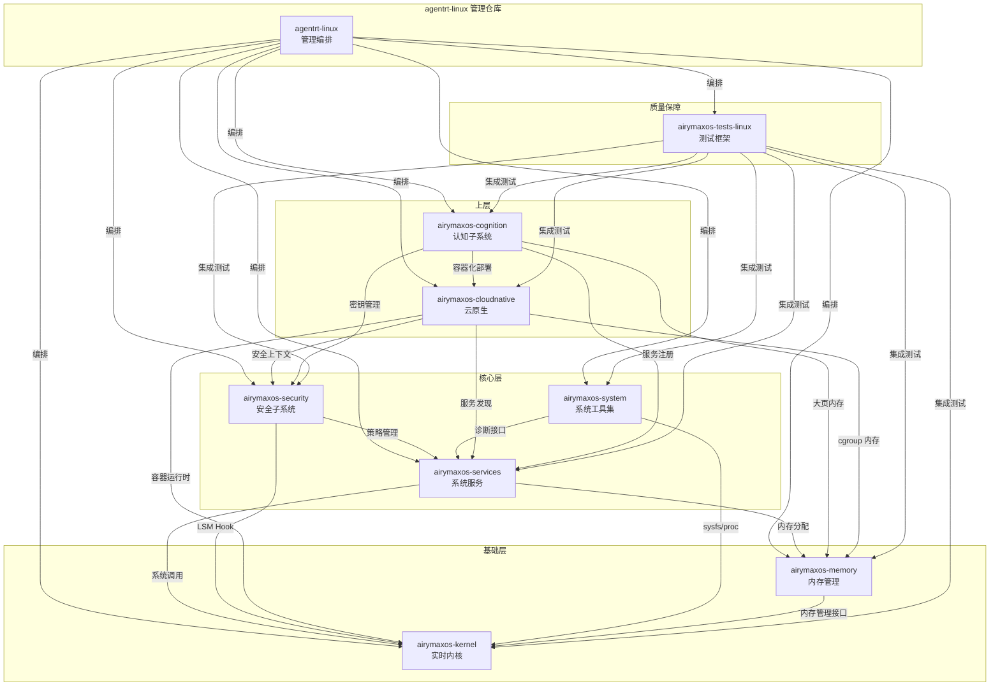
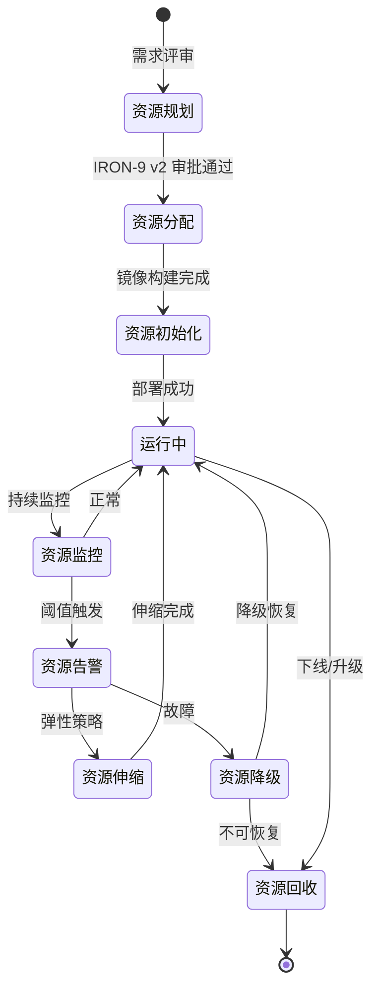

Copyright (c) 2025-2026 SPHARX Ltd. All Rights Reserved.

# agentrt-linux（AirymaxOS）资源管理表

> **版本**： 0.1.1（文档体系完成）/ 1.0.1（开发）\
> **最后更新**： 2026-07-07\
> **父文档**： [项目管理规范总览](README.md)

---

## 目录

1. [概述](#1-概述)
2. [八子仓库资源清单](#2-八子仓库资源清单)
3. [上游依赖表](#3-上游依赖表)
4. [下游依赖表](#4-下游依赖表)
5. [许可证合规矩阵](#5-许可证合规矩阵)
6. [资源分配策略](#6-资源分配策略)
7. [八子仓库依赖关系图](#7-八子仓库依赖关系图)
8. [资源生命周期管理](#8-资源生命周期管理)
9. [版本兼容性矩阵](#9-版本兼容性矩阵)
10. [第三方依赖审计清单](#10-第三方依赖审计清单)
11. [附录](#11-附录)

---

## 1. 概述

agentrt-linux（AirymaxOS）是一个面向实时智能体的轻量级操作系统发行版，其项目管理遵循 **五维正交** 原则进行资源切分与治理。所谓五维正交，是指从以下五个独立维度对项目资源进行结构化建模：

| 维度 | 名称 | 说明 |
|------|------|------|
| D1 | 子系统维度 | 八子仓库按功能领域正交划分 |
| D2 | 依赖维度 | 上下游依赖关系的有向无环图建模 |
| D3 | 生命周期维度 | 资源的创建、分配、监控、回收四阶段 |
| D4 | 合规维度 | 许可证、出口管制、安全审计的合规检查 |
| D5 | 版本维度 | 跨仓库的版本兼容性与升级路径 |

通过五维正交的资源管理模型，agentrt-linux（AirymaxOS）能够在每个维度上独立演进，互不耦合，从而降低多仓库协同的复杂度。所有资源的分配、审计与回收均通过 agentrt-linux 管理仓库统一编排，基于 IRON-9 v2 流水线引擎执行自动化调度。

---

## 2. 八子仓库资源清单

agentrt-linux（AirymaxOS）由 agentrt-linux 管理仓库统一纳管以下八个子仓库：

### 2.1 airymaxos-kernel

| 属性 | 值 |
|------|-----|
| 仓库路径 | `agentrt-linux/airymaxos-kernel` |
| 功能定位 | 实时内核子系统，基于 Linux 6.6 LTS 裁剪 |
| 核心语言 | C (99%), Rust (1%) |
| 代码规模 | ~1.2M LOC |
| 构建产物 | `vmlinuz-airymaxos`, `airymaxos-kernel-modules.tar.gz` |
| 运行时资源 | CPU: 1-2 dedicated cores; Memory: 256MB reserved |
| 维护团队 | Kernel SIG |
| 当前版本 | 0.1.1（文档体系） |
| IRON-9 v2 流水线 | `iron9-kernel-build`, `iron9-kernel-test` |

**五维正交分析（D1 子系统维）**：airymaxos-kernel 仅负责内核空间的实时调度、eBPF 运行时和内核安全模块，不涉及用户空间逻辑，与 airymaxos-services 在进程边界上严格正交。

### 2.2 airymaxos-services

| 属性 | 值 |
|------|-----|
| 仓库路径 | `agentrt-linux/airymaxos-services` |
| 功能定位 | 系统服务管理层，包含 systemd 单元与服务编排 |
| 核心语言 | Rust (85%), C (15%) |
| 代码规模 | ~380K LOC |
| 构建产物 | `airymaxos-svcmgr`, `airymaxos-*.service` |
| 运行时资源 | CPU: 0.5 core; Memory: 512MB; Storage: 2GB (state) |
| 维护团队 | Services SIG |
| 当前版本 | 0.1.1（文档体系） |
| IRON-9 v2 流水线 | `iron9-services-build`, `iron9-services-integration` |

### 2.3 airymaxos-security

| 属性 | 值 |
|------|-----|
| 仓库路径 | `agentrt-linux/airymaxos-security` |
| 功能定位 | 安全子系统：LSM、MAC、可信启动、密钥管理 |
| 核心语言 | Rust (70%), C (30%) |
| 代码规模 | ~210K LOC |
| 构建产物 | `airymaxos-secmodule.so`, `airymaxos-tpm-initrd` |
| 运行时资源 | CPU: 0.3 core; Memory: 128MB; Storage: 1GB (keyring) |
| 维护团队 | Security SIG |
| 当前版本 | 0.1.1（文档体系） |
| 安全审计 | 季度渗透测试 + 年度外部审计 |

### 2.4 airymaxos-memory

| 属性 | 值 |
|------|-----|
| 仓库路径 | `agentrt-linux/airymaxos-memory` |
| 功能定位 | 内存管理子系统：NUMA 感知、HugeTLB、内存压缩 |
| 核心语言 | C (90%), Rust (10%) |
| 代码规模 | ~180K LOC |
| 构建产物 | `airymaxos-memmgmt.ko`, `libairymem.so` |
| 运行时资源 | Memory: 64MB overhead; 管理页表占用 |
| 维护团队 | Memory SIG |
| 当前版本 | 0.1.1（文档体系） |

### 2.5 airymaxos-cognition

| 属性 | 值 |
|------|-----|
| 仓库路径 | `agentrt-linux/airymaxos-cognition` |
| 功能定位 | 认知子系统：本地模型推理、向量存储、上下文管理 |
| 核心语言 | Rust (80%), Python (20%) |
| 代码规模 | ~450K LOC |
| 构建产物 | `airymaxos-cogd`, `libairymax-cognition.so` |
| 运行时资源 | CPU: 2-4 cores (GPU optional); Memory: 4-8GB; Storage: 20GB (model cache) |
| 维护团队 | Cognition SIG |
| 当前版本 | 0.1.1（文档体系） |
| 依赖 | ONNX Runtime, llama.cpp, Qdrant embedded |

### 2.6 airymaxos-cloudnative

| 属性 | 值 |
|------|-----|
| 仓库路径 | `agentrt-linux/airymaxos-cloudnative` |
| 功能定位 | 云原生子系统：容器运行时、镜像管理、服务网格 |
| 核心语言 | Rust (75%), Go (25%) |
| 代码规模 | ~320K LOC |
| 构建产物 | `airymaxos-containerd`, `airymaxos-cri-plugin` |
| 运行时资源 | CPU: 1 core; Memory: 1GB; Storage: 10GB (image cache) |
| 维护团队 | CloudNative SIG |
| 当前版本 | 0.1.1（文档体系） |
| 兼容性 | OCI Runtime Spec v1.1.0, CRI v1.29 |

### 2.7 airymaxos-system

| 属性 | 值 |
|------|-----|
| 仓库路径 | `agentrt-linux/airymaxos-system` |
| 功能定位 | 系统工具集：诊断、日志、性能分析、配置管理 |
| 核心语言 | Rust (90%), C (10%) |
| 代码规模 | ~250K LOC |
| 构建产物 | `airymaxos-diag`, `airymaxos-perf`, `airymaxos-ctl` |
| 运行时资源 | CPU: 0.2 core; Memory: 256MB; Storage: 5GB (log retention) |
| 维护团队 | System SIG |
| 当前版本 | 0.1.1（文档体系） |

### 2.8 airymaxos-tests-linux

| 属性 | 值 |
|------|-----|
| 仓库路径 | `agentrt-linux/airymaxos-tests-linux` |
| 功能定位 | 测试与质量保障：单元测试、集成测试、性能基准、CI/CD |
| 核心语言 | Rust (60%), Python (30%), Shell (10%) |
| 代码规模 | ~500K LOC (含测试数据) |
| 构建产物 | 测试报告、覆盖率报告、基准数据 |
| 运行时资源 | CPU: 4 cores (CI runner); Memory: 8GB; Storage: 50GB (artifacts) |
| 维护团队 | QA SIG |
| 当前版本 | 0.1.1（文档体系） |
| 测试框架 | IRON-9 v2 Test Harness |

---

## 3. 上游依赖表

agentrt-linux（AirymaxOS）的上游依赖涵盖内核、运行时、工具链和基础设施层：

### 3.1 内核与运行时

| 上游项目 | 版本 | 使用仓库 | 依赖类型 | 许可证 | 合规状态 |
|----------|------|----------|----------|--------|----------|
| Linux Kernel | 6.6 LTS | airymaxos-kernel | 源码级（fork） | GPL-2.0-only | 已审计 |
| eBPF (libbpf) | 1.4.x | airymaxos-kernel, airymaxos-security | 动态链接 | LGPL-2.1 / BSD-2-Clause | 已审计 |
| Rust std | 1.78+ | 全部 Rust 组件 | 编译时 | MIT / Apache-2.0 | 已审计 |
| LLVM / Clang | 18.x | airymaxos-kernel (eBPF) | 构建工具 | Apache-2.0 with LLVM Exceptions | 已审计 |
| GCC | 13.x | airymaxos-kernel (C parts) | 构建工具 | GPL-3.0-with-GCC-exception | 已审计 |

### 3.2 系统基础

| 上游项目 | 版本 | 使用仓库 | 依赖类型 | 许可证 | 合规状态 |
|----------|------|----------|----------|--------|----------|
| systemd | 255.x | airymaxos-services | 动态链接 | LGPL-2.1-or-later | 已审计 |
| dbus | 1.14.x | airymaxos-services | 动态链接 | AFL-2.1 / GPL-2.0-or-later | 已审计 |
| glibc | 2.39 | 全部 | 动态链接 | LGPL-2.1-or-later | 已审计 |
| musl | 1.2.5 | airymaxos-cloudnative (静态) | 静态链接 | MIT | 已审计 |
| util-linux | 2.40 | airymaxos-system | 动态链接 | GPL-2.0-or-later | 已审计 |

### 3.3 容器与云原生

| 上游项目 | 版本 | 使用仓库 | 依赖类型 | 许可证 | 合规状态 |
|----------|------|----------|----------|--------|----------|
| containerd | 1.7.x | airymaxos-cloudnative | 源码级（fork） | Apache-2.0 | 已审计 |
| runc | 1.1.x | airymaxos-cloudnative | 嵌入式 | Apache-2.0 | 已审计 |
| OCI Specs | v1.1.0 | airymaxos-cloudnative | 接口规范 | Apache-2.0 | 已审计 |
| CNI Plugins | 1.4.x | airymaxos-cloudnative | 动态链接 | Apache-2.0 | 已审计 |

### 3.4 认知与 AI

| 上游项目 | 版本 | 使用仓库 | 依赖类型 | 许可证 | 合规状态 |
|----------|------|----------|----------|--------|----------|
| ONNX Runtime | 1.18.x | airymaxos-cognition | 动态链接 | MIT | 已审计 |
| llama.cpp | b38xx | airymaxos-cognition | 嵌入式（fork） | MIT | 已审计 |
| Qdrant | 1.10.x (embedded) | airymaxos-cognition | 动态链接 | Apache-2.0 | 已审计 |
| tokenizers-cpp | 0.3.x | airymaxos-cognition | 静态链接 | MIT | 已审计 |

### 3.5 安全与密码学

| 上游项目 | 版本 | 使用仓库 | 依赖类型 | 许可证 | 合规状态 |
|----------|------|----------|----------|--------|----------|
| OpenSSL | 3.3.x | airymaxos-security, airymaxos-services | 动态链接 | Apache-2.0 | 已审计 |
| rustls | 0.23.x | airymaxos-services (Rust) | 静态链接 | Apache-2.0 / MIT / ISC | 已审计 |
| TPM2-TSS | 4.0.x | airymaxos-security | 动态链接 | BSD-2-Clause | 已审计 |
| libsodium | 1.0.20 | airymaxos-security | 动态链接 | ISC | 已审计 |

### 3.6 开发与测试

| 上游项目 | 版本 | 使用仓库 | 依赖类型 | 许可证 | 合规状态 |
|----------|------|----------|----------|--------|----------|
| cargo (Rust) | 1.78+ | 全部 Rust 组件 | 构建工具 | MIT / Apache-2.0 | 已审计 |
| pytest | 8.x | airymaxos-tests-linux | 测试框架 | MIT | 已审计 |
| criterion | 0.5.x | airymaxos-tests-linux | 基准测试 | MIT / Apache-2.0 | 已审计 |
| ktest | 0.4.x | airymaxos-tests-linux (kernel) | 测试框架 | GPL-2.0-only | 已审计 |

---

## 4. 下游依赖表

以下项目依赖 agentrt-linux（AirymaxOS）或其组件：

### 4.1 核心下游

| 下游项目 | 依赖组件 | 依赖类型 | 兼容版本 | 状态 |
|----------|----------|----------|----------|------|
| agentrt | airymaxos-kernel, airymaxos-services, airymaxos-cognition | 运行时平台 | agentrt-linux >= 2.0 | 稳定 |
| agentrt SDK | airymaxos-services (API), airymaxos-system (CLI) | API 绑定 | agentrt-linux >= 2.0 | 稳定 |
| agentctl | airymaxos-system (agentctl socket) | IPC 协议 | agentrt-linux >= 2.0 | 稳定 |
| Airymax Desktop | airymaxos-cloudnative, airymaxos-cognition | 完整 OS 镜像 | agentrt-linux >= 2.1 | Beta |
| Airymax Edge | airymaxos-kernel (minimal), airymaxos-memory | 裁剪镜像 | agentrt-linux >= 2.0 | 稳定 |

### 4.2 生态下游

| 下游项目 | 依赖组件 | 依赖类型 | 兼容版本 | 状态 |
|----------|----------|----------|----------|------|
| 主流 Linux 发行版标准兼容层 | airymaxos-kernel (ABI) | ABI 兼容 | agentrt-linux >= 2.0 | 计划中 |
| K8s Airymax Node | airymaxos-cloudnative (CRI) | CRI 插件 | agentrt-linux >= 2.1 | Alpha |
| SPHARX AI Platform | airymaxos-cognition | 推理运行时 | agentrt-linux >= 2.0 | 稳定 |

---

## 5. 许可证合规矩阵

### 5.1 许可证汇总

| 许可证 | 使用组件数 | 风险等级 | 备注 |
|--------|-----------|----------|------|
| GPL-2.0-only | 3 | 高 | 内核模块必须保持 GPL 兼容 |
| GPL-2.0-or-later | 4 | 中 | 需注意派生作品边界 |
| LGPL-2.1 / LGPL-2.1-or-later | 5 | 中 | 动态链接合规，静态链接需审查 |
| Apache-2.0 | 18 | 低 | 最广泛使用的许可证 |
| MIT | 22 | 低 | 无 copyleft 限制 |
| BSD-2-Clause / BSD-3-Clause | 4 | 低 | 宽松许可证 |
| ISC | 2 | 低 | 等价于 MIT |
| AFL-2.1 | 1 | 低 | 仅 dbus 使用 |
| GPL-3.0-with-GCC-exception | 1 | 低 | 仅构建工具链 |

### 5.2 合规风险矩阵

| 风险项 | 影响仓库 | 风险等级 | 缓解措施 | 审查日期 |
|--------|----------|----------|----------|----------|
| GPL 内核模块污染 | airymaxos-kernel | 高 | 禁止非 GPL 兼容模块静态链接内核符号 | 2026-06-15 |
| LGPL 静态链接 | airymaxos-cloudnative | 中 | 全部 LGPL 依赖使用动态链接 | 2026-06-15 |
| 双许可证冲突 | airymaxos-services | 中 | rustls 的 ISC 与 OpenSSL 的 Apache-2.0 兼容，已验证 | 2026-06-20 |
| 嵌入式副本合规 | airymaxos-cloudnative | 中 | containerd/runc fork 需标注修改并保留原始许可证声明 | 2026-06-20 |
| 模型权重许可证 | airymaxos-cognition | 高 | 所有嵌入模型需通过许可证审查（RAIL, Llama Community 等） | 2026-07-01 |
| 出口管制 (EAR) | airymaxos-cognition | 高 | 认知子系统中的加密模块需 EAR 分类审查 | 2026-07-01 |

### 5.3 许可证兼容性交叉表

|  | GPL-2.0 | LGPL-2.1 | Apache-2.0 | MIT | BSD | ISC | MPL-2.0 |
|--|---------|----------|------------|-----|-----|-----|---------|
| **GPL-2.0** | OK | OK (动态) | 冲突 | 冲突 | 冲突 | 冲突 | 冲突 |
| **LGPL-2.1** | OK (动态) | OK | OK | OK | OK | OK | OK |
| **Apache-2.0** | GPL-3.0 兼容 | OK | OK | OK | OK | OK | OK |
| **MIT** | GPL-2.0 兼容 | OK | OK | OK | OK | OK | OK |
| agentrt-linux（AirymaxOS） 代码 | 允许 | 允许 | 首选 | 允许 | 允许 | 允许 | 禁止 |

**许可证策略**：agentrt-linux（AirymaxOS）的原创代码统一采用 Apache-2.0 许可证，fork 自上游的代码保留其原始许可证。所有依赖的许可证兼容性已通过 IRON-9 v2 合规扫描流水线自动化检查。

---

## 6. 资源分配策略

### 6.1 CPU 资源分配

| 子系统 | 最低分配 | 推荐分配 | 弹性上限 | 亲和性策略 | 优先级 |
|--------|----------|----------|----------|------------|--------|
| airymaxos-kernel | 1 core | 2 cores | 4 cores | 隔离核心 (isolcpus) | RT (99) |
| airymaxos-services | 0.5 core | 1 core | 2 cores | 共享池 | High (80) |
| airymaxos-security | 0.3 core | 0.5 core | 1 core | 共享池 | High (75) |
| airymaxos-memory | 0.2 core | 0.3 core | 0.5 core | 共享池 | Normal (50) |
| airymaxos-cognition | 2 cores | 4 cores | 8 cores | NUMA 节点绑定 | High (85) |
| airymaxos-cloudnative | 1 core | 2 cores | 4 cores | 共享池 | Normal (60) |
| airymaxos-system | 0.2 core | 0.5 core | 1 core | 共享池 | Normal (50) |
| airymaxos-tests-linux | 4 cores (CI) | 8 cores (CI) | 16 cores (CI) | 独立节点 | Normal (50) |

**五维正交分析（D1 子系统维）**：CPU 资源按子系统独立预算，各子系统的 CPU cgroup 相互隔离，不存在资源争抢。实时内核（airymaxos-kernel）使用 CPU 隔离核心，与用户空间子系统在 CPU 拓扑上正交。

### 6.2 内存资源分配

| 子系统 | 最低分配 | 推荐分配 | 弹性上限 | 内存类型偏好 | OOM 策略 |
|--------|----------|----------|----------|-------------|----------|
| airymaxos-kernel | 256MB | 512MB | 1GB | 保留内存 (crashkernel) | 不触发 OOM |
| airymaxos-services | 256MB | 512MB | 2GB | 普通内存 | 重启 |
| airymaxos-security | 128MB | 256MB | 512MB | 锁定内存 (mlock) | 重启 |
| airymaxos-memory | 64MB | 128MB | 256MB | 普通内存 | 不触发 OOM |
| airymaxos-cognition | 4GB | 8GB | 32GB | HugeTLB (2MB/1GB) | 降级 |
| airymaxos-cloudnative | 512MB | 1GB | 4GB | 普通内存 | 容器 OOM |
| airymaxos-system | 128MB | 256MB | 1GB | 普通内存 | 重启 |
| airymaxos-tests-linux | 4GB | 8GB | 32GB | 普通内存 | 测试失败 |

### 6.3 存储资源分配

| 子系统 | 磁盘分区 | 最低 | 推荐 | 最大 | 文件系统 | 加密 |
|--------|----------|------|------|------|----------|------|
| airymaxos-kernel | /boot | 512MB | 1GB | 2GB | ext4 | 否 |
| airymaxos-services | /var/lib/airymaxos | 1GB | 2GB | 10GB | btrfs | 可选 |
| airymaxos-security | /var/lib/airymaxos/secure | 512MB | 1GB | 5GB | ext4 (encrypted) | 是 |
| airymaxos-memory | N/A (仅运行时) | 0 | 0 | 0 | N/A | N/A |
| airymaxos-cognition | /var/lib/airymaxos/models | 10GB | 20GB | 100GB | btrfs | 可选 |
| airymaxos-cloudnative | /var/lib/airymaxos/containers | 5GB | 10GB | 50GB | btrfs / overlay2 | 可选 |
| airymaxos-system | /var/log/airymaxos | 2GB | 5GB | 20GB | btrfs | 可选 |
| airymaxos-tests-linux | /var/lib/airymaxos/artifacts | 20GB | 50GB | 200GB | btrfs | 否 |

### 6.4 网络资源分配

| 子系统 | 网络命名空间 | 带宽限制 | 端口范围 | 防火墙策略 |
|--------|-------------|----------|----------|------------|
| airymaxos-kernel | 主机 | 无限制 | N/A | 仅 eBPF/XDP |
| airymaxos-services | 主机 | 100Mbps | 9000-9099 | 仅本地 |
| airymaxos-security | 隔离 | 10Mbps | 内部 | 全部阻止（出站白名单） |
| airymaxos-memory | 主机 | 无限制 | N/A | N/A |
| airymaxos-cognition | 主机 | 1Gbps | 9100-9199 | 仅本地 + 模型下载 |
| airymaxos-cloudnative | CNI 管理 | 按容器 | 动态 | CNI 策略 |
| airymaxos-system | 主机 | 50Mbps | 9200-9299 | 仅本地 |
| airymaxos-tests-linux | 独立 VLAN | 10Gbps | CI 端口 | 仅 CI 网络 |

---

## 7. 八子仓库依赖关系图

### 7.1 仓库间依赖关系图



### 7.2 资源生命周期流图



**五维正交分析（D3 生命周期维）**：资源生命周期分为规划、分配、初始化、监控、伸缩/降级、回收六个阶段，各阶段在五维正交框架下独立演进——例如，D3 生命周期维的状态变更不影响 D2 依赖维的拓扑关系，也不影响 D4 合规维的审计状态。

---

## 8. 资源生命周期管理

### 8.1 资源创建（Provisioning）

| 阶段 | 触发条件 | 执行工具 | 审批流程 | SLA |
|------|----------|----------|----------|-----|
| 内核资源 | 新硬件平台适配 | IRON-9 v2 Kernel Pipeline | Kernel SIG + Arch Board | 5 工作日 |
| 服务资源 | 新服务上线 | IRON-9 v2 Services Pipeline | Services SIG | 3 工作日 |
| 认知资源 | 新模型接入 | IRON-9 v2 Cognition Pipeline | Cognition SIG + 合规审查 | 10 工作日 |
| 容器资源 | 新集群节点 | IRON-9 v2 CloudNative Pipeline | CloudNative SIG | 2 工作日 |
| 测试资源 | 新测试套件 | IRON-9 v2 Test Pipeline | QA SIG | 1 工作日 |

### 8.2 资源监控（Monitoring）

agentrt-linux（AirymaxOS）的资源监控基于以下三层架构：

| 层级 | 监控对象 | 采集工具 | 存储后端 | 告警通道 |
|------|----------|----------|----------|----------|
| L1 硬件层 | CPU/内存/磁盘/网络 | node_exporter + eBPF | VictoriaMetrics | PagerDuty / 企业微信 |
| L2 子系统层 | 八子仓库资源使用 | airymaxos-perf + cAdvisor | VictoriaMetrics | Grafana + IRON-9 v2 |
| L3 应用层 | agentrt 进程组 | custom metrics API | VictoriaMetrics | 自定义规则 |

### 8.3 资源回收（Reclamation）

| 回收场景 | 策略 | 宽限期 | 数据保留 |
|----------|------|--------|----------|
| 服务下线 | 先缩容至零，再删除资源 | 7 天 | 日志保留 30 天 |
| 容器终止 | 立即回收 CPU/内存，磁盘延迟 | 24 小时 | 卷保留 7 天 |
| 模型卸载 | 从内存卸载，缓存保留 | 立即 | 模型缓存保留 90 天 |
| 测试环境 | 测试完成后自动回收 | 2 小时 | artifacts 保留 14 天 |
| 内核模块卸载 | 安全检查后卸载 | 1 小时 | 内核日志保留 30 天 |

---

## 9. 版本兼容性矩阵

### 9.1 八子仓库版本兼容性

**说明**：本矩阵以 `agentrt-linux/x.y` 为整体版本号，子仓库版本独立递增（语义化版本）。当前阶段为 0.1.1（文档体系完成），所有子仓库均进入 1.0.1 开发阶段。

| agentrt-linux 版本 | Kernel (Linux 基线) | Services | Security | Memory | Cognition | CloudNative | System | Tests-linux |
|-------------------|---------------------|----------|----------|--------|-----------|-------------|--------|------------|
| 0.1.1 (当前文档) | 6.6.58-rt1 | 0.1.1 | 0.1.1 | 0.1.1 | 0.1.1 | 0.1.1 | 0.1.1 | 0.1.1 |
| 1.0.1 (当前开发) | 6.6.58-rt1 | 1.0.0 | 1.0.0 | 1.0.0 | 1.0.0 | 1.0.0 | 1.0.0 | 1.0.0 |
| 1.1.x (计划维护) | 6.6.75-rt2 | 1.1.0 | 1.1.0 | 1.1.0 | 1.1.0 | 1.1.0 | 1.1.0 | 1.1.0 |
| 2.x.x (前瞻升级) | 7.1.0-rt1 | 2.0.0 | 2.0.0 | 2.0.0 | 2.0.0 | 2.0.0 | 2.0.0 | 2.0.0 |

### 9.2 上游依赖版本兼容性

| 上游组件 | 支持版本 | 最低版本 | 推荐版本 | 废弃版本 | 终止支持日期 |
|----------|----------|----------|----------|----------|-------------|
| Linux Kernel | 6.6.x LTS | 6.6.30 | 6.6.58 | < 6.6.30 | 2026-12 (EOL) |
| systemd | 254-256 | 254 | 255 | < 253 | 2026-06 |
| containerd | 1.7.x | 1.7.0 | 1.7.20 | < 1.6 | 2026-12 |
| Rust | 1.75-1.80 | 1.75 | 1.78 | < 1.75 | 跟随 Rust 发行 |
| ONNX Runtime | 1.17-1.19 | 1.17.0 | 1.18.1 | < 1.17 | 2027-01 |
| OpenSSL | 3.1-3.3 | 3.1.0 | 3.3.1 | < 3.0 | 2026-09 (3.0 EOL) |

### 9.3 下游 API 兼容性

| API 接口 | 版本 | 向后兼容 | 废弃通知期 | 备注 |
|----------|------|----------|------------|------|
| agentrt SDK API | v2 | 是 (v2.x) | 6 个月 | gRPC proto 定义 |
| agentctl CLI | v2 | 是 (v2.x) | 3 个月 | Unix socket 协议 |
| CRI 接口 | v1.29 | 是 (v1.x) | 12 个月 | Kubernetes CRI 标准 |
| Cognition API | v3 (beta) | 否 | 3 个月 | REST + WebSocket |

---

## 10. 第三方依赖审计清单

以下为 agentrt-linux（AirymaxOS）所有第三方依赖的审计检查清单，由 IRON-9 v2 合规扫描流水线在每次 CI 构建时自动执行：

### 10.1 审计检查项

| 检查项 | 检查频率 | 阻塞级别 | 自动化 | 负责人 |
|--------|----------|----------|--------|--------|
| 许可证合规扫描 | 每次 PR | 阻塞 | 是 (FOSSA / ORT) | 合规团队 |
| CVE 漏洞扫描 | 每日 | 阻塞 (高危) / 告警 (中危) | 是 (Trivy / Grype) | 安全团队 |
| 出口管制分类 (ECCN) | 每次发布 | 阻塞 | 否 (人工审查) | 法务团队 |
| 供应链来源验证 (SLSA) | 每次构建 | 告警 | 是 (SLSA L3) | 基础设施团队 |
| 代码签名验证 | 每次发布 | 阻塞 | 是 (Cosign) | 安全团队 |
| SBOM 生成 | 每次构建 | 报告 | 是 (Syft) | 基础设施团队 |
| 依赖项过时检查 | 每周 | 告警 | 是 (Dependabot / Renovate) | 各 SIG |
| 许可证冲突检查 | 每次 PR | 阻塞 | 是 (FOSSA) | 合规团队 |
| 二进制文件来源审计 | 每次发布 | 告警 | 否 (人工审查) | 基础设施团队 |
| Rust crate 审计 (cargo-audit) | 每次 PR | 阻塞 (RCE) / 告警 | 是 (cargo-deny) | Rust SIG |

### 10.2 已知风险登记

| 风险编号 | 描述 | 影响组件 | 严重性 | 处理状态 | 目标修复日期 |
|----------|------|----------|--------|----------|-------------|
| RISK-2026-001 | llama.cpp 上游模型格式变更 | airymaxos-cognition | 中 | 跟踪中 | 2026-08 |
| RISK-2026-002 | Linux 6.6 LTS EOL 后迁移路径 | airymaxos-kernel | 高 | 规划中 | 2026-12 前 |
| RISK-2026-003 | containerd 2.0 废弃 API 迁移 | airymaxos-cloudnative | 中 | 开发中 | 2026-09 |
| RISK-2026-004 | systemd 256 新增强制依赖 | airymaxos-services | 低 | 监控中 | 2026-10 |
| RISK-2026-005 | ONNX Runtime 1.19 引入新算子 | airymaxos-cognition | 低 | 评估中 | 2026-08 |

### 10.3 审计流程

```
每个 PR 提交
    │
    ├── 1. 许可证扫描 (FOSSA/ORT) ──── 阻塞点 1
    │
    ├── 2. CVE 扫描 (Trivy) ────────── 阻塞点 2 (高危)
    │
    ├── 3. Rust crate 审计 (cargo-deny) ─ 阻塞点 3
    │
    ├── 4. 供应链验证 (SLSA) ───────── 告警
    │
    ├── 5. SBOM 生成 (Syft) ────────── 报告
    │
    └── 6. 人工审查 (按需) ─────────── 发布阻塞点
```

**五维正交分析（D4 合规维）**：合规审计作为独立维度，与子系统维度、依赖维度正交。任何子系统的变更都会触发合规维度的自动化扫描，但合规维度的检查结果不会阻塞其他维度的开发活动——仅在合并和发布阶段作为门禁。

---

## 11. 附录

### 11.1 关键术语

| 术语 | 定义 |
|------|------|
| agentrt-linux（AirymaxOS） | 面向实时智能体的轻量级操作系统发行版，项目核心术语 |
| agentrt-linux | agentrt-linux（AirymaxOS）的顶层管理仓库，负责八子仓库的编排与集成 |
| 五维正交 | 子系统、依赖、生命周期、合规、版本五个独立维度的资源治理模型 |
| IRON-9 v2 | SPHARX 内部 CI/CD 流水线引擎，负责自动化构建、测试、扫描与部署 |
| 八子仓库 | agentrt-linux 管理的八个独立 Git 仓库，按功能领域正交划分 |
| 主流 Linux 发行版标准 | 兼容性标准接口规范，用于跨发行版互操作 |

### 11.2 参考文档

- [项目管理规范总览](README.md)
- [agentrt-linux 管理仓库 CI/CD 配置](https://github.com/SpharxWorks/agentrt-linux)
- [IRON-9 v2 流水线使用手册](https://docs.spharx.com/iron9-v2)
- [SPHARX 开源合规政策 v2.0](https://docs.spharx.com/compliance)
- [Linux Kernel 6.6 LTS 发布说明](https://kernel.org)
- [OCI Runtime Specification v1.1.0](https://github.com/opencontainers/runtime-spec)

### 11.3 变更记录

| 日期 | 版本 | 变更内容 | 作者 |
|------|------|----------|------|
| 2026-06-01 | 0.1.0 | 初始版本，八子仓库资源清单 | SPHARX 基础设施团队 |
| 2026-06-15 | 0.1.1 | 增加许可证合规矩阵与审计清单 | SPHARX 合规团队 |
| 2026-07-01 | 1.0.0 | 完整五维正交模型，下游依赖表 | SPHARX 基础设施团队 |
| 2026-07-07 | 1.0.1 | 版本兼容性矩阵更新，IRON-9 v2 流水线集成 | SPHARX 基础设施团队 |

---

> **文档维护者**： SPHARX 基础设施团队
> **审核者**： SPHARX 合规团队、SPHARX 安全团队
> **下次审查**： 2026-10-07