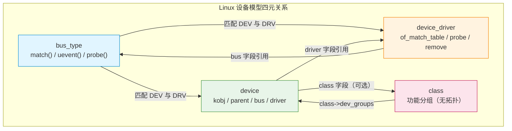
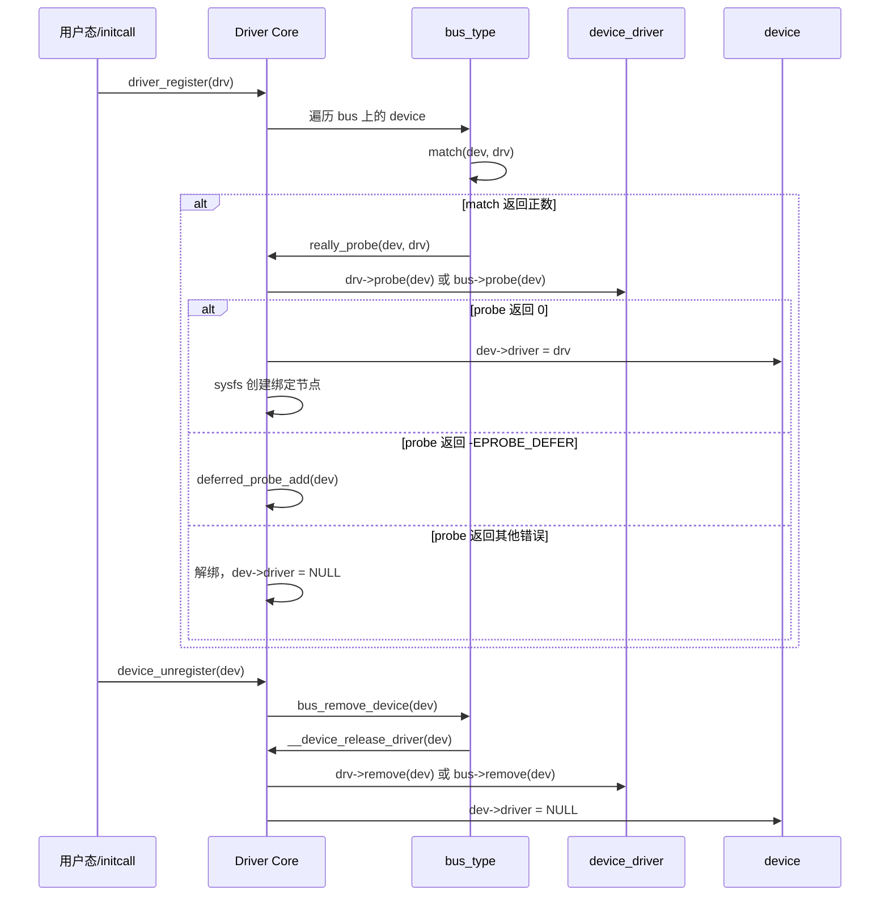
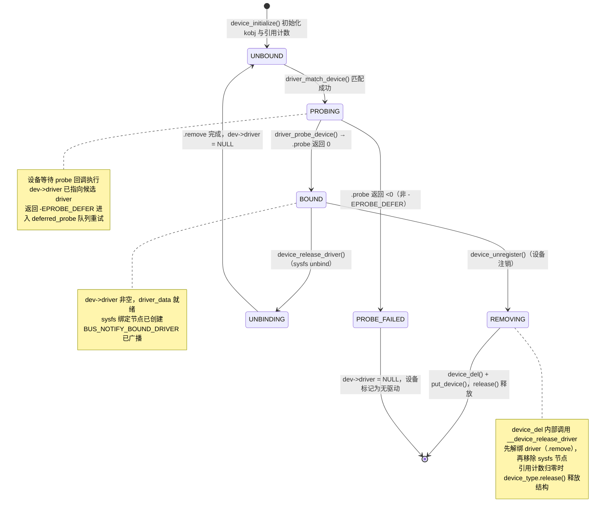
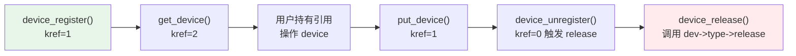
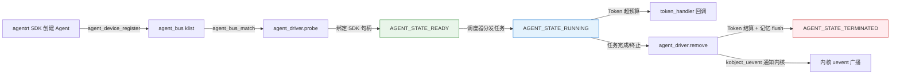

Copyright (c) 2025-2026 SPHARX Ltd. All Rights Reserved.

# agentrt-linux（AirymaxOS）驱动模型 — device/driver/bus 三元组详解
> **文档定位**：agentrt-linux（AirymaxOS）驱动子系统 60 模块首篇——device/driver/bus/class 四元关系核心抽象\
> **文档版本**：0.1.1\
> **最后更新**：2026-07-06\
> **上级文档**：[agentrt-linux 设计文档](README.md)\
> **同源映射**：agentrt `daemons`（用户态服务）+ Linux 6.6 `drivers/base/`（device/driver/bus/class 实现）\
> **理论根基**：Linux 6.6 内核基线 + Airymax 五维正交 24 原则\
> **核心约束**：IRON-9 v2 同源且部分代码共享——继承 Linux 设备模型语义，不耦合上游发行版实现

---

## 1. 概述

Linux 设备模型核心可一句话概括："**device 描述有什么，driver 描述如何做，bus 负责把两者绑在一起**"。agentrt-linux 选择 Linux 6.6 内核基线作为驱动模型同源起点——这是经过最广泛硬件生态验证的解耦哲学。MicroCoreRT 在用户态重新实现智能体调度，AgentsIPC 在用户态承载进程间通信，而内核态硬件抽象层完整继承这套三元组。

本文档覆盖 device/driver/bus/class 四元关系、probe/remove 生命周期、name/OF/ACPI 三源匹配、sysfs 导出、kref/kobject 引用计数五大主题。IRON-9 v2 同源且部分代码共享体现为：内核态结构体与上游保持语义等价（确保可直接复用上游驱动代码）；用户态扩展（`agent_bus_type`、`devm_airy_*` 资源族）不进入上游内核，而是作为 agentrt-linux 专属扩展通过 `agentrt/daemon/` 适配器接入。

| 层次 | 来源 | 演进策略 |
|------|------|---------|
| `struct device` / `struct device_driver` / `struct bus_type` | Linux 6.6 `include/linux/device.h` | 跟随上游，按需 backport |
| `struct kref` / `struct kobject` | Linux 6.6 `include/linux/kref.h` | 跟随上游 |
| `agent_bus_type` / `devm_airy_*` | agentrt-linux 自研 | 独立演进，不回传上游 |

> **OS-DRV-001**： 内核态设备模型结构体（`device`/`device_driver`/`bus_type`/`class`/`kref`/`kobject`）的字段、签名、生命周期语义必须与 Linux 6.6 内核基线保持二进制兼容。任何扩展通过包装结构实现（不使用内核 ABI 预留槽位，与 IRON-1 一致）。

> **OS-DRV-002**： agentrt-linux 用户态扩展不得在内核态引入新的总线类型；它们必须作为用户态 daemon 实现，通过 `syscalls.h` 与 MicroCoreRT 通信。

---

## 2. device/driver/bus/class 四元关系

### 2.1 四元角色

| 角色 | 内核类型 | 头文件 | 职责 | agentrt-linux 类比 |
|------|---------|--------|------|----------------|
| **device** | `struct device` | `include/linux/device.h` | 描述硬件或虚拟设备实例（资源、属性、状态） | Agent 实例（含 SDK 句柄） |
| **driver** | `struct device_driver` | `include/linux/device/driver.h` | 描述如何操作设备（probe/remove/PM 回调） | Agent 实现模块 |
| **bus** | `struct bus_type` | `include/linux/device/bus.h` | 匹配 device 与 driver，承载总线级回调 | `agent_bus_type`（用户态） |
| **class** | `struct class` | `include/linux/device/class.h` | 按功能分组设备（无拓扑含义） | Agent 角色分组 |

### 2.2 关键结构体字段

`struct device`（节选自 Linux 6.6 `include/linux/device.h` 第 712 行）：

```c
struct device {
    struct kobject       kobj;          /* sysfs 节点 + 引用计数载体 */
    struct device       *parent;        /* 拓扑父设备 */
    struct device_private *p;           /* 驱动核心私有数据 */
    const char          *init_name;     /* 初始名称 */
    const struct device_type *type;     /* 设备类型回调 */
    const struct bus_type *bus;          /* 设备所在总线 */
    struct device_driver *driver;        /* 已绑定的 driver */
    void                *driver_data;   /* 驱动私有数据，dev_set_drvdata 访问 */
    struct mutex         mutex;          /* 同步访问该设备的调用 */
    struct dev_links_info links;         /* 设备链接（supplier/consumer） */
    struct dev_pm_info   power;         /* 电源管理信息 */
    struct dev_pm_domain *pm_domain;    /* 电源域 */
};
```

`struct device_driver`（节选自 Linux 6.6 `include/linux/device/driver.h` 第 96 行）核心字段：`name`、`bus`、`owner`、`probe_type`（同步/异步探测）、`of_match_table`、`acpi_match_table`，回调 `probe`/`remove`/`shutdown`/`suspend`/`resume`，以及 `groups`/`dev_groups`/`pm` 用于 sysfs 与电源管理。

`struct bus_type`（节选自 Linux 6.6 `include/linux/device/bus.h` 第 80 行）核心字段：`name`、`match`、`uevent`、`probe`、`remove`、`shutdown`、`suspend`/`resume`、`dma_configure`、`pm`。`match` 回调是绑定入口，返回正数表示匹配成功。

> **OS-STD-DRV-010**： 任何 agentrt-linux 内核态 driver 必须通过 `driver_register()` 注册，禁止绕过驱动核心直接调用 `probe`。

> **OS-DRV-003**： 自定义总线必须实现 `match` 回调；`probe`/`remove` 回调可委托给 driver 自身，但 `match` 不能为空。

### 2.3 四元关系图



### 2.4 解耦的三层含义

解耦有三层含义：**生命周期解耦**（device 先注册会等待 driver 的 deferred probe；driver 先注册会立即扫描已存在 device）、**多对多关系解耦**（同一 driver 可服务多个同类 device，如 4 个 UART 端口共享一个 8250 driver；同一 device 在不同时刻可被不同 driver 接管）、**失败隔离解耦**（单个 driver 的 probe 失败不会拖垮总线上的其他 driver——这是 K-3 服务隔离原则在内核态的体现）。

> **OS-DRV-004**： driver 的 `probe` 回调失败必须返回负数错误码。返回 `-EPROBE_DEFER` 触发延迟重试机制，其他错误立即解绑。

---

## 3. probe/remove 生命周期

### 3.1 完整生命周期时序



### 3.2 probe 回调契约与示例

`probe` 是 driver 与 device 第一次"握手"。前置条件：`dev->driver` 已指向当前 driver；`dev` 的资源（`resource`、`of_node`、`fwnode`）已就绪。后置条件：成功返回 0 时 driver 已完成所有初始化；失败返回 `-Exxx` 时必须回滚所有已分配资源。所有权：driver 通过 `dev_set_drvdata(dev, priv)` 持有 `priv` 指针。线程安全性：probe 与 remove 互斥，但与 sysfs show/store 并发——driver 内部仍需保护。

```c
struct my_priv { void __iomem *base; int irq; struct mutex lock; };

static int my_probe(struct platform_device *pdev)
{
    struct device *dev = &pdev->dev;
    struct my_priv *priv;
    int ret;

    /* 1. 分配私有数据 — devm_kzalloc 自动在 detach 时释放（E-3 资源确定性） */
    priv = devm_kzalloc(dev, sizeof(*priv), GFP_KERNEL);
    if (!priv) return -ENOMEM;

    /* 2. 映射寄存器 — devm_platform_ioremap_resource 同样托管 */
    priv->base = devm_platform_ioremap_resource(pdev, 0);
    if (IS_ERR(priv->base)) return PTR_ERR(priv->base);

    /* 3. 注册中断 — devm_request_irq 托管 */
    priv->irq = platform_get_irq(pdev, 0);
    if (priv->irq < 0) return priv->irq;
    ret = devm_request_irq(dev, priv->irq, my_irq_handler, 0, dev_name(dev), priv);
    if (ret) return ret;  /* devm 资源自动回滚 */

    mutex_init(&priv->lock);
    platform_set_drvdata(pdev, priv);
    return 0;
}
```

### 3.3 remove 回调对称性

`remove` 是 `probe` 的严格逆操作：顺序逆（`probe` 最后做的事 `remove` 最先撤销）、可重入（`remove` 期间设备可能仍在中断中，必须先 `disable_irq` 再释放）、不可失败（Linux 6.6 起 `platform_driver.remove_new()` 返回 `void`，驱动核心忽略返回值）。

```c
/* remove_new 返回 void — Linux 6.6 推荐签名 */
static void my_remove_new(struct platform_device *pdev)
{
    struct my_priv *priv = platform_get_drvdata(pdev);
    my_hw_disable_irq(priv);       /* 先禁用硬件中断源 */
    synchronize_irq(priv->irq);    /* 等待已触发中断完成 */
    mutex_destroy(&priv->lock);    /* devm 资源由驱动核心自动释放 */
}
```

> **OS-DRV-005**： 新增 driver 必须实现 `.remove_new()`（返回 `void`）而非 `.remove()`（返回 `int`）。后者在 Linux 6.6 已被标记为过渡期 API，返回值被忽略，易让维护者误以为可报错。

> **OS-DRV-006**： `remove` 实现必须保证 `probe` 中所有非 `devm_` 托管的资源都被显式释放。`remove` 不能访问即将被 `devm_` 释放的资源（如已映射的寄存器），需先复制出必要的硬件状态。

### 3.4 设备生命周期状态机

设备从初始化到驱动绑定/解绑/移除的完整状态转换，覆盖 `device_initialize` → `driver_probe_device` → `device_release_driver` → `device_unregister` 全链路：



**状态转换条件**：

| 从状态 | 到状态 | 触发条件 | 系统行为 |
|--------|--------|---------|---------|
| — | UNBOUND | `device_initialize()` 初始化 kobj/mutex，引用计数置 1 | 设备进入 `klist_devices`，等待匹配 |
| UNBOUND | PROBING | `driver_match_device()` 返回正数，`really_probe()` 被调用 | `dev->driver` 指向候选 driver，bus 通知 `BIND_DRIVER` |
| PROBING | BOUND | `driver_probe_device()` → `.probe()` 返回 0 | `sysfs` 创建绑定节点，广播 `BOUND_DRIVER` |
| PROBING | PROBE_FAILED | `.probe()` 返回 <0（非 `-EPROBE_DEFER`） | `dev->driver = NULL`，`driver_sysfs_remove` 清理 |
| PROBING | PROBING | `.probe()` 返回 `-EPROBE_DEFER` | `deferred_probe_add()` 加入重试队列 |
| BOUND | UNBINDING | `device_release_driver()`（sysfs `unbind` 写入） | `__device_release_driver()` 调用 `.remove` |
| BOUND | REMOVING | `device_unregister()`（设备注销） | `device_del()` 移除 sysfs 并触发解绑 |
| UNBINDING | UNBOUND | `.remove` 回调完成，`dev->driver = NULL` | 设备回到 `klist_devices`，可重新匹配 |
| REMOVING | [*] | `device_del()` + `put_device()`，引用计数归零 | `device_type.release()` 释放设备结构 |
| PROBE_FAILED | [*] | 设备标记为无驱动，不再尝试匹配 | 等待新 driver 注册或设备注销 |

---

## 4. 匹配机制 name/OF/ACPI

### 4.1 三源匹配优先级

Linux 6.6 `platform_match()`（`drivers/base/platform.c` 第 1305 行）展示了五级匹配优先级链：

| 优先级 | 匹配方式 | 来源 | 适用平台 |
|--------|---------|------|---------|
| 1 | driver_override | sysfs 用户态强制 | 调试/特殊绑定 |
| 2 | OF（Device Tree） | `of_match_table` 中的 `compatible` | ARM/ARM64/RISC-V |
| 3 | ACPI | `acpi_match_table` 中的 ACPI HID | x86 服务器/笔记本 |
| 4 | id_table | `platform_device_id` 数组 | 旧式平台设备 |
| 5 | 名称回退 | `strcmp(pdev->name, drv->name)` | 最简回退 |

```c
static int platform_match(struct device *dev, struct device_driver *drv)
{
    struct platform_device *pdev = to_platform_device(dev);
    struct platform_driver *pdrv = to_platform_driver(drv);
    int ret;
    ret = device_match_driver_override(dev, drv);   /* 1. override 优先 */
    if (ret >= 0) return ret;
    if (of_driver_match_device(dev, drv)) return 1; /* 2. OF 匹配 */
    if (acpi_driver_match_device(dev, drv)) return 1; /* 3. ACPI 匹配 */
    if (pdrv->id_table)                             /* 4. id_table */
        return platform_match_id(pdrv->id_table, pdev) != NULL;
    return (strcmp(pdev->name, drv->name) == 0);    /* 5. 名称回退 */
}
```

### 4.2 OF 匹配详解

OF（Open Firmware）匹配通过 `compatible` 字符串匹配设备树节点与 driver 的 `of_match_table`：

```c
static const struct of_device_id my_match[] = {
    { .compatible = "spharx,my-device-v1", .data = &my_drvdata_v1 },
    { .compatible = "spharx,my-device-v2", .data = &my_drvdata_v2 },
    { /* sentinel — 必须以全零项结尾 */ }
};
MODULE_DEVICE_TABLE(of, my_match);

static struct platform_driver my_driver = {
    .probe  = my_probe,
    .remove_new = my_remove_new,
    .driver = { .name = "my-device", .of_match_table = my_match, .pm = &my_pm_ops },
};
module_platform_driver(my_driver);
```

对应设备树节点 `compatible = "spharx,my-device-v2"; reg = <0x100000 0x1000>;`，`of_node` 在 probe 时通过 `dev->of_node` 访问。

> **OS-DRV-007**： OF 匹配表最后一项必须是"全零 sentinel 项" `{ /* sentinel */ }`。`of_match_table` 的遍历循环依赖此项终止，缺失会导致越界读取。

> **OS-STD-DRV-011**： `compatible` 字符串必须遵循 `<vendor>,<device>-<version>` 格式（如 `spharx,my-device-v2`）。vendor 必须是已注册的厂商前缀，device 名称短小且无下划线。

### 4.3 ACPI 匹配与 DT/ACPI 双源回退

ACPI 匹配通过 `_HID`（Hardware ID）匹配 driver 的 `acpi_match_table`。同一 driver 可同时声明 OF 与 ACPI 匹配表，实现"一次编写，双源运行"。`platform_match` 会先尝试 OF，再尝试 ACPI，最后回退到名称匹配——这是 agentrt-linux 实现"同一 driver 服务异构硬件平台"的基石，也是 E-4 跨平台一致性原则在内核态的体现。

```c
static const struct acpi_device_id my_acpi_match[] = {
    { "SPMX0001", 0 }, { "SPMX0002", 0 }, { /* sentinel */ }
};
MODULE_DEVICE_TABLE(acpi, my_acpi_match);

static struct platform_driver my_driver = {
    .driver = {
        .name = "my-device",
        .of_match_table = my_match,         /* ARM/ARM64 路径 */
        .acpi_match_table = my_acpi_match,  /* x86 路径 */
    },
};
```

> **OS-DRV-008**： 同一 driver 若声明了 OF 表，则 ACPI 表中的设备标识必须与 OF `compatible` 在功能上等价。CI 验证两者 `data` 指针指向相同的驱动数据结构。

---

## 5. sysfs 导出

### 5.1 sysfs 拓扑

每个 `struct device` 注册时在 `/sys/devices/` 下创建目录，每个 `struct device_driver` 在 `/sys/bus/<bus>/drivers/` 下创建目录。agentrt-linux 的可观测性原则（E-2）要求所有 driver 暴露必要的属性用于诊断。

| 路径 | 来源 | 内容 |
|------|------|------|
| `/sys/devices/.../` | `struct device` | 设备属性（modalias、uevent、driver 软链接） |
| `/sys/bus/<bus>/devices/` | `bus_type.dev_groups` | 总线上所有 device 的符号链接 |
| `/sys/bus/<bus>/drivers/` | `bus_type.drv_groups` | 总线上所有 driver 的符号链接 |
| `/sys/class/<class>/` | `struct class` | 按功能分组（如 `/sys/class/net/`） |

### 5.2 设备属性定义

```c
static ssize_t counter_show(struct device *dev, struct device_attribute *attr, char *buf)
{
    struct my_priv *priv = dev_get_drvdata(dev);
    u32 count;
    mutex_lock(&priv->lock);
    count = ioread32(priv->base + REG_COUNTER);
    mutex_unlock(&priv->lock);
    return sysfs_emit(buf, "%u\n", count);  /* Linux 6.6 推荐用 sysfs_emit */
}

static ssize_t counter_store(struct device *dev, struct device_attribute *attr,
                             const char *buf, size_t count)
{
    struct my_priv *priv = dev_get_drvdata(dev);
    u32 val;
    int ret = kstrtou32(buf, 0, &val);
    if (ret) return ret;
    mutex_lock(&priv->lock);
    iowrite32(val, priv->base + REG_COUNTER);
    mutex_unlock(&priv->lock);
    return count;
}
static DEVICE_ATTR_RW(counter);

static struct attribute *my_dev_attrs[] = { &dev_attr_counter.attr, NULL };
ATTRIBUTE_GROUPS(my_dev);

static struct platform_driver my_driver = {
    .driver = { .name = "my-device", .dev_groups = my_dev_groups },
};
```

> **OS-STD-DRV-012**： sysfs `show` 回调必须使用 `sysfs_emit()` 而非 `sprintf()`/`snprintf()`。前者在 Linux 6.6 中已加固，能正确处理 PAGE_SIZE 边界与并发写入。

> **OS-STD-DRV-013**： `show` 回调返回值是写入的字节数（含换行符），不是 0/-1。错误的返回值会导致 sysfs 用户态读取失败或读到空内容。

> **OS-DRV-009**： driver 通过 `.dev_groups` 暴露的属性必须在 `remove` 之前保持可读。涉及硬件寄存器的属性 `show` 回调必须先检查设备电源状态（runtime PM），未启用电源时返回 `-EACCES` 或回退默认值，禁止直接 `ioread32` 已断电寄存器。

---

## 6. 引用计数 kref/kobject

### 6.1 kref 与 kobject

`struct kref`（`include/linux/kref.h`）封装 `refcount_t`，提供安全的引用计数原语：`kref_init` 初始化为 1，`kref_get_unless_zero` 获取引用，`kref_put` 释放引用（返回 1 表示此次释放使计数归零，需调用 release）。`struct kobject` 是 device 在 sysfs 中的"身份证"——`struct device` 第一个字段就是 `struct kobject kobj`，device 通过它获得 sysfs 目录与属性、引用计数、父子拓扑、类型回调（`kobj_type`）。

```c
/* device 引用计数 API — 实际是 kobject 引用计数的包装 */
struct device *get_device(struct device *dev);   /* kobject_get */
void put_device(struct device *dev);              /* kobject_put */
```

### 6.2 引用计数生命周期



### 6.3 release 回调的硬性规则

`release` 回调是引用计数归零时调用的"析构函数"，契约极其严格：

```c
struct device_type my_dev_type = {
    .name    = "my-device",
    .groups  = my_dev_groups,
    .release = my_dev_release,  /* 必填，缺失触发 WARN */
    .pm      = &my_pm_ops,
};

static void my_dev_release(struct device *dev)
{
    /* 此处释放 device 结构本身及其拥有的资源 */
    kfree(to_my_dev(dev));  /* 若 device 是动态分配的 */
}
```

> **OS-DRV-010**： `device_type.release` 回调不可缺失，不可为空。驱动核心在引用计数归零时调用 `release`，若为空会触发 `WARN_ON` 并泄漏内存。静态分配的 device 也需提供 release（通常为空函数 + 注释说明）。

> **OS-DRV-011**： 在持有可能释放 device 的代码路径中，禁止直接持有 `struct device *` 指针跨函数调用——必须通过 `get_device()`/`put_device()` 配对获取显式引用。

> **OS-STD-DRV-014**： 任何代码路径调用 `device_register()` 后，无论后续是否失败，都必须调用 `put_device()` 平衡引用计数：`int ret = device_register(&dev); if (ret) { put_device(&dev); return ret; }`。

---

## 7. 五维原则映射

device/driver/bus 四元抽象在 agentrt-linux 五维正交 24 原则上的映射：

| 原则 | 在本模块的体现 |
|------|---------------|
| **S-1 反馈闭环** | probe 失败返回 `-EPROBE_DEFER` 触发 deferred probe 重试；设备链接形成 supplier/consumer 反馈 |
| **S-2 层次分解** | device/driver/bus/class 四层抽象各司其职：bus 只做匹配，driver 只做操作，device 只持有状态，class 只做分组 |
| **S-3 总体设计部** | bus 是协调者——它不做执行（不调用 probe），只决定"谁应该和谁绑定" |
| **S-4 涌现性管理** | sysfs 自动拓扑（device/driver/class 软链接）是注册与绑定的涌现产物 |
| **K-1 内核极简** | device 模型只保留"匹配 + 引用计数 + sysfs"三大原子机制，业务逻辑由 driver 实现 |
| **K-2 接口契约化** | `probe`/`remove`/`match`/`release` 四回调的契约在头文件完整声明 |
| **K-3 服务隔离** | 单个 driver probe 失败不波及其他 driver；driver 与 device 解耦 |
| **K-4 可插拔策略** | 同一 device 可被不同 driver 接管（运行时绑定/解绑）；`pm`、`groups` 是可替换策略 |
| **C-1 双系统协同** | sysfs 同步访问（`show`/`store`）是慢路径；硬件中断是快路径；两者通过 mutex 协同 |
| **C-2 增量演化** | deferred probe 允许 device 在依赖未就绪时延后绑定，无需重启系统 |
| **C-3 记忆卷载** | device 的 `driver_data` 是"运行时记忆"，sysfs 属性是"持久记忆" |
| **C-4 遗忘机制** | device_unregister 后 sysfs 节点立即移除（"遗忘"），但引用计数归零前结构不释放（"记忆残留"） |
| **E-1 安全内生** | `driver_override` 经 sysfs 写入需 CAP_SYS_ADMIN；`store` 回调必须验证输入 |
| **E-2 可观测性** | sysfs 暴露 modalias、driver 软链接、uevent；`dev_dbg`/`dev_info` 自动附带 device 名前缀 |
| **E-3 资源确定性** | kref/kobject 强制引用计数与 device 生命周期绑定；devm_ 资源与 device detach 绑定 |
| **E-4 跨平台一致性** | OF/ACPI 双源匹配让同一 driver 服务异构平台；platform_bus 屏蔽总线差异 |
| **E-5 命名语义化** | `of_match_table`、`acpi_match_table`、`probe_type` 字段名精确表达语义 |
| **E-6 错误可追溯** | probe 失败通过 dev_err 记录具体原因；deferred probe 在 dmesg 留下重试轨迹 |
| **E-7 文档即代码** | 头文件 Doxygen 注释与 `Documentation/driver-api/` 同步更新 |
| **E-8 可测试性** | driver 可独立编译为模块（`module_platform_driver`），通过 sysfs bind/unbind 动态测试 |
| **A-1 极简主义** | `module_platform_driver` 宏消除 init/exit 样板；`devm_` 系列消除手动释放 |
| **A-2 极致细节** | sysfs_emit 加固、kref 原子操作、release 强制非空——每个细节都为安全设计 |
| **A-3 人文关怀** | sysfs 属性命名清晰（如 `modalias` 而非 `m`），dev_dbg 自动带设备名便于排查 |
| **A-4 完美主义** | `-Wall -Wextra -Werror` 下编译；release 缺失触发 WARN；引用计数不平衡触发 kref WARN |

> **OS-STD-DRV-015**： driver 必须在 `MODULE_AUTHOR`、`MODULE_DESCRIPTION`、`MODULE_LICENSE` 三处填充完整元数据。`MODULE_LICENSE` 必须是 GPL 兼容字符串（如 `"GPL v2"`），否则无法使用 `EXPORT_SYMBOL_GPL` 导出的 API。

---

## 8. 同源 agentrt 映射

device/driver/bus 三元组在 agentrt-linux 用户态（agentrt）中的同源映射：

| 内核态抽象 | 用户态 agentrt 同源 | 映射说明 |
|-----------|---------------------|---------|
| `struct device` | `airy_agent_instance` | Agent 实例对应一个 device，含 SDK 句柄、运行时状态 |
| `struct device_driver` | `airy_agent_module` | Agent 实现模块（含 probe=加载、remove=卸载） |
| `struct bus_type` | `agent_bus_type` | 匹配 Agent SDK 接口与运行时实现，由 `agentrt-bus` daemon 维护 |
| `struct class` | `airy_role_class` | Agent 角色分组（"llm_agent"、"tool_agent"、"plan_agent"） |
| `kobject` / `kref` | `airy_handle` + refcount | 用户态引用计数，daemon 退出时自动释放 |
| `devm_*` | `devm_airy_*` | Token 预算、记忆卷载、IPC 通道的托管资源 |
| `sysfs` | `agentrt-fs`（procfs 风格） | 用户态可枚举的 Agent 拓扑与属性 |
| `module_platform_driver` | `airy_module_agent_driver` | 消除 daemon 注册样板 |

### 8.1 映射原则：语义等价而非字节等价

同源映射追求"语义等价"——内核态的 `probe` 契约（前置条件、后置条件、所有权）在用户态 `airy_agent_module.probe` 中保持一致，但实现语言、内存模型（slab vs glibc/Rust `Box`）、并发模型（tasklet/workqueue vs pthread/async）、错误返回（`-Exxx` vs `airy_err_t`）、注册接口（`driver_register()` vs `airy_agent_module_register()`）、资源托管（`devm_kzalloc` vs `devm_airy_*`）可以不同。

### 8.2 IRON-9 v2 三层共享模型

IRON-9 v2 将 agentrt daemons 设备访问模式与 agentrt-linux 内核 device model 的协作划分为三层。驱动模型以 [IND] 完全独立层为主——Linux device core 是内核基石，agentrt 不进入内核共享其实现；[SC] 共享契约层仅间接依赖任务描述符的 agent_id 字段用于 Agent 驱动匹配：

| 层次 | 共享程度 | 设备模型内容 |
|------|---------|------------|
| **[SC] 共享契约层** | 间接共享（无直接头文件） | 无直接 [SC] 共享头文件；间接依赖 `include/airymax/sched.h` 任务描述符 `agent_id` 字段（magic `0x41475453` 'AGTS'）用于 Agent 驱动匹配 |
| **[SS] 语义同源层** | 操作模式同源（注册/匹配/生命周期等概念一致），函数签名因抽象层级不同而独立 | `device_register`/`driver_register` 注册模式、bus 匹配逻辑、probe/remove 生命周期、devm_ 资源管理 |
| **[IND] 完全独立层** | 完全独立 | Linux device core（kobject、sysfs、kobj_type）、devm_ 分配器内核实现、driver_private 结构、device_links 实现 |

#### [SC] 共享契约层

驱动模型无直接 [SC] 共享头文件——device core 是内核私有实现，agentrt 不跨态共享其数据结构。间接依赖 `include/airymax/sched.h` 中的任务描述符 `agent_id` 字段，用于将 Agent 实例与内核设备匹配。以下为间接 [SC] 依赖节选：

```c
/* include/airymax/sched.h —— IRON-9 v2 [SC] 间接依赖（节选）
 * SSoT struct airy_task_desc 物理宿主见 120-cross-project-code-sharing.md §2.6。
 * agent_id 为 [SS] 语义层扩展字段（Agent 实例 ↔ 内核设备匹配键），
 * 不在 [SC] struct 中定义，由 device_driver 匹配逻辑维护。 */
#define AIRY_TASK_MAGIC	0x41475453u	/* 'AGTS' —— Agent 任务描述符 magic（SSoT） */

struct airy_task_desc {       /* [SC] SSoT，物理宿主 include/airymax/sched.h */
	__u32		magic;		/* AIRY_TASK_MAGIC 0x41475453 'AGTS' */
	__u16		prio;		/* 优先级 0-139（0 最高） */
	__u16		_pad;
	airy_vtime_t	vtime;		/* Q16.16 定点虚拟时间 */
    /* [SS] 语义层扩展：agent_id（Agent 实例 ID，用于 device_driver 匹配）
     * 不在此 [SC] struct 中定义，由驱动模型匹配逻辑维护 */
};
```

**OS-DRV-IRON 约束**: agentrt daemons 与 agentrt-linux device model 不直接共享 device core 头文件；`agent_id` 字段语义两端一致（Agent 实例 ↔ 内核设备匹配键），由 `include/airymax/sched.h` 间接锁定。Agent 驱动匹配发生在语义层，不跨态共享 device_struct 内存布局。

#### [SS] 语义同源层

| 维度 | agentrt 用户态（daemons） | agentrt-linux 内核态（device model） | 同源点 |
|------|--------------------------|--------------------------------------|--------|
| 设备注册 | `airy_agent_instance_register()` | `device_register()` | 注册模式同源 |
| 驱动注册 | `airy_agent_module_register()` | `driver_register()` | 注册模式同源 |
| bus 匹配 | `agent_bus_type.match()` | `bus_type.match()` | 匹配逻辑同源 |
| probe 生命周期 | `airy_agent_module.probe()` | `device_driver.probe()` | 生命周期同源 |
| remove 生命周期 | `airy_agent_module.remove()` | `device_driver.remove()` | 卸载语义同源 |
| devm 资源管理 | `devm_airy_*` 托管族 | `devm_kzalloc` / `devm_*` | 资源托管语义同源（LIFO） |
| 引用计数 | `airy_handle` + refcount | `kobject` / `kref` | 引用计数语义同源 |

agentrt daemons 的 `airy_agent_module_register()` 与内核 `driver_register()` 同源——两者都遵循"注册 → bus 匹配 → probe 探测 → remove 卸载"生命周期。[SS] 语义同源在此体现为：操作模式同源（注册/匹配/生命周期四段式概念一致），函数签名因抽象层级不同而独立（用户态 daemon 服务 vs 内核 device core）。

#### [IND] 完全独立层

| 维度 | agentrt 用户态（daemons） | agentrt-linux 内核态（device model） |
|------|--------------------------|--------------------------------------|
| device core | 不适用（用户态无 kobject） | kobject、sysfs、kobj_type 完整实现 |
| devm 分配器 | 用户态 arena/glibc 分配 | devm_ 分配器内核实现（devres 链表） |
| driver_private | 不适用 | `struct driver_private` 内核私有结构 |
| device_links | 不适用 | `device_links` 依赖关系图实现 |
| 内存模型 | glibc/Rust `Box` | slab/slub 分配器 |
| 并发模型 | pthread/async | tasklet/workqueue/RCU |
| 错误返回 | `airy_err_t` | `-Exxx` |

#### 跨态协作流

```mermaid
graph LR
    A[agentrt daemons 设备访问] -->|读取 [SC] agent_id| B[sched.h 任务描述符]
    A -->|agent_id 匹配| C[agentrt-linux device model]
    C -->|bus_type.match| D[driver probe 探测]
    D -->|设备事件 uevent| E[AgentsIPC 上报设备事件]
    A -->|策略下发| E
    style B fill:#bbf7d0,stroke:#15803d
    style E fill:#fde68a,stroke:#b45309
```

agentrt daemons 通过 [SC] 间接共享契约层读取 `include/airymax/sched.h` 任务描述符的 `agent_id` 字段，将 Agent 实例与 agentrt-linux 内核设备匹配，触发 `bus_type.match` → `driver probe` 探测链。两端通过 AgentsIPC 总线（128B 消息头，magic `0x41524531`）同步设备事件（uevent），无适配层。MicroCoreRT 极简内核契约要求（OS-KER-149）：内核态 device model 不得引入对用户态 daemon 的强依赖——`probe` 回调不得阻塞等待 daemon 响应；daemon 缺失时内核回退到默认行为，daemon 在 5 秒内未响应触发超时回退。

### 8.3 IRON-9 v2 同源且部分代码共享的实践

- **同源**：MicroCoreRT 的 IPC 机制与内核态 `kobject_uevent` 在语义上一致——都是"事件广播给关注者"，这使内核 driver 通过 uevent 触发用户态 daemon 成为可能
- **独立**：AgentsIPC 不进入内核，而是作为用户态服务实现；内核态不依赖任何 agentrt daemon（daemon 崩溃时内核继续运行）
- **解耦验证**：删除 `agentrt/daemon/` 全部 daemon 内核仍可启动到 init；删除 `drivers/base/` 全部 driver agentrt daemon 仍可运行（但失去硬件访问能力）——这种双向独立是 IRON-9 的可验证标准

> **OS-DRV-012**： 任何在内核态引入 agentrt daemon 依赖的代码（如等待 daemon 响应的 uevent 处理）必须实现超时回退：daemon 在 5 秒内未响应时，内核回退到默认行为，不阻塞 init。

> **OS-DRV-013**： 用户态 `devm_airy_*` 资源族的释放顺序必须与内核态 `devm_` 一致——LIFO（后进先出）。这保证跨内核/用户态的"绑定链"按一致的顺序解构。

> **OS-KER-149**： 内核态 device/driver/bus 模型不得引入任何对用户态 daemon 的强依赖——`probe` 回调不得阻塞等待 daemon 响应。需要 daemon 配合的场景必须通过 uevent 异步通知，daemon 缺失时内核回退到默认行为。这是 K-1 内核极简原则在驱动模型边界的硬性约束。

### 8.4 Agent 虚拟设备驱动深化

Agent 虚拟设备驱动是 agentrt-linux 专属扩展的核心——它将 agentrt 用户态的 Agent 实例映射为符合 Linux 设备模型的虚拟设备，使 Agent 可通过标准 `device_register`/`driver_register`/`bus_type.match` API 统一管理。此扩展完全在用户态 daemon（`agentrt-bus`）中实现（OS-DRV-002），内核态仅提供 `kobject_uevent` 异步通知通道，不引入对 daemon 的强依赖（OS-KER-149）。

#### 8.4.1 agent_device 结构定义

`agent_device` 嵌入标准 `struct device` 作为首字段，复用 kobj/sysfs/kref 全套机制。`agent_id` 与 `include/airymax/sched.h` 任务描述符的 `agent_id` 同源（[SC] 间接共享），用于跨态匹配。

```c
/* agentrt/daemon/include/agent_device.h — agentrt-linux 专属扩展 */

/**
 * struct agent_device - Agent 虚拟设备
 *
 * 嵌入 struct device 复用 kobj/sysfs/kref 机制。agent_id 与
 * sched.h 任务描述符同源，用于内核态 Agent 驱动匹配。
 *
 * @field dev:           嵌入标准 device（必须为首个字段，to_agent_device 宏依赖）
 * @field agent_id:      Agent 实例 ID（与 sched.h agent_id 同源）
 * @field sdk_handle:    agentrt SDK 句柄（用户态独有）
 * @field role:          Agent 角色枚举
 * @field state:         Agent 运行时状态
 * @field state_lock:    Agent 状态保护锁
 * @field pending_msgs:  待处理 AgentsIPC 消息队列
 * @field token_budget:  Token 预算上限
 * @field token_used:    已消耗 Token 数
 */
struct agent_device {
    struct device        dev;            /* 嵌入标准 device */
    uint32_t             agent_id;       /* 与 sched.h agent_id 同源 */
    uint32_t             sdk_handle;     /* agentrt SDK 句柄 */
    enum agent_role      role;           /* Agent 角色 */
    enum agent_state     state;          /* 运行时状态 */
    struct mutex         state_lock;     /* 状态保护 */
    struct list_head     pending_msgs;   /* 待处理消息 */
    uint64_t             token_budget;   /* Token 预算 */
    uint64_t             token_used;     /* 已用 Token */
};

#define to_agent_device(d)  container_of(d, struct agent_device, dev)

enum agent_role {
    AGENT_ROLE_LLM      = 0,   /* LLM 推理 Agent */
    AGENT_ROLE_TOOL     = 1,   /* 工具调用 Agent */
    AGENT_ROLE_PLAN     = 2,   /* 规划 Agent */
    AGENT_ROLE_OBSERVE  = 3,   /* 观察 Agent */
};

enum agent_state {
    AGENT_STATE_INIT       = 0,
    AGENT_STATE_READY      = 1,
    AGENT_STATE_RUNNING    = 2,
    AGENT_STATE_SUSPENDED  = 3,
    AGENT_STATE_TERMINATED = 4,
};
```

#### 8.4.2 agent_driver 结构与注册签名

`agent_driver` 描述特定角色 Agent 的操作方式。`probe` 在 Agent 实例就绪时被 `agent_bus` 触发，完成 SDK 绑定与资源分配；`remove` 在 Agent 终止时触发，释放 `devm_airy_*` 托管资源。

```c
/**
 * struct agent_driver - Agent 驱动模块
 *
 * @field driver:        嵌入标准 device_driver
 * @field role:          该驱动服务的 Agent 角色
 * @field probe:         Agent 实例就绪时调用（绑定 SDK 句柄）
 * @field remove:        Agent 终止时调用（释放托管资源）
 * @field token_handler: Token 超预算回调
 */
struct agent_driver {
    struct device_driver  driver;         /* 嵌入标准 driver */
    enum agent_role       role;           /* 服务的 Agent 角色 */
    int  (*probe)(struct agent_device *adev);
    void (*remove)(struct agent_device *adev);
    void (*token_handler)(struct agent_device *adev, uint64_t used, uint64_t budget);
};

#define to_agent_driver(d)  container_of(d, struct agent_driver, driver)

/**
 * agent_driver_register - 注册 Agent 驱动到 agent_bus
 * @drv: Agent 驱动对象（需设置 role/probe/remove）
 *
 * 内部调用 driver_register(&drv->driver)，注册后扫描 agent_bus
 * 上所有 agent_device，对 role 匹配成功者触发 probe。
 * 成功后 Agent 驱动通过 sysfs 暴露 /sys/bus/agent/drivers/<name>/。
 *
 * 返回: 0 成功，<0 失败（-EINVAL/-EBUSY）
 *
 * @since 1.0.1
 */
int agent_driver_register(struct agent_driver *drv);

/**
 * agent_driver_unregister - 注销 Agent 驱动
 * @drv: Agent 驱动对象
 */
void agent_driver_unregister(struct agent_driver *drv);
```

#### 8.4.3 agent_bus_type 匹配逻辑

`agent_bus_type` 的 `match` 回调是 Agent 设备与驱动绑定的核心。匹配依据是 `agent_device.role == agent_driver.role`，辅以 `agent_id` 校验确保跨态一致性。

```c
/* agentrt/daemon/agent-bus.c — agent_bus_type 定义 */

static int agent_bus_match(struct device *dev, struct device_driver *drv)
{
    struct agent_device *adev = to_agent_device(dev);
    struct agent_driver *adrv = to_agent_driver(drv);

    /* 1. 角色匹配：Agent 角色必须一致 */
    if (adev->role != adrv->role)
        return 0;

    /* 2. agent_id 校验：与 sched.h 任务描述符交叉验证 */
    if (adev->agent_id == 0 || adev->agent_id > MAC_MAX_AGENTS)
        return 0;  /* agent_id 越界（MAC_MAX_AGENTS=1024） */

    return 1;  /* 匹配成功 */
}

struct bus_type agent_bus_type = {
    .name       = "agent",
    .match      = agent_bus_match,
    .probe      = agent_bus_probe,     /* 委托给 agent_driver.probe */
    .remove     = agent_bus_remove,    /* 委托给 agent_driver.remove */
    .dev_groups = agent_dev_groups,    /* sysfs 属性组 */
    .drv_groups = agent_drv_groups,
};
```

> **OS-DRV-016**： `agent_bus_match` 必须校验 `agent_id` 范围（1 ≤ agent_id ≤ `MAC_MAX_AGENTS`=1024）。越界的 agent_id 指示 sched.h 任务描述符损坏，匹配必须失败以防止绑定到非法 Agent 实例。

> **OS-DRV-017**： `agent_bus_type` 的 `probe`/`remove` 回调不得直接调用 daemon 的阻塞函数。它们通过 `kobject_uevent` 异步通知 daemon，daemon 在 5 秒内未响应时触发超时回退（OS-KER-149）。

#### 8.4.4 Agent 设备生命周期与内核协作

Agent 设备的生命周期与内核设备模型对齐，但 probe/remove 语义有专属扩展——Agent 的 probe 包括 SDK 句柄绑定和 Token 预算分配，remove 包括 Token 结算和记忆卷载 flush。



Agent 设备的 probe/remove 与内核 uevent 形成异步协作：daemon 侧完成 Agent 生命周期管理后，通过 `kobject_uevent(KOBJ_CHANGE, &adev->dev.kobj)` 异步通知内核态，内核不阻塞等待。这是 IRON-9 v2 [IND] 完全独立层的直接体现——内核 device core 与 agentrt daemon 双向独立运行，通过 uevent 松耦合。

> **OS-DRV-018**： `agent_device_register` 必须在 `agent_driver_register` 之前完成 `agent_bus_type` 的 `bus_register`。注册顺序违反将导致 `agent_bus_match` 在 bus 未就绪时被调用，触发空指针。

---

## 9. 最佳实践与反模式

### 9.1 最佳实践

最佳实践：优先 `devm_` 系列；`probe` 中先 `devm_kzalloc`、再 `devm_*` 映射、最后启用硬件；新代码用 `.remove_new` 返回 `void`；OF 表必填 sentinel；sysfs `show` 用 `sysfs_emit`；`release` 必填非空；`device_register` 失败后必须 `put_device` 平衡引用计数。

### 9.2 反模式

| 反模式 | 后果 | 正确做法 |
|--------|------|---------|
| `probe` 中 `kmalloc` 后忘记 `kfree` | 内存泄漏 | 用 `devm_kzalloc` |
| `probe` 中 `ioremap` 后忘记 `iounmap` | 内存泄漏 + 地址空间耗尽 | 用 `devm_ioremap_resource` |
| `release` 为空函数 | 引用计数归零后结构不释放 | 实现 `release` 释放 device 结构 |
| `remove` 中访问即将被 `devm_` 释放的资源 | UAF（Use After Free） | `remove` 中只读 `priv`，不访问 `priv->base` |
| OF 表无 sentinel | 越界读取，未定义行为 | 必填 `{ /* sentinel */ }` |
| `show` 用 `sprintf` | 缓冲区溢出风险 | 用 `sysfs_emit` |
| `probe` 中启用硬件后才注册中断 | 中断在状态未就绪时触发 | 先 `devm_request_irq`，最后启用硬件 |
| `remove` 返回非 0 期望回滚 | 返回值被忽略，资源已释放无法回滚 | `remove` 必须成功，做不了就报警告 |

> **OS-DRV-014**： `probe` 中禁止在硬件尚未就绪时调用 `enable_irq`——中断会在状态未初始化时触发，导致空指针或未定义行为。正确顺序：分配 → 映射 → 注册中断（disabled）→ 初始化硬件 → `enable_irq`。

> **OS-DRV-015**： driver 的 `pm` 回调必须与 `probe` 的资源初始化对称。`runtime_suspend` 关闭的硬件状态必须在 `runtime_resume` 中恢复——若 `probe` 启用了时钟，`runtime_suspend` 必须禁用时钟，`runtime_resume` 必须重新启用。

---

## 10. 相关文档

- `60-driver-model/README.md`（模块主索引）
- `60-driver-model/02-platform-driver.md`（platform 总线实例）
- `60-driver-model/03-devm-resource.md`（devm_ 资源生命周期）
- `60-driver-model/05-agent-driver.md`（Agent 虚拟设备驱动扩展）
- `50-engineering-standards/01-coding-standards.md`（驱动代码规范）
- `20-modules/01-kernel.md`（kernel 子仓设计——MicroCoreRT 与内核态边界）
- `20-modules/02-services.md`（services 子仓设计——agentrt daemon 与 AgentsIPC）
- Linux 6.6 `Documentation/driver-api/driver-model/`、`include/linux/device.h`、`include/linux/device/driver.h`、`include/linux/device/bus.h`

---

## 11. 文档版本与维护

| 版本 | 日期 | 维护者 | 变更摘要 |
|------|------|--------|---------|
| 0.1.1 | 2026-07-06 | agentrt-linux 驱动子系统组 | 占位版本，建立文档骨架与规则编号体系 |
| 1.0.1 | 2026-07-06 | agentrt-linux 驱动子系统组 | 开发版本，完成四元关系、生命周期、匹配、sysfs、kref 五章正文 |

### 11.1 维护规则

- **同步性**：与 Linux 6.6 内核基线 `drivers/base/` 同步——上游 driver model API 变更时本文档需在下一个版本周期内更新
- **规则编号稳定性**：`OS-DRV-XXX`/`OS-STD-XXX`/`OS-KER-XXX` 编号一旦分配不再变更，废弃规则标记 `DEPRECATED` 但保留编号
- **同源验证**：每次发布前通过 `scripts/check-driver-model-sync.sh` 验证文档中 API 语义与 Linux 6.6 头文件一致
- **原则映射完整性**：五维原则映射章节必须覆盖 24 条原则

### 11.2 一致性检查清单

发布前验证：结构体字段、回调签名与 Linux 6.6 一致；OF/ACPI 示例可编译；sysfs 用 `sysfs_emit`；kref/kobject 符合推荐实践；五维映射覆盖全部 24 条原则；同源映射与 `20-modules/02-services.md` 一致。

---

## 附录 A: 接口定义

> **附录定位**： 本附录汇集 device/driver/bus/class 四元驱动模型所需的完整 C 接口契约，供直接参照实现。所有数据结构与函数签名对齐 Linux 6.6 `include/linux/device.h`、`include/linux/device/driver.h`、`include/linux/device/bus.h`、`include/linux/device/class.h`、`drivers/base/base.h` 及 `include/airymax/sched.h`（[SC] 间接依赖层）。

### A.1 核心数据结构

#### A.1.1 device — 设备对象

```c
/**
 * struct device - 设备对象实例
 *
 * 描述硬件或虚拟设备实例，承载资源、属性、状态、拓扑关系。
 * 第一个字段 kobj 是 sysfs 身份证与引用计数载体；release 回调
 * 由 device_type 提供，引用计数归零时调用。
 *
 * 对齐 Linux 6.6 include/linux/device.h（第 712 行起）
 *
 * @field kobj:          sysfs 节点 + 引用计数载体（必须为首个字段）
 * @field parent:        拓扑父设备（构成 /sys/devices 拓扑树）
 * @field p:             驱动核心私有数据（struct device_private，不暴露）
 * @field init_name:     初始名称（device_register 前可设）
 * @field type:          设备类型回调（含 release 必填项）
 * @field bus:           设备所在总线（匹配时读此字段）
 * @field driver:        已绑定的 driver（NULL 表示未绑定）
 * @field driver_data:   驱动私有数据，dev_set_drvdata/dev_get_drvdata 访问
 * @field mutex:         同步访问该设备的调用（sysfs show/store 与 probe 互斥）
 * @field links:         设备链接（supplier/consumer 依赖图）
 * @field power:         电源管理信息（runtime PM 状态）
 * @field pm_domain:     电源域回调
 * @field of_node:       Device Tree 节点（OF 匹配读此字段）
 * @field fwnode:        固件节点句柄（OF/ACPI 统一抽象）
 * @field devt:          设备号（主次设备号，sysfs dev 属性来源）
 * @field class:         所属设备类（可选，按功能分组）
 */
struct device {
    struct kobject       kobj;
    struct device       *parent;
    struct device_private *p;
    const char          *init_name;
    const struct device_type *type;
    const struct bus_type *bus;
    struct device_driver *driver;
    void                *driver_data;
    struct mutex         mutex;
    struct dev_links_info links;
    struct dev_pm_info   power;
    struct dev_pm_domain *pm_domain;
    struct device_node  *of_node;
    struct fwnode_handle *fwnode;
    dev_t                devt;
    struct class         *class;
    /* ... 其余字段省略（of_node、fwnode、dma 等） ... */
};
```

#### A.1.2 device_driver — 驱动对象

```c
/**
 * struct device_driver - 驱动对象
 *
 * 描述如何操作设备。probe 是 driver 与 device 第一次"握手"，
 * remove 是严格逆操作。of_match_table/acpi_match_table 决定匹配。
 *
 * 对齐 Linux 6.6 include/linux/device/driver.h（第 96 行起）
 *
 * @field name:             驱动名称（名称匹配回退时使用）
 * @field bus:               所属总线（driver_register 时设置）
 * @field owner:             所属模块（THIS_MODULE）
 * @field probe_type:        探测类型（PROBE_PREFER_ASYNCHRONOUS 等）
 * @field of_match_table:    OF 匹配表（compatible 字符串）
 * @field acpi_match_table:  ACPI 匹配表（_HID 标识）
 * @field probe:             探测回调（绑定入口）
 * @field remove:            解绑回调（返回 int，被忽略，过渡期 API）
 * @field shutdown:          关机回调
 * @field suspend:           挂起回调
 * @field resume:            恢复回调
 * @field groups:             驱动属性组（/sys/bus/<bus>/drivers/<drv>/）
 * @field dev_groups:        设备属性组（绑定后挂到 device）
 * @field pm:                电源管理操作集
 * @field p:                 驱动核心私有数据（struct driver_private）
 */
struct device_driver {
    const char              *name;
    struct bus_type         *bus;
    struct module           *owner;
    enum probe_type          probe_type;
    const struct of_device_id  *of_match_table;
    const struct acpi_device_id *acpi_match_table;
    int  (*probe)(struct device *dev);
    void (*sync_state)(struct device *dev);
    int  (*remove)(struct device *dev);
    void (*shutdown)(struct device *dev);
    int  (*suspend)(struct device *dev, pm_message_t state);
    int  (*resume)(struct device *dev);
    const struct attribute_group **groups;
    const struct attribute_group **dev_groups;
    const struct dev_pm_ops *pm;
    void (*coredump)(struct device *dev);
    struct driver_private   *p;
};
```

#### A.1.3 bus_type — 总线类型

```c
/**
 * struct bus_type - 总线类型
 *
 * 匹配 device 与 driver 的协调者。match 是绑定入口，返回正数表示
 * 匹配成功；probe/remove 可委托给 driver 自身。bus 不执行业务逻辑，
 * 只决定"谁应该和谁绑定"（S-3 总体设计部原则）。
 *
 * 对齐 Linux 6.6 include/linux/device/bus.h（第 80 行起）
 *
 * @field name:          总线名称（/sys/bus/<name>/）
 * @field dev_name:      设备名前缀（用于子设备命名）
 * @field dev_root:      总线根设备
 * @field dev_type:      默认设备类型
 * @field match:         匹配回调（绑定入口，返回正数=匹配，0=不匹配）
 * @field uevent:        uevent 生成回调（环境变量填充）
 * @field probe:         总线级探测（预处理后委托给 driver probe）
 * @field remove:         总线级解绑（优先调 remove_new）
 * @field shutdown:      关机回调
 * @field suspend:       挂起回调
 * @field resume:        恢复回调
 * @field dma_configure: DMA 配置回调
 * @field dma_cleanup:    DMA 清理回调
 * @field pm:            总线级电源管理操作集
 * @field bus_groups:    总线属性组
 * @field dev_groups:    设备属性组（/sys/bus/<bus>/devices/）
 * @field drv_groups:    驱动属性组（/sys/bus/<bus>/drivers/）
 * @field p:             子系统私有数据（struct subsys_private）
 * @field need_parent_lock: 是否需要持有父设备锁
 */
struct bus_type {
    const char          *name;
    const char          *dev_name;
    struct device       *dev_root;
    const struct device_type *dev_type;
    int  (*match)(struct device *dev, struct device_driver *drv);
    int  (*uevent)(const struct device *dev, struct kobj_uevent_env *env);
    int  (*probe)(struct device *dev);
    void (*sync_state)(struct device *dev);
    void (*remove)(struct device *dev);
    void (*shutdown)(struct device *dev);
    int  (*suspend)(struct device *dev, pm_message_t state);
    int  (*resume)(struct device *dev);
    int  (*dma_configure)(struct device *dev);
    void (*dma_cleanup)(struct device *dev);
    const struct dev_pm_ops *pm;
    const struct attribute_group **bus_groups;
    const struct attribute_group **dev_groups;
    const struct attribute_group **drv_groups;
    struct subsys_private *p;
    struct lock_class_key  lock_key;
    bool                  need_parent_lock;
};
```

#### A.1.4 class — 设备类

```c
/**
 * struct class - 设备类
 *
 * 按功能分组设备，无拓扑含义。/sys/class/<name>/ 下是符号链接，
 * 指向 /sys/devices/ 真实设备。class_register 后可在 dev_groups 暴露
 * 类级属性。
 *
 * 对齐 Linux 6.6 include/linux/device/class.h
 *
 * @field name:         类名称（/sys/class/<name>/）
 * @field class_groups: 类属性组
 * @field dev_groups:   类下设备的默认属性组
 * @field dev_uevent:   设备 uevent 生成回调
 * @field devnode:      设备节点路径生成回调
 * @field release:      设备释放回调（class 级，device_type 优先）
 * @field shutdown_pre: 关机前回调
 * @field ns_type:      命名空间类型
 * @field namespace:    命名空间回调
 * @field pm:           类级电源管理操作集
 * @field p:            子系统私有数据（struct subsys_private）
 */
struct class {
    const char          *name;
    const struct attribute_group **class_groups;
    const struct attribute_group **dev_groups;
    int  (*dev_uevent)(const struct device *dev, struct kobj_uevent_env *env);
    char *(*devnode)(const struct device *dev, umode_t *mode);
    void (*release)(struct device *dev);
    int  (*shutdown_pre)(struct device *dev);
    const struct kobj_ns_type_operations *ns_type;
    const void *(*namespace)(const struct device *dev);
    const struct dev_pm_ops *pm;
    struct subsys_private *p;
};
```

#### A.1.5 subsys_private — 子系统私有数据

```c
/**
 * struct subsys_private - 子系统私有数据（agentrt-linux 专属说明）
 *
 * bus_type 与 class 都通过 p 指针持有此结构，承载 kset、klist
 * 等驱动核心私有数据。driver 与 device 通过 klist_devices /
 * klist_drivers 维护双向链表。
 *
 * 对齐 Linux 6.6 drivers/base/base.h（内核私有头文件）
 *
 * @field subsys:           kset（/sys/bus/<bus>/ 或 /sys/class/<name>/）
 * @field devices_klist:    总线上设备的 klist（双向链表）
 * @field interfaces:       总线接口链表（bus_notifier 注册者）
 * @field drivers_klist:    总线上驱动的 klist
 * @field klist_devices:    device 链表头
 * @field klist_drivers:    driver 链表头
 * @field bus:              回指所属 bus_type（NULL 表示属于 class）
 * @field class:            回指所属 class（NULL 表示属于 bus）
 * @field bus_notifier:     总线通知链（BUS_NOTIFY_* 事件）
 * @field glue_dirs:       粘合目录的互斥锁
 */
struct subsys_private {
    struct kset          *subsys;
    struct klist          devices_klist;
    struct list_head      interfaces;
    struct klist         *drivers_klist;
    struct klist         *klist_devices;
    struct klist         *klist_drivers;
    struct bus_type      *bus;
    struct class         *class;
    struct blocking_notifier_head bus_notifier;
    struct mutex          glue_dirs;
};
```

### A.2 核心函数签名

#### A.2.1 device_register / device_unregister

```c
/**
 * device_register - 注册设备到驱动核心
 * @dev: 设备对象（调用前需初始化 parent/bus/init_name 等）
 *
 * 内部调用 device_initialize() + device_add()。device_initialize
 * 初始化 kobj、mutex、引用计数为 1；device_add 创建 sysfs 节点、
 * 触发 bus 匹配。失败后必须 put_device 平衡引用计数。
 *
 * 返回: 0 成功，<0 失败（-EINVAL/-ENOMEM）
 *
 * @since 0.1.1
 *
 * 对齐 Linux 6.6 drivers/base/core.c
 */
int device_register(struct device *dev);

/**
 * device_unregister - 注销设备
 * @dev: 设备对象
 *
 * 内部调用 device_del()（移除 sysfs、解绑 driver）+ device_put()
 * 引用计数 -1。remove 回调在 device_del 中触发。
 *
 * 对齐 Linux 6.6 drivers/base/core.c
 */
void device_unregister(struct device *dev);
```

#### A.2.2 driver_register / driver_unregister

```c
/**
 * driver_register - 注册驱动到驱动核心
 * @drv: 驱动对象（调用前需设置 name/bus/probe/remove）
 *
 * 校验 bus 非空、name 非空（除非有 of_match_table）。注册后扫描
 * bus 上所有 device，对匹配成功者触发 really_probe → probe。
 * 返回 -EPROBE_DEFER 的 device 进入 deferred probe 队列。
 *
 * 返回: 0 成功，<0 失败（-EINVAL/-EBUSY/-ENOMEM）
 *       -EBUSY: 同名 driver 已注册
 *
 * @since 0.1.1
 *
 * 对齐 Linux 6.6 drivers/base/driver.c
 */
int driver_register(struct device_driver *drv);

/**
 * driver_unregister - 注销驱动
 * @drv: 驱动对象
 *
 * 遍历已绑定 device 调用 remove，从 bus klist 移除，销毁 sysfs。
 *
 * 对齐 Linux 6.6 drivers/base/driver.c
 */
void driver_unregister(struct device_driver *drv);
```

#### A.2.3 bus_register / bus_unregister

```c
/**
 * bus_register - 注册总线类型
 * @bus: 总线类型对象（需设置 name/match）
 *
 * 创建 /sys/bus/<name>/ 目录、devices/ 与 drivers/ 子目录、
 * 初始化 klist_devices/klist_drivers。match 回调不可为空
 * （OS-DRV-003）。
 *
 * 返回: 0 成功，<0 失败（-EEXIST/-ENOMEM）
 *       -EEXIST: 同名 bus 已注册
 *
 * @since 0.1.1
 *
 * 对齐 Linux 6.6 drivers/base/bus.c
 */
int bus_register(struct bus_type *bus);

/**
 * bus_unregister - 注销总线类型
 * @bus: 总线类型对象
 *
 * 必须在所有 device/driver 注销后调用，否则触发 BUG_ON。
 *
 * 对齐 Linux 6.6 drivers/base/bus.c
 */
void bus_unregister(struct bus_type *bus);
```

#### A.2.4 class_register / class_unregister

```c
/**
 * class_register - 注册设备类
 * @class: 设备类对象（需设置 name）
 *
 * 创建 /sys/class/<name>/ 目录、初始化 klist_devices。
 * dev_groups 在设备注册到此类时自动附加。
 *
 * 返回: 0 成功，<0 失败（-EEXIST/-ENOMEM）
 *
 * @since 0.1.1
 *
 * 对齐 Linux 6.6 drivers/base/class.c
 */
int class_register(struct class *class);

/**
 * class_unregister - 注销设备类
 * @class: 设备类对象
 *
 * 对齐 Linux 6.6 drivers/base/class.c
 */
void class_unregister(struct class *class);
```

#### A.2.5 device_bind_driver / device_release_driver

```c
/**
 * device_bind_driver - 强制绑定 driver 到 device
 * @dev: 已注册的设备
 *
 * 不经过 bus match，直接绑定。用于 driver_override 场景或测试。
 * 绑定后调用 driver_sysfs_add 创建绑定节点。
 *
 * 返回: 0 成功（无失败路径，调用者需确保 dev->driver 已设置）
 *
 * 对齐 Linux 6.6 drivers/base/dd.c
 */
int device_bind_driver(struct device *dev);

/**
 * device_release_driver - 解绑 device 当前 driver
 * @dev: 已绑定的设备
 *
 * 内部调用 __device_release_driver：调用 remove 回调、清空
 * dev->driver、移除 sysfs 绑定节点。用于 sysfs unbind 接口。
 *
 * 对齐 Linux 6.6 drivers/base/dd.c
 */
void device_release_driver(struct device *dev);
```

#### A.2.6 probe / remove 回调签名

```c
/**
 * probe - driver 探测回调签名（device_driver.probe）
 * @dev: 已匹配的设备（dev->driver 已指向当前 driver）
 *
 * 前置条件：dev->driver 已设置；dev 资源（resource/of_node/fwnode）已就绪。
 * 后置条件：成功返回 0 时 driver 已完成所有初始化；失败返回 -Exxx 时
 * 必须回滚所有已分配资源（devm_ 资源由核心自动回滚）。
 *
 * 返回: 0 成功；-EPROBE_DEFER 延迟重试；其他 -Exxx 立即解绑
 *
 * 对齐 Linux 6.6 include/linux/device/driver.h
 */
int (*probe)(struct device *dev);

/**
 * remove - driver 解绑回调签名（device_driver.remove）
 * @dev: 即将解绑的设备
 *
 * probe 的严格逆操作：顺序逆、可重入、不可失败。
 * 返回值被忽略（Linux 6.6 起推荐 remove_new 返回 void）。
 *
 * 返回: int（被忽略）
 *
 * 对齐 Linux 6.6 include/linux/device/driver.h
 */
int (*remove)(struct device *dev);

/**
 * match - 总线匹配回调签名（bus_type.match）
 * @dev: 待匹配设备
 * @drv: 待匹配驱动
 *
 * 返回: 正数表示匹配成功，0 表示不匹配
 *
 * 对齐 Linux 6.6 include/linux/device/bus.h
 */
int (*match)(struct device *dev, struct device_driver *drv);
```

#### A.2.7 get_device / put_device — 引用计数

```c
/**
 * get_device - 设备引用计数 +1
 * @dev: 设备指针（可能为 NULL，NULL 安全）
 *
 * 实际是 kobject_get 的包装。
 *
 * 返回: 指向 dev 的指针（失败返回 NULL）
 *
 * 对齐 Linux 6.6 drivers/base/core.c
 */
struct device *get_device(struct device *dev);

/**
 * put_device - 设备引用计数 -1，归零时调用 release
 * @dev: 设备指针
 *
 * 实际是 kobject_put 的包装。归零时调用 dev->type->release。
 *
 * 对齐 Linux 6.6 drivers/base/core.c
 */
void put_device(struct device *dev);

/**
 * dev_set_drvdata / dev_get_drvdata - 驱动私有数据访问
 * @dev: 设备指针
 * @data: 私有数据指针（set 时传入）
 *
 * 实际读写 dev->driver_data 字段。
 *
 * 对齐 Linux 6.6 include/linux/device.h
 */
void dev_set_drvdata(struct device *dev, void *data);
void *dev_get_drvdata(const struct device *dev);
```

### A.3 错误码与宏定义

#### A.3.1 总线通知事件

```c
/**
 * BUS_NOTIFY_* - 总线通知链事件（对齐 Linux 6.6 include/linux/device.h）
 *
 * 通过 bus_register_notifier / bus_for_each_dev 注册/遍历。
 * 每次设备绑定/解绑/添加/移除时广播。
 */
#define BUS_NOTIFY_ADD_DEVICE      0x0001  /* 设备添加 */
#define BUS_NOTIFY_DEL_DEVICE      0x0002  /* 设备移除 */
#define BUS_NOTIFY_BIND_DRIVER     0x0003  /* driver 即将绑定 */
#define BUS_NOTIFY_BOUND_DRIVER    0x0004  /* driver 已绑定 */
#define BUS_NOTIFY_UNBIND_DRIVER   0x0005  /* driver 即将解绑 */
#define BUS_NOTIFY_UNBOUND_DRIVER  0x0006  /* driver 已解绑 */
#define BUS_NOTIFY_DRIVER_NOT_BOUND 0x0007 /* 绑定失败 */
```

#### A.3.2 设备错误码

```c
/**
 * 设备驱动标准错误码（对齐 Linux 6.6 errno）
 *
 * probe 回调返回 0 表示成功，返回负数表示失败。
 *
 * @field -EPROBE_DEFER: 依赖未就绪，延迟重试
 * @field -ENODEV:       设备不存在
 * @field -ENOMEM:       内存不足
 * @field -EINVAL:       参数无效
 * @field -EBUSY:        设备忙
 * @field -ENXIO:        无此设备或地址
 * @field -EIO:          I/O 错误
 * @field -ETIMEDOUT:    超时
 */
#define DEVICE_E_PROBE_DEFER   (-EPROBE_DEFER)
#define DEVICE_E_NODEV          (-ENODEV)
#define DEVICE_E_NOMEM          (-ENOMEM)
#define DEVICE_E_INVAL          (-EINVAL)
#define DEVICE_E_BUSY           (-EBUSY)
#define DEVICE_E_NXIO           (-ENXIO)
#define DEVICE_E_IO             (-EIO)
#define DEVICE_E_TIMEDOUT       (-ETIMEDOUT)

/**
 * probe_type - 探测类型枚举（对齐 Linux 6.6 include/linux/device/driver.h）
 *
 * @field PROBE_DEFAULT_SYM:           默认（同步）
 * @field PROBE_PREFER_ASYNCHRONOUS:   优先异步探测
 * @field PROBE_FORCE_SYNCHRONOUS:     强制同步探测
 */
enum probe_type {
    PROBE_DEFAULT_SYM        = 0,
    PROBE_PREFER_ASYNCHRONOUS = 1,
    PROBE_FORCE_SYNCHRONOUS   = 2,
};
```

#### A.3.3 dev_* 日志宏

```c
/**
 * dev_* - 设备级日志宏（对齐 Linux 6.6 include/linux/dev_printk.h）
 *
 * 自动附带 device 名前缀（dev_name(dev)），便于 dmesg 排查。
 * 替代裸 printk，是 E-2 可观测性原则的工程实践。
 *
 * @dev:  设备指针
 * @...:  格式化字符串与参数
 */
#define dev_emerg(dev, fmt, ...)    /* KERN_EMERG + dev_name 前缀 */
#define dev_alert(dev, fmt, ...)    /* KERN_ALERT */
#define dev_crit(dev, fmt, ...)     /* KERN_CRIT */
#define dev_err(dev, fmt, ...)      /* KERN_ERR，仅失败路径 */
#define dev_warn(dev, fmt, ...)     /* KERN_WARNING */
#define dev_notice(dev, fmt, ...)   /* KERN_NOTICE */
#define dev_info(dev, fmt, ...)     /* KERN_INFO，关键状态变更 */
#define dev_dbg(dev, fmt, ...)      /* KERN_DEBUG，调试用（需 DEBUG 或动态调试） */

/** dev_warn_once / dev_err_once — 只警告一次的变体 */
#define dev_warn_once(dev, fmt, ...)
#define dev_err_once(dev, fmt, ...)

/** dev_WARN — 警告并转储调用栈（WARN_ON + dev_warn） */
#define dev_WARN(dev, format, ...) \
    WARN(1, "%s %s: " format, dev_driver_string(dev), dev_name(dev), ##__VA_ARGS__)
```

#### A.3.4 设备属性宏

```c
/**
 * DEVICE_ATTR_* - 设备属性定义宏（对齐 Linux 6.6 include/linux/device.h）
 *
 * 生成 struct device_attribute dev_attr_<name>。
 * show 回调必须用 sysfs_emit（OS-STD-DRV-012），返回字节数（OS-STD-DRV-013）。
 *
 * @name: 属性名（sysfs 文件名）
 */
#define DEVICE_ATTR_RW(name)   /* 读写：show + store */
#define DEVICE_ATTR_RO(name)   /* 只读：show only */
#define DEVICE_ATTR_WO(name)   /* 只写：store only */

/** ATTRIBUTE_GROUPS - 批量生成属性组指针 */
#define ATTRIBUTE_GROUPS(name) \
    /* 生成 name_groups[] 指针数组，末尾 NULL */
```

#### A.3.5 引用计数宏与 CONFIG

```c
/**
 * module_driver - 驱动模块注册宏（对齐 Linux 6.6 include/linux/device/driver.h）
 *
 * @__driver:   驱动结构体变量
 * @__register: 注册函数（driver_register / platform_driver_register）
 * @__unregister: 注销函数
 *
 * 展开为 __init/__exit 函数 + module_init/module_exit
 */
#define module_driver(__driver, __register, __unregister, ...) \
    static int __init __driver##_init(void) \
    { return __register(&(__driver) , ##__VA_ARGS__); } \
    module_init(__driver##_init); \
    static void __exit __driver##_exit(void) \
    { __unregister(&(__driver) , ##__VA_ARGS__); } \
    module_exit(__driver##_exit);

/**
 * CONFIG_* - 驱动模型相关编译开关（对齐 Linux 6.6 drivers/base/Kconfig）
 *
 * agentrt-linux 默认开启设备模型核心
 */
#define CONFIG_DEVICE_MODEL  1   /* 设备模型核心（kobject/sysfs） */
#define CONFIG_OF           1   /* Device Tree 支持（ARM/ARM64/RISC-V） */
#define CONFIG_ACPI         1   /* ACPI 支持（x86） */
```

---

> **文档结束** | agentrt-linux 驱动模型 60 模块首篇 | IRON-9 v2 同源且部分代码共享 | Linux 6.6 内核基线
