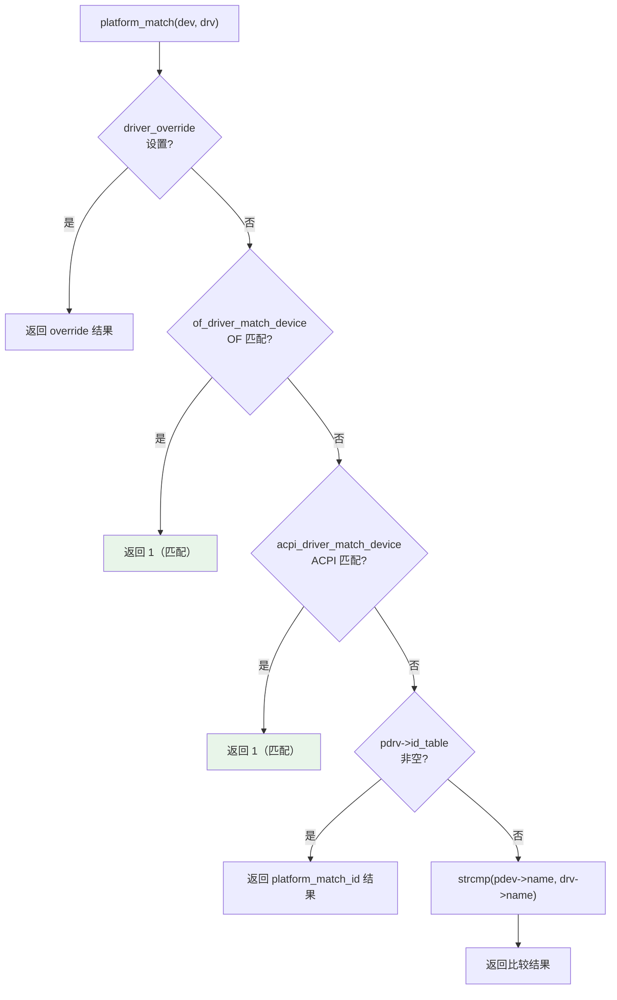
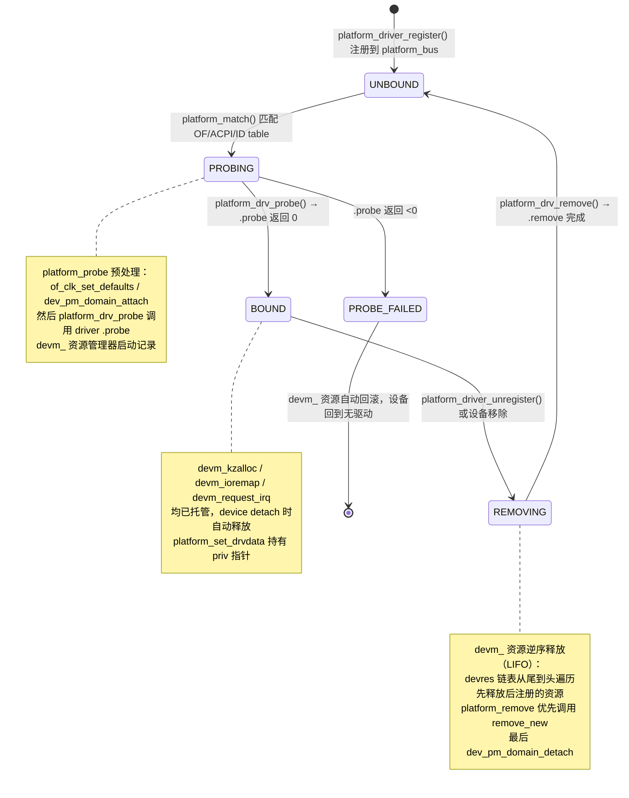
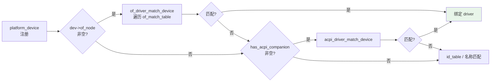

Copyright (c) 2025-2026 SPHARX Ltd. All Rights Reserved.

# agentrt-linux（AirymaxOS）驱动模型 — platform 总线与 SoC 设备

> **文档定位**： agentrt-linux（AirymaxOS）驱动子系统 60 模块第二篇——platform 总线实例与 SoC 设备资源管理\
> **版本**： 0.1.1（文档体系完成）/ 1.0.1（开发）\
> **最后更新**： 2026-07-06\
> **同源映射**： agentrt `daemons`（用户态 SoC 适配器）+ Linux 6.6 `drivers/base/platform.c`（platform_bus_type 实现）\
> **理论根基**： Linux 6.6 内核基线 + Airymax 五维正交 24 原则\
> **核心约束**： IRON-9 v2 同源且部分代码共享——platform 总线语义与上游一致，SoC 设备适配扩展在用户态

---

## 1. 概述

Linux 设备模型中 platform 总线是"伪总线"——它不是物理总线（如 PCI、USB），而是为 SoC 上无法被总线枚举的设备（内存映射寄存器、固定中断线）提供的"接入点"。agentrt-linux 选择 Linux 6.6 内核基线作为同源起点，platform 总线是 SoC 设备驱动的核心载体。

MicroCoreRT 不在内核态处理 SoC 设备语义——这是 K-1 内核极简原则的体现。SoC 设备的"业务语义"（如哪个寄存器对应哪个 Agent 的 Token 预算计数器）由用户态 agentrt daemon 解释；内核态只提供 platform_bus 的标准匹配与资源管理。AgentsIPC 在用户态承载进程间通信，daemon 通过 sysfs 与内核 platform driver 交互。

| 总线 | 设备发现方式 | 典型设备 | agentrt-linux 角色 |
|------|-------------|---------|----------------|
| **platform** | DT/ACPI 静态声明 | SoC 上的 UART、I2C、GPIO | agentrt-linux SoC 适配 driver 主要载体 |
| PCI/USB | 总线枚举 | 网卡、显卡、NVMe | 留给通用 Linux 生态 |
| I2C/SPI | platform driver 注册 adapter | I2C/SPI 子设备 | 传感器 driver 接入点 |
| agent_bus | daemon 注册 | Agent 虚拟设备 | agentrt-linux 自研（用户态） |

> **OS-DRV-020**： SoC 上 agentrt-linux 专属硬件必须通过 platform 总线接入内核，禁止新增独立总线类型。这是 K-1 内核极简原则的硬性约束——平台总线已足够承载。

> **OS-DRV-021**： PCI/USB 总线上发现的设备若需被 agentrt daemon 使用，必须通过 platform driver 提供"适配层"——daemon 通过 sysfs 访问，不直接调用 PCI/USB driver 内部 API。

---

## 2. platform_bus_type 详解

### 2.1 总线定义

Linux 6.6 `drivers/base/platform.c` 第 1454 行定义了 platform 总线实例：

```c
struct bus_type platform_bus_type = {
    .name           = "platform",
    .dev_groups     = platform_dev_groups,
    .driver_override = true,
    .match          = platform_match,
    .uevent         = platform_uevent,
    .probe          = platform_probe,
    .remove         = platform_remove,
    .shutdown       = platform_shutdown,
    .dma_configure  = platform_dma_configure,
    .dma_cleanup     = platform_dma_cleanup,
    .pm             = &platform_dev_pm_ops,
};
EXPORT_SYMBOL_GPL(platform_bus_type);
```

同时定义"总线父设备" `struct device platform_bus = { .init_name = "platform" };`，所有 platform_device 注册时默认 parent 为 `platform_bus`，构成 `/sys/devices/platform/` 拓扑根。

### 2.2 platform_match 五级回退



| 级别 | 匹配源 | 适用场景 | agentrt-linux 推荐度 |
|------|--------|---------|------------------|
| 1 | driver_override | 调试时强制绑定 | 仅调试 |
| 2 | OF（Device Tree） | ARM/ARM64/RISC-V SoC | **首选** |
| 3 | ACPI | x86 SoC | **首选**（x86） |
| 4 | id_table | 旧式平台设备 | 仅遗留代码 |
| 5 | 名称匹配 | 最简回退 | 不推荐 |

### 2.3 platform_probe 预处理

platform 总线的 `probe` 回调不是直接调用 driver 的 `probe`，而是先做预处理（`drivers/base/platform.c` 第 1351 行）：防御 `platform_driver_probe` 注册的不可再次绑定；应用 OF 默认时钟配置 `of_clk_set_defaults`；附加 PM 域 `dev_pm_domain_attach`；调用 driver 自身 probe；失败时回滚 PM 域；`prevent_deferred_probe` 标志的 driver 不允许延迟探测。

> **OS-DRV-022**： platform driver 的 `probe` 被调用时，`of_clk_set_defaults` 与 `dev_pm_domain_attach` 已完成——driver 无需重复处理时钟与 PM 域初始化。

> **OS-DRV-023**： 设置 `prevent_deferred_probe = true` 的 driver 必须在文档中显式声明原因。此标志禁用 `-EPROBE_DEFER` 重试机制，仅用于"必须立即可用"的关键设备（如调试串口）。

### 2.4 platform_remove 的 remove_new 优先

Linux 6.6 的 `platform_remove` 优先调用 `remove_new`（返回 `void`），回退到 `remove`（返回 `int` 但被忽略）：`if (drv->remove_new) drv->remove_new(dev); else if (drv->remove) { ... }`。最后调用 `dev_pm_domain_detach` 解绑 PM 域。

### 2.5 platform driver probe/remove 生命周期状态机

platform driver 从注册到注销的完整状态转换，覆盖 `platform_driver_register` → `platform_match` → `platform_drv_probe` → `platform_drv_remove` 全链路，含 `devm_` 资源托管生命周期：



**状态转换条件**：

| 从状态 | 到状态 | 触发条件 | 系统行为 |
|--------|--------|---------|---------|
| — | UNBOUND | `platform_driver_register()` 设置 `driver.bus = &platform_bus_type` | driver 加入 `klist_drivers`，扫描已存在 device |
| UNBOUND | PROBING | `platform_match()` 返回正数（OF/ACPI/id_table/名称匹配） | `really_probe()` 被调用，`platform_probe` 预处理 |
| PROBING | BOUND | `platform_drv_probe()` → `.probe()` 返回 0 | `devm_` 资源管理器启动，`platform_set_drvdata` 设置 priv |
| PROBING | PROBE_FAILED | `.probe()` 返回 <0（非 `-EPROBE_DEFER`） | `devm_` 资源自动回滚（`devres` 链表逆序释放） |
| PROBING | PROBING | `.probe()` 返回 `-EPROBE_DEFER` | `deferred_probe_add()` 加入重试队列（`prevent_deferred_probe=false`） |
| BOUND | REMOVING | `platform_driver_unregister()` 或 `device_unregister()` | `platform_remove` 被调用，优先 `remove_new` |
| REMOVING | UNBOUND | `platform_drv_remove()` → `.remove` 完成 | `devm_` 资源逆序释放，`dev_pm_domain_detach` 解绑 PM 域 |
| PROBE_FAILED | [*] | `devm_` 资源回滚完成，`dev->driver = NULL` | 设备回到无驱动状态，等待新 driver 或注销 |

---

## 3. platform_device / platform_driver 结构

### 3.1 platform_device 结构

`struct platform_device`（`include/linux/platform_device.h` 第 23 行）核心字段：`name`（设备名称，用于名称匹配）、`id`（实例 ID，`PLATFORM_DEVID_NONE`=-1 表单实例，`PLATFORM_DEVID_AUTO`=-2 表自动分配）、`dev`（嵌入的通用 device）、`num_resources`/`resource`（设备资源数组）、`id_entry`（匹配到的 id_table 项）、`driver_override`（用户态强制绑定的 driver 名）、`mfd_cell`（MFD 子设备指针）、`archdata`（架构特定数据）。

### 3.2 platform_driver 结构

`struct platform_driver`（`include/linux/platform_device.h` 第 233 行）核心字段：

```c
struct platform_driver {
    int  (*probe)(struct platform_device *);
    int  (*remove)(struct platform_device *);       /* 旧式，返回 int（被忽略） */
    void (*remove_new)(struct platform_device *);    /* 新式，返回 void */
    void (*shutdown)(struct platform_device *);
    int  (*suspend)(struct platform_device *, pm_message_t state);
    int  (*resume)(struct platform_device *);
    struct device_driver driver;                     /* 嵌入的通用 driver */
    const struct platform_device_id *id_table;
    bool prevent_deferred_probe;
    bool driver_managed_dma;
};
#define to_platform_driver(drv) container_of((drv), struct platform_driver, driver)
```

`platform_driver_register` 内部调用 `driver_register`，并设置 `driver.bus = &platform_bus_type`，处理 `device*` 到 `platform_device*` 的适配。

> **OS-DRV-024**： agentrt-linux 内核态 driver 必须使用 `platform_driver_register`（或 `module_platform_driver` 宏）注册，禁止直接调用 `driver_register` 并手动设置 `bus` 字段。

---

## 4. of_device_id 匹配

### 4.1 完整 OF 匹配示例

`struct of_device_id` 核心字段：`name`（节点名匹配，可选）、`type`（设备类型匹配，可选）、`compatible`（compatible 字符串匹配，最常用，最长 128 字节）、`data`（匹配后传给 driver 的私有数据指针）。

```c
#include <linux/module.h>
#include <linux/platform_device.h>
#include <linux/of.h>

struct my_drvdata_v1 { u32 reg_offset; bool has_dma; };
struct my_drvdata_v2 { u32 reg_offset; bool has_dma; u32 fifo_size; };
static const struct my_drvdata_v1 v1_data = { .reg_offset = 0x100, .has_dma = false };
static const struct my_drvdata_v2 v2_data = { .reg_offset = 0x100, .has_dma = true, .fifo_size = 64 };

static const struct of_device_id my_match[] = {
    { .compatible = "spharx,my-soc-v1", .data = &v1_data },
    { .compatible = "spharx,my-soc-v2", .data = &v2_data },
    { /* sentinel — 必填 */ }
};
MODULE_DEVICE_TABLE(of, my_match);

static int my_probe(struct platform_device *pdev)
{
    const struct of_device_id *match = of_match_device(my_match, &pdev->dev);
    const void *data;
    void __iomem *base;
    struct resource *res;
    if (!match) return -ENODEV;
    data = match->data;  /* v1_data 或 v2_data */
    base = devm_platform_get_and_ioremap_resource(pdev, 0, &res);
    if (IS_ERR(base)) return PTR_ERR(base);
    dev_info(&pdev->dev, "compatible=%s, res=%pr\n", match->compatible, res);
    return 0;
}

static struct platform_driver my_driver = {
    .probe = my_probe,
    .driver = { .name = "my-soc-driver", .of_match_table = my_match, .pm = &my_pm_ops },
};
module_platform_driver(my_driver);
MODULE_AUTHOR("agentrt-linux Driver Team");
MODULE_DESCRIPTION("SoC device driver for my-soc");
MODULE_LICENSE("GPL v2");
```

> **OS-DRV-025**： OF 匹配表的 `.data` 字段必须指向静态 const 数据（`static const`），禁止指向栈变量或动态分配内存——`of_device_id` 表在模块加载后长期存在。

> **OS-STD-020**： `compatible` 字符串的 vendor 前缀必须与设备树中一致。agentrt-linux 自研设备使用 `spharx,` 前缀；通用设备沿用上游 vendor 前缀（如 `ti,`、`nxp,`）。

### 4.2 ACPI 匹配

```c
static const struct acpi_device_id my_acpi_match[] = {
    { "SPMX0001", (kernel_ulong_t)&v1_data },
    { "SPMX0002", (kernel_ulong_t)&v2_data },
    { /* sentinel */ }
};
MODULE_DEVICE_TABLE(acpi, my_acpi_match);

static struct platform_driver my_driver = {
    .driver = {
        .name = "my-soc-driver",
        .of_match_table = my_match,         /* ARM/ARM64 路径 */
        .acpi_match_table = my_acpi_match,  /* x86 路径 */
    },
};
```

---

## 5. module_platform_driver 宏

### 5.1 宏展开

`module_platform_driver` 是消除 init/exit 样板的核心宏（`include/linux/platform_device.h` 第 299 行）：

```c
#define module_platform_driver(__platform_driver) \
    module_driver(__platform_driver, platform_driver_register, \
                  platform_driver_unregister)

/* module_driver 进一步展开（include/linux/device/driver.h 第 262 行） */
#define module_driver(__driver, __register, __unregister, ...) \
static int __init __driver##_init(void) \
{ return __register(&(__driver) , ##__VA_ARGS__); } \
module_init(__driver##_init); \
static void __exit __driver##_exit(void) \
{ __unregister(&(__driver) , ##__VA_ARGS__); } \
module_exit(__driver##_exit);
```

### 5.2 三种变体对比

| 宏 | 用途 | 限制 | agentrt-linux 推荐 |
|----|------|------|----------------|
| `module_platform_driver` | 标准模块驱动，可加载/卸载 | 模块可加载时使用 | **首选** |
| `builtin_platform_driver` | 内置驱动，不可卸载 | 仅 `device_initcall`，无 exit | 内核内置时使用 |
| `module_platform_driver_probe` | probe 函数在 `__init` 段，节省运行时内存 | 注册后不可解绑 | 仅遗留驱动 |

> **OS-DRV-026**： 新增 driver 必须使用 `module_platform_driver`（可加载）或 `builtin_platform_driver`（内置）。`module_platform_driver_probe` 因"注册后不可解绑"限制，仅用于维护遗留代码，新增代码禁用。

> **OS-STD-021**： 每个驱动源文件中 `module_platform_driver` 等注册宏只能出现一次。重复注册同一 driver 会触发 `driver_register` 的 `BUG_ON`。

### 5.3 多 driver 批量注册

当模块需注册多个 driver 时，使用 `platform_register_drivers`：传入 driver 指针数组与计数，`__init` 调用 `platform_register_drivers(drivers, count)`，`__exit` 调用 `platform_unregister_drivers(drivers, count)`。

---

## 6. DT/ACPI 双源回退

### 6.1 双源场景

agentrt-linux 的 SoC 设备可能部署在两类硬件上：ARM/ARM64/RISC-V SoC 使用 Device Tree 描述设备拓扑；x86 SoC（如 Intel/AMD 嵌入式）使用 ACPI 描述设备。同一 driver 若声明了 OF 与 ACPI 两个匹配表，`platform_match` 会先尝试 OF，再尝试 ACPI：



### 6.2 资源获取的统一接口

Linux 6.6 提供统一资源获取 API，屏蔽 DT/ACPI 差异：

| API | 功能 | DT/ACPI 透明 |
|-----|------|--------------|
| `platform_get_resource(pdev, IORESOURCE_MEM, idx)` | 获取内存资源 | 是 |
| `platform_get_irq(pdev, idx)` | 获取中断号 | 是（内部按 of_node/acpi 回退） |
| `devm_platform_ioremap_resource(pdev, idx)` | 获取并映射内存 | 是 |
| `device_property_read_u32(dev, "field", &val)` | 读设备属性 | 是 |
| `fwnode_property_read_string(dev_fwnode(dev), "name", &str)` | 读字符串属性 | 是 |

### 6.3 IRQ 获取的 DT/ACPI 回退

`platform_get_irq` 内部实现展示了 DT/ACPI 回退逻辑（`drivers/base/platform.c` 第 171 行）：优先从 `dev->dev.of_node` 通过 `of_irq_get` 获取；次选从 `platform_device` 的 `resource` 数组获取；回退到 ACPI 路径，若 `has_acpi_companion` 且资源 `IORESOURCE_DISABLED`，调用 `acpi_irq_get` 填充。

> **OS-DRV-027**： driver 必须使用 `platform_get_irq` 而非直接读 DT/ACPI 中断字段。前者处理了 DT/ACPI 双源回退与 `EPROBE_DEFER` 重试。

> **OS-DRV-028**： 设备属性（如时钟频率、FIFO 大小）必须通过 `device_property_read_*` 而非 `of_property_read_*` 读取。前者在 DT/ACPI 上都能工作，后者仅在 DT 设备上有效。

---

## 7. SoC 设备资源管理

### 7.1 resource 类型与获取

`struct resource`（`include/linux/ioport.h`）描述 SoC 设备硬件资源，核心字段 `start`/`end`/`name`/`flags`。`flags` 标识类型：`IORESOURCE_MEM`（内存映射寄存器）、`IORESOURCE_IO`（I/O 端口）、`IORESOURCE_IRQ`（中断号）、`IORESOURCE_DMA`（DMA 通道）。

```c
static int my_probe(struct platform_device *pdev)
{
    struct device *dev = &pdev->dev;
    struct resource *mem_res;
    void __iomem *base;
    int irq;

    /* 1. 同时获取 resource 与映射（推荐） */
    base = devm_platform_get_and_ioremap_resource(pdev, 0, &mem_res);
    if (IS_ERR(base)) return PTR_ERR(base);

    /* 2. 获取中断号 */
    irq = platform_get_irq(pdev, 0);
    if (irq < 0) return irq;

    /* 3. 按名称获取（DT 中可命名） */
    irq = platform_get_irq_byname(pdev, "rx");
    if (irq < 0) return irq;

    /* 4. 多区域设备：遍历所有 mem 资源 */
    int i = 0;
    struct resource *r;
    while ((r = platform_get_resource(pdev, IORESOURCE_MEM, i++)))
        dev_info(dev, "region %d: %pr\n", i - 1, r);
    return 0;
}
```

### 7.2 devm_ 资源托管

SoC 设备的 probe 中所有 `devm_` 资源在 detach 时自动释放——这是 E-3 资源确定性的核心实践：

| 资源类型 | 非托管 API（需手动释放） | 托管 API（自动释放） |
|---------|------------------------|---------------------|
| 内存分配 | `kzalloc` / `kfree` | `devm_kzalloc` |
| 寄存器映射 | `ioremap` / `iounmap` | `devm_ioremap_resource` |
| 中断注册 | `request_irq` / `free_irq` | `devm_request_irq` |
| 时钟使能 | `clk_prepare_enable` / `clk_disable_unprepare` | `devm_clk_get` + `devm_add_action` |
| GPIO | `gpio_request` / `gpio_free` | `devm_gpio_request` |

> **OS-DRV-029**： SoC driver 的 `probe` 中所有可托管资源必须使用 `devm_` 系列。`remove_new` 中不应出现 `kfree`/`iounmap`/`free_irq` 调用——若出现，说明该资源未托管。

> **OS-DRV-030**： 自定义资源（如 Agent Token 预算）必须通过 `devm_add_action_or_reset` 注册释放回调：

```c
static void my_token_budget_release(void *data)
{
    struct my_token_budget *budget = data;
    agentrt_token_budget_destroy(budget);
}

static int my_probe(struct platform_device *pdev)
{
    struct my_token_budget *budget;
    budget = agentrt_token_budget_create(/* config */);
    if (IS_ERR(budget)) return PTR_ERR(budget);
    /* 注册托管释放 — probe 失败时也会调用（_or_reset 后缀） */
    return devm_add_action_or_reset(&pdev->dev, my_token_budget_release, budget);
}
```

### 7.3 SoC 设备的电源管理

platform 总线的 `pm` 回调由 `platform_dev_pm_ops` 提供，最终委托给 driver 的 `dev_pm_ops`：

```c
static const struct dev_pm_ops my_pm_ops = {
    SET_RUNTIME_PM_OPS(my_runtime_suspend, my_runtime_resume, NULL)
    SET_SYSTEM_SLEEP_PM_OPS(my_system_suspend, my_system_resume)
};

static struct platform_driver my_driver = {
    .driver = { .name = "my-soc-driver", .pm = &my_pm_ops },
};
```

> **OS-DRV-031**： SoC driver 必须实现 `runtime_suspend`/`runtime_resume`，至少禁用/启用时钟。即使设备不支持深度睡眠，空回调也需返回 0，避免 PM 子系统警告。

> **OS-DRV-032**： `runtime_resume` 必须在 `probe` 末尾通过 `pm_runtime_enable` 启用运行时 PM；`remove_new` 开头通过 `pm_runtime_disable` 禁用。顺序错误会导致 PM 子系统在设备已释放时调用回调。

---

## 8. 五维原则映射

platform 总线在 agentrt-linux 五维正交 24 原则上的映射：

| 原则 | 在本模块的体现 |
|------|---------------|
| **S-1 反馈闭环** | deferred probe 机制：依赖未就绪时返回 `-EPROBE_DEFER`，PM 域/时钟就绪后自动重试 |
| **S-2 层次分解** | platform_driver 包装 device_driver，platform_device 包装 device——每层只增加 SoC 特定语义 |
| **S-3 总体设计部** | platform_bus_type 是协调者——它不执行 probe，只决定"哪个 device 该绑哪个 driver" |
| **S-4 涌现性管理** | DT/ACPI 双源自动回退是 platform 总线的涌现行为——driver 只需声明两个匹配表 |
| **K-1 内核极简** | platform 总线不解释设备语义（如 Token 预算含义）——只提供匹配与资源管理 |
| **K-2 接口契约化** | `platform_get_resource`、`platform_get_irq`、`devm_platform_ioremap_resource` 契约完整声明 |
| **K-3 服务隔离** | platform_driver 失败不波及其他 driver；deferred probe 队列独立于注册顺序 |
| **K-4 可插拔策略** | 同一 platform_device 可在运行时通过 sysfs bind/unbind 切换 driver；`pm` 策略可替换 |
| **C-1 双系统协同** | sysfs 同步访问是慢路径，硬件中断是快路径，mutex 协同 |
| **C-2 增量演化** | deferred probe 允许设备在依赖未就绪时延后绑定，无需重启系统 |
| **C-3 记忆卷载** | `platform_set_drvdata` 持有 driver 私有数据；DT/ACPI 属性是"持久记忆" |
| **C-4 遗忘机制** | `device_unregister` 后 sysfs 节点立即移除，但 `kobject` 引用计数未归零前结构保留 |
| **E-1 安全内生** | `driver_override` 经 sysfs 写入需 CAP_SYS_ADMIN；`devm_` 资源在 detach 时强制释放 |
| **E-2 可观测性** | platform_bus 暴露 `/sys/bus/platform/`；`dev_info` 自动附带 device 名；modalias 支持 `modprobe` |
| **E-3 资源确定性** | `devm_` 系列强制资源生命周期与 device 绑定；`devm_add_action_or_reset` 支持自定义托管 |
| **E-4 跨平台一致性** | DT/ACPI 双源匹配让同一 driver 服务异构平台；`device_property_read_*` 屏蔽差异 |
| **E-5 命名语义化** | `module_platform_driver`、`platform_get_irq`、`devm_platform_ioremap_resource` 名称精确 |
| **E-6 错误可追溯** | probe 失败通过 `dev_err` 记录；deferred probe 在 dmesg 留下重试轨迹 |
| **E-7 文档即代码** | OF 匹配表与 DT binding 文档（`Documentation/devicetree/bindings/`）同步更新 |
| **E-8 可测试性** | driver 可作为模块加载/卸载；sysfs bind/unbind 支持运行时测试；KUnit 可测试 |
| **A-1 极简主义** | `module_platform_driver` 宏消除 init/exit 样板；`devm_` 系列消除手动释放 |
| **A-2 极致细节** | sentinel 必填、`remove_new` 优先 `void`、`sysfs_emit` 加固——每个细节都为安全 |
| **A-3 人文关怀** | `dev_info` 自动带设备名前缀；OF `compatible` 字符串人类可读 |
| **A-4 完美主义** | `-Wall -Wextra -Werror` 编译；OF 表无 sentinel 触发静态分析告警 |

> **OS-STD-022**： 任何新增 platform driver 必须在 `MODULE_DEVICE_TABLE(of, ...)` 或 `MODULE_DEVICE_TABLE(acpi, ...)` 中导出匹配表——否则 `modprobe` 无法根据硬件自动加载模块。

> **OS-STD-023**： 平台 driver 的 `.name` 字段必须与 `compatible` 字符串中的 device 部分一致（如 `compatible="spharx,my-soc-v2"` 对应 `name="my-soc-driver"`）。这是人类阅读 sysfs 时的认知锚点。

---

## 9. 同源 agentrt 映射

platform 总线在 agentrt-linux 用户态（agentrt）中的同源映射：

| 内核态 platform 抽象 | 用户态 agentrt 同源 | 映射说明 |
|---------------------|---------------------|---------|
| `platform_bus_type` | `agentrt_bus_type` | daemon 注册总线，匹配 Agent SDK 接口与运行时实现 |
| `platform_device` | `agentrt_agent_instance` | Agent 实例对应 platform_device |
| `platform_driver` | `agentrt_agent_module` | Agent 实现模块，含 probe/remove |
| `of_device_id` | `agentrt_sdk_interface_id` | Agent SDK 接口版本匹配 |
| `MODULE_DEVICE_TABLE(of, ...)` | `agentrt_module_export_interfaces()` | daemon 导出可被发现的接口 |
| `platform_get_resource` | `agentrt_module_get_resource()` | 获取 Token 预算、记忆卷等资源 |
| `devm_platform_ioremap_resource` | `devm_agentrt_token_budget_alloc` | 托管资源映射 |
| `module_platform_driver` | `agentrt_module_agent_driver` | 消除 daemon 注册样板 |
| sysfs `/sys/bus/platform/` | `agentrt-fs` `/agents/` | 用户态枚举 Agent 拓扑 |

### 9.1 IRON-9 v2 同源且部分代码共享的实践

- **同源**：用户态 `agentrt_bus_type` 的匹配逻辑与内核 `platform_match` 在语义上一致——都先尝试精确匹配（OF/SDK 接口），再回退到名称匹配
- **独立**：AgentsIPC 是用户态 IPC，不依赖内核 uevent；内核态 platform driver 不依赖 daemon 存在
- **解耦验证**：删除 `agentrt/daemon/` 后内核 platform driver 仍可正常 probe 硬件；删除内核 platform driver 后 daemon 仍可运行（但失去硬件加速）——这是 IRON-9 v2 同源且部分代码共享的可验证标准

### 9.2 IRON-9 v2 三层共享模型

IRON-9 v2 将 agentrt daemons 平台设备访问与 agentrt-linux 内核 platform driver 的协作划分为三层。与通用 device model 一致，platform driver 以 [IND] 完全独立层为主——`drivers/base/platform.c` 是内核基石，agentrt 不进入内核共享其实现；[SC] 共享契约层仅间接依赖任务描述符的 agent_id 字段用于 Agent 平台设备匹配：

| 层次 | 共享程度 | platform driver 内容 |
|------|---------|---------------------|
| **[SC] 共享契约层** | 间接共享（无直接头文件） | 无直接 [SC] 共享头文件；间接依赖 `include/airymax/sched.h` 任务描述符 `agent_id` 字段（magic `0x41475453` 'AGTS'）用于 Agent 平台设备匹配 |
| **[SS] 语义同源层** | 操作模式同源（注册/匹配/生命周期等概念一致），函数签名因抽象层级不同而独立 | `platform_driver_register` 注册模式、probe/remove 生命周期、`devm_platform_ioremap_resource` 资源管理 |
| **[IND] 完全独立层** | 完全独立 | platform bus 内核实现（`drivers/base/platform.c`）、ACPI/DT 匹配逻辑、platform_device 内核分配器 |

#### [SC] 共享契约层

platform driver 无直接 [SC] 共享头文件——`drivers/base/platform.c` 是内核私有实现，agentrt 不跨态共享其数据结构。间接依赖 `include/airymax/sched.h` 中的任务描述符 `agent_id` 字段，用于将 Agent 实例与内核平台设备匹配。以下为间接 [SC] 依赖节选：

```c
/* include/airymax/sched.h —— IRON-9 v2 [SC] 间接依赖（节选，agent_id 用于 Agent 平台设备匹配） */
#define AIRYMAX_AGENT_MAGIC   0x41475453   /* 'AGTS' —— Agent 任务描述符 magic */

struct airymax_task_descriptor {
    uint32_t magic;          /* AIRYMAX_AGENT_MAGIC，校验 Agent 任务 */
    uint32_t agent_id;       /* Agent 实例 ID，用于 platform_driver 匹配 */
    uint8_t  sched_class;     /* SCHED_EXT 调度类 */
    uint8_t  priority;       /* 优先级 0-139 */
    uint64_t vtime;          /* 虚拟时间 */
    /* ... AIRYMAX_SLICE_DFL = 20ms 时间片 */
};
```

**OS-DRV-IRON-PLAT 约束**: agentrt daemons 与 agentrt-linux platform driver 不直接共享 platform.c 头文件；`agent_id` 字段语义两端一致（Agent 实例 ↔ 内核平台设备匹配键），由 `include/airymax/sched.h` 间接锁定。Agent 平台设备匹配发生在语义层，不跨态共享 platform_device 内存布局。

#### [SS] 语义同源层

| 维度 | agentrt 用户态（daemons） | agentrt-linux 内核态（platform driver） | 同源点 |
|------|--------------------------|------------------------------------------|--------|
| 驱动注册 | `agentrt_agent_module_register()` | `platform_driver_register()` | 注册模式同源 |
| bus 匹配 | `agentrt_bus_type.match()` | `platform_match()`（OF/ID/name 回退） | 匹配逻辑同源 |
| probe 生命周期 | `agentrt_agent_module.probe()` | `platform_driver.probe()` | 生命周期同源 |
| remove 生命周期 | `agentrt_agent_module.remove()` | `platform_driver.remove()` | 卸载语义同源 |
| 资源映射 | `devm_agentrt_token_budget_alloc` | `devm_platform_ioremap_resource()` | 资源托管语义同源（LIFO） |
| 接口导出 | `agentrt_module_export_interfaces()` | `MODULE_DEVICE_TABLE(of, ...)` | 可发现性语义同源 |
| 资源获取 | `agentrt_module_get_resource()` | `platform_get_resource()` | 资源获取语义同源 |

agentrt daemons 的 `agentrt_agent_module_register()` 与内核 `platform_driver_register()` 同源——两者都遵循"注册 → platform 匹配（OF/SDK 接口精确匹配 → 名称回退）→ probe 探测 → remove 卸载"生命周期。[SS] 语义同源在此体现为：操作模式同源（注册/匹配/生命周期/资源映射四段式概念一致），函数签名因抽象层级不同而独立（用户态 daemon 服务 vs 内核 platform bus）。

#### [IND] 完全独立层

| 维度 | agentrt 用户态（daemons） | agentrt-linux 内核态（platform driver） |
|------|--------------------------|------------------------------------------|
| platform bus 实现 | 不适用 | `drivers/base/platform.c` 完整实现（platform_bus_type） |
| ACPI/DT 匹配 | 不适用 | ACPI（`acpi_device_modalias`）/ DT（`of_match_device`）匹配逻辑 |
| platform_device 分配器 | 用户态 arena/glibc | `platform_device_alloc` / `platform_device_register` 内核分配器 |
| 资源管理内核实现 | 不适用 | `devm_platform_ioremap_resource` 内核实现（devres 链表） |
| 内存模型 | glibc/Rust `Box` | slab/slub 分配器 |
| 并发模型 | pthread/async | tasklet/workqueue/RCU |
| 错误返回 | `agentrt_error_t` | `-Exxx` |

#### 跨态协作流

```mermaid
graph LR
    A[agentrt daemons 平台设备访问] -->|读取 [SC] agent_id| B[sched.h 任务描述符]
    A -->|agent_id 匹配| C[agentrt-linux platform_driver]
    C -->|platform_match OF/DT| D[platform_driver probe 探测]
    D -->|平台设备事件 uevent| E[AgentsIPC 上报平台设备事件]
    A -->|策略下发| E
    style B fill:#bbf7d0,stroke:#15803d
    style E fill:#fde68a,stroke:#b45309
```

agentrt daemons 通过 [SC] 间接共享契约层读取 `include/airymax/sched.h` 任务描述符的 `agent_id` 字段，将 Agent 实例与 agentrt-linux 内核平台设备匹配，触发 `platform_match`（OF/DT 精确匹配 → 名称回退）→ `platform_driver.probe` 探测链。两端通过 AgentsIPC 总线（128B 消息头，magic `0x41524531`）同步平台设备事件（uevent），无适配层。MicroCoreRT 极简内核契约要求（OS-KER-040）：内核态 platform driver 的 `remove` 回调必须通知用户态 daemon（通过 uevent 或 AgentsIPC 消息），让 daemon 先释放对硬件资源的引用，再让内核释放硬件本身——这是跨边界资源托管链的关键时序保证。

### 9.3 跨边界资源托管链

SoC 设备的完整资源托管链跨越内核/用户态：内核 `devm_` 资源在 device detach 时释放（最先）；用户态 `devm_agentrt_*` 资源在 daemon 退出时释放（次之）；Agent SDK 句柄在 Agent 卸载时清理（最后）。MicroCoreRT 与 AgentsIPC 分别承载内核态与用户态 IPC，两者不直接耦合。

> **OS-DRV-033**： 跨内核/用户态的资源托管链必须保证一致性——内核 `devm_` 资源先释放（device detach 触发），用户态 `devm_agentrt_*` 后释放（daemon 退出触发）。daemon 退出前必须等待内核 device detach 完成，否则会访问已释放的寄存器。

> **OS-KER-040**： 内核态 platform driver 的 `remove` 回调必须通知用户态 daemon（通过 uevent 或 AgentsIPC 消息），让 daemon 先释放对硬件资源的引用，再让内核释放硬件本身。这是跨边界资源托管链的关键时序保证。

---

## 10. 最佳实践与反模式

最佳实践的核心：用 `module_platform_driver` 宏消除样板；新代码用 `.remove_new` 返回 `void`；OF 表必填 sentinel；用 `devm_platform_get_and_ioremap_resource` 一步到位；用 `platform_get_irq` 而非 `platform_get_resource(IORESOURCE_IRQ)`；用 `device_property_read_*` 而非 `of_property_read_*`；`devm_` 托管所有可托管资源使 `remove_new` 几乎为空；`runtime_resume`/`runtime_suspend` 至少禁用/启用时钟；`MODULE_DEVICE_TABLE` 导出匹配表。

| 反模式 | 后果 | 正确做法 |
|--------|------|---------|
| `probe` 中 `ioremap` 后 `remove` 忘 `iounmap` | 寄存器空间泄漏 | 用 `devm_platform_ioremap_resource` |
| `probe` 中 `request_irq` 后 `remove` 忘 `free_irq` | 中断泄漏 + 崩溃 | 用 `devm_request_irq` |
| OF 表无 sentinel | 越界读取，未定义行为 | 必填 `{ /* sentinel */ }` |
| 用 `of_property_read_*` 读属性 | x86 平台失效 | 用 `device_property_read_*` |
| 用 `platform_get_resource(IORESOURCE_IRQ)` 取中断 | DT/ACPI 不一致 | 用 `platform_get_irq` |
| `probe` 中启用中断后才注册 handler | 中断在 handler 未就绪时触发 | 先 `devm_request_irq` 再启用 |
| `remove` 返回非 0 期望回滚 | 返回值被忽略 | `remove` 必须成功 |
| `runtime_resume` 不恢复时钟 | 硬件访问失效 | 至少 `clk_prepare_enable` |
| `MODULE_DEVICE_TABLE` 缺失 | `modprobe` 无法自动加载 | 必填导出表 |

> **OS-DRV-034**： `probe` 中 `devm_request_irq` 必须在硬件中断使能之前调用。若顺序颠倒，硬件可能在 handler 未注册时触发中断，导致空指针解引用。

> **OS-DRV-035**： `probe` 末尾必须调用 `pm_runtime_enable`，`remove_new` 开头必须调用 `pm_runtime_disable`。两者必须配对，缺失任一会触发 PM 子系统警告或资源泄漏。

> **OS-KER-041**： 内核态 platform driver 不应在 `probe` 中调用任何 `printk` 级别高于 `KERN_INFO` 的日志来报告"非致命"情况——这会污染 dmesg。`dev_dbg` 用于调试，`dev_info` 用于关键状态变更，`dev_err` 仅用于失败路径。

---

## 11. 相关文档

- `60-driver-model/README.md`（模块主索引）
- `60-driver-model/01-device-model.md`（device/driver/bus 三元组详解——本文档前置）
- `60-driver-model/03-devm-resource.md`（devm_ 资源管理与生命周期）
- `60-driver-model/04-misc-framework.md`（misc 框架与轻量级字符设备）
- `60-driver-model/05-agent-driver.md`（Agent 虚拟设备驱动扩展）
- `60-driver-model/06-driver-samples.md`（驱动示例集）
- `50-engineering-standards/01-coding-standards.md`（驱动代码规范）
- `20-modules/01-kernel.md`（kernel 子仓设计——MicroCoreRT 与内核态边界）
- `20-modules/02-services.md`（services 子仓设计——agentrt daemon 与 AgentsIPC）
- Linux 6.6 `drivers/base/platform.c`、`include/linux/platform_device.h`、`Documentation/driver-api/driver-model/platform.rst`

---

## 12. 文档版本与维护

| 版本 | 日期 | 维护者 | 变更摘要 |
|------|------|--------|---------|
| 0.1.1 | 2026-07-06 | agentrt-linux 驱动子系统组 | 占位版本，建立文档骨架与规则编号体系 |
| 1.0.1 | 2026-07-06 | agentrt-linux 驱动子系统组 | 开发版本，完成 platform 总线、device/driver 结构、OF/ACPI 匹配、宏、双源回退、资源管理六章正文 |

### 12.1 维护规则

- **同步性**：与 Linux 6.6 内核基线 `drivers/base/platform.c` 同步——上游 platform_bus_type 字段或 `platform_match` 优先级变更时本文档需在下一个版本周期内更新
- **规则编号稳定性**：`OS-DRV-020`~`OS-DRV-035`、`OS-STD-020`~`OS-STD-023`、`OS-KER-040`~`OS-KER-041` 编号一旦分配不再变更
- **同源验证**：每次发布前通过 `scripts/check-platform-driver-sync.sh` 验证文档中 API 语义与 Linux 6.6 头文件一致
- **原则映射完整性**：五维原则映射章节覆盖全部 24 条原则

### 12.2 一致性检查清单

发布前验证：`platform_bus_type` 字段与 Linux 6.6 第 1454 行一致；`struct platform_device`/`platform_driver` 字段与头文件一致；`platform_match` 五级回退与源码一致；`module_platform_driver` 宏展开与第 299 行一致；OF/ACPI 示例可编译；五维映射覆盖全部 24 条原则；同源映射与 `20-modules/02-services.md` 一致。

---

## 附录 A: 接口定义

> **附录定位**： 本附录汇集 platform 总线与 SoC 设备资源管理所需的完整 C 接口契约，供 1.0.1 开发阶段直接参照实现。所有数据结构与函数签名对齐 Linux 6.6 `include/linux/platform_device.h`、`drivers/base/platform.c`、`include/linux/of.h`、`include/linux/ioport.h` 及 `include/airymax/sched.h`（[SC] 间接依赖层）。

### A.1 核心数据结构

#### A.1.1 platform_device — 平台设备

```c
/**
 * struct platform_device - platform 总线上的设备实例
 *
 * 为 SoC 上无法被总线枚举的设备（内存映射寄存器、固定中断线）
 * 提供的"接入点"。嵌入通用 struct device；resource 数组描述
 * 硬件资源（MEM/IRQ/DMA）；id 标识多实例（PLATFORM_DEVID_*）。
 *
 * 对齐 Linux 6.6 include/linux/platform_device.h（第 23 行起）
 *
 * @field name:            设备名称（名称匹配回退时使用）
 * @field id:              实例 ID（PLATFORM_DEVID_NONE=-1 单实例，
 *                         PLATFORM_DEVID_AUTO=-2 自动分配）
 * @field id_entry:        匹配到的 platform_device_id 项
 * @field dev:             嵌入的通用 device（dev.bus=&platform_bus_type）
 * @field num_resources:   资源数组长度
 * @field resource:        资源数组指针（IORESOURCE_MEM/IRQ/DMA）
 * @field mfd_cell:        MFD 子设备指针（可选）
 * @field driver_override:  用户态强制绑定的 driver 名（sysfs 写入）
 * @field archdata:        架构特定数据
 */
struct platform_device {
    const char          *name;
    int                 id;
    bool                id_auto;
    struct device       dev;
    u64                 dma_mask;
    u32                 num_resources;
    struct resource     *resource;
    const struct platform_device_id *id_entry;
    char                *driver_override;
    struct mfd_cell     *mfd_cell;
    struct pdev_archdata archdata;
};

/** to_platform_device - 从 struct device 取得 platform_device */
#define to_platform_device(x) container_of((x), struct platform_device, dev)
```

#### A.1.2 platform_driver — 平台驱动

```c
/**
 * struct platform_driver - platform 总线上的驱动
 *
 * 包装 device_driver，增加 SoC 特定回调。probe/remove 接收
 * platform_device 而非通用 device。remove_new 返回 void
 * 是 Linux 6.6 推荐签名（OS-DRV-005）。
 *
 * 对齐 Linux 6.6 include/linux/platform_device.h（第 233 行起）
 *
 * @field probe:               探测回调（接收 platform_device）
 * @field remove:               旧式解绑回调（返回 int，被忽略，过渡期）
 * @field remove_new:           新式解绑回调（返回 void，推荐）
 * @field shutdown:             关机回调
 * @field suspend:              挂起回调（旧式，pm_message_t）
 * @field resume:               恢复回调
 * @field driver:               嵌入的通用 device_driver（.bus 设为 platform_bus_type）
 * @field id_table:             platform_device_id 匹配表（旧式）
 * @field prevent_deferred_probe: 禁止延迟探测（仅关键设备，OS-DRV-023）
 * @field driver_managed_dma:   driver 自管 DMA（跳过总线级配置）
 */
struct platform_driver {
    int  (*probe)(struct platform_device *);
    int  (*remove)(struct platform_device *);
    void (*remove_new)(struct platform_device *);
    void (*shutdown)(struct platform_device *);
    int  (*suspend)(struct platform_device *, pm_message_t state);
    int  (*resume)(struct platform_device *);
    struct device_driver driver;
    const struct platform_device_id *id_table;
    bool prevent_deferred_probe;
    bool driver_managed_dma;
};

/** to_platform_driver - 从 struct device_driver 取得 platform_driver */
#define to_platform_driver(drv) container_of((drv), struct platform_driver, driver)
```

#### A.1.3 of_device_id — OF 匹配表项

```c
/**
 * struct of_device_id - Device Tree 匹配表项
 *
 * compatible 字符串是最常用匹配字段。data 字段在匹配后通过
 * of_match_device() 取出，传给 driver 作为私有数据。表必须以
 * 全零 sentinel 项结尾（OS-DRV-007）。
 *
 * 对齐 Linux 6.6 include/linux/mod_devicetable.h
 *
 * @field name:       DT 节点名匹配（可选，少用）
 * @field type:       DT 设备类型匹配（可选，少用）
 * @field compatible: compatible 字符串匹配（最常用，最长 128 字节）
 * @field data:        匹配后传给 driver 的私有数据指针（必须 static const）
 */
struct of_device_id {
    char    name[32];
    char    type[32];
    char    compatible[128];
    const void *data;
};

/** 与 of_device_id 对应的内核内部结构 */
struct of_device_id_internal {
    char    name[32];
    char    type[32];
    char    compatible[128];
    const void *data;
    /* 内核内部字段，不暴露给用户态 */
};

/**
 * struct acpi_device_id - ACPI 匹配表项（对齐 Linux 6.6）
 *
 * @field id:    ACPI _HID 标识（7 字符，如 "SPMX0001"）
 * @field cls:    ACPI _CLS 设备类
 * @field cls_msk: 设备类掩码
 * @field driver_data: 匹配后传给 driver 的数据（强制转 kernel_ulong_t）
 */
struct acpi_device_id {
    __u8 id[ACPI_ID_LEN];
    __u8 cls[ACPI_CLS_LEN];
    __u8 cls_msk[ACPI_CLS_LEN];
    kernel_ulong_t driver_data;
};
```

#### A.1.4 resource — 设备资源

```c
/**
 * struct resource - SoC 设备硬件资源描述
 *
 * 描述内存映射寄存器、I/O 端口、中断号、DMA 通道。start/end
 * 是资源范围；flags 标识类型与属性。
 *
 * 对齐 Linux 6.6 include/linux/ioport.h
 *
 * @field name:    资源名称（sysfs 显示）
 * @field start:   资源起始地址或中断号
 * @field end:     资源结束地址（含）
 * @field flags:   类型与属性标志（IORESOURCE_*）
 * @field desc:    资源描述字符串（如 "Transaction Layer"）
 * @field parent:  父资源（资源树）
 * @field sibling: 兄弟节点（资源链表）
 * @field child:   子资源
 */
struct resource {
    resource_size_t start;
    resource_size_t end;
    const char      *name;
    unsigned long    flags;
    unsigned long    desc;
    struct resource *parent, *sibling, *child;
};

/**
 * IORESOURCE_* - 资源类型标志（对齐 Linux 6.6 include/linux/ioport.h）
 */
#define IORESOURCE_MEM     0x00000200  /* 内存映射寄存器 */
#define IORESOURCE_IO      0x00000100  /* I/O 端口 */
#define IORESOURCE_IRQ     0x00000400  /* 中断号 */
#define IORESOURCE_DMA     0x00000800  /* DMA 通道 */
#define IORESOURCE_REG     0x00000300  /* 寄存器偏移 */
#define IORESOURCE_MEM_64  0x00100000  /* 64 位地址 */
#define IORESOURCE_DISABLED 0x10000000  /* 资源已禁用 */
#define IORESOURCE_UNSET   0x20000000  /* 资源未设置 */
#define IORESOURCE_AUTO    0x40000000  /* 自动分配 */
#define IORESOURCE_BUSY    0x80000000  /* 占用中（驱动已映射） */
```

### A.2 核心函数签名

#### A.2.1 platform_driver_register / unregister

```c
/**
 * platform_driver_register - 注册 platform 驱动
 * @drv: 平台驱动对象（需设置 probe/driver.name/driver.of_match_table）
 *
 * 内部设置 driver.bus = &platform_bus_type，调用 driver_register。
 * 注册后扫描 platform_bus 上所有 device，对匹配成功者触发 probe。
 * agentrt-linux driver 必须用此函数注册（OS-DRV-024），禁止直接
 * driver_register 手动设 bus。
 *
 * 返回: 0 成功，<0 失败（-EINVAL/-EBUSY/-ENOMEM）
 *
 * @since 0.1.1（文档体系）/ 1.0.1（代码实施）
 *
 * 对齐 Linux 6.6 drivers/base/platform.c
 */
int platform_driver_register(struct platform_driver *drv);

/**
 * platform_driver_unregister - 注销 platform 驱动
 * @drv: 平台驱动对象
 *
 * 对齐 Linux 6.6 drivers/base/platform.c
 */
void platform_driver_unregister(struct platform_driver *drv);

/**
 * __platform_driver_register - 内部注册（带模块 owner）
 * @drv:   平台驱动对象
 * @owner: 所属模块（通常 THIS_MODULE）
 *
 * module_platform_driver 宏内部调用此函数。
 *
 * 返回: 0 成功，<0 失败
 *
 * 对齐 Linux 6.6 include/linux/platform_device.h
 */
int __platform_driver_register(struct platform_driver *drv,
                               struct module *owner);
```

#### A.2.2 platform_device_register / unregister

```c
/**
 * platform_device_register - 注册 platform 设备
 * @pdev: 平台设备对象（需设置 name/id/resource）
 *
 * 内部设置 dev.bus = &platform_bus_type、dev.parent = &platform_bus，
 * 调用 device_initialize + device_add。失败后必须 platform_device_put。
 *
 * 返回: 0 成功，<0 失败（-EINVAL/-ENOMEM）
 *
 * @since 0.1.1（文档体系）/ 1.0.1（代码实施）
 *
 * 对齐 Linux 6.6 drivers/base/platform.c
 */
int platform_device_register(struct platform_device *pdev);

/**
 * platform_device_unregister - 注销 platform 设备
 * @pdev: 平台设备对象
 *
 * 内部调用 device_unregister（含 device_del + put_device）。
 *
 * 对齐 Linux 6.6 drivers/base/platform.c
 */
void platform_device_unregister(struct platform_device *pdev);

/**
 * platform_device_alloc - 分配并初始化 platform_device
 * @name: 设备名
 * @id:   实例 ID（PLATFORM_DEVID_NONE / PLATFORM_DEVID_AUTO）
 *
 * 分配 struct platform_device，设置 name/id，引用计数初始为 1。
 * 需配合 platform_device_add_resources 添加资源后再 add。
 *
 * 返回: 指向新 platform_device 的指针；失败返回 ERR_PTR(-ENOMEM)
 *
 * 对齐 Linux 6.6 drivers/base/platform.c
 */
struct platform_device *platform_device_alloc(const char *name, int id);

/**
 * platform_device_add - 把已 alloc 的 platform_device 添加到总线
 * @pdev: 平台设备对象
 *
 * 若 id 为 PLATFORM_DEVID_AUTO 则自动分配实例号。
 *
 * 返回: 0 成功，<0 失败（-ENOMEM/-EEXIST）
 *
 * 对齐 Linux 6.6 drivers/base/platform.c
 */
int platform_device_add(struct platform_device *pdev);
```

#### A.2.3 devm_platform_ioremap_resource — 管理式寄存器映射

```c
/**
 * devm_platform_ioremap_resource - 获取并映射内存资源（托管）
 * @pdev: 平台设备
 * @index: 资源索引（IORESOURCE_MEM 的第 index 个）
 *
 * 内部调用 platform_get_resource(pdev, IORESOURCE_MEM, index)
 * 取资源，再 devm_ioremap_resource 映射。映射在 device detach
 * 时自动释放（E-3 资源确定性）。推荐替代 platform_get_resource +
 * devm_ioremap_resource 两步操作。
 *
 * 返回: __iomem 映射基地址；失败返回 IOMEM_ERR_PTR(-ENOMEM/-EBUSY/-ENOENT)
 *
 * @since 0.1.1（文档体系）/ 1.0.1（代码实施）
 *
 * 对齐 Linux 6.6 drivers/base/platform.c
 */
void __iomem *devm_platform_ioremap_resource(struct platform_device *pdev,
                                             unsigned int index);

/**
 * devm_platform_get_and_ioremap_resource - 同时获取 resource 与映射（托管）
 * @pdev:  平台设备
 * @index: 资源索引
 * @res:   输出参数，接收 struct resource 指针（可为 NULL）
 *
 * 比 devm_platform_ioremap_resource 多返回 resource 指针，
 * 用于需要读 resource->start/end 的场景。
 *
 * 返回: __iomem 映射基地址；失败返回 IOMEM_ERR_PTR
 *
 * 对齐 Linux 6.6 drivers/base/platform.c
 */
void __iomem *devm_platform_get_and_ioremap_resource(struct platform_device *pdev,
                                                      unsigned int index,
                                                      struct resource **res);
```

#### A.2.4 platform_get_resource / platform_get_irq

```c
/**
 * platform_get_resource - 按类型与索引获取资源
 * @pdev:  平台设备
 * @type:  资源类型（IORESOURCE_MEM / IORESOURCE_IRQ / IORESOURCE_DMA）
 * @num:   该类型的第 num 个资源（从 0 起）
 *
 * 遍历 pdev->resource 数组，匹配 type 与 num。
 *
 * 返回: 指向 struct resource 的指针；未找到返回 NULL
 *
 * 对齐 Linux 6.6 drivers/base/platform.c
 */
struct resource *platform_get_resource(struct platform_device *pdev,
                                       unsigned int type,
                                       unsigned int num);

/**
 * platform_get_irq - 获取中断号（DT/ACPI 双源回退）
 * @pdev: 平台设备
 * @num:   第 num 个中断资源（从 0 起）
 *
 * 优先从 dev->of_node 通过 of_irq_get 获取；
 * 次选从 resource 数组获取；
 * 回退到 ACPI（has_acpi_companion 时 acpi_irq_get）。
 * 处理 EPROBE_DEFER 重试（OS-DRV-027）。
 *
 * 返回: 中断号（>=0）；失败返回 -ENXIO/-EPROBE_DEFER
 *
 * @since 0.1.1（文档体系）/ 1.0.1（代码实施）
 *
 * 对齐 Linux 6.6 drivers/base/platform.c（第 171 行起）
 */
int platform_get_irq(struct platform_device *pdev, unsigned int num);

/**
 * platform_get_irq_byname - 按名称获取中断号
 * @pdev: 平台设备
 * @name:  中断名称（DT/ACPI 中命名）
 *
 * 返回: 中断号（>=0）；失败返回 -ENXIO
 *
 * 对齐 Linux 6.6 drivers/base/platform.c
 */
int platform_get_irq_byname(struct platform_device *pdev, const char *name);

/**
 * platform_get_resource_byname - 按名称获取资源
 * @pdev: 平台设备
 * @type: 资源类型
 * @name: 资源名称
 *
 * 返回: 指向 struct resource 的指针；未找到返回 NULL
 *
 * 对齐 Linux 6.6 drivers/base/platform.c
 */
struct resource *platform_get_resource_byname(struct platform_device *pdev,
                                              unsigned int type,
                                              const char *name);
```

#### A.2.5 platform_set_drvdata / platform_get_drvdata

```c
/**
 * platform_set_drvdata - 设置驱动私有数据
 * @pdev: 平台设备
 * @data:  私有数据指针
 *
 * 实际是 dev_set_drvdata(&pdev->dev, data) 的包装。
 *
 * 对齐 Linux 6.6 include/linux/platform_device.h
 */
static inline void platform_set_drvdata(struct platform_device *pdev,
                                        void *data)
{
    dev_set_drvdata(&pdev->dev, data);
}

/**
 * platform_get_drvdata - 获取驱动私有数据
 * @pdev: 平台设备
 *
 * 返回: 私有数据指针
 *
 * 对齐 Linux 6.6 include/linux/platform_device.h
 */
static inline void *platform_get_drvdata(const struct platform_device *pdev)
{
    return dev_get_drvdata(&pdev->dev);
}
```

### A.3 错误码与宏定义

#### A.3.1 实例 ID 常量

```c
/**
 * PLATFORM_DEVID_* - platform_device 实例 ID 常量
 *
 * 对齐 Linux 6.6 include/linux/platform_device.h
 */
#define PLATFORM_DEVID_NONE   (-1)  /* 单实例，名称不加数字后缀 */
#define PLATFORM_DEVID_AUTO  (-2)  /* 自动分配实例号（名称加 .0/.1/.2...） */
```

#### A.3.2 驱动注册宏

```c
/**
 * module_platform_driver - 标准模块驱动注册宏（首选）
 * @__platform_driver: platform_driver 结构体变量
 *
 * 对齐 Linux 6.6 include/linux/platform_device.h（第 299 行）
 * 展开为 __init/__exit 函数 + module_init/module_exit（OS-DRV-026）
 */
#define module_platform_driver(__platform_driver) \
    module_driver(__platform_driver, platform_driver_register, \
                  platform_driver_unregister)

/**
 * builtin_platform_driver - 内置驱动注册宏（不可卸载）
 * @__platform_driver: platform_driver 结构体变量
 *
 * 仅 device_initcall，无 exit。内核内置时使用。
 *
 * 对齐 Linux 6.6 include/linux/platform_device.h
 */
#define builtin_platform_driver(__platform_driver) \
    builtin_driver(__platform_driver, platform_driver_register)

/**
 * module_platform_driver_probe - 一次性 probe 注册宏（仅遗留）
 * @__platform_driver: platform_driver 结构体变量
 * @__probe:           probe 函数（置于 __init 段）
 *
 * 注册后 probe 函数被释放，节省运行时内存；
 * 但注册后不可解绑。新增代码禁用（OS-DRV-026）。
 *
 * 对齐 Linux 6.6 include/linux/platform_device.h
 */
#define module_platform_driver_probe(__platform_driver, __probe) \
    /* 内部封装 __probe 为 __init 段，注册后不可解绑 */

/**
 * platform_register_drivers - 批量注册多个驱动
 * @drivers: platform_driver 指针数组
 * @count:   驱动数量
 *
 * 返回: 0 成功，<0 失败（已注册部分需手动回滚）
 *
 * 对齐 Linux 6.6 include/linux/platform_device.h
 */
int platform_register_drivers(struct platform_driver *const *drivers,
                              unsigned int count);

/**
 * platform_unregister_drivers - 批量注销多个驱动
 * @drivers: platform_driver 指针数组
 * @count:   驱动数量
 *
 * 对齐 Linux 6.6 include/linux/platform_device.h
 */
void platform_unregister_drivers(struct platform_driver *const *drivers,
                                 unsigned int count);
```

#### A.3.3 devm_* 资源管理宏与函数

```c
/**
 * devm_kzalloc - 托管内存分配（对齐 Linux 6.6 include/linux/device.h）
 * @dev: 设备指针
 * @size: 分配大小
 * @gfp:  GFP 标志
 *
 * 在 device detach 时自动释放（LIFO 顺序，OS-DRV-013）。
 *
 * 返回: 指向分配内存的指针；失败返回 NULL
 */
void *devm_kzalloc(struct device *dev, size_t size, gfp_t gfp);

/**
 * devm_ioremap_resource - 托管寄存器映射（对齐 Linux 6.6 include/linux/io.h）
 * @dev:  设备指针
 * @res:  资源指针
 *
 * 校验资源冲突（busy 标志），映射，托管释放。
 *
 * 返回: __iomem 基地址；失败返回 IOMEM_ERR_PTR
 */
void __iomem *devm_ioremap_resource(struct device *dev,
                                    const struct resource *res);

/**
 * devm_request_irq - 托管中断注册（对齐 Linux 6.6 include/linux/interrupt.h）
 * @dev:  设备指针
 * @irq:  中断号
 * @handler: 中断处理函数
 * @irqflags: 中断标志（IRQF_SHARED / IRQF_TRIGGER_*）
 * @devname: 设备名（用于 /proc/interrupts 显示）
 * @dev_id:  传递给 handler 的设备 ID
 *
 * 返回: 0 成功，<0 失败
 */
int devm_request_irq(struct device *dev, unsigned int irq,
                     irq_handler_t handler, unsigned long irqflags,
                     const char *devname, void *dev_id);

/**
 * devm_add_action_or_reset - 注册自定义托管释放回调（对齐 Linux 6.6）
 * @dev:    设备指针
 * @action: 释放回调函数
 * @data:   传递给回调的数据
 *
 * 用于无法被标准 devm_ 函数覆盖的资源（如 Agent Token 预算）。
 * _or_reset 后缀表示 probe 失败时也会调用回调（OS-DRV-030）。
 *
 * 返回: 0 成功，<0 失败
 */
int devm_add_action_or_reset(struct device *dev, void (*action)(void *),
                             void *data);

/**
 * devm_clk_get - 托管时钟获取（对齐 Linux 6.6 include/linux/clk.h）
 * @dev: 设备指针
 * @id:  时钟 ID（DT clock-names 或 NULL）
 *
 * 返回: struct clk 指针；失败返回 ERR_PTR
 */
struct clk *devm_clk_get(struct device *dev, const char *id);

/**
 * devm_gpio_request - 托管 GPIO 请求（对齐 Linux 6.6）
 * @dev:  设备指针
 * @gpio: GPIO 编号
 * @label: 标签（sysfs 显示）
 *
 * 返回: 0 成功，<0 失败
 */
int devm_gpio_request(struct device *dev, unsigned gpio, const char *label);
```

#### A.3.4 设备属性统一访问宏

```c
/**
 * device_property_read_* - 设备属性统一访问（DT/ACPI 透明）
 *
 * 对齐 Linux 6.6 include/linux/property.h
 * 在 DT 与 ACPI 上都能工作（OS-DRV-028），替代 of_property_read_*
 *
 * @dev:  设备指针
 * @propname: 属性名
 * @val:  输出值指针
 *
 * 返回: 0 成功，-EINVAL/-ENODATA 失败
 */
int device_property_read_u32(const struct device *dev, const char *propname,
                            u32 *val);
int device_property_read_u8_array(const struct device *dev, const char *propname,
                                  u8 *val, size_t nval);
int device_property_read_string(const struct device *dev, const char *propname,
                                const char **val);
```

#### A.3.5 错误码与 CONFIG

```c
/**
 * platform 驱动标准错误码（对齐 Linux 6.6 errno）
 *
 * @field -EPROBE_DEFER: 依赖未就绪（如时钟/PM 域），延迟重试
 * @field -ENODEV:       设备不存在（of_match_device 返回 NULL）
 * @field -ENXIO:        资源不存在（platform_get_irq 未找到）
 * @field -ENOMEM:       内存不足（devm_kzalloc 失败）
 * @field -EBUSY:        资源占用（devm_ioremap_resource 冲突）
 * @field -EINVAL:       参数无效
 * @field -EIO:          I/O 错误（寄存器访问失败）
 */
#define PLATFORM_E_PROBE_DEFER  (-EPROBE_DEFER)
#define PLATFORM_E_NODEV        (-ENODEV)
#define PLATFORM_E_NXIO         (-ENXIO)
#define PLATFORM_E_NOMEM        (-ENOMEM)
#define PLATFORM_E_BUSY         (-EBUSY)
#define PLATFORM_E_INVAL        (-EINVAL)
#define PLATFORM_E_IO           (-EIO)

/**
 * CONFIG_* - platform 驱动相关编译开关（对齐 Linux 6.6 drivers/base/Kconfig）
 *
 * agentrt-linux 默认开启 platform 总线
 */
#define CONFIG_PLATFORM_DRIVER  1   /* platform_bus_type 支持 */
#define CONFIG_OF              1    /* Device Tree 支持（OF 匹配路径） */
#define CONFIG_ACPI            1    /* ACPI 支持（x86 SoC 匹配路径） */
```

---

> **文档结束** | agentrt-linux 驱动模型 60 模块第二篇 | IRON-9 v2 同源且部分代码共享 | Linux 6.6 内核基线
