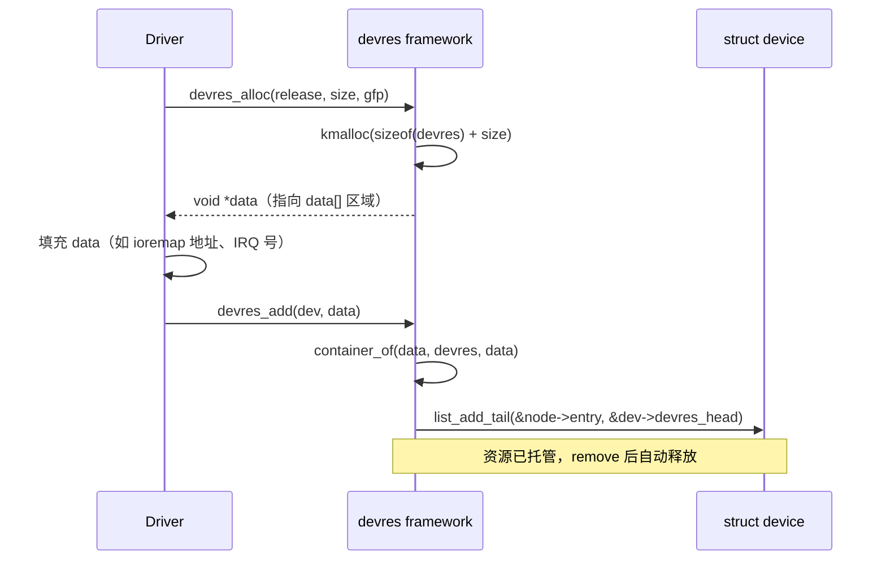
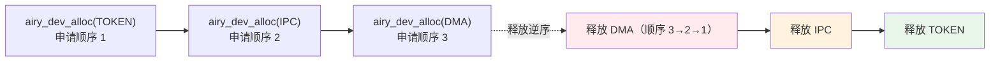
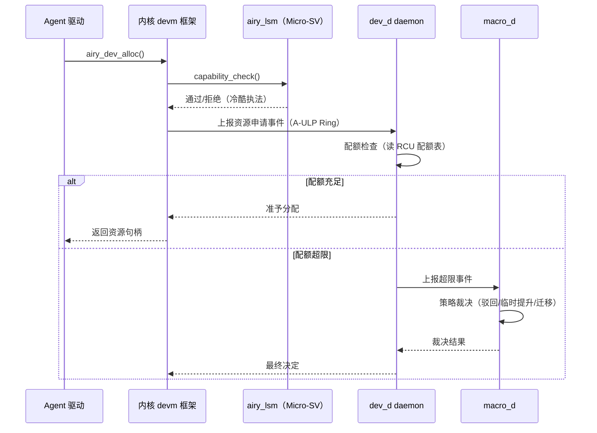
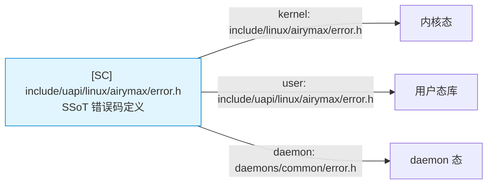
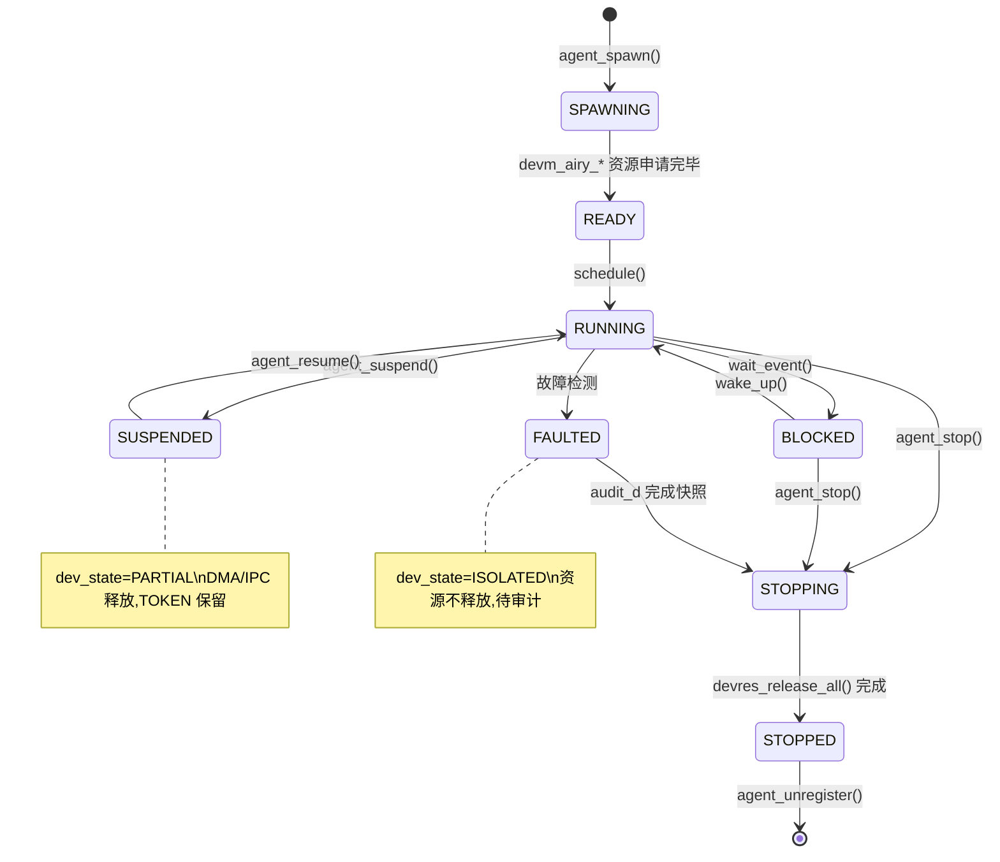

Copyright (c) 2025-2026 SPHARX Ltd. All Rights Reserved.

# agentrt-linux（AirymaxOS）驱动模型 — devm 资源托管与智能体资源扩展
> **文档定位**：agentrt-linux（AirymaxOS）驱动子系统 60 模块第三篇——`devm_` 资源托管机制与智能体资源生命周期扩展\
> **文档版本**：v1.0.1\
> **最后更新**：2026-07-18\
> **上级文档**：[60-driver-model README](README.md)\
> **同源映射**：agentrt `daemons`（用户态 dev_d 守护进程）+ Linux 6.6 `drivers/base/devres.c`（devm 资源托管实现）\
> **理论根基**：Linux 6.6 内核基线 + Airymax 五维正交 24 原则 + Airymax Unify Design（A-ULS 设备生命周期监管）\
> **核心约束**：IRON-9 v3 [SC] 共享契约层——`error.h`（`AIRY_E_DEV_*`）与 `sched.h`（Agent 8 态生命周期）通过 [SC] 头文件三路桥接

---

## 1. 概述

Linux 内核 `devm_`（Device-Managed）资源托管机制是驱动模型的核心基础设施——它将资源生命周期与 `struct device` 绑定，设备从驱动解绑时（`remove` 回调返回后）所有 devm 资源按申请逆序自动释放。这一机制消除了驱动开发者手工管理资源的负担，将"忘记释放"类资源泄漏从设计层面根除。

agentrt-linux v1.0.1 在继承 Linux 6.6 `devm_` 完整语义的基础上，将其扩展至智能体（Agent）工作负载所需的"软资源"——Token 预算、记忆卷载（memory volume）、IPC 通道、io_uring DMA 描述符池等。这些资源不属于传统硬件资源（MMIO 寄存器、IRQ 线），但同样是 Agent 设备生命周期内必须托管的对象。

本文档覆盖五大主题：`devres` 框架核心机制、`devm_` 资源族与申请逆序释放、Agent 虚拟设备资源托管扩展（`devm_airy_*` 族）、与 A-ULS 模块的关系（dev_d daemon 管理设备资源生命周期）、资源配额机制（每个 Agent 可分配的最大设备资源数）。

| 资源类别 | Linux 6.6 devm 资源 | agentrt-linux devm_airy 扩展 |
|---------|--------------------|------------------------------|
| 内存映射 | `devm_ioremap_resource` | `devm_airy_mem_volume_map`（记忆卷载映射） |
| IRQ 注册 | `devm_request_irq` | `devm_airy_ipc_channel`（IPC 通道绑定） |
| DMA 缓冲 | `devm_free_pages` | `devm_airy_dma_pool`（io_uring DMA 描述符池） |
| 时钟使能 | `devm_clk_get` / `devm_clk_prepare_enable` | `devm_airy_token_budget`（Token 预算配额） |
| regulator | `devm_regulator_get` | `devm_airy_quota_slot`（资源配额槽位） |

> **OS-DRV-040**： agentrt-linux 内核态 devm 资源族（`devm_ioremap_resource`、`devm_request_irq` 等）的字段、签名、释放回调语义必须与 Linux 6.6 内核基线保持二进制兼容。任何扩展通过包装结构实现，禁止修改上游 `struct devres_node`。

> **OS-DRV-041**： `devm_airy_*` 资源族扩展不得破坏 devm 资源链表的逆序释放保证——所有扩展资源必须通过 `devres_alloc` + `devres_add` 注册，禁止绕过 devres 框架手工管理。

---

## 2. devres 框架核心机制

### 2.1 数据结构

Linux 6.6 `drivers/base/devres.c` 第 73 行定义了 devm 资源管理的核心数据结构：

```c
struct devres_node {
    struct list_head        entry;       /* 挂入 dev->devres_head 链表 */
    dr_release_t            release;     /* 释放回调 */
    const char              *name;       /* 资源名称（用于调试） */
    size_t                  size;        /* 资源数据大小 */
};

struct devres {
    struct devres_node      node;
    /* 资源数据紧随其后（柔性数组语义） */
    unsigned long long      data[];      /* 占位，实际数据通过 container_of 访问 */
};
```

每个 `struct device` 内嵌 `struct list_head devres_head`，所有 devm 资源通过 `devres_node.entry` 链入该链表。devres 框架的核心保证：**资源按申请顺序入链，按逆序释放**——这与 LIFO 栈语义等价，确保后申请的资源（往往依赖先申请的资源）先释放。

### 2.2 devres 注册流程



### 2.3 devres 释放流程

设备从驱动解绑时（`device_release_driver_internal` → `__device_release_driver`），驱动核心在调用完 `driver->remove` 后立即触发 devres 释放（`drivers/base/dd.c` 第 705 行）：

```c
static void __device_release_driver(struct device *dev, ...)
{
    ...
    if (dev->bus && dev->bus->remove)
        dev->bus->remove(dev);
    else if (drv->remove)
        drv->remove(dev);
    ...
    devres_release_all(dev);   /* 释放所有 devm 资源 */
    ...
}
```

`devres_release_all` 按 LIFO 顺序遍历 `dev->devres_head`，对每个 `devres_node` 调用其 `release` 回调，并释放 `devres` 结构自身。

### 2.4 释放回调契约

释放回调 `dr_release_t` 的签名约定：

```c
typedef void (*dr_release_t)(struct device *dev, void *res);
```

`res` 指向 `devres.data[]` 区域，释放回调通过该指针访问资源数据并执行清理（如 `iounmap`、`free_irq`、`kfree`）。释放回调**不允许失败**——这是 devres 框架的硬性契约，确保设备解绑路径的确定性。

> **OS-DRV-042**： `devm_airy_*` 资源的释放回调不得获取可能被 Agent 持有的锁——devres 释放在 `device_lock` 持有期间执行，嵌套锁需谨慎避免死锁。Token 预算等需要与 A-ULS 交互的清理应通过原子操作 + RCU 完成。

---

## 3. Agent 虚拟设备资源托管扩展

### 3.1 设计目标

agentrt-linux v1.0.1 将 devm 资源托管扩展至 Agent 虚拟设备资源，目标是：

1. **资源生命周期绑定 Agent 设备**：Token 预算、记忆卷载、IPC 通道等资源的生命周期与 Agent 虚拟设备绑定，设备注销时自动释放
2. **资源配额强约束**：每个 Agent 可分配的资源数有上限，由 A-ULS 模块的 dev_d daemon 强制
3. **Capability 模型校验**：`CAP_DEV_ALLOC` / `CAP_DEV_FREE` 校验嵌入 devm 资源申请/释放路径
4. **[SC] 错误码统一**：所有 `devm_airy_*` 失败路径返回 `AIRY_E_DEV_*` 错误码（[SC] `error.h`）

### 3.2 struct agent_dev_resource

agentrt-linux 自研的 Agent 设备资源描述结构（位于 `include/airymax/devm_agent.h`）：

```c
/**
 * struct agent_dev_resource - Agent 虚拟设备资源描述符
 * @node:        devres 链表节点（嵌入 devm 框架）
 * @type:        资源类型（AIRY_RES_MEM / AIRY_RES_IPC / AIRY_RES_DMA / AIRY_RES_TOKEN）
 * @agent_id:    所属 Agent ID（与 struct device 的 driver_data 关联）
 * @cap_mask:    分配时持有的 Capability 掩码（CAP_DEV_ALLOC 等）
 * @quota_slot:  资源配额槽位索引（在 dev_d daemon 的配额表中）
 * @handle:      资源句柄（用户态可见的 64 位 ID）
 * @size:        资源数据大小（如 DMA 缓冲区字节数）
 * @flags:       资源标志（AIRY_RES_F_EXCLUSIVE 等）
 * @release:     资源释放回调（与 devres_node.release 不同——本回调携带 agent_dev_resource 上下文）
 * @data:        资源私有数据（柔性数组）
 */
struct agent_dev_resource {
    struct devres_node      node;
    enum airy_res_type      type;
    u32                     agent_id;
    u32                     cap_mask;
    u32                     quota_slot;
    u64                     handle;
    size_t                  size;
    u32                     flags;
    void                    (*release)(struct agent_dev_resource *res);
    unsigned long           data[];
};

enum airy_res_type {
    AIRY_RES_MEM        = 0,    /* 记忆卷载映射 */
    AIRY_RES_IPC        = 1,    /* IPC 通道绑定 */
    AIRY_RES_DMA        = 2,    /* io_uring DMA 描述符池 */
    AIRY_RES_TOKEN      = 3,    /* Token 预算配额 */
    AIRY_RES_QUOTA      = 4,    /* 资源配额槽位 */
};
```

### 3.3 airy_dev_alloc() / airy_dev_free()

Agent 设备资源分配与释放的对外接口（封装 devres 框架）：

```c
/**
 * airy_dev_alloc() - 为 Agent 设备分配托管资源
 * @dev:        Agent 虚拟设备（struct device *）
 * @type:       资源类型
 * @size:       资源数据大小
 * @flags:      资源标志
 * @cap_mask:   调用方持有的 Capability 掩码（必须含 CAP_DEV_ALLOC）
 *
 * 上下文：可能睡眠（GFP_KERNEL 分配）
 * 返回：成功返回资源句柄（非零），失败返回负数错误码：
 *   -AIRY_E_DEV_NOCAP     Capability 校验失败
 *   -AIRY_E_DEV_QUOTA     资源配额耗尽
 *   -AIRY_E_DEV_NOMEM     内存分配失败
 *   -AIRY_E_DEV_INVAL     参数非法
 */
u64 airy_dev_alloc(struct device *dev, enum airy_res_type type,
                   size_t size, u32 flags, u32 cap_mask);

/**
 * airy_dev_free() - 主动释放 Agent 设备资源
 * @dev:        Agent 虚拟设备
 * @handle:     airy_dev_alloc 返回的资源句柄
 *
 * 主动释放会从 devres 链表移除资源并立即调用释放回调。
 * 设备注销时未主动释放的资源由 devres_release_all 兜底释放。
 * 返回：0 成功，负数错误码失败
 */
int airy_dev_free(struct device *dev, u64 handle);
```

### 3.4 airy_dev_alloc 实现骨架

```c
u64 airy_dev_alloc(struct device *dev, enum airy_res_type type,
                   size_t size, u32 flags, u32 cap_mask)
{
    struct agent_dev_resource *res;
    int rc;

    /* 1. Capability 校验（纯 C LSM 钩子注入） */
    if (!airy_cap_has(cap_mask, CAP_DEV_ALLOC)) {
        rc = -AIRY_E_DEV_NOCAP;
        goto out_err;
    }

    /* 2. 资源配额检查（与 dev_d daemon 交互，RCU 读侧） */
    rc = airy_quota_check(dev, type, size);
    if (rc) {
        rc = -AIRY_E_DEV_QUOTA;
        goto out_err;
    }

    /* 3. devres 框架分配（含 data 区域） */
    res = devres_alloc(airy_dev_release, sizeof(*res) + size, GFP_KERNEL);
    if (!res) {
        rc = -AIRY_E_DEV_NOMEM;
        goto out_err;
    }

    /* 4. 填充资源描述符 */
    res->type      = type;
    res->agent_id  = (u32)(uintptr_t)dev_get_drvdata(dev);
    res->cap_mask  = cap_mask;
    res->quota_slot = airy_quota_slot_alloc(dev, type);
    res->handle    = airy_gen_handle(res);  /* 64 位唯一句柄 */
    res->size      = size;
    res->flags     = flags;
    res->release   = airy_res_default_release;

    /* 5. 注册到 devres 链表 */
    devres_add(dev, res);

    /* 6. 配额占用提交（写侧，需要锁） */
    airy_quota_commit(dev, res->quota_slot, size);

    return res->handle;

out_err:
    airy_ulps_log(AIRY_ULPS_ERROR, "airy_dev_alloc failed: dev=%p type=%d rc=%d",
                  dev, type, rc);
    return rc;
}
```

### 3.5 释放逆序保证与 Agent 资源依赖

Agent 资源存在典型依赖：IPC 通道依赖 Token 预算（通信需要 Token 调度），DMA 描述符池依赖 IPC 通道（DMA 完成事件通过 IPC 上报）。devres 逆序释放保证这些依赖在释放时被正确处理——后申请的资源（依赖者）先释放，先申请的资源（被依赖者）后释放。



> **OS-DRV-043**： Agent 驱动开发者必须按"被依赖者先申请"的顺序调用 `airy_dev_alloc`。devres 框架强制逆序释放，但无法检测申请顺序错误——这是开发者契约。

---

## 4. 与 A-ULS 模块的关系

### 4.1 A-ULS 双层监管模型

A-ULS（Unified Supervision）模块采用 Micro-Supervisor（内核冷酷执法）+ Macro-Supervisor（用户温情裁决）双层模型。Agent 设备资源生命周期由两层共同监管：

| 监管层 | 实现位置 | 职责 | 在 devm 资源托管的体现 |
|--------|---------|------|----------------------|
| **Micro-Supervisor** | 内核态 `airy_lsm`（纯 C LSM） | 硬约束冷酷执法——违规立即拒绝 | Capability 校验（`CAP_DEV_ALLOC`）、配额硬上限、释放回调不可失败 |
| **Macro-Supervisor** | 用户态 `macro_d` daemon | 软约束温情裁决——超限可申诉、策略可热更新 | 配额策略下发、申诉仲裁、长期趋势分析 |

### 4.2 dev_d daemon 职责

`dev_d` 是 12 个 daemon 中负责设备资源生命周期监管的用户态守护进程。它与内核 devm 框架的分工：



### 4.3 A-ULS 8 态生命周期中的设备资源状态

[SC] `sched.h` 定义的 Agent 8 态生命周期中，设备资源状态在三个状态间转换：

| Agent 状态 | 设备资源状态 | 说明 |
|-----------|-------------|------|
| SPAWNING | 未分配 | Agent 正在创建，尚未持有任何设备资源 |
| READY | 已分配 | Agent 已就绪，所有 devm 资源已申请完毕 |
| RUNNING | 已分配 | Agent 运行中，资源处于活跃状态 |
| BLOCKED | 已分配 | Agent 阻塞等待，资源仍持有 |
| SUSPENDED | 部分释放 | Agent 挂起，DMA/IPC 资源可释放，TOKEN 保留 |
| STOPPING | 释放中 | Agent 正在停止，devres_release_all 执行中 |
| STOPPED | 已释放 | Agent 已停止，所有 devm 资源已释放 |
| FAULTED | 隔离中 | Agent 故障，资源被强制隔离（不立即释放，待审计） |

> **OS-DRV-044**： Agent 进入 FAULTED 状态时，其 devm 资源**不得立即释放**——必须先由 `audit_d` daemon 完成资源快照采集后，再由 dev_d 触发释放。这是 A-ULS 故障可追溯原则的硬性约束。

> **OS-DRV-045**： SUSPENDED 状态下释放 DMA/IPC 资源时，必须保留 TOKEN 资源——否则 Agent 唤醒后将无法重新申请资源（无 Token 调度优先级）。

---

## 5. 资源配额机制

### 5.1 三级配额模型

agentrt-linux v1.0.1 采用三级资源配额模型：

1. **全局配额**（Global Quota）：系统级上限，由 A-UCS 配置（`/etc/agentrt/dev_quota.yaml`）
2. **Agent 类配额**（Class Quota）：按 Agent 类别（cognitive/memory/tool）分配的上限
3. **Agent 实例配额**（Instance Quota）：单个 Agent 实例的上限

```c
struct airy_dev_quota {
    /* 全局配额 */
    size_t          global_mem_max;     /* 全局记忆卷载总量上限 */
    u32             global_dma_max;     /* 全局 DMA 描述符池上限 */
    u32             global_ipc_max;     /* 全局 IPC 通道上限 */

    /* Agent 类配额（按 AIRY_AGENT_CLASS_* 索引） */
    size_t          class_mem_max[4];
    u32             class_dma_max[4];
    u32             class_ipc_max[4];

    /* Agent 实例配额（运行时动态，由 dev_d 维护） */
    struct {
        size_t      mem_used;
        u32         dma_used;
        u32         ipc_used;
    } __percpu      *instance_used;
};
```

### 5.2 配额检查算法

`airy_quota_check()` 采用 RCU 读侧 + 原子操作的快速路径：

```c
static inline int airy_quota_check(struct device *dev,
                                   enum airy_res_type type, size_t size)
{
    struct airy_dev_quota *q = rcu_dereference(airy_dev_quota_ptr);
    u32 agent_id = (u32)(uintptr_t)dev_get_drvdata(dev);
    u32 class = airy_agent_class(agent_id);

    switch (type) {
    case AIRY_RES_MEM:
        if (q->instance_used[agent_id].mem_used + size > q->class_mem_max[class])
            return -AIRY_E_DEV_QUOTA;
        if (airy_global_mem_used + size > q->global_mem_max)
            return -AIRY_E_DEV_QUOTA_GLOBAL;
        break;
    case AIRY_RES_DMA:
        if (q->instance_used[agent_id].dma_used + 1 > q->class_dma_max[class])
            return -AIRY_E_DEV_QUOTA;
        break;
    /* ... 其他类型 ... */
    }
    return 0;
}
```

### 5.3 配额耗尽处理

配额耗尽时的处理策略由 dev_d daemon 配置（A-UCS 热重载）：

| 策略 | 行为 | 适用场景 |
|------|------|---------|
| `AIRY_QUOTA_REJECT` | 立即返回 `-AIRY_E_DEV_QUOTA` | 默认策略，硬约束 |
| `AIRY_QUOTA_QUEUE` | 排队等待其他 Agent 释放 | 交互式工作负载 |
| `AIRY_QUOTA_MIGRATE` | 触发 Agent 迁移到其他节点 | 分布式部署 |
| `AIRY_QUOTA_ESCALATE` | 上报 macro_d 仲裁 | 高优先级 Agent |

---

## 6. 与 Capability 模型的关系

### 6.1 CAP_DEV_ALLOC / CAP_DEV_FREE

agentrt-linux Capability 模型在传统 Linux capability 之外扩展了智能体专属 capability。设备资源相关的两个 capability：

```c
/* include/uapi/linux/airymax/capability.h */
#define CAP_DEV_ALLOC       0x00000001  /* 允许调用 airy_dev_alloc */
#define CAP_DEV_FREE        0x00000002  /* 允许调用 airy_dev_free */
#define CAP_DEV_QUOTA_BYPASS 0x00000004 /* 允许绕过配额检查（仅 macro_d） */
#define CAP_DEV_DIRECT_IO   0x00000008  /* 允许直接 I/O（绕过 dev_d） */
```

### 6.2 Capability 校验注入点

Capability 校验通过纯 C LSM 钩子注入（不使用 BPF LSM），位于 `airy_dev_alloc` / `airy_dev_free` 入口：

```c
/* security/airy/airy_lsm.c */
static int airy_dev_alloc_check(struct device *dev, u32 cap_mask)
{
    struct agent_cred *cred = current->agent_cred;

    /* 必须持有 CAP_DEV_ALLOC */
    if (!(cred->cap_mask & CAP_DEV_ALLOC))
        return -AIRY_E_DEV_NOCAP;

    /* 配额绕过需要更高权限 */
    if ((cap_mask & CAP_DEV_QUOTA_BYPASS) &&
        !(cred->cap_mask & CAP_DEV_QUOTA_BYPASS))
        return -AIRY_E_DEV_NOCAP;

    return 0;
}

static struct security_hook_list airy_hooks[] __lsm_ro_after_init = {
    LSM_HOOK_INIT(dev_alloc_check, airy_dev_alloc_check),
    LSM_HOOK_INIT(dev_free_check,  airy_dev_free_check),
    /* ... */
};
```

### 6.3 Capability 与 devm 资源的关系

| Capability | 授予对象 | 授予时机 | 撤销时机 |
|-----------|---------|---------|---------|
| CAP_DEV_ALLOC | Agent 驱动模块 | Agent 注册到 agent_bus | Agent 注销 |
| CAP_DEV_FREE | Agent 驱动模块 | 与 CAP_DEV_ALLOC 同时 | Agent 注销 |
| CAP_DEV_QUOTA_BYPASS | macro_d 仅 | 系统启动 | 永不撤销 |
| CAP_DEV_DIRECT_IO | cogn_d/mem_d 等高特权 daemon | daemon 启动 | daemon 停止 |

> **OS-DRV-046**： Capability 校验失败的资源申请**不得**进入 devres 链表——校验必须在 `devres_alloc` 之前完成，避免污染 devres 状态。这是 A-ULS 冷酷执法原则的硬性约束。

---

## 7. [SC] 关联：error.h 与 sched.h

### 7.1 error.h — AIRY_E_DEV_* 错误码

[SC] `include/uapi/linux/airymax/error.h` 定义的设备资源错误码（与 [SC] 共享契约层三路桥接至内核态、用户态、daemon 态）：

```c
/* [SC] include/uapi/linux/airymax/error.h — 设备资源错误码段 */
#define AIRY_E_DEV_BASE             (-2000)

#define AIRY_E_DEV_NOCAP            (AIRY_E_DEV_BASE - 1)   /* Capability 校验失败 */
#define AIRY_E_DEV_QUOTA            (AIRY_E_DEV_BASE - 2)   /* Agent 实例配额耗尽 */
#define AIRY_E_DEV_QUOTA_GLOBAL     (AIRY_E_DEV_BASE - 3)   /* 全局配额耗尽 */
#define AIRY_E_DEV_NOMEM            (AIRY_E_DEV_BASE - 4)   /* 内存分配失败 */
#define AIRY_E_DEV_INVAL            (AIRY_E_DEV_BASE - 5)   /* 参数非法 */
#define AIRY_E_DEV_NOENT            (AIRY_E_DEV_BASE - 6)   /* 资源句柄不存在 */
#define AIRY_E_DEV_BUSY             (AIRY_E_DEV_BASE - 7)   /* 资源忙（被占用） */
#define AIRY_E_DEV_FAULT            (AIRY_E_DEV_BASE - 8)   /* 资源访问故障 */
#define AIRY_E_DEV_TIMEOUT          (AIRY_E_DEV_BASE - 9)   /* 资源操作超时 */
#define AIRY_E_DEV_STATE            (AIRY_E_DEV_BASE - 10)  /* Agent 状态不允许该操作 */
```

错误码通过 A-UEF（统一错误码）模块的 [SC] 头文件三路桥接：



### 7.2 sched.h — Agent 8 态生命周期

[SC] `include/uapi/linux/airymax/sched.h` 定义的 Agent 8 态生命周期中，设备资源状态作为附加字段嵌入：

```c
/* [SC] include/uapi/linux/airymax/sched.h — Agent 状态枚举 */
enum agent_state {
    AGENT_STATE_SPAWNING    = 0,
    AGENT_STATE_READY       = 1,
    AGENT_STATE_RUNNING     = 2,
    AGENT_STATE_BLOCKED     = 3,
    AGENT_STATE_SUSPENDED   = 4,
    AGENT_STATE_STOPPING    = 5,
    AGENT_STATE_STOPPED     = 6,
    AGENT_STATE_FAULTED     = 7,
};

/* 设备资源状态（与 Agent 状态联动） */
enum agent_dev_state {
    AGENT_DEV_NONE          = 0,    /* SPAWNING/STOPPED */
    AGENT_DEV_ALLOCATED     = 1,    /* READY/RUNNING/BLOCKED */
    AGENT_DEV_PARTIAL       = 2,    /* SUSPENDED */
    AGENT_DEV_RELEASING     = 3,    /* STOPPING */
    AGENT_DEV_ISOLATED      = 4,    /* FAULTED */
};

/* Agent 上下文中的设备资源状态字段 */
struct agent_context {
    enum agent_state        state;
    enum agent_dev_state    dev_state;  /* 与 state 联动 */
    /* ... */
};
```

### 7.3 状态联动状态机



---

## 8. devm_airy_* 资源族 API 汇总

### 8.1 完整 API 列表

| API | 资源类型 | 释放回调 | 典型用途 |
|-----|---------|---------|---------|
| `devm_airy_mem_volume_map` | AIRY_RES_MEM | unmap 记忆卷载 | Agent 长期记忆映射 |
| `devm_airy_ipc_channel` | AIRY_RES_IPC | 关闭 IPC 通道 | Agent 间通信通道 |
| `devm_airy_dma_pool` | AIRY_RES_DMA | 释放描述符池 | io_uring DMA 缓冲池 |
| `devm_airy_token_budget` | AIRY_RES_TOKEN | 归还 Token 配额 | Agent 调度优先级保障 |
| `devm_airy_quota_slot` | AIRY_RES_QUOTA | 释放配额槽位 | 动态配额管理 |

### 8.2 devm_airy_mem_volume_map 示例

```c
/**
 * devm_airy_mem_volume_map() - 托管式记忆卷载映射
 * @dev:        Agent 虚拟设备
 * @volume_id:  记忆卷 ID
 * @size:       映射大小
 * @cap_mask:   Capability 掩码
 *
 * 映射的记忆卷载在设备注销时自动解除映射。
 */
void *devm_airy_mem_volume_map(struct device *dev, u32 volume_id,
                               size_t size, u32 cap_mask)
{
    struct agent_dev_resource *res;
    void *vaddr;
    int rc;

    rc = airy_dev_alloc(dev, AIRY_RES_MEM, size, 0, cap_mask);
    if (rc < 0)
        return ERR_PTR(rc);

    res = airy_dev_res_lookup(dev, rc);
    vaddr = airy_mem_volume_map(volume_id, size);
    if (IS_ERR(vaddr)) {
        airy_dev_free(dev, res->handle);
        return vaddr;
    }

    res->data[0] = (unsigned long)vaddr;
    res->release = airy_mem_volume_release;
    return vaddr;
}
```

---

## 9. 与其他模块的协同

### 9.1 与 04-misc-framework.md 的关系

`devm_airy_*` 资源族申请的资源中，DMA 描述符池（`AIRY_RES_DMA`）与 misc 设备框架的 `/dev/airy_*` 设备节点直接关联——misc 设备的 `cdev` 注册本身通过 `devm_cdev_add` 托管，而 Agent 驱动通过 `devm_airy_dma_pool` 申请的 DMA 池则为 misc 设备的 I/O 路径提供零拷贝缓冲。

### 9.2 与 05-agent-driver.md 的关系

Agent 虚拟设备驱动（`airy_agent_driver_register`）的注册流程中，probe 回调内必须通过 `devm_airy_*` 资源族申请所有智能体资源——这是 A-ULS 强制约束。直接调用 `kmalloc` / `ioremap` 等"裸"API 的 Agent 驱动将被 airy_lsm 拒绝注册。

### 9.3 与 06-vfio-passthrough.md 的关系

VFIO 直通场景下，`devm_airy_dma_pool` 与 VFIO 的 `VFIO_IOMMU_MAP_DMA` 命令协作——前者管理 Agent 视角的 DMA 描述符，后者管理 IOMMU 视角的物理映射。两者通过 `alloc_pages + mmap` 共享底层物理页。

### 9.4 与 07-driver-testing.md 的关系

devm 资源托管的测试覆盖在 `07-driver-testing.md` 详述，包括：申请逆序释放验证、配额耗尽路径测试、Capability 校验失败路径测试、释放回调失败的可观测性测试。

---

## 10. 实现清单与里程碑

### 10.1 v1.0.1 实现清单

| # | 工作项 | 责任模块 | 状态 |
|---|--------|---------|------|
| 1 | `struct agent_dev_resource` 定义与 [SC] 桥接 | `include/airymax/devm_agent.h` | 待实现 |
| 2 | `airy_dev_alloc` / `airy_dev_free` 实现 | `drivers/base/devres_agent.c` | 待实现 |
| 3 | `devm_airy_*` 资源族 5 个 API 实现 | `drivers/airymax/devm_airy.c` | 待实现 |
| 4 | `CAP_DEV_ALLOC` / `CAP_DEV_FREE` Capability 钩子 | `security/airy/airy_lsm.c` | 待实现 |
| 5 | dev_d daemon 配额表维护逻辑 | `daemons/dev_d/quota.c` | 待实现 |
| 6 | KUnit 单元测试（≥30 用例） | `drivers/base/devres_agent_test.c` | 待实现 |
| 7 | kselftest 集成测试（≥10 用例） | `tools/testing/selftests/airymax/devm/` | 待实现 |

### 10.2 与 v1.0 的差异

v1.0（`01-device-model.md`）已定义 `devm_` 框架核心机制与 Linux 上游资源族。v1.0.1 在此基础上新增：

1. **`devm_airy_*` 资源族**（5 个 API）：智能体专属资源托管
2. **三级配额模型**：全局 / Agent 类 / Agent 实例
3. **Capability 钩子**：`CAP_DEV_ALLOC` / `CAP_DEV_FREE`
4. **dev_d daemon 配额管理**：用户态配额策略下发与裁决
5. **[SC] 错误码扩展**：`AIRY_E_DEV_*` 错误码段

---

## 11. 版本历史

| 版本 | 日期 | 变更 |
|------|------|------|
| v1.0.1 | 2026-07-18 | 初始版本：定义 `devm_airy_*` 资源族、Agent 设备资源生命周期、与 A-ULS/dev_d 的关系、资源配额机制、Capability 模型集成、[SC] `error.h` / `sched.h` 关联 |

---

## 12. 参考材料

- Linux 6.6 `drivers/base/devres.c`（devm 资源托管实现）
- Linux 6.6 `Documentation/driver-api/driver-model/devres.rst`（devm 资源族文档）
- Linux 6.6 `include/linux/device.h`（`struct device` 的 `devres_head` 字段）
- [01-device-model.md](01-device-model.md) §4（devm 资源托管基础）
- [02-platform-driver.md](02-platform-driver.md) §6（platform driver 的 devm 用法）
- [../10-architecture/10-unify-design.md](../10-architecture/10-unify-design.md) §7（A-ULS 总纲）
- [../20-modules/02-services.md](../20-modules/02-services.md)（dev_d daemon 设计）
- [../50-engineering-standards/11-sc-header-type-bridging.md](../50-engineering-standards/11-sc-header-type-bridging.md)（[SC] 头文件桥接）

---

> **文档结束** | agentrt-linux 驱动模型 — devm 资源托管与智能体资源扩展 v1.0.1 | 维护者：开源极境工程与规范委员会 | "From data intelligence emerges."
