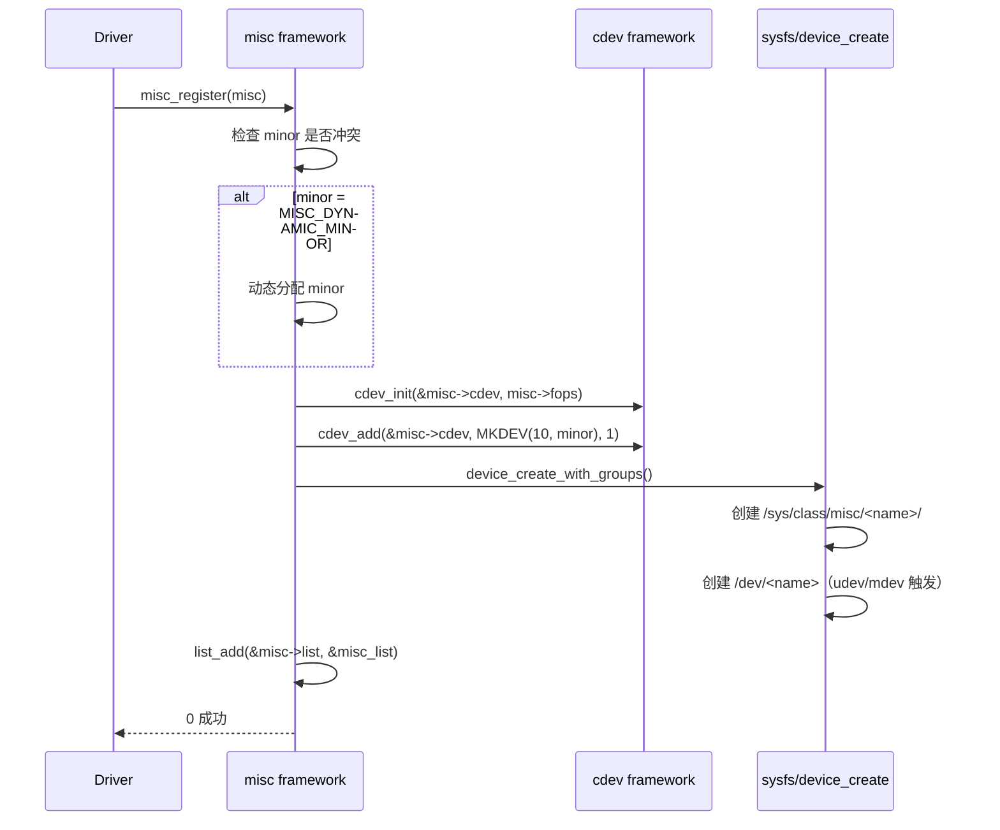
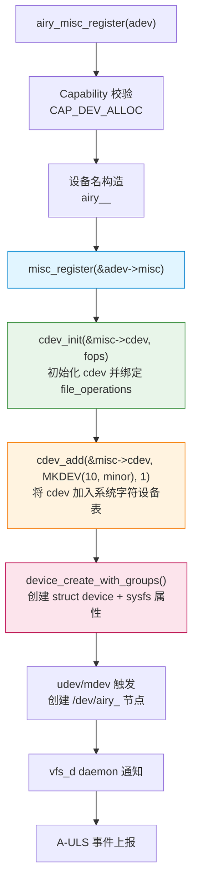
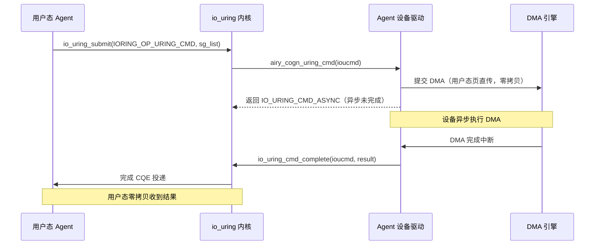
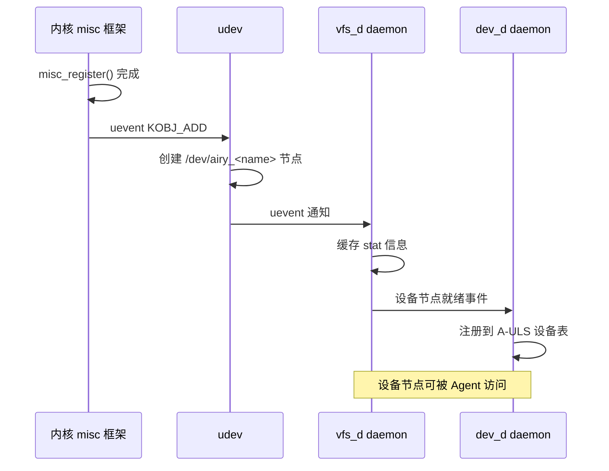

Copyright (c) 2025-2026 SPHARX Ltd. All Rights Reserved.

# agentrt-linux（AirymaxOS）驱动模型 — misc 设备框架与轻量字符设备
> **文档定位**：agentrt-linux（AirymaxOS）驱动子系统 60 模块第四篇——misc 设备框架与 `/dev/airy_*` 设备节点创建\
> **文档版本**：v1.0.1\
> **最后更新**： 2026-07-21\
> **上级文档**：[60-driver-model README](README.md)\
> **同源映射**：agentrt `daemons`（用户态 vfs_d 守护进程）+ Linux 6.6 `drivers/char/misc.c`（misc 设备框架实现）\
> **理论根基**：Linux 6.6 内核基线 + Airymax 五维正交 24 原则 + Airymax Unify Design（A-IPC 设备访问 fastpath）\
> **核心约束**：IRON-9 v3 [SC] 共享契约层——`AIRY_IOC_*` ioctl 命令编号通过 [SC] 头文件三路桥接，确保用户态/内核态/daemon 态一致

---

## 1. 概述

Linux 内核 misc 设备框架是字符设备的"轻量级封装"——它为不需要独立主设备号的简单字符设备提供共享主设备号（10）与统一注册接口。agentrt-linux v1.0.1 选择 misc 框架作为 Agent 虚拟设备的默认字符设备接口，原因有三：

1. **主设备号共享**：Agent 虚拟设备数量可能达数十个，misc 框架的共享主设备号（10）避免主设备号耗尽
2. **注册接口简洁**：`misc_register` 一步完成 `cdev_init` + `cdev_add` + `device_create`，与 devm 资源托管天然契合
3. **与 sysfs/udev 集成**：misc 设备自动创建 `/sys/class/misc/<name>/` 与 `/dev/<name>` 节点，便于 dev_d daemon 监管

本文档覆盖五大主题：misc 设备框架核心机制、Agent 虚拟设备注册接口（`airy_misc_register` / `airy_misc_deregister`）、设备文件操作（open/read/write/ioctl/release）、与 A-IPC 模块的关系（io_uring 作为设备访问的 fastpath）、与 VFS 用户态化的关系（vfs_d daemon 管理 `/dev/airy_*` 设备）。

| 字符设备注册方式 | 注册接口 | 主设备号 | agentrt-linux 适用度 |
|----------------|---------|---------|---------------------|
| **misc 框架** | `misc_register` | 共享 10 | **首选**（Agent 虚拟设备） |
| cdev 直注册 | `cdev_add` + `device_create` | 独立申请 | 仅特殊设备（如 vfio） |
| platform driver + cdev | `platform_driver` + `cdev_add` | 独立申请 | SoC 硬件设备 |
| 字符设备 early console | `register_console` | N/A | 仅早期控制台 |

> **OS-DRV-060**： agentrt-linux Agent 虚拟设备的字符设备接口必须通过 misc 框架注册，禁止直接使用 `cdev_add`。这是 K-1 内核极简原则的体现——misc 框架已足够承载 Agent 设备的字符设备接口。

> **OS-DRV-061**： `airy_misc_register` / `airy_misc_deregister` 必须通过 devm 资源托管（`devm_misc_register`）——设备注销时自动调用 `misc_deregister`，避免资源泄漏。

---

## 2. misc 设备框架核心机制

### 2.1 数据结构

Linux 6.6 `include/linux/miscdevice.h` 第 65 行定义了 misc 设备描述符：

```c
struct miscdevice {
    int                     minor;          /* 次设备号（MISC_DYNAMIC_MINOR = 动态分配） */
    const char              *name;          /* 设备名称（/dev/<name> 与 /sys/class/misc/<name>） */
    const struct file_operations *fops;     /* 文件操作表 */
    struct list_head        list;           /* 挂入 misc_list 全局链表 */
    struct device           *parent;        /* 父设备（拓扑） */
    struct device           *this_device;   /* 创建的 struct device 指针 */
    const struct attribute_group **dev_groups;
    const struct attribute_group **groups;
    umode_t                 mode;
};
```

misc 框架维护全局链表 `misc_list`，所有已注册的 miscdevice 通过 `list` 字段链入。主设备号固定为 `MISC_MAJOR`（10），次设备号由 `minor` 字段指定（或 `MISC_DYNAMIC_MINOR` 触发动态分配）。

### 2.2 misc_register 注册流程

`misc_register` 的核心步骤（`drivers/char/misc.c` 第 218 行）：



### 2.3 file_operations 共享

misc 框架本身不提供文件操作——它仅完成 cdev 注册与 sysfs 节点创建。实际的 `open` / `read` / `write` / `ioctl` / `release` 由 `miscdevice.fops` 字段指定的 `struct file_operations` 提供。

Linux 6.6 `drivers/char/misc.c` 第 138 行的 `misc_open` 在打开设备时通过 `filp->private_data = misc` 将 miscdevice 指针保存到文件私有数据，后续 file_operations 回调可通过 `filp->private_data` 访问 miscdevice（进而访问 driver 私有数据）。

```c
static int misc_open(struct inode *inode, struct file *file)
{
    struct miscdevice *misc = NULL;
    /* 通过 iminor(inode) 在 misc_list 中查找 */
    list_for_each_entry(misc, &misc_list, list) {
        if (MINOR(misc->minor) == iminor(inode)) {
            file->private_data = misc;
            break;
        }
    }
    /* 替换 file->f_op 为 misc->fops，并调用 fops->open */
    replace_fops(file, misc->fops);
    if (file->f_op->open)
        return file->f_op->open(inode, file);
    return 0;
}
```

> **OS-DRV-062**： Agent 设备的 `file_operations.open` 回调必须设置 `filp->private_data` 为 Agent 设备私有数据（通常通过 `container_of(misc, struct agent_dev, misc)` 获取），供后续 read/write/ioctl 使用。

---

## 3. Agent 虚拟设备注册接口

### 3.1 airy_misc_register / airy_misc_deregister

agentrt-linux v1.0.1 在 misc 框架之上封装了 Agent 虚拟设备专用注册接口：

```c
/**
 * struct airy_misc_dev - Agent 虚拟设备 misc 封装
 * @misc:           嵌入的 miscdevice
 * @agent_id:       所属 Agent ID
 * @dev_type:       设备类型（AIRY_DEV_COGN / AIRY_DEV_MEM / AIRY_DEV_TOOL）
 * @cap_mask:       访问该设备所需的 Capability 掩码
 * @driver_data:    驱动私有数据
 * @io_uring_ops:   io_uring fastpath 操作表（A-IPC fastpath 集成）
 */
struct airy_misc_dev {
    struct miscdevice           misc;
    u32                         agent_id;
    u32                         dev_type;
    u32                         cap_mask;
    void                        *driver_data;
    const struct airy_io_uring_ops *io_uring_ops;
};

/**
 * airy_misc_register() - 注册 Agent 虚拟设备为 misc 设备
 * @adev:          Agent misc 设备描述符
 * @cap_mask:      调用方持有的 Capability 掩码（必须含 CAP_DEV_ALLOC）
 *
 * 注册流程：
 *   1. A-ULS Capability 校验（CAP_DEV_ALLOC）
 *   2. devm 资源配额检查（参见 03-devm-resource.md）
 *   3. misc_register 创建 /dev/airy_<name> 节点
 *   4. 向 vfs_d daemon 上报设备节点创建事件
 *
 * 设备名称规则：/dev/airy_<agent_id>_<dev_type>，例如 /dev/airy_42_cogn
 *
 * 返回：0 成功，负数错误码失败：
 *   -AIRY_E_DEV_NOCAP     Capability 校验失败
 *   -AIRY_E_DEV_QUOTA     设备配额耗尽
 *   -AIRY_E_DEV_EXIST     设备名冲突
 *   -AIRY_E_DEV_NOMEM     内存分配失败
 */
int airy_misc_register(struct airy_misc_dev *adev, u32 cap_mask);

/**
 * airy_misc_deregister() - 注销 Agent 虚拟设备
 * @adev:          Agent misc 设备描述符
 *
 * 注销流程：
 *   1. 标记设备为"注销中"（拒绝新 open 请求）
 *   2. 等待现有 file_operations 调用完成（RCU 同步）
 *   3. misc_deregister 移除 /dev/airy_<name> 节点
 *   4. 通知 vfs_d daemon 移除设备节点缓存
 *   5. devm 资源自动释放（由 devres_release_all 触发）
 */
void airy_misc_deregister(struct airy_misc_dev *adev);
```

### 3.2 airy_misc_register 实现骨架

```c
int airy_misc_register(struct airy_misc_dev *adev, u32 cap_mask)
{
    int rc;

    /* 1. Capability 校验（纯 C LSM 钩子） */
    rc = airy_dev_alloc_check(&adev->misc.this_device, cap_mask);
    if (rc)
        return rc;

    /* 2. 构造设备名：/dev/airy_<agent_id>_<dev_type> */
    rc = scnprintf(adev->misc.name, AIRY_DEV_NAME_MAX,
                   "airy_%u_%s", adev->agent_id,
                   airy_dev_type_str(adev->dev_type));
    if (rc >= AIRY_DEV_NAME_MAX)
        return -AIRY_E_DEV_INVAL;

    /* 3. 设置动态次设备号 */
    adev->misc.minor = MISC_DYNAMIC_MINOR;

    /* 4. 调用 misc_register（cdev_init + cdev_add + device_create） */
    rc = misc_register(&adev->misc);
    if (rc) {
        airy_ulps_log(AIRY_ULPS_ERROR, "misc_register failed: %s rc=%d",
                      adev->misc.name, rc);
        return -AIRY_E_DEV_NOMEM;
    }

    /* 5. 上报 vfs_d daemon（设备节点创建事件） */
    airy_vfsd_notify_create(adev);

    /* 6. 上报 A-ULS（macro_d 记录设备生命周期） */
    airy_usv_report_event(AIRY_USV_EVT_DEV_CREATE, adev->agent_id,
                          adev->dev_type);

    return 0;
}
```

### 3.3 字符设备注册流程详解

`airy_misc_register` 内部调用 `misc_register`，后者完成字符设备注册的完整流程：



### 3.4 cdev_init / cdev_add / device_create 三步

字符设备注册的核心三步：

```c
/* 1. cdev_init：初始化 cdev 并绑定 file_operations */
void cdev_init(struct cdev *cdev, const struct file_operations *fops)
{
    memset(cdev, 0, sizeof(*cdev));
    INIT_LIST_HEAD(&cdev->list);
    kobject_init(&cdev->kobj, &ktype_cdev_default);
    cdev->ops = fops;
}

/* 2. cdev_add：将 cdev 注册到字符设备表（占据主次设备号） */
int cdev_add(struct cdev *p, dev_t dev, unsigned count)
{
    p->dev = dev;
    p->count = count;
    return kobj_map(cdev_map, dev, count, NULL, exact_match, exact_lock, p);
}

/* 3. device_create：创建 struct device 并触发 udev 创建 /dev 节点 */
struct device *device_create_with_groups(struct class *class,
        struct device *parent, dev_t devt, void *drvdata,
        const struct attribute_group **groups, const char *fmt, ...);
```

misc 框架将这三步封装为一次 `misc_register` 调用，开发者无需直接处理 cdev 细节。

---

## 4. 设备文件操作

### 4.1 file_operations 回调表

Agent 虚拟设备的典型 file_operations：

```c
/* Agent 认知传感器设备的 file_operations 示例 */
static const struct file_operations airy_cogn_fops = {
    .owner          = THIS_MODULE,
    .open           = airy_cogn_open,
    .read           = airy_cogn_read,
    .write          = airy_cogn_write,
    .unlocked_ioctl = airy_cogn_ioctl,
    .compat_ioctl   = airy_cogn_compat_ioctl,
    .release        = airy_cogn_release,
    .poll           = airy_cogn_poll,
    .mmap           = airy_cogn_mmap,
};
```

### 4.2 open / release 语义

```c
static int airy_cogn_open(struct inode *inode, struct file *filp)
{
    struct airy_misc_dev *adev;
    struct agent_dev_ctx *ctx;
    int rc;

    /* 1. 通过 misc 链表获取 airy_misc_dev */
    adev = container_of(filp->private_data, struct airy_misc_dev, misc);

    /* 2. Capability 校验（每次 open 都校验） */
    rc = airy_cap_check_open(adev->cap_mask);
    if (rc)
        return rc;

    /* 3. 分配打开上下文（记录 Agent 上下文、I/O 计数等） */
    ctx = kzalloc(sizeof(*ctx), GFP_KERNEL);
    if (!ctx)
        return -AIRY_E_DEV_NOMEM;

    ctx->adev = adev;
    ctx->open_time = ktime_get_ns();
    atomic_set(&ctx->io_count, 0);

    filp->private_data = ctx;

    /* 4. 上报 A-ULS open 事件 */
    airy_usv_report_event(AIRY_USV_EVT_DEV_OPEN, adev->agent_id, 0);

    return 0;
}

static int airy_cogn_release(struct inode *inode, struct file *filp)
{
    struct agent_dev_ctx *ctx = filp->private_data;

    /* 上报 A-ULS release 事件（含 I/O 计数统计） */
    airy_usv_report_event(AIRY_USV_EVT_DEV_CLOSE, ctx->adev->agent_id,
                          atomic_read(&ctx->io_count));

    kfree(ctx);
    return 0;
}
```

### 4.3 read / write 语义

Agent 设备的 read/write 路径遵循"系统调用慢路径 + io_uring fastpath"双路径设计：

```c
static ssize_t airy_cogn_read(struct file *filp, char __user *buf,
                              size_t count, loff_t *ppos)
{
    struct agent_dev_ctx *ctx = filp->private_data;
    struct airy_cogn_data *data;
    ssize_t rc;

    /* 1. 参数校验 */
    if (count > AIRY_COGN_READ_MAX)
        return -AIRY_E_DEV_INVAL;

    /* 2. 从认知传感器读取数据（可能阻塞） */
    data = airy_cogn_read_data(ctx, count);
    if (IS_ERR(data))
        return PTR_ERR(data);

    /* 3. 拷贝到用户态（慢路径，建议使用 io_uring fastpath） */
    if (copy_to_user(buf, data, count)) {
        rc = -AIRY_E_DEV_FAULT;
        goto out;
    }

    atomic_inc(&ctx->io_count);
    rc = count;

out:
    airy_cogn_release_data(data);
    return rc;
}
```

> **OS-DRV-063**： Agent 设备的 read/write 系统调用路径为"慢路径"——每次调用至少包含一次 `copy_to_user` / `copy_from_user`，延迟通常 ≥500ns。对延迟敏感的工作负载必须使用 io_uring fastpath（参见 §5）。

### 4.4 ioctl 命令编号体系

agentrt-linux v1.0.1 定义了统一的 ioctl 命令编号体系，通过 [SC] 头文件三路桥接：

```c
/* [SC] include/uapi/linux/airymax/airy_ioctl.h — ioctl 命令编号 */

/* 魔数：'A' = 0x41（Airymax） */
#define AIRY_IOC_MAGIC      'A'

/* 命令类型前缀（_IOC_DIR _IOC_TYPE _IOC_NR _IOC_SIZE） */
/* _IOC_NONE  = 0（无数据） */
/* _IOC_WRITE = 1（用户→内核） */
/* _IOC_READ  = 2（内核→用户） */

/* === 设备通用命令（0x00 - 0x1F） === */
#define AIRY_IOC_GET_DEV_INFO   _IOR(AIRY_IOC_MAGIC, 0x01, struct airy_dev_info)
#define AIRY_IOC_GET_AGENT_ID   _IOR(AIRY_IOC_MAGIC, 0x02, u32)
#define AIRY_IOC_GET_DEV_TYPE   _IOR(AIRY_IOC_MAGIC, 0x03, u32)
#define AIRY_IOC_GET_CAP_MASK   _IOR(AIRY_IOC_MAGIC, 0x04, u32)
#define AIRY_IOC_SET_NONBLOCK   _IO(AIRY_IOC_MAGIC, 0x05)

/* === 认知设备命令（0x20 - 0x3F） === */
#define AIRY_IOC_COGN_SENSE     _IOWR(AIRY_IOC_MAGIC, 0x20, struct airy_cogn_req)
#define AIRY_IOC_COGN_INFER     _IOWR(AIRY_IOC_MAGIC, 0x21, struct airy_cogn_infer_req)
#define AIRY_IOC_COGN_TRAIN     _IOW(AIRY_IOC_MAGIC, 0x22, struct airy_cogn_train_req)
#define AIRY_IOC_COGN_GET_METRICS _IOR(AIRY_IOC_MAGIC, 0x23, struct airy_cogn_metrics)

/* === 记忆设备命令（0x40 - 0x5F） === */
#define AIRY_IOC_MEM_STORE      _IOW(AIRY_IOC_MAGIC, 0x40, struct airy_mem_store_req)
#define AIRY_IOC_MEM_RECALL     _IOWR(AIRY_IOC_MAGIC, 0x41, struct airy_mem_recall_req)
#define AIRY_IOC_MEM_FORGET     _IOW(AIRY_IOC_MAGIC, 0x42, struct airy_mem_forget_req)
#define AIRY_IOC_MEM_GET_USAGE  _IOR(AIRY_IOC_MAGIC, 0x43, struct airy_mem_usage)

/* === 工具设备命令（0x60 - 0x7F） === */
#define AIRY_IOC_TOOL_INVOKE    _IOWR(AIRY_IOC_MAGIC, 0x60, struct airy_tool_invoke_req)
#define AIRY_IOC_TOOL_CANCEL    _IOW(AIRY_IOC_MAGIC, 0x61, u32)
#define AIRY_IOC_TOOL_GET_RESULT _IOWR(AIRY_IOC_MAGIC, 0x62, struct airy_tool_result_req)

/* === io_uring fastpath 命令（0x80 - 0x9F） === */
#define AIRY_IOC_URING_CMD      _IO(AIRY_IOC_MAGIC, 0x80)  /* IORING_OP_URING_CMD 入口 */

/* === 设备管理命令（0xA0 - 0xBF） === */
#define AIRY_IOC_RESET          _IO(AIRY_IOC_MAGIC, 0xA0)
#define AIRY_IOC_SUSPEND        _IO(AIRY_IOC_MAGIC, 0xA1)
#define AIRY_IOC_RESUME         _IO(AIRY_IOC_MAGIC, 0xA2)

/* 命令编号上限校验 */
#define AIRY_IOC_MAX_NR         0xBF
```

### 4.5 ioctl 实现

```c
static long airy_cogn_ioctl(struct file *filp, unsigned int cmd,
                            unsigned long arg)
{
    struct agent_dev_ctx *ctx = filp->private_data;
    void __user *uarg = (void __user *)arg;
    int rc = -AIRY_E_DEV_INVAL;

    /* 1. 命令编号校验 */
    if (_IOC_NR(cmd) > AIRY_IOC_MAX_NR)
        return -AIRY_E_DEV_INVAL;

    /* 2. 按命令类型分发 */
    switch (cmd) {
    case AIRY_IOC_GET_DEV_INFO: {
        struct airy_dev_info info;
        info.agent_id = ctx->adev->agent_id;
        info.dev_type = ctx->adev->dev_type;
        info.cap_mask = ctx->adev->cap_mask;
        rc = copy_to_user(uarg, &info, sizeof(info)) ? -AIRY_E_DEV_FAULT : 0;
        break;
    }
    case AIRY_IOC_COGN_SENSE: {
        struct airy_cogn_req req;
        if (copy_from_user(&req, uarg, sizeof(req)))
            return -AIRY_E_DEV_FAULT;
        rc = airy_cogn_handle_sense(ctx, &req);
        if (copy_to_user(uarg, &req, sizeof(req)))
            return -AIRY_E_DEV_FAULT;
        break;
    }
    /* ... 其他命令 ... */
    default:
        rc = -AIRY_E_DEV_INVAL;
    }

    atomic_inc(&ctx->io_count);
    return rc;
}
```

### 4.6 compat_ioctl 32 位兼容

```c
static long airy_cogn_compat_ioctl(struct file *filp, unsigned int cmd,
                                   unsigned long arg)
{
    /* 32 位用户态的指针大小不同，需要转换 */
    switch (cmd) {
    case AIRY_IOC_COGN_SENSE:
    case AIRY_IOC_COGN_INFER:
    case AIRY_IOC_MEM_STORE:
    case AIRY_IOC_MEM_RECALL:
    case AIRY_IOC_TOOL_INVOKE:
        /* 这些命令包含指针，需要 compat_ptr 转换 */
        return airy_cogn_ioctl(filp, cmd, (unsigned long)compat_ptr(arg));
    default:
        /* 无指针命令直接转发 */
        return airy_cogn_ioctl(filp, cmd, arg);
    }
}
```

---

## 5. 与 A-IPC 模块的关系

### 5.1 io_uring 作为设备访问的 fastpath

A-IPC（Unified Airymax IPC Fabric）模块的 fastpath 通过 `IORING_OP_URING_CMD` 暴露设备 DMA 能力到用户态。Agent 设备的 I/O 路径分两层：

| 路径 | 入口 | 延迟 | 适用场景 |
|------|------|------|---------|
| **慢路径（系统调用）** | read/write/ioctl | ≥500ns（含 copy_to/from_user） | 低频控制命令、调试 |
| **fastpath（io_uring）** | IORING_OP_URING_CMD | ≤50ns（零拷贝） | 高频数据 I/O、批量推理 |

### 5.2 IORING_OP_URING_CMD 集成

Linux 6.6 引入的 `IORING_OP_URING_CMD` 允许驱动注册自定义 io_uring 命令处理函数。Agent 设备通过 `struct file_operations` 的 `uring_cmd` 回调接入：

```c
/* Agent 认知设备的 io_uring 命令处理 */
static int airy_cogn_uring_cmd(struct io_uring_cmd *ioucmd,
                               unsigned int issue_flags)
{
    struct airy_misc_dev *adev = container_of(
        ioucmd->file->private_data, struct airy_misc_dev, misc);
    const struct airy_uring_cmd_hdr *hdr;
    int rc;

    /* 1. 解析命令头（io_uring pdu 内联数据区，OLK 6.6 io_uring_cmd_to_pdu 宏） */
    hdr = io_uring_cmd_to_pdu(ioucmd, const struct airy_uring_cmd_hdr);
    if (hdr->magic != AIRY_URING_CMD_MAGIC)
        return -AIRY_E_DEV_INVAL;

    /* 2. 按命令类型分发（与 ioctl 命令复用） */
    switch (hdr->cmd) {
    case AIRY_IOC_COGN_SENSE:
        rc = airy_cogn_uring_sense(adev, ioucmd, issue_flags);
        break;
    case AIRY_IOC_COGN_INFER:
        rc = airy_cogn_uring_infer(adev, ioucmd, issue_flags);
        break;
    default:
        rc = -AIRY_E_DEV_INVAL;
    }

    return rc;
}

static const struct file_operations airy_cogn_fops = {
    /* ... 常规回调 ... */
    .uring_cmd      = airy_cogn_uring_cmd,    /* io_uring fastpath 入口 */
};
```

### 5.3 fastpath 零拷贝语义

io_uring fastpath 的零拷贝通过 `io_uring_cmd` 注册的"完成回调"机制实现：



> **OS-DRV-064**： Agent 设备的 io_uring fastpath **不得**使用 page flipping——这是 [AirymaxOS 总览](../README.md) §2 技术选型声明第 2 条的硬性约束。零拷贝通过 `IORING_OP_URING_CMD` + 注册用户态页 + DMA 直传实现，不交换物理页。

### 5.4 与 A-IPC 数据面自治三原则的关系

A-IPC 数据面自治三原则在 Agent 设备 fastpath 的体现：

| 原则 | 在 misc 设备 fastpath 的体现 |
|------|----------------------------|
| **Ring 生命周期解耦** | io_uring ring 的创建/销毁与 misc 设备的注册/注销解耦——ring 可在设备注销后继续消化已有请求 |
| **离线缓存校验** | 设备 DMA 完成后，结果缓存在 ring CQE 中，用户态可延迟消费 |
| **Reconciliation** | 设备故障时，未完成的 io_uring 命令通过 CQE 错误码上报，由用户态 reconcile |

---

## 6. 与 VFS 用户态化的关系

### 6.1 vfs_d daemon 职责

`vfs_d` 是 12 个 daemon 中负责 VFS 用户态化的守护进程。它管理 `/dev/airy_*` 设备节点的元数据缓存与访问控制：

| 职责 | 实现位置 | 说明 |
|------|---------|------|
| 设备节点缓存 | `vfs_d` daemon 内存 | 缓存 `/dev/airy_*` 的 stat 信息，加速 path lookup |
| 访问控制 | `vfs_d` daemon + airy_lsm | 基于 Agent 身份的细粒度访问控制 |
| 设备节点创建监听 | netlink uevent | 监听 kernel uevent，更新缓存 |
| 设备故障隔离 | `vfs_d` daemon | 设备故障时阻断新 open 请求 |

### 6.2 设备节点创建流程



### 6.3 vfs_d 与 misc 框架的边界

| 职责 | 归属 | 备注 |
|------|------|------|
| `/dev/airy_*` 节点创建 | 内核 misc 框架 + udev | 通过 device_create 触发 |
| 节点元数据缓存 | vfs_d daemon | 用户态加速 |
| 节点访问控制 | vfs_d daemon + airy_lsm | LSM 钩子校验 + daemon 策略 |
| 节点删除 | 内核 misc 框架 + udev | 通过 misc_deregister 触发 |
| 节点故障隔离 | vfs_d daemon | 阻断新 open 请求 |

> **OS-DRV-065**： vfs_d daemon 的设备节点缓存**不得**作为访问控制的唯一依据——内核态 airy_lsm 钩子是冷酷执法的最终防线。vfs_d 缓存失效时（如 daemon 重启），必须回退到内核态校验。

---

## 7. devm_misc_register 托管式注册

### 7.1 devm 资源托管集成

`airy_misc_register` 应通过 devm 资源托管实现自动注销：

```c
static void devm_airy_misc_release(struct device *dev, void *res)
{
    struct airy_misc_dev **adev_ptr = res;
    airy_misc_deregister(*adev_ptr);
}

int devm_airy_misc_register(struct device *dev,
                            struct airy_misc_dev *adev, u32 cap_mask)
{
    struct airy_misc_dev **ptr;
    int rc;

    ptr = devres_alloc(devm_airy_misc_release, sizeof(*ptr), GFP_KERNEL);
    if (!ptr)
        return -AIRY_E_DEV_NOMEM;

    rc = airy_misc_register(adev, cap_mask);
    if (rc) {
        devres_free(ptr);
        return rc;
    }

    *ptr = adev;
    devres_add(dev, ptr);
    return 0;
}
```

### 7.2 与 03-devm-resource.md 的协同

`devm_airy_misc_register` 与 [03-devm-resource.md](03-devm-resource.md) §3 的 `airy_dev_alloc` 协作：

```c
/* Agent 驱动 probe 回调内的典型用法 */
static int airy_cogn_probe(struct device *dev)
{
    struct airy_cogn_priv *priv;
    int rc;

    priv = devm_kzalloc(dev, sizeof(*priv), GFP_KERNEL);
    if (!priv)
        return -AIRY_E_DEV_NOMEM;

    /* 1. 申请 Token 预算（devm_airy_token_budget） */
    rc = airy_dev_alloc(dev, AIRY_RES_TOKEN, sizeof(u32), 0,
                        CAP_DEV_ALLOC);
    if (rc < 0)
        return rc;

    /* 2. 申请 IPC 通道（devm_airy_ipc_channel） */
    rc = airy_dev_alloc(dev, AIRY_RES_IPC, 0, 0, CAP_DEV_ALLOC);
    if (rc < 0)
        return rc;

    /* 3. 申请 DMA 池（devm_airy_dma_pool） */
    rc = airy_dev_alloc(dev, AIRY_RES_DMA, AIRY_COGN_DMA_POOL_SIZE, 0,
                        CAP_DEV_ALLOC);
    if (rc < 0)
        return rc;

    /* 4. 注册 misc 设备（devm_airy_misc_register） */
    priv->adev.agent_id = (u32)(uintptr_t)dev_get_drvdata(dev);
    priv->adev.dev_type = AIRY_DEV_COGN;
    priv->adev.misc.fops = &airy_cogn_fops;
    priv->adev.io_uring_ops = &airy_cogn_uring_ops;

    rc = devm_airy_misc_register(dev, &priv->adev, CAP_DEV_ALLOC);
    if (rc)
        return rc;

    dev_set_drvdata(dev, priv);
    return 0;
}
```

---

## 8. 设备命名与命名空间隔离

### 8.1 命名规则

agentrt-linux v1.0.1 的 Agent 设备命名规则：

```
/dev/airy_<agent_id>_<dev_type>[_<instance>]
```

| 字段 | 含义 | 示例 |
|------|------|------|
| `airy_` | Airymax 前缀 | 固定 |
| `<agent_id>` | Agent ID（十进制） | `42` |
| `<dev_type>` | 设备类型（cogn/mem/tool） | `cogn` |
| `<instance>` | 实例号（可选，同类多实例时） | `0`, `1` |

示例：
- `/dev/airy_42_cogn`：Agent 42 的认知传感器
- `/dev/airy_42_mem_0`：Agent 42 的第一个记忆存储器
- `/dev/airy_42_tool_3`：Agent 42 的第四个工具执行器

### 8.2 命名空间隔离

每个 Agent 通过 mount namespace 隔离自己的设备视图：

```bash
# Agent 42 的 mount namespace 内仅可见自己的设备
$ ls /dev/airy_*
/dev/airy_42_cogn  /dev/airy_42_mem_0  /dev/airy_42_tool_3
```

实现方式：`vfs_d` daemon 在 Agent 创建时为其 mount namespace 绑定只包含该 Agent 设备的 `/dev` 子树。

> **OS-DRV-066**： Agent 设备的命名空间隔离**不得**依赖 sysfs 权限——sysfs 权限可被 root 绕过。必须通过 mount namespace 实现"不可见"隔离，配合 airy_lsm 实现"不可访问"隔离。

---

## 9. 与其他文档的关系

### 9.1 与 03-devm-resource.md 的关系

misc 设备注册通过 `devm_airy_misc_register` 与 devm 资源托管集成——设备注销时自动调用 `misc_deregister`。Agent 驱动在 probe 回调内先通过 `airy_dev_alloc` 申请智能体资源（Token/IPC/DMA），再通过 `devm_airy_misc_register` 注册字符设备。

### 9.2 与 05-agent-driver.md 的关系

`airy_misc_register` 是 Agent 虚拟设备驱动注册流程的最后一步（参见 [05-agent-driver.md](05-agent-driver.md) §3）：

1. `airy_agent_driver_register` → A-ULS 审核
2. devm 分配资源（Token/IPC/DMA）
3. **misc 创建设备节点**（本文档）

### 9.3 与 06-vfio-passthrough.md 的关系

VFIO 直通设备**不**通过 misc 框架注册——它使用独立的 `/dev/vfio/<group>` 接口。但 VFIO 直通设备的"用户态视图"（如 `/dev/airy_<id>_gpu` 软链接）由 misc 框架创建，便于 vfs_d 统一管理。

### 9.4 与 07-driver-testing.md 的关系

misc 设备框架的测试覆盖在 [07-driver-testing.md](07-driver-testing.md) 详述，包括：注册/注销测试、file_operations 回调测试、ioctl 命令编号校验、io_uring fastpath 与慢路径一致性测试。

---

## 10. 实现清单与里程碑

### 10.1 v1.0.1 实现清单

| # | 工作项 | 责任模块 | 状态 |
|---|--------|---------|------|
| 1 | `struct airy_misc_dev` 定义 | `include/airymax/misc_agent.h` | 待实现 |
| 2 | `airy_misc_register` / `airy_misc_deregister` 实现 | `drivers/airymax/misc_agent.c` | 待实现 |
| 3 | `devm_airy_misc_register` 托管式封装 | `drivers/airymax/misc_agent.c` | 待实现 |
| 4 | `AIRY_IOC_*` ioctl 命令编号体系 [SC] 头文件 | `include/uapi/linux/airymax/airy_ioctl.h` | 待实现 |
| 5 | io_uring fastpath 集成（`uring_cmd` 回调） | `drivers/airymax/misc_agent.c` | 待实现 |
| 6 | vfs_d daemon 设备节点缓存逻辑 | `daemons/vfs_d/dev_cache.c` | 待实现 |
| 7 | KUnit 单元测试（≥25 用例） | `drivers/airymax/misc_agent_test.c` | 待实现 |
| 8 | kselftest 集成测试（≥8 用例） | `tools/testing/selftests/airymax/misc/` | 待实现 |

### 10.2 与 v1.0 的差异

v1.0 文档未单独覆盖 misc 框架——misc 设备的提及散见于 `01-device-model.md` 与 `02-platform-driver.md`。v1.0.1 系统化定义：

1. **Agent 虚拟设备 misc 封装**（`struct airy_misc_dev`）
2. **`airy_misc_register` / `airy_misc_deregister` 接口**
3. **`AIRY_IOC_*` ioctl 命令编号体系**
4. **io_uring fastpath 集成**（`uring_cmd` 回调）
5. **vfs_d daemon 设备节点缓存**

---

## 11. 版本历史

| 版本 | 日期 | 变更 |
|------|------|------|
| v1.0.1 | 2026-07-18 | 初始版本：定义 misc 框架在 Agent 虚拟设备的应用、`airy_misc_register` 接口、`AIRY_IOC_*` 命令编号、io_uring fastpath 集成、vfs_d daemon 协同 |

---

## 12. 参考材料

- Linux 6.6 `drivers/char/misc.c`（misc 框架实现）
- Linux 6.6 `include/linux/miscdevice.h`（miscdevice 结构定义）
- Linux 6.6 `fs/io_uring.c`（`IORING_OP_URING_CMD` 实现）
- Linux 6.6 `Documentation/driver-api/driver-model/`（cdev 注册流程）
- [01-device-model.md](01-device-model.md) §2（device/driver/bus 四元关系）
- [02-platform-driver.md](02-platform-driver.md) §6（platform driver 的 cdev 集成）
- [03-devm-resource.md](03-devm-resource.md) §3（devm_airy_* 资源族）
- [../10-architecture/10-unify-design.md](../10-architecture/10-unify-design.md) §8（A-IPC 总纲）
- [../30-interfaces/07-ipc-fastpath.md](../30-interfaces/07-ipc-fastpath.md)（io_uring fastpath）
- [../50-engineering-standards/11-sc-header-type-bridging.md](../50-engineering-standards/11-sc-header-type-bridging.md)（[SC] 头文件桥接）

---

> **文档结束** | agentrt-linux 驱动模型 — misc 设备框架与轻量字符设备 v1.0.1 | 维护者：开源极境工程与规范委员会 | "From data intelligence emerges."
