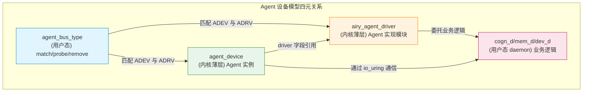
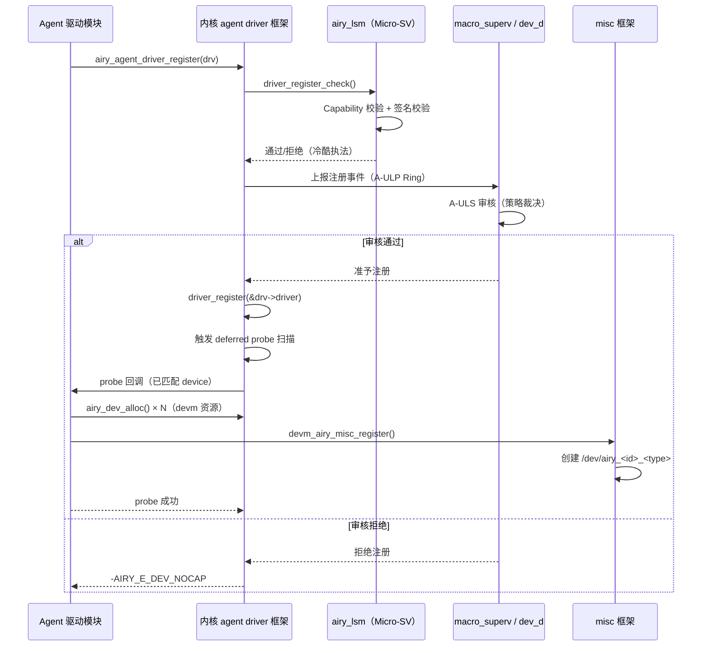
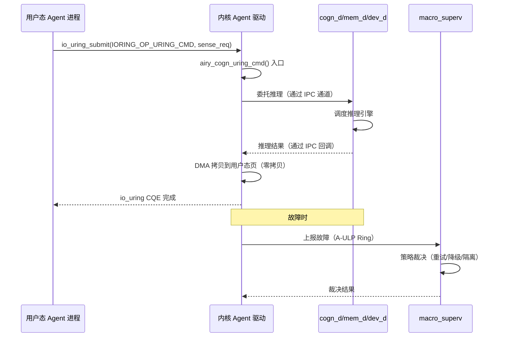
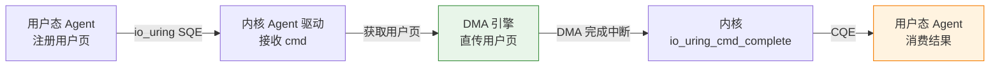
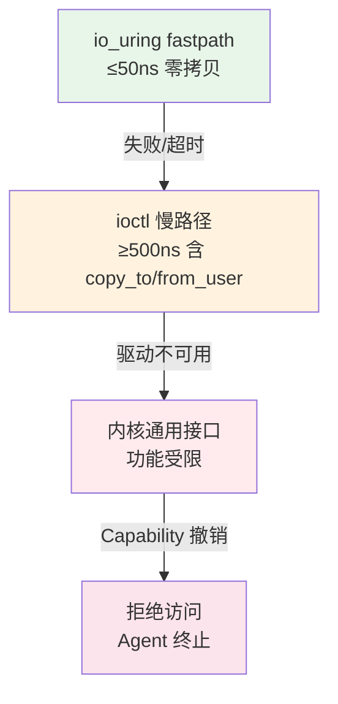

Copyright (c) 2025-2026 SPHARX Ltd. All Rights Reserved.

# agentrt-linux（AirymaxOS）驱动模型 — Agent 虚拟设备驱动
> **文档定位**：agentrt-linux（AirymaxOS）驱动子系统 60 模块第五篇——agentrt-linux 专属 Agent 虚拟设备驱动模型（核心抽象）\
> **文档版本**：v1.0.1\
> **最后更新**：2026-07-18\
> **上级文档**：[60-driver-model README](README.md)\
> **同源映射**：agentrt `daemons`（cogn_d/mem_d/dev_d 守护进程）+ Linux 6.6 `drivers/base/`（driver 框架扩展）\
> **理论根基**：Linux 6.6 内核基线 + Airymax 五维正交 24 原则 + Airymax Unify Design（A-ULS 设备生命周期 + A-IPC fastpath）\
> **核心约束**：IRON-9 v3 [IND] 独立实现层——Agent 虚拟设备驱动是 agentrt-linux 专属，不回传上游内核；[DSL] 降级生存层保证驱动不可用时回退到系统调用

---

## 1. 概述

Agent 虚拟设备驱动是 agentrt-linux 区别于通用 Linux 发行版的核心抽象。它将"Agent 行为契约"作为一类虚拟设备纳入 Linux device/driver/bus 三元组——Agent 实现模块作为 driver，Agent 实例作为 device，匹配两者的是 agentrt-linux 自研的 `agent_bus_type`（用户态）+ `agent_driver` 内核封装（内核态薄层）。

这一抽象的设计动机有三：

1. **统一资源监管**：Agent 通过驱动模型获得 devm 资源托管、sysfs 导出、A-ULS 生命周期监管等"免费"基础设施，无需重复造轮子
2. **io_uring fastpath 自然接入**：Agent 设备作为字符设备可通过 `IORING_OP_URING_CMD` 接入 A-IPC fastpath，实现 ≤50ns 的零拷贝 I/O
3. **Capability 模型统一**：Agent 设备访问通过 `CAP_DEV_ALLOC` 等 capability 校验，与硬件设备访问一致

本文档覆盖六大主题：Agent 设备模型、驱动注册流程、Agent 设备类型（认知/记忆/工具）、与 cogn_d/mem_d/dev_d daemon 的交互协议、io_uring fastpath、[DSL] 降级模式。

| Agent 设备类型 | 对应 daemon | 设备类型常量 | 典型用途 | io_uring fastpath |
|--------------|-----------|-------------|---------|------------------|
| 认知传感器 | cogn_d | `AIRY_DEV_COGN` | 感知、推理、训练 | 推理结果批量返回 |
| 记忆存储器 | mem_d | `AIRY_DEV_MEM` | 长期/工作记忆读写 | 记忆向量批量检索 |
| 工具执行器 | dev_d | `AIRY_DEV_TOOL` | 外部工具调用 | 异步工具结果回传 |

> **OS-DRV-080**： Agent 虚拟设备驱动**必须**通过 `airy_agent_driver_register` 注册到 agentrt-linux 自研的 agent driver 框架，禁止直接使用 `driver_register`。这是 A-ULS 监管强制约束——绕过注册的 Agent 驱动无法获得 Capability、配额、审计等监管能力。

> **OS-DRV-081**： Agent 虚拟设备驱动的 `probe` / `remove` 回调必须通过 devm 资源托管（参见 [03-devm-resource.md](03-devm-resource.md)）申请所有资源——禁止裸调用 `kmalloc` / `ioremap` 等。airy_lsm 钩子会拒绝未通过 devm 托管的资源申请。

---

## 2. Agent 设备模型

### 2.1 核心抽象

Agent 设备模型将"Agent 行为契约"建模为 Linux 标准的 device/driver 关系：



| 角色 | 内核态实现 | 用户态实现 | 职责 |
|------|-----------|-----------|------|
| **device** | `struct agent_device`（薄封装 `struct device`） | cogn_d/mem_d 创建实例 | 描述 Agent 实例（ID、状态、资源） |
| **driver** | `struct airy_agent_driver`（薄封装 `struct device_driver`） | cogn_d/mem_d 提供业务 | 描述 Agent 实现模块（probe/remove 回调） |
| **bus** | `agent_bus_type`（内核注册，逻辑在用户态 daemon） | `agent_bus_d` 守护进程 | 匹配 device 与 driver |
| **class** | `agent_class`（`/sys/class/agent/`） | vfs_d 管理 | Agent 设备功能分组 |

### 2.2 内核薄层设计原则

agentrt-linux 遵循 K-1 内核极简原则——Agent 设备模型的"业务逻辑"（认知推理、记忆检索、工具调用）全部在用户态 daemon 实现，内核态仅保留"薄层"：

| 内核态职责 | 用户态职责 |
|-----------|-----------|
| `struct device` 生命周期管理（kref/kobject） | Agent 业务逻辑实现 |
| devm 资源托管框架 | Token 预算策略裁决 |
| sysfs 节点创建/删除 | 记忆卷载内容管理 |
| io_uring `uring_cmd` 回调入口 | 工具调用业务执行 |
| Capability 校验（airy_lsm 钩子） | 配额策略下发（macro_superv） |

> **OS-DRV-082**： 内核态 Agent 驱动代码体积（不含通用 devm/cdev 框架）单驱动**不得超过 2000 行**——这是 K-1 极简原则的量化约束。超过此阈值的业务逻辑必须迁移到用户态 daemon。

---

## 3. 驱动注册流程

### 3.1 完整注册流程

Agent 虚拟设备驱动注册流程涉及五个参与方：



### 3.2 注册流程五步

1. **Capability 校验**：`airy_lsm` 校验调用方持有 `CAP_AGENT_DRIVER_REGISTER`（纯 C LSM 钩子，冷酷执法）
2. **A-ULS 审核**：上报 `macro_superv` + `dev_d`，由策略裁决是否允许注册（温情裁决，可申诉）
3. **driver_register**：调用 Linux 标准 `driver_register` 将驱动加入 `agent_bus_type`
4. **deferred probe**：扫描已注册但未绑定驱动的 Agent device，触发 `match` + `probe`
5. **devm + misc 注册**：probe 回调内通过 `airy_dev_alloc` 申请资源，`devm_airy_misc_register` 创建设备节点

### 3.3airy_agent_driver_register 接口

```c
/**
 * airy_agent_driver_register() - 注册 Agent 虚拟设备驱动
 * @drv:         Agent 驱动描述符
 * @cap_mask:    调用方持有的 Capability 掩码
 *
 * 注册流程参见 §3.1。注册后驱动进入 agent_bus_type，与已注册的
 * agent_device 匹配成功后触发 probe 回调。
 *
 * 上下文：可能睡眠（A-ULS 审核可能等待）
 * 返回：0 成功，负数错误码失败：
 *   -AIRY_E_DEV_NOCAP     Capability 校验失败
 *   -AIRY_E_DEV_REJECTED  A-ULS 审核拒绝
 *   -AIRY_E_DEV_EXIST     驱动名冲突
 *   -AIRY_E_DEV_NOMEM     内存分配失败
 */
int airy_agent_driver_register(struct airy_agent_driver *drv, u32 cap_mask);

/**
 * airy_agent_driver_unregister() - 注销 Agent 虚拟设备驱动
 * @drv:         Agent 驱动描述符
 *
 * 注销流程：
 *   1. 标记驱动为"注销中"
 *   2. 触发所有已绑定 device 的 remove 回调
 *   3. devm 资源自动释放（devres_release_all）
 *   4. 从 agent_bus_type 移除驱动
 *   5. 上报 A-ULS 注销事件
 */
void airy_agent_driver_unregister(struct airy_agent_driver *drv);
```

### 3.4 airy_agent_driver_register 实现骨架

```c
int airy_agent_driver_register(struct airy_agent_driver *drv, u32 cap_mask)
{
    int rc;

    /* 1. 参数校验 */
    if (!drv || !drv->name || !drv->probe || !drv->remove)
        return -AIRY_E_DEV_INVAL;

    if (drv->dev_type > AIRY_DEV_TOOL)
        return -AIRY_E_DEV_INVAL;

    /* 2. Capability 校验（纯 C LSM 钩子） */
    rc = airy_lsm_check_agent_driver_register(drv, cap_mask);
    if (rc) {
        airy_ulps_log(AIRY_ULPS_ERROR,
                      "agent_driver_register cap_check failed: %s rc=%d",
                      drv->name, rc);
        return rc;
    }

    /* 3. A-ULS 审核（异步等待 macro_superv 裁决） */
    rc = airy_usv_audit_driver_register(drv);
    if (rc) {
        airy_ulps_log(AIRY_ULPS_ERROR,
                      "agent_driver_register usv_audit failed: %s rc=%d",
                      drv->name, rc);
        return rc;
    }

    /* 4. 初始化底层 device_driver */
    drv->driver.name = drv->name;
    drv->driver.bus = &agent_bus_type;
    drv->driver.probe = airy_agent_drv_probe;       /* 框架包装 */
    drv->driver.remove = airy_agent_drv_remove;     /* 框架包装 */
    drv->driver.owner = drv->owner;
    drv->driver.mod_name = KBUILD_MODNAME;
    drv->driver.dev_groups = drv->dev_groups;

    /* 5. 调用 Linux 标准 driver_register */
    rc = driver_register(&drv->driver);
    if (rc) {
        airy_ulps_log(AIRY_ULPS_ERROR,
                      "driver_register failed: %s rc=%d", drv->name, rc);
        return -AIRY_E_DEV_NOMEM;
    }

    /* 6. 上报 A-ULS 注册成功事件 */
    airy_usv_report_event(AIRY_USV_EVT_DRIVER_REGISTERED, 0, drv->dev_type);

    return 0;
}
```

---

## 4. Agent 设备类型

### 4.1 三种设备类型

agentrt-linux v1.0.1 定义三种 Agent 设备类型：

```c
/* include/uapi/linux/airymax/agent_dev.h */
enum airy_dev_type {
    AIRY_DEV_COGN   = 0,    /* 认知传感器 */
    AIRY_DEV_MEM    = 1,    /* 记忆存储器 */
    AIRY_DEV_TOOL   = 2,    /* 工具执行器 */

    AIRY_DEV_TYPE_MAX,
};

static inline const char *airy_dev_type_str(u32 type)
{
    static const char * const names[] = {
        [AIRY_DEV_COGN] = "cogn",
        [AIRY_DEV_MEM]  = "mem",
        [AIRY_DEV_TOOL] = "tool",
    };
    return type < AIRY_DEV_TYPE_MAX ? names[type] : "unknown";
}
```

### 4.2 认知传感器（AIRY_DEV_COGN）

认知传感器是 Agent 的"感官"——它接收外部输入（图像、文本、传感器数据），执行推理，输出认知结果。

| 属性 | 值 |
|------|---|
| 对应 daemon | cogn_d |
| 典型 ioctl | `AIRY_IOC_COGN_SENSE` / `AIRY_IOC_COGN_INFER` / `AIRY_IOC_COGN_TRAIN` |
| io_uring fastpath | 批量推理结果零拷贝返回 |
| 资源需求 | 高 DMA（推理引擎权重）+ 中 IPC（结果上报）+ 中 Token |
| 典型延迟 | 推理 5-50ms（模型相关），fastpath 调度 ≤50ns |

### 4.3 记忆存储器（AIRY_DEV_MEM）

记忆存储器是 Agent 的"长期记忆"——它持久化 Agent 的训练数据、对话历史、向量索引。

| 属性 | 值 |
|------|---|
| 对应 daemon | mem_d |
| 典型 ioctl | `AIRY_IOC_MEM_STORE` / `AIRY_IOC_MEM_RECALL` / `AIRY_IOC_MEM_FORGET` |
| io_uring fastpath | 向量批量检索零拷贝返回 |
| 资源需求 | 高内存（卷载映射）+ 中 DMA（向量索引）+ 低 Token |
| 典型延迟 | 检索 1-10ms（索引相关），fastpath 调度 ≤50ns |

### 4.4 工具执行器（AIRY_DEV_TOOL）

工具执行器是 Agent 的"双手"——它调用外部工具（API、命令行、数据库）并返回结果。

| 属性 | 值 |
|------|---|
| 对应 daemon | dev_d |
| 典型 ioctl | `AIRY_IOC_TOOL_INVOKE` / `AIRY_IOC_TOOL_CANCEL` / `AIRY_IOC_TOOL_GET_RESULT` |
| io_uring fastpath | 异步工具结果零拷贝回传 |
| 资源需求 | 中 IPC（工具调用）+ 低 DMA（结果缓冲）+ 中 Token |
| 典型延迟 | 工具执行 100ms-10s（工具相关），fastpath 调度 ≤50ns |

---

## 5. struct airy_agent_driver 与 ops

### 5.1 核心数据结构

```c
/**
 * struct airy_agent_driver - Agent 虚拟设备驱动描述符
 * @driver:        嵌入的 struct device_driver（与 Linux 驱动核心对接）
 * @name:          驱动名称（与 agent_device.name 匹配）
 * @dev_type:      设备类型（AIRY_DEV_COGN / AIRY_DEV_MEM / AIRY_DEV_TOOL）
 * @owner:         模块所有者（THIS_MODULE）
 * @dev_groups:    sysfs 属性组
 * @ops:           Agent 驱动操作表（参见 §5.2）
 * @io_uring_ops:  io_uring fastpath 操作表（参见 §7.2）
 * @cap_required:  该驱动所需的最小 Capability 掩码
 * @daemon_id:     对应的用户态 daemon ID（cogn_d/mem_d/dev_d）
 * @priv:          驱动私有数据
 *
 * agentrt-linux v1.0.1 专属扩展，不回传上游内核（[IND] 独立实现层）。
 */
struct airy_agent_driver {
    struct device_driver          driver;
    const char                    *name;
    enum airy_dev_type            dev_type;
    struct module                 *owner;
    const struct attribute_group  **dev_groups;
    const struct airy_agent_driver_ops *ops;
    const struct airy_io_uring_ops    *io_uring_ops;
    u32                           cap_required;
    u32                           daemon_id;
    void                          *priv;
};
```

### 5.2 airy_agent_driver_ops

```c
/**
 * struct airy_agent_driver_ops - Agent 驱动操作表
 *
 * probe/remove 与 Linux 标准 driver 一致，其余为 agentrt-linux 扩展。
 */
struct airy_agent_driver_ops {
    /**
     * probe() - Agent 设备绑定驱动时调用
     * @dev:        Agent 设备（struct agent_device *）
     *
     * 必须通过 devm_airy_* 申请所有资源。
     * 返回 0 成功，负数错误码失败（-EPROBE_DEFER 触发延迟重试）。
     */
    int     (*probe)(struct agent_device *dev);

    /**
     * remove() - Agent 设备解绑驱动时调用
     * @dev:        Agent 设备
     *
     * devm 资源由框架自动释放，无需手动 free。
     */
    void    (*remove)(struct agent_device *dev);

    /**
     * suspend() - Agent 设备进入 SUSPENDED 状态
     * @dev:        Agent 设备
     *
     * 应释放 DMA/IPC 资源，保留 TOKEN 资源（参见 03-devm-resource.md §4.3）。
     */
    int     (*suspend)(struct agent_device *dev);

    /**
     * resume() - Agent 设备从 SUSPENDED 恢复
     * @dev:        Agent 设备
     */
    int     (*resume)(struct agent_device *dev);

    /**
     * fault() - Agent 设备故障回调
     * @dev:        Agent 设备
     * @fault_type: 故障类型（AIRY_FAULT_DMA / AIRY_FAULT_TIMEOUT 等）
     *
     * 故障回调不得释放资源——devm 资源由 A-ULS 在审计完成后释放。
     * 返回 0 表示已处理，负数表示需要 A-ULS 升级处理。
     */
    int     (*fault)(struct agent_device *dev, u32 fault_type);

    /**
     * ioctl() - Agent 设备 ioctl 命令处理（慢路径）
     * @dev:        Agent 设备
     * @cmd:        ioctl 命令编号（AIRY_IOC_*）
     * @arg:        用户态参数
     */
    long    (*ioctl)(struct agent_device *dev, unsigned int cmd,
                     unsigned long arg);

    /**
     * uring_cmd() - io_uring fastpath 命令处理
     * @dev:        Agent 设备
     * @ioucmd:     io_uring 命令结构
     * @issue_flags: 命令派发标志
     *
     * 返回 IO_URING_CMD_ASYNC 表示异步未完成，否则返回结果。
     */
    int     (*uring_cmd)(struct agent_device *dev, struct io_uring_cmd *ioucmd,
                         unsigned int issue_flags);
};
```

### 5.3 认知驱动示例骨架

```c
/* drivers/airymax/cogn/cogn_driver.c — 认知传感器驱动示例骨架 */

static const struct airy_agent_driver_ops cogn_ops = {
    .probe      = airy_cogn_probe,
    .remove     = airy_cogn_remove,
    .suspend    = airy_cogn_suspend,
    .resume     = airy_cogn_resume,
    .fault      = airy_cogn_fault,
    .ioctl      = airy_cogn_ioctl,
    .uring_cmd  = airy_cogn_uring_cmd,
};

static const struct airy_io_uring_ops cogn_uring_ops = {
    .prep       = airy_cogn_uring_prep,
    .issue      = airy_cogn_uring_issue,
    .complete   = airy_cogn_uring_complete,
    .cancel     = airy_cogn_uring_cancel,
};

static struct airy_agent_driver cogn_driver = {
    .name           = "airy_cogn",
    .dev_type       = AIRY_DEV_COGN,
    .owner          = THIS_MODULE,
    .ops            = &cogn_ops,
    .io_uring_ops   = &cogn_uring_ops,
    .cap_required   = CAP_DEV_ALLOC | CAP_DEV_FREE | CAP_COGN_INFER,
    .daemon_id      = AIRY_DAEMON_COGN_D,
    .dev_groups     = cogn_dev_groups,
};

static int __init airy_cogn_init(void)
{
    return airy_agent_driver_register(&cogn_driver, CAP_AGENT_DRIVER_REGISTER);
}
module_init(airy_cogn_init);

static void __exit airy_cogn_exit(void)
{
    airy_agent_driver_unregister(&cogn_driver);
}
module_exit(airy_cogn_exit);

MODULE_LICENSE("GPL");
MODULE_AUTHOR("SPHARX Ltd.");
MODULE_DESCRIPTION("AirymaxOS Agent Cognitive Sensor Driver");
```

### 5.4 probe 回调详细示例

```c
static int airy_cogn_probe(struct agent_device *adev)
{
    struct airy_cogn_priv *priv;
    u64 token_handle, ipc_handle, dma_handle;
    int rc;

    /* 1. 分配驱动私有数据（devm 托管） */
    priv = devm_kzalloc(&adev->dev, sizeof(*priv), GFP_KERNEL);
    if (!priv)
        return -AIRY_E_DEV_NOMEM;

    priv->adev = adev;
    dev_set_drvdata(&adev->dev, priv);

    /* 2. 申请 Token 预算（认知 Agent 需要中优先级） */
    token_handle = airy_dev_alloc(&adev->dev, AIRY_RES_TOKEN,
                                   sizeof(u32), AIRY_RES_F_EXCLUSIVE,
                                   CAP_DEV_ALLOC);
    if (token_handle < 0)
        return token_handle;
    priv->token_handle = token_handle;

    /* 3. 申请 IPC 通道（推理结果上报） */
    ipc_handle = airy_dev_alloc(&adev->dev, AIRY_RES_IPC, 0, 0,
                                 CAP_DEV_ALLOC);
    if (ipc_handle < 0)
        return ipc_handle;
    priv->ipc_handle = ipc_handle;

    /* 4. 申请 DMA 描述符池（推理引擎权重加载） */
    dma_handle = airy_dev_alloc(&adev->dev, AIRY_RES_DMA,
                                 AIRY_COGN_DMA_POOL_SIZE, 0,
                                 CAP_DEV_ALLOC);
    if (dma_handle < 0)
        return dma_handle;
    priv->dma_handle = dma_handle;

    /* 5. 注册 misc 设备（创建 /dev/airy_<id>_cogn） */
    priv->misc_dev.agent_id = adev->agent_id;
    priv->misc_dev.dev_type = AIRY_DEV_COGN;
    priv->misc_dev.misc.fops = &airy_cogn_fops;
    priv->misc_dev.misc.mode = 0660;
    priv->misc_dev.io_uring_ops = &cogn_uring_ops;

    rc = devm_airy_misc_register(&adev->dev, &priv->misc_dev,
                                  CAP_DEV_ALLOC);
    if (rc)
        return rc;

    /* 6. 通知 cogn_d daemon 设备已就绪 */
    rc = airy_daemon_notify(AIRY_DAEMON_COGN_D,
                            AIRY_DAEMON_EVT_DEV_READY,
                            adev->agent_id, AIRY_DEV_COGN);
    if (rc)
        airy_ulps_log(AIRY_ULPS_WARN,
                      "cogn_d notify failed (non-fatal): %d", rc);

    /* 7. Agent 设备状态：SPAWNING → READY */
    airy_agent_dev_state_set(adev, AGENT_DEV_ALLOCATED);

    return 0;
}
```

---

## 6. 与 cogn_d / mem_d / dev_d daemon 的交互协议

### 6.1 交互模型

Agent 驱动（内核态薄层）与 cogn_d/mem_d/dev_d daemon（用户态业务）通过两种通道交互：

| 通道 | 方向 | 用途 | 延迟 |
|------|------|------|------|
| **A-ULP Ring** | 内核 → daemon | 事件上报（设备就绪、故障、状态变更） | 异步，~1μs |
| **io_uring cmd** | daemon → 内核 | 业务命令（推理请求、记忆检索） | 同步/异步，≤50ns fastpath |

### 6.2 完整交互时序



### 6.3 daemon 通知接口

```c
/**
 * airy_daemon_notify() - 向 daemon 发送通知
 * @daemon_id:    目标 daemon ID（AIRY_DAEMON_COGN_D / MEM_D / DEV_D）
 * @event:        事件类型
 * @agent_id:     相关 Agent ID
 * @dev_type:     相关设备类型
 *
 * 通过 A-ULP Ring 异步发送，不阻塞调用方。
 * 返回：0 成功（已入队），负数错误码失败
 */
int airy_daemon_notify(u32 daemon_id, u32 event, u32 agent_id, u32 dev_type);

/* daemon ID 定义 */
#define AIRY_DAEMON_MACRO_SUPERV    0
#define AIRY_DAEMON_LOGGER          1
#define AIRY_DAEMON_CONFIG          2
#define AIRY_DAEMON_GATEWAY         3
#define AIRY_DAEMON_SCHED           4
#define AIRY_DAEMON_VFS             5
#define AIRY_DAEMON_NET             6
#define AIRY_DAEMON_MEM             7
#define AIRY_DAEMON_COGN            8
#define AIRY_DAEMON_SEC             9
#define AIRY_DAEMON_AUDIT           10
#define AIRY_DAEMON_DEV             11

/* 事件类型 */
#define AIRY_DAEMON_EVT_DEV_READY       0x01
#define AIRY_DAEMON_EVT_DEV_SUSPENDED   0x02
#define AIRY_DAEMON_EVT_DEV_RESUMED     0x03
#define AIRY_DAEMON_EVT_DEV_FAULT       0x04
#define AIRY_DAEMON_EVT_DEV_REMOVED     0x05
```

### 6.4 cogn_d daemon 协议示例

```c
/* daemons/cogn_d/cogn_d.c — 认知 daemon 协议处理示例 */

static int cogn_d_handle_dev_ready(u32 agent_id, u32 dev_type)
{
    struct cogn_session *sess;

    /* 1. 为 Agent 创建认知会话 */
    sess = cogn_session_create(agent_id);
    if (!sess)
        return -AIRY_E_DEV_NOMEM;

    /* 2. 加载推理引擎（通过 io_uring cmd 向内核驱动请求 DMA 缓冲） */
    sess->engine = cogn_engine_load(agent_id, AIRY_COGN_MODEL_DEFAULT);
    if (IS_ERR(sess->engine))
        return PTR_ERR(sess->engine);

    /* 3. 注册到 macro_superv（纳入监管） */
    macro_superv_register_agent(agent_id, AIRY_AGENT_CLASS_COGN);

    return 0;
}

static int cogn_d_handle_infer_req(u32 agent_id,
                                    struct airy_cogn_infer_req *req)
{
    struct cogn_session *sess = cogn_session_lookup(agent_id);
    struct cogn_result *result;

    if (!sess)
        return -AIRY_E_DEV_NOENT;

    /* 执行推理 */
    result = cogn_engine_infer(sess->engine, req);
    if (IS_ERR(result))
        return PTR_ERR(result);

    /* 结果通过 io_uring 零拷贝返回（参见 §7） */
    return cogn_result_emit(sess, result);
}
```

---

## 7. io_uring fastpath

### 7.1 零拷贝传输机制

Agent 设备 I/O 通过 `IORING_OP_URING_CMD` 实现零拷贝传输，关键机制：



### 7.2 airy_io_uring_ops

```c
/**
 * struct airy_io_uring_ops - Agent 设备 io_uring fastpath 操作表
 */
struct airy_io_uring_ops {
    /**
     * prep() - 命令预处理（同步，fastpath 入口）
     * @dev:        Agent 设备
     * @ioucmd:     io_uring 命令
     * @issue_flags: 派发标志
     *
     * 解析命令、校验权限、准备 DMA。返回 0 进入 issue 阶段，
     * 返回 IO_URING_CMD_ASYNC 直接进入异步等待。
     */
    int     (*prep)(struct agent_device *dev, struct io_uring_cmd *ioucmd,
                    unsigned int issue_flags);

    /**
     * issue() - 命令执行（可能异步）
     * @dev:        Agent 设备
     * @ioucmd:     io_uring 命令
     * @issue_flags: 派发标志
     *
     * 提交 DMA 或业务请求。返回 IO_URING_CMD_ASYNC 表示异步，
     * 后续通过 io_uring_cmd_complete() 完成。
     */
    int     (*issue)(struct agent_device *dev, struct io_uring_cmd *ioucmd,
                     unsigned int issue_flags);

    /**
     * complete() - DMA 完成回调（IRQ 上下文）
     * @dev:        Agent 设备
     * @ioucmd:     io_uring 命令
     * @result:     DMA 结果（0 成功，负数错误码）
     */
    void    (*complete)(struct agent_device *dev, struct io_uring_cmd *ioucmd,
                        int result);

    /**
     * cancel() - 命令取消（超时或用户主动取消）
     * @dev:        Agent 设备
     * @ioucmd:     io_uring 命令
     */
    int     (*cancel)(struct agent_device *dev, struct io_uring_cmd *ioucmd);
};
```

### 7.3 fastpath 完整流程

```c
/* 认知设备 io_uring fastpath 完整流程示例 */
static int airy_cogn_uring_cmd(struct agent_device *adev,
                                struct io_uring_cmd *ioucmd,
                                unsigned int issue_flags)
{
    const struct airy_uring_cmd_hdr *hdr;
    int rc;

    /* 1. 解析命令头（OLK 6.6 io_uring_cmd_to_pdu 宏访问 pdu[32]） */
    hdr = io_uring_cmd_to_pdu(ioucmd, const struct airy_uring_cmd_hdr);
    if (hdr->magic != AIRY_URING_CMD_MAGIC)
        return -AIRY_E_DEV_INVAL;

    /* 2. prep 阶段（同步，校验 + 准备） */
    rc = cogn_uring_ops.prep(adev, ioucmd, issue_flags);
    if (rc)
        return rc;

    /* 3. issue 阶段（提交 DMA） */
    rc = cogn_uring_ops.issue(adev, ioucmd, issue_flags);
    /* 若返回 IO_URING_CMD_ASYNC，complete 回调稍后触发 */
    return rc;
}

/* DMA 完成中断回调（IRQ 上下文） */
static void cogn_dma_complete(void *ctx, int result)
{
    struct io_uring_cmd *ioucmd = ctx;
    struct agent_device *adev = ioucmd->file->private_data;

    /* 调用驱动 complete 回调 */
    cogn_uring_ops.complete(adev, ioucmd, result);

    /* 通知 io_uring 框架命令完成（投递 CQE） */
    io_uring_cmd_done(ioucmd, result, 0, 0);
}
```

### 7.4 fastpath 性能指标

| 指标 | 目标值 | 测量方法 |
|------|--------|---------|
| 命令派发延迟（issue_flags 同步） | ≤50ns | ftrace 测量 `airy_cogn_uring_cmd` 入口到返回 |
| DMA 完成到 CQE 投递延迟 | ≤200ns | ftrace 测量 IRQ 到 `io_uring_cmd_done` |
| 端到端 fastpath 延迟（无 DMA） | ≤500ns | 用户态 TSC 测量 submit 到 CQE |
| fastpath 吞吐（4KB 块） | ≥2M IOPS | io_uring 批量提交测量 |

> **OS-DRV-083**： Agent 设备 io_uring fastpath 的命令派发延迟必须 ≤50ns（同步路径）。超时的 fastpath 不再是 fastpath——应回退到慢路径或异步路径。

---

## 8. [DSL] 降级模式

### 8.1 降级生存原则

IRON-9 v3 [DSL] 降级生存层要求：当 Agent 虚拟设备驱动不可用时，系统应能降级到系统调用慢路径继续工作，而非直接失败。这一原则保证 Agent 在驱动故障、加载失败、Capability 撤销等场景下的"生存能力"。

### 8.2 降级触发条件

| 触发条件 | 降级方式 | 用户态感知 |
|---------|---------|-----------|
| Agent 驱动 probe 失败 | 回退到内核通用接口 | 性能下降，功能完整 |
| io_uring fastpath 超时 | 回退到 ioctl 慢路径 | 性能下降，功能完整 |
| devm 资源配额耗尽 | 回退到内核最小资源 | 功能受限 |
| daemon 不可用 | 内核薄层接管基础 I/O | 功能受限 |
| Capability 被撤销 | 拒绝所有访问 | Agent 终止 |

### 8.3 降级实现

```c
/* 降级路径选择器 */
static int airy_cogn_infer_dispatch(struct agent_device *adev,
                                     struct airy_cogn_infer_req *req)
{
    int rc;

    /* 1. 优先尝试 io_uring fastpath */
    if (adev->state == AGENT_DEV_ALLOCATED && adev->io_uring_ops) {
        rc = airy_cogn_uring_infer(adev, req);
        if (rc != -AIRY_E_DEV_FALLBACK)
            return rc;
        /* fastpath 不可用，降级到慢路径 */
        airy_ulps_log(AIRY_ULPS_WARN,
                      "fastpath unavailable, falling back to ioctl: agent=%u",
                      adev->agent_id);
    }

    /* 2. 降级到 ioctl 慢路径 */
    if (adev->ops && adev->ops->ioctl) {
        return adev->ops->ioctl(adev, AIRY_IOC_COGN_INFER,
                                (unsigned long)req);
    }

    /* 3. 降级到内核通用接口（无 Agent 驱动时） */
    if (adev->state == AGENT_DEV_NONE) {
        return airy_generic_cogn_infer(req);
    }

    return -AIRY_E_DEV_UNAVAILABLE;
}
```

### 8.4 降级链



> **OS-DRV-084**： [DSL] 降级模式**不得**静默失败——每次降级必须通过 A-ULP Ring 上报事件，便于 A-ULS 监控降级频率。降级频率超过阈值时（如每分钟 >100 次），A-ULS 应触发驱动重新注册或 Agent 迁移。

---

## 9. 与其他文档的关系

### 9.1 与 03-devm-resource.md 的关系

Agent 驱动的 probe 回调必须通过 `airy_dev_alloc` 申请所有智能体资源（Token/IPC/DMA）——这是 A-ULS 强制约束。devm 资源托管保证 Agent 设备注销时资源自动释放。

### 9.2 与 04-misc-framework.md 的关系

Agent 驱动注册流程的最后一步是 `devm_airy_misc_register` 创建 `/dev/airy_<id>_<type>` 设备节点。misc 框架提供 `file_operations` 接口与 `AIRY_IOC_*` ioctl 命令编号体系。

### 9.3 与 06-vfio-passthrough.md 的关系

VFIO 直通设备是 Agent 虚拟设备的"重型版本"——当物理设备（GPU/NIC/NPU）需要直接分配给 Agent 时，使用 VFIO 直通而非 misc 框架。两者通过 `AIRY_DEV_TYPE` 字段区分。

### 9.4 与 07-driver-testing.md 的关系

Agent 驱动的测试覆盖在 [07-driver-testing.md](07-driver-testing.md) 详述，包括：注册/注销测试、probe 失败测试、io_uring fastpath 与慢路径一致性测试、[DSL] 降级路径测试。

---

## 10. 实现清单与里程碑

### 10.1 v1.0.1 实现清单

| # | 工作项 | 责任模块 | 状态 |
|---|--------|---------|------|
| 1 | `struct airy_agent_driver` + `airy_agent_driver_ops` 定义 | `include/uapi/linux/airymax/agent_driver.h` | 待实现 |
| 2 | `airy_agent_driver_register` / `unregister` 实现 | `drivers/airymax/agent_driver.c` | 待实现 |
| 3 | `agent_bus_type` + `agent_class` 注册 | `drivers/airymax/agent_bus.c` | 待实现 |
| 4 | `airy_io_uring_ops` + `uring_cmd` 框架封装 | `drivers/airymax/agent_uring.c` | 待实现 |
| 5 | [DSL] 降级路径选择器 | `drivers/airymax/agent_fallback.c` | 待实现 |
| 6 | 认知驱动示例（cogn_driver） | `drivers/airymax/cogn/` | 待实现 |
| 7 | 记忆驱动示例（mem_driver） | `drivers/airymax/mem/` | 待实现 |
| 8 | 工具驱动示例（tool_driver） | `drivers/airymax/tool/` | 待实现 |
| 9 | `airy_daemon_notify` 接口实现 | `drivers/airymax/daemon_notify.c` | 待实现 |
| 10 | KUnit 单元测试（≥40 用例） | `drivers/airymax/agent_driver_test.c` | 待实现 |
| 11 | kselftest 集成测试（≥15 用例） | `tools/testing/selftests/airymax/agent_driver/` | 待实现 |
| 12 | 性能基准测试（fastpath ≤50ns） | `tools/testing/selftests/airymax/perf/` | 待实现 |

### 10.2 与 v1.0 的差异

v1.0 文档（`02-platform-driver.md` §5）简要提及"Agent 虚拟设备驱动"概念，但未系统化定义。v1.0.1 系统化定义：

1. **`struct airy_agent_driver` + ops 数据结构**
2. **`airy_agent_driver_register` 完整注册流程**（含 A-ULS 审核）
3. **三种设备类型**（COGN/MEM/TOOL）与对应 daemon 协议
4. **io_uring fastpath 完整设计**（`airy_io_uring_ops`）
5. **[DSL] 降级模式**（fastpath → ioctl → 通用接口 降级链）

---

## 11. 版本历史

| 版本 | 日期 | 变更 |
|------|------|------|
| v1.0.1 | 2026-07-18 | 初始版本：定义 Agent 虚拟设备驱动模型（`airy_agent_driver` + ops）、三种设备类型、daemon 交互协议、io_uring fastpath、[DSL] 降级模式 |

---

## 12. 参考材料

- Linux 6.6 `drivers/base/driver.c`（`driver_register` 实现）
- Linux 6.6 `fs/io_uring.c`（`IORING_OP_URING_CMD` 实现）
- Linux 6.6 `include/linux/io_uring.h`（`struct io_uring_cmd`）
- Linux 6.6 `Documentation/driver-api/driver-model/`（驱动模型文档）
- [01-device-model.md](01-device-model.md) §2（device/driver/bus 四元关系）
- [02-platform-driver.md](02-platform-driver.md) §5（Agent 虚拟设备概念）
- [03-devm-resource.md](03-devm-resource.md) §3（`airy_dev_alloc` 资源托管）
- [04-misc-framework.md](04-misc-framework.md) §3（`airy_misc_register` 设备节点创建）
- [06-vfio-passthrough.md](06-vfio-passthrough.md)（VFIO 直通——Agent 设备的"重型"版本）
- [07-driver-testing.md](07-driver-testing.md)（Agent 驱动测试）
- [../10-architecture/06-iron9-shared-model.md](../10-architecture/06-iron9-shared-model.md)（IRON-9 v3 四层模型）
- [../10-architecture/10-unify-design.md](../10-architecture/10-unify-design.md) §7 §8（A-ULS + A-IPC 总纲）
- [../20-modules/02-services.md](../20-modules/02-services.md)（cogn_d/mem_d/dev_d daemon 设计）
- [../30-interfaces/07-ipc-fastpath.md](../30-interfaces/07-ipc-fastpath.md)（io_uring fastpath 总纲）

---

> **文档结束** | agentrt-linux 驱动模型 — Agent 虚拟设备驱动 v1.0.1 | 维护者：开源极境工程与规范委员会 | "From data intelligence emerges."
