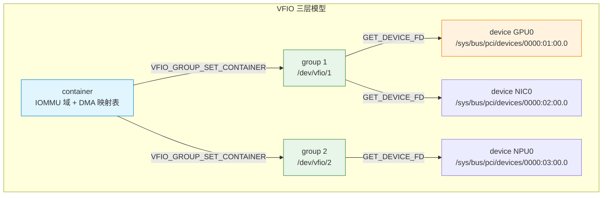
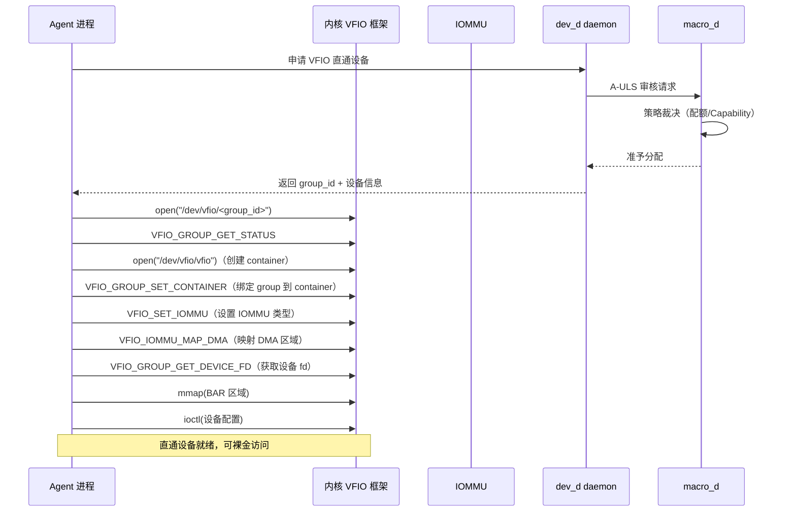
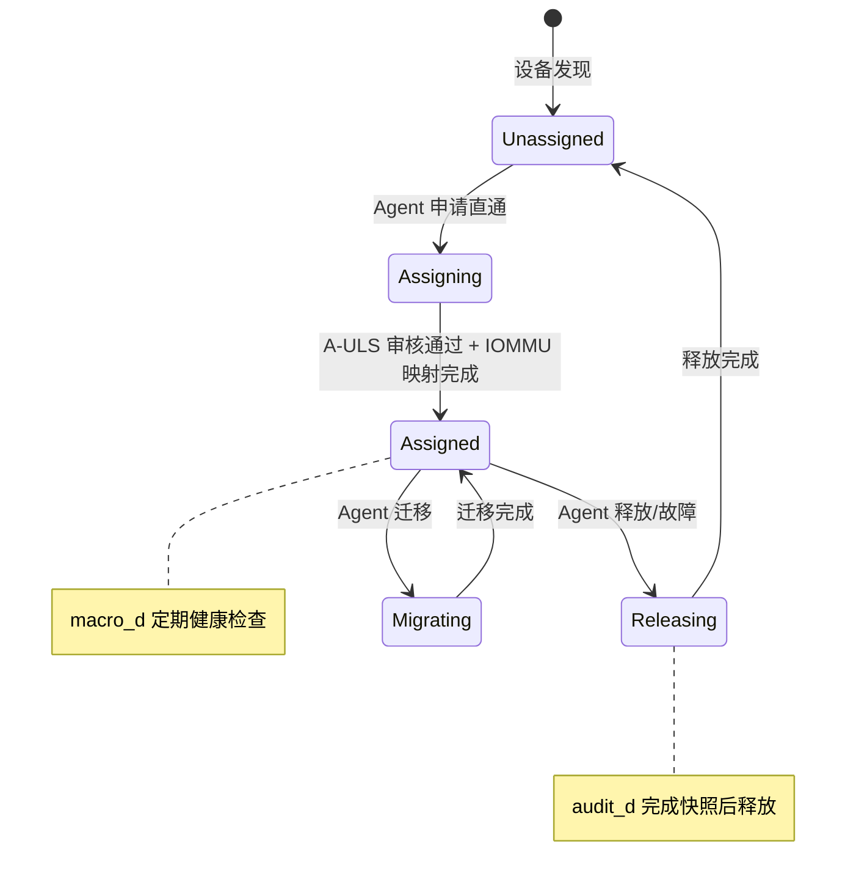
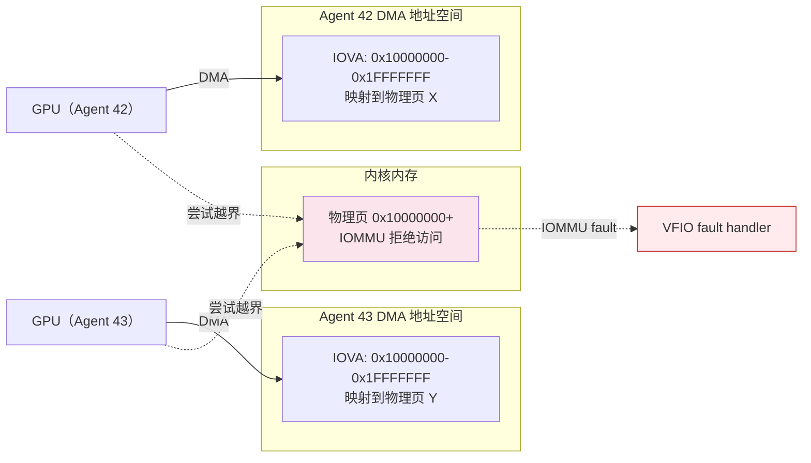
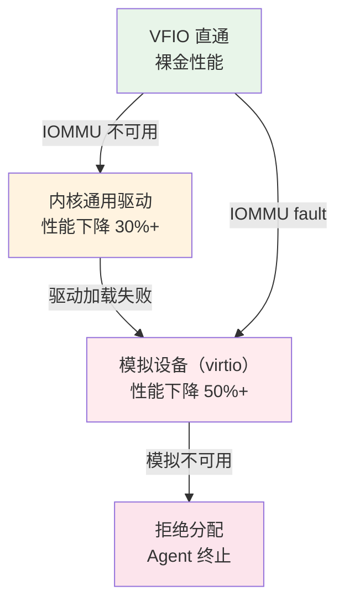

Copyright (c) 2025-2026 SPHARX Ltd. All Rights Reserved.

# agentrt-linux（AirymaxOS）驱动模型 — VFIO 直通与 IOMMU 隔离
> **文档定位**：agentrt-linux（AirymaxOS）驱动子系统 60 模块第六篇——VFIO 直通设计与 IOMMU 安全隔离\
> **文档版本**：v1.0.1\
> **最后更新**： 2026-07-21\
> **上级文档**：[60-driver-model README](README.md)\
> **同源映射**：agentrt `daemons`（macro_d + dev_d 共同监管）+ Linux 6.6 `drivers/vfio/`（VFIO 框架实现）\
> **理论根基**：Linux 6.6 内核基线 + Airymax 五维正交 24 原则 + Airymax Unify Design（A-ULS 设备生命周期监管）\
> **核心约束**：技术选型第 4 条——VFIO DMA 映射使用 `alloc_pages + vm_map_pages`，**不使用 `dma_alloc_coherent`**；[DSL] 降级生存层保证 VFIO 不可用时回退到模拟设备

---

## 1. 概述

VFIO（Virtual Function I/O）是 Linux 内核提供的"设备直通"框架——它将物理设备（GPU、NIC、NPU）安全地分配给用户态进程，绕过内核驱动栈，实现近乎裸金的性能。agentrt-linux v1.0.1 选择 VFIO 作为 Agent 访问重型硬件（GPU 推理、NIC 高速网络、NPU 加速）的标准接口。

VFIO 直通的核心安全机制是 **IOMMU（Input/Output Memory Management Unit）**——硬件级 DMA 地址空间隔离。每个 VFIO 设备归属一个 IOMMU 组，组内设备的 DMA 访问被限制在显式映射的物理页范围内，无法越界访问其他 Agent 或内核内存。

本文档覆盖七大主题：VFIO 三层模型（group/container/device）、Agent 设备直通流程、与 A-ULS 模块的关系、安全隔离机制、Capability 模型、与 `alloc_pages + mmap` 的关系、[DSL] 降级模式。

| 设备类型 | 直通方式 | 适用 Agent | 性能 | 安全风险 |
|---------|---------|-----------|------|---------|
| GPU | VFIO 直通 | cogn_d（推理加速） | 裸金性能 | 中（IOMMU 隔离） |
| NIC（SR-IOV VF） | VFIO 直通 | net_d（高速网络） | 裸金性能 | 中（IOMMU 隔离） |
| NPU | VFIO 直通 | cogn_d（专用加速） | 裸金性能 | 中（IOMMU 隔离） |
| 普通字符设备 | misc 框架 | 通用 Agent | 中等（fastpath ≤50ns） | 低（内核驱动校验） |
| 模拟设备 | 软件模拟 | 降级场景 | 低 | 无 |

> **OS-DRV-100**： VFIO 直通设备**必须**通过 IOMMU 隔离——禁止在无 IOMMU 的系统上启用 VFIO 直通。这是 A-ULS 安全隔离原则的硬性约束，违反将导致 DMA 越界访问风险。

> **OS-DRV-101**： VFIO DMA 映射**必须**使用 `alloc_pages + vm_map_pages`，**禁止**使用 `dma_alloc_coherent`。这是 [AirymaxOS 总览](../README.md) §2 技术选型声明第 4 条的硬性约束——跨架构（x86/ARM/RISC-V）一致性要求。

---

## 2. VFIO group/container/device 三层模型

### 2.1 三层抽象

VFIO 采用三层抽象组织设备：

| 层次 | 内核结构 | 用户态接口 | 职责 |
|------|---------|-----------|------|
| **group** | `struct vfio_group` | `/dev/vfio/<group_id>` | IOMMU 隔离单元（同组设备共享 IOMMU 隔离域） |
| **container** | `struct vfio_container` | 通过 group 的 `VFIO_GROUP_SET_CONTAINER` 绑定 | IOMMU 域 + DMA 映射表 |
| **device** | `struct vfio_device` | 通过 group 的 `VFIO_GROUP_GET_DEVICE_FD` 获取 | 单个物理设备 |



### 2.2 group 的含义

IOMMU 组是"DMA 隔离的最小单元"——同组设备共享同一 IOMMU 隔离域，无法互相隔离。典型场景：

- 单功能 PCI 设备：一个设备一个组（理想情况）
- 多功能 PCI 设备（如 GPU + Audio）：同组（共享 IOMMU 隔离域）
- PCIe-to-PCI 桥：桥后所有设备同组（PCI 总线无 ACS 隔离）

agentrt-linux 要求：**直通给 Agent 的设备必须是独立 IOMMU 组**——同组有其他设备时，整组设备必须直通给同一 Agent 或不直通。

> **OS-DRV-102**： Agent VFIO 直通的设备所属 IOMMU 组**不得**包含其他 Agent 或内核关键设备。这是 A-ULS 隔离原则的硬性约束，违反将导致 DMA 跨 Agent 越界。

### 2.3 container 的含义

container 是 IOMMU 域的用户态句柄。多个 group 可加入同一 container，共享同一 DMA 映射表。Agent 通常为每个直通设备创建独立 container（最大隔离），但多设备协同场景（如 GPU + NIC 协同推理）可共享 container。

### 2.4 device 的含义

device 是单个物理设备的用户态句柄。通过 group 的 `VFIO_GROUP_GET_DEVICE_FD` 获取设备 fd，后续通过 fd 进行：

- 设备配置空间读写（PCI 配置）
- 设备 BAR 区域 mmap
- 设备 IRQ 注册
- 设备 region 访问

---

## 3. Agent 设备直通流程

### 3.1 完整直通流程

Agent 设备直通的完整流程（用户态视角）：



### 3.2 七步直通流程

```c
/* daemons/dev_d/vfio_assign.c — Agent VFIO 直通流程示例 */

int airy_vfio_assign_device(struct agent_vfio_ctx *ctx, u32 agent_id,
                             const char *pci_bdf)
{
    int group_fd, container_fd, device_fd;
    struct vfio_group_status group_status = { .argsz = sizeof(group_status) };
    struct vfio_iommu_type1_info iommu_info = { .argsz = sizeof(iommu_info) };
    struct vfio_iommu_type1_dma_map dma_map = { .argsz = sizeof(dma_map) };
    char group_path[64];
    int rc;

    /* 1. A-ULS 审核（Capability + 配额） */
    rc = airy_vfio_usv_audit(agent_id, pci_bdf);
    if (rc)
        return rc;

    /* 2. 查找设备所属 IOMMU group */
    rc = airy_vfio_find_group(pci_bdf, group_path, sizeof(group_path));
    if (rc)
        return rc;

    /* 3. open group fd */
    group_fd = open(group_path, O_RDWR);
    if (group_fd < 0)
        return -AIRY_E_VFIO_NO_GROUP;

    /* 4. 校验 group 状态 */
    rc = ioctl(group_fd, VFIO_GROUP_GET_STATUS, &group_status);
    if (rc || !(group_status.flags & VFIO_GROUP_FLAGS_VIABLE)) {
        rc = -AIRY_E_VFIO_GROUP_NOT_VIABLE;
        goto out_close_group;
    }

    /* 5. 创建 container 并绑定 group */
    container_fd = open("/dev/vfio/vfio", O_RDWR);
    if (container_fd < 0) {
        rc = -AIRY_E_VFIO_NO_CONTAINER;
        goto out_close_group;
    }

    rc = ioctl(group_fd, VFIO_GROUP_SET_CONTAINER, &container_fd);
    if (rc) {
        rc = -AIRY_E_VFIO_SET_CONTAINER;
        goto out_close_container;
    }

    /* 6. 设置 IOMMU 类型（VFIO_TYPE1_IOMMU） */
    rc = ioctl(container_fd, VFIO_SET_IOMMU, VFIO_TYPE1_IOMMU);
    if (rc) {
        rc = -AIRY_E_VFIO_SET_IOMMU;
        goto out_close_container;
    }

    rc = ioctl(container_fd, VFIO_IOMMU_GET_INFO, &iommu_info);
    if (rc) {
        rc = -AIRY_E_VFIO_IOMMU_INFO;
        goto out_close_container;
    }

    /* 7. 映射 DMA 区域（alloc_pages + mmap，参见 §6） */
    rc = airy_vfio_map_dma(container_fd, agent_id,
                            AIRY_VFIO_DMA_SIZE_DEFAULT, &dma_map);
    if (rc)
        goto out_close_container;

    /* 8. 获取设备 fd */
    device_fd = ioctl(group_fd, VFIO_GROUP_GET_DEVICE_FD, pci_bdf);
    if (device_fd < 0) {
        rc = -AIRY_E_VFIO_GET_DEVICE;
        goto out_unmap_dma;
    }

    /* 9. mmap BAR 区域 */
    ctx->bar_addr = airy_vfio_mmap_bar(device_fd, agent_id);

    /* 10. 保存上下文并上报 A-ULS */
    ctx->group_fd = group_fd;
    ctx->container_fd = container_fd;
    ctx->device_fd = device_fd;
    ctx->agent_id = agent_id;

    airy_usv_report_event(AIRY_USV_EVT_VFIO_ASSIGNED, agent_id, 0);

    return 0;

out_unmap_dma:
    ioctl(container_fd, VFIO_IOMMU_UNMAP_DMA, &dma_map);
out_close_container:
    close(container_fd);
out_close_group:
    close(group_fd);
    return rc;
}
```

### 3.3 设备释放流程

```c
int airy_vfio_release_device(struct agent_vfio_ctx *ctx)
{
    struct vfio_iommu_type1_dma_unmap unmap = {
        .argsz = sizeof(unmap),
        .size = ctx->dma_size,
        .iova = ctx->iova,
    };

    /* 1. 上报 A-ULS（审计需要） */
    airy_usv_report_event(AIRY_USV_EVT_VFIO_RELEASING, ctx->agent_id, 0);

    /* 2. 解除 BAR mmap */
    if (ctx->bar_addr)
        munmap(ctx->bar_addr, ctx->bar_size);

    /* 3. 解除 DMA 映射 */
    ioctl(ctx->container_fd, VFIO_IOMMU_UNMAP_DMA, &unmap);

    /* 4. 释放 alloc_pages 分配的物理页（参见 §6） */
    airy_vfio_free_pages(ctx);

    /* 5. 关闭设备 fd */
    close(ctx->device_fd);

    /* 6. 关闭 container */
    close(ctx->container_fd);

    /* 7. 关闭 group fd */
    close(ctx->group_fd);

    airy_usv_report_event(AIRY_USV_EVT_VFIO_RELEASED, ctx->agent_id, 0);

    return 0;
}
```

---

## 4. 与 A-ULS 模块的关系

### 4.1 双层监管

VFIO 直通设备生命周期由 macro_d + dev_d 双层监管：

| 监管层 | 职责 | 在 VFIO 直通的体现 |
|--------|------|-------------------|
| **Micro-Supervisor**（airy_lsm） | Capability 校验（`CAP_VFIO_ASSIGN`/`CAP_VFIO_RELEASE`）、IOMMU 组隔离校验 | 直通请求入口冷酷执法 |
| **Macro-Supervisor**（macro_d + dev_d） | 配额策略、设备分配仲裁、跨 Agent 设备迁移 | 温情裁决，可申诉 |

### 4.2 设备生命周期监管



### 4.3 dev_d daemon 在 VFIO 的职责

`dev_d` daemon 是 VFIO 直通的用户态管理器：

| 职责 | 实现位置 | 说明 |
|------|---------|------|
| IOMMU 组管理 | `daemons/dev_d/iommu_group.c` | 监控 IOMMU 组状态，确保隔离 |
| 设备分配仲裁 | `daemons/dev_d/vfio_assign.c` | 多 Agent 竞争同一设备时仲裁 |
| 配额管理 | `daemons/dev_d/quota.c` | VFIO 设备配额（每 Agent 上限） |
| 健康检查 | `daemons/dev_d/health.c` | 定期探测直通设备状态 |
| 故障恢复 | `daemons/dev_d/recovery.c` | 设备故障时触发降级或迁移 |

---

## 5. 安全隔离机制

### 5.1 IOMMU 分组

IOMMU 分组是 VFIO 安全的基石。agentrt-linux v1.0.1 的 IOMMU 分组校验流程：

```c
/* daemons/dev_d/iommu_group.c — IOMMU 组校验 */

int airy_vfio_check_iommu_group(const char *pci_bdf, u32 agent_id)
{
    char group_path[256];
    DIR *dir;
    struct dirent *ent;
    int group_id;
    int rc;

    /* 1. 查找设备所属 IOMMU group */
    rc = airy_read_iommu_group(pci_bdf, group_path, sizeof(group_path));
    if (rc)
        return rc;

    /* 2. 提取 group_id */
    sscanf(group_path, "/sys/kernel/iommu_groups/%d", &group_id);

    /* 3. 遍历组内所有设备，校验是否均为该 Agent 已分配设备 */
    dir = opendir(group_path);
    if (!dir)
        return -AIRY_E_VFIO_NO_GROUP;

    while ((ent = readdir(dir)) != NULL) {
        char dev_path[512];
        u32 owner_agent;

        if (ent->d_name[0] == '.')
            continue;

        snprintf(dev_path, sizeof(dev_path), "%s/%s", group_path, ent->d_name);

        /* 校验组内每个设备的归属 */
        rc = airy_vfio_get_device_owner(dev_path, &owner_agent);
        if (rc == 0 && owner_agent != agent_id) {
            /* 组内有其他 Agent 的设备——拒绝直通 */
            closedir(dir);
            return -AIRY_E_VFIO_GROUP_CONFLICT;
        }
    }

    closedir(dir);
    return 0;
}
```

### 5.2 设备隔离

| 隔离维度 | 机制 | 实现 |
|---------|------|------|
| **DMA 地址空间隔离** | IOMMU 页表 | 每个container独立 IOMMU 域，DMA 仅访问映射页 |
| **中断隔离** | MSI/MSI-X 重映射 | IOMMU 中断重映射（VT-d IR） |
| **配置空间隔离** | VFIO 配置空间虚拟化 | 敏感寄存器（如 BAR、Command）由 VFIO 过滤 |
| **IRQ 隔离** | eventfd 通知 | 设备 IRQ 通过 eventfd 通知用户态，不直接进入内核 |
| **DMA 越界防护** | IOMMU 页表权限 | 未映射的 IOVA 访问触发 IOMMU fault |

### 5.3 DMA 地址空间隔离



> **OS-DRV-103**： VFIO 设备的 DMA 访问**必须**通过 IOMMU 页表限制——禁止使用 `VFIO_DMA_MAP_ANY`（绕过 IOMMU 映射）。所有 DMA 区域必须显式映射。

### 5.4 IOMMU fault 处理

IOMMU fault 发生时（设备尝试访问未映射 IOVA），内核 VFIO fault handler：

1. **记录 fault 信息**：设备 BDF、fault 地址、fault 类型（读/写/执行）
2. **上报 dev_d daemon**：通过 A-ULP Ring 异步上报
3. **隔离设备**：禁止设备后续 DMA（IOMMU 页表标记为 fault 状态）
4. **触发 A-ULS 裁决**：由 macro_d 决定是否终止 Agent 或重置设备

---

## 6. 与 alloc_pages + mmap 的关系

### 6.1 技术选型声明

[AirymaxOS 总览](../README.md) §2 技术选型声明第 4 条规定：所有 DMA 共享内存严格采用 `alloc_pages + mmap` 方案，**不使用 DMA 一致性内存**（`dma_alloc_coherent`）。VFIO DMA 映射必须遵循此约束。

| 方案 | agentrt-linux 选择 | 原因 |
|------|-------------------|------|
| `alloc_pages + vm_map_pages` | **采用** | 跨架构一致（x86/ARM/RISC-V），不依赖硬件一致性缓存 |
| `dma_alloc_coherent` | **不采用** | 依赖硬件一致性缓存，ARM/RISC-V 上行为不一致 |
| `vmalloc` | 不采用 | 物理页不连续，DMA 不友好 |

### 6.2 VFIO DMA 映射实现

```c
/* daemons/dev_d/vfio_dma.c — alloc_pages + mmap 实现的 VFIO DMA 映射 */

int airy_vfio_map_dma(int container_fd, u32 agent_id, size_t size,
                      struct vfio_iommu_type1_dma_map *dma_map)
{
    struct airy_vfio_dma_region *region;
    void *vaddr;
    int rc;

    /* 1. 分配管理结构 */
    region = calloc(1, sizeof(*region));
    if (!region)
        return -AIRY_E_VFIO_NOMEM;

    region->agent_id = agent_id;
    region->size = ALIGN(size, PAGE_SIZE);

    /* 2. 通过 /dev/airymax_dma 分配物理页（内核 alloc_pages + mmap） */
    region->dma_fd = open("/dev/airymax_dma", O_RDWR);
    if (region->dma_fd < 0) {
        rc = -AIRY_E_VFIO_DMA_DEV;
        goto out_free_region;
    }

    rc = ioctl(region->dma_fd, AIRY_DMA_IOC_ALLOC_PAGES,
               &region->size);
    if (rc) {
        rc = -AIRY_E_VFIO_ALLOC_PAGES;
        goto out_close_dma_fd;
    }

    /* 3. mmap 到用户态地址空间 */
    vaddr = mmap(NULL, region->size, PROT_READ | PROT_WRITE,
                 MAP_SHARED, region->dma_fd, 0);
    if (vaddr == MAP_FAILED) {
        rc = -AIRY_E_VFIO_MMAP;
        goto out_close_dma_fd;
    }

    region->vaddr = vaddr;
    region->paddr = airy_dma_get_paddr(region->dma_fd);  /* 物理地址 */

    /* 4. 分配 IOVA（VFIO IOMMU 域内的 DMA 地址） */
    region->iova = airy_vfio_alloc_iova(agent_id, region->size);
    if (!region->iova) {
        rc = -AIRY_E_VFIO_IOVA;
        goto out_munmap;
    }

    /* 5. 调用 VFIO_IOMMU_MAP_DMA 建立映射 */
    dma_map->iova = region->iova;
    dma_map->vaddr = (uintptr_t)vaddr;
    dma_map->size = region->size;
    dma_map->flags = VFIO_DMA_MAP_FLAG_READ | VFIO_DMA_MAP_FLAG_WRITE;

    rc = ioctl(container_fd, VFIO_IOMMU_MAP_DMA, dma_map);
    if (rc) {
        rc = -AIRY_E_VFIO_MAP_DMA;
        goto out_free_iova;
    }

    /* 6. 保存 region 供后续 unmap 使用 */
    airy_vfio_region_add(region);

    return 0;

out_free_iova:
    airy_vfio_free_iova(agent_id, region->iova, region->size);
out_munmap:
    munmap(vaddr, region->size);
out_close_dma_fd:
    close(region->dma_fd);
out_free_region:
    free(region);
    return rc;
}
```

### 6.3 与 dma_alloc_coherent 的对比

| 维度 | `alloc_pages + vm_map_pages` | `dma_alloc_coherent` |
|------|------------------------------|---------------------|
| **跨架构一致性** | 一致（x86/ARM/RISC-V 行为相同） | 不一致（依赖硬件一致性缓存） |
| **缓存属性** | 显式 `pgprot_noncached` / `pgprot_writecombine` | 由 `dma_coherent_mask` 决定 |
| **物理页连续性** | 由 `alloc_pages(gfp_mask, order)` 决定 | 由 `dma_alloc_coherent` 实现 |
| **可移植性** | 高 | 低（ARM/RISC-V 上行为不一致） |
| **agentrt-linux 选择** | **采用** | 不采用 |

### 6.4 内核态 airymax_dma 驱动

`/dev/airymax_dma` 设备由 agentrt-linux 自研的内核驱动提供，封装 `alloc_pages + vm_map_pages`：

```c
/* drivers/airymax/dma/airymax_dma.c — alloc_pages + mmap 封装 */

static long airymax_dma_ioctl(struct file *filp, unsigned int cmd,
                              unsigned long arg)
{
    struct airymax_dma_ctx *ctx = filp->private_data;

    switch (cmd) {
    case AIRY_DMA_IOC_ALLOC_PAGES: {
        size_t size;
        int order;
        struct page *page;

        if (copy_from_user(&size, (void __user *)arg, sizeof(size)))
            return -EFAULT;

        order = get_order(size);
        page = alloc_pages(GFP_KERNEL | __GFP_ZERO, order);
        if (!page)
            return -ENOMEM;

        ctx->page = page;
        ctx->order = order;
        ctx->size = PAGE_SIZE << order;
        ctx->paddr = page_to_phys(page);

        /* 返回实际分配大小 */
        if (copy_to_user((void __user *)arg, &ctx->size, sizeof(size)))
            return -EFAULT;

        return 0;
    }
    /* ... 其他命令 ... */
    }
    return -EINVAL;
}

static int airymax_dma_mmap(struct file *filp, struct vm_area_struct *vma)
{
    struct airymax_dma_ctx *ctx = filp->private_data;
    unsigned long pfn = page_to_pfn(ctx->page);
    unsigned long size = vma->vm_end - vma->vm_start;

    if (size > ctx->size)
        return -EINVAL;

    /* 设置非缓存属性（与 dma_alloc_coherent 语义一致） */
    vma->vm_page_prot = pgprot_noncached(vma->vm_page_prot);

    return vm_map_pages(vma, &ctx->page, 1 << ctx->order);
}
```

---

## 7. Capability 模型

### 7.1 CAP_VFIO_ASSIGN / CAP_VFIO_RELEASE

VFIO 直通相关的 Capability：

```c
/* include/uapi/linux/airymax/capability.h */
#define CAP_VFIO_ASSIGN          0x00000100  /* 允许 VFIO 设备分配 */
#define CAP_VFIO_RELEASE         0x00000200  /* 允许 VFIO 设备释放 */
#define CAP_VFIO_IOMMU_BYPASS    0x00000400  /* 允许绕过 IOMMU（仅 macro_d，危险） */
#define CAP_VFIO_MIGRATE         0x00000800  /* 允许 VFIO 设备迁移 */
```

### 7.2 Capability 校验流程

```c
/* security/airy/airy_lsm.c — VFIO Capability 校验 */

static int airy_vfio_assign_check(u32 agent_id, const char *pci_bdf,
                                   u32 cap_mask)
{
    struct agent_cred *cred = current->agent_cred;

    /* 1. 必须持有 CAP_VFIO_ASSIGN */
    if (!(cred->cap_mask & CAP_VFIO_ASSIGN))
        return -AIRY_E_VFIO_NOCAP;

    /* 2. IOMMU 绕过需要更高权限（仅 macro_d） */
    if ((cap_mask & CAP_VFIO_IOMMU_BYPASS) &&
        !(cred->cap_mask & CAP_VFIO_IOMMU_BYPASS)) {
        airy_ulps_log(AIRY_ULPS_CRIT,
                      "IOMMU bypass attempted by non-privileged: agent=%u",
                      agent_id);
        return -AIRY_E_VFIO_NOCAP;
    }

    /* 3. IOMMU 组校验（不允许绕过 IOMMU 的情况） */
    if (!(cap_mask & CAP_VFIO_IOMMU_BYPASS)) {
        int rc = airy_vfio_check_iommu_group(pci_bdf, agent_id);
        if (rc)
            return rc;
    }

    return 0;
}

static struct security_hook_list airy_vfio_hooks[] __lsm_ro_after_init = {
    LSM_HOOK_INIT(vfio_assign_check,  airy_vfio_assign_check),
    LSM_HOOK_INIT(vfio_release_check, airy_vfio_release_check),
};
```

### 7.3 Capability 授予矩阵

| Capability | 授予对象 | 授予时机 | 撤销时机 |
|-----------|---------|---------|---------|
| CAP_VFIO_ASSIGN | dev_d daemon | daemon 启动 | daemon 停止 |
| CAP_VFIO_RELEASE | dev_d daemon | daemon 启动 | daemon 停止 |
| CAP_VFIO_IOMMU_BYPASS | 永不授予（仅代码路径保留） | N/A | N/A |
| CAP_VFIO_MIGRATE | macro_d + dev_d | 系统启动 | 永不撤销 |

> **OS-DRV-104**： `CAP_VFIO_IOMMU_BYPASS` **永不授予**任何进程——该 Capability 仅在代码路径中保留用于测试场景。生产环境启用此 Capability 视为安全违规。

> **OS-DRV-105**： VFIO 设备分配的 Capability 校验失败**必须**通过 A-ULP Ring 上报 `AIRY_ULPS_CRIT` 级别日志——这是潜在的安全攻击信号。

---

## 8. [DSL] 降级模式

### 8.1 降级触发条件

VFIO 不可用时，agentrt-linux 提供降级路径：

| 触发条件 | 降级方式 | 性能影响 |
|---------|---------|---------|
| IOMMU 不可用 | 回退到模拟设备（QEMU virtio） | 性能下降 50%+ |
| VFIO 框架加载失败 | 回退到内核通用驱动 | 性能下降 30%+ |
| 设备直通失败 | 回退到共享设备（时间片轮转） | 性能下降 70%+ |
| IOMMU fault | 隔离设备，回退到模拟设备 | 性能下降 50%+ |
| 设备物理故障 | 切换到备用设备或回退到模拟 | 视备用设备而定 |

### 8.2 降级实现

```c
/* daemons/dev_d/vfio_fallback.c — VFIO 降级实现 */

int airy_vfio_assign_or_fallback(struct agent_vfio_ctx *ctx, u32 agent_id,
                                  const char *pci_bdf)
{
    int rc;

    /* 1. 优先尝试 VFIO 直通 */
    rc = airy_vfio_assign_device(ctx, agent_id, pci_bdf);
    if (rc == 0)
        return 0;

    /* 2. VFIO 不可用，降级到内核通用驱动 */
    airy_ulps_log(AIRY_ULPS_WARN,
                  "VFIO assign failed (rc=%d), falling back to kernel driver: agent=%u",
                  rc, agent_id);

    rc = airy_kernel_driver_assign(ctx, agent_id, pci_bdf);
    if (rc == 0) {
        ctx->mode = AIRY_VFIO_MODE_KERNEL;
        return 0;
    }

    /* 3. 内核驱动不可用，降级到模拟设备 */
    airy_ulps_log(AIRY_ULPS_WARN,
                  "Kernel driver assign failed (rc=%d), falling back to emulated: agent=%u",
                  rc, agent_id);

    rc = airy_emulated_device_assign(ctx, agent_id, pci_bdf);
    if (rc == 0) {
        ctx->mode = AIRY_VFIO_MODE_EMULATED;
        return 0;
    }

    /* 4. 所有降级路径失败——拒绝分配 */
    airy_ulps_log(AIRY_ULPS_ERROR,
                  "All assign paths failed: agent=%u bdf=%s",
                  agent_id, pci_bdf);
    return -AIRY_E_VFIO_UNAVAILABLE;
}
```

### 8.3 降级链



> **OS-DRV-106**： [DSL] 降级模式触发时**必须**通过 A-ULP Ring 上报 `AIRY_ULPS_WARN` 级别日志，包含降级前模式、降级后模式、降级原因。降级频率超过阈值（每小时 >5 次）应触发 macro_d 重新评估设备分配策略。

---

## 9. 与其他文档的关系

### 9.1 与 03-devm-resource.md 的关系

VFIO 直通的 DMA 区域分配通过 `devm_airy_dma_pool`（[03-devm-resource.md](03-devm-resource.md) §3）托管——Agent 注销时自动释放 DMA 映射，避免资源泄漏。

### 9.2 与 04-misc-framework.md 的关系

VFIO 直通设备**不**通过 misc 框架注册——它使用独立的 `/dev/vfio/<group>` 接口。但 VFIO 设备的"Agent 视图"（如 `/dev/airy_<id>_gpu` 软链接）由 misc 框架创建，便于 vfs_d 统一管理。

### 9.3 与 05-agent-driver.md 的关系

VFIO 直通设备是 Agent 虚拟设备的"重型版本"——当物理设备需要直接分配给 Agent 时，使用 VFIO 直通而非 `airy_agent_driver_register`。两者通过 `AIRY_DEV_TYPE` 字段区分。

### 9.4 与 07-driver-testing.md 的关系

VFIO 直通的测试覆盖在 [07-driver-testing.md](07-driver-testing.md) 详述，包括：IOMMU 分组校验测试、DMA 映射验证测试、设备隔离测试、[DSL] 降级路径测试。

---

## 10. 实现清单与里程碑

### 10.1 v1.0.1 实现清单

| # | 工作项 | 责任模块 | 状态 |
|---|--------|---------|------|
| 1 | `airy_vfio_assign_device` / `release_device` 实现 | `daemons/dev_d/vfio_assign.c` | 待实现 |
| 2 | IOMMU 组校验逻辑 | `daemons/dev_d/iommu_group.c` | 待实现 |
| 3 | `alloc_pages + mmap` 封装的 airymax_dma 驱动 | `drivers/airymax/dma/airymax_dma.c` | 待实现 |
| 4 | `CAP_VFIO_*` Capability 钩子 | `security/airy/airy_lsm.c` | 待实现 |
| 5 | [DSL] 降级路径实现 | `daemons/dev_d/vfio_fallback.c` | 待实现 |
| 6 | dev_d daemon 健康检查 | `daemons/dev_d/health.c` | 待实现 |
| 7 | KUnit 单元测试（≥20 用例） | `drivers/airymax/dma/airymax_dma_test.c` | 待实现 |
| 8 | kselftest 集成测试（≥12 用例） | `tools/testing/selftests/airymax/vfio/` | 待实现 |

### 10.2 与 v1.0 的差异

v1.0 文档（`01-device-model.md` §1）简要提及 VFIO 直通概念，但未系统化定义。v1.0.1 系统化定义：

1. **VFIO 三层模型**（group/container/device）在 agentrt-linux 的应用
2. **Agent 设备直通完整流程**（七步法）
3. **IOMMU 安全隔离机制**（分组、DMA 隔离、fault 处理）
4. **`alloc_pages + mmap` 替代 `dma_alloc_coherent`** 的具体实现
5. **`CAP_VFIO_*` Capability 模型**
6. **[DSL] 降级模式**（直通 → 内核驱动 → 模拟设备 降级链）

---

## 11. 版本历史

| 版本 | 日期 | 变更 |
|------|------|------|
| v1.0.1 | 2026-07-18 | 初始版本：定义 VFIO 直通完整流程、IOMMU 安全隔离机制、`alloc_pages + mmap` DMA 映射、`CAP_VFIO_*` Capability 模型、[DSL] 降级模式 |

---

## 12. 参考材料

- Linux 6.6 `drivers/vfio/`（VFIO 框架实现）
- Linux 6.6 `Documentation/driver-api/vfio.rst`（VFIO 用户态 API）
- Linux 6.6 `include/uapi/linux/vfio.h`（VFIO UAPI 定义）
- Linux 6.6 `drivers/iommu/`（IOMMU 驱动）
- [01-device-model.md](01-device-model.md) §1（VFIO 直通概念提及）
- [03-devm-resource.md](03-devm-resource.md) §3（`devm_airy_dma_pool` DMA 资源托管）
- [04-misc-framework.md](04-misc-framework.md) §9（VFIO 与 misc 框架的关系）
- [05-agent-driver.md](05-agent-driver.md) §9（VFIO 与 Agent 虚拟设备驱动的关系）
- [../10-architecture/10-unify-design.md](../10-architecture/10-unify-design.md) §7（A-ULS 总纲）
- [../20-modules/02-services.md](../20-modules/02-services.md)（dev_d daemon 设计）
- [../110-security/README.md](../110-security/README.md)（纯 C LSM + Capability 模型）

---

> **文档结束** | agentrt-linux 驱动模型 — VFIO 直通与 IOMMU 隔离 v1.0.1 | 维护者：开源极境工程与规范委员会 | "From data intelligence emerges."
