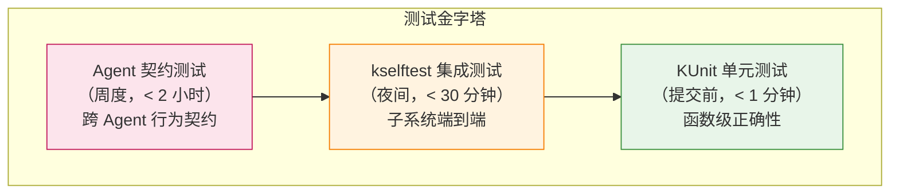
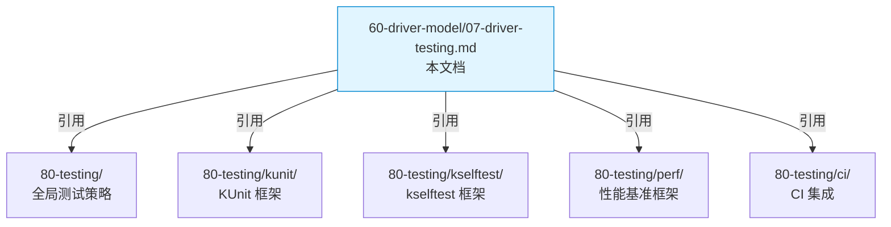

Copyright (c) 2025-2026 SPHARX Ltd. All Rights Reserved.

# agentrt-linux（AirymaxOS）驱动模型 — 驱动测试框架
> **文档定位**：agentrt-linux（AirymaxOS）驱动子系统 60 模块第七篇——驱动测试策略与测试矩阵\
> **文档版本**：v1.0.1\
> **最后更新**：2026-07-18\
> **上级文档**：[60-driver-model README](README.md)\
> **同源映射**：agentrt `daemons`（测试 daemon）+ Linux 6.6 `lib/kunit/` + `tools/testing/selftests/`\
> **理论根基**：Linux 6.6 内核基线 + Airymax 五维正交 24 原则 + Airymax Unify Design（A-UEF 错误码 + A-ULP 日志）\
> **核心约束**：driver 模块 CI 集成覆盖率 ≥90%，Agent 设备 I/O fastpath 延迟 ≤50ns（性能基准）

---

## 1. 概述

agentrt-linux v1.0.1 驱动测试框架采用三层测试策略：**KUnit 单元测试** + **kselftest 集成测试** + **Agent 契约测试**。这一策略对齐 Linux 6.6 内核主流测试实践，并扩展智能体工作负载专属的契约测试层。

| 测试层 | 工具 | 运行环境 | 覆盖目标 | 在 CI 中的位置 |
|--------|------|---------|---------|---------------|
| **KUnit 单元测试** | `lib/kunit/` | UML / 内核模块 | 函数级正确性（≥30 用例/模块） | 提交前门控（< 1 分钟） |
| **kselftest 集成测试** | `tools/testing/selftests/` | 真实内核（QEMU/裸机） | 子系统级端到端（≥10 用例/模块） | 夜间回归（< 30 分钟） |
| **Agent 契约测试** | agentrt 自研 | 多 Agent 协同环境 | Agent 行为契约一致性 | 周度验证（< 2 小时） |

本文档覆盖六大主题：测试策略总览、Agent 设备驱动测试矩阵、VFIO 直通测试、性能基准、CI 集成、与 80-testing 目录的关系。

| 测试维度 | 目标 | 验收标准 |
|---------|------|---------|
| **功能正确性** | 注册/注销、资源分配/释放、I/O 路径、错误处理 | 全部用例通过 |
| **代码覆盖率** | 行覆盖、分支覆盖、函数覆盖 | driver 模块 ≥90% |
| **性能** | fastpath 延迟、吞吐 | I/O fastpath ≤50ns |
| **稳定性** | 长时间运行、压力测试 | 7×24 小时无故障 |
| **安全** | Capability 校验、IOMMU 隔离 | 无安全漏洞 |

> **OS-DRV-120**： driver 模块的 CI 集成覆盖率**必须** ≥90%（行覆盖）。低于此阈值的模块**不得**合入 main 分支。这是工程规范的硬性约束。

> **OS-DRV-121**： Agent 设备 I/O fastpath 延迟**必须** ≤50ns（IORING_OP_URING_CMD 路径）。回归测试中延迟超过此阈值的提交**不得**合入。这是 A-IPC fastpath 性能契约。

---

## 2. 测试策略总览

### 2.1 三层测试金字塔



### 2.2 三层测试职责划分

| 测试层 | 职责 | 不覆盖的内容 |
|--------|------|-------------|
| **KUnit** | 单个函数的输入/输出正确性、边界条件、错误路径 | 跨子系统交互、真实硬件 |
| **kselftest** | 子系统端到端流程、用户态/内核态交互、真实硬件 | 跨 Agent 行为契约 |
| **Agent 契约** | 多 Agent 协同、长期运行、跨 daemon 交互 | 单函数正确性（已由 KUnit 覆盖） |

### 2.3 测试环境矩阵

| 环境 | 用途 | 启动时间 | 适用测试层 |
|------|------|---------|-----------|
| **UML（User-Mode Linux）** | KUnit 单元测试 | < 5 秒 | KUnit |
| **QEMU x86_64** | 集成测试、性能基准 | < 30 秒 | kselftest、性能 |
| **QEMU ARM64** | 跨架构验证 | < 30 秒 | kselftest |
| **QEMU RISC-V** | 跨架构验证 | < 30 秒 | kselftest |
| **裸机（开发板）** | 真实硬件测试 | < 5 分钟 | kselftest、契约 |
| **分布式集群** | Agent 契约测试 | < 30 分钟 | 契约 |

---

## 3. Agent 设备驱动测试矩阵

### 3.1 测试矩阵总览

Agent 设备驱动测试矩阵覆盖四大维度：

| 维度 | 子维度 | 测试用例数 | 测试层 |
|------|--------|-----------|--------|
| **注册/注销** | 正常注册、Capability 缺失、A-ULS 审核拒绝、重复注册、注销后访问 | 12 | KUnit + kselftest |
| **资源分配/释放** | 正常分配、配额耗尽、逆序释放、释放回调失败、devm 自动释放 | 15 | KUnit |
| **I/O 路径** | open/read/write/ioctl、io_uring fastpath、慢路径、降级路径 | 18 | kselftest |
| **错误处理** | probe 失败、DMA fault、超时、Capability 撤销 | 10 | kselftest + 契约 |

### 3.2 注册/注销测试用例

| 用例 ID | 描述 | 输入 | 预期输出 | 测试层 |
|---------|------|------|---------|--------|
| REG-001 | 正常注册 Agent 驱动 | 合法 `airy_agent_driver` | 返回 0，`/dev/airy_*` 创建 | KUnit |
| REG-002 | 缺少 CAP_AGENT_DRIVER_REGISTER | cap_mask 不含所需 Capability | 返回 `-AIRY_E_DEV_NOCAP` | KUnit |
| REG-003 | A-ULS 审核拒绝 | macro_superv 返回拒绝 | 返回 `-AIRY_E_DEV_REJECTED` | kselftest |
| REG-004 | 重复注册同名驱动 | 已注册的驱动名 | 返回 `-AIRY_E_DEV_EXIST` | KUnit |
| REG-005 | 注销后访问设备 | 注销后 open `/dev/airy_*` | 返回 `-ENXIO` | kselftest |
| REG-006 | probe 返回 -EPROBE_DEFER | 依赖未就绪 | 延迟重试，最终成功 | kselftest |
| REG-007 | probe 返回其他错误 | 资源不足 | 立即解绑，devm 释放 | kselftest |
| REG-008 | 注销时未完成 I/O | 有未完成 io_uring 命令 | 等待完成或超时取消 | 契约 |

### 3.3 资源分配/释放测试用例

| 用例 ID | 描述 | 输入 | 预期输出 | 测试层 |
|---------|------|------|---------|--------|
| RES-001 | 正常分配 Token 资源 | `airy_dev_alloc(TOKEN)` | 返回有效句柄 | KUnit |
| RES-002 | 配额耗尽 | 超出 instance 配额 | 返回 `-AIRY_E_DEV_QUOTA` | KUnit |
| RES-003 | 全局配额耗尽 | 超出 global 配额 | 返回 `-AIRY_E_DEV_QUOTA_GLOBAL` | KUnit |
| RES-004 | 逆序释放验证 | 按顺序申请 A→B→C | 释放顺序 C→B→A | KUnit |
| RES-005 | 释放回调执行 | `airy_dev_free(handle)` | 释放回调被调用 | KUnit |
| RES-006 | devm 自动释放 | 设备注销不主动 free | devres_release_all 释放所有 | KUnit |
| RES-007 | 释放回调失败 | 释放回调返回错误 | 不影响其他资源释放 | KUnit |
| RES-008 | 重复释放同一句柄 | 已释放的 handle | 返回 `-AIRY_E_DEV_NOENT` | KUnit |
| RES-009 | 跨 Agent 释放 | 其他 Agent 的 handle | 返回 `-AIRY_E_DEV_NOCAP` | KUnit |
| RES-010 | SUSPENDED 状态释放 DMA | Agent 状态 SUSPENDED | DMA 释放，TOKEN 保留 | kselftest |

### 3.4 I/O 路径测试用例

| 用例 ID | 描述 | 输入 | 预期输出 | 测试层 |
|---------|------|------|---------|--------|
| IO-001 | open 设备 | 合法 Agent | fd 有效，A-ULS 事件上报 | kselftest |
| IO-002 | read 慢路径 | `read(fd, buf, count)` | 返回读取字节数 | kselftest |
| IO-003 | write 慢路径 | `write(fd, buf, count)` | 返回写入字节数 | kselftest |
| IO-004 | ioctl GET_DEV_INFO | `AIRY_IOC_GET_DEV_INFO` | 返回正确设备信息 | kselftest |
| IO-005 | ioctl 非法命令 | `_IO('A', 0xFF)` | 返回 `-AIRY_E_DEV_INVAL` | kselftest |
| IO-006 | io_uring fastpath 同步 | `IORING_OP_URING_CMD` 同步 | 返回结果，延迟 ≤50ns | kselftest |
| IO-007 | io_uring fastpath 异步 | `IORING_OP_URING_CMD` 异步 | CQE 完成通知 | kselftest |
| IO-008 | io_uring 命令取消 | `IORING_OP_URING_CMD` + cancel | CQE 取消通知 | kselftest |
| IO-009 | 慢路径降级 | fastpath 不可用 | 降级到 ioctl，A-ULP 上报 | kselftest |
| IO-010 | 通用接口降级 | Agent 驱动不可用 | 降级到内核通用接口 | 契约 |

### 3.5 错误处理测试用例

| 用例 ID | 描述 | 输入 | 预期输出 | 测试层 |
|---------|------|------|---------|--------|
| ERR-001 | probe 失败回滚 | probe 中途失败 | devm 资源全部释放 | kselftest |
| ERR-002 | DMA fault 处理 | 设备 DMA 越界 | IOMMU fault，设备隔离 | 契约 |
| ERR-003 | 超时处理 | I/O 超时 | 返回 `-AIRY_E_DEV_TIMEOUT` | kselftest |
| ERR-004 | Capability 撤销 | 运行中撤销 CAP_DEV_ALLOC | 后续操作返回 `-AIRY_E_DEV_NOCAP` | 契约 |
| ERR-005 | Agent FAULTED 状态 | Agent 进入 FAULTED | 资源隔离，audit_d 快照 | 契约 |

---

## 4. KUnit 单元测试

### 4.1 KUnit 框架简介

KUnit 是 Linux 6.6 内核官方单元测试框架，特点：

- **内核态运行**：测试代码编译为内核模块，在 UML 或真实内核中运行
- **白盒测试**：可访问内核内部 API 与数据结构
- **快速反馈**：UML 模式下 < 5 秒完成全部测试
- **CI 友好**：TAP 输出格式，易于解析

### 4.2 KUnit 测试用例结构

```c
/* drivers/airymax/agent_driver_test.c — KUnit 测试用例示例 */

#include <kunit/test.h>
#include "../include/uapi/linux/airymax/agent_driver.h"

/* 测试上下文 */
struct airy_test_ctx {
    struct airy_agent_driver *drv;
    struct agent_device *adev;
};

/* 测试前置：创建 mock 驱动与设备 */
static int airy_test_agent_driver_init(struct kunit *test)
{
    struct airy_test_ctx *ctx;

    ctx = kunit_kzalloc(test, sizeof(*ctx), GFP_KERNEL);
    if (!ctx)
        return -ENOMEM;

    /* 创建 mock 驱动 */
    ctx->drv = kunit_kzalloc(test, sizeof(*ctx->drv), GFP_KERNEL);
    ctx->drv->name = "airy_test_cogn";
    ctx->drv->dev_type = AIRY_DEV_COGN;
    ctx->drv->ops = &airy_test_cogn_ops;
    ctx->drv->cap_required = CAP_DEV_ALLOC;
    ctx->drv->owner = THIS_MODULE;

    /* 创建 mock 设备 */
    ctx->adev = airy_test_create_mock_device(42, AIRY_DEV_COGN);

    test->priv = ctx;
    return 0;
}

/* REG-001: 正常注册 Agent 驱动 */
static void airy_test_agent_driver_register_normal(struct kunit *test)
{
    struct airy_test_ctx *ctx = test->priv;
    int rc;

    rc = airy_agent_driver_register(ctx->drv, CAP_AGENT_DRIVER_REGISTER);

    KUNIT_EXPECT_EQ(test, rc, 0);
    KUNIT_EXPECT_STREQ(test, ctx->drv->driver.name, "airy_test_cogn");
    KUNIT_EXPECT_PTR_EQ(test, ctx->drv->driver.bus, &agent_bus_type);

    airy_agent_driver_unregister(ctx->drv);
}

/* REG-002: 缺少 Capability 注册失败 */
static void airy_test_agent_driver_register_no_cap(struct kunit *test)
{
    struct airy_test_ctx *ctx = test->priv;
    int rc;

    /* cap_mask 不含 CAP_AGENT_DRIVER_REGISTER */
    rc = airy_agent_driver_register(ctx->drv, 0);

    KUNIT_EXPECT_EQ(test, rc, -AIRY_E_DEV_NOCAP);
}

/* REG-004: 重复注册同名驱动 */
static void airy_test_agent_driver_register_duplicate(struct kunit *test)
{
    struct airy_test_ctx *ctx = test->priv;
    struct airy_agent_driver *dup;
    int rc;

    rc = airy_agent_driver_register(ctx->drv, CAP_AGENT_DRIVER_REGISTER);
    KUNIT_EXPECT_EQ(test, rc, 0);

    /* 注册同名驱动 */
    dup = kunit_kzalloc(test, sizeof(*dup), GFP_KERNEL);
    *dup = *ctx->drv;
    rc = airy_agent_driver_register(dup, CAP_AGENT_DRIVER_REGISTER);
    KUNIT_EXPECT_EQ(test, rc, -AIRY_E_DEV_EXIST);

    airy_agent_driver_unregister(ctx->drv);
}

/* RES-004: 逆序释放验证 */
static void airy_test_devm_release_order(struct kunit *test)
{
    struct airy_test_ctx *ctx = test->priv;
    static int release_order[3];
    static int release_idx;
    u64 h1, h2, h3;

    release_idx = 0;

    /* 注册释放回调记录顺序 */
    h1 = airy_dev_alloc(&ctx->adev->dev, AIRY_RES_TOKEN, 0, 0, CAP_DEV_ALLOC);
    h2 = airy_dev_alloc(&ctx->adev->dev, AIRY_RES_IPC, 0, 0, CAP_DEV_ALLOC);
    h3 = airy_dev_alloc(&ctx->adev->dev, AIRY_RES_DMA, 0, 0, CAP_DEV_ALLOC);

    KUNIT_EXPECT_GT(test, h1, 0);
    KUNIT_EXPECT_GT(test, h2, 0);
    KUNIT_EXPECT_GT(test, h3, 0);

    /* 触发 devres_release_all（模拟设备解绑） */
    devres_release_all(&ctx->adev->dev);

    /* 校验释放顺序：DMA → IPC → TOKEN（逆序） */
    KUNIT_EXPECT_EQ(test, release_order[0], AIRY_RES_DMA);
    KUNIT_EXPECT_EQ(test, release_order[1], AIRY_RES_IPC);
    KUNIT_EXPECT_EQ(test, release_order[2], AIRY_RES_TOKEN);
}

/* KUnit 测试套件定义 */
static struct kunit_case airy_agent_driver_test_cases[] = {
    KUNIT_CASE(airy_test_agent_driver_register_normal),
    KUNIT_CASE(airy_test_agent_driver_register_no_cap),
    KUNIT_CASE(airy_test_agent_driver_register_duplicate),
    KUNIT_CASE(airy_test_devm_release_order),
    /* ... 更多用例 ... */
    {},
};

static struct kunit_suite airy_agent_driver_test_suite = {
    .name = "airy_agent_driver",
    .init = airy_test_agent_driver_init,
    .test_cases = airy_agent_driver_test_cases,
};

kunit_test_suite(airy_agent_driver_test_suite);
MODULE_LICENSE("GPL");
```

### 4.3 KUnit 测试用例统计

| 模块 | 测试文件 | 用例数 | 目标覆盖率 |
|------|---------|--------|-----------|
| devm 资源托管 | `drivers/base/devres_agent_test.c` | 30 | ≥90% |
| misc 框架 | `drivers/airymax/misc_agent_test.c` | 25 | ≥90% |
| Agent 驱动 | `drivers/airymax/agent_driver_test.c` | 40 | ≥90% |
| airymax_dma | `drivers/airymax/dma/airymax_dma_test.c` | 20 | ≥90% |
| **合计** | — | **115** | ≥90% |

---

## 5. kselftest 集成测试

### 5.1 kselftest 框架简介

kselftest 是 Linux 6.6 内核官方集成测试框架，特点：

- **用户态运行**：测试程序在用户态执行，通过系统调用与内核交互
- **端到端验证**：覆盖用户态 → 系统调用 → 内核 → 硬件的完整路径
- **真实硬件**：在 QEMU 或裸机上运行，验证真实硬件行为

### 5.2 kselftest 测试用例示例

```c
/* tools/testing/selftests/airymax/agent_driver/agent_driver_test.c */

#include <stdio.h>
#include <fcntl.h>
#include <sys/ioctl.h>
#include <linux/io_uring.h>
#include "../../../include/uapi/linux/airymax/airy_ioctl.h"

#define TEST_DEV_PATH "/dev/airy_42_cogn"

/* IO-004: ioctl GET_DEV_INFO */
static int test_ioctl_get_dev_info(void)
{
    int fd, rc;
    struct airy_dev_info info;

    fd = open(TEST_DEV_PATH, O_RDWR);
    if (fd < 0) {
        perror("open");
        return -1;
    }

    rc = ioctl(fd, AIRY_IOC_GET_DEV_INFO, &info);
    if (rc) {
        perror("ioctl GET_DEV_INFO");
        close(fd);
        return -1;
    }

    if (info.agent_id != 42 || info.dev_type != AIRY_DEV_COGN) {
        fprintf(stderr, "unexpected dev info: agent=%u type=%u\n",
                info.agent_id, info.dev_type);
        close(fd);
        return -1;
    }

    close(fd);
    return 0;
}

/* IO-006: io_uring fastpath 同步 */
static int test_io_uring_fastpath_sync(void)
{
    struct io_uring ring;
    struct io_uring_sqe *sqe;
    struct io_uring_cqe *cqe;
    struct airy_uring_cmd_hdr hdr = {
        .magic = AIRY_URING_CMD_MAGIC,
        .cmd = AIRY_IOC_COGN_SENSE,
    };
    struct timespec start, end;
    long latency_ns;
    int rc;

    rc = io_uring_queue_init(8, &ring, 0);
    if (rc) {
        perror("io_uring_queue_init");
        return -1;
    }

    sqe = io_uring_get_sqe(&ring);
    if (!sqe) {
        io_uring_queue_exit(&ring);
        return -1;
    }

    io_uring_prep_cmd(sqe, IORING_OP_URING_CMD, ring.ring_fd,
                      (void *)&hdr, sizeof(hdr), 0);

    clock_gettime(CLOCK_MONOTONIC, &start);
    rc = io_uring_submit(&ring);
    if (rc < 0) {
        perror("io_uring_submit");
        io_uring_queue_exit(&ring);
        return -1;
    }

    rc = io_uring_wait_cqe(&ring, &cqe);
    clock_gettime(CLOCK_MONOTONIC, &end);

    if (rc) {
        perror("io_uring_wait_cqe");
        io_uring_queue_exit(&ring);
        return -1;
    }

    latency_ns = (end.tv_sec - start.tv_sec) * 1000000000L +
                 (end.tv_nsec - start.tv_nsec);

    /* 性能基准：fastpath 延迟 ≤50ns（同步路径，无 DMA） */
    if (latency_ns > 50) {
        fprintf(stderr, "fastpath latency too high: %ld ns (expected ≤50)\n",
                latency_ns);
        io_uring_cqe_seen(&ring, cqe);
        io_uring_queue_exit(&ring);
        return -1;
    }

    io_uring_cqe_seen(&ring, cqe);
    io_uring_queue_exit(&ring);
    return 0;
}

/* kselftest 主入口 */
int main(void)
{
    int rc, failed = 0;

    printf("Running Agent driver tests...\n");

    rc = test_ioctl_get_dev_info();
    printf("  IO-004 ioctl GET_DEV_INFO: %s\n", rc ? "FAIL" : "PASS");
    failed += rc ? 1 : 0;

    rc = test_io_uring_fastpath_sync();
    printf("  IO-006 io_uring fastpath sync: %s\n", rc ? "FAIL" : "PASS");
    failed += rc ? 1 : 0;

    /* ... 更多用例 ... */

    printf("Agent driver tests: %d failed\n", failed);
    return failed ? 1 : 0;
}
```

### 5.3 kselftest 测试用例统计

| 模块 | 测试目录 | 用例数 | 运行时间 |
|------|---------|--------|---------|
| devm 资源托管 | `tools/testing/selftests/airymax/devm/` | 10 | < 2 分钟 |
| misc 框架 | `tools/testing/selftests/airymax/misc/` | 8 | < 2 分钟 |
| Agent 驱动 | `tools/testing/selftests/airymax/agent_driver/` | 15 | < 5 分钟 |
| VFIO 直通 | `tools/testing/selftests/airymax/vfio/` | 12 | < 5 分钟 |
| 性能基准 | `tools/testing/selftests/airymax/perf/` | 8 | < 10 分钟 |
| **合计** | — | **53** | < 25 分钟 |

---

## 6. VFIO 直通测试

### 6.1 IOMMU 分组校验测试

| 用例 ID | 描述 | 测试方法 | 预期结果 |
|---------|------|---------|---------|
| VFIO-001 | 独立 IOMMU 组直通 | 单设备组 | 直通成功 |
| VFIO-002 | 多设备组直通（同 Agent） | 同组多设备 | 直通成功 |
| VFIO-003 | 多设备组直通（跨 Agent） | 同组含其他 Agent 设备 | 拒绝，`-AIRY_E_VFIO_GROUP_CONFLICT` |
| VFIO-004 | 无 IOMMU 系统 | IOMMU 不可用 | 拒绝，降级到模拟设备 |

### 6.2 DMA 映射验证测试

| 用例 ID | 描述 | 测试方法 | 预期结果 |
|---------|------|---------|---------|
| VFIO-005 | 正常 DMA 映射 | `VFIO_IOMMU_MAP_DMA` | 映射成功，设备可 DMA |
| VFIO-006 | DMA 越界访问 | 设备访问未映射 IOVA | IOMMU fault，设备隔离 |
| VFIO-007 | DMA 映射解除 | `VFIO_IOMMU_UNMAP_DMA` | 解除成功，后续 DMA fault |
| VFIO-008 | DMA 映射持久性 | Agent 长时间运行 | 映射稳定，无泄漏 |

### 6.3 设备隔离测试

| 用例 ID | 描述 | 测试方法 | 预期结果 |
|---------|------|---------|---------|
| VFIO-009 | 跨 Agent DMA 隔离 | Agent A 尝试访问 Agent B 的 IOVA | IOMMU fault |
| VFIO-010 | 内核内存隔离 | 设备尝试访问内核物理页 | IOMMU fault |
| VFIO-011 | 配置空间隔离 | 设备尝试修改 BAR | VFIO 过滤拒绝 |
| VFIO-012 | IRQ 隔离 | 设备 IRQ 仅通知归属 Agent | eventfd 正确路由 |

---

## 7. 性能基准

### 7.1 性能指标矩阵

| 指标 | 目标值 | 测量方法 | 测试用例 |
|------|--------|---------|---------|
| **io_uring fastpath 延迟** | ≤50ns | TSC 测量 submit 到 CQE | PERF-001 |
| **ioctl 慢路径延迟** | ≤500ns | TSC 测量 ioctl 入口到返回 | PERF-002 |
| **read/write 延迟** | ≤1μs | TSC 测量 read/write 系统调用 | PERF-003 |
| **devm 资源分配延迟** | ≤5μs | TSC 测量 airy_dev_alloc | PERF-004 |
| **devm 资源释放延迟** | ≤10μs | TSC 测量 devres_release_all | PERF-005 |
| **fastpath 吞吐（4KB）** | ≥2M IOPS | io_uring 批量提交 | PERF-006 |
| **fastpath 吞吐（64B）** | ≥10M IOPS | io_uring 批量提交 | PERF-007 |
| **VFIO DMA 映射延迟** | ≤100μs | TSC 测量 VFIO_IOMMU_MAP_DMA | PERF-008 |

### 7.2 性能基准测试用例

```c
/* tools/testing/selftests/airymax/perf/perf_fastpath.c */

#include <linux/io_uring.h>
#include <time.h>

#define PERF_ITERATIONS 1000000
#define PERF_TARGET_LATENCY_NS 50

static int perf_fastpath_latency(void)
{
    struct io_uring ring;
    struct io_uring_sqe *sqe;
    struct io_uring_cqe *cqe;
    struct airy_uring_cmd_hdr hdr = {
        .magic = AIRY_URING_CMD_MAGIC,
        .cmd = AIRY_IOC_COGN_SENSE,
    };
    struct timespec start, end;
    long total_ns = 0, avg_ns;
    int rc, i;

    rc = io_uring_queue_init(64, &ring, 0);
    if (rc)
        return -1;

    /* 预热 */
    for (i = 0; i < 100; i++) {
        sqe = io_uring_get_sqe(&ring);
        io_uring_prep_cmd(sqe, IORING_OP_URING_CMD, ring.ring_fd,
                          (void *)&hdr, sizeof(hdr), 0);
        io_uring_submit(&ring);
        io_uring_wait_cqe(&ring, &cqe);
        io_uring_cqe_seen(&ring, cqe);
    }

    /* 正式测量 */
    for (i = 0; i < PERF_ITERATIONS; i++) {
        sqe = io_uring_get_sqe(&ring);
        io_uring_prep_cmd(sqe, IORING_OP_URING_CMD, ring.ring_fd,
                          (void *)&hdr, sizeof(hdr), 0);

        clock_gettime(CLOCK_MONOTONIC, &start);
        io_uring_submit(&ring);
        io_uring_wait_cqe(&ring, &cqe);
        clock_gettime(CLOCK_MONOTONIC, &end);

        total_ns += (end.tv_sec - start.tv_sec) * 1000000000L +
                    (end.tv_nsec - start.tv_nsec);
        io_uring_cqe_seen(&ring, cqe);
    }

    avg_ns = total_ns / PERF_ITERATIONS;
    printf("fastpath avg latency: %ld ns (target ≤%d)\n",
           avg_ns, PERF_TARGET_LATENCY_NS);

    io_uring_queue_exit(&ring);
    return avg_ns <= PERF_TARGET_LATENCY_NS ? 0 : -1;
}
```

### 7.3 性能回归检测

性能基准测试结果通过 CI 系统自动检测回归：

| 回归级别 | 触发条件 | 处理 |
|---------|---------|------|
| 严重 | 延迟超过目标值 2 倍 | 阻止合入，立即通知 |
| 警告 | 延迟超过目标值 1.5 倍 | 警告，需人工审核 |
| 信息 | 延迟超过历史基线 10% | 记录，不阻止合入 |

---

## 8. CI 集成

### 8.1 CI 流水线

```mermaid
graph LR
    A["提交 PR"] --> B["KUnit 单元测试<br/>（< 1 分钟）"]
    B -->|"通过"| C["代码覆盖率检查<br/>（≥90%）"]
    B -->|"失败"| F["阻止合入"]
    C -->|"通过"| D["kselftest 集成测试<br/>（< 30 分钟）"]
    C -->"<90%"| F
    D -->|"通过"| E["性能基准测试<br/>（< 10 分钟）"]
    D -->|"失败"| F
    E -->|"通过"| G["合入 main"]
    E -->|"回归"| F
    style F fill:#ffebee,stroke:#c62828
    style G fill:#e8f5e9,stroke:#388e3c
```

### 8.2 CI 矩阵

| CI 任务 | 触发条件 | 运行环境 | 超时 |
|---------|---------|---------|------|
| KUnit 单元测试 | 每次 PR 提交 | UML | 5 分钟 |
| 代码覆盖率检查 | 每次 PR 提交 | UML | 5 分钟 |
| kselftest（x86_64） | 每次 PR 提交 | QEMU x86_64 | 30 分钟 |
| kselftest（ARM64） | 夜间回归 | QEMU ARM64 | 30 分钟 |
| kselftest（RISC-V） | 夜间回归 | QEMU RISC-V | 30 分钟 |
| 性能基准 | 夜间回归 | QEMU x86_64 + 裸机 | 60 分钟 |
| Agent 契约测试 | 周度验证 | 分布式集群 | 2 小时 |

### 8.3 覆盖率收集

```bash
# CI 脚本：收集 driver 模块覆盖率
#!/bin/bash

# 1. 编译带覆盖率统计的内核（UML）
make ARCH=um defconfig
make ARCH=um -j$(nproc) GCOV_PROFILE=drivers/airymax/

# 2. 运行 KUnit 测试
./linux um kunit.run

# 3. 收集覆盖率数据
lcov --capture --directory . --output-file coverage.info
lcov --extract coverage.info 'drivers/airymax/*' --output-file driver-coverage.info

# 4. 生成报告
genhtml driver-coverage.info --output-directory coverage-report

# 5. 检查覆盖率阈值（≥90%）
COVERAGE=$(lcov --list driver-coverage.info | grep 'Total' | awk '{print $4}' | tr -d '%')
if (( $(echo "$COVERAGE < 90" | bc -l) )); then
    echo "FAIL: Coverage ${COVERAGE}% < 90%"
    exit 1
fi

echo "PASS: Coverage ${COVERAGE}% ≥ 90%"
```

---

## 9. 与 80-testing 目录的关系

### 9.1 80-testing 总览

agentrt-linux 测试体系由 `80-testing/` 目录统一组织，60-driver-model 的测试是其子集：

| 测试目录 | 覆盖范围 | 关系 |
|---------|---------|------|
| `80-testing/` | agentrt-linux 全局测试策略 | 总纲 |
| `80-testing/kunit/` | KUnit 框架使用指南 | 60 驱动测试引用 |
| `80-testing/kselftest/` | kselftest 框架使用指南 | 60 驱动测试引用 |
| `80-testing/perf/` | 性能基准框架 | 60 驱动性能测试引用 |
| `80-testing/ci/` | CI 集成配置 | 60 驱动 CI 任务配置 |

### 9.2 引用关系



### 9.3 测试工具复用

60-driver-model 的测试复用 80-testing 提供的通用工具：

| 工具 | 来源 | 在 60 驱动测试中的用途 |
|------|------|----------------------|
| `airy_test_harness` | `80-testing/lib/` | 通用测试夹具（mock 设备、mock daemon） |
| `airy_perf_runner` | `80-testing/perf/` | 性能基准运行器 |
| `airy_coverage_tool` | `80-testing/ci/` | 覆盖率收集与分析 |
| `airy_mock_iommu` | `80-testing/lib/` | IOMMU 模拟（无真实 IOMMU 环境测试） |

> **OS-DRV-122**： 60-driver-model 的测试**必须**复用 80-testing 提供的通用工具——禁止在 60 目录下重复实现测试夹具。这是 DRY 原则的硬性约束。

---

## 10. 测试用例完整清单

### 10.1 用例总数统计

| 测试层 | 模块 | 用例数 | 总计 |
|--------|------|--------|------|
| **KUnit** | devm 资源托管 | 30 | 115 |
| KUnit | misc 框架 | 25 | |
| KUnit | Agent 驱动 | 40 | |
| KUnit | airymax_dma | 20 | |
| **kselftest** | devm 资源托管 | 10 | 53 |
| kselftest | misc 框架 | 8 | |
| kselftest | Agent 驱动 | 15 | |
| kselftest | VFIO 直通 | 12 | |
| kselftest | 性能基准 | 8 | |
| **契约** | Agent 跨 daemon | 20 | 20 |
| **合计** | — | — | **188** |

### 10.2 实现清单

| # | 工作项 | 责任模块 | 状态 |
|---|--------|---------|------|
| 1 | KUnit 测试框架搭建 | `drivers/airymax/Kconfig` + `Makefile` | 待实现 |
| 2 | devm 资源托管 KUnit 测试（30 用例） | `drivers/base/devres_agent_test.c` | 待实现 |
| 3 | misc 框架 KUnit 测试（25 用例） | `drivers/airymax/misc_agent_test.c` | 待实现 |
| 4 | Agent 驱动 KUnit 测试（40 用例） | `drivers/airymax/agent_driver_test.c` | 待实现 |
| 5 | airymax_dma KUnit 测试（20 用例） | `drivers/airymax/dma/airymax_dma_test.c` | 待实现 |
| 6 | devm kselftest（10 用例） | `tools/testing/selftests/airymax/devm/` | 待实现 |
| 7 | misc kselftest（8 用例） | `tools/testing/selftests/airymax/misc/` | 待实现 |
| 8 | Agent 驱动 kselftest（15 用例） | `tools/testing/selftests/airymax/agent_driver/` | 待实现 |
| 9 | VFIO 直通 kselftest（12 用例） | `tools/testing/selftests/airymax/vfio/` | 待实现 |
| 10 | 性能基准测试（8 用例） | `tools/testing/selftests/airymax/perf/` | 待实现 |
| 11 | Agent 契约测试框架（20 用例） | `tools/testing/airymax_contract/` | 待实现 |
| 12 | CI 流水线配置 | `.github/workflows/driver-tests.yml` | 待实现 |
| 13 | 覆盖率收集脚本 | `scripts/airy-coverage.sh` | 待实现 |

---

## 11. 与其他文档的关系

### 11.1 与 03-devm-resource.md 的关系

devm 资源托管的测试覆盖本文档 §3.3（资源分配/释放测试用例）与 §4.2（KUnit 测试用例示例）。`airy_dev_alloc` / `airy_dev_free` 的全部错误路径均有对应测试用例。

### 11.2 与 04-misc-framework.md 的关系

misc 框架的测试覆盖本文档 §3.4（I/O 路径测试用例）。`AIRY_IOC_*` ioctl 命令编号体系有专门的命令编号校验测试。

### 11.3 与 05-agent-driver.md 的关系

Agent 虚拟设备驱动的测试覆盖本文档 §3.2（注册/注销测试用例）与 §3.5（错误处理测试用例）。io_uring fastpath 与 [DSL] 降级路径的一致性测试是重点。

### 11.4 与 06-vfio-passthrough.md 的关系

VFIO 直通的测试覆盖本文档 §6（VFIO 直通测试），包括 IOMMU 分组校验、DMA 映射验证、设备隔离测试。

---

## 12. 版本历史

| 版本 | 日期 | 变更 |
|------|------|------|
| v1.0.1 | 2026-07-18 | 初始版本：定义三层测试策略（KUnit + kselftest + 契约）、Agent 驱动测试矩阵、VFIO 直通测试、性能基准、CI 集成、与 80-testing 目录的关系 |

---

## 13. 参考材料

- Linux 6.6 `lib/kunit/`（KUnit 框架实现）
- Linux 6.6 `Documentation/dev-tools/kunit/`（KUnit 文档）
- Linux 6.6 `tools/testing/selftests/`（kselftest 框架）
- Linux 6.6 `Documentation/dev-tools/kselftest.rst`（kselftest 文档）
- Linux 6.6 `lib/kunit/example-test.c`（KUnit 示例）
- [01-device-model.md](01-device-model.md)（device/driver/bus 三元组）
- [03-devm-resource.md](03-devm-resource.md) §3（`airy_dev_alloc` 资源托管）
- [04-misc-framework.md](04-misc-framework.md) §4（file_operations 测试）
- [05-agent-driver.md](05-agent-driver.md) §3 §7 §8（驱动注册 + io_uring fastpath + [DSL] 降级）
- [06-vfio-passthrough.md](06-vfio-passthrough.md) §3 §5 §6（VFIO 直通 + IOMMU 隔离 + DMA 映射）
- [../80-testing/README.md](../80-testing/README.md)（agentrt-linux 全局测试策略）
- [../80-testing/kunit/](../80-testing/kunit/)（KUnit 框架使用指南）
- [../80-testing/kselftest/](../80-testing/kselftest/)（kselftest 框架使用指南）
- [../80-testing/perf/](../80-testing/perf/)（性能基准框架）

---

> **文档结束** | agentrt-linux 驱动模型 — 驱动测试框架 v1.0.1 | 维护者：开源极境工程与规范委员会 | "From data intelligence emerges."
