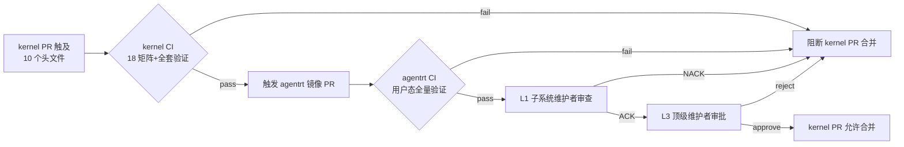

Copyright (c) 2025-2026 SPHARX Ltd. All Rights Reserved.

# agentrt-linux（AirymaxOS）CI/CD 管道完整设计
> **文档定位**：agentrt-linux（AirymaxOS）CI/CD 管道完整设计——覆盖 7 层自动化验证体系（OS-STD-TOOL-001~161）的工程实现，定义 8 子仓 + 管理仓的全量 CI 覆盖矩阵、编译验证矩阵、代码质量门禁、测试覆盖矩阵、SSoT 校验流水线、[SC] 共享契约层双向 CI、发布流水线、CI 基础设施与失败回滚策略。本卷是 1.0.1 开发阶段的设计基线，所有设计必须在本阶段完成。\
> **文档版本**：0.2.8\
> **最后更新**：2026-07-15\
> **上级文档**：[agentrt-linux 设计文档](README.md)\
> **同源映射**：agentrt `cmake/` + `.github/workflows/`（伞仓 CI）+ Linux 6.6 内核 CI 思想（KUnit/kselftest/checkpatch/sparse/Coccinelle）\
> **理论根基**：Linux 6.6 内核基线 CI 工程 + Airymax 五维正交 24 原则（S/K/C/E/A 五维）+ 7 层自动化验证体系（OS-STD-TOOL-001~161）\
> **核心约束**：IRON-9 v2 同源且部分代码共享——agentrt-linux CI 沿用 Linux 内核 CI 思想但与上游独立演进；[SC] 共享契约层双向 CI 由 OS-IRON-008 强制\
> **SSoT 依赖声明**：本文档引用的全部规则编号（`OS-STD-TOOL-*` / `OS-IRON-*` / `OS-STD-FMT-*` / `OS-TEST-*` / `OS-STD-TEST-*`）的权威定义与登记状态以 [`50-engineering-standards/09-ssot-registry.md`](../50-engineering-standards/09-ssot-registry.md)（Markdown 权威源，文档体系）与 [`agentrt-linux/ssot-registry.yaml`](../../../agentrt-linux/ssot-registry.yaml)（机器可读 Schema，管理仓根）为唯一来源（SSoT）。本文档仅引用已登记编号，不私自定义新编号。当本文档与 SSoT 注册表冲突时，以注册表为准。

---

## 0. 章节定位

本卷是 agentrt-linux 构建系统在 1.0.1 开发阶段的 CI/CD 管道设计基线。它在 `70-build-system/README.md`（构建系统主索引）与 `80-testing/`（测试工程卷）之间形成自动化验证执行层：

- **上游依赖**：README 定义构建系统的机制总览；`01-kbuild-system.md`/`02-kconfig-system.md` 定义"代码如何被编译、配置如何驱动构建"；本卷定义"编译与配置产物如何被自动化验证拦截/放行"。
- **下游依赖**：`80-testing/01-kunit-framework.md`（OS-TEST-001~012）与 `80-testing/02-kselftest.md`（OS-TEST-013~022）定义测试套件编写规范；本卷定义这些测试如何在 CI 矩阵中被调度执行并形成门禁。

本卷所有强制规则均引用 [`09-ssot-registry.md`](../50-engineering-standards/09-ssot-registry.md) 中已登记的 **OS-STD-TOOL** / **OS-IRON** / **OS-STD-FMT** / **OS-TEST** / **OS-STD-TEST** 编号，禁止在本文档私自定义新编号。

### 0.1 关键术语

| 术语 | 定义 |
|------|------|
| 7 层自动化验证体系 | OS-STD-TOOL-001~161 定义的端到端验证链：L1 编译期检查 / L2 静态分析 / L3 预提交 / L4 CI 门禁 / L5 连接验证 / L6 协议验证 / L7 发布验证 |
| CI 矩阵 | 配置 × 架构 × 编译器的笛卡尔积构建矩阵（3×3×2=18） |
| [SC] 共享契约层 | agentrt ↔ agentrt-linux 之间逐字节相同的 10 个头文件层（OS-IRON-014），物理宿主 `kernel/include/airymax/` |
| 双向 CI | kernel CI 通过 → 触发 agentrt 镜像 PR → agentrt CI 通过 → L1 审查 → L3 审批（OS-IRON-008） |
| SSoT | Single Source of Truth，规则编号唯一权威来源（`09-ssot-registry.md`/`.yaml`） |
| 门禁（Gate） | CI 中阻断 PR 合并的硬性检查点，失败即禁止合并 |
| SBOM | Software Bill of Materials，软件物料清单（本设计采用 SPDX 格式） |

---

## 1. 设计目标

agentrt-linux CI/CD 管道的设计目标是把"代码进入主线"的工程契约（OS-STD-PROD 系列）转化为可机器执行、可审计、可回滚的自动化验证流水线。核心承载是 **7 层自动化验证体系（OS-STD-TOOL-001~161）**。

### 1.1 7 层自动化验证体系

7 层验证覆盖编号区间 **OS-STD-TOOL-001~161**。SSoT 注册表（[`ssot-registry.yaml`](../../../agentrt-linux/ssot-registry.yaml) Ch 4.6）将编号区间划分为两大段：`OS-STD-TOOL-001~099`（L1-3 段）与 `OS-STD-TOOL-101~161`（L4-7 段）。具体规则到层级的归属由各规则在权威定义文档中的语义决定，而非单纯按编号段机械切分。下表给出层级的执行时机、阻断语义与已登记的代表规则：

| 层级 | 名称 | 编号归属 | 代表规则（已登记） | 执行时机 | 阻断合并 |
|------|------|---------|------------------|---------|---------|
| **L1** | 编译期检查 | 001~099 段（L1-3） | OS-STD-TOOL-001（编译期检查段起点，权威定义见注册表） | 本地 + CI | 是 |
| **L2** | 静态分析 | 001~099 段（L1-3） | OS-STD-TOOL-081（sparse C=2 + W 分级） | 本地 + CI | 是 |
| **L3** | 预提交（pre-commit） | 001~099 段（L1-3） | OS-STD-FMT-001/002（clang-format） | 本地（git hook） | 否（建议） |
| **L4** | CI 门禁 | 101~161 段（L4-7） | OS-STD-TOOL-081-CI（CI 强制 sparse W=2）、OS-STD-TOOL-160（checkpatch --strict）、OS-STD-TOOL-161（多配置构建） | CI（PR） | 是 |
| **L5** | 连接验证 | 101~161 段（L4-7） | OS-STD-TOOL-121/122（覆盖率 ≥80%）、OS-STD-TOOL-124（关键路径 100%） | CI（develop nightly） | 是 |
| **L6** | 协议验证 | 101~161 段（L4-7） | ABI/协议契约一致性校验 | CI（develop nightly） | 是 |
| **L7** | 发布验证 | 101~161 段（L4-7） | OS-STD-TOOL-081-REL（发布前 sparse 全量审计）、OS-STD-TOOL-160/161 | CI（release tag） | 是（阻塞发版） |

> **SSoT 对齐说明**：上表"编号归属"列严格遵循注册表的两段划分（001~099 / 101~161），不为本卷私自定义子段边界。个别规则（如 OS-STD-TOOL-081 基线属 L2 静态分析，但其 `-CI`/`-REL` 子编号分别在 L4/L7 执行）按规则语义跨层生效，其权威定义见注册表"权威定义"列指向的源文档。本卷禁止新增或重新切分编号段；新增层级映射须通过 RFC 流程在 [`09-ssot-registry.md`](../50-engineering-standards/09-ssot-registry.md) 登记后方可使用。

设计要点：

- **L1~L4 前 4 层** 是每个 PR 必须通过的"合并门禁"（对齐 `05-development-process.md`：补丁进入 `develop` 前必须通过 7 层验证的前 4 层——编译期 / 静态分析 / 预提交 / CI 门禁）。
- **L5~L6** 在 `develop` 分支 nightly build 中执行，检测跨子系统符号冲突、ABI 漂移、协议契约违反。
- **L7** 仅在 release tag 推送时触发，对应 SBOM 生成、签名构建、发布渠道分发。
- **OS-STD-TOOL-001 与 OS-STD-TOOL-161 是端到端边界**：001 是编译期检查段（L1-3 段，001~099）起点，161 定义多配置构建（defconfig + allnoconfig + allmodconfig）三态皆绿（161 权威定义见注册表）。

### 1.2 全量 CI 覆盖

CI 覆盖范围遵循 OS-IRON-013（8 子仓独立 git 仓库 + submodule 管理）：

- **8 子仓**：每个子仓独立维护 `.github/workflows/`，CI 互相隔离、独立失败、独立回滚。
- **管理仓（agentrt）**：维护 SSoT 校验、文件完整性、子仓状态聚合、文档格式校验，串行执行。
- **kernel 子仓**：CI 最重，承载 Kbuild 编译、checkpatch、sparse、Coccinelle、KUnit、kselftest 全套内核验证。
- **[SC] 共享契约层**：跨 kernel ↔ agentrt 的双向 CI（OS-IRON-008），由变更触发自动联动。

### 1.3 设计原则映射

| 原则 | 在本卷的体现 |
|------|------------|
| **A-4 完美主义** | 7 层验证全绿方可合并；零警告编译；多配置矩阵全绿 |
| **S-1 反馈闭环** | L3 本地预提交毫秒级反馈 + L4 CI 分钟级阻断 |
| **S-2 层次分解** | 7 层按"局部 → 全局 → 跨仓 → 发布"递进 |
| **E-3 资源确定性** | ccache/cargo/pip 三级缓存 + CI 总时长 ≤60 分钟（OS-STD-TEST-011） |
| **E-7 文档即代码** | SSoT YAML Schema 机器可读 + .md 文档规则 ID 自动校验 |
| **K-4 可插拔策略** | 子仓按构建系统分类（Meson/Cargo/Go/tsc），CI job 可独立增删 |

---

## 2. CI 管道架构

### 2.1 workflow 文件布局

所有 GitHub Actions workflow 文件位于 `agentrt-linux/.github/workflows/`：

```
agentrt-linux/.github/workflows/
├── ci-kernel.yml            # kernel 子仓 CI（Kbuild + checkpatch + sparse + Coccinelle + KUnit + kselftest）
├── ssot-validate.yml        # SSoT 规则 ID 校验（全仓）
├── sc-dual-ci.yml           # [SC] 共享契约层双向 CI（OS-IRON-008）
├── nightly.yml              # develop nightly build（L5/L6 连接/协议验证）
├── release.yml              # release tag 流水线（L7 发布验证）
└── mgmt-orchestrator.yml    # 管理仓编排：SSoT + 文件完整性 + 子仓状态 + 文档格式
```

### 2.2 管理仓 CI（mgmt-orchestrator.yml）

管理仓 CI 串行执行 4 类校验，任一失败即阻断：

1. **SSoT 校验**：扫描全仓 `.md` 文件中的 `OS-*-NNN` 规则 ID，与 `ssot-registry.yaml`（管理仓根）比对（详见 §6）。
2. **文件完整性**：校验 `.gitmodules` 中声明的 8 子仓 submodule 指针与实际 checkout 一致；校验 `kernel/include/airymax/` 下 10 个头文件物理存在（OS-IRON-014）。
3. **子仓状态**：聚合 8 子仓最近一次 CI 状态，任一子仓主干红则管理仓 CI 红。
4. **文档格式**：校验 markdownlint + front-matter 版权头 + 父文档链接有效性。

```yaml
# agentrt-linux/.github/workflows/mgmt-orchestrator.yml
name: mgmt-orchestrator
on:
  pull_request:
    paths:
      - 'docs/**'
      - '.gitmodules'
      - 'ssot-registry.yaml'
  push:
    branches: [main, develop]

jobs:
  ssot-validate:
    runs-on: ubuntu-latest
    steps:
      - uses: actions/checkout@v4
        with: { submodules: recursive }
      - uses: actions/setup-python@v5
        with: { python-version: '3.12' }
      - name: SSoT rule ID validation
        run: python3 agentrt-linux/tools/validate-ssot.py --md-root . --yaml ssot-registry.yaml

  file-integrity:
    runs-on: ubuntu-latest
    needs: ssot-validate
    steps:
      - uses: actions/checkout@v4
        with: { submodules: recursive }
      - name: Verify 8 subrepo submodule pointers
        run: python3 agentrt-linux/tools/check-submodules.py --expected 8
      - name: Verify [SC] 10 shared headers exist
        run: |
          test -f kernel/include/airymax/airy_agent.h
          test -f kernel/include/airymax/airy_ipc.h
          test -f kernel/include/airymax/airy_sched.h
          test -f kernel/include/airymax/airy_mem.h
          test -f kernel/include/airymax/airy_security.h
          test -f kernel/include/airymax/airy_version.h
          test -f kernel/include/airymax/bpf_struct_ops.h
          test -f kernel/include/airymax/error.h

  subrepo-status:
    runs-on: ubuntu-latest
    needs: file-integrity
    steps:
      - uses: actions/checkout@v4
      - name: Aggregate 8 subrepo CI status
        run: python3 agentrt-linux/tools/aggregate-subrepo-ci.py --fail-on-red

  doc-format:
    runs-on: ubuntu-latest
    needs: subrepo-status
    steps:
      - uses: actions/checkout@v4
      - uses: actions/setup-node@v4
        with: { node-version: '20' }
      - run: npm install -g markdownlint-cli2
      - name: markdownlint
        run: markdownlint-cli2 'docs/**/*.md'
      - name: Verify copyright header (line 1)
        run: python3 agentrt-linux/tools/check-copyright.py --root docs
```

### 2.3 kernel 子仓 CI（ci-kernel.yml）

kernel 子仓 CI 是全仓最重的管道，承载 Linux 内核基线全套验证：

| 阶段 | 工具 | 规则编号 | 阻断 |
|------|------|---------|------|
| Kbuild 编译 | `make` + 3 配置矩阵 | OS-STD-TOOL-161 | 是 |
| checkpatch | `scripts/checkpatch.pl --strict` | OS-STD-TOOL-160 | 是 |
| sparse | `make C=2` + W=2 | OS-STD-TOOL-081-CI | 是 |
| Coccinelle | `make coccicheck` | L2 静态分析段（OS-STD-TOOL-001~099） | 是 |
| KUnit | `make ARCH=um kunit` | OS-TEST-001~012 | 是 |
| kselftest | QEMU + TAP 解析 | OS-TEST-013~022 | 是 |

```yaml
# agentrt-linux/.github/workflows/ci-kernel.yml（节选）
name: ci-kernel
on:
  pull_request:
    paths: ['kernel/**']
  push:
    branches: [main, develop]
    paths: ['kernel/**']

jobs:
  kbuild-matrix:
    runs-on: ubuntu-latest
    timeout-minutes: 50
    strategy:
      fail-fast: false
      matrix:
        config: [defconfig, allnoconfig, allmodconfig]
        arch: [x86_64, arm64, riscv64]
        compiler: [gcc, clang]
    steps:
      - uses: actions/checkout@v4
        with: { submodules: recursive }
      - uses: ./.github/actions/setup-toolchain
        with:
          arch: ${{ matrix.arch }}
          compiler: ${{ matrix.compiler }}
      - uses: hendrikmuhs/ccache-action@v1
        with:
          key: kernel-${{ matrix.config }}-${{ matrix.arch }}-${{ matrix.compiler }}
          max-size: 2G
      - name: Kbuild ${{ matrix.config }} / ${{ matrix.arch }} / ${{ matrix.compiler }}
        run: |
          make ARCH=${{ matrix.arch }} CC=${{ matrix.compiler }} ${{ matrix.config }}
          make ARCH=${{ matrix.arch }} CC=${{ matrix.compiler }} -j$(nproc) W=2 2>&1 | tee build.log
          ! grep -E "error:|warning:" build.log

  checkpatch:
    runs-on: ubuntu-latest
    needs: kbuild-matrix
    steps:
      - uses: actions/checkout@v4
      - name: checkpatch.pl --strict (OS-STD-TOOL-160)
        run: |
          git diff --name-only origin/${{ github.base_ref }} HEAD -- 'kernel/**/*.c' 'kernel/**/*.h' > files.txt
          while read f; do
            scripts/checkpatch.pl --strict --no-tree -f "$f" || exit 1
          done < files.txt

  sparse:
    runs-on: ubuntu-latest
    needs: checkpatch
    steps:
      - uses: actions/checkout@v4
      - run: sudo apt-get install -y sparse
      - name: sparse make C=2 W=2 (OS-STD-TOOL-081-CI)
        run: |
          make ARCH=x86_64 defconfig
          make ARCH=x86_64 C=2 W=2 -j$(nproc) 2>&1 | tee sparse.log
          ! grep -E "warning:" sparse.log

  coccinelle:
    runs-on: ubuntu-latest
    needs: sparse
    steps:
      - uses: actions/checkout@v4
      - run: sudo apt-get install -y coccinelle
      - name: make coccicheck
        run: make ARCH=x86_64 coccicheck MODE=report V=1

  kunit:
    runs-on: ubuntu-latest
    needs: coccinelle
    steps:
      - uses: actions/checkout@v4
      - name: KUnit on UML (OS-TEST-001~012)
        run: |
          make ARCH=um defconfig
          ./tools/testing/kunit/kunit.py run --arch=um --raw_output=TAP
      - name: Verify TAP case count monotonic (OS-TEST-012)
        run: python3 agentrt-linux/tools/kunit-tap-diff.py --baseline origin/develop

  kselftest:
    runs-on: ubuntu-latest
    needs: kunit
    steps:
      - uses: actions/checkout@v4
      - name: kselftest on QEMU (OS-TEST-013~022)
        run: |
          make ARCH=x86_64 defconfig
          ./tools/testing/kselftest/run_kselftest.sh --tap > kselftest.tap
          python3 agentrt-linux/tools/parse-tap.py --input kselftest.tap --fail-on-not-ok
```

### 2.4 其他子仓 CI（按构建系统分类，子仓级 workflow）

> **归属说明**：下列 workflow 模板位于**各子仓自身的** `.github/workflows/` 目录中，不在管理仓 `agentrt-linux/.github/workflows/` 的 6 个 workflow 之内（§2.1）。每个子仓按自身构建系统选用对应模板，管理仓通过 `mgmt-orchestrator.yml` 聚合各子仓 CI 状态（§2.2）。

非 kernel 子仓按构建系统分类，每类一个 workflow 模板，子仓按自身归属选用：

| 构建系统 | workflow（子仓级） | 典型语言 | 关键 job |
|---------|------------------|---------|---------|
| **Meson** | `ci-meson.yml` | C/C++ 用户态 | meson setup + ninja + meson test + clang-tidy |
| **Cargo** | `ci-cargo.yml` | Rust | cargo fmt --check + clippy --deny warnings + cargo test |
| **Go** | `ci-go.yml` | Go | go vet + golangci-lint + go test -race |
| **tsc** | `ci-tsc.yml` | TypeScript | tsc --noEmit + eslint + jest |

```yaml
# <subrepo>/.github/workflows/ci-cargo.yml（节选，子仓级 workflow）
jobs:
  cargo-build-test:
    runs-on: ubuntu-latest
    steps:
      - uses: actions/checkout@v4
      - uses: dtolnay/rust-toolchain@stable
        with: { components: clippy, rustfmt }
      - uses: Swatinem/rust-cache@v2
      - run: cargo fmt -- --check
      - run: cargo clippy --all-targets --all-features -- -D warnings
      - run: cargo test --all-features --no-fail-fast
```

### 2.5 [SC] 共享契约层双向 CI（OS-IRON-008）

[SC] 层是 agentrt ↔ agentrt-linux 之间逐字节相同的 10 个头文件层（OS-IRON-014）。任一端的 [SC] 头文件变更必须触发对端的镜像 PR 并通过其 CI，详见 §7。

---

## 3. 编译验证矩阵

### 3.1 矩阵定义（OS-STD-TOOL-161）

每个 PR 必须通过 **3 配置 × 3 架构 × 2 编译器 = 18 配置矩阵** 的 Kbuild 构建。三者（配置/架构/编译器）皆绿方可合并——`allnoconfig` 暴露 `#ifdef` 错配、`allmodconfig` 暴露符号冲突、`defconfig` 验证默认路径。

| 维度 | 取值 | 数量 | 验证目标 |
|------|------|------|---------|
| **配置** | defconfig / allnoconfig / allmodconfig | 3 | `#ifdef` 错配 / 符号冲突 / 默认路径 |
| **架构** | x86_64 / arm64 / riscv64 | 3 | 三架构 ABI 一致性 |
| **编译器** | GCC / Clang | 2 | 编译器无关性 |
| **合计** | — | **18** | — |

### 3.2 矩阵生成与调度

```yaml
# agentrt-linux/.github/workflows/ci-kernel.yml（矩阵段）
strategy:
  fail-fast: false          # 单格失败不取消其他格，便于一次性收集全部错误
  max-parallel: 9           # 18 格分两批，避免超出 GitHub Actions 并发上限
  matrix:
    config: [defconfig, allnoconfig, allmodconfig]
    arch: [x86_64, arm64, riscv64]
    compiler: [gcc, clang]
```

### 3.3 矩阵编译命令模板

```bash
# 通用模板：$ARCH / $CC / $CONFIG 由 matrix 注入
make ARCH=$ARCH CC=$CC $CONFIG
make ARCH=$ARCH CC=$CC -j$(nproc) 2>&1 | tee build.log

# 零警告检查（编译期门禁，对齐 A-4 完美主义）
! grep -E "error:|warning:" build.log

# 模块构建（allmodconfig 跳过，已全部内建）
if [ "$CONFIG" != "allmodconfig" ]; then
  make ARCH=$ARCH CC=$CC modules -j$(nproc)
fi
```

### 3.4 矩阵失败语义

- **defconfig 失败**：默认路径损坏，P0 级阻塞——禁止任何绕过。
- **allnoconfig 失败**：`#ifdef CONFIG_*` 错配，遗漏 `depends on` 或 `select` 依赖——必须修复 Kconfig 依赖闭包。
- **allmodconfig 失败**：符号冲突 / 重复定义 / 模块间循环依赖——必须修复符号导出。
- **arm64/riscv64 失败但 x86_64 通过**：架构相关代码未做抽象——必须在 PR 描述中说明架构差异并经 L2 维护者 ACK。
- **Clang 失败但 GCC 通过**：GCC 扩展语法（如 `__attribute__` 非标准用法）——必须改为标准 C 或加 `#ifdef __clang__` 兼容。

### 3.5 矩阵优化

18 格全量构建在 GitHub Actions 上耗时约 40 分钟，逼近 60 分钟上限（OS-STD-TEST-011）。优化策略：

- **ccache 命中**：按 `config+arch+compiler` 三元组缓存 2G，二次构建命中率 ≥70%。
- **路径过滤**：PR 仅触及 `Documentation/` 或 `tools/` 时跳过矩阵，仅跑文档格式校验。
- **并行分批**：18 格 `max-parallel: 9` 分两批，每批 ≤20 分钟。

---

## 4. 代码质量门禁

### 4.1 checkpatch.pl --strict（OS-STD-TOOL-160）

每个 PR 提交前必须通过 `scripts/checkpatch.pl --strict`，无 ERROR / WARNING。checkpatch 检查 Linux 6.6 内核基线规则 + agentrt-linux 扩展规则。

```bash
# 对 PR 改动的每个 .c/.h 文件单独检查
scripts/checkpatch.pl --strict --no-tree -f drivers/airymax/ipc/airy_ipc.c
# 输出必须为空（无 ERROR / WARNING / CHECK）
```

CI 门禁实现：

```yaml
- name: checkpatch --strict (OS-STD-TOOL-160)
  run: |
    git diff --name-only origin/${{ github.base_ref }} HEAD -- 'kernel/**/*.c' 'kernel/**/*.h' > files.txt
    while read f; do
      scripts/checkpatch.pl --strict --no-tree -f "$f"
    done < files.txt
```

### 4.2 sparse make C=2 + W 分级（OS-STD-TOOL-081）

sparse 是 Linux 内核基线的类型检查器，通过 `make C=2` 启用。W 分级体系区分执行环境：

| 子编号 | 环境 | 命令 | 语义 |
|--------|------|------|------|
| OS-STD-TOOL-081 | 基线 | `make C=2` | sparse 类型检查 + W 分级体系定义 |
| OS-STD-TOOL-081-CI | CI | `make C=2 W=2` | CI 强制检查新增代码，零 warning |
| OS-STD-TOOL-081-REL | 发布 | `make C=2 W=2` 全量 | 发布前全量审计（含历史代码） |

| W 级别 | 执行环境 | 触发条件 |
|--------|---------|---------|
| W=0 | — | 关闭额外警告 |
| W=1 | 本地开发 | 开发者本地 `make W=1`，建议性 |
| W=2 | CI（PR） | `make W=2 C=2`，强制零 warning（OS-STD-TOOL-081-CI） |
| W=2 | 发布 | `make W=2 C=2` 全量审计（OS-STD-TOOL-081-REL） |

```yaml
- name: sparse make C=2 W=2 (OS-STD-TOOL-081-CI)
  run: |
    make ARCH=x86_64 defconfig
    make ARCH=x86_64 C=2 W=2 -j$(nproc) 2>&1 | tee sparse.log
    ! grep -E "warning:" sparse.log
```

### 4.3 Coccinelle 语义补丁检查

Coccinelle（`make coccicheck`）使用语义补丁（`.cocci`）检测常见错误模式：NULL 解引用、双重锁、错误路径资源泄漏。CI 以 `MODE=report` 运行，任何报告即失败。

```yaml
- name: make coccicheck
  run: make ARCH=x86_64 coccicheck MODE=report V=1
```

agentrt-linux 在 `scripts/coccinelle/` 下维护自定义语义补丁，覆盖 agentrt-linux 扩展规则（如 AgentsIPC ring buffer 越界、share_pool 引用计数）。

### 4.4 clang-analyzer 静态分析

对用户态子仓（Meson/Cargo/Go/tsc）启用 clang-analyzer / clang-tidy（C/C++）与对应语言的静态分析器，作为 L2 静态分析的补充：

| 语言 | 工具 | 配置 |
|------|------|------|
| C/C++ | clang-tidy | `.clang-tidy`（继承 Linux 6.6 检查集 + agentrt-linux 扩展） |
| Rust | clippy | `clippy.toml`，`--deny warnings` |
| Go | golangci-lint | `.golangci.yml` |
| TypeScript | eslint | `.eslintrc.json` |

### 4.5 .clang-format 格式验证（OS-STD-FMT-001/002）

C/C++ 代码必须通过 `.clang-format`（同源 Linux 6.6 内核基线 689 行配置 + 560 ForEachMacros）格式验证：

- **OS-STD-FMT-001**：所有 `.c`/`.h` 文件必须通过 `clang-format --dry-run -Werror`，无格式差异。
- **OS-STD-FMT-002**：禁止提交格式修复与功能变更混合的 PR；格式修复必须独立 commit。

```yaml
- name: clang-format check (OS-STD-FMT-001/002)
  run: |
    git diff --name-only origin/${{ github.base_ref }} HEAD -- 'kernel/**/*.c' 'kernel/**/*.h' > files.txt
    while read f; do
      clang-format --dry-run --Werror "$f"
    done < files.txt
```

---

## 5. 测试覆盖矩阵

### 5.1 测试类型矩阵

| 测试类型 | 规则编号 | 执行环境 | 频率 | 阻断合并 |
|---------|---------|---------|------|---------|
| KUnit 单元测试 | OS-TEST-001~012 | UML | 每 PR | 是 |
| kselftest 系统测试 | OS-TEST-013~022 | QEMU | 每 PR | 是 |
| 形式化验证（seL4 风格） | — | CI（nightly） | 每日 | 是（develop） |
| Soak 长时间运行 | — | CI（nightly） | 每日 | 是（develop） |
| Chaos 混沌测试 | — | CI（nightly） | 每日 | 是（develop） |

### 5.2 KUnit 单元测试（OS-TEST-001~012）

KUnit 是 agentrt-linux 内核态白盒单元测试框架，默认在 UML（User Mode Linux）上运行，毫秒级反馈：

- **OS-TEST-001**：所有 agentrt-linux 内核模块必须提供至少一个 KUnit 测试套件；无 KUnit 测试的模块禁止合入 `kernel` 主分支。
- **OS-TEST-010**：CI 必须解析 TAP 输出并上传至测试报告系统；`not ok` 与 `# SKIP` 必须分别计数。
- **OS-TEST-011**：所有 agentrt-linux Agent SDK 接口必须有 KUnit 契约测试（正常路径 + ≥1 异常路径 + ≥1 边界路径）。
- **OS-TEST-012**：PR 引入新 KUnit 套件时，CI 必须对比 PR 前后 TAP 用例数，总用例数必须单调递增。

```yaml
- name: KUnit on UML (OS-TEST-001~012)
  run: |
    make ARCH=um defconfig
    ./tools/testing/kunit/kunit.py run --arch=um --raw_output=TAP > kunit.tap
    python3 agentrt-linux/tools/parse-tap.py --input kunit.tap --fail-on-not-ok
- name: TAP case count monotonic (OS-TEST-012)
  run: python3 agentrt-linux/tools/kunit-tap-diff.py --baseline origin/develop --current kunit.tap
```

### 5.3 kselftest 系统测试（OS-TEST-013~022）

kselftest 是 agentrt-linux 系统级测试框架，默认在 QEMU 上运行（CI 容器无真实硬件）：

- **OS-TEST-013**：所有 agentrt-linux 内核特性必须有对应的 kselftest 子系统测试；无覆盖时 PR 评审必须显式标注"kselftest 豁免理由"。
- **OS-TEST-014**：kselftest 默认在 QEMU 运行；依赖真实硬件的测试必须用 `ksft_test_result_skip()` 显式跳过并标注原因。
- **OS-TEST-022**：flaky 测试必须在 `airy_flaky_baseline.md` 登记并限期修复；未修复的 flaky 测试由 CI 标记为 `KSFT_XFAIL`。

```yaml
- name: kselftest on QEMU (OS-TEST-013~022)
  run: |
    make ARCH=x86_64 defconfig
    ./tools/testing/kselftest/run_kselftest.sh --tap > kselftest.tap
    python3 agentrt-linux/tools/parse-tap.py --input kselftest.tap --fail-on-not-ok
```

### 5.4 形式化验证（seL4 风格）

借鉴 seL4 形式化验证思想（OS-IRON-012：seL4 借鉴仅限架构层），在 nightly build 中对关键内核子系统（调度器、IPC ring buffer、share_pool 引用计数）运行形式化验证：

```yaml
# agentrt-linux/.github/workflows/nightly.yml（节选）
formal-verification:
  runs-on: ubuntu-latest
  steps:
    - uses: actions/checkout@v4
    - name: seL4-style formal verification (scheduler / IPC / refcount)
      run: |
        python3 agentrt-linux/tools/formal-verify.py --target kernel/sched/core.c
        python3 agentrt-linux/tools/formal-verify.py --target drivers/airymax/ipc/airy_ipc.c
        python3 agentrt-linux/tools/formal-verify.py --target mm/share_pool.c
```

### 5.5 Soak 与 Chaos 测试

- **Soak 测试**：72 小时持续运行 agentrt-linux 工作负载，检测内存泄漏、引用计数漂移、timer 累积误差。
- **Chaos 测试**：在 QEMU 中注入故障（CPU 热插拔、内存 hotremove、磁盘 I/O 错误、网络分区），验证 agentrt-linux 的故障恢复路径。

```yaml
# agentrt-linux/.github/workflows/nightly.yml（节选）
soak-test:
  runs-on: ubuntu-latest
  timeout-minutes: 4320   # 72h
  steps:
    - uses: actions/checkout@v4
    - name: 72h soak (memory leak / refcount drift)
      run: python3 agentrt-linux/tools/soak-runner.py --duration 72h --workload agent-busy-loop

chaos-test:
  runs-on: ubuntu-latest
  steps:
    - uses: actions/checkout@v4
    - name: Chaos injection (CPU hotplug / mem hotremove / I/O error / net partition)
      run: python3 agentrt-linux/tools/chaos-runner.py --profile full
```

### 5.6 覆盖率门槛

| 规则编号 | 范围 | 门槛 |
|---------|------|------|
| **OS-STD-TOOL-121** | 内核子系统 | 行覆盖率 ≥80% |
| **OS-STD-TOOL-122** | Agent SDK | 行覆盖率 ≥80% |
| **OS-STD-TOOL-124** | 关键路径 | 覆盖率 100% |

```yaml
- name: Coverage gate (OS-STD-TOOL-121/122/124)
  run: |
    make ARCH=x86_64 defconfig
    ./tools/testing/kunit/kunit.py run --arch=um --make_options=GCOV=1
    lcov --capture --directory . --output-file coverage.info
    python3 agentrt-linux/tools/coverage-gate.py \
      --info coverage.info \
      --kernel-subsystem 80 \
      --agent-sdk 80 \
      --critical-paths agentrt-linux/tools/critical-paths.txt:100
```

"关键路径"清单由维护者在 `agentrt-linux/tools/critical-paths.txt` 维护，覆盖：调度器上下文切换、IPC 消息拷贝、share_pool 引用计数增减、LSM 钩子决策、capability 检查。

---

## 6. SSoT 校验流水线

### 6.1 流水线组成

SSoT 校验流水线确保全仓 `.md` 文档引用的规则编号与 SSoT 注册表一致，根除"私自定义编号"与"引用已废弃编号"两类违规：

| 组件 | 路径 | 职责 |
|------|------|------|
| YAML Schema | `agentrt-linux/ssot-registry.yaml`（管理仓根） | 机器可读注册表（全部已登记编号） |
| Python 校验脚本 | `agentrt-linux/tools/validate-ssot.py` | 扫描 .md + 比对 YAML |
| CI workflow | `agentrt-linux/.github/workflows/ssot-validate.yml` | 每 PR + 每 push 触发 |

### 6.2 校验逻辑

`validate-ssot.py` 的校验逻辑：

1. 加载 `ssot-registry.yaml`（管理仓根），构建已登记编号集合 `registered`（含 `status: active` 与 `status: deprecated`）。
2. 递归扫描仓库内所有 `.md` 文件，正则提取 `OS-[A-Z]+(-[A-Z]+)?-\d+` 形式的规则 ID，构建 `referenced` 集合。
3. 比对：
   - **未登记引用**：`referenced - registered` → 文档引用了注册表中不存在的编号，P0 级违规（私自定义编号）。
   - **已废弃引用**：引用 `status: deprecated` 的编号 → P1 级违规（应迁移到替代编号）。
   - **格式错误**：不符合 `OS-<前缀>(-<子域>)-<NNN>` 格式的编号 → P1 级违规。

```yaml
# agentrt-linux/.github/workflows/ssot-validate.yml
name: ssot-validate
on:
  pull_request:
    paths:
      - '**/*.md'
      - 'ssot-registry.yaml'
      - 'agentrt-linux/tools/validate-ssot.py'
  push:
    branches: [main, develop]

jobs:
  validate:
    runs-on: ubuntu-latest
    steps:
      - uses: actions/checkout@v4
      - uses: actions/setup-python@v5
        with: { python-version: '3.12' }
      - name: Install PyYAML
        run: pip install pyyaml
      - name: Validate rule IDs against SSoT registry
        run: |
          python3 agentrt-linux/tools/validate-ssot.py \
            --md-root . \
            --yaml ssot-registry.yaml \
            --strict
```

### 6.3 校验脚本核心实现（伪代码）

```python
# agentrt-linux/tools/validate-ssot.py（核心逻辑节选）
import re, sys, yaml
from pathlib import Path

RULE_ID_RE = re.compile(r'OS-[A-Z]+(?:-[A-Z]+)?-\d+')
# 已登记前缀：OS-IRON / OS-KER / OS-STD-CODE / OS-STD-FMT / OS-STD-STY /
#             OS-STD-GOV / OS-STD-TOOL / OS-STD-PROD / OS-BAN / OS-ACC /
#             OS-ABI / OS-SEC / OS-ARCH / OS-IFACE / OS-TEST / OS-STD-TEST

def load_registered(yaml_path):
    data = yaml.safe_load(Path(yaml_path).read_text())
    registered = {}  # id -> status
    # 解析 individual_entries 与 ranges，展开为完整 id 集合
    for section in data['registry']:
        for entry in section.get('entries', []):
            registered[entry['id']] = entry.get('status', 'active')
        for entry in section.get('individual_entries', []):
            registered[entry['id']] = entry.get('status', 'active')
        for rng in section.get('ranges', []):
            # 展开 OS-STD-TOOL-001~099 / 101~161 等 range
            ...
    return registered

def scan_references(md_root):
    referenced = {}  # id -> [files]
    for md in Path(md_root).rglob('*.md'):
        for match in RULE_ID_RE.finditer(md.read_text()):
            referenced.setdefault(match.group(0), []).append(str(md))
    return referenced

def main():
    registered = load_registered(sys.argv['--yaml'])
    referenced = scan_references(sys.argv['--md-root'])
    violations = []
    for rule_id, files in referenced.items():
        if rule_id not in registered:
            violations.append(f"[P0] 未登记编号 {rule_id} 引用于 {files}")
        elif registered[rule_id] == 'deprecated':
            violations.append(f"[P1] 已废弃编号 {rule_id} 引用于 {files}")
    if violations:
        print('\n'.join(violations), file=sys.stderr)
        sys.exit(1)
```

### 6.4 SSoT 校验与 7 层验证的关系

SSoT 校验独立于 7 层验证体系，是横切关注点：它不验证代码质量，而验证"文档与注册表的一致性"。SSoT 校验失败属于 §10 中的"SSoT 违规"类别，阻断合并。

---

## 7. [SC] 共享契约层双向 CI（OS-IRON-008）

### 7.1 触发条件

[SC] 共享契约层是 agentrt ↔ agentrt-linux 之间逐字节相同的 10 个头文件层（OS-IRON-014）。物理宿主为 `kernel/include/airymax/`，agentrt 用户态通过 `-I../kernel/include` 引用，禁止物理副本。

当以下 8 个文件中任一发生变更时，触发双向 CI：

| 序号 | 文件 | 共享内容 |
|------|------|---------|
| 1 | `kernel/include/airymax/airy_agent.h` | Agent 句柄/状态结构 |
| 2 | `kernel/include/airymax/airy_ipc.h` | AgentsIPC 128B 消息协议 |
| 3 | `kernel/include/airymax/airy_sched.h` | 调度器策略枚举 |
| 4 | `kernel/include/airymax/airy_mem.h` | share_pool 内存语义 |
| 5 | `kernel/include/airymax/airy_security.h` | LSM 钩子/capability |
| 6 | `kernel/include/airymax/airy_version.h` | 版本注入宏 |
| 7 | `kernel/include/airymax/bpf_struct_ops.h` | BPF 结构操作（补充共享） |
| 8 | `kernel/include/airymax/error.h` | 错误码 SSoT（补充共享） |

```yaml
# agentrt-linux/.github/workflows/sc-dual-ci.yml（触发段）
on:
  pull_request:
    paths:
      - 'kernel/include/airymax/airy_agent.h'
      - 'kernel/include/airymax/airy_ipc.h'
      - 'kernel/include/airymax/airy_sched.h'
      - 'kernel/include/airymax/airy_mem.h'
      - 'kernel/include/airymax/airy_security.h'
      - 'kernel/include/airymax/airy_version.h'
      - 'kernel/include/airymax/bpf_struct_ops.h'
      - 'kernel/include/airymax/error.h'
```

### 7.2 双向流程



### 7.3 流程步骤详解

1. **kernel CI 通过**：kernel 子仓 PR 先通过自身 CI（§2.3 全套验证）。若失败，kernel PR 直接阻断，不触发对端。
2. **触发 agentrt 镜像 PR**：kernel CI 通过后，`sc-dual-ci.yml` 自动在 agentrt 仓创建镜像 PR，包含相同头文件变更（通过 git format-patch/am 传递）。
3. **agentrt CI 通过**：agentrt 仓对镜像 PR 运行用户态全量 CI（编译 + 单元测试 + 集成测试 + ABI 兼容性检查）。
4. **L1 审查**：agentrt 子系统维护者（L1）审查头文件变更的语义正确性与向后兼容性。
5. **L3 审批**：agentrt 顶级维护者（L3）最终审批，确认 [SC] 层契约稳定性。
6. **kernel PR 允许合并**：两端 CI 全绿 + L1/L3 审批通过后，kernel PR 方可合并。

```yaml
# agentrt-linux/.github/workflows/sc-dual-ci.yml（核心 job）
jobs:
  kernel-ci:
    runs-on: ubuntu-latest
    steps:
      - uses: actions/checkout@v4
      - name: kernel CI (18 matrix + checkpatch + sparse + KUnit + kselftest)
        run: ./agentrt-linux/tools/run-kernel-ci.sh

  trigger-agentrt-mirror-pr:
    runs-on: ubuntu-latest
    needs: kernel-ci
    if: success()
    steps:
      - uses: actions/checkout@v4
      - name: Create mirror PR in agentrt repo
        env:
          AGENTRT_TOKEN: ${{ secrets.AGENTRT_CI_TOKEN }}
        run: |
          # 导出 10 个头文件变更补丁
          git format-patch origin/${{ github.base_ref }} HEAD -- \
            kernel/include/airymax/ -o /tmp/patches
          # 在 agentrt 仓创建镜像 PR
          python3 agentrt-linux/tools/create-agentrt-mirror-pr.py \
            --patches /tmp/patches \
            --source-pr ${{ github.event.pull_request.number }} \
            --token "$AGENTRT_TOKEN"

  await-agentrt-ci:
    runs-on: ubuntu-latest
    needs: trigger-agentrt-mirror-pr
    steps:
      - uses: actions/checkout@v4
      - name: Poll agentrt mirror PR CI status
        env:
          AGENTRT_TOKEN: ${{ secrets.AGENTRT_CI_TOKEN }}
        run: |
          python3 agentrt-linux/tools/await-agentrt-ci.py \
            --source-pr ${{ github.event.pull_request.number }} \
            --timeout 30m \
            --token "$AGENTRT_TOKEN"

  require-l1-l3-review:
    runs-on: ubuntu-latest
    needs: await-agentrt-ci
    steps:
      - name: Require L1 ACK + L3 approval (enforced by branch protection)
        run: echo "L1/L3 review enforced via GitHub branch protection rules"
```

### 7.4 回滚策略

agentrt CI 失败时自动阻止 kernel PR 合并：

- **镜像 PR CI 失败**：`await-agentrt-ci.py` 以非零退出码结束，`require-l1-l3-review` job 被跳过，kernel PR 的 `sc-dual-ci` required check 显示失败 → GitHub branch protection 阻止合并。
- **镜像 PR 自动关闭**：kernel PR 被关闭/合并时，`sc-dual-ci.yml` 的 `pull_request` 关闭事件触发清理 job，自动关闭未完成的 agentrt 镜像 PR，避免悬挂 PR。
- **逐字节校验**：合并前 `verify-byte-identical.py` 校验两端头文件 sha256 一致，防止镜像 PR 在传递中被篡改。

---

## 8. 发布流水线

### 8.1 7 层验证对应关系

发布流水线对应 7 层验证的第 4~7 层：

| 层级 | 发布阶段 | 执行内容 |
|------|---------|---------|
| L4 | CI 门禁 | release 候选分支通过 18 矩阵 + 全套质量门禁 |
| L5 | 连接验证 | ABI 兼容性回归（与上一 release 对比） |
| L6 | 协议验证 | AgentsIPC 协议契约一致性 + syscall 语义映射校验 |
| L7 | 发布验证 | SBOM 生成 + 签名构建 + 发布渠道分发 |

### 8.2 触发条件

```yaml
# agentrt-linux/.github/workflows/release.yml
on:
  push:
    tags:
      - 'v[0-9]+.[0-9]+.[0-9]+'        # 稳定版 v0.2.8
      - 'v[0-9]+.[0-9]+.[0-9]+-rc[0-9]+' # 候选版 v0.2.8-rc1
  workflow_dispatch:
    inputs:
      tag:
        description: 'Release tag'
        required: true
```

### 8.3 SBOM 生成（SPDX 格式）

```yaml
sbom:
  runs-on: ubuntu-latest
  steps:
    - uses: actions/checkout@v4
      with: { submodules: recursive }
    - name: Generate SPDX SBOM
      run: |
        # 内核态：扫描 vmlinux + 模块符号
        syft kernel/ -o spdx-json > sbom-kernel.spdx.json
        # 用户态：扫描 8 子仓依赖
        for repo in agentrt sdk ecosystem products ...; do
          syft "$repo/" -o spdx-json > "sbom-${repo}.spdx.json"
        done
        # 合并为统一 SBOM
        python3 agentrt-linux/tools/merge-sbom.py \
          --output sbom-airymaxos-${{ github.ref_name }}.spdx.json \
          sbom-*.spdx.json
    - name: Upload SBOM artifact
      uses: actions/upload-artifact@v4
      with:
        name: sbom-${{ github.ref_name }}
        path: sbom-airymaxos-${{ github.ref_name }}.spdx.json
```

### 8.4 签名构建（GPG / cosign）

发布产物必须双重签名：内核镜像用 GPG 签名，OCI 镜像用 cosign 签名。

```yaml
sign:
  runs-on: ubuntu-latest
  needs: sbom
  steps:
    - uses: actions/checkout@v4
    - name: Import GPG signing key
      uses: crazy-max/ghaction-import-gpg@v6
      with:
        gpg_private_key: ${{ secrets.GPG_PRIVATE_KEY }}
        passphrase: ${{ secrets.GPG_PASSPHRASE }}
    - name: Sign kernel image + modules (GPG)
      run: |
        make ARCH=x86_64 -j$(nproc) binrpm-pkg
        gpg --batch --yes --detach-sign --armor \
          -o airymaxos-kernel-${{ github.ref_name }}.rpm.asc \
          airymaxos-kernel-${{ github.ref_name }}.rpm
    - name: Sign OCI image (cosign)
      env:
        COSIGN_KEY: ${{ secrets.COSIGN_KEY }}
        COSIGN_PASSWORD: ${{ secrets.COSIGN_PASSWORD }}
      run: |
        cosign sign --key env://COSIGN_KEY \
          ghcr.io/spharx/airymaxos:${{ github.ref_name }}
```

### 8.5 发布渠道

| 渠道 | 产物 | 工具 | 目标 |
|------|------|------|------|
| **dnf repo** | kernel RPM + 模块 RPM | createrepo + 推送至 dnf 仓库 | Fedora/RHEL 系发行版 |
| **OCI image** | airymaxos 容器镜像 | docker build + push ghcr.io | 云原生部署 |
| **SDK tarball** | Agent SDK（多语言绑定） | tar + gpg 签名 | 开发者本地集成 |

```yaml
publish:
  runs-on: ubuntu-latest
  needs: sign
  steps:
    - uses: actions/checkout@v4
    - name: Publish dnf repo
      run: |
        createrepo airymaxos-repo/${{ github.ref_name }}/
        rsync -avz airymaxos-repo/ ${{ secrets.DNF_REPO_HOST }}:/var/www/airymaxos-repo/
    - name: Publish OCI image
      run: |
        docker build -t ghcr.io/spharx/airymaxos:${{ github.ref_name }} .
        docker push ghcr.io/spharx/airymaxos:${{ github.ref_name }}
    - name: Publish SDK tarball
      run: |
        tar czf airymaxos-sdk-${{ github.ref_name }}.tar.gz sdk/
        gpg --batch --yes --detach-sign --armor \
          -o airymaxos-sdk-${{ github.ref_name }}.tar.gz.asc \
          airymaxos-sdk-${{ github.ref_name }}.tar.gz
    - name: Create GitHub Release
      uses: softprops/action-gh-release@v2
      with:
        files: |
          airymaxos-kernel-*.rpm
          airymaxos-kernel-*.rpm.asc
          airymaxos-sdk-*.tar.gz
          airymaxos-sdk-*.tar.gz.asc
          sbom-airymaxos-*.spdx.json
        generate_release_notes: true
```

---

## 9. CI 基础设施

### 9.1 运行环境

所有 CI job 运行于 GitHub Actions `ubuntu-latest`（22.04）。kernel 子仓因矩阵规模最大，是 CI 总时长的主要约束对象。

| 子仓 | 运行器 | 备注 |
|------|--------|------|
| kernel | ubuntu-latest（2 核 7G） | 矩阵 18 格，需 ccache 加速 |
| agentrt | ubuntu-latest | 用户态全量 |
| sdk | ubuntu-latest | 多语言绑定矩阵 |
| 其余 5 子仓 | ubuntu-latest | 按构建系统分类 |

### 9.2 缓存策略

三级缓存减少 70%+ 重复构建时间：

| 缓存 | 工具 | key 策略 | 容量 |
|------|------|---------|------|
| **ccache** | hendrikmuhs/ccache-action | `kernel-{config}-{arch}-{compiler}` | 2G/格 |
| **cargo cache** | Swatinem/rust-cache | `cargo-{hash(Cargo.lock)}` | 1G |
| **pip cache** | actions/setup-python cache | `pip-{hash(requirements.txt)}` | 500M |

```yaml
# 统一缓存配置示例
- uses: hendrikmuhs/ccache-action@v1
  with:
    key: kernel-${{ matrix.config }}-${{ matrix.arch }}-${{ matrix.compiler }}
    max-size: 2G
- uses: Swatinem/rust-cache@v2
  if: matrix.compiler == 'cargo'
- uses: actions/setup-python@v5
  with:
    python-version: '3.12'
    cache: 'pip'
```

### 9.3 并行度

| 维度 | 策略 |
|------|------|
| **8 子仓** | 并行（各子仓独立 workflow，互不阻塞） |
| **kernel 18 矩阵** | `max-parallel: 9`（分两批） |
| **管理仓 4 job** | 串行（ssot → integrity → status → doc-format） |
| **[SC] 双向 CI** | kernel CI → agentrt CI 串行（依赖关系） |

### 9.4 超时约束（OS-STD-TEST-011）

CI 总时长不得超过 60 分钟。各阶段预算：

| 阶段 | 预算 | 备注 |
|------|------|------|
| kernel 18 矩阵 | 40 分钟 | ccache 命中后 ≤25 分钟 |
| kernel 质量门禁（checkpatch/sparse/Coccinelle） | 8 分钟 | 串行 |
| kernel KUnit + kselftest | 10 分钟 | UML + QEMU |
| 其他 7 子仓（并行） | 15 分钟 | 与 kernel 并行，不占 kernel 预算 |
| 管理仓 4 job（串行） | 5 分钟 | 与子仓并行 |
| **总计（关键路径）** | **≤60 分钟** | kernel 为关键路径 |

```yaml
# 每个 job 显式声明 timeout-minutes，避免悬挂 job 拖垮总时长
kbuild-matrix:
  runs-on: ubuntu-latest
  timeout-minutes: 50
```

超时处理：单 job 超时计入失败；CI 总时长超 60 分钟由 `nightly.yml` 的 `ci-budget` job 检测并告警，超时子集必须拆分或缓存优化（OS-STD-TEST-011）。

---

## 10. 失败处理与回滚

### 10.1 CI 失败分类

| 类别 | 触发条件 | 严重级别 | 处理 |
|------|---------|---------|------|
| **编译错误** | 18 矩阵任一格 `make` 非零退出 | P0 | 阻断合并，PR 标记 `ci-fail-compile` |
| **测试失败** | KUnit `not ok` / kselftest 非 0 退出 / 覆盖率未达门槛 | P0 | 阻断合并，PR 标记 `ci-fail-test` |
| **静态分析警告** | sparse W=2 warning / Coccinelle report / clang-tidy warning | P0 | 阻断合并，PR 标记 `ci-fail-static` |
| **格式违规** | checkpatch ERROR/WARNING / clang-format 差异 | P0 | 阻断合并，PR 标记 `ci-fail-format` |
| **SSoT 违规** | 引用未登记/已废弃编号 / 格式错误 | P0 | 阻断合并，PR 标记 `ci-fail-ssot` |
| **[SC] 双向 CI 失败** | agentrt 镜像 PR CI 失败 / 逐字节校验不一致 | P0 | 阻断 kernel PR 合并 |
| **flaky 测试** | 同一 PR 重复运行结果不一致 | P1 | 登记 `airy_flaky_baseline.md`，限期修复 |

### 10.2 自动回滚策略

- **PR 合并前失败**：GitHub branch protection 自动阻止合并，无需手动回滚。PR 作者修复后重新推送触发 CI。
- **PR 合并后 develop 红型（nightly 检出）**：nightly build 检出回归时，自动创建 revert PR 并 @ 原作者；revert PR 走快速通道（仅跑 L1~L4，跳过 L5~L6）。
- **release tag 发布后检出 P0 缺陷**：发布流水线不自动回滚已发布产物，而是发布 `*.errata.md` 安全公告 + 在下一 patch release 修复；若缺陷为安全漏洞，触发紧急 hotfix 流水线（绕过 nightly，直接 L1~L4 + L7）。
- **[SC] 头文件破坏向后兼容**：自动阻止 kernel PR 合并（§7.4）；若已合并，nightly 的 ABI 兼容性回归（L5）会检出并阻断后续 develop 合并。

```yaml
# nightly 自动 revert 逻辑（节选）
auto-revert-on-regression:
  runs-on: ubuntu-latest
  if: failure()
  steps:
    - uses: actions/checkout@v4
    - name: Identify regressing commit (git bisect)
      run: python3 agentrt-linux/tools/auto-bisect.py --baseline last-green
    - name: Create revert PR
      run: python3 agentrt-linux/tools/create-revert-pr.py --regression-commit $COMMIT
```

### 10.3 通知机制

CI 失败通过 GitHub PR review comment 精准通知，避免全局噪音：

| 场景 | 通知对象 | 形式 |
|------|---------|------|
| 编译/测试/静态分析失败 | PR 作者 + 子系统维护者（基于 `CODEOWNERS`） | PR review comment + check annotation |
| SSoT 违规 | PR 作者 + 文档维护者（`50-engineering-standards/` CODEOWNERS） | PR review comment，列出违规编号与文件 |
| [SC] 双向 CI 失败 | PR 作者 + kernel/agentrt 双方 L3 维护者 | PR review comment + 镜像 PR 链接 |
| nightly 回归 | 引入回归的 commit 作者 + 顶级维护者 | revert PR comment + 邮件列表 |
| CI 总时长超 60 分钟 | CI 基础设施维护者 | issue 自动创建 |

```yaml
- name: Notify on failure (PR review comment)
  if: failure()
  uses: actions/github-script@v7
  with:
    script: |
      const fs = require('fs');
      const log = fs.readFileSync('sparse.log', 'utf8');
      await github.rest.issues.createComment({
        issue_number: context.issue.number,
        owner: context.repo.owner,
        repo: context.repo.repo,
        body: `:x: **CI 失败（静态分析警告，OS-STD-TOOL-081-CI）**\n\n\`\`\`\n${log.slice(0, 4000)}\n\`\`\`\n\n请修复 sparse warning 后重新推送。`
      });
```

---

## 11. 五维原则映射

| 原则 | 在本卷的体现 |
|------|------------|
| **A-4 完美主义** | 7 层验证全绿方可合并；18 矩阵零警告；关键路径 100% 覆盖（OS-STD-TOOL-124） |
| **S-1 反馈闭环** | L3 本地预提交毫秒级 + L4 CI 分钟级 + nightly 回归自动 revert |
| **S-2 层次分解** | 7 层按"局部→全局→跨仓→发布"递进；8 子仓 CI 隔离 |
| **E-3 资源确定性** | 三级缓存 + CI ≤60 分钟（OS-STD-TEST-011）+ 可重现发布 |
| **E-7 文档即代码** | SSoT YAML Schema 机器可读 + .md 规则 ID 自动校验 |
| **K-4 可插拔策略** | 子仓按构建系统分类，CI job 独立增删 |
| **E-1 安全内生** | 发布双重签名（GPG + cosign）+ SBOM 全链路追溯 |

---

## 12. 相关文档

- [`70-build-system/README.md`](README.md)（父文档：构建系统主索引）
- [`70-build-system/01-kbuild-system.md`](01-kbuild-system.md)（Kbuild 递归构建）
- [`70-build-system/02-kconfig-system.md`](02-kconfig-system.md)（Kconfig 配置系统）
- [`50-engineering-standards/09-ssot-registry.md`](../50-engineering-standards/09-ssot-registry.md)（SSoT 规则编号权威注册表，文档体系 Markdown 源）
- [`agentrt-linux/ssot-registry.yaml`](../../../agentrt-linux/ssot-registry.yaml)（SSoT 机器可读 Schema，管理仓根）
- [`50-engineering-standards/05-development-process.md`](../50-engineering-standards/05-development-process.md)（补丁生命周期 + 7 层验证前 4 层强制）
- [`50-engineering-standards/120-cross-project-code-sharing.md`](../50-engineering-standards/120-cross-project-code-sharing.md)（[SC] 共享契约层 10 个头文件，OS-IRON-014）
- [`80-testing/01-kunit-framework.md`](../80-testing/01-kunit-framework.md)（KUnit，OS-TEST-001~012）
- [`80-testing/02-kselftest.md`](../80-testing/02-kselftest.md)（kselftest，OS-TEST-013~022 + OS-STD-TEST-011）

---

## 13. 参考材料

- Linux 6.6 `scripts/checkpatch.pl`（编码规范检查）
- Linux 6.6 `scripts/coccinelle/`（语义补丁）
- Linux 6.6 `Documentation/dev-tools/sparse.rst`（sparse 类型检查）
- Linux 6.6 `tools/testing/kunit/`（KUnit 框架）
- Linux 6.6 `tools/testing/kselftest/`（kselftest 框架）
- Linux 6.6 `.clang-format`（689 行 + 560 ForEachMacros）
- SPDX Specification 2.3（SBOM 格式）
- cosign（OCI 镜像签名）
- GitHub Actions Documentation（workflow 语法 + branch protection）

---

> **文档结束** | agentrt-linux CI/CD 管道完整设计 0.2.8 | 1.0.1 开发阶段基线
