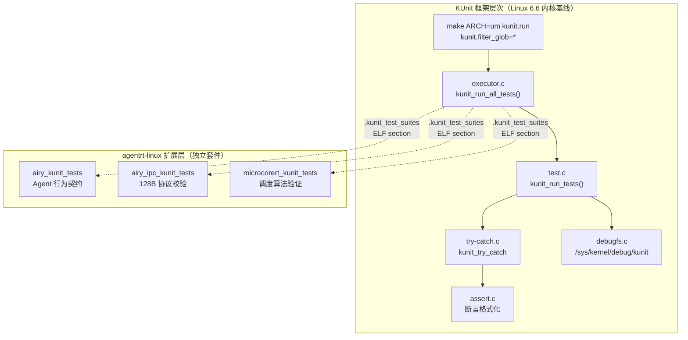
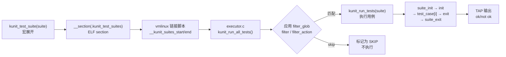
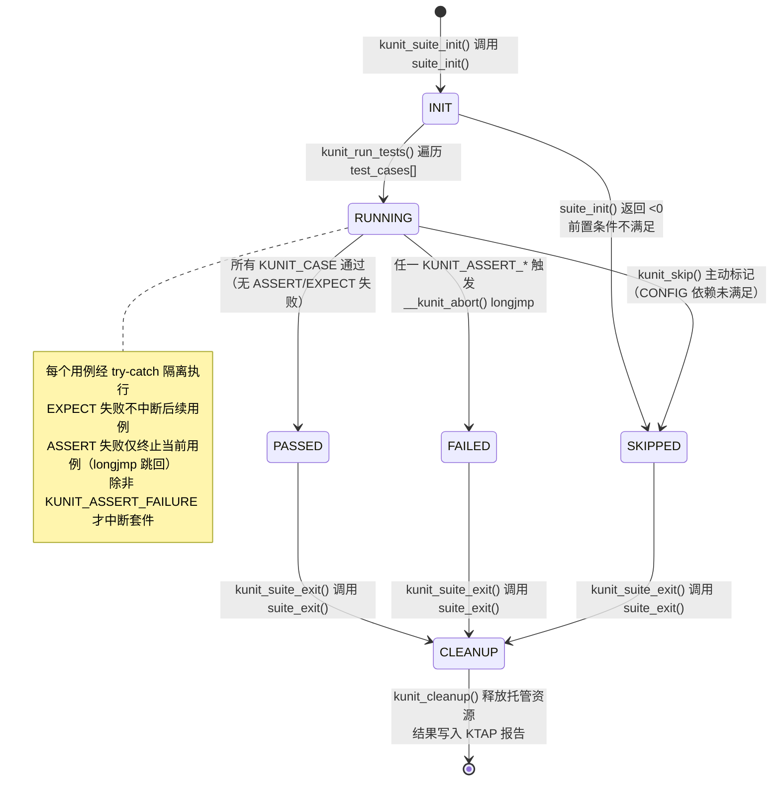
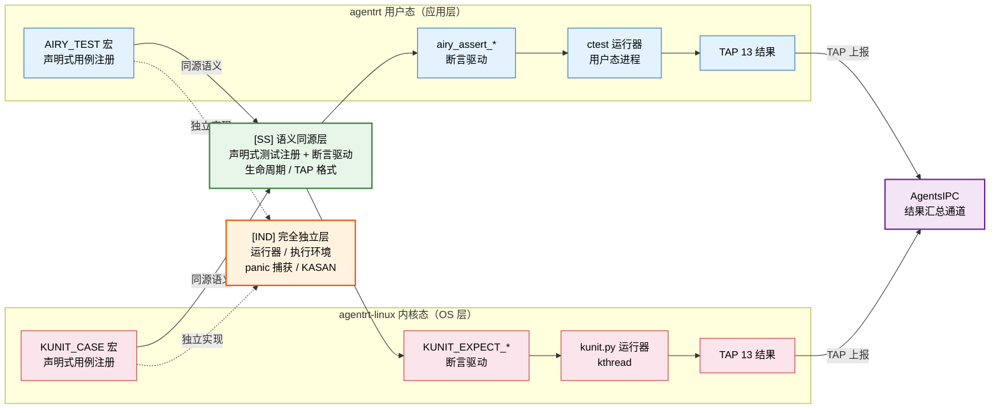

Copyright (c) 2025-2026 SPHARX Ltd. All Rights Reserved.

# agentrt-linux（AirymaxOS）KUnit 单元测试框架详解
> **文档定位**：agentrt-linux（AirymaxOS）测试工程体系第 1 卷——KUnit 白盒单元测试框架详解。本卷规定 KUnit 架构、`kunit_suite`/`kunit_case` 结构、`KUNIT_EXPECT_*`/`KUNIT_ASSERT_*` 宏、参数化测试、套件注册、KUnit 运行器、Kconfig 集成（`CONFIG_KUNIT`）、TAP 输出格式与 in-tree 测试组织。\
> **文档版本**：0.1.1\
> **最后更新**：2026-07-06\
> **上级文档**：[agentrt-linux 设计文档](README.md)\
> **同源映射**：agentrt 7 层验证 L1（白盒单元测试）+ Linux 6.6 内核基线 `lib/kunit/`、`include/kunit/test.h`\
> **理论根基**：Linux 6.6 内核基线测试思想 + Airymax 五维正交 24 原则（E-8 可测试性 / A-4 完美主义）\
> **核心约束**：IRON-9 v2 同源且部分代码共享——KUnit 框架与 Linux 6.6 上游保持源码同源，agentrt-linux 扩展必须以独立套件形式注入，禁止改写上游 KUnit 核心代码。

---

## 0. 章节定位

本卷是 agentrt-linux 测试工程 10 主题文档中的第 1 卷，回答"内核白盒单元测试怎么写"。它在 README（测试体系主索引）与 02-kselftest（系统级测试）之间形成单元测试执行层：

- **上游依赖**：README 定义 L1 白盒单元测试由本卷展开；50-engineering-standards/06-toolchain-and-automation 定义 7 层验证，本卷属第 7 层（单元测试层）。
- **下游依赖**：02-kselftest 定义"系统级测试怎么跑"；03-kernel-selftests 定义"内核自检怎么启用"——本卷定义"模块内 KUnit 怎么注册"。

本卷所有强制规则均赋予 **OS-TEST** / **OS-KER** / **OS-STD** 编号，与 07 维护者制度的"规则编号注册表"对齐。

### 0.1 关键术语

| 术语 | 定义 |
|------|------|
| KUnit | Linux 内核官方白盒单元测试框架，毫秒级运行，无需真实硬件 |
| `kunit_suite` | KUnit 测试套件结构体，含 `init`/`exit`/`test_cases` |
| `kunit_case` | KUnit 测试用例结构体，封装测试函数与参数生成器 |
| TAP | Test Anything Protocol，KUnit 默认输出格式 |
| `CONFIG_KUNIT` | KUnit 框架 Kconfig 开关，tristate（y/m/n） |
| UML | User-Mode Linux，KUnit 在开发者工作站上的首选运行载体 |
| `.kunit_test_suites` | ELF section，存放所有注册的 `kunit_suite *` 指针 |

---

## 1. KUnit 框架总览

KUnit 是 Linux 6.6 内核基线中的官方单元测试框架，由 Brendan Higgins（Google）于 2019 年合入主线。其设计目标有三：白盒可测（直接调内核内部函数）、毫秒级反馈（UML 编译即跑）、TAP 输出（CI 可解析）。

agentrt-linux 完整继承 Linux 6.6 内核基线的 KUnit 框架（`lib/kunit/`、`include/kunit/`），不修改任何上游源文件。agentrt-linux 专属测试以独立 `*_airy_test.c` 文件形式驻留于 `airymaxos/` 子仓内，遵循 IRON-9 v2 同源且部分代码共享原则。



### 1.1 运行载体

| 载体 | 命令 | 适用场景 |
|------|------|---------|
| UML | `make ARCH=um kunit.run` | 开发者本地快速反馈（首选） |
| QEMU | `kunit.enable=1` 启动参数 | 架构相关测试 |
| 真实硬件 | `kunit.enable=1` 启动参数 | 硬件依赖测试 |
| 模块加载 | `modprobe my_kunit_test` | 运行时按需测试 |

**OS-TEST-001**：所有 agentrt-linux 内核模块必须提供至少一个 KUnit 测试套件；无 KUnit 测试的模块禁止合入 `kernel` 主分支。

**OS-TEST-002**：KUnit 测试默认在 UML 上运行；若测试依赖硬件特性，必须通过 `kunit_mark_skipped()` 在非 UML 平台显式跳过并标注原因。

---

## 2. `kunit_suite` / `kunit_case` 数据结构

`include/kunit/test.h` 定义核心结构体，关键字段如下：

- `kunit_case.run_case`：测试函数指针，签名固定为 `void (*)(struct kunit *)`。
- `kunit_case.name`：由 `KUNIT_CASE()` 宏自动字符串化（`#test_name`）。
- `kunit_case.generate_params`：参数化测试的生成器，非参数化测试为 `NULL`。
- `kunit_case.attr`：测试属性（如 `speed`），用于过滤与分类。
- `kunit_suite.suite_init`/`suite_exit`：跨用例共享资源初始化/释放。
- `kunit_suite.init`/`exit`：每用例资源初始化/释放。
- `kunit_suite.test_cases`：以 `{}` 终止的 `kunit_case` 数组。

执行顺序：`suite_init` →（每用例：`init` → `test_case[i]` → `exit`）→ `suite_exit`。

**OS-TEST-003**：`init`/`exit` 用于每用例的资源分配/释放；`suite_init`/`suite_exit` 用于跨用例共享资源。若资源由 KUnit 托管（`kunit_kmalloc` 等），无需手写 `exit`，违反此规则需在评审中说明理由。

**OS-KER-094**：测试函数禁止直接访问 `struct kunit` 的私有字段（`log`/`try_catch`/`status` 等）；只能通过 `kunit_info()`/`kunit_warn()`/`kunit_err()`/`kunit_skip()`/`test->priv` 等公共 API 访问。

---

## 3. `KUNIT_EXPECT_*` / `KUNIT_ASSERT_*` 断言宏

| 族 | 失败行为 | 典型用途 |
|----|---------|---------|
| `KUNIT_EXPECT_*` | 记录失败，继续执行 | 一般性断言 |
| `KUNIT_ASSERT_*` | 记录失败，立即终止当前用例 | 资源分配失败等前置条件 |

### 3.1 断言宏族清单（Linux 6.6 内核基线）

每个 `EXPECT_*` 都有对应 `ASSERT_*` 与 `*_MSG` 变体，共 4 个变体：

| 类别 | 宏族 |
|------|------|
| 布尔 | `EXPECT_TRUE` / `EXPECT_FALSE` |
| 整数比较 | `EXPECT_EQ` / `EXPECT_NE` / `EXPECT_GT` / `EXPECT_LT` / `EXPECT_GE` / `EXPECT_LE` |
| 指针 | `EXPECT_NULL` / `EXPECT_NOT_NULL` / `EXPECT_PTR_EQ` / `EXPECT_PTR_NE` / `EXPECT_NOT_ERR_OR_NULL` |
| 字符串 | `EXPECT_STREQ` / `EXPECT_STRNEQ` |
| 内存块 | `EXPECT_MEMEQ` / `EXPECT_MEMNEQ` |
| 主动失败 | `KUNIT_FAIL(test, fmt, ...)` |

### 3.2 AgentsIPC 头部断言示例

```c
static void airy_ipc_header_test(struct kunit *test)
{
    struct airy_ipc_msg_hdr hdr;
    int ret = airy_ipc_msg_hdr_init(&hdr, AIRY_IPC_TYPE_REQUEST, 0);
    /* ASSERT 失败立即终止：后续依赖 hdr 字段 */
    KUNIT_ASSERT_EQ(test, 0, ret);
    KUNIT_ASSERT_NOT_NULL(test, hdr.payload);
    /* EXPECT 失败继续：单条断言失败不影响其他断言 */
    KUNIT_EXPECT_EQ(test, AIRY_IPC_TYPE_REQUEST, hdr.type);
    KUNIT_EXPECT_EQ(test, 128U, sizeof(hdr));
    KUNIT_EXPECT_EQ(test, 0, hdr.reserved);
}
```

**OS-TEST-004**：所有依赖前置资源（内存分配、句柄获取）的断言必须用 `ASSERT_*`；断言失败会导致后续代码 NULL 解引用时必须用 `ASSERT_*`。普通业务断言用 `EXPECT_*` 以收集尽可能多的失败信息。

**OS-STD-001**：禁止使用裸 `BUG_ON`/`WARN_ON` 替代 KUnit 断言；测试代码不得通过 `printk` 自行报告结果，必须经 TAP 通道输出。

---

## 4. 参数化测试

生成器签名 `const void *gen_params(const void *prev, char *desc)`：`prev` 为上一次返回值（初值 `NULL`），`desc` 为参数描述（长度上限 `KUNIT_PARAM_DESC_SIZE`=128），返回 `NULL` 表示序列结束。`KUNIT_ARRAY_PARAM(name, array, get_desc)` 自动生成 `name_gen_params` 函数，从 `array` 顺序产出参数。

### 4.1 MicroCoreRT 调度策略参数化示例

```c
struct microcorert_sched_param {
    int policy, priority, expected_slice_us;
};
static const struct microcorert_sched_param sched_params[] = {
    { .policy = MICROCORERT_SCHED_FIFO,     .priority = 50, .expected_slice_us = 1000 },
    { .policy = MICROCORERT_SCHED_RR,       .priority = 50, .expected_slice_us = 1000 },
    { .policy = MICROCORERT_SCHED_DEADLINE, .priority = 0,  .expected_slice_us = 500  },
};
KUNIT_ARRAY_PARAM(microcorert_sched, sched_params,
                  microcorert_sched_param_get_desc);

static void microcorert_sched_slice_test(struct kunit *test)
{
    const struct microcorert_sched_param *p = test->param_value;
    KUNIT_ASSERT_NOT_NULL(test, p);
    if (p->priority < 0) kunit_skip(test, "negative priority unsupported");
    KUNIT_EXPECT_EQ(test, p->expected_slice_us,
                   microcorert_compute_slice(p->policy, p->priority));
}
```

**OS-TEST-005**：所有接受枚举/标志位/数值区间入参的内核接口必须有参数化测试覆盖；参数集必须包含边界值（0、最小、最大、非法值各一例）。

**OS-TEST-006**：参数生成器不得返回栈上地址；必须返回静态数组元素或堆分配（后者需在 `exit` 中释放）。

---

## 5. 测试套件注册

`kunit_test_suites(...)` 宏将套件指针数组放入 `.kunit_test_suites` ELF section，executor 启动时遍历此 section。`kunit_test_suite(suite)` 是单套件简写。

### 5.1 套件注册流程



### 5.2 单套件注册示例

```c
static struct kunit_suite airy_ipc_suite = {
    .name = "airy_ipc",
    .init = airy_ipc_init,
    .exit = airy_ipc_exit,
    .test_cases = airy_ipc_cases,
};
kunit_test_suite(airy_ipc_suite);
MODULE_LICENSE("GPL v2");
```

### 5.3 测试托管资源 API

`kunit_kmalloc`/`kunit_kzalloc`/`kunit_kcalloc` 在用例上下文中分配内存，`kunit_kfree` 释放单块，`kunit_cleanup` 在用例结束时自动释放所有托管资源。托管资源无需在 `exit` 中手写释放代码。

**OS-KER-095**：agentrt-linux 扩展套件必须以 `airy_*` 前缀命名，与上游套件区分；上游套件禁止改名（保持 IRON-9 v2 同源且部分代码共享）。

**OS-TEST-007**：每个 `kunit_suite` 的 `name` 字段在编译单元内必须唯一；跨子仓的命名冲突由 CI 第 7 层（单元测试层）静态检查报告。

**OS-TEST-008**：测试中所有堆分配必须经 `kunit_kmalloc`/`kunit_kzalloc` 托管；禁止裸 `kmalloc` 后忘记 `kfree`，导致内存泄漏被 kmemleak 误报为产品缺陷。

### 5.4 KUnit 测试套件生命周期状态机

KUnit 测试套件从 `suite_init` 初始化到 `suite_exit` 清理的完整状态转换，覆盖 PASSED/FAILED/SKIPPED 三种终止态：



**状态转换条件**：

| 从状态 | 到状态 | 触发条件 | 系统行为 |
|--------|--------|---------|---------|
| — | INIT | `kunit_suite_init()` 调用 `suite->suite_init()` | 跨用例共享资源初始化（如 AgentsIPC 句柄） |
| INIT | RUNNING | `kunit_run_tests()` 进入 `test_cases[]` 遍历 | 依次执行 `init → run_case → exit` |
| INIT | SKIPPED | `suite_init()` 返回 <0（如 `CONFIG_X=n`） | 整套件标记 SKIP，记录 `status_comment` |
| RUNNING | PASSED | 所有 `KUNIT_CASE` 的 `KUNIT_EXPECT_*` 无失败 | TAP 输出 `ok N - case_name` |
| RUNNING | FAILED | 任一 `KUNIT_ASSERT_*` 触发 `__kunit_abort()` | longjmp 跳回用例入口，TAP 输出 `not ok` |
| RUNNING | SKIPPED | `kunit_skip()` 主动跳过 | 当前用例标记 `# SKIP <reason>` |
| PASSED | CLEANUP | `kunit_suite_exit()` 调用 `suite->suite_exit()` | 释放 `suite_init` 分配的共享资源 |
| FAILED | CLEANUP | `kunit_suite_exit()` 调用 `suite->suite_exit()` | 释放共享资源（即便有用例失败） |
| SKIPPED | CLEANUP | `kunit_suite_exit()` 调用 `suite->suite_exit()` | 释放已分配资源，KTAP 写入 SKIP 原因 |
| CLEANUP | — | `kunit_cleanup()` 遍历 `kunit_resource` 链表释放 | 托管内存回收，KTAP 报告 finalize |

---

## 6. KUnit 运行器

`lib/kunit/executor.c` 的 `kunit_run_all_tests()` 是入口：从 `__kunit_suites_start`/`__kunit_suites_end`（由 vmlinux 链接脚本从 `.kunit_test_suites` section 提取）取得套件集合，应用过滤后调用 `kunit_exec_run_tests`。

### 6.1 模块参数（过滤）

| 参数 | 作用 | 示例 |
|------|------|------|
| `kunit.enable` | 总开关（0/1） | `kunit.enable=0` 全部跳过 |
| `kunit.filter_glob` | 套件/用例名 glob | `kunit.filter_glob=list*` |
| `kunit.filter` | 属性过滤 | `kunit.filter="speed>slow"` |
| `kunit.filter_action` | 过滤行为 | `skip`（标记为 SKIP 而非不运行） |
| `kunit.action` | 运行模式 | `list`（仅列出）、`list_attr` |

KUnit 用 `setjmp`/`longjmp` 在 `lib/kunit/try-catch.c` 中隔离断言失败：`KUNIT_ASSERT_*` 失败时调用 `__kunit_abort()`，跳回用例入口，避免内核 panic。

**OS-TEST-009**：测试禁止调用 `BUG()`/`panic()`；致命错误必须经 `KUNIT_ASSERT_*` 经 try-catch 退出。`KUNIT_FAIL()` 之后禁止再有副作用代码。

---

## 7. KUnit 与 Kconfig 集成

`lib/kunit/Kconfig` 中 `menuconfig KUNIT` 是 tristate 框架本体，`select GLOB`。相关配置：

| 配置 | 作用 |
|------|------|
| `CONFIG_KUNIT` | KUnit 框架本体 |
| `CONFIG_KUNIT_DEBUGFS` | `/sys/kernel/debug/kunit/<suite>/results` |
| `CONFIG_KUNIT_TEST` | KUnit 框架自测试 |
| `CONFIG_KUNIT_EXAMPLE_TEST` | 示例测试（仅文档作用） |
| `CONFIG_KUNIT_ALL_TESTS` | 一次性启用所有可启用测试 |
| `CONFIG_KUNIT_DEFAULT_ENABLED` | `kunit.enable` 默认值 |

### 7.1 子仓 Kconfig 模板

```kconfig
# kernel/airymaxos/airy_ipc/Kconfig
config AIRY_IPC_KUNIT_TEST
    tristate "AgentsIPC KUnit tests" if !KUNIT_ALL_TESTS
    default KUNIT_ALL_TESTS
    depends on AIRY_IPC && KUNIT
    help
      KUnit tests for AgentsIPC 128B header & payload protocol.
      Required by agentrt-linux 7-layer verification L7.
```

**OS-STD-002**：所有 agentrt-linux 子仓的 KUnit 测试必须 `default KUNIT_ALL_TESTS`，与上游约定一致；CI 默认开 `CONFIG_KUNIT_ALL_TESTS=y`，开发者按需关闭。

**OS-KER-096**：禁止在 `defconfig` 中默认开启 `CONFIG_KUNIT_EXAMPLE_TEST`（仅示例，无产品价值）；该开关仅供新开发者学习使用。

---

## 8. TAP 输出格式

KUnit 遵循 Test Anything Protocol（http://testanything.org/）。每行形如 `<ok|not ok> <test_number> [-] <test_name> [# SKIP <reason>]`，缩进 4 空格表示套件下用例，缩进 8 空格表示参数化测试。`# SKIP` 表示跳过；`# speed=normal` 表示属性。

`CONFIG_KUNIT_DEBUGFS=y` 时 KUnit 会将上次运行结果写入 `/sys/kernel/debug/kunit/<suite>/results`，便于事后查看。

**OS-TEST-010**：CI 必须解析 TAP 输出并上传至测试报告系统；`not ok` 与 `# SKIP` 必须分别计数，禁止用单一 pass/fail 掩盖跳过。

**OS-STD-003**：禁止在测试代码中 `printk` 自定义格式结果（破坏 TAP 解析）；所有诊断信息必须经 `kunit_info`/`kunit_warn`/`kunit_err` 输出，自动写入 per-test log。

---

## 9. in-tree 测试组织

上游 KUnit 框架本体位于 `lib/kunit/`（`test.c`/`assert.c`/`executor.c`/`try-catch.c`/`kunit-example-test.c`/`kunit-test.c`）；公共头位于 `include/kunit/`（`test.h`/`assert.h`/`resource.h`/`static_stub.h`）。各子系统测试与被测源码同目录：`drivers/foo/foo.c` 配套 `drivers/foo/foo_test.c`。

### 9.1 agentrt-linux 子仓组织与 Makefile

agentrt-linux 子仓遵循同目录原则：`kernel/airymaxos/airy_ipc/airy_ipc.c` 配套 `airy_ipc_test.c`；`microcorert_sched.c` 配套 `microcorert_sched_test.c`（MicroCoreRT 调度算法）；`memoryrovol_l2.c` 配套 `memoryrovol_l2_test.c`（记忆演化 L1→L2）。

```makefile
# kernel/airymaxos/airy_ipc/Makefile
obj-$(CONFIG_AIRY_IPC) += airy_ipc.o
obj-$(CONFIG_AIRY_IPC_KUNIT_TEST) += airy_ipc_test.o
airy_ipc_test-y := airy_ipc_test.o airy_ipc_msg_hdr_test.o
```

**OS-KER-097**：agentrt-linux KUnit 测试文件必须与被测源码同目录同名加 `_test` 后缀；禁止集中放于 `tests/` 目录（违反 in-tree 原则，导致测试与产品代码漂移）。

**OS-STD-004**：测试目标 `obj-$(CONFIG_*_KUNIT_TEST)` 必须 `depends on` 对应产品模块 `CONFIG_*`，避免在模块未编译时测试独立报错。

---

## 10. agentrt-linux 专属扩展：Agent 契约测试

agentrt-linux 在 Linux 6.6 内核基线 KUnit 之上扩展 Agent 契约测试（README 第 1.2 节 L8 层），但严格遵循 IRON-9 v2 同源且部分代码共享：所有扩展作为独立套件注入，不修改上游 KUnit 框架。

```c
/* cognition/cognition_test.c */
#include <kunit/test.h>
#include <airymaxos/cognition_client.h>

static void cognition_contract_test(struct kunit *test)
{
    struct agent_handle *agent = airy_cognition_client_create();
    struct cognition_response *resp;
    KUNIT_ASSERT_NOT_ERR_OR_NULL(test, agent);
    resp = airy_cognition_process(agent, "hello");
    KUNIT_EXPECT_EQ(test, AIRY_EOK, resp->status);
    KUNIT_EXPECT_NOT_NULL(test, resp->output);
    KUNIT_EXPECT_GT(test, resp->tokens_used, 0);
    airy_cognition_client_destroy(agent);
}

static struct kunit_case cognition_cases[] = {
    KUNIT_CASE(cognition_contract_test),
    {}
};
static struct kunit_suite airy_cognition_suite = {
    .name = "airy_cognition_contract",
    .test_cases = cognition_cases,
};
kunit_test_suite(airy_cognition_suite);
MODULE_LICENSE("GPL v2");
```

**OS-TEST-011**：所有 agentrt-linux Agent SDK 接口必须有 KUnit 契约测试；契约测试覆盖正常路径 + 至少 1 个异常路径 + 至少 1 个边界路径。

### 10.1 五维原则映射

本节落实 Airymax 五维正交 24 原则在 KUnit 卷的具体映射——每个原则至少对应 1 条强制规则，规则之间两两正交无重叠，从而保证评审清单可独立执行：

| 原则 | 在 KUnit 卷的体现 |
|------|------------------|
| **E-8 可测试性** | KUnit 框架本身体现"白盒可测"；每模块必有套件（OS-TEST-001） |
| **A-4 完美主义** | 参数化必须覆盖边界（OS-TEST-005）；托管资源强制（OS-TEST-008） |
| **S-1 反馈闭环** | UML 毫秒级反馈 + TAP CI 解析（OS-TEST-010） |
| **K-1 内核优先** | KUnit 直接调内核函数，不经 syscall 边界 |
| **K-3 协议优先** | AgentsIPC 128B 协议通过 KUnit 契约测试固化 |
| **IRON-9 v2 同源且部分代码共享** | agentrt-linux 扩展套件独立注入，不改上游（OS-KER-095/004） |

> Airymax 五维正交 24 原则要求各维度的强制规则两两正交，避免一条规则同时承担多个原则的检查职责，从而保证评审清单可独立执行。

---

## 11. 同源 agentrt 映射

agentrt 7 层验证与本卷的对应关系：

| agentrt 层 | 验证目标 | 本卷对应 |
|-----------|---------|---------|
| L1 白盒单元 | 单函数行为 | KUnit `KUNIT_CASE` |
| L2 模块集成 | 模块内多函数协作 | KUnit `kunit_suite` + `init`/`exit` |
| L3 子系统 | 跨模块接口 | KUnit 参数化 + 多套件 |
| L4 系统级 | 内核整体 | 02-kselftest（非本卷） |
| L5 协议 | 协议契约 | KUnit Agent 契约测试（第 10 节） |
| L6 形式化 | 关键路径证明 | 10-formal-verification（非本卷） |
| L7 模糊 | 输入边界 | 09-fuzz-testing（非本卷） |

**OS-KER-074**：agentrt L1（白盒单元）的所有用例必须用 KUnit 实现；与上游 KUnit 共享同一 `.kunit_test_suites` ELF section，禁止 agentrt-linux 自建独立运行器。

**OS-KER-075**：agentrt 与 agentrt-linux 之间的 KUnit 套件命名空间必须正交（`airy_*` vs `airy_*` 前缀），由 CI 静态检查器（第 7 层）执行命名冲突检测。

### 11.1 CI 集成

CI 矩阵覆盖 `arch: [um, x86_64, arm64, riscv64] × config: [defconfig, allmodconfig]`，使用 `tools/testing/kunit/kunit.py` 运行器：

```bash
./tools/testing/kunit/kunit.py run                          # 运行所有套件
./tools/testing/kunit/kunit.py run --filter_glob=airy_*  # 仅运行 airy_* 套件
./tools/testing/kunit/kunit.py run --kernel_args=kunit.action=list  # 列出所有套件
./tools/testing/kunit/kunit.py parse < results.tap          # 解析 TAP 结果
```

**OS-STD-005**：CI 第 7 层（单元测试层）必须运行 `make ARCH=um kunit.run` 全量套件，且 `kunit.filter_glob=airy_*` 单独运行 agentrt-linux 套件以隔离命名空间。

**OS-TEST-012**：PR 引入新 KUnit 套件时，CI 必须对比 PR 前后的 TAP 用例数；新增套件必须使 agentrt-linux 总用例数单调递增（不可因重构而静默删除套件）。

### 11.2 IRON-9 v2 三层共享模型

本节将上节"同源 agentrt 映射"进一步细化为 **IRON-9 v2 三层共享模型**，明确测试框架层在用户态（agentrt）与内核态（agentrt-linux）之间的代码共享边界。三层分别为：**[SC] 共享契约层**（共享头文件 / 数据结构定义）、**[SS] 语义同源层**（设计模式同源但实现独立）、**[IND] 完全独立层**（双方各自独立实现）。该模型由 6 个 [SC] 头文件契约、跨态语义对照表与独立实现清单共同支撑。

#### 11.2.1 三层模型概览表

| 层次 | 共享程度 | 测试框架层内容 |
|------|---------|---------------|
| **[SC] 共享契约层** | 无 | 无 [SC] 层——测试框架为各端独立实现，不与 agentrt 用户态共享代码 |
| **[SS] 语义同源层** | 设计模式同源 | 测试套件注册模式（`kunit_suite` → `agentrt test_suite`）、断言宏模式（`KUNIT_EXPECT_*` → `airy_assert_*`）、测试执行生命周期（`init→run→exit`）、参数化测试——与 agentrt 用户态测试框架在"声明式测试注册 + 断言驱动"语义上同源 |
| **[IND] 完全独立层** | 完全独立 | KUnit 内核态测试运行器、kthread 执行环境、内核 panic 捕获、KASAN 集成、`KUNIT_CASE_TABLE` 宏 |

#### 11.2.2 [SC] 共享契约层

**无直接 [SC] 共享头文件**。

测试框架层不属于 IRON-9 v2 的 6 个 [SC] 共享头文件清单（`syscalls.h` / `memory_types.h` / `security_types.h` / `cognition_types.h` / `sched.h` / `ipc.h`）。测试框架是验证基础设施，两端运行环境截然不同（用户态进程 vs 内核态 kthread），其断言宏与套件注册宏各自定义，源码层无共享头文件依赖。这一约束确保 agentrt 用户态测试框架演进时不会被动牵连 agentrt-linux KUnit，反之亦然——测试框架层的演进由各自的 **OS-TEST 评审** 独立裁决。两端仅通过 **AgentsIPC** 汇总测试结果，实现跨态协作而非代码共享。

#### 11.2.3 [SS] 语义同源层

| 语义维度 | agentrt 用户态测试框架 | agentrt-linux 内核态（KUnit） | 同源语义 |
|---------|----------------------|-------------------------------|----------|
| 套件注册 | `agentrt test_suite` 结构体 | `kunit_suite` 结构体 | 声明式测试套件注册 |
| 用例注册 | `AIRY_TEST(test_name)` 宏 | `KUNIT_CASE(test_name)` 宏 | 声明式用例注册 |
| 断言宏 | `airy_assert_*` / `airy_expect_*` | `KUNIT_EXPECT_*` / `KUNIT_ASSERT_*` | 断言驱动验证 |
| 生命周期 | `init → run → exit` | `init → run → exit` | 测试执行生命周期 |
| 参数化测试 | `airy_param_test` 表驱动 | `KUNIT_PARAM_TEST` 表驱动 | 参数化测试模式 |
| 结果输出 | TAP 13 格式 | TAP 13 格式 | 测试结果报告格式 |
| 套件过滤 | `--filter` 选项 | `--filter_glob` 选项 | 套件选择过滤 |

**语义说明**：agentrt 用户态测试框架与 agentrt-linux 内核态的 KUnit 在"声明式测试注册 + 断言驱动"这一核心语义上同源——二者均通过**声明式宏**（`AIRY_TEST` / `KUNIT_CASE`）注册测试用例，通过**断言宏**（`airy_assert_*` / `KUNIT_EXPECT_*`）驱动验证逻辑，遵循统一的 `init → run → exit` 生命周期。这种同源使测试用例的编写心智模型在两端可复用：理解了 KUnit 的 `KUNIT_CASE` 套件注册，即理解了 agentrt 的 `AIRY_TEST` 用例注册。两端还共享 **TAP 13 输出格式**，使 CI 可用统一的解析器处理两端的测试结果。但**机制完全独立**——KUnit 运行于内核态 kthread，agentrt 测试运行于用户态进程，二者无代码共享。

#### 11.2.4 [IND] 完全独立层

| 独立实现项 | agentrt-linux 内核态（KUnit） | agentrt 用户态 | 独立原因 |
|-----------|------------------------------|---------------|---------|
| 测试运行器 | `tools/testing/kunit/kunit.py` | `ctest` / 自研运行器 | 运行环境不同 |
| 执行环境 | kthread 内核线程 | 用户态进程 | 内核态 vs 用户态 |
| panic 捕获 | 内核 panic 捕获 + UML | 进程崩溃捕获（signal） | 内核 panic 语义特有 |
| KASAN 集成 | 内核 KASAN 内存检测 | AddressSanitizer（用户态） | 内存检测机制不同 |
| `KUNIT_CASE_TABLE` 宏 | ELF section `.kunit_test_suites` | 链接器段或注册表 | 注册机制不同 |
| UML 支持 | User Mode Linux（ARCH=um） | 无对应 | 内核态特有虚拟化 |

#### 11.2.5 跨态协作流



**协作说明**：agentrt 用户态测试通过 `AIRY_TEST` + `airy_assert_*` 编写并运行于用户态进程，agentrt-linux 内核态测试通过 `KUNIT_CASE` + `KUNIT_EXPECT_*` 编写并运行于内核态 kthread。两端在 **[SS] 语义同源层** 共享"声明式测试注册 + 断言驱动"的设计模式（套件注册 / 断言宏 / 生命周期 / TAP 13 格式），使测试用例的编写心智模型在两端可复用；但在 **[IND] 完全独立层** 各自维护运行器、执行环境、panic 捕获、KASAN 集成。两端测试结果均输出 **TAP 13 格式**，通过 **AgentsIPC** 通道汇总至 CI 第 7 层统一解析。这正是 **IRON-9 v2 同源且部分代码共享** 在测试框架层的落地——同源模式，独立实现，无共享契约，靠 IPC 协作。

### 11.3 Agent 行为契约测试矩阵

本节定义 Agent 行为契约测试的完整矩阵——验证 4 种 Agent 角色（LLM/TOOL/PLAN/OBSERVE）在 8 类行为触发时的返回值、状态变更与副作用符合预期。该矩阵是 §10 Agent 契约测试的细化，遵循 IRON-9 v2 同源且部分代码共享原则：测试以独立 `airy_*` 套件形式注入，不修改上游 KUnit 框架。

#### 11.3.1 Agent 角色 × 行为 枚举契约

角色枚举与行为枚举均定义于 [SC] 共享契约层头文件 `include/airymax/cognition_types.h`（Agent 角色枚举 + Agent 行为枚举合并于 [SC] 核心，两端字节级一致）：

```c
/* include/airymax/cognition_types.h — Agent 角色枚举 + 行为枚举（[SC] 共享契约层） */
enum airy_role {
    AIRY_ROLE_LLM     = 0,  /* 大语言模型推理角色 */
    AIRY_ROLE_TOOL    = 1,  /* 工具执行角色 */
    AIRY_ROLE_PLAN    = 2,  /* 规划角色 */
    AIRY_ROLE_OBSERVE = 3,  /* 观测角色 */
};

enum airy_action {
    AIRY_ACTION_PROBE          = 0,  /* 探测 Agent 可用性 */
    AIRY_ACTION_BIND           = 1,  /* 绑定资源 */
    AIRY_ACTION_DISPATCH       = 2,  /* 分派任务 */
    AIRY_ACTION_SUSPEND        = 3,  /* 挂起 */
    AIRY_ACTION_RESUME         = 4,  /* 恢复 */
    AIRY_ACTION_TERMINATE      = 5,  /* 终止 */
    AIRY_ACTION_TOKEN_EXHAUST  = 6,  /* token 耗尽 */
    AIRY_ACTION_COMM_FAILURE   = 7,  /* 通信失败 */
};
```

#### 11.3.2 完整测试矩阵表

4 角色 × 8 行为 = 32 个测试用例。`AGENT_STATE_*` 状态名对齐 `include/airymax/cognition_types.h` 中的 `enum airy_action`：

| Agent 角色 | 测试行为 | 预期返回值 | 预期状态变更 | 预期副作用 |
|-----------|---------|-----------|-------------|-----------|
| LLM | probe | `AIRY_EOK` | `AGENT_STATE_IDLE` | 注册到 `airy_registry`，`agent_handle != NULL` |
| LLM | bind | `AIRY_EOK` | `AGENT_STATE_BOUND` | 绑定 token 配额，`token_quota > 0` |
| LLM | dispatch | `AIRY_EOK` | `AGENT_STATE_RUNNING` | 调用 `llm_infer()`，`output != NULL`，`tokens_used > 0` |
| LLM | suspend | `AIRY_EOK` | `AGENT_STATE_SUSPENDED` | 暂停推理上下文，`vtime` 冻结 |
| LLM | resume | `AIRY_EOK` | `AGENT_STATE_RUNNING` | 恢复推理上下文，`vtime` 续算 |
| LLM | terminate | `AIRY_EOK` | `AGENT_STATE_TERMINATED` | 释放 token 句柄，注销 registry |
| LLM | token_exhaust | `-ETOKEN_EXHAUSTED` | `AGENT_STATE_ERROR` | 调用 `token_handler(TOKEN_EVENT_EXHAUST)`，触发回退 |
| LLM | comm_failure | `-AIRY_ECOMM` | `AGENT_STATE_ERROR` | 5 秒超时回退到 fallback agent |
| TOOL | probe | `AIRY_EOK` | `AGENT_STATE_IDLE` | 注册到 registry，`tool_table` 非空 |
| TOOL | bind | `AIRY_EOK` | `AGENT_STATE_BOUND` | 绑定 capability，`CAP_SYS_PTRACE` 校验 |
| TOOL | dispatch | `AIRY_EOK` | `AGENT_STATE_RUNNING` | 调用 `tool_exec()`，`exit_code == 0` |
| TOOL | suspend | `AIRY_EOK` | `AGENT_STATE_SUSPENDED` | 暂停子进程，`SIGSTOP` 发送 |
| TOOL | resume | `AIRY_EOK` | `AGENT_STATE_RUNNING` | 恢复子进程，`SIGCONT` 发送 |
| TOOL | terminate | `AIRY_EOK` | `AGENT_STATE_TERMINATED` | 回收子进程，`waitpid` 返回 |
| TOOL | token_exhaust | `-ETOKEN_EXHAUSTED` | `AGENT_STATE_ERROR` | 调用 `token_handler`，工具调用降级 |
| TOOL | comm_failure | `-AIRY_ECOMM` | `AGENT_STATE_ERROR` | 5 秒超时回退，工具调用重试 ≤ 3 次 |
| PLAN | probe | `AIRY_EOK` | `AGENT_STATE_IDLE` | 注册到 registry，`plan_graph` 非空 |
| PLAN | bind | `AIRY_EOK` | `AGENT_STATE_BOUND` | 绑定规划上下文，`plan_depth <= MAX_DEPTH` |
| PLAN | dispatch | `AIRY_EOK` | `AGENT_STATE_RUNNING` | 调用 `plan_solve()`，`plan_steps > 0` |
| PLAN | suspend | `AIRY_EOK` | `AGENT_STATE_SUSPENDED` | 暂停规划栈，`plan_stack` 冻结 |
| PLAN | resume | `AIRY_EOK` | `AGENT_STATE_RUNNING` | 恢复规划栈，续算依赖 |
| PLAN | terminate | `AIRY_EOK` | `AGENT_STATE_TERMINATED` | 释放规划上下文，清空 `plan_graph` |
| PLAN | token_exhaust | `-ETOKEN_EXHAUSTED` | `AGENT_STATE_ERROR` | 调用 `token_handler`，规划降级为粗粒度 |
| PLAN | comm_failure | `-AIRY_ECOMM` | `AGENT_STATE_ERROR` | 5 秒超时回退到上一规划节点 |
| OBSERVE | probe | `AIRY_EOK` | `AGENT_STATE_IDLE` | 注册到 registry，`observe_channel` 就绪 |
| OBSERVE | bind | `AIRY_EOK` | `AGENT_STATE_BOUND` | 绑定观测源，`event_mask != 0` |
| OBSERVE | dispatch | `AIRY_EOK` | `AGENT_STATE_RUNNING` | 调用 `observe_collect()`，`event_count > 0` |
| OBSERVE | suspend | `AIRY_EOK` | `AGENT_STATE_SUSPENDED` | 暂停事件采集，`ring_buffer` 冻结 |
| OBSERVE | resume | `AIRY_EOK` | `AGENT_STATE_RUNNING` | 恢复事件采集，续采 |
| OBSERVE | terminate | `AIRY_EOK` | `AGENT_STATE_TERMINATED` | 释放观测通道，flush `ring_buffer` |
| OBSERVE | token_exhaust | `-ETOKEN_EXHAUSTED` | `AGENT_STATE_ERROR` | 调用 `token_handler`，观测降采样 |
| OBSERVE | comm_failure | `-AIRY_ECOMM` | `AGENT_STATE_ERROR` | 5 秒超时回退到本地缓存模式 |

#### 11.3.3 关键测试用例代码片段

LLM 角色 token_exhaust——验证 `token_handler` 被调用且状态转为 ERROR：

```c
/* cognition/agent_contract_test.c */
static void llm_token_exhaust_test(struct kunit *test)
{
    struct agent_handle *agent = airy_agent_create(AIRY_ROLE_LLM);
    KUNIT_ASSERT_NOT_ERR_OR_NULL(test, agent);
    KUNIT_EXPECT_EQ(test, AIRY_EOK, airy_agent_bind(agent, 100));
    KUNIT_EXPECT_EQ(test, AIRY_EOK, airy_agent_dispatch(agent, "long prompt", 200));
    KUNIT_EXPECT_EQ(test, -ETOKEN_EXHAUSTED,
                    airy_agent_action(agent, AIRY_ACTION_TOKEN_EXHAUST));
    KUNIT_EXPECT_EQ(test, AGENT_STATE_ERROR, airy_agent_state(agent));
    KUNIT_EXPECT_EQ(test, 1, mock_token_handler_call_count(TOKEN_EVENT_EXHAUST));
    airy_agent_destroy(agent);
}
```

OBSERVE 角色 comm_failure——验证 5 秒超时回退到本地缓存模式：

```c
static void observe_comm_failure_test(struct kunit *test)
{
    struct agent_handle *agent = airy_agent_create(AIRY_ROLE_OBSERVE);
    KUNIT_ASSERT_NOT_ERR_OR_NULL(test, agent);
    KUNIT_EXPECT_EQ(test, AIRY_EOK, airy_agent_bind(agent, 0));
    KUNIT_EXPECT_EQ(test, AIRY_EOK, airy_agent_dispatch(agent, NULL, 0));
    mock_airy_ipc_set_error(-EAGAIN);  /* 注入通信故障 */
    ktime_t start = ktime_get();
    int ret = airy_agent_action(agent, AIRY_ACTION_COMM_FAILURE);
    s64 elapsed_ms = ktime_to_ms(ktime_sub(ktime_get(), start));
    KUNIT_EXPECT_EQ(test, -AIRY_ECOMM, ret);
    KUNIT_EXPECT_EQ(test, AGENT_STATE_ERROR, airy_agent_state(agent));
    KUNIT_EXPECT_GE(test, elapsed_ms, 4900);  /* 5s 超时（±100ms 抖动） */
    KUNIT_EXPECT_LE(test, elapsed_ms, 5100);
    KUNIT_EXPECT_TRUE(test, airy_observe_is_local_cache(agent));
    airy_agent_destroy(agent);
}
```

PLAN 角色 dispatch——验证规划步数 > 0：

```c
static void plan_dispatch_test(struct kunit *test)
{
    struct agent_handle *agent = airy_agent_create(AIRY_ROLE_PLAN);
    KUNIT_ASSERT_NOT_ERR_OR_NULL(test, agent);
    KUNIT_EXPECT_EQ(test, AIRY_EOK, airy_agent_bind(agent, 1000));
    KUNIT_EXPECT_EQ(test, AIRY_EOK,
                    airy_agent_dispatch(agent, "plan: reach goal X", 0));
    KUNIT_EXPECT_EQ(test, AGENT_STATE_RUNNING, airy_agent_state(agent));
    KUNIT_EXPECT_GT(test, airy_plan_step_count(agent), 0);
    airy_agent_destroy(agent);
}
```

TOOL 角色 terminate——验证子进程已回收（无僵尸）：

```c
static void tool_terminate_test(struct kunit *test)
{
    struct agent_handle *agent = airy_agent_create(AIRY_ROLE_TOOL);
    KUNIT_ASSERT_NOT_ERR_OR_NULL(test, agent);
    KUNIT_EXPECT_EQ(test, AIRY_EOK, airy_agent_bind(agent, 100));
    KUNIT_EXPECT_EQ(test, AIRY_EOK, airy_agent_dispatch(agent, "exec: ls", 0));
    KUNIT_EXPECT_EQ(test, AIRY_EOK,
                    airy_agent_action(agent, AIRY_ACTION_TERMINATE));
    KUNIT_EXPECT_EQ(test, AGENT_STATE_TERMINATED, airy_agent_state(agent));
    KUNIT_EXPECT_EQ(test, 0, airy_tool_pending_children(agent));
    airy_agent_destroy(agent);
}
```

#### 11.3.4 agentrt-linux 扩展深化规则

**OS-TST-013**：每种 Agent 角色（LLM/TOOL/PLAN/OBSERVE）必须有完整的 8 行为测试用例覆盖（probe/bind/dispatch/suspend/resume/terminate/token_exhaust/comm_failure），共 32 个用例；缺失任一行为测试视为契约覆盖不完整，禁止合入。

**OS-TST-014**：token_exhaust 行为测试必须验证 `token_handler` 被调用且 `TOKEN_EVENT_EXHAUST` 事件触发；测试通过 mock 注入 `mock_token_handler_call_count()` 计数器验证回调执行，禁止仅断言返回值不验证副作用。

**OS-TST-015**：comm_failure 行为测试必须验证 5 秒超时回退——通过 `ktime_get()` 计时断言回退耗时在 [4900ms, 5100ms] 区间内，且回退后 Agent 进入降级模式（OBSERVE 进入本地缓存模式、PLAN 回退上一节点）；禁止用 `msleep(5000)` 硬等待替代真实超时检测。

**OS-TST-016**：Agent 行为契约测试套件必须以 `airy_agent_contract` 前缀命名（如 `airy_agent_contract_llm`），遵循 OS-KER-095 命名规范；套件注册到 `.kunit_test_suites` ELF section，由 CI 第 7 层 `kunit.filter_glob=airy_agent_contract_*` 单独运行以隔离命名空间。

---

## 12. 相关文档

- `80-testing/README.md`（测试体系主索引，定义 L1-L10 分层）
- `80-testing/02-kselftest.md`（kselftest 系统级测试，与本卷互补）
- `80-testing/03-kernel-selftests.md`（`lib/test_*` 内核自检，待创建）
- `50-engineering-standards/06-toolchain-and-automation.md`（7 层验证体系，本卷属第 7 层）
- `50-engineering-standards/01-coding-standards.md`（错误处理强制，KUnit 断言与之对齐）
- `20-modules/08-tests-linux.md`（tests-linux 子仓设计，agentrt-linux 测试代码组织）
- `110-security/README.md`（安全测试，复用 KUnit 框架）

### 12.1 上游参考

- Linux 6.6 `lib/kunit/`（KUnit 框架源码）
- Linux 6.6 `include/kunit/test.h`（KUnit 公共 API）
- Linux 6.6 `Documentation/dev-tools/kunit/`（KUnit 文档）
- Linux 6.6 `tools/testing/kunit/`（kunit.py 运行器）

---

## 13. 文档版本与维护

| 版本 | 日期 | 维护者 | 变更 |
|------|------|--------|------|
| 0.1.1 | 2026-07-06 | agentrt-linux 工程组 | 初始占位版（仅 README + 01 + 02） |
| 1.0.1 | 2026-07-06 | agentrt-linux 工程组 | 开发版：补全 agentrt-linux 扩展章节、CI 集成、五维原则映射 |

### 13.1 维护规则

- 本卷与 Linux 6.6 内核基线 KUnit 框架保持源码同源（IRON-9 v2 同源且部分代码共享）。
- 上游 KUnit API 变更时，本卷必须在 1 个上游 LTS 周期内同步更新。
- agentrt-linux 扩展套件的新增/删除必须同步更新本卷第 10 节与 `80-testing/README.md` 的 L8 章节。
- 本卷所有规则编号（OS-KER-XXX/OS-STD-XXX/OS-TEST-XXX）注册于 07 维护者制度的"规则编号注册表"。

### 13.2 待办（1.0.1 版本）

- [ ] 补充 KUnit 静态桩（`kunit_activate_static_stub`）与 agentrt-linux Agent 调用桩的集成示例
- [ ] 补充 KUnit 与 KCOV 覆盖度联用（与 06-coverage-metrics 联动）
- [ ] 补充 KUnit 套件速度属性（`KUNIT_SPEED_SLOW`/`KUNIT_SPEED_VERY_SLOW`）的 CI 调度策略

---

## 附录 A: 接口定义

> **附录定位**： 本附录汇集 KUnit 单元测试框架所需的完整 C 接口契约，供直接参照实现。所有数据结构与函数签名对齐 Linux 6.6 `include/kunit/test.h`、`lib/kunit/test.c`、`lib/kunit/assert.c`、`lib/kunit/try-catch.c`、`lib/kunit/executor.c` 及 `include/airymax/test_types.h`（[SC] 共享契约层）。KUnit 框架与 Linux 6.6 上游保持源码同源（IRON-9 v2），agentrt-linux 扩展以独立套件形式注入，禁止改写上游核心代码。

### A.1 核心数据结构

#### A.1.1 kunit_suite — 测试套件

```c
/**
 * struct kunit_suite - KUnit 测试套件
 *
 * @name:           套件名（编译单元内必须唯一，OS-TEST-007）
 * @suite_init:     跨用例共享资源初始化（每套件一次）
 * @suite_exit:     跨用例共享资源释放（每套件一次）
 * @init:           每用例资源初始化（每用例一次）
 * @exit:           每用例资源释放（每用例一次）
 * @test_cases:     以 {} 终止的 kunit_case 数组
 * @attr:           套件属性（speed 等，用于过滤）
 * @log:            套件级日志缓冲（私有，禁止直接访问 OS-KER-094）
 * @status_comment: 状态备注（SKIP 原因等）
 *
 * 执行顺序：suite_init →（每用例：init → test_case[i] → exit）→ suite_exit
 *
 * 对齐 Linux 6.6 include/kunit/test.h
 */
struct kunit_suite {
    const char               *name;
    int                    (*suite_init)(struct kunit_suite *suite,
                                         struct kunit *test);
    void                   (*suite_exit)(struct kunit_suite *suite);
    int                    (*init)(struct kunit *test);
    void                   (*exit)(struct kunit *test);
    struct kunit_case        *test_cases;
    struct kunit_attributes   attr;
    struct kunit_log         *log;
    char                     *status_comment;
};
```

#### A.1.2 kunit_case — 单个测试用例

```c
/**
 * struct kunit_case - 单个 KUnit 测试用例
 *
 * @run_case:        测试函数指针，签名固定为 void (*)(struct kunit *)
 * @name:            用例名（由 KUNIT_CASE() 宏字符串化 #test_name 生成）
 * @generate_params: 参数化测试生成器；非参数化测试为 NULL
 * @attr:            用例属性（speed: KUNIT_SPEED_NORMAL/SLOW/VERY_SLOW）
 *
 * @since 参数化测试 generate_params 字段对齐 Linux 6.6 include/kunit/test.h
 */
enum kunit_speed {
    KUNIT_SPEED_NORMAL    = 0,
    KUNIT_SPEED_SLOW      = 1,
    KUNIT_SPEED_VERY_SLOW = 2,
};

struct kunit_case {
    void    (*run_case)(struct kunit *test);
    const char *name;
    const void *(*generate_params)(const void *prev, char *desc);
    struct kunit_attributes attr;
} __attribute__((aligned(8)));
```

#### A.1.3 kunit_resource — 测试资源（自动清理）

```c
/**
 * struct kunit_resource - KUnit 托管资源（自动释放）
 *
 * @data:        资源数据指针（由分配者解释）
 * @name:        资源名（用于诊断）
 * @free:        释放回调（用例/suite 退出时自动调用）
 * @node:        挂入 kunit.resources 链表的节点
 *
 * 通过 kunit_kmalloc() / kunit_alloc_resource() 注册的资源自动入链表，
 * 无需手写 exit（OS-TEST-003）；用例退出时框架遍历调用 free。
 *
 * 对齐 Linux 6.6 include/kunit/resource.h
 */
struct kunit_resource {
    void            *data;
    const char       *name;
    void           (*free)(struct kunit_resource *res);
    struct list_head node;
};
```

#### A.1.4 kunit_stream — 测试输出流

```c
/**
 * struct kunit_stream - KUnit 测试消息流（断言格式化输出）
 *
 * @internal:   内部缓冲（私有，由 assert.c 填充）
 * @level:      日志级别（KERN_INFO / KERN_WARNING / KERN_ERR）
 *
 * 断言失败时由 KUNIT_EXPECT_*/KUNIT_ASSERT_* 写入消息流，
 * 经 try-catch 捕获后格式化为 TAP 输出（ok / not ok）。
 *
 * 对齐 Linux 6.6 lib/kunit/kunit-stream.h（6.6 后部分并入 string-stream）
 */
struct kunit_stream {
    struct string_stream *internal;
    const char           *level;
};
```

#### A.1.5 kunit_assert — 断言基类

```c
/**
 * struct kunit_assert - KUnit 断言基类
 *
 * @format:  格式化回调（输出期望值与实际值对比）
 * @type:    断言类型（EXPECT / ASSERT）
 *
 * @since 对齐 Linux 6.6 include/kunit/assert.h
 */
enum kunit_assert_type {
    KUNIT_ASSERTION   = 0,  /* ASSERT_*：失败即终止用例 */
    KUNIT_EXPECTATION = 1,  /* EXPECT_*：失败记录后继续 */
};

struct kunit_assert {
    void (*format)(const struct kunit_assert *assert,
                   const struct va_format *message,
                   struct kunit_stream *stream);
    enum kunit_assert_type type;
};
```

### A.2 核心函数签名

#### A.2.1 kunit_test_suite — 测试套件注册宏

```c
/**
 * kunit_test_suite - 注册单个测试套件（放入 .kunit_test_suites ELF section）
 * @suite:  struct kunit_suite 变量名
 *
 * 宏展开为 __section(".kunit_test_suites") 的指针，
 * 由 vmlinux 链接脚本收集到 __kunit_suites_start/end，
 * executor.c 的 kunit_run_all_tests() 启动时遍历。
 *
 * 多套件变体：kunit_test_suites(&suite1, &suite2, ...)
 *
 * 对齐 Linux 6.6 include/kunit/test.h
 * @since 0.1.1
 */
#define kunit_test_suite(suite) \
    static struct kunit_suite *const ___kunit_suite_##suite[] \
        __used __section(".kunit_test_suites") = { &suite }
```

#### A.2.2 kunit_run_suite — 执行测试套件

```c
/**
 * kunit_run_tests - 执行一个测试套件的所有用例
 * @suite:  测试套件
 *
 * 依次执行：suite_init →（init → test_case[i] → exit）→ suite_exit；
 * 每个用例经 try-catch 隔离（KUNIT_ASSERT_* 失败经 longjmp 跳回）；
 * 输出 TAP 格式（ok N - case_name / not ok N - case_name）。
 *
 * 返回: 0 成功（含用例失败但未 panic）；非零框架错误
 *
 * 对齐 Linux 6.6 lib/kunit/test.c
 */
int kunit_run_tests(struct kunit_suite *suite);

/**
 * kunit_run_all_tests - 执行所有已注册套件（executor 入口）
 * @filter:     过滤表达式（filter_glob / filter / filter_action）
 *
 * 从 __kunit_suites_start/end 取得套件集合，应用过滤后逐套件调用
 * kunit_run_tests()。由 `make ARCH=um kunit.run` 触发。
 *
 * 返回: 0 全部成功；非零存在失败用例
 *
 * 对齐 Linux 6.6 lib/kunit/executor.c
 * @since 0.1.1
 */
int kunit_run_all_tests(const char *filter);
```

#### A.2.3 kunit_test_suite_init — 套件初始化

```c
/**
 * kunit_suite_init - 执行套件级初始化回调
 * @suite:  测试套件
 * @test:   当前 kunit 上下文
 *
 * 调用 suite->suite_init()（若定义）；失败则整个套件标记 SKIP。
 * 用于跨用例共享资源的初始化（如 AgentsIPC 通道句柄）。
 *
 * 返回: 0 成功；<0 失败（套件标记 SKIP 并记录原因）
 *
 * 对齐 Linux 6.6 lib/kunit/test.c
 */
int kunit_suite_init(struct kunit_suite *suite, struct kunit *test);
```

#### A.2.4 kunit_test_suite_exit — 套件清理

```c
/**
 * kunit_suite_exit - 执行套件级清理回调
 * @suite:  测试套件
 *
 * 调用 suite->suite_exit()（若定义）；释放 suite_init 分配的共享资源。
 * 由框架在所有用例执行后自动调用，无需手写。
 *
 * 返回: void
 *
 * 对齐 Linux 6.6 lib/kunit/test.c
 */
void kunit_suite_exit(struct kunit_suite *suite);
```

### A.3 错误码与宏定义

#### A.3.1 KUNIT_EXPECT_* 宏家族

```c
/**
 * KUNIT_EXPECT_* - 非致命断言宏（失败记录后继续执行当前用例）
 *
 * 每个宏有 _MSG 变体（接受格式化消息）：
 *   KUNIT_EXPECT_EQ_MSG(test, left, right, fmt, ...)
 *
 * @test:  kunit 上下文
 * @left / @right:  待比较值
 *
 * 对齐 Linux 6.6 include/kunit/test.h
 */

/* 布尔类 */
#define KUNIT_EXPECT_TRUE(test, condition)
#define KUNIT_EXPECT_FALSE(test, condition)

/* 整数比较类 */
#define KUNIT_EXPECT_EQ(test, left, right)   /* left == right */
#define KUNIT_EXPECT_NE(test, left, right)   /* left != right */
#define KUNIT_EXPECT_LT(test, left, right)   /* left <  right */
#define KUNIT_EXPECT_LE(test, left, right)   /* left <= right */
#define KUNIT_EXPECT_GT(test, left, right)   /* left >  right */
#define KUNIT_EXPECT_GE(test, left, right)   /* left >= right */

/* 指针类 */
#define KUNIT_EXPECT_NULL(test, ptr)
#define KUNIT_EXPECT_NOT_NULL(test, ptr)
#define KUNIT_EXPECT_PTR_EQ(test, left, right)
#define KUNIT_EXPECT_PTR_NE(test, left, right)
#define KUNIT_EXPECT_NOT_ERR_OR_NULL(test, ptr)  /* !IS_ERR(ptr) && ptr != NULL */

/* 字符串类 */
#define KUNIT_EXPECT_STREQ(test, left, right)    /* strcmp(left, right) == 0 */
#define KUNIT_EXPECT_STRNEQ(test, left, right)   /* strcmp(left, right) != 0 */

/* 内存块类 */
#define KUNIT_EXPECT_MEMEQ(test, left, right, size)
#define KUNIT_EXPECT_MEMNEQ(test, left, right, size)

/* @since 0.1.1 */
```

#### A.3.2 KUNIT_ASSERT_* 宏家族

```c
/**
 * KUNIT_ASSERT_* - 致命断言宏（失败立即终止当前用例）
 *
 * 与 KUNIT_EXPECT_* 一一对应，差异仅失败行为：
 *   EXPECT 失败 → 记录失败，继续执行
 *   ASSERT 失败 → 记录失败，longjmp 跳回用例入口（try-catch 隔离）
 *
 * 用于前置资源断言（分配失败、NULL 解引用风险时）。
 * 禁止在 ASSERT 之后写副作用代码（OS-TEST-009）。
 *
 * 对齐 Linux 6.6 include/kunit/test.h
 */
#define KUNIT_ASSERT_TRUE(test, condition)
#define KUNIT_ASSERT_FALSE(test, condition)
#define KUNIT_ASSERT_EQ(test, left, right)
#define KUNIT_ASSERT_NE(test, left, right)
#define KUNIT_ASSERT_LT(test, left, right)
#define KUNIT_ASSERT_LE(test, left, right)
#define KUNIT_ASSERT_GT(test, left, right)
#define KUNIT_ASSERT_GE(test, left, right)
#define KUNIT_ASSERT_NULL(test, ptr)
#define KUNIT_ASSERT_NOT_NULL(test, ptr)
#define KUNIT_ASSERT_PTR_EQ(test, left, right)
#define KUNIT_ASSERT_PTR_NE(test, left, right)
#define KUNIT_ASSERT_NOT_ERR_OR_NULL(test, ptr)
#define KUNIT_ASSERT_STREQ(test, left, right)
#define KUNIT_ASSERT_STRNEQ(test, left, right)
#define KUNIT_ASSERT_MEMEQ(test, left, right, size)
#define KUNIT_ASSERT_MEMNEQ(test, left, right, size)

/* @since 0.1.1 */
```

#### A.3.3 KUNIT_SUCCEED / KUNIT_FAIL 与辅助宏

```c
/**
 * KUNIT_SUCCEED - 主动标记当前用例成功
 * @test: kunit 上下文
 */
#define KUNIT_SUCCEED(test)

/**
 * KUNIT_FAIL - 主动标记当前用例失败并附带消息
 * @test: kunit 上下文
 * @fmt:  格式化消息（与 printk 同构）
 *
 * 失败后不得再有副作用代码（OS-TEST-009）。
 */
#define KUNIT_FAIL(test, fmt, ...)

/**
 * KUNIT_CASE - 构造 kunit_case 条目（字符串化函数名）
 * @test_name: 测试函数名（无引号，宏自动 # 字符串化）
 */
#define KUNIT_CASE(test_name) \
    { .run_case = test_name, .name = #test_name }

/**
 * KUNIT_ARRAY_PARAM - 从静态数组生成参数化测试生成器
 * @name:     生成器名（生成 name_gen_params 函数）
 * @array:    参数数组
 * @get_desc: 参数描述回调（可为 NULL）
 */
#define KUNIT_ARRAY_PARAM(name, array, get_desc) ...

/**
 * KUNIT_PARAM_DESC_SIZE - 参数描述缓冲最大长度
 * 对齐 Linux 6.6 include/kunit/test.h
 */
#define KUNIT_PARAM_DESC_SIZE  128

/* @since 0.1.1 */
```

#### A.3.4 KUnit 状态码与 CONFIG

```c
/**
 * KUnit 用例状态码（agentrt-linux 专属，对齐 TAP 输出语义）
 */
#define KUNIT_SUCCESS   0   /* 用例通过（TAP: ok） */
#define KUNIT_FAILURE   1   /* 用例失败（TAP: not ok） */
#define KUNIT_SKIPPED   2   /* 用例跳过（kunit_skip 触发） */

/**
 * CONFIG_KUNIT - KUnit 框架 Kconfig 开关（tristate: y/m/n）
 *
 * y: 内建进 vmlinux（生产内核通常不开）
 * m: 编译为模块（kunit.ko，按需加载）
 * n: 不构建
 *
 * 对齐 Linux 6.6 lib/Kconfig.debug
 */
/* #define CONFIG_KUNIT  y/m/n */

/**
 * CONFIG_KUNIT_EXAMPLE_TEST - KUnit 示例测试（默认 n）
 * CONFIG_KUNIT_ALL_TESTS - 编译所有 in-tree KUnit 测试（CI 用）
 *
 * 对齐 Linux 6.6 lib/Kconfig.debug
 */

/* agentrt-linux 扩展套件 Kconfig（独立 *_airy_test.c 文件） */
/* CONFIG_AIRY_KUNIT_IPC_TEST  - AgentsIPC 头部/分发参数化测试 */
/* CONFIG_AIRY_KUNIT_MICROCORE_TEST - MicroCoreRT 调度策略测试 */
```

---

> **文档结束** | agentrt-linux 测试工程第 1 卷（KUnit 框架详解）|  | 同源 Linux 6.6 内核基线 KUnit
