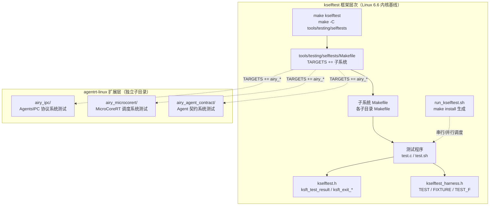
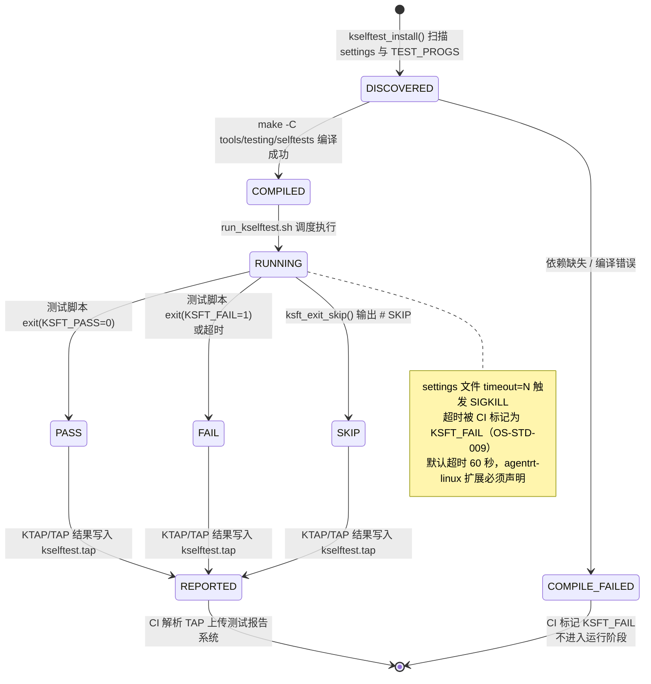
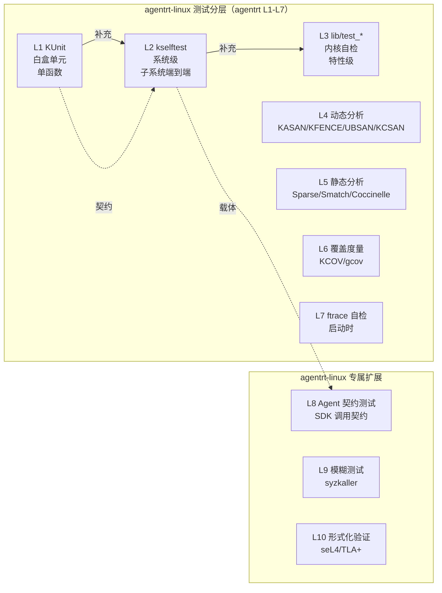
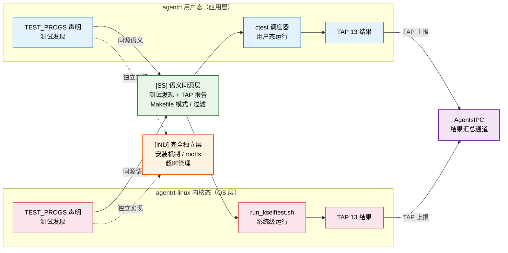

Copyright (c) 2025-2026 SPHARX Ltd. All Rights Reserved.

# agentrt-linux（AirymaxOS）kselftest 系统级测试
> **文档定位**：agentrt-linux（AirymaxOS）测试工程体系第 2 卷——kselftest 用户态系统级测试。本卷规定 kselftest 框架结构、`tools/testing/selftests/` 目录组织、`make kselftest` 入口、各子系统测试集（sched/mm/fs/net/...）、kselftest 与 KUnit 区别、运行环境要求，以及 agentrt-linux Agent 契约测试的系统级扩展。\
> **文档版本**：0.1.1\
> **最后更新**：2026-07-06\
> **上级文档**：[agentrt-linux 设计文档](README.md)\
> **同源映射**：agentrt 7 层验证 L2（系统级测试）+ Linux 6.6 内核基线 `tools/testing/selftests/`\
> **理论根基**：Linux 6.6 内核基线测试思想 + Airymax 五维正交 24 原则（E-8 可测试性 / S-1 反馈闭环 / IRON-9 v2 同源且部分代码共享）\
> **核心约束**：IRON-9 v2 同源且部分代码共享——kselftest 框架与 Linux 6.6 上游保持源码同源，agentrt-linux 扩展必须以独立子目录形式注入，禁止改写上游 kselftest 框架代码。

---

## 0. 章节定位

本卷是 agentrt-linux 测试工程 10 主题文档中的第 2 卷，回答"内核系统级测试怎么跑"。它在 01-kunit-framework（白盒单元测试）与 03-kernel-selftests（内核自检）之间形成系统级测试执行层：

- **上游依赖**：README 定义"测试体系分层"——L2 系统级测试由本卷展开；50-engineering-standards/06-toolchain-and-automation 定义"7 层验证"——本卷对应第 8 层。
- **下游依赖**：03-kernel-selftests 定义"启动时内核自检怎么启用"；08-agent-contract-testing 定义"Agent 行为契约"——本卷提供 Agent 契约的系统级载体。

本卷所有强制规则均赋予 **OS-TEST** / **OS-KER** / **OS-STD** 编号，与 07 维护者制度的"规则编号注册表"对齐。

### 0.1 关键术语

| 术语 | 定义 |
|------|------|
| kselftest | Linux 内核用户态系统级测试框架，从用户态测试内核特性 |
| `tools/testing/selftests/` | kselftest 源码主目录，含 100+ 子系统测试集 |
| `make kselftest` | kselftest 主入口，编译并运行所有 TARGETS |
| `kselftest.h` | 低层 API（`ksft_test_result` / `ksft_exit_*`） |
| `kselftest_harness.h` | 高层 API（`TEST`/`FIXTURE`/`TEST_F`，类 googletest 风格） |
| `run_kselftest.sh` | kselftest 主运行脚本，由 `make install` 生成 |
| KSFT_PASS/FAIL/SKIP/XFAIL | kselftest 退出码（0/1/4/2） |

---

## 1. kselftest 框架总览

### 1.1 起源与定位

kselftest 是 Linux 6.6 内核基线中的官方用户态系统级测试框架，由 Shuah Khan（Samsung）于 2014 年首次合入主线。其设计目标有三：系统级覆盖（系统调用、`/proc`、`/sys`、ioctl 等用户态接口测试内核特性，覆盖 KUnit 难以触及的端到端路径）、真实环境（QEMU 或真实硬件反映用户实际工作负载）、零依赖（仅依赖 glibc 或 NOLIBC，无需额外测试运行时）。

agentrt-linux 完整继承 Linux 6.6 内核基线的 kselftest 框架（`tools/testing/selftests/`），不修改任何上游源文件。agentrt-linux 专属测试以独立 `airy_*` 子目录形式驻留于 `tools/testing/selftests/`，遵循 IRON-9 v2 同源且部分代码共享原则。

### 1.2 kselftest 架构层次



### 1.3 kselftest 运行载体

| 载体 | 命令 | 适用场景 |
|------|------|---------|
| 本机原生 | `make kselftest` | 开发者本机（x86_64/aarch64） |
| QEMU | `make -C tools/testing/selftests install && qemu-system ...` | 跨架构测试 |
| 真实硬件 | `tar -xf kselftest.tar.gz && ./run_kselftest.sh` | 部署后回测 |
| CI 容器 | `make -C tools/testing/selftests TARGETS=sched` | 选择性运行 |

**OS-TEST-013**：所有 agentrt-linux 内核特性必须有对应的 kselftest 子系统测试；特性无 kselftest 覆盖时，PR 评审必须显式标注"kselftest 豁免理由"。

**OS-TEST-014**：kselftest 默认在 QEMU 上运行（CI 容器无法访问真实硬件）；测试若依赖真实硬件特性，必须用 `ksft_test_result_skip()` 在虚拟环境显式跳过并标注原因。

---

## 2. `tools/testing/selftests/` 组织

### 2.1 顶层 Makefile 与子目录

`tools/testing/selftests/Makefile` 通过 `TARGETS +=` 列出所有测试集（alsa/bpf/breakpoints/cgroup/cpu-hotplug/damon/ftrace/futex/ipc/kvm/landlock/livepatch/membarrier/memfd/mqueue/net/nsfs/perf_events/pidfd/prctl/resctrl/rseq/sched_ext/seccomp/sigaltstack/sync/tc-testing/timers/tpm2/tty/user_events/vDSO 等）。

每个子目录典型结构：`Makefile`（编译规则）+ `config`（所需 CONFIG_* 选项）+ `*.c`/`*.sh`（测试程序）+ `README`/`settings`（文档与运行配置）。`config` 文件列出测试所需的内核配置（如 `tools/testing/selftests/sched_ext/config` 包含 `CONFIG_SCHED_CLASS_EXT=y`/`CONFIG_BPF_SYSCALL=y`/`CONFIG_BPF_JIT=y`/`CONFIG_DEBUG_INFO_BPF=y`）。

**OS-STD-006**：所有 agentrt-linux 扩展子目录必须有 `config` 文件列出依赖 CONFIG_*；缺失 `config` 导致测试在 CI 上无法启用的，禁止合入。

**OS-STD-007**：子目录命名必须与被测子系统对齐（如 `airy_ipc` 测 `kernel/airymaxos/airy_ipc/`）；禁止用模糊命名如 `airy_misc`。

---

## 3. `make kselftest` 入口

### 3.1 主入口命令

```bash
make -C tools/testing/selftests                                          # 编译并运行所有 TARGETS
make -C tools/testing/selftests all                                      # 仅编译
make -C tools/testing/selftests run_tests                                # 仅运行（已编译）
make -C tools/testing/selftests TARGETS="sched_ext net"                  # 仅运行特定 TARGETS
make -C tools/testing/selftests INSTALL_PATH=/tmp/kselftest install     # 安装到目录
make -C tools/testing/selftests gen_kselftest_tar.sh                     # 生成 tar 包
```

### 3.2 `run_kselftest.sh` 与退出码

`make install` 后生成 `run_kselftest.sh`，其调用 `kselftest-list.sh` 列出所有可执行测试并串行/并行调度。退出码：`KSFT_PASS=0`/`KSFT_FAIL=1`/`KSFT_XFAIL=2`/`KSFT_XPASS=3`/`KSFT_SKIP=4`。

**OS-TEST-015**：测试退出码必须严格使用 `ksft_exit_pass()`/`ksft_exit_fail()`/`ksft_exit_skip()`；禁止用裸 `exit(0)`/`exit(1)`，破坏 CI 解析。

**OS-STD-048**：agentrt-linux 子目录禁止修改上游 `Makefile`（顶层）；新增子目录通过 `TARGETS += airy_xxx` 单行追加，并经 CI 静态检查（第 7 层）验证追加合规。

### 3.3 kselftest 测试执行生命周期状态机

kselftest 测试集从 `kselftest_install()` 发现到 `run_kselftest.sh` 上报的完整状态转换，覆盖 COMPILE_FAILED/PASS/FAIL/SKIP 四类终止态：



**状态转换条件**：

| 从状态 | 到状态 | 触发条件 | 系统行为 |
|--------|--------|---------|---------|
| — | DISCOVERED | `kselftest_install()` 扫描子目录 `settings` 与 `TEST_PROGS` | 列入 `kselftest-list.sh` 调度清单 |
| DISCOVERED | COMPILED | `make -C tools/testing/selftests` 编译 `TEST_GEN_PROGS` | 生成可执行二进制注入 `INSTALL_PATH` |
| DISCOVERED | COMPILE_FAILED | 依赖缺失（`config` 文件 CONFIG_* 未满足）或编译错误 | CI 标记 KSFT_FAIL，不进入运行阶段 |
| COMPILED | RUNNING | `run_kselftest.sh` 调度执行测试程序 | 串行/并行启动 `TEST_PROGS` 与 `TEST_GEN_PROGS` |
| RUNNING | PASS | 测试脚本 `exit(KSFT_PASS=0)` | TAP 输出 `ok N - <suite>:<case>` |
| RUNNING | FAIL | 测试脚本 `exit(KSFT_FAIL=1)` 或 `settings` 超时 | TAP 输出 `not ok N - <suite>:<case>` |
| RUNNING | SKIP | `ksft_exit_skip()` 输出 `# SKIP <reason>` | TAP 输出 `ok N - <name> # SKIP <reason>` |
| PASS | REPORTED | `run_kselftest.sh --summary` 聚合 TAP | 写入 `kselftest.tap`，CI 解析上传 |
| FAIL | REPORTED | `run_kselftest.sh --summary` 聚合 TAP | 写入 `kselftest.tap`，CI 标记 PR 阻断 |
| SKIP | REPORTED | `run_kselftest.sh --summary` 聚合 TAP | 写入 `kselftest.tap`，SKIP 单独计数（OS-TEST-021） |
| COMPILE_FAILED | — | CI 跳过运行阶段 | 标记 KSFT_FAIL，记录编译错误日志 |
| REPORTED | — | CI 解析 TAP 完成上传 | 测试报告系统持久化结果 |

---

## 4. 子系统测试集

Linux 6.6 内核基线在 `tools/testing/selftests/` 下提供 100+ 子系统测试集，覆盖 sched_ext、mm、filesystems、net、bpf、cgroup、livepatch、resctrl、rseq、seccomp、tpm2 等。本节仅以 sched_ext（与 MicroCoreRT 共享调度器扩展机制）为例说明 agentrt-linux 系统级测试范式。

### 4.1 sched_ext 与 MicroCoreRT 调度系统测试

`tools/testing/selftests/sched_ext/` 测试 sched_class_ext（agentrt-linux 与 MicroCoreRT 共享的调度器扩展机制），包含 `create_dsq`、`ddsp_bogus_dsq_fail`、`enq_last_no_enq_fails`、`exit`、`hotplug` 等 BPF + 用户态主程序对。MicroCoreRT 调度算法的系统级验证通过 `airy_microcorert/` 测试集承载：

```c
/* tools/testing/selftests/airy_microcorert/microcorert_sched.c */
#include "../kselftest_harness.h"
#include <sched.h>

FIXTURE(microcorert_sched) {
    int pid;
    struct sched_param param;
};

FIXTURE_SETUP(microcorert_sched) {
    self->pid = getpid();
    self->param.sched_priority = 50;
}

FIXTURE_TEARDOWN(microcorert_sched) {
    sched_setscheduler(self->pid, SCHED_NORMAL, &self->param);
}

TEST_F(microcorert_sched, fifo_priority_slice) {
    int ret = sched_setscheduler(self->pid, MICROCORERT_SCHED_FIFO, &self->param);
    ASSERT_EQ(0, ret) TH_LOG("sched_setscheduler failed: %s", strerror(errno));
    struct timespec ts;
    ret = measure_sched_slice(self->pid, &ts);
    ASSERT_EQ(0, ret);
    EXPECT_GE(ts.tv_nsec, 950000) TH_LOG("slice too short: %ld ns", ts.tv_nsec);
    EXPECT_LE(ts.tv_nsec, 1050000);
}

TEST_HARNESS_MAIN
```

**OS-TEST-016**：MicroCoreRT 调度算法的每个策略（FIFO/RR/DEADLINE）必须有 sched_ext 风格系统测试；时间片测量允许 ±5% 容差（QEMU 时钟精度限制）。

### 4.2 完整 TARGETS 列表

agentrt-linux 维护 `tools/testing/selftests/airy_enabled_targets.list`，列出 CI 默认启用的 TARGETS；该列表与 README 第 1.1 节的 L2 系统级测试集对齐。

**OS-STD-008**：CI 默认启用 TARGETS 列表与 README 第 1.1 节的 L2 系统级测试集必须对齐；列表变更需同步更新两者。

---

## 5. kselftest 与 KUnit 的区别

| 维度 | KUnit | kselftest |
|------|-------|-----------|
| 测试视角 | 白盒（直接调内核函数） | 黑盒（经系统调用/ioctl） |
| 运行环境 | UML（首选）/ QEMU / 真实硬件 | QEMU / 真实硬件 |
| 时间尺度 | 毫秒级 | 秒级 |
| 覆盖范围 | 单函数 | 子系统端到端 |
| 依赖 | 内核内（`<kunit/test.h>`） | 用户态（`<kselftest.h>`） |
| 输出格式 | TAP | TAP（兼容） |
| 失败影响 | 用例终止（try-catch） | 进程退出 |
| 硬件依赖 | 弱（UML 无硬件） | 强（必须真实内核） |
| 启用方式 | `CONFIG_KUNIT_*_TEST=y` | `make kselftest` |



**OS-TEST-017**：KUnit 测试与 kselftest 测试不可相互替代；每个 agentrt-linux 子系统必须同时有 KUnit 白盒测试（覆盖函数）与 kselftest 系统级测试（覆盖系统调用接口）。

**OS-KER-085**：禁止将 KUnit 与 kselftest 混编于同一文件；KUnit 是 `.c` 内核内文件（`*_test.c`），kselftest 是用户态文件（`tools/testing/selftests/`），二者编译目标不同。

---

## 6. kselftest 运行环境要求

### 6.1 编译与运行时依赖

```bash
sudo apt install build-essential python3 iproute2 tcpdump jq bpftool ethtool
cd /path/to/kernel && make defconfig && make
make -C tools/testing/selftests
# 部分测试需要 root（CPU 热插拔、cgroup、namespace）：
sudo make -C tools/testing/selftests run_tests          # 在 root 下运行全部
sudo -u nobody ./run_kselftest.sh --filter=non_root     # 非特权测试
```

### 6.2 QEMU 镜像构建

agentrt-linux CI 推荐 virtme 跑 kselftest：

```bash
virtme-run --kdir=$PWD --script='cd /tmp && \
  tar -xf /host/kselftest.tar.gz && \
  ./run_kselftest.sh --summary' 2>&1 | tee kselftest.tap
```

### 6.3 settings 文件

每个子目录可放 `settings` 文件声明运行配置：

```
# tools/testing/selftests/airy_ipc/settings
timeout=30
```

可识别字段：`timeout`（单测试超时秒数，CI 默认 60）、`fragment`（测试子集分组）。

**OS-TEST-018**：agentrt-linux CI 必须提供 root 与非 root 两套 kselftest 运行矩阵；非 root 测试集标记在 `airy_enabled_targets.list` 第 2 列。

**OS-STD-009**：所有 agentrt-linux 扩展测试在 `settings` 文件中必须声明 `timeout` 字段；CI 默认超时 60 秒，超时测试由 CI 标记为 `KSFT_FAIL`。

---

## 7. kselftest API

### 7.1 低层 API（`kselftest.h`）

```c
#include "../kselftest.h"
int main(void)
{
    ksft_print_header();
    ksft_set_plan(3);
    ksft_test_result(access("/proc/airy_ipc/version", F_OK) == 0,
                     "airy_ipc_version_exists\n");
    ksft_test_result_skip("airy_ipc_dram_test\n");
    ksft_test_result_fail("airy_ipc_overflow_test\n");
    ksft_finished();
}
```

主要 API：`ksft_print_header()`/`ksft_set_plan(n)`/`ksft_print_msg(fmt, ...)`/`ksft_test_result(cond, fmt, ...)`/`ksft_test_result_pass|fail|skip|xfail|error(fmt, ...)`/`ksft_finished()`/`ksft_exit_pass|fail|skip()`。

### 7.2 高层 API（`kselftest_harness.h`）

```c
#include "../kselftest_harness.h"
TEST(airy_ipc_version) {
    EXPECT_EQ(0, access("/proc/airy_ipc/version", F_OK));
}
TEST(airy_ipc_header_size) {
    EXPECT_EQ(128, sizeof(struct airy_ipc_msg_hdr));
}
FIXTURE(airy_ipc_channel) { int fd; };
FIXTURE_SETUP(airy_ipc_channel) {
    self->fd = open("/dev/airy_ipc0", O_RDWR);
    ASSERT_GE(self->fd, 0);
}
FIXTURE_TEARDOWN(airy_ipc_channel) {
    if (self->fd >= 0) close(self->fd);
}
TEST_F(airy_ipc_channel, roundtrip_request) {
    struct airy_ipc_msg_hdr req = { .type = AIRY_IPC_TYPE_REQUEST };
    struct airy_ipc_msg_hdr rsp;
    ASSERT_EQ(sizeof(req), write(self->fd, &req, sizeof(req)));
    ASSERT_EQ(sizeof(rsp), read(self->fd, &rsp, sizeof(rsp)));
    EXPECT_EQ(AIRY_IPC_TYPE_RESPONSE, rsp.type);
}
TEST_HARNESS_MAIN
```

宏清单：`TEST(name)`/`FIXTURE(name)`/`FIXTURE_SETUP(name)`/`FIXTURE_TEARDOWN(name)`/`TEST_F(fixture, name)`/`EXPECT_EQ/NE/GT/LT/...`（非致命）/`ASSERT_EQ/NE/GT/LT/...`（致命）/`TH_LOG(fmt, ...)`/`TEST_HARNESS_MAIN`。

**OS-TEST-019**：agentrt-linux 扩展测试优先使用 `kselftest_harness.h`（高层 API）；仅在需要精细控制 TAP 输出格式时使用 `kselftest.h`（低层 API）。

**OS-STD-TEST-010**：每个 `TEST_F` 必须有对应 `FIXTURE_SETUP` 与 `FIXTURE_TEARDOWN`；资源在 setup 中获取，在 teardown 中释放，禁止在 `TEST_F` 体中分配而不释放。

---

## 8. agentrt-linux Agent 契约测试的系统级扩展

本卷与 KUnit 卷（01）形成对照：KUnit 测 Agent SDK 的白盒契约，kselftest 测 Agent 经系统调用、`/proc`、`/dev` 的端到端契约。

```c
/* tools/testing/selftests/airy_agent_contract/agent_sdk_contract.c */
#include "../kselftest_harness.h"
#include <fcntl.h>
#include <sys/ioctl.h>
#include <sys/mman.h>
#include "../../../include/uapi/airymax/agent_ioctl.h"

FIXTURE(agent_sdk) {
    int agent_fd;
    void *shared_ring;
};

FIXTURE_SETUP(agent_sdk) {
    self->agent_fd = open("/dev/airy_agent0", O_RDWR);
    ASSERT_GE(self->agent_fd, 0) TH_LOG("open failed: %s", strerror(errno));
    self->shared_ring = mmap(NULL, AGENT_RING_SIZE, PROT_READ | PROT_WRITE,
                             MAP_SHARED, self->agent_fd, 0);
    ASSERT_NE(MAP_FAILED, self->shared_ring);
}

FIXTURE_TEARDOWN(agent_sdk) {
    if (self->shared_ring != MAP_FAILED) munmap(self->shared_ring, AGENT_RING_SIZE);
    if (self->agent_fd >= 0) close(self->agent_fd);
}

TEST_F(agent_sdk, cognition_roundtrip_via_ioctl) {
    struct airy_cognition_request req = {
        .input_offset = offsetof(struct agent_ring, in_buf),
        .input_len = strlen("hello"),
    };
    struct airy_cognition_response rsp;
    strcpy((char *)self->shared_ring + req.input_offset, "hello");
    ASSERT_EQ(0, ioctl(self->agent_fd, AIRY_IOCTL_COGNITION, &req))
        TH_LOG("ioctl failed: %s", strerror(errno));
    rsp = *(struct airy_cognition_response *)
          (self->shared_ring + req.output_offset);
    EXPECT_EQ(AIRY_EOK, rsp.status);
    EXPECT_GT(rsp.tokens_used, 0);
}

TEST_F(agent_sdk, ipc_128b_header_protocol) {
    struct airy_ipc_msg_hdr hdr = { .type = AIRY_IPC_TYPE_REQUEST, .payload_len = 64 };
    ASSERT_EQ(0, ioctl(self->agent_fd, AIRY_IOCTL_IPC_SEND, &hdr));
    EXPECT_EQ(128, (int)sizeof(hdr));
}
TEST_HARNESS_MAIN
```

配套文件：`settings` 声明 `timeout=45`；`Makefile` 用 `CFLAGS += -I../../../../include/uapi/airymax` + `TEST_GEN_PROGS := agent_sdk_contract` + `include ../lib.mk`；`config` 列出 `CONFIG_AIRY_AGENT=y`/`CONFIG_AIRY_IPC=y`/`CONFIG_AIRY_COGNITION=y`。

**OS-TEST-020**：agentrt-linux Agent SDK 的每个公共 ioctl 必须有 kselftest 系统级测试；契约覆盖正常路径 + `EINVAL`/`ENOMEM`/`EBUSY` 各一例异常路径。

**OS-KER-071**：agentrt-linux Agent 契约的系统级测试与 KUnit 契约测试必须共享同一份契约规范文档（`docs/agents/contract.md`），二者实现由 CI 第 7 层检查契约一致性。

---

## 9. 五维原则映射

本节落实 Airymax 五维正交 24 原则在 kselftest 卷的具体映射——每个原则至少对应 1 条强制规则，规则之间两两正交无重叠，从而保证评审清单可独立执行：

| 原则 | 在 kselftest 卷的体现 |
|------|---------------------|
| **E-8 可测试性** | kselftest 框架本身体现"系统级可测"；每特性必有套件（OS-TEST-013） |
| **S-1 反馈闭环** | QEMU CI 自动运行 + TAP 解析 + PR 阻断（OS-STD-008） |
| **A-4 完美主义** | root/非 root 双矩阵 + 退出码严格（OS-TEST-015/018） |
| **K-3 协议优先** | AgentsIPC 128B 协议系统级契约（OS-KER-071） |
| **K-6 调度优先** | MicroCoreRT 调度策略系统级时间片测量（OS-TEST-016） |
| **IRON-9 v2 同源且部分代码共享** | agentrt-linux 扩展子目录独立注入，不改上游（OS-STD-048/OS-KER-085） |

> Airymax 五维正交 24 原则要求各维度强制规则两两正交无重叠，kselftest 卷规则（OS-TEST-013 至 OS-TEST-022）按原则维度分组，避免一条规则同时承担多个原则检查。

### 9.1 IRON-9 v2 同源且部分代码共享在本卷的具体落地

- **同源**：agentrt-linux 不修改上游 `tools/testing/selftests/Makefile` 顶层结构；上游测试集与 Linux 6.6 内核基线一一对应。
- **独立**：agentrt-linux 扩展子目录以 `airy_*` 前缀命名，独立 `config`/`settings`/`Makefile`，独立 Kconfig 依赖。
- **互操作**：agentrt-linux 套件与上游套件共享同一 `run_kselftest.sh` 调度器，CI 通过 `--filter` 选择性运行。

**OS-KER-098**：agentrt-linux 子目录禁止引入对上游测试集源码的依赖（`#include "../sched_ext/..."` 等）；扩展测试自包含，避免上游重构时被破坏。

### 9.2 IRON-9 v2 三层共享模型

本节将 §9.1 的"同源 / 独立 / 互操作"三要素进一步细化为 **IRON-9 v2 三层共享模型**，明确测试集层在用户态（agentrt）与内核态（agentrt-linux）之间的代码共享边界。三层分别为：**[SC] 共享契约层**（共享头文件 / 数据结构定义）、**[SS] 语义同源层**（设计模式同源但实现独立）、**[IND] 完全独立层**（双方各自独立实现）。该模型由 6 个 [SC] 头文件契约、跨态语义对照表与独立实现清单共同支撑。

#### 9.2.1 三层模型概览表

| 层次 | 共享程度 | 测试集层内容 |
|------|---------|------------|
| **[SC] 共享契约层** | 无 | 无 [SC] 层——测试集为各端独立实现，不与 agentrt 用户态共享代码 |
| **[SS] 语义同源层** | 设计模式同源 | 测试用例 Makefile 模式（`TEST_PROGS`/`TEST_GEN_PROGS`）、`run_kselftest.sh` 测试运行器、TAP 13 输出格式——与 agentrt 集成测试在"测试发现 + TAP 报告"语义上同源 |
| **[IND] 完全独立层** | 完全独立 | kselftest 内核安装机制（`make kselftest`）、rootfs 集成、可选测试集、超时管理 |

#### 9.2.2 [SC] 共享契约层

**无直接 [SC] 共享头文件**。

测试集层不属于 IRON-9 v2 的 6 个 [SC] 共享头文件清单（`syscalls.h` / `memory_types.h` / `security_types.h` / `cognition_types.h` / `sched.h` / `ipc.h`）。测试集是验证基础设施，两端运行目标截然不同（agentrt 用户态集成测试 vs agentrt-linux 内核态系统级测试），其 Makefile 模式与运行器各自定义，源码层无共享头文件依赖。这一约束确保 agentrt 用户态集成测试演进时不会被动牵连 agentrt-linux kselftest，反之亦然——测试集层的演进由各自的 **OS-TEST 评审** 独立裁决。两端仅通过 **TAP 13 格式** 与 **AgentsIPC** 实现跨态协作而非代码共享。

#### 9.2.3 [SS] 语义同源层

| 语义维度 | agentrt 用户态（集成测试） | agentrt-linux 内核态（kselftest） | 同源语义 |
|---------|---------------------------|-----------------------------------|----------|
| 测试发现 | `TEST_PROGS` / `TEST_GEN_PROGS` 变量 | `TEST_PROGS` / `TEST_GEN_PROGS` 变量 | 声明式测试用例发现 |
| Makefile 模式 | `add_test()` / CTest 注册 | `Makefile` + `TEST_PROGS` 声明 | 声明式测试构建 |
| 测试运行器 | `ctest` 调度器 | `run_kselftest.sh` 调度器 | 测试调度运行 |
| 报告格式 | TAP 13 输出 | TAP 13 输出 | 测试结果报告格式 |
| 测试过滤 | `ctest -R <regex>` | `--filter` / `-t <test>` | 测试选择过滤 |
| 超时管理 | `TIMEOUT` 属性 | `settings` 文件 timeout | 测试超时控制 |

**语义说明**：agentrt 用户态集成测试与 agentrt-linux 内核态的 kselftest 在"测试发现 + TAP 报告"这一核心语义上同源——二者均通过**声明式变量**（`TEST_PROGS` / `TEST_GEN_PROGS`）发现测试用例，通过**统一调度器**（`ctest` / `run_kselftest.sh`）运行测试，输出 **TAP 13 格式** 报告结果。这种同源使测试集的组织心智模型在两端可复用：理解了 kselftest 的 `TEST_PROGS` 声明式发现，即理解了 agentrt 集成测试的测试注册语义。两端还共享 **TAP 13 输出格式**，使 CI 可用统一的解析器处理两端的测试结果。但**机制完全独立**——kselftest 运行于内核态系统级环境，agentrt 集成测试运行于用户态进程，二者无代码共享。

#### 9.2.4 [IND] 完全独立层

| 独立实现项 | agentrt-linux 内核态（kselftest） | agentrt 用户态 | 独立原因 |
|-----------|----------------------------------|---------------|---------|
| 内核安装机制 | `make kselftest` 安装到 rootfs | 无对应 | 内核态安装特有 |
| rootfs 集成 | 测试二进制注入 rootfs | 无对应 | 内核态 rootfs 特有 |
| 可选测试集 | `TEST_GEN_PROGS` + `TEST_PROGS` 区分 | CTest 内置 | kselftest 生成机制特有 |
| 超时管理 | `settings` 文件 timeout | CMake `TIMEOUT` 属性 | 超时配置机制不同 |
| 系统级环境 | 内核启动 + rootfs 挂载 | 用户态进程直接运行 | 运行环境不同 |
| 上游共享调度器 | `run_kselftest.sh` 与上游共享 | 独立 ctest | kselftest 调度器特有 |

#### 9.2.5 跨态协作流



**协作说明**：agentrt 用户态集成测试通过 `TEST_PROGS` 声明发现并用 `ctest` 调度运行于用户态进程，agentrt-linux 内核态 kselftest 通过 `TEST_PROGS` 声明发现并用 `run_kselftest.sh` 调度运行于系统级环境。两端在 **[SS] 语义同源层** 共享"测试发现 + TAP 报告"的设计模式（Makefile 模式 / 调度器 / TAP 13 格式 / 过滤），使测试集的组织心智模型在两端可复用；但在 **[IND] 完全独立层** 各自维护内核安装机制、rootfs 集成、超时管理。两端测试结果均输出 **TAP 13 格式**，通过 **AgentsIPC** 通道汇总至 CI 统一解析。这与 §9.1 的"同源 / 独立 / 互操作"三要素一致：同源（测试发现 + TAP）、独立（安装机制 / rootfs）、互操作（`run_kselftest.sh` 调度器与上游共享）。这正是 **IRON-9 v2 同源且部分代码共享** 在测试集层的落地——同源模式，独立实现，无共享契约，靠 IPC 协作。

---

## 10. 同源 agentrt 映射

agentrt 7 层验证与本卷的对应关系：

| agentrt 层 | 验证目标 | 本卷对应 |
|-----------|---------|---------|
| L1 白盒单元 | 单函数行为 | 01-kunit-framework（非本卷） |
| L2 系统级 | 子系统端到端 | kselftest 各子系统测试集（本卷第 4 节） |
| L3 子系统 | 跨模块接口 | kselftest 多 TEST_F 联合（本卷第 7 节） |
| L4 系统级 | 内核整体 | kselftest 全 TARGETS（本卷第 3 节） |
| L5 协议 | 协议契约 | AgentsIPC 系统级契约（本卷第 8 节） |
| L6 形式化 | 关键路径证明 | 10-formal-verification（非本卷） |
| L7 模糊 | 输入边界 | 09-fuzz-testing（非本卷） |

**OS-KER-099**：agentrt L2（系统级）的所有用例必须用 kselftest 实现；与上游 kselftest 共享同一 `tools/testing/selftests/` 目录与 `run_kselftest.sh` 调度器，禁止 agentrt-linux 自建独立调度器。

**OS-KER-100**：agentrt 与 agentrt-linux 之间的 kselftest 子目录命名空间必须正交（`airy_*` vs `airy_*` 前缀）；命名冲突由 CI 第 7 层（静态检查）在 PR 阶段检测。

---

## 11. CI 集成

### 11.1 CI 矩阵

CI 矩阵覆盖 `arch: [x86_64, arm64, riscv64] × role: [root, non_root]`，简化的命令序列：

```bash
make defconfig && make -j$(nproc)
make -C tools/testing/selftests \
     TARGETS="sched_ext net airy_ipc airy_microcorert airy_agent_contract"
virtme-run --kdir=$PWD \
  --script='./run_kselftest.sh --summary --role=${ROLE}' \
  2>&1 | tee kselftest-${ARCH}-${ROLE}.tap
airymax-tap-action parse kselftest-${ARCH}-${ROLE}.tap
```

### 11.2 结果解析

kselftest 输出 TAP（version 13），形如 `ok <num> <suite>:<case>` / `not ok <num> <suite>:<case> # <reason>`；CI 解析后上传至测试报告系统。

**OS-TEST-021**：CI 必须解析 kselftest TAP 输出并上传至测试报告系统；新增/删除测试集必须使总用例数单调变化，PR 评审需显式确认。

**OS-STD-TEST-011**：CI 总时长不得超过 60 分钟（与 06-toolchain-and-automation 的 OS-STD-033 对齐）；超时的子集必须拆分或缓存优化。

### 11.3 失败重试

```bash
./run_kselftest.sh --summary --retry=2
```

失败测试默认重试 2 次；连续 3 次失败才标记为真实失败（避免 flaky 测试误报）。

**OS-TEST-022**：flaky 测试（同一 PR 重复运行结果不一致）必须在 `airy_flaky_baseline.md` 登记并限期修复；未修复的 flaky 测试由 CI 标记为 `KSFT_XFAIL`。

---

## 12. 相关文档

- `80-testing/README.md`（测试体系主索引，定义 L1-L10 分层）
- `80-testing/01-kunit-framework.md`（KUnit 白盒单元测试，与本卷互补）
- `80-testing/03-kernel-selftests.md`（`lib/test_*` 内核自检，待创建）
- `80-testing/08-agent-contract-testing.md`（agentrt-linux 专属：Agent 行为契约测试，待创建）
- `50-engineering-standards/06-toolchain-and-automation.md`（7 层验证体系，本卷属第 8 层）
- `50-engineering-standards/01-coding-standards.md`（错误处理强制，与 kselftest 退出码对齐）
- `20-modules/08-tests-linux.md`（tests-linux 子仓设计）
- `110-security/README.md`（安全测试，复用 kselftest 框架）

### 12.1 上游参考

- Linux 6.6 `tools/testing/selftests/Makefile`（TARGETS 列表）
- Linux 6.6 `tools/testing/selftests/kselftest.h`（低层 API）
- Linux 6.6 `tools/testing/selftests/kselftest_harness.h`（高层 API）
- Linux 6.6 `Documentation/dev-tools/kselftest.rst`（kselftest 文档）
- Linux 6.6 `tools/testing/selftests/sched_ext/`（sched_ext 测试参考）

---

## 13. 文档版本与维护

| 版本 | 日期 | 维护者 | 变更 |
|------|------|--------|------|
| 0.1.1 | 2026-07-06 | agentrt-linux 工程组 | 初始占位版（仅 README + 01 + 02） |
| 1.0.1 | 2026-07-06 | agentrt-linux 工程组 | 开发版：补全 agentrt-linux 扩展章节、CI 集成、五维原则映射 |

### 13.1 维护规则

- 本卷与 Linux 6.6 内核基线 kselftest 框架保持源码同源（IRON-9 v2 同源且部分代码共享）。
- 上游 kselftest API 变更时，本卷必须在 1 个上游 LTS 周期内同步更新。
- agentrt-linux 扩展子目录的新增/删除必须同步更新本卷第 8 节与 `80-testing/README.md` 的 L2 章节。
- 本卷所有规则编号（OS-KER-XXX/OS-STD-XXX/OS-TEST-XXX）注册于 07 维护者制度的"规则编号注册表"。

### 13.2 待办（1.0.1 版本）

- [ ] 补充 NOLIBC 模式下 agentrt-linux 测试的编译模板
- [ ] 补充 kselftest 与 KCOV 覆盖度联用（与 06-coverage-metrics 联动）
- [ ] 补充 kselftest 与动态分析（KASAN/UBSAN）联用的运行模板
- [ ] 补充 MicroCoreRT 调度策略在 RT 抢占模式下的系统级时间片测量

---

## 附录 A: 接口定义

> **附录定位**： 本附录汇集 kselftest 系统级测试框架所需的完整接口契约，供直接参照实现。所有数据结构与函数签名对齐 Linux 6.6 `tools/testing/selftests/kselftest.h`、`tools/testing/selftests/kselftest_harness.h`、`tools/testing/selftests/lib.mk`、`run_kselftest.sh` 及 `include/airymax/selftest_types.h`（[SC] 共享契约层）。kselftest 框架与 Linux 6.6 上游保持源码同源（IRON-9 v2），agentrt-linux 扩展以独立 `airy_*` 子目录形式注入，禁止改写上游框架代码。

### A.1 核心数据结构

#### A.1.1 kselftest_module — kselftest 模块描述

```c
/**
 * struct kselftest_module - kselftest 单个测试集模块描述
 *
 * @name:        模块名（对应 tools/testing/selftests/<name>/ 目录）
 * @test_progs:  已就绪测试程序列表（TEST_PROGS，shell 脚本类）
 * @gen_progs:   需编译生成的测试程序列表（TEST_GEN_PROGS，C 程序类）
 * @gen_files:   需编译生成的辅助文件列表（TEST_GEN_FILES，非测试目标）
 * @extra_objs:  额外依赖对象（TEST_GEN_PROGS_EXTENDED）
 * @settings:     运行配置（timeout / fragment，对应 settings 文件）
 * @needs_root:   是否需要 root 权限运行（CI 非 root 矩阵标记跳过）
 *
 * 对齐 Linux 6.6 tools/testing/selftests/lib.mk 的 Makefile 变量模型
 * （agentrt-linux 专属建模，描述测试集在 C 侧的等价表示）
 */
struct kselftest_module {
    const char        *name;
    const char       **test_progs;
    int                test_progs_cnt;
    const char       **gen_progs;
    int                gen_progs_cnt;
    const char       **gen_files;
    int                gen_files_cnt;
    const char       **extra_objs;
    const char        *settings;
    bool               needs_root;
};
```

#### A.1.2 test_result — 测试结果

```c
/**
 * struct test_result - 单条测试结果记录
 *
 * @name:     测试名（对应 TAP "ok N - <name>" 中的 name）
 * @status:   测试状态（见 enum test_status）
 * @reason:   失败/跳过原因（PASS 时为 NULL）
 * @duration: 执行耗时（毫秒，用于 CI 性能基线）
 *
 * 对齐 Linux 6.6 kselftest TAP 13 输出语义
 */
struct test_result {
    const char        *name;
    enum test_status   status;
    const char        *reason;
    unsigned long      duration;
};
```

#### A.1.3 test_status — 测试状态

```c
/**
 * enum test_status - kselftest 测试状态枚举
 *
 * @TEST_PASS:  通过
 * @TEST_FAIL:  失败
 * @TEST_SKIP:  跳过（环境不满足或显式 ksft_test_result_skip）
 * @TEST_XFAIL: 预期失败（已知 bug，测试正确捕获失败）
 * @TEST_ERROR: 测试自身错误（非被测对象失败）
 *
 * 对齐 Linux 6.6 tools/testing/selftests/kselftest.h 的 KSFT_* 退出码
 */
enum test_status {
    TEST_PASS  = 0,  /* KSFT_PASS  = 0 */
    TEST_FAIL  = 1,  /* KSFT_FAIL  = 1 */
    TEST_XFAIL = 2,  /* KSFT_XFAIL = 2 */
    TEST_SKIP  = 4,  /* KSFT_SKIP  = 4 */
    TEST_ERROR = 5,  /* KSFT_ERROR（无标准码，用非零退出码） */
};
```

#### A.1.4 kselftest_harness — 测试 harness

```c
/**
 * struct kselftest_harness - kselftest 高层 API 测试 harness 状态
 *
 * @fixture_name:  当前 FIXTURE 名
 * @setup:          FIXTURE_SETUP 回调
 * @teardown:       FIXTURE_TEARDOWN 回调
 * @test_f:         当前 TEST_F 函数指针
 * @test_name:      当前 TEST_F 名
 * @expect_cnt:     本次 TEST_F 累计断言数
 * @fail_cnt:       本次 TEST_F 失败断言数
 * @log_buf:        TH_LOG 日志缓冲
 *
 * 对齐 Linux 6.6 tools/testing/selftests/kselftest_harness.h 的
 * __test_metadata / __fixture_metadata 内部结构（agentrt-linux 专属建模）
 */
struct kselftest_harness {
    const char            *fixture_name;
    void                (*setup)(struct __test_metadata *metadata);
    void                (*teardown)(struct __test_metadata *metadata);
    void                (*test_f)(struct __test_metadata *metadata);
    const char            *test_name;
    int                    expect_cnt;
    int                    fail_cnt;
    struct __test_results *log_buf;
};
```

### A.2 核心函数签名

#### A.2.1 kselftest_run — 运行测试集

```c
/**
 * kselftest_run - 运行一个 kselftest 测试集模块
 * @module:  测试集模块描述
 * @filter:  过滤表达式（对应 run_kselftest.sh --filter）
 * @is_root: 当前是否以 root 运行（needs_root && !is_root 时跳过）
 *
 * 依次执行 module->gen_progs 与 test_progs 中的测试程序，
 * 收集 TAP 输出解析为 test_result 列表。
 *
 * 返回: 0 全部通过；非零存在失败/错误（聚合 KSFT_FAIL）
 *
 * 对齐 Linux 6.6 tools/testing/selftests/run_kselftest.sh 调度逻辑
 * @since 1.0.1
 */
int kselftest_run(struct kselftest_module *module,
                  const char *filter, bool is_root);
```

#### A.2.2 TEST_PROGS / TEST_GEN_PROGS 注册模式

```makefile
# /**
#  * TEST_PROGS / TEST_GEN_PROGS / TEST_GEN_FILES - kselftest Makefile 测试注册变量
#  *
#  * 对齐 Linux 6.6 tools/testing/selftests/lib.mk
#  *
#  * TEST_PROGS:       已就绪的脚本类测试（.sh 等），不需编译直接运行
#  * TEST_GEN_PROGS:   需编译生成的 C 测试程序（.c → 可执行文件）
#  * TEST_GEN_FILES:   需编译生成的辅助文件（非测试目标，被测试程序依赖）
#  * TEST_GEN_PROGS_EXTENDED: 额外编译目标（helper 库等）
#  *
#  * 注册模式示例（agentrt-linux Agent 契约测试）：
#  */
# tools/testing/selftests/airy_agent_contract/Makefile
TEST_GEN_PROGS := agent_sdk_contract
TEST_PROGS     := agent_runtime_smoke.sh
TEST_GEN_FILES := agent_fixture.bin
CFLAGS += -I../../../../include/uapi/airymax

# 必须在变量声明后 include 公共构建规则
include ../lib.mk
# @since 0.1.1
```

#### A.2.3 run_kselftest.sh 入口

```bash
# /**
#  * run_kselftest.sh - kselftest 主运行脚本（由 `make install` 生成）
#  *
#  * 调用 kselftest-list.sh 列出所有可执行测试，
#  * 按依赖顺序串行/并行调度，聚合 TAP 输出。
#  *
#  * 退出码：0 全部通过；1 存在 KSFT_FAIL；4 全部 SKIP。
#  *
#  * 常用参数：
#  *   --filter=<glob>     仅运行匹配的测试集
#  *   --summary           输出 TAP 汇总（不逐条打印）
#  *   -o <dir>            输出目录（kselftest.tap 等）
#  *
#  * 对齐 Linux 6.6 tools/testing/selftests/run_kselftest.sh
#  */
# ./run_kselftest.sh --filter=airy_* --summary
```

#### A.2.4 ksft_test_result / ksft_test_result_pass / ksft_test_result_fail

```c
/**
 * ksft_test_result - 按条件输出测试结果（低层 API）
 * @cond:  断言条件（true → PASS，false → FAIL）
 * @fmt:   测试名格式（须以 \n 结尾）
 *
 * 输出一行 TAP：ok N - <name> 或 not ok N - <name>
 *
 * 对齐 Linux 6.6 tools/testing/selftests/kselftest.h
 */
void ksft_test_result(bool cond, const char *fmt, ...);

/**
 * ksft_test_result_pass - 输出 PASS 结果
 * @fmt: 测试名格式（须以 \n 结尾）
 *
 * 对齐 Linux 6.6 tools/testing/selftests/kselftest.h
 */
void ksft_test_result_pass(const char *fmt, ...);

/**
 * ksft_test_result_fail - 输出 FAIL 结果
 * @fmt: 测试名格式（须以 \n 结尾）
 *
 * 对齐 Linux 6.6 tools/testing/selftests/kselftest.h
 */
void ksft_test_result_fail(const char *fmt, ...);

/**
 * ksft_test_result_skip - 输出 SKIP 结果（标注跳过原因）
 * @fmt: 测试名格式（须以 \n 结尾）
 *
 * 对齐 Linux 6.6 tools/testing/selftests/kselftest.h
 */
void ksft_test_result_skip(const char *fmt, ...);

/**
 * ksft_print_header - 输出 TAP 头（TAP version 13）
 * 对齐 Linux 6.6 tools/testing/selftests/kselftest.h
 */
void ksft_print_header(void);

/**
 * ksft_set_plan - 声明测试计划数（TAP: 1..N）
 * @plan: 计划测试数
 * 对齐 Linux 6.6 tools/testing/selftests/kselftest.h
 */
void ksft_set_plan(int plan);

/**
 * ksft_finished - 声明测试完成并输出汇总
 * 对齐 Linux 6.6 tools/testing/selftests/kselftest.h
 */
void ksft_finished(void);
```

#### A.2.5 ksft_exit_pass / ksft_exit_fail

```c
/**
 * ksft_exit_pass - 退出并返回 KSFT_PASS
 *
 * 等价 exit(KSFT_PASS)；禁止裸 exit(0)（OS-TEST-015）。
 *
 * 对齐 Linux 6.6 tools/testing/selftests/kselftest.h
 */
void ksft_exit_pass(void) __attribute__((noreturn));

/**
 * ksft_exit_fail - 退出并返回 KSFT_FAIL
 * 对齐 Linux 6.6 tools/testing/selftests/kselftest.h
 */
void ksft_exit_fail(void) __attribute__((noreturn));

/**
 * ksft_exit_skip - 退出并返回 KSFT_SKIP（标注原因）
 * @fmt: 跳过原因格式
 * 对齐 Linux 6.6 tools/testing/selftests/kselftest.h
 */
void ksft_exit_skip(const char *fmt, ...) __attribute__((noreturn));
```

### A.3 错误码与宏定义

#### A.3.1 KSFT_* 退出码

```c
/**
 * KSFT_* - kselftest 标准退出码
 *
 * 退出码必须严格使用以下常量（OS-TEST-015）；
 * 禁止裸 exit(0)/exit(1)，破坏 CI 解析。
 *
 * 对齐 Linux 6.6 tools/testing/selftests/kselftest.h
 */
#define KSFT_PASS   0   /* 通过 */
#define KSFT_FAIL   1   /* 失败 */
#define KSFT_XFAIL  2   /* 预期失败（已知 bug 被正确捕获） */
#define KSFT_XPASS  3   /* 预期失败却通过（XFAIL 的反例，应排查） */
#define KSFT_SKIP   4   /* 跳过（环境不满足） */
#define KSFT_ERROR  5   /* 测试自身错误（非被测对象失败） */
```

#### A.3.2 TAP 13 格式常量

```c
/**
 * TAP 13 - Test Anything Protocol 版本常量
 *
 * 对齐 Linux 6.6 kselftest 默认输出格式
 */
#define KSFT_TAP_VERSION    13   /* TAP 协议版本 */
#define KSFT_TAP_HEADER     "TAP version 13\n"
#define KSFT_TAP_PLAN_FMT   "1..%d\n"        /* 计划行格式 */
#define KSFT_TAP_OK_FMT     "ok %d - %s\n"   /* 通过行格式 */
#define KSFT_TAP_NOT_OK_FMT "not ok %d - %s\n" /* 失败行格式 */
#define KSFT_TAP_SKIP_FMT   "ok %d - %s # SKIP %s\n"   /* 跳过行（带原因） */
#define KSFT_TAP_TODO_FMT   "not ok %d - %s # TODO %s\n" /* TODO 行 */

/**
 * 测试计数器（kselftest.h 内部维护）
 */
#define ksft_test_num()     /* 当前测试序号（从 1 递增） */
```

#### A.3.3 Makefile 测试注册变量

```makefile
# /**
#  * kselftest Makefile 测试注册变量（lib.mk 消费）
#  *
#  * 对齐 Linux 6.6 tools/testing/selftests/lib.mk
#  */

# TEST_PROGS: 已就绪脚本类测试（直接运行，不编译）
#   典型: TEST_PROGS := agent_runtime_smoke.sh

# TEST_GEN_PROGS: 需编译的 C 测试程序（.c → 可执行文件）
#   典型: TEST_GEN_PROGS := agent_sdk_contract

# TEST_GEN_FILES: 需编译的辅助文件（非测试目标，被测试程序依赖）
#   典型: TEST_GEN_FILES := agent_fixture.bin

# TEST_GEN_PROGS_EXTENDED: 额外编译目标（helper 库等）
#   典型: TEST_GEN_PROGS_EXTENDED := libagent_test.a

# EXTRA_CFLAGS / CFLAGS: 编译开关（须用 -I 指向 uapi 头）
#   典型: CFLAGS += -I../../../../include/uapi/airymax

# include ../lib.mk: 必须在所有变量声明之后 include 公共构建规则
# @since 0.1.1
```

#### A.3.4 settings 文件字段

```makefile
# /**
#  * kselftest settings 文件（每个测试集目录下可选）
#  *
#  * 对齐 Linux 6.6 tools/testing/selftests/<test>/settings
#  */

# timeout: 单测试超时秒数（CI 默认 60，超时标记 KSFT_FAIL）
#   OS-STD-009: agentrt-linux 扩展测试必须声明 timeout
timeout=45

# fragment: 测试子集分组（CI 按分组调度）
#   典型: fragment=non_root
# @since 0.1.1
```

#### A.3.5 错误码

```c
/**
 * kselftest 错误码（agentrt-linux 专属，对齐 KSFT_* 退出码语义）
 */
#define KSFT_OK            KSFT_PASS   /* 测试成功 */
#define KSFT_E_FAIL        KSFT_FAIL   /* 测试失败 */
#define KSFT_E_SKIP        KSFT_SKIP   /* 测试跳过 */
#define KSFT_E_XFAIL       KSFT_XFAIL  /* 预期失败 */
#define KSFT_E_TIMEOUT     (-ETIMEDOUT) /* 测试超时（CI 标记 KSFT_FAIL） */
#define KSFT_E_NOENT       (-ENOENT)    /* 测试程序/配置文件缺失 */
#define KSFT_E_INVAL       (-EINVAL)    /* TAP 格式错误或计划数不匹配 */
#define KSFT_E_IO          (-EIO)       /* 测试程序异常退出（信号） */
```

---

> **文档结束** | agentrt-linux 测试工程第 2 卷（kselftest 系统级测试）|  | 同源 Linux 6.6 内核基线 kselftest
