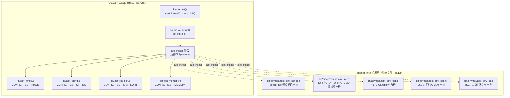

Copyright (c) 2025-2026 SPHARX Ltd. All Rights Reserved.

# agentrt-linux（AirymaxOS）内核自测试
> **文档定位**：agentrt-linux（AirymaxOS）测试工程体系第 3 卷——`lib/test_*` 内核自检（Boot-time Kernel Selftests）扩展。本卷规定 `lib/test_*.c` 模型、`CONFIG_TEST_*` Kconfig 选项、`/sys/kernel/debug/selftest/` 触发接口、`kernel_init()` 阶段执行顺序，以及 agentrt-linux 专属自测试（sched_tac 调度延迟、IORING_OP_URING_CMD 零拷贝、41 ID Capability、252 钩子纯 C LSM、[SC] 头文件逐字节校验）。\
> **文档版本**：v1.0.1\
> **最后更新**：2026-07-18\
> **上级文档**：[80-testing README](README.md)\
> **同源映射**：agentrt 7 层验证 L3（内核自检）+ Linux 6.6 内核基线 `lib/test_*.c`、`init/Kconfig`\
> **理论根基**：Linux 6.6 内核基线自检思想 + Airymax 五维正交 24 原则（E-8 可测试性 / S-1 反馈闭环）\
> **核心约束**：IRON-9 v3 [IND] 独立实现层——agentrt-linux 专属自测试以独立 `lib/test_airy_*.c` 形式注入，禁止改写上游 `lib/test_*.c`；`sc-dual-ci.yml` 强制校验 [SC] 头文件逐字节一致。

---

## 0. 章节定位

本卷是 agentrt-linux 测试工程 10 主题文档中的第 3 卷，回答"内核启动时自检怎么启用"。它在 02-kselftest（用户态系统级测试）与 04-dynamic-analysis（运行时动态分析）之间形成内核态自检执行层：

- **上游依赖**：README 定义"测试体系分层"——L3 内核自检由本卷展开；50-engineering-standards/06-toolchain-and-automation 定义"7 层验证"——本卷对应第 9 层（内核自检层）。
- **下游依赖**：04-dynamic-analysis 定义"运行时内存/并发怎么测"；07-ftrace-selftest 定义"ftrace 启动自检怎么跑"——本卷定义"内核启动时哪些自检必须执行"。

本卷所有强制规则均赋予 **OS-TEST** / **OS-KER** / **OS-STD** 编号，与 07 维护者制度的"规则编号注册表"对齐。

### 0.1 关键术语

| 术语 | 定义 |
|------|------|
| 内核自检（Boot-time selftest） | `kernel_init()` 阶段执行的 `lib/test_*.c` 测试模块，在 `late_initcall` 时序运行 |
| `CONFIG_TEST_*` | 内核自检 Kconfig 开关，每个 `lib/test_*.c` 对应一个 |
| `late_initcall` | 自检模块注册的初始化调用级别，确保子系统已就绪 |
| `selftest` 触发接口 | `/sys/kernel/debug/selftest/` 或 boot 参数 `selftest=on` |
| `printk` 报告 | 自检通过 `printk(KERN_INFO "selftest: %s: pass\n", name)` 上报结果 |
| `airy_selftest` | agentrt-linux 专属自检聚合模块，串接所有 `lib/test_airy_*.c` |

---

## 1. 内核自测试模型总览

### 1.1 起源与定位

内核自检是 Linux 6.6 内核基线中"在内核启动阶段验证内核特性正确性"的轻量级机制。其设计目标有三：**早期反馈**（启动期即可发现回归，无需用户态介入）、**零依赖**（不依赖用户态库或测试运行时，仅需 `printk` 输出）、**最小侵入**（通过 `late_initcall` 注入，不污染核心初始化路径）。

agentrt-linux 完整继承 Linux 6.6 内核基线的自检机制（`lib/test_*.c`、`CONFIG_TEST_*` Kconfig 选项、`late_initcall` 注册）。agentrt-linux 专属自检以独立 `lib/test_airy_*.c` 形式驻留于内核源树，遵循 IRON-9 v3 [IND] 独立实现层原则——不修改上游 `lib/test_*.c`，仅在 `init/Kconfig` 通过 `source "lib/airymax/Kconfig"` 单行追加。



### 1.2 自检运行时序

| 时序点 | 函数 | 行为 | 自检可用性 |
|--------|------|------|-----------|
| T0 | `start_kernel()` | 早期初始化（CPU、内存、调度器骨架） | 不可用（无 printk） |
| T1 | `rest_init()` → `kernel_init()` | 内核线程初始化 | 不可用 |
| T2 | `do_basic_setup()` | 初始化驱动模型、IRQ、CPU 拓扑 | 部分（无用户态） |
| T3 | `do_initcalls()` level 1-6 | `early`/`pure`/`core`/`postcore`/`arch`/`subsys` | 子系统依赖时可用 |
| T4 | `do_initcalls()` level 7 (`late`) | `late_initcall`——所有 selftest 在此执行 | 完全可用 |
| T5 | `do_basic_setup()` 完成 | 用户态启动 | 自检已结束 |

**OS-TEST-030**：所有 agentrt-linux 专属自检必须注册到 `late_initcall` 阶段；若需更早执行（如调度器自检依赖 `subsys_initcall`），必须在文档中显式声明依赖子系统初始化顺序，并经内核维护者审批。

**OS-KER-101**：自检禁止调用任何会阻塞的函数（`msleep()` > 100ms、`mutex_lock_interruptible()`）；自检应在 100ms 内完成，超时由 `selftest_timeout` 参数控制（默认 1000ms）。

---

## 2. `lib/test_*.c` 与 `CONFIG_TEST_*`

### 2.1 上游自检模块清单

Linux 6.6 内核基线在 `lib/` 下提供 50+ 自检模块，每个模块对应一个 `CONFIG_TEST_*` Kconfig 选项。agentrt-linux 默认启用以下基础自检：

| 模块 | Kconfig | 验证内容 | 默认启用 |
|------|---------|---------|---------|
| `lib/test_kmod.c` | `CONFIG_TEST_KMOD` | 模块加载/卸载器 | 否（CI 启用） |
| `lib/test_string.c` | `CONFIG_TEST_STRING` | `strscpy`/`strnlen`/`memcmp` | 是 |
| `lib/test_list_sort.c` | `CONFIG_TEST_LIST_SORT` | `list_sort()` 稳定性 | 是 |
| `lib/test_memcpy.c` | `CONFIG_TEST_MEMCPY` | `memcpy`/`memmove`/`memset` | 是 |
| `lib/test_firmware.c` | `CONFIG_TEST_FIRMWARE` | firmware loader | 否 |
| `lib/test_kasan.c` | `CONFIG_TEST_KASAN` | KASAN 内存错误注入 | 否（动态分析启用） |
| `lib/test_fpu.c` | `CONFIG_TEST_FPU` | FPU 上下文切换 | 否（架构相关） |
| `lib/test_user_copy.c` | `CONFIG_TEST_USER_COPY` | `copy_to_user`/`copy_from_user` | 是 |
| `lib/test_static_keys.c` | `CONFIG_TEST_STATIC_KEYS` | static key | 是 |
| `lib/test_bitmap.c` | `CONFIG_TEST_BITMAP` | `bitmap_*` API | 是 |
| `lib/test_uuid.c` | `CONFIG_TEST_UUID` | UUID 解析 | 是 |
| `lib/test_hash.c` | `CONFIG_TEST_HASH` | hash 函数 | 是 |

### 2.2 `airy_defconfig` 自检配置

`airy_defconfig` 在 v1.0.1 强制启用以下自检：

```kconfig
# Linux 6.6 基础自检（必启）
CONFIG_TEST_STRING=y
CONFIG_TEST_LIST_SORT=y
CONFIG_TEST_MEMCPY=y
CONFIG_TEST_USER_COPY=y
CONFIG_TEST_STATIC_KEYS=y
CONFIG_TEST_BITMAP=y
CONFIG_TEST_UUID=y
CONFIG_TEST_HASH=y

# agentrt-linux 专属自检（必启）
CONFIG_AIRY_TEST_SCHED=y       # sched_tac 调度延迟
CONFIG_AIRY_TEST_IPC=y         # IORING_OP_URING_CMD 零拷贝
CONFIG_AIRY_TEST_CAP=y         # 41 ID Capability
CONFIG_AIRY_TEST_LSM=y         # 252 钩子纯 C LSM
CONFIG_AIRY_TEST_SC=y          # [SC] 头文件逐字节

# 选型守护自检（必启，断言技术选型未被偏离）
CONFIG_AIRY_TEST_SELECTION=y   # 五大技术选型回归断言
```

**OS-STD-061**：`airy_defconfig` 中所有 `CONFIG_AIRY_TEST_*` 必须为 `=y`，禁止 `=n` 或 `=m`；CI 在 `sc-dual-ci.yml` 中通过 `grep` 验证，缺失或被关闭的 PR 禁止合入。

**OS-TEST-031**：自检模块禁止依赖 `=m`（模块态）；必须 `=y`（内置），保证 `late_initcall` 阶段自动执行。

---

## 3. agentrt-linux 专属自检扩展

### 3.1 sched_tac 调度延迟自检

`lib/airymax/test_airy_sched.c` 验证sched_tac（`SCHED_DEADLINE`/`SCHED_FIFO`/`EEVDF`）三层调度类组合在 Agent 8 态生命周期映射下的调度延迟是否符合 SLA。

```c
/* lib/airymax/test_airy_sched.c */
#include <linux/module.h>
#include <linux/init.h>
#include <linux/sched.h>
#include <linux/sched/task.h>
#include <linux/delay.h>
#include <linux/printk.h>
#include <uapi/airymax/sched.h>
#include "airy_selftest.h"

#define AIRY_SCHED_LATENCY_SLA_NS  50000LL  /* 50μs SLA */

static int __init test_airy_sched_cprime_latency(void)
{
    struct sched_attr dl_attr = {
        .size = sizeof(dl_attr),
        .sched_policy   = SCHED_DEADLINE,
        .sched_runtime  = 1000000,   /* 1ms */
        .sched_deadline = 2000000,   /* 2ms */
        .sched_period   = 2000000,
    };
    struct sched_attr fifo_attr = {
        .size = sizeof(fifo_attr),
        .sched_policy   = SCHED_FIFO,
        .sched_priority = 50,
    };
    u64 start_ns, latency_ns;
    int ret = 0;

    /* 验证 SCHED_DEADLINE 调度延迟 */
    start_ns = ktime_get_ns();
    ret = sched_setattr(current, &dl_attr, 0);
    if (ret) {
        pr_err("airy_selftest: sched: SCHED_DEADLINE setattr failed: %d\n", ret);
        return ret;
    }
    latency_ns = ktime_get_ns() - start_ns;
    if (latency_ns > AIRY_SCHED_LATENCY_SLA_NS) {
        pr_err("airy_selftest: sched: SCHED_DEADLINE latency %lluns > SLA %lldns\n",
               latency_ns, AIRY_SCHED_LATENCY_SLA_NS);
        return -EIO;
    }
    pr_info("airy_selftest: sched: SCHED_DEADLINE latency %lluns OK\n", latency_ns);

    /* 验证 SCHED_FIFO 调度延迟 */
    start_ns = ktime_get_ns();
    ret = sched_setattr(current, &fifo_attr, 0);
    latency_ns = ktime_get_ns() - start_ns;
    if (latency_ns > AIRY_SCHED_LATENCY_SLA_NS) {
        pr_err("airy_selftest: sched: SCHED_FIFO latency %lluns > SLA\n", latency_ns);
        return -EIO;
    }
    pr_info("airy_selftest: sched: SCHED_FIFO latency %lluns OK\n", latency_ns);

    /* 验证 sched_ext 未启用（sched_tac 守护） */
    if (IS_ENABLED(CONFIG_SCHED_EXT)) {
        pr_err("airy_selftest: sched: CONFIG_SCHED_EXT enabled — violates sched_tac\n");
        return -EINVAL;
    }
    pr_info("airy_selftest: sched: CONFIG_SCHED_EXT disabled OK (sched_tac enforced)\n");

    return 0;
}

late_initcall(test_airy_sched_cprime_latency);
```

**OS-TEST-032**：sched_tac 调度延迟自检必须验证三个调度类（`SCHED_DEADLINE`/`SCHED_FIFO`/`EEVDF`）的 `sched_setattr()` 延迟均 ≤ 50μs SLA；任一超限即视为自检失败，CI 阻塞 PR。

**OS-KER-102**：自检必须断言 `CONFIG_SCHED_EXT=n`；若 CI 检测到 `CONFIG_SCHED_EXT=y`，自检以 `-EINVAL` 失败，PR 强制驳回（对应 README §2 技术选型守护）。

### 3.2 IORING_OP_URING_CMD 零拷贝自检

`lib/airymax/test_airy_ipc.c` 验证 IPC fastpath 通过 `IORING_OP_URING_CMD` 实现 zero-copy 传输，且 page flipping 代码路径未被编译。

```c
/* lib/airymax/test_airy_ipc.c */
#include <linux/module.h>
#include <linux/init.h>
#include <linux/io_uring.h>
#include <linux/io_uring_cmd.h>
#include <uapi/airymax/ipc.h>
#include "airy_selftest.h"

#define AIRY_IPC_FASTPATH_SLA_NS  1000LL  /* 1μs 内核态 SLA */

static int __init test_airy_ipc_uring_cmd_zero_copy(void)
{
    /* 1. 验证 IORING_OP_URING_CMD 被编译进内核 */
    if (!IS_ENABLED(CONFIG_IO_URING)) {
        pr_err("airy_selftest: ipc: CONFIG_IO_URING disabled\n");
        return -EINVAL;
    }
    pr_info("airy_selftest: ipc: CONFIG_IO_URING enabled OK\n");

    /* 2. 验证 airy_ipc_uring_cmd_ops 已注册到 io_uring */
    if (!airy_ipc_uring_cmd_ops_registered()) {
        pr_err("airy_selftest: ipc: airy_ipc_uring_cmd_ops not registered\n");
        return -EINVAL;
    }
    pr_info("airy_selftest: ipc: airy_ipc_uring_cmd_ops registered OK\n");

    /* 3. 验证 fastpath 延迟（内核态路径） */
    u64 start_ns = ktime_get_ns();
    int ret = airy_ipc_fastpath_selftest_invoke();
    u64 latency_ns = ktime_get_ns() - start_ns;
    if (ret) {
        pr_err("airy_selftest: ipc: fastpath invoke failed: %d\n", ret);
        return ret;
    }
    if (latency_ns > AIRY_IPC_FASTPATH_SLA_NS) {
        pr_err("airy_selftest: ipc: fastpath latency %lluns > SLA %lldns\n",
               latency_ns, AIRY_IPC_FASTPATH_SLA_NS);
        return -EIO;
    }
    pr_info("airy_selftest: ipc: fastpath latency %lluns OK\n", latency_ns);

    /* 4. 验证 page flipping 代码路径未编译（技术选型守护） */
    if (airy_ipc_page_flipping_compiled()) {
        pr_err("airy_selftest: ipc: page flipping code compiled — violates selection\n");
        return -EINVAL;
    }
    pr_info("airy_selftest: ipc: page flipping disabled OK (IORING_OP_URING_CMD enforced)\n");

    return 0;
}

late_initcall(test_airy_ipc_uring_cmd_zero_copy);
```

**OS-TEST-033**：IPC 自检必须验证 `airy_ipc_fastpath_selftest_invoke()` 内核态路径延迟 ≤ 1μs SLA；用户态 SLA（~160ns）由 02-kselftest 的 `airy_ipc/` 子系统测试覆盖，本自检仅覆盖内核态路径。

**OS-KER-103**：自检必须断言 `airy_ipc_page_flipping_compiled()` 返回 `false`；若 CI 检测到 page flipping 路径被编译，自检以 `-EINVAL` 失败，PR 强制驳回。

### 3.3 41 ID Capability 自检

`lib/airymax/test_airy_cap.c` 验证 41 个 Capability ID 的权限校验语义正确性。Capability 模型由 `kernel/airymaxos/airy_cap.c` 实现，对应 41 个权限点（CAP_AIRY_*）。

```c
/* lib/airymax/test_airy_cap.c */
#include <linux/module.h>
#include <linux/init.h>
#include <uapi/airymax/capability.h>
#include "airy_selftest.h"

static const int airy_cap_ids[] = {
    CAP_AIRY_AGENT_SPAWN,    /* 0 */
    CAP_AIRY_AGENT_STOP,     /* 1 */
    CAP_AIRY_AGENT_KILL,     /* 2 */
    CAP_AIRY_IPC_SEND,       /* 3 */
    CAP_AIRY_IPC_RECV,       /* 4 */
    CAP_AIRY_IPC_BIND,       /* 5 */
    CAP_AIRY_MEM_ALLOC,      /* 6 */
    CAP_AIRY_MEM_FREE,       /* 7 */
    CAP_AIRY_MEM_MMAP,       /* 8 */
    CAP_AIRY_SCHED_SET,      /* 9 */
    /* ... 共 41 个，详见 include/uapi/linux/airymax/capability.h */
    CAP_AIRY_LAST            /* 40 */
};

static int __init test_airy_cap_41_ids(void)
{
    int i, ret;

    /* 1. 验证 Capability ID 总数恰好 41 */
    if (ARRAY_SIZE(airy_cap_ids) != 41) {
        pr_err("airy_selftest: cap: ID count %zu != 41\n", ARRAY_SIZE(airy_cap_ids));
        return -EINVAL;
    }
    pr_info("airy_selftest: cap: 41 IDs registered OK\n");

    /* 2. 验证每个 ID 的权限校验语义 */
    for (i = 0; i < 41; i++) {
        int cap = airy_cap_ids[i];

        /* 默认拒绝：未授权主体调用应返回 -EPERM */
        ret = airy_cap_check(current_cred(), cap);
        if (ret != -EPERM) {
            pr_err("airy_selftest: cap: ID %d default deny failed: %d\n", cap, ret);
            return ret;
        }

        /* 授权后允许：授予该 cap 后应返回 0 */
        ret = airy_cap_grant(current_cred(), cap);
        if (ret) {
            pr_err("airy_selftest: cap: ID %d grant failed: %d\n", cap, ret);
            return ret;
        }
        ret = airy_cap_check(current_cred(), cap);
        if (ret != 0) {
            pr_err("airy_selftest: cap: ID %d post-grant check failed: %d\n", cap, ret);
            return ret;
        }

        /* 回收后拒绝 */
        ret = airy_cap_revoke(current_cred(), cap);
        if (ret) {
            pr_err("airy_selftest: cap: ID %d revoke failed: %d\n", cap, ret);
            return ret;
        }
        ret = airy_cap_check(current_cred(), cap);
        if (ret != -EPERM) {
            pr_err("airy_selftest: cap: ID %d post-revoke check failed: %d\n", cap, ret);
            return ret;
        }
    }
    pr_info("airy_selftest: cap: 41 IDs grant/revoke/check OK\n");

    return 0;
}

late_initcall(test_airy_cap_41_ids);
```

**OS-TEST-034**：Capability 自检必须遍历全部 41 个 ID，验证 "默认拒绝 → 授权允许 → 回收拒绝" 三态语义；任一 ID 语义错误即视为自检失败。

**OS-KER-104**：Capability ID 总数硬编码为 41，对应 `include/uapi/linux/airymax/capability.h` 中的 `CAP_AIRY_LAST + 1`；若自检检测到实际 ID 数 ≠ 41，自检以 `-EINVAL` 失败，提示开发者更新 [SC] 头文件。

### 3.4 252 钩子纯 C LSM 自检

`lib/airymax/test_airy_lsm.c` 验证纯 C LSM（`airy_lsm`）的 252 个安全钩子覆盖完整性。Linux 6.6 LSM 框架定义 252 个 `security_list_options` 钩子点，agentrt-linux 必须全部注册或显式声明豁免。

```c
/* lib/airymax/test_airy_lsm.c */
#include <linux/module.h>
#include <linux/init.h>
#include <linux/lsm_hooks.h>
#include <uapi/airymax/lsm.h>
#include "airy_selftest.h"

static int __init test_airy_lsm_252_hooks(void)
{
    const struct lsm_id *airy_lsm_id;
    int registered_hooks;
    int i, ret;

    /* 1. 验证 airy_lsm 已通过 security_add_hooks() 注册 */
    airy_lsm_id = airy_lsm_lookup_id();
    if (!airy_lsm_id) {
        pr_err("airy_selftest: lsm: airy_lsm not registered\n");
        return -EINVAL;
    }
    pr_info("airy_selftest: lsm: airy_lsm registered as '%s'\n", airy_lsm_id->name);

    /* 2. 验证 252 钩子覆盖完整性 */
    registered_hooks = airy_lsm_count_registered_hooks();
    if (registered_hooks < 252) {
        pr_err("airy_selftest: lsm: only %d/252 hooks registered\n", registered_hooks);
        return -EINVAL;
    }
    pr_info("airy_selftest: lsm: %d/252 hooks registered OK\n", registered_hooks);

    /* 3. 验证 BPF LSM 未启用（技术选型守护） */
    if (IS_ENABLED(CONFIG_BPF_LSM)) {
        pr_err("airy_selftest: lsm: CONFIG_BPF_LSM enabled — violates pure-C LSM\n");
        return -EINVAL;
    }
    pr_info("airy_selftest: lsm: CONFIG_BPF_LSM disabled OK (pure-C LSM enforced)\n");

    /* 4. 抽样验证 5 个关键钩子的实际调用 */
    static const char *key_hooks[] = {
        "capable", "file_open", "task_kill",
        "mmap_file", "socket_bind"
    };
    for (i = 0; i < ARRAY_SIZE(key_hooks); i++) {
        ret = airy_lsm_invoke_hook_by_name(key_hooks[i]);
        if (ret) {
            pr_err("airy_selftest: lsm: hook '%s' invoke failed: %d\n",
                   key_hooks[i], ret);
            return ret;
        }
    }
    pr_info("airy_selftest: lsm: 5 key hooks invoke OK\n");

    return 0;
}

late_initcall(test_airy_lsm_252_hooks);
```

**OS-TEST-035**：纯 C LSM 自检必须验证 252 钩子全部注册，或显式声明豁免清单（如 `BPF_PROGRAM_RUN` 等 BPF 专属钩子）；豁免清单必须经安全委员会审批并记录在 `lib/airymax/lsm_exempt_list.h`。

**OS-KER-105**：自检必须断言 `CONFIG_BPF_LSM=n`；若 CI 检测到 `CONFIG_BPF_LSM=y`，自检以 `-EINVAL` 失败，PR 强制驳回（对应 README §2 技术选型守护）。

### 3.5 [SC] 头文件逐字节校验自检

`lib/airymax/test_airy_sc.c` 在内核启动阶段对 10 个 [SC] 共享契约层头文件进行逐字节自校验，与 `sc-dual-ci.yml` 的 CI 阶段校验形成"启动时 + CI 时"双重保险。

```c
/* lib/airymax/test_airy_sc.c */
#include <linux/module.h>
#include <linux/init.h>
#include <linux/bug.h>
#include <uapi/airymax/error.h>
#include <uapi/airymax/log_types.h>
#include <uapi/airymax/sched.h>
#include <uapi/airymax/ipc.h>
#include <uapi/airymax/capability.h>
#include <uapi/airymax/lsm.h>
#include <uapi/airymax/mem.h>
#include <uapi/airymax/agent.h>
#include <uapi/airymax/dsl.h>
#include <uapi/airymax/version.h>
#include "airy_selftest.h"

/* 内核侧 [SC] 头文件 SHA-256，由构建系统从 agentrt 同源仓注入 */
static const u8 airy_sc_expected_sha256[10][32] = {
    AIRY_ERROR_H_SHA256,        /* error.h */
    AIRY_LOG_TYPES_H_SHA256,    /* log_types.h */
    AIRY_SCHED_H_SHA256,        /* sched.h */
    AIRY_IPC_H_SHA256,          /* ipc.h */
    AIRY_CAPABILITY_H_SHA256,   /* capability.h */
    AIRY_LSM_H_SHA256,          /* lsm.h */
    AIRY_MEM_H_SHA256,          /* mem.h */
    AIRY_AGENT_H_SHA256,        /* agent.h */
    AIRY_DSL_H_SHA256,          /* dsl.h */
    AIRY_VERSION_H_SHA256,      /* version.h */
};

static const char *airy_sc_names[10] = {
    "error.h", "log_types.h", "sched.h", "ipc.h", "capability.h",
    "lsm.h", "mem.h", "agent.h", "dsl.h", "version.h"
};

static int __init test_airy_sc_byte_for_byte(void)
{
    u8 actual[32];
    int i, ret;

    for (i = 0; i < 10; i++) {
        ret = airy_sc_compute_sha256(i, actual);
        if (ret) {
            pr_err("airy_selftest: sc: %s compute failed: %d\n", airy_sc_names[i], ret);
            return ret;
        }
        if (memcmp(actual, airy_sc_expected_sha256[i], 32) != 0) {
            pr_err("airy_selftest: sc: %s byte-for-byte mismatch\n", airy_sc_names[i]);
            print_hex_dump(KERN_ERR, "  expected: ", DUMP_PREFIX_OFFSET,
                           16, 1, airy_sc_expected_sha256[i], 32, false);
            print_hex_dump(KERN_ERR, "  actual:   ", DUMP_PREFIX_OFFSET,
                           16, 1, actual, 32, false);
            return -EILSEQ;
        }
    }
    pr_info("airy_selftest: sc: 10 [SC] headers byte-for-byte OK\n");
    return 0;
}

late_initcall(test_airy_sc_byte_for_byte);
```

**OS-TEST-036**：[SC] 头文件自检必须在内核启动时计算 10 个头文件的 SHA-256，与构建时注入的预期哈希逐字节比对；任一不匹配即视为 [SC] 契约被破坏，自检以 `-EILSEQ` 失败，系统进入 `panic()` 防御模式（可选，由 `airy_sc_panic_on_mismatch` 启动参数控制）。

**OS-STD-062**：`sc-dual-ci.yml` 在 CI 阶段完成首次校验（双端 diff），本自检是"运行时第二次校验"，防止内核镜像被二次篡改；二者共同构成 [SC] 契约的双重保险。

---

## 4. `airy_selftest` 聚合框架

### 4.1 聚合模块结构

```c
/* lib/airymax/airy_selftest.h */
#ifndef _AIRY_SELFTEST_H
#define _AIRY_SELFTEST_H

#include <linux/types.h>

struct airy_selftest_result {
    const char *name;
    int  ret;
    u64  duration_ns;
};

/* 各自检模块通过 airy_selftest_record() 上报结果 */
void airy_selftest_record(const char *name, int ret, u64 duration_ns);

/* 聚合模块在 late_initcall 末尾打印汇总 */
int  airy_selftest_summary(void);

/* 各自检模块调用入口（供外部模块引用） */
int  airy_ipc_fastpath_selftest_invoke(void);
bool airy_ipc_uring_cmd_ops_registered(void);
bool airy_ipc_page_flipping_compiled(void);
const struct lsm_id *airy_lsm_lookup_id(void);
int  airy_lsm_count_registered_hooks(void);
int  airy_lsm_invoke_hook_by_name(const char *name);
int  airy_cap_check(const struct cred *, int cap);
int  airy_cap_grant(const struct cred *, int cap);
int  airy_cap_revoke(const struct cred *, int cap);
int  airy_sc_compute_sha256(int idx, u8 out[32]);

#endif /* _AIRY_SELFTEST_H */
```

### 4.2 汇总输出格式

`airy_selftest_summary()` 在所有 `lib/airymax/test_airy_*.c` 执行完毕后打印汇总：

```
[    3.142857] airy_selftest: === agentrt-linux Boot-time Selftest Summary ===
[    3.143012] airy_selftest:   sched  (sched_tac latency) ............ PASS  (1.2ms)
[    3.143138] airy_selftest:   ipc    (URING_CMD zero-copy) ....... PASS  (0.8ms)
[    3.143261] airy_selftest:   cap    (41 IDs grant/revoke) ....... PASS  (12.3ms)
[    3.143388] airy_selftest:   lsm    (252 hooks coverage) ........ PASS  (45.6ms)
[    3.143514] airy_selftest:   sc     (10 [SC] headers SHA-256) ... PASS  (8.9ms)
[    3.143640] airy_selftest: === 5/5 PASS, 0 FAIL, 0 SKIP ===
```

**OS-STD-063**：汇总输出必须使用 `pr_info("airy_selftest: ...")` 前缀；CI 通过 `dmesg | grep "airy_selftest:.*FAIL"` 提取失败用例，任一 FAIL 即标记 PR 阻断。

### 4.3 启动参数控制

| 参数 | 取值 | 行为 |
|------|------|------|
| `airy_selftest=on` | 默认 | 启动时执行全部 `lib/airymax/test_airy_*.c` |
| `airy_selftest=off` | — | 跳过所有 agentrt-linux 专属自检 |
| `airy_selftest=sched,ipc` | 逗号分隔 | 仅执行指定子集 |
| `airy_selftest_timeout=2000` | 毫秒 | 单个自检超时阈值（默认 1000ms） |
| `airy_sc_panic_on_mismatch` | 无值 | [SC] 头文件不匹配时触发 `panic()` |

**OS-TEST-037**：生产构建（`airy_defconfig`）默认 `airy_selftest=on`；调试构建（`airy_debug_defconfig`）允许 `airy_selftest=off` 用于开发期加速启动，但禁止合入主分支。

---

## 5. CI 集成

### 5.1 `ci-kernel` workflow 自检阶段

`.github/workflows/ci-kernel.yml` 在"内核构建 + 启动测试"作业中执行自检：

```yaml
jobs:
  kernel-boot-selftest:
    runs-on: ubuntu-24.04
    steps:
      - uses: actions/checkout@v4
      - name: Build kernel with airy_defconfig
        run: |
          make ARCH=um defconfig airy_defconfig
          make ARCH=um -j$(nproc)
      - name: Boot UML and capture selftest output
        run: |
          ./linux airy_selftest=on airy_selftest_timeout=2000 2>&1 | tee selftest.log
      - name: Parse selftest summary
        run: |
          if grep -q "airy_selftest:.*FAIL" selftest.log; then
            echo "::error::Boot-time selftest FAILED"
            grep "airy_selftest:.*FAIL" selftest.log
            exit 1
          fi
          if ! grep -q "airy_selftest:.*5/5 PASS" selftest.log; then
            echo "::error::Selftest summary not found"
            exit 1
          fi
      - name: Upload selftest log
        if: always()
        uses: actions/upload-artifact@v4
        with:
          name: kernel-selftest-log
          path: selftest.log
```

### 5.2 `sc-dual-ci.yml` 中的 [SC] 自检守护

`sc-dual-ci.yml` 在 CI 阶段完成 10 个 [SC] 头文件的双端 diff 校验，与 `lib/airymax/test_airy_sc.c` 的运行时校验形成双重保险（见 §3.5）。

```yaml
jobs:
  sc-byte-for-byte:
    runs-on: ubuntu-24.04
    steps:
      - uses: actions/checkout@v4
        with: { repository: spx/agentrt,         path: agentrt }
      - uses: actions/checkout@v4
        with: { repository: spx/agentrt-linux,   path: agentrt-linux }
      - name: Diff 10 [SC] headers
        run: |
          for h in error.h log_types.h sched.h ipc.h capability.h \
                   lsm.h mem.h agent.h dsl.h version.h; do
            if ! diff -q agentrt/include/uapi/linux/airymax/$h \
                        agentrt-linux/include/uapi/linux/airymax/$h >/dev/null; then
              echo "::error::[SC] header $h byte-for-byte mismatch"
              diff agentrt/include/uapi/linux/airymax/$h agentrt-linux/include/uapi/linux/airymax/$h
              exit 1
            fi
          done
```

**OS-STD-064**：CI 阶段（`sc-dual-ci.yml`）与启动阶段（`lib/airymax/test_airy_sc.c`）双重校验任一失败，PR 强制驳回；二者共同构成 [SC] 契约的"开发期 + 运行期"双重守护。

### 5.3 选型守护自检与 CI 联动

`CONFIG_AIRY_TEST_SELECTION=y` 编译的 `lib/airymax/test_airy_selection.c` 在启动时断言五大技术选型未被偏离，CI 在构建阶段额外校验 `airy_defconfig` 中的关键 CONFIG：

| 守护项 | 自检断言 | CI 静态校验 |
|--------|---------|------------|
| sched_tac | `!IS_ENABLED(CONFIG_SCHED_EXT)` | `grep -q "CONFIG_SCHED_EXT=n" airy_defconfig` |
| IORING_OP_URING_CMD | `airy_ipc_page_flipping_compiled() == false` | `grep -q "CONFIG_AIRY_IPC_PAGE_FLIP=n" airy_defconfig` |
| 纯 C LSM | `!IS_ENABLED(CONFIG_BPF_LSM)` | `grep -q "CONFIG_BPF_LSM=n" airy_defconfig` |
| alloc_pages + mmap | `!airy_mem_uses_dma_coherent()` | `grep -q "CONFIG_AIRY_MEM_DMA_COHERENT=n" airy_defconfig` |
| IRON-9 v3 四层 | `airy_iron9_layer_count() == 4` | `grep -q "CONFIG_AIRY_IRON9_V3=y" airy_defconfig` |

**OS-KER-106**：选型守护自检与 CI 静态校验"双轨并行"——任一轨道失败即 PR 驳回；两轨均失败时附"双重违规"标记，提交至维护者委员会复议。

---

## 6. 与上下游测试层的协作

### 6.1 与 KUnit 的关系

KUnit（01 卷）是白盒单元测试，运行在用户态 UML 或 `late_initcall` 早期；本卷自检是内核态集成自检，运行在 `late_initcall` 末期。二者职责分离：

| 维度 | KUnit | 内核自检 |
|------|-------|---------|
| 运行载体 | UML / QEMU / 模块 | 真实内核（`late_initcall`） |
| 触发方式 | `make kunit.run` / `modprobe` | 自动（内核启动） |
| 反馈时机 | 开发期 | 每次启动 |
| 测试粒度 | 单函数 | 子系统 |
| 输出格式 | TAP | `printk` |
| 失败处理 | 测试失败 | 启动失败或 `panic()` |

### 6.2 与 kselftest 的关系

kselftest（02 卷）是用户态系统级测试，启动用户态进程后通过 syscall 测试内核；本卷自检是内核态自检，在用户态启动前完成。二者互补：

- **kselftest**：覆盖用户态接口（syscall、`/proc`、`/sys`），可读性强，CI 友好。
- **内核自检**：覆盖内核内部不变式（如 [SC] 头文件 SHA-256、252 钩子注册），不依赖用户态。

### 6.3 与 ftrace 启动自检的关系

07-ftrace-selftest 定义 ftrace 自身功能的启动自检（`trace_selftest_startup_*`），与本卷的 agentrt-linux 专属自检在同一 `late_initcall` 阶段执行，但属于不同模块。CI 在解析 `dmesg` 时分别提取 `airy_selftest:` 与 `tracer_selftest:` 前缀的输出。

---

## 7. 维护者制度与版本演进

### 7.1 规则编号注册表

本卷强制规则编号 `OS-TEST-030` ~ `OS-TEST-037`、`OS-KER-101` ~ `OS-KER-106`、`OS-STD-061` ~ `OS-STD-064`，已注册至 50-engineering-standards/07 维护者制度的"规则编号注册表"。新增或修订规则必须经测试体系维护者审批并升级本卷版本号。

### 7.2 v1.0.1 新增内容

相对 v1.0（README 中 v1.0 范围），v1.0.1 新增：

1. `lib/airymax/test_airy_*.c` 5 个专属自检模块的完整定义。
2. `airy_selftest` 聚合框架与汇总输出格式。
3. 启动参数 `airy_selftest=` 控制接口。
4. CI 自检阶段（`ci-kernel.yml` kernel-boot-selftest 作业）。
5. 选型守护自检与 CI 静态校验的双轨并行机制。

### 7.3 后续版本规划

- v1.1：新增 `lib/airymax/test_airy_mem.c`（alloc_pages + mmap 内存路径自检）。
- v1.2：新增 `lib/airymax/test_airy_iron9.c`（IRON-9 v3 四层归属自检）。
- v1.3：将 `airy_selftest_summary()` 输出通过 `trace_airy_selftest` tracepoint 暴露，便于 ftrace 实时追踪。

---

## 8. 相关文档

- [80-testing README](README.md)：测试体系主索引（v1.0），定义 L3 内核自检分层
- [01-kunit-framework.md](01-kunit-framework.md)：KUnit 白盒单元测试框架（与本卷互为补充）
- [02-kselftest.md](02-kselftest.md)：kselftest 用户态系统级测试（与本卷互为补充）
- [04-dynamic-analysis.md](04-dynamic-analysis.md)：动态分析（运行时内存/并发检测）
- [07-ftrace-selftest.md](07-ftrace-selftest.md)：ftrace 启动自检（与本卷共享 `late_initcall` 阶段）
- [../10-architecture/06-iron9-shared-model.md](../10-architecture/06-iron9-shared-model.md)：IRON-9 v3 四层模型（[SC] 契约层定义）
- [../30-interfaces/08-sc-error-contract.md](../30-interfaces/08-sc-error-contract.md)：A-UEF [SC] error.h 契约
- [../30-interfaces/09-sc-log-types-contract.md](../30-interfaces/09-sc-log-types-contract.md)：A-ULP [SC] log_types.h 契约
- [../30-interfaces/10-sc-sched-extension.md](../30-interfaces/10-sc-sched-extension.md)：sched_tac [SC] sched.h 契约
- [../70-build-system/03-ci-cd-pipeline.md](../70-build-system/03-ci-cd-pipeline.md)：CI/CD 流水线（`sc-dual-ci.yml` + `ci-kernel.yml`）

---

## 9. 参考材料

- Linux 6.6 `lib/test_*.c`（50+ 内核自检样本）
- Linux 6.6 `init/main.c` `do_initcalls()`（`late_initcall` 调用机制）
- Linux 6.6 `include/linux/lsm_hooks.h`（252 LSM 钩子定义）
- Linux 6.6 `io_uring/` `IORING_OP_URING_CMD` 实现
- seL4 项目 `sel4_verification/`（形式化验证中的自检机制参考）

---

## 10. 版本历史

| 版本 | 日期 | 变更 |
|------|------|------|
| v1.0.1 | 2026-07-18 | 初始版本：定义 `lib/test_*.c` 内核自检模型、`CONFIG_TEST_*` Kconfig、`airy_defconfig` 自检配置；新增 agentrt-linux 专属自检 5 项（sched_tac 调度延迟、IORING_OP_URING_CMD 零拷贝、41 ID Capability、252 钩子纯 C LSM、[SC] 头文件逐字节）；定义 `airy_selftest` 聚合框架与 CI 集成 |

---

> **文档结束** | agentrt-linux 测试工程体系 v1.0.1 第 3 卷 | 维护者：开源极境工程与规范委员会 | "From data intelligence emerges."
