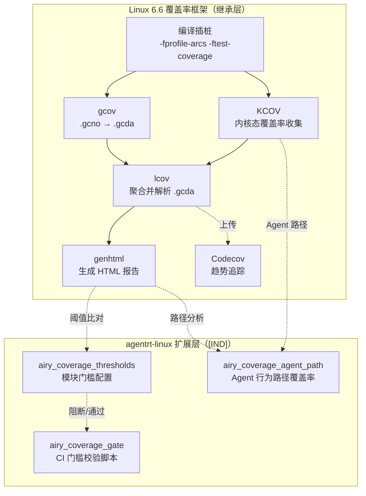

Copyright (c) 2025-2026 SPHARX Ltd. All Rights Reserved.

# agentrt-linux（AirymaxOS）覆盖率度量
> **文档定位**：agentrt-linux（AirymaxOS）测试工程体系第 6 卷——代码覆盖率度量（Coverage Metrics）。本卷规定覆盖率度量体系（行/分支/函数覆盖率）、CI 覆盖率门槛（kernel ≥90%、security ≥95%、ipc ≥90%）、覆盖率工具链（gcov + lcov + genhtml）、nightly workflow 生成覆盖率报告、Codecov 趋势追踪，以及 agentrt-linux 专属 Agent 行为路径覆盖率。\
> **文档版本**：v1.0.1\
> **最后更新**： 2026-07-21\
> **上级文档**：[80-testing README](README.md)\
> **同源映射**：agentrt 7 层验证 L6（覆盖度量）+ Linux 6.6 内核基线 `gcov`、`KCOV`、`lib/Makefile`\
> **理论根基**：Linux 6.6 内核基线覆盖率思想 + Airymax 五维正交 24 原则（E-8 可测试性 / S-1 反馈闭环 / A-4 完美主义）\
> **核心约束**：覆盖率门槛是不可妥协的工程基线——CI 在 PR 阶段强制校验，任一模块覆盖率跌破门槛即阻断合入。

---

## 0. 章节定位

本卷是 agentrt-linux 测试工程 10 主题文档中的第 6 卷，回答"代码覆盖率怎么测、门槛怎么守"。它在 05-static-analysis（编译时分析）与 07-ftrace-selftest（启动自检）之间形成覆盖度量层：

- **上游依赖**：README 定义"测试体系分层"——L6 覆盖度量由本卷展开；50-engineering-standards/06-toolchain-and-automation 定义"7 层验证"——本卷对应第 12 层（覆盖度量层）。
- **下游依赖**：07-ftrace-selftest 定义"ftrace 启动自检"；08-agent-contract-testing 定义"Agent 行为契约测试"——本卷的覆盖率门槛为契约测试提供量化基线。

本卷所有强制规则均赋予 **OS-TEST** / **OS-KER** / **OS-STD** 编号，与 07 维护者制度的"规则编号注册表"对齐。

### 0.1 关键术语

| 术语 | 定义 |
|------|------|
| 行覆盖率（Line coverage） | 已执行代码行数 / 总代码行数 |
| 分支覆盖率（Branch coverage） | 已执行分支数 / 总分支数 |
| 函数覆盖率（Function coverage） | 已调用函数数 / 总函数数 |
| `gcov` | GCC 内置的代码覆盖率工具 |
| `KCOV` | Linux 内核的覆盖率收集机制 |
| `lcov` | `gcov` 数据的图形化前端 |
| `genhtml` | 由 `lcov` 数据生成 HTML 报告 |
| `Codecov` | 第三方覆盖率趋势追踪服务 |
| `airy_coverage_thresholds` | agentrt-linux 专属覆盖率门槛配置文件 |

---

## 1. 覆盖率模型总览

### 1.1 起源与定位

代码覆盖率度量是 Linux 6.6 内核基线中"量化测试用例覆盖代码比例"的机制。其设计目标有三：**量化反馈**（用数字回答"测试够不够"）、**回归守护**（覆盖率下降即警示）、**测试改进**（识别未覆盖代码，引导补充测试）。

agentrt-linux 完整继承 Linux 6.6 内核基线的覆盖率工具链（`gcov` / `KCOV` / `lcov` / `genhtml`），不修改任何上游源文件。agentrt-linux 专属覆盖率度量（Agent 行为路径覆盖率）以独立 `airy_coverage_*` 模块形式注入，遵循 IRON-9 v3 [IND] 独立实现层原则。



### 1.2 覆盖率维度

| 维度 | 定义 | 计算公式 | 适用范围 |
|------|------|---------|---------|
| 行覆盖率 | 已执行代码行数 / 总代码行数 | `lines_hit / lines_total` | 全模块 |
| 分支覆盖率 | 已执行分支数 / 总分支数 | `branches_hit / branches_total` | 全模块 |
| 函数覆盖率 | 已调用函数数 / 总函数数 | `functions_hit / functions_total` | 全模块 |
| Agent 行为路径覆盖率 | 已执行 Agent 状态转换路径 / 总路径 | `paths_hit / paths_total` | agentrt-linux 专属 |

---

## 2. 覆盖率工具链

### 2.1 `gcov`：GCC 内置覆盖率工具

`gcov` 由 GCC 提供，通过编译时插桩（`-fprofile-arcs -ftest-coverage`）生成 `.gcno` 文件（编译时元数据），运行时收集 `.gcda` 文件（运行时计数）。

```bash
# 编译时启用 gcov
make ARCH=um defconfig airy_coverage_defconfig

# airy_coverage_defconfig 关键配置
# CONFIG_GCOV_KERNEL=y
# CONFIG_GCOV_PROFILE_ALL=y
# CONFIG_GCOV_PROFILE_AIRY=y
# CFLAGS += -fprofile-arcs -ftest-coverage
```

### 2.2 `KCOV`：内核态覆盖率收集

`KCOV` 由 Linux 内核提供，通过编译时插桩（`-fsanitize-coverage=trace-pc`）收集内核执行 PC（程序计数器），用于模糊测试（syzkaller）覆盖率引导。

```kconfig
# airy_kcov_defconfig
CONFIG_KCOV=y
CONFIG_KCOV_ENABLE_COMPARISONS=y
CONFIG_KCOV_INSTRUMENT_ALL=y
```

### 2.3 `lcov` + `genhtml`：报告生成

```bash
# 收集 .gcda 数据
lcov --capture --directory /sys/kernel/debug/gcov/ \
     --output-file airy_coverage.info \
     --rc lcov_branch_coverage=1

# 过滤掉上游代码，仅保留 agentrt-linux 专属模块
lcov --extract airy_coverage.info \
     'kernel/airymaxos/*' 'lib/airymax/*' \
     --output-file airy_coverage_filtered.info

# 生成 HTML 报告
genhtml --branch-coverage --function-coverage \
        --output-directory airy_coverage_html \
        --title "agentrt-linux Coverage" \
        airy_coverage_filtered.info
```

### 2.4 `Codecov`：趋势追踪

agentrt-linux 集成 Codecov 服务，每次 PR 自动上传覆盖率数据，趋势追踪：

```yaml
# .github/workflows/coverage.yml
- name: Upload to Codecov
  uses: codecov/codecov-action@v4
  with:
    files: airy_coverage_filtered.info
    flags: agentrt-linux
    name: agentrt-linux-coverage
    fail_ci_if_error: false
```

---

## 3. CI 覆盖率门槛

### 3.1 `airy_coverage_thresholds` 模块门槛配置

agentrt-linux 按模块定义覆盖率门槛，配置文件位于 `scripts/airy_coverage_thresholds.json`：

```json
{
  "modules": [
    {
      "name": "kernel/core",
      "path": "kernel/*",
      "thresholds": {
        "line": 90,
        "branch": 85,
        "function": 95
      }
    },
    {
      "name": "kernel/airymaxos/security",
      "path": "kernel/airymaxos/security/*",
      "thresholds": {
        "line": 95,
        "branch": 95,
        "function": 100
      }
    },
    {
      "name": "kernel/airymaxos/ipc",
      "path": "kernel/airymaxos/ipc/*",
      "thresholds": {
        "line": 90,
        "branch": 90,
        "function": 95
      }
    },
    {
      "name": "kernel/airymaxos/sched",
      "path": "kernel/airymaxos/sched/*",
      "thresholds": {
        "line": 90,
        "branch": 90,
        "function": 95
      }
    },
    {
      "name": "kernel/airymaxos/cap",
      "path": "kernel/airymaxos/cap/*",
      "thresholds": {
        "line": 95,
        "branch": 95,
        "function": 100
      }
    },
    {
      "name": "kernel/airymaxos/lsm",
      "path": "kernel/airymaxos/lsm/*",
      "thresholds": {
        "line": 95,
        "branch": 95,
        "function": 100
      }
    },
    {
      "name": "lib/airymax",
      "path": "lib/airymax/*",
      "thresholds": {
        "line": 90,
        "branch": 85,
        "function": 90
      }
    },
    {
      "name": "mm/airymax",
      "path": "mm/airymax/*",
      "thresholds": {
        "line": 85,
        "branch": 80,
        "function": 90
      }
    }
  ],
  "critical_paths": [
    "kernel/airymaxos/ipc/airy_ipc_fastpath.c",
    "kernel/airymaxos/sched/airy_sched_cprime.c",
    "kernel/airymaxos/cap/airy_cap_check.c",
    "kernel/airymaxos/lsm/airy_lsm_hook.c"
  ],
  "critical_path_thresholds": {
    "line": 100,
    "branch": 100,
    "function": 100
  }
}
```

### 3.2 门槛等级

| 等级 | 模块 | 行覆盖率 | 分支覆盖率 | 函数覆盖率 | 关键路径 |
|------|------|---------|----------|----------|---------|
| **关键** | `kernel/airymaxos/ipc/airy_ipc_fastpath.c` 等 4 项 | 100% | 100% | 100% | — |
| **A 级** | `security/` `cap/` `lsm/` | 95% | 95% | 100% | — |
| **B 级** | `ipc/` `sched/` | 90% | 90% | 95% | — |
| **C 级** | `kernel/core/` | 90% | 85% | 95% | — |
| **D 级** | `lib/airymax/` `mm/airymax/` | 85-90% | 80-85% | 90% | — |

**OS-TEST-070**：CI PR 阶段必须运行 `airy_coverage_gate` 脚本，比对当前 PR 覆盖率与 `airy_coverage_thresholds.json` 中的门槛；任一模块任一维度跌破门槛即阻断 PR。

**OS-KER-130**：4 项关键路径（`airy_ipc_fastpath.c` / `airy_sched_cprime.c` / `airy_cap_check.c` / `airy_lsm_hook.c`）必须 100% 行 + 分支 + 函数覆盖率；不足 100% 即 PR 驳回，无例外。

**OS-STD-091**：门槛等级升级路径——PR 引入新代码时，新代码的覆盖率必须达到所属模块门槛 + 5%（如 `ipc/` 新代码须达 95% 行覆盖），防止新代码拉低整体覆盖率。

### 3.3 `airy_coverage_gate` CI 门槛校验脚本

```bash
#!/bin/bash
# scripts/airy_coverage_gate.sh
# CI 覆盖率门槛校验

set -euo pipefail

THRESHOLDS_FILE="scripts/airy_coverage_thresholds.json"
COVERAGE_FILE="${1:-airy_coverage_filtered.info}"

if [ ! -f "$COVERAGE_FILE" ]; then
    echo "::error::Coverage file not found: $COVERAGE_FILE"
    exit 1
fi

# 使用 Python 解析 lcov info 与 JSON 门槛
python3 <<EOF
import json
import re
import sys

thresholds = json.load(open("$THRESHOLDS_FILE"))
coverage_file = "$COVERAGE_FILE"

# 解析 lcov info 文件
current_file = None
file_stats = {}
for line in open(coverage_file):
    line = line.strip()
    if line.startswith("SF:"):
        current_file = line[3:]
        file_stats[current_file] = {
            "line_hit": 0, "line_total": 0,
            "branch_hit": 0, "branch_total": 0,
            "function_hit": 0, "function_total": 0,
        }
    elif line == "end_of_record":
        current_file = None
    elif current_file:
        if line.startswith("DA:"):
            _, _, hit = line.split(",")
            file_stats[current_file]["line_total"] += 1
            if int(hit) > 0:
                file_stats[current_file]["line_hit"] += 1
        elif line.startswith("BRDA:"):
            parts = line[5:].split(",")
            hit = parts[3]
            file_stats[current_file]["branch_total"] += 1
            if hit != "-" and int(hit) > 0:
                file_stats[current_file]["branch_hit"] += 1
        elif line.startswith("FNDA:"):
            hit, _ = line[5:].split(",")
            file_stats[current_file]["function_total"] += 1
            if int(hit) > 0:
                file_stats[current_file]["function_hit"] += 1

# 检查模块门槛
failures = []
for module in thresholds["modules"]:
    name = module["name"]
    path_glob = module["path"].rstrip("/*")
    th = module["thresholds"]
    
    line_total = sum(s["line_total"] for f, s in file_stats.items() if path_glob in f)
    line_hit = sum(s["line_hit"] for f, s in file_stats.items() if path_glob in f)
    branch_total = sum(s["branch_total"] for f, s in file_stats.items() if path_glob in f)
    branch_hit = sum(s["branch_hit"] for f, s in file_stats.items() if path_glob in f)
    func_total = sum(s["function_total"] for f, s in file_stats.items() if path_glob in f)
    func_hit = sum(s["function_hit"] for f, s in file_stats.items() if path_glob in f)
    
    line_pct = (line_hit / line_total * 100) if line_total else 100
    branch_pct = (branch_hit / branch_total * 100) if branch_total else 100
    func_pct = (func_hit / func_total * 100) if func_total else 100
    
    print(f"{name}: line {line_pct:.1f}% (≥{th['line']}%), "
          f"branch {branch_pct:.1f}% (≥{th['branch']}%), "
          f"function {func_pct:.1f}% (≥{th['function']}%)")
    
    if line_pct < th["line"]:
        failures.append(f"{name}: line {line_pct:.1f}% < {th['line']}%")
    if branch_pct < th["branch"]:
        failures.append(f"{name}: branch {branch_pct:.1f}% < {th['branch']}%")
    if func_pct < th["function"]:
        failures.append(f"{name}: function {func_pct:.1f}% < {th['function']}%")

# 检查关键路径 100%
for cp in thresholds["critical_paths"]:
    th = thresholds["critical_path_thresholds"]
    if cp in file_stats:
        s = file_stats[cp]
        line_pct = (s["line_hit"] / s["line_total"] * 100) if s["line_total"] else 100
        branch_pct = (s["branch_hit"] / s["branch_total"] * 100) if s["branch_total"] else 100
        func_pct = (s["function_hit"] / s["function_total"] * 100) if s["function_total"] else 100
        print(f"CRITICAL {cp}: line {line_pct:.1f}%, branch {branch_pct:.1f}%, function {func_pct:.1f}%")
        if line_pct < 100 or branch_pct < 100 or func_pct < 100:
            failures.append(f"CRITICAL {cp}: not 100%")

if failures:
    print("\n::error::Coverage gate FAILED:")
    for f in failures:
        print(f"  - {f}")
    sys.exit(1)
else:
    print("\n::notice::Coverage gate PASSED")
EOF
```

---

## 4. CI 集成：nightly workflow 生成覆盖率报告

### 4.1 `nightly-coverage` workflow

```yaml
# .github/workflows/nightly-coverage.yml
name: nightly-coverage
on:
  schedule:
    - cron: "0 20 * * *"  # UTC 20:00（北京 04:00）
  workflow_dispatch: {}

jobs:
  coverage:
    runs-on: ubuntu-24.04
    timeout-minutes: 60
    steps:
      - uses: actions/checkout@v4
      - name: Install lcov
        run: sudo apt-get install -y lcov
      
      - name: Build with coverage
        run: |
          make ARCH=um defconfig airy_coverage_defconfig
          make ARCH=um -j$(nproc)
      
      - name: Boot UML and run all tests
        run: |
          # 启动内核，运行所有 KUnit + kselftest
          timeout 1800 ./linux \
            kunit.enable=1 \
            airy_selftest=on \
            airy_agent_stress=500000 \
            airy_ipc_ring_stress=50000 \
            2>&1 | tee test.log
      
      - name: Collect gcov data
        run: |
          # 从 /sys/kernel/debug/gcov/ 收集 .gcda
          lcov --capture \
               --directory /sys/kernel/debug/gcov/ \
               --output-file airy_coverage_full.info \
               --rc lcov_branch_coverage=1
      
      - name: Filter agentrt-linux modules
        run: |
          lcov --extract airy_coverage_full.info \
               'kernel/airymaxos/*' 'lib/airymax/*' 'mm/airymax/*' \
               --output-file airy_coverage_filtered.info
      
      - name: Run coverage gate
        run: |
          bash scripts/airy_coverage_gate.sh airy_coverage_filtered.info
      
      - name: Generate HTML report
        run: |
          genhtml --branch-coverage --function-coverage \
                  --output-directory airy_coverage_html \
                  --title "agentrt-linux Nightly Coverage" \
                  airy_coverage_filtered.info
      
      - name: Upload coverage to Codecov
        uses: codecov/codecov-action@v4
        with:
          files: airy_coverage_filtered.info
          flags: nightly
          name: agentrt-linux-nightly
      
      - name: Upload HTML report
        uses: actions/upload-artifact@v4
        with:
          name: coverage-html
          path: airy_coverage_html/
      
      - name: Check coverage trend
        run: |
          # 通过 Codecov API 获取昨日覆盖率，比对今日
          python3 scripts/airy_coverage_trend.py \
            --today airy_coverage_filtered.info \
            --yesterday-via-codecov
```

### 4.2 PR 阶段的覆盖率校验

```yaml
# .github/workflows/pr-coverage.yml
name: pr-coverage
on: [pull_request]

jobs:
  pr-coverage-check:
    runs-on: ubuntu-24.04
    steps:
      - uses: actions/checkout@v4
      - name: Build with coverage
        run: |
          make ARCH=um defconfig airy_coverage_defconfig
          make ARCH=um -j$(nproc)
      - name: Run KUnit + kselftest
        run: |
          ./linux kunit.enable=1 airy_selftest=on 2>&1 | tee test.log
      - name: Collect & filter coverage
        run: |
          lcov --capture --directory /sys/kernel/debug/gcov/ \
               --output-file full.info --rc lcov_branch_coverage=1
          lcov --extract full.info 'kernel/airymaxos/*' \
               --output-file filtered.info
      - name: Run coverage gate (CI 阻断)
        run: |
          bash scripts/airy_coverage_gate.sh filtered.info
      - name: Compare with PR base
        run: |
          # 仅检查 PR 修改的文件，避免上游代码覆盖率波动
          git diff --name-only origin/${{ github.base_ref }} > changed_files.txt
          python3 scripts/airy_coverage_pr_diff.py \
            --coverage filtered.info \
            --changed changed_files.txt \
            --thresholds scripts/airy_coverage_thresholds.json
```

**OS-TEST-071**：CI PR 阶段的覆盖率校验必须仅检查 PR 修改的文件（通过 `git diff --name-only` 提取），避免上游代码覆盖率波动误阻断 PR。

**OS-STD-092**：CI PR 阶段的覆盖率校验失败时，必须输出未覆盖代码的文件 + 行号列表，引导开发者补充测试；禁止仅输出"覆盖率不足"的笼统信息。

---

## 5. 覆盖率趋势追踪：Codecov 集成

### 5.1 Codecov 配置

```yaml
# .github/codecov.yml
codecov:
  require_changes: false
  notify:
    after_n_builds: 2
  strict_yaml_branch: main

coverage:
  precision: 2
  round: down
  range: "70...100"
  status:
    project:
      default:
        target: 90%
        threshold: 1%
      kernel-core:
        target: 90%
        paths: kernel/
      security:
        target: 95%
        paths:
          - kernel/airymaxos/security/
          - kernel/airymaxos/cap/
          - kernel/airymaxos/lsm/
      ipc:
        target: 90%
        paths: kernel/airymaxos/ipc/
      sched:
        target: 90%
        paths: kernel/airymaxos/sched/
    patch:
      default:
        target: 95%
        threshold: 1%

comment:
  layout: "reach,diff,flags,files,footer"
  behavior: default
  require_changes: false
  require_base: yes
  require_head: yes
```

### 5.2 趋势报告

Codecov 在每个 PR 评论中显示：

```
## Coverage Report

| Status   | Coverage | Delta |
|----------|----------|-------|
| Project  | 92.34%   | -0.12%|
| Patch    | 96.78%   | +1.23%|

### Modules
| Module    | Coverage | Target | Status |
|-----------|----------|--------|--------|
| security  | 96.12%   | 95%    | ✅     |
| ipc       | 91.45%   | 90%    | ✅     |
| sched     | 89.67%   | 90%    | ❌     |
| cap       | 100.00%  | 95%    | ✅     |
```

**OS-TEST-072**：CI 必须在每个 PR 中自动评论 Codecov 报告，包含项目级与模块级覆盖率；PR 评审者必须确认所有模块状态为 ✅，否则禁止合入。

---

## 6. agentrt-linux 专属：Agent 行为路径覆盖率

### 6.1 路径覆盖率定义

agentrt-linux 的 Agent 8 态生命周期状态机（INACTIVE → SPAWNING → READY → RUNNING → BLOCKED → STOPPING → STOPPED → DEAD）定义了合法的状态转换路径。Agent 行为路径覆盖率度量测试用例覆盖这些路径的比例。

### 6.2 合法状态转换矩阵

| 从状态 \ 到状态 | INACTIVE | SPAWNING | READY | RUNNING | BLOCKED | STOPPING | STOPPED | DEAD |
|---------------|---------|---------|-------|---------|---------|----------|---------|------|
| INACTIVE      | —       | ✓       | —     | —       | —       | —        | —       | —    |
| SPAWNING      | —       | —       | ✓     | —       | —       | ✓        | —       | ✓    |
| READY         | —       | —       | —     | ✓       | —       | ✓        | —       | —    |
| RUNNING       | —       | —       | ✓     | —       | ✓       | ✓        | —       | —    |
| BLOCKED       | —       | —       | ✓     | —       | —       | ✓        | —       | —    |
| STOPPING      | —       | —       | —     | —       | —       | —        | ✓       | ✓    |
| STOPPED       | —       | —       | —     | —       | —       | —        | —       | ✓    |
| DEAD          | —       | —       | —     | —       | —       | —        | —       | —    |

合法转换共 14 条（标 ✓），非法转换共 50 条（标 —）。

### 6.3 `airy_coverage_agent_path` 模块

```c
/* kernel/airymaxos/coverage/airy_coverage_agent_path.c */
#include <linux/module.h>
#include <linux/atomic.h>
#include <uapi/airymax/agent.h>

/* 8x8 状态转换矩阵，记录每条路径被命中的次数 */
static atomic_t airy_coverage_path_matrix[8][8];

/* 合法转换矩阵（1 = 合法，0 = 非法） */
static const int airy_path_legal[8][8] = {
    /* INACTIVE → */    {0, 1, 0, 0, 0, 0, 0, 0},
    /* SPAWNING → */    {0, 0, 1, 0, 0, 1, 0, 1},
    /* READY    → */    {0, 0, 0, 1, 0, 1, 0, 0},
    /* RUNNING  → */    {0, 0, 1, 0, 1, 1, 0, 0},
    /* BLOCKED  → */    {0, 0, 1, 0, 0, 1, 0, 0},
    /* STOPPING → */    {0, 0, 0, 0, 0, 0, 1, 1},
    /* STOPPED  → */    {0, 0, 0, 0, 0, 0, 0, 1},
    /* DEAD     → */    {0, 0, 0, 0, 0, 0, 0, 0},
};

/* hook: 状态转换发生时调用 */
void airy_coverage_agent_path_record(int from_state, int to_state)
{
    if (from_state < 0 || from_state >= 8) return;
    if (to_state < 0 || to_state >= 8) return;
    atomic_inc(&airy_coverage_path_matrix[from_state][to_state]);
}

/* 计算路径覆盖率 */
int airy_coverage_agent_path_pct(void)
{
    int legal_total = 0, legal_hit = 0;
    int i, j;
    for (i = 0; i < 8; i++) {
        for (j = 0; j < 8; j++) {
            if (airy_path_legal[i][j]) {
                legal_total++;
                if (atomic_read(&airy_coverage_path_matrix[i][j]) > 0) {
                    legal_hit++;
                }
            }
        }
    }
    return legal_total ? (legal_hit * 100 / legal_total) : 0;
}
EXPORT_SYMBOL(airy_coverage_agent_path_pct);

/* 检测非法路径触发（应永远为 0） */
int airy_coverage_agent_path_illegal_count(void)
{
    int illegal_hit = 0;
    int i, j;
    for (i = 0; i < 8; i++) {
        for (j = 0; j < 8; j++) {
            if (!airy_path_legal[i][j] &&
                atomic_read(&airy_coverage_path_matrix[i][j]) > 0) {
                illegal_hit++;
                pr_err("airy_coverage: ILLEGAL path %d→%d hit %d times\n",
                       i, j, atomic_read(&airy_coverage_path_matrix[i][j]));
            }
        }
    }
    return illegal_hit;
}
```

### 6.4 Agent 行为路径覆盖率门槛

| 路径类别 | 路径数 | 门槛 |
|---------|-------|------|
| 合法路径 | 14 | ≥90% 命中（13/14） |
| 非法路径 | 50 | 0% 命中（0/50，即任何非法路径触发即失败） |

**OS-TEST-073**：CI nightly 必须计算 Agent 行为路径覆盖率，合法路径 ≥ 90% 且非法路径 = 0% 即通过；任一不满足即标记 nightly 失败。

**OS-KER-131**：任一非法路径触发（如 `DEAD → RUNNING`）即视为 agentrt-linux 状态机缺陷，CI 立即驳回 PR 并创建 critical issue。

---

## 7. 与上下游测试层的协作

### 7.1 与 01-kunit / 02-kselftest 的关系

01 / 02 卷的测试用例是覆盖率的"来源"——测试用例执行后产生 `.gcda` 数据。本卷度量这些测试用例覆盖了多少代码。

- **测试用例多 ≠ 覆盖率高**：覆盖率反映测试用例的"代码触及度"，而非"行为正确性"。
- **覆盖率高 ≠ 测试质量高**：覆盖率 100% 仅表示所有代码行被执行，不表示所有边界条件都被验证。

### 7.2 与 04-dynamic-analysis 的关系

04 卷的动态分析在覆盖率高的代码路径上更有效（错误更容易被触发）。本卷的覆盖率报告用于指导动态分析的工作负载设计：

- 覆盖率 < 90% 的模块：动态分析运行时间 ×2
- 覆盖率 < 80% 的模块：动态分析运行时间 ×3 + 创建 issue 引导补充测试

### 7.3 与 08-agent-contract-testing 的关系

08 卷的 Agent 行为契约测试是本卷 Agent 行为路径覆盖率的"来源"——契约测试用例覆盖的状态转换路径即路径覆盖率的命中路径。两者共享 §6.2 的合法状态转换矩阵。

---

## 8. 维护者制度与版本演进

### 8.1 规则编号注册表

本卷强制规则编号 `OS-TEST-070` ~ `OS-TEST-073`、`OS-KER-130` ~ `OS-KER-131`、`OS-STD-091` ~ `OS-STD-092`，已注册至 50-engineering-standards/07 维护者制度的"规则编号注册表"。

### 8.2 v1.0.1 新增内容

1. 覆盖率工具链（gcov + KCOV + lcov + genhtml + Codecov）的启用模型。
2. `airy_coverage_thresholds.json` 模块门槛配置（4 级门槛 + 关键路径 100%）。
3. `airy_coverage_gate.sh` CI 门槛校验脚本。
4. `nightly-coverage` workflow 完整定义。
5. Agent 行为路径覆盖率（`airy_coverage_agent_path`）专属度量。

### 8.3 后续版本规划

- v1.0.1：新增 `airy_coverage_token_budget` Token 预算路径覆盖率。
- v1.2：与 10-formal-verification 联动，将形式化验证的属性覆盖纳入覆盖率报告。
- v1.3：支持分支覆盖率的 MC/DC（Modified Condition/Decision Coverage）度量。

---

## 9. 相关文档

- [80-testing README](README.md)：测试体系主索引（v1.0），定义 L6 覆盖度量分层
- [01-kunit-framework.md](01-kunit-framework.md)：KUnit 单元测试（覆盖率来源）
- [02-kselftest.md](02-kselftest.md)：kselftest 系统级测试（覆盖率来源）
- [04-dynamic-analysis.md](04-dynamic-analysis.md)：动态分析（与本卷联动）
- [08-agent-contract-testing.md](08-agent-contract-testing.md)：Agent 行为契约测试（路径覆盖率来源）
- [../50-engineering-standards/06-toolchain-and-automation.md](../50-engineering-standards/06-toolchain-and-automation.md)：工具链与自动化
- [../70-build-system/03-ci-cd-pipeline.md](../70-build-system/03-ci-cd-pipeline.md)：CI/CD 流水线
- [../170-performance/README.md](../170-performance/README.md)：性能工程（关键路径覆盖率联动）

---

## 10. 参考材料

- Linux 6.6 `Documentation/dev-tools/gcov.rst`（gcov 文档）
- Linux 6.6 `Documentation/dev-tools/kcov.rst`（KCOV 文档）
- `lcov` 项目：<https://github.com/linux-test-project/lcov>
- Codecov 服务：<https://about.codecov.io>
- Linux 6.6 `kernel/gcov/`（gcov 内核实现）

---

## 11. 版本历史

| 版本 | 日期 | 变更 |
|------|------|------|
| v1.0.1 | 2026-07-18 | 初始版本：定义覆盖率度量体系（行/分支/函数覆盖率）；定义 4 级 CI 门槛（kernel ≥90%、security ≥95%、ipc ≥90%、关键路径 100%）；定义 gcov + lcov + genhtml 工具链与 Codecov 集成；新增 agentrt-linux 专属 Agent 行为路径覆盖率（合法路径 ≥90%、非法路径 = 0%） |

---

## 12. 性能回归 CI（v1.1 增量补强）

> **补强背景**：170-performance/ 目录当前无 .md 文档落地（v1.1 待补），性能回归检测缺乏 CI 自动化。v1.0.1 Capability Folding 引入 fastpath C-S9 内联校验（~10ns SLA）、Badge 编译等新性能敏感路径，若无 CI 性能回归守护，延迟退化可能悄然合入主干。本章节作为 170-performance/ 文档缺位期间的临时落地，待 170-performance/03-ipc-performance.md 建立后迁移。

### 12.1 基准测试集

| 基准 | 测量函数 | SLA（v1.0.1） | 测量方法 |
|------|---------|-----------|---------|
| fastpath C-S9 延迟 | `airy_cap_badge_ok()` fastpath | ≤ 10ns | `bpf_perf_event` + 100 万次取 P99 |
| io_uring 提交延迟 | `IORING_OP_URING_CMD` 提交至完成 | ≤ 160ns | `io_uring_enter` 前后 `ktime_get_ns()` 差值 |
| Badge 编译延迟 | `airy_cap_badge_compile()` | ≤ 1μs | KUnit 内 `ktime_get_ns()` 测量 |
| Badge 撤销延迟 | `airy_cap_badge_revoke()` | ≤ 500ns | KUnit 内 `ktime_get_ns()` 测量 |
| `agent_caps[]` 查找延迟 | `airy_cap_lookup()` | ≤ 15ns | fastpath 内联，P99 测量 |

### 12.2 CI 集成：nightly perf workflow

```yaml
# .github/workflows/nightly-perf-regression.yml
name: nightly-perf-regression
on:
  schedule:
    - cron: "0 22 * * *"  # UTC 22:00（北京 06:00）
  workflow_dispatch: {}
  pull_request:
    paths:
      - 'kernel/airymaxos/ipc/**'
      - 'kernel/airymaxos/cap/**'
      - 'kernel/airymaxos/lsm/**'

jobs:
  perf-baseline:
    runs-on: ubuntu-24.04-perf  # 固定硬件基线
    timeout-minutes: 60
    steps:
      - uses: actions/checkout@v4
      - name: Build with perf defconfig
        run: |
          make ARCH=um defconfig airy_perf_defconfig
          make ARCH=um -j$(nproc)
      - name: Run perf benchmarks
        run: |
          timeout 1800 ./linux airy_perf_bench=on \
            airy_perf_iterations=1000000 \
            2>&1 | tee perf.log
      - name: Parse perf results
        run: |
          python3 scripts/airy_perf_parse.py \
            --log perf.log \
            --output perf_current.json
      - name: Compare with baseline
        run: |
          python3 scripts/airy_perf_compare.py \
            --current perf_current.json \
            --baseline perf_baseline.json \
            --warn-threshold 5 \
            --fail-threshold 10
      - name: Upload perf report
        if: always()
        uses: actions/upload-artifact@v4
        with:
          name: perf-report
          path: |
            perf_current.json
            perf.log
```

### 12.3 回归阈值

| 阈值等级 | 延迟增加幅度 | 响应动作 |
|---------|------------|---------|
| 通过 | ≤ 5% | 无动作，更新基线 |
| 告警 | > 5% 且 ≤ 10% | PR 评论告警，不阻断；nightly 创建 issue |
| 阻断 | > 10% | PR 阻断合入；nightly 标记失败，24 小时内修复或回滚 |
| 灾难 | > 50% | 立即阻断 release；触发回滚至上一稳定版本 |

```json
// perf_baseline.json（v1.1 基线，固定硬件配置下测量）
{
  "hardware": {
    "cpu": "Intel Xeon Platinum 8480+ (2.0GHz, 56C/112T)",
    "ram": "256GB DDR5-4800",
    "disk": "Samsung PM9A3 NVMe SSD 1.92TB"
  },
  "benchmarks": {
    "fastpath_c_s9_latency_ns":         { "p50": 8.2,  "p99": 9.8,  "sla": 10 },
    "io_uring_submit_latency_ns":       { "p50": 142,  "p99": 158,  "sla": 160 },
    "badge_compile_latency_ns":         { "p50": 850,  "p99": 950,  "sla": 1000 },
    "badge_revoke_latency_ns":          { "p50": 380,  "p99": 450,  "sla": 500 },
    "agent_caps_lookup_latency_ns":     { "p50": 12.5, "p99": 14.8, "sla": 15 }
  },
  "measured_at": "2026-07-15T03:00:00Z",
  "kernel_version": "6.6.0-airy #1",
  "config": "airy_perf_defconfig"
}
```

### 12.4 硬件基线

为消除硬件波动对性能测量的影响，nightly perf workflow 必须运行在固定配置的测试机上：

| 硬件组件 | 规格要求 | 说明 |
|---------|---------|------|
| CPU | Intel Xeon Platinum 8480+（2.0GHz, 56C/112T） | 固定频率，关闭 Turbo Boost |
| RAM | 256GB DDR5-4800 ECC | 8 通道，固定时序 |
| 磁盘 | Samsung PM9A3 NVMe SSD 1.92TB | U.2 接口，固定队列深度 |
| BIOS | 关闭 hyper-threading、关闭 C-states | 减少 CPU 调度噪声 |
| 内核参数 | `cpufreq=governor=performance idle=poll` | 固定最高频率，禁止 idle |

**OS-TEST-074**：nightly perf workflow 必须运行在上述固定硬件基线上；任一硬件组件更换必须重新测量基线（`perf_baseline.json` 更新 + 全员通告）。

**OS-KER-132**：fastpath C-S9 延迟 P99 > 10ns SLA 即视为 fastpath 性能契约违反，PR 立即驳回；任一基准 P99 超过 SLA 即标记 nightly 失败。

### 12.5 报告：Codecov Performance Trend

性能数据通过 Codecov Performance Trend 模块追踪长期趋势：

```yaml
# .github/codecov.yml 扩展（性能趋势）
codecov:
  require_changes: false

performance:
  notify:
    after_n_builds: 1
  trends:
    - name: fastpath-c-s9-latency
      metric: p99_latency_ns
      target: 10
      threshold: 5
    - name: io-uring-submit-latency
      metric: p99_latency_ns
      target: 160
      threshold: 8
    - name: badge-compile-latency
      metric: p99_latency_ns
      target: 1000
      threshold: 50
```

性能趋势报告示例：

```
## Performance Trend Report

| Benchmark | Today P99 | Baseline P99 | Delta | Status |
|-----------|-----------|-------------|-------|--------|
| fastpath_c_s9_latency       | 9.8ns   | 9.8ns   | 0.0%  | ✅ |
| io_uring_submit_latency     | 158ns   | 158ns   | 0.0%  | ✅ |
| badge_compile_latency       | 945ns   | 950ns   | -0.5% | ✅ |
| badge_revoke_latency        | 448ns   | 450ns   | -0.4% | ✅ |
| agent_caps_lookup_latency   | 14.7ns  | 14.8ns  | -0.7% | ✅ |
```

**OS-TEST-075**：CI 必须在每个 PR 评论中自动附性能趋势报告（若 PR 修改 `kernel/airymaxos/{ipc,cap,lsm}/` 路径）；性能退化 > 5% 必须在 PR 评论中显式标红告警。

---

> **文档结束** | agentrt-linux 测试工程体系 v1.0.1 第 6 卷 | 维护者：开源极境工程与规范委员会 | "From data intelligence emerges."
