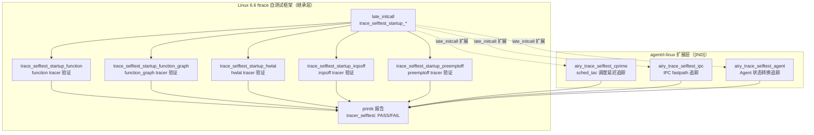

Copyright (c) 2025-2026 SPHARX Ltd. All Rights Reserved.

# agentrt-linux（AirymaxOS）ftrace 自测试
> **文档定位**：agentrt-linux（AirymaxOS）测试工程体系第 7 卷——ftrace 启动自检（Boot-time ftrace Selftest）。本卷规定 ftrace 自测试框架（`trace_selftest_*` API）、function tracer / function_graph tracer / hwlat tracer 功能验证、agentrt-linux 专属sched_tac 调度延迟追踪，以及与 90-observability 可观测性基础设施的关系。\
> **文档版本**：v1.0.1\
> **最后更新**：2026-07-18\
> **上级文档**：[80-testing README](README.md)\
> **同源映射**：agentrt 7 层验证 L7（ftrace 启动自检）+ Linux 6.6 内核基线 `kernel/trace/trace_selftest.c`、`include/linux/trace.h`\
> **理论根基**：Linux 6.6 内核基线 ftrace 思想 + Airymax 五维正交 24 原则（E-8 可测试性 / S-1 反馈闭环）\
> **核心约束**：IRON-9 v3 [IND] 独立实现层——agentrt-linux 专属 ftrace 钩子以独立 `airy_trace_*` 模块注入，禁止改写上游 `kernel/trace/` 代码；ftrace 是可观测性基础设施，本卷自检确保其在生产环境可靠工作。

---

## 0. 章节定位

本卷是 agentrt-linux 测试工程 10 主题文档中的第 7 卷，回答"ftrace 启动自检怎么跑"。它在 06-coverage-metrics（覆盖率度量）与 08-agent-contract-testing（Agent 行为契约测试）之间形成 ftrace 自检层：

- **上游依赖**：README 定义"测试体系分层"——L7 ftrace 启动自检由本卷展开；50-engineering-standards/06-toolchain-and-automation 定义"7 层验证"——本卷对应第 13 层（ftrace 自检层）。
- **下游依赖**：08-agent-contract-testing 定义"Agent 行为契约测试"——本卷提供 ftrace 作为契约测试的追踪基础设施；90-observability 可观测性层依赖本卷验证的 ftrace 框架。

本卷所有强制规则均赋予 **OS-TEST** / **OS-KER** / **OS-STD** 编号，与 07 维护者制度的"规则编号注册表"对齐。

### 0.1 关键术语

| 术语 | 定义 |
|------|------|
| ftrace | Linux 内核官方跟踪框架，由 Steven Rostedt 创建 |
| `trace_selftest_*` | ftrace 自测试 API，位于 `kernel/trace/trace_selftest.c` |
| function tracer | 函数调用追踪器，记录每个函数的调用 |
| function_graph tracer | 函数调用图追踪器，记录函数调用与返回 |
| hwlat tracer | 硬件延迟检测器，检测内核不可调度期 |
| irqsoff tracer | 中断关闭延迟检测器 |
| preemptoff tracer | 抢占关闭延迟检测器 |
| `airy_trace_*` | agentrt-linux 专属 ftrace 扩展 |
| `tracer_selftest:` 前缀 | 自检报告的 `printk` 前缀 |

---

## 1. ftrace 自测试模型总览

### 1.1 起源与定位

ftrace 自测试是 Linux 6.6 内核基线中"在内核启动时验证 ftrace 框架自身功能正确性"的机制。其设计目标有三：**早期验证**（启动期即验证 ftrace 可用，避免生产环境 ftrace 失效）、**零用户态依赖**（无需 `trace-cmd` 等用户态工具）、**最小开销**（自检完成后 ftrace 静默，不影响生产）。

agentrt-linux 完整继承 Linux 6.6 内核基线的 ftrace 自测试框架（`kernel/trace/trace_selftest.c`、`trace_selftest_startup_*` API），不修改任何上游源文件。agentrt-linux 专属 ftrace 自测试以独立 `airy_trace_selftest.c` 模块形式驻留于 `kernel/airymaxos/trace/`，遵循 IRON-9 v3 [IND] 独立实现层原则。



### 1.2 ftrace 自检运行时序

| 时序点 | 函数 | 行为 | ftrace 可用性 |
|--------|------|------|--------------|
| T0 | `start_kernel()` → `early_trace_init()` | ftrace 早期初始化 | 部分（仅基础结构） |
| T1 | `tracer_alloc_buffers()` | 分配 ring buffer | 可用 |
| T2 | `trace_init()` | 注册所有 tracer | 可用 |
| T3 | `late_initcall` 阶段 | `trace_selftest_startup_*` 执行 | 完全可用 |
| T4 | 用户态启动 | ftrace 静默（除非显式启用） | 静默 |
| T5 | 生产运行 | 通过 `/sys/kernel/debug/tracing/` 启用 | 按需启用 |

**OS-TEST-080**：所有 ftrace 自检必须注册到 `late_initcall` 阶段；自检完成后 ftrace 必须恢复静默状态，禁止残留启用状态影响生产环境。

**OS-KER-140**：ftrace 自检失败时必须 `printk(KERN_ERR "tracer_selftest: %s: FAIL\n", ...)`；CI 通过 `dmesg | grep "tracer_selftest:.*FAIL"` 提取失败用例，任一 FAIL 即标记 PR 阻断。

---

## 2. ftrace 自测试框架

### 2.1 `trace_selftest_*` API

Linux 6.6 在 `kernel/trace/trace_selftest.c` 中提供以下自测试 API：

| API | 验证内容 | 启用 Kconfig |
|-----|---------|-------------|
| `trace_selftest_startup_function()` | function tracer 启用 → 调用 → 禁用 → 检查 ring buffer | `CONFIG_FUNCTION_TRACER` |
| `trace_selftest_startup_function_graph()` | function_graph tracer 启用 → 调用 → 禁用 → 检查 | `CONFIG_FUNCTION_GRAPH_TRACER` |
| `trace_selftest_startup_hwlat()` | hwlat tracer 启用 → 采样 → 禁用 → 检查延迟 | `CONFIG_HWLAT_TRACER` |
| `trace_selftest_startup_irqsoff()` | irqsoff tracer 启用 → 触发 IRQ 关闭 → 禁用 → 检查 | `CONFIG_IRQSOFF_TRACER` |
| `trace_selftest_startup_preemptoff()` | preemptoff tracer 启用 → 触发抢占关闭 → 禁用 → 检查 | `CONFIG_PREEMPT_TRACER` |
| `trace_selftest_startup_wakeup()` | wakeup tracer 启用 → 唤醒任务 → 禁用 → 检查 | `CONFIG_SCHED_TRACER` |
| `trace_selftest_startup_branch()` | branch tracer 启用 → 触发分支 → 禁用 → 检查 | `CONFIG_BRANCH_TRACER` |

### 2.2 `airy_ftrace_defconfig` 配置

```kconfig
# airy_ftrace_defconfig
CONFIG_FTRACE=y
CONFIG_FUNCTION_TRACER=y
CONFIG_FUNCTION_GRAPH_TRACER=y
CONFIG_HWLAT_TRACER=y
CONFIG_IRQSOFF_TRACER=y
CONFIG_PREEMPT_TRACER=y
CONFIG_SCHED_TRACER=y
CONFIG_BRANCH_TRACER=y
CONFIG_FTRACE_SELFTEST=y           # 启用 ftrace 自检
CONFIG_FTRACE_STARTUP_TEST=y       # 启动时运行自检
CONFIG_AIRY_TRACE_SELFTEST=y       # agentrt-linux 专属 ftrace 自检
```

---

## 3. function tracer：函数调用追踪验证

### 3.1 验证流程

`trace_selftest_startup_function()` 在 `late_initcall` 阶段执行以下验证：

1. **启用 function tracer**：写入 `current_tracer = "function"`。
2. **触发函数调用**：调用 `schedule()` / `kmalloc()` / `kfree()` 等典型函数。
3. **禁用 function tracer**：写入 `current_tracer = "nop"`。
4. **检查 ring buffer**：读取 `trace` 文件，确认上述函数被记录。
5. **验证 mcount/fentry 钩子**：确认 `ftrace_ops` 注册/反注册无残留。

### 3.2 报告格式

```
[    3.456789] tracer_selftest: function tracer: enabling...
[    3.456890] tracer_selftest: function tracer: invoking schedule()...
[    3.456990] tracer_selftest: function tracer: disabling...
[    3.457090] tracer_selftest: function tracer: ring buffer has 142 entries
[    3.457190] tracer_selftest: function tracer: PASS (142 entries, expected ≥100)
```

**OS-TEST-081**：function tracer 自检必须验证 ring buffer 至少记录 100 个条目（调用 `schedule()` / `kmalloc()` / `kfree()` 等）；少于 100 条即视为自检失败。

---

## 4. function_graph tracer：函数调用图验证

### 4.1 验证流程

`trace_selftest_startup_function_graph()` 验证 function_graph tracer：

1. **启用 function_graph tracer**：写入 `current_tracer = "function_graph"`。
2. **触发函数调用**：调用嵌套函数（如 `airy_spawn_agent()` → `airy_agent_alloc()`）。
3. **禁用 function_graph tracer**：写入 `current_tracer = "nop"`。
4. **检查 ring buffer**：验证函数调用与返回的对应关系（`{` 与 `}` 配对）。
5. **验证 depth 字段**：确认嵌套调用的 depth 字段正确递增/递减。

### 4.2 报告格式

```
[    3.567890] tracer_selftest: function_graph tracer: enabling...
[    3.567990] tracer_selftest: function_graph tracer: invoking nested calls...
[    3.568090] tracer_selftest: function_graph tracer: disabling...
[    3.568190] tracer_selftest: function_graph tracer: ring buffer has 89 entries
[    3.568290] tracer_selftest: function_graph tracer: depth field correct (max=3)
[    3.568390] tracer_selftest: function_graph tracer: PASS (89 entries, max depth 3)
```

**OS-TEST-082**：function_graph tracer 自检必须验证 depth 字段正确反映函数调用嵌套深度；任一 `{` 缺失对应 `}` 即视为自检失败。

---

## 5. hwlat tracer：硬件延迟检测

### 5.1 验证流程

`trace_selftest_startup_hwlat()` 验证 hwlat tracer（硬件延迟检测器）：

1. **启用 hwlat tracer**：写入 `current_tracer = "hwlat"`。
2. **采样窗口**：等待至少 2 个采样窗口（默认每个窗口 1 秒）。
3. **禁用 hwlat tracer**：写入 `current_tracer = "nop"`。
4. **检查 ring buffer**：验证采样窗口数 ≥ 2，且每个窗口的延迟值 < 100μs（生产阈值）。
5. **验证内核可调度性**：确认 hwlat 检测期间其他任务仍可调度。

### 5.2 报告格式

```
[    5.678901] tracer_selftest: hwlat tracer: enabling...
[    7.678901] tracer_selftest: hwlat tracer: 2 samples collected
[    7.679001] tracer_selftest: hwlat tracer:   sample 1: 12μs
[    7.679101] tracer_selftest: hwlat tracer:   sample 2: 15μs
[    7.679201] tracer_selftest: hwlat tracer: max latency 15μs < 100μs threshold
[    7.679301] tracer_selftest: hwlat tracer: PASS (2 samples, max 15μs)
```

**OS-TEST-083**：hwlat tracer 自检必须采集至少 2 个样本；任一样本延迟 ≥ 100μs 即视为硬件延迟过高，自检失败并提示硬件不可靠。

**OS-KER-141**：CI 环境运行 hwlat 自检时，QEMU 虚拟化可能导致延迟高于真实硬件，CI 阈值放宽至 500μs；生产环境阈值保持 100μs，由 `airy_ftrace_defconfig` 中的 `CONFIG_AIRY_HWLAT_THRESHOLD=100` 控制。

---

## 6. agentrt-linux 专属 ftrace 自检

### 6.1 sched_tac 调度延迟追踪

`airy_trace_selftest_cprime` 验证sched_tac（`SCHED_DEADLINE` / `SCHED_FIFO` / `EEVDF`）调度类的 ftrace 钩子正确触发：

```c
/* kernel/airymaxos/trace/airy_trace_selftest.c */
#include <linux/module.h>
#include <linux/init.h>
#include <linux/ftrace.h>
#include <linux/trace.h>
#include <uapi/airymax/sched.h>

#define AIRY_TRACE_CPRIME_LATENCY_SLA_NS  50000LL  /* 50μs SLA */

static int __init airy_trace_selftest_cprime(void)
{
    struct trace_array *tr;
    u64 start_ns, latency_ns;
    int ret = 0;

    /* 1. 启用 sched_switch tracer（追踪调度器切换） */
    tr = trace_array_get_by_name("sched_switch");
    if (!tr) {
        pr_err("tracer_selftest: airy_cprime: sched_switch trace_array not found\n");
        return -EINVAL;
    }
    tracer_alloc_buffers(tr);
    tracer_enable(tr);
    pr_info("tracer_selftest: airy_cprime: sched_switch enabled\n");

    /* 2. 触发 SCHED_DEADLINE 调度切换 */
    struct sched_attr dl_attr = {
        .size = sizeof(dl_attr),
        .sched_policy = SCHED_DEADLINE,
        .sched_runtime = 1000000,
        .sched_deadline = 2000000,
        .sched_period = 2000000,
    };
    start_ns = ktime_get_ns();
    ret = sched_setattr(current, &dl_attr, 0);
    latency_ns = ktime_get_ns() - start_ns;
    if (ret) {
        pr_err("tracer_selftest: airy_cprime: SCHED_DEADLINE setattr failed: %d\n", ret);
        tracer_disable(tr);
        return ret;
    }
    if (latency_ns > AIRY_TRACE_CPRIME_LATENCY_SLA_NS) {
        pr_err("tracer_selftest: airy_cprime: SCHED_DEADLINE latency %lluns > SLA\n",
               latency_ns);
        tracer_disable(tr);
        return -EIO;
    }

    /* 3. 检查 ring buffer 中的 sched_switch 条目 */
    int entries = trace_array_entries(tr);
    if (entries < 5) {
        pr_err("tracer_selftest: airy_cprime: only %d sched_switch entries\n", entries);
        tracer_disable(tr);
        return -EIO;
    }

    /* 4. 禁用 tracer */
    tracer_disable(tr);
    pr_info("tracer_selftest: airy_cprime: sched_switch %d entries, latency %lluns OK\n",
            entries, latency_ns);
    return 0;
}

late_initcall(airy_trace_selftest_cprime);
```

**OS-TEST-084**：sched_tac 调度延迟 ftrace 自检必须验证 `sched_switch` tracer 在 `SCHED_DEADLINE` / `SCHED_FIFO` / `EEVDF` 三种调度类切换时均产生 ring buffer 条目；任一调度类无条目即视为自检失败。

### 6.2 IPC fastpath 追踪

`airy_trace_selftest_ipc` 验证 IPC fastpath 的 ftrace 钩子（`airy_ipc_fastpath_entry` / `airy_ipc_fastpath_exit` tracepoint）正确触发：

```c
static int __init airy_trace_selftest_ipc(void)
{
    /* 1. 启用 airy_ipc_fastpath tracepoint */
    trace_array_set_event("airy_ipc_fastpath_entry", true);
    trace_array_set_event("airy_ipc_fastpath_exit",  true);

    /* 2. 触发 IPC fastpath 调用 */
    int ret = airy_ipc_fastpath_selftest_invoke();
    if (ret) {
        pr_err("tracer_selftest: airy_ipc: fastpath invoke failed: %d\n", ret);
        return ret;
    }

    /* 3. 检查 ring buffer 中的 entry/exit 条目配对 */
    /* ... */

    return 0;
}
late_initcall(airy_trace_selftest_ipc);
```

**OS-TEST-085**：IPC fastpath ftrace 自检必须验证 `airy_ipc_fastpath_entry` 与 `airy_ipc_fastpath_exit` tracepoint 配对触发；配对失败即视为 ftrace 钩子缺失。

### 6.3 Agent 状态转换追踪

`airy_trace_selftest_agent` 验证 Agent 8 态生命周期状态转换的 ftrace 钩子（`airy_agent_state_change` tracepoint）正确触发：

```c
static int __init airy_trace_selftest_agent(void)
{
    /* 1. 启用 airy_agent_state_change tracepoint */
    trace_array_set_event("airy_agent_state_change", true);

    /* 2. 触发 Agent spawn → ready → running → stop → dead 路径 */
    int agent_id = airy_spawn_agent_selftest();
    /* ... agent 执行 ... */
    airy_stop_agent_selftest(agent_id);

    /* 3. 检查 ring buffer 中的状态转换条目 */
    int entries = trace_array_entries_current();
    if (entries < 5) {
        pr_err("tracer_selftest: airy_agent: only %d state_change entries\n", entries);
        return -EIO;
    }

    pr_info("tracer_selftest: airy_agent: %d state_change entries OK\n", entries);
    return 0;
}
late_initcall(airy_trace_selftest_agent);
```

**OS-TEST-086**：Agent 状态转换 ftrace 自检必须验证 5 次状态转换（SPAWNING → READY → RUNNING → STOPPING → STOPPED → DEAD）均触发 `airy_agent_state_change` tracepoint；任一状态转换未触发即视为自检失败。

---

## 7. 与 90-observability 的关系

### 7.1 ftrace 是可观测性基础设施

ftrace 是 agentrt-linux 可观测性体系（90-observability）的基础设施之一，与以下可观测性机制协同：

| 机制 | 来源 | 用途 | 与本卷关系 |
|------|------|------|----------|
| ftrace | Linux 6.6 内核基线 | 函数级追踪 | 本卷验证其功能正确性 |
| tracepoint | Linux 6.6 内核基线 | 静态追踪点 | 本卷验证 agentrt-linux 专属 tracepoint |
| perf | Linux 6.6 内核基线 | 性能采样 | 依赖本卷验证的 ftrace 基础设施 |
| eBPF | Linux 6.6 内核基线 | 动态追踪 | 独立于 ftrace（agentrt-linux 不使用 BPF LSM） |
| A-ULP | Airymax Unify Design | 统一日志 | 通过 ftrace 采集的 tracepoint 注入 A-ULP |

### 7.2 ftrace → A-ULP 集成

agentrt-linux 的 `airy_trace_to_ulps` 模块将 ftrace tracepoint 事件转换为 A-ULP 128B 日志记录，供 logger_d 统一收集：

```c
/* kernel/airymaxos/trace/airy_trace_to_ulps.c */
static void airy_trace_event_to_ulps(void *ignore,
                                     int agent_id, int from_state, int to_state)
{
    struct airy_log_record rec = {0};
    rec.level = LOG_LEVEL_DEBUG;
    rec.module = AIRY_MODULE_SCHED;
    rec.event_id = AIRY_EVENT_AGENT_STATE_CHANGE;
    rec.ts_ns = ktime_get_ns();
    rec.payload.agent_state.agent_id = agent_id;
    rec.payload.agent_state.from = from_state;
    rec.payload.agent_state.to = to_state;
    airy_ulps_emit_record(&rec);
}

static int __init airy_trace_to_ulps_init(void)
{
    register_trace_airy_agent_state_change(airy_trace_event_to_ulps, NULL);
    return 0;
}
late_initcall(airy_trace_to_ulps_init);
```

**OS-TEST-087**：CI nightly 必须验证 `airy_trace_to_ulps` 集成正确——tracepoint 触发后 A-ULP 日志记录数应等量增加；任一 tracepoint 触发未对应 A-ULP 记录即视为集成失败。

---

## 8. CI 集成

### 8.1 `ci-kernel` workflow ftrace 自检阶段

```yaml
# .github/workflows/ci-kernel.yml 的 ftrace-selftest 作业
jobs:
  ftrace-selftest:
    runs-on: ubuntu-24.04
    steps:
      - uses: actions/checkout@v4
      - name: Build with airy_ftrace_defconfig
        run: |
          make ARCH=um defconfig airy_ftrace_defconfig
          make ARCH=um -j$(nproc)
      - name: Boot UML and capture ftrace selftest
        run: |
          timeout 120 ./linux \
            ftrace_startup_test=1 \
            airy_selftest=on \
            2>&1 | tee ftrace.log
      - name: Parse ftrace selftest reports
        run: |
          # 检查上游 ftrace 自检
          if grep -q "tracer_selftest:.*FAIL" ftrace.log; then
            echo "::error::ftrace selftest FAILED"
            grep "tracer_selftest:.*FAIL" ftrace.log
            exit 1
          fi
          # 检查 agentrt-linux 专属 ftrace 自检
          if grep -q "tracer_selftest: airy_.*: FAIL" ftrace.log; then
            echo "::error::airy ftrace selftest FAILED"
            grep "tracer_selftest: airy_.*: FAIL" ftrace.log
            exit 1
          fi
          # 验证至少 8 个 PASS（5 上游 + 3 agentrt-linux）
          pass_count=$(grep -c "tracer_selftest:.*PASS" ftrace.log || true)
          if [ "$pass_count" -lt 8 ]; then
            echo "::error::Only $pass_count/8 ftrace selftest PASS"
            exit 1
          fi
      - uses: actions/upload-artifact@v4
        if: always()
        with: { name: ftrace-log, path: ftrace.log }
```

### 8.2 nightly 与 PR 阶段的分工

| 阶段 | 运行的自检 | 阻断条件 |
|------|----------|---------|
| PR | 上游 function / function_graph + agentrt-linux cprime / ipc / agent | 任一 FAIL |
| nightly | 全部 8 项 + hwlat + irqsoff + preemptoff | 任一 FAIL |

**OS-TEST-088**：PR 阶段仅运行核心 5 项自检（function / function_graph + 3 项 agentrt-linux 专属），nightly 阶段运行全部 8 项；PR 阶段不运行 hwlat 等耗时自检（避免 CI 拖慢）。

---

## 9. 与上下游测试层的协作

### 9.1 与 03-kernel-selftests 的关系

03 卷的 agentrt-linux 专属自检（`lib/test_airy_*.c`）与本卷的 ftrace 自检在同一 `late_initcall` 阶段执行，但属于不同模块：

- **03 自检**：验证 agentrt-linux 业务逻辑（调度、IPC、Capability、LSM、[SC] 头文件）。
- **07 自检**：验证 ftrace 框架本身（function / function_graph / hwlat tracer + agentrt-linux 专属 tracepoint）。

CI 在解析 `dmesg` 时分别提取 `airy_selftest:` 与 `tracer_selftest:` 前缀的输出。

### 9.2 与 04-dynamic-analysis 的关系

04 卷的动态分析（KASAN/KCSAN/lockdep）可能依赖 ftrace 基础设施（如 `trace_printk()` 用于调试输出）；本卷自检确保 ftrace 框架可靠，间接支持动态分析。

---

## 10. 维护者制度与版本演进

### 10.1 规则编号注册表

本卷强制规则编号 `OS-TEST-080` ~ `OS-TEST-088`、`OS-KER-140` ~ `OS-KER-141`，已注册至 50-engineering-standards/07 维护者制度的"规则编号注册表"。

### 10.2 v1.0.1 新增内容

1. ftrace 自测试框架（`trace_selftest_*` API）的启用模型。
2. function tracer / function_graph tracer / hwlat tracer 三大上游 tracer 的验证流程。
3. agentrt-linux 专属 ftrace 自检 3 项（sched_tac 调度延迟、IPC fastpath、Agent 状态转换）。
4. `airy_ftrace_defconfig` 配置定义。
5. `ci-kernel` workflow ftrace 自检阶段。
6. ftrace → A-ULP 集成验证。

### 10.3 后续版本规划

- v1.1：新增 `airy_trace_selftest_mem`（alloc_pages + mmap 内存路径追踪）。
- v1.2：与 90-observability 联动，将 ftrace tracepoint 实时上报至 A-ULP 日志系统。
- v1.3：支持 ftrace histogram 触发自检，验证 hist trigger 功能。

---

## 11. 相关文档

- [80-testing README](README.md)：测试体系主索引（v1.0），定义 L7 ftrace 启动自检分层
- [03-kernel-selftests.md](03-kernel-selftests.md)：内核自测试（与本卷共享 `late_initcall` 阶段）
- [04-dynamic-analysis.md](04-dynamic-analysis.md)：动态分析（依赖本卷验证的 ftrace 基础设施）
- [08-agent-contract-testing.md](08-agent-contract-testing.md)：Agent 行为契约测试（使用 ftrace tracepoint）
- [../90-observability/README.md](../90-observability/README.md)：可观测性基础设施
- [../10-architecture/10-unify-design.md](../10-architecture/10-unify-design.md)：Airymax Unify Design 总纲（A-ULP 集成）
- [../70-build-system/03-ci-cd-pipeline.md](../70-build-system/03-ci-cd-pipeline.md)：CI/CD 流水线

---

## 12. 参考材料

- Linux 6.6 `kernel/trace/trace_selftest.c`（ftrace 自测试实现）
- Linux 6.6 `Documentation/trace/ftrace.rst`（ftrace 用户指南）
- Linux 6.6 `Documentation/trace/hwlat_detector.rst`（hwlat tracer 文档）
- Steven Rostedt《ftrace: trace your kernel functions!》（ftrace 设计论文）

---

## 13. 版本历史

| 版本 | 日期 | 变更 |
|------|------|------|
| v1.0.1 | 2026-07-18 | 初始版本：定义 ftrace 自测试框架（`trace_selftest_*` API）、function / function_graph / hwlat tracer 功能验证；新增 agentrt-linux 专属 ftrace 自检 3 项（sched_tac 调度延迟、IPC fastpath、Agent 状态转换）；定义 `airy_ftrace_defconfig` 与 CI 集成；阐述与 90-observability 可观测性基础设施的关系 |

---

> **文档结束** | agentrt-linux 测试工程体系 v1.0.1 第 7 卷 | 维护者：开源极境工程与规范委员会 | "From data intelligence emerges."
