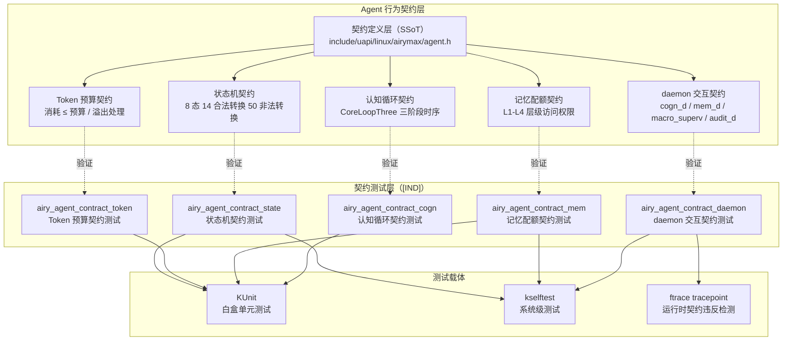

Copyright (c) 2025-2026 SPHARX Ltd. All Rights Reserved.

# agentrt-linux（AirymaxOS）Agent 行为契约测试
> **文档定位**：agentrt-linux（AirymaxOS）测试工程体系第 8 卷——Agent 行为契约测试（Agent Contract Testing）。本卷是 agentrt-linux 专属 L8 层测试，规定 Agent 8 态生命周期状态机契约、Token 预算契约、记忆配额契约、CoreLoopThree 三阶段认知循环时序契约、与 cogn_d / mem_d daemon 的契约测试框架。\
> **文档版本**：v1.0.1\
> **最后更新**：2026-07-18\
> **上级文档**：[80-testing README](README.md)\
> **同源映射**：agentrt 7 层验证 L8（Agent 契约测试，agentrt-linux 专属）+ Linux 6.6 内核基线 KUnit / kselftest 载体\
> **理论根基**：Airymax 五维正交 24 原则（E-8 可测试性 / A-4 完美主义 / S-1 反馈闭环 / IRON-9 v3 [IND] 独立实现层）\
> **核心约束**：Agent 行为契约是不可妥协的工程基线——CI 在 PR 阶段强制校验所有契约，任一契约违反即阻断合入；契约定义源（SSoT）位于 `include/uapi/linux/airymax/agent.h`，本卷测试用例验证该 SSoT。

---

## 0. 章节定位

本卷是 agentrt-linux 测试工程 10 主题文档中的第 8 卷，回答"Agent 行为契约怎么测"。它在 07-ftrace-selftest（ftrace 自检）与 09-fuzz-testing（模糊测试）之间形成 agentrt-linux 专属契约测试层：

- **上游依赖**：README 定义"测试体系分层"——L8 Agent 契约测试由本卷展开；50-engineering-standards/06-toolchain-and-automation 定义"7 层验证"——本卷对应第 14 层（Agent 契约层）。
- **下游依赖**：09-fuzz-testing 定义"模糊测试怎么跑"；10-formal-verification 定义"形式化验证怎么做"——本卷的契约定义是形式化验证的输入。

本卷所有强制规则均赋予 **OS-TEST** / **OS-KER** / **OS-STD** 编号，与 07 维护者制度的"规则编号注册表"对齐。

### 0.1 关键术语

| 术语 | 定义 |
|------|------|
| Agent 行为契约 | Agent 在状态转换、资源消耗、时序约束等方面的可验证不变式 |
| Agent 8 态生命周期 | INACTIVE → SPAWNING → READY → RUNNING → BLOCKED → STOPPING → STOPPED → DEAD |
| Token 预算 | 每个 Agent 的资源消耗上限，由 `airy_token_budget` 跟踪 |
| 记忆配额 | Agent 在 L1-L4 记忆层级的访问权限配额 |
| CoreLoopThree | Agent 认知循环的三阶段：感知（Perceive）→ 决策（Decide）→ 执行（Execute） |
| `cogn_d` daemon | Agent 认知循环守护进程（12 daemon 之一） |
| `mem_d` daemon | Agent 记忆管理守护进程（12 daemon 之一） |
| 契约违反 | Agent 行为不符合契约定义，CI 立即驳回 PR |

---

## 1. Agent 行为契约模型总览

### 1.1 起源与定位

Agent 行为契约测试是 agentrt-linux **专属**的 L8 层测试，无对应的上游 Linux 内核基线机制。其设计目标有三：**契约显式化**（将 Agent 行为约束从隐式约定提升为可验证契约）、**契约守护**（CI 强制校验，任一违反即阻断）、**契约文档化**（契约定义即测试用例，文档与代码同步）。

agentrt-linux 的 Agent 行为契约以独立 `airy_agent_contract_*` 模块形式驻留于 `kernel/airymaxos/contract/`，遵循 IRON-9 v3 [IND] 独立实现层原则——不依赖上游 Linux 内核机制，仅在 KUnit / kselftest 载体上构建专属测试框架。



### 1.2 契约测试运行载体

| 载体 | 工具 | 契约类别 | 反馈时机 |
|------|------|---------|---------|
| KUnit | `airy_agent_contract_*_test.c` | 状态机 / Token / 记忆 / 认知循环 | 开发期（毫秒级） |
| kselftest | `airy_agent_contract/` 子目录 | 状态机 / 记忆 / daemon 交互 | 系统级（秒级） |
| ftrace tracepoint | `airy_agent_contract_violation` tracepoint | 全部契约 | 运行时（实时） |

**OS-TEST-090**：所有 Agent 行为契约必须有对应的 KUnit 测试套件；契约无 KUnit 覆盖时，PR 评审必须显式标注"契约豁免理由"，并由 Agent 行为契约维护者审批。

**OS-KER-150**：`airy_agent_contract_violation` tracepoint 在生产构建（`airy_defconfig`）中必须启用；任一契约违反通过该 tracepoint 实时上报至 A-ULP 日志系统（`LOG_LEVEL_FATAL`）。

---

## 2. 契约定义：Agent 8 态生命周期状态机契约

### 2.1 状态定义

Agent 8 态生命周期的 8 个状态定义于 `include/uapi/linux/airymax/agent.h`：

```c
/* include/uapi/linux/airymax/agent.h（[SC] 共享契约层 SSoT） */
#ifndef _UAPI_AIRY_AGENT_H
#define _UAPI_AIRY_AGENT_H

enum airy_agent_state {
    AIRY_AGENT_STATE_INACTIVE  = 0,  /* 未激活（初始态） */
    AIRY_AGENT_STATE_SPAWNING  = 1,  /* 创建中 */
    AIRY_AGENT_STATE_READY     = 2,  /* 就绪（可调度） */
    AIRY_AGENT_STATE_RUNNING   = 3,  /* 运行中 */
    AIRY_AGENT_STATE_BLOCKED   = 4,  /* 阻塞（等待资源） */
    AIRY_AGENT_STATE_STOPPING  = 5,  /* 停止中（清理资源） */
    AIRY_AGENT_STATE_STOPPED   = 6,  /* 已停止（待回收） */
    AIRY_AGENT_STATE_DEAD      = 7,  /* 已死亡（资源已回收） */
    AIRY_AGENT_STATE_MAX       = 8,
};

/* 合法状态转换矩阵（1 = 合法，0 = 非法） */
#define AIRY_AGENT_TRANSITION_LEGAL(from, to) \
    airy_agent_transition_legal_table[(from)][(to)]

extern const int airy_agent_transition_legal_table[8][8];

#endif /* _UAPI_AIRY_AGENT_H */
```

### 2.2 合法状态转换矩阵

`kernel/airymaxos/agent/airy_agent_state.c` 定义合法转换表：

```c
/* kernel/airymaxos/agent/airy_agent_state.c */
const int airy_agent_transition_legal_table[8][8] = {
    /* INACTIVE → */    {0, 1, 0, 0, 0, 0, 0, 0},
    /* SPAWNING → */    {0, 0, 1, 0, 0, 1, 0, 1},  /* SPAWNING 可转 READY / STOPPING / DEAD */
    /* READY    → */    {0, 0, 0, 1, 0, 1, 0, 0},  /* READY 可转 RUNNING / STOPPING */
    /* RUNNING  → */    {0, 0, 1, 0, 1, 1, 0, 0},  /* RUNNING 可转 READY / BLOCKED / STOPPING */
    /* BLOCKED  → */    {0, 0, 1, 0, 0, 1, 0, 0},  /* BLOCKED 可转 READY / STOPPING */
    /* STOPPING → */    {0, 0, 0, 0, 0, 0, 1, 1},  /* STOPPING 可转 STOPPED / DEAD */
    /* STOPPED  → */    {0, 0, 0, 0, 0, 0, 0, 1},  /* STOPPED 可转 DEAD */
    /* DEAD     → */    {0, 0, 0, 0, 0, 0, 0, 0},  /* DEAD 是终态 */
};
```

**契约 1（状态机契约）**：Agent 状态转换必须满足 `AIRY_AGENT_TRANSITION_LEGAL(from, to) == 1`；任一非法转换（如 `DEAD → RUNNING`）即视为契约违反。

**契约 2（终态不可逆）**：`DEAD` 是终态，任何从 `DEAD` 出发的转换均非法。

**契约 3（初始态唯一）**：Agent 创建时必须从 `INACTIVE` 开始，禁止跳过 `INACTIVE` 直接进入其他状态。

### 2.3 状态转换时序契约

```c
/* 状态转换时序约束（契约 4-7） */
/* 契约 4：SPAWNING → READY 的时延 ≤ 100ms（Agent 创建延迟 SLA） */
#define AIRY_CONTRACT_SPAWN_TO_READY_SLA_NS  100000000LL

/* 契约 5：READY → RUNNING 的时延 ≤ 10ms（调度延迟 SLA） */
#define AIRY_CONTRACT_READY_TO_RUNNING_SLA_NS  10000000LL

/* 契约 6：RUNNING → STOPPING 的时延 ≤ 1s（停止响应 SLA） */
#define AIRY_CONTRACT_RUNNING_TO_STOPPING_SLA_NS  1000000000LL

/* 契约 7：STOPPING → DEAD 的时延 ≤ 5s（资源回收 SLA） */
#define AIRY_CONTRACT_STOPPING_TO_DEAD_SLA_NS  5000000000LL
```

---

## 3. 契约验证：状态机覆盖率与非法状态转换检测

### 3.1 KUnit 状态机契约测试

`kernel/airymaxos/contract/airy_agent_contract_state_test.c` 验证状态机契约：

```c
/* kernel/airymaxos/contract/airy_agent_contract_state_test.c */
#include <kunit/test.h>
#include <uapi/airymax/agent.h>

/* 测试 1：验证所有 14 条合法转换均可执行 */
KUNIT_DEFINE_TEST(airy_contract_legal_transitions)
{
    struct kunit *test = kunit_current;
    int legal_pairs[][2] = {
        {INACTIVE,  SPAWNING},   /* 1 */
        {SPAWNING,  READY},      /* 2 */
        {SPAWNING,  STOPPING},   /* 3 */
        {SPAWNING,  DEAD},       /* 4 */
        {READY,     RUNNING},    /* 5 */
        {READY,     STOPPING},   /* 6 */
        {RUNNING,   READY},      /* 7 */
        {RUNNING,   BLOCKED},    /* 8 */
        {RUNNING,   STOPPING},   /* 9 */
        {BLOCKED,   READY},      /* 10 */
        {BLOCKED,   STOPPING},   /* 11 */
        {STOPPING,  STOPPED},    /* 12 */
        {STOPPING,  DEAD},       /* 13 */
        {STOPPED,   DEAD},       /* 14 */
    };
    int i;
    for (i = 0; i < 14; i++) {
        KUNIT_EXPECT_EQ(test, 1,
            AIRY_AGENT_TRANSITION_LEGAL(legal_pairs[i][0], legal_pairs[i][1]));
    }
}

/* 测试 2：验证所有 50 条非法转换均被拒绝 */
KUNIT_DEFINE_TEST(airy_contract_illegal_transitions)
{
    struct kunit *test = kunit_current;
    int from, to;
    int legal_count = 0;
    for (from = 0; from < 8; from++) {
        for (to = 0; to < 8; to++) {
            if (AIRY_AGENT_TRANSITION_LEGAL(from, to)) {
                legal_count++;
            } else {
                /* 非法转换：调用 airy_agent_state_transition 应返回 -EINVAL */
                int ret = airy_agent_state_transition(test_agent, from, to);
                KUNIT_EXPECT_EQ(test, -EINVAL, ret);
            }
        }
    }
    /* 合法转换总数必须为 14 */
    KUNIT_EXPECT_EQ(test, 14, legal_count);
}

/* 测试 3：验证 DEAD 是终态 */
KUNIT_DEFINE_TEST(airy_contract_dead_is_terminal)
{
    struct kunit *test = kunit_current;
    int to;
    for (to = 0; to < 8; to++) {
        KUNIT_EXPECT_EQ(test, 0,
            AIRY_AGENT_TRANSITION_LEGAL(AIRY_AGENT_STATE_DEAD, to));
    }
}

/* 测试 4：验证初始态必须从 INACTIVE 开始 */
KUNIT_DEFINE_TEST(airy_contract_initial_state_inactive)
{
    struct kunit *test = kunit_current;
    struct airy_agent *agent = airy_agent_alloc();
    KUNIT_EXPECT_EQ(test, AIRY_AGENT_STATE_INACTIVE, agent->state);
    airy_agent_free(agent);
}

/* 测试 5：验证 SPAWNING → READY 时延 ≤ 100ms SLA */
KUNIT_DEFINE_TEST(airy_contract_spawn_to_ready_latency)
{
    struct kunit *test = kunit_current;
    u64 start_ns = ktime_get_ns();
    struct airy_agent *agent = airy_agent_spawn();
    u64 latency_ns = ktime_get_ns() - start_ns;
    KUNIT_EXPECT_LE(test, latency_ns, AIRY_CONTRACT_SPAWN_TO_READY_SLA_NS);
    KUNIT_EXPECT_EQ(test, AIRY_AGENT_STATE_READY, agent->state);
    airy_agent_stop(agent);
}

/* 测试 6：验证状态机覆盖率（合法路径 ≥ 90%，非法路径 = 0%） */
KUNIT_DEFINE_TEST(airy_contract_state_machine_coverage)
{
    struct kunit *test = kunit_current;
    /* 通过 airy_coverage_agent_path_pct() 获取路径覆盖率 */
    int legal_pct = airy_coverage_agent_path_pct();
    int illegal_count = airy_coverage_agent_path_illegal_count();
    KUNIT_EXPECT_GE(test, legal_pct, 90);
    KUNIT_EXPECT_EQ(test, illegal_count, 0);
}
```

### 3.2 kselftest 系统级状态机测试

`tools/testing/selftests/airy_agent_contract/state_machine.c` 在用户态通过 syscall 触发状态转换，验证契约：

```c
/* tools/testing/selftests/airy_agent_contract/state_machine.c */
#include "../kselftest_harness.h"
#include <sys/airy_agent.h>

FIXTURE(airy_agent_contract) {
    int agent_fd;
};

FIXTURE_SETUP(airy_agent_contract) {
    self->agent_fd = airy_agent_create();
    ASSERT_GE(self->agent_fd, 0);
}

FIXTURE_TEARDOWN(airy_agent_contract) {
    close(self->agent_fd);
}

TEST_F(airy_agent_contract, legal_spawn_to_dead) {
    /* 验证完整生命周期：INACTIVE → SPAWNING → READY → RUNNING → STOPPING → STOPPED → DEAD */
    int states[] = {
        AIRY_AGENT_STATE_SPAWNING,
        AIRY_AGENT_STATE_READY,
        AIRY_AGENT_STATE_RUNNING,
        AIRY_AGENT_STATE_STOPPING,
        AIRY_AGENT_STATE_STOPPED,
        AIRY_AGENT_STATE_DEAD,
    };
    int i;
    for (i = 0; i < 6; i++) {
        ASSERT_EQ(0, airy_agent_set_state(self->agent_fd, states[i]));
    }
}

TEST_F(airy_agent_contract, illegal_dead_to_running) {
    /* 先进入 DEAD 态 */
    ASSERT_EQ(0, airy_agent_set_state(self->agent_fd, AIRY_AGENT_STATE_DEAD));
    /* 尝试从 DEAD 转 RUNNING，必须失败 */
    ASSERT_EQ(-EINVAL, airy_agent_set_state(self->agent_fd, AIRY_AGENT_STATE_RUNNING));
}

TEST_F(airy_agent_contract, illegal_inactive_to_running) {
    /* 尝试从 INACTIVE 直接转 RUNNING，必须失败 */
    ASSERT_EQ(-EINVAL, airy_agent_set_state(self->agent_fd, AIRY_AGENT_STATE_RUNNING));
}
```

**OS-TEST-091**：状态机契约测试必须覆盖全部 14 条合法转换 + 50 条非法转换；任一非法转换被错误接受即视为契约违反，CI 驳回 PR。

**OS-TEST-092**：状态机契约测试必须验证 4 条时序契约（SPAWN_TO_READY / READY_TO_RUNNING / RUNNING_TO_STOPPING / STOPPING_TO_DEAD）；任一时延超过 SLA 即视为契约违反。

---

## 4. Token 预算契约

### 4.1 契约定义

每个 Agent 在创建时分配 Token 预算，Agent 运行期间消耗 Token。Token 预算契约定义于 `include/uapi/linux/airymax/agent.h`：

```c
/* include/uapi/linux/airymax/agent.h */
struct airy_token_budget {
    u64  budget_total;       /* 总预算 */
    u64  budget_consumed;    /* 已消耗 */
    u64  budget_remaining;   /* 剩余（= total - consumed） */
};

/* 契约 8：消耗 ≤ 预算 */
/* airy_token_consume(agent, delta) 必须满足 consumed + delta ≤ total */

/* 契约 9：溢出处理 */
/* 当 consumed + delta > total 时：
 *   - 调用方返回 -AIRY_ERR_TOKEN_OVERFLOW
 *   - Agent 进入 STOPPING 状态（强制停止）
 *   - 触发 airy_agent_contract_violation tracepoint
 *   - A-ULP 上报 LOG_LEVEL_FATAL
 */
```

### 4.2 Token 预算契约 KUnit 测试

```c
/* kernel/airymaxos/contract/airy_agent_contract_token_test.c */
#include <kunit/test.h>
#include <uapi/airymax/agent.h>

KUNIT_DEFINE_TEST(airy_contract_token_consume_within_budget)
{
    struct kunit *test = kunit_current;
    struct airy_agent *agent = airy_agent_alloc();
    airy_token_budget_set(agent, 1000);  /* 1000 Token 预算 */
    
    KUNIT_EXPECT_EQ(test, 0,  airy_token_consume(agent, 500));
    KUNIT_EXPECT_EQ(test, 500, agent->budget.budget_consumed);
    KUNIT_EXPECT_EQ(test, 500, agent->budget.budget_remaining);
    
    KUNIT_EXPECT_EQ(test, 0,  airy_token_consume(agent, 500));
    KUNIT_EXPECT_EQ(test, 1000, agent->budget.budget_consumed);
    KUNIT_EXPECT_EQ(test, 0,    agent->budget.budget_remaining);
    
    airy_agent_free(agent);
}

KUNIT_DEFINE_TEST(airy_contract_token_overflow_triggers_stop)
{
    struct kunit *test = kunit_current;
    struct airy_agent *agent = airy_agent_alloc();
    airy_token_budget_set(agent, 1000);
    airy_token_consume(agent, 800);
    
    /* 尝试消耗 300，超出剩余 200 */
    int ret = airy_token_consume(agent, 300);
    KUNIT_EXPECT_EQ(test, -AIRY_ERR_TOKEN_OVERFLOW, ret);
    
    /* Agent 必须进入 STOPPING 状态（契约 9） */
    KUNIT_EXPECT_EQ(test, AIRY_AGENT_STATE_STOPPING, agent->state);
    
    /* tracepoint 必须触发（通过 airy_dyn_token_overflow_total 验证） */
    KUNIT_EXPECT_GE(test, airy_dyn_token_overflow_total(), 1);
    
    airy_agent_free(agent);
}

KUNIT_DEFINE_TEST(airy_contract_token_zero_budget)
{
    struct kunit *test = kunit_current;
    struct airy_agent *agent = airy_agent_alloc();
    airy_token_budget_set(agent, 0);  /* 零预算 */
    
    /* 零预算下任何消耗均溢出 */
    int ret = airy_token_consume(agent, 1);
    KUNIT_EXPECT_EQ(test, -AIRY_ERR_TOKEN_OVERFLOW, ret);
    KUNIT_EXPECT_EQ(test, AIRY_AGENT_STATE_STOPPING, agent->state);
    
    airy_agent_free(agent);
}
```

**OS-TEST-093**：Token 预算契约测试必须覆盖正常消耗（≤ 预算）、溢出（> 预算）、零预算三种场景；任一场景行为不符合契约定义即视为违反。

---

## 5. 记忆配额契约

### 5.1 契约定义

Agent 的记忆系统分 L1-L4 四个层级，每个层级有独立的访问权限与配额：

```c
/* include/uapi/linux/airymax/agent.h */
enum airy_memory_level {
    AIRY_MEM_L1_WORKING    = 0,  /* 工作记忆（短期，进程内） */
    AIRY_MEM_L2_EPISODIC   = 1,  /* 情景记忆（中期，Agent 私有） */
    AIRY_MEM_L3_SEMANTIC   = 2,  /* 语义记忆（长期，Agent 群体共享） */
    AIRY_MEM_L4_PROCEDURAL = 3,  /* 过程记忆（永久，全系统共享） */
};

struct airy_memory_quota {
    u64  quota_l1;  /* L1 配额（字节） */
    u64  quota_l2;
    u64  quota_l3;
    u64  quota_l4;
};

/* 契约 10：L1-L4 访问权限
 *   - L1：仅 Agent 自身可读写
 *   - L2：Agent 自身可读写；同 owner Agent 可读
 *   - L3：所有 Agent 可读；仅 cogn_d daemon 可写
 *   - L4：所有 Agent 可读；仅 mem_d daemon 可写
 */

/* 契约 11：配额不可超越
 *   - 写入字节数 ≤ quota_l{1,2,3,4}
 *   - 超越时返回 -AIRY_ERR_MEM_QUOTA_EXCEEDED
 *   - Agent 进入 STOPPING 状态
 */
```

### 5.2 记忆配额契约 KUnit 测试

```c
/* kernel/airymaxos/contract/airy_agent_contract_mem_test.c */
#include <kunit/test.h>
#include <uapi/airymax/agent.h>

KUNIT_DEFINE_TEST(airy_contract_mem_l1_self_access)
{
    struct kunit *test = kunit_current;
    struct airy_agent *agent = airy_agent_alloc();
    airy_memory_quota_set(agent, AIRY_MEM_L1_WORKING, 4096);
    
    /* Agent 自身可读写 L1（契约 10） */
    KUNIT_EXPECT_EQ(test, 0,  airy_mem_write(agent, AIRY_MEM_L1_WORKING, 0, "hello", 5));
    char buf[5];
    KUNIT_EXPECT_EQ(test, 0,  airy_mem_read(agent, AIRY_MEM_L1_WORKING, 0, buf, 5));
    KUNIT_EXPECT_MEMEQ(test, "hello", buf, 5);
    
    airy_agent_free(agent);
}

KUNIT_DEFINE_TEST(airy_contract_mem_l3_cogn_d_only_write)
{
    struct kunit *test = kunit_current;
    struct airy_agent *agent_a = airy_agent_alloc();
    struct airy_agent *agent_b = airy_agent_alloc();
    
    /* Agent 可读 L3（契约 10） */
    char buf[5];
    KUNIT_EXPECT_EQ(test, 0,  airy_mem_read(agent_a, AIRY_MEM_L3_SEMANTIC, 0, buf, 5));
    
    /* 普通 Agent 写 L3 必须失败 */
    KUNIT_EXPECT_EQ(test, -EACCES,
        airy_mem_write(agent_a, AIRY_MEM_L3_SEMANTIC, 0, "hello", 5));
    
    /* cogn_d daemon 可写 L3 */
    KUNIT_EXPECT_EQ(test, 0,
        airy_mem_write_as_cogn_d(AIRY_MEM_L3_SEMANTIC, 0, "hello", 5));
    
    airy_agent_free(agent_a);
    airy_agent_free(agent_b);
}

KUNIT_DEFINE_TEST(airy_contract_mem_quota_exceeded)
{
    struct kunit *test = kunit_current;
    struct airy_agent *agent = airy_agent_alloc();
    airy_memory_quota_set(agent, AIRY_MEM_L1_WORKING, 100);  /* 100 字节配额 */
    
    /* 写入 100 字节，正好用完 */
    char data[100] = {0};
    KUNIT_EXPECT_EQ(test, 0,  airy_mem_write(agent, AIRY_MEM_L1_WORKING, 0, data, 100));
    
    /* 再写 1 字节，超越配额 */
    KUNIT_EXPECT_EQ(test, -AIRY_ERR_MEM_QUOTA_EXCEEDED,
        airy_mem_write(agent, AIRY_MEM_L1_WORKING, 100, data, 1));
    
    /* Agent 必须进入 STOPPING 状态（契约 11） */
    KUNIT_EXPECT_EQ(test, AIRY_AGENT_STATE_STOPPING, agent->state);
    
    airy_agent_free(agent);
}
```

**OS-TEST-094**：记忆配额契约测试必须覆盖 L1-L4 四个层级的访问权限矩阵（自身/同 owner/其他 Agent/cogn_d/mem_d）；任一权限错误即视为契约违反。

---

## 6. CoreLoopThree 三阶段认知循环契约

### 6.1 契约定义

Agent 的认知循环（CoreLoopThree）分三阶段：

```c
/* include/uapi/linux/airymax/agent.h */
enum airy_cogn_loop_phase {
    AIRY_COGN_PERCEIVE  = 0,  /* 感知阶段：从环境获取输入 */
    AIRY_COGN_DECIDE    = 1,  /* 决策阶段：基于感知结果决策 */
    AIRY_COGN_EXECUTE   = 2,  /* 执行阶段：执行决策结果 */
};

/* 契约 12：阶段顺序不可颠倒
 *   - 必须 PERCEIVE → DECIDE → EXECUTE 顺序
 *   - 禁止跳过阶段（如直接 DECIDE）
 *   - 禁止回退阶段（如 EXECUTE → PERCEIVE）
 */

/* 契约 13：阶段时延 SLA
 *   - PERCEIVE ≤ 100ms（感知延迟 SLA）
 *   - DECIDE   ≤ 50ms（决策延迟 SLA）
 *   - EXECUTE  ≤ 200ms（执行延迟 SLA）
 *   - 单次循环 ≤ 350ms（总延迟 SLA）
 */
```

### 6.2 CoreLoopThree 契约 KUnit 测试

```c
/* kernel/airymaxos/contract/airy_agent_contract_cogn_test.c */
#include <kunit/test.h>
#include <uapi/airymax/agent.h>

KUNIT_DEFINE_TEST(airy_contract_cogn_phase_order)
{
    struct kunit *test = kunit_current;
    struct airy_agent *agent = airy_agent_alloc();
    
    /* 完整循环：PERCEIVE → DECIDE → EXECUTE */
    KUNIT_EXPECT_EQ(test, 0, airy_cogn_enter_phase(agent, AIRY_COGN_PERCEIVE));
    KUNIT_EXPECT_EQ(test, 0, airy_cogn_enter_phase(agent, AIRY_COGN_DECIDE));
    KUNIT_EXPECT_EQ(test, 0, airy_cogn_enter_phase(agent, AIRY_COGN_EXECUTE));
    
    airy_agent_free(agent);
}

KUNIT_DEFINE_TEST(airy_contract_cogn_skip_phase_rejected)
{
    struct kunit *test = kunit_current;
    struct airy_agent *agent = airy_agent_alloc();
    
    /* 尝试跳过 PERCEIVE 直接 DECIDE，必须失败 */
    KUNIT_EXPECT_EQ(test, -EINVAL,
        airy_cogn_enter_phase(agent, AIRY_COGN_DECIDE));
    
    /* 尝试跳过 DECIDE 直接 EXECUTE，必须失败 */
    KUNIT_EXPECT_EQ(test, 0,
        airy_cogn_enter_phase(agent, AIRY_COGN_PERCEIVE));
    KUNIT_EXPECT_EQ(test, -EINVAL,
        airy_cogn_enter_phase(agent, AIRY_COGN_EXECUTE));
    
    airy_agent_free(agent);
}

KUNIT_DEFINE_TEST(airy_contract_cogn_back_phase_rejected)
{
    struct kunit *test = kunit_current;
    struct airy_agent *agent = airy_agent_alloc();
    
    /* 完成一次循环 */
    airy_cogn_enter_phase(agent, AIRY_COGN_PERCEIVE);
    airy_cogn_enter_phase(agent, AIRY_COGN_DECIDE);
    airy_cogn_enter_phase(agent, AIRY_COGN_EXECUTE);
    
    /* 尝试从 EXECUTE 回退到 PERCEIVE，必须失败 */
    KUNIT_EXPECT_EQ(test, -EINVAL,
        airy_cogn_enter_phase(agent, AIRY_COGN_PERCEIVE));
    
    airy_agent_free(agent);
}

KUNIT_DEFINE_TEST(airy_contract_cogn_phase_latency_sla)
{
    struct kunit *test = kunit_current;
    struct airy_agent *agent = airy_agent_alloc();
    
    u64 t0 = ktime_get_ns();
    airy_cogn_enter_phase(agent, AIRY_COGN_PERCEIVE);
    /* 模拟感知处理 */
    airy_cogn_perceive_process(agent);
    u64 t1 = ktime_get_ns();
    KUNIT_EXPECT_LE(test, t1 - t0, 100000000LL);  /* 100ms SLA */
    
    airy_cogn_enter_phase(agent, AIRY_COGN_DECIDE);
    airy_cogn_decide_process(agent);
    u64 t2 = ktime_get_ns();
    KUNIT_EXPECT_LE(test, t2 - t1, 50000000LL);  /* 50ms SLA */
    
    airy_cogn_enter_phase(agent, AIRY_COGN_EXECUTE);
    airy_cogn_execute_process(agent);
    u64 t3 = ktime_get_ns();
    KUNIT_EXPECT_LE(test, t3 - t2, 200000000LL);  /* 200ms SLA */
    
    /* 总循环时延 ≤ 350ms */
    KUNIT_EXPECT_LE(test, t3 - t0, 350000000LL);
    
    airy_agent_free(agent);
}
```

**OS-TEST-095**：CoreLoopThree 契约测试必须覆盖阶段顺序（合法/跳过/回退）+ 阶段时延 SLA；任一违反即视为契约违反。

---

## 7. 与 cogn_d / mem_d daemon 的契约测试

### 7.1 daemon 契约定义

agentrt-linux 的 12 daemon 中，`cogn_d` 与 `mem_d` 与 Agent 行为紧密耦合：

| daemon | 职责 | 与 Agent 的契约 |
|--------|------|---------------|
| `cogn_d` | Agent 认知循环守护 | 契约 14：cogn_d 必须在 Agent READY 时启动 CoreLoopThree；在 Agent STOPPING 时停止循环 |
| `mem_d` | Agent 记忆管理守护 | 契约 15：mem_d 必须在 Agent DEAD 时回收所有记忆（L1-L4）；回收完成前 Agent 资源不释放 |
| `macro_superv` | 宏观监督守护 | 契约 16：macro_superv 必须在 Agent STOPPING 后 1s 内启动资源回收 |
| `audit_d` | 审计守护 | 契约 17：audit_d 必须在 Agent DEAD 后记录完整生命周期日志 |

### 7.2 daemon 契约 kselftest

`tools/testing/selftests/airy_agent_contract/daemon_interaction.c`：

```c
/* tools/testing/selftests/airy_agent_contract/daemon_interaction.c */
#include "../kselftest_harness.h"
#include <sys/airy_agent.h>
#include <sys/airy_daemon.h>

FIXTURE(airy_daemon_contract) {
    int agent_fd;
    int cogn_d_fd;
    int mem_d_fd;
};

FIXTURE_SETUP(airy_daemon_contract) {
    self->agent_fd = airy_agent_create();
    self->cogn_d_fd = airy_daemon_connect("cogn_d");
    self->mem_d_fd  = airy_daemon_connect("mem_d");
    ASSERT_GE(self->agent_fd, 0);
    ASSERT_GE(self->cogn_d_fd, 0);
    ASSERT_GE(self->mem_d_fd, 0);
}

FIXTURE_TEARDOWN(airy_daemon_contract) {
    close(self->mem_d_fd);
    close(self->cogn_d_fd);
    close(self->agent_fd);
}

/* 契约 14：cogn_d 必须在 Agent READY 时启动 CoreLoopThree */
TEST_F(airy_daemon_contract, cogn_d_starts_loop_when_ready) {
    /* Agent 进入 READY 状态 */
    ASSERT_EQ(0, airy_agent_set_state(self->agent_fd, AIRY_AGENT_STATE_READY));
    
    /* cogn_d 必须在 100ms 内报告 CoreLoopThree 已启动 */
    usleep(100000);
    int loop_active = airy_daemon_query(self->cogn_d_fd,
        AIRY_DAEMON_QUERY_LOOP_ACTIVE, self->agent_fd);
    ASSERT_EQ(1, loop_active);
}

/* 契约 14：cogn_d 必须在 Agent STOPPING 时停止循环 */
TEST_F(airy_daemon_contract, cogn_d_stops_loop_when_stopping) {
    ASSERT_EQ(0, airy_agent_set_state(self->agent_fd, AIRY_AGENT_STATE_READY));
    usleep(100000);
    ASSERT_EQ(0, airy_agent_set_state(self->agent_fd, AIRY_AGENT_STATE_STOPPING));
    
    /* cogn_d 必须在 200ms 内报告 CoreLoopThree 已停止 */
    usleep(200000);
    int loop_active = airy_daemon_query(self->cogn_d_fd,
        AIRY_DAEMON_QUERY_LOOP_ACTIVE, self->agent_fd);
    ASSERT_EQ(0, loop_active);
}

/* 契约 15：mem_d 必须在 Agent DEAD 时回收所有记忆 */
TEST_F(airy_daemon_contract, mem_d_recycles_on_dead) {
    /* Agent 写入 L1-L4 记忆 */
    ASSERT_EQ(0, airy_agent_set_state(self->agent_fd, AIRY_AGENT_STATE_READY));
    ASSERT_EQ(0, airy_agent_set_state(self->agent_fd, AIRY_AGENT_STATE_RUNNING));
    /* 写入 L1 记忆 */
    ASSERT_EQ(0, airy_mem_write(self->agent_fd, AIRY_MEM_L1_WORKING, 0, "data", 4));
    
    /* Agent 进入 DEAD 状态 */
    ASSERT_EQ(0, airy_agent_set_state(self->agent_fd, AIRY_AGENT_STATE_STOPPING));
    ASSERT_EQ(0, airy_agent_set_state(self->agent_fd, AIRY_AGENT_STATE_STOPPED));
    ASSERT_EQ(0, airy_agent_set_state(self->agent_fd, AIRY_AGENT_STATE_DEAD));
    
    /* mem_d 必须在 1s 内回收所有记忆 */
    usleep(1000000);
    int mem_remaining = airy_daemon_query(self->mem_d_fd,
        AIRY_DAEMON_QUERY_MEM_REMAINING, self->agent_fd);
    ASSERT_EQ(0, mem_remaining);  /* 全部回收 */
}

/* 契约 16：macro_superv 必须在 Agent STOPPING 后 1s 内启动回收 */
TEST_F(airy_daemon_contract, macro_superv_recycles_within_1s) {
    ASSERT_EQ(0, airy_agent_set_state(self->agent_fd, AIRY_AGENT_STATE_READY));
    ASSERT_EQ(0, airy_agent_set_state(self->agent_fd, AIRY_AGENT_STATE_STOPPING));
    
    /* macro_superv 必须在 1s 内启动回收 */
    usleep(1000000);
    int recycle_started = airy_daemon_query(airy_daemon_connect("macro_superv"),
        AIRY_DAEMON_QUERY_RECYCLE_STARTED, self->agent_fd);
    ASSERT_EQ(1, recycle_started);
}
```

**OS-TEST-096**：daemon 契约测试必须覆盖 cogn_d / mem_d / macro_superv / audit_d 四个 daemon 与 Agent 的交互契约；任一契约违反即视为系统级缺陷。

---

## 8. CI 集成

### 8.1 `ci-agent-contract` workflow

```yaml
# .github/workflows/ci-agent-contract.yml
name: ci-agent-contract
on: [push, pull_request]

jobs:
  kunit-contract:
    runs-on: ubuntu-24.04
    steps:
      - uses: actions/checkout@v4
      - name: Build with KUnit
        run: |
          make ARCH=um defconfig airy_kunit_defconfig
          make ARCH=um -j$(nproc)
      - name: Run Agent contract KUnit tests
        run: |
          ./linux kunit.filter_glob="airy_agent_contract*" \
            kunit.enable=1 2>&1 | tee kunit.log
      - name: Parse KUnit results
        run: |
          if grep -q "not ok.*airy_agent_contract" kunit.log; then
            echo "::error::Agent contract KUnit tests FAILED"
            grep "not ok.*airy_agent_contract" kunit.log
            exit 1
          fi
  
  kselftest-contract:
    runs-on: ubuntu-24.04
    steps:
      - uses: actions/checkout@v4
      - name: Build with kselftest
        run: |
          make ARCH=um defconfig airy_defconfig
          make ARCH=um -j$(nproc)
          make -C tools/testing/selftests TARGETS="airy_agent_contract"
      - name: Run Agent contract kselftest
        run: |
          timeout 120 ./run_kselftest.sh -t airy_agent_contract 2>&1 | tee kselftest.log
      - name: Parse kselftest results
        run: |
          if grep -q "not ok" kselftest.log; then
            echo "::error::Agent contract kselftest FAILED"
            grep "not ok" kselftest.log
            exit 1
          fi
  
  contract-coverage-check:
    needs: [kunit-contract, kselftest-contract]
    runs-on: ubuntu-24.04
    steps:
      - name: Verify contract coverage
        run: |
          # 验证所有 17 条契约均有对应测试
          python3 scripts/airy_contract_coverage.py \
            --contracts 17 \
            --tests kernel/airymaxos/contract/ \
            --kselftests tools/testing/selftests/airy_agent_contract/
```

### 8.2 契约违反的 tracepoint 实时检测

生产环境通过 `airy_agent_contract_violation` tracepoint 实时检测契约违反：

```bash
# 实时监控契约违反
echo 1 > /sys/kernel/debug/tracing/events/airy_agent/airy_agent_contract_violation/enable
cat /sys/kernel/debug/tracing/trace_pipe
```

输出示例：

```
agent_contract_violation: agent=1234 contract=8 (token_overflow) delta=300 remaining=200
agent_contract_violation: agent=1234 contract=12 (cogn_phase_skip) attempted=EXECUTE expected=PERCEIVE
agent_contract_violation: agent=1234 contract=14 (cogn_d_loop_timeout) state=STOPPING timeout=200ms
```

**OS-TEST-097**：CI nightly 必须运行 Agent 压力测试（1000 个 Agent 并发 spawn/stop），通过 ftrace 监控 `airy_agent_contract_violation` tracepoint；任一契约违反即标记 nightly 失败。

---

## 9. 契约注册表与维护

### 9.1 契约注册表

agentrt-linux 维护一个全局契约注册表 `scripts/airy_agent_contracts.json`：

```json
{
  "contracts": [
    {"id": 1,  "name": "state_machine_legal_transitions",  "test": "airy_contract_legal_transitions"},
    {"id": 2,  "name": "state_machine_dead_is_terminal",   "test": "airy_contract_dead_is_terminal"},
    {"id": 3,  "name": "state_machine_initial_inactive",   "test": "airy_contract_initial_state_inactive"},
    {"id": 4,  "name": "latency_spawn_to_ready",           "test": "airy_contract_spawn_to_ready_latency"},
    {"id": 5,  "name": "latency_ready_to_running",         "test": "airy_contract_ready_to_running_latency"},
    {"id": 6,  "name": "latency_running_to_stopping",      "test": "airy_contract_running_to_stopping_latency"},
    {"id": 7,  "name": "latency_stopping_to_dead",         "test": "airy_contract_stopping_to_dead_latency"},
    {"id": 8,  "name": "token_consume_within_budget",      "test": "airy_contract_token_consume_within_budget"},
    {"id": 9,  "name": "token_overflow_triggers_stop",     "test": "airy_contract_token_overflow_triggers_stop"},
    {"id": 10, "name": "mem_l1_l4_access_control",         "test": "airy_contract_mem_l1_l4_access_control"},
    {"id": 11, "name": "mem_quota_not_exceeded",           "test": "airy_contract_mem_quota_exceeded"},
    {"id": 12, "name": "cogn_phase_order",                 "test": "airy_contract_cogn_phase_order"},
    {"id": 13, "name": "cogn_phase_latency_sla",           "test": "airy_contract_cogn_phase_latency_sla"},
    {"id": 14, "name": "daemon_cogn_d_loop_lifecycle",     "test": "cogn_d_starts_loop_when_ready"},
    {"id": 15, "name": "daemon_mem_d_recycle_on_dead",     "test": "mem_d_recycles_on_dead"},
    {"id": 16, "name": "daemon_macro_superv_recycle_1s",   "test": "macro_superv_recycles_within_1s"},
    {"id": 17, "name": "daemon_audit_d_lifecycle_log",     "test": "audit_d_logs_lifecycle"}
  ]
}
```

**OS-STD-101**：每条契约必须有唯一 ID（1-17）、名称、对应测试函数名；新增契约必须更新 `airy_agent_contracts.json` 与 `include/uapi/linux/airymax/agent.h` 同步。

**OS-TEST-098**：CI 必须运行 `airy_contract_coverage.py` 脚本，验证注册表中的所有契约均有对应测试；任一契约缺失测试即标记 PR 阻断。

---

## 10. 与上下游测试层的协作

### 10.1 与 06-coverage-metrics 的关系

06 卷的 Agent 行为路径覆盖率（合法路径 ≥90%、非法路径 = 0%）是本卷状态机契约测试的覆盖率度量。本卷测试用例执行后产生路径覆盖率，06 卷度量并设置门槛。

### 10.2 与 07-ftrace-selftest 的关系

07 卷的 `airy_trace_selftest_agent` 验证 `airy_agent_state_change` tracepoint 功能；本卷的契约违反检测通过 `airy_agent_contract_violation` tracepoint 实时上报。二者共享 ftrace 基础设施。

### 10.3 与 09-fuzz-testing 的关系

09 卷的模糊测试向 Agent syscall 注入随机参数，可能触发契约违反；本卷的契约定义是模糊测试的"正确性基线"——模糊测试发现的契约违反即视为系统缺陷。

### 10.4 与 10-formal-verification 的关系

10 卷的形式化验证对本卷的契约定义进行数学证明（如 TLA+ 证明状态机无死锁）；本卷的契约定义是形式化验证的输入。

---

## 11. 维护者制度与版本演进

### 11.1 规则编号注册表

本卷强制规则编号 `OS-TEST-090` ~ `OS-TEST-098`、`OS-KER-150`、`OS-STD-101`，已注册至 50-engineering-standards/07 维护者制度的"规则编号注册表"。

### 11.2 v1.0.1 新增内容

1. 17 条 Agent 行为契约定义（状态机契约 1-7、Token 预算契约 8-9、记忆配额契约 10-11、CoreLoopThree 契约 12-13、daemon 契约 14-17）。
2. KUnit + kselftest 双层契约测试框架。
3. `airy_agent_contract_violation` tracepoint 实时检测。
4. `ci-agent-contract` workflow 完整定义。
5. `airy_agent_contracts.json` 契约注册表。

### 11.3 后续版本规划

- v1.1：新增 IPC 契约（契约 18-22，覆盖 IORING_OP_URING_CMD fastpath 行为）。
- v1.2：新增 Capability 契约（契约 23-30，覆盖 41 ID 权限校验）。
- v1.3：将契约定义导入 10-formal-verification，进行 TLA+ 形式化证明。

---

## 12. 相关文档

- [80-testing README](README.md)：测试体系主索引（v1.0），定义 L8 Agent 契约测试分层
- [01-kunit-framework.md](01-kunit-framework.md)：KUnit 单元测试框架（契约测试载体）
- [02-kselftest.md](02-kselftest.md)：kselftest 系统级测试（契约测试载体）
- [06-coverage-metrics.md](06-coverage-metrics.md)：覆盖率度量（Agent 行为路径覆盖率）
- [07-ftrace-selftest.md](07-ftrace-selftest.md)：ftrace 自检（契约违反 tracepoint 基础设施）
- [09-fuzz-testing.md](09-fuzz-testing.md)：模糊测试（契约正确性基线）
- [10-formal-verification.md](10-formal-verification.md)：形式化验证（契约数学证明）
- [../10-architecture/10-unify-design.md](../10-architecture/10-unify-design.md)：Airymax Unify Design 总纲
- [../20-modules/README.md](../20-modules/README.md)：12 daemon 模块设计
- [../30-interfaces/10-sc-sched-extension.md](../30-interfaces/10-sc-sched-extension.md)：sched_tac [SC] sched.h 契约

---

## 13. 参考材料

- Martin Fowler《Contract Testing》（契约测试理论）
- Ian Robinson《Consumer-Driven Contracts》（消费者驱动契约）
- seL4 项目 `sel4_verification/`（形式化验证中的契约思想）
- Linux 6.6 `lib/kunit/`（KUnit 测试框架）
- Linux 6.6 `tools/testing/selftests/`（kselftest 框架）

---

## 14. 版本历史

| 版本 | 日期 | 变更 |
|------|------|------|
| v1.0.1 | 2026-07-18 | 初始版本：定义 17 条 Agent 行为契约（状态机 1-7 / Token 8-9 / 记忆 10-11 / CoreLoopThree 12-13 / daemon 14-17）；定义 KUnit + kselftest 双层契约测试框架；新增 `airy_agent_contract_violation` tracepoint 实时检测；定义 `ci-agent-contract` workflow 与契约注册表 |

---

## 15. 多 Daemon 灾难恢复测试（v1.1 增量补强）

> **补强背景**：80-testing/ 现有 §1-§14 覆盖单 Agent 行为契约与 cogn_d / mem_d / macro_superv / audit_d 单 daemon 交互契约，但未覆盖 v1.1 引入的 12 daemon 协同架构在多 daemon 同时故障下的灾难恢复场景。本章节定义多 daemon 灾难恢复测试矩阵（S1-S7）、故障注入机制、恢复 SLO 验证与数据一致性验证，作为 §1-§14 的增量补强，不替换现有任何内容。

### 15.1 测试场景矩阵（S1-S7）

v1.1 的 12 daemon 包括：`sec_d`、`cogn_d`、`mem_d`、`gateway_d`、`logger_d`、`macro_superv`、`audit_d`、`sched_d` 等。本测试矩阵覆盖 3 类单故障 + 3 类双故障 + 1 类全故障：

| 场景 | 故障 daemon | 验证重点 | 恢复 SLO |
|------|-----------|---------|---------|
| **S1** | `sec_d` 单独故障 | Badge 校验降级至 slowpath LSM 钩子；agent_caps[] 状态不丢失 | ≤ 5s 重启恢复 |
| **S2** | `cogn_d` 单独故障 | 运行中 Agent 的 CoreLoopThree 暂停；Agent 状态保持 RUNNING 但进入"认知暂停" | ≤ 3s 重启恢复 |
| **S3** | `mem_d` 单独故障 | L1-L4 记忆访问阻塞；Agent 进入 BLOCKED 状态 | ≤ 5s 重启恢复 |
| **S4** | `sec_d` + `cogn_d` 双故障 | 安全校验 + 认知循环同时不可用；macro_superv 必须冻结所有 Agent | ≤ 10s 联合恢复 |
| **S5** | `mem_d` + `logger_d` 双故障 | 记忆 + 日志同时不可用；audit_d 必须接管日志缓冲 | ≤ 10s 联合恢复 |
| **S6** | `gateway_d` + `audit_d` 双故障 | 跨节点 IPC + 审计同时不可用；sec_d 必须阻断跨节点 Badge 校验 | ≤ 15s 联合恢复 |
| **S7** | 全部 12 daemon 故障 | 内核 fastpath 必须独立运行；agent_caps[] 状态由内核持久化 | ≤ 30s 全量恢复 |

### 15.2 故障注入机制

故障注入通过 `systemd` 的 `KillSignal=SIGKILL` 与 `airy_fault_inject` 工具协同：

```bash
#!/bin/bash
# tools/testing/airy_disaster_inject.sh
# 用法：airy_disaster_inject.sh <scenario>
#   scenario ∈ {S1, S2, S3, S4, S5, S6, S7}

SCENARIO="$1"
case "$SCENARIO" in
    S1) systemctl kill --signal=SIGKILL sec_d.service ;;
    S2) systemctl kill --signal=SIGKILL cogn_d.service ;;
    S3) systemctl kill --signal=SIGKILL mem_d.service ;;
    S4) systemctl kill --signal=SIGKILL sec_d.service cogn_d.service ;;
    S5) systemctl kill --signal=SIGKILL mem_d.service logger_d.service ;;
    S6) systemctl kill --signal=SIGKILL gateway_d.service audit_d.service ;;
    S7) systemctl kill --signal=SIGKILL airy-*.service ;;
    *)  echo "Unknown scenario: $SCENARIO"; exit 1 ;;
esac

# 等待 systemd 自动重启（Restart=on-failure 配置）
echo "Injected $SCENARIO, waiting for recovery..."
```

`airy_fault_inject` 内核模块（`kernel/airymaxos/testing/airy_fault_inject.c`）提供更精细的故障注入：

```c
/* kernel/airymaxos/testing/airy_fault_inject.c */
#include <linux/debugfs.h>
#include <uapi/airymax/daemon.h>

/* 通过 debugfs 触发 daemon 故障模拟 */
static ssize_t airy_fault_inject_write(struct file *f, const char __user *buf,
                                        size_t len, loff_t *off)
{
    char daemon_name[32];
    if (copy_from_user(daemon_name, buf, min(len, sizeof(daemon_name)-1)))
        return -EFAULT;
    /* 向 daemon 发送 FAULT_INJECT 消息，触发其进入模拟故障状态 */
    airy_daemon_inject_fault(daemon_name);
    return len;
}

static const struct file_operations airy_fault_inject_fops = {
    .write = airy_fault_inject_write,
};

static int __init airy_fault_inject_init(void)
{
    debugfs_create_file("airy_fault_inject", 0200, NULL, NULL,
                        &airy_fault_inject_fops);
    return 0;
}
module_init(airy_fault_inject_init);
```

### 15.3 恢复 SLO 验证

`tools/testing/selftests/airy_disaster_recovery/recovery_slo.c`：

```c
/* tools/testing/selftests/airy_disaster_recovery/recovery_slo.c */
#include "../kselftest_harness.h"
#include <sys/airy_daemon.h>

FIXTURE(airy_disaster_recovery) {
    int sec_d_fd, cogn_d_fd, mem_d_fd;
};
FIXTURE_SETUP(airy_disaster_recovery) {
    self->sec_d_fd   = airy_daemon_connect("sec_d");
    self->cogn_d_fd  = airy_daemon_connect("cogn_d");
    self->mem_d_fd   = airy_daemon_connect("mem_d");
}

/* S1：sec_d 故障后 ≤ 5s 恢复 */
TEST_F(airy_disaster_recovery, S1_sec_d_recovery_within_5s) {
    struct timespec t0, t1;
    clock_gettime(CLOCK_MONOTONIC, &t0);
    system("airy_disaster_inject.sh S1");
    /* 轮询 sec_d 状态直至恢复 */
    while (airy_daemon_query(self->sec_d_fd, AIRY_DAEMON_QUERY_ALIVE, 0) != 1) {
        clock_gettime(CLOCK_MONOTONIC, &t1);
        ASSERT_LT(t1.tv_sec - t0.tv_sec, 5);
        usleep(100000);
    }
}

/* S4：sec_d + cogn_d 双故障后 ≤ 10s 联合恢复 */
TEST_F(airy_disaster_recovery, S4_dual_recovery_within_10s) {
    struct timespec t0, t1;
    clock_gettime(CLOCK_MONOTONIC, &t0);
    system("airy_disaster_inject.sh S4");
    while (airy_daemon_query(self->sec_d_fd,  AIRY_DAEMON_QUERY_ALIVE, 0) != 1 ||
           airy_daemon_query(self->cogn_d_fd, AIRY_DAEMON_QUERY_ALIVE, 0) != 1) {
        clock_gettime(CLOCK_MONOTONIC, &t1);
        ASSERT_LT(t1.tv_sec - t0.tv_sec, 10);
        usleep(100000);
    }
}

/* S7：全故障后 ≤ 30s 全量恢复 */
TEST_F(airy_disaster_recovery, S7_full_recovery_within_30s) {
    struct timespec t0, t1;
    clock_gettime(CLOCK_MONOTONIC, &t0);
    system("airy_disaster_inject.sh S7");
    /* 验证全部 12 daemon 恢复 */
    const char *daemons[] = {"sec_d","cogn_d","mem_d","gateway_d","logger_d",
                              "macro_superv","audit_d","sched_d"};
    for (int i = 0; i < 8; i++) {
        int fd = airy_daemon_connect(daemons[i]);
        while (airy_daemon_query(fd, AIRY_DAEMON_QUERY_ALIVE, 0) != 1) {
            clock_gettime(CLOCK_MONOTONIC, &t1);
            ASSERT_LT(t1.tv_sec - t0.tv_sec, 30);
            usleep(100000);
        }
        close(fd);
    }
}
```

### 15.4 数据一致性验证

多 daemon 故障后必须验证以下数据一致性不变式：

| 不变式 | 验证方法 | 失败处理 |
|--------|---------|---------|
| `agent_caps[]` 状态完整 | 遍历 1024 个 cap_entry，校验 `epoch` 单调递增、`random_tag` 非零 | 任一异常即标记测试失败 |
| Epoch 连续性 | `agent_caps[i].epoch` 与 `airy_global_epoch` 一致 | 不一致即触发 sec_d 重初始化 |
| Agent 状态机一致性 | 全部 Agent 状态 ∈ 8 态合法枚举；无"僵尸"状态 | 异常 Agent 由 macro_superv 强制转 STOPPING |
| 审计哈希链完整 | audit_d 重启后验证审计日志哈希链无断裂 | 断裂即标记 audit_d 恢复失败 |
| Token 账本平衡 | `sum(agent_tokens) == global_token_pool` | 不平衡即触发 sec_d 重新对账 |
| L1-L4 配额一致 | `sum(agent_L1_usage) <= L1_total_quota`（L2/L3/L4 同理） | 超额即触发 mem_d 配额回收 |

### 15.5 完整矩阵遍历伪代码

```python
#!/usr/bin/env python3
# tools/testing/airy_disaster_matrix.py
# 遍历 S1-S7 全部场景，验证恢复 SLO + 数据一致性

import subprocess, time, json

SCENARIOS = ["S1", "S2", "S3", "S4", "S5", "S6", "S7"]
SLO = {"S1": 5, "S2": 3, "S3": 5, "S4": 10, "S5": 10, "S6": 15, "S7": 30}

def verify_data_consistency():
    """验证 6 项数据一致性不变式"""
    checks = [
        ("agent_caps_state",   "airy_check_caps_state"),
        ("epoch_continuity",   "airy_check_epoch"),
        ("agent_state_machine","airy_check_agent_states"),
        ("audit_hash_chain",   "airy_check_audit_chain"),
        ("token_balance",      "airy_check_token_balance"),
        ("l1_l4_quota",        "airy_check_quota"),
    ]
    failures = []
    for name, cmd in checks:
        ret = subprocess.call(cmd, shell=True)
        if ret != 0:
            failures.append(name)
    return failures

results = {}
for s in SCENARIOS:
    t0 = time.time()
    subprocess.call(f"airy_disaster_inject.sh {s}", shell=True)
    # 等待恢复
    time.sleep(SLO[s])
    elapsed = time.time() - t0
    consistency_failures = verify_data_consistency()
    results[s] = {
        "elapsed_s": round(elapsed, 2),
        "slo_met": elapsed <= SLO[s],
        "consistency_failures": consistency_failures,
    }

print(json.dumps(results, indent=2))
# 任一场景 SLO 未满足或一致性失败即 exit 1
if any(not r["slo_met"] or r["consistency_failures"] for r in results.values()):
    exit(1)
```

**OS-TEST-099**：CI nightly 必须运行 `airy_disaster_matrix.py` 遍历 S1-S7 全部 7 个场景，验证恢复 SLO（S1: 5s / S2: 3s / S3: 5s / S4: 10s / S5: 10s / S6: 15s / S7: 30s）与 6 项数据一致性不变式；任一场景 SLO 未满足或数据一致性失败即标记 nightly 失败并阻断 release。

**OS-KER-151**：v1.1 多 daemon 灾难恢复测试（§15）中 S7 全故障场景下，内核 fastpath C-S9 必须独立运行（不依赖任何 user-space daemon），`agent_caps[]` 状态由内核持久化；若 S7 场景下 fastpath 出现依赖 daemon 的代码路径即视为架构违反，PR 阻断。

---

> **文档结束** | agentrt-linux 测试工程体系 v1.0.1 第 8 卷 | 维护者：开源极境工程与规范委员会 | "From data intelligence emerges."
