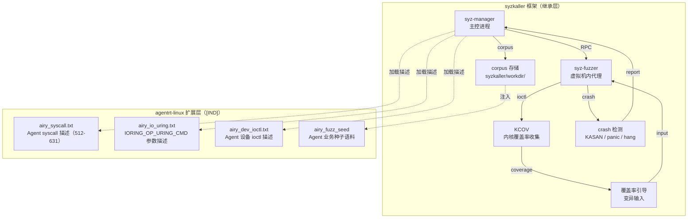

Copyright (c) 2025-2026 SPHARX Ltd. All Rights Reserved.

# agentrt-linux（AirymaxOS）模糊测试
> **文档定位**：agentrt-linux（AirymaxOS）测试工程体系第 9 卷——模糊测试（Fuzz Testing）。本卷规定 syzkaller 内核模糊测试框架集成、Agent syscall（512-631 编号）模糊测试、io_uring IORING_OP_URING_CMD 参数模糊、Agent 设备驱动 ioctl 参数模糊、持续模糊测试 CI 集成与长时间运行策略。\
> **文档版本**：v1.0.1\
> **最后更新**：2026-07-18\
> **上级文档**：[80-testing README](README.md)\
> **同源映射**：agentrt 7 层验证 L9（模糊测试）+ Linux 6.6 内核基线 syzkaller 框架、KCOV 覆盖率引导\
> **理论根基**：Linux 6.6 内核基线模糊测试思想 + Airymax 五维正交 24 原则（E-8 可测试性 / S-1 反馈闭环 / A-4 完美主义）\
> **核心约束**：IRON-9 v3 [IND] 独立实现层——agentrt-linux 专属 syscall 描述以独立 `airy_*.txt` 形式注入 syzkaller，禁止改写上游 `sys/linux/*.txt`；CI 持续模糊测试必须覆盖 120 个 Agent syscall（编号 512-631）。

---

## 0. 章节定位

本卷是 agentrt-linux 测试工程 10 主题文档中的第 9 卷，回答"输入边界怎么测"。它在 08-agent-contract-testing（Agent 行为契约测试）与 10-formal-verification（形式化验证）之间形成模糊测试层：

- **上游依赖**：README 定义"测试体系分层"——L9 模糊测试由本卷展开；50-engineering-standards/06-toolchain-and-automation 定义"7 层验证"——本卷对应第 15 层（模糊测试层）。
- **下游依赖**：10-formal-verification 定义"形式化验证怎么做"——本卷的模糊测试发现的缺陷是形式化验证属性集的输入。

本卷所有强制规则均赋予 **OS-TEST** / **OS-KER** / **OS-STD** 编号，与 07 维护者制度的"规则编号注册表"对齐。

### 0.1 关键术语

| 术语 | 定义 |
|------|------|
| syzkaller | Linux 内核模糊测试框架，由 Google Dmitry Vyukov 创建 |
| KCOV | 内核覆盖率收集机制，为 syzkaller 提供覆盖率引导 |
| syscall 描述 | syzkaller 的 `.txt` 文件，描述 syscall 签名与参数类型 |
| Agent syscall | agentrt-linux 专属 syscall，编号 512-631，共 120 个 |
| `IORING_OP_URING_CMD` | io_uring 命令操作码，IPC fastpath 路径 |
| `fuzzing corpus` | 模糊测试输入语料库 |
| `crash` | 模糊测试触发的内核崩溃（KASAN 报告 / panic / hang） |
| ` airy_fuzz_*` | agentrt-linux 专属模糊测试扩展 |

---

## 1. 模糊测试模型总览

### 1.1 起源与定位

内核模糊测试是 Linux 6.6 内核基线中"通过随机输入发现内核漏洞"的机制。其设计目标有三：**自动化发现**（无需人工设计测试用例）、**覆盖率引导**（KCOV 反馈覆盖率，引导输入变异）、**持续运行**（7×24 小时运行，发现偶发缺陷）。

agentrt-linux 完整继承 Linux 6.6 内核基线的 syzkaller 模糊测试框架（`syzkaller/`、KCOV 覆盖率引导），不修改任何上游源文件。agentrt-linux 专属 syscall 描述以独立 `airy_*.txt` 文件形式驻留于 `syzkaller/sys/airymaxos/`，遵循 IRON-9 v3 [IND] 独立实现层原则。



### 1.2 模糊测试运行载体

| 载体 | 配置 | 适用场景 | 性能 |
|------|------|---------|------|
| 开发者本地 | 单 VM + KASAN | 即时反馈 | 1000-5000 exec/s |
| CI PR | 短时（10 分钟） | PR 阶段快速验证 | 5000-10000 exec/s |
| CI 持续 | 7×24 小时多 VM | 持续模糊测试 | 50000+ exec/s |
| syzbot 公开实例 | 公共集群 | 大规模社区发现 | 100000+ exec/s |

**OS-TEST-100**：CI PR 阶段必须运行 10 分钟短时模糊测试，覆盖 120 个 Agent syscall；任一 crash 即阻断 PR。

**OS-KER-160**：CI 持续模糊测试必须 7×24 小时运行，至少 4 个并发 VM，覆盖 120 Agent syscall + io_uring + ioctl；任一 crash 自动创建 critical issue。

---

## 2. syzkaller：内核模糊测试框架

### 2.1 syzkaller 工作原理

syzkaller 由 Google 的 Dmitry Vyukov 创建，是 Linux 内核官方模糊测试框架。其核心能力：

| 能力 | 机制 | 说明 |
|------|------|------|
| 覆盖率引导 | KCOV | 收集每次 syscall 执行的内核 PC，引导变异 |
| 系统调用描述 | `.txt` 文件 | 描述 syscall 签名，syzkaller 据此生成有效输入 |
| 语料库管理 | `workdir/corpus.db` | 持久化有效输入，跨运行复用 |
| 多 VM 并行 | qemu 集群 | 多 VM 并发执行，提高吞吐 |
| crash 检测 | KASAN / panic / hang | 自动检测内核崩溃并复现 |
| crash 复现 | `syz-repro` | 最小化复现用例 |

### 2.2 syzkaller 配置

```yaml
# syzkaller.cfg
{
    "target": "linux/amd64",
    "http":   "127.0.0.1:56741",
    "workdir": "/syzkaller/workdir",
    "syzkaller": "/syzkaller",
    "image":  "/syzkaller/image/disk.img",
    "kernel_obj": "/linux/build",
    "kernel_src": "/linux",
    
    "type": "qemu",
    "vm": {
        "count":  4,
        "cpu":    2,
        "mem":    2048,
        "kernel": "/linux/build/arch/x86/boot/bzImage",
        "cmdline": "console=ttyS0 kcov.enable=1 airy_selftest=off"
    },
    
    "enable_syscalls": [
        "airy_*",                  # 所有 Agent syscall
        "io_uring_setup",
        "io_uring_enter",
        "io_uring_register",
        "ioctl$AIRY_DEV_*"         # Agent 设备 ioctl
    ],
    
    "sandbox": "none",
    "cover":   true,
    "repro":   true,
    
    "suppressions": ["syzkaller/suppressions/airy_known_issues.txt"]
}
```

### 2.3 KCOV 覆盖率收集

```kconfig
# airy_fuzz_defconfig
CONFIG_KCOV=y
CONFIG_KCOV_ENABLE_COMPARISONS=y
CONFIG_KCOV_INSTRUMENT_ALL=y
CONFIG_KASAN=y
CONFIG_KASAN_GENERIC=y
CONFIG_DEBUG_INFO=y
CONFIG_KALLSYMS=y
CONFIG_KALLSYMS_ALL=y
```

---

## 3. Agent syscall 模糊测试（512-631 编号）

### 3.1 Agent syscall 编号分配

agentrt-linux 在 syscall 表中保留编号 512-631，共 120 个 Agent 专属 syscall：

```c
/* include/uapi/linux/airymax/syscall.h（[SC] 共享契约层） */
#ifndef _UAPI_AIRY_SYSCALL_H
#define _UAPI_AIRY_SYSCALL_H

#define __NR_airy_agent_create        512
#define __NR_airy_agent_destroy       513
#define __NR_airy_agent_start         514
#define __NR_airy_agent_stop          515
#define __NR_airy_agent_kill          516
#define __NR_airy_agent_state_get     517
#define __NR_airy_agent_state_set     518
#define __NR_airy_token_consume       519
#define __NR_airy_token_budget_get    520
#define __NR_airy_token_budget_set    521
#define __NR_airy_mem_read            522
#define __NR_airy_mem_write           523
#define __NR_airy_mem_quota_get       524
#define __NR_airy_mem_quota_set       525
#define __NR_airy_ipc_send            526
#define __NR_airy_ipc_recv            527
#define __NR_airy_ipc_bind            528
#define __NR_airy_ipc_unbind          529
/* ... 共 120 个，编号 512-631 ... */
#define __NR_airy_last                631

#endif /* _UAPI_AIRY_SYSCALL_H */
```

### 3.2 syzkaller syscall 描述

`syzkaller/sys/airymaxos/airy_syscall.txt` 描述 120 个 Agent syscall：

```
# syzkaller/sys/airymaxos/airy_syscall.txt
# agentrt-linux Agent syscall 描述（编号 512-631）

include <uapi/airymax/syscall.h>
include <uapi/airymax/agent.h>
include <uapi/airymax/ipc.h>

# Agent 生命周期管理
resource airy_agent_fd[int32]

airy_agent_create(flags flags[AIRY_AGENT_CREATE_FLAGS], 
                  optdata AIRY_AGENT_CREATE_OPT) airy_agent_fd
airy_agent_destroy(fd airy_agent_fd)
airy_agent_start(fd airy_agent_fd, opts ptr[in airy_agent_start_opts, opt])
airy_agent_stop(fd airy_agent_fd, reason flags[AIRY_AGENT_STOP_REASON])
airy_agent_kill(pid int32, signal int32[0:65])

# Agent 状态管理
airy_agent_state_get(fd airy_agent_fd) int32[AIRY_AGENT_STATE_INACTIVE:AIRY_AGENT_STATE_DEAD]
airy_agent_state_set(fd airy_agent_fd, state int32[AIRY_AGENT_STATE_INACTIVE:AIRY_AGENT_STATE_DEAD])

# Token 预算管理
airy_token_consume(fd airy_agent_fd, delta int64) int64
airy_token_budget_get(fd airy_agent_fd) airy_token_budget
airy_token_budget_set(fd airy_agent_fd, budget int64)

# 记忆管理
airy_mem_read(fd airy_agent_fd, level int32[AIRY_MEM_L1:AIRY_MEM_L4], 
              offset int64, buf ptr[out, array[int8]], len int32)
airy_mem_write(fd airy_agent_fd, level int32[AIRY_MEM_L1:AIRY_MEM_L4],
               offset int64, buf ptr[in, array[int8]], len int32)

# IPC 管理
airy_ipc_send(target_pid int32, msg ptr[in airy_ipc_msg], len int32)
airy_ipc_recv(src_pid int32[0:65535], buf ptr[out, array[int8]], len int32)
airy_ipc_bind(channel int32[0:1024], flags flags[AIRY_IPC_BIND_FLAGS])
airy_ipc_unbind(channel int32[0:1024])

# 类型定义
airy_ipc_msg {
    magic   int32[0xA1B2C3D4]
    type    int32[0:255]
    seq     int32
    payload array[int8, 0:4096]
}

airy_agent_start_opts {
    sched_policy  int32[0:2]   # SCHED_NORMAL / SCHED_FIFO / SCHED_DEADLINE
    sched_priority int32[0:99]
    runtime_ns     int64
    deadline_ns    int64
    period_ns      int64
}

airy_token_budget {
    total     int64
    consumed  int64
    remaining int64
}

AIRY_AGENT_CREATE_FLAGS = AIRY_AGENT_CREATE_TOKEN_INHERIT, AIRY_AGENT_CREATE_MEM_ISOLATE
AIRY_AGENT_STOP_REASON  = AIRY_AGENT_STOP_NORMAL, AIRY_AGENT_STOP_FORCE, AIRY_AGENT_STOP_TIMEOUT
AIRY_IPC_BIND_FLAGS     = AIRY_IPC_BIND_RECV, AIRY_IPC_BIND_SEND, AIRY_IPC_BIND_MULTICAST
```

### 3.3 模糊测试策略

syzkaller 基于 `airy_syscall.txt` 生成随机 syscall 序列，例如：

```
# 生成的 syscall 序列示例
airy_agent_create(0, {}) = 3
airy_token_budget_set(3, 1000)
airy_token_consume(3, 1500)  # 溢出！应返回 -AIRY_ERR_TOKEN_OVERFLOW
airy_agent_state_set(3, AIRY_AGENT_STATE_RUNNING)  # 可能触发契约违反
airy_agent_destroy(3)
```

**OS-TEST-101**：syzkaller 必须覆盖全部 120 个 Agent syscall；CI PR 阶段运行 10 分钟后，通过 `syzkaller/workdir/corpus.db` 验证覆盖率，至少 80% 的 Agent syscall 被至少一次调用。

**OS-TEST-102**：模糊测试发现的任何契约违反（如 Agent 在 Token 溢出后未进入 STOPPING 状态）即视为系统级缺陷，自动创建 critical issue 并阻断 PR。

---

## 4. io_uring 模糊测试

### 4.1 IORING_OP_URING_CMD 参数模糊

`IORING_OP_URING_CMD` 是 agentrt-linux IPC fastpath 的核心操作码，syzkaller 必须对其参数进行模糊：

```
# syzkaller/sys/airymaxos/airy_io_uring.txt
include <uapi/linux/io_uring.h>
include <uapi/airymax/ipc.h>

# io_uring setup
io_uring_setup(entries int32[1:1024], params ptr[in io_uring_params]) fd_uring

# io_uring enter（触发 IORING_OP_URING_CMD）
io_uring_enter$airy_cmd(fd fd_uring, to_submit int32, min_complete int32, 
                        flags flags[IO_URING_ENTER_FLAGS], sig ptr[in, sigset], 
                        sz int32) int32

# IORING_OP_URING_CMD 的 SQE 描述
io_uring_sqe$airy_cmd {
    opcode  const[IORING_OP_URING_CMD, int8]
    flags   flags[IOSQE_FLAGS]
    fd      fd
    union {
        airy_cmd_op  int32[AIRY_CMD_OP_MIN:AIRY_CMD_OP_MAX]
        airy_cmd_arg array[int8, 0:256]
    }
}

AIRY_CMD_OP_MIN = 0
AIRY_CMD_OP_MAX = 63  # 64 个 IPC 命令操作码
```

### 4.2 模糊测试重点参数

| 参数 | 模糊策略 | 预期行为 |
|------|---------|---------|
| `airy_cmd_op` | 随机 0-63 + 边界值（0, 63, 64, -1） | 非法 op 返回 -EINVAL |
| `airy_cmd_arg` 长度 | 随机 0-4096 + 边界值 | 超 256 字节返回 -E2BIG |
| `airy_cmd_arg` 内容 | 随机字节 + 模糊 magic | 错误 magic 返回 -EINVAL |
| `fd` | 随机 fd + 已关闭 fd | 非法 fd 返回 -EBADF |
| 并发提交 | 多线程同时提交 | 无死锁，无数据竞争 |

**OS-TEST-103**：io_uring 模糊测试必须覆盖 `IORING_OP_URING_CMD` 的所有 64 个命令操作码（0-63）；CI PR 阶段运行后，通过 KCOV 验证 fastpath 路径覆盖率 ≥ 90%。

---

## 5. Agent 设备驱动模糊测试

### 5.1 ioctl 参数模糊

agentrt-linux 暴露多个 Agent 设备文件（`/dev/airy_agent` / `/dev/airy_ipc` / `/dev/airy_mem` / `/dev/airy_sched`），通过 ioctl 接口管理。syzkaller 必须对 ioctl 参数进行模糊：

```
# syzkaller/sys/airymaxos/airy_dev_ioctl.txt
include <uapi/airymax/dev.h>

# /dev/airy_agent 设备
openat$airy_agent(fd const[AT_FDCWD], file const["/dev/airy_agent"],
                  mode const[O_RDWR]) fd_airy_agent

ioctl$AIRY_AGENT_SPAWN(fd fd_airy_agent, cmd const[AIRY_AGENT_IOC_SPAWN], 
                       arg ptr[in, airy_agent_spawn_args])
ioctl$AIRY_AGENT_QUERY(fd fd_airy_agent, cmd const[AIRY_AGENT_IOC_QUERY],
                       arg ptr[out, airy_agent_query_result])
ioctl$AIRY_AGENT_STOP(fd fd_airy_agent, cmd const[AIRY_AGENT_IOC_STOP],
                      arg ptr[in, airy_agent_stop_args])

# /dev/airy_ipc 设备
openat$airy_ipc(fd const[AT_FDCWD], file const["/dev/airy_ipc"],
                mode const[O_RDWR]) fd_airy_ipc

ioctl$AIRY_IPC_SEND(fd fd_airy_ipc, cmd const[AIRY_IPC_IOC_SEND],
                    arg ptr[in, airy_ipc_send_args])
ioctl$AIRY_IPC_BIND(fd fd_airy_ipc, cmd const[AIRY_IPC_IOC_BIND],
                    arg ptr[in, airy_ipc_bind_args])

# /dev/airy_mem 设备
openat$airy_mem(fd const[AT_FDCWD], file const["/dev/airy_mem"],
                mode const[O_RDWR]) fd_airy_mem

ioctl$AIRY_MEM_ALLOC(fd fd_airy_mem, cmd const[AIRY_MEM_IOC_ALLOC],
                     arg ptr[in, airy_mem_alloc_args])
ioctl$AIRY_MEM_MMAP(fd fd_airy_mem, cmd const[AIRY_MEM_IOC_MMAP],
                    arg ptr[in, airy_mem_mmap_args])

# 参数类型定义
airy_agent_spawn_args {
    token_budget int64[0:1000000000]
    mem_quota_l1 int32
    mem_quota_l2 int32
    mem_quota_l3 int32
    mem_quota_l4 int32
    sched_policy int32[0:2]
    name         string[airy_agent_names, 32]
}

airy_agent_names = "alice", "bob", "charlie", "dave", "eve", "frank"

airy_ipc_send_args {
    target_pid int32[0:65535]
    msg_type   int32[0:255]
    msg_seq    int32
    payload    array[int8, 0:4096]
}
```

### 5.2 ioctl 模糊测试重点

| ioctl 命令 | 模糊策略 | 预期行为 |
|-----------|---------|---------|
| `AIRY_AGENT_IOC_SPAWN` | 极大 token_budget / 极小 mem_quota | 边界值返回 -EINVAL |
| `AIRY_IPC_IOC_SEND` | target_pid=0 / 65535 / 自身 | 非法 pid 返回 -ESRCH |
| `AIRY_MEM_IOC_ALLOC` | size=0 / size=16GB | 0 返回 -EINVAL，过大返回 -ENOMEM |
| `AIRY_MEM_IOC_MMAP` | offset 非对齐 / 长度越界 | 非对齐返回 -EINVAL |

**OS-TEST-104**：Agent 设备 ioctl 模糊测试必须覆盖 4 个设备文件（`/dev/airy_agent` / `/dev/airy_ipc` / `/dev/airy_mem` / `/dev/airy_sched`）的全部 ioctl 命令；任一 ioctl 触发 KASAN 报告即视为 critical 缺陷。

---

## 6. 持续模糊测试：CI 集成

### 6.1 `continuous-fuzzing` workflow

```yaml
# .github/workflows/continuous-fuzzing.yml
name: continuous-fuzzing
on:
  schedule:
    - cron: "0 * * * *"  # 每小时触发
  workflow_dispatch: {}

jobs:
  pr-fuzz-short:
    if: github.event_name == 'pull_request'
    runs-on: ubuntu-24.04
    timeout-minutes: 15
    steps:
      - uses: actions/checkout@v4
      - name: Build kernel with airy_fuzz_defconfig
        run: |
          make ARCH=um defconfig airy_fuzz_defconfig
          make ARCH=um -j$(nproc)
      - name: Build syzkaller
        run: |
          git clone https://github.com/google/syzkaller.git /tmp/syzkaller
          cd /tmp/syzkaller && make -j$(nproc)
      - name: Run 10-minute short fuzzing
        run: |
          /tmp/syzkaller/bin/syz-manager -config syzkaller.cfg \
            -mode=short-fuzz -duration=10m 2>&1 | tee fuzz.log
      - name: Check for crashes
        run: |
          crashes=$(find /syzkaller/workdir/crashes -type d | wc -l)
          if [ "$crashes" -gt 0 ]; then
            echo "::error::Short fuzzing found $crashes crashes"
            ls /syzkaller/workdir/crashes/
            exit 1
          fi

  continuous-fuzz:
    if: github.event_name == 'schedule'
    runs-on: ubuntu-24.04-large
    timeout-minutes: 1440  # 24 小时
    steps:
      - uses: actions/checkout@v4
      - name: Build kernel with airy_fuzz_defconfig
        run: |
          make ARCH=um defconfig airy_fuzz_defconfig
          make ARCH=um -j$(nproc)
      - name: Build syzkaller
        run: |
          git clone https://github.com/google/syzkaller.git /tmp/syzkaller
          cd /tmp/syzkaller && make -j$(nproc)
      - name: Run continuous fuzzing (4 VMs, 24 hours)
        run: |
          /tmp/syzkaller/bin/syz-manager -config syzkaller.cfg 2>&1 | tee fuzz.log &
          FUZZ_PID=$!
          sleep 86400  # 24 小时
          kill $FUZZ_PID
      - name: Check for crashes
        run: |
          crashes=$(find /syzkaller/workdir/crashes -type d | wc -l)
          echo "Found $crashes crashes in 24-hour continuous fuzzing"
          if [ "$crashes" -gt 0 ]; then
            for crash_dir in /syzkaller/workdir/crashes/*; do
              echo "::error::Crash: $(basename $crash_dir)"
              cat $crash_dir/description
              cat $crash_dir/log | head -100
            done
            exit 1
          fi
      - name: Upload corpus
        if: always()
        uses: actions/upload-artifact@v4
        with:
          name: fuzz-corpus
          path: /syzkaller/workdir/corpus.db
```

### 6.2 crash 处理流程

| crash 类型 | 自动响应 | 人工介入 |
|-----------|---------|---------|
| KASAN 报告 | 自动创建 critical issue，附 KASAN 报告 + 复现用例 | 24 小时内修复 |
| panic | 自动创建 critical issue，附 panic 栈 | 12 小时内修复 |
| hang（超时） | 自动创建 issue，附 hung task 栈 | 48 小时内修复 |
| 数据竞争（KCSAN） | 自动创建 issue，附 race 双方栈 | 72 小时内修复 |
| 契约违反 | 自动创建 critical issue，附契约 ID + 复现用例 | 12 小时内修复 |

**OS-STD-111**：syzkaller 发现的 crash 必须通过 `syz-repro` 工具生成最小化复现用例，附至 issue；无最小化复现用例的 issue 不予处理。

**OS-TEST-105**：持续模糊测试每小时检查一次 crash 数；连续 24 小时无 crash 即视为"模糊测试稳定"，标记为 nightly 通过；连续 2 小时发现 ≥ 5 个 crash 即暂停 PR 合入（仅 critical fix 例外）。

### 6.3 语料库管理

syzkaller 语料库（`workdir/corpus.db`）跨运行持久化，包含历史发现的有效输入：

- **种子语料**：agentrt-linux 提供 `airy_fuzz_seed/` 包含业务典型 syscall 序列（如完整 Agent 生命周期）。
- **变异语料**：syzkaller 基于种子变异生成新输入，扩展覆盖率。
- **跨运行复用**：每次运行结束后语料库自动上传至 artifact，下次运行下载复用。

**OS-STD-112**：种子语料 `airy_fuzz_seed/` 必须包含至少 20 个典型 Agent 业务场景（spawn/stop / IPC 通信 / 记忆读写 / Token 消耗）；每个场景作为独立 `.syz` 文件，由 agentrt-linux 业务专家维护。

---

## 7. 与上下游测试层的协作

### 7.1 与 04-dynamic-analysis 的关系

04 卷的动态分析（KASAN/KCSAN/lockdep）为 syzkaller 提供运行时检测能力；本卷的模糊测试是动态分析的"输入源"——通过随机输入触发 KASAN/KCSAN/lockdep 报告。

二者必须协同启用：

- `airy_fuzz_defconfig` 必须同时启用 KASAN + KCSAN + lockdep + KCOV。
- syzkaller 发现的 KASAN 报告即视为模糊测试 crash。

### 7.2 与 06-coverage-metrics 的关系

06 卷的 KCOV 覆盖率是 syzkaller 覆盖率引导的基础；本卷的模糊测试扩展 KCOV 覆盖率，发现新的代码路径。Codecov 报告中包含"syzkaller 覆盖率"指标：

| 指标 | 计算方式 | 门槛 |
|------|---------|------|
| syzkaller 覆盖率 | syzkaller 触发的 KCOV PC 数 / 总 PC 数 | ≥ 70% |
| Agent syscall 覆盖率 | 被 syzkaller 调用的 Agent syscall 数 / 120 | ≥ 80% |
| IPC fastpath 覆盖率 | fastpath 路径被 syzkaller 触发的比例 | ≥ 90% |

### 7.3 与 08-agent-contract-testing 的关系

08 卷的契约定义是模糊测试的"正确性基线"——模糊测试发现的契约违反即视为系统缺陷。`airy_agent_contract_violation` tracepoint 在模糊测试中实时监控契约违反。

### 7.4 与 10-formal-verification 的关系

10 卷的形式化验证证明代码无特定类型的缺陷；本卷的模糊测试发现形式化验证范围外的缺陷。二者互补：形式化验证覆盖"可证明"的属性，模糊测试覆盖"经验性"的属性。

---

## 8. syzbot 公开实例集成

### 8.1 上游 syzbot 集成

agentrt-linux 计划在 v1.1 版本接入 Google syzbot 公开实例（`syzkaller.appspot.com`），将 agentrt-linux 内核作为 syzbot 的一个 instance：

- **instance 名称**：`airymaxos`
- **kernel 配置**：`airy_fuzz_defconfig`（含 KASAN + KCOV）
- **syscall 描述**：`syzkaller/sys/airymaxos/airy_*.txt`
- **crash 上报**：syzbot 自动上报至 `airymaxos@syzkaller.appspot.com`

**OS-TEST-106**：接入 syzbot 后，agentrt-linux 必须在 72 小时内响应 syzbot 上报的 crash；超时未响应的 crash 自动升级至维护者委员会复议。

---

## 9. 维护者制度与版本演进

### 9.1 规则编号注册表

本卷强制规则编号 `OS-TEST-100` ~ `OS-TEST-106`、`OS-KER-160`、`OS-STD-111` ~ `OS-STD-112`，已注册至 50-engineering-standards/07 维护者制度的"规则编号注册表"。

### 9.2 v1.0.1 新增内容

1. syzkaller 模糊测试框架集成（配置 / KCOV / 覆盖率引导）。
2. 120 个 Agent syscall（编号 512-631）的 syzkaller 描述。
3. `IORING_OP_URING_CMD` 参数模糊测试。
4. Agent 设备驱动 ioctl 参数模糊测试。
5. `continuous-fuzzing` workflow（PR 短时 + 持续 24 小时）。
6. crash 处理流程与语料库管理。

### 9.3 后续版本规划

- v1.1：接入 syzbot 公开实例。
- v1.2：新增 `airy_fuzz_structured`（结构化模糊测试，基于 Agent 业务场景）。
- v1.3：与 10-formal-verification 联动，将形式化验证的反例作为模糊测试种子。

---

## 10. 相关文档

- [80-testing README](README.md)：测试体系主索引（v1.0），定义 L9 模糊测试分层
- [04-dynamic-analysis.md](04-dynamic-analysis.md)：动态分析（KASAN/KCSAN/lockdep 提供检测能力）
- [06-coverage-metrics.md](06-coverage-metrics.md)：覆盖率度量（KCOV 覆盖率引导）
- [08-agent-contract-testing.md](08-agent-contract-testing.md)：Agent 行为契约测试（契约违反监控）
- [10-formal-verification.md](10-formal-verification.md)：形式化验证（互补关系）
- [../20-modules/08-tests-linux.md](../20-modules/08-tests-linux.md)：tests-linux 子仓设计
- [../70-build-system/03-ci-cd-pipeline.md](../70-build-system/03-ci-cd-pipeline.md)：CI/CD 流水线
- [../110-security/README.md](../110-security/README.md)：安全测试（漏洞发现）

---

## 11. 参考材料

- syzkaller 项目：<https://github.com/google/syzkaller>
- syzbot 公开实例：<https://syzkaller.appspot.com>
- Linux 6.6 `Documentation/dev-tools/kcov.rst`（KCOV 文档）
- Vyukov 等《Syzkaller: A Sound, Non-Intrusive Linux Kernel Fuzzer》（syzkaller 论文）
- Linux 6.6 `Documentation/dev-tools/kasan.rst`（KASAN 文档）

---

## 12. 版本历史

| 版本 | 日期 | 变更 |
|------|------|------|
| v1.0.1 | 2026-07-18 | 初始版本：定义 syzkaller 模糊测试框架集成与 KCOV 覆盖率引导；定义 120 个 Agent syscall（512-631）的 syzkaller 描述；定义 IORING_OP_URING_CMD 参数模糊与 Agent 设备 ioctl 参数模糊；定义 `continuous-fuzzing` workflow（PR 短时 + 持续 24 小时）与 crash 处理流程 |

---

## 13. v1.1 Capability Folding Fuzz 用例（v1.1 增量补强）

> **补强背景**：80-testing/ 现有 §1-§12 覆盖 120 个 Agent syscall（512-631）的通用 syzkaller 描述，但未针对 v1.1 Capability Folding 架构引入的攻击面（64-bit Badge 格式 `Epoch<<48 | RandomTag<<16 | Perms`、`agent_caps[1024]` 静态数组、SQE128 fastpath 路径）进行专项 fuzz。本章节定义 v1.1 Capability Folding 专属 fuzz 矩阵、syzkaller 描述、CI 集成与门槛，作为 §1-§12 的增量补强，不替换现有任何内容。

### 13.1 攻击面与 fuzz 矩阵

v1.1 Capability Folding 引入三类新攻击面，每类对应一个 fuzz 用例集：

| 用例集 | 攻击面 | 输入空间 | 期望失败模式 | 关联模块 |
|--------|--------|---------|------------|---------|
| F-BADGE-1 | Badge 64-bit 格式伪造 | `Epoch∈[0,2^16)`、`RandomTag∈[0,2^32)`、`Perms∈[0,2^16)` | `airy_cap_badge_ok()` 拒绝非法 Badge，返回 `-EACCES` | `kernel/airymaxos/cap/` |
| F-SQE128-1 | malformed SQE128 fastpath 输入 | `cmd_op` 越界、`addr` 未对齐、`len` 超过 `agent_caps[]` 容量 | fastpath 返回 `-EINVAL`，slowpath LSM 钩子接管 | `kernel/airymaxos/ipc/airy_ipc_fastpath.c` |
| F-CAPS-1 | `agent_caps[1024]` 越界访问 | `cap_idx∈[0, 4096)`（覆盖越界 1024-4095） | `agent_caps[]` 边界检查拒绝越界索引，返回 `-ERANGE` | `kernel/airymaxos/cap/airy_cap_cache.c` |

### 13.2 Badge 伪造 fuzz（F-BADGE-1）

Badge 64-bit 格式 `Badge = Epoch<<48 | RandomTag<<16 | Perms`，攻击者可能构造以下伪造输入：

- **Epoch 不匹配**：`Badge.Epoch ≠ agent_caps[idx].epoch`（撤销后旧 Badge 重放）。
- **RandomTag 猜测**：暴力枚举 2^32 空间尝试匹配合法 `agent_caps[idx].random_tag`。
- **Perms 越权**：`Badge.Perms` 包含 `agent_caps[idx].perms` 未授权的权限位。
- **全 0 Badge**：`Badge = 0`（非法 sentinel）。
- **全 1 Badge**：`Badge = 0xFFFFFFFFFFFFFFFF`（边界值）。

KUnit 伪代码（`kernel/airymaxos/cap/airy_cap_badge_fuzz_test.c`）：

```c
/* kernel/airymaxos/cap/airy_cap_badge_fuzz_test.c */
#include <kunit/test.h>
#include <uapi/airymax/cap.h>

/* Fuzz 1：Epoch 不匹配必须被拒绝 */
KUNIT_DEFINE_TEST(airy_cap_badge_fuzz_epoch_mismatch)
{
    struct kunit *test = kunit_current;
    struct airy_cap_entry entry = {
        .epoch = 0x1234,
        .random_tag = 0xDEADBEEF,
        .perms = AIRY_CAP_PERM_READ,
    };
    /* 构造 Badge：RandomTag 与 Perms 匹配，但 Epoch 不匹配 */
    u64 forged_badge = ((u64)(entry.epoch + 1) << 48) |
                       ((u64)entry.random_tag << 16) |
                       (entry.perms & 0xFFFF);
    int ret = airy_cap_badge_ok(forged_badge, &entry);
    KUNIT_EXPECT_EQ(test, -EACCES, ret);
}

/* Fuzz 2：RandomTag 暴力枚举（采样验证，不做全 2^32 遍历） */
KUNIT_DEFINE_TEST(airy_cap_badge_fuzz_random_tag_brute)
{
    struct kunit *test = kunit_current;
    struct airy_cap_entry entry = {
        .epoch = 0x1, .random_tag = 0xCAFEBABE, .perms = AIRY_CAP_PERM_READ,
    };
    int reject_count = 0;
    /* 采样 1024 个错误 RandomTag，全部应被拒绝 */
    for (int i = 0; i < 1024; i++) {
        u32 wrong_tag = entry.random_tag ^ (i * 0x9E3779B1u);
        u64 badge = ((u64)entry.epoch << 48) | ((u64)wrong_tag << 16) | entry.perms;
        if (airy_cap_badge_ok(badge, &entry) == -EACCES)
            reject_count++;
    }
    KUNIT_EXPECT_EQ(test, 1024, reject_count);  /* 100% 拒绝 */
}

/* Fuzz 3：Perms 越权必须被拒绝 */
KUNIT_DEFINE_TEST(airy_cap_badge_fuzz_perms_escalation)
{
    struct kunit *test = kunit_current;
    struct airy_cap_entry entry = {
        .epoch = 0x1, .random_tag = 0x1234,
        .perms = AIRY_CAP_PERM_READ,  /* 仅 READ 权限 */
    };
    /* 构造 Badge：包含 WRITE 权限（越权） */
    u64 forged_badge = ((u64)entry.epoch << 48) |
                       ((u64)entry.random_tag << 16) |
                       (AIRY_CAP_PERM_READ | AIRY_CAP_PERM_WRITE);
    int ret = airy_cap_badge_ok(forged_badge, &entry);
    KUNIT_EXPECT_EQ(test, -EACCES, ret);
}

/* Fuzz 4：边界值（全 0 / 全 1）必须被拒绝 */
KUNIT_DEFINE_TEST(airy_cap_badge_fuzz_boundary_values)
{
    struct kunit *test = kunit_current;
    struct airy_cap_entry entry = {
        .epoch = 0x1, .random_tag = 0x1234, .perms = AIRY_CAP_PERM_READ,
    };
    KUNIT_EXPECT_EQ(test, -EACCES, airy_cap_badge_ok(0, &entry));
    KUNIT_EXPECT_EQ(test, -EACCES, airy_cap_badge_ok(0xFFFFFFFFFFFFFFFFULL, &entry));
}
```

### 13.3 malformed SQE128 fuzz（F-SQE128-1）

v1.1 fastpath 使用 SQE128（128 字节 SQE），`IORING_OP_URING_CMD` 的 `cmd_op` 与 `cmd[]` 字段是 fuzz 重点：

- **cmd_op 越界**：`cmd_op ≥ AIRY_URING_CMD_MAX`（如 `0xFFFF`）。
- **addr 未对齐**：`addr % 64 ≠ 0`（破坏 2-cache-line 对齐假设）。
- **len 超容**：`len > 4096`（超过 `agent_caps[]` 单次操作容量）。
- **cmd[] 内容随机**：128 字节 `cmd[]` 全随机字节流。

syzkaller 描述见 §13.5，CI 通过 KASAN + UBSAN 检测 fastpath 中的越界访问与未对齐访问。

### 13.4 `agent_caps[]` 越界 fuzz（F-CAPS-1）

`agent_caps[1024]` 静态数组的边界检查是 fuzz 重点：

- **索引 1024-4095**：立即越界，必须返回 `-ERANGE`。
- **索引 -1（0xFFFFFFFF）**：有符号转换越界。
- **并发索引竞争**：多线程同时读写不同索引（配合 KCSAN 检测数据竞争）。

KUnit 伪代码（`kernel/airymaxos/cap/airy_cap_cache_fuzz_test.c`）：

```c
/* kernel/airymaxos/cap/airy_cap_cache_fuzz_test.c */
KUNIT_DEFINE_TEST(airy_cap_cache_fuzz_oob_index)
{
    struct kunit *test = kunit_current;
    /* 索引 1024-4095 全部越界 */
    for (int i = 1024; i < 4096; i += 17) {  /* 采样 180 个越界索引 */
        int ret = airy_cap_lookup(i, NULL);
        KUNIT_EXPECT_EQ(test, -ERANGE, ret);
    }
}

KUNIT_DEFINE_TEST(airy_cap_cache_fuzz_signed_underflow)
{
    struct kunit *test = kunit_current;
    /* 有符号 -1 转 unsigned 后为 0xFFFFFFFF，越界 */
    int ret = airy_cap_lookup((unsigned int)-1, NULL);
    KUNIT_EXPECT_EQ(test, -ERANGE, ret);
}
```

### 13.5 syzkaller syz_program 完整描述

`syzkaller/sys/airymaxos/airy_cap_folding.txt`：

```
# syzkaller/sys/airymaxos/airy_cap_folding.txt
# v1.1 Capability Folding 专属 fuzz 描述

include <uapi/linux/airymax/cap.h>
include <uapi/linux/airymax/uring_cmd.h>

# Badge 伪造 fuzz：随机生成 64-bit Badge 并尝试校验
resource airy_badge_t[int64]

airy_forged_badge_compile(fd fd, badge ptr[in, airy_badge_t], cap_idx int32[0:4095]) airy_cap_result

# malformed SQE128 fuzz
airy_uring_cmd_malformed(fd fd, cmd_op int32[0:0xFFFF], cmd ptr[in, array[int8, 128]], addr int64, len int32[0:8192])

# agent_caps[] 越界 fuzz
airy_cap_oob_lookup(fd fd, cap_idx int32[0:8191]) airy_cap_result

# 类型定义
type airy_cap_result int32[0:0xFFFFFFFF]
```

种子语料 `airy_fuzz_seed/cap_folding/`：

- `badge_epoch_replay.syz`：Epoch 不匹配重放场景。
- `sqe128_cmd_op_oob.syz`：cmd_op 越界场景。
- `caps_oob_index.syz`：agent_caps[] 索引越界场景。
- `badge_perms_escalation.syz`：Perms 越权场景。
- `badge_boundary_zero.syz`：全 0 Badge 边界场景。
- `badge_boundary_ones.syz`：全 1 Badge 边界场景。

### 13.6 CI 集成与门槛

v1.1 Capability Folding fuzz 集成至现有 `continuous-fuzzing` workflow（§6.1），新增 `cap-folding-fuzz` job：

```yaml
# .github/workflows/continuous-fuzzing.yml 新增 job（增量）
  cap-folding-fuzz:
    if: github.event_name == 'schedule'
    runs-on: ubuntu-24.04-large
    timeout-minutes: 720  # 12 小时
    steps:
      - uses: actions/checkout@v4
      - name: Build with airy_fuzz_defconfig + KASAN
        run: |
          make ARCH=um defconfig airy_fuzz_defconfig
          make ARCH=um -j$(nproc)
      - name: Run cap-folding fuzz (4 VMs, 12 hours)
        run: |
          /tmp/syzkaller/bin/syz-manager -config syzkaller_cap_folding.cfg 2>&1 | tee cap_fuzz.log &
          FUZZ_PID=$!
          sleep 43200  # 12 小时
          kill $FUZZ_PID
      - name: Check for crashes
        run: |
          crashes=$(find /syzkaller/workdir/crashes -type d | wc -l)
          if [ "$crashes" -gt 0 ]; then
            echo "::error::Cap-folding fuzz found $crashes crashes"
            for d in /syzkaller/workdir/crashes/*; do
              echo "::error::Crash: $(basename $d)"
              cat $d/description
            done
            exit 1
          fi
```

**OS-TEST-107**：CI 持续模糊测试（`cap-folding-fuzz` job）必须 7×24 小时运行，覆盖 F-BADGE-1 / F-SQE128-1 / F-CAPS-1 三类攻击面；任一 crash（KASAN 报告 / panic / -ERANGE 未触发 / -EACCES 未触发）即自动创建 critical issue 并阻断 PR 合入。

**OS-TEST-108**：CI PR 阶段必须运行 KUnit 单元测试 `airy_cap_badge_fuzz_test` 与 `airy_cap_cache_fuzz_test`，覆盖率门槛遵循 06-coverage-metrics §3.2 的 A 级（`cap/` 模块 95% 行 + 95% 分支 + 100% 函数覆盖率）；任一 KUnit 失败即 PR 阻断。

**OS-KER-161**：v1.1 Capability Folding 专属 fuzz（§13）发现的 crash 视为 P0 级安全缺陷，必须在 12 小时内修复或回滚；连续 24 小时发现 ≥ 3 个同类型 crash 即暂停 release 流程，直至根因分析与修复完成。

---

> **文档结束** | agentrt-linux 测试工程体系 v1.0.1 第 9 卷 | 维护者：开源极境工程与规范委员会 | "From data intelligence emerges."
