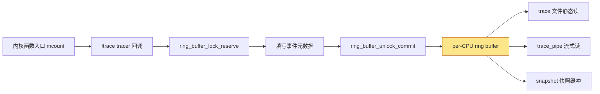
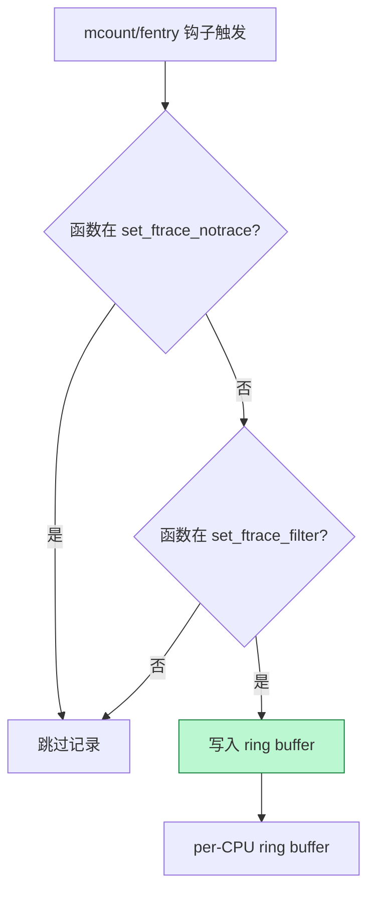
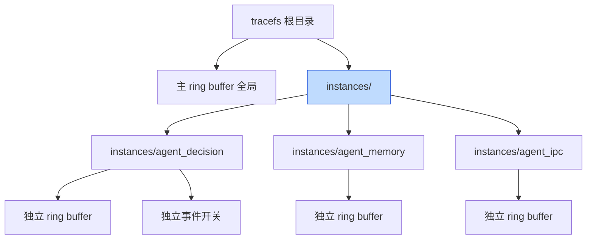
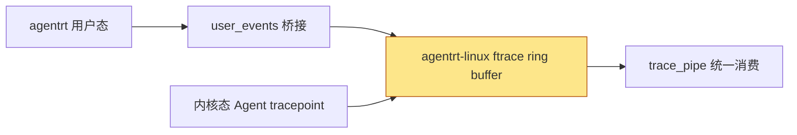
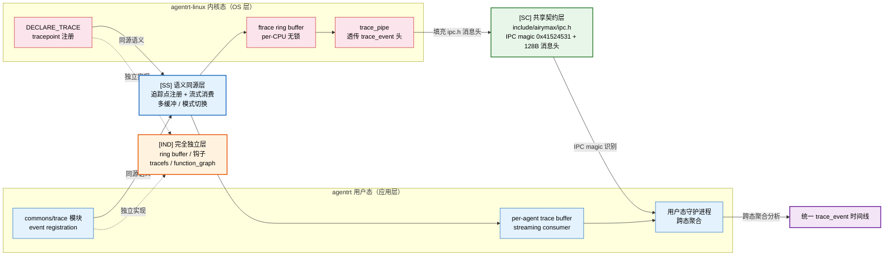

Copyright (c) 2025-2026 SPHARX Ltd. All Rights Reserved.

# agentrt-linux（AirymaxOS）ftrace 框架详解
> **文档定位**：agentrt-linux（AirymaxOS）可观测性体系 L1 层——内核函数级跟踪框架 ftrace 的工程规范\
> **文档版本**：0.1.1\
> **最后更新**：2026-07-06\
> **上级文档**：[agentrt-linux 设计文档](README.md)\
> **同源映射**：agentrt E-2 可观测性 + Linux 6.6 ftrace/tracefs/ring buffer\
> **理论根基**：Linux 6.6 内核基线 + Airymax 五维正交 24 原则 + E-2 可观测性\
> **核心约束**：IRON-9 同源且部分代码共享（IRON-9 v3）——与 agentrt 用户态可观测性同源，但内核态实现独立

---

## 目录

- [第 1 章 ftrace 框架概述](#第-1-章-ftrace-框架概述)
- [第 2 章 tracefs 挂载与目录布局](#第-2-章-tracefs-挂载与目录布局)
- [第 3 章 ring buffer 机制](#第-3-章-ring-buffer-机制)
- [第 4 章 tracer 类型与 current_tracer 控制](#第-4-章-tracer-类型与-current_tracer-控制)
- [第 5 章 trace 文件格式](#第-5-章-trace-文件格式)
- [第 6 章 ftrace 过滤器](#第-6-章-ftrace-过滤器)
- [第 7 章 ftrace 多缓冲 trace_instances](#第-7-章-ftrace-多缓冲-trace_instances)
- [第 8 章 ftrace 触发器](#第-8-章-ftrace-触发器)
- [第 9 章 ftrace 与 kallsyms 关联](#第-9-章-ftrace-与-kallsyms-关联)
- [第 10 章 agentrt-linux Agent 行为追踪扩展](#第-10-章-agentrt-linux-agent-行为追踪扩展)
- [第 11 章 五维原则映射](#第-11-章-五维原则映射)
- [第 12 章 同源 agentrt 映射](#第-12-章-同源-agentrt-映射)
- [第 13 章 相关文档与版本维护](#第-13-章-相关文档与版本维护)

---

## 第 1 章 ftrace 框架概述

### 1.1 定位

ftrace（function tracer）是 Linux 6.6 内核基线提供的官方跟踪框架。它不是单纯的函数跟踪器，而是围绕 tracefs 文件系统、ring buffer 数据通路、多种 tracer 类型、过滤器与触发器构建的可观测性工程框架。agentrt-linux 选择 ftrace 作为可观测性 L1 层，原因有三：

1. **零依赖、内核内建**：由 `CONFIG_FUNCTION_TRACER`、`CONFIG_FUNCTION_GRAPH_TRACER`、`CONFIG_DYNAMIC_FTRACE` 等 Kconfig 控制，不依赖任何用户态运行时，与 MicroCoreRT 极简内核契约天然契合。
2. **机制-策略分离**：ftrace 只提供机制（tracefs 接口、ring buffer、tracer 注册），策略由用户通过 `current_tracer` 与过滤器组合决定。
3. **可叠加**：ftrace 与 eBPF、perf 共享 ring buffer 基础设施，可在同一系统上协同工作。

**OS-OBS-001: ftrace 是 agentrt-linux 可观测性 L1 层的强制基线，不得移除或替换为第三方商业跟踪方案。**

**OS-KER-101: kernel 的 defconfig 必须开启 CONFIG_FUNCTION_TRACER、CONFIG_FUNCTION_GRAPH_TRACER、CONFIG_TRACER_MAX_TRACE、CONFIG_DYNAMIC_FTRACE。**

### 1.2 框架组成

| 组件 | 实现位置 | 职责 |
|------|----------|------|
| tracefs | `fs/tracefs/inode.c` | 文件系统接口 |
| ring buffer | `kernel/trace/ring_buffer.c` | 数据通路 |
| tracer | `kernel/trace/trace_functions.c` 等 | 跟踪策略 |
| filter | `kernel/trace/ftrace.c` | 函数过滤 |
| instances | `kernel/trace/trace.c` | 多缓冲管理 |
| trigger | `kernel/trace/trace_events_trigger.c` | 事件触发器 |

**OS-STD-001: 任何对 `kernel/trace/` 子目录的修改必须经过 ftrace 维护者审查，不得自行扩展 tracer 类型。**

---

## 第 2 章 tracefs 挂载与目录布局

### 2.1 挂载点

Linux 6.6 内核基线规定 tracefs 的标准挂载点是 `/sys/kernel/tracing`。出于向后兼容，当 debugfs 挂载时 tracefs 也会自动挂在 `/sys/kernel/debug/tracing`。agentrt-linux 遵循上游约定：

```bash
# 标准挂载（fstab 永久化）
tracefs /sys/kernel/tracing tracefs defaults 0 0
# 运行时挂载
mount -t tracefs nodev /sys/kernel/tracing
ln -s /sys/kernel/tracing /tracing
```

**OS-KER-102: kernel 必须在 init 阶段完成 tracefs 挂载，挂载失败视为致命错误并 panic。**

### 2.2 关键控制文件

| 文件 | 权限 | 用途 |
|------|------|------|
| `current_tracer` | rw | 设置或显示当前 tracer |
| `available_tracers` | r | 列出编译进内核的 tracer |
| `tracing_on` | rw | 启停 ring buffer 写入 |
| `trace` | rw | 人类可读的跟踪输出 |
| `trace_pipe` | rw | 流式跟踪输出（消费型） |
| `set_ftrace_filter` | rw | 函数过滤白名单 |
| `set_ftrace_notrace` | rw | 函数过滤黑名单 |
| `set_ftrace_pid` | rw | PID 过滤 |
| `buffer_size_kb` | rw | 每 CPU 缓冲大小 |
| `tracing_cpumask` | rw | CPU 掩码过滤 |
| `trace_clock` | rw | 时间戳时钟源 |

**OS-OBS-002: 所有 tracefs 控制文件必须以 root 权限访问；非 root 用户访问必须通过 user_events 桥接，不得直接开放 tracefs 写权限。**

---

## 第 3 章 ring buffer 机制

### 3.1 设计原理

ftrace 的核心数据通路是 ring buffer（环形缓冲区），由 `kernel/trace/ring_buffer.c` 实现。它是无锁的 per-CPU 缓冲区，每 CPU 一个独立缓冲，避免跨 CPU 锁竞争。关键设计包括：per-CPU 隔离；可变长事件（`struct ring_buffer_event`）；时间扩展条目（`TIME_EXTEND`）保证时间戳单调性；满缓冲时可覆盖最旧事件或丢弃新事件。

```c
/* kernel/trace/ring_buffer.c 中的事件头（节选） */
struct ring_buffer_event {
    u32             type_len:5, time_delta:27;
    u32             array[];
};
#define RB_EVNT_HDR_SIZE (offsetof(struct ring_buffer_event, array))
```

### 3.2 ring buffer 数据流



**OS-KER-103: ring buffer 默认大小 1408 KB/CPU（与上游一致），可通过 `buffer_size_kb` 调整；调整后必须验证无事件丢失（`cat per_cpu/cpu0/stats` 检查 `overrun`）。**

**OS-STD-002: 在 Agent 高负载场景下，ring buffer 必须扩容到至少 8192 KB/CPU，避免 Agent 决策事件被覆盖。**

### 3.3 trace_clock 选择

ring buffer 时间戳由 `trace_clock` 控制，默认 `local`（per-CPU 快速但可能跨 CPU 不同步）。agentrt-linux 在 Agent 调度分析场景推荐 `global`：

```bash
cat trace_clock     # [local] global counter x86-tsc
echo global > trace_clock
```

---

## 第 4 章 tracer 类型与 current_tracer 控制

### 4.1 五大基础 tracer

`available_tracers` 列出编译进内核的 tracer。agentrt-linux defconfig 至少启用以下五种：

| tracer | 用途 | 何时使用 |
|--------|------|----------|
| `function` | 函数调用跟踪 | 内核控制流分析 |
| `function_graph` | 函数调用图（含返回） | 调用层次与耗时分析 |
| `event`（事件子系统） | 静态 tracepoint 事件 | 子系统行为审计 |
| `hw_branches` | 硬件分支跟踪（BTB/PT） | 微架构级分支分析 |
| `nop` | 空 tracer | 占位、配置准备 |

**OS-OBS-003: `available_tracers` 必须至少包含 `function function_graph event hw_branches nop`；缺一则视为 defconfig 不合格。**

`function` tracer 依赖 `mcount`/`fentry` 钩子，配合 `CONFIG_DYNAMIC_FTRACE` 在启动时将未跟踪函数的钩子替换为 `nop`，跟踪时再恢复，实现零运行时开销。`function_graph` 在 `function` 基础上记录函数返回，可输出调用层次与耗时（如 `1) ! 2920.000 us | airy_cognition_process();`），通过 `max_graph_depth` 限制递归深度。`event` 是 tracepoint 静态埋点的集合，每个事件位于 `events/<子系统>/<事件名>/`，可独立 enable/disable。`hw_branches` 依赖架构特性（x86 BTS/LBR、ARM BRBE），仅性能调优阶段使用。`nop` 是空 tracer，不记录函数事件但仍可记录事件子系统事件，常用于配置准备。

**OS-KER-104: kernel 必须为 Agent 核心路径打 tracepoint：`agentrt:cognition_enter`、`agentrt:planner_dag_update`、`agentrt:scheduler_dispatch`、`agentrt:execution_unit_run`。**

### 4.2 current_tracer 切换语义

写入 `current_tracer` 即切换 tracer，切换会清空 ring buffer 与 snapshot 缓冲。`function` 与 `function_graph` 受 `set_ftrace_filter`/`set_ftrace_notrace` 影响；`event` 受事件级 enable 与 `set_event` 影响；`hw_branches` 与 `nop` 不受函数过滤器影响。

**OS-OBS-004: 在生产环境切换 tracer 前必须先 `echo 0 > tracing_on` 暂停写入，再切换，最后 `echo 1 > tracing_on` 恢复，避免切换瞬间丢失事件。**

**OS-STD-003: 一次只启用一个 function 系列 tracer；`function` 与 `function_graph` 不得同时启用，否则 ring buffer 会重复记录。**

```bash
# 安全切换流程
echo 0 > tracing_on
echo function_graph > current_tracer
echo 1 > tracing_on
```

---

## 第 5 章 trace 文件格式

### 5.1 头部说明

`cat trace` 输出由头部与事件行组成。头部说明列含义：

```
# tracer: function_graph
#
# entries-in-buffer/entries-written: 12345/12345   #P:4
#
#                              _-----=> irqs-off
#                             / _----=> need-resched
#                            | / _---=> hardirq/softirq
#                            || / _--=> preempt-depth
#                            ||| /     delay
#           TASK-PID   CPU#  ||||    TIMESTAMP  FUNCTION
#              | |       |   ||||       |         |
```

每条事件行字段依次为：任务名、PID、CPU 号、4 位标志（中断/抢占/软中断/抢占深度）、时间戳、函数名或事件 payload。

**OS-OBS-005: agentrt-linux Agent 行为追踪输出必须包含 4 位标志位，用于区分 Agent 决策发生在硬中断、软中断还是进程上下文。**

**OS-KER-082: Agent tracepoint 的 `print fmt` 必须以 `agent_id=0x%04x decision=%s` 起始，便于 `trace` 文件 grep 过滤。**

### 5.2 trace 与 trace_pipe 区别

| 文件 | 行为 | 适用场景 |
|------|------|----------|
| `trace` | 静态读，不消费 | 事后分析、快照 |
| `trace_pipe` | 流式读，消费型 | 实时监控、长期采集 |

`trace_pipe` 是消费型——读出后即从缓冲移除，适合长期运行的 Agent 行为审计守护进程。

---

## 第 6 章 ftrace 过滤器

### 6.1 set_ftrace_filter / set_ftrace_notrace

`set_ftrace_filter` 是函数跟踪白名单，`set_ftrace_notrace` 是黑名单。两者协同缩小跟踪范围，避免 ring buffer 淹没。当一个函数同时出现在两文件中时，`set_ftrace_notrace` 优先（即不跟踪）：

```bash
# 仅跟踪 agentrt-linux Agent 核心路径
echo 'airy_*' > set_ftrace_filter
echo '*lock*' >> set_ftrace_notrace
echo '*rcu*' >> set_ftrace_notrace
```

### 6.2 过滤器工作流



**OS-OBS-006: 生产环境启用 function tracer 时，必须配置 `set_ftrace_notrace` 排除 `*lock*`、`*rcu*`、`*tick*`、`*timer*`，避免高频内核噪声淹没 Agent 事件。**

### 6.3 模块与 PID 过滤

ftrace 支持按模块过滤：`echo ':mod:agentrt' > set_ftrace_filter` 仅跟踪 agentrt 模块；`echo '*:mod:!*' > set_ftrace_filter` 排除所有模块仅跟踪内核核心。`set_ftrace_pid` 限制只跟踪指定 PID 的线程；`set_ftrace_notrace_pid` 反之。配合 `function-fork` 选项可自动跟踪子进程：

```bash
echo 2049 > set_ftrace_pid
echo function-fork > trace_options
```

**OS-KER-083: kernel 必须导出 Agent 路径函数符号至 kallsyms，确保 `available_filter_functions` 包含 `airy_*` 前缀函数。**

---

## 第 7 章 ftrace 多缓冲 trace_instances

### 7.1 instances 机制

tracefs 根目录下的 `instances/` 子目录允许创建独立的多缓冲实例。每个实例有自己的 ring buffer、事件开关，与主缓冲及彼此隔离：

```bash
mkdir instances/agent_decision
mkdir instances/agent_memory
echo 1 > instances/agent_decision/events/agentrt/agent_decision/enable
echo 1 > instances/agent_memory/events/agentrt/memory_evict/enable
```

### 7.2 多缓冲架构



**OS-OBS-007: agentrt-linux 必须为 Token 能效、Agent 决策、记忆卷载三类观测创建独立 instances，避免相互覆盖。**

**OS-STD-004: instances 创建数量不得超过 8 个；每个 instance 的 buffer_size_kb 不得超过系统内存的 1%。**

### 7.3 内核 API

内核模块可通过 `trace_array_create()` 创建 instance，通过 `trace_array_printk()` 写入指定 instance：

```c
#include <linux/trace.h>

struct trace_array *agent_tr;

int init_agent_trace_instance(void)
{
    agent_tr = trace_array_create("agent_decision");
    if (IS_ERR(agent_tr))
        return PTR_ERR(agent_tr);
    trace_array_init_printk(agent_tr);
    return 0;
}

void log_agent_decision(u16 agent_id, const char *decision)
{
    trace_array_printk(agent_tr, _THIS_IP_,
                       "agent_id=0x%04x decision=%s\n",
                       agent_id, decision);
}
```

**OS-KER-055: kernel 的 Agent 跟踪模块必须使用 `trace_array_create()` 创建独立 instance，不得污染全局主缓冲。**

---

## 第 8 章 ftrace 触发器

### 8.1 触发器语义

ftrace 触发器允许在函数命中或事件发生时执行预定义动作，无需用户态轮询。触发器通过写入 `set_ftrace_filter`（函数级）或 `events/<...>/trigger`（事件级）注册，格式为 `<function>:<command>[:count]`。

| 命令 | 作用 | 示例 |
|------|------|------|
| `traceon`/`traceoff` | 命中时启停跟踪 | `airy_panic:traceoff` |
| `snapshot` | 命中时抓快照 | `native_flush_tlb_others:snapshot:1` |
| `enable_event`/`disable_event` | 命中时启用/禁用事件 | `try_to_wake_up:enable_event:sched:sched_switch:2` |
| `dump`/`cpudump` | 命中时全量/单 CPU dump 缓冲 | `__schedule_bug:dump` |
| `stacktrace` | 命中时记录栈回溯 | `airy_anomaly:stacktrace` |

### 8.2 Agent 异常触发器配置

**OS-OBS-008: agentrt-linux 必须为 Agent 异常路径配置触发器：`airy_panic:traceoff`、`airy_anomaly:stacktrace`、`airy_overflow:snapshot:1`。**

```bash
# Agent 异常时立即停止跟踪并抓快照
echo 'airy_panic:traceoff' > set_ftrace_filter
echo 'airy_overflow:snapshot:1' > set_ftrace_filter
echo 'airy_anomaly:stacktrace' > set_ftrace_filter
```

触发器作用于写入它的 instance。在 `instances/agent_decision/` 下注册的触发器仅作用于该 instance 的缓冲，不影响主缓冲。

**OS-STD-005: 触发器注册前必须验证函数存在于 `available_filter_functions`；不存在则记录 warning 日志但不阻塞启动。**

---

## 第 9 章 ftrace 与 kallsyms 关联

### 9.1 符号解析依赖

ftrace 输出中的函数名依赖 `/proc/kallsyms` 与内核内建符号表。当 `CONFIG_KALLSYMS=y` 时 ftrace 可将地址反解为函数名，否则只输出十六进制地址。`available_filter_functions` 列出 ftrace 可跟踪的函数，源自 `__start_mcount_loc`/`__stop_mcount_loc` 段，由 `ftrace_process_locs()` 在启动时扫描填充。两者关系：kallsyms 提供地址→名称映射；available_filter_functions 提供"已被 ftrace 改造为可跟踪"的函数集合；两者交集即为可按名过滤的函数集。

**OS-KER-084: kernel defconfig 必须开启 CONFIG_KALLSYMS、CONFIG_KALLSYMS_ALL、CONFIG_KALLSYMS_BASE_RELATIVE，确保 ftrace 输出可读。**

### 9.2 内核内 API

ftrace 提供 `register_ftrace_function()`、`ftrace_set_filter()` 等内核 API，供模块注册自定义回调：

```c
#include <linux/ftrace.h>

static void agent_hook(unsigned long ip, unsigned long parent_ip,
                       struct ftrace_ops *op, struct ftrace_regs *fregs)
{
    /* 仅记录 Agent 决策路径 */
    trace_printk("agent path: %ps <- %ps\n",
                 (void *)ip, (void *)parent_ip);
}

static struct ftrace_ops agent_ops = {
    .func   = agent_hook,
    .flags  = FTRACE_OPS_FL_SAVE_REGS_IF_SUPPORTED,
};

int register_agent_hook(void)
{
    return register_ftrace_function(&agent_ops);
}
```

**OS-KER-073: kernel 模块使用 `register_ftrace_function()` 时必须设置 `FTRACE_OPS_FL_SAVE_REGS_IF_SUPPORTED`，并为退出路径配对 `unregister_ftrace_function()`。**

---

## 第 10 章 agentrt-linux Agent 行为追踪扩展

### 10.1 设计目标

agentrt-linux 在 Linux 6.6 ftrace 基础上扩展 Agent 行为追踪能力，覆盖 Agent 决策的四个核心阶段：认知（cognition）→ 规划（planner）→ 调度（scheduler）→ 执行（execution）。这些 tracepoint 通过 AgentsIPC 128B 消息头与用户态审计守护进程对接。

### 10.2 tracepoint 注册

```c
#include <linux/tracepoint.h>

DECLARE_TRACE(agent_decision,
    TP_PROTO(u16 agent_id, const char *stage, u32 token_delta),
    TP_ARGS(agent_id, stage, token_delta));

DEFINE_TRACE(agent_decision);

void airy_cognition_process(u16 agent_id, u32 token_in)
{
    /* ... 认知处理 ... */
    trace_agent_decision(agent_id, "cognition", token_in);
}
```

### 10.3 用户态消费

```bash
# 在独立 instance 中启用 Agent 决策事件
mkdir instances/agent_decision
echo 1 > instances/agent_decision/events/agentrt/agent_decision/enable
cat instances/agent_decision/trace_pipe
```

**OS-OBS-009: Agent 行为追踪 instance 的缓冲大小必须 ≥ 16 MB/CPU，确保高并发 Agent 决策不丢失。**

**OS-OBS-010: ftrace 输出中的 Agent 决策事件必须通过 AgentsIPC 上报到 agentrt 用户态审计守护进程，不得仅落本地文件。**

### 10.4 与 MicroCoreRT 协同

MicroCoreRT 是 agentrt 的极简内核契约。agentrt-linux 的 ftrace 扩展遵循 MicroCoreRT 的"最小特权态代码"原则：所有 Agent 跟踪代码在 `kernel/trace/airy_trace.c` 单文件内，不污染核心调度路径。该设计体现 IRON-9 同源且部分代码共享（IRON-9 v3）原则——与 agentrt `commons/trace` 同源（语义层共享 trace_event 头布局），但实现独立（内核态 tracepoint vs 用户态 user_events）。

**OS-KER-105: Agent 跟踪代码体积必须 < 8 KB（编译后 .text 段），超出则视为违反 MicroCoreRT 极简契约。**

---

## 第 11 章 五维原则映射

| 原则 | 在 ftrace 框架的体现 |
|------|---------------------|
| **E-2 可观测性** | ftrace 是 L1 层基线，提供函数级全栈可见性 |
| **S-1 反馈闭环** | ftrace 触发器实现"事件→动作"闭环：异常即快照 |
| **K-2 接口契约化** | tracefs 接口是 Linux 6.6 内核基线 ABI，永不破坏 |
| **K-4 可插拔策略** | tracer 类型、过滤器、instances 均可动态切换 |
| **A-4 完美主义** | 4 位标志位、time_extend、per-CPU 隔离保证数据完整 |
| **C-3 记忆卷载** | instances/agent_memory 单独监控 L1→L4 记忆演化 |
| **M-1 极境内核** | ftrace 零运行时开销（dynamic ftrace nop 化） |

agentrt-linux 在 Linux 6.6 内核基线上严格遵循五维正交 24 原则——每条 OS-OBS 规则都可追溯至至少一条五维原则。IRON-9 同源且部分代码共享（IRON-9 v3）原则要求 ftrace 的内核态实现与 agentrt 用户态可观测性保持语义同源、二进制独立。两端通过 MicroCoreRT 极简内核契约与 AgentsIPC 消息协议实现无适配层互操作。

---

## 第 12 章 同源 agentrt 映射

| 维度 | agentrt 用户态 | agentrt-linux 内核态 |
|------|----------------|------------------|
| 跟踪入口 | `airy_log_write()` | `trace_printk()` / `trace_array_printk()` |
| 缓冲机制 | 用户态 ring buffer | kernel ring buffer |
| 过滤策略 | log level + tag | set_ftrace_filter / set_ftrace_notrace |
| 多通道 | agentrt logger channels | trace_instances |
| 桥接 | user_events | user_events（同协议） |

**OS-STD-006: agentrt-linux ftrace 与 agentrt logger 共享 AgentsIPC 128B 消息头协议，两端事件格式必须一致，便于跨态聚合分析。**

agentrt 的 `commons/logger` 模块定义了 `airy_log_write(level, tag, fmt, ...)`，与内核 `trace_printk(fmt, ...)` 同源——两者写入的 ring buffer 格式遵循相同的 trace_event 头布局。IRON-9 同源且部分代码共享（IRON-9 v3）原则在此体现为：语义同源（都是结构化事件写入），实现独立（用户态用 `user_events`，内核态用 `trace_printk`）。



MicroCoreRT 极简内核契约要求：内核态不解析用户态写入的事件 payload，仅按 trace_event 头透传；用户态守护进程负责跨态聚合。

### 12.1 IRON-9 v3 四层共享模型

本节将上节"同源 agentrt 映射"进一步细化为 **IRON-9 v3 四层共享模型**，明确可观测性层在用户态（agentrt）与内核态（agentrt-linux）之间的代码共享边界。三层分别为：**[SC] 共享契约层**（共享头文件 / 数据结构定义）、**[SS] 语义同源层**（设计模式同源但实现独立）、**[IND] 完全独立层**（双方各自独立实现）。该模型由 10 个 [SC] 头文件契约、跨态语义对照表与独立实现清单共同支撑。可观测性层是 5 个卷中**唯一拥有 [SC] 共享头文件**的卷——ftrace Agent 追踪事件通过 `include/airymax/ipc.h` 定义的 IPC magic 与 128B 消息头跨态上报。

#### 12.1.1 三层模型概览表

| 层次 | 共享程度 | 可观测性层内容 |
|------|---------|---------------|
| **[SC] 共享契约层** | 共享头文件 | `include/airymax/ipc.h`——IPC magic（`0x41524531` 'ARE1'）+ 128B 消息头结构，ftrace Agent 追踪事件通过此契约跨态上报 |
| **[SS] 语义同源层** | 设计模式同源 | tracepoint 注册模式（`DECLARE_TRACE`/`DEFINE_TRACE` → agentrt event registration）、`trace_instances` 多缓冲模式（→ agentrt per-agent trace buffer）、`current_tracer` 切换语义（→ agentrt tracing mode switch）、`trace_pipe` 消费型读取（→ agentrt streaming consumer） |
| **[IND] 完全独立层** | 完全独立 | ring buffer per-CPU 无锁实现、`mcount`/`fentry` 钩子、tracefs 文件系统、function_graph 返回记录、`set_ftrace_filter` 动态 nop 机制 |

#### 12.1.2 [SC] 共享契约层

`include/airymax/ipc.h` 是 IRON-9 v3 的 10 个 [SC] 共享头文件之一，定义了 agentrt 用户态与 agentrt-linux 内核态共享的 IPC 契约。ftrace Agent 追踪事件通过此头文件定义的 IPC magic 与 128B 消息头跨态上报，确保两端事件格式一致，便于跨态聚合分析（对应 **OS-STD-006**）。

```c
/* include/airymax/ipc.h — IRON-9 v3 [SC] 共享契约层 */
#ifndef _AIRY_IPC_H
#define _AIRY_IPC_H

#include <linux/types.h>

/* IPC magic：0x41524531 'ARE1' —— agentrt 用户态与 agentrt-linux 内核态共享识别 */
#define AIRY_IPC_MAGIC        0x41524531u  /* 'A''R''E''1' */

/* 128B 消息头结构 —— ftrace Agent 追踪事件通过此头统一上报（OS-STD-006 契约） */
/* IPC 128B 消息头定义见 [SC] 共享契约层（SSoT），不就地重定义 */
#include <airymax/ipc.h>
/* 结构体名称：struct airy_ipc_msg_hdr（Layout C，物理宿主见
 * 50-engineering-standards/120-cross-project-code-sharing.md §Layout C） */

/* SQE/CQE 操作码（v1.1 宏定义，非 enum）——ftrace 追踪事件通过 AIRY_IPC_OP_SEND
 * 投递，trace 事件 ID / 事件类型携带于 payload（见下方 SSoT 声明） */
#define AIRY_IPC_OP_SEND          0x0001
#define AIRY_IPC_OP_RECV          0x0002
#define AIRY_IPC_OP_SEND_BATCH    0x0003
#define AIRY_IPC_OP_CANCEL        0x0004
#define AIRY_IPC_OP_FREEZE        0x0005
#define AIRY_IPC_OP_CAP_REQUEST   0x0010
#define AIRY_IPC_OP_CAP_RESPONSE  0x0011

#endif /* _AIRY_IPC_H */
```

> **SSoT 声明**：本节 IPC 128B 消息头不再就地重定义，以 `include/airymax/ipc.h`（物理宿主见 `50-engineering-standards/120-cross-project-code-sharing.md` §Layout C）为单一数据源。结构体名称为 `struct airy_ipc_msg_hdr`（Layout C）。ftrace 追踪事件专用字段（如 trace 事件 ID）携带于 payload，消息头字段以 SSoT Layout C 为准。

**契约约束**：`include/airymax/ipc.h` 由 agentrt 用户态与 agentrt-linux 内核态**共同 include**，是两端唯一的源码级共享点。内核态 ftrace Agent 追踪事件按 SSoT `struct airy_ipc_msg_hdr`（Layout C）填充 `opcode`/`trace_id`/`timestamp_ns`（trace 事件 ID 携带于 payload），通过 AgentsIPC 上报；用户态 `commons/trace` 模块按同一结构解析，实现跨态聚合。**OS-STD-006** 要求两端事件格式必须一致，正是此 [SC] 契约的强制化。该头文件的演进必须经 **跨态评审**（agentrt 与 agentrt-linux 双方），任何 ABI 变更（如 `reserved` 调整、字段增删）必须同步两端版本号。

#### 12.1.3 [SS] 语义同源层

| 语义维度 | agentrt 用户态（commons/trace） | agentrt-linux 内核态（ftrace） | 同源语义 |
|---------|-------------------------------|-------------------------------|----------|
| tracepoint 注册 | agentrt event registration API | `DECLARE_TRACE` / `DEFINE_TRACE` 宏 | 声明式追踪点注册 |
| 多缓冲模式 | agentrt per-agent trace buffer | `trace_instances` 多缓冲实例 | 多通道独立缓冲 |
| tracer 切换 | agentrt tracing mode switch | `current_tracer` 切换语义 | 追踪模式动态切换 |
| 消费型读取 | agentrt streaming consumer | `trace_pipe` 消费型读取 | 流式事件消费 |
| 事件过滤 | agentrt level + tag 过滤 | `set_ftrace_filter` / `set_ftrace_notrace` | 声明式事件过滤 |
| 事件桥接 | `user_events` 写入 | `trace_printk` / `trace_array_printk` | 结构化事件写入 |
| 跨态聚合 | 用户态守护进程聚合 | 内核态透传 trace_event 头 | 跨态事件聚合 |

**语义说明**：agentrt 用户态的 `commons/trace` 模块与 agentrt-linux 内核态的 ftrace 在"追踪点注册 + 流式消费 + 模式切换"这一核心语义上同源——二者均通过**声明式注册**（agentrt event registration / `DECLARE_TRACE`）定义追踪点，通过**流式消费**（agentrt streaming consumer / `trace_pipe`）读取事件，支持**多缓冲实例**（per-agent trace buffer / `trace_instances`）与**动态模式切换**（tracing mode switch / `current_tracer`）。这种同源使追踪事件的组织心智模型在两端可复用：理解了 ftrace 的 `trace_instances` 多缓冲，即理解了 agentrt 的 per-agent trace buffer 语义。但**机制完全独立**——ftrace 的 ring buffer 是 per-CPU 无锁实现，agentrt 的用户态缓冲是进程内实现，二者仅在 [SC] 契约（ipc.h）处共享。

#### 12.1.4 [IND] 完全独立层

| 独立实现项 | agentrt-linux 内核态（ftrace） | agentrt 用户态 | 独立原因 |
|-----------|-------------------------------|---------------|---------|
| ring buffer 实现 | per-CPU 无锁 ring buffer | 用户态进程内缓冲 | 内核态无锁特有 |
| 钩子机制 | `mcount` / `fentry` / `fexit` 钩子 | 无对应（用户态无函数钩子） | 内核态函数插桩特有 |
| tracefs 文件系统 | `tracefs` 虚拟文件系统 | 无对应 | 内核态文件系统特有 |
| function_graph | function_graph 返回记录栈 | 无对应 | 内核态调用图特有 |
| 动态 nop 机制 | `set_ftrace_filter` 动态 nop | 无对应 | 内核态动态插桩特有 |
| 触发器 | `trace_events_trigger` | 无对应 | 内核态触发器特有 |
| 事件写入 | `trace_printk` / `trace_array_printk` | `user_events` 桥接 | 写入路径不同 |

#### 12.1.5 跨态协作流



**协作说明**：agentrt 用户态 `commons/trace` 模块通过 event registration API 注册追踪点并维护 per-agent trace buffer，agentrt-linux 内核态通过 `DECLARE_TRACE`/`DEFINE_TRACE` 注册 tracepoint 并写入 per-CPU 无锁 ring buffer。两端在 **[SS] 语义同源层** 共享"追踪点注册 + 流式消费 + 模式切换"的设计模式；在 **[IND] 完全独立层** 各自维护 ring buffer 实现、函数钩子、tracefs 文件系统。关键的跨态桥梁是 **[SC] 共享契约层** `include/airymax/ipc.h`：内核态 ftrace Agent 追踪事件按 `airy_ipc_msg_hdr`（128B）填充 `trace_event_id` 与 `timestamp_ns`，通过 AgentsIPC 上报；用户态守护进程按同一 IPC magic（`0x41524531` 'ARE1'）识别并解析，实现跨态聚合分析，统一 trace_event 时间线（对应 **OS-STD-006**）。内核态仅按 trace_event 头透传 payload，不解析用户态写入内容（MicroCoreRT 极简内核契约）。这正是 **IRON-9 v3 同源且部分代码共享** 在可观测性层的落地——同源语义 + [SC] 共享契约 + 独立实现，靠 IPC 协作跨态聚合。

---

## 第 13 章 相关文档与版本维护

### 13.1 相关文档与参考材料

**同模块文档**：`90-observability/README.md`（体系主索引）、`02-ebpf-probes.md`（eBPF 探针 L2 层）、`03-perf-analysis.md`（perf L3 层，1.0.1 规划）、`05-debugfs-tracefs.md`（接口详解，1.0.1 规划）、`06-user-events.md`（用户态桥接，1.0.1 规划）、`08-agent-tracing.md`（Agent 行为追踪，1.0.1 规划）。
**跨模块文档**：`20-modules/01-kernel.md`（kernel 子仓）、`50-engineering-standards/04-engineering-philosophy.md`（工程思想）。
**内核源码**：Linux 6.6 `kernel/trace/trace.c`（主框架）、`ring_buffer.c`（ring buffer）、`ftrace.c`（dynamic ftrace）、`trace_functions_graph.c`（function_graph）、`trace_events_trigger.c`（触发器）；`Documentation/trace/ftrace.rst`、`ring-buffer-design.rst`。

### 13.2 版本与维护

| 版本 | 日期 | 变更说明 |
|------|------|----------|
| 0.1.1 | 2026-07-06 | 初稿占位，覆盖 ftrace 框架核心机制 |
| 1.0.1 | 2026-07-06 | 开发版：补充 Agent 行为追踪实例、生产环境触发器配置 |

**OS-STD-007: 文档中引用的 tracefs 文件名、tracer 名、触发器命令必须与 `Linux 6.6 内核源码 Documentation/trace/ftrace.rst` 保持一致；上游变更时本文档必须同步更新。**

**OS-STD-008: OS-KER / OS-STD / OS-OBS 规则编号一经分配不得复用；废弃规则标记 `DEPRECATED` 但保留编号。**

**维护责任**：文档负责人为 agentrt-linux 可观测性工程组；代码负责人为 kernel 维护者；每个 LTS 小版本发布前重新核对 ftrace 接口与规则编号有效性。

---

## 附录 A: 接口定义

> **附录定位**： 本附录汇集 ftrace 框架与 agentrt-linux Agent 行为追踪扩展所需的完整 C 接口契约，供直接参照实现。所有数据结构与函数签名对齐 Linux 6.6 `kernel/trace/trace.c`、`kernel/trace/ring_buffer.c`、`kernel/trace/ftrace.c`、`include/linux/trace.h`、`include/linux/ftrace.h`、`include/linux/ring_buffer.h` 及 `include/airymax/trace_types.h`（[SC] 共享契约层）。ftrace 与上游保持源码同源（IRON-9 v3），agentrt-linux 扩展以独立 instance 与独立 tracepoint 形式注入。

### A.1 核心数据结构

#### A.1.1 trace_array — ftrace 缓冲实例

```c
/**
 * struct trace_array - ftrace 追踪缓冲实例
 *
 * @name:           实例名（主实例为 NULL，自定义如 "agent_decision"）
 * @buffer:         ring buffer 指针（per-CPU）
 * @data:           per-CPU 追踪数据数组
 * @tracer:         当前 tracer 指针（function / function_graph / ...）
 * @current_trace:  当前 tracer 操作集
 * @ops:            ftrace_ops 链表头（已注册的函数钩子）
 * @flags:          trace 选项标志位（TRACE_ITER_* 或集）
 * @trace_flags:     追踪状态标志
 * @nr_to_entries:  已写入事件数
 * @disabled:       禁用计数器（tracing_off 时递增）
 *
 * 对齐 Linux 6.6 kernel/trace/trace.c
 * （主实例为 global_trace，自定义实例由 trace_array_create() 创建）
 */
struct trace_array {
    const char              *name;
    struct trace_buffer     *buffer;
    struct trace_array_cpu **data;
    const struct tracer    *current_trace;
    struct list_head         ops;
    unsigned long            flags;
    unsigned long            trace_flags;
    atomic_t                 nr_to_entries;
    atomic_t                 disabled;
} __attribute__((aligned(SMP_CACHE_BYTES)));
```

#### A.1.2 trace_buffer — ring buffer

```c
/**
 * struct trace_buffer - ftrace ring buffer 句柄
 *
 * @buffer:      底层 ring_buffer 指针（per-CPU 无锁环形缓冲）
 * @cpu_buffer:  per-CPU 子缓冲句柄数组
 * @time_start:  缓冲启动时间戳（用于相对时间归零）
 *
 * ring buffer 由 ring_buffer.c 实现，每 CPU 一个独立缓冲，
 * 写入端无锁（RCU + 本地禁抢占），读取端经 ring_buffer_read() 顺序消费。
 *
 * 对齐 Linux 6.6 kernel/trace/trace.c（外层包装）与
 * kernel/trace/ring_buffer.c（底层 struct ring_buffer）
 */
struct trace_buffer {
    struct ring_buffer   *buffer;
    struct ring_buffer  **cpu_buffer;
    u64                   time_start;
};
```

#### A.1.3 tracer — tracer 类型描述

```c
/**
 * struct tracer - ftrace tracer 类型描述
 *
 * @name:        tracer 名（写入 current_tracer，如 "function"/"function_graph"）
 * @init:        初始化回调（切换 tracer 时调用）
 * @reset:       重置回调（切换走时调用，清理状态）
 * @start:       启动追踪回调
 * @stop:        停止追踪回调
 * @print_line:  自定义行输出回调（返回 TRACE_TYPE_*）
 * @flags:       tracer 选项标志位数组指针
 * @flag:        当前选项标志值
 * @allow_instances: 是否允许在自定义 instance 中使用
 *
 * 对齐 Linux 6.6 kernel/trace/trace.c
 * （通过 register_tracer() 注册，写入 available_tracers）
 */
struct tracer {
    const char           *name;
    int                (*init)(struct trace_array *tr);
    void               (*reset)(struct trace_array *tr);
    void               (*start)(struct trace_array *tr);
    void               (*stop)(struct trace_array *tr);
    enum print_line_t (*print_line)(struct trace_iterator *iter);
    struct tracer_flags  *flags;
    int                   flag;
    bool                  allow_instances;
    struct list_head      list;
};
```

#### A.1.4 trace_event — 追踪事件

```c
/**
 * struct trace_event - ftrace 追踪事件描述
 *
 * @name:      事件名（如 "sched_switch"、"agent_decision"）
 * @class:     事件类（含 format 定义与字段描述）
 * @event:     tracefs 事件文件操作集
 * @flags:     事件标志位（EVENT_TRIGGER 等）
 * @cpus:      per-CPU 事件上下文数组
 *
 * 对齐 Linux 6.6 kernel/trace/trace_events.c
 * （agentrt-linux Agent 行为追踪的 tracepoint 经此机制暴露）
 */
struct trace_event {
    const char                *name;
    struct trace_event_class  *class;
    struct trace_event_file   *event;
    unsigned long              flags;
    struct list_head           list;
};
```

#### A.1.5 ftrace_ops — ftrace 操作集

```c
/**
 * struct ftrace_ops - ftrace 函数钩子操作集
 *
 * @func:      回调函数（函数命中时调用）
 * @flags:     操作标志位（FTRACE_OPS_FL_* ）
 * @private:   私有数据（回调上下文，如 agent_id）
 * @next:      链表节点（挂入 ftrace_ops_list）
 * @saved_func: 保存的原始函数（用于 trampoline）
 *
 * 回调签名：void (*)(unsigned long ip, unsigned long parent_ip,
 *                     struct ftrace_ops *op, struct ftrace_regs *fregs)
 *
 * 对齐 Linux 6.6 include/linux/ftrace.h
 */
struct ftrace_ops {
    void            (*func)(unsigned long ip, unsigned long parent_ip,
                            struct ftrace_ops *op,
                            struct ftrace_regs *fregs);
    unsigned long     flags;
    void             *private;
    struct ftrace_ops *next;
    ftrace_func_t     saved_func;
};
```

#### A.1.6 trace_iterator — 追踪迭代器

```c
/**
 * struct trace_iterator - 追踪缓冲顺序读取迭代器
 *
 * @tr:         所属 trace_array 实例
 * @buffer:     读取的 ring_buffer_iter（per-CPU）
 * @ent:        当前事件条目指针
 * @seq:        输出序列缓冲（格式化后的文本）
 * @cpu:        当前读取的 CPU 号
 * @pos:        已读事件位置（用于 trace 文件 lseek）
 * @iter_flags: 迭代器标志（控制是否读 trace_pipe）
 *
 * 对齐 Linux 6.6 kernel/trace/trace.c
 * （trace / trace_pipe 文件读取经此迭代器顺序产出事件）
 */
struct trace_iterator {
    struct trace_array      *tr;
    struct ring_buffer_iter *buffer;
    struct trace_entry      *ent;
    struct seq_buf           seq;
    int                      cpu;
    loff_t                   pos;
    unsigned long            iter_flags;
};
```

### A.2 核心函数签名

#### A.2.1 trace_array_create / trace_array_destroy — 创建/销毁实例

```c
/**
 * trace_array_create - 创建独立 ftrace 缓冲实例
 * @name:  实例名（写入 tracefs/instances/<name>/）
 *
 * OS-KER-055: Agent 跟踪模块必须创建独立 instance，不得污染全局主缓冲。
 * OS-STD-004: instances 数量不得超过 8 个，buffer_size_kb 不得超过系统内存 1%。
 *
 * 返回: 成功返回 trace_array 指针；失败返回 ERR_PTR(-errno)
 *   -ENOMEM: 内存不足
 *   -EEXIST: 同名 instance 已存在
 *   -ENOSPC: 超过实例数上限
 *
 * 对齐 Linux 6.6 kernel/trace/trace.c
 */
struct trace_array *trace_array_create(const char *name);

/**
 * trace_array_destroy - 销毁 ftrace 缓冲实例
 * @tr:  实例指针
 *
 * 释放 ring buffer、移除 tracefs 目录、注销已注册 tracer/ops。
 *
 * 对齐 Linux 6.6 kernel/trace/trace.c
 */
void trace_array_destroy(struct trace_array *tr);
```

#### A.2.2 tracing_on / tracing_off — 开关追踪

```c
/**
 * tracer_tracing_on - 启用 ring buffer 写入
 * @tr:  目标实例（NULL 表示全局主缓冲）
 *
 * OS-OBS-004: 切换 tracer 前必须先 tracing_off，切换后再 tracing_on。
 *
 * 对齐 Linux 6.6 kernel/trace/trace.c
 */
void tracer_tracing_on(struct trace_array *tr);

/**
 * tracer_tracing_off - 停用 ring buffer 写入
 * @tr:  目标实例（NULL 表示全局主缓冲）
 *
 * 写入端停止接受新事件；已缓冲事件保留可读。
 * 对齐 Linux 6.6 kernel/trace/trace.c
 */
void tracer_tracing_off(struct trace_array *tr);

/* 便捷内联（操作全局主缓冲） */
static inline void tracing_on(void);
static inline void tracing_off(void);
```

#### A.2.3 register_tracer — 注册 tracer

```c
/**
 * register_tracer - 注册一个 tracer 类型
 * @type:  tracer 描述（含 name/init/reset/print_line 回调）
 *
 * 将 tracer 加入全局 tracer 链表，名字写入 available_tracers；
 * 用户 `echo <name> > current_tracer` 时调用 type->init()。
 *
 * 返回: 0 成功；<0 失败（-EEXIST 重名 / -EINVAL 非法回调）
 *
 * 对齐 Linux 6.6 kernel/trace/trace.c
 */
int __init register_tracer(struct tracer *type);
```

#### A.2.4 trace_array_printk — 写入追踪缓冲

```c
/**
 * trace_array_printk - 向指定实例写入追踪文本事件
 * @tr:     目标实例
 * @ip:     调用者指令地址（通常传 _THIS_IP_）
 * @fmt:    格式化文本（与 printk 同构）
 *
 * 写入一条 TRACE_PRINT 事件到 tr 的 ring buffer；
 * 不在控制台输出（区别于 printk）。
 *
 * 返回: 写入字符数；<0 失败（-EBUSY 缓冲已禁用）
 *
 * 对齐 Linux 6.6 kernel/trace/trace.c
 * @since 0.1.1
 */
int trace_array_printk(struct trace_array *tr, unsigned long ip,
                       const char *fmt, ...);

/**
 * trace_array_init_printk - 初始化实例的 printk 支持
 * @tr:  目标实例
 *
 * 创建实例后首次 printk 前必须调用，注册 TRACE_PRINT 事件类。
 *
 * 对齐 Linux 6.6 kernel/trace/trace.c
 */
void trace_array_init_printk(struct trace_array *tr);
```

#### A.2.5 ftrace_set_filter — 设置过滤器

```c
/**
 * ftrace_set_filter - 为 ftrace_ops 设置函数过滤集合
 * @ops:    目标操作集
 * @buf:    过滤表达式（函数名 / 通配符 / !排除）
 * @len:    表达式长度
 * @reset:  是否先清空已有过滤集（true 清空后追加）
 *
 * OS-STD-005: 注册前必须验证函数存在于 available_filter_functions。
 *
 * 返回: 0 成功；<0 失败
 *
 * 对齐 Linux 6.6 kernel/trace/ftrace.c
 */
int ftrace_set_filter(struct ftrace_ops *ops, unsigned char *buf,
                      int len, int reset);

/**
 * register_ftrace_function - 注册函数钩子到 ftrace 框架
 * @ops:  操作集（须已设 flags，OS-KER-073 要求 SAVE_REGS_IF_SUPPORTED）
 *
 * 返回: 0 成功；<0 失败（-ENOMEM / -EBUSY）
 *
 * 对齐 Linux 6.6 kernel/trace/ftrace.c
 */
int register_ftrace_function(struct ftrace_ops *ops);

/**
 * unregister_ftrace_function - 注销函数钩子（OS-KER-073 要求配对调用）
 * @ops:  操作集
 *
 * 对齐 Linux 6.6 kernel/trace/ftrace.c
 */
int unregister_ftrace_function(struct ftrace_ops *ops);
```

#### A.2.6 ring_buffer_read — 读取 ring buffer

```c
/**
 * ring_buffer_read - 顺序读取 ring buffer 事件
 * @buffer:  目标 ring buffer
 * @iter:    per-CPU 读取迭代器（由 ring_buffer_read_start 创建）
 *
 * 返回: 下一条事件指针；NULL 表示无更多事件。
 *
 * 对齐 Linux 6.6 kernel/trace/ring_buffer.c
 */
struct ring_buffer_event *
ring_buffer_read(struct ring_buffer *buffer, int cpu,
                 struct ring_buffer_iter *iter);

/**
 * ring_buffer_consume - 消费式读取（读取即丢弃，用于 trace_pipe）
 * @buffer:  目标 ring buffer
 * @cpu:     目标 CPU
 * @ts:      输出事件时间戳
 * @lost:    输出丢失事件数
 *
 * 返回: 事件指针；NULL 无事件。
 *
 * 对齐 Linux 6.6 kernel/trace/ring_buffer.c
 */
struct ring_buffer_event *
ring_buffer_consume(struct ring_buffer *buffer, int cpu,
                    u64 *ts, unsigned long *lost);
```

### A.3 错误码与宏定义

#### A.3.1 TRACE_ITER_* — trace options 标志位

```c
/**
 * TRACE_ITER_* - trace 选项标志位（写入 trace_options / trace_options/*）
 *
 * 对齐 Linux 6.6 kernel/trace/trace.c
 */
#define TRACE_ITER_PRINT_PARENT    0x000001  /* 输出父函数名 */
#define TRACE_ITER_SYM_OFFSET      0x000002  /* 输出符号偏移 */
#define TRACE_ITER_SYM_ADDR        0x000004  /* 输出符号地址 */
#define TRACE_ITER_VERBOSE         0x000008  /* 详细输出 */
#define TRACE_ITER_RAW             0x000010  /* 原始格式输出 */
#define TRACE_ITER_HEX             0x000020  /* 十六进制输出 */
#define TRACE_ITER_BIN             0x000040  /* 二进制输出 */
#define TRACE_ITER_BLOCK           0x000080  /* 阻塞式读取 trace_pipe */
#define TRACE_ITER_STACKTRACE      0x000100  /* 每条事件附带栈回溯 */
#define TRACE_ITER_PRINTK          0x000200  /* 输出 trace_printk 事件 */
#define TRACE_ITER_ANNOTATE        0x000400  /* 注释标注 */
#define TRACE_ITER_USERSTACKTRACE  0x000800  /* 用户态栈回溯 */
#define TRACE_ITER_SYM_USEROBJ     0x001000  /* 解析用户态符号 */
#define TRACE_ITER_PRINTK_MSGONLY  0x002000  /* trace_printk 仅输出消息 */
#define TRACE_ITER_CONTEXT         0x004000  /* 输出进程上下文 */
#define TRACE_ITER_LATENCY_FMT     0x008000  /* 延迟格式输出 */
```

#### A.3.2 TRACE_TYPE_* — 追踪类型枚举

```c
/**
 * enum print_line_t - trace print_line 回调返回值
 *
 * @TRACE_TYPE_PARTIAL_LINE: 该行未完全输出（需续写）
 * @TRACE_TYPE_HANDLED:      已处理，无需默认输出
 * @TRACE_TYPE_UNHANDLED:    未处理，交由默认格式化
 * @TRACE_TYPE_NO_CONSUME:   已处理但不消费此事件（重读）
 *
 * 对齐 Linux 6.6 kernel/trace/trace.c
 */
enum print_line_t {
    TRACE_TYPE_PARTIAL_LINE = 0,
    TRACE_TYPE_HANDLED       = 1,
    TRACE_TYPE_UNHANDLED     = 2,
    TRACE_TYPE_NO_CONSUME    = 3,
};

/**
 * 追踪事件类型枚举（trace_entry.type）
 *
 * 对齐 Linux 6.6 include/linux/trace_events.h
 */
#define TRACE_FN         0   /* 函数追踪事件 */
#define TRACE_CTX        1   /* 上下文切换事件 */
#define TRACE_WAKE       2   /* 唤醒事件 */
#define TRACE_STACK      3   /* 栈回溯事件 */
#define TRACE_PRINT      4   /* trace_printk 事件 */
#define TRACE_BPRINT     5   /* 二进制 trace_printk */
#define TRACE_USER_STACK 6   /* 用户态栈事件 */
#define TRACE_BLK        7   /* 块设备事件 */
```

#### A.3.3 ftrace_ops_flags — ftrace 操作标志

```c
/**
 * FTRACE_OPS_FL_* - ftrace_ops 标志位
 *
 * 对齐 Linux 6.6 include/linux/ftrace.h
 * OS-KER-073: 注册时必须设 SAVE_REGS_IF_SUPPORTED，并配对 unregister。
 */
#define FTRACE_OPS_FL_ENABLED             0x0001  /* 已启用 */
#define FTRACE_OPS_FL_DYNAMIC             0x0002  /* 动态注册（经 set_ftrace_filter） */
#define FTRACE_OPS_FL_SAVE_REGS           0x0004  /* 保存完整寄存器 */
#define FTRACE_OPS_FL_SAVE_REGS_IF_SUPPORTED 0x0008  /* 支持则保存寄存器 */
#define FTRACE_OPS_FL_RECURSION_SAFE      0x0010  /* 递归安全（无需额外防递归） */
#define FTRACE_OPS_FL_STUB                0x0020  /* 桩（占位，不实际回调） */
#define FTRACE_OPS_FL_INITIALIZED        0x0040  /* 已初始化 */
#define FTRACE_OPS_FL_DELETED            0x0080  /* 已标记删除 */
#define FTRACE_OPS_FL_ADDING             0x0100  /* 正在添加 */
#define FTRACE_OPS_FL_RCU                0x0200  /* RCU 读侧回调 */
#define FTRACE_OPS_FL_PERMANENT          0x0400  /* 永久注册（不可注销） */
```

#### A.3.4 TRACE_PIPE_* — trace_pipe 常量

```c
/**
 * trace_pipe 常量
 *
 * 对齐 Linux 6.6 kernel/trace/trace.c
 */

/* trace_pipe 读取行为标志（trace_iterator.iter_flags） */
#define TRACE_FILE_LAT_FMT    0x0001  /* 输出延迟格式头 */
#define TRACE_FILE_ANNOTATE   0x0002  /* 输出注释 */
#define TRACE_FILE_TIME_IN_USEC 0x0004 /* 时间戳用微秒 */

/* ring buffer 模式标志 */
#define RB_FL_OVERWRITE       0x0001  /* 满则覆盖最早事件（默认） */
#define RB_FL_SNAPSHOT        0x0002  /* 快照模式（max_tr 双缓冲） */
```

#### A.3.5 CONFIG_* 与错误码

```c
/**
 * ftrace 相关 Kconfig（kernel defconfig 必开，OS-KER-101/008）
 *
 * 对齐 Linux 6.6 init/Kconfig 与 lib/Kconfig.debug
 */
/* CONFIG_FUNCTION_TRACER        - 函数追踪基础（tristate） */
/* CONFIG_FUNCTION_GRAPH_TRACER  - 函数调用图追踪（tristate） */
/* CONFIG_TRACER_MAX_TRACE       - 快照/最大追踪（max_tr 双缓冲） */
/* CONFIG_DYNAMIC_FTRACE         - 动态 ftrace（运行时改写 mcount） */
/* CONFIG_FTRACE_MCOUNT_RECORD   - 记录 mcount 引用（_start_mcount_loc 段） */
/* CONFIG_KALLSYMS               - 符号解析（OS-KER-084） */
/* CONFIG_KALLSYMS_ALL           - 全符号（含 static） */
/* CONFIG_KALLSYMS_BASE_RELATIVE - 相对基址编码（节省空间） */

/**
 * ftrace 错误码（agentrt-linux 专属，对齐 Linux 6.6 errno 语义）
 */
#define FTRACE_OK              0          /* 操作成功 */
#define FTRACE_E_NOENT         (-ENOENT)  /* tracer/函数不存在 */
#define FTRACE_E_EXIST         (-EEXIST)  /* instance/tracer 重名 */
#define FTRACE_E_NOSPC         (-ENOSPC)  /* 超过实例数上限（>8） */
#define FTRACE_E_NOMEM         (-ENOMEM)  /* ring buffer 分配失败 */
#define FTRACE_E_BUSY          (-EBUSY)   /* 缓冲已禁用或 tracer 切换中 */
#define FTRACE_E_INVAL         (-EINVAL)  /* 过滤表达式非法 */
#define FTRACE_E_PERM         (-EPERM)    /* 永久 ops 不可注销 */
```

---

> **文档结束** | agentrt-linux ftrace 框架详解 v0.1.1 / 1.0.1
