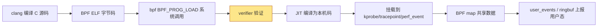
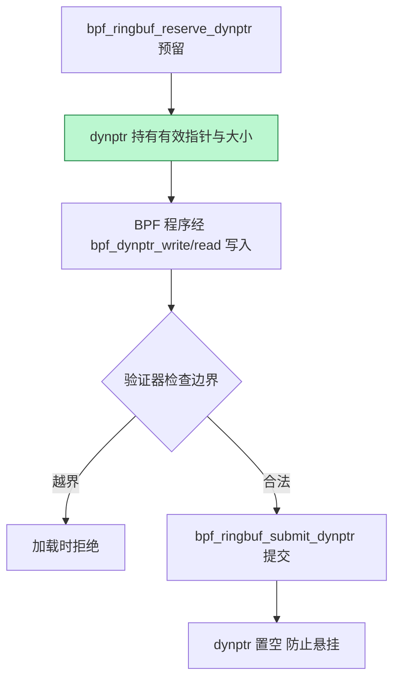
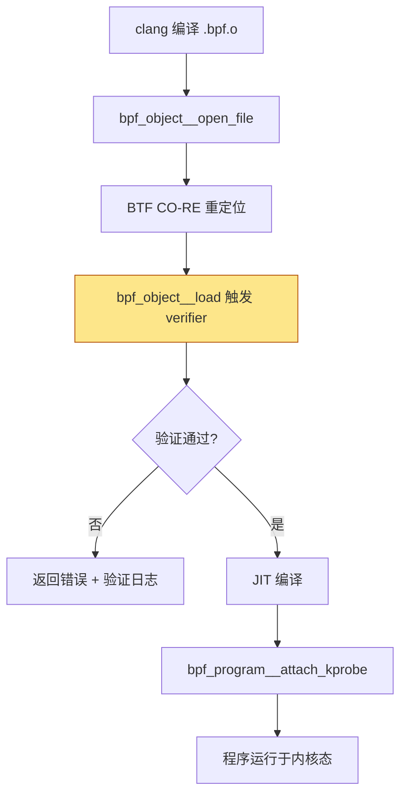
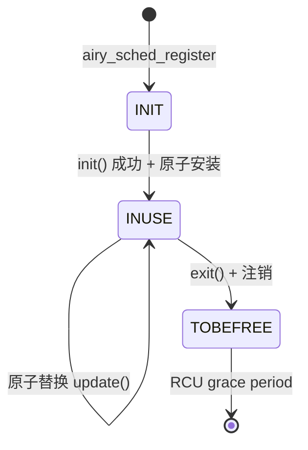
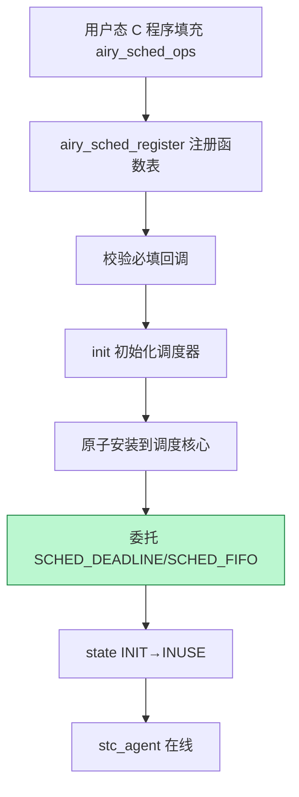

Copyright (c) 2025-2026 SPHARX Ltd. All Rights Reserved.

# agentrt-linux（AirymaxOS）eBPF 可编程探针
> **文档定位**：agentrt-linux（AirymaxOS）可观测性体系 L2 层——可编程内核探针 eBPF 的工程规范\
> **文档版本**：0.1.1\
> **最后更新**：2026-07-07\
> **上级文档**：[agentrt-linux 设计文档](README.md)\
> **同源映射**：agentrt E-2 可观测性 + Linux 6.6 eBPF/BTF/kfunc/struct_ops\
> **理论根基**：Linux 6.6 内核基线 + Airymax 五维正交 24 原则 + E-2 可观测性\
> **核心约束**：IRON-9 v3 同源且部分代码共享——与 agentrt 用户态可观测性通过 [SC] 共享契约层 + [SS] 语义同源层协作，[IND] 内核态实现独立

---

## 目录

- [第 1 章 eBPF 框架概述](#第-1-章-ebpf-框架概述)
- [第 2 章 eBPF 架构与 BPF 指令集](#第-2-章-ebpf-架构与-bpf-指令集)
- [第 3 章 BTF 类型安全](#第-3-章-btf-类型安全)
- [第 4 章 kfunc 内核函数调用机制](#第-4-章-kfunc-内核函数调用机制)
- [第 5 章 dynamic pointer 安全访问](#第-5-章-dynamic-pointer-安全访问)
- [第 6 章 eBPF 验证器 verifier](#第-6-章-ebpf-验证器-verifier)
- [第 7 章 BPF 程序类型](#第-7-章-bpf-程序类型)
- [第 8 章 BPF map 类型](#第-8-章-bpf-map-类型)
- [第 9 章 eBPF 程序加载流程](#第-9-章-ebpf-程序加载流程)
- [第 10 章 用户态调度器策略注册机制（sched_tac）](#第-10-章-用户态调度器策略注册机制方案-c-prime)
- [第 11 章 agentrt-linux Token 能效监控与 Agent 行为追踪](#第-11-章-agentrt-linux-token-能效监控与-agent-行为追踪)
- [第 12 章 五维原则映射](#第-12-章-五维原则映射)
- [第 13 章 IRON-9 v3 四层共享模型落地](#第-13-章-iron-9-v2-三层共享模型落地)
- [第 14 章 相关文档与版本维护](#第-14-章-相关文档与版本维护)

---

## 第 1 章 eBPF 框架概述

### 1.1 定位

eBPF（extended Berkeley Packet Filter）是 Linux 6.6 内核基线提供的可编程探针框架。它允许在内核态运行经过验证器验证的字节码程序，无需修改内核源码或加载内核模块。agentrt-linux 选择 eBPF 作为可观测性 L2 层，原因有三：

1. **可编程性**：相比 ftrace 的固定 tracer 类型，eBPF 允许自定义采集逻辑，是 Agent 行为追踪与 Token 能效监控的核心载体。
2. **安全可加载**：验证器在加载时静态分析所有路径，保证程序不会破坏内核稳定性，与 MicroCoreRT 极简内核契约的"零信任扩展"理念一致。
3. **与 ftrace 共生**：eBPF 程序可挂载到 kprobe、tracepoint、perf_event 等挂载点，与 ftrace 共享 tracepoint 基础设施。

**OS-OBS-011: eBPF 是 agentrt-linux 可观测性 L2 层的强制基线，所有动态可编程观测必须经 eBPF 实现，不得自行编写内核模块。**

**OS-KER-106: kernel 的 defconfig 必须开启 CONFIG_BPF、CONFIG_BPF_SYSCALL、CONFIG_BPF_JIT、CONFIG_BPF_EVENTS、CONFIG_DEBUG_INFO_BTF。**

### 1.2 框架组成

| 组件 | 实现位置 | 职责 |
|------|----------|------|
| syscall | `kernel/bpf/syscall.c` | bpf() 系统调用入口 |
| verifier | `kernel/bpf/verifier.c` | 加载时验证 |
| helper | `kernel/bpf/helpers.c` | BPF 辅助函数 |
| map | `kernel/bpf/{arraymap,hashtab,ringbuf}.c` | 数据存储 |
| kfunc | `kernel/bpf/bpf_struct_ops.c` 等 | 内核函数调用 |
| struct_ops | `kernel/bpf/bpf_struct_ops.c` | 子系统操作表注册 |
| BTF | `kernel/bpf/btf.c` | 类型信息 |

**OS-STD-009: 任何对 `kernel/bpf/` 子目录的修改必须经过 BPF 维护者审查，不得自行扩展 helper 函数集。**

---

## 第 2 章 eBPF 架构与 BPF 指令集

### 2.1 架构总览

eBPF 架构由用户态工具链（libbpf/clang）、内核态验证器、JIT 编译器三部分组成。用户态编写 C 源码经 clang 编译为 BPF 字节码（ELF 格式），通过 `bpf(BPF_PROG_LOAD)` 系统调用提交内核；验证器静态分析后由 JIT 编译为本机指令执行。

### 2.2 BPF 指令集

eBPF 指令集是 64 位 RISC 指令集，包含 10 个通用寄存器（R0-R9）与只读帧指针 R10。R0 保存返回值，R1-R5 用于函数调用传参（调用后失效），R6-R9 跨调用保留。指令格式为 64 位：8 位 opcode + 4 位 dst_reg + 4 位 src_reg + 16 位 offset + 32 位 imm。

```c
/* BPF 指令示例（汇编级）*/
bpf_mov R6 = R1              /* 保存 ctx */
bpf_ld R0 = *(u32 *)(R6 + 0) /* 读 ctx->agent_id */
bpf_mov R0 = 0
bpf_exit
```

### 2.3 数据通路



**OS-KER-107: kernel 必须启用 CONFIG_BPF_JIT_ALWAYS_ON，确保 BPF 程序以本机码执行而非解释执行，避免性能损失。**

**OS-STD-OBS-010: BPF 程序复杂度（指令数）不得超过验证器上限（Linux 6.6 默认 100 万指令）；超限程序必须拆分为多个小程序。**

---

## 第 3 章 BTF 类型安全

### 3.1 BTF 设计

BTF（BPF Type Format）是 Linux 6.6 内核基线提供的紧凑类型元数据格式，编码内核与 BPF 程序的调试信息。它由类型段与字符串段组成：类型段从 id=1 起顺序分配（id=0 保留为 void），字符串段以 null 串起始。BTF 支持 19 种类型，包括 `BTF_KIND_INT`、`BTF_KIND_PTR`、`BTF_KIND_STRUCT`、`BTF_KIND_FUNC`、`BTF_KIND_FUNC_PROTO`、`BTF_KIND_DECL_TAG`、`BTF_KIND_TYPE_TAG`、`BTF_KIND_ENUM64` 等。

```c
/* kernel/bpf/btf.c 核心结构（节选）*/
struct btf_type { __u32 name_off; __u32 info; __u32 size_or_type; };
#define BTF_KIND_INT 1; #define BTF_KIND_PTR 2; #define BTF_KIND_STRUCT 4
#define BTF_KIND_FUNC 12; #define BTF_KIND_FUNC_PROTO 13
```

### 3.2 BTF 在 agentrt-linux 的作用

BTF 是 eBPF 类型安全的基石。验证器依据 BTF 检查 BPF 程序访问的内核结构体字段是否合法、偏移是否越界、大小是否匹配。这使 eBPF 程序能在不依赖脆弱的内核头文件的前提下，安全访问 `struct task_struct`、`struct sock` 等核心结构。

**OS-OBS-012: kernel 必须开启 CONFIG_DEBUG_INFO_BTF，并在构建产物中提供 `vmlinux.btf`；Agent 跟踪 BPF 程序必须基于 BTF 重定位（CO-RE），不得硬编码结构体偏移。**

**OS-KER-108: kernel 必须为 Agent 核心结构（`struct agent_descriptor`、`struct agent_decision`）导出 BTF，确保 eBPF 程序可安全访问。**

---

## 第 4 章 kfunc 内核函数调用机制

### 4.1 kfunc 概述

kfunc（kernel function）是 Linux 6.6 内核基线引入的机制，允许 BPF 程序直接调用经过注册的内核函数。kfunc 没有稳定接口——可随内核版本变化——但通过 BTF 提供类型安全。kfunc 由 `__bpf_kfunc` 宏标注，通过 `BTF_KFUNCS_START`/`BTF_KFUNCS_END` 注册到 BTF kfunc 集合：

```c
__bpf_kfunc_start_defs();
__bpf_kfunc struct task_struct *bpf_find_get_task_by_vpid(pid_t nr)
{ return find_get_task_by_vpid(nr); }
__bpf_kfunc_end_defs();
BTF_KFUNCS_START(bpf_general_kfuncs)
BTF_ID_FLAGS(func, bpf_find_get_task_by_vpid)
BTF_KFUNCS_END(bpf_general_kfuncs)
```

### 4.2 kfunc 参数注解

kfunc 支持参数注解以辅助验证器：`__sz` 标注缓冲区大小参数；`__k` 标注常量标量参数；`__uninit` 标注未初始化输出参数；`__opt` 标注可选参数。验证器据此做精确的边界与生命周期检查。

**OS-OBS-013: agentrt-linux 自定义 kfunc 必须用 `__bpf_kfunc` 宏标注，并通过 `BTF_KFUNCS_START`/`BTF_KFUNCS_END` 注册；未注册的内核函数不得被 BPF 程序调用。**

**OS-KER-109: kernel 必须注册 `bpf_agent_decision_get`、`bpf_agent_token_usage_get` 两个 kfunc，供 BPF 程序查询 Agent 决策与 Token 消耗。**

### 4.3 kfunc 与 helper 区别

BPF helper 是早期内核函数调用接口，签名固定、有限集；kfunc 是新一代机制，签名通过 BTF 描述、可扩展。Linux 6.6 内核基线推荐新代码使用 kfunc。agentrt-linux 遵循此约定：新观测 kfunc 优先，仅当无对应 kfunc 时退回 helper。

---

## 第 5 章 dynamic pointer 安全访问

### 5.1 dynptr 设计

dynamic pointer（dynptr）是 Linux 6.6 内核基线提供的安全指针抽象，由 `struct bpf_dynptr_kern` 描述。它封装了缓冲区指针与长度，验证器据此做边界检查，避免 BPF 程序越界访问。dynptr 与 ringbuf、skb、xdp 等数据通路紧密集成：

```c
/* kernel/bpf/ringbuf.c dynptr API（节选）*/
BPF_CALL_4(bpf_ringbuf_reserve_dynptr, struct bpf_map *, map, u32, size,
           u64, flags, struct bpf_dynptr_kern *, ptr)
{ bpf_dynptr_init(ptr, sample, BPF_DYNPTR_TYPE_RINGBUF, 0, size); return 0; }
BPF_CALL_2(bpf_ringbuf_submit_dynptr, struct bpf_dynptr_kern *, ptr, u64, flags)
{ bpf_dynptr_set_null(ptr); return 0; }  /* 提交后置空，防悬挂 */
```

### 5.2 dynptr 工作流



**OS-OBS-014: agentrt-linux BPF 程序访问变长 Agent payload 必须使用 dynptr（`bpf_dynptr_from_skb`、`bpf_dynptr_slice`），不得直接对裸指针做算术运算。**

**OS-STD-OBS-011: BPF 程序中所有 dynptr 在退出前必须调用 `submit` 或 `discard`，验证器检测到未释放 dynptr 必须拒绝加载。**

---

## 第 6 章 eBPF 验证器 verifier

### 6.1 两阶段验证

eBPF 安全性由验证器在加载时保证，分两阶段：第一阶段做 DAG 检查，禁止循环与不可达指令，构建控制流图；第二阶段从首条指令模拟执行所有路径，跟踪寄存器与栈状态。模拟执行中，寄存器类型系统确保只有合法指针类型可被解引用。

### 6.2 寄存器类型系统

验证器维护每条指令处每个寄存器的类型状态：`PTR_TO_CTX`（上下文指针）、`PTR_TO_MAP`（map 指针）、`PTR_TO_STACK`（栈指针）、`SCALAR_VALUE`（标量）。`R1=R1+R1`（两指针相加）会得到 `SCALAR_VALUE` 而非指针，因为指针加指针无意义。load/store 指令只能作用于 `PTR_TO_CTX`、`PTR_TO_MAP`、`PTR_TO_STACK`，并做边界与对齐检查。

**OS-OBS-015: agentrt-linux BPF 程序必须通过 `-O2 -g -target bpf` 编译，确保验证器能正确追踪寄存器状态；禁用 `-O0`（验证器会因复杂控制流拒绝）。**

**OS-KER-110: kernel 必须开启 CONFIG_BPF_VERIFIER_STATE_MARK 验证器状态标记能力，确保复杂 BPF 程序（如 Agent 决策追踪）能通过验证。**

### 6.3 验证器日志

加载失败时验证器返回详细日志，可通过 `bpf_attr.log_buf` 获取。验证器日志含程序名、失败指令、错误原因三要素。agentrt-linux 规定所有 BPF 加载失败必须将验证器日志落审计至 `/var/log/airymaxos/bpf-load.log`，便于事后排查。

**OS-STD-OBS-012: BPF 程序加载失败时必须记录验证器日志，含程序名、失败指令偏移、错误原因三要素。**

---

## 第 7 章 BPF 程序类型

### 7.1 可观测性相关程序类型

Linux 6.6 内核基线在 `include/uapi/linux/bpf.h` 定义了 30+ 种 BPF 程序类型。agentrt-linux 主要使用以下七种：

| 程序类型 | 挂载点 | 用途 |
|---------|--------|------|
| `BPF_PROG_TYPE_KPROBE` | kprobe/kretprobe | 函数入口/返回探针 |
| `BPF_PROG_TYPE_TRACEPOINT` | 内核 tracepoint | 静态埋点追踪 |
| `BPF_PROG_TYPE_PERF_EVENT` | perf 事件 | 周期采样、CPU 剖析 |
| `BPF_PROG_TYPE_RAW_TRACEPOINT` | 裸 tracepoint | 高性能、无参数过滤 |
| `BPF_PROG_TYPE_STRUCT_OPS` | struct_ops 成员 | Cupolas 安全策略等子系统操作表回调（调度策略改用sched_tac 用户态函数表） |
| `BPF_PROG_TYPE_TRACING` | fentry/fexit | 函数追踪（BTF 重定位） |
| `BPF_PROG_TYPE_LSM` | LSM 钩子 | Cupolas 动态安全策略 |

```c
/* 可观测性 BPF 程序示例（kprobe）*/
#include <linux/bpf.h>
#include <bpf/bpf_helpers.h>

SEC("kprobe/airy_cognition_process")
int trace_cognition(struct pt_regs *ctx)
{
    u32 pid = bpf_get_current_pid_tgid() >> 32;
    u64 ts  = bpf_ktime_get_ns();
    bpf_printk("cognition pid=%u ts=%llu\\n", pid, ts);
    return 0;
}

char _license[] SEC("license") = "GPL";
```

### 7.2 kprobe 与 kretprobe

kprobe 挂载于函数入口，kretprobe 挂载于函数返回。kretprobe 通过 `bpf_get_func_ip()` 与 `bpf_get_func_arg()` 获取返回值。agentrt-linux Agent 行为追踪同时使用两者：kprobe 记录决策入口，kretprobe 记录决策耗时与结果。

**OS-OBS-016: Agent 决策追踪必须同时挂载 kprobe（入口）与 kretprobe（返回），形成完整闭环；仅挂载单一探针视为不完整观测。**

**OS-KER-111: kernel 必须保证 Agent 核心路径函数（`airy_cognition_process`、`airy_planner_dag_update`、`airy_scheduler_dispatch`、`airy_execution_unit_run`）支持 kprobe 挂载，不得使用 `__always_inline` 或 `notrace`。**

### 7.3 tracepoint 与 raw_tracepoint

tracepoint 程序读取 tracepoint 参数需经 BTF 重定位；raw_tracepoint 性能更高但需手动解析参数。agentrt-linux 在高频路径（Agent 决策）使用 raw_tracepoint，低频路径（配置变更）使用 tracepoint。

### 7.4 struct_ops 与 tracing 程序

`BPF_PROG_TYPE_STRUCT_OPS` 程序作为子系统的操作表成员，通过 `BPF_MAP_TYPE_STRUCT_OPS` map 注册（用于 Cupolas 安全策略等非调度子系统）。agentrt-linux sched_tac 用户态调度器通过 `struct airy_sched_ops` 函数表注册（详见第 10 章），不走 BPF struct_ops 机制。`BPF_PROG_TYPE_TRACING` 程序通过 fentry/fexit 挂载到内核函数入口/出口，相比 kprobe 性能更高（无 int3 陷阱），但需 BTF 支持。

---

## 第 8 章 BPF map 类型

### 8.1 核心类型

Linux 6.6 内核基线提供 28+ 种 BPF map 类型。agentrt-linux 常用以下几种：

| 类型 | 实现 | 用途 |
|------|------|------|
| `BPF_MAP_TYPE_HASH` | `hashtab.c` | 通用键值存储 |
| `BPF_MAP_TYPE_ARRAY` | `arraymap.c` | 索引数组 |
| `BPF_MAP_TYPE_PERCPU_HASH` | `hashtab.c` | 每 CPU 独立哈希（无锁） |
| `BPF_MAP_TYPE_PERCPU_ARRAY` | `arraymap.c` | 每 CPU 独立数组 |
| `BPF_MAP_TYPE_RINGBUF` | `ringbuf.c` | 多生产者单消费者环形缓冲 |
| `BPF_MAP_TYPE_STACK_TRACE` | `stackmap.c` | 栈回溯存储 |
| `BPF_MAP_TYPE_LRU_HASH` | `hashtab.c` | LRU 淘汰哈希 |
| `BPF_MAP_TYPE_STRUCT_OPS` | `bpf_struct_ops.c` | struct_ops 注册载体 |
| `BPF_MAP_TYPE_TASK_STORAGE` | `bpf_task_storage.c` | per-task 存储 |
| `BPF_MAP_TYPE_CGRP_STORAGE` | `bpf_cgrp_storage.c` | per-cgroup 存储 |

### 8.2 ringbuf map 与上报

`BPF_MAP_TYPE_RINGBUF` 是 Linux 6.6 内核基线推荐的 BPF→用户态数据上报通路，替代 `BPF_MAP_TYPE_PERF_EVENT_ARRAY`。它支持跨 CPU 顺序、保留通知、无锁预留：

```c
struct event { u32 agent_id; u32 token_delta; u64 ts; };
struct {
    __uint(type, BPF_MAP_TYPE_RINGBUF);
    __uint(max_entries, 1 << 20);  /* 1 MB */
} agent_events SEC(".maps");

SEC("kprobe/airy_cognition_process")
int trace_cognition(void *ctx)
{
    struct event *e = bpf_ringbuf_reserve(&agent_events, sizeof(*e), 0);
    if (!e) return 0;
    e->agent_id = 0x0001; e->token_delta = 100; e->ts = bpf_ktime_get_ns();
    bpf_ringbuf_submit(e, 0);   /* 用户态通过 ring_buffer__poll() 消费 */
    return 0;
}
```

### 8.3 per-CPU map 与并发

`BPF_MAP_TYPE_PERCPU_HASH`/`BPF_MAP_TYPE_PERCPU_ARRAY` 为每 CPU 维护独立副本，BPF 程序访问本 CPU 副本无锁，适合 Token 累加等高频计数器。用户态读取时通过 `bpf_map_lookup_percpu()` 聚合。

**OS-OBS-017: Token 累加计数器必须使用 `BPF_MAP_TYPE_PERCPU_ARRAY`，key 为 agent_id，value 为 token 累加值；不得使用普通 hash 避免锁竞争。**

**OS-STD-OBS-013: BPF map 创建必须显式设置 `max_entries`，ringbuf 大小不得小于 1 MB，hash/array 不得小于 1024 条目。**

### 8.4 struct_ops map 与 task_storage map

`BPF_MAP_TYPE_STRUCT_OPS` 是 struct_ops 机制的注册载体——map 的 value 即 struct_ops 操作表，通过 `bpf(BPF_MAP_UPDATE_ELEM)` 触发注册（详见第 10 章）。`BPF_MAP_TYPE_TASK_STORAGE` 为每 task 维护独立存储，BPF 程序通过 `bpf_task_storage_get`/`bpf_task_storage_delete` 访问，适合 per-Agent 状态追踪。

---

## 第 9 章 eBPF 程序加载流程

### 9.1 加载步骤

eBPF 程序从源码到运行经历五步：编译（clang -target bpf）、加载（bpf(BPF_PROG_LOAD)）、attach（kprobe/tracepoint/perf_event/struct_ops 挂载）、运行、卸载。agentrt-linux 推荐使用 libbpf 框架管理生命周期：

```c
/* libbpf 加载示例 */
struct bpf_object *obj = bpf_object__open_file("agent_tracer.bpf.o", NULL);
if (libbpf_get_error(obj)) return libbpf_get_error(obj);
int err = bpf_object__load(obj);   /* 触发 verifier 验证 + JIT */
if (err) { bpf_object__close(obj); return err; }
struct bpf_link *link = bpf_program__attach_kprobe(
    bpf_object__find_program_by_name(obj, "trace_cognition"),
    false, "airy_cognition_process");
if (libbpf_get_error(link)) { bpf_object__close(obj); return libbpf_get_error(link); }
```

### 9.2 加载流程图



**OS-OBS-018: agentrt-linux 必须为每个 BPF 程序实现显式卸载路径（`bpf_link__destroy`），不得依赖进程退出隐式卸载；Agent 重载策略时必须先卸载旧 BPF 程序再加载新版本。**

**OS-KER-112: kernel 必须支持 `bpf(BPF_LINK_CREATE)` 显式 link 创建，确保 BPF 程序生命周期可独立于加载进程管理。**

**OS-STD-OBS-014: BPF 程序 .o 文件必须随 airymaxos-kernel 发布包分发，存放于 `/usr/lib/airymaxos/bpf/`，便于 Agent 重载时引用。**

---

## 第 10 章 用户态调度器策略注册机制（sched_tac）

### 10.1 设计哲学

sched_tac 不使用 BPF struct_ops 机制注册调度策略——标准 Linux 6.6 主线不包含 sched_ext（SCHED_EXT BPF 调度器框架于 Linux 6.12 才合入主线），agentrt-linux 锁定 Linux 6.6 内核基线（ADR-013），因此可插拔调度策略改用**用户态函数表**实现。agentrt-linux 通过 `struct airy_sched_ops` 函数表注册 sched_tac 用户态调度器；Cupolas 动态安全策略等非调度子系统仍可使用 BPF struct_ops 机制。

**核心设计哲学**：

1. **结构体即接口**：用户态调度核心定义 `struct airy_sched_ops`（函数指针集合），用户态调度器实现填充此结构体
2. **用户态注册**：通过 `airy_sched_register()` 将函数表注册到用户态调度核心，再经由 SCHED_DEADLINE/SCHED_FIFO 调度类委托给 Linux 6.6 内核调度核心
3. **seL4 MCS 映射**：时间预算与带宽配额通过 SCHED_DEADLINE 的 CBS（Constant Bandwidth Server）语义映射 seL4 MCS 时间隔离
4. **状态机管理**：INIT → INUSE → TOBEFREE 四状态生命周期
5. **零内核模块**：不编写调度类内核模块，策略完全在用户态演进

**OS-OBS-021: agentrt-linux 可插拔调度策略必须通过用户态函数表（`struct airy_sched_ops`）集成，不得编写调度类内核模块；stc_agent 注册名为 `"airy_sched_ops"`。**

### 10.2 airy_sched_register() 注册接口

用户态调度器通过 `airy_sched_register()` 函数注册函数表。此函数做三件事：(1) 校验 `struct airy_sched_ops` 必填回调（init/exit/enqueue/dispatch 等）；(2) 通过原子替换将新函数表安装到调度核心；(3) 触发 init() 回调完成调度器初始化。

```c
/* 注册模式示意 */
static struct airy_sched_ops airy_agent_sched = {
    .init         = agent_sched_init,
    .exit         = agent_sched_exit,
    .enqueue      = agent_sched_enqueue,
    .dispatch     = agent_sched_dispatch,
    .select_cpu   = agent_sched_select_cpu,
    .runnable     = agent_sched_runnable,
    .running      = agent_sched_running,
    .stopping     = agent_sched_stopping,
    .name         = "airy_sched_ops",
};

/* 初始化时注册 */
ret = airy_sched_register(&airy_agent_sched);
```

### 10.3 注册状态机

函数表注册维护四状态生命周期，agentrt 用户态策略引擎通过 [SC] 共享契约层可读取 `state` 字段判断调度器是否在线：



**OS-KER-116: kernel 必须提供 `struct airy_sched_ops` 函数表注册接口（`airy_sched_register()`），用户态调度器通过此接口注册；不依赖 `CONFIG_SCHED_CLASS_EXT`/`CONFIG_BPF_SCHED`（标准 6.6 主线不含 sched_ext）。**

**OS-OBS-022: agentrt-linux 用户态调度器加载后，策略守护进程必须通过 [SC] `airy_struct_ops_state` 读取函数表的 state 字段，确认 state==INUSE 后方可标记调度器在线。**

### 10.4 stc_agent 集成架构

sched_tac 调度策略通过 `struct airy_sched_ops` 暴露完整调度接口（init/exit/enqueue/dispatch/select_cpu/runnable/running/stopping/quiescent 等 25+ 回调）。用户态 C 程序填充 `struct airy_sched_ops` 后，通过 `airy_sched_register()` 注册到用户态调度核心，再由用户态调度器经由 SCHED_DEADLINE/SCHED_FIFO 调度类委托给 Linux 6.6 内核调度核心。



### 10.5 fallback 回退机制

stc_agent 沿用sched_tac 的软可靠性设计——用户态调度器失败/超时/SysRq 自动回退 EEVDF：

| 触发条件 | 回退动作 |
|---------|---------|
| 用户态调度器主动 exit | `ops.exit()` 调用 |
| runnable 超时 | 任务等待超过 timeout_ms（默认 30s） |
| 调度器错误 | 注册校验失败 / 运行时错误 |
| SysRq-S | 紧急回退快捷键 |
| 内存分配失败 | 用户态调度器 OOM |

回退流程：所有任务迁入 BYPASS 队列（FIFO）→ EEVDF 重新接管 → state INUSE→TOBEFREE→freed。

**OS-KER-117: 用户态调度器必须实现 fallback 机制，异常时自动回退 EEVDF，保证系统不卡死。**

---

## 第 11 章 agentrt-linux Token 能效监控与 Agent 行为追踪

### 11.1 Token 能效监控

agentrt-linux 通过 eBPF 实现 Token 能效监控：kprobe 挂载 Agent 决策入口，kretprobe 挂载出口，两者时间差为决策耗时；同时通过 `bpf_agent_token_usage_get` kfunc 读取 Token 消耗，计算能效比（token/秒）：

```c
/* Token 能效监控 BPF 程序 */
struct token_stat { u64 total_tokens; u64 total_ns; u64 decision_count; };
struct {
    __uint(type, BPF_MAP_TYPE_LRU_HASH);
    __uint(max_entries, 1024);
    __type(key, u32);   /* agent_id */
    __type(value, struct token_stat);
} token_stats SEC(".maps");

SEC("kretprobe/airy_cognition_process")
int trace_cognition_ret(struct pt_regs *ctx)
{
    u32 agent_id = PT_REGS_PARM1(ctx) & 0xFFFF;
    struct token_stat *st = bpf_map_lookup_elem(&token_stats, &agent_id);
    if (st) { st->total_tokens += 100; st->decision_count += 1; }
    return 0;
}
```

**OS-OBS-019: Token 能效数据必须每 1 秒聚合一次通过 AgentsIPC 上报用户态仪表盘；聚合间隔不得小于 100ms 避免内核噪声。**

**OS-KER-113: kernel 必须在 `/sys/kernel/agentrt/token_usage` 导出 per-Agent Token 累计值，与 BPF map 数据一致。**

### 11.2 Agent 行为追踪

Agent 行为追踪覆盖四个阶段：认知 → 规划 → 调度 → 执行。每个阶段挂载 kprobe+kretprobe 对，记录时间戳、agent_id、stage、token_delta。所有事件通过 ringbuf 上报至用户态审计守护进程：

```c
/* Agent 行为追踪事件定义与上报 */
struct agent_event { u32 agent_id; u32 stage; u32 token_delta; u64 enter_ts; u64 exit_ts; };
struct {
    __uint(type, BPF_MAP_TYPE_RINGBUF);
    __uint(max_entries, 1 << 22);  /* 4 MB */
} agent_events SEC(".maps");

SEC("kprobe/airy_scheduler_dispatch")
int trace_dispatch_enter(struct pt_regs *ctx)
{
    struct agent_event *e = bpf_ringbuf_reserve(&agent_events, sizeof(*e), 0);
    if (!e) return 0;
    e->agent_id = PT_REGS_PARM1(ctx) & 0xFFFF;
    e->stage = 2;  /* 0=cognition 1=planner 2=scheduler 3=execution */
    e->enter_ts = bpf_ktime_get_ns();
    bpf_ringbuf_submit(e, 0);
    return 0;
}
```

**OS-OBS-020: Agent 行为追踪 ringbuf 大小必须 ≥ 4 MB，确保高并发 Agent 决策不丢失事件。**

**OS-KER-114: kernel 必须保证 `airy_cognition_process`、`airy_planner_dag_update`、`airy_scheduler_dispatch`、`airy_execution_unit_run` 四个函数符号导出至 kallsyms，确保 BPF 程序可挂载。**

### 11.3 与 MicroCoreRT 协同

MicroCoreRT 极简内核契约要求所有 BPF 程序代码体积最小化。agentrt-linux BPF 程序单文件指令数不得超过 1 万，编译后 .o 体积不得超过 64 KB。该约束体现 IRON-9 v3 同源且部分代码共享原则——与 agentrt 用户态观测通过 [SC] 共享 trace_event 头契约 + [SS] 语义同源（BPF map/ringbuf 模型），但 [IND] 内核态实现独立（BPF 字节码 vs 用户态进程）。

**OS-KER-115: agentrt-linux BPF 程序编译后 .o 体积必须 < 64 KB，单程序指令数必须 < 1 万；超限视为违反 MicroCoreRT 极简契约。**

---

## 第 12 章 五维原则映射

| 原则 | 在 eBPF 框架的体现 |
|------|---------------------|
| **E-2 可观测性** | eBPF 是 L2 层基线，提供可编程全栈可见性 |
| **S-1 反馈闭环** | BPF 程序读取 Token 数据→AgentsIPC 反馈→调度策略调整 |
| **K-2 接口契约化** | bpf() 系统调用是 Linux 6.6 内核基线 ABI，永不破坏 |
| **K-4 可插拔策略** | BPF 程序可动态加载/卸载，策略运行时切换；struct_ops 支持子系统级可插拔 |
| **A-4 完美主义** | 验证器全路径分析，BTF 类型安全，dynptr 边界检查 |
| **C-3 记忆卷载** | BPF map 追踪 L1→L4 记忆演化命中率与淘汰率 |
| **M-1 极境内核** | eBPF 不增加内核代码体积，扩展逻辑在验证器边界外 |

agentrt-linux 在 Linux 6.6 内核基线上严格遵循五维正交 24 原则——每条 OS-OBS 规则都可追溯至至少一条五维原则。IRON-9 v3 同源且部分代码共享原则要求 eBPF 的内核态实现与 agentrt 用户态可观测性保持 [SC] 共享契约 + [SS] 语义同源 + [IND] 内核态实现独立。两端通过 MicroCoreRT 极简内核契约与 AgentsIPC 消息协议实现无适配层互操作。

---

## 第 13 章 IRON-9 v3 四层共享模型落地

### 13.1 三层共享模型

IRON-9 v3 将 agentrt 与 agentrt-linux 的 eBPF 协作划分为四层：

| 层次 | 共享程度 | eBPF 内容 |
|------|---------|----------|
| **补充共享层** | 共享代码（非 [SC] 核心） | `include/uapi/linux/airymax/bpf_struct_ops.h`：struct_ops 状态枚举 + common_value 结构 |
| **[SS] 语义同源层** | 高层 API 语义同源（概念操作一致），签名因抽象层级不同而独立演进 | struct_ops 注册宏模式、bpf_prog 生命周期、ringbuf reserve/submit、kfunc 注册模式、bpf() cmd ABI |
| **[IND] 完全独立层** | 完全独立 | JIT 后端、trampoline 本机码生成、verifier 实现、自定义 kfunc |

### 13.2 [SC] 共享契约层

`include/uapi/linux/airymax/bpf_struct_ops.h` 定义状态枚举与 common_value 结构（原用于 struct_ops，sched_tac 用户态调度器复用此状态枚举），agentrt 用户态策略引擎通过此头解析调度器函数表的 `state` 字段，判断用户态调度器是否在线，无需访问内核私有数据结构：

```c
/* include/uapi/linux/airymax/syscalls.h —— IRON-9 v3 [SC] 共享契约层 */
enum airy_struct_ops_state {
    AIRY_STRUCT_OPS_STATE_INIT     = 0,  /* 已初始化，未注册 */
    AIRY_STRUCT_OPS_STATE_INUSE     = 1,  /* 已注册，使用中 */
    AIRY_STRUCT_OPS_STATE_TOBEFREE  = 2,  /* 待释放（RCU 宽限期内） */
    AIRY_STRUCT_OPS_STATE_READY     = 3,  /* 就绪（仅模块 struct_ops） */
};

struct airy_struct_ops_common_value {
    uint32_t refcnt;   /* 引用计数 */
    uint32_t state;    /* enum airy_struct_ops_state */
    uint32_t reserved[2];
};
```

**OS-STD-OBS-015: agentrt-linux eBPF 与 agentrt 共享 `include/uapi/linux/airymax/bpf_struct_ops.h` 头文件，struct_ops state 枚举值（0/1/2/3）与字段语义两端必须一致；两端事件格式必须一致，便于跨态聚合分析。**

### 13.3 [SS] 语义同源层

| 维度 | agentrt 用户态 | agentrt-linux 内核态 | 同源点 |
|------|----------------|------------------|--------|
| struct_ops 注册宏 | 策略引擎注册回调 | `register_bpf_struct_ops()` | 宏模式同源 |
| struct_ops 状态机 | 4 状态（INIT/REGISTERED/ACTIVE/DRAINING） | 4 状态 | 枚举值同源（[SC]） |
| bpf_prog 生命周期 | load→attach→run→detach→unload | 同 | 5 阶段同源 |
| bpf_link 生命周期 | create→update→detach | 同 | 3 阶段同源 |
| ringbuf reserve/submit | 策略引擎 ringbuf 客户端 | 内核 ringbuf 实现 | API 语义同源 |
| kfunc 注册模式 | 策略引擎导出函数 | `__bpf_kfunc` + BTF_KFUNCS | 宏模式同源 |
| bpf() cmd | 策略引擎调用 bpf() | 内核实现 bpf() | ABI 同源 |

agentrt 的 `commons/metrics` 模块定义了 `airy_metrics_record(name, value)`，与内核 BPF map 更新同源——两者都遵循"键值累加 + 周期聚合"模式。[SS] 语义同源在此体现为：语义同源（都是结构化指标采集），实现独立（用户态 metrics 库 vs 内核态 BPF map + verifier）。

### 13.4 [IND] 完全独立层

| 维度 | agentrt 用户态 | agentrt-linux 内核态 |
|------|----------------|------------------|
| JIT 后端 | 不适用（用户态解释器/LLVM） | kernel x86_64/arm64 JIT |
| trampoline 机制 | 不适用 | `arch_prepare_bpf_trampoline()` 本机码生成 |
| verifier 实现 | 不适用 | 内核 verifier.c（21091 行） |
| 自定义 kfunc | 不适用 | `bpf_agent_decision_get`、`bpf_agent_token_usage_get`、`bpf_agent_state_get` |
| cfi_stubs | 不适用 | kCFI 桩函数表 |

### 13.5 跨态协作流

```mermaid
graph LR
    A[agentrt 用户态 hook] --> B[AgentsIPC 上报]
    B --> C[agentrt-linux eBPF ringbuf]
    D[内核态 BPF kprobe] --> C
    C --> E[user_events / ringbuf 统一消费]
    F[agentrt 策略引擎] -->|读取 [SC] state 字段| G[agentrt-linux 调度器函数表 state]
    style C fill:#fde68a,stroke:#b45309
    style G fill:#bbf7d0,stroke:#15803d
```

MicroCoreRT 极简内核契约要求：内核态 BPF 程序不解析用户态事件 payload，仅按 trace_event 头透传；用户态守护进程负责跨态聚合与能效计算。agentrt 策略引擎通过 [SC] 共享契约层读取调度器函数表的 `state` 字段，判断用户态调度器在线状态，无需进入内核私有数据结构。

---

## 第 14 章 相关文档与版本维护

### 14.1 相关文档与参考材料

**同模块文档**：`90-observability/README.md`（体系主索引）、`01-ftrace-framework.md`（ftrace L1 层）、`03-perf-analysis.md`（perf L3 层，1.0.1 规划）、`06-user-events.md`（用户态桥接，1.0.1 规划）、`07-token-efficiency.md`（Token 能效监控，1.0.1 规划）、`08-agent-tracing.md`（Agent 行为追踪，1.0.1 规划）。
**跨模块文档**：`20-modules/01-kernel.md`（kernel 子仓）、`40-dataflows/03-ipc-flow.md`（IPC 数据流，io_uring 共享环形缓冲区）、`40-dataflows/04-scheduling-flow.md`（调度数据流，stc_agent 集成）、`50-engineering-standards/04-engineering-philosophy.md`（工程思想，IRON-9 v3 四层共享模型）。
**内核源码**：Linux 6.6 `kernel/bpf/{syscall.c,verifier.c,bpf_struct_ops.c,helpers.c,ringbuf.c,btf.c,hashtab.c,arraymap.c}`；`include/linux/bpf.h`；`include/uapi/linux/bpf.h`；`kernel/sched/{deadline.c,rt.c,fair.c}`（sched_tac 调度类实现）。

### 14.2 版本与维护

| 版本 | 日期 | 变更说明 |
|------|------|----------|
| 0.1.1 | 2026-07-06 | 初稿占位，覆盖 eBPF 核心机制 |
| 0.1.1 | 2026-07-07 | 修订：新增第 10 章 用户态调度器策略注册机制（sched_tac）；更新 IRON-9 v3 四层共享模型（[SC]/[SS]/[IND]）；增强程序类型与 map 类型（struct_ops/task_storage）；新增 OS-OBS-021/022、OS-KER-116/022 规则 |
| 1.0.1 | 2026-07-07 | 开发版：补充 Token 能效与 Agent 行为追踪实现 + sched_tac 用户态调度器集成实现 |

**OS-STD-OBS-016: 文档中引用的 BPF 程序类型、map 类型、kfunc 名必须与 Linux 6.6 内核基线的 `include/uapi/linux/bpf.h` 保持一致；上游变更时本文档必须同步更新。**

**OS-IRON-015: OS-KER / OS-STD / OS-OBS / OS-DRV 等所有规则编号一经分配不得复用；废弃规则标记 `DEPRECATED` 但保留编号。本规则为全局元规则，2026-07-15 从原 OS-STD-017 提升为 OS-IRON-015（编号管理元规则应归入 IRON 系列，因 OS-IRON-013 已被"8 子仓 submodule"占用而改用 OS-IRON-015）。**

**维护责任**：文档负责人为 agentrt-linux 可观测性工程组；代码负责人为 kernel BPF 维护者；每个 LTS 小版本发布前重新核对 BPF 接口与规则编号有效性。

---

> **文档结束** | agentrt-linux eBPF 可编程探针 v0.1.1 / 1.0.1
