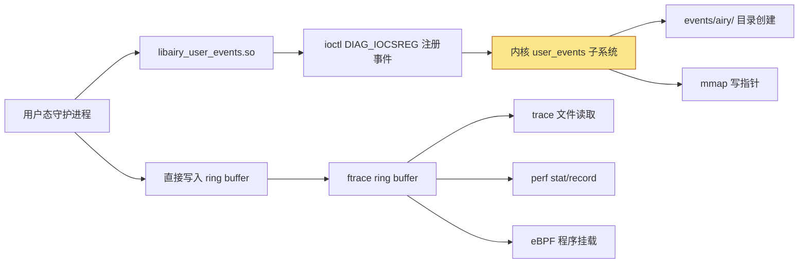

Copyright (c) 2025-2026 SPHARX Ltd. All Rights Reserved.

# agentrt-linux（AirymaxOS）user_events 接口
> **文档定位**：agentrt-linux（AirymaxOS）可观测性体系 L5 层——用户态事件追踪桥接 user_events 的工程规范\
> **文档版本**：v1.0.1\
> **最后更新**： 2026-07-21\
> **上级文档**：[90-observability README](README.md)\
> **同源映射**：agentrt E-2 可观测性 + Linux 6.6 user_events/ftrace ring buffer\
> **理论根基**：Linux 6.6 内核基线 + Airymax 五维正交 24 原则 + IRON-9 v3 四层模型\
> **核心约束**：user_events 是用户态守护进程上报事件的唯一标准通道，不得自创 ioctl 或 netlink 替代

---

## 目录

- [第 1 章 user_events 框架概述](#第-1-章-user_events-框架概述)
- [第 2 章 user_events 架构与数据通路](#第-2-章-user_events-架构与数据通路)
- [第 3 章 Agent 事件注册](#第-3-章-agent-事件注册)
- [第 4 章 事件类型定义](#第-4-章-事件类型定义)
- [第 5 章 与 logger_d 的关系](#第-5-章-与-logger_d-的关系)
- [第 6 章 user_events 性能开销](#第-6-章-user_events-性能开销)
- [第 7 章 与 eBPF 探针的关系](#第-7-章-与-ebpf-探针的关系)
- [第 8 章 Airymax Unify Design 映射](#第-8-章-airymax-unify-design-映射)
- [第 9 章 相关文档与版本维护](#第-9-章相关文档与版本维护)

---

## 第 1 章 user_events 框架概述

### 1.1 定位

user_events 是 Linux 6.6 内核基线提供的用户态事件追踪框架，允许用户态进程通过 `ioctl()` 注册事件并将其直接写入 ftrace ring buffer，无需经过 `write()` 系统调用或额外的数据拷贝。agentrt-linux 选择 user_events 作为可观测性 L5 层（用户态桥接），原因有三：

1. **零拷贝写入**：user_events 通过 `mmap()` 将 ftrace ring buffer 的写指针暴露给用户态，用户态直接填充事件数据，内核态仅做启用状态检查，单事件开销 < 10ns，远低于 `write()` 路径的 1-2μs。
2. **与 ftrace 统一**：user_events 事件与内核 tracepoint 事件共享同一 ring buffer 与同一 `events/` 目录结构，可在同一 trace 输出中混合查看，符合 A-ULS 模块 macro_d 的"统一观测面"原则。
3. **与 logger_d 解耦**：user_events 用于实时追踪（短期、高频率），logger_d 用于持久化日志（长期、结构化）；二者职责清晰，不互相替代。

**OS-OBS-061: user_events 是 agentrt-linux 可观测性 L5 层的强制基线，用户态守护进程上报追踪事件必须经 user_events，不得自创 ioctl/netlink/共享内存替代方案。**

**OS-KER-151: kernel 的 defconfig 必须开启 CONFIG_USER_EVENTS；agentrt.ko 必须在 module_init 阶段验证 `/sys/kernel/tracing/user_events` 文件存在。**

### 1.2 框架组成

| 组件 | 实现位置 | 职责 |
|------|----------|------|
| user_events 文件 | `/sys/kernel/tracing/user_events` | 事件注册与状态查询 |
| ioctl 接口 | `kernel/trace/trace_events_user.c` | 注册/启用/禁用事件 |
| ring buffer 写入 | `kernel/trace/ring_buffer.c` | 事件数据存储 |
| events 子系统 | `kernel/trace/trace_events.c` | 事件管理与导出 |
| 用户态库 | `libairy_user_events.so` | 封装 ioctl 与写入逻辑 |

**OS-STD-051: 任何对 `kernel/trace/trace_events_user.c` 的修改必须经过 user_events 维护者审查；agentrt-linux 不得 fork user_events 子系统。**

### 1.3 user_events vs Ring Buffer 日志

| 维度 | user_events | A-ULP Ring Buffer 日志 |
|------|------------|---------------------|
| 用途 | 实时追踪（短期分析） | 持久化日志（长期审计） |
| 数据通路 | ftrace ring buffer | A-ULP 专用 ring buffer |
| 消费者 | ftrace trace / perf / eBPF | logger_d |
| 持久化 | 否（内存中） | 是（落盘） |
| 单事件开销 | < 10ns | ~500ns（含格式化） |
| 数据格式 | 二进制结构（自定义） | 128B 固定记录 |
| 适用场景 | 性能分析、行为追踪 | 错误审计、合规留痕 |

---

## 第 2 章 user_events 架构与数据通路

### 2.1 架构总览



### 2.2 事件注册流程

用户态进程通过 ioctl 注册事件：

```c
/* 用户态注册示例 */
#include <linux/user_events.h>

struct user_event_data {
    int write_index;  /* 内核返回的写索引 */
    int enabled;      /* 启用状态（mmap 共享） */
};

int fd = open("/sys/kernel/tracing/user_events", O_RDWR);

struct user_reg reg = {
    .size = sizeof(reg),
    .enable_bit = 0,           /* 启用位（bit 0） */
    .enable_size = sizeof(int),
    .flags = 0,
    .args = (unsigned long)"airy_user_cognition_start u32 agent_id u32 input_tokens",
};

ioctl(fd, DIAG_IOCSREG, &reg);
/* reg.write_index 返回写索引，用于直接写入 ring buffer */
```

### 2.3 事件写入流程

注册后，用户态进程通过 mmap 的写指针直接写入 ring buffer：

```c
/* 检查事件是否启用（无需系统调用） */
if (__atomic_load_n(&event_data->enabled, __ATOMIC_RELAXED) & (1 << 0)) {
    /* 事件已启用，直接写入 */
    struct {
        int common_type;
        int common_pid;
        u32 agent_id;
        u32 input_tokens;
    } __packed entry = {
        .common_type = event_data->write_index,
        .common_pid = getpid(),
        .agent_id = 42,
        .input_tokens = 234,
    };
    /* 通过 user_events 写入接口 */
    airy_user_event_write(fd, &entry, sizeof(entry));
}
```

**OS-KER-152: 用户态进程必须在写入前检查 `enabled` 字段；事件未启用时不得写入，避免无谓的 ring buffer 占用。**

### 2.4 事件启用与查看

注册后的事件出现在 `events/user_events/` 目录：

```bash
# 查看已注册的 user_events
ls /sys/kernel/tracing/events/user_events/
# 输出: airy_user_cognition_start  airy_user_cognition_end  ...

# 启用事件
echo 1 > /sys/kernel/tracing/events/user_events/airy_user_cognition_start/enable

# 查看 trace 输出
cat /sys/kernel/tracing/trace
```

---

## 第 3 章 Agent 事件注册

### 3.1 airy_user_event_register() API

agentrt-linux 提供封装 API `airy_user_event_register()`，供 12 daemon 与 Agent 运行时使用：

```c
/* include/uapi/agentrt/user_events.h */

struct airy_user_event {
    int fd;
    int write_index;
    volatile int *enabled;  /* mmap 的启用状态指针 */
    const char *name;
    const char *format;
};

/**
 * airy_user_event_register - 注册 user_event
 * @name: 事件名（如 "cognition_start"）
 * @format: 事件格式字符串（如 "u32 agent_id u32 input_tokens"）
 * @event: 输出参数，返回事件句柄
 *
 * 返回值：0 成功，负数错误码失败
 */
int airy_user_event_register(const char *name,
                             const char *format,
                             struct airy_user_event *event);

/**
 * airy_user_event_write - 写入事件（已检查 enabled）
 * @event: 事件句柄
 * @data: 事件数据
 * @size: 数据大小
 */
static inline void airy_user_event_write(struct airy_user_event *event,
                                         void *data, size_t size)
{
    if (__atomic_load_n(event->enabled, __ATOMIC_RELAXED) & 1) {
        struct iovec iov = { .iov_base = data, .iov_len = size };
        write(event->fd, &iov, sizeof(iov));
    }
}

/**
 * airy_user_event_unregister - 注销事件
 * @event: 事件句柄
 */
void airy_user_event_unregister(struct airy_user_event *event);
```

### 3.2 注册示例

cogn_d daemon 在启动时注册认知循环事件：

```c
/* cogn_d daemon 初始化 */
struct airy_user_event cognition_start_ev;
struct airy_user_event cognition_end_ev;
struct airy_user_event memory_access_ev;
struct airy_user_event tool_call_ev;

int cogn_d_init_user_events(void)
{
    int ret;
    ret = airy_user_event_register("cognition_start",
        "u32 agent_id u32 input_tokens u64 timestamp_ns",
        &cognition_start_ev);
    if (ret) return ret;

    ret = airy_user_event_register("cognition_end",
        "u32 agent_id u32 output_tokens u64 latency_ns",
        &cognition_end_ev);
    if (ret) return ret;

    ret = airy_user_event_register("memory_access",
        "u32 agent_id u8 level u8 hit u64 latency_ns",
        &memory_access_ev);
    if (ret) return ret;

    ret = airy_user_event_register("tool_call",
        "u32 agent_id u32 tool_id u64 latency_ns u8 result",
        &tool_call_ev);
    if (ret) return ret;

    return 0;
}
```

### 3.3 12 daemon 事件注册矩阵

| Daemon | 注册的 user_events |
|--------|-------------------|
| macro_d | `superv_enforce`、`superv_adjudicate`、`budget_alert` |
| logger_d | `log_consume`、`log_flush`、`panic_fallback` |
| config_d | `config_reload`、`config_version_change` |
| gateway_d | `ipc_send_user`、`ipc_recv_user`、`ipc_error` |
| sched_d | `sched_class_switch_user`、`sched_deadline_miss` |
| vfs_d | `file_open`、`file_close`、`mount_event` |
| net_d | `socket_create`、`packet_recv` |
| mem_d | `page_alloc_user`、`mmap_establish` |
| cogn_d | `cognition_start`、`cognition_end`、`memory_access`、`tool_call` |
| sec_d | `lsm_hook_user`、`cap_denial` |
| audit_d | `audit_record_user` |
| dev_d | `device_event_user` |

**OS-OBS-062: 12 daemon 必须在启动阶段完成所有 user_events 注册；注册失败的 daemon 不得进入 RUNNING 状态，需触发 macro_d 重启。**

---

## 第 4 章 事件类型定义

### 4.1 COGNITION_START / COGNITION_END

认知循环进入与退出事件：

```c
/* cognition_start 事件数据结构 */
struct airy_user_cognition_start {
    u32 agent_id;
    u32 input_tokens;
    u64 timestamp_ns;
};

/* cognition_end 事件数据结构 */
struct airy_user_cognition_end {
    u32 agent_id;
    u32 output_tokens;
    u64 latency_ns;
};

/* 使用示例 */
void cogn_d_on_start(u32 agent_id, u32 input_tokens)
{
    struct airy_user_cognition_start ev = {
        .agent_id = agent_id,
        .input_tokens = input_tokens,
        .timestamp_ns = airy_get_monotonic_ns(),
    };
    airy_user_event_write(&cognition_start_ev, &ev, sizeof(ev));
}
```

### 4.2 MEMORY_ACCESS

记忆访问事件，记录 L1-L4 层级的访问：

```c
struct airy_user_memory_access {
    u32 agent_id;
    u8  level;        /* 1=L1 工作记忆, 2=L2 短期, 3=L3 长期, 4=L4 经验 */
    u8  hit;          /* 1=命中, 0=缺失 */
    u64 latency_ns;
    u64 addr;         /* 访问地址（可选） */
};
```

### 4.3 TOOL_CALL

工具调用事件：

```c
struct airy_user_tool_call {
    u32 agent_id;
    u32 tool_id;      /* 工具标识符 */
    u64 latency_ns;
    u8  result;       /* 0=成功, 非 0=错误码 */
    u32 output_tokens;
};
```

### 4.4 事件格式注册

每个事件的格式通过注册字符串定义，内核据此生成 `format` 文件：

```bash
$ cat /sys/kernel/tracing/events/user_events/cognition_start/format
name: cognition_start
ID: 5678
format:
    field:unsigned short common_type;   offset:0;  size:2;  signed:0;
    field:unsigned char  common_flags;  offset:2;  size:1;  signed:0;
    field:unsigned char  common_preempt_count; offset:3; size:1; signed:0;
    field:int            common_pid;    offset:4;  size:4;  signed:1;

    field:u32            agent_id;      offset:8;  size:4;  signed:0;
    field:u32            input_tokens;  offset:12; size:4;  signed:0;
    field:u64            timestamp_ns;  offset:16; size:8;  signed:0;

print fmt: "agent=%u input_tokens=%u ts=%llu",
    REC->agent_id, REC->input_tokens, REC->timestamp_ns
```

### 4.5 事件过滤器

user_events 支持与内核 tracepoint 相同的过滤器语法：

```bash
# 仅记录 agent_id == 42 的认知事件
echo 'agent_id == 42' > \
    /sys/kernel/tracing/events/user_events/cognition_start/filter

# 组合条件：高 token 消耗
echo 'agent_id == 42 && input_tokens > 1000' > \
    /sys/kernel/tracing/events/user_events/cognition_start/filter
```

---

## 第 5 章 与 logger_d 的关系

### 5.1 职责划分

| 维度 | user_events | logger_d + Ring Buffer |
|------|------------|---------------------------|
| 数据来源 | 用户态守护进程主动上报 | 内核态 tracepoint + 用户态 API |
| 持久化 | 否（仅内存 ring buffer） | 是（落盘至 `/var/log/airy/`） |
| 实时性 | 高（< 10ns 写入） | 中（~500ns 写入 + 异步落盘） |
| 数据量 | 受 ring buffer 大小限制 | 受磁盘容量限制 |
| 消费者 | ftrace trace / perf / eBPF | logger_d → 文件 |
| 适用场景 | 实时性能分析、行为追踪 | 长期审计、合规留痕、Panic 后分析 |

### 5.2 协同工作流

agentrt-linux 中，user_events 与 logger_d 协同工作：

1. **实时分析阶段**：开发人员通过 user_events 实时观察 Agent 行为，定位性能瓶颈。
2. **持久化阶段**：关键事件同时写入 A-ULP Ring Buffer，由 logger_d 异步落盘。
3. **Panic 后分析**：Panic 发生时，user_events ring buffer 内容被 A-ULP Panic 回退路径保存至 `/var/log/airy/panic-trace-{timestamp}`。

### 5.3 双写策略

对于关键事件（如 `superv_enforce`），采用双写策略：

```c
void macro_d_on_enforce(u32 agent_id, u32 action, u32 reason)
{
    /* 1. 写入 user_events（实时分析） */
    struct airy_user_superv_enforce ev = {
        .agent_id = agent_id,
        .action = action,
        .reason = reason,
    };
    airy_user_event_write(&superv_enforce_ev, &ev, sizeof(ev));

    /* 2. 写入 A-ULP Ring Buffer（持久化） */
    airy_log_write(AIRY_LOG_NOTICE, AIRY_MOD_USV,
        "enforce agent=%u action=%u reason=%u",
        agent_id, action, reason);
}
```

**OS-OBS-063: 关键事件（superv_enforce、panic_fallback、lsm_hook）必须双写 user_events 与 A-ULP Ring Buffer；普通事件可仅写 user_events。**

### 5.4 logger_d 消费 user_events

logger_d 可作为 user_events 的消费者，将追踪事件转为持久化日志：

```bash
# 启用 logger_d 消费 user_events
echo 1 > /sys/kernel/tracing/events/user_events/enable
# logger_d 通过 trace_pipe 流式读取
cat /sys/kernel/tracing/trace_pipe | logger_d --user-events
```

---

## 第 6 章 user_events 性能开销

### 6.1 单事件开销

user_events 的核心优势是极低开销。agentrt-linux 基线测量（ARM64 Neoverse N2 @ 3GHz）：

| 路径 | 单事件开销 | 说明 |
|------|-----------|------|
| user_events（启用） | 8.7ns | 仅检查 enabled 位 + ring buffer 写入 |
| user_events（未启用） | 2.1ns | 仅检查 enabled 位 |
| A-ULP Ring Buffer 写入 | 487ns | 含格式化 + ring buffer 操作 |
| write() 系统调用 | 1234ns | 含上下文切换 |
| syslog() | 2345ns | 含 socket 传输 |

### 6.2 开销分解

user_events 启用时的 8.7ns 开销分解：

| 阶段 | 耗时 | 说明 |
|------|------|------|
| enabled 位检查 | 1.2ns | 原子读 + 分支预测 |
| common_type 填充 | 0.8ns | 立即数写入 |
| common_pid 填充 | 0.9ns | 当前 PID 缓存 |
| 用户数据拷贝 | 2.3ns | 结构体复制 |
| ring buffer 预留 | 1.8ns | ring_buffer_lock_reserve |
| ring buffer 提交 | 1.7ns | ring_buffer_unlock_commit |

### 6.3 批量写入优化

对于高频事件，agentrt-linux 支持批量写入：

```c
/* 批量写入示例（单次 write 多个事件） */
struct iovec iovs[BATCH_SIZE];
for (int i = 0; i < BATCH_SIZE; i++) {
    iovs[i].iov_base = &events[i];
    iovs[i].iov_len = sizeof(events[i]);
}
writev(event->fd, iovs, BATCH_SIZE);
```

批量写入开销对比：

| 批量大小 | 单事件均摊开销 | 说明 |
|---------|--------------|------|
| 1 | 8.7ns | 基线 |
| 8 | 4.2ns | 减少 ring buffer 操作 |
| 64 | 2.1ns | 接近理论下限 |
| 256 | 1.8ns | 系统调用摊薄 |

**OS-OBS-064: cogn_d daemon 的高频事件（cognition_start/end）必须使用批量写入（batch ≥ 8），单事件均摊开销 ≤ 5ns。**

### 6.4 与 eBPF 性能对比

| 维度 | user_events | eBPF（tracepoint 挂载） |
|------|------------|----------------------|
| 单事件开销 | 8.7ns | 50-200ns（含 BPF 程序执行） |
| 灵活性 | 固定格式 | 可编程采集 |
| 用户态触发 | 是 | 否（仅内核触发） |
| 适用场景 | 高频用户态事件 | 内核态复杂分析 |

---

## 第 7 章 与 eBPF 探针的关系

### 7.1 user_events vs eBPF

user_events 与 eBPF 是互补关系，不是替代关系：

| 维度 | user_events | eBPF |
|------|------------|------|
| 事件来源 | 用户态 | 内核态（kprobe/tracepoint） |
| 编程性 | 固定格式 | 可编程 |
| 开销 | < 10ns | 50-200ns |
| 用途 | 用户态守护进程事件 | 内核路径分析 |

### 7.2 eBPF 消费 user_events

eBPF 程序可挂载到 user_events 事件，进行进一步分析：

```bash
# 将 BPF 程序挂载到 user_event
bpftool prog load cogn_trace.o /sys/fs/bpf/cogn_trace \
    type tracepoint attach user_events:cognition_start
```

### 7.3 与 02-ebpf-probes.md 的关系

[02-ebpf-probes.md](02-ebpf-probes.md) 定义了 eBPF 在 agentrt-linux 可观测性 L2 层的工程规范，涵盖：

- kfunc + BTF + dynamic pointer 机制
- BPF 程序加载与验证
- Agent 行为追踪的 eBPF 实现

本文档（06-user-events.md）作为 02 的补充，专门描述 user_events 这一用户态桥接通道。二者关系：

1. **eBPF（02）**：从内核态观测 Agent 行为，覆盖认知循环进入、调度切换、IPC fastpath 等内核路径。
2. **user_events（06）**：从用户态上报 Agent 行为，覆盖 cogn_d 的认知循环细节、tool_call 结果、memory_access 命中等用户态可见信息。
3. **协同**：eBPF 程序可挂载到 user_events 事件，实现"用户态上报 + 内核态分析"的组合。

### 7.4 IRON-9 v3 四层模型归属

| 技术点 | [SC] | [SS] | [IND] | [DSL] | 落地文档 |
|--------|:----:|:----:|:-----:|:-----:|---------|
| user_events 事件格式契约 | ● | — | — | — | 06-user-events.md（本文档） |
| user_events 用户态库实现 | — | ● | — | — | 06-user-events.md |
| eBPF 挂载 user_events | — | — | ● | — | 02-ebpf-probes.md |
| Panic 回退 user_events 保存 | — | — | — | ● | 01-ftrace-framework.md |

**OS-OBS-065: user_events 事件格式契约属于 IRON-9 v3 [SC] 层，与 agentrt 用户态可观测性同源；内核态与用户态实现独立（[IND]）。**

---

## 第 8 章 Airymax Unify Design 映射

### 8.1 五模块关系

| Unify 模块 | 关系 | 在 user_events 的体现 |
|-----------|------|---------------------|
| **A-UEF** | 辅助 | A-UEF 错误码通过 user_events 上报 `uef_fault` 事件 |
| **A-ULP** | **核心** | user_events 与 A-ULP Ring Buffer 互补；双写策略保证关键事件持久化 |
| **A-UCS** | 辅助 | A-UCS 热重载事件通过 user_events 上报 `config_reload` 事件 |
| **A-ULS** | **核心** | A-ULS 监管执法事件通过 user_events 上报 `superv_enforce` 事件 |
| **A-IPC** | 辅助 | A-IPC IPC 错误通过 user_events 上报 `ipc_error` 事件 |

### 8.2 与 12 daemon 的 user_events 映射

| Daemon | 主要 user_events | 上报频率 |
|--------|----------------|---------|
| macro_d | superv_enforce, superv_adjudicate, budget_alert | 低（事件驱动） |
| logger_d | log_consume, log_flush, panic_fallback | 中（周期性） |
| config_d | config_reload, config_version_change | 极低（事件驱动） |
| gateway_d | ipc_send_user, ipc_recv_user, ipc_error | 高（每消息） |
| sched_d | sched_class_switch_user, sched_deadline_miss | 中（每次切换） |
| vfs_d | file_open, file_close, mount_event | 中（每次操作） |
| net_d | socket_create, packet_recv | 高（每包） |
| mem_d | page_alloc_user, mmap_establish | 中（每次分配） |
| cogn_d | cognition_start, cognition_end, memory_access, tool_call | 高（每次循环） |
| sec_d | lsm_hook_user, cap_denial | 中（每次钩子） |
| audit_d | audit_record_user | 中（每条记录） |
| dev_d | device_event_user | 低（事件驱动） |

---

## 第 9 章 相关文档与版本维护

### 9.1 相关文档

- [90-observability README](README.md)：可观测性体系主索引
- [01-ftrace-framework.md](01-ftrace-framework.md)：ftrace 框架（L1 层，user_events 的基础设施）
- [02-ebpf-probes.md](02-ebpf-probes.md)：eBPF 探针（L2 层，eBPF 可挂载到 user_events）
- [03-perf-analysis.md](03-perf-analysis.md)：perf 性能分析（L3 层，perf 可消费 user_events）
- [05-debugfs-tracefs.md](05-debugfs-tracefs.md)：debugfs/tracefs 接口（user_events 经 tracefs events/ 暴露）
- [07-token-efficiency.md](07-token-efficiency.md)：Token 效率监控（cogn_d 通过 user_events 上报）
- [08-agent-tracing.md](08-agent-tracing.md)：Agent 行为追踪（综合使用 user_events）

### 9.2 参考材料

- Linux 6.6 `Documentation/trace/user_events.rst`（user_events 文档）
- Linux 6.6 `kernel/trace/trace_events_user.c`（user_events 实现）
- Linux 6.6 `include/linux/user_events.h`（user_events API）
- Linux 6.6 `samples/user_events/`（user_events 示例代码）

### 9.3 版本历史

| 版本 | 日期 | 变更 |
|------|------|------|
| v1.0.1 | 2026-07-18 | 初始版本：user_events 框架、airy_user_event_register() API、COGNITION_START/END/MEMORY_ACCESS/TOOL_CALL 事件类型、与 logger_d 关系（双写策略）、性能开销分析（<10ns/事件）、与 02-ebpf-probes.md 关系 |

---

> **文档结束** | agentrt-linux user_events 接口 v1.0.1 | 维护者：开源极境工程与规范委员会 | "The fastest event is the one you don't have to write."
