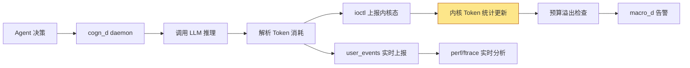

Copyright (c) 2025-2026 SPHARX Ltd. All Rights Reserved.

# agentrt-linux（AirymaxOS）Token 效率监控
> **文档定位**：agentrt-linux（AirymaxOS）可观测性体系 L8 层——agentrt-linux 专属 Token 能效监控的工程规范\
> **文档版本**：v1.0.1\
> **最后更新**： 2026-07-21\
> **上级文档**：[90-observability README](README.md)\
> **同源映射**：agentrt E-2 可观测性 + cogn_d daemon + A-ULS macro_d 监管\
> **理论根基**：Linux 6.6 内核基线 + Airymax 五维正交 24 原则 + sched_tac 调度\
> **核心约束**：Token 效率监控是 agentrt-linux 专属 L8 层可观测性，A-ULS 模块 macro_d 强制监管

---

## 目录

- [第 1 章 Token 效率监控概述](#第-1-章-token-效率监控概述)
- [第 2 章 Token 消耗追踪机制](#第-2-章-token-消耗追踪机制)
- [第 3 章 Token 效率指标体系](#第-3-章-token-效率指标体系)
- [第 4 章 Token 预算溢出告警](#第-4-章-token-预算溢出告警)
- [第 5 章 /proc/airy/agents/[id]/token_stats 接口](#第-5-章-procairyagentsidtoken_stats-接口)
- [第 6 章 Token 效率历史趋势](#第-6-章-token-效率历史趋势)
- [第 7 章 与 cogn_d daemon 的关系](#第-7-章-与-cogn_d-daemon-的关系)
- [第 8 章 Airymax Unify Design 映射](#第-8-章-airymax-unify-design-映射)
- [第 9 章 相关文档与版本维护](#第-9-章-相关文档与版本维护)

---

## 第 1 章 Token 效率监控概述

### 1.1 定位

Token 效率监控是 agentrt-linux 专属的可观测性 L8 层，专门追踪智能体操作系统中每个 Agent 的 Token（模型推理的最小计算单位）消耗与产出效率。与传统 Linux 内核观测 CPU/内存/IO 不同，Token 是智能体操作系统的"计算货币"，其消耗效率直接决定系统整体经济性与可用性。agentrt-linux 将 Token 效率监控作为可观测性体系的一等公民，原因有三：

1. **经济性约束**：Agent 调用 LLM 推理服务按 Token 计费，无约束的 Token 消耗会导致系统运行成本失控。Token 效率监控是 A-ULS 模块 macro_d 执行预算监管的数据基础。
2. **行为诊断**：Token 消耗模式反映 Agent 决策质量——高 input/output 比率可能意味着提示工程低效，低 output/input 比率可能意味着模型输出冗余。Token 效率指标是 Agent 行为追踪的关键维度。
3. **sched_tac 协同**：SCHED_DEADLINE Agent 的 Token 预算必须与 runtime 预算匹配；Token 预算溢出会触发 macro_d 降级 Agent 至 SCHED_FIFO，是sched_tac 调度类切换的触发条件之一。

**OS-OBS-071: Token 效率监控是 agentrt-linux 可观测性 L8 层的强制基线，所有 Agent 必须接受 Token 消耗追踪，不得存在"匿名 Token 消费"路径。**

**OS-KER-161: kernel 的 defconfig 必须开启 CONFIG_AIRY_TOKEN_MONITOR；agentrt.ko 必须在 module_init 阶段注册 Token 追踪数据结构。**

### 1.2 框架组成

| 组件 | 实现位置 | 职责 |
|------|----------|------|
| Token 计数器 | `kernel/agentrt/airy_token.c` | per-Agent Token 消耗计数 |
| cogn_d 上报 | `daemons/cogn_d/token_reporter.c` | 用户态 Token 消耗上报 |
| procfs 接口 | `kernel/agentrt/airy_token_procfs.c` | `/proc/airy/agents/[id]/token_stats` |
| A-ULS 监管 | `daemons/macro_d/token_superv.c` | 预算溢出告警与执法 |
| A-ULP 持久化 | `daemons/logger_d/token_persister.c` | 历史趋势落盘 |
| user_events | `daemons/cogn_d/user_events.c` | 实时 Token 事件上报 |

**OS-STD-061: Token 效率监控的核心数据结构必须在内核态维护，避免用户态伪造；用户态（cogn_d）仅负责上报，不负责存储。**

### 1.3 Token 消耗模型

agentrt-linux 中，Token 消耗分为四类：

| Token 类型 | 含义 | 来源 |
|-----------|------|------|
| `input_tokens` | 输入 Token（提示词） | LLM 推理请求的 prompt |
| `output_tokens` | 输出 Token（生成内容） | LLM 推理响应的 completion |
| `cache_hit_tokens` | 缓存命中 Token（不计费） | LLM 服务端 prompt cache |
| `reasoning_tokens` | 推理 Token（思维链） | LLM 内部 reasoning（如 o1 系列） |

---

## 第 2 章 Token 消耗追踪机制

### 2.1 追踪数据结构

每个 Agent 拥有独立的 Token 追踪数据结构：

```c
/* include/linux/agentrt/airy_token.h */

struct airy_token_stats {
    /* 累计计数（自 Agent 创建起） */
    u64 input_tokens_total;
    u64 output_tokens_total;
    u64 cache_hit_tokens_total;
    u64 reasoning_tokens_total;

    /* 时间窗口计数（滑动窗口，默认 60s） */
    u64 input_tokens_window;
    u64 output_tokens_window;
    u64 window_start_ns;

    /* 预算信息 */
    u64 token_budget;           /* 总预算 */
    u64 token_used;             /* 已用预算 */
    u64 token_remaining;        /* 剩余预算 */
    u32 budget_ratio_ppm;       /* 已用百分比（ppm，百万分比） */

    /* 效率指标 */
    u32 output_input_ratio_ppm; /* output/input 比率（ppm） */
    u32 effective_ratio_ppm;    /* 有效 Token 比率（ppm） */
    u32 cache_hit_ratio_ppm;    /* 缓存命中率（ppm） */

    /* 警告状态 */
    u8  alert_state;            /* 0=NORMAL, 1=ALERT, 2=EXCEEDED */
    u64 alert_triggered_ns;     /* 告警触发时间 */
};

struct airy_agent_token {
    struct airy_token_stats stats;
    spinlock_t lock;            /* 保护 stats 并发更新 */
    struct list_head history;   /* 历史快照链表（最近 60 个） */
};
```

### 2.2 追踪点埋点

Token 消耗的追踪点分布在 cogn_d daemon 的关键路径：

```c
/* cogn_d daemon 在每次 LLM 推理调用后上报 */
void cogn_d_on_llm_complete(u32 agent_id,
                            u32 input_tokens,
                            u32 output_tokens,
                            u32 cache_hit_tokens,
                            u32 reasoning_tokens)
{
    struct airy_token_delta delta = {
        .agent_id = agent_id,
        .input_tokens = input_tokens,
        .output_tokens = output_tokens,
        .cache_hit_tokens = cache_hit_tokens,
        .reasoning_tokens = reasoning_tokens,
        .timestamp_ns = airy_get_monotonic_ns(),
    };
    /* 通过 ioctl 上报到内核态 */
    ioctl(token_fd, AIRY_TOKEN_IOCTL_REPORT, &delta);

    /* 同时通过 user_events 上报（实时分析） */
    struct airy_user_token_consume ev = {
        .agent_id = agent_id,
        .input_tokens = input_tokens,
        .output_tokens = output_tokens,
    };
    airy_user_event_write(&token_consume_ev, &ev, sizeof(ev));
}
```

### 2.3 内核态更新流程

内核态在收到 cogn_d 上报后，更新 Agent 的 Token 统计：

```c
/* kernel/agentrt/airy_token.c */
int airy_token_report(u32 agent_id, struct airy_token_delta *delta)
{
    struct airy_agent_token *token;
    unsigned long flags;

    token = airy_token_get(agent_id);
    if (!token)
        return -ENOENT;

    spin_lock_irqsave(&token->lock, flags);

    /* 累计计数 */
    token->stats.input_tokens_total += delta->input_tokens;
    token->stats.output_tokens_total += delta->output_tokens;
    token->stats.cache_hit_tokens_total += delta->cache_hit_tokens;
    token->stats.reasoning_tokens_total += delta->reasoning_tokens;

    /* 时间窗口计数（需检查窗口是否过期） */
    airy_token_update_window(token, delta);

    /* 预算扣减（仅计费 input + output，cache_hit 不计费） */
    token->stats.token_used += delta->input_tokens + delta->output_tokens;
    token->stats.token_remaining = token->stats.token_budget - token->stats.token_used;
    token->stats.budget_ratio_ppm =
        div_u64(token->stats.token_used * 1000000ULL, token->stats.token_budget);

    /* 效率指标计算 */
    if (token->stats.input_tokens_total > 0) {
        token->stats.output_input_ratio_ppm =
            div_u64(token->stats.output_tokens_total * 1000000ULL,
                    token->stats.input_tokens_total);
    }
    if (token->stats.input_tokens_total + token->stats.output_tokens_total > 0) {
        token->stats.effective_ratio_ppm =
            div_u64(token->stats.output_tokens_total * 1000000ULL,
                    token->stats.input_tokens_total + token->stats.output_tokens_total);
    }
    if (token->stats.input_tokens_total + token->stats.cache_hit_tokens_total > 0) {
        token->stats.cache_hit_ratio_ppm =
            div_u64(token->stats.cache_hit_tokens_total * 1000000ULL,
                    token->stats.input_tokens_total + token->stats.cache_hit_tokens_total);
    }

    /* 检查预算溢出 */
    airy_token_check_budget(token);

    spin_unlock_irqrestore(&token->lock, flags);
    return 0;
}
```

**OS-KER-162: 内核态 Token 统计更新必须使用 `spin_lock_irqsave` 保护，避免 cogn_d 上报与 procfs 读取并发导致数据不一致。**

---

## 第 3 章 Token 效率指标体系

### 3.1 核心指标

| 指标 | 计算方式 | 含义 | 健康基线 |
|------|---------|------|---------|
| `output_input_ratio` | output_tokens / input_tokens | 输出/输入比率，反映提示工程效率 | ≥ 0.5（500000 ppm） |
| `effective_ratio` | output_tokens / (input + output) | 有效产出占比 | ≥ 0.33（333333 ppm） |
| `cache_hit_ratio` | cache_hit / (input + cache_hit) | 缓存命中率 | ≥ 0.6（600000 ppm） |
| `budget_consumption_rate` | token_used / time_elapsed | 预算消耗速率 | ≤ budget / period |
| `reasoning_overhead` | reasoning / (input + output + reasoning) | 推理开销占比 | ≤ 0.5（500000 ppm） |

### 3.2 指标分级

agentrt-linux 将 Token 效率指标分为三级：

| 等级 | 颜色 | 触发条件 | 处置 |
|------|------|---------|------|
| 优秀 | 绿 | output_input_ratio ≥ 0.8 且 cache_hit_ratio ≥ 0.7 | 无 |
| 良好 | 黄 | output_input_ratio ≥ 0.5 且 cache_hit_ratio ≥ 0.5 | 无 |
| 警告 | 橙 | output_input_ratio < 0.5 或 cache_hit_ratio < 0.5 | cogn_d 优化提示工程 |
| 危险 | 红 | output_input_ratio < 0.2 或 budget_ratio > 0.9 | macro_d 降级或终止 |

### 3.3 效率指标示例

```bash
$ cat /proc/airy/agents/42/token_stats
agent_id: 42
=== 累计计数 ===
input_tokens_total: 1234567
output_tokens_total: 987654
cache_hit_tokens_total: 1500000
reasoning_tokens_total: 456789

=== 时间窗口（60s） ===
input_tokens_window: 23456
output_tokens_window: 18765
window_start_ns: 1784328868912

=== 预算信息 ===
token_budget: 10000000
token_used: 2222221
token_remaining: 7777779
budget_ratio: 22.22%       # 222222 ppm

=== 效率指标 ===
output_input_ratio: 0.80    # 800000 ppm（优秀）
effective_ratio: 0.44       # 444444 ppm（良好）
cache_hit_ratio: 0.75       # 750000 ppm（优秀）
reasoning_overhead: 0.17    # 170000 ppm（良好）

=== 警告状态 ===
alert_state: NORMAL         # 0=NORMAL
alert_triggered_ns: 0
```

**OS-OBS-072: Agent 的 `output_input_ratio` 连续 5 分钟低于 0.2 视为提示工程严重低效，需触发 cogn_d 自动提示工程优化流程。**

---

## 第 4 章 Token 预算溢出告警

### 4.1 A-ULS 模块 macro_d 监管

A-ULS（Unified Supervision）模块的 macro_d daemon 负责 Token 预算监管。监管策略分三层：

| 层级 | 触发条件 | 执法动作 | 调度类影响 |
|------|---------|---------|-----------|
| L1 告警 | budget_ratio > 80% | 通知 cogn_d 优化 | 无 |
| L2 降级 | budget_ratio > 95% | SCHED_DEADLINE → SCHED_FIFO | 调度类降级 |
| L3 终止 | budget_ratio > 100% | 终止 Agent | Agent 退出 |

### 4.2 告警触发流程

```c
/* kernel/agentrt/airy_token.c */
static void airy_token_check_budget(struct airy_agent_token *token)
{
    u32 ratio = token->stats.budget_ratio_ppm;

    if (ratio >= 1000000) {
        /* 100% 溢出，触发终止 */
        token->stats.alert_state = 2;  /* EXCEEDED */
        token->stats.alert_triggered_ns = airy_get_monotonic_ns();
        /* 通过 user_events 上报 */
        trace_airy_token_exceeded(token->stats.agent_id,
                                  token->stats.token_used,
                                  token->stats.token_budget);
        /* 通知 macro_d 执行终止 */
        airy_superv_notify(SUPERV_ACTION_TERMINATE,
                          token->stats.agent_id,
                          SUPERV_REASON_TOKEN_BUDGET_EXCEEDED);
    } else if (ratio >= 950000) {
        /* 95% 临界，触发降级 */
        if (token->stats.alert_state < 1) {
            token->stats.alert_state = 1;  /* ALERT */
            token->stats.alert_triggered_ns = airy_get_monotonic_ns();
            trace_airy_token_alert(token->stats.agent_id,
                                   token->stats.token_used,
                                   token->stats.token_budget);
            /* 通知 macro_d 执行降级 */
            airy_superv_notify(SUPERV_ACTION_DOWNGRADE,
                              token->stats.agent_id,
                              SUPERV_REASON_TOKEN_BUDGET_CRITICAL);
        }
    } else if (ratio >= 800000) {
        /* 80% 告警，通知 cogn_d 优化 */
        trace_airy_token_warning(token->stats.agent_id,
                                 token->stats.token_used,
                                 token->stats.token_budget);
    }
}
```

### 4.3 macro_d 执法动作

macro_d 收到 Token 预算告警后，执行对应执法动作：

| 告警等级 | macro_d 动作 | 微观效果 |
|---------|------------------|---------|
| L1 告警（80%） | 向 cogn_d 发送 `OPTIMIZE_PROMPT` 建议 | cogn_d 启动提示工程优化 |
| L2 降级（95%） | `sched_setscheduler()` 将 Agent 从 SCHED_DEADLINE 降级至 SCHED_FIFO | 调度类切换，tracepoint 记录 |
| L3 终止（100%） | `kill(SIGTERM)` 终止 Agent，回收资源 | Agent 进入 TERMINATED 状态 |

### 4.4 告警历史记录

所有 Token 预算告警通过 A-ULP Ring Buffer 持久化：

```bash
$ grep "TOKEN_BUDGET" /var/log/airy/agentrt.log | tail -5
[2026-07-18 10:23:45] WARNING agent=42 budget_ratio=80.12% action=OPTIMIZE_PROMPT
[2026-07-18 10:24:12] ALERT    agent=42 budget_ratio=95.34% action=DOWNGRADE DL→RT
[2026-07-18 10:25:01] CRITICAL agent=42 budget_ratio=100.00% action=TERMINATE
```

**OS-OBS-073: Token 预算告警必须通过 A-ULP Ring Buffer 持久化，保留至少 90 天；告警记录是合规审计的关键证据。**

---

## 第 5 章 /proc/airy/agents/[id]/token_stats 接口

### 5.1 接口定义

Token 效率监控通过 `/proc/airy/agents/[id]/token_stats` 文件导出，详细接口规范见 [04-sysfs-procfs.md](04-sysfs-procfs.md) 第 4 章。本文档聚焦于 Token 专属字段的语义。

### 5.2 完整输出示例

```bash
$ cat /proc/airy/agents/42/token_stats
agent_id: 42
report_time_ns: 1784328868912

=== 累计计数（自 Agent 创建） ===
input_tokens_total: 1234567
output_tokens_total: 987654
cache_hit_tokens_total: 1500000
reasoning_tokens_total: 456789
billable_tokens_total: 2222221   # input + output

=== 时间窗口（60s 滑动） ===
input_tokens_window: 23456
output_tokens_window: 18765
cache_hit_tokens_window: 28571
reasoning_tokens_window: 8765
window_start_ns: 1784328868912
window_duration_s: 60

=== 预算信息 ===
token_budget: 10000000
token_used: 2222221
token_remaining: 7777779
budget_ratio: 22.22%
budget_period_s: 3600            # 预算周期（1 小时）
budget_consumption_rate: 37.04 tokens/s

=== 效率指标 ===
output_input_ratio: 0.8000       # 800000 ppm
effective_ratio: 0.4444          # 444444 ppm
cache_hit_ratio: 0.7500          # 750000 ppm
reasoning_overhead: 0.1700       # 170000 ppm
efficiency_grade: EXCELLENT      # EXCELLENT / GOOD / WARNING / CRITICAL

=== 警告状态 ===
alert_state: NORMAL              # NORMAL / ALERT / EXCEEDED
alert_triggered_ns: 0
last_alert_action: NONE          # NONE / OPTIMIZE_PROMPT / DOWNGRADE / TERMINATE
last_alert_time_ns: 0

=== 历史快照（最近 5 个，每 5 分钟） ===
[1784328568912] used=2100000 ratio=21.00% grade=EXCELLENT
[1784328628912] used=2150000 ratio=21.50% grade=EXCELLENT
[1784328688912] used=2200000 ratio=22.00% grade=EXCELLENT
[1784328748912] used=2210000 ratio=22.10% grade=EXCELLENT
[1784328808912] used=2222221 ratio=22.22% grade=EXCELLENT
```

### 5.3 procfs 实现规范

```c
/* kernel/agentrt/airy_token_procfs.c */
static int token_stats_show(struct seq_file *m, void *v)
{
    struct airy_agent_token *token = m->private;
    unsigned long flags;

    spin_lock_irqsave(&token->lock, flags);
    seq_printf(m, "agent_id: %u\n", token->stats.agent_id);
    seq_printf(m, "report_time_ns: %llu\n", airy_get_monotonic_ns());
    seq_printf(m, "\n=== 累计计数 ===\n");
    seq_printf(m, "input_tokens_total: %llu\n", token->stats.input_tokens_total);
    seq_printf(m, "output_tokens_total: %llu\n", token->stats.output_tokens_total);
    seq_printf(m, "cache_hit_tokens_total: %llu\n", token->stats.cache_hit_tokens_total);
    seq_printf(m, "reasoning_tokens_total: %llu\n", token->stats.reasoning_tokens_total);
    /* ... 其余字段 ... */
    spin_unlock_irqrestore(&token->lock, flags);
    return 0;
}
```

**OS-STD-062: `/proc/airy/agents/[id]/token_stats` 的 `show()` 回调必须在自旋锁保护下读取，避免读取到中间状态。**

---

## 第 6 章 Token 效率历史趋势

### 6.1 logger_d 持久化

logger_d 定期将 Token 效率快照持久化至磁盘：

```bash
# 快照存储路径
/var/log/airy/token-history/
├── agent-42/
│   ├── 2026-07-18.csv          # 当日历史
│   ├── 2026-07-17.csv
│   └── ...
├── agent-43/
│   └── ...
└── summary.csv                 # 全 Agent 汇总
```

### 6.2 CSV 格式

每个 Agent 的历史 CSV 格式：

```csv
timestamp_ns,agent_id,input_total,output_total,cache_hit_total,reasoning_total,budget_used,budget_total,ratio_ppm,output_input_ratio_ppm,effective_ratio_ppm,cache_hit_ratio_ppm,grade,alert_state
1784328868912,42,1234567,987654,1500000,456789,2222221,10000000,222222,800000,444444,750000,EXCELLENT,NORMAL
1784328928912,42,1245678,998765,1510000,457000,2244443,10000000,224444,800000,444444,750000,EXCELLENT,NORMAL
...
```

### 6.3 趋势分析

logger_d 提供趋势分析工具 `airy-token-trend`：

```bash
# 查看 Agent 42 最近 24 小时的 Token 消耗趋势
airy-token-trend --agent 42 --duration 24h --output chart.png

# 输出文本摘要
Agent 42 Token Trend (last 24h):
  Input tokens:  1,234,567 → 2,345,678 (+90.0%)
  Output tokens: 987,654 → 1,876,543 (+90.0%)
  Budget used:   22.2% → 42.1%
  Cache hit:     75.0% → 78.2% (improved)
  Efficiency:    EXCELLENT (stable)
  Predicted exhaustion: ~48h at current rate
```

### 6.4 预测与容量规划

基于历史趋势，logger_d 可预测 Token 预算耗尽时间：

```bash
$ airy-token-predict --agent 42
Agent 42 Token Budget Prediction:
  Current budget_remaining: 7,777,779 tokens
  Consumption rate (24h avg): 1,111,114 tokens/h
  Predicted exhaustion: ~7.0 hours
  Recommended action: Increase budget by 8,000,000 tokens for 24h operation
```

**OS-OBS-074: logger_d 必须每 5 分钟生成一次 Token 效率快照；快照保留至少 90 天，供趋势分析与容量规划使用。**

---

## 第 7 章 与 cogn_d daemon 的关系

### 7.1 cogn_d 职责

cogn_d daemon 是 agentrt-linux 的认知循环守护进程，负责：

1. **LLM 推理调用**：代理 Agent 调用外部 LLM 服务（如 OpenAI API、本地模型）。
2. **Token 计量**：从 LLM 响应中解析 Token 消耗，上报至内核态。
3. **提示工程优化**：根据 Token 效率指标自动优化提示词。

### 7.2 cogn_d 与 Token 监控的交互



### 7.3 cogn_d 自动优化

当 Token 效率指标低于阈值时，cogn_d 启动自动优化流程：

```c
/* cogn_d daemon 自动优化逻辑 */
void cogn_d_auto_optimize(u32 agent_id)
{
    struct airy_token_stats stats;
    /* 从 procfs 读取当前统计 */
    airy_token_read_stats(agent_id, &stats);

    if (stats.output_input_ratio_ppm < 200000) {
        /* output/input < 0.2，提示词过长 */
        cogn_d_optimize_prompt(agent_id, OPTIMIZE_COMPRESS_PROMPT);
    }

    if (stats.cache_hit_ratio_ppm < 500000) {
        /* cache_hit < 0.5，缓存利用不足 */
        cogn_d_optimize_prompt(agent_id, OPTIMIZE_IMPROVE_CACHE);
    }

    if (stats.reasoning_overhead > 500000) {
        /* reasoning > 0.5，推理开销过大 */
        cogn_d_optimize_prompt(agent_id, OPTIMIZE_REDUCE_REASONING);
    }
}
```

### 7.4 cogn_d 与sched_tac

cogn_d 的 LLM 推理调用是 SCHED_DEADLINE 调度类的主要负载：

| Agent 类型 | 调度类 | Token 消耗特征 | cogn_d 优化方向 |
|-----------|--------|--------------|----------------|
| 工具调用 Agent | SCHED_DEADLINE | 高 input，中 output | 提高缓存命中 |
| 规划器 Agent | SCHED_FIFO | 中 input，高 output | 平衡推理开销 |
| 监控 Agent | EEVDF | 低 input，低 output | 无需优化 |

**OS-OBS-075: SCHED_DEADLINE Agent 的 Token 预算耗尽必须触发降级至 SCHED_FIFO；降级后 cogn_d 应减少 LLM 调用频率，避免进一步消耗。**

---

## 第 8 章 Airymax Unify Design 映射

### 8.1 五模块关系

| Unify 模块 | 关系 | 在 Token 效率监控中的体现 |
|-----------|------|------------------------|
| **A-UEF** | 辅助 | Token 预算溢出触发 `AIRY_FAULT_TOKEN_BUDGET_EXCEEDED` 错误码 |
| **A-ULP** | **核心** | Token 效率历史趋势通过 A-ULP Ring Buffer 持久化至磁盘 |
| **A-UCS** | 辅助 | Token 预算配置通过 A-UCS config_d 热重载 |
| **A-ULS** | **核心** | macro_d 强制监管 Token 预算，执行降级/终止 |
| **A-IPC** | 辅助 | cogn_d 通过 A-IPC IPC 调用 LLM 服务，Token 消耗经 IPC 上报 |

### 8.2 与 12 daemon 的 Token 监控映射

| Daemon | Token 监控角色 |
|--------|--------------|
| macro_d | **执行者**：预算溢出告警与执法 |
| logger_d | **持久化者**：历史趋势落盘 |
| config_d | **配置者**：预算阈值热重载 |
| cogn_d | **上报者**：LLM 调用后上报 Token 消耗 |
| sched_d | **响应者**：降级时切换调度类 |
| 其他 7 个 daemon | 不直接参与 Token 监控 |

---

## 第 9 章 相关文档与版本维护

### 9.1 相关文档

- [90-observability README](README.md)：可观测性体系主索引
- [02-ebpf-probes.md](02-ebpf-probes.md)：eBPF 探针（Token 消耗 tracepoint）
- [04-sysfs-procfs.md](04-sysfs-procfs.md)：sysfs/procfs 接口（token_stats 文件）
- [06-user-events.md](06-user-events.md)：user_events 接口（token_consume 事件）
- [08-agent-tracing.md](08-agent-tracing.md)：Agent 行为追踪（Token 作为追踪维度）
- [../20-modules/](../20-modules/README.md)：模块设计（cogn_d / macro_d / logger_d）

### 9.2 参考材料

- OpenAI API Pricing（Token 计费模型参考）
- Anthropic Claude API（Token 计量规范）
- Linux 6.6 `Documentation/accounting/`（计数子系统参考）
- Linux 6.6 `kernel/events/core.c`（perf_event 计数器设计参考）

### 9.3 版本历史

| 版本 | 日期 | 变更 |
|------|------|------|
| v1.0.1 | 2026-07-18 | 初始版本：Token 消耗追踪机制、效率指标体系（output/input、effective、cache_hit）、预算溢出告警（L1/L2/L3 三层）、/proc/airy/agents/[id]/token_stats 接口、logger_d 历史趋势持久化、cogn_d daemon 协同 |

---

> **文档结束** | agentrt-linux Token 效率监控 v1.0.1 | 维护者：开源极境工程与规范委员会 | "In the economy of intelligence, tokens are the currency of thought."
