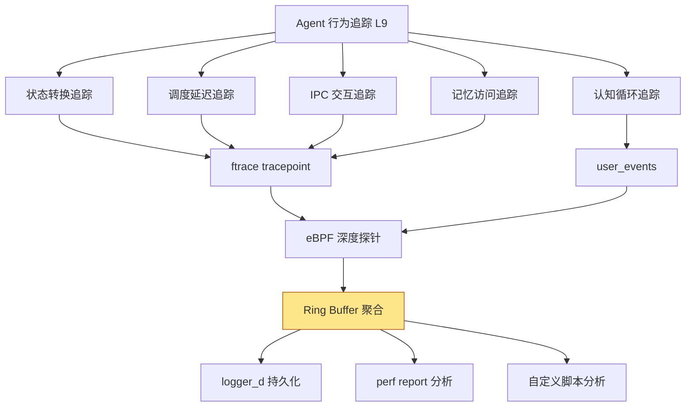
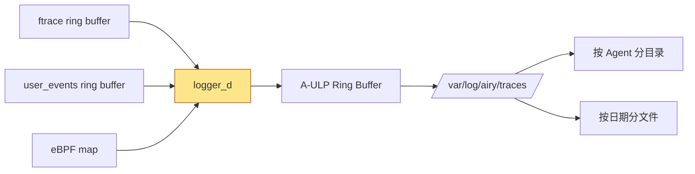

Copyright (c) 2025-2026 SPHARX Ltd. All Rights Reserved.

# agentrt-linux（AirymaxOS）Agent 行为追踪
> **文档定位**：agentrt-linux（AirymaxOS）可观测性体系 L9 层——agentrt-linux 专属 Agent 行为追踪的工程规范\
> **文档版本**：v1.0.1\
> **最后更新**：2026-07-18\
> **上级文档**：[90-observability README](README.md)\
> **同源映射**：agentrt E-2 可观测性 + ftrace + user_events + eBPF 三位一体追踪\
> **理论根基**：Linux 6.6 内核基线 + Airymax 五维正交 24 原则 + sched_tac 调度\
> **核心约束**：Agent 行为追踪是 agentrt-linux 专属 L9 层可观测性，覆盖 Agent 决策路径全生命周期

---

## 目录

- [第 1 章 Agent 行为追踪概述](#第-1-章-agent-行为追踪概述)
- [第 2 章 追踪维度体系](#第-2-章-追踪维度体系)
- [第 3 章 追踪工具栈](#第-3-章-追踪工具栈)
- [第 4 章 Agent 调用图](#第-4-章-agent-调用图)
- [第 5 章 追踪数据持久化](#第-5-章-追踪数据持久化)
- [第 6 章 追踪数据分析](#第-6-章-追踪数据分析)
- [第 7 章 状态转换追踪](#第-7-章-状态转换追踪)
- [第 8 章 IPC 交互追踪](#第-8-章-ipc-交互追踪)
- [第 9 章 认知循环追踪](#第-9-章-认知循环追踪)
- [第 10 章 Airymax Unify Design 映射](#第-10-章-airymax-unify-design-映射)
- [第 11 章 相关文档与版本维护](#第-11-章-相关文档与版本维护)

---

## 第 1 章 Agent 行为追踪概述

### 1.1 定位

Agent 行为追踪是 agentrt-linux 专属的可观测性 L9 层，专门追踪智能体操作系统中每个 Agent 从创建到终止的完整决策路径与行为序列。与传统 Linux 内核追踪进程的 syscall/CPU/IO 不同，Agent 行为追踪聚焦于智能体特有的语义维度：状态转换、调度延迟、IPC 交互、记忆访问、认知循环。agentrt-linux 将 Agent 行为追踪作为可观测性体系的最高语义层，原因有三：

1. **决策可审计性**：Agent 的每次决策（认知→规划→调度→执行）必须可追溯，是合规审计与故障诊断的基础。Agent 行为追踪记录完整的决策路径，满足金融/医疗等强监管场景的审计要求。
2. **性能归因**：Agent 性能问题（如响应延迟、Token 超预算）需要追溯到具体的决策环节。行为追踪提供从 LLM 推理调用到 IPC 交互的端到端归因能力。
3. **sched_tac 协同**：Agent 的调度类切换（DL→RT→EEVDF）是sched_tac 的核心机制，行为追踪记录每次切换的触发原因与效果，是验证sched_tac 有效性的关键数据源。

**OS-OBS-081: Agent 行为追踪是 agentrt-linux 可观测性 L9 层的强制基线，所有 Agent 必须接受行为追踪，不得存在"匿名行为"路径。**

**OS-KER-171: kernel 的 defconfig 必须开启 CONFIG_AIRY_AGENT_TRACING；agentrt.ko 必须在 module_init 阶段注册 Agent 行为追踪基础设施。**

### 1.2 框架组成

| 组件 | 实现位置 | 职责 |
|------|----------|------|
| 行为追踪核心 | `kernel/agentrt/airy_trace.c` | per-Agent 追踪上下文管理 |
| ftrace tracepoint | `include/trace/events/airy.h` | 内核态行为事件 |
| user_events 桥接 | `daemons/cogn_d/user_events.c` | 用户态行为事件 |
| eBPF 探针 | `tools/agentrt/ebpf/agent_trace.bpf.c` | 可编程深度追踪 |
| 调用图生成 | `kernel/agentrt/airy_call_graph.c` | Agent 调用图构建 |
| 持久化 | `daemons/logger_d/trace_persister.c` | 追踪数据落盘 |
| 分析工具 | `tools/agentrt/airy-trace-analyze.py` | 追踪数据分析 |

**OS-STD-071: Agent 行为追踪数据必须在内核态聚合，用户态仅负责消费；不得在用户态维护 Agent 调用图，避免数据不一致。**

### 1.3 追踪层次



---

## 第 2 章 追踪维度体系

### 2.1 五大追踪维度

agentrt-linux 定义 Agent 行为追踪的五大维度：

| 维度 | 追踪内容 | 主要工具 | 数据来源 |
|------|---------|---------|---------|
| **状态转换** | Agent 8 态生命周期迁移 | ftrace tracepoint | 内核态 |
| **调度延迟** | sched_tac 三层调度类切换延迟 | ftrace + perf sched | 内核态 |
| **IPC 交互** | Agent 间消息发送/接收 | ftrace + user_events | 内核+用户态 |
| **记忆访问** | L1-L4 记忆层级访问 | user_events | 用户态 |
| **认知循环** | LLM 推理调用与 Token 消耗 | user_events | 用户态 |

### 2.2 追踪事件矩阵

| 事件名 | 维度 | 触发点 | 工具 |
|--------|------|--------|------|
| `airy_agent_state_change` | 状态转换 | 状态机迁移 | ftrace |
| `airy_sched_switch` | 调度延迟 | 调度类切换 | ftrace |
| `airy_sched_latency` | 调度延迟 | 唤醒到运行延迟 | ftrace |
| `airy_ipc_send` | IPC 交互 | 消息发送 | ftrace |
| `airy_ipc_recv` | IPC 交互 | 消息接收 | ftrace |
| `airy_memory_access` | 记忆访问 | L1-L4 访问 | user_events |
| `airy_cognition_start` | 认知循环 | LLM 推理开始 | user_events |
| `airy_cognition_end` | 认知循环 | LLM 推理结束 | user_events |
| `airy_tool_call` | 认知循环 | 工具调用 | user_events |
| `airy_token_consume` | 认知循环 | Token 消耗 | user_events |
| `airy_superv_enforce` | 状态转换 | 监管执法 | ftrace |

### 2.3 追踪粒度

agentrt-linux 支持三级追踪粒度：

| 粒度 | 事件数/Agent/秒 | 开销 | 适用场景 |
|------|---------------|------|---------|
| 粗粒度 | ≤ 10 | < 0.1% CPU | 生产环境常态监控 |
| 中粒度 | ≤ 100 | < 1% CPU | 性能问题诊断 |
| 细粒度 | ≤ 1000 | < 5% CPU | 深度调试与开发 |

**OS-OBS-082: 生产环境默认启用粗粒度追踪；中/细粒度追踪必须经 macro_d 批准，且设置自动关闭时间（≤ 30 分钟）。**

---

## 第 3 章 追踪工具栈

### 3.1 ftrace + user_events + eBPF 三位一体

agentrt-linux Agent 行为追踪采用三工具协同：

| 工具 | 角色 | 优势 | 局限 |
|------|------|------|------|
| **ftrace** | 内核态事件采集 | 零依赖、内核内建 | 固定格式、不可编程 |
| **user_events** | 用户态事件桥接 | < 10ns/事件、零拷贝 | 仅用户态事件 |
| **eBPF** | 可编程深度探针 | 可编程、可聚合 | 加载开销、验证器限制 |

### 3.2 工具选择决策树

```
需要追踪 Agent 行为？
├── 内核态事件（调度/IPC）？
│   └── 使用 ftrace tracepoint
├── 用户态事件（认知/记忆）？
│   └── 使用 user_events
└── 需要复杂聚合/过滤？
    └── 使用 eBPF 挂载到 tracepoint/user_events
```

### 3.3 ftrace 追踪配置

启用 Agent 行为追踪的标准 ftrace 配置：

```bash
# 创建独立 trace instance（避免污染主 buffer）
mkdir /sys/kernel/tracing/instances/agent_trace

# 启用 airy 事件
echo 1 > /sys/kernel/tracing/instances/agent_trace/events/airy/enable

# 设置过滤器（仅追踪 agent_id=42）
echo 'agent_id == 42' > \
    /sys/kernel/tracing/instances/agent_trace/events/airy/agent_state_change/filter
echo 'agent_id == 42' > \
    /sys/kernel/tracing/instances/agent_trace/events/airy/sched_switch/filter

# 设置 ring buffer 大小（16MB/CPU）
echo 16384 > /sys/kernel/tracing/instances/agent_trace/buffer_size_kb

# 启用追踪
echo 1 > /sys/kernel/tracing/instances/agent_trace/tracing_on
```

### 3.4 user_events 追踪配置

启用 cogn_d 的 user_events 追踪：

```bash
# 启用 cognition 事件
echo 1 > /sys/kernel/tracing/events/user_events/cognition_start/enable
echo 1 > /sys/kernel/tracing/events/user_events/cognition_end/enable
echo 1 > /sys/kernel/tracing/events/user_events/memory_access/enable
echo 1 > /sys/kernel/tracing/events/user_events/tool_call/enable

# 设置过滤器
echo 'agent_id == 42' > \
    /sys/kernel/tracing/events/user_events/cognition_start/filter
```

### 3.5 eBPF 深度探针

对于需要复杂聚合的场景，使用 eBPF 程序挂载到 tracepoint：

```c
/* tools/agentrt/ebpf/agent_trace.bpf.c */
#include <vmlinux.h>
#include <bpf/bpf_tracing.h>

/* 聚合 Agent 调度延迟直方图 */
struct {
    __uint(type, BPF_MAP_TYPE_LRU_HASH);
    __type(key, u32);      /* agent_id */
    __type(value, u64);    /* total_latency_ns */
    __uint(max_entries, 1024);
} agent_latency SEC(".maps");

SEC("tracepoint/airy/sched_switch")
int trace_airy_sched_switch(struct trace_event_raw_airy_sched_switch *ctx)
{
    u32 agent_id = ctx->agent_id;
    u64 latency = ctx->latency_ns;
    u64 *total = bpf_map_lookup_elem(&agent_latency, &agent_id);
    if (total) {
        __sync_fetch_and_add(total, latency);
    } else {
        u64 init = latency;
        bpf_map_update_elem(&agent_latency, &agent_id, &init, BPF_ANY);
    }
    return 0;
}
```

---

## 第 4 章 Agent 调用图

### 4.1 airy_trace_agent_call_graph() API

agentrt-linux 提供 `airy_trace_agent_call_graph()` API，用于构建 Agent 间的调用关系图：

```c
/* include/uapi/agentrt/trace.h */

struct airy_call_graph_node {
    u32 agent_id;
    u32 parent_id;          /* 父 Agent ID（0=根 Agent） */
    u32 call_count;         /* 被调用次数 */
    u64 total_latency_ns;   /* 累计调用延迟 */
    u32 avg_latency_ns;     /* 平均调用延迟 */
    char name[64];          /* Agent 名称 */
    u8  state;              /* 当前状态 */
};

struct airy_call_graph_edge {
    u32 src_agent_id;
    u32 dst_agent_id;
    u32 call_count;
    u64 total_latency_ns;
    u32 avg_latency_ns;
    u8  call_type;          /* IPC_SEND / TOOL_CALL / DELEGATE */
};

/**
 * airy_trace_agent_call_graph - 获取 Agent 调用图
 * @agent_id: 起始 Agent ID（0=全图）
 * @depth: 最大深度（0=无限制）
 * @nodes: 输出节点数组
 * @max_nodes: 节点数组容量
 * @edges: 输出边数组
 * @max_edges: 边数组容量
 *
 * 返回值：0 成功，负数错误码
 */
int airy_trace_agent_call_graph(u32 agent_id, u32 depth,
                                struct airy_call_graph_node *nodes,
                                u32 max_nodes, u32 *actual_nodes,
                                struct airy_call_graph_edge *edges,
                                u32 max_edges, u32 *actual_edges);
```

### 4.2 调用图构建

调用图在内核态实时维护，基于 IPC 交互与工具调用事件：

```c
/* kernel/agentrt/airy_call_graph.c */
struct airy_call_graph {
    struct list_head nodes;     /* 节点链表 */
    struct list_head edges;     /* 边链表 */
    spinlock_t lock;
    u32 node_count;
    u32 edge_count;
};

static struct airy_call_graph global_call_graph;

/* IPC 发送时更新调用图 */
void airy_call_graph_on_ipc_send(u32 src, u32 dst, u64 latency_ns)
{
    struct airy_call_graph_edge *edge;
    unsigned long flags;

    spin_lock_irqsave(&global_call_graph.lock, flags);
    edge = airy_call_graph_find_edge(src, dst);
    if (edge) {
        edge->call_count++;
        edge->total_latency_ns += latency_ns;
        edge->avg_latency_ns = edge->total_latency_ns / edge->call_count;
    } else {
        edge = kzalloc(sizeof(*edge), GFP_ATOMIC);
        edge->src_agent_id = src;
        edge->dst_agent_id = dst;
        edge->call_count = 1;
        edge->total_latency_ns = latency_ns;
        edge->avg_latency_ns = latency_ns;
        edge->call_type = IPC_SEND;
        list_add_tail(&edge->list, &global_call_graph.edges);
        global_call_graph.edge_count++;
    }
    spin_unlock_irqrestore(&global_call_graph.lock, flags);
}
```

### 4.3 调用图可视化

调用图通过 `/proc/airy/agents/[id]/call_graph` 导出，支持 Graphviz DOT 格式：

```bash
$ cat /proc/airy/agents/42/call_graph
# Agent 42 Call Graph (depth=3)
digraph agent_call_graph {
    rankdir=LR;
    node [shape=box];

    agent_42 [label="agent_42\ncogn_d_worker\nstate=COGNITION_RUNNING\ncalls=0"];
    agent_43 [label="agent_43\nsearch_agent\nstate=EXECUTING\ncalls=1234"];
    agent_44 [label="agent_44\nplanner\nstate=PLANNING\ncalls=567"];

    agent_42 -> agent_43 [label="IPC_SEND\n1234 calls\navg=1234ns"];
    agent_42 -> agent_44 [label="TOOL_CALL\n567 calls\navg=2345ns"];
    agent_44 -> agent_43 [label="DELEGATE\n89 calls\navg=3456ns"];
}
```

转换为图片：

```bash
dot -Tpng /proc/airy/agents/42/call_graph -o call_graph.png
```

### 4.4 调用图分析示例

```bash
$ airy-trace-analyze --call-graph --agent 42 --depth 3
Agent 42 Call Graph Analysis:
  Total nodes: 5
  Total edges: 8
  Max depth: 3
  Critical path: agent_42 → agent_43 → agent_50 (avg 4567ns)
  Hotspot: agent_43 (1234 calls, avg 1234ns)
  Bottleneck: agent_50 (avg 4567ns, 89 calls)
  Recommendation: Consider caching agent_50 results
```

**OS-OBS-083: Agent 调用图必须实时反映当前状态；调用图更新延迟不得超过 100ms，避免基于过期数据做决策。**

---

## 第 5 章 追踪数据持久化

### 5.1 logger_d → Ring Buffer → 文件

Agent 行为追踪数据通过 logger_d 持久化至磁盘：



### 5.2 持久化路径

```
/var/log/airy/traces/
├── agent-42/
│   ├── 2026-07-18/
│   │   ├── ftrace.trace        # ftrace 原始追踪数据
│   │   ├── user_events.trace   # user_events 追踪数据
│   │   ├── call_graph.dot      # 调用图快照
│   │   └── analysis.json       # 自动分析结果
│   └── 2026-07-17/
│       └── ...
├── agent-43/
│   └── ...
└── global/
    └── 2026-07-18/
        └── sched_summary.csv   # 全局调度摘要
```

### 5.3 trace_pipe 流式消费

logger_d 通过 `trace_pipe` 流式消费追踪数据：

```bash
# logger_d 消费 ftrace 实例
cat /sys/kernel/tracing/instances/agent_trace/trace_pipe | \
    logger_d --trace-input --agent 42

# 消费 user_events
cat /sys/kernel/tracing/trace_pipe | \
    logger_d --user-events-input
```

### 5.4 持久化策略

| 数据类型 | 持久化频率 | 保留时长 | 存储格式 |
|---------|-----------|---------|---------|
| ftrace 追踪 | 实时（流式） | 7 天 | 原始 trace + 压缩 |
| user_events 追踪 | 实时（流式） | 7 天 | 原始 trace + 压缩 |
| 调用图快照 | 每 5 分钟 | 30 天 | DOT + JSON |
| 分析报告 | 每小时 | 90 天 | JSON |
| 关键事件（告警） | 实时 | 1 年 | CSV（A-ULP 日志） |

**OS-OBS-084: 追踪数据持久化必须使用 zstd 压缩（level=3），压缩率 ≥ 5:1，避免磁盘空间耗尽。**

**OS-STD-072: 追踪数据目录 `/var/log/airy/traces/` 必须挂载在独立分区或独立磁盘，避免追踪 IO 影响系统正常运行。**

---

## 第 6 章 追踪数据分析

### 6.1 perf report 分析

ftrace 追踪数据可导入 perf 进行分析：

```bash
# 将 ftrace trace 转为 perf.data
perf script -i /var/log/airy/traces/agent-42/2026-07-18/ftrace.trace \
    > perf-script.txt

# 使用 perf report 分析
perf report -i perf.data --sort overhead,symbol,dso
```

### 6.2 自定义分析脚本

agentrt-linux 提供 `airy-trace-analyze.py` 脚本，基于追踪数据生成分析报告：

```bash
# 分析 Agent 42 的行为追踪
airy-trace-analyze --agent 42 --date 2026-07-18 \
    --output /var/log/airy/traces/agent-42/2026-07-18/analysis.json

# 分析内容：
# 1. 状态转换频率与停留时间
# 2. 调度延迟分布（P50/P95/P99）
# 3. IPC 交互热点（最频繁的通信对）
# 4. 记忆访问模式（L1-L4 命中率）
# 5. 认知循环效率（Token/input vs output）
# 6. 异常事件统计（超时/错误/告警）
```

### 6.3 分析报告示例

```json
{
  "agent_id": 42,
  "date": "2026-07-18",
  "summary": {
    "total_events": 1234567,
    "uptime_seconds": 86400,
    "state_transitions": 5678,
    "ipc_interactions": 123456,
    "cognition_cycles": 1234,
    "token_consumed": 2222221
  },
  "state_analysis": {
    "COGNITION_RUNNING": {"count": 1234, "avg_duration_ms": 12.3},
    "PLANNING": {"count": 1234, "avg_duration_ms": 5.6},
    "SCHEDULING": {"count": 1234, "avg_duration_ms": 1.2},
    "EXECUTING": {"count": 1234, "avg_duration_ms": 23.4},
    "BLOCKED": {"count": 567, "avg_duration_ms": 45.6}
  },
  "sched_analysis": {
    "avg_latency_ns": 12345,
    "p99_latency_ns": 78123,
    "class_switches": {"DL_to_RT": 5, "RT_to_EEVDF": 2, "EEVDF_to_DL": 1}
  },
  "ipc_analysis": {
    "top_peers": [
      {"agent_id": 43, "calls": 1234, "avg_latency_ns": 1234},
      {"agent_id": 44, "calls": 567, "avg_latency_ns": 2345}
    ],
    "fastpath_ratio": 0.9963
  },
  "cognition_analysis": {
    "avg_cycle_latency_ms": 1500,
    "token_efficiency": 0.80,
    "cache_hit_ratio": 0.75
  },
  "anomalies": [
    {"type": "SCHED_LATENCY_SPIKE", "time": "...", "value": "234ms"},
    {"type": "IPC_TIMEOUT", "time": "...", "peer": 43}
  ]
}
```

### 6.4 趋势对比

```bash
# 对比 Agent 42 最近 7 天的行为趋势
airy-trace-analyze --agent 42 --compare 7d \
    --output /var/log/airy/traces/agent-42/trend-7d.json

# 输出趋势
Agent 42 Behavior Trend (7 days):
  Cognition cycles: 1200 → 1234 (+2.8%)
  Avg latency: 1450ms → 1500ms (+3.4%)
  Token efficiency: 0.82 → 0.80 (-2.4%)
  Cache hit ratio: 0.72 → 0.75 (+4.2%)
  IPC fastpath: 99.5% → 99.6% (stable)
  Anomalies: 3 → 1 (improving)
```

---

## 第 7 章 状态转换追踪

### 7.1 8 态生命周期

Agent 8 态生命周期迁移是行为追踪的核心维度。每个状态转换通过 `airy_agent_state_change` tracepoint 记录：

```bash
$ cat /sys/kernel/tracing/trace | grep agent_state_change
  cogn_d-1234 [000] d... 1784328868.912345: airy_agent_state_change: agent=42 CREATED→COGNITION_RUNNING reason=INIT
  sched_d-1235 [001] d... 1784328868.923456: airy_agent_state_change: agent=42 COGNITION_RUNNING→PLANNING reason=DAG_UPDATE
  sched_d-1235 [001] d... 1784328868.934567: airy_agent_state_change: agent=42 PLANNING→SCHEDULING reason=PLAN_READY
  sched_d-1235 [001] d... 1784328868.945678: airy_agent_state_change: agent=42 SCHEDULING→EXECUTING reason=DISPATCH
  cogn_d-1234 [000] d... 1784328868.956789: airy_agent_state_change: agent=42 EXECUTING→BLOCKED reason=IPC_WAIT
  cogn_d-1234 [000] d... 1784328868.967890: airy_agent_state_change: agent=42 BLOCKED→COGNITION_RUNNING reason=IPC_RECV
```

### 7.2 状态转换原因码

| 原因码 | 含义 | 触发者 |
|--------|------|--------|
| `INIT` | 初始化完成 | cogn_d |
| `DAG_UPDATE` | DAG 需要更新 | cogn_d |
| `PLAN_READY` | 规划完成 | cogn_d |
| `DISPATCH` | 调度派发 | sched_d |
| `IPC_WAIT` | 等待 IPC 响应 | cogn_d |
| `IPC_RECV` | IPC 响应到达 | gateway_d |
| `SUPERVISE_SUSPEND` | 监管挂起 | macro_d |
| `SUPERVISE_RESUME` | 监管恢复 | macro_d |
| `SUPERVISE_TERMINATE` | 监管终止 | macro_d |
| `BUDGET_EXCEEDED` | 预算耗尽 | macro_d |

### 7.3 状态停留时间分析

```bash
$ airy-trace-analyze --state-durations --agent 42 --date 2026-07-18
Agent 42 State Duration Analysis:
  COGNITION_RUNNING: 45.6% (avg 12.3ms, max 234ms)
  PLANNING:           5.2% (avg 5.6ms, max 45ms)
  SCHEDULING:         1.1% (avg 1.2ms, max 12ms)
  EXECUTING:         23.4% (avg 23.4ms, max 567ms)
  BLOCKED:           24.7% (avg 45.6ms, max 1234ms)
  SUSPENDED:          0.0% (never suspended)
```

**OS-OBS-085: Agent 在 BLOCKED 状态的停留时间占比不得超过 30%；超限视为 IPC 瓶颈，需审查 fastpath 占比。**

---

## 第 8 章 IPC 交互追踪

### 8.1 IPC 交互事件

Agent 间的 IPC 交互通过 `airy_ipc_send` 与 `airy_ipc_recv` tracepoint 记录：

```bash
$ cat /sys/kernel/tracing/trace | grep airy_ipc
  gateway_d-1236 [002] d... 1784328868.912345: airy_ipc_send: src=42 dst=43 op=SEARCH fastpath=1 latency=1234ns
  gateway_d-1236 [002] d... 1784328868.913456: airy_ipc_recv: src=43 dst=42 op=SEARCH_RESULT fastpath=1 latency=2345ns
```

### 8.2 IPC 交互矩阵

```bash
$ airy-trace-analyze --ipc-matrix --agent 42 --date 2026-07-18
Agent 42 IPC Interaction Matrix:
  ↓ src \ dst →   42    43    44    50    total
  42 (self)         -  1234   567    89    1890
  43              1230    -    12     0    1242
  44               560    10    -     5     575
  50                89     0     5     -      94
  total           1879  1244   584    94    3801

  Top peers (by call count):
    1. agent_43: 2464 calls (1234 send + 1230 recv), avg 1234ns
    2. agent_44: 1127 calls (567 send + 560 recv), avg 2345ns
    3. agent_50: 183 calls (89 send + 94 recv), avg 4567ns
```

### 8.3 IPC 延迟分析

```bash
$ airy-trace-analyze --ipc-latency --agent 42 --date 2026-07-18
Agent 42 IPC Latency Analysis:
  Overall:
    avg: 1234ns
    p50: 1100ns
    p95: 2345ns
    p99: 4567ns
    max: 12300ns
  By peer:
    agent_43: avg=1234ns p99=3456ns fastpath=99.8%
    agent_44: avg=2345ns p99=5678ns fastpath=98.5%
    agent_50: avg=4567ns p99=12300ns fastpath=85.2%  ⚠️ low fastpath
```

---

## 第 9 章 认知循环追踪

### 9.1 认知循环事件

认知循环通过 user_events 上报 `cognition_start` 与 `cognition_end` 事件：

```bash
$ cat /sys/kernel/tracing/trace | grep cognition
  cogn_d-1234 [000] d... 1784328868.912345: cognition_start: agent=42 input_tokens=234
  cogn_d-1234 [000] d... 1784328868.913845: cognition_end: agent=42 output_tokens=187 latency=1500000ns
```

### 9.2 认知循环效率

```bash
$ airy-trace-analyze --cognition --agent 42 --date 2026-07-18
Agent 42 Cognition Cycle Analysis:
  Total cycles: 1234
  Avg cycle latency: 1500ms
  P99 cycle latency: 2340ms
  Total input tokens: 1234567
  Total output tokens: 987654
  Output/Input ratio: 0.80
  Cache hit ratio: 0.75
  Reasoning overhead: 0.17

  Cycle latency distribution:
    [0-500ms]:     123 (10.0%)
    [500-1000ms]:  456 (36.9%)
    [1000-2000ms]: 456 (36.9%)
    [2000-5000ms]: 178 (14.4%)
    [5000ms+]:      21 (1.7%)  ⚠️ slow cycles
```

### 9.3 工具调用追踪

```bash
$ cat /sys/kernel/tracing/trace | grep tool_call
  cogn_d-1234 [000] d... 1784328868.912345: tool_call: agent=42 tool_id=SEARCH latency=10234ns result=0 output_tokens=234
  cogn_d-1234 [000] d... 1784328868.923456: tool_call: agent=42 tool_id=CALC latency=2345ns result=0 output_tokens=45
```

### 9.4 认知循环与调度的关系

```bash
$ airy-trace-analyze --cognition-sched-correlation --agent 42
Agent 42 Cognition-Scheduling Correlation:
  SCHED_DEADLINE cycles: 1000 (avg 1450ms, p99 2100ms)
  SCHED_FIFO cycles:      200 (avg 1800ms, p99 2800ms)
  EEVDF cycles:            34 (avg 2340ms, p99 4500ms)

  Correlation: SCHED_DEADLINE cycles are 24% faster than SCHED_FIFO
  Recommendation: Keep high-priority cognition on SCHED_DEADLINE
```

**OS-OBS-086: 认知循环追踪必须同时记录调度类信息，验证sched_tac 对认知性能的实际影响。**

---

## 第 10 章 Airymax Unify Design 映射

### 10.1 五模块关系

| Unify 模块 | 关系 | 在 Agent 行为追踪中的体现 |
|-----------|------|------------------------|
| **A-UEF** | **核心** | 行为追踪记录 `AIRY_FAULT_*` 错误码的触发上下文 |
| **A-ULP** | **核心** | 追踪数据通过 logger_d 持久化至磁盘 |
| **A-UCS** | 辅助 | 追踪粒度配置通过 A-UCS config_d 热重载 |
| **A-ULS** | **核心** | 监管执法事件（`superv_enforce`）是行为追踪的关键维度 |
| **A-IPC** | **核心** | IPC 交互追踪依赖 A-IPC 的 tracepoint 暴露 |

### 10.2 与 12 daemon 的追踪映射

| Daemon | 在行为追踪中的角色 |
|--------|------------------|
| macro_d | **被追踪者**：监管执法事件被追踪 |
| logger_d | **追踪者**：消费并持久化追踪数据 |
| cogn_d | **被追踪者**：认知循环与工具调用被追踪 |
| gateway_d | **被追踪者**：IPC 发送/接收被追踪 |
| sched_d | **被追踪者**：调度类切换被追踪 |
| 其他 7 个 daemon | 部分参与（作为 IPC 对端被追踪）|

---

## 第 11 章 相关文档与版本维护

### 11.1 相关文档

- [90-observability README](README.md)：可观测性体系主索引
- [01-ftrace-framework.md](01-ftrace-framework.md)：ftrace 框架（追踪基础设施）
- [02-ebpf-probes.md](02-ebpf-probes.md)：eBPF 探针（深度追踪工具）
- [03-perf-analysis.md](03-perf-analysis.md)：perf 性能分析（追踪数据分析工具）
- [05-debugfs-tracefs.md](05-debugfs-tracefs.md)：debugfs/tracefs 接口（追踪事件定义）
- [06-user-events.md](06-user-events.md)：user_events 接口（用户态追踪事件）
- [07-token-efficiency.md](07-token-efficiency.md)：Token 效率监控（认知循环追踪的指标来源）
- [09-memory-monitoring.md](09-memory-monitoring.md)：记忆监控（记忆访问追踪的指标来源）

### 11.2 参考材料

- Linux 6.6 `Documentation/trace/`（追踪子系统文档）
- Linux 6.6 `tools/perf/Documentation/`（perf 工具文档）
- OpenTelemetry Agent Tracing Spec（分布式追踪规范参考）
- Dapper (Google) 论文（分布式追踪设计参考）

### 11.3 版本历史

| 版本 | 日期 | 变更 |
|------|------|------|
| v1.0.1 | 2026-07-18 | 初始版本：五大追踪维度（状态转换/调度延迟/IPC 交互/记忆访问/认知循环）、ftrace+user_events+eBPF 三工具栈、airy_trace_agent_call_graph() API、logger_d 持久化、perf report + 自定义脚本分析 |

---

> **文档结束** | agentrt-linux Agent 行为追踪 v1.0.1 | 维护者：开源极境工程与规范委员会 | "Every agent leaves a trace; every trace tells a story."
