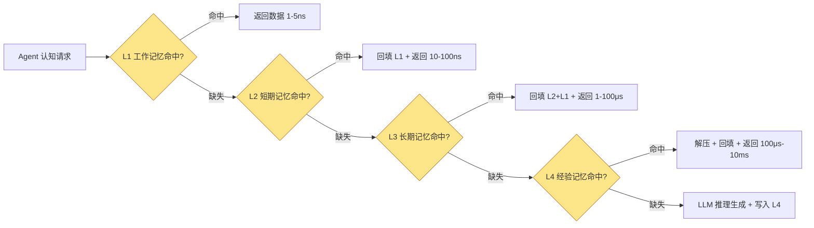
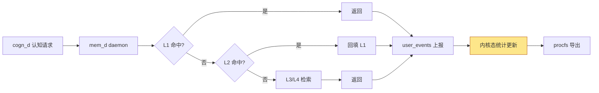

Copyright (c) 2025-2026 SPHARX Ltd. All Rights Reserved.

# agentrt-linux（AirymaxOS）记忆监控
> **文档定位**：agentrt-linux（AirymaxOS）可观测性体系 L10 层——agentrt-linux 专属记忆卷载监控的工程规范\
> **文档版本**：v1.0.1\
> **最后更新**：2026-07-18\
> **上级文档**：[90-observability README](README.md)\
> **同源映射**：agentrt E-2 可观测性 + MemoryRovol L1-L4 记忆层级 + mem_d daemon\
> **理论根基**：Linux 6.6 内核基线 + Airymax 五维正交 24 原则 + C-3 记忆卷载\
> **核心约束**：记忆监控是 agentrt-linux 专属 L10 层可观测性，A-ULS 模块强制监管记忆配额

---

## 目录

- [第 1 章 记忆监控概述](#第-1-章-记忆监控概述)
- [第 2 章 MemoryRovol L1-L4 记忆层级](#第-2-章-memoryrovol-l1-l4-记忆层级)
- [第 3 章 L1 工作记忆监控](#第-3-章-l1-工作记忆监控)
- [第 4 章 L2 短期记忆监控](#第-4-章-l2-短期记忆监控)
- [第 5 章 L3 长期记忆监控](#第-5-章-l3-长期记忆监控)
- [第 6 章 L4 经验记忆监控](#第-6-章-l4-经验记忆监控)
- [第 7 章 /proc/airy/agents/[id]/memory_stats 接口](#第-7-章-procairyagentsidmemory_stats-接口)
- [第 8 章 与 mem_d daemon 的关系](#第-8-章-与-mem_d-daemon-的关系)
- [第 9 章 记忆配额监控](#第-9-章-记忆配额监控)
- [第 10 章 Airymax Unify Design 映射](#第-10-章-airymax-unify-design-映射)
- [第 11 章 相关文档与版本维护](#第-11-章-相关文档与版本维护)

---

## 第 1 章 记忆监控概述

### 1.1 定位

记忆监控是 agentrt-linux 专属的可观测性 L10 层，专门监控智能体操作系统中每个 Agent 的 MemoryRovol 四层记忆层级的运行状态与性能指标。与传统 Linux 内核监控物理内存/swap 不同，记忆监控聚焦于智能体特有的语义层级：L1 工作记忆、L2 短期记忆、L3 长期记忆、L4 经验记忆。agentrt-linux 将记忆监控作为可观测性体系的底层语义层，原因有三：

1. **认知性能基础**：Agent 的认知循环性能直接取决于记忆访问效率。L1 工作记忆命中率低会导致频繁的 L2/L3 回填，认知延迟增加 10-100 倍。记忆监控是认知性能归因的基础。
2. **资源配额约束**：记忆层级占用物理内存与磁盘空间，无约束的记忆增长会导致系统 OOM 或磁盘耗尽。记忆配额监控是 A-ULS 模块 macro_d 执行记忆监管的数据基础。
3. **C-3 记忆卷载理论落地**：MemoryRovol L1-L4 四层模型是 Airymax C-3 记忆卷载理论的核心，记忆监控是该理论在可观测性侧的镜像，验证四层模型的实际运行效果。

**OS-OBS-091: 记忆监控是 agentrt-linux 可观测性 L10 层的强制基线，所有 Agent 必须接受 L1-L4 记忆层级监控，不得存在"匿名记忆访问"路径。**

**OS-KER-181: kernel 的 defconfig 必须开启 CONFIG_AIRY_MEMORY_MONITOR；agentrt.ko 必须在 module_init 阶段注册记忆监控数据结构。**

### 1.2 框架组成

| 组件 | 实现位置 | 职责 |
|------|----------|------|
| 记忆监控核心 | `kernel/agentrt/airy_mem_monitor.c` | per-Agent 记忆统计 |
| mem_d daemon | `daemons/mem_d/mem_daemon.c` | 记忆卷载管理与上报 |
| procfs 接口 | `kernel/agentrt/airy_mem_procfs.c` | `/proc/airy/agents/[id]/memory_stats` |
| user_events | `daemons/cogn_d/user_events.c` | `memory_access` 事件上报 |
| A-ULS 监管 | `daemons/macro_d/mem_superv.c` | 记忆配额监管 |
| 持久化 | `daemons/logger_d/mem_persister.c` | 历史趋势落盘 |

**OS-STD-081: 记忆监控的核心数据结构必须在内核态维护，避免用户态伪造；mem_d daemon 仅负责 L3/L4 的持久化管理，不负责 L1/L2 的统计。**

### 1.3 记忆监控与其他可观测性层的关系

记忆监控（L10）与 Agent 行为追踪（L9）紧密协同：

- L9 记录"何时访问记忆"（`airy_memory_access` 事件）
- L10 提供"记忆访问的效率如何"（命中率、延迟、容量）

二者结合，可完整回答"Agent 的记忆访问是否高效"这一关键问题。

---

## 第 2 章 MemoryRovol L1-L4 记忆层级

### 2.1 四层记忆模型

MemoryRovol 是 agentrt-linux 的记忆卷载理论，定义四层记忆层级：

| 层级 | 名称 | 存储介质 | 容量 | 延迟 | 用途 |
|------|------|---------|------|------|------|
| L1 | 工作记忆 | CPU L1/L2 cache | KB 级 | 1-5ns | 当前认知循环的活跃数据 |
| L2 | 短期记忆 | LLC + 主存 | MB 级 | 10-100ns | 近期会话上下文 |
| L3 | 长期记忆 | 主存 + NVMe | GB 级 | 1-100μs | 持久化知识库 |
| L4 | 经验记忆 | NVMe + 压缩 | GB-TB 级 | 100μs-10ms | 压缩的经验模式 |

### 2.2 记忆层级数据流



### 2.3 记忆层级与物理内存的关系

agentrt-linux 的记忆层级基于 `alloc_pages + mmap` 实现，不使用 DMA 一致性内存：

| 层级 | 物理内存来源 | 映射方式 | 生命周期 |
|------|------------|---------|---------|
| L1 | CPU cache（自动） | 无需显式映射 | 由 CPU 硬件管理 |
| L2 | `alloc_pages(order=0)` 单页 | `vm_map_pages` 内核虚拟映射 | Agent 会话期间 |
| L3 | `alloc_pages(order=4-9)` 大页 | `remap_pfn_range` 用户态映射 | Agent 持久化期间 |
| L4 | NVMe 磁盘 + 按需加载 | `remap_pfn_range` 按需映射 | 系统全生命周期 |

**OS-KER-182: mem_d daemon 必须使用 `alloc_pages + remap_pfn_range` 实现 L2/L3 记忆映射；不得使用 `dma_alloc_coherent`，避免引入硬件一致性依赖。**

---

## 第 3 章 L1 工作记忆监控

### 3.1 L1 监控指标

L1 工作记忆是 Agent 当前认知循环的活跃数据，存储于 CPU L1/L2 cache。监控指标：

| 指标 | 含义 | 健康基线 |
|------|------|---------|
| `hit_rate` | L1 命中率 | ≥ 90% |
| `access_latency_ns` | 平均访问延迟 | ≤ 5ns |
| `p99_latency_ns` | P99 访问延迟 | ≤ 10ns |
| `working_set_size` | 工作集大小 | ≤ 32KB（L1 cache 大小） |
| `eviction_count` | 驱逐计数 | 低 |

### 3.2 L1 监控数据结构

```c
/* include/linux/agentrt/airy_mem.h */

struct airy_l1_stats {
    u64 access_total;          /* 总访问次数 */
    u64 hit_count;             /* 命中次数 */
    u32 hit_rate_ppm;          /* 命中率（ppm） */
    u64 access_latency_sum_ns; /* 累计延迟 */
    u32 avg_latency_ns;        /* 平均延迟 */
    u32 p99_latency_ns;        /* P99 延迟 */
    u32 working_set_kb;        /* 工作集大小 */
    u64 eviction_count;        /* 驱逐计数 */
};

struct airy_agent_memory {
    struct airy_l1_stats l1;
    struct airy_l2_stats l2;
    struct airy_l3_stats l3;
    struct airy_l4_stats l4;
    spinlock_t lock;
};
```

### 3.3 L1 监控实现

L1 工作记忆的命中率通过 `perf mem` 与 PMU 计数器间接测量：

```bash
# 测量 Agent 42 的 L1 命中率
perf stat -e L1-dcache-loads,L1-dcache-load-misses \
    -p $(pgrep -f "agent_42") -- sleep 10
# 输出：
#   1,234,567,890  L1-dcache-loads
#       12,345,678  L1-dcache-load-misses
#  # 99.0% L1 hit rate
```

agentrt-linux 在内核态通过 PMU 中断采样 L1 访问模式：

```c
/* kernel/agentrt/airy_mem_monitor.c */
void airy_mem_l1_on_access(u32 agent_id, u8 hit, u32 latency_ns)
{
    struct airy_agent_memory *mem = airy_mem_get(agent_id);
    unsigned long flags;

    spin_lock_irqsave(&mem->lock, flags);
    mem->l1.access_total++;
    if (hit) {
        mem->l1.hit_count++;
    }
    mem->l1.access_latency_sum_ns += latency_ns;
    mem->l1.avg_latency_ns = mem->l1.access_latency_sum_ns / mem->l1.access_total;
    if (latency_ns > mem->l1.p99_latency_ns) {
        mem->l1.p99_latency_ns = latency_ns;
    }
    mem->l1.hit_rate_ppm =
        div_u64(mem->l1.hit_count * 1000000ULL, mem->l1.access_total);
    spin_unlock_irqrestore(&mem->lock, flags);
}
```

### 3.4 L1 健康基线

| 指标 | 优秀 | 良好 | 警告 | 危险 |
|------|------|------|------|------|
| hit_rate | ≥ 95% | ≥ 90% | ≥ 80% | < 80% |
| avg_latency | ≤ 3ns | ≤ 5ns | ≤ 10ns | > 10ns |
| p99_latency | ≤ 8ns | ≤ 10ns | ≤ 20ns | > 20ns |

**OS-OBS-092: L1 工作记忆命中率连续 1 分钟低于 80% 视为工作集过大，需触发 cogn_d 优化工作集或扩大 L1 配额。**

---

## 第 4 章 L2 短期记忆监控

### 4.1 L2 监控指标

L2 短期记忆存储近期会话上下文，位于 LLC + 主存。监控指标：

| 指标 | 含义 | 健康基线 |
|------|------|---------|
| `capacity_kb` | 当前容量 | ≤ 4MB |
| `max_capacity_kb` | 最大容量配额 | 由 A-ULS 配置 |
| `eviction_rate` | 淘汰率 | ≤ 10% |
| `hit_rate` | L2 命中率 | ≥ 70% |
| `access_latency_ns` | 平均访问延迟 | ≤ 100ns |
| `fill_latency_ns` | L3→L2 回填延迟 | ≤ 10μs |

### 4.2 L2 监控数据结构

```c
struct airy_l2_stats {
    u64 capacity_kb;            /* 当前容量 */
    u64 max_capacity_kb;        /* 最大容量配额 */
    u64 access_total;
    u64 hit_count;
    u32 hit_rate_ppm;
    u64 eviction_total;         /* 总淘汰次数 */
    u32 eviction_rate_ppm;      /* 淘汰率 */
    u32 avg_access_latency_ns;
    u32 avg_fill_latency_ns;    /* L3→L2 回填延迟 */
    u64 pages_allocated;        /* 已分配页数 */
    u64 pages_freed;            /* 已释放页数 */
};
```

### 4.3 L2 容量与淘汰率

L2 短期记忆采用 LRU（最近最少使用）淘汰策略：

```bash
$ cat /proc/airy/agents/42/memory_stats | grep -A 10 "L2 short-term"
=== L2 short-term memory ===
capacity_kb: 2048               # 当前 2MB
max_capacity_kb: 4096           # 配额 4MB
access_total: 1234567
hit_count: 987654
hit_rate: 80.0%                 # 800000 ppm
eviction_total: 12345
eviction_rate: 1.0%             # 10000 ppm
avg_access_latency_ns: 45
avg_fill_latency_ns: 2345
pages_allocated: 512
pages_freed: 256
```

### 4.4 L2 健康基线

| 指标 | 优秀 | 良好 | 警告 | 危险 |
|------|------|------|------|------|
| hit_rate | ≥ 85% | ≥ 70% | ≥ 50% | < 50% |
| eviction_rate | ≤ 1% | ≤ 5% | ≤ 10% | > 10% |
| avg_access_latency | ≤ 50ns | ≤ 100ns | ≤ 200ns | > 200ns |

**OS-OBS-093: L2 短期记忆淘汰率连续 5 分钟超过 10% 视为容量不足，需触发 mem_d 扩容或 cogn_d 优化上下文窗口。**

---

## 第 5 章 L3 长期记忆监控

### 5.1 L3 监控指标

L3 长期记忆存储持久化知识库，位于主存 + NVMe。监控指标：

| 指标 | 含义 | 健康基线 |
|------|------|---------|
| `persistent_size_mb` | 持久化大小 | ≤ 配额 |
| `retrieval_latency_ns` | 检索延迟 | ≤ 100μs |
| `p99_retrieval_latency_ns` | P99 检索延迟 | ≤ 1ms |
| `index_size_mb` | 索引大小 | ≤ 数据量 20% |
| `write_rate` | 写入速率 | 由 A-ULS 配置 |
| `compaction_count` | 压缩次数 | 低 |

### 5.2 L3 监控数据结构

```c
struct airy_l3_stats {
    u64 persistent_size_mb;       /* 持久化大小 */
    u64 max_size_mb;              /* 配额 */
    u64 retrieval_total;
    u64 retrieval_hit_count;
    u32 hit_rate_ppm;
    u64 retrieval_latency_sum_ns;
    u32 avg_retrieval_latency_ns;
    u32 p99_retrieval_latency_ns;
    u64 index_size_mb;            /* 索引大小 */
    u64 write_count;              /* 写入次数 */
    u64 write_rate;               /* 写入速率 */
    u32 compaction_count;         /* 压缩次数 */
    u64 nvme_bytes_written;       /* NVMe 写入量 */
    u64 nvme_bytes_read;          /* NVMe 读取量 */
};
```

### 5.3 L3 检索延迟分析

L3 长期记忆的检索延迟是 Agent 认知性能的关键瓶颈：

```bash
$ cat /proc/airy/agents/42/memory_stats | grep -A 15 "L3 long-term"
=== L3 long-term memory ===
persistent_size_mb: 512           # 512MB 持久化
max_size_mb: 2048                 # 配额 2GB
retrieval_total: 123456
retrieval_hit_count: 111111
hit_rate: 90.0%
avg_retrieval_latency_ns: 45000   # 45μs
p99_retrieval_latency_ns: 234000  # 234μs
index_size_mb: 64                 # 64MB 索引
write_count: 1234
write_rate: 12.3 writes/s
compaction_count: 5
nvme_bytes_written: 536870912     # 512MB
nvme_bytes_read: 1073741824       # 1GB
```

### 5.4 L3 健康基线

| 指标 | 优秀 | 良好 | 警告 | 危险 |
|------|------|------|------|------|
| hit_rate | ≥ 95% | ≥ 90% | ≥ 80% | < 80% |
| avg_retrieval_latency | ≤ 50μs | ≤ 100μs | ≤ 500μs | > 500μs |
| p99_retrieval_latency | ≤ 200μs | ≤ 1ms | ≤ 5ms | > 5ms |

**OS-OBS-094: L3 长期记忆 P99 检索延迟必须 ≤ 1ms；超限需审查索引结构与 NVMe 性能，必要时触发 mem_d 索引重建。**

---

## 第 6 章 L4 经验记忆监控

### 6.1 L4 监控指标

L4 经验记忆存储压缩的经验模式，位于 NVMe + 压缩存储。监控指标：

| 指标 | 含义 | 健康基线 |
|------|------|---------|
| `compressed_size_mb` | 压缩后大小 | ≤ 配额 |
| `raw_size_mb` | 压缩前原始大小 | — |
| `compression_ratio` | 压缩率 | ≥ 5:1 |
| `retrieval_accuracy` | 检索准确率 | ≥ 90% |
| `retrieval_latency_ns` | 检索延迟 | ≤ 10ms |
| `decompression_latency_ns` | 解压延迟 | ≤ 1ms |
| `pattern_count` | 经验模式数 | — |

### 6.2 L4 监控数据结构

```c
struct airy_l4_stats {
    u64 compressed_size_mb;       /* 压缩后大小 */
    u64 raw_size_mb;              /* 压缩前大小 */
    u32 compression_ratio_ppm;    /* 压缩率（ppm） */
    u64 retrieval_total;
    u64 retrieval_hit_count;
    u32 retrieval_accuracy_ppm;   /* 检索准确率 */
    u32 avg_retrieval_latency_ns;
    u32 p99_retrieval_latency_ns;
    u32 avg_decompression_latency_ns;
    u64 pattern_count;            /* 经验模式数 */
    u64 pattern_added_count;      /* 新增模式数 */
    u64 pattern_evicted_count;    /* 淘汰模式数 */
    u8  compression_algorithm;    /* 0=zstd, 1=lz4, 2=none */
};
```

### 6.3 L4 压缩率与准确率

L4 经验记忆的核心权衡是压缩率与检索准确率：

```bash
$ cat /proc/airy/agents/42/memory_stats | grep -A 15 "L4 experience"
=== L4 experience memory ===
compressed_size_mb: 1024          # 1GB 压缩后
raw_size_mb: 8192                 # 8GB 原始
compression_ratio: 8.0            # 8:1 压缩率
compression_algorithm: zstd
retrieval_total: 12345
retrieval_hit_count: 11728
retrieval_accuracy: 95.0%
avg_retrieval_latency_ns: 2340000  # 2.34ms
p99_retrieval_latency_ns: 8900000  # 8.9ms
avg_decompression_latency_ns: 234000  # 234μs
pattern_count: 5678
pattern_added_count: 123
pattern_evicted_count: 45
```

### 6.4 L4 健康基线

| 指标 | 优秀 | 良好 | 警告 | 危险 |
|------|------|------|------|------|
| compression_ratio | ≥ 10:1 | ≥ 5:1 | ≥ 3:1 | < 3:1 |
| retrieval_accuracy | ≥ 95% | ≥ 90% | ≥ 80% | < 80% |
| avg_retrieval_latency | ≤ 2ms | ≤ 5ms | ≤ 10ms | > 10ms |
| p99_retrieval_latency | ≤ 5ms | ≤ 10ms | ≤ 50ms | > 50ms |

**OS-OBS-095: L4 经验记忆检索准确率必须 ≥ 90%；低于 90% 需触发 mem_d 重建经验索引或调整压缩算法。**

**OS-OBS-096: L4 经验记忆 P99 检索延迟必须 ≤ 50ms；超限视为经验库过大，需触发模式淘汰（LRU）或压缩率提升。**

---

## 第 7 章 /proc/airy/agents/[id]/memory_stats 接口

### 7.1 接口定义

记忆监控通过 `/proc/airy/agents/[id]/memory_stats` 文件导出，详细接口规范见 [04-sysfs-procfs.md](04-sysfs-procfs.md) 第 4 章。本文档聚焦于记忆专属字段的语义。

### 7.2 完整输出示例

```bash
$ cat /proc/airy/agents/42/memory_stats
agent_id: 42
report_time_ns: 1784328868912

=== L1 working memory ===
access_total: 1234567890
hit_count: 1222222211
hit_rate: 99.0%
avg_latency_ns: 3
p99_latency_ns: 8
working_set_kb: 28
eviction_count: 1234

=== L2 short-term memory ===
capacity_kb: 2048
max_capacity_kb: 4096
access_total: 1234567
hit_count: 987654
hit_rate: 80.0%
eviction_total: 12345
eviction_rate: 1.0%
avg_access_latency_ns: 45
avg_fill_latency_ns: 2345
pages_allocated: 512
pages_freed: 256

=== L3 long-term memory ===
persistent_size_mb: 512
max_size_mb: 2048
retrieval_total: 123456
retrieval_hit_count: 111111
hit_rate: 90.0%
avg_retrieval_latency_ns: 45000
p99_retrieval_latency_ns: 234000
index_size_mb: 64
write_count: 1234
write_rate: 12.3 writes/s
compaction_count: 5
nvme_bytes_written: 536870912
nvme_bytes_read: 1073741824

=== L4 experience memory ===
compressed_size_mb: 1024
raw_size_mb: 8192
compression_ratio: 8.0
compression_algorithm: zstd
retrieval_total: 12345
retrieval_hit_count: 11728
retrieval_accuracy: 95.0%
avg_retrieval_latency_ns: 2340000
p99_retrieval_latency_ns: 8900000
avg_decompression_latency_ns: 234000
pattern_count: 5678
pattern_added_count: 123
pattern_evicted_count: 45

=== 配额汇总 ===
total_memory_used_mb: 3586       # L2+L3+L4
total_memory_quota_mb: 8192
memory_usage_ratio: 43.8%
alert_state: NORMAL

=== 历史快照（最近 5 个，每 5 分钟） ===
[1784328568912] used=3500MB ratio=42.7% L1_hit=99.1% L4_acc=95.2%
[1784328628912] used=3550MB ratio=43.3% L1_hit=99.0% L4_acc=95.1%
[1784328688912] used=3560MB ratio=43.5% L1_hit=99.0% L4_acc=95.0%
[1784328748912] used=3570MB ratio=43.6% L1_hit=99.0% L4_acc=95.0%
[1784328808912] used=3586MB ratio=43.8% L1_hit=99.0% L4_acc=95.0%
```

### 7.3 procfs 实现规范

```c
/* kernel/agentrt/airy_mem_procfs.c */
static int memory_stats_show(struct seq_file *m, void *v)
{
    struct airy_agent_memory *mem = m->private;
    unsigned long flags;

    spin_lock_irqsave(&mem->lock, flags);

    seq_printf(m, "agent_id: %u\n", mem->agent_id);
    seq_printf(m, "report_time_ns: %llu\n", airy_get_monotonic_ns());

    seq_printf(m, "\n=== L1 working memory ===\n");
    seq_printf(m, "access_total: %llu\n", mem->l1.access_total);
    seq_printf(m, "hit_count: %llu\n", mem->l1.hit_count);
    seq_printf(m, "hit_rate: %u.%02u%%\n",
               mem->l1.hit_rate_ppm / 10000,
               (mem->l1.hit_rate_ppm % 10000) / 100);
    seq_printf(m, "avg_latency_ns: %u\n", mem->l1.avg_latency_ns);
    seq_printf(m, "p99_latency_ns: %u\n", mem->l1.p99_latency_ns);
    /* ... L2/L3/L4 字段 ... */

    spin_unlock_irqrestore(&mem->lock, flags);
    return 0;
}
```

**OS-STD-082: `/proc/airy/agents/[id]/memory_stats` 的 `show()` 回调必须在自旋锁保护下读取，避免读取到中间状态。**

---

## 第 8 章 与 mem_d daemon 的关系

### 8.1 mem_d 职责

mem_d daemon 是 agentrt-linux 的记忆卷载守护进程，负责：

1. **L2 短期记忆管理**：分配/释放 L2 页面，执行 LRU 淘汰。
2. **L3 长期记忆管理**：持久化至 NVMe，维护索引，执行压缩。
3. **L4 经验记忆管理**：压缩/解压经验模式，维护模式库。
4. **记忆配额执行**：执行 A-ULS macro_d 下发的配额决策。

### 8.2 mem_d 与记忆监控的交互



### 8.3 mem_d 上报机制

mem_d 通过 user_events 上报记忆访问事件：

```c
/* mem_d daemon 上报 L2 访问 */
void mem_d_on_l2_access(u32 agent_id, u8 hit, u32 latency_ns)
{
    struct airy_user_memory_access ev = {
        .agent_id = agent_id,
        .level = 2,            /* L2 */
        .hit = hit,
        .latency_ns = latency_ns,
    };
    airy_user_event_write(&memory_access_ev, &ev, sizeof(ev));

    /* 同时更新内核态统计（通过 ioctl） */
    struct airy_mem_delta delta = {
        .agent_id = agent_id,
        .level = 2,
        .hit = hit,
        .latency_ns = latency_ns,
    };
    ioctl(mem_fd, AIRY_MEM_IOCTL_REPORT, &delta);
}
```

### 8.4 mem_d 与sched_tac

mem_d 的 L2/L3 记忆操作可能阻塞，影响 SCHED_DEADLINE Agent 的实时性：

| 操作 | 阻塞时间 | 对调度类的影响 |
|------|---------|--------------|
| L2 页面分配 | ≤ 10μs | 不影响 SCHED_DEADLINE |
| L3 检索 | ≤ 100μs | 可能影响 SCHED_DEADLINE，需预取 |
| L3 持久化 | ≤ 10ms | 必须异步，不得阻塞 SCHED_DEADLINE |
| L4 解压 | ≤ 1ms | 必须异步，不得阻塞 SCHED_DEADLINE |

**OS-OBS-097: SCHED_DEADLINE Agent 的 L3/L4 访问必须通过预取机制异步完成；同步访问导致 deadline miss 视为sched_tac 失效。**

---

## 第 9 章 记忆配额监控

### 9.1 A-ULS 模块监管

A-ULS 模块 macro_d daemon 负责记忆配额监管。监管策略分三层：

| 层级 | 触发条件 | 执法动作 | 影响 |
|------|---------|---------|------|
| L1 告警 | memory_usage > 80% | 通知 mem_d 启动 LRU 淘汰 | 无 |
| L2 降级 | memory_usage > 95% | SCHED_DEADLINE → SCHED_FIFO | 调度类降级 |
| L3 终止 | memory_usage > 100% | 终止 Agent | Agent 退出 |

### 9.2 配额配置

每个 Agent 的记忆配额通过 A-UCS config_d 配置：

```json
{
  "agent_id": 42,
  "memory_quota": {
    "l2_max_kb": 4096,
    "l3_max_mb": 2048,
    "l4_max_mb": 10240,
    "total_max_mb": 8192,
    "alert_threshold": 0.8,
    "downgrade_threshold": 0.95,
    "terminate_threshold": 1.0
  }
}
```

### 9.3 配额检查流程

```c
/* kernel/agentrt/airy_mem_monitor.c */
static void airy_mem_check_quota(struct airy_agent_memory *mem)
{
    u64 total_used = mem->l2.capacity_kb / 1024 +
                     mem->l3.persistent_size_mb +
                     mem->l4.compressed_size_mb;
    u32 ratio_ppm = div_u64(total_used * 1000000ULL, mem->quota.total_max_mb);

    if (ratio_ppm >= 1000000) {
        /* 100% 溢出，触发终止 */
        airy_superv_notify(SUPERV_ACTION_TERMINATE,
                          mem->agent_id,
                          SUPERV_REASON_MEMORY_QUOTA_EXCEEDED);
    } else if (ratio_ppm >= 950000) {
        /* 95% 临界，触发降级 */
        airy_superv_notify(SUPERV_ACTION_DOWNGRADE,
                          mem->agent_id,
                          SUPERV_REASON_MEMORY_QUOTA_CRITICAL);
    } else if (ratio_ppm >= 800000) {
        /* 80% 告警，通知 mem_d 淘汰 */
        airy_superv_notify(SUPERV_ACTION_ALERT,
                          mem->agent_id,
                          SUPERV_REASON_MEMORY_QUOTA_WARNING);
    }
}
```

### 9.4 配额告警历史

```bash
$ grep "MEMORY_QUOTA" /var/log/airy/agentrt.log | tail -5
[2026-07-18 10:23:45] WARNING agent=42 usage=80.12% action=LRU_EVICT
[2026-07-18 10:24:12] ALERT    agent=42 usage=95.34% action=DOWNGRADE DL→RT
[2026-07-18 10:25:01] CRITICAL agent=42 usage=100.00% action=TERMINATE
```

**OS-OBS-098: 记忆配额告警必须通过 A-ULP Ring Buffer 持久化，保留至少 90 天；告警记录是合规审计的关键证据。**

---

## 第 10 章 Airymax Unify Design 映射

### 10.1 五模块关系

| Unify 模块 | 关系 | 在记忆监控中的体现 |
|-----------|------|------------------|
| **A-UEF** | 辅助 | 记忆配额溢出触发 `AIRY_FAULT_MEMORY_QUOTA_EXCEEDED` 错误码 |
| **A-ULP** | **核心** | 记忆访问历史趋势通过 A-ULP Ring Buffer 持久化 |
| **A-UCS** | 辅助 | 记忆配额配置通过 A-UCS config_d 热重载 |
| **A-ULS** | **核心** | macro_d 强制监管记忆配额，执行降级/终止 |
| **A-IPC** | 辅助 | mem_d 通过 A-IPC IPC 与 cogn_d 交互记忆数据 |

### 10.2 与 12 daemon 的记忆监控映射

| Daemon | 记忆监控角色 |
|--------|------------|
| mem_d | **执行者**：L2/L3/L4 记忆管理与配额执行 |
| cogn_d | **上报者**：记忆访问事件上报 |
| macro_d | **监管者**：配额溢出告警与执法 |
| logger_d | **持久化者**：历史趋势落盘 |
| config_d | **配置者**：配额阈值热重载 |
| sched_d | **响应者**：降级时切换调度类 |
| 其他 6 个 daemon | 不直接参与记忆监控 |

---

## 第 11 章 相关文档与版本维护

### 11.1 相关文档

- [90-observability README](README.md)：可观测性体系主索引
- [03-perf-analysis.md](03-perf-analysis.md)：perf 性能分析（PMU 计数器测量 L1 命中率）
- [04-sysfs-procfs.md](04-sysfs-procfs.md)：sysfs/procfs 接口（memory_stats 文件）
- [06-user-events.md](06-user-events.md)：user_events 接口（memory_access 事件）
- [07-token-efficiency.md](07-token-efficiency.md)：Token 效率监控（认知循环与记忆访问协同）
- [08-agent-tracing.md](08-agent-tracing.md)：Agent 行为追踪（记忆访问作为追踪维度）
- [../20-modules/](../20-modules/README.md)：模块设计（mem_d / macro_d）

### 11.2 参考材料

- Airymax C-3 记忆卷载理论（MemoryRovol L1-L4 模型）
- Linux 6.6 `Documentation/mm/`（内存管理文档）
- Linux 6.6 `mm/`（内存管理实现）
- Linux 6.6 `arch/arm64/mm/`（ARM64 内存管理）
- Intel Xeon Scalable Memory Hierarchy（CPU cache 层级参考）

### 11.3 版本历史

| 版本 | 日期 | 变更 |
|------|------|------|
| v1.0.1 | 2026-07-18 | 初始版本：MemoryRovol L1-L4 记忆层级监控、L1 工作记忆（命中率/延迟）、L2 短期记忆（容量/淘汰率）、L3 长期记忆（持久化/检索延迟）、L4 经验记忆（压缩率/检索准确率）、/proc/airy/agents/[id]/memory_stats 接口、mem_d daemon 协同、A-ULS 配额监管 |

---

> **文档结束** | agentrt-linux 记忆监控 v1.0.1 | 维护者：开源极境工程与规范委员会 | "Memory is the treasury and guardian of all things."
